# P10：Sofia Heisler   No More Sad Pandas Optimizing Pandas Code for Speed and Efficien - 哒哒哒儿尔 - BV1Ms411H7jG

 \>\> Good afternoon everybody。

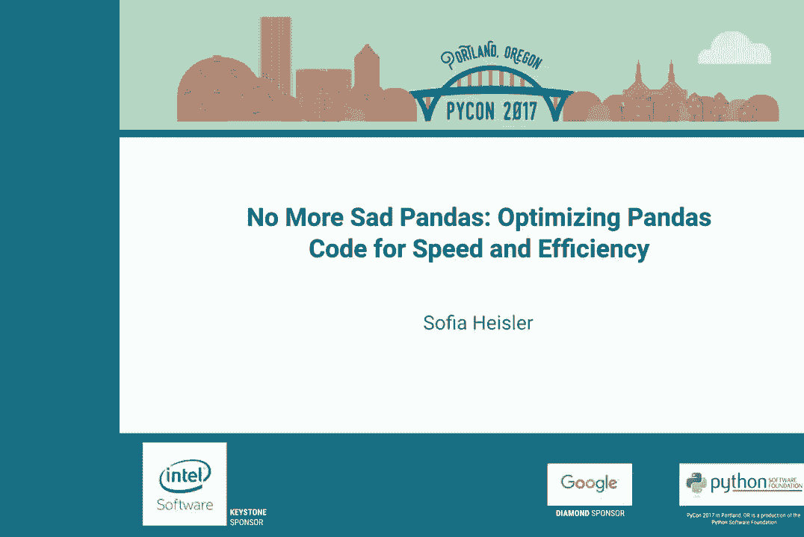

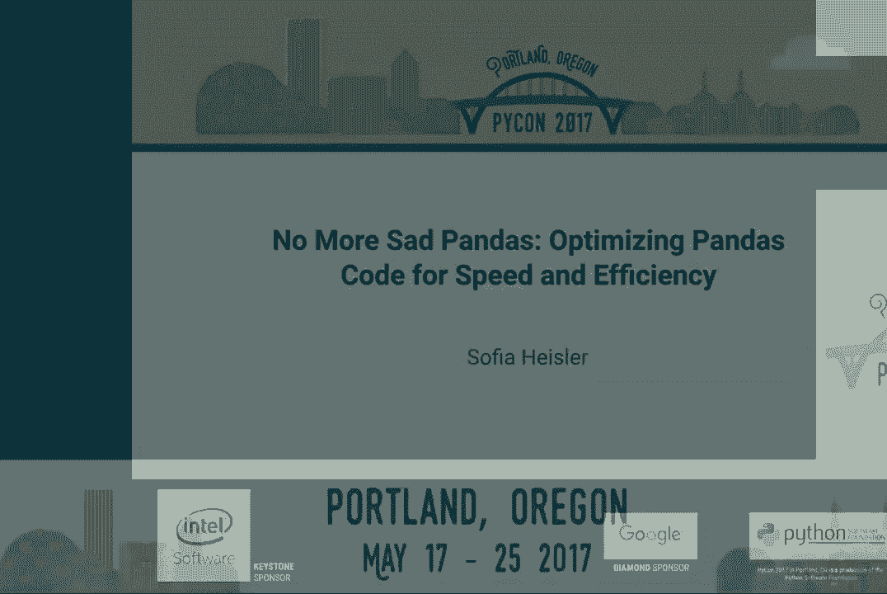

 Welcome to this afternoon session of PyCon 2017。 Please be seated。 This ride will begin momentarily。

 Thank you。 So first things first， if anyone has any noise making， devices。

 please make sure they do not make noise。 When they make noise everyone stares at you。

 With that said， I would like to introduce our next speaker。

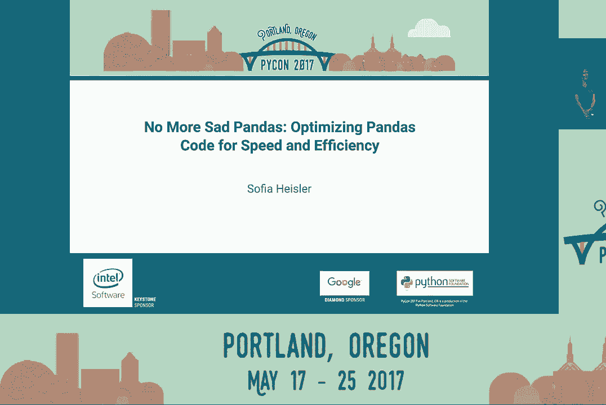

 Thank you。 \>\> Thank you everybody and welcome。 My name is Sophia Heisler。

 I am the lead data scientist at a startup called， Upside。

 Today we will be talking about optimizing pandas code for， speed and performance。

 All of the code that i will be talking about is going to be。

 up on the slides and I have done my best to make sure it is， visible to everybody。

 If you want to download the slides， please go to the。

 link and grab the slide deck as well as the jupiter notebook。

 that runs all of the code and the inputs we will be talking， about。

 \>\> I have put this link on the bottom right-hand corner， over here。

 If during the presentation you say you really want to download， it because it is gotten small。

 You can't see anything。 Please go ahead。 First off， how many people here use pandas？

 Almost everybody。 Awesome。 For those of you who are less familiar with the library。

 pandas is an open source library that offers data structure。

 support and a fantastic set of tools for data analysis。 In particular。

 pandas is great for the analysis of tabular data。 In other words。

 data that is arranged in rows and columns。 Pandas provides a lot of the functionality that until a few。

 years ago was only available in more statistics oriented tools。

 like R or stato or SAS or MATLAB for example。 A lot of these tools。

 pandas is now able to use the same， function， provide the same functionality within Python。

 As a result， pandas is used in just about everything from。

 simple data manipulation to pretty complex machine learning。 So why do I care to optimize my code？

 Well， that actually kind of depends on your use case and。

 maybe if you're doing data science where your run times don't， matter and your data isn't huge。

 Maybe it doesn't actually matter all that much whether your code is。

 running in a few minutes or a few seconds， whatever。 You'll go get a cup of coffee， come back。

 and it's going to be， done。 But the bottom line is that pandas is capable of providing a lot。

 of efficiency because it's built on top of numpy and it has a。

 lot of procedures built into it that are optimized in Python。

 Which means that it can be very fast when it's used correctly。

 And those optimizations that you can put into it can make the。

 difference between your code running in minutes or your code， running in literally milliseconds。

 So before we start talking about how we would actually optimize， our code。

 let's talk about how do I know whether my code is。

 slow and how do I know whether I'm making it faster。 In other words。

 we're going to talk a little bit about how you， would do benchmarking。 So to start。

 we're going to be looking at a bunch of examples， that are based on a data set that I pulled down off of Expedia's。

 developer website。 And it pretty much just contains all of the hotels in New York。

 state that are sold by Expedia。 There's about 1600 of them。

 Turns out there's a lot of hotels in New York state。

 And our data set is going to contain some information with one， hotel per row， an ID for each hotel。

 a name， an address， a， latitude and longitude， and some information about the hotel such。

 as the star rating and some high rates and low rates that are， calculated by Expedia。 And to start。

 we're just going to grab a function that we can， benchmark from。

 This is an example of a normalization function。 It's pretty straightforward。

 What it's actually doing is not actually all of that relevant。

 for our purposes other than it's taking some means and some， standard deviations。

 cutting off outliers and taking a log to， normalize。

 What we care about is how do we actually figure out how to time。

 this function and which parts of it are slower or faster than， others。

 So we're going to do that with something called magic commands。

 So how many of you guys have used magic commands in Jupyter？ Great。 So a lot。

 So magic commands are available through Jupyter notebooks to。

 provide additional functionality on top of Python code that may。

 running that code or doing other things with that code extra， awesome and useful。

 Magic commands you'll see start with a percentage sign。

 The single percent sign is just code that's executed on one line。

 or double percentage that's executed on an entire cell。

 And the first function that we're going to talk about is the， time it command。

 So a time it command just reruns a function over and over and。

 over again and it shows the average and the standard deviation， of the runtime that it obtained。

 As a result， what the time that it calculates can serve as a。

 benchmark for a bunch of further optimizations。 So let's look at an example。

 So here we've done a time it of our normalized function。

 I've fed my normalized function the data frame that I created， my set of hotels。

 And I've told it to use the series high rate in order to， actually apply this function。

 And I've assigned the results to a new series within the data frame。

 I've run the time it and it's letting me know that the function， on average took 2。

84 milliseconds and it ran at seven， runs of 100 loops each。

 So now that provides a baseline from which I can go to figure out。

 how to make this function run faster or slower and figure out。

 whether I'm actually succeeding at what I'm doing。

 So the next thing I'm going to do is I'm going to feed it through。

 an extension called line profiler which gets abbreviated， as percent LP run as a magic function。

 And the line profiler will run through run my function line by line。

 and give me a bunch of useful statistics about what it's doing。

 And in particular it's going to tell me in that second column my。

 hits is going to tell me how many times my function has been， actually。

 each line in my function has been rerun。 So if I'm running the function on a bunch of loops I'll see a。

 number greater than one here。 And in the next to the last column it's going to tell me what。

 percentage of the time each line actually took。 So over here for example if you look。

 let me see I don't have， my pointer here， but if you look about four lines up from the。

 bottom you'll see that my line 11 and 12 actually took， well。

 close to 80% of the time that this function was running for。

 which means that if I were going in and trying to optimize this。

 function I would certainly look at those two lines and try to。

 start there because I would get the biggest bang for my buck， trying to optimize those two。

 So now that we sort of get the sense of how we're going to go。

 about trying to benchmark our functionality， let's talk about。

 some of the slower methodologies that I've seen used in pandas。

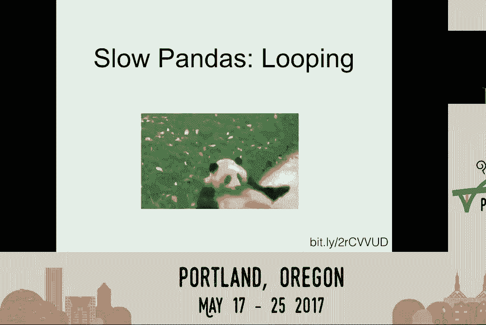

 So we're going to start with a different practice function。

 This is the haversign or great circle distance function。

 All this is basically doing is taking in two sets of coordinates。

 and is calculating a straight line distance between them taking， in the curvature of the earth。

 Again， the details of the implementation aren't actually， all that important for our purposes。

 Other than to know that it's doing some addition， some subtraction。

 and it's doing a bunch of signs and cosines and other trig to， actually calculate the distances。

 And it's returning the actual number of miles between two， coordinates。

 So one thing that I see people do a lot actually as they start。

 out in pandas is start iterating through all of the rows to apply， a function。

 Which kind of makes sense， right， because you're working with a。

 data frame that has a bunch of rows and a bunch of columns and。

 why can't I just loop through all of my rows just the same way。

 that I would loop through a list and actually figure out and。

 actually apply the function to each item on that list。

 The thing is that pandas is actually built on NumPy which is。

 designed for vector manipulation which means that loops are， inherently inefficient。

 That being said， pandas will give you methods to loop through。

 row by row if that's something you really want to do。 So for example。

 it will provide you with an iterose method or， iter tuples method which will give you essentially a set of。

 things to loop through but it will be quite slow。 So over here I've basically created a new dictionary to fill。

 a new dictionary to feed our mileage into and I'm running， through my rows within data frame。

 iterose command and I'm just， feeding it a set of coordinates and I'm running it。

 calculating the distance between a particular set of coordinates。

 and every single hotel in my data set。 If you're curious that particular set of coordinates happens to。

 be the Brooklyn super hero supply in New York， it's a fantastic place you should go there。

 So now at this point we know that our function with iterose has， taken 184 milliseconds。

 We don't actually know whether that's slow or fast at this point。

 but all we know is that it took less than a second。 I guess that's good。

 But we can try a different looping method。 A nicer way to have done this would have been to use apply which。

 applies a function along a specified axis which is to say。

 a set of rows or a set of columns and is a lot more efficient， than iterose。

 It's much more optimized even though it's still looping through， over and over again。

 Apply is best used only when there is no good way to actually， vectorize your function。

 So let's try looking at that。 So over here I'm essentially having the function do the same。

 saying it's applying the function to each individual row and it's。

 comparing the distance from that hotel to a particular set of。

 coordinates and it's running it through a row by row。 But just by swapping out apply for iterose。

 I've gotten my run time， down to 78 milliseconds。 And by comparison to the 184 milliseconds that we saw before。

 that's a two and a half times improvement for basically changing， nothing about my function。

 just changing the function that runs it。 And now if we look at the actual line profiler we can see what it's。

 doing。 Well apply is doing a lot of repetitive steps where you see。

 that hundred one thousand six hundred and thirty one hits。

 That's the apply function hitting the each individual row and doing。

 the same set of things over and over and over again。

 And if we could just get rid of that repetition we could make it。

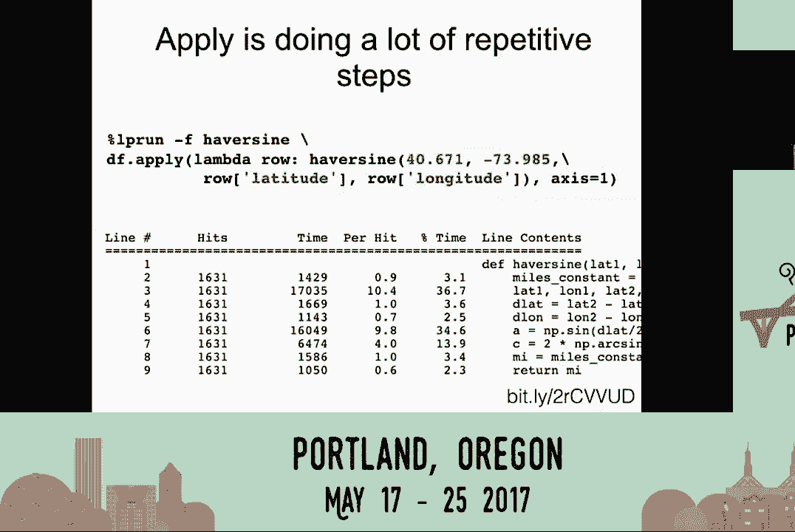

 run a lot faster。 And that's what vectorization actually does for our functions。

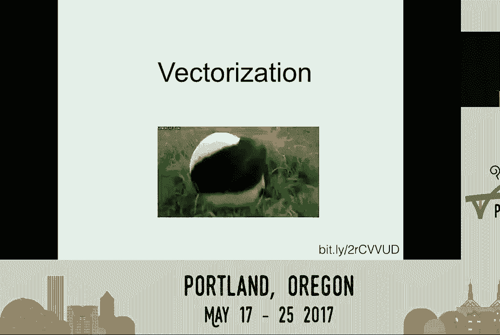

 So what is vectorization？ Well before we start talking about that let's take a step back and just。

 talk about what it is that makes pandas so great。 The basic unit of pandas is an array。

 So there's two sort of basic objects in pandas。 One is a series which is a one dimensional array with access labels。

 So a series would be a column with some labels on it for example。

 Or a data frame which is a two dimensional array with labeled axes。

 In other words that would be a table with column labels and row labels。

 And vectorization is the process of performing operations on arrays instead of scalars。

 In other words my vectorized operations are going to take my entire series and。

 operation on the entire thing simultaneously instead of running through it one single item at a time。

 Why would I want to do that？ Well many pandas functions are actually built to operate that way。

 They're built to operate directly on arrays。 So the built in pandas some functions。

 the string processing， they're all vectorized functions。

 And they are inherently because of the inherent pandas structure much faster than regular looping。

 operations or trying to operate on one piece of the data frame at a time。

 So let's look at how we would vectorize this function。 We actually don't need to do much。

 All we've done is we've said we're going to grab our have or sign function。

 We're still using the same set of coordinates。 But now instead of looping and applying the function on one row at a time。

 we're going to feed it the entire vector latitude and longitude that we've grabbed from the data frame。

 So at this point my DF latitude and DF longitude are individual arrays。

 They're the contents of both of those columns whole。 And this brings our time down to actually 1。

8 milliseconds。 So if you recall in our previous looping runs we got it down to something like 73 or something like that。

 Now we are down to a tiny fraction of that。 And in fact if we look at time it。

 well the function is no longer looping。 It's doing exactly one hit to every single line that we're in the function。

 And that's what allows that huge increase in efficiency。

 And so now just to summarize with iteros we were starting out at 184 milliseconds。

 With a vectorized implementation of the exact same function， we're down to 1。8 milliseconds。

 which is a 43 times improvement over even looping with a ply。

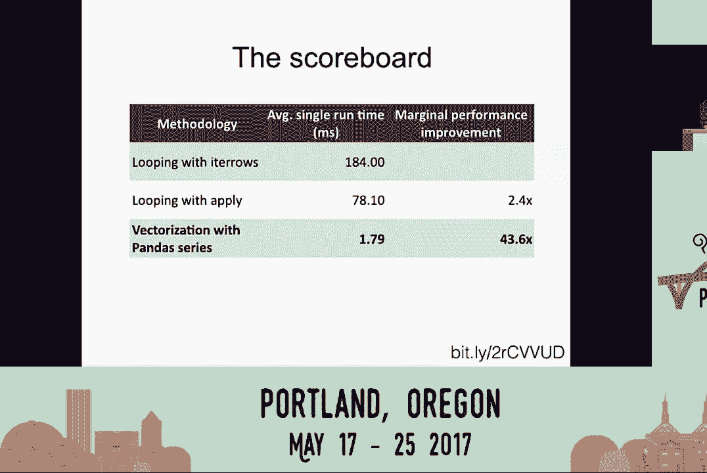

 So that's already pretty great， but could we make it even better？

 Well the answer is actually yeah we can。

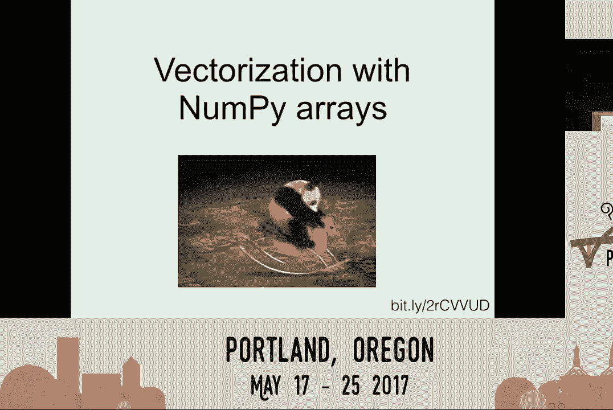

 And we can do that by vectorizing with NumPy arrays instead of series。 So why NumPy you might ask？

 Well NumPy calls itself a fundamental package for scientific computing in Python。

 NumPy operations are essentially executed and optimized pre-compiled code。

 And fundamental objects in NumPy are also arrays are called nd arrays。

 And they are highly efficient and they skip out on a lot of the overhead that gets incurred。

 by operations on Pandas series in Python。 Pandas series are great for a lot of things。

 They provide their own indexes there。 They have a lot of functionality。

 but they do have a lot of extra overhead that NumPy arrays， skip。

 And so what we can do is we can take again our old good old Heverson function and we're going。

 to convert our Pandas series back to NumPy arrays by applying this dot values function， to them。

 This is just the built-in Pandas method。 And now we are down to actually 370 microseconds。

 Which is to say we've effectively gotten up to a 500-fold improvement from our original。

 version of the function by not changing the function， essentially just changing the way。

 that our inputs are read in。

 So that probably is pretty great for what we're trying to do and for that particular function。

 But you might say， what if I actually really wanted to use a loop？

 And there might be a couple of reasons for why you might want to do that。

 And this Haversign function might not actually be the best example for that， but there are。

 other reasons。 So for example， maybe your function is really complex and it doesn't yield itself easily to。

 vectorization。 Maybe you're calling an API and there is no way to vectorize this process。

 Maybe you're trying to vectorize your function would actually incur a lot of memory overhead。

 For example， your data frame is huge and it contains a lot of really complex float operations。

 And it's too much for you to handle and so you're actually preferable for you to loop。

 even though it would be slower。 Or maybe you're just plain stubborn。 I don't know。

 So one of the things that we could use to actually speed up loops is Saison。

 So Saison language is a super set of Python that additionally supports calling C functions。

 and declaring C types。 And I think there is another Saison talk following directly after this。

 I'm sure they will know a lot more than I do about it。 But this is my abbreviated version。

 So almost any piece of Python code is also valid Saison code。

 And the Saison compiler will effectively convert Python code into C code。

 which will make equivalent， calls to the Python and C API。 So we're still using Jupyter notebooks。

 And I've pip installed the Saison extension。 I'm going to load my Saison extension。

 And then I'm going to open a new Saison cell。 I'm going to initialize it as running in Saison。

 And I'm going to grab my entire Haversign function and pretty much just run it through。

 that Saison compiler。 I've not really made any real changes to it other than to define it in my def as a CP。

 def， which is a Saison Python function instead of just a straight Python function。

 So let's time this。 Once that's been done， I can basically just run my function exactly the way I did before。

 with an apply。

 And I'm down to 76 milliseconds。 Well， unfortunately， that's actually not very good。

 It's about the same thing we were getting with Python。

 And that's a little bit disappointing because the Saison compiler was supposed to be doing。

 a bunch of work in the background to convert our code to C or Saison and try to optimize。

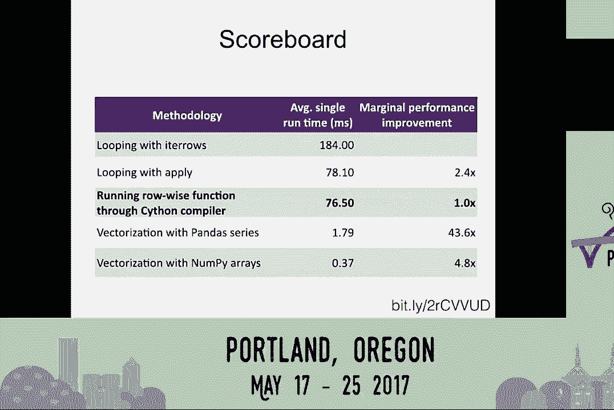

 it and make it run faster。 So what happened there？ Well。

 if I add the -a option to my Saison magic command， the Saison compiler will actually。

 show me how much of this function has been able to convert from Python to Saison。

 And those yellow bits is everything that it's still running in Python。 That's a lot of yellow。

 We did not do very well。 And that's exactly why we didn't cut any time off。

 So let's see what we can actually do about that。 Well， for one thing。

 we know that as long as Saison is still using Python， we're not， going to improve the time much。

 So we need to make the function more Saison friendly。 And there's a bunch of ways to do that。

 you know， anything ranging from taking the raw， function to converting it to pure C。

 But two of the things that we can do fairly easily。

 is we can add explicit strict typing to the function or we can replace our - or and or。

 We can replace our paison and NumPy libraries with C-specific math libraries。

 So if you recall our function was using a whole bunch of NumPy math to calculate a bunch。

 of those trig formulas， we're going to take those out and we're going to replace them。

 with actual C math library。 So this is what our converted function looks like now。

 And you can see that I've basically taken all of the variables that are declared within。

 the function and I've added strict typing to them。 They're all floats。 It's easy enough。

 And I've imported the libc math to bring in a bunch of Saison and cosine functions that。

 we're going to be using to replace the NumPy library。 Other than that。

 the only thing I've really done is there was one function which was a。

 degrees to radiance conversion that exists in NumPy but not in the original C library。

 I've just taken it out and rewritten it and defined it as a function， separate function。

 within here。 So now let's try running that。 So we're going to time the Saisonized function。

 again the actual apply statement looks exactly， the same as before。

 And now we're actually down to 50 milliseconds which if your call is not nearly as great as。

 300 microseconds but you know it's an improvement。 We've gotten it up to 1。

6 times the previous version which was just running the Python。

 function with apply or running the rowwise function， Python function directly in the Saison。

 compiler without doing anything。 And so at this point if you're really attached to loops you can go into a lot more probably。

 Saison optimizations but they'll get a lot more complex or you can see if you can figure。

 out a way to vectorize your function which will give you a huge boost and improve in。

 performance for very little work。

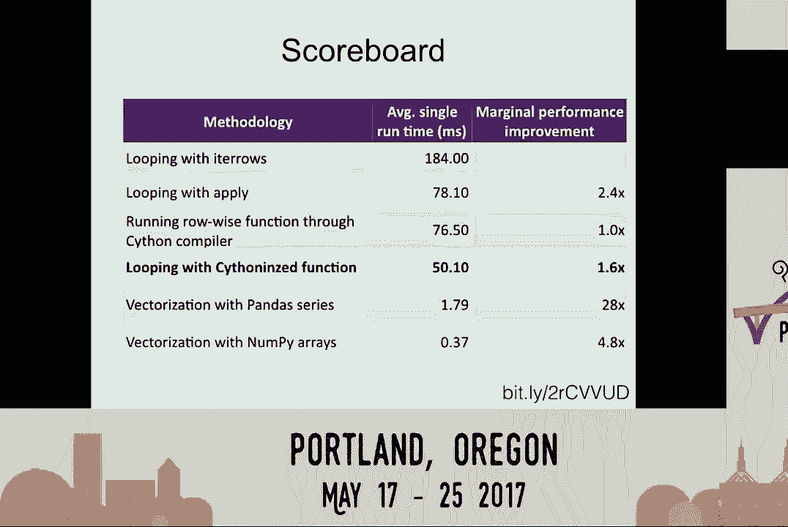

 And once if we actually look at our code at this point， well we see that there's a hell。

 of a lot more yellow and more white on the screen。

 So our changes that we made including the data typing and the conversion to a different。

 library have actually done a lot to help the function convert to actual Saison code and。

 run more efficiently。 Alright， so here we are， let's sum it up。

 So again this is our scoreboard。 We started out with 184 milliseconds， we got it down to 0。

4 milliseconds， overall about， a 500 time improvement。

 We started out looping with iteros which you should pretty much almost never do。

 We moved to looping with apply which is a fairly efficient way to loop through things。

 We tried looping with a function that got converted to Saison which gave us some performance。

 boost but not a whole lot。 And then we vectorized their function with pandas and with NumPy arrays which gave huge。

 boosts in performance。 So to summarize， the general zen of pandas optimization is one。

 avoid loops if you can。 If you must loop， use apply not iteration functions。

 If you must apply use Saison to make it faster， vectorization is usually better than scalar。

 operations and vector operations on NumPy arrays are more efficient than on native pandas， series。

 And with that， just a couple of words of warning to quote XKCD premature optimization is the。

 root of all evil。 So before you start optimizing your function。

 make sure that it is doing what you wanted， to be doing。

 Otherwise you will find yourself having spent a week on trying to make it run a few minutes。

 faster just to find that it actually wasn't running and doing things that you wanted it。

 to do at all。 You will regret it。 Another caveat that I should put in here。

 all of this was done in Python 3。51， pandas。20。 So anything。

 any of these results will obviously vary depending on exactly how you are using， your functions。

 the system that you are running it on， the size of the data frame， the type。

 of the function that you are using。 And so take it with a grain of salt。

 I can't promise you the exact same performance， performance boosts that we saw in this particular。

 data frame and this particular function for every single thing that you might ever apply。

 these methods to。 And that's pretty much it。 And since I have a few more seconds。

 I'm going to give a bonus pitch。 We are hiring and check us out at upside。com。

 We are a fantastic small travel startup located in Washington， D。C。 and if you are interested。

 come talk to me。 Thank you very much。 [Applause]， \>\> Thank you， Sophia。

 Does anyone have any questions？ If you do， there are microphones in the aisles。

 So in your half a sign， scytheon example， your last yellow line was you are using map。

 and tuple unpacking。 It seems like if you just put four lines of just do the computation。

 you could have avoided， a complete round trip into Python land。 \>\> You know， that's a fair point。

 I actually did try doing that and it actually does not improve performance。

 But it was actually one of the things that I was going to investigate was figuring out。

 how to actually make that run faster。 Because you're right， it does run as a Python function。

 But for the purposes of that function， doing it one way or another didn't make a difference。

 So I left it as it was。 \>\> Thank you。 \>\> For your improvement for your scytheon。

 did you test that with the vectorization to， see if there was further improvement？ \>\> So not quite。

 Because once -- well， so if you were to run it on vectors， a lot of the actual benefits。

 of scytheon would basically just be the benefits that you get from the direct vectorization。

 And so yes， you could。 But at that point， you might as well just run that function on vectors in its Python form。

 And it will still be way faster。 The combining the two doesn't actually give you much of a boost in performance in that。

 case。 \>\> Thank you。 So this isn't exactly related to scytheon or pandas， but you're using lambdas。

 And I know -- I remember way back， West McKinney's advice was not to use lambdas in apply。

 Is that changed or --， \>\> So that is a great question。

 I don't know if I've ever heard not to use lambdas in apply。

 The reason that we use lambdas in this particular use case is because we're trying to apply。

 to a row。 And so we're trying to -- we need to give that object a particular name。

 If I were not applying it to a row， if I were just doing it on a single series， I could do。

 without it。 \>\> Do you know if that's faster？ \>\> That's a great question。 I don't think it would be。

 but I haven't tested it， so I don't know。 \>\> All right。 Thank you。 \>\> Last question。

 \>\> So we use group by to group our regression models today。

 And I found that if you do like over more than four columns， it just is increasingly。

 not performant at all。 Do you have any suggestions of other ways to do that that would be more performant？

 \>\> For specifically group by -- you know， off the top of my head， I would guess that。

 maybe dealing with some of the data types and looking at the way that your data types。

 of the things that you're grouping by might affect it。 But the honest answer is no。

 I don't actually know。 \>\> Okay。 \>\> Okay。

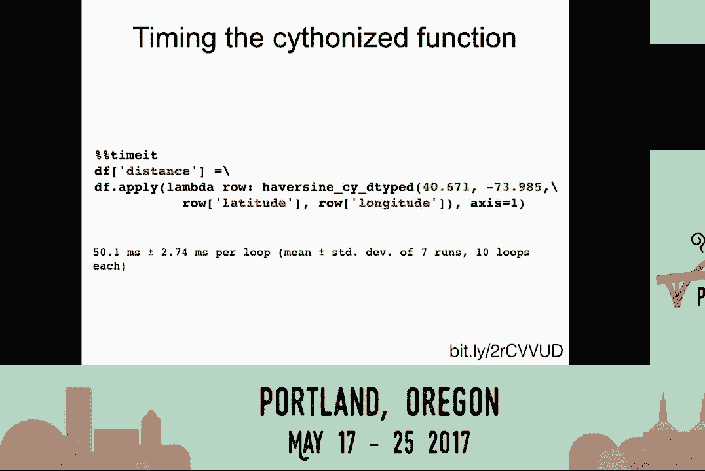

 That's all we have time for。 Please again， thanks， Sophia。 \>\> Thank you。

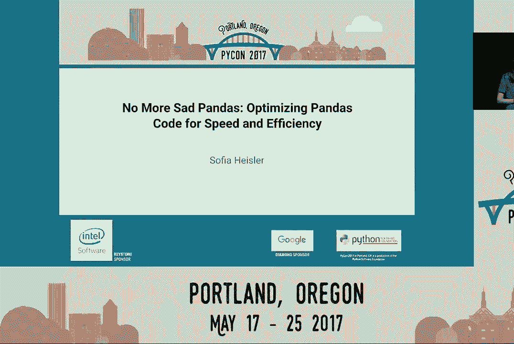

 [ Applause ]， \>\> Thank you very much。 [BLANK_AUDIO]。

