# P2：Andrew T  Baker   5 ways to deploy your Python web app in 2017   PyCon 2017 - 哒哒哒儿尔 - BV1Ms411H7jG

 Good？ Cool。 And once we get that GIF back up there。 Thank you， Drake。 Thank you， folks。

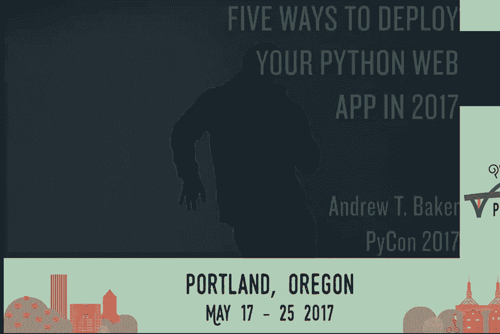

 Hopefully the wait was worth it for that one。 That is my favorite GIF of all time。 My name。 is Andrew Baker， and I'm here to talk to you today about deploying your Python web apps。
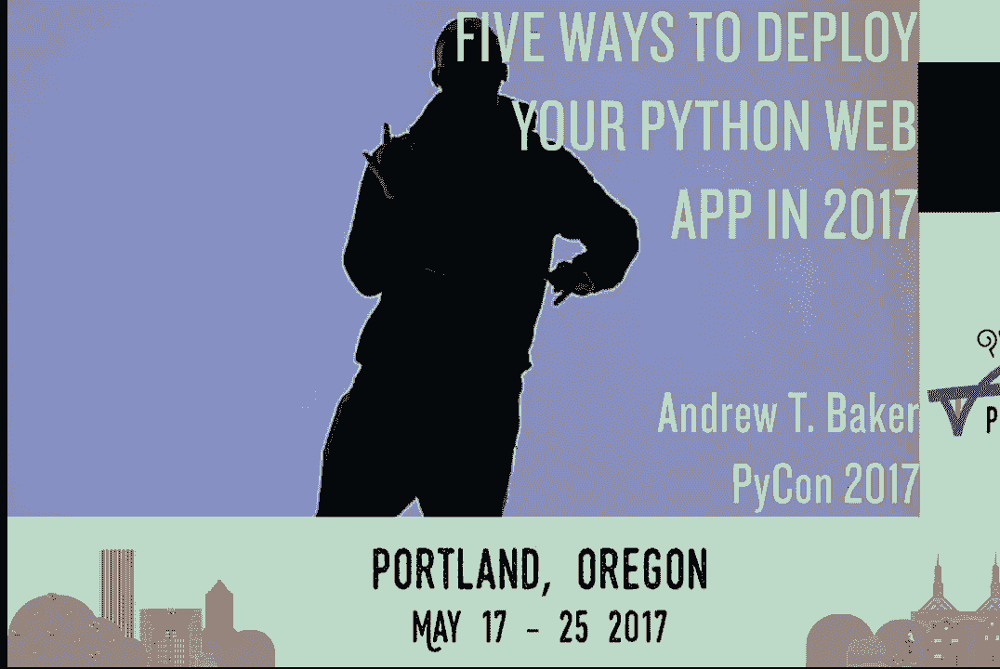

 in 2017。 So we'll put Drake aside for the moment。 Thank you for your service。 A little。 bit about me。 So my name is Andrew Baker。 I'm a Python web developer。 That's what I've。 been doing for most of my career。 These days I work at Twilio。 If you haven't heard of， us before。 Twilio is a company that makes it easy for developers like you to put communications， in your apps。

 So by communications， I mean things like phone calls， text messages， video， chat。 And I work on the documentation team at Twilio。 And I don't know。 That's enough， about Twilio。 If you want to know more， stop by the booth and I have to talk to you more， about it。 But today we're here to talk about deployments。 So what we're going to try and。

 do in the next 30 minutes is cover five different ways that you can take code that you've got。 running locally on your machine and get it up and running in the cloud。 And rather than。 tell you how to do this， I'm figured it would be more fun if I tried to show you。 So in the。 next 30 minutes， we're going to try and take the same sample code and deploy it to the。

 web five times over。 Sound good？ Alright， let's give it a shot。 So our sample app today is。 a flask application。 I imagine most of you in the room are familiar with flask already。 but if you're not， it's a micro framework that makes it really， really easy to bootstrap。 a Python web application。 So we've got the little Hello World code right here。 And indeed。

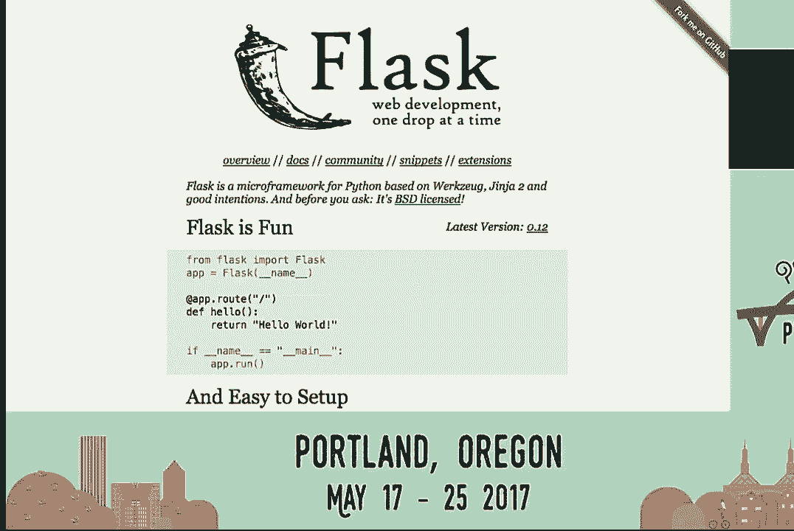

 that looks very similar to the sample code that we're going to be using in our app today。 So we've just got one route， the root route， and it's just going to spit on H1 tag with。

 a Hello World there。 So the first technique we're going to talk about today is engrock。
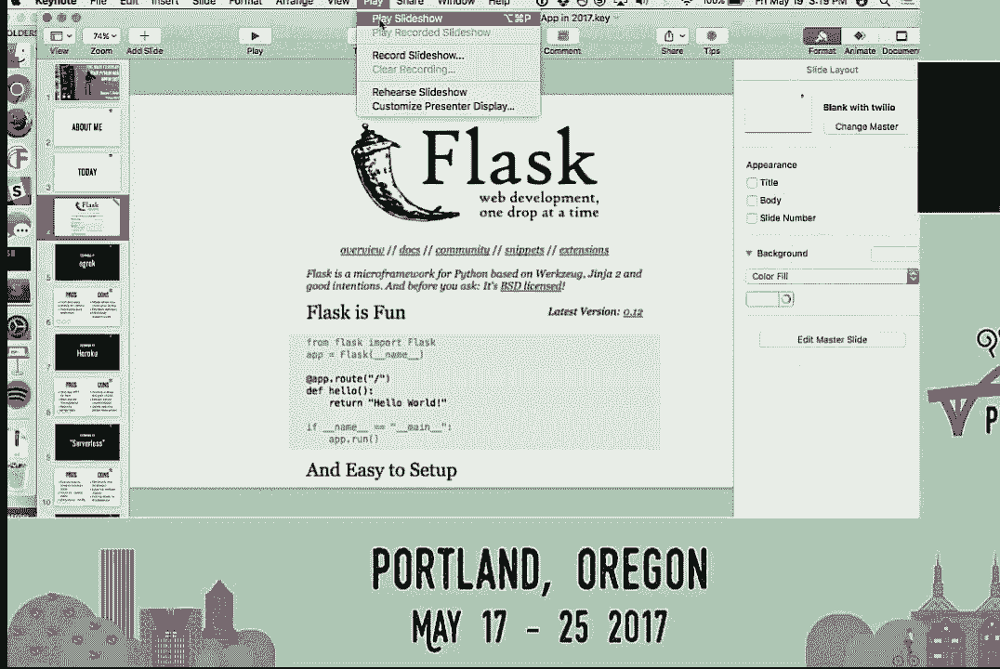

 You could even call this technique number zero because it's not really deploying so much。 as it is a really， really handy tool that I think should be in every developer's tool。
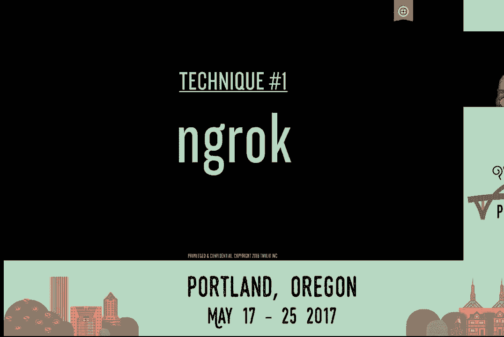

 belt。 So engrock， if you check out their website， it is Secure Tunnels 2 local hosts。 So the quote says it all， I want to expose my local。 server behind a NAT or firewall to the internet。 And if you click that download button， you。 go over to the engrock download page， download that file， which I've done already。 And you。

 really just need to do two things。 First， I'm going to fire up that flask app that we had， before。 and we'll make sure that's working on local host 5000 Hello World， digging it。 And then I'm just going to go over to another window here and do engrock HTTP 5000 to tell。
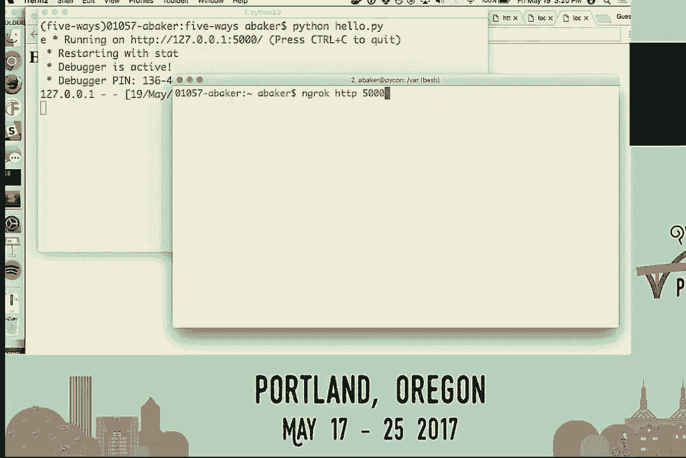

 engrock that I want it to route to port 5000 on my local host。
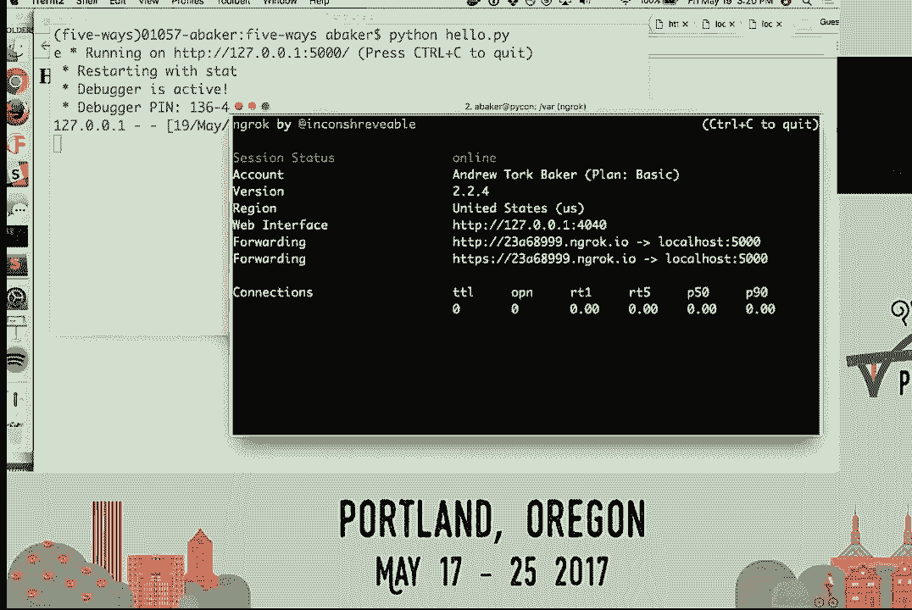

 engrock is going to fire up here。 It's going to give me this weird gobble to gooke URL。 I'm just going to paste that into my browser and Hello World。 That is it。 Your app is now。 live for the world to see。 engrock is a really， really great tool for just getting something。 up in a pinch。 One thing that even folks who have used engrock before might not be aware。

 of is it also has this awesome request inspector。 So if you go to local host 4040 while you've。 got engrock running， you can click around， see the request that we're coming in， see the。 response that your app was putting back。 If you can go over to the status page here。 you can get some performance information on how your app is doing locally。 So engrock。

 is the simplest way to get your app running in the cloud。 So after each of these techniques。 we're going to do a brief breakdown of the pros and cons， of each。 The pros for engrock。 it is fast and easy。 There's no way that it's faster or easier。 It's really handy for demos。 So if you're just going to a meeting with some code that， you've been working on。

 you haven't really showed it to anyone else yet， but you want。 some of the people in that meeting to be able to play with it。 engrock is a great tool for， that。 And it's also really great for hacking on web hooks。 So if you haven't heard of web， hooks before。 a great example is with Twilio。 If when your Twilio phone number has an incoming。

 phone call from somewhere in the outside world， Twilio will send your server a HTTP request。 asking you how you want to handle the phone call。 And that's great when your server is。 live and running and prod， but when you're just working locally， you don't actually have。 that URL that you can point Twilio to get those instructions。 engrock is the way that。

 we recommend doing it， and that's why it's an indispensable part of my toolkit now。 The cons。 obviously， it stops when you close your laptop。 So as soon as your screen goes， black。 that URL is gone。 And every time you fire it up， you're going to get a different， random domain。 You can upgrade to a paid version， of course， and it's a great product。

 so I support paying developers who do cool stuff。 But if you're just sticking with a free， one。 you're going to get a random domain each time。 And it definitely doesn't scale。 So even。 on the free tier， if you have， like， maybe 12 people in a meeting and you're trying to。 point them at your engrock URL at the same time， your requests may get throttled。 So be， careful。

 Be careful with how many people you send that URL out to at once。 Awesome。 All。
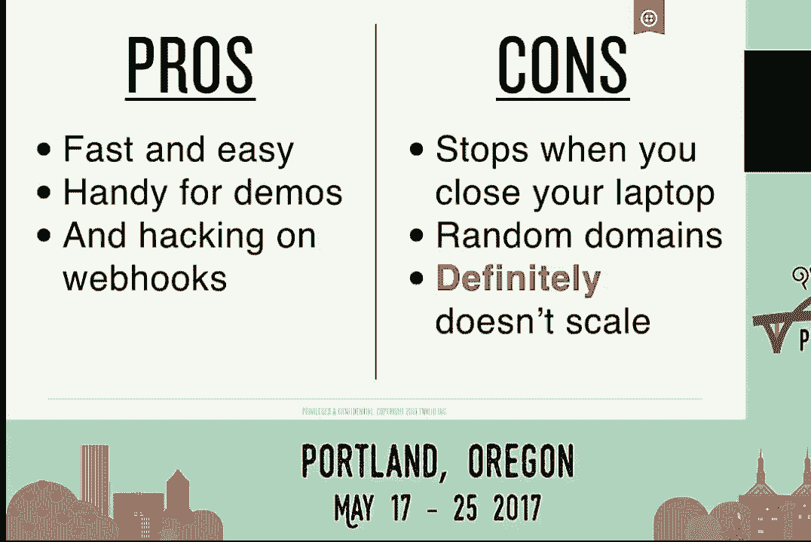

 right， moving on。 Technique number two is Heroku。 So Heroku is a platform as a service。 and in my opinion， today it's still the easiest way to get your code running in the Cloud 24/7。

 So if you pop over to Heroku's website， they've got lots of interesting language here， which。 explains what it does， but for me， Heroku isn't really so easy to explain as it is easy， to show。 So we're going to pop back over to our Flask app。 Still got that running there。 I'm going to close down engrock， stop my local server， and we need two things to get an app。

 running on Heroku。 The first thing we need to do is create this file called a proc file。 A proc file tells Heroku how it should run our app in production。 And then we need to。 actually create a Heroku app， which is going to give us the URL where our app is going， to live。 So we'll start with a proc file first。 And the proc files are a pretty simple syntax。

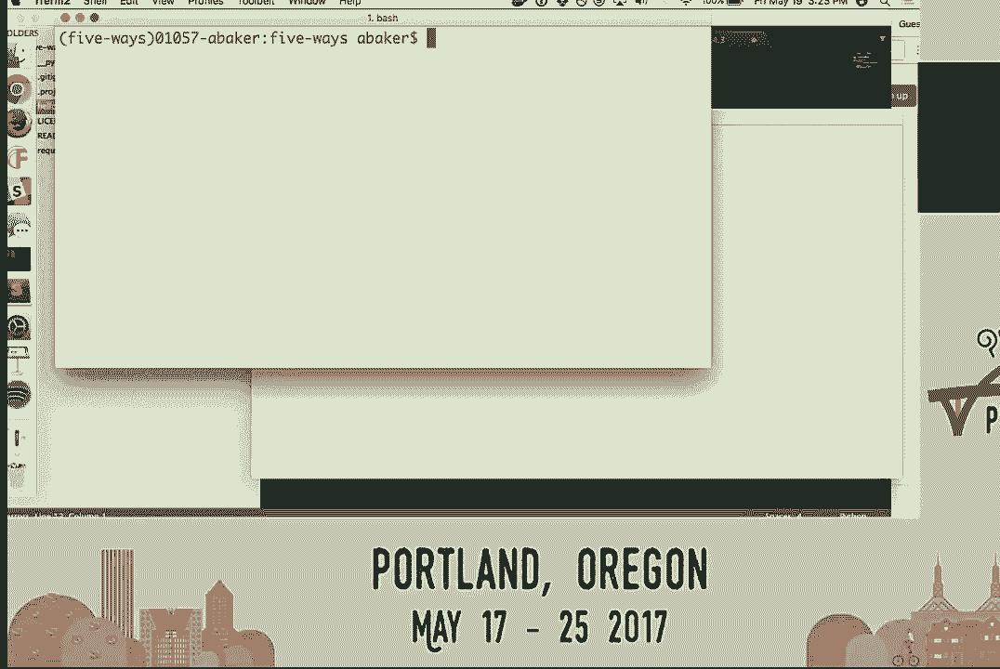

 You just do web， and then the command you want Heroku to run when it starts your service。 Now if you look at the Flask development docs， they will tell you do not run the development。 server in production， never ever run the development server in production。 So for the rest of this。 talk today， we're going to use a Python HTTP server called G Unicorn to actually run our。

 app when it's out in the world for everyone to see。 And so the command to do that is G Unicorn。 and then the path， Python path to where our app is defined。 So that's inside hello。py， module。 and then we have a variable in here called app。 And then there's a couple other。 options that we like to pass Heroku。 This one just tells G Unicorn， hey， don't store。

 your logs locally on the server。 Instead， pass them back to Heroku so that Heroku can give。

 them to me。 So once we've got our proc file， when you create your Heroku account， they。 will tell you to download this thing called the Heroku tool belt， which is basically their。 command line interface。 And after you log into that， all you have to do is type Heroku， create。 And it's going to go ahead and give us that unique URL right on the spot。 It's。

 also going to add a new remote to our repository that ties to that unique URL。 So if I was just。 pushing my changes up to GitHub， I would do git push origin master。 If I'm pushing my。 changes up to Heroku， I'm going to do git push Heroku master。 And so what's happening。 now is Heroku has accepted our source code。 It is looking at the requirements that are。

 inside our requirements。txt file。 It's going to go ahead and install all those requirements。 It's really， really fast because Heroku servers are pretty close to where PIPI servers are。 At least a lot closer than where our laptop is。 Then it's going to bundle it all up and。 shoot it out on that URL and launching。 Cool。 So if we do Heroku open， which is a nice handy。

 little shortcut they give us， we'll hit that URL。 It's making all the pipes line up for。 us and Hello World。 Cool。 So now we are up and live with Heroku。 So what exactly does， this mean？

 To me， my favorite part about Heroku is that it's like the easiest way to get an。 app that's running in the cloud 24/7 for free。 So Heroku's free tier is a little more complicated。 than it used to be， but the last time I did the math， you can basically have one app per。 account running all the time without any serious consequences。 There's zero server management。

 We didn't have to access any machines， open any terminals， any remote servers， anything， like that。 And Heroku has a really interesting add-ons ecosystem where they partner with。 other companies to make it easy for you to add things like logging， monitoring and databases。 caches， things like that to your application。 The content of this one， the scaling is really。

 really easy， but it can also get pricey。 So if you just have a big event for your organization。 and you need to pop on some extra demand for just one day or an afternoon， Heroku is probably。 still a great choice。 If you need to be running your app at more than one server on Heroku for。 a sustained period of time， you might want to start looking at other options。 Server customization。

 is harder， so if you need some sort of OS library to make your application work， there's。 a way to get it in there with Heroku， but you have to do a little bit more like work to do， it。 And some of those add-ons are better than others。 Some of those add-ons are maintained。 by Heroku itself。 Some of them are maintained by third-party vendors。 Those third-party。

 vendors can vary in their reliability and in their quality of their documentation。 All right。 number three， server lists。 In quotes。 That's pretty much the only way you can。

 talk about server lists is in quotes。 So this is one of the newest hottest techniques to。 get your app out there in the world。 The idea is that instead of like Heroku， where Heroku。 managed all the server stuff for us， but we still have our process running in Heroku's。 cloud all the time。 With server lists， the idea is that our code is only going to be running。

 when someone actually needs to use it。 And most of the time it's going to be sleeping。 and as soon as someone sends a request to our website， the server lists provider is。 just going to flip a switch and get our process running again quick enough to respond。 So today I'm going to show you how to use AWS Lambda， but all the big cloud providers。

 have their own serverless feature。 Azure has one， Google Cloud has one， so I'm just showing。
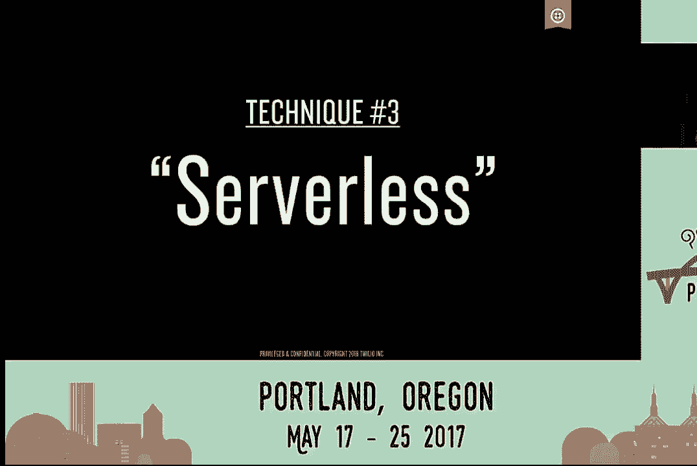

 you AWS， for example， sake。 When you look at Lambda， you can see pay for only the compute。
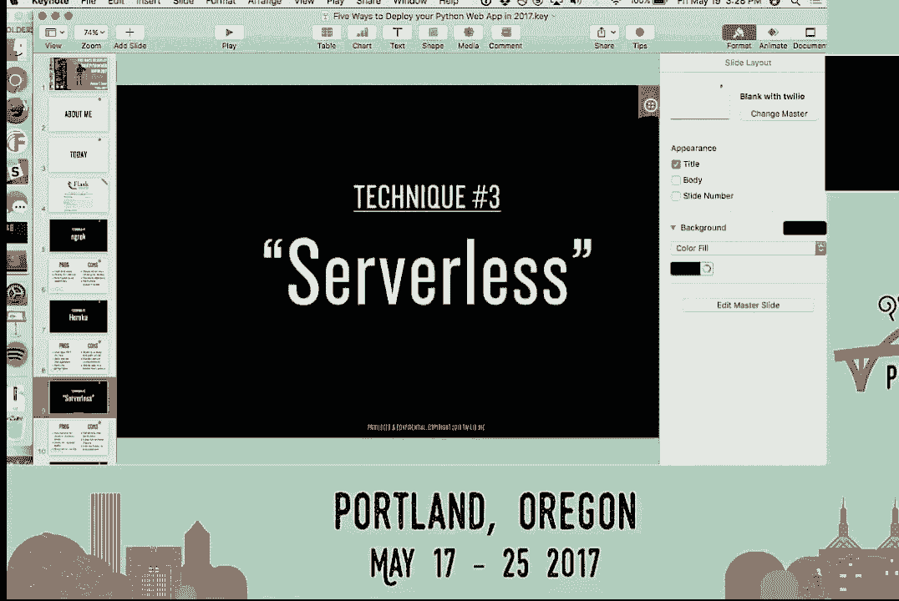

 time you consume， and we'll talk more about the pricing on the pros and cons list。 But。 when I've used Lambda before， you can log into your AWS console， copy and paste some code。 get things set up and working pretty well。 I find it a little cumbersome， so I like to。 use one of the third-party frameworks that sprung up around the serverless movement， and。

 the one I'm going to show you how to use today is called Zappa。 So Zappa is basically just。 a wrapper around AWS Lambda that makes it easier for me to take my existing Flask application。 and fit it inside Lambda。 So to get Zappa working， I already did a pip install Zappa before I。 got up here， so what we need to start with here is Zappa and NIT。 And Zappa is just going。

 to ask me a few questions about how I want my app to run inside Lambda。 First it's going， to say。 "What do we want to call this environment？" So I'm just going to say production。 Which。 AWS credentials do we want to use？ I'll say personal。 And Zappa creates a S3 bucket。 Lambda。 also creates an S3 bucket for where you're going to store your source code before it， gets deployed。

 So I'm just going to go with the default name there。 Don't really care。 It found that hello。app is the right path to get our application started。 So I'm going， to stick with the default there。 Do we want to deploy it globally？ Though it would be the， best way to say hello world。 It also costs a little more。 So I'm going to say no。 Everything， look okay。 Yes it does。 Thank you。

 Zappa。 And then to get things rolling， we just say， Zappa deploy production。 So right now Zappa is making a whole bunch of API calls to Amazon。 Web Services underneath the scenes。 It's giving me a warning here because my virtual。 end and my Zappa project have the same name。 That's probably something we should all fix， next time。

 The interesting thing about Zappa and Lambda is all of it is mostly a recombination。 of other Amazon Web Services products。 And because all those products are products you。 can use in their own right， you can access them and poke around your Amazon Web Services。 console after you've already set it up。 So after you deploy a Zappa project， you should。

 log into your AWS console and kind of poke around and see all the things that are made， for you。 You're going to want to look at this thing called API Gateway。 That's basically。 the way that you tell Amazon Web Services that you want to accept traffic from the outside， world。 That's also where you're going to go in and set up your own custom domains and。

 SSL and all sorts of things like that。 Like I mentioned before， there's also a tie-in。 with the S3 bucket。 So that's what's happening right now is AWS Zappa just zipped up all。 of our source code and is dropping it in that S3 bucket。 And this is a little bit different。 than Heroku because when we pushed our code up to Heroku， Heroku just looked at our source， code。

 took a peek inside our requirements。txt and then pulled all of our dependencies onto。 Heroku servers。 With Lambda， you have to basically bundle up your dependencies locally and then。 upload them all to Amazon Web Services。 So a small distinction but if you see something。 wonky going on that could be part of your trouble。 Alright， deployment complete。 Got。

 a weird ugly URL。 You know what that means。 Hello world。 Awesome。 Cool。 So talking a little。

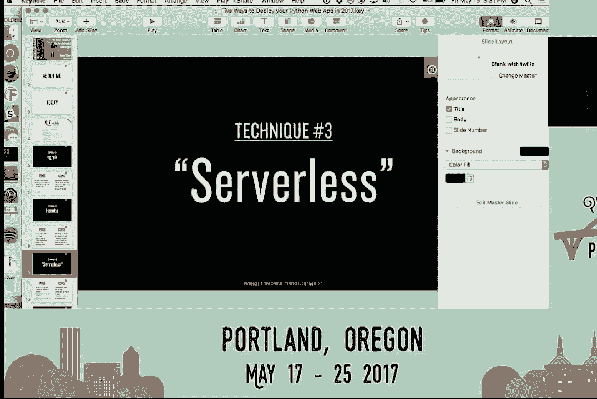

 bit more about serverless Lambda， it's pretty economical for small to medium loads。 If you。 don't need something that's actually available 24/7 but you just need it to be quickly available。 at any time of day， this is a really great choice。 It's also good for spiky traffic。 So。 if you have kind of unexpected bursts of traffic to your service and you don't know when they're。

 going to come， Lambda is a good choice because Amazon is basically going to take care of。 all of the scaling for you。 And as you saw， absolutely zero server configuration， even。 less than Heroku。 The concept that this is a relatively new technique， probably the newest。 one that we're going to talk about today。 So not only is it kind of a fast moving ecosystem。

 you're not going to find that much to read out there about it compared to the other techniques。 that we're talking about today。 But also the best practices are still kind of settling in。 for this one。 So you're going to be a little bit more on the bleeding edge。 In my opinion。 this is just an Andrew Baker opinion。 It's a little bit less fun when you have to work。

 directly with Amazon Web Services or the other cloud providers interfaces。 I prefer to use。 these third party frameworks like Zappa or the one that's called serverless， but your。 mileage may vary there。 And the other things that they can be a little tricky to troubleshoot。 So when something goes wrong with your Lambda deployment， like I said， because it's just。

 a combination of other Amazon Web Services products behind the scenes， that kind of means。 that you have the ability to go spelunking on your own and figure out where things went， wrong。 And you're probably going to have to spelunk inside products that you didn't even， know existed。

 All right， technique number four， virtual machines。 So this is where we get to the workhorse of。 the internet。 This is the way that most big organizations run their code in the cloud。 And today we're going to be taking a look at Google Compute Engines virtual machines。 but all the big cloud service providers have their own VM service。 So for Amazon， it's easy。

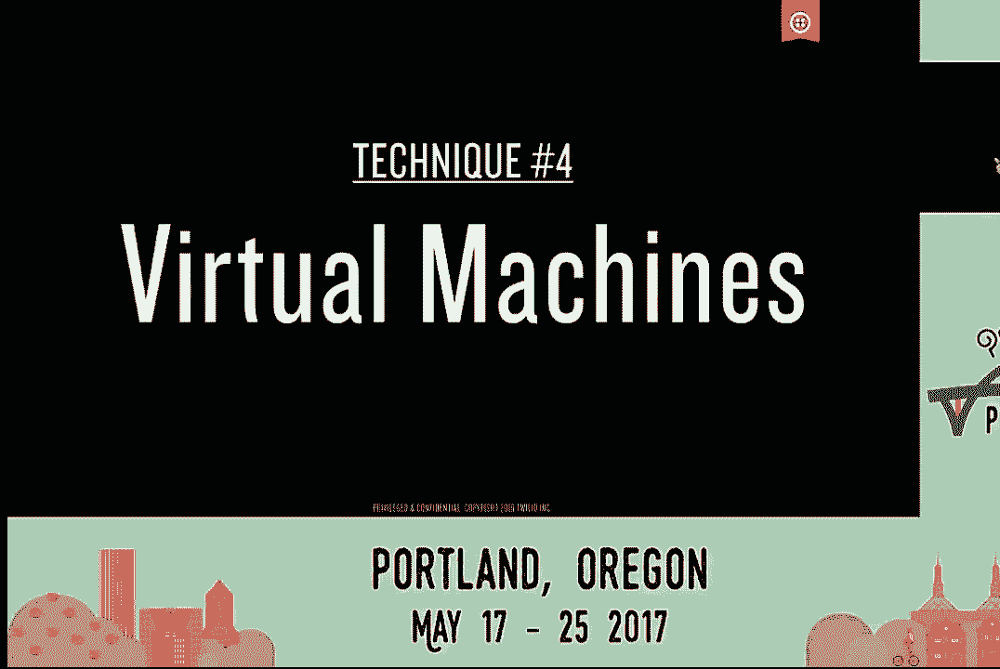

 to， for example。 And with this one， you are pretty much just getting your own tiny corner。 of the cloud and setting it up exactly the same way you would locally。 So I'm in my Google。 Cloud Platform account now。 I just hit Create a New Instance。 We'll call this one PyCon 2017。 I'll give it that one V CPU。 That's how much horsepower I want on it right now。 I'm going。

 to stick with Ubuntu because that's what I know best。 And we're going to make sure we。 allow HTTP traffic。 And so right now Google's going to get started spinning up a new virtual machine for me inside。 my Google Compute account。 So virtual machines， if you haven't heard of the concept before。 the basic ideas were taking the software power of Google's cloud。 And we're basically using。

 it to create what looks like fake hardware。 And then we're installing another operating。 system on top of it。 So the pro is that you get full isolation between， say， my virtual。 machine that I'm running on Google Cloud and your virtual machine that you're running。 on Google Cloud。 The downside is that it's not quite as efficient as if you were just running。

 a process without that overhead of virtualization。 We'll talk a little bit more about that in a。
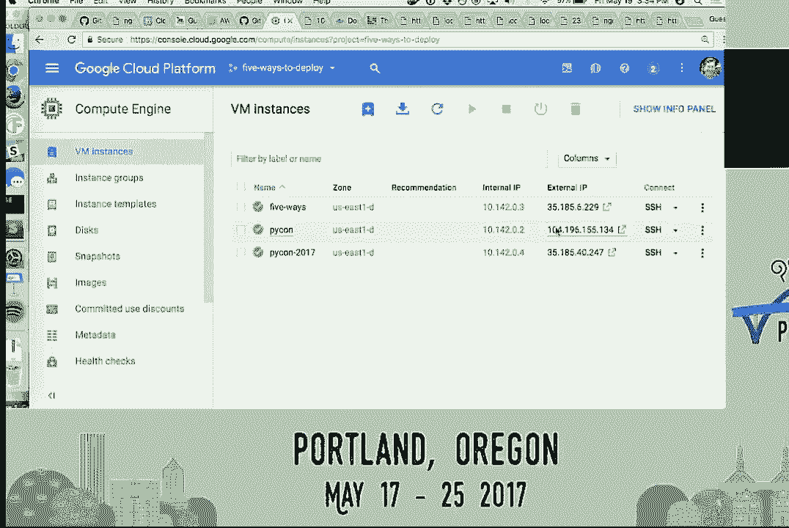

 second。 But now that my virtual machine is up， I'm going to use this little shortcut in。
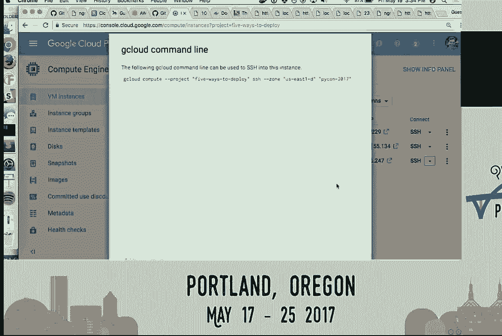

 here to copy the command to SSH into it。 We'll see if the box is actually ready to accept。 our SSH command now。 All right， cool。 So if we start poking around this instance， we'll。 see it looks pretty much what a stock Ubuntu service would look like right out the gate。 I'm going to move on over to the var， activate sudo mode because we're about to run a whole。

 bunch of sudo commands。 And we basically need to do three things to get things set up here。 One。 we actually need to install pip first。 So I'm going to get that started right now。 App install Python pip。 Yes， 192 megabytes。 Let's do it。 After we install pip， we're going。 to have to make a virtual end。 And then after we make the virtual end， we're going to need。

 to clone our git repository to pull our source code onto the server。 Then we're going to install。 our requirements inside that virtual end。 And then we'll finally be ready to run our app。 So this one is definitely the most legwork。 So now that we've got pip， I can do pip install。 virtual end。 And then I'm going to do virtual end dash p。 Luckily， the box comes with Python。

 3 already。 I'm going to activate that virtual end just like we would locally。 And then it's。 time to go ahead and grab our repo。 Clone it in。 Pop in there。 Install our requirements。
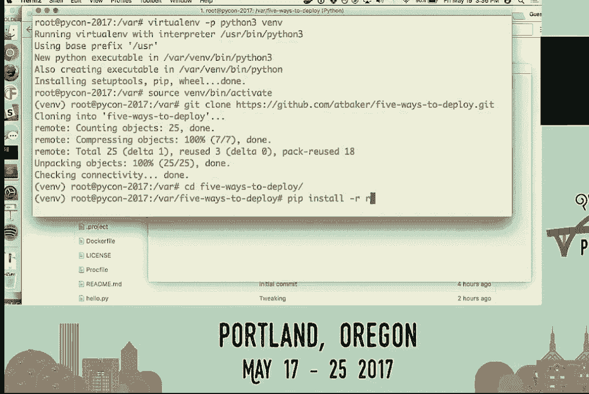

 just like we would locally。 And then the last thing we need to do to get a running is to。 get that same g unicorn command。 But we actually need to make one small tweak to it this time。
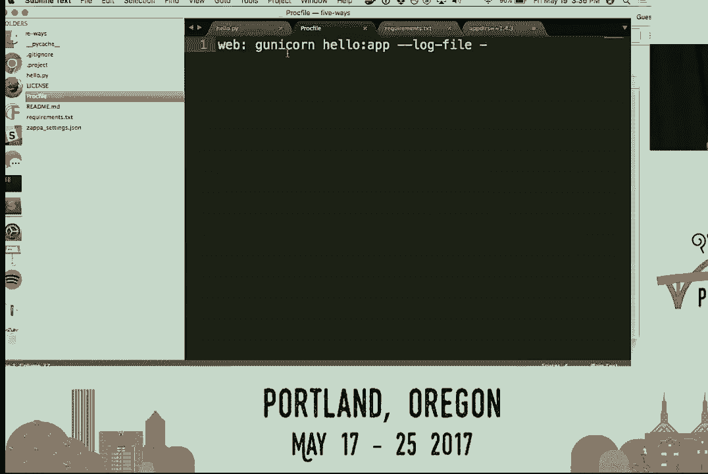

 So with g unicorn， by default， it's only going to listen on port 8000。 And it's only going。 to listen to requests coming in from local host。 So we need to actually pass one more。 command which tells it， hey， listen to requests from the internet at large and do it on port。 80 instead。 And so if we pop back over to our compute engine， click this little icon here。

 We've got our hello world running there in Google Cloud。
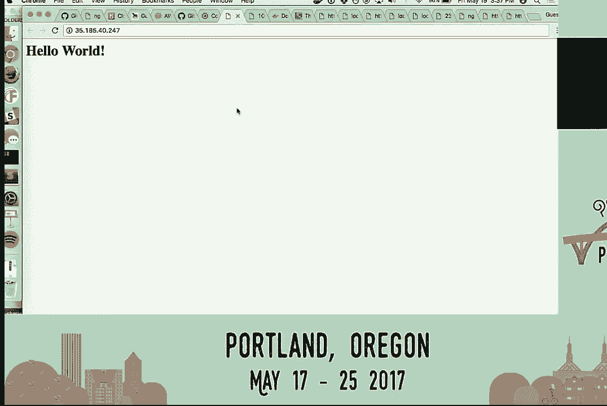

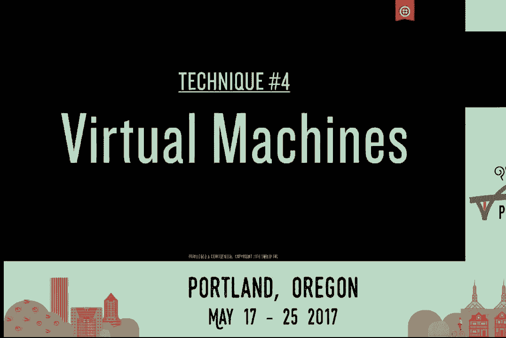

 So pros and cons on virtual machines， full control， you get to do literally anything you。 want on this thing and set it up exactly the way you like。 It scales as much as your wallet。 So that's for you to consider。 But it can still be economical if you're careful。 So you can。 get a lot of value out of it if you put in the time to set things up kind of in the right， way。

 The cons undoubtedly more work for you。 The most work out of any of the options that。 we talked about here today。 And there's also a lot more to learn。 So we set up this virtual。 machine today using just manual commands on the box。 If you really decide to run your。 organization on this in production， you're probably going to need to learn about things。

 like configuration management， monitoring， you're going to want an alerting system for。 when things go down or weird network flips happen。 You are going to be in it if you go， this round。 And the last thing is that ultimately it's harder to predict the costs， especially。 if you add things like load balancers to your stack where you have multiple virtual machines。

 running at once and you want the cloud provider to balance traffic across them evenly。 Those。 prices can come back and bite you on your bill if you're not careful。 So ultimately with。 virtual machines， most control， most work。 But if you go this route， you will be in good。 company because it is the way that a lot of people in the world run their software。 Last。

 piece that we're going to talk about here today is Docker。 So Docker is kind of a newcomer。

 on the scene maybe a couple years ago。 If most of the techniques we've talked about today。 are going from least effort to least control， sorry， least effort and least control like。 with Heroku to the most effort and the most control with virtual machines， you can kind。 of see Docker as a way of trying to split the difference where we're going to set up。

 our app just like it was in a virtual machine locally。 When we run our app， it's going to。 think that it's in its own personal virtual environment。 But the Docker containers that。 we use are going to be a lot more lightweight than a full virtual machine and a little easier。

 to manipulate。 So usually I find that with Docker it's easier to show than tell。 So we'll。

 pop back over to our app here。 We need two things to get our Docker machine， our Docker。

 container running in the cloud。 First we need to create this thing called a Docker file。
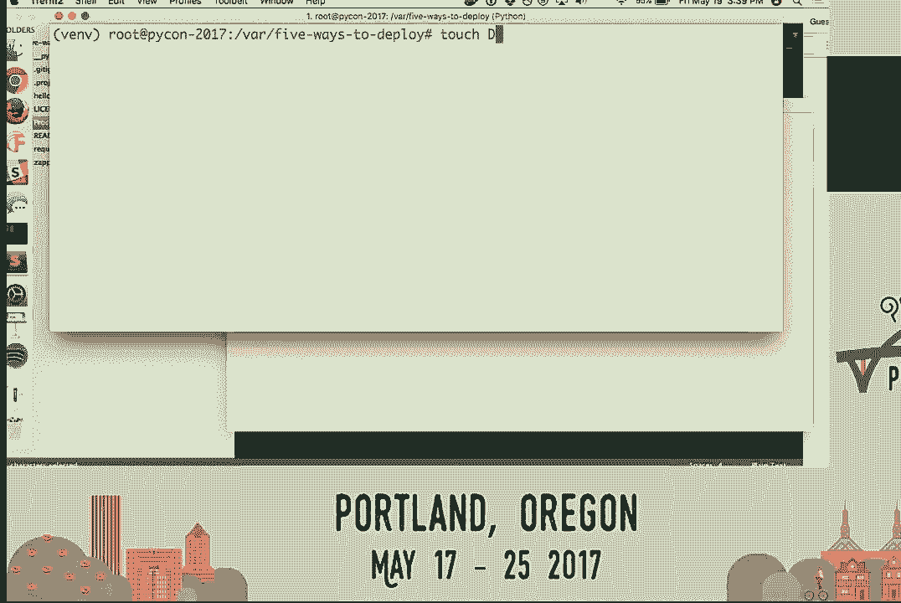

 which is going to tell Docker how it should actually assemble our project inside。 Oh yeah。

 I'm not on local host。 Get out here， Google Cloud。 Thank you。 That was not the time。 Cool。
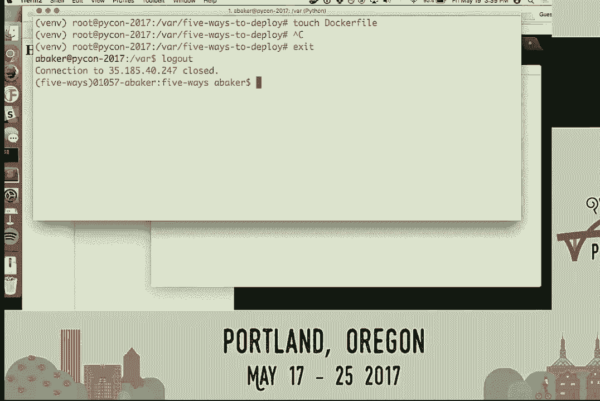

 So for this part， Docker files have their own weird syntax。 If those of you in the audience。 who know me know that I know this one all too well。 So we're going to pull off a start。 of our Docker file by pulling from the Python base image。 We do three， five on build。 And。 then we're going to tell it which port we wanted to expose in production。 So this time。

 I'm going to do 5，000。 And then we tell it what command it should use to actually start， things up。 And I'm actually going to go back and grab that same one from our proc file。 And then add that bind just like we have before。 0。0。0。 port 5，000 this time because that's。
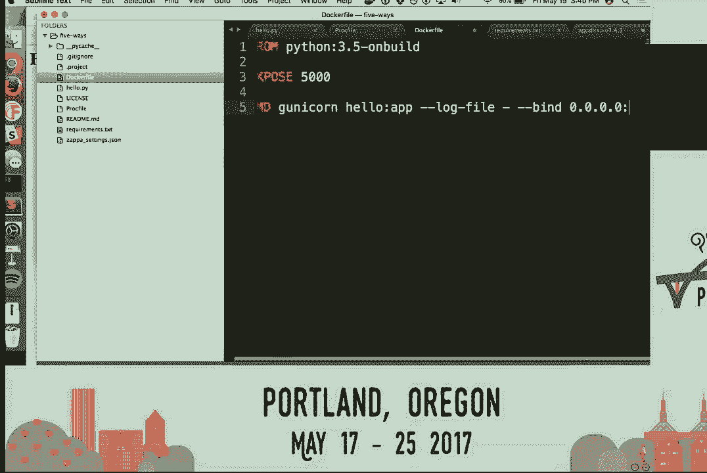

 the one we're telling Docker to pay attention to。 So before we can actually run our project。 inside the Docker container， we need to build it。 So I'm going to do Docker build。 I'm going。 to call it 80 baker slash five ways。 And so Docker is going to look at our code， take。 a look at our requirements file， install the requirements， and then add some metadata about。

 how we want to run the container。 And then to run it， we're going to say Docker run， we。 need to tell it that we care about port 5，000。 So I'm going to say take port 5，000 from our。 container and expose it on port 5，000 on our host。 And I want to run that image 80 baker， five ways。 So we see G unicorn running inside the Docker container now。 If we go and check， out localhost 5。

000， we've got our hello world。 Awesome。 So the next piece to actually get。 our Docker image running in the cloud is we first need to push it up to the Docker hub。 It's basically like the GitHub of Docker。 So I'm going to do Docker push five ways。 You'll。 see a lot of these layer already exists images coming up here。 And only that first one is。

 the one that it actually had to push up on its own。 That's because Docker is kind of smart。 enough to realize， hey， most of the stuff that's inside this image is stuff that's being pulled。 from the base Python image， which I already know about。 So Docker comes with this extra。 tool called Docker machine， which lets you spin up virtual machines really easily and。

 then SSH into them or sorry， you can't SSH into them， but you can also just manipulate。 them as if they were your local host。 So I've already got one running here called five， ways。 So I'm going to do the command to apply basically that Docker virtual machine instance。 to my local environment by saying Docker machine and five ways。 Cool。 So I'm going to kill this。

 one that we had locally。 And now to get things working on our machine in the cloud， I'm going。 to pull down our five ways。 Start it up just like we did locally。 5，000， 8th Baker， five， ways。 All right。 And then I'm just going to pop up another window here。 And there's a。 handy low command we can run to actually see what IP address our Docker machine is running， on。

 So grab this guy， pop over port 5，000， hello world。 Cool。 So that one may have seemed。 a little bit like dark magic。 It's definitely the most advanced option that we talked about， here。 but it does have some of its own pros and cons。 The pro is that it helps a lot with。 dev prod parity。 So once you're running your app in production， you're going to find that。

 a lot of your biggest bugs are happening because something that was set up in your local development。 environment is not the same way that that app is actually being run in production。 Docker。 is great for helping with that。 It's nice for microservices if that's a thing that you're。 looking for。 It's also a great way to impress your friends。 I can speak with this personal。

 experience。 The cons is that it's one of the newest techniques out there。 So best practices。 are still getting settled， probably less new than serverless at this point when you're。 looking at the documentation materials that are out there， but still pretty new。 It works。 best when you and all of your team go all in on Docker。 And it definitely has its own learning。

 curve besides all the tools that you're actually putting inside these containers to run them。 So that's all I got folks。 The five techniques we covered are N。 Grock， Heroku， serverless。 virtual machines and Docker。 My name is Andrew Baker。 I'll be hanging at the Twilio booth。 in the Expo Hall all day tomorrow if you want to ask some questions。 Thank you。 [Applause]。

 \>\> Catch him up the booth with questions。 \>\> Cool。 \>\> Very good。 \>\> Yeah， thank you。 \>\> Five demos successful。 Not a single error。

 \>\> You and I are both surprised。 \>\> I think I'm pretty surprised。 Very good。 \>\> Thank you。 \>\> Great synopsis。 \>\> The entire DevOps stream the last five years。 \>\> Yeah， yeah。 It was fun charting it。 And like I said， hey， Adrian。 Oh， hey。 Thank you。 Thanks。 Yeah， please do。 I would love to。 Thanks。 Thanks， man。 [Applause]， [Applause]， [Applause]。

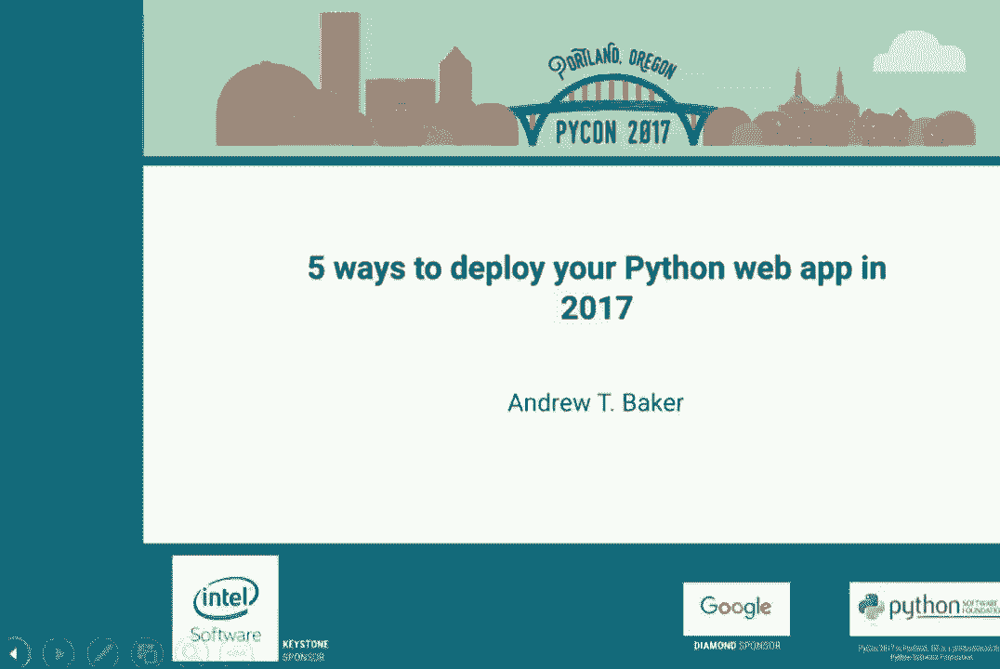