# P8：Matthew Rocklin   Dask A Pythonic Distributed Data Science Framework   PyCon 201 - 哒哒哒儿尔 - BV1Ms411H7jG

 There will be about five minutes for questions at the end， so hold off。 Great。
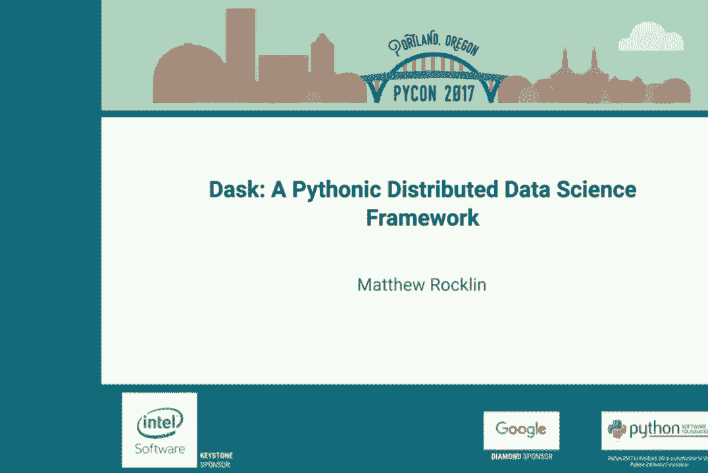

 [applause]， Oops， let's close that down。
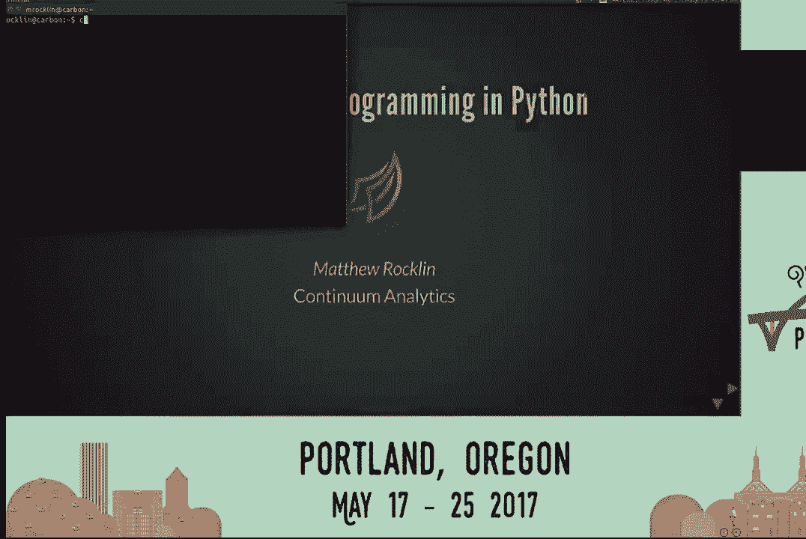

 So， hi everyone。 My name is Matthew Rockman。 I work for Continuum Analytics。 Continuum is a company that's a for-profit company。 and it's at the open source data science side of the Python ecosystem。 So。 they do consulting and training and such。 We also apply for grants。

 and those grants support open source software。 DASK is one such example of that。 So。 I work in a project called DASK， which is library for parallel and distributed computing in Python。 Talk a little bit about that， and also generally about parallel computing in Python。 So。 this is going to be a combination of slides and of live demonstrations。

 if the wireless plays nicely with us。 The slides are available at my webpage at MatthewRockman。com/slides/pycon-2017。 If I'm sort of boring， I want to sort of jump ahead。 So。 I come from like the NumPy side of the PyCon stack。 So， if you're sort of raising your hand。 if you're more familiar with NumPy than Django， and if you're more familiar with Django than NumPy。

 yeah， that's great。 It's like 50/50。 This is a crazy conference。 So。 Jake mentioned this in the beginning of the keynote today， which I loved， that we are a mixed group。 This thing would be a talk about mixing a couple of those slides together。 We're going to take the networking side of Python and use it alongside the data side of Python。

 to make a distributed computing system。 So， we have this really strong analytic system in Python。 This is libraries like NumPy and Pandas and Scikit Learn。 They're very fast， they're very intuitive。 scientists like them， analysts like them。 They have a flaw in which they were designed to run on a single core。 mostly， and on data that fits in RAM。 And that is becoming less than。

 as we're sitting at larger and larger data sets and larger and larger clusters。 we now want to expand those libraries， the whole ecosystem， beyond just single core processing。 That's hard to do。 So， we just want to parallelize a single library。 we want to parallelize an ecosystem of thousands and thousands of packages。

 So， I'm going to steal some slides from Jake。 So， these are the slides Jake brought up in the keynote this morning of the Python scientific stack。 And there's Python at the core， there's some core libraries on top of that like NumPy。 On top of that we think like Pandas and SciPy and all these other slightly more peripheral packages。 As you go out， there's actually thousands of little small packages。

 packages for genomics and for people doing sequencing and people doing studying the sun。 And there's thousands of little small research groups that are all producing software。 using their expertise that they have alone to support lots of scientists。 These are people doing real work helping the world。

 And we want to sort of parallelize not just NumPy or Pandas but everything。 That's a big challenge。 That's sort of the challenge we're sort of faced with and are foolishly trying to solve。

 These packages are also， they have custom algorithms， it's not just one kind of thing。 they'll have their own secret sauce。 They're made by smart people。 So。 we need a parallel computing library that can， that can be flexible enough to handle both the。 you know， solar astronomers work and the genomicists work。

 It is familiar enough that it can be adopted by a large number of people。 This is again a challenge。 So， in order to try to solve this problem， I'm talking about DASK， something that I and others。 have worked on for the last few years and I hope you enjoy。 So， this talk will be sort of。 we're going to start from sort of the more NumPy Pandas-y side。 So。

 people who are more NumPy Pandas will be sort of happier， more comfortable in the beginning。 And we're going to end up more towards the sort of tornado networking concurrency side towards the end。 So， hopefully there's something for everyone。 We're talking about first parallelizing NumPy and Pandas。 which is sort of the first intent of DASK。 Then we're going to talk about parallelizing more general code。

 which ends up being necessary for one of， parallelized lots of packages。 We'll talk about task scheduling and task graphs and sort of compare with other computing systems that can do the sort of things。 things like Spark or Airflow。 We'll talk more about how DASK solves this problem。 We'll finish up with some sort of general talking about Python APIs and protocols that it's useful to adhere to in order to gain better adoption。

 And then we'll sort of finish with final thoughts。 So first。 we're going to parallelize NumPy and Pandas。 Who has used NumPy or Pandas？

 Who used NumPy or Pandas in the last three days？ Okay， so there's some familiarity。 I'm glad to see that。 So， talk about two sub-modules of DASK。 So， this is a DASK array。 which is a multi-dimensional array composed of many small NumPy arrays。 I'm looking at climate data。 I have the temperature of the earth every square mile for the entire earth。

 That might be a very large array。 I might not be able to put that array inside of one computer。 It's not going to block that array up into many different pieces and put them on different computers or on my hard drive。 And DASK array is going to logically coordinate all of those NumPy arrays。 So。 DASK array is a collection of any NumPy arrays。 And DASK array is going to， when you type in。

 you know， DASK array。sum， it's going to figure out how to compute that sum by doing all this coordination with a NumPy arrays。 Similarly， other products like DASK DataFrame， which is a logical connection of many Pandas DataFrames。 So， for example， we might have a time series and the data for every month is quite large。 That can fit maybe on one computer。 We need to use many computers to store our entire dataset。

 We need to use our hard drive， but it's for many， many， many months。 So。 what DASK DataFrame DASK array provides is they provide an interface that is very。 very similar to NumPy and Pandas， but it operates in parallel。 either on your laptop with many cores， scaling out on your disk。

 or across a cluster using many computers。 Additionally。 because they're using NumPy and Pandas under the hood， a lot of things work very easily with them。 So， it's a very sort of lightweight change to your code base。 So。 I'm going to switch to a couple of examples。 Hopefully。

 the wireless is working a little bit better today than yesterday。
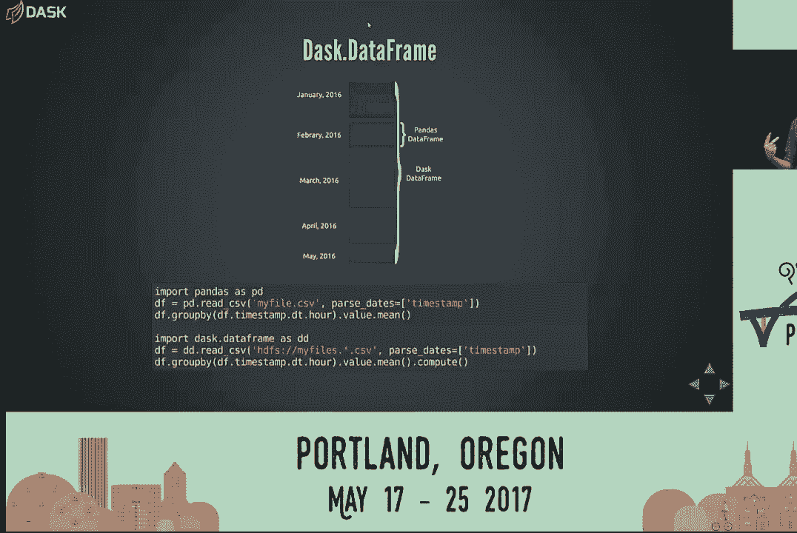

 So， I have here a cluster running on Google， Google Computer Engine。 And this cluster has 32 machines。 Each machine has two cores。 And I'm going to create an array。 Let's make that a little bit larger。 I'm going to create array， which is 1，000 by 1，000， or 10。000 by 1，000， but composed of NumPy arrays or 1，000 by 1，000。 So。

 sort of a 10 by 10 grid of NumPy arrays。 Each element of that grid is a NumPy array， 1，000 by 1，000。 And now， when I compute that on my cluster， DAS has gone ahead and has computed all those NumPy arrays for me。 We've seen that here on the left。 So， we're going to see these plots a fair amount throughout the talk。 So， I have 64 cores， and they're on this axis here。 So。

 every line here is what a core has been doing over time。 And we see that this core called the NumPy random function a couple of times。 and created a couple NumPy arrays。 So， on my 32 machines， I have 100 NumPy arrays in memory on them。 spread around them。 If I do something， let's say I'll compute the sum of this array。

 It's a really simple computation。 DAS is going to have to compute the sum of all the intermediate arrays。 It's going to transfer some of those intermediate values to other machines。 That's the red。 Red is data transfer。 And it's going to compute some final result。 And it gives us back a nice answer in a sort of fast time。 It's more complex。

 I'll try to scroll this down to the back。 Do something more complex。 If you are familiar with NumPy。 this syntax should look familiar to you。 And so， we can do a lot of these NumPy computations。 what look like NumPy computations， but are actually spread across a cluster。 So。 this is sort of the highest level use of DASK。 It looks like NumPy。

 but it actually runs on terabytes of data， if you wish。 Certainly。 we'll consider a Pandas data frame example。 So， here I have a bunch of CSV files on Google Storage。 It's going to go on S3 or on Amazon or as you like。 And this is the New York City Taxicab data set。 It's around 20 gigs on disk， around 60 gigs in RAM。 So， it's too big for my laptop。

 But I can read a little bit of it with Pandas。 And this shows all of the cab rides in the City of New York through your 2015。 So， how many press-inders were in the cab？ When did they take off？ When did they stop？

 As well as a breakdown of the fare。 So， it's a large time series data set。 maybe like you've sort of seen before。 It's sort of convenient because it's easy to understand and it's inconveniently large。 So， I can't read it all on one machine， but I can read it on many machines。 So， here。 rather than use the Pandas read CSV function， I've used the DASK data frame read CSV function。

 It has the same API， but breaks down my computation。 It takes those 12 CSV files and breaks it into hundreds of blocks of bytes。 And then calls the Pandas read CSV function and all those blocks of bytes。 And so。 what you're seeing here on the left is all the machines in my cluster are busy creating。

 Pandas data frames in their local memory。 The object we get back isn't a Pandas data frame。 it's a DASK data frame。 Which looks and feels the same。 And as we operate on that DASK data frame。 DASK will do the coordination to make sure all the Pandas， data frames are affected accordingly。 So。 again， DASK is sort of like a very good secretary。 So， not actually doing any computation。

 it's coordinating many Pandas data frames to do， the right computations。 So， you know， this。 because it's all built on Pandas， it looks familiar to all the D-type， sniffing。 we like from Pandas read CSV。 And， you know， it runs the same way， it sort of renders the same way。 It should feel relatively familiar。 And this is really important if you want to get all of the people in the Python ecosystem to use it。

 They tend to like Pandas， it turns out。 So， you know， simple computation。 we might compute the length of that data frame。 And that's， you know， that's done relatively simply。 we compute the lengths， all the intermediate values。 So， if you sort of zoom in over here。 We compute the length of this particular Pandas data frame， and it took， you know。

 a few microseconds。 And we did that a few hundred times。 And we communicated some data over one machine， and we called it， we did this one。 It was a very simple computation， but we could do something more complex。 Here we'll see how well New Yorkers tip。 So， we're going to remove some bad rows。

 There were like some free rides in New York City， it turns out。 We're going to create a new column。 which is the tip fraction。 So， you know， the division of the tip versus the fair。 was it a 10% tip or 20% tip？ We're going to group by the hour of the day and by the day of the week。 and we're going to see the average of the tip fraction。

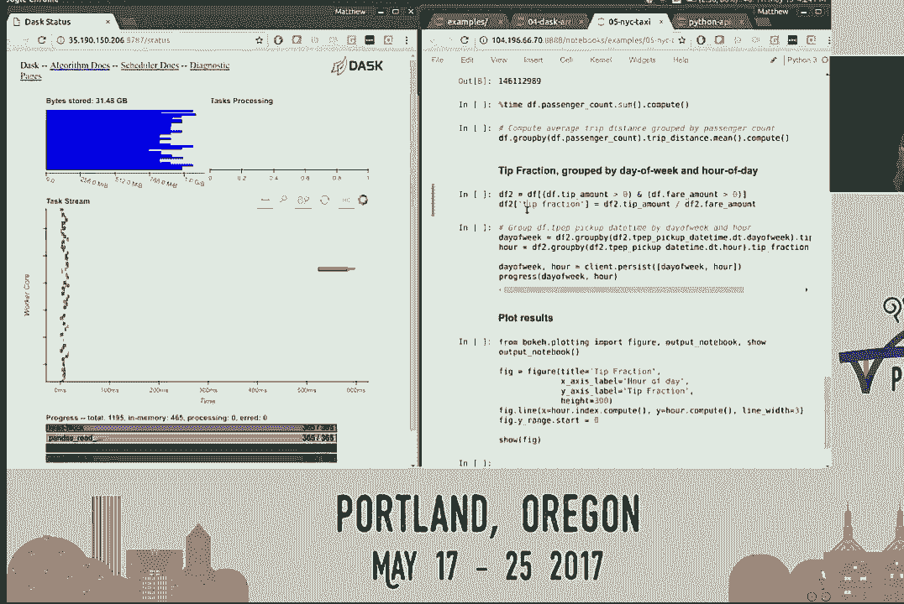

 So， how well did New Yorkers tip？ Grouped by hour of day。 And what this does is produces， you know。 thousands of Python functions that then ran on our cluster。 And it gives us a nice result。 So。 you know， data frame turned this Pandas-like computation into thousands of Python functions that had to run。 All of our Pandas data frames。 And then the Dask task scheduler ran all those functions for us in about like three or four seconds。

 We'll get back to the nice results that New Yorkers tip relatively generously as a recent migrant in New York。 I feel now proud of this。 It's about 20% on average with a startling spike at 4am。 It's 38% on average tips at 4am。 I understand this is last call at the bars。 But so， you know。 we did some data science on a large in-unit data set with APIs that we already knew on a cluster that was relatively easy to set up。

 So this is sort of like the first big hurrah of Dask。 Dask gives you a paralyzed or distributed NumPy or a Pandas data frame。 And for some people that is useful。 However， it turns out， so we thought this was useful too。 And then we took it to academic groups and to companies and we said， "Hey， isn't this useful？"。

 And I said， "Yeah， but our problems are actually a little more complex。"。 It turns out that not all problems are a big data frame or a big array or a big list。 Instead。 people often had code look like this。 They sort of just normal Python code with four loops。 This is very clearly parallelizable。 But it's not clearly a data frame and array computation。

 And so then our first approach was to sort of try to force this into being a data frame computation。 Maybe sort of two data frames and we're joining them and doing sort of a filter。 That was an awkward process。 So instead， we developed other libraries or other modules of Dask that can work on more generic code。 So the system underneath Dask array or Dask data frame， this is doing all the coordination。

 the secretary part。 That is actually fairly flexible。 And as long as we can expose that with more flexible， more fine-grained APIs。 we can parallelize far more clever and far more custom code。 So this actually ends up being far more used in practice than the big data frames or bigger arrays。

 At least by sort of larger institutions。 So let's see an example。
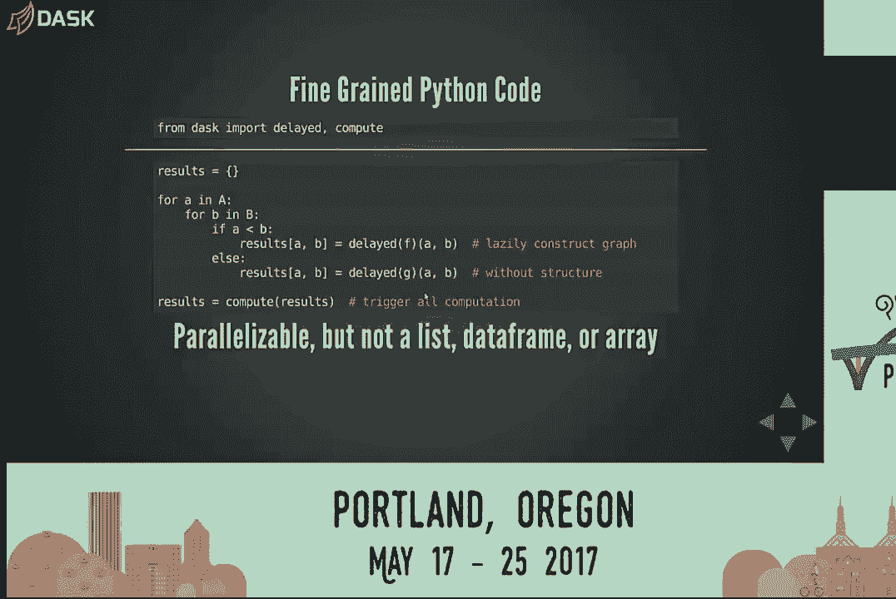

 I'm actually going to switch not to the cluster but just to my local machine。 This runs on a cluster just fine but I want to show you that it is easy to use Dask on your laptop。 My goal at the end of this talk is to be able to use Dask on their laptop and sort of start playing with it。 So instead of connecting out to a particular cluster， normally when we create a client。

 we'll talk about this in a little bit。 We put in some address of sort of the head node of our scheduler。 In this case， we're not going to add anything。 That's a signal to Dask that it should create something locally。 So Dask is going to create sort of little Dask cluster on our laptop。 Actually， I'm sorry。 I don't want this notebook at all。 I want the other one。 So， forget what I was just saying。 So。

 I have some functions here。 That simulate work。 So they're going to do a small bit of work but they're going to sleep for a while。 This is maybe some code you're writing on your own。 Inc adds a number adds one to a number。 decrements， removes one from a number and adds two numbers together。 I can call these locally。 Let's clear this out。 I can call these locally and they take a couple of seconds probably。

 sort of randomly。 Or I can import Dask and I can annotate those functions to be delayed。 That's what I mean here is that when we call that function now， we're not going to actually。 execute the code。 So we're going to put that function and its arguments inside of a task graph that we can。 execute later。 So now when I run that code， same code from before。

 it computes immediately but hasn't actually done any work yet。 So instead of produced this object Z which holds onto a recipe of how it should be computed。 whenever we want it to be done。 And so when I call compute on this object Z。 it's now going to run in parallel just on my， laptop。 Not on the cluster， not on any setup。

 I haven't set anything up here。 I imported Dask。 I called compute。 By default this ran in a thread pool。 By running a process pool or other things as well。 But this is an interface that we can use to build up parallel computations in a sort of more python-like way。 Now I'm going to set up a cluster。 Again， just on my local laptop。

 And one of the nice things is it gives me this nice dashboard page。 This is a bokeh dashboard。 a bokeh web application。 People are interested。 That must have been Sarah Bird。 There you are。 Thank you， Sarah。 And then we can run this on this dashboard。 We can see it run。 So we call it decrement on one of our threads。 We call it increment on another thread。

 We then this little red bit is communication between two different threads。 And we call it add on the results。 So Dask again is figuring out when to call things moving data around。 Doing other parts of parallel computing you don't want to think about。 While still letting you give you the freedom to do the things that you do。 So this is sort of neat。

 It becomes a lot better when you have four loops and you can make sort of arbitrary complex things。 So here I have got lots more computations and we are filling up these processes and doing。 lots of work。
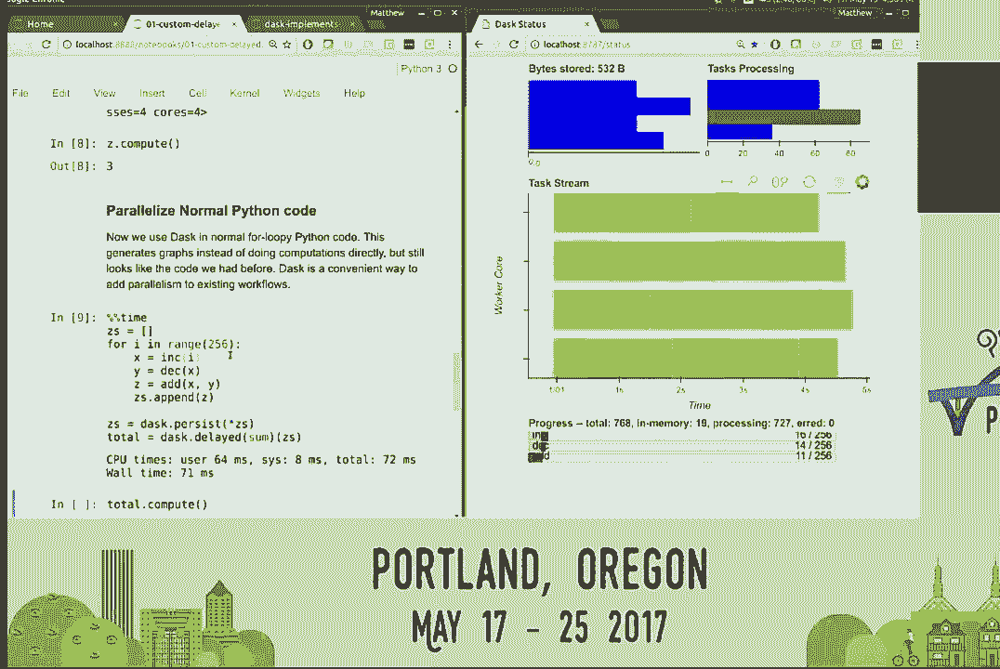

 I am noticing from these progress parts it is going to take a while。 So I am going to start up some more workers pointing it to this scheduler。 So this is making 10 processes which we will have for threads running。
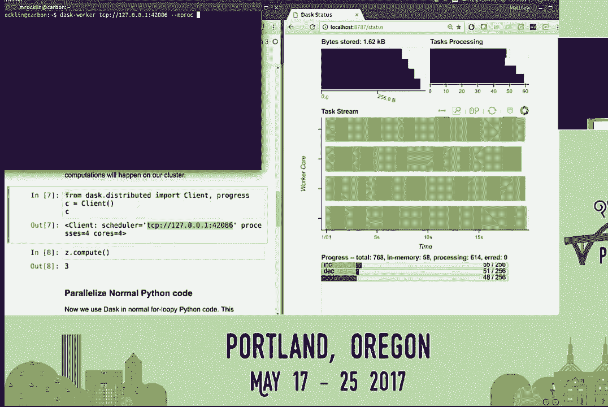

 So we are connecting it to the scheduler and now we are seeing the tasks that are responding。 to that is parallelizing nicely。 I could remove them。 Dask is resilient。 It can scale。 It can do all the nice things you want to cluster。 So now that we have this ability let's do something a little more complex。

 We have all these numbers across all these processes on my laptop。 I am going to add them together。 One way to do this is just to call some and all of them。 I have to migrate to one machine and add them together in one machine。 But there is something more fancy。 Let's add them up pair by pair。 The first two add those together。

 The second two add those together。 So here is some Python code that does that。 And this Python code is not a Dask code。 It is just Python code。 If you look at this for about a minute I think you will probably understand what it is doing。 It has a list of values and it goes through that list and adds neighboring pairs in that list together。

 It keeps doing that while the list is longer than one。 We can visualize that result。 Maybe you can see that。 The graph we get is showing us the computation we want to compute。 You can see that it is indeed producing the kind of computation we wanted to do。 It looks like this image up here。 Nothing has run yet。

 We have created a recipe for how to do these things。 If we ask Dask to compute that result for us it is going to use our cluster and use all。 of those processes to do that。 It is communicating between processes when necessary。 In the beginning there is lots of work to do。 Towards the end we have fewer and fewer ads to do。

 If you like to come to the continuum booth I will give you this demo。 This demo is demonstrating two things。 One big data frames。 Two。 the ability to write your own Python code and paralyze it。 It is being a lot more attractive。 A lot more pragmatic。

 Let's go back to slides。 Let's dive deeper into what Dask is doing。 Let's explain tasks。 Dask does two things for you。 One， it produces tasks。 You write data frame code and it figures out a recipe for how to execute that code。 Two。 given such a graph and a cluster or laptop it figures out how to execute that graph in， parallel。

 Those are two very different problems。 Really numpy pandas like the first kind of problem and tornado。 acing concurrency people like the， second kind of problem。 Two things happening once。 We talk about the first part and second part。 Task graphs。 Is this font visible in the back？ No。 Does this mean it is visible or make it bigger？ It is good。 I am sitting some bads。

 Let's see what we can do。 Reveal is not -- there we go。 A little bit better hopefully。 I think it is about as good as I can go。 We are going to do a simple array computation and see how Dask is producing into a task graph。 I am creating with numpy I might create an array of 15 ones with a numpy one's function。 It produces a result like that。 Let's say I only have 20 bytes on my computer and split this up between many computers。

 Then I might use the Dask array once function。 We are still creating array 15 ones but we are chopping up into three arrays。 Each arrays of chunk size 5。 We are calling the numpy one's function three times and producing three numpy arrays。 If I were to call something like sum on that array， Dask will know what I have to call sum。 and all the numpy one's function arrays。 We are going to compute the sum on all of them。

 We are seeing numpy code produce task graphs。 Now this is more interesting if we go to two dimensions。
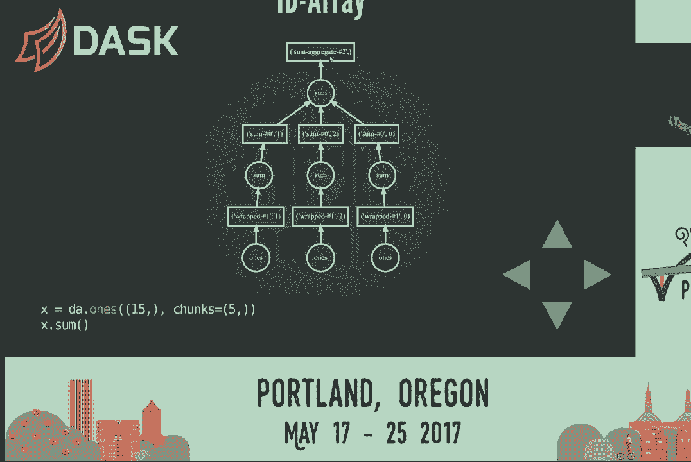

 I am creating a 15 by 15 array that is composed of numpy arrays of size 5 by 5。 I have nine blocks。 If I sum along one axis， I get the same summing behavior。 This is something you can do with NAPRODUCE with Spark。 Numpy array computation becomes more complex。 Taking that array and adding it to its transpose。

 Numpy people will be interested to see that there is on the odd diagonal nodes only talk。 to themselves and off diagonal talk to their transpose neighbor。 This difference is actually where I will get to this in a bit。 If you look at the data base systems like Spark or Storm， when they are losing these symmetries。

 that is being very good when you break down symmetries。 It handles generic cases。 We can work on plex。 We can multiply。 We can keep going。 This is a simple thing to do。 If you look at the climate scientists， they do things that are ten hundred times more complex。 than they produce graphs with millions of nodes。 We have made this graph。

 Now let's go ahead and compute it。 Again， whoops。 That's not topping at all。 This object， why。 is still lazy。 We haven't done any work yet。 When I call white。compute， the answer is zero。 It is not surprising that the answer is zero。 What is interesting is that it returned the answer in about 47 milliseconds。 In that time， four threads， went through every circle in this task graph， ran that function。

 passed it to other functions， ran those functions， deleted the rules they didn't have to do。 and proceeded through that graph。 That's roughly what the task scheduler does。 That's the execute graph and give us a number back。 Ideally， in a short amount of time。 we're supporting interactive people， who are sitting at the computer typing at it。

 waiting for result back。 We want to be very fast。 Let's go here。 Great。 Systems like to ask a writer to ask that a frame produce task graphs like this one。 This is actually from a site-learn computation。 And a scheduler executes that graph in parallel。 Here's a trace of a single machine scheduler walking through that graph with four threads。

 This is where we switch from the NumPy people to the more tornado concurrency networking people。 How do we run these graphs efficiently？ Before we talk about how to ask that。 I want to give a brief summary of other options， inside the Python space to motivate why we had to build our own thing。 We're talking about a few systems， simple systems like multi-processing or concurrent futures。

 Big data collections like Spark or Storm or Flink or Databases or TensorFlow and then task。 schedulers like Luigi or Airflow。 Let's consider a map。 Who has used multi-processing before？

 Lots of people。 Almost everybody。 Who has not used multi-processing before？ Sorry to pull you up。 Five brave people。 And maybe some less brave people。 So I take a function。 I have a bunch of data。 I want to apply that function and all that data。 Multi-processing is a very easy way to do this in parallel。 The pros and cons of multi-processing。 It's very easy to install。

 It's in the standard library and use。 The API is very simple。 It's also a very lightweight dependency。 Because in the standard library libraries don't mind depending on it。 Remember that's one of our goals。 We want to build a library that many libraries in the ecosystem。 all of these and thousands， more， are actually willing to depend upon。

 They're willing to put it in the requirements。txt file。
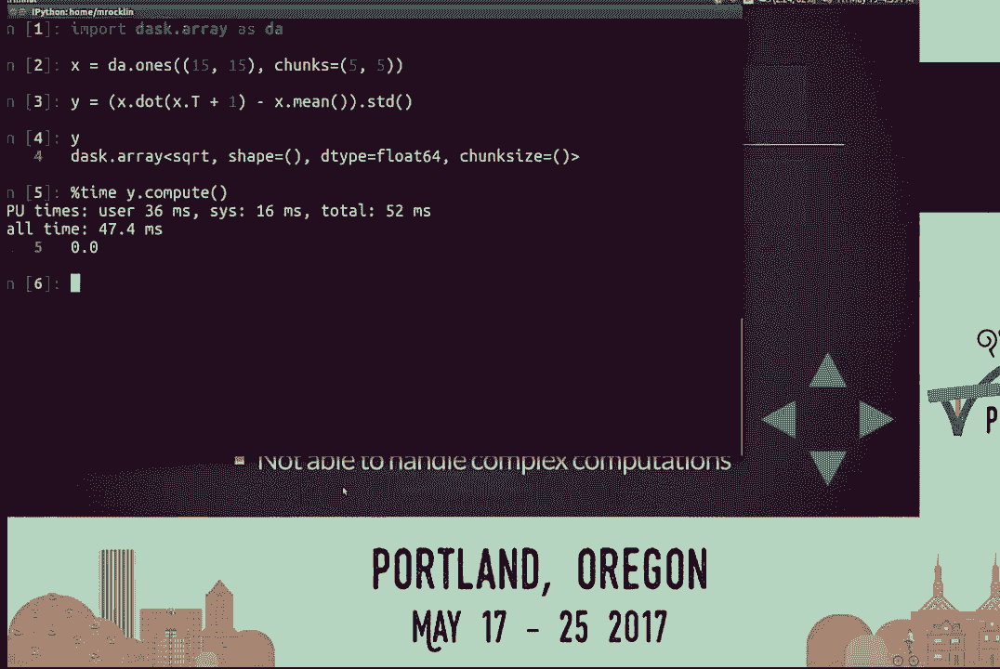

 Some cons。 There's some costs moving data across a process。 That is unfortunate。 And it's also not able to handle more complex computations。 So all of those graphs that we had map can't easily do those。 So let's go to something more complex。 Let's look at big data collections。 Things like Spark or Database。

 So these systems are a big step up。 They give you a fixed API。 Things like map and filter and group by and join。 And you use all of those operations， not just map。 And they will handle the parallelism for you。 This allows you to parallelize a much broader set of applications。 In particular many of these were implemented for ETL or data extraction and cleaning or。

 database comp computations or some lightweight machine learning。 So using the systems you can do all of those things。 So you're given a broader set of API to work with， like the SQL language。 It scales nicely。 And it's widely trusted by enterprise。 So I'm going to sort of take off my open source community hat and put on my like for profit evil hat。

 I also like， you know， desk is open source and free and everything。 But it's nice to pay developers to do this。 And the more people we get using desk and we can like convince people to help us pay developers to work on it to make it better。 So I actually care about this a little bit。 I'm a little bit evil and I apologize for that。 Okay。 [LAUGH]， So some cons about these systems。 They're somewhat heavyweight。

 So it'll be sort of hard to convince libraries to depend on Spark。 There's sort of this big sort of transfer of， you sort of have to step into the Spark world for a bit using。 computations and the step out。 It is unpleasant for a few reasons。 It's focused on the JVM。 Python is sort of always a second class citizen。 This is true with actually most of the parallel computing libraries out there。

 You know， Storm， Flink。 There were often they were built out of the JVM stack and were sort of piggybacking on their success。 Also， these systems are not able to handle very complex computations。 Now， what do I mean by that？

 I mean the graphs that we saw before。 These sorts of very， these graphs without much symmetry。 Sort of arbitrary dynamic task graphs。 Where every。 every circle in here is one Python function to run on one piece of data。 So。 they're not able to handle these。 Systems like Spark databases tend to be good at mapping a function across many things。

 Sort of all， all， shuffle communications， reducing things， but always sort of in lock stuff。 It's not a sort of fine grander granular。 We need to do some of these more complex computations。 They're going to be need to handle in order to support all of these libraries。 However。 there are some libraries that do handle more messy computations。

 These systems are actually commonly used in sort of the data engineering space。 Libraries like Airflow or Luigi or Celery。 Who in the room has used one of those libraries？ Okay。 that's actually awesome。 That is not the case in like the SciPy or PyDotox or conferences。 So。 these libraries are able to handle much more complex， much more arbitrary task graphs。

 They sort of fit the model that we need。 They're also Python native often。 So， you know。 these are libraries that we can hack on， that our communities are willing to depend upon。 They're nicer in that sense。 However， there are some cons。 So。 there's no inner worker storage or communication。 Latency is relatively high。 So。

 like 100 milliseconds between tasks is an okay thing for these libraries。 It's not okay for us。 We work on sort of the millisecond to 100 microsecond level。 We're not optimized for computation。 That being said， they're optimized for lots of things that Dask doesn't do。 I don't mean to sort of besmirch either of these libraries。

 Both Spark and Luigi and Airflow do lots of things that Dask won't do。 but Dask is sort of good at the sort of mixing between them。 So， we want a task scheduler。 like Airflow and Luigi， but it's more computationally focused。 like something like Spark or Flinker TensorFlow。 And that ends up -- so。

 our sort of attempt to build that system is called Dask， which -- so。 we've seen Dask data frame and Dask array， and those are things built with Dask。 That is not Dask。 Dask is a dynamic task scheduler at its core。 So， it gets a graph of tasks such as you would give to Luigi in a complex case。 and it executes them on parallel hardware， or might be your laptop， or might be a cluster。

 We're relatively fast in various ways。 We're not as fast as MPI。 but we're sort of faster than most other things。 Also， lightweight， we'll see in a bit。 and it's well supported。 So， I'm talking a little bit about task schedulers。 There are two main task gutters within the Dask sort of world。

 There was one that was built many years ago for single machines。 It typically runs on top of a thread pool or a multi-processing pool。 And this runs with very low overhead。 It actually only depends， so it's about， you know。 50 microseconds per task overhead。 It's fast。 It can handle arbitrary graphs。

 It's relatively concise。 There's about a third of 1，000 lines of code。 It actually depends on nothing except for the standard library。 So。 even very conservative libraries are willing to depend on this code。 It has been stable。 it has been changed much， and people have not wanted to change this code for a long time。

 This is a stable code， it is lightweight， it's easy to use。 And it's used by many groups on many different applications。 The diversity of applications on these schedulers is very broad。 So。 it's likely that if you have a different application， it will also likely work。

 They're not optimized for like array computing or for data frame computations。 They're optimized for general computing。 Maybe like a year and a half ago。 we started building a distributed cluster scheduler， which is more sophisticated。 but also a bit more heavyweight。 This is a tornado TCP application。 It's a little less concise。

 It's fully asynchronous。 So， you can submit graphs to the thing， even as it's running。 You can get sort of a constant conversation back and forth。 It supports sort of the HDFS space。 the Hadoop space， and it also supports the more sort of traditional cluster HBC space。 So。 when you're seeing things running on a cluster， we're running this distributed scheduler。

 How it is organized， there is a single process running somewhere on your cluster。 which is the scheduler。 So， it might call us like the master or the head node。 This process is going to coordinate all of the other processes in your cluster。 There are then many workers that will take instructions from that scheduler。 So。

 the scheduler might say， "Hey， worker one， I want you to compute this task。"。 The worker will compute that task and hold on to the result and inform the scheduler that it's finished。 The workers will communicate peer-to-peer to share data around。 so they're not communicating through one central bottleneck。 And then we， as a client。

 down here from our， you know， maybe from our Jupyter Notebooks or from some script we're running。 you know， nightly or whatever， we're then going to submit graphs up to that scheduler。 So。 the workers and the schedulers are all TCP servers。 They're communicating over various interesting protocols。

 And the client is just a client up to the scheduler。 So， you can set this up relatively easily。 You can install on your laptop like I did before。 You can run it on a cluster。 It's relatively lightweight also。 So， at the bottom。 I'm actually just running it inside of one process。 And I can start this up。

 including the fancy dashboard and everything。 There are 43 milliseconds。 So， you can import this。 You can run it。 You can tear it down。 And it is not a big thing。 It's cheap。 You should not think of distributed computing as being like a far away hard thing to do。 It is like。 this is faster than importing pandas。 Importing pandas takes like 200 milliseconds。 So。

 you should think of this as being a cheap thing to do。 You can also， if you don't like Kanda。 you can pin this to all the ask。 Everything is pure Python。 So。 I'm going to go through the time I'm not going to go through this。 But this shows an example of how the scheduler might work in a simple example。 So。

 DAS is easy to use and adopt。 You already know a lot of the APIs that DAS presents。 There's no single DASK API。 We largely steal the APIs of other languages or other projects。 And you probably already have dependencies installed。 You probably have tornado installed。 You probably have message pack installed。 If you want， you know， DAS data frames， you need pandas。

 but you probably have that installed。

 if you want that anyway。 So， in order to improve adoption。 in order to sort of reduce the amount of like creativity， we had to have。 DASK largely uses existing Python APIs。 So， we support a lot of the NumPy and Pandas APIs and protocols where they exist。 We support PEP 31-48， which is concurrent futures。 If you're familiar with that library。

 DASK supports that perfectly。 We also do async await。 If you like concurrent async work。 it'll also use job。lib。 So， you actually take existing scikit-learn code and there's a way in joblib。 which is， scikit-learns parallelism library， to hijack how it does parallelism。 As you can run your scikit-learn code on a cluster。 It may not work very well in all cases。 But we。

 you know， where there is an existing protocol for parallel computing and Python。 we have usually implemented that。 So， you probably already know how to use DASK。 You probably also。 it's also very lightweight。 You guys sort of just， you know， using existing libraries。 Let's look at， yeah， a little bit of time。 So， let's look at some of these APIs。 So， again。

 we've seen， you know， if you know NumPy， you probably know how to use DASK array。 Here's an example of scikit-learn。 This came from the， this is an example of the scikit-learn docs。 And， you know， someone， so we're making a pipeline。 We're going to do a cross-valided grid search across that pipeline。 Just normal scikit-learn code。

 And it takes。 Or， eight seconds or nine seconds。 And now someone， actually his name is Jim Christ。 a word library， a DASK search CV， which is a drop-in replacement for grid search。 So。 now when you run that， it's going to run that on our own cluster。 And it looks just the same。 We're using all the scikit-learn APIs。 So， it looks， you know， it fits into existing work as well。

 It ran faster。 We also noticed， like， there was a lot of white space here。 A lot of our workers weren't doing anything。 So， now that we have a bit more computing power。 let's go ahead and， you know， increase this a little bit。 We'll increase our parameter search space。 If you don't know scikit-learn， that's okay。 You should just understand that I'm increasing inputs and we'll get more work。

 And it won't be slow。 So， now that we have more work， more computing power。 we're going to sort of search this space a little bit better。 And again。 if you sort of know scikit-learn， this should have been pretty familiar to you。 So。 a lot of the DASK work is just helping other libraries parallelize themselves using those same interfaces。

 DAS supports concurrent futures interface。 So， here we can， you know， do the sort of executive。submit model。 It's actually fully asynchronous。 So， like， as work comes in。 you can submit more work in a fully real-time way， which is fun。 We do things like async await。 So。 here's， you know， a fully asynchronous thing， you know。

 all those sort of Python code that you've seen。 None of， except for， like。 the import DASK statement， none of the code you've seen on this notebook， you would。 you would qualify as DASK code。 It was all the kind of code you've seen before。 But it was all parallelized in a nice way。

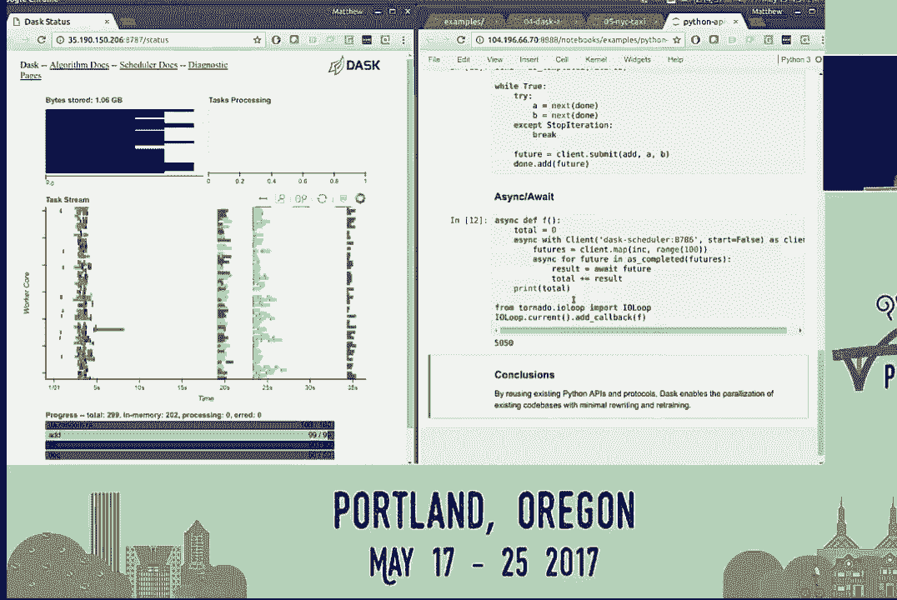

 And that's， again， sort of one of the objectives of DASK。 Okay， so again， at a high level。 DASK gives you parallel APIs。 Parallel pandas， parallel mumpy， parallel second-learn。 subset of all those， not complete。 It's also very good at parallelizing existing custom systems。 At a low level， DASK is a task scheduler， which means that it runs Python functions on Python OAuth。

 It functions on Python objects on parallel hardware。 Well。 those Python functions are what the Python objects are， it's up to you。 It can be your own special object， your own special functions。 DASK doesn't need to know what it is。 It can just run it， and it will figure out where and when to run those functions。

 If the machine goes down， it will bring it back up。 All those sorts of nice parallelism things。 Okay， so I want to take a few minutes about sort of just general ecosystem comments。 So。 I'm normally a fairly critical or sort of like pessimistic person。 I apologize。 but I'm going to gush a little bit。 So， I think that the Python ecosystem is really the best place to build this kind of project。

 We built DASK way more easily than you would expect us to be able to。 That's because of all the work that's already happened in the ecosystem。

 So， let's look at sort of the Python strengths and weaknesses from sort of a parallel data analysis point of view。 So， Python is a very strong algorithmic tradition。 The community who was like writing code with punch cards or in Fortran has moved to Python。 And they know how to do those things very， very well。 They know algorithms very well。

 They know they have PhDs and math or something。 A lot of battle hard in Fortran code。 which one's very efficiently。 They use just the best SSE2 instruction on your CPU。 We also have alongside that a very strong networking currency stack。 And it's very sort of very rare to have both of those in the same language。

 We also have sort of very standard in teaching。 So， there's lots of people using Python。 Weaknesses。 I think， are not actually that true。 People think that Python is slow。 There's the Gil。 Those are questions about packaging。 So， a few comments about this。 So。 the NumPy and Py--the C sort of numeric stack on Python is very， very fast。

 It is running bare metal speeds。 So， here I have 1，000 by 1。000 array and I'm doing a matrix multiply。 There's about a billion multiplies and ads in that computation。 And we ran that in around 70 milliseconds。 It's about 10 billion operations per second。 I think about my laptop。 My laptop only like has like a two or three gigahertz processor。 So。

 actually doing more ads than I have cycles in my system。 If you know about CPUs。 that doesn't surprise you。 But we're running up bare metal speeds。 The Gil。 people often concerned about parallelism and the Gil。 Again， for the numeric stack。 this actually doesn't matter。 The Gil is not a problem if you're mostly running numeric code with libraries like NumPy。

 and Pandas and scikit-learn。 So， the Gil stops two Python threads from operating at the same time。 But--or two Python threads are actually using Python code at the same time。 But our threads are just calling out some C function and then they sort of wait until a function returns。 So， we're not actually calling Python code。 We're calling C or Fortran code。 So。

 you can run Python with many threads and saturate your hardware very easily if you're。 using NumPy or Pandas or that sort of stack。 You should use threads freely unless you're doing。 you know， Python extreme manipulation。 But use threads， you know， just general comment。 Alongside that， there's also this totally different community。

 It's at the same time simultaneously building out a very strong and very intuitive concurrency networking stack。 So， here's some code that， you know， such as you might see inside of a set of desk that。 does a lot of concurrent things。 You might now write that with a single wait。 I'm going to ask you。 use tornado。 And this code looks simple。 It looks easy to understand。

 And that is actually remarkable。 This would not have been the case 10 years ago。 At the same time。 it's also quite fast。
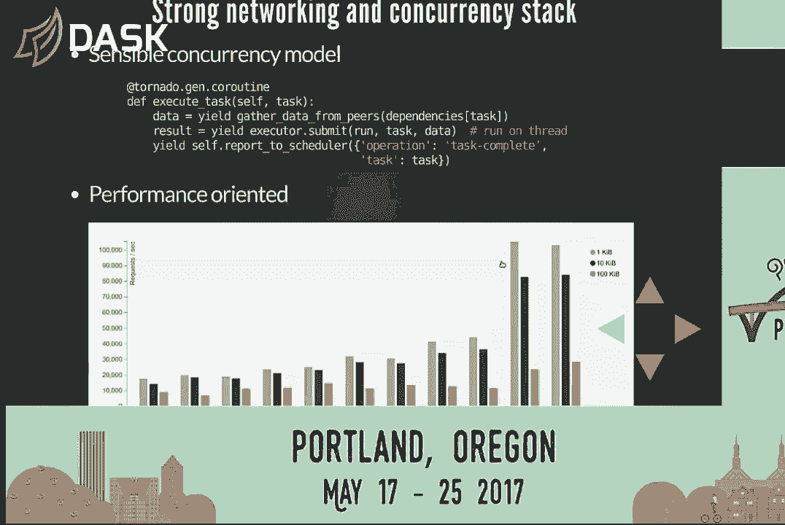

 So， this is from a blog post about UV loop。 Let's see if I can get that link in there。 Talking about， you know， various UV loops， various event loops。 And that's actually running on tornado， which is way down here。 But even that is running at 20。000 TCP requests per second， which is like totally fine for us。 So。

 this community is also very focused on performance。 Not in a numeric computing way。 but in a concurrency sort of way。
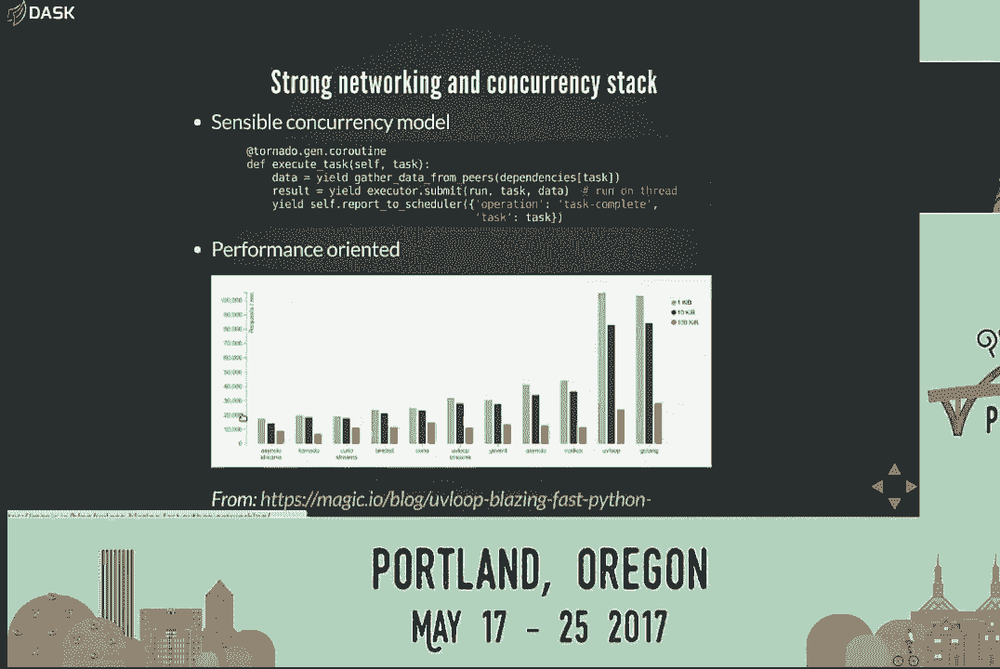

 So， Python is both an excellent numeric computing stack and an excellent concurrency networking stack。 And that's actually quite rare。 It's really a blessing that we had sort of those two groups of people in the beginning。 And they're both in the same room together。 And it's because of that。 that desk was actually really easy to build。 So， most of the work of building desk was built。

 you know， five or ten years ago by all of you。 So， I appreciate your efforts。

 In the interest of time， I'm going to stop。 But many people work on desk。 It's not just me。 There are various government organizations and nonprofits that fund a desk。 We like to thank them as well。 Yeah， just show engagement in the last 48 hours。 These projects have mentioned or committed code using desk as well on GitHub in search for a desk。

 So， it's sort of nice to see that。 Okay。 Thank you。 [applause]。 We've got about five minutes for questions。 So， if you could line up by the microphones。 Sure。 Is there a C API？ There's not a C API。 Python， or a desk is a Python project。 Okay。 So。 let's say I have some code that takes， it's a wrappedless swig and it takes in a NumPy。

 or a NumPy array。 Could it also potentially operate on a desk array and still take advantage of the functionality。 or is it a complete no-go？ So， a desk array does not implement sort of the NumPy low-level ABI interface。 Okay。 However， if you have a function because a desk is composed of any NumPy arrays。 you might be able to just apply your function on all of them， depending on what your function does。

 Okay。 Thank you。 Thank you。 In your demos， you were acting as a single client to your cluster。 How does it behave if you have， say， multiple clients competing for the cluster's resources。 at any given time？ Yeah。 So， one desk cluster can have multiple clients working on the same data。 desk graphs or a， Merkle tag。 If you know what that means， you'll be great。 So， it can share nicely。

 That being said， most people who do multi-client workloads end up allocating separate schedulers。 and workers。 Great。 Thank you。 Does desk do any optimization of the task graph？

 Is that a thing that is a priority for the project right now？ Yeah。 So。 we do the kind of optimizations that are all linear in time。 So。 the kind of things you would see in a normal compiler， but none of the complex ones。 So。 in particular， we don't do any sort of like data frame optimizations， like ordering， reordering。

 because we don't， at the task graph level， we sort of already lost that information。 But loop fusion， you know， those sorts of operations we do nicely， calling the graph。 Yeah。 Have you looked into or do you do any sort of use of OpenCL or CUDA for even higher parallelization。 on the GPU？ Uh， no， but you can in your Python function。 And then。

 desk can run that Python function on various machines with GPUs。 So。 desk runs Python functions on Python objects。 What those Python functions do is entirely up to the user。 You can annotate that certain workers in your graph have GPUs and desk will respect that。 and allocate accordingly。 But we don't actually like use CUDA to execute our parallelism。 Okay。

 Thank you。 Can the schedule take advantage of any data locality？

 Say this node has this set of files。 So。 Yes。 [laughter]， In many ways， yes。 Is there any limitation to the work that you can do inside of the function that you're passing。 and if it's a custom function？ Sorry， second please。 Is there any limitations into what you can do inside of the function that gets passed into。

 the distributed workload system？ Um， your function must be serializable with Cloud Pickle。 So you can have like locks or open files you're passing into it。 Um。 your function should not mutate state that's given to it。 Uh， so you generally， to be resilient。 we have to sort of assume that。 Um， you shouldn't call us to segift， but other than that。

 Even that would be fine。 Like that's what we're covering from that just fine。 Okay。 Thanks。 Okay。 One more and then we've got to add。 How big can it scale up？ Like。 what's the largest cluster you've run it on？ What are some super massive workloads you've tried it against？

 The largest cluster I've had my hands on is a thousand， oddly windows machines。 Um， um， uh。 the number I have in your head is that every task is about a 200 microsecond。 overhead inside the scheduler。 So if your tasks take about one second each。 you can saturate around 5，000 cores。 Sort of the back envelope， uh， number to have in your head。

 But a thousand is pragmatically what I've seen。 I've actually seen someone try bigger and fail。 but I assume if you had to 100，000， you'd run， into something。 Thank you all for your time。 [applause]。
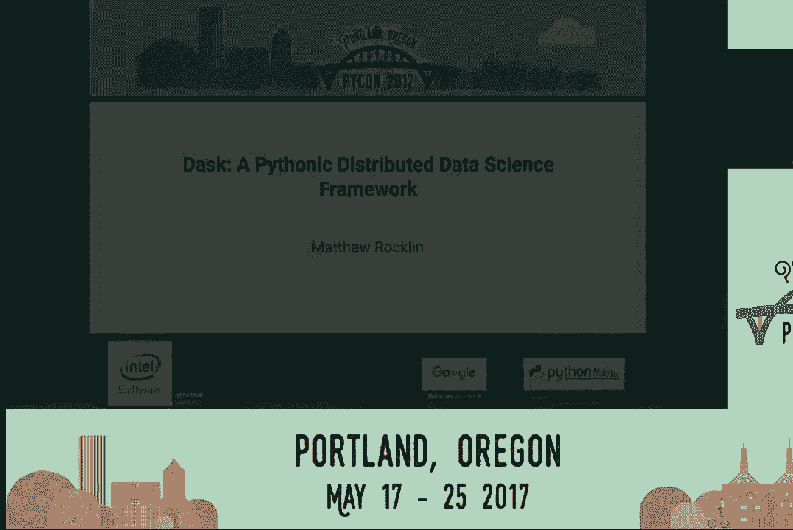

 [silence]。
