# P9：Jake Vanderplas - Keynote - PyCon 2017 - 哒哒哒儿尔 - BV1Ms411H7jG

 [APPLAUSE]， Come and get this。 All right， I think I'm up。 Hi， everybody。 It's great to be here。

 My name is Jake Vanderplaus。 So as I was thinking about this talk。 I was reflecting on the other pikons I've been to。 This is my sixth one in a row。 And thinking back five years in 2012， I was a kind of scruffy， starving PhD student。 And I came to Picon on a scholarship， a travel scholarship from the PSF。

 And it was my first experience with a big conference like this。 And I was just blown away by the quality of the talks， by the people I met。 I'd been using Python for years。 And I got to shake the hands of the people。 who wrote libraries like NumPy and SciPy and iPython。

 and all these things that I've been using in my work。 And I was just blown away by this conference。 And I have to say， I never imagined， that I'd have the chance to stand up here and address you。 And it's really， really， really a privilege for me。 So I want to thank the PSF for giving me a chance five years ago。

 And I want to thank Brandon and the organizers， for giving me a chance today to share what I have to say with you。 So thinking about PyCon， one of the things， that comes to mind for me in my experience here。 is that PyCon is kind of a mosaic in some ways。 If you go to a conference like the SciPy conference。 or DjangoCon， or PiData， or AnacondaCon， or JubiterCon， or all these other ones。

 you get a specific slice， of the Python community。 But at PyCon， you get everybody。 And it's interesting。 Everybody has-- each little slice of our Python community。 has their own way of using the language， their own sets of tools that they like to use。 and their own approach to solving problems。 And this came to light for me a couple years ago。

 I found myself during one of the PyCon meals， sitting with someone who was pretty well known。 in the Python community。 And you might know me that I'm a fan of the Jubiter notebook。 and the IPython notebook and those types of tools。 And I was sitting at that table。 and this person across the way， said， oh， yeah， you know， IPython。 It's bloated。

 and it encourages bad software practices。 And I was thinking， you know， my first response。 was to get a little bit defensive。 And I did the thing that， you know。 it's true to my family upbringing， and I changed the subject and avoided confrontation。 But thinking about that later， I， realized that this wasn't a moment of attack or defensiveness。

 This was a moment that reflects the fact that that person uses。 Python for different things than I use Python for。 And Jupitr makes sense for me， but it might not。 make sense for him。 And I think that as we go through this weekend， it's a really nice way to--。 it's a good opportunity to talk to other people who， use this language differently than you do。

 So I want you to keep in mind this Python Mosaic， as we move forward。 So who am I？

 I'm Jake VDP if you can find me on most of the internet， under that handle。 And the most important thing about me right now。
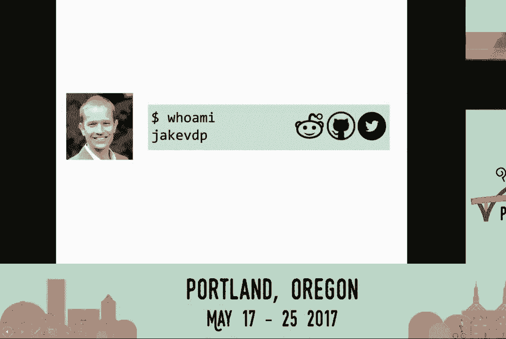

 is this little one right here。 So four weeks ago today， my wife and I。 got a call that we'd been waiting for for a long time。 but nevertheless kind of struck us out of the blue。 This little gal was born that morning。 and needed a family to take care of her。 And so I've been-- since my job is a little more flexible。

 I've been home on paternity leave for the last four weeks。 like furiously writing PyCon slides between bottles， and poopy diapers， which has been just great。 So a huge thanks to my wife for taking a vacation day。 today to be home with the kids so that I could be here。

 It's awesome。 Yeah， in the Python world， you might know me。 I write this blog sometimes。 I've contributed a lot of code to SciPy， SecutLearn， Astropie， and some of these types of packages。 And I also have a couple books that I've written， that you can check out if you want to。 And one of the huge reasons that I'm able to do all of that work。

 is that I have an employer who is amazing and helps me--。 actually supports me in writing code every day， and developing these kinds of libraries。 The University of Washington eScience Institute--， it's a fun place to work。 I'm able to spend my days on research， on coding， on helping researchers around the University。

 to more effectively use their data， and use their computational resources。 And a big reason that I'm able to do that--， I have to throw a shout out here to the Moore Foundation。 the Sloan Foundation， and the Washington Research， Foundation。 because they support pretty much all the work， that I do and any of my open source contributions。

 you can think that they're behind it。 So anyway， another thing about me is I'm an astronomer。 And I'm coming to this talk from the perspective， of an astronomer。 So what I want to do a little bit today， is tell you about how I as an astronomer and as a scientist。 use Python。 It might be a little bit different from how you use Python， and the tools that you use。

 But I want to give some perspective， on what it is that drew a scientist to Python。
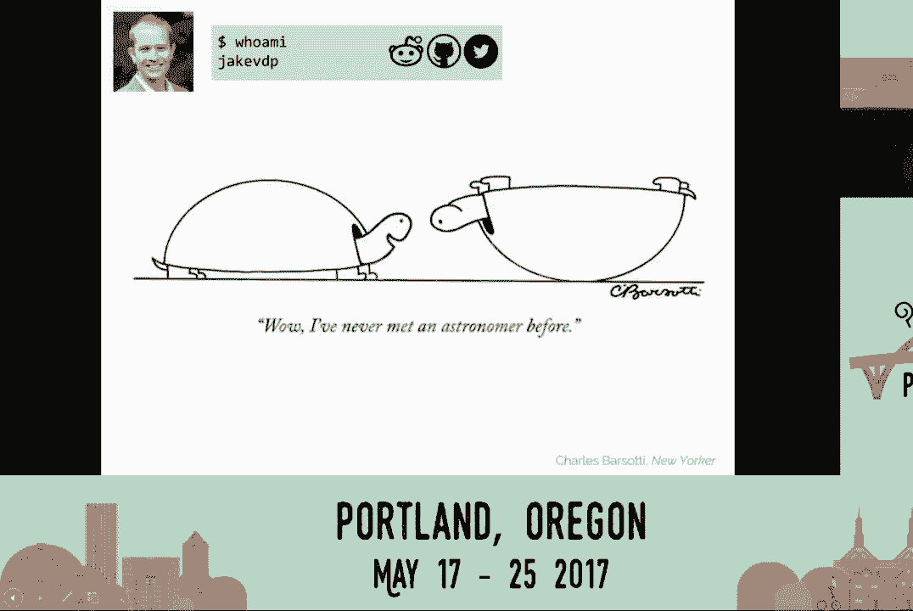

 in such big numbers。 So when I say that I'm an astronomer。 a lot of people have this kind of image in mind。 This is Edwin Hubble at the Schmidt telescope。 back in the 1940s。 You might know Hubble because he has a famous telescope named， after him。 He was one of the people who discovered the expanding， universe back in the early 20th century。

 And this is kind of a nice romantic view of astronomy。 at an aged astronomer with a pipe in his mouth， looking through an eyepiece。 But in my 10 years as a professional astronomer， I honestly think I have never looked through a telescope。 to be honest。 The way that professional astronomers look at the world。

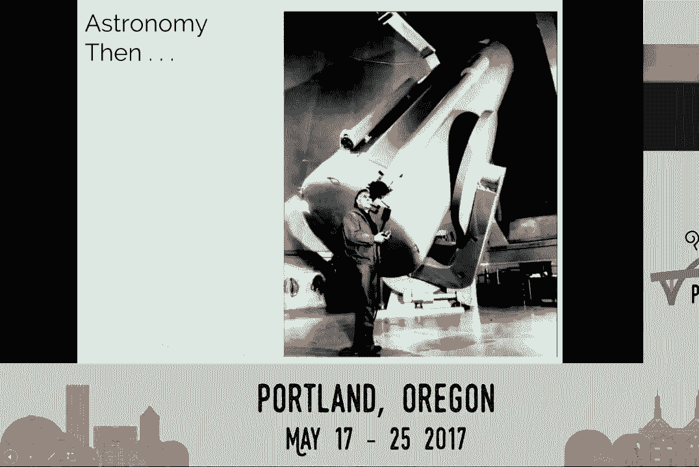

 is through database queries， of course。 Because we have all these phenomenal instruments out there。 that are measuring data at huge rates。 And I want to highlight two of these， that have been really。 really big in the last 20 to 25 years。 One is the Hubble Space Telescope， which you've probably。 heard of。 And another is the Sloan Digital Sky Survey， which I think。

 probably fewer people have heard of。
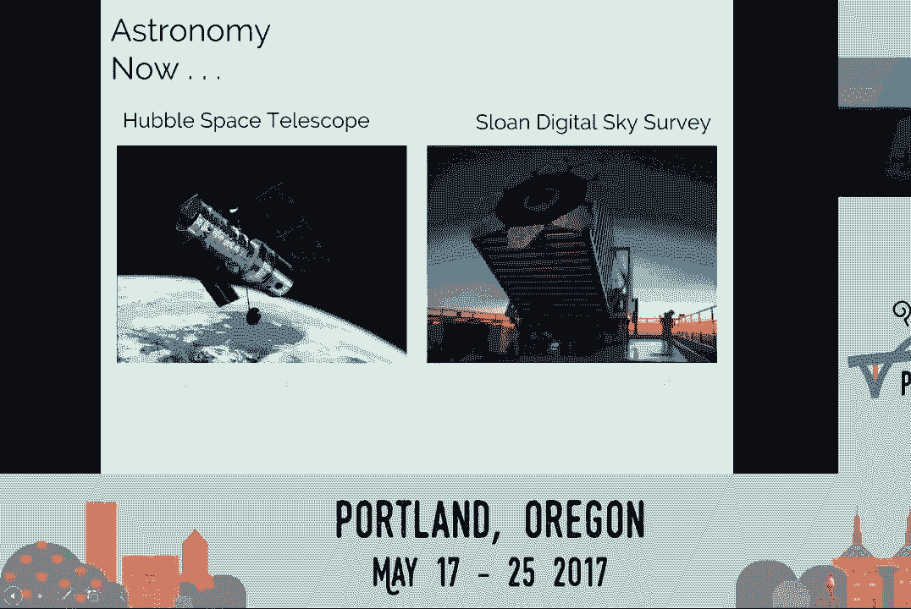

 The Hubble Space Telescope is this instrument that's， been flying up orbiting the Earth since 1990。 And just taking phenomenal pictures of the universe。 And this is one of my favorites right here。 This is known as the Ultra Deep Field。 And what this is， is Hubble looked at a small little slice。 of sky。 The field of view is about a tenth the diameter， of the full moon。

 And in that small slice of sky， integrated for hours and hours。 and hours to capture enough photons to create this image。 And every single blob you see there in that image， with the exception of maybe two or three。 is a distant galaxy。 It's a collection of billions of stars。

 that's sitting out there in the universe， up to 13 or more， billion light years away。 So some of these blobs that you see in these pictures right now， in this picture right now。 are galaxies， that are from the very beginning of the universe。 And we can gather that light。 And we can learn about where our star came from， where our galaxy came from， and what kind。

 of the overall dynamics of the universe is。 So Hubble has been phenomenal for teaching us。 about those kinds of things， for learning， about the early universe and about things。 in very fine detail。 A complementary type of approach is。 what's done by this Sloan Digital Sky Survey。 And what I'm showing here is the galaxy catalog。

 from the Sloan Digital Sky Survey。 The Sloan Survey， rather than looking at just a single little。 point on the sky like Hubble， scanned the entire sky， over the course of a decade and was。 able to do spectroscopic measurements of each， of the objects out there。 And so in this plot right here， what you see are the locations。

 the three dimensional locations of galaxies in our universe。 We're right at the origin。 right at the center， and looking out in those arcs is the piece of the sky。 that the Sloan was able to look at。 And what astronomers have been able to do with this。 is to look at this and see the galaxies are not spread out， uniformly。

 There are all these clumps and clusters and filaments， and voids。 And encoded in that information about the spatial distribution。 of the galaxies is information about the universe， as a whole。 How much matter there is。 how much dark energy， there is， how much dark matter there is。

 And so we're able to do that through this really huge data， set that comes from the Sloan Survey。 Now those are kind of older telescopes。 Those were launched in the '90s。 And the modern science in the last few years， has been driven by some other telescopes。 One I want to highlight is this Kepler project。 And you've probably heard about the Kepler project。

 because there have been lots of press releases lately。
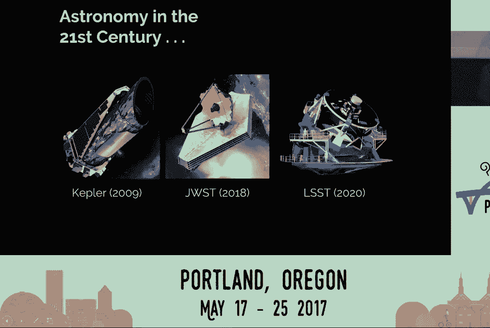

 with images like this， right？ This is the Trappest One Exoplanet System。 It was not actually discovered by Kepler， discovered by the Trappest Telescope。 But what's special about this is this is a small star。 a few light years away that has seven small rocky planets， around it。 And we've been able。

 with these telescopes， we've been able to discover these other planets orbiting。 around other stars and start to think about， you know， what might those planets look like。 The reason these are so special is because a few of these， are in what's called the habitable zone。 And astronomers define the habitable zone， as the region in space where liquid water can exist。

 Because we don't have any other good definition， of how life can be。 So we think， you know。 water's a good thing to look for。 But pictures like this， these artisan pressions。 kind of are misleading。 The actual data that you get on a planet like this。 or on a system like this looks like that。 That's what we've observed with Kepler。

 This is the K2 observation of the Trappest System。 And let me describe what you're seeing here。 What you're seeing is it's a single star， that is kind of wandering around between pixels。 because one of the stabilizers broke on Kepler， so it sort of wobbles as time goes on。 And the signal， the planets that you're looking for there， are。

 you see those as they eclipse the star。 So the star has this brightness and the planet goes in front。 of it。 And as the planet goes in front， it， makes the brightness of the star dip a little bit。 And that dip of a sub percent level， is what we're looking for to find the planets in this data。 And now it's really hard because you， have instrumental noise。 It's a faint star。

 You have the star itself varies。 It has star spots on it。 It has solar flares and all this stuff。 So the way that you can actually pull out these planets。 is through this incredibly intricate statistical modeling。 of the system and the physical parameters of planets。

 as they go around and what we know about how that does。 So finding these sorts of systems。 comes down to writing statistical code， and really intricate data processing pipeline。 And I hope you won't be surprised if I tell you。
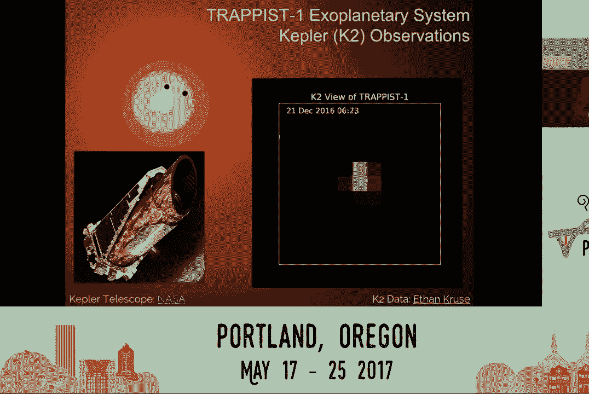

 that what Kepler is using for that， is Python code that's on GitHub。 So if you want to see some of the code that's， being used for these data reductions。 you can actually go and see this in open source。 And this is something， as I'll talk about later。 this is something that's come from the scientific community。

 embracing the norms of the Python community。 So another telescope I want to tell you about--。 this is the James Webb Space Telescope。 This is not actually the telescope。 It's a scale model。 So the telescope that's billed is the replacement to Hubble。 Hubble's been up there 27 years。 It's had a long run。 But it's going to wear out soon。 And we need something else to replace it。

 And James Webb is going to go up in space。 And it has this huge mirror。 Hubble mirror is about the size of a person。 The James Webb mirror is about three times that diameter。 And the other thing that's different about the James Webb， telescope is once it's up there， it's。 not going to be as sensitive to visible light， the red， green， and blue that our eyes can see。

 It's more tuned to infrared light。 So the light that's just a few wavelengths longer。 than a little bit longer wavelength， than the red light we can see。 And one of the reasons that's important， is because in the infrared and with the kind of precision。 that James Webb will have， we might， be able to actually image those exoplanets that。

 are going around other stars。 So rather than just seeing their shadows go in front of the star。 we might actually be able to see some of those planets themselves。 And one of the most exciting prospects， is looking at the types of spectroscopic measurements。 that James Webb is going to be able to do。 It's spectra is when you break light。

 into its component wavelengths and kind of look， at the wavelength flux distribution。 And what you can see， what we'll be able to see， is as these planets go in front of the star。 we'll be able to isolate the light or find， the component of the light that is passed。 through the atmosphere of that planet。 Look for molecular absorption in that light。

 and then infer the molecular content of the atmosphere。 And this is super exciting。 This is kind of a holy grail in exoplanet science。 We're actually going to be able to know what。 these planets are made of。 And there's some things that it's a long shot。 But if you look at the types of gases that， exist in atmospheres and planets out in the universe。

 there are certain things that never show up， like oxygen and ozone。 And those oxygen and ozone are things， that have no known geophysical source。 They only come from biology。 They only come from basically bacteria and plants， and living things。 So there's a small possibility that in the next five or 10， years， we'll be able to sniff out。

 the chemical composition of a planet around another star。 And if we see something like an ozone layer， it'll be a really good indication that there's。 some sort of at least bacterial life on that planet。 And I find that to be incredibly exciting。 right？ I think exploring the universe in this way is huge。 And again， if you want to know how we're。

 processing that data， JWST and actually the whole Space。 Telescope Science Institute has moved to using Python。 and Jupyter notebooks to present their material。 So it's pretty incredible。

 And the last project I want to tell you about briefly。 is this one that's really going to change every part， of astronomy over the next 10 years。 This is something that my PhD advisor has been intimately， involved with from the beginning。 So as a grad student， I was able to work， on a lot of aspects of this。

 It's a large synoptic survey telescope。 So I don't know if you can see， but there's。 an image of a little person standing there， right？ So that's about the size of the telescope。 This is going to be a large ground-based telescope。
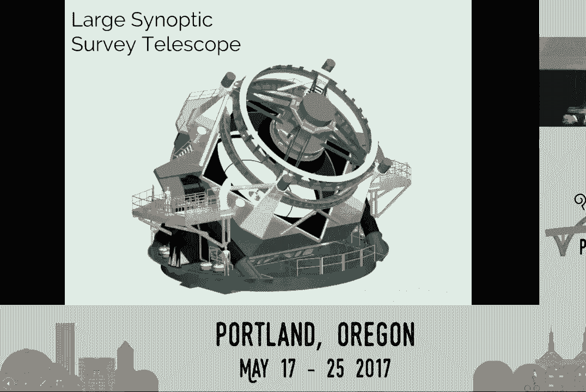

 It's not flying up in space。 Here's a picture of the mirror blank a few years back。 before they started polishing it with the LSST team。 And with a mirror this big。 you need a really large camera。 So LSST is constructing the largest digital camera ever， created。 It's a three-gigapixel camera that has a CCD， about the size of a person。

 And just to give you an idea of its field of view， we have an image of the moon there。 on superimposed on the CCD chips。 And this is just absolutely mind-bogglingly huge， right？

 Three-gigapixels。 If you imagine an HDTV， that's something like 2，000 by 1，000。
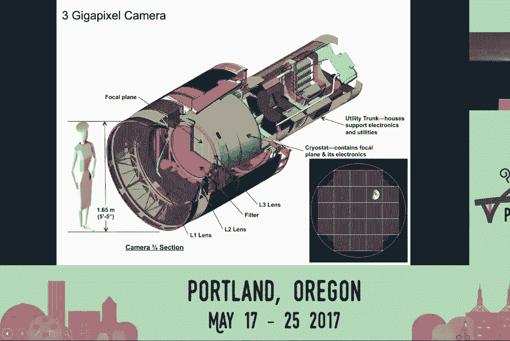

 pixels， if you wanted to display a single LSST snapshot， in full resolution。 you would need a bank of 1，500 HDTVs。 So it's a lot of pixels。 And the amazing thing is that these 1，500 HDTVs worth。 of pixels are going to be taken twice every 30 seconds， for 10 years， right？

 So the upshot of LSST is it's basically， going to be a decade-long video of the entire night sky。 It's going to take about three days， to cover the whole southern sky visible from Chile。 where the telescope is going to be located。 With a final catalog of hundreds of petabytes of data。 And I'm not exaggerating when I say， this is going to absolutely change the way astronomy is。

 done in every part of astronomy， everything， from the people studying the dust in the solar system。 all the way out to the most distant galaxies， and the structure of the universe itself。
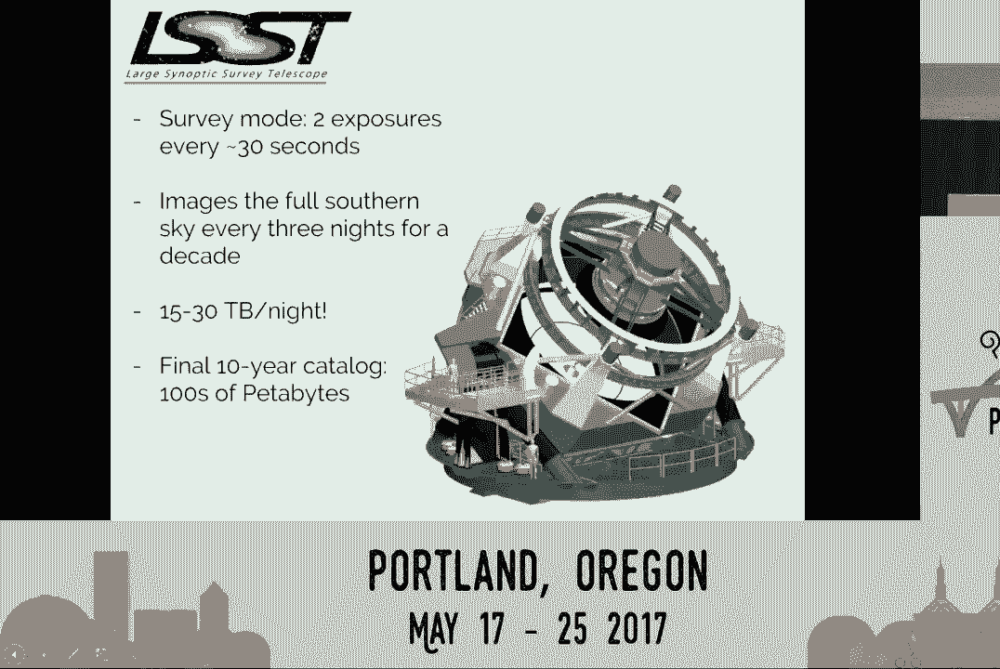

 And I was going to go through some of these science cases， but really。 there's a 600-page book that talks about everything， that we're going to be able to do with LSST。 And if you're interested， I'd suggest at least reading。 the table of contents because it's pretty phenomenal， the kinds of things that we're going to do。

 And you're probably sensing a pattern now。
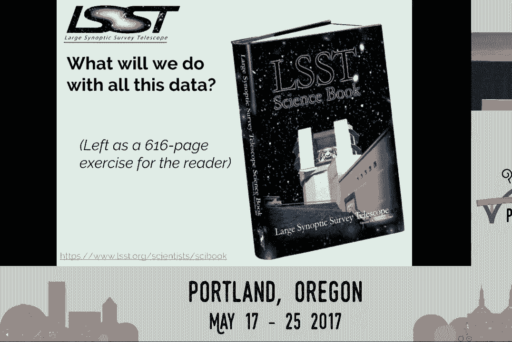

 If you want to know the software that's， driving this 100 petabytes of data， it's on GitHub。 and it's in Python with parts of it in C++。 So this has been a real revolution in astronomy。 over the course of the last 10 years。 I was curious about this。 So I went and used a friend's script。

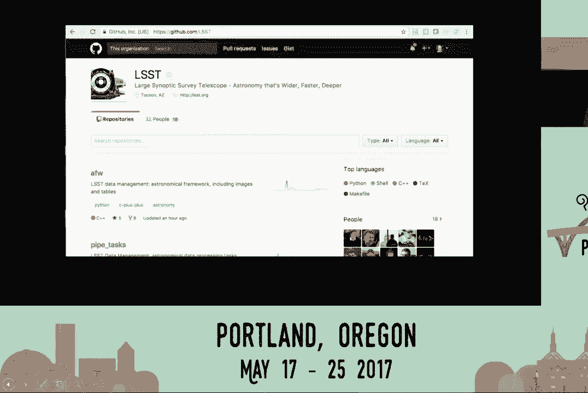

 to mine the astrophysical data system， which， is the listing of all peer-reviewed papers。 in the astronomy world。 And these are the mentions of certain software languages。 over the course of the last， what is it， 17 years。 You can see that Python is just--。 we have this hockey stick thing， right？ Python is having exponential growth。

 in the field of astronomy。 And some of these older tools， like IDL， which。 was most popular about the time that I started my PhD， is sort of tapering off a little bit。 And that's good news because IDL is a closed source system。 that has licensing fees and doesn't really have--。

 students who learn IDL can't go out and get other jobs。 They only get astronomy jobs， right？

 So there's a lot of really nice things about Python。 And for the rest of the talk， I。 want to focus on this。 Why Python？ If you went back to 1985 and asked Guido。 if he thought that his little language would， be used to manage hundreds of petabytes of data。 for a global system of astronomers， he'd probably say some Dutch word for your crazy。

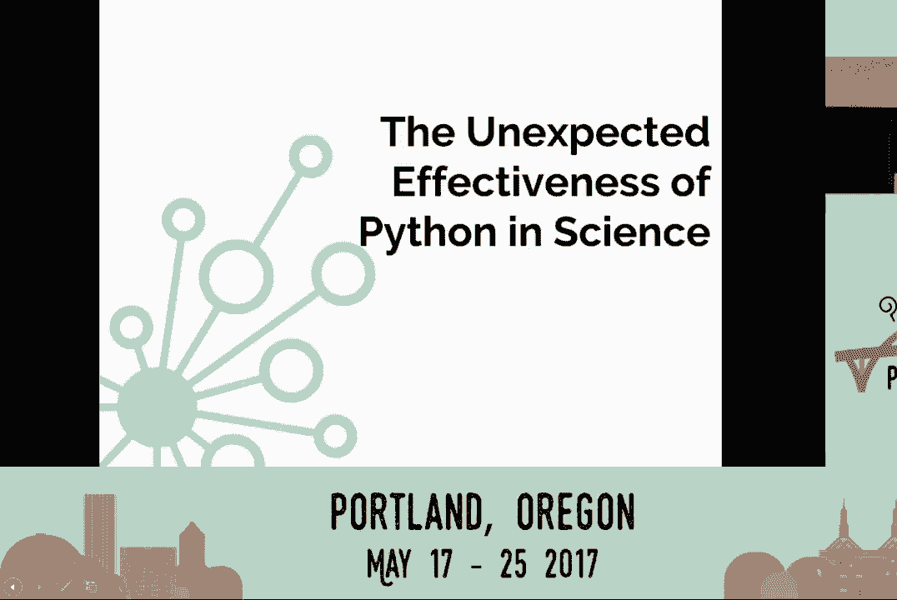

 And if you look back， what Python was， developed for back in the '80s， it。 developed as a teaching language， kind of to bridge， the gap between the shell and C。 And he even said， it was never intended to be the primary language， for programmers。 So if any of you consider yourself a programmer in here。

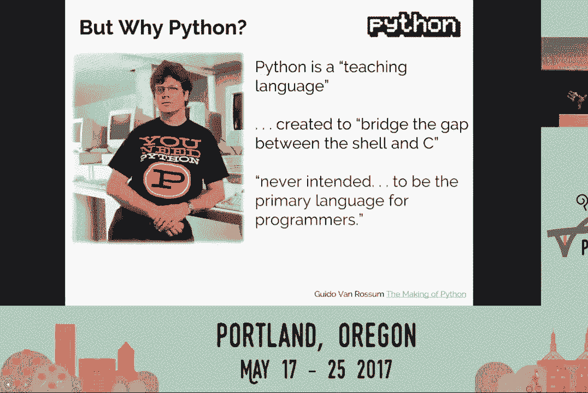

 you're using the wrong language。 And if you go further in that interview， it's really interesting。 He said， I thought we'd write programs， 10 lines， 50， maybe， 500 lines。 But here we are using thousands or millions， of lines of Python to store and analyze some of the largest。
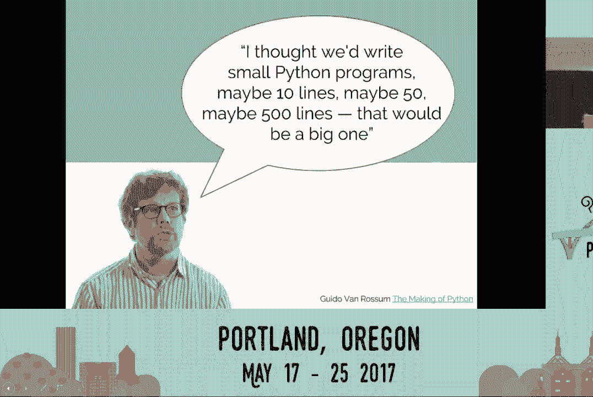

 data sets in the world。 And I think that's incredible。 So why is it that Python is such an effective tool in science？

 I think the first thing that comes up， is that it's the interoperability with other languages。
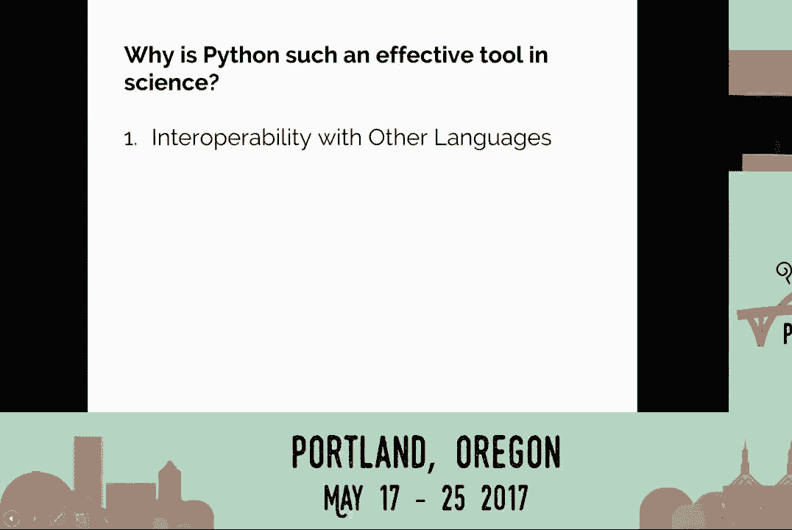

 that really drove this。 If you go back long ways back and you， look at some of the great scientists。 one of them， is Isaac Newton。 And he has this famous line where he said， if I've seen further。 it's by standing， on the shoulders of giants， basically saying。 that his science doesn't exist in a vacuum。 He needed all the science that came before him。

 And I think if Isaac Newton were alive today， he'd say something like this。 It's by importing from the code of giants。 So whenever scientists are doing something today。 they're using some sort of computation。 That's the nature of the data that we're working with。 And if you have to reinvent the wheel， every time， you do something。

 every time you extend the study， you're never going to get anything done。 So we're constantly using the code of the people who。
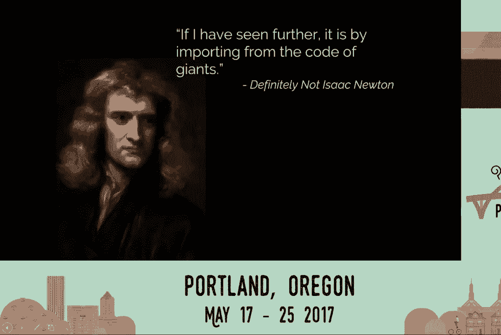

 came before us。 If you want to get a glimpse into the first steps of Python， and science。 Dave Beasley wrote this interesting paper in 2000。 You probably know Dave if you've been around PyCon。 You probably know him as a person who。 teaches you to do diabolical things with coroutines or whatever。 But back in the day， 20 years ago。

 he was working in a national lab。 And he was pushing some of those scientists。 some of the first scientists to use， Python in the scientific fields。 And he said。 scientists work with a wide variety of systems， ranging from simulation codes。 data analysis packages， databases， visualization tools， homegrown software， each of which。

 presents the user with a different set of interfaces， and file formats。 And as a result。 the scientists may， spend considerable amount of time trying。 to get all these components to work together in some manner。 And so he in 2000 was advocating Python as the solution， to that， to glue together all these tools。

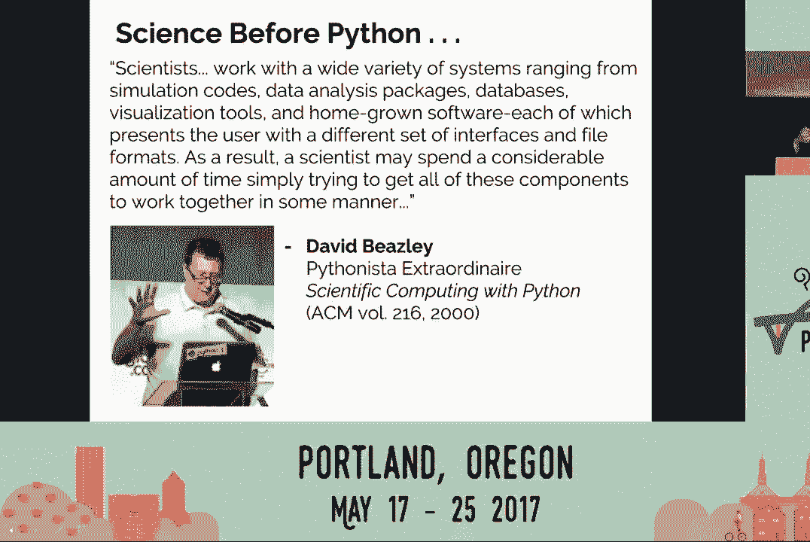

 And if you look at some of the other， I don't know， patriarchs of the scientific Python world。 like John Hunter， he was the creator of Matplotlib。 And he said。 I had a hodgepodge of work processes。 I'd have Perl scripts。 It's called C++。 I'd load them into Matlab and plot them。 And then I started using newplot。

 And this is what inspired him to work on Matplotlib。 It's sort of a Python replacement for that whole mismatch。
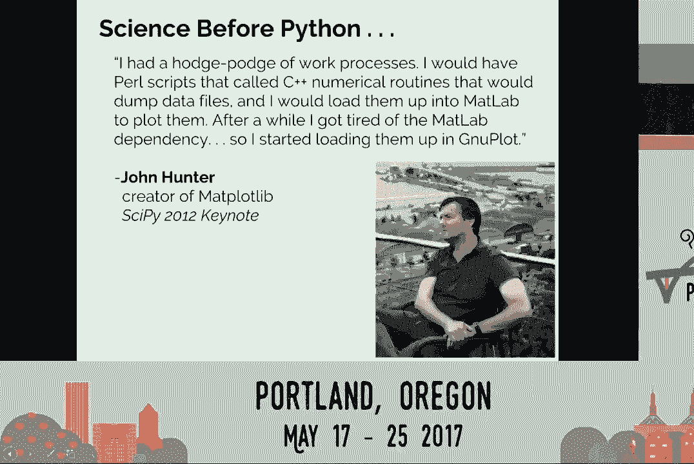

 pipeline that he used。 Similar for Nanda Perez， he started the IPython project。 which has grown into Jupiter。 And he had a similar thing。 My advisor had a heavily customized oxide bash workflow， to manage job submissions。 post-processing of C codes。 So he used her scripts。 And on top of that， added a layer of Perl。

 GNU plot， IDL， and Mathematica。 So this sounds absolutely horrible to me。 And this is what inspired him to create IPython， as a way to use Python to wrap all these together。 So really fundamentally in science， Python is glue more than anything else。 It started out as a way to glue together， all these hodgepodge of scientific tools。

 that people were working with。 And that the high-level Python syntax。 wraps these low-level C and Fortran libraries。 So another reason that Python has become such an effective tool。 is this whole notion of batteries included。 Python out of the box can do so， so many things。 If you compare it to something like C or C++ out of the box。

 Python has this built-in standard library， that can do everything from launch a web server to read JSON。 to working with the file system to manipulating strings。 And that sort of thing is incredibly valuable。 And for the libraries that aren't built in。 there's been this ecosystem of software built around Python。

 that has turned out to be really useful。 And so if you look at the genesis of scientific Python。 there were a number of people that worked on it。 But one of the faces of this is Travis Oliphant。 He started the NumPy project and parts of the SciPy project。 And he was saying。 when I discovered Python， I really liked the language。

 But it was very nascent and lacked a lot of libraries。 And I felt like I could add value to the world， by connecting these low-level libraries。 to high-level usage in Python。 So this is moving from Python as glue to Python。 as applications that kind of glue together， these underlying tools。

 And the scientific ecosystem has really， really， ballooned and exploded over the last few years。 You have Python on the ground。 And then you have these various packages。 that work with Python and extend it in ways that， are useful to scientists。 Of course。 NumPy gives you array computing。 IPython on Jupyter give you kind of an IDE on top of Python。

 You have the SciThon project， which， lets you basically wrap C code and write C code in Python。 which is really interesting。 Actually aside， my favorite language in the world to program。 in is SciThon。 You should try it sometime。 It's really fun。 You have tools like Numba and Dask。 that address scalability and computation。 And built on top of this layer， you。

 have some things that are slightly more specialized。 Tools like Bokeh and Matplotlib for plotting。 You have pandas for data frames and X-array， for multi-dimensional labeled structures。 And then of course， SciPy， which wraps， all the scientific routines like integration and interpolation。 And a lot of these depend on the layer below them。 And of course。

 scientists-- these are higher level tools， but there's an even higher level from there。 People want to do machine learning。 So Scikit Learn was built that depends on SciPy and NumPy。 SimPy does this symbolic manipulation， similar to if you've used Mathematica or Wolfram Alpha。 You can solve equations symbolically in Python。 NetworkX， Scikit Image， PyMC， from Arkov， Chain。

 Money， Carlo， Stats models。 And then this even more specialized than that， on top of that。 you have a lot of different fields， that have developed these field-specific packages for Python。 So we're really at the point here， within the Python community and in the science community。 that if you have a problem you want to solve in Python， someone has written a package for it。

 You can go out there， and it's most likely on GitHub out there。 And this has been absolutely huge in the scientific world。 And that's why we're seeing that hockey stick growth， in astronomy。 So another reason Python is so effective for science， is just its simplicity and dynamic nature。

 You've probably seen this XKCD before。 If you type import anti-gravity into a Python interpreter。 this will pop up。 And it gets at a thing that a lot of people， have noticed about Python。 Python is just fun。 If you go from using another language， and then start using Python。 it's kind of a freeing thing。 You just write down what you want to happen。 And it happens， right？

 Python is kind of like executable pseudocode。
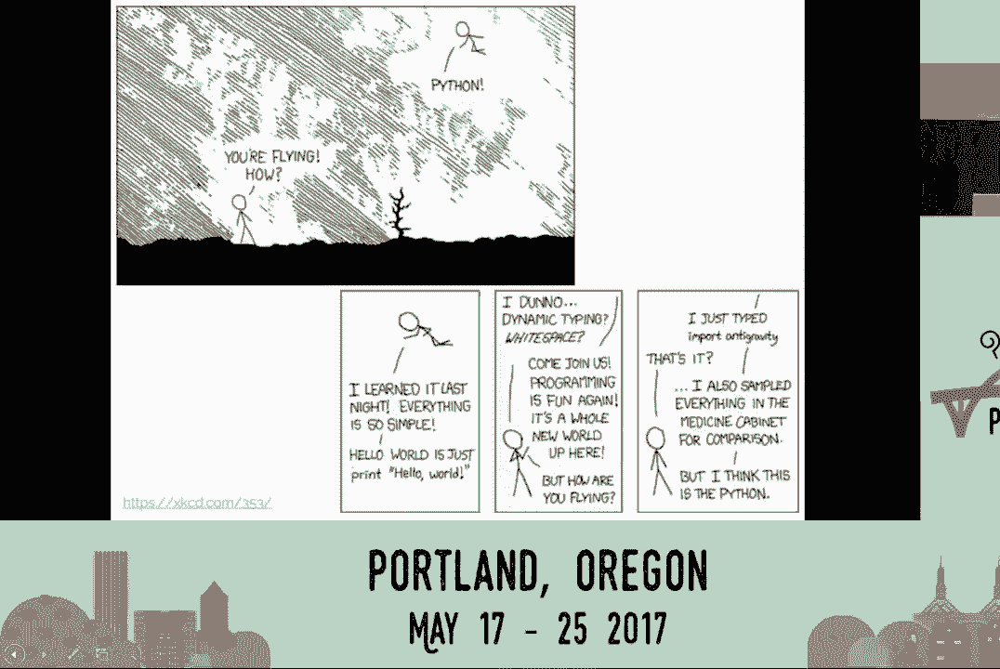

 and it just works。 It's great。 And Perry Greenfield， he's one of the project。 leads at the Space Telescope Science Institute。 These are the people behind the Hubble Space Telescope。 and James Webb Space Telescope。 He gave an interesting talk at a Pi Data Conference。 a couple of years ago about why Python has been adopted， in astronomy。

 And he is one of the people--， if you want to know why Python is in astronomy。 he's one of the people that's really， been in the background making it happen。 getting it adopted by some of the large organizations。 And what he said is。 Python is a language that's， very powerful for developers， but also accessible， to astronomers。

 Getting those two classes of people using the same tools， I think。 provides a huge benefit that's not always， noticed or mentioned。 So really。 the key here is that Python， is what the people writing the libraries are using。 and it's also the tool that the people using the libraries， are using。

 And that simplicity really makes it tick， because astronomers are not computer scientists。 A lot of us don't have CS training， so we're used to writing scripting languages。

 and Python fits that bill pretty well。 So for day-to-day scientific exploration。 it's really the speed of development， that is primary and the speed of execution is secondary。 So you sometimes get people-- especially， when you're working in an area with lots of data。 you get people a little bit incredulous， that you're using Python to manage these terabytes or petabytes。

 of data。 And they start saying things like， why don't you use C？ It's so much faster。 And my favorite answer is， why don't you， commute by airplane instead of car？ It's so much faster。 The nice thing about Python is there's very little startup cost。 You don't have to go to the airport， and go through TSA and pack your bags。

 and squeeze into a little tube and then， get to the wrong place of the city that you're going to。 You just hop in and start going。
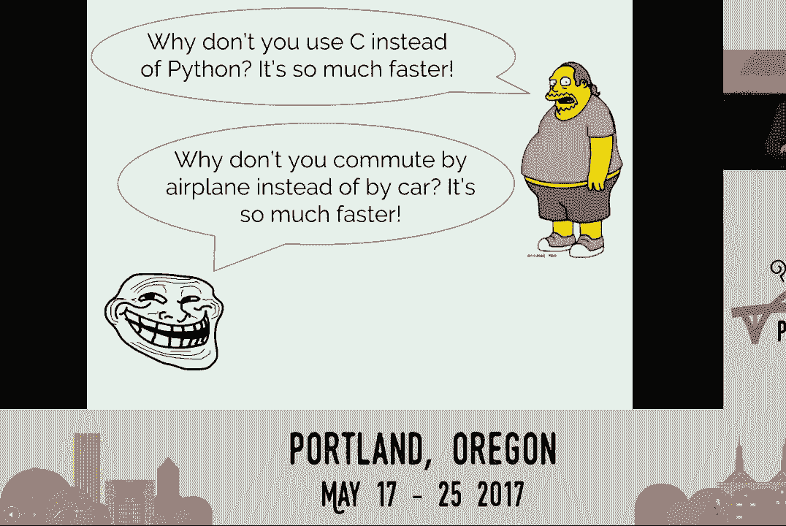

 So another piece of this puzzle is， that scientific coding is really， really nonlinear。 and exploratory。 So this is a clip from--， I spend a lot of time with kids these days。 This is a clip from a kid's book called "Aida Twist Scientist。"。 You should really check it out if you have little ones。 But it says， in one place。

 Ada Marie did what scientists do。 She asked a small question， and then she asked two。 And each of those led her to three questions more， and some of those questions resulted in four。 And this is really the process of science。 We're not software developers who have a roadmap and sit down。 and write a module and do test-driven development， until the test pass。 We have a data set。

 and we start playing around with it。 And we maybe plot it one way， maybe plot it another way。 I don't know if my video is going to play because of the web， connectivity。 Oh， well。 This is a video of the Jupyter Notebook of me， kind of doing some data exploration。
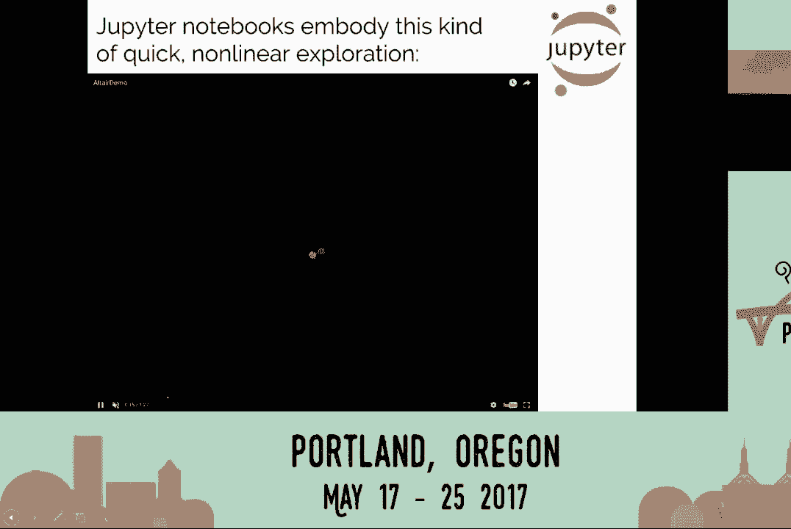

 trying some things out， going back to the beginning， trying it again。 And the thing is that the way scientists use Python， is really very much like that。 We're doing all sorts of back and forth， exploratory work， very nonlinear。 And it means that a system like Jupyter Notebook， is actually ideal。

 It might not work for people who are kind of used。 to classic software development and looking for an IDE。 And it might feel a little bloated。 But for what we're doing， it's exactly what we need。
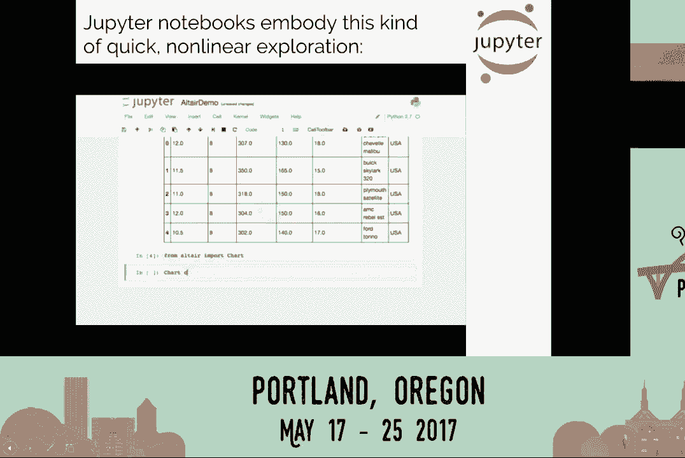

 Sorry about that video not working。 So the last piece of why I think Python is such an effective。 tool is because it has this open ethos。 I pointed a while ago to the fact that all these big telescope。 projects now have GitHub repositories， with their processing pipeline in Python and other languages。 open on there。 That was not the case 10 years ago。 And if you read a lot about in the media。

 about science these days， you'll see， all these articles about these replication crises。 Everyone's talking about how science has broken。
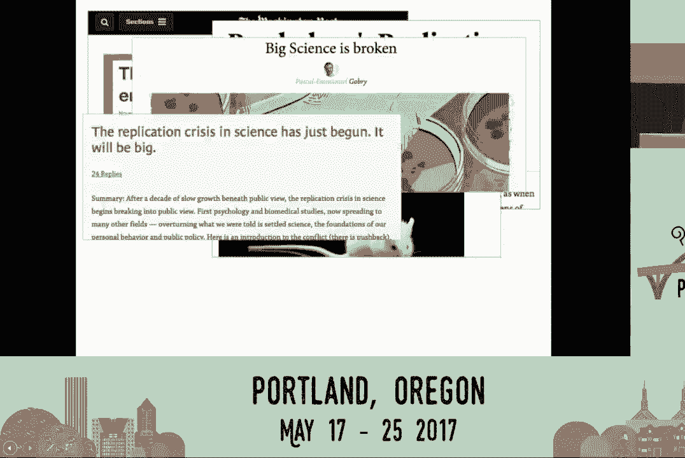

 replication， crisis has begun。 We can't replicate studies by our peers。 The core foundations of science are sort of crumbling。 because we're not doing a good job of making our studies， replicable。 And the people who are thinking deeply about how， to solve this， mainly what they're landing on。

 is the idea of open science。
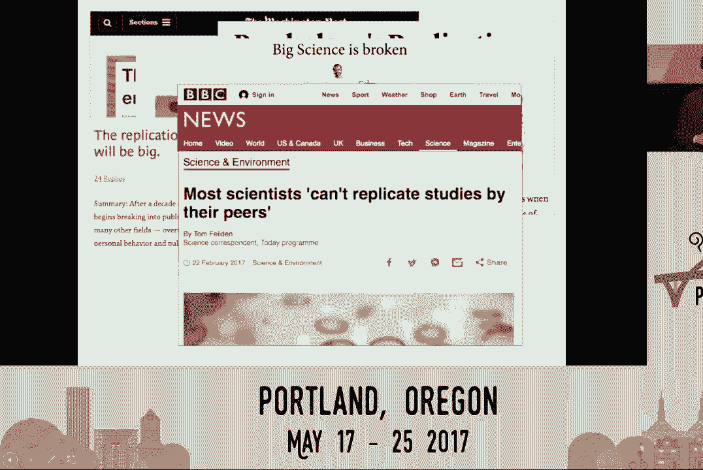

 So there's this great quote from Buckeye and Donahoe， on a paper about 20 years ago。 An article about a computational result， is advertising， not scholarship。 The actual scholarship is the full software environment， the code and data that produced the result。 So basically what people are saying， is in order for science to progress。

 we need to start doing things the way， the open source world has been doing things for decades。 We need to start putting our code out there on the web， so anyone can download it and run it。 We need to start licensing it in a way， so that other people can use it and build on it。
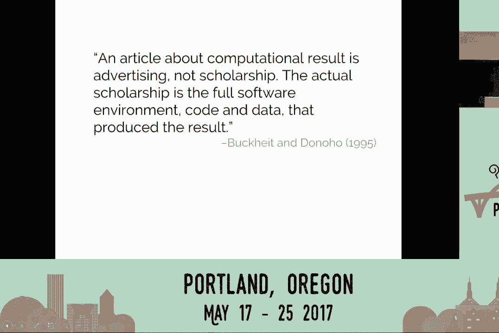

 And this is starting to happen。 One of the great examples of this。 is this incredible event that was detected last year， by the LIGO。 the Laser Interferometry Gravitational， Observatory。 They managed to detect the ripples in spacetime， that were caused by two black holes spiraling in。

 and merging together。 Black holes are so massive that they actually， bend the fabric of spacetime。 And as they spiral in， you get these spiral， waves of gravity waves。 Ripples in spacetime is heading out。 And when LIGO released that result--。 this is a result that I'm almost certain， will get a Nobel Prize sometime in the next few years。

 When they released that result， you。

 can see if you recognize Matplotlib。 These are the graphs that they have。 and they made them in Matplotlib。 They also released notebooks。 And you can go from the raw data all the way， to this plot that they published just。 by following their notebooks。 And so this really is the way forward for science。

 out of this replication crisis， making sure， that everything we publish is out there with the code。
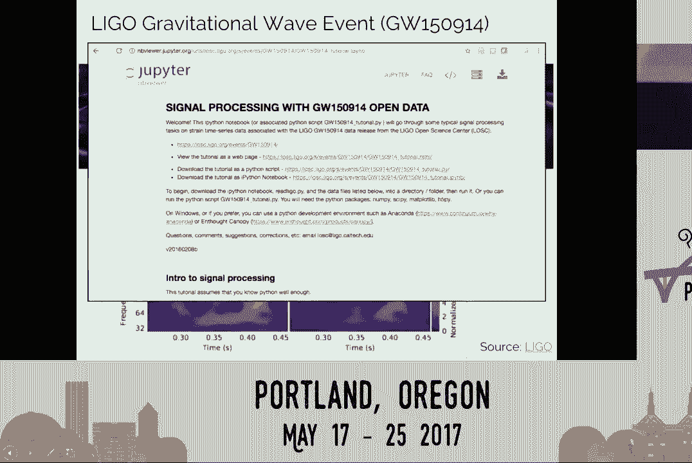

 and following what the open source world has done。 So this is something that I've tried to do in my own projects。 These are two books that I mentioned。 And you can buy them from Arilie if you want to。 Or you can go on my GitHub， and you。 can look at the whole book in the form of notebooks。 You can download it and execute it。

 and confirm that the code runs the way I said it runs。 So I've been trying to walk the walk as far。 as this openness in my own work， whether it's writing books， or writing my research papers。 things like that。 Incidentally， if you want a copy of this book。 I'm going to be signing it tomorrow at the Riley booth at 10am。

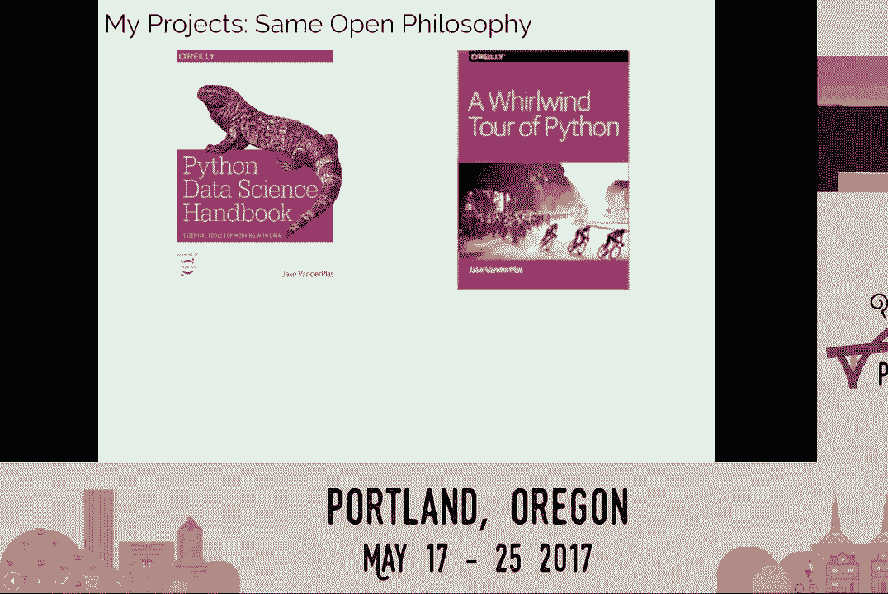

 So come on by。 So the Python world really， in the sense of openness， is really influencing science。 You know， the AstroPy library that I mentioned previously。 this is something that astronomers are rallying around。 And there's so many papers these days that。 are doing their analysis based on tools in AstroPy。 And the way AstroPy is structured。

 is modeled off the Python world， the way that Python has， developed。 And going back to Perry Greenfield， this is adapted from a slide that he gave at that same keynote。 And where he was talking about what Python has done for astronomy。 Now， traditionally。 astronomy has been--， we haven't really shared software， we've been possessive about it。 And Python。

 it's cooperative， and it's all about sharing。 We've been fragmented efforts in the past。 and now it's more unified under this AstroPy umbrella。 Rather than being planned top down by an institution， it's planned bottom up by the people who。 are using and creating the software。 And rather than read the rest。

 I'll let you take a look at that。 But the point is here that by having scientists come。 into the world of Python， into the world of Python。 a lot of you folks do things differently than we do as scientists。 But we've been able to learn from you and really improve， the way science is done。

 And I'm very hopeful that these things， like this replication crisis， is going to be behind us soon。 Because we as scientists are adapting the tools， of the open source world。 So why is Python such an effective tool in science？ I think it's these four key things。 We have this interoperability where it can serve as glue， for everything else that's out there。

 We have this batteries included and third party modules， that have all been developed in order。 to make Python as useful as possible， and as few keystrokes as possible。 The simplicity and dynamic nature， it allows an intro astronomy student who's never。 coded before to start writing scripts by the end of a week。

 and writing applications by the end of a semester。 It's really， really phenomenal。 And this open source ethos is such a good fit to science。 And I think science and astronomy in particular， owes the Python world a big thank you for getting us。 on the right track。 So with that， I want to bring back this idea of the Mosaic。

 So I gave you a little bit of a perspective， of how Python is used in science。 This is kind of one of those tiles in the Mosaic。 And everyone else out here has a different experience。 You might be a pip person versus a conda person， or you might be a pie charm person versus a Jupiter person。 or you might be what else？ Pie pie versus CPython。

 And depending on what you're doing in your day to day， life， you have a really different approach。 and a different set of tools that work for you。 And I'd encourage you， while you're。 here at PieCon this weekend， to keep that in mind。 The real opportunity here is that you。 can interface with people who are using this language in ways。

 that are completely different than you。 So I want you to try to seek out talks from people。 who are in other fields and seek out conversations with folks。 who are using Python in different ways。 And if you do， you never know。 You might end up completely changing the way， your field is done。 So that's the end。

 And thank you very much。 I'd love to take some questions。 [APPLAUSE]。 It looks by my clock like we're unfortunately at time。 So if you have questions for Dr。 Vanderplast。 come up front or find him in one of the other media， grooms of the conference。 As we head into our first break before our first round， of big talks， let's give another hand to Dr。

 Vanderplast。 Thank you for talking。 [APPLAUSE]， [MUSIC PLAYING]， [APPLAUSE]， [BLANK_AUDIO]。
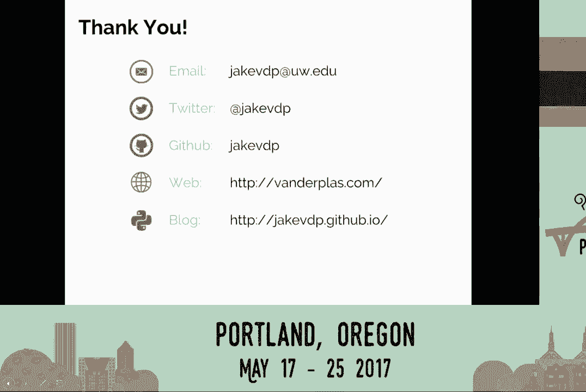