# PyCon 2017（油管点击上万合集） - P15：Jake VanderPlas   The Python Visualization Landscape   PyCon 2017 - 哒哒哒儿尔 - BV1Ms411H7jG

 And he's going to talk about Python visualization landscape。 Give a hand to him。

 Thank you very much。 [APPLAUSE]， All right。

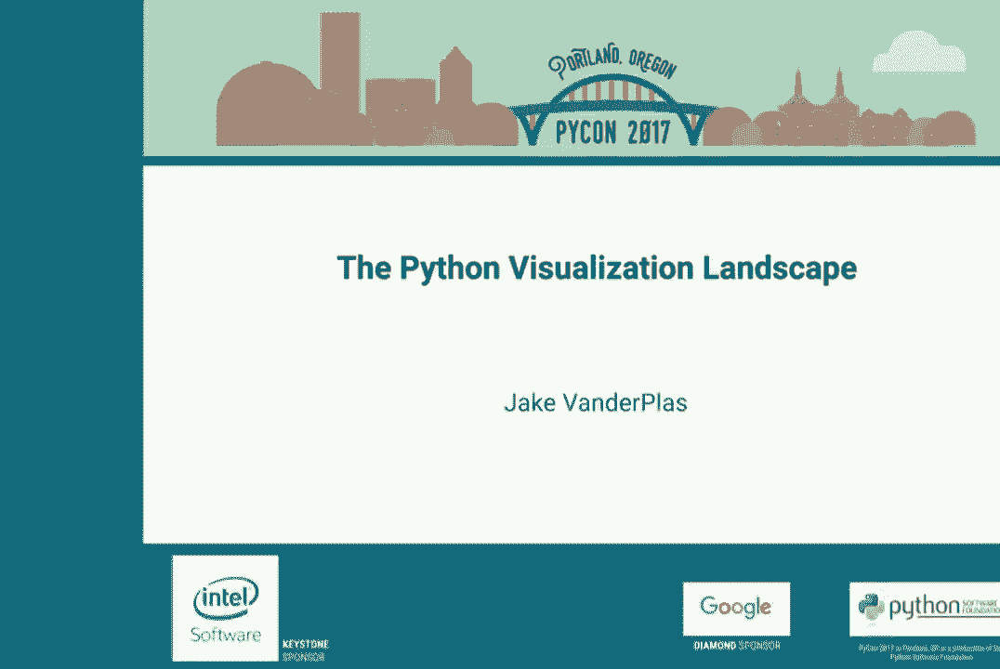

 Thanks very much。 Thanks for coming。 And for many of you listening to me a second time。

 in a couple of days， I'm going to talk about Python's， visualization landscape。

 And so back in whatever the fall， I wrote this abstract and said， I'm。

 going to give an overview of the landscape of data， as tools in Python。 And then a month or so ago。

 I thought， oh， I should figure out what that is。 So as I usually do， I tweeted and said， hey。

 these are the tools that I'm thinking of talking about。 Are there any others I should consider？

 And Twitter came back with this whole thing。 So like totally changed what I was going to do for my talk。

 But I want to take this time to make sense of this deluge。

 of visualization tools that are out there in the Python world。 There's tons out there。

 as you'll see。 And I think each one is kind of specialized。

 for its own unique application or its only unique strengths。

 And I'm hoping what each of you will take away from here， is the ability to look out there and say。

 given my problem， that I want to do， my visualization task。

 I know what package I should use in Python。 So let's get started。 It all starts with Matplotlib。

 Matplotlib has been around for over a decade now， almost two decades now。

 And it's kind of the core tool。 And there's lots of things that have， been built around Matplotlib。

 There's this base map， cardopi thing， for geographical visualization。

 Pandas and Seaborn have some tie-ins to Matplotlib。 We have things like GGPie。

 which gives a GGplot interface， on top of Matplotlib。 NetworkX gives you network visualizations。

 Yellowbrick and scikit plot。 These are some things that I learned。

 about that do visualization for machine learning。 So this is kind of like the Matplotlib cluster of tools。

 that I think of。 And I'll go into some of these a little bit later。 On top of that。

 you have JavaScript。 And in the last few years， a lot of these Python libraries。

 have started to depend on JavaScript， and use JavaScript to get some great interactive visualization。

 And probably the two biggest of those， are Plotly and Boke。 And I'll talk about each of those later。

 But there are more。 There's this toy plot and Bq plot， which you may not have heard of。

 But they're really， really fun libraries to try out。

 And you have things that are tied to the Jupyter notebook， like IPy Volume， IPy Leaflet， Py3。js。

 They let you take advantage of different aspects of JavaScript。

 to do interactive visualization in the notebook， which is pretty cool。 So there's other things。

 Cufflinks is built on top of Plotly。 So that's kind of like the JavaScript cluster。

 of visualization tools。 And of course， there's more， right？

 You want a link JavaScript in Matplotlib。 So there's this D3。js is a thing。

 And I wrote a package called MPLD3 that links Matplotlib and D3。

 It's not super well supported anymore， but it's kind of a fun thing if you。

 want to turn your Matplotlib plots into D3。 And there's even more built-on D3。js。

 are these image specification languages， Vega and Vega Lite。 And there's some Python libraries。

 Altair， Vincent， and D3PO that give you a Python interface， to all these tools。

 Are you starting to get overwhelmed yet？ You can link all these together。

 There's tools like Data Shader， which， is kind of a bokeh tool that also works with Matplotlib。

 I'll show you an example of that later。 There's this thing called Vix， which。

 is very similar to Data Shader that， can render to all these three platforms。 You have this tool。

 Hall of Use， that links Data Shader， and bokeh and Matplotlib。

 And then there's this whole OpenGL cluster， with Glumpy and VisPy。 And there's graph visualizations。

 And there's all these ones that I don't even， know how to categorize， to deal with big data。

 So we just have this huge landscape of Vis tools。 And how do you make sense of this？ Well。

 I'm hoping that this talk will， help you make sense of this a little bit just。

 by color coding these clusters so that when you go out， and you Google each of these later。

 and check out the examples， you'll， kind of know how they relate together。

 But for the rest of the talk， I want to dive into a few of these。

 and show you some quick examples of what they look like。

 So you'll kind of have an idea of what you can do with them。

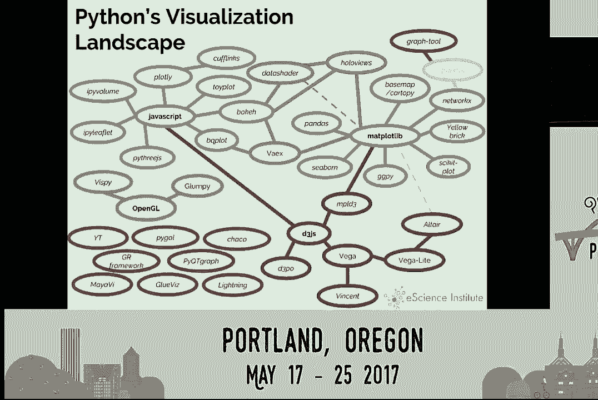

 So of course， we feel like this。 So how did we get here？ It all goes back to Matplotlib。

 That's what I started with。 And Matplotlib， for all the flak that it gets。

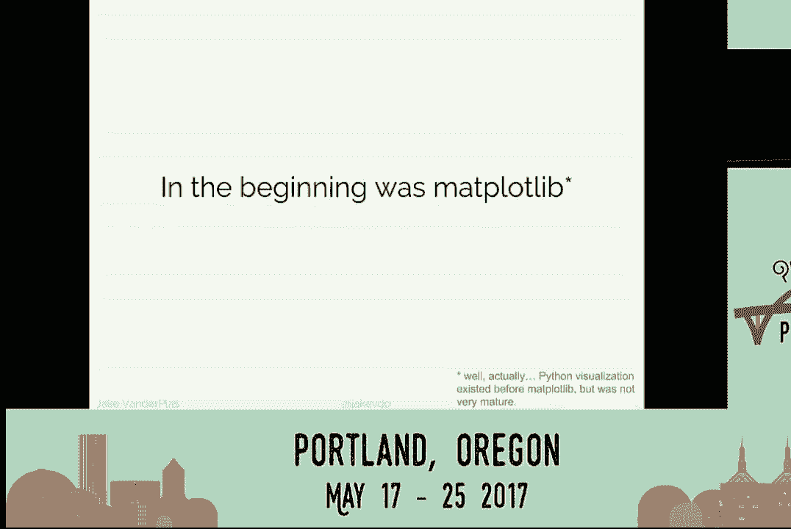

 in the last few years， it really is a pretty incredible tool。 It's strengths。

 It was designed to be basically just like MATLAB。 And this was key to all the scientists and engineers who。

 were transitioning to Python back 10， 15 years ago， end， of the '90s and end of the 2000s。

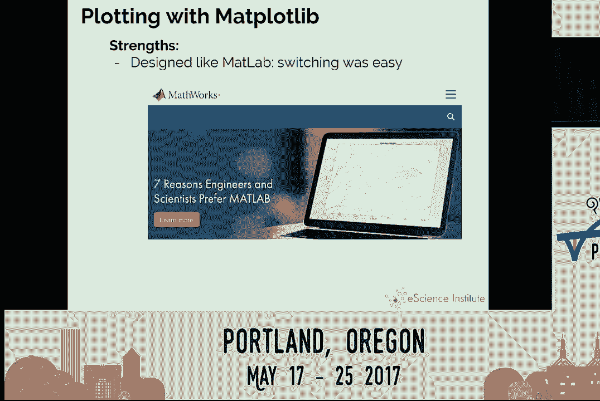

 It has a huge amount of rendering backends。 This is underappreciated。

 If you make a plot in Matplotlib， you can render it on almost any visualization back end。

 You can export PNG， PDF， EPS， SVG， all these different outputs。 And that's not trivial to do。

 to make all of those different， outputs look the same for the code that you write。 And really。

 it's powerful。 It can reproduce just about any plot。

 It takes a little bit of effort to make most of these plots， even the most simple ones。

 And it's well tested。 This is almost a 13， 14 year history of Git commits。

 And it's really been battle-dressed and bomb-proof over， the course of all that time。 So MATplotlib。

 I wouldn't discount it。 It's a really powerful tool。

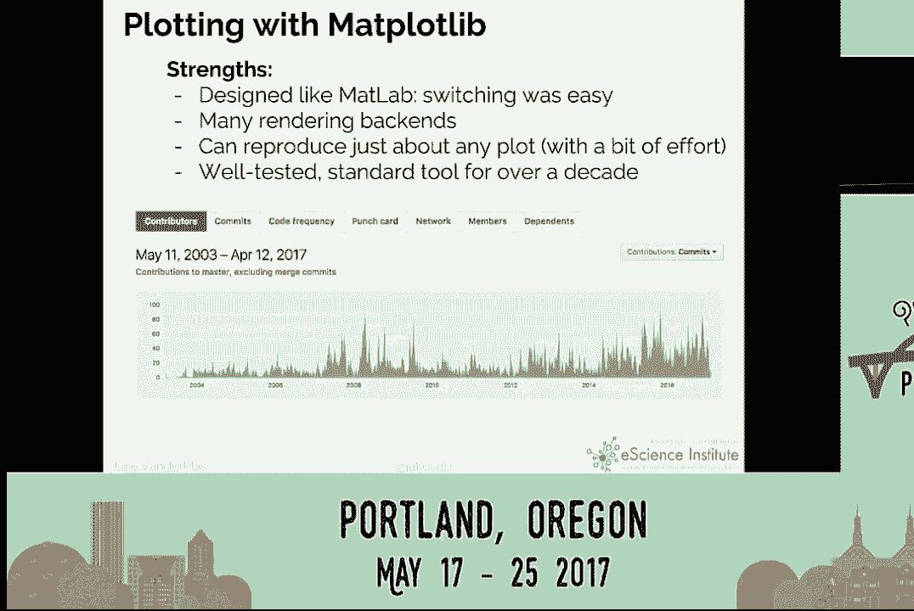

 But you can do all these different things with it。 But it does have its weaknesses。

 And if you've tried to do statistical visualization。

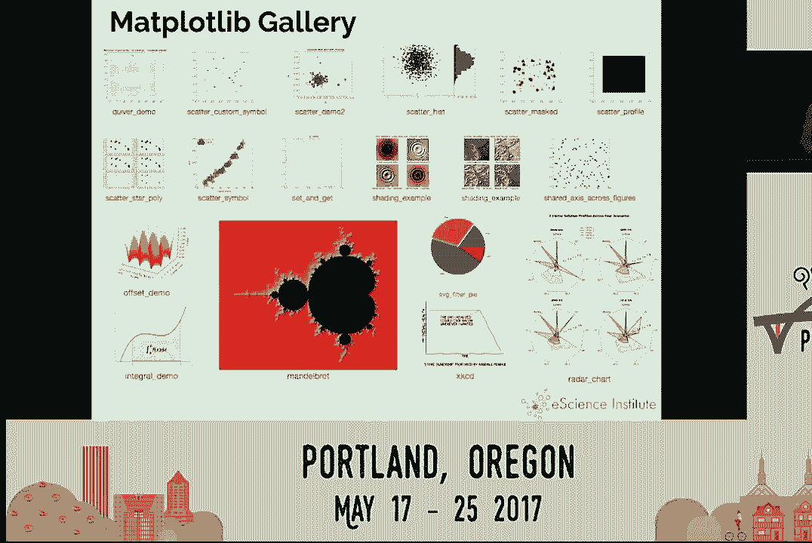

 with MATplotlib， you run into this。 So let's say you have some data， like this data frame of the。

 IRIS data set， which you've probably run into if you've， done any machine learning tutorials。

 It's a relatively simple data set。 And let's say you want to scatter petal length versus。

 sepal length and color by species。 You can say that in a sentence fragment。

 How many lines of MATplotlib does it take？ Any guesses？

 This is kind of like the best way to do that。 Scatter one variable by another variable and color it by a。

 third。 You have to do all this kind of boilerplate code。

 And the thing is that MATplotlib is powerful as it is， is not， very expressive in a lot of cases。

 So these are one of the weaknesses。 That the API can be pretty verbose。

 Sometimes the stylistic defaults are poor。 It was based on MATLAB circa 2001。

 So if you want plots that look like MATLAB circa 2001。 But I should say that in MATplotlib 2。

0 recently released， the stylistic defaults have been updated。 So it's a lot better recently。

 It doesn't really support web or interactive graphics， which。

 is what a lot of people want these days。 And it can be slow for large data sets。 So everyone's goal。

 the reason we have， in my mind， the， reason where we have this huge network of competing libraries。

 is that everyone wants to improve on these weaknesses of， MATplotlib。

 hopefully without sacrificing those strengths。 And one way you improve on MATplotlib without。

 sacrificing the strengths is you use MATplotlib。 So all this kind of MATplotlib cluster here。

 what these， tools have in common is that they are keeping MATplotlib at， the core。

 So you have all those output backends， all that， versatility， all that power。

 But you put a new API on top。 So you address that weakness。 And you say， I can use MATplotlib。

 but I can make it， easier to generate those plots。

 And the two that I want to highlight here are pandas and， seaborn。

 These have been big in the Pi data ecosystem recently。 So pandas， as you probably know。

 is a library that's meant to， make data frames， store labeled data， labeled columns of data。

 And it has actually some built-in plotting functions。

 If you do take any data frame like this iris handle and do， dot plot and then dot something else。

 there's all these， different ways of plotting the data in there that are built， in。

 So here we have just in one line， we can scatter plot two， columns of that data frame。

 You can even do more complex things。 There are more sophisticated statistical。

 visualizations in there。 This is one that I discovered recently that I've never， heard of before。

 but I think it's pretty cool。 It's a way of taking all the columns of the data frame and。

 turning them into a Fourier series and plotting them as lines。

 so that each individual line is a row of the data frame。 It's an object。 And in some ways。

 those curves encode the values in all， the columns。

 So you can see just by looking at this that there are three。

 very distinct types of objects in there。 And you get a sense of the relationship。

 So these Andrews curves things are kind of fun。 I'm looking forward to using them in my own work。

 So the other one I wanted to mention is Seaborn。 And this is a library that was explicitly designed to make。

 statistical visualization and more complex statistical， visualization easy in Matpotlib。

 It wraps Matpotlib。 It gives it a nice set of style defaults and color palettes。

 And you can do things in a few lines。 It's kind of a higher level language， so you need to。

 memorize more things。 You don't have as many little composable chunks。

 But if you know what function you're looking for， you can do。

 things in very short number of lines of code。 So for example。

 you can call the pairplot function and get， this pairwise comparison of all the columns in the entire。

 data frame。 So Seaborn is really， really nice of you if you want to do。

 statistical data exploration in Python using Matpotlib。 OK， so then there's this JavaScript cluster。

 And the reason everyone loves JavaScript is because it's， the lingua franca of the web these days。

 So you can do incredible things in JavaScript because it， brings that interactivity to your browser。

 And everybody has a browser。 You don't have to worry anymore about these cross。

 platform rendering backends。 You just render to the browser。

 And the browser developers have taken care of all the hard， parts。 So the key。

 the common idea here is that you basically， build an API in Python that generates some sort of。

 serialization of the plot that can then be passed over to， the browser。 And inside the browser。

 you have a corresponding JavaScript， library that reads that serialization and renders the， plot。

 That's kind of what every one of these tools does in some， manner or another。

 And I want to focus real quick here on Plotly and Bokey。

 which I think are the most developed of this， cluster of tools。 And they're both really nice。

 They give you this interactive feel that's really missing， from that plotlib。

 So this is plotting with Bokey。 The same data。 I'm just taking the columns and doing a circle plot and then。

 showing it。 And you have all this interactivity you can click and you。

 can zoom and you can pan around。 And if you go a little deeper， you can start doing things。

 like adding controllers and you can add tooltips to the， points and things like that。

 Bokey is this really incredible language that lets you do， these sorts of visualizations。

 If you look at the gallery of Bokey， you go online to， Bokey。pydata。org。

 And you can click on each one of these。 Since it's browser based， each one of these examples in the。

 browser is interactive。 And you can start clicking and dragging and get a feel for， how it works。

 So Bokey is out of Continuum。io， the people who brought you， Anaconda， Numba。

 and some of these other great tools。 So I'd really suggest taking a look at this。

 You guys had advantages。 You have this interactivity。

 You have several different layers and different APIs for， generating things。

 The disadvantage is you don't have the same array of， outputs that Matplotlib has。 So at the moment。

 unless I'm mistaken， you still can't do， PDF or EPS outputs。

 And so if you're a scientist who was writing a paper for a。

 journal that requires PDF or vector based graphics， you're， out of luck。

 And it's also a slightly newer tool。 It doesn't have as much of a user base。

 It's not as battle tested as Matplotlib， but it's really， getting there。 It's an awesome program。

 So Plotly is quite similar。 The story with Plotly is it's actually a startup out of， Montreal。

 And they have this interesting open source/close source， model。

 where a whole lot of the Plotly tool is open source。 BSD license。

 you can use it for whatever you want。 But there are a few features that they use to make their。

 money， and they charge you if you want a little bit more。

 And that tends to be things like automatically hosting the。

 plots on a website with some sort of server back end， that， sort of stuff。

 But I know a lot of people who are using Plotly， the free， version of Plotly。

 for some very nice visualizations and， for even scientific visualization。

 They can do all sorts of different things。 They have some things that Boke doesn't like 3D plotting。

 and animations built in。 I might be wrong there。 I think you can do animations in Boke。

 but it's not， quite as easy as Plotly。 But it's a very， very nice visualization framework。

 And the cool thing here is it's not only a Python library， it's also an R library。

 it's a Julia library。 They have these different ways to target the JavaScript。

 back end from different languages。 So like I said， the advantages are similar to Boke， it has。

 all this web view interactivity， multi-language support， has 3D plotting。

 Some features require a paid plan。 And depending on your kind of software philosophy， that may。

 or may not be a turn off to you。 I know some people who go either way on that。

 But I think it's a great library。 And I would suggest checking it out if you're interested in。

 these interactive visualizations。 So the next thing that comes up， MatpotLib is not very。

 good for these visualizations of larger data。 And there's a bunch of these libraries that address that。

 deficiency of MatpotLib。 And they do things like relying on OpenGL， this VisPy and。

 Glumpy right there。 Glumpy or Glumpy， I don't know how to pronounce it。

 The things like Data Shader and Vioxx， these are interesting。

 ones that actually use really efficient code so that rather。

 than delivering data points to the GPU or to the computer， to render。

 they pre-aggregate all the data and deliver， pixel basically bitmaps to the computer to render。

 And so when you have a billion points， there's no point in。

 sending a billion points to your visualization screen。

 because there's not a billion pixels to work with。

 So you can pre-aggregate those and do kind of heat maps。 And that's the strategy these use。

 And then these other tools down here， they're really nice。 I wish I had time to go into them。

 A few of them come out of the astronomy community for。

 visualizing large three-dimensional data sets。 So if you're interested in that。

 check out the gray zone， down in the left corner。 But I want to take a look really quick at Data Shader。

 because I think this is a nice project。 It's still in pretty active development， but there's some。

 impressive demos。 And I have to apologize。 My plan was to do a live demo of Data Shader， because I。

 think it's so awesome。 But then all of a sudden， I had a kid in the keynote。

 It didn't really happen。 So I have screenshots。

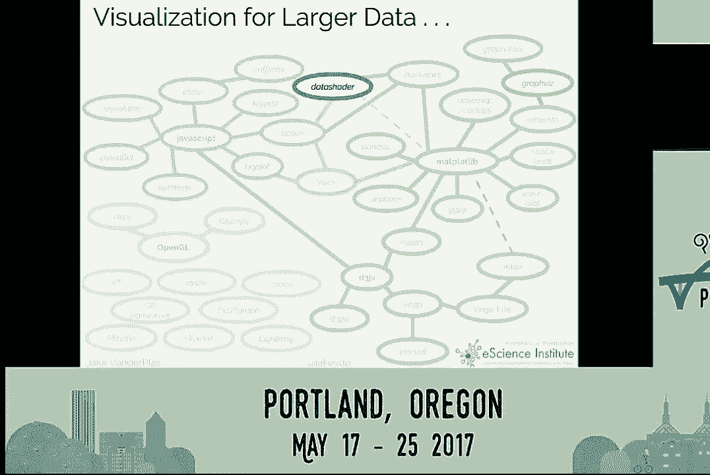

 So yeah， Data Shader， what it allows you to do is these， fast server side things。

 So it's a fast server side engine that does dynamic data， aggregation。

 So you can take things like the census data， where you have， 200， 300 million points。

 And in real time， you can visualize those on a map。

 And the live demo I could do here is you zoom in and out。 And in real time。

 it's actually calculating the bounds that， you're looking at， figuring out what subset of the data。

 matches that， and then re-aggregating it， and sending， it to the screen。

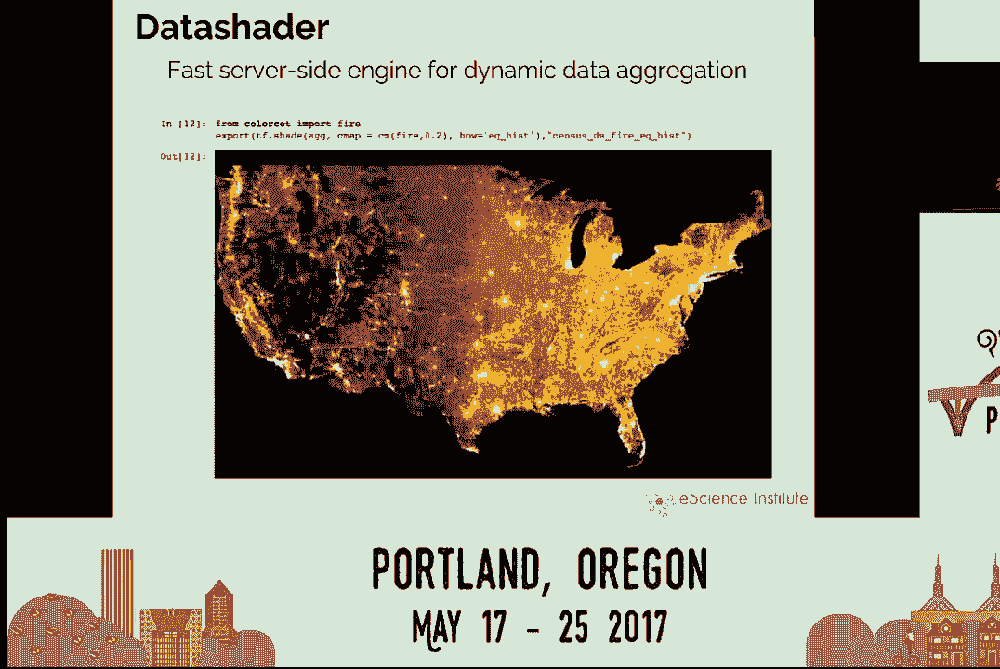

 So if you want to work with hundreds of millions or， billions of points， Data Shader is awesome。

 So this is a zoomed-in view。 You can smoothly zoom in on Lake Michigan and Chicago， and。

 get a more detailed view of the points inside there。 So you zoom in even farther。

 and you see kind of like， neighborhood level data。

 So I would really suggest playing with this if you want， to visualize really large data sets。

 You can go and download their demo notebooks。 The installation instructions are pretty easy。

 and it's a， fun package。

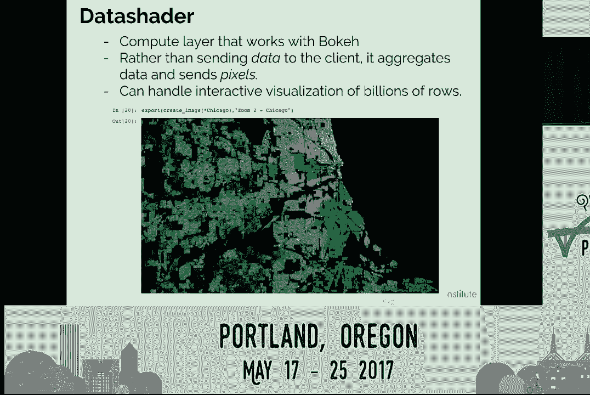

 So another class of algorithms here that I think is really。

 interesting is the ones that start to tie these all， together， and in particular。

 hollow views up there， and then， I'll tear down in the bottom right。

 These are like new kind of declarative language， specifications that target different backends within the。

 system。 They might target bokeh or matplotlib or d3。 And they let you be。

 create plots in a very expressive way， and in a very powerful way。 So the first one is hollow views。

 and this is a really， interesting project。 It's worth watching。

 I first heard about it a couple years ago when they gave a， demo at the SciPy conference。

 And the initial philosophy of this was that data sets should。

 have kind of intrinsic teach data set is the best way to， visualize it。

 So if you have a data set consisting of columns of， certain numbers。

 there is an intrinsic way that it should， be visualized。

 And we as programmers shouldn't have to think about that and。

 twiddle the x-axis and the y-axis and the labels and the， ticks and the colors。

 The computer should just know how to visualize this data。

 So what all of you started as is a way to wrap data sets in。

 an object that when you do a representation of that object， in the notebook。

 it gives you the visualization。 So rather than saying this is a data frame， it's such and。

 such address， it actually gives you a picture of the data， and they've built in all sorts of really。

 really interesting， interactivity on top of that。 And you can do things like map data。

 And from what I've heard， I was talking to some of the， bokeh developers。

 It sounds like all of you is going to be kind of wrapped into。

 bokeh and is going to become their sort of declarative layer， for visualization within bokeh。

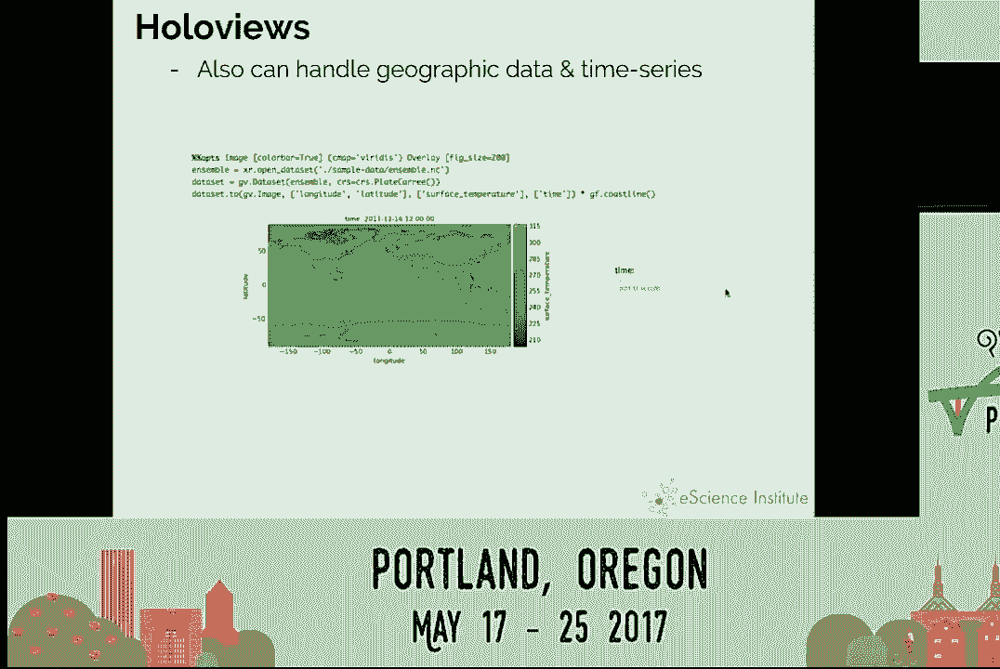

 But all of you is also， you can see the links I put here。 It also can target map plotlib。

 It can target data shader。 It sort of works seamlessly with all of those tools。

 So no matter what back end you need， if you need an， interactive back end。

 if you need a big data back end， or if， you need a back end that can output every plot file or a。

 figure file imaginable， you can use the same system。

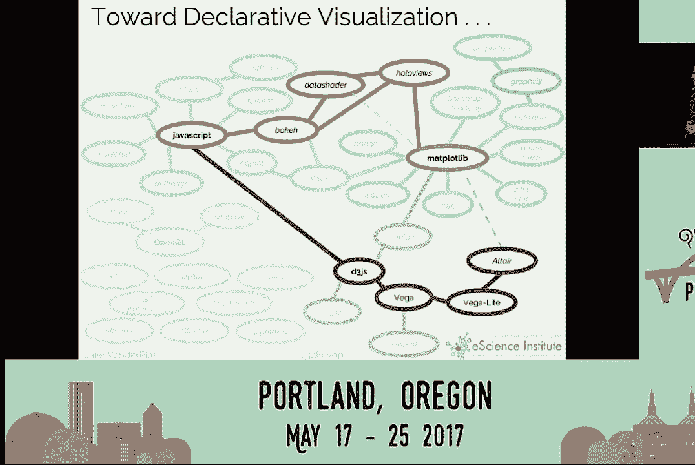

 So I think that's a really powerful way of going about it。

 The last project that I want to talk about is kind of my pet。

 project that I've been working on for a little while。 It's this library called Altair。

 And the idea here is that what if instead of passing， around pixels。

 we actually pass around the data itself with， the metadata that describes what kind of plot that we want。

 This is something that's been really exciting。 The underlying library underneath Altair is called。

 Vega and Vega Lite。 And this has been starting to be adopted by things like。

 Wikipedia and saying we don't want to just save a bitmap。

 We want to save the data and we want to save the， specification that tells the web page how to visualize that。

 data。 And I think this is a really powerful idea because it can， be adopted widely。

 We'll be able to use all that whole ecosystem of tools and。

 say have Bokeh output of Vega Lite specification that could。

 then be read in by Matplotlib and could be passed on to， something else。

 And I've been talking with academic journals and the。

 astronomy community about the possibility of having。

 scientists submit their figures in the form of these。

 sort of specifications so that then the journal could。

 generate a PDF to be printed but it could also generate an， interactive plot。

 equivalent interactive plot to be on， their web page。

 So I really think this is the future and this is kind of my， soap box that I'm pushing。

 But so what we're pushing here is this idea of declarative， visualization。

 And this is a project that's in collaboration with my， colleagues at the eScience Institute。

 the Jupyter Project， and also the Interactive Data Lab at UW which is the。

 people behind tools like D3 which you might know about。

 So what's the difference between declarative and， imperative？ Imperative visualization。

 think Matplotlib。 You can say in one sentence what you want the plot to be。

 and then you write 50 lines of code to make it happen。

 Declarative visualization is trying to make the code as。

 close to that one sentence description as possible。 You say， I want X to be this variable。

 Y to be that， variable， and color to be this variable， and show me the， result。 So imperative。

 you're specifying how something should be， done， all the little steps。 All the manuals。

 plotting steps， and the specification and， the execution are intertwined。

 In declarative visualization， you specify what should be， done。

 And the details should be determined automatically by， the system。

 This is quite similar to if you're used to database， languages。

 Like the difference between doing things by writing a。

 Python script to sift through data and writing a SQL query。

 The SQL query is a declarative specification of what you， want the system to do。

 And the system can find the most efficient path to doing that。

 So the key here is that this lets you think about data and。

 relationships rather than these incidental details。 And Brian Granger。

 who's one of the IPython developers， actually used this library Altair to teach an。

 Intro Data Science class this last semester。 And he's really excited about moving forward with that。

 So I think what we're trying to do is free students to， start thinking about relationships and data。

 rather， than thinking about syntax and libraries。

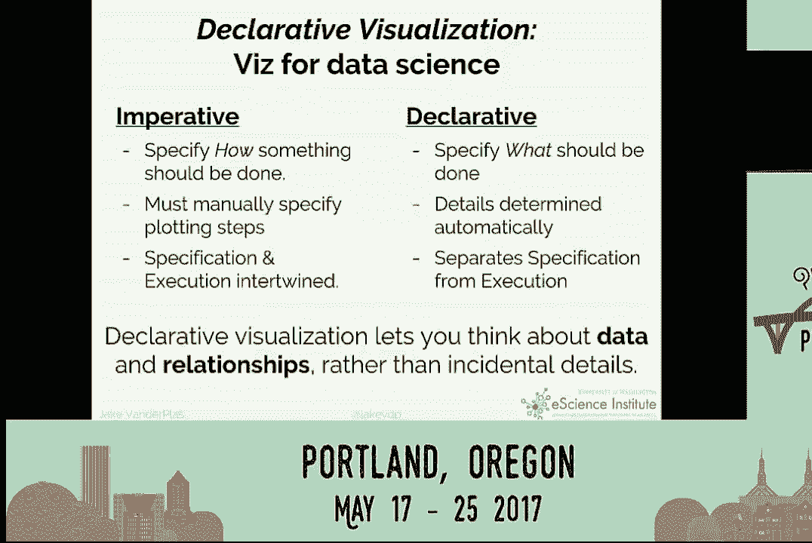

 So where does this come from？ You've probably seen the D3 language。

 I'm going to click over here and go to the live version。

 If you go to the New York Times and see any of these。

 really interesting interactive demos where you hover and， you see different things。

 basically anything at the New， York Times that looks like this is written in D3。

 And that's because the New York Times graphics editor is， Mike Bostock who wrote D3。

 So he uses it a lot。 And he makes all his people use it a lot。 And I just killed my full screen。

 How do I get it back？ Yeah。 So D3 is super powerful and you can do these amazing。

 interactive graphics， right？ But if you've ever tried to use D3， you figure out that it's。

 so ridiculously low level that unless you're Mike Bostock。

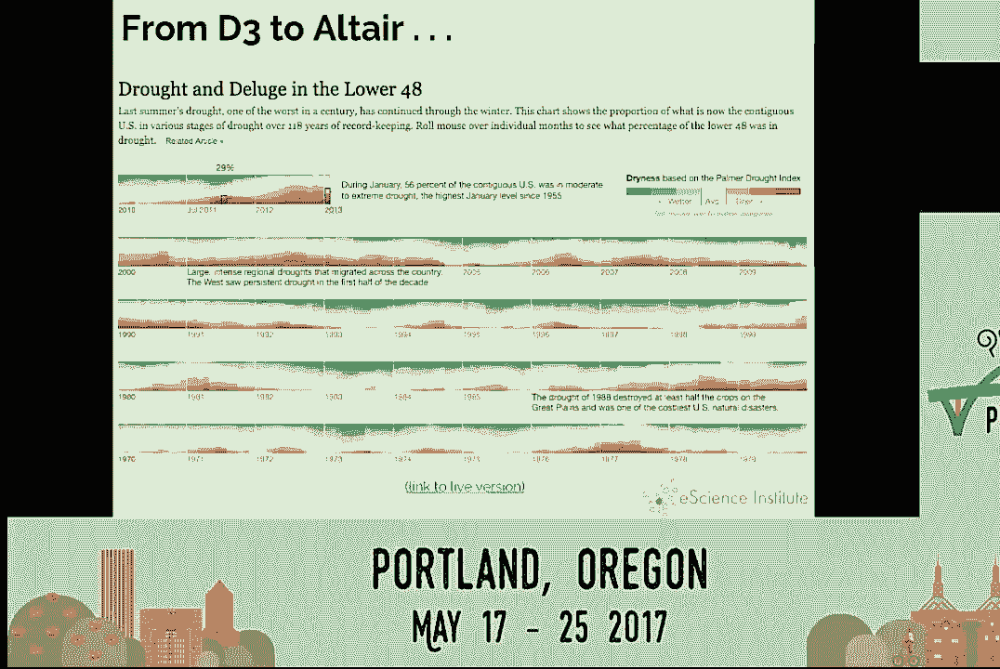

 you can't do anything with it。 So here's the example。

 This is literally like the example from the D3 example， page of how to do a bar chart， right？ Like。

 OK， I'm going to do a histogram to see。 This makes you wish for Matplotlib， which is crazy。

 But so after Bostock went to the New York Times， his advisor， Jeff Hare。

 who was down at Stanford and helped develop D3， moved to University of Washington。

 And he thought about this and said， we need a better way for。

 actual scientists and statisticians to visualize their data。

 So they wrote this specification language called Vega。 And Vega improves on this a little bit。

 It's no longer this imperative list of commands for creating， axes and things like that。

 It's a declarative specification that says， this is my data。

 This is what I want linked to the x-axis and the y-axis， and things like that。 But it's powerful。

 Still， you're not going to sit down and write this JSON。

 structure to see a bar chart of some data you're exploring， right？

 So once they got Vega working-- this is powerful， powerful。

 thing that's underlying a lot-- they said， we need it to be， simpler。 So they made Vega light。

 right？ And Vega light is-- this is almost getting to the point。

 where you could just sit down and type this in a text， editor and make it happen， right？

 You're basically saying， these are my data。 I want a bar marking。

 and I want the x to be a and the y to be b。 And it spits out that output。

 So what we're doing in Altair， what the Altair library does。

 fundamentally is it's a Python API that creates these outputs， creates these JSON specifications。

 Because I like writing Python。 I don't like writing JSON by itself。 So Altair。

 this is what it looks like。 You have the data in a data frame， and you say， I want to。

 chart with that data， I want a mark bar， and I want x to be a， and y to be b。 So all of a sudden。

 you're literally just telling the， computer what you want to be shown， and the computer figures。

 out how to display it。 And the output of this code is basically exactly this， little JSON object。

 And now you can start passing that around to other libraries， and other places。

 And so you've separated the specification of the plot， from the execution of the plot。

 And I really think I'm hopeful for this as a model moving。

 forward for interoperability between all these Python。

 libraries and also between libraries and other languages， in R and Julia。

 So here's another more complicated example。 Going back to our original plot that we did in Matplotlib。

 we want to say that x is the petal length， y is， sepal width， and color is the species。

 And you basically just write that out， and you can start。

 adding things like the opacity of the circle。 And if you do this to a dictionary， which is Python's。

 basically JSON representation， you get a dictionary that， describes the plot。

 That's everything you need to know about the plot in order， to recreate that。 So this is really fun。

 and you can do some incredibly， powerful things with Altair。

 These are some of the more advanced examples that we have。

 for doing different types of data visualization。 I especially like this。

 Does anyone recognize this kind of yellow and blue plot in， the left middle？

 That's the plot of measles incidents over the course of， time。 And there's this cutoff right there。

 and that's when the， measles vaccine was introduced。 So you can see in the historical data。

 each row is， state， and each box is a year of a number of people who had， measles。

 And you can see the effect of this vaccine。 It just works really well。 So you can check that out。

 I'll tear， I think it's Altairvis。github。io and see， that。

 And I should say that this is under a pretty active， development。

 One thing that has just happened is Altair 2。0， or， Vega-Lite 2。0 has come out。

 And this is incredibly exciting。 You know， the grammar of visualization is not a new， thing。

 Other people have done that before。 But what they just added is a grammar of interaction。

 So you can build up these little-- these interactions， from basic building blocks。

 And we don't have that in Altair yet。 But my project for June， as soon as I'm finished with。

 parental leave， is to finish this and get Altair out there， so that you can start doing interactive。

 declarative， plots。 But anyway， this is how you can try it， conda install， pip install。

 You can get a tutorial。 You can go to the website。

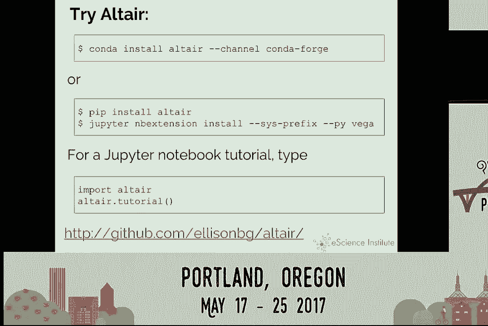

 And that's the visualization landscape。 I have my contact info， but I'll leave that up there and。

 take a couple questions。 So thank you。 Do we have time for questions？ Yeah。

 two minutes for questions。 Yeah， if you'd like-- if someone would like to go up to the， mics。

 we can do that。 I can also talk to folks afterwards。 Oh， we got a bokeh developer coming up。 Uh-oh。

 My last commit to bokeh， I committed directly to master， an example。

 and I broke master with my example。 So I don't commit to bokeh anymore。

 But I have a statement of the form of a question。 But first， I want to thank you very much for this。

 comprehensive。 It's not an easy thing to put together。

 And thank you so much for doing the work here。 But my question was。

 did you know that bokeh actually also， has an R interface？ So it is also--， I actually-- yes。

 I did know that。 I should have mentioned that。 But thank you， Jake， for a great presentation。

 That was phrased as a question。 [INAUDIBLE]， Thank you very much for putting this together。

 Regarding Altair， I'm very interested。 But I invested， like a few years of my life a little。

 while ago， in learning Ggplot2。 I'm just wondering when you were looking at your grammar。

 have you looked at things like Ggplot2， which were very。

 successful using the grammar of graphics of others？ Yeah。

 I'm hoping your API is influenced by them so that I won't have。

 done all that work for nothing in the past。 Yeah， yeah。 So it's quite similar。

 And our API in Altair is really influenced not as much by， any of that work。

 but by the VEGALITE specification itself。 Our API is-- 95% of it is automatically generated by just。

 reading the VEGALITE schema and creating a Python， object hierarchy。

 And then a few little bells and whistles on top of that。

 And one of the things-- I didn't put this slide in， but one。

 of the things I'm most proud of is we have two way back and。

 forth-- or actually three way conversions。 So I can take Altair code and generate VEGALITE specs and。

 then go from VEGALITE specs back to the Altair code。 So I can do this round trip thing。

 And literally our unit test suite that tests every。

 conceivable thing is like 12 lines of code that just does。

 this round trip on all the VEGALITE examples。 But I was totally geeking out about that。

 I was smiling for like three days。 [LAUGHTER]， Thanks。 I happened to use the VEGALITE before。

 So since the Altair applies the Python API， does that mean。

 that I still need the web browser to see the graphics？ Yeah。

 you need the web browser to see it because it's a。

 JavaScript library that finally renders the graphics。 That's not a fundamental limitation。

 Someone-- there's work on creating a VEGALITE renderer in， Matplotlib， for example。

 But right now we have it tied to the Jupyter project and， JupyterLab， and it's kind of seamless。

 You just create the VEGALITE object and Jupyter knows how， to render it in the browser。 OK。 Thanks。

 Maybe one more question。 Yeah， I guess。 Can I ask a question？

 So the question is how do you solve for the I/O problem？

 Because it looks like the billion data set that you're， showing。 Was it in memory？

 If it is in memory， how do you get into the， memory from database？

 So this is a question about data shader。 I'm going to defer that to people like Peter who asked。

 the first question because they can answer a little bit more。

 about data shader and some of those things going on。 I'll take one last question。

 I can take it offline if we need to wrap this up。 Is it a quick one？ Moderate。 Yeah， I think so。

 Right。 So as far as interactive graphs， you showed a lot of， options there。

 but mostly it's centered around zooming and， what was zooming in geographical constraints。

 What about slicing data？ Say， for instance， the census by income or race， which would。

 require some user boxes？ Yeah。 Are any of these tools set up for that？

 Or do you have to pass it a different JSON？ They are。 Yeah。

 If you look at the Bokeh project in particular， they have this。

 way of creating dashboards that are really， really powerful。

 They can either be client side or server side dashboards。

 And if you look at the Bokeh examples of all of those， there。

 are examples of using sliders in conjunction with visualizations， and things like that。

 So I'd check out Bokeh for that。 Thanks。 And we're hoping to get there with all territory。

 So thanks very much， everyone。

 [APPLAUSE]， [BLANK_AUDIO]。

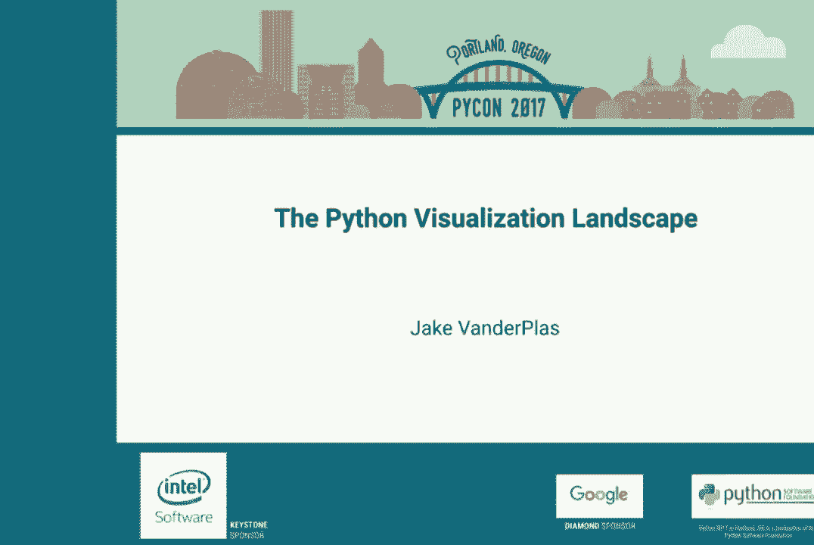