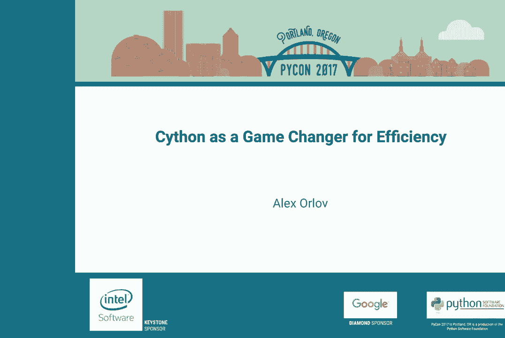
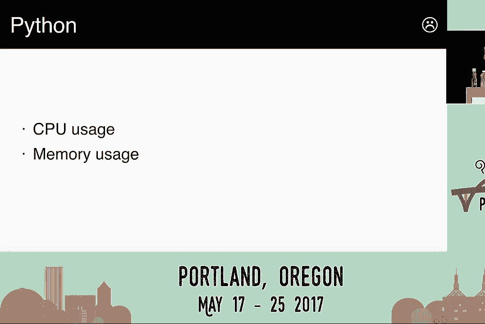
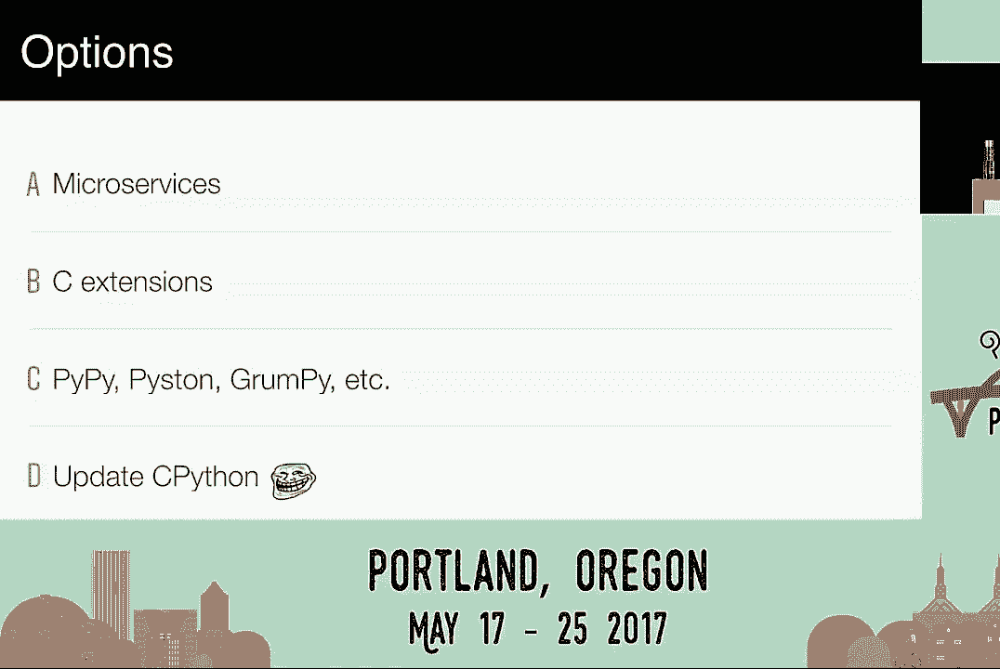
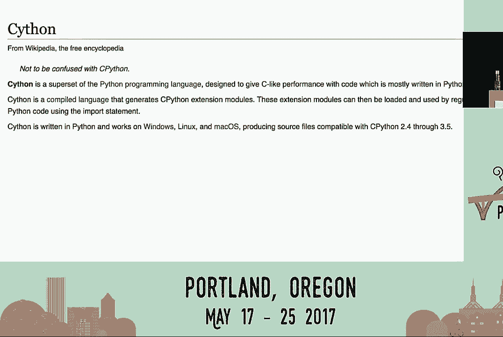
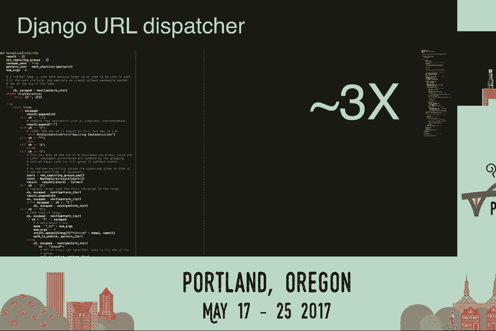
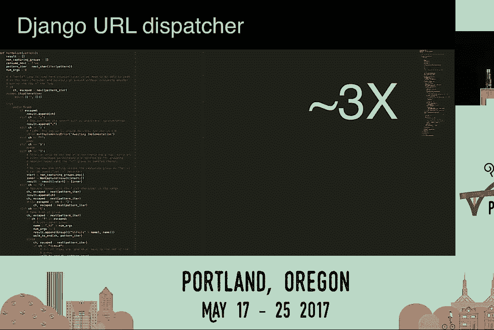
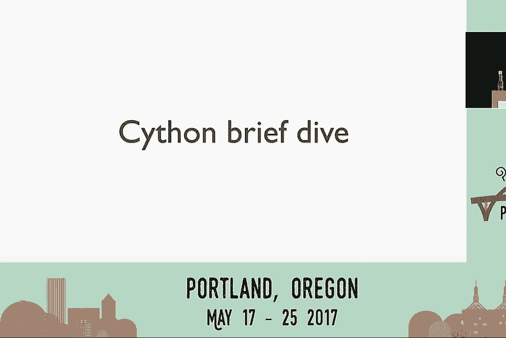
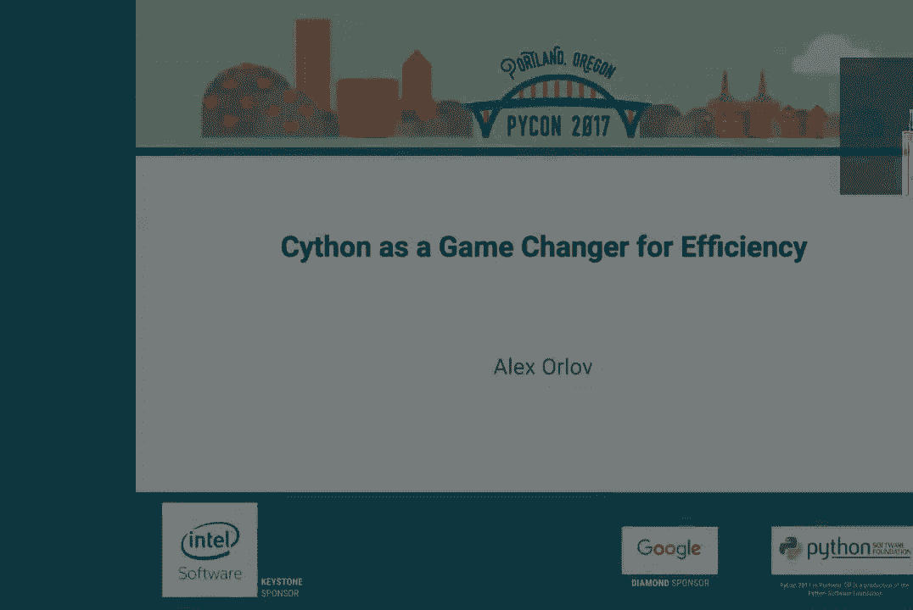

# PyCon 2017（油管点击上万合集） - P5：Alex Orlov   Cython as a Game Changer for Efficiency   PyCon 2017 - 哒哒哒儿尔 - BV1Ms411H7jG

 lecture today。 We know Python is a great language for everything but speed。

 But how do we deal with it？ Anyway， we can solve this problem。

 You will find the answer in the next talk。 Let's welcome Alex for the side-on as a game changer for efficiency。

 Hello everybody。 Thank you for coming。 Today we're going to talk about Python efficiency in general and more specifically we're going to talk about Python。

 So let's start with Python。 It's a great language that you probably love and you can probably name zillion of reasons。

 why do you like it。 My favorite is listed here。 So it's speed of development， code readability。

 great ecosystem of libraries and of course community。

 And actually I work with different programming languages， but， whenever I switch back to Python。

 I always feel kind of relief and always getting surprised how fast and easy development is。

 But let's admit that Python is probably not the most efficient programming language in the world。

 It's definitely quite efficient in terms of developer velocity。

 but not that good in terms of CPU usage or memory usage。

 But the real question here is how much do you care？

 If you're a backend engineer in typical web company and your company experiences grows。

 it's quite likely that majority of your challenges will be somehow related to。

 scaling issues of databases or cache consistency or something like that。 But your web tier， it's。

 quite likely that it will stay simple。 Usually it's a stateless web server and all you need to do in order to scale is to add more boxes as。

 simple as that。 But at some point a number of machines that you edit might become insane or at least big enough for you to consider to save some money for your company and。

 reduce number of boxes。

 Even then， Python execution speed itself might not be a real concern。

 Your web tier can be CPU bound， memory bound， IO bound and all those are different type of issues。

 although sometimes they're correlated。 But let's say that you're in the same boat as Instagram and you also have some CPU issues。

 First thing that you actually need to do is， profiling。 According to Pareta principle。

 20% of work usually responsible for 80% of results。 Or in our case。

 we should expect 20% of codebase to be responsible for 80% of global CPU footprint。 And in our case。

 that's actually true。 So try to avoid premature chaotic optimizations and figure out what piece of code you really need to optimize。

 So let's say you found critical code。 The next thing that you want to do is read your code。

 So it's quite likely that， it just performs unnecessary actions or there is some misuse of data structure or some Python specific stuff like imports inside of functions。

 For example here we have list comprehension that potentially generates huge list and。

 then we have for loop and inside of that for loop we check if element is present in the list。

 Looks good。 Looks like normal code。 But the problem is that list data structure is not designed for this type of queries。

 So we actually have ON square algorithm here， which is fine for many cases。

 But if it's critical code pass then even for relatively small n it might become an issue。

 Fortunately， it's easy to fix。 If you change list comprehension to set comprehension you'll reduce complexity to linear and。

 problem solved。 So my point is before applying any dramatic changes and optimizations。

 Try to read your code first and， check your algorithm。

 But let's say that you did it and your code looks sane， but it's still slow。

 Don't worry at this point。 You also have multiple options。 Option A， microservices。

 So you can take your critical piece of code and if it's easy for you to decouple it from the rest of your app and。

 if you're using service or into architecture， you can probably create separate microservice。

 We've read it in any programming language that you consider to be more performance in Python and。

 yeah。 So it should work， but it has obvious downsides。

 So first of all it sounds like non-trivial amount of work like to take a bunch of code and rewrite it in completely different programming language。

 And also if you're not using service area into architecture。

 it will add complexity to your system in terms of maintenance， deployment。

 capacity playing and whatnot。 So hold on。 Option B， classic C extensions。 Again。

 you can take your code， rewrite it in C or C++。 And create the engine。

 create as a separate library and then just create Python binding for it。 It works。

 It works perfectly well。 And as a matter of fact， that's how many libraries that we use are written。

 But you'll have to write in C++， which is arguably not the most friendly language to write。

 especially if you're product engineer and if you don't have relevant experience。 Option C。

 you can change Python runtime。 So Python is a programming language。

 is obstruction and C Python that you probably use is concrete implementation of that obstruction。

 But there are multiple options。 So there is PyPy， which is probably the most popular one。

 There's a PyStomp from Drumbox， a grandpa from Google， so a lot of good stuff。

 And each of them has pros and cons on its own， so we won't stop here。

 But let's just say that switching Python runtime is not that easy as it sounds。 For example。

 if you want to move to PyPy and you depend or code that you use， depend on libraries that you use。

 depend on multiple C extensions， then migration might be tricky。 And one more option。

 you can update Python。 So as you probably heard， we migrated from Python 2 to Python 3。

 and it improved overall CPU usage of our system by 12%。

 So there's actual ongoing work related to performance。

 And if it's feasible for you to update Python， why not just do it？

 And finally， you can use Python。 So what is Python？ According to Wikipedia， Python is super， OK。

 I don't see it。 Oh， Python is super set of the Python programming language designed to give select performance with code。

 which is mostly written in Python。 So in short， Python is programming language。

 which is basically the same stuff as a Python。 But with optional extra syntax that you may or may not use up to you。

 it compiles to C or C++， and it works perfectly well with your existing runtime。

 So no changes in infrastructure are required at all。

 Let's consider a following example。 Don't worry， you don't have to read this code。

 So that's Django URL dispatcher， basically piece of Django that takes URL and figures out what view or controller it needs to execute。

 So once we noticed that this model started consuming 4% of global CPU in our system。

 And as a first step， we just compiled it with Python。

 And this simple action gave us 3x performance boost for this model。

 And reduced overall CPU consumption of this model from 4% to 1 each percent。

 And if you think about it， that's actually not bad。

 because so far we still don't know what Python is。 We didn't have to learn any syntax。

 And we didn't even have to read Django source code， so easy win。

 So on this slide， we didn't change any line。 So Python was able to apply some optimizations。

 but it can do much better job if we somehow tell it what are we trying to do。

 Let's consider this example。 So here we have transformation function that takes x and just squares it。

 And a plot function which takes n and it has 4 loop。 And inside of that 4 loop。

 it just accumulates results of transformation into local variable。 So if you compile this code。

 it will run 2。5x faster， which is， quite similar to what we experienced before。

 But Python allows us to add types。 Okay， so this code now looks slightly different from normal Python。

 But actually what we changed here， we changed signature functions。 For example。

 now it's defapplier in the end。 Which means that our function only accepts integer arguments。

 And also we declared type of local variables inside of body of second function。

 So if you compile this code for relatively large and like more than thousand。

 it will run 200x faster。 And all thanks to static typing。 To be fair。

 there are multiple optimizations that you that Python provides。

 But if your goal is to optimize existing Python code。

 then adding types is all you need to do in majority of cases。

 So let's take a step back and take a brief dive into。

 Python syntax that you probably should learn if you want to optimize existing Python code。

 Main keyword that Python introduces is cdev。 It's used to declare type of variable。 For example。

 here we have three variables， integer variable i， empty string s and empty list data。 Okay。

 it may look weird， but should be quite simple to understand。 Same applies to function signature。

 You can specify return type of function as well as type of arguments。 And when I say you can。

 it means you can， but you probably should， but you don't have to。

 If you don't specify some particular type， it will default to the most generic type that Python has。

 which is Python object type。 So， Python won't be able to apply some optimizations。

 but your code will still be good to go。 Another thing that I should mention is that there are three different ways to declare functions in Python。

 Dev， cdev， and cpdev。 Dev functions are normal Python functions。 Exactly what you can expect。

 But there is also cdev declaration。 Basically， Python will compile your code into native c function and as a result。

 you won't be able to call it from normal Python code。 Only from Python or from c。

 But on the bright side， it won't have any Python function called overhead。 For example。

 it doesn't need to do marshaling from Python object type and to Python object type。 So。

 calls to those functions are considered to be much， much cheaper。

 And for functions in your basic modules in your system， it might be quite critical。

 And there is also cpdev declaration， which is intersection of two worlds。 So。

 Python will generate native c function that will be used inside of Python。

 But you will still be able to call it from external Python code。

 because Python will also generate thin wrapper。 Few words about type system。

 And Python has support for all primitive c types， such as int， long， float， double， char。 Of course。

 it has support for strings， both byte strings and Unicode strings。 And by the way。

 Python works perfectly well with both Python 2 and Python 3。 So， for example， Stair。

 Stair type here will be Unicode type in Python 3 and byte string in Python 2。 And also。

 Python has support for all Python collections that we love， such as least， said dictionary tuple。

 And again， in majority of cases， if you want to squeeze performance like 2x， 5x。

 that's all you need to use。 But sometimes， if you want to squeeze even more performance。

 you can go deeper and start using low level types。 So， that is scary but unnecessary slide。 So。

 Python has support for such low level types as C arrays or row pointers。

 You probably should be very careful with those。 Also， it has support of enums， C structures， unions。

 And for example， if you're a big fan of C++ Tundar to play library as I am， then。

 and if you always wanted to use vector in your code or tree based map。

 Now you have option to do that。 For example， CDF vector into data will declare empty vector of integers。

 So， it may look unusual and even slightly scary， but again。

 those type of optimizations you will probably apply in rare cases。

 Another source of optimizations that you probably should use are extension types。

 They look quite similar to normal Python classes。 So， for example。

 here we defined PyCon speaker class。 It has three attributes， name， age， biography。

 and there is some constructor and there is some property。 So， as you can see。

 code here looks exactly almost the same as normal Python。

 Only one difference here is that we declared explicit CDF block and inside of that block。

 we listed all attributes as well as their types。 So， behind the scenes。

 Python will use the typed C structure instead of dynamic Python dictionary to store attributes of this class。

 So， as a result， they consume much less memory。 They have faster attribute lookup。

 They have faster method access。 You can declare some methods as CDF。

 And what is most important is they can be used as valid type for a site and static type system。

 Because for Python， any Python custom defined class is a black box。

 Because Python is a dynamic language and you can override everything。 So。

 Python should be safe and it doesn't make any assumptions on internal structure of your objects。

 And last but not least， they work perfectly fine with your existing runtime。

 You can create them and even more， you can even create your new Python class and inherit it from Python one。

 So， overall， your optimization workflow with Python should consist of following steps。 First。

 you detect critical modules and you compile it， compare performance numbers。 If it's good enough。

 you can stop there。 If not， you will have to add some types， then compile。

 run performance comparison again， then add even more types and so on。

 Until you either get performance that you want or it's also possible that everything will be typed。

 but you'll still want to get even more performance。 In this case。

 probably you want to take a look into more low-level pictures of Python。 But that's a rare case。

 For example， you can replace Python data structures with like C data structures or C++ data structures。

 So， a few words about to link。 During compilation， you have option to specify annotation flag。

 It will generate such beautiful HTML。 Here， yellow lines indicate interaction with Python virtual machine。

 As you can see， there are different shades of yellow。

 So bold yellow indicate most expensive interaction with Python VM。

 You can click on any particular line and you will see generated C code。

 If you're not very comfortable with C or C++， probably this code will go on top of your head。

 But at least you will figure out what parts of Python C API are considered to be expensive。

 Just want to share with you some Instagram results that we have so far。 So far。

 we converted only 10-ish， probably now it's closer to 15 modules to Python。 And when I say modules。

 it actually means files。 So， and it already reduced global CPU consumption of our Webstack by 30%。

 And we just started。 So we still see a lot of opportunities and places in our code base that we can optimize and reclaim even more CPU。

 Funny fact is that when we first experienced issues with CPU， Python wasn't obvious option。

 And overall， I had impression that Python is quite popular in open source community。

 but it's mainly used for following to use cases to wrap existing C code or to optimize projects in data science space。

 But as you can imagine， Instagram is quite typical web service。 And as you can see。

 we were able to reclaim a good chunk of CPU with a little effort。 Okay。

 to recap what we have so far， first of all， don't be concerned about Python execution speed too early。

 As you can see， it took Instagram a while before it became an issue。

 maybe a few hundred million users。 So that's definitely a good problem to have。 Once you get there。

 first thing that you want to do is profiling。 It might sound obvious。

 but practice shows that developers tend to optimize everything。

 I think your code base should be similar to ours in a sense that you will be able to find some low hanging fruits。

 That you will be able to optimize and reclaim massive amount of CPU。 And for optimizations。

 you can use multiple tools， but we recommend you to consider Python。 And the reason is。

 it will help you to avoid massive code rewrite。 It also allows you to gradually optimize your code。

 So you can start with compiling existing code， then adding some types， then adding even more types。

 And so it will preserve Python syntax。 So you don't have to learn new language。

 That's basically Python just with types and maybe a few more weird constructions。

 And last but not least， it will preserve existing runtime。

 So you will be able to keep using C Python and no changes in infrastructure are required。 Okay。

 that's probably it。 You can go to cyton。org and check the documentation。 It's pretty good。

 And I'm not sure why I put Instagram reference here， but go to instagram。com。 This is it。 Questions？

 Yeah， please。 So I went to an earlier talk about type annotations in C Python。

 And I was wondering if there's anybody thinking about making it so that when you do that。

 you automatically get these kinds of benefits。 Are there new projects like them？ So first of all。

 cyton is a good citizen。 So as I mentioned， it supports almost all features。 It's slightly behind。

 but it supports all features that normal Python has。

 But now it will just ignore all type annotations that you provided。

 So the reason is that two type systems， myPY type system and cyton type systems are not very compatible。

 And they were designed for different reasons。 So cyton type system is designed more for optimization。

 basically for workflow and to map to more primitive types。

 While myPY type system is designed for different reasons。

 it's more for developer velocity and to keep， you know better than me， probably。

 So and types that myPY system has right now， they're not very convertible。

 And there's not much that cyton can use from it。 For example， list int。 Of course。

 we can safely assume that it's a list， but we cannot take a lot of advantage of this list of integers。

 Or for example， if you put iterable int， cyton doesn't actually need to do that。

 If you in your function iterate through that object。

 cyton can automatically understand that it's iterable without any type annotations。

 So you can argue that you can use it for primitive types such as integers and strings。

 But even then， it's not quite safe to map Python int to see int because you can， I don't know。

 for example， if input is more than 32 bit integer， you'll probably have a bad time。 So right now。

 I don't think there are plans to merge them。 Okay， thank you。

 Can cyton release the gill inside of Python？ Yes， that's another feature。

 You can actually have fair threads inside of cyton and you can release gill。

 And it actually takes care of one trick there is that you cannot work with any Python objects。

 But actually， cyton provides ways to keep you safe and to explicitly flag you that no。

 you cannot mark， you cannot release gill here because we do some stuff with Python objects here。

 So yeah， it can release gill。 Does cyton add steps to building or distributing packages or to， like。

 a CI toolchain to get it to compile the code？ So when you compile code。

 it will produce a so file that you will be able to use as a normal shared library。

 or almost the same as it will be a pi file。 And how you distribute your code base to production machines。

 that's totally up to you。 So it has nice tools that can simplify compilation， but for example。

 we built our own pipeline。 And then you just distribute the objects separately。 Thank you。 Okay。

 So slightly related was one of your examples was about the Django routing system and compiling that bit。

 So how do you deal with compiling just a tiny bit of one library and not the rest of it and how do you ship that？

 You can compile files。 So we just took one file that inside of that file contained all critical functions that were heavily。

 that used to heavily CPU。 Like， basically don't use the pip package for Django anymore。 No， no， no。

 We still use Django。 On import stage， we just patch one particular file。 Oh， interesting。

 So we moved this file to our code base， compiled it and just --， Oh， just that。 Okay。 Cool。

 Thank you。 We didn't compile whole Django。 I've got a couple of the questions。

 Do you know roughly how many engineers you've spent so far on converting things to this Python？

 Much less than migration to Python 3。 So usually optimization of one particular module takes a few hours。

 And then I was also wondering if you could talk a bit about what the biggest problems you ran into were when trying to convert to Python。

 Like old and stupidity。 So sometimes I assume that my function accepts particular type of arguments。

 but it doesn't。 For example， once I assume that it's integer。

 but it's actually float and I caused a bad situation with our website。 Yeah。 Rather than that， well。

 you should be careful with raw pointers， but as I said， you don't actually use it。

 We actually use it only a few times， maybe two times。 Thanks。 Okay。 Hi。 Thank you。 Great talk。

 I had a question about the kind of C extensions that it creates。

 Is it the C types base C extension or can you also have CFFI based extension that works with other virtual machines？

 So I'm not sure that I'm very capable to answer this question。

 but Python by itself is a tool to write extensions。 So can， for example。

 can those extensions work with PyPy， for example？ Oh， for PyPy。 Yeah， it has support for PyPy。 Yeah。

 It has。 But it explicitly added the support。 It's not like。 Yeah。 Thank you。 It has。

 I'm curious why if you did a 3x improvement on the dispatcher。

 why wouldn't you just run it on all of Django？ What's the surely some downside？ What's there？

 Why don't you run all of Django through Python？ If just one module will get you a bit more improvement。

 Okay。 Is there some downside to doing all of it or？ Yeah。 That's a really long topic。 If you want。

 we can try to fly in。 But first of all， compilation takes a lot of time。

 So we usually recompile everything on every， like， or a lot。 And to answer your question。

 we didn't have to -- Django doesn't consume much CPU on our machines right now。

 So it was one particular module that consumed a lot。 So we just compiled that one。

 The last thing you didn't talk about that I know exists。

 there are a bunch of essentially compiler flags that you can put in。

 Are you making use of any of those things？ I mean。

 I remember you could turn off type checking and various things and make it much more see-like。

 We probably need to check out。 No， I don't remember。 Probably for you。 Again， we can follow up。

 Okay。 Thanks for this very heat discussion。

 Thanks again。 (applause)。

 (applause)。