# P10：Mario Corchero - Effortless Logging A deep dive into the logging module - PyCon - 哒哒哒儿尔 - BV1Ms411H7Hn

 \>\> Hey， everyone。 Welcome to the talk on Evers Fertless Logging， a deep dive into the。

 logging module。 The topic is very near and dear to my heart， so let's welcome Mario。

 [ Applause ]， \>\> Hello， everyone。 My name is Mario Gorchiro。 and I'm here today to speak about logging。 Well， that's my guinea pig。 If you want to find me afterwards and speak about more logging。 or anything related to Python or traveling to Spain， if you're planning some holidays。

 I'll be around。 And also， I know that you saw this first slide and you thought， oh， my God。 this is one of those slides where maybe the topic is interesting， but it's all going。 to be about how happy Mario said Bloomberg that they are recruiting in London， New York。 San Francisco， many other places。 The company is great， great benefits， but I'm not going。

 to say anything about that。 So today the topic is we're going to see why logging is important。 how logging works， how can we use it， how to configure it。 We'll try to see some code。 and then some sample recipes。 I'm going to have to flash through the slides because。 I just rehearsed it and I don't have much time。 So first of all， it's why logging。 And I like。

 to realize that today when you write code， you might be writing documentation because you。 realize the issue that when people read your code， that it's not you， have to understand。 what you wrote， but you also need to realize that when your code is running in production。 as a black box， people are going to see your code when you are away on holidays on Spain。

 as we're going to discuss afterwards。 And you don't want them to call you because they。 are not able to figure out what's going on， right？ And logging and instrumentation is。 what it does for you。 It allows you to see what application is doing when it's running。 So I like to see that some kind of documentation for developers and CSAT means when things are。

 on fire that they need to see。 Some first will likely go farther and say that if you use。 a debugger in development， you are doing it wrong because they say that if you are not。 able to reason about your program on your development environment， just with the logs。 how are you going to be able to do it in production？ I'm not one of those。 I can't still use the。

 debugger。 I can see the reasoning behind it。 I really try to instrument my application。 in such a way that I deal with what I'm just running the test。 If I see the logs， I will。 be able to understand what's the issue behind it。 So you would say， yeah， but that's all。

 cool， but I'm old school。 I like print， right？ Print is a great tool。 I can just print whatever。 I want。 Print is not -- you want to use the right tool for the right job。 Logging has many。 features that you won't get out of print。 First of all， logging allows for multi-threading。 If you are printing things around multiple threads， everything is going to collide。 It's。

 more flexible。 You can categorize your logs as we're going to see in a minute。 For me。 the most beautiful thing is the design of logging。 It allows you to split the how from， the what。 What I mean is logging has this kind of collaborative approach that it allows you， to say。 what do you want to log without worrying about how is it going to be logged？ What do。

 I mean for this is if you are writing a library， you can instrument it with logs and the person。 that's going to use the library in application can worry about how those are going to be treated。 First of all， I've seen this picture on every good speaker's presentation。 I don't know if。

 that happened to you。 I have to use it。 We're going to see how logging works。 What are the。 different parts that it has and how everything blacks together。 The first of all is the logger。

 class。 The logger class is the main class that you interact with。 When you're writing a Python。 program， you take a logger， you call one of the methods that you have and pass a string。 template and the arguments to it。 This thing goes into the logger code and it appears whatever。 you want。 It's not really like that。 The first thing that's going to happen is that the logger。

 is going to create a log record that contains not only the template and the message that。 you have but also context about where this is being logged。 Once that's done， we know。 that that object cannot magically go to your console。 What's going to happen is that a。 handler -- sorry， this way。 A handler would take your log record and put it into a stream。

 like a CDL or a file or an email or whatever you want。 There are multiple handles in the。 standard library that can take your records and put it on whatever destination。 If you haven't。 checked them out， I invite you to do it because there are some that are really， really cool。 Like for example， you can send ELOX via HTTP with an already pre-built handler that is。

 in the standard library。 That's what we discussed。 Now we have the logger that takes this kind。 of message。 It goes into the code of the logger， then it creates a record and then it takes。 the record to the handler and it appears。 That's all good。 But you might be wondering。 that log record is an object。 So how is that object being transformed into a string when。

 I'm logged into a console？ Even if you have this three handler that we spoke about with。 this file handler， all these kind of handlers that at the end just output strings， all that。 code needs to be shared somewhere。 That's what the formatter comes in。 Formatter will。 just take this log record and transform it into a string。 We understand logging now， right？

 So we have a logger which takes a string。 It goes through the logger code。 It meets a log， record。 but by sending it to the handler， and the handler is going to format the string。 Everyone understands logging now， right？ It's really simple。 There's one more thing that。 we want to introduce。 So there's also filters。 They just allow you to filter logs on more。

 like fine-tuned characteristics。 So it's basically a class where you can decide whether based。 on any character of the log record whether you want to let it pass or not。 Okay。 We have。 the whole stack now。 So a logger takes a string。 Well， at the template and the parameters go。 through the logger code。 Filters might allow it to pass or not。 We're going to emit it in。

 the handler。 The handler is going to format it。 There's also filters in the handler， and。 if all of that works， and now we're going to have our beautiful log printed into the console。 or whatever script we have。 Not that totally simple。 We have also a logger hierarchy。 I know。 this is starting to get complicated， but we are going to go a little bit later on that， way。

 So now there's the logging hierarchy。 Whenever you create a logger， you have this。 function that will retrieve a logger with the string separated tokens that you pass on it。 So here。 and this will create a hierarchy for you。 So here basically what we are saying。 is we want to get the logger parent child， and that logger is a child of parent which at。

 the same time is a child of the root logger that all loggers inherit from。 You can see。 it kind of the， like the， you can see the root logger like object， okay， on Python 3。 But don't worry， you don't need to land MRO。 There's no multiple inheritance here。 Okay。 So this is complex， but now we get it。 So we said we have a logger， takes the template。

 takes some parameter， then we have the filter， we are going to meet in a lot of law， we formatted。 but we're going to do the same thing again。 And now if the logger has this attribute called。 propagate set to true， which is the default， it's going to meet it to all the party handler。 And now this is really important。 This is what confuses a lot of people when using logins， tag。

 And it's that when you have parent loggers， parent loggers， the code that is shared is。 the call to the handlers。 Okay。 So what I mean is once the， once a logger is done processing， well。 when a， when a logger has called all the handler that it has， it's not going to。 call the parent logger， it's going to call the parent handlers。 So it's going to call。

 the handlers of his parent logger。 So the filter code， for example， won't be executed。 Okay。 This was complex。 We do now know how logging works， right？ Now， now， okay， some， more things。 So loggers also have a category and a navel and some of the attributes that。 will control some of the particularities of your logs and how they travel through the。

 logging stack。 Basically， category on both logger and handler will allow you to set a threshold。 on both of them。 So for example， if a logger has a category of warning， it will only log， warning。 and above log records。 And now you might be wondering， like， what happens if。 the parent logger has a level of error only， but the child one has info？ So because as， we said。

 only the， the parent handlers code is the one that is being executed on the， parent。 That won't be an issue。 But we'll， we'll， we'll see that in more details on， all of the。 on all of the slides。 I don't want to make， make， make some of the things。 Now with all that。 this is the actual， this is the actual diagram that you have in the， documentation of Python。

 Actually， this whole talk came because the first time I saw this， slide， it was， I was like， yeah。 this is correct， but I have no idea how to， I mean， I know how， to read this， but it's super hard。 right？ If you have no context about how logging works， this is great。 then you can follow the diagram， but it's really hard to reason about logging。 Okay。

 So we have wind scene logging， let's see， let's see now how， how can we use those， those loggers？

 This is an example on how to use logging。 And you can see that we are， getting here a logger。 we are logging on the bug， and some interesting things are， for example， here we see， we see x info。 This is， if you are on stack， if you are in an exception scope。 this is going to log not only your message， but it's also going to log the exception。

 that you are being handling。 This is super useful。 At the same time， we spoke about the。 the levels that logger have， like the bug info warning error and critical， and exception。 is not a new level。 It's just error level with x， with x info to true。 If you want to， log this。 the stack information outside of an exception， you also have this new parameter。

 called stacking for that you can use。 Okay。 So now， I'm going to， I'm going to show you。 some issues that I was doing at the beginning， where I was recently logging without reader。 documentation， and I'm only， I'm the only one that does this。 I'm not all of you read。 the documentation before using any library， right？ But I didn't， and these are some things。

 that I realized that I wanted to do different from the way I was using it。 So first of all， is。 well， disclaimer， this can start flame wars bigger than space versus tabs。 Okay。 But basically。 I used to do format on the message and just pass a string to the logger。 Ideally， what。 you want to do is this。 Some people will claim that this can， this can cause what's。

 called a hasten bug， because if it depends on how you logging configuration is， is the。 only application you may see a narrow note at the time that you are， that you are like。 printing this message。 But being realistic， I think this is， this is， this is a much better。 way to pass a message。 And this is actually now an error on pilot， even if pilot is opinionated。

 that hey。 Next thing is this。 How many times have you seen this beautiful exception where。 it says a terrible error will happen？ Data。 And the problem is that what you want to do。 is this to see the whole exception， because if you do this and you get a key error， what。 you're going to get is the string representation of a key error。 And the string representation。

 of a key error is the key error that you're missing。 So if in your tribe log you are doing。 a lot of access to dictionaries， you're going to get a really meaningful data， right？ How。 beautiful is that？ So just use x info and you'll get the whole stack and line and the type。 of exception of what happened。 If you want to create your own logger hierarchy， you can， do it。

 And in some situation that's useful， but most of the time what you want to do is。 to link your log hierarchy with your folder naming。 This will make， for example， if you're。 working in library requests， but just doing that， all your logs in all your files that。 you have requests will have the parent log of requests。 So this is like super handy。 And。

 you don't have to think about naming， which is the biggest issue in computer science。 So we know how to use it， but how do we configure this？ We spoke about this beautiful design。 on logging where you can write code that uses logging and then on a totally separate space。 you're going to configure how that works。 So we're going to see that。 And there are three。

 main ways to configure it。 You can configure it by writing code。 You can use an init file。 or you can configure it with a dictionary。 So first of all， you can plug everything together。 or you can use for really simple scripts and things like that。 You can use basic config。 It just has some kind of a list of same defaults for scripts and things like that。 It will。

 just log to std error。 And it would， this is exactly the function that will be called。 if you start to use logging without having to configure it。 It has a lot of parameters。 so with basic config， you can， for example， start logging to a file instead of a std error。 And you can set the level， format， and many other things。 You can check documentation。 Then。

 this is probably the most interesting one， like configuring from a dictionary。 When you。 configure for a dictionary， you're just going to list all the components that we explained， before。 So， for example， here we can see that we have plugins， logger and the root logger。 being configured to this one only to error level and this one to console level。 So you。

 can see the plugins logger doesn't have any handler， but that's not an issue because it's。 going to use the handler of the parents。 And oh， and if you wondered， yeah， you can also。 configure the logging with an in-file， but I don't like it， so I'm not going to present， it。 If you want to configure it from a file， you say， "YAML file，" and then use the dict， one。

 which is much more powerful。 And now we're going to see how this code goes through the。 logging code of the Sunday library。 Something I really like about logging is that the code。 if you understand all the design decisions that are around logging， the code is really。 easy to follow。 So if you have an issue with logging or you don't understand nothing， you。

 can use it on this time something。 You can just literally open the code with many other Python。 modules and read and see what's going on。 Anyway， we are going to see what this line。 is going to be doing。 So first of all， is the blue okay？ Can you read？ Okay。 So don't。
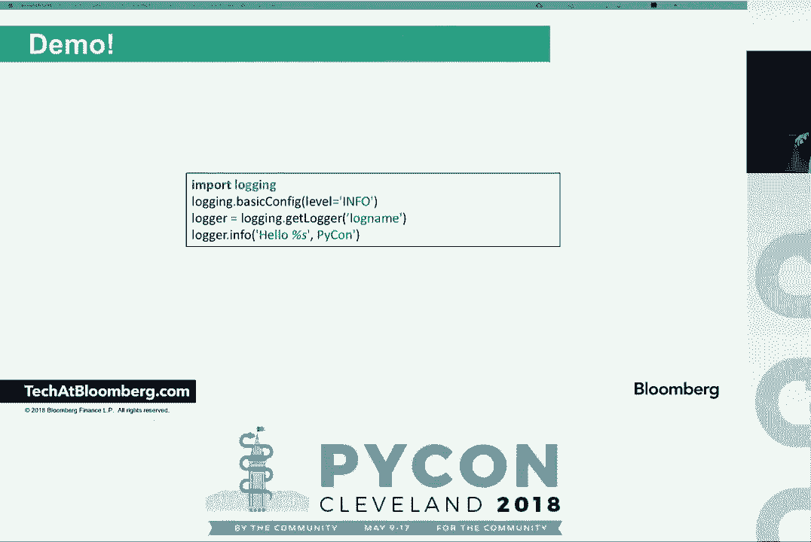

 worry， that's just a string。 So basically， this is the info method of a logger。 And I。 think that's -- you can see the first thing that is doing is going to check if this logger。 is enabled for the category that we are trying to log， which is info。 If that's the case， then。 it's going to call this underscore log method， which we can see here。 It's huge。 Here you。

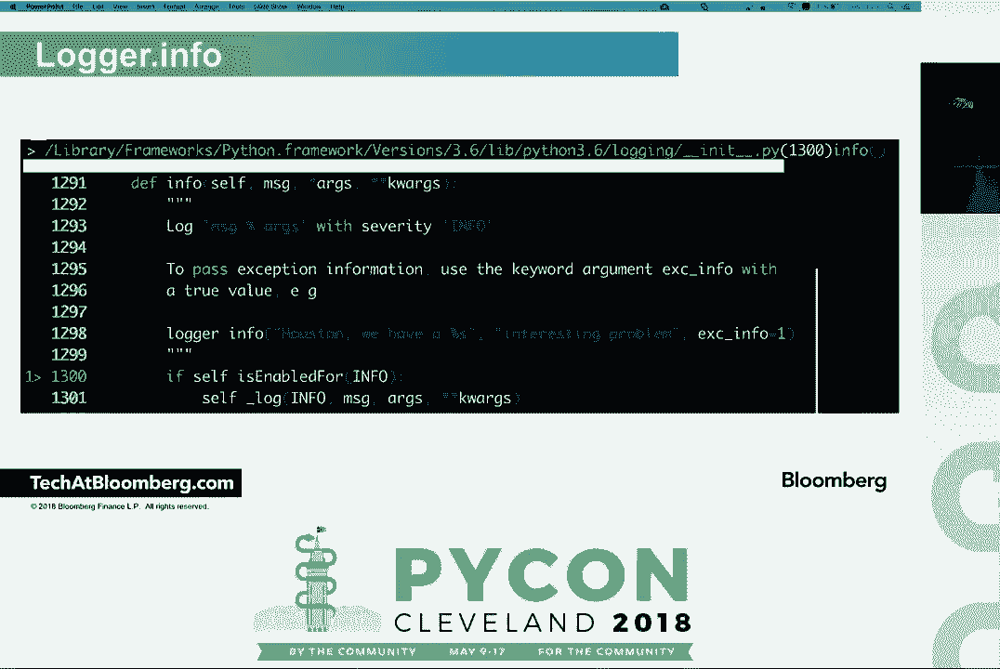

 have a lot of code， so it looks like a more technical talk， right？ And here you can see。 that we are building this here in red， which is also not really great。 We are building this。 log record that we spoke about。 And it doesn't have just the message and the arcs that is。 what we provided， but it has all kind of all the set of information that is collected around。

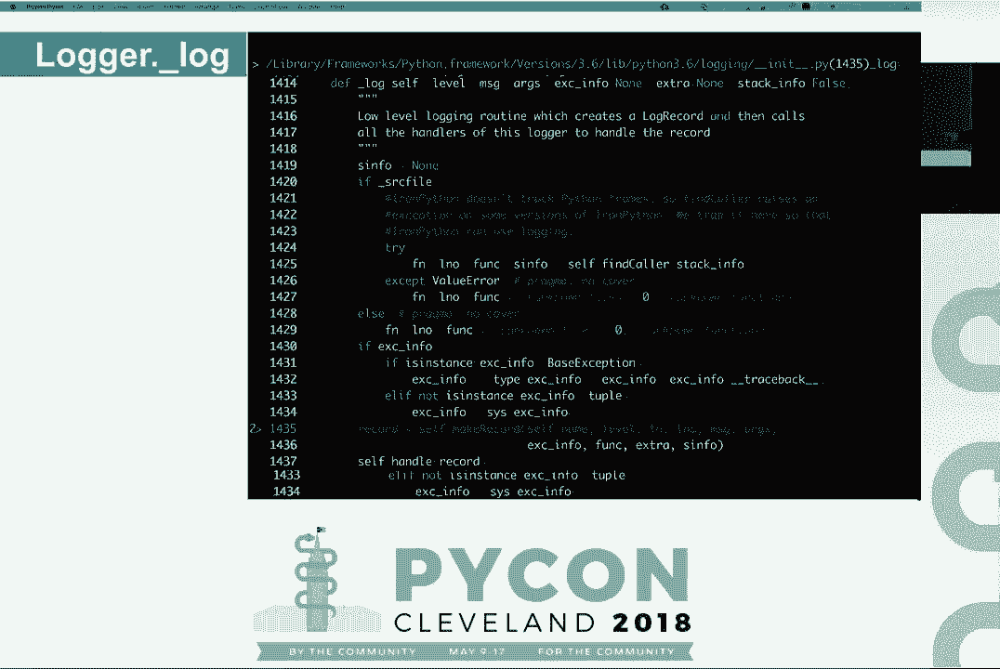

 the function that you are using。 Once that's done， we are going to call handle in the logger， yet。 okay？ And the things that handler is going to do is it's going to check if the， logger is enabled。 And if the logger is enabled and the filter is going to go through， then。 it's going to call the handlers， steal the code of the logger。 So here we're still in。

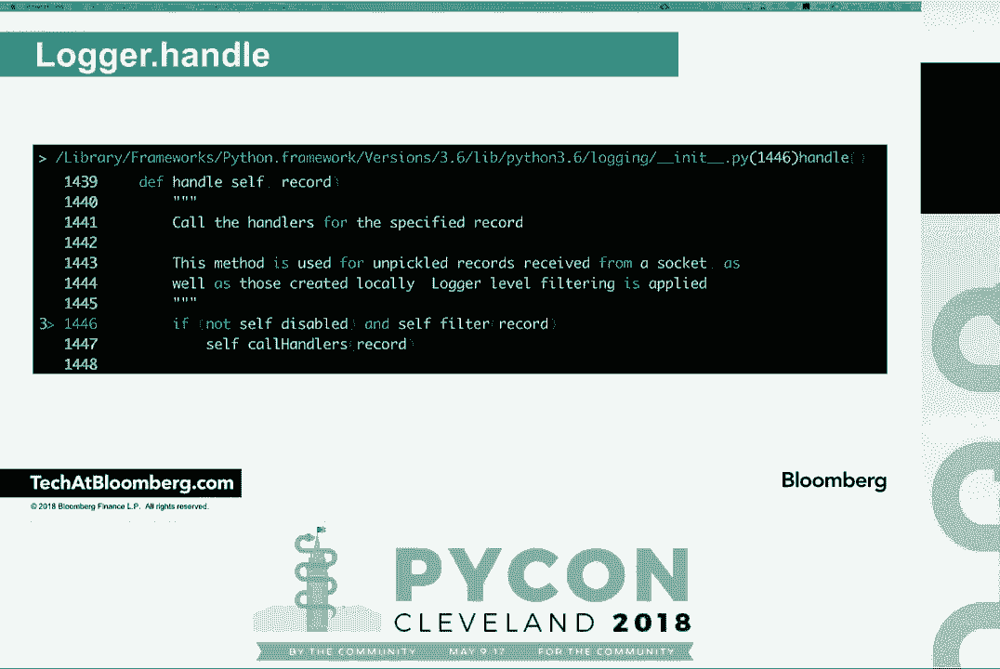

 the call of the logger。 This is， I think it's like the main bulk of logging that you're interested。 on。 And what this is doing is， well， if I cannot read what's here， I don't know how， can you do it。 So what you can see here is that C is the current logger， and then it's。 going to go for each of the loggers， it's going to go through all the handlers that the logger。

 has and check the level and then send the log to the handler。 Once it's done with all， the handlers。 you can see here that if propagate is set to true， if， so if propagate is set， to true。 it's going to take the parent logger and then call all the handlers above。 As you， can see。 this is what I was speaking about before that a logger doesn't call the parent， logger。

 It just calls the handlers of all the parents。 That's really， that's for me， at least。 it was one of the most confusing things。 The other thing that a parent logger used for is。 that if a logger doesn't have a log level set， it's going to try to get the level from the。 parent and the rigoratively。 That's what the hierarchy is useful。 Now， once you're done， here。

 you're going to go to the code of the handler and here in the handler， you're basically。
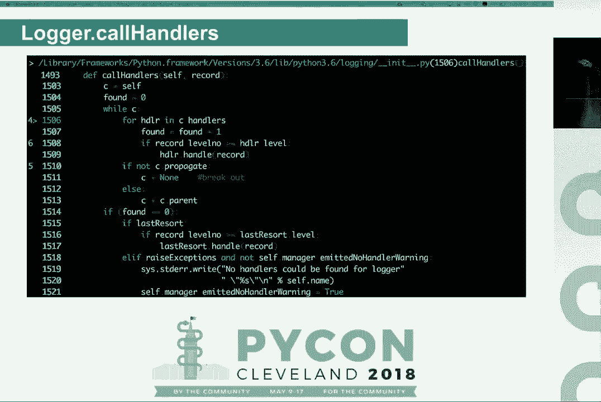

 you have this for multi-threading and then you're just going to call a meet on the handler。 and that's up to implementation of the handler。 So as we saw some handlers can log to files。
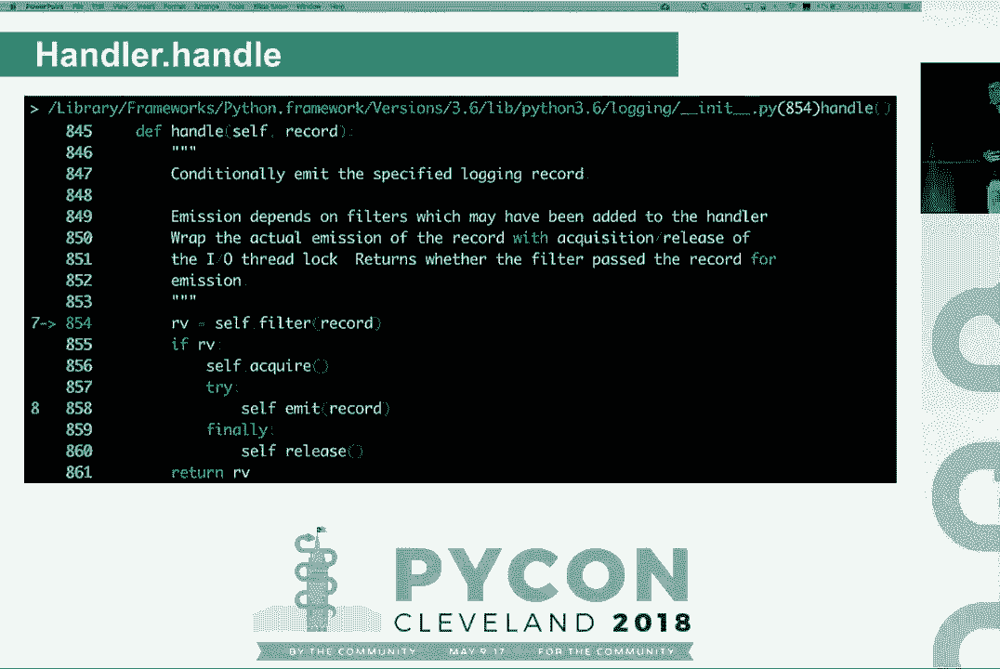

 some handlers can log to console。 That's totally up to whatever you want to do on the， handler。 Okay。 So we saw， we saw loggers， we saw handlers， we saw for matters， we've seen。

 a lot of things and this is really cool and if you want to use the standard things on the， login。 that's great。 But how do we go about sending logging？ It has a beautiful design。 and it's ready to be extended but it's always nice to have some kind of basic recipient on。

 how to do it。 So that's what we're going to see now。 I'm going to run through them but。

 we're going to see some examples。 So this is， I know， I know 12 factor apps， I know you。 should log to STD out。 This works great in Heroku but for my home server that I have。 a lot of this configuration。 So here what I'm doing is I have a single file that is going。 to have all the logs of requests， because I'm sending requests around。 I have a debug log。

 file that just holds， that like expires on two hours。 So if there is any issue， I can。 go and check it。 I have an error log file that has all the errors from two months for， example。 And as you can see， you can just have many handlers from different purposes that。 can be used in different situations。 I'm going to predict the code on， I'm going to put the。

 slides and everything on， on like on pikens on this schedule so you can take it after。 what you want。 Although some of the， some of the recipes are already in the cookbook and。 the other ones I'm actually trying to get them into the cookbook。 Now this is a way to， log JSON。 not super interesting unless you want to do it。 This is useful for， if you are。

 using some kind of a greater and this is， so let's say that you're writing an application。 in Flask on， on some kind of web server， you can， you can use filters， you can abuse of。 filters to add some kind of contextual information like a correlation ID。 And that will allow。 you to， if you are using Splunk for example， and there is an error， you can get that correlation。

 ID and see all the logs that are related to that correlation ID。 From Python 3。4 I think， you have。 if you are lucky to be doing Python 3。6， we hope， I hope you do。 You can use a。 new factory method in the login stack that also can do the same thing。 Money is much cleaner。 Although this is actually one of the way that is recommended but nowadays it's much better。

 to the factory。 This is really cool。 So your application is really verbose and it has some。 info logs that are okay but you only want to see those info logs whenever there is an， error。 By just doing this kind of buffering handler， what you are doing is that you will。 see the info logs only one， like you will see for example， you can configure it to three。

 you will see whenever an error happens， you will see the three， the three info logs that。 precedes him。 This is really useful for troubleshooting as you can imagine。 Okay。 So what happens。 one of the issues of logging is whenever you log something that's going to block and tell。 all that machinery that we saw is going to be done。 This means that if you are sending， an email。

 if you have an SMTP handler that will send you an email， that line is going。 to block until the limit is done。 So you can also use a queue handler which basically allows。 you to queue your log to be handled in a different way， in a different place。 Now the concept。 of log record that we spoke about is key here because we built a log record before the code。

 of the handler has come through。 All the information about the log is captured at the time you。 create the log and not at the time that you emitted。 Sorry。 Oh， you have found this super， useful。 So if you are creating a CLI tool and you want as many Unix tools to log for example。 warning and above to STD error and info and below to STD out， you can use this small， this。

 simple filter to do that。 Because by default， there is no way to do it。 And this will allow。 you to do exactly that。 With that configuration， you can also use the config as we saw before。 This is not important。 We are going to jump it and anyone here knows what's Kahoot。 So。 get into Kahoot。edu because we are going to do a small questionnaire。 And if you went。

 I will let you first stroke my guinea pig if you come to London and I will pay you a， year round。 How am I with time？ Oh， five minutes。 If you go to Kahoot。edu， I will give you a。 code and then you can play。 I will give you 20 seconds to join。 Not a lot of time。 Oh， sorry。 I need to tell you the code。 The code is 2161911。 216。 Oh， I can paste it here。 Right？ Oh， no。

 I don't。 There you are。 2161911。 Did anyone log in？ Oh， yeah。 Wow。 100 pliers。

 Okay， let's start。 So these are some questions。 Really important question I would like to see。 if you know them。 Wow， 150。 Are there that many people here？ Okay。 The walls are coming closer。 So wait。 No， no， no， no。 It started。 Sorry。 Oh。 How do I stop this thing？ Okay。 Here。 No。 No。 Okay。 Oh。 There you are。 Change screen。 Yeah。 There you are。 So what of the following。

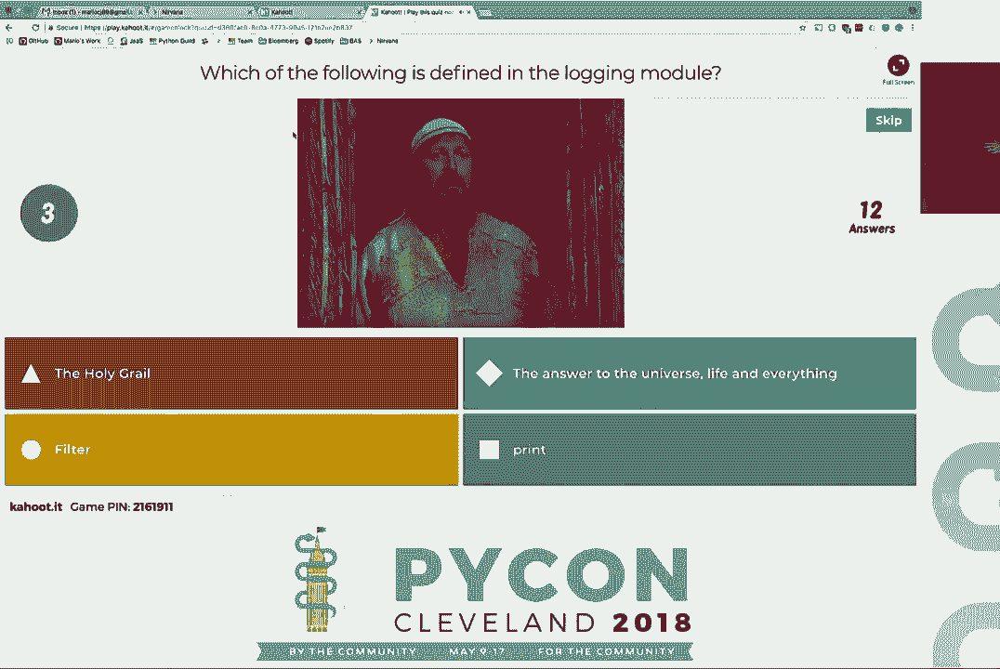

 is the finding the logging module？ Sorry。 That was really great。 It was filter。 Next one's。
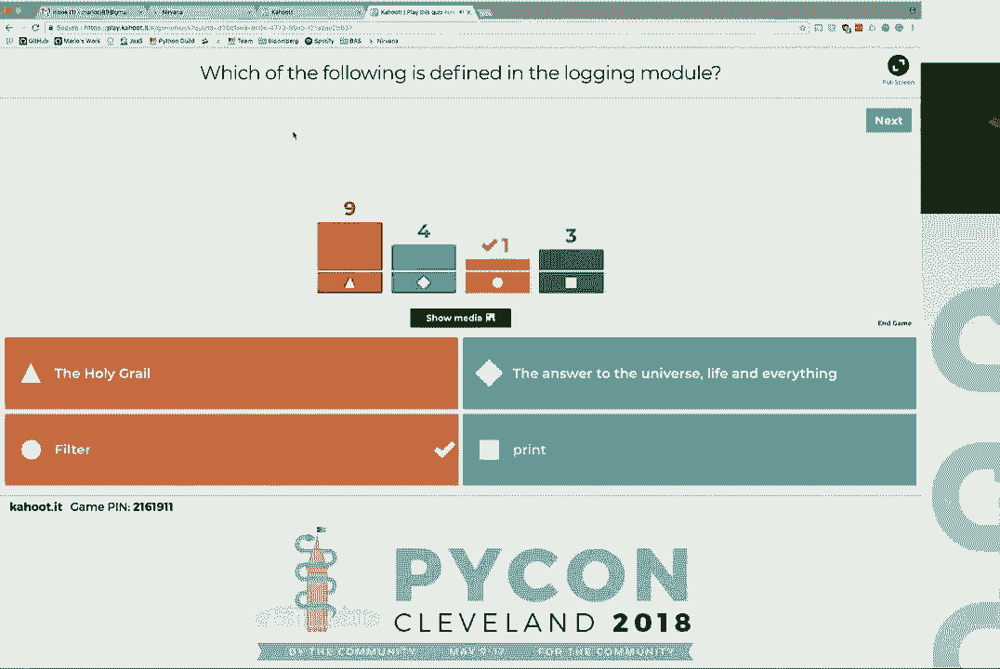

 going to be better。 Okay。 So PPP is the only person that managed to do that。 So what is。

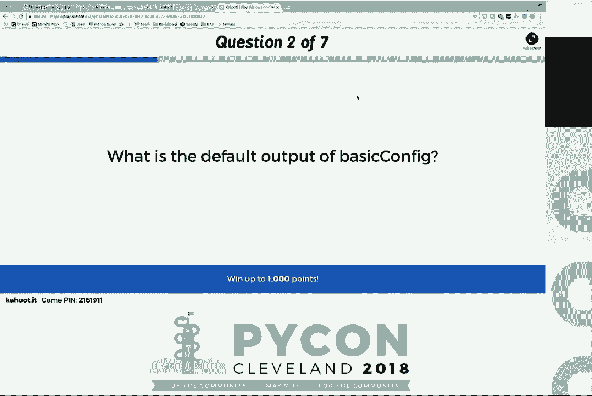

 the default output of basic config？ The SDDR， SDDR makes or a file in temp there。 Wow。 People。 are participating。 I think this was going to be a disaster。 Great。 Is SDDR。 That's a。
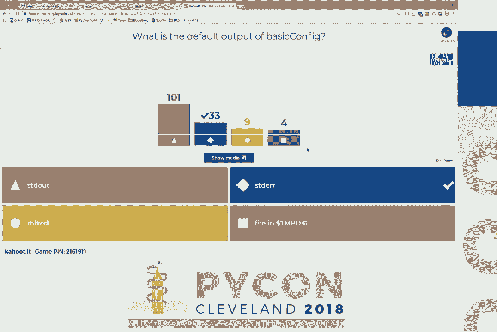

 catch up。 That's why I put that question。 Okay。 What happens if we call basic config。

 twice， right？ Because it's going to configure your whole stack twice。 Is it going to only。 the first one's going to work？ Only the second one？ What's going to happen？ If there's a free。 beer here， stick it seriously。 So only the first one will take effect。 And actually if。 you log something， so if you just log a log record and then you call basic config， the， second call。

 like the call that you do will be the second call and that won't work。 That's。
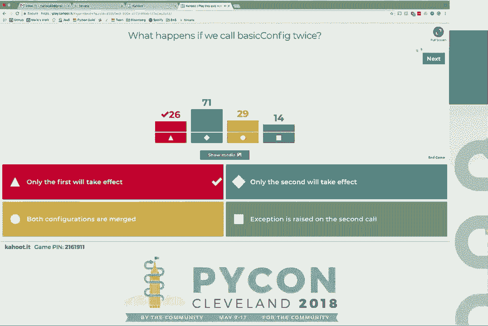

 quite a catch up。 Okay。 Which one of this is not a value format for templates？ So basically。
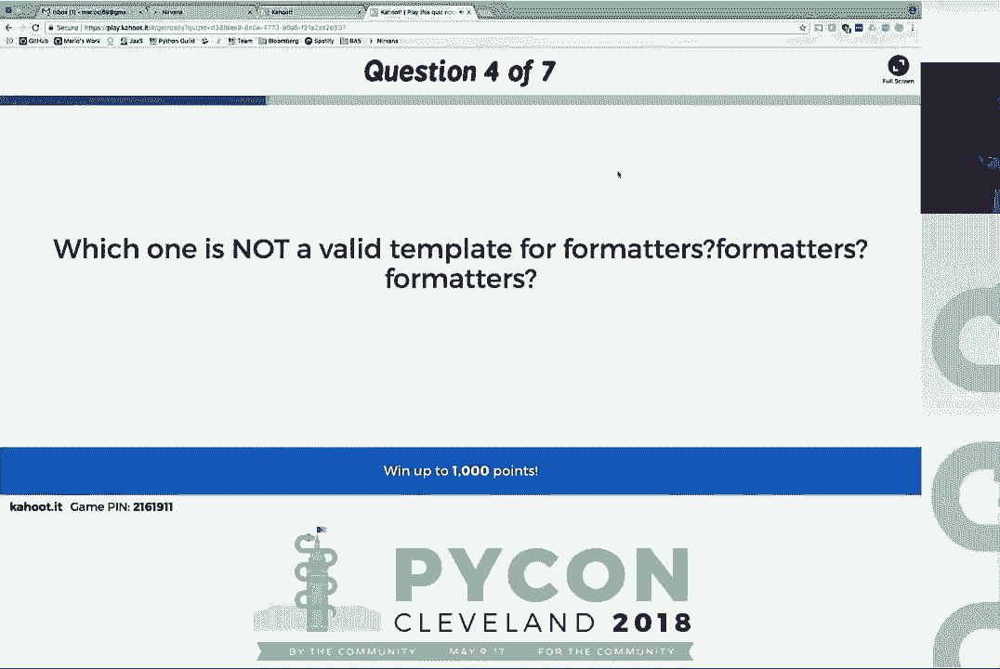

 when you create a format or you pass a template for it， so which one of this is not valid？

 This is for， this is if you have worked with login before。 Otherwise， you know， choose random。 Okay。 I mean， I cannot pay that many beers， right？ Who's the original developer of login？

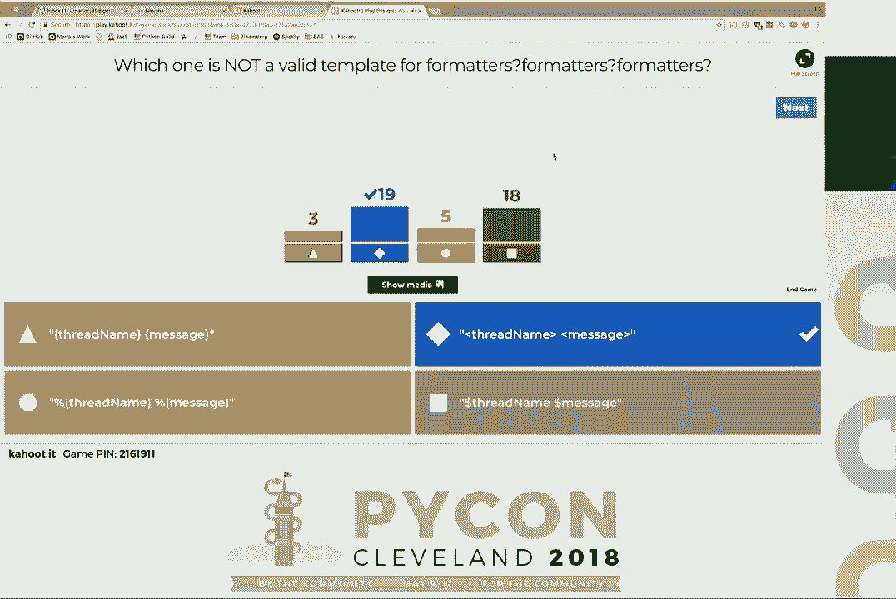

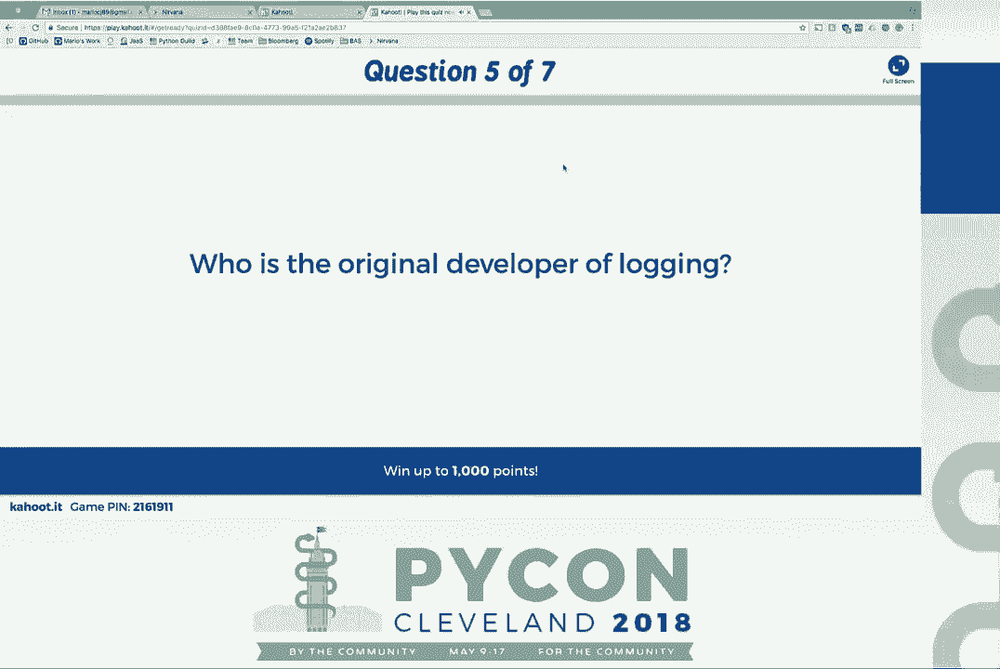

 Gito， Victor and Nelson， maybe synonymous。 But who committed it？ Come on。 Great。 Oh， who's。
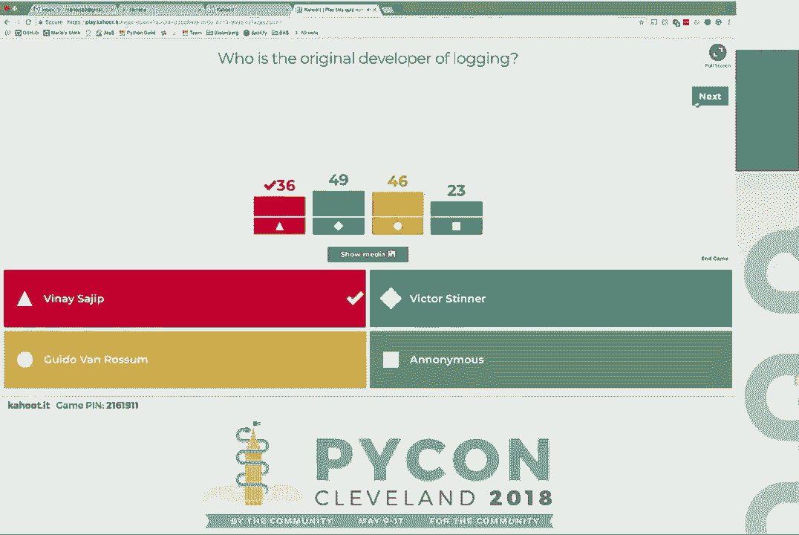

 James B？ So what year was it brought to you？ It was long ago。 For those that do Java as。

 well， or respect， the login model was important。 Well， it's like the design of the login model。 is actually brought from log4j。 And yeah， it was 2002。 And I think this is now the most。
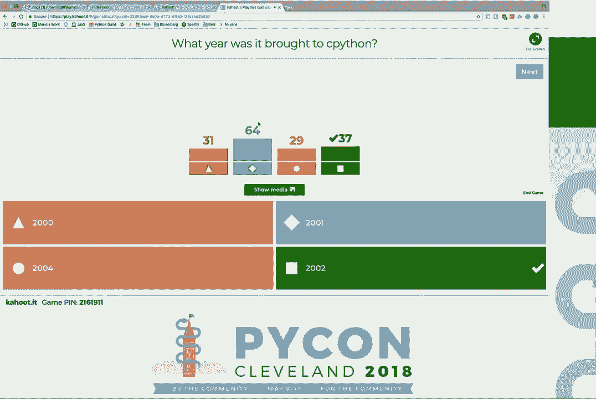

 important question of the whole survey。 Okay。 Take it seriously。 What is the name of this， region？

 I'm from here。 Catalonian Madrid， Exzler Maduda， or France？ Yes， Exzler Maduda。 If you。
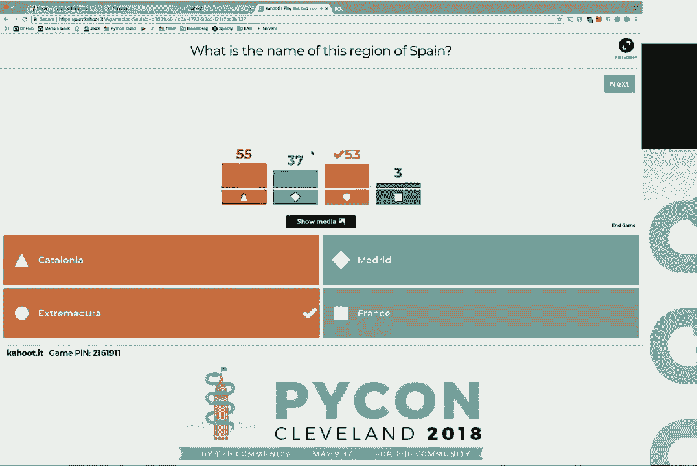

 want to go for the reason that I have really good advice。 So James B。 One。 Where is James。

 B？ James B？ Whoo。 Okay。 So with that， I'll give you some links。 This is an article about。
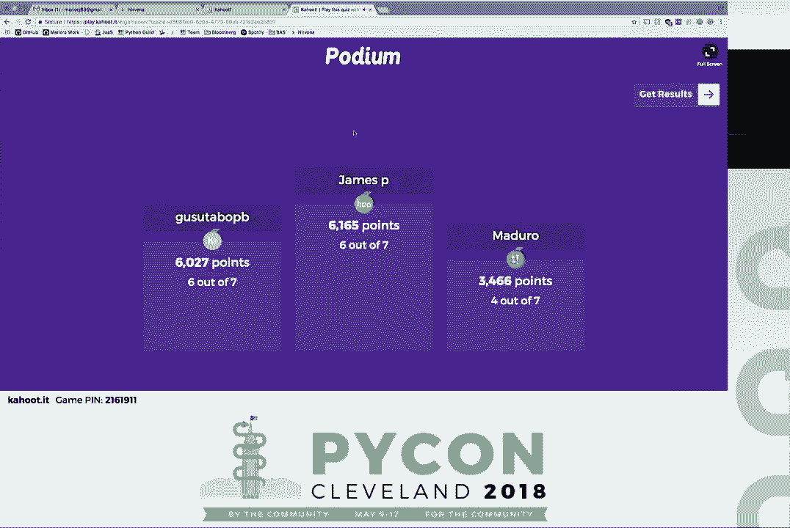

 login， the how to and the cookbook。 Those are really useful。 And just go on， read the code。 The code of the login model is really easy to read。 And it's really well designed， even。 if it's old。 The design around it is really good。 So with that， I'll leave you。 Oh， no。
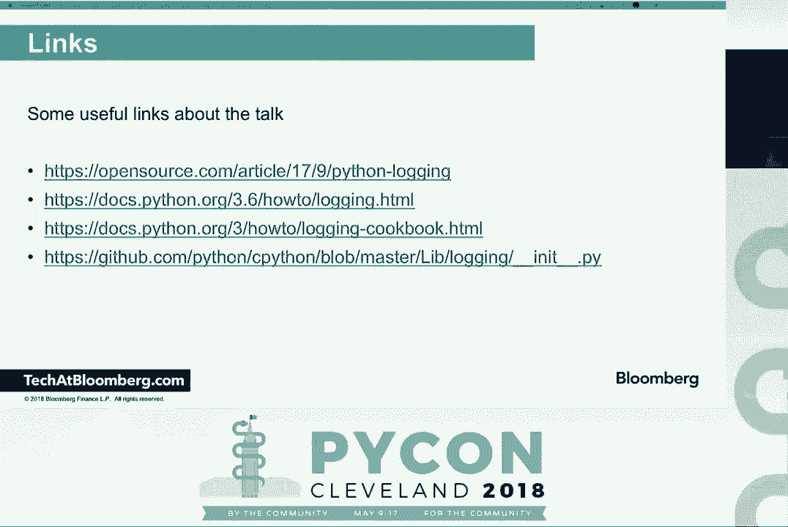

 it doesn't work。 One second， one second。 This is really important， as well。 There you are。

 So now we have time for questions， right？ That's my guinea pig。 It's the need of my scene。 Okay。 For the questions， there's a mic up front if anybody has any。 Hey， I have a question。 So say I'm developing a library and I want to use logging， right？ But I don't want to。 presume what my users might configure， how my users might configure the logging module。

 How should I go about doing that？ Do I just call the module， get the logger for the module。 name and then log to that and leave it on them？ Or what do I do？ Yeah。 So my advice would be that you log as you think that it's useful for your users。 in the sense of you want to log the information that will help them travel to the issues。 And。

 something really important that I see a lot is don't log errors on your library。 If there。 is an error in your library and you're going to throw an exception， don't log it as well。 Because it can happen that your client might want to just capture the exception and ignore， it。 And if you are logging an error， then you are forcing them to put a higher threshold。

 on your library。 That makes sense？ Hello。 I have a question about multiple inheritance。 You mentioned at the beginning that there， is no such thing and it actually disappoints a little。 So is there any way to implement， multiple inheritance in case I have some specific logger but I use it in different models and。 I want to have the same config， the same logger？ Yes。 So the only thing you can do。

 so the only thing that's shared across logger by inheritance， is as we said。 the level that's going to take by default if no one is set and the handler， that it had。 So usually what you would see is that multiple loggers， I've seen situations， like that。 you'll see that multiple loggers will just have the same list of handlers。 And， because the code of。

 you know， the configuration code is actually in the handler， it's just， fine to list them as a list。 I don't know if I explain it too well。 Yeah。 I think I understood。 Thank you。 One last question。 After that， like， here， Mario will be outside。 Yeah。 Okay。 It was a great talk。 Do you have any suggestions how to do logging in multiple， processing with multiple processes？

 There are some particular issues there。 Yeah。 So that's actually quite tricky。 So the problem when you have， like， if you fork， if you have multiple processes。 the problem is that you cannot have multiple processes。 log in into the same file because everything will get messed up。 So the useful suggestion。

 there is to use a queue handler as we saw before and then have a single process doing。 all the logging。 So basically you'll have， you know， when you fork and everything， that。 queue will have the two ends and then you just in queue all the logs and a single process。 will do all the processing and there won't be any issue。 Thank you。 We're done for the session。

 The Mario will be outside。 Thank you for all。 Thanks Mario for your questions。 [APPLAUSE]。
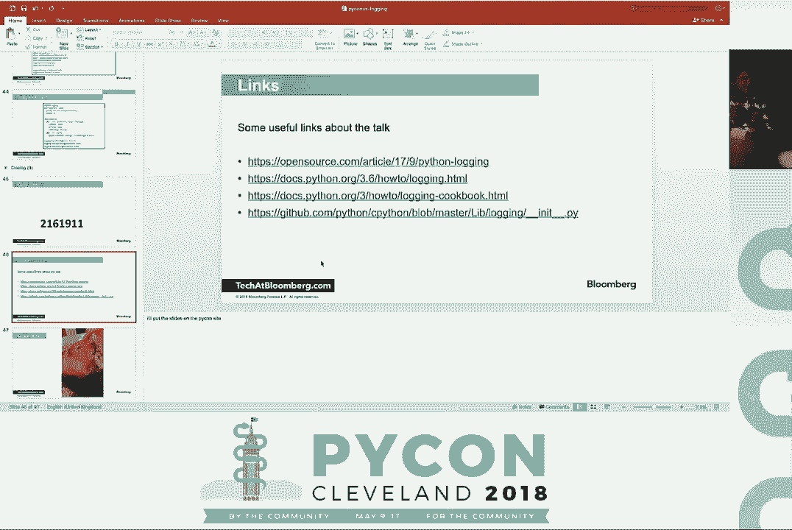