# P11：Pieter Hooimeijer - Types Deeper Static Analysis and you - PyCon 2018 - 哒哒哒儿尔 - BV1Ms411H7Hn

 >> Hello everyone。

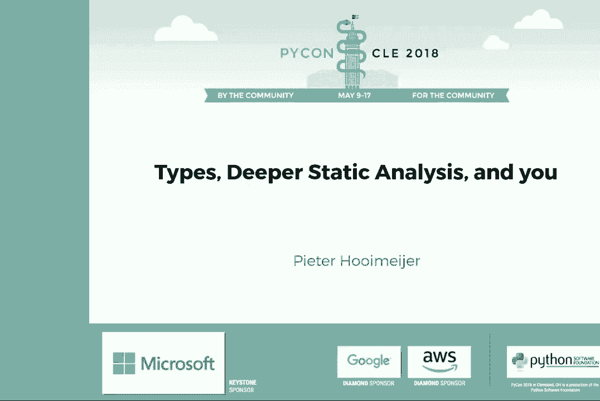

 Hi。 So welcome to the talk on types， deep static analysis and you。

 Please welcome Peter who will be presenting this awesome topic。 >> Thank you。 How's my audio？ Yeah？

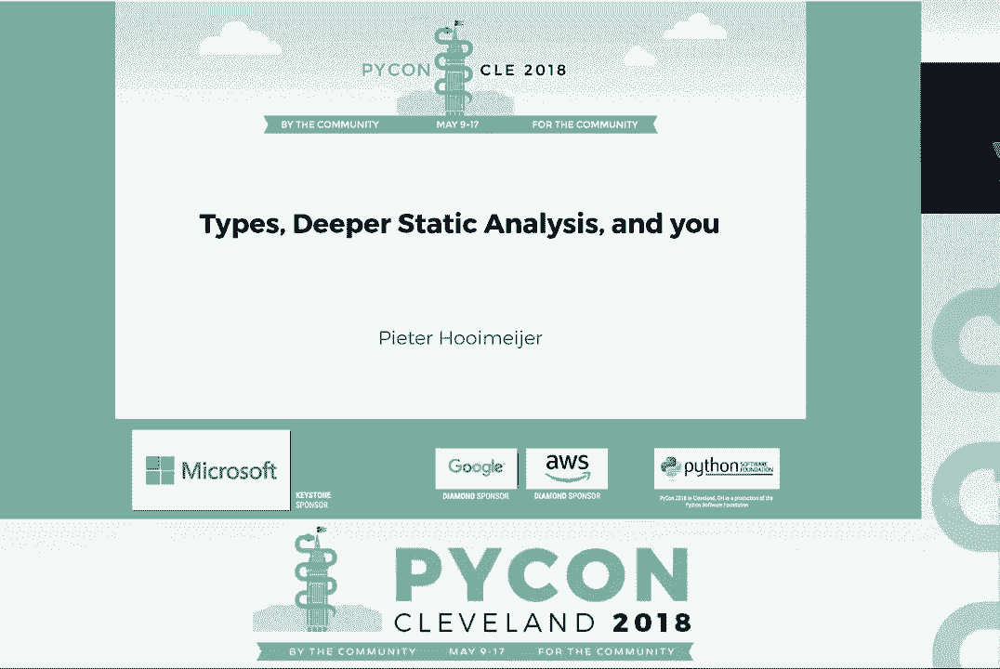

 >> [inaudible]， >> Got it。 All right。 How's my audio now？ Not just the front row。 Yeah。 All right。

 So my slides are going to be a little stretched， but mostly followable。 So that's a plus。

 Title of the talk is types， deeper static analysis and you。

 So before I go into what that means a little about me。

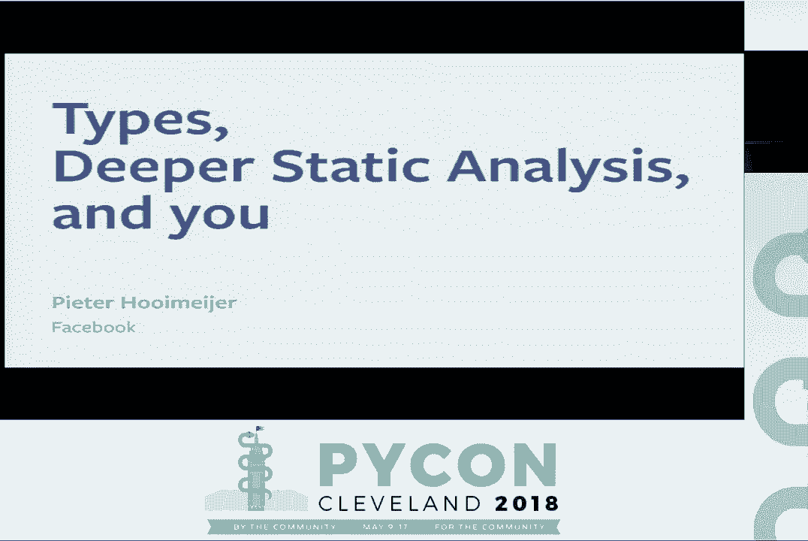

 I'm Peter at FB。com in case you need to contact me after Peter， with an extra I。

 And I work in the product security team at Facebook。 This is basically Facebook's app sec team。

 So we care about the security of all of our different code bases， including Facebook itself。

 obviously， but also Instagram， messenger， Oculus and so on。

 I've been at Facebook for about six years。 There's a couple of things that I've worked on that are relevant。

 So in 2012， I worked on the hack type checker for PHP。

 So we had a lot of PHP at that time and we managed to add。

 types to that code base and build a performing type checker， for that code base back in the day。

 More recently， I've been involved with the Pyre check project。

 Pyre is a performance type checker for Python， that we open sourced about two days ago。

 And the sort of hack and pyre reference are relevant here。

 because this talk will be about some of the cool things。

 you can build on top of a type checker like that。

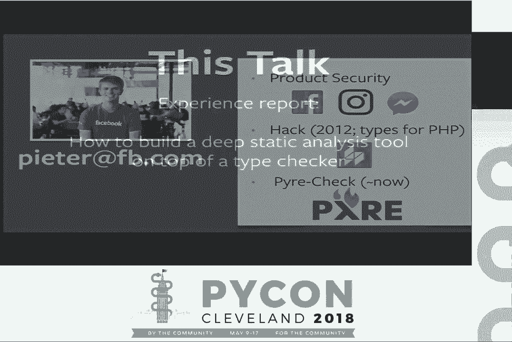

 So this talk will basically be an experience report explaining。

 some of the stuff that we've built internally at Facebook。

 and Instagram and how you might benefit from this as well。

 And I'll explain later what I mean by stuff like deep static。

 analysis tool or deeper in the talk title。

 So talk outline。 High level， it's this context that you need to know in order。

 to get to the exciting part， which is two。 And then three。

 I'll talk a little bit about our deployment， of this stuff at Facebook and Instagram。

 like why you should believe me。 What are your actual results type stuff？

 So my context bit starts with an example。 And this is an example of a piece of code that。

 exhibits a security problem。 It's like an actual thing that happened。

 You have very likely used a product that， had a security problem like this。

 And I've kind of whinowed it down to a couple of lines， of Django-esque Python。

 So if you literally add HTTP to request and response here， didn't fit on the slide。

 that would probably， make this a valid endpoint within a Django web app。

 So imagine this code is related to Facebook groups or a forum， where there's groups of users。

 and they can sort of create， their own little cordon off area that other users。

 don't have access to。 That's basically what this code will belong to。 So step one。

 it gets the group ID from a get， parameter in the request。 Step two， it needs to double check。

 that the currently logged in user has access to this group。

 So it will load some data pertaining to the group， using the authenticated user。

 And the assumption is that somewhere inside of load， there will be a privacy check。

 Can this user see this group？ And then if everything goes well， we render， let's say。

 maybe this is the thumbnail image belonging to this group， or something like that。 So so far。

 there's not a whole lot to argue with， in terms of this code， except for the error handling。

 So if the data is none， we throw a 404， with an indicative error message of sadness in this case。

 And this is problematic because the data is user controlled。

 The user can provide arbitrary group IDs， and sort of check whether a currently logged in user。

 on Facebook。com， for example， might be in a particular group。

 So the user controls this branch prevent the C's， exclamation point。

 So this is an example of vulnerability that， occurred for realties in real products。

 The way you would exploit this is by having your own evil。com， and putting an image tag on it that。

 hits this endpoint with a particular group ID， and then has an onload and an on error event handler。

 This is how you distinguish between the current user。

 visiting your site has access to this group or not。

 And this is an interesting sort of privacy oracle。

 that is externally accessible and kind of leaks information。 So I've included a URI here。

 If you hit me up later， I can send it to you， that has sort of the full description of how。

 this type of problem affected real products。

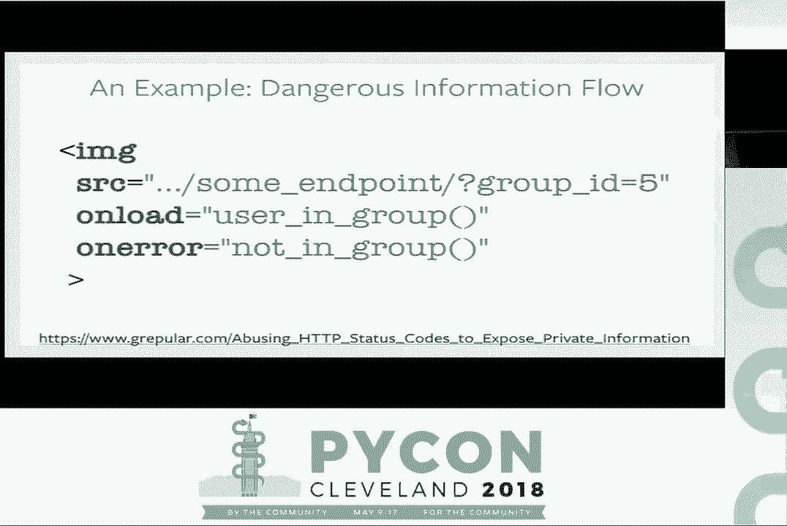

 a couple of years ago。 So now the idea is， wouldn't it be great。

 if we could detect this sort of problem statically？ Like we know this is an issue now。

 Can we find all occurrences in our code base？ And that's basically the underlying premise of this talk。

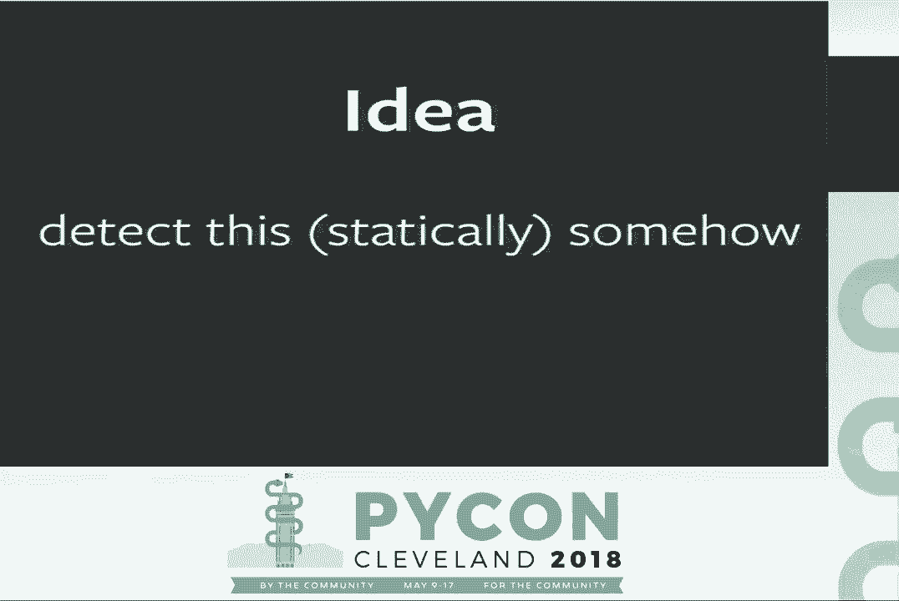

 So I haven't defined yet what I mean by static analysis。

 And this basically means many different things， two different people。

 And I want to be fairly precise。 I don't want you to take away that there's。

 this super formal thing that won't work， or that this is static analysis in terms of something。

 that isn't relevant to your interest。

 So let's be precise。 I'm going to show you a spectrum of static analysis tools。 On the left。

 I'm going to put fast， easy to use， and simple tools。

 And then you can kind of guess where this is going。 On the right， let's put slow， hard to use。

 and complex stuff。 All right， so I'm going to start on the right， because that is the fun part。

 Let's talk about formal verification。 Formal verification is a type of static analysis。

 where the imports are basically your code， but also a full formal description of the property that。

 needs to be proven and so on。 And then you write a very long proof script。

 and then you have verified that your code completely。

 matches the specification or something along those lines。 And it requires a PhD or two to use。

 You'll need grad students as well。 That's sort of your process here。 In the black box。

 barely readable， I've included an excerpt of an actual proof that I've written。

 The relevant bit of that is that I， wrote about 1，300 lines of proof script。

 to verify five lines of code。 This is not super practical in its current form。

 So let's go to the other side of the spectrum。 I've put grep。

 I think grep is a static analysis tool， in the sense that it looks at your code。

 It's actually language agnostic， too。 It only looks at the bytes of your code。

 So you can grep for something like dangerous in your code， and find all occurrences of it。

 It's not very precise， but it's very usable。 If you're a security engineer。

 you could use this all the time， and it would get you at least a start for where。

 to start looking if you're interested in where a particular。

 function is called or something like that。 And you might build frameworks that actually。

 have the word dangerous in them， like dangerously， set in our HTML or something along those lines。

 So this is not totally not useful， but it's not great for finding flows of information。

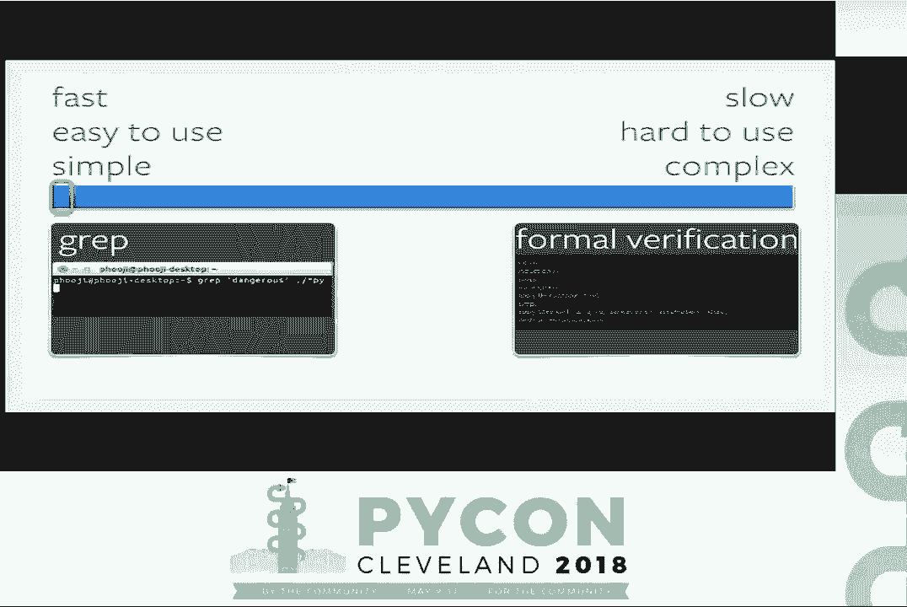

 in code as in the example。 So let's go a little bit more in the middle of this spectrum。

 There's a bunch of linters。 So you could use pylint and flake8。

 and they're typically much better abstractions than grep。

 for writing checks that you might care about。 They give you typically point checks。

 based on an abstract syntax tree or something， along those lines。

 They let you write relatively low noise checks， for relatively straightforward properties。

 Still not quite good enough， though， to find flows of information。 So moving right along。

 what about types？ So types are a little bit more work。

 You have to annotate your code somewhat consistently， to get a benefit from it。

 You can run my py or py or and they will give you type errors。

 Still not quite good enough to find flows of information， though。

 So the premise of the next section of the talk， is that we can build security focused data flow analysis tools。

 that find this kind of flow of information， that we care about by leveraging only the existing types。

 So I don't want the full formal verification thing where。

 I need a giant proof script just to help the analyzer。 I just want to take advantage of the fact。

 that we already have a code base with types in it。

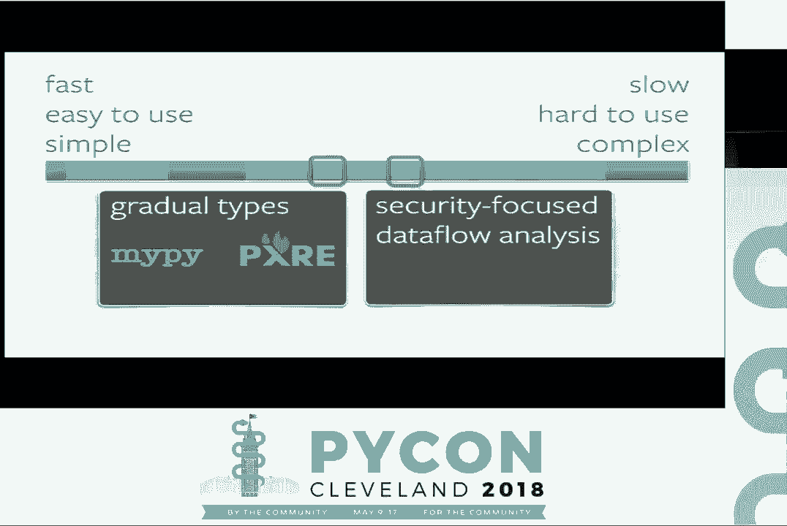

 and build on top of that。 So in order to explain that， I need。

 to go into some of the details behind how， our type checkers work。

 So hack and py are very similar in this regard。 So I wanted to explain it at a somewhat high level focusing。

 on their architecture。 So let's type check some code。 I have two functions， foo and bar。

 They both have a parameter。 They both have a return type。 You can read it as I talk。

 What needs to happen for the type checker， to verify that there is a problem in this code？

 So start by analyzing the expression bar of x。 So in order to verify this， I need。

 to make sure that the type of x matches the parameter for bar。 So I need to look up the type of x。

 which， is defined in the signature for foo。 And I need to look up the type of the first parameter of bar。

 and make sure that they match。 So this is kind of like a consistency check。

 And that's sort of the nature of type checkers in general。 Next。

 I need to check the full return type， make sure that returning the result of bar of x。

 matches the return type of bar。 In this particular case， that's where the type area is。

 Bar returns an int， foo is supposed， to return a string without some type of cast or conversion。

 This is not good code。 And then there's a bunch of other stuff that I need to do。

 So if I wanted to check bar itself， I would need to compare its return type to its signature。

 and so on。 There's an interesting observation here， which is that to check the body of bar。

 I don't need access to any of the information that I used， to check the body of foo。

 except for the signature of foo。 So I can actually type check a lot。

 of these different functions in parallel fairly easily。 They don't depend on each other at all。

 The high level steps in the type checker， are something like parse every function。

 resolve the method call。 So I need to know which bar is getting called。

 so that I can look up its signature， and then do these consistency checks。

 And the observation here is that you， can do a lot of these steps in parallel。

 Not all of them depend on each other。 So the parallelization in both of these type checkers。

 works something like fire up some number of processes N。

 or something like that and distribute the work。 So in other words。

 if there's 100 files to type check， and I have 20 processes to do it。

 they each get five files to type check， or parse at least initially。

 One particular insight behind the hack type checker， back in the day was that we can share work。

 between these processes relatively easily。 So if I need the signature for some function。

 there's one of two things to do。 One is get it from the cache。 If it's not there。

 just parse that function， and put it in the cache for later use。 The dot dot dot here leads to--。

 but don't coordinate too much。 Sorry。 In other words， we actually will redo a bunch of work。

 if there are two functions that need to be--， if there's a function that needs to be parsed。

 by two different processes， we might end up doing that。 Because it's more expensive to coordinate。

 between the processes than it is to occasionally duplicate work。

 So those are kind of the pros and cons here。 This is a very high level overview。 I apologize。

 I wish I had more time to go into tons and tons of detail。

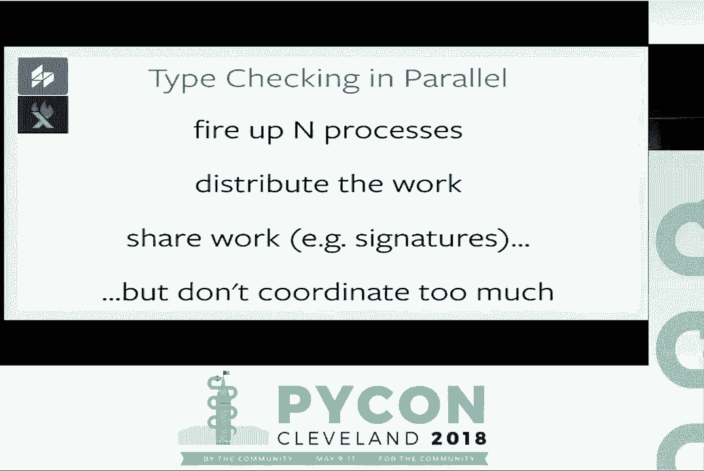

 about how this works。 But we need to move on to building an actual analyzer。

 on top of this。 So let's get back to the example。

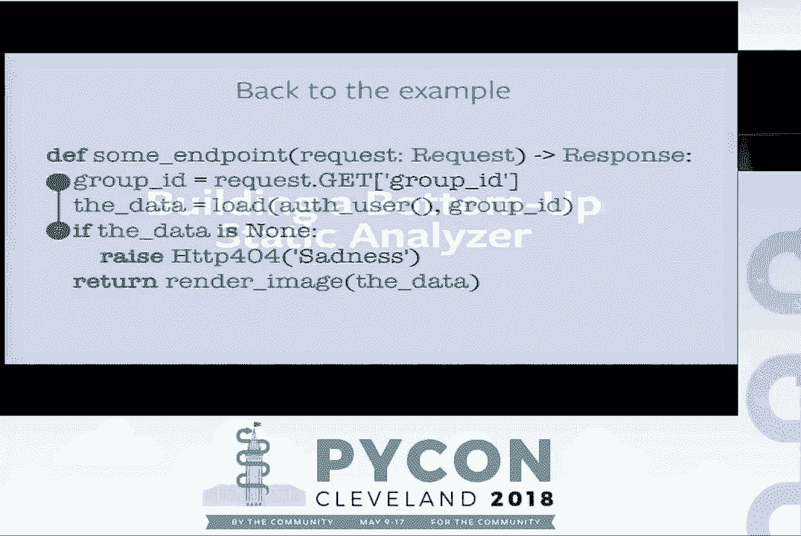

 So I sort of use this red thing on the very left， to highlight the path that I care about。

 But I haven't really formally explained， what is the property that I care about here。

 So let's do that。 So basically， I want branches that throw HTTP 404。

 that are based on a privacy decision， because that's what makes this a leak。

 That in turn are based on something， that is user controlled input， because that's。

 what makes this an exploitable privacy leak。 So typically， in a sort of static analysis parlance。

 we call this chain tracking。 It's like a variable becomes tainted。

 and then stays that way unless you sanitize it， or something like that。

 And in the context of this particular example， the branches that throw would be the sink。

 the place where information goes that we don't want。

 And the user controlled input would be the source， some terminology。

 So to build an analyzer like this， there's basically three steps where I've。

 code all the way on the left。 That's the code we're analyzing。

 I have shown you very roughly what a parallel type checker looks， like。

 and now there's two additional things。 There's the actual taint analysis， the taint tracking。

 step all the way on the right。 And then before that， there's building a call graph。

 And I'm going to show you how we do the call graph stuff。

 before explaining why you actually need one。 And then there's an aside。

 which is that it would be great， if we could make both the call graph construction。

 and the static analysis itself parallelizable as well。

 Because that would make this actually feasible from A。

 Does it run quickly enough to get you results before the code， is already shipped point of view？

 So let's focus on the call graph stuff。 So it's sort of traditional when you talk about call graphs。

 to draw lots of dots on the slide and then lots of arrows。

 I don't know if you've ever tried visualizing， a large code base this way。

 It gets real messy really quickly。 So I've just sort of left it at this。

 This is my best effort call graph。 I'll give you a formal definition， though。

 It's an over-approximation of all function calls， that can happen in the code base。

 So what do I mean by over-approximation？ Essentially。

 it is not feasible to statically say exactly which， calls will and will not happen。

 especially with class hierarchies， and dynamic dispatch。 So in practice。

 we want to create an edge between two， functions in the call graph if we think there might be a call。

 even though in practice it might never happen at runtime。 Let me give you an example。

 Suppose I have three classes， A， B， and C。 A， defines a method。 It's called get data。

 It returns data。 And it's abstract。 B and C have sort of glossed over the details。

 but let's assume they also implement get data。 And then I have a function foo， which。

 takes a B as input and calls get data on it， and passing the result to bar。

 So what does a call graph look like for this bit of code？ Looks like this。

 So I'm not going to like fancily step you， through the animation or anything。

 but definitely foo calls bar。 We can see that。 It might call B。getData if X is an instance of B。

 But because C is a subtype of B， it could also be C。getData， if we pass X as a C。

 So that's roughly what a call graph looks， like at a super high level very quickly。

 We need this to make the analysis both precise and also， to make it fast。 So onto that。

 So what is taint analysis？ This is the other term in addition。

 to call graph that I've sort of used before actually defining it。

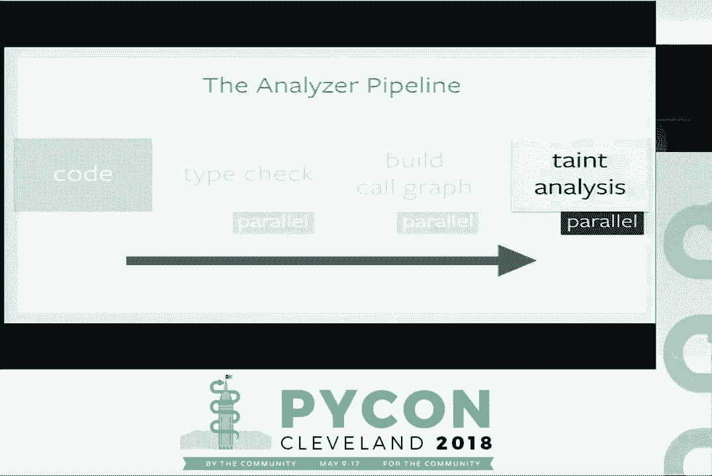

 The key insight is that instead of parsing signatures， which。

 is what a type checker does or analyzing them， we want to compute function summaries。

 And one way to look at a summary is， as like a very elaborate fancy type that。

 is different from the type that you've annotated in your code， and has a lot more detail。

 And for this particular problem specifically， it contains two things。

 One is how data flows from sources to out of the callable。 Two is how data flows from the arguments。

 into any dangerous things。 This is the information that we want for every single function。

 in the codebase。 And then we can stitch together paths of data that。

 look risky or dangerous and show them to security engineers。

 So I've yet another example， another foo。 I have PUC as the input here that stands for potentially user。

 controlled。 It calls sync on that and it returns a value from source。

 So it's sort of the shortest possible example that， has two of the interesting properties。

 let's say。 So let's compare its signature to its summary。 The signature is right there in the code。

 Takes a parameter string， returns a string。 Let's talk about the summary though。

 It will basically consist of two parts， which I've called the in summary and the out summary。

 in this case。 The in summary says that the first argument flows into sync。

 The out summary says that source gets returned， from this function， potentially in some cases。

 if there's multiple returns。 We have to simplify。 So this is what this looks like for a single function。

 And now you might ask， how does that actually， translate to useful results？

 So I'm going to put up an assertion， which is that this works for any depth call stack。

 You can stitch together the summaries， from different functions that call each other。

 using the call graph。 And figure out longer flows of information。 So I'll give you a brief example。

 In this case， foo， bar， and buzz， each call each other， in turn。

 The original user controlled string， flows from the top function into the bottom one。

 and eventually into a sync。 So this is what we want to catch across function calls。

 So I'm going to give you only the in summary parts， for brevity。

 And I'm going to start with buzz at the bottom。 So the first argument flows into sync。

 That is the full summary or the in summary for buzz。

 The summary for bar is basically a forward reference， to the summary for buzz。

 So I say the first argument flows into whatever， is the in summary for buzz and its first argument。

 And I can repeat that trick。 So the first argument for foo is the in summary for bar。

 at the first argument。 So if I analyze these functions in the right order， though。

 I can establish that there's a dangerous flow of information。

 all the way from foo into bar into buzz， into a dangerous sync， something along those lines。

 There's a couple of design consequences here。 One is that the order in which you analyze functions。

 matters and that we need basically a somewhat， sophisticated scheduler to decide when these functions get。

 analyzed in turn。 You can analyze them theoretically in an arbitrary order。

 And your analyzer would take the lifetime， of the universe to finish。

 If you find the right order using a scheduler， it can finish in 2B pronounced later。

 So that is roughly what an analyzer pipeline looks like。

 Each of the stages within themselves are highly parallel。

 And the output of one stage sort of flows into the next。 You need a call graph specifically。

 because it informs the scheduler in terms， of how it runs the taint analysis。

 So looking back on our frame of reference here。

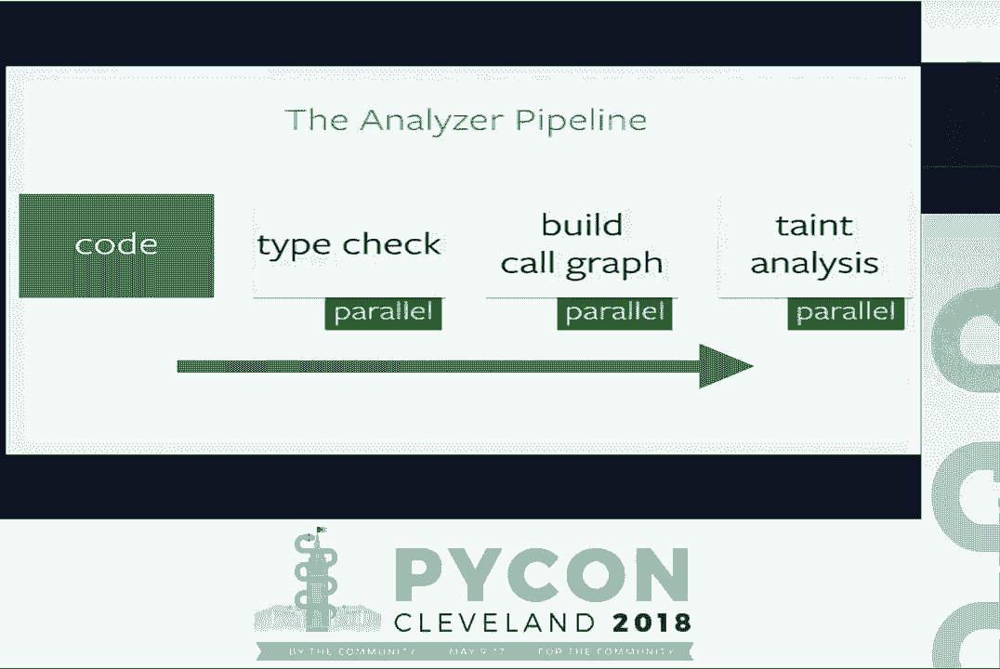

 basically what we've done here is we've， taken gradual type annotations and we benefit from type checking。

 by itself。 But we can also find deeper stack analysis properties。

 And I guess one thing I forgot to mention， is this is called bottom up stack analysis。

 because you analyze sort of one function at a time。

 and stitch together results as you look at sort of fake call， stacks。

 So this doesn't require any new annotations。 It just requires a security engineer。

 to tell you which sources and things you're interested in。 All right。

 so I will now talk a little bit about our results。

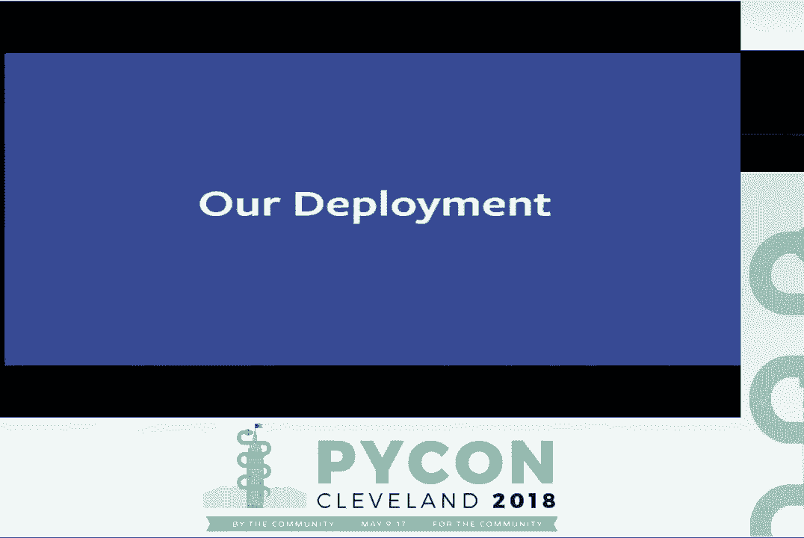

 and sort of why you should believe me in any way。 So Instagram has a million or so lines of Python。

 we'll call it millions。 And we use PyR for type checking as of a couple of weeks ago。

 PyR takes about a minute to start up a little bit less。

 and it produces up 200 milliseconds incremental updates。 So if you change some code。

 save it in your editor， you'll get quick type error results。

 The taint analysis stuff of this is TBD Smiley face。 That's what we're hoping to work on next。

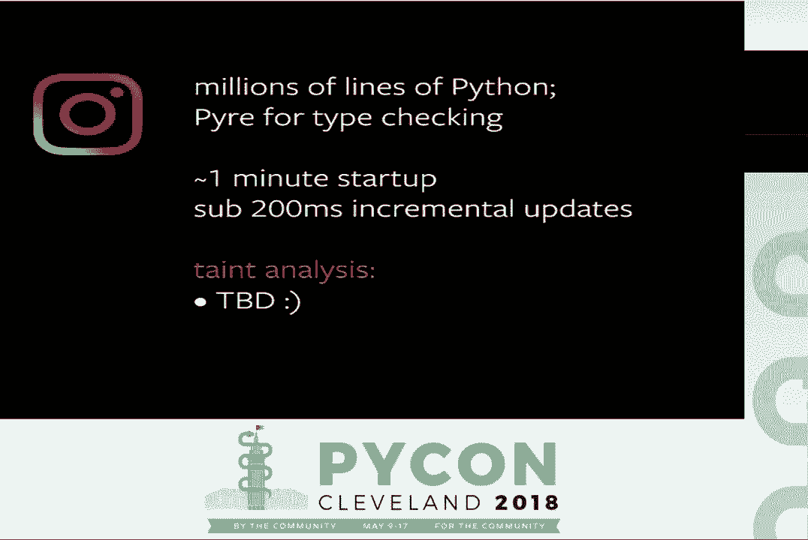

 However， we have built this on top of hack for PHP。

 Hack type checks tens of millions of lines of code。 It's a little bit bigger。

 And we have built internal tools for security analysis。

 So this is used every day by our security engineers。

 not because we make them but because they want to。 And runs on every code change。

 So I've used the terminology diff here， which is Facebook speak for every update。

 to every requested change， even prior to commit。 And it takes about 20 minutes wall time。

 Checks a ton of properties， takes about 20 minutes end to end。 That's without caching enabled。

 which is fairly spectacular。 And it finds and prevents issues regularly。

 So I can't go into a great amount of detail here， but I would sort of point to the fact。

 that our security engineers prefer， to use this over grep in order to find security issues。

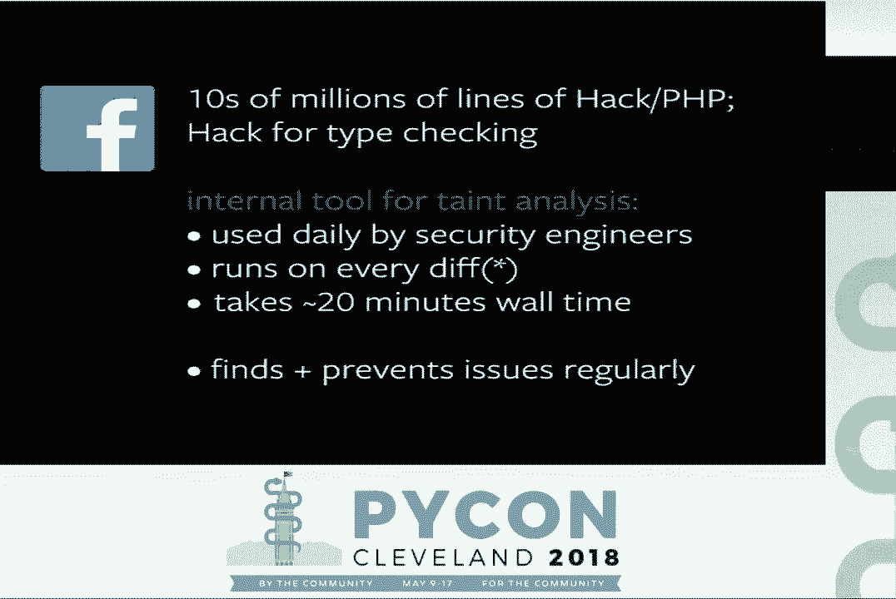

 So in conclusion， in my talk abstract， if you've seen it。

 I mentioned how to take a type checker， bolt on an inter-procedural static analyzer。

 and delight your security team with high quality results。 I feel like I've covered most of this。

 The TLDR is we've built some of this for hack and PHP。 We're hoping to build it for Python as well。

 And we're very excited to do some of that in the open。

 in the form of the Pyre type checker and sort of its extensions。

 If you would like to talk super shop with people。

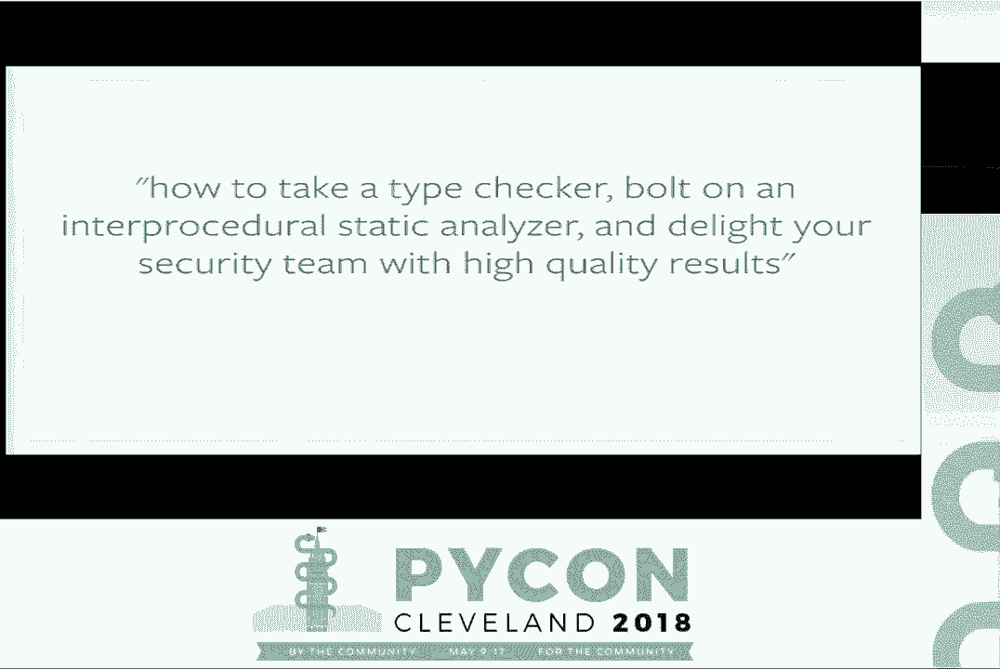

 in terms of technical detail， this is the Pyre team。 And they're all here。 So Dominic， Marco。

 Shannon， and Sonon， actually did the technical work to make some of this possible。

 I'm just here to sort of talk about it。 And you can find us on GitHub as well。 And that's my talk。

 and I have a few minutes for questions。 [APPLAUSE]， Hey， everyone。

 We have five minutes for questions， so bring them on。 We have a mic up front。

 Do you find that because it has to expand， the possible call stack to be the most conservative possible。

 large set that it sometimes detects flow problems that。

 don't ever actually occur because the functions， aren't ever really called in that order？ Yeah。

 so the precision of the call graph， is critically important to make the results precise as well。

 And that affects performance as well。 So if your call graph is--。

 all functions can call all functions， which， is technically befitting of the definition。

 then your analysis would be both very imprecise and also， very slow。

 So we put a lot of work into the details， for making sure that the call graph is very accurate。

 Thank you。 So I was wondering how you deal with functions。

 that will modify some sort of shared state， because in Python， you might say。

 save something that you should it as an instance attribute。 Yeah， makes sense。

 So this is where the talk is a lie。 There's more to it than just the in summaries and out summaries。

 And we use an abstraction called access paths， to define the sort of out of a function。

 in addition to its return， which can， be sets this instance variable on the current object。

 or any sort of number of dereferences away， to a particular value and whether that is tainted or not。

 That's actually surprisingly challenging。 There are other static analysis projects。

 that Facebook has built that focus specifically， on the separate problem of what does the heap look like。

 in the form of infer and shape analysis。 So this is something that we need less for the security。

 specific problems that we're interested in here。 So we've sort of iterated on this。

 and come up with the level of fanciness that， helps us without being so expensive that it becomes。

 infeasible。 Thank you。 Thank you。 Hey there。 I was wondering。

 do you have any references or material， about the scheduler？

 Because I actually experienced that problem you mentioned。 Yeah。 So the short answer is no。

 unfortunately， we haven't published that SAC and Als is work yet。 However。

 I can say that that has taken a bunch of engineers， a bunch of work in order to get right。

 especially， for our Facebook code base。 In terms of figuring out， hey， there's。

 these large cycles of methods and you kind of， need to analyze all of them concurrently。

 So one unit of work is much larger than other units of work。

 So we preemptively schedule those first。 So there's actually some hard coding。

 that we get away with because it's an analyzer that's， designed for a single code base。 [INAUDIBLE]。

 Hello。 Thank you for this inspiring talk。 I was wondering， are there any similarities。

 between taint analysis and profiling？ And is there an overlap？

 And is there a way to get profiling for free when， doing taint analysis or vice versa？ Yeah。

 that's a good question。 So there have been projects in the past， including at Facebook。

 if I remember correctly， where， we do the equivalent of this， but at runtime。

 So we somehow stick an extra bit of information onto a variable， that has an object type。

 Like we rewrite the code so that it has an extra field to just， so that we can say it's tainted。

 And then we look at that at runtime。 This is super challenging in practice。

 It's kind of scary to rewrite your production code and then。

 sort of trust the rewritten version that no one has seen。

 visually or code reviewed to work correctly。 But we have done that in the past for catching performance。

 problems as well as security problems。 But it has sort of a different set of challenges。 Thank you。

 Thanks。 All right。 Thanks for coming in。 And a big round of applause for you。 Thank you。 [APPLAUSE]。

 Thanks。 And thank you for opening this empire。

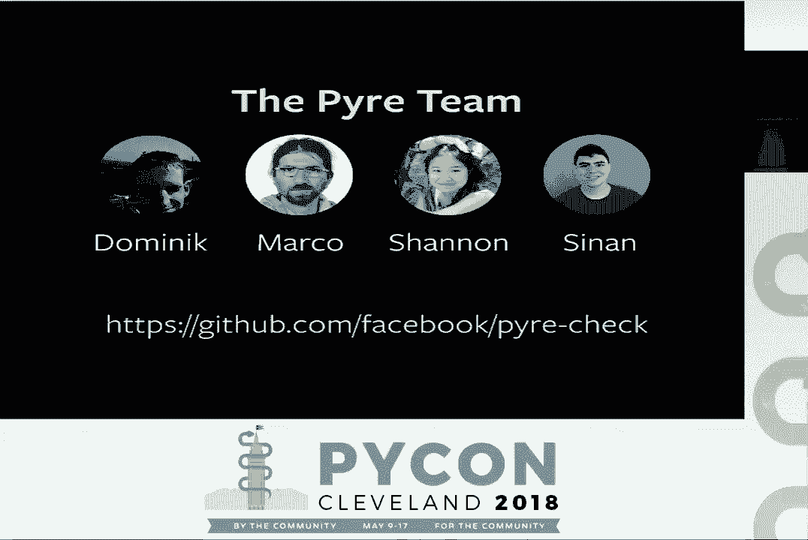

 (clapping)。