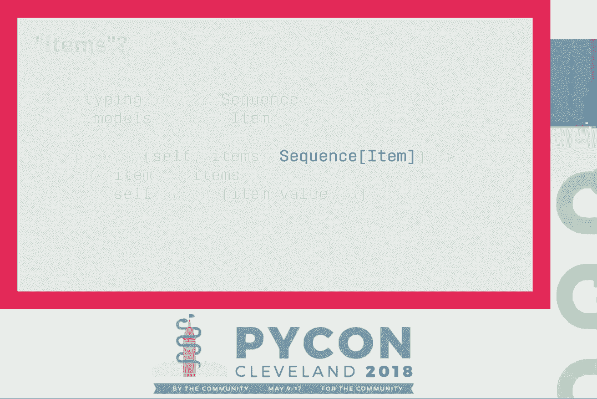
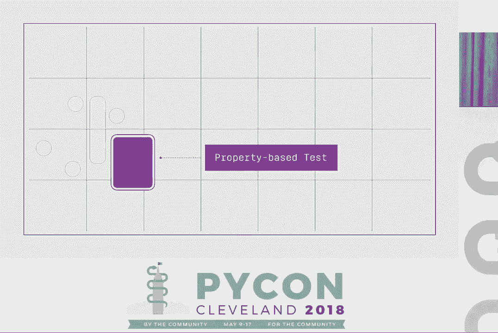
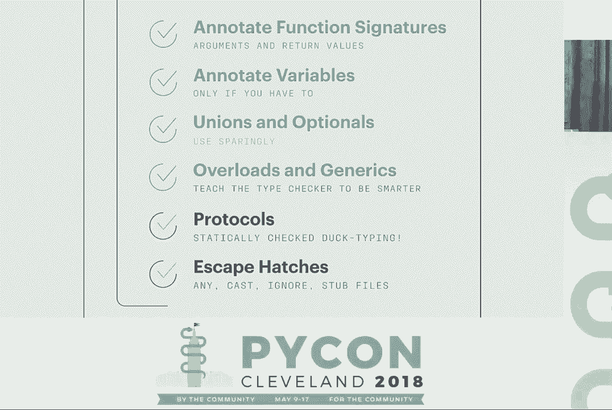
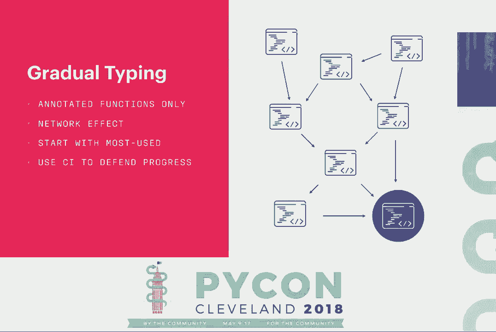
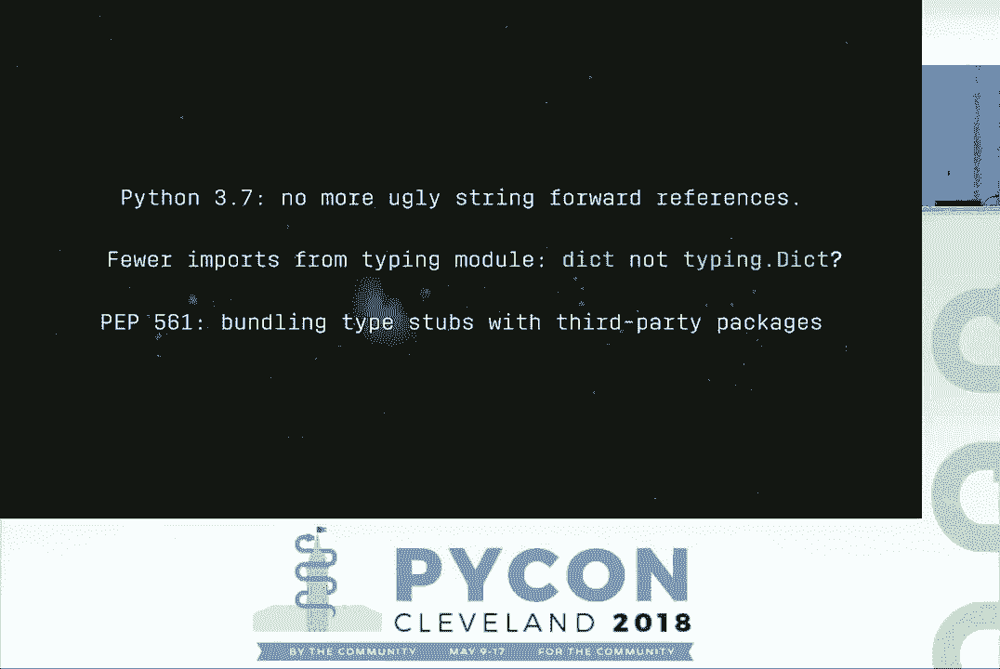
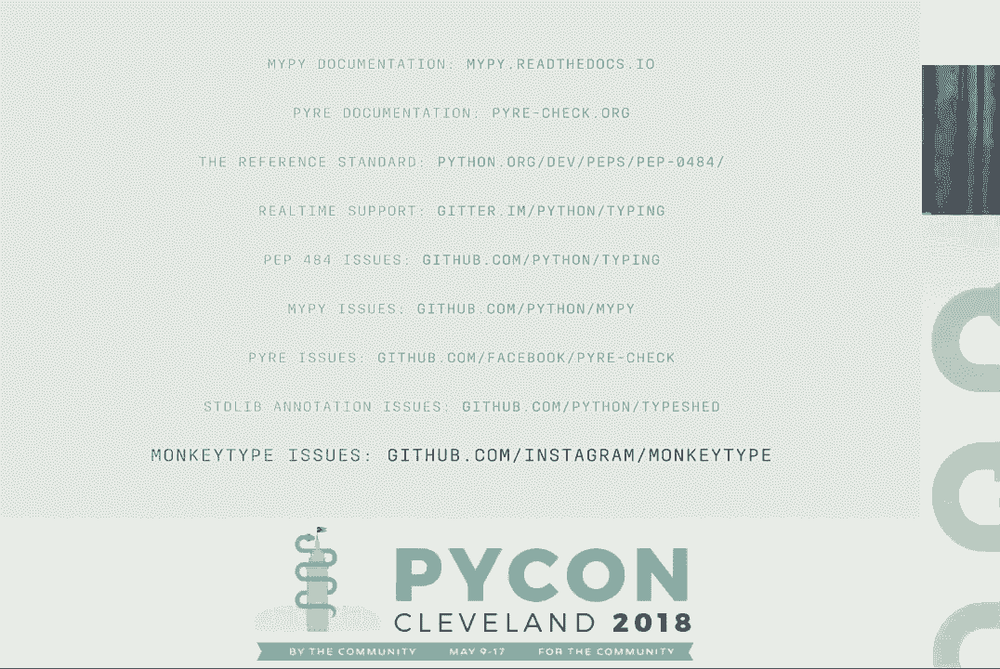

# P12：Carl Meyer - Type-checked Python in the real world - PyCon 2018 - 哒哒哒儿尔 - BV1Ms411H7Hn

 \>\> Hey， folks。 Let's all give a round of applause for Carl Meyer， who is here to talk to us about。

 type check Python in the real world。 [ Applause ]， \>\> Thank you， Rami。 Welcome to the final session of talks at PyCon 2018。 I hope that。

 after three days of PyCon and three nights of enjoying the best of Cleveland， you're all。 awake enough to process some Python code on slides because we're going to see a lot of。

 it in the next half hour。 I'm Carl Meyer。 I work in Instagram server core infrastructure。 And I'm here to talk about type check Python。 So if you've seen me around the internet。

 I probably look like this。 This is me and my sister prototyping some eyewear designs of。 our own creation that never took off。 I'm Carl J。M。 pretty much everywhere on the internet。

 I've been writing Python code now since the -- well， since before the turn of the millennium。 which I'm fairly sure makes me officially old。 For the last couple years I've been working。

 at Instagram， most recently on adding type checking， type annotations to our server。

 code base。 So rough plan for the next half hour。 We'll talk a little bit about why you。 might want to type your Python code。 We'll go into how you would go about it， a sort of。

 a brief tour of Python's type system。 And lastly， we'll talk about gradual typing， what it。 means and why it matters。 So why type your Python code？ If some of you in here are coming。

 from a static typing background， you might have the opposite question， like how is Python。 even usable without static typing。 But since we're at Python， we'll take the question from。

 the opposite side。 I've been using Python for years。 It's fine。 Why do I care？ Why do。

 I need type annotations？ So in this method， process method on some class。 it takes an items argument。 What is items？ In Python， we have this idea of duck typing。

 If it walks like a duck and quacks like a duck， it may as well be a duck。 So we can give。 a duck typing answer to our question。 What is items？ Items is some collection that we can。

 iterate over。 Each item in the collection should have a value attribute， which itself。 should have an idea attribute。 That's great。 That's a very flexible answer to the question。

 It could allow us to reuse this process method in various contexts， pass different kinds of。 collections， maybe even containing different kinds of objects， as long as they all conform。

 to this contract。 With a type， the problem with this， though， is code is written once。 but maintained for a long time。 So what if I come back to this code in six months？ And。

 I've forgotten everything I knew when I wrote it。 The contract that we just described， I。 have to reestablish by reading through every line of code in the function line by line。

 It's entirely implicit。 Or what if -- how do I know that I'm conforming to this contract。 everywhere in my code base？ Maybe somewhere in some dark corner， I'm passing in some object。

 where its value attribute could， in some cases， be none。 And then I'm going to get an attribute。 error。 How would I catch that？ Or maybe I need to add some new functionality to this， function。

 I have a new requirement。 I want to access a new attribute on my items。 How。 do I know that everywhere that I'm currently passing an object to this function？ But they。

 have this new attribute。 If I have a large code base， in some cases， answering that question。 satisfactorily could require digging through layers and layers of code。 Not only the call。

 sites of this method， but perhaps their call sites and their call sites until I track down。 the origin of the collection that ultimately is getting passed to this method。 With a type。

 annotation， all of that goes away。 Now I know exactly what I can expect to receive。 A sequence。 of this particular item class， I can go directly to the class， I know where it is， I can see。

 what attributes and methods it has。 This is nothing new， of course。 People have been putting。 the same information into docstrings for years or into comments。 There's multiple standards， even。

 E-PIDOC and others for how you can represent argument and return types in your docstrings。 and Python。 So it's clearly useful information for maintainers。 The problem with a docstring。

 annotation is that at some point it's guaranteed that someone will update the signature of。 the function and forget to update the docstring， at which point it's obsolete and arguably worse。

 than useless。 Whereas this type annotation can automatically be checked for correctness， so。

 it has to remain up to date with the code。 So I can almost hear someone in the room thinking。 that's great， but I don't need it。 I could catch those things with a test。 Which is great。

 I love tests。 I've written a lot of tests。 I've given Python talks on writing tests in Python。 There's this trope of the dynamic language programmer claiming they don't need static types because。

 they write tests or the static typing programmer claiming they don't need to write tests because。 the compiler catches all of their bugs。 Both are right and both are of course wrong。 If we。

 imagine a two argument function and this plot is the space of all possible inputs to the， function。 So one argument on the x-axis， one on the y-axis， we have the space of all possible， arguments。

 If we write a test case， it's a single example。 We give two argument values， one for each argument。 We assert the correct return value。 We've covered exactly one point， in this plot。

 Typically we write test cases for a variety of points on this plot that we。 think or hope or maybe even know are representative of the space of possible inputs that we think。

 we care about。 Maybe if we're especially clever， we can write a parameterized test case， cover。 a whole range of inputs with a single test， maybe even a quick check style or property-based， test。

 cover an even wider array of possible inputs。 With type annotations， we can add。 just a few characters to our function definition and instantly eliminate entire swathes of this。

 area to cover。 I annotate that my function takes two integers and all of this area out。 here for all the possible strings and lists and dictionaries is eliminated。 I can focus。

 all my testing effort on ensuring correctness with high granularity in this area where it。 really matters。 We're even the best type system， can't fully ensure correctness。 So， let's say。

 I've convinced you and you want to start checking your Python。 How do you make it happen？ Let's。

 take a little tour of what typing looks like in Python。 So we have a simple function， a。 square function。 It takes an integer， returns an integer， the square of the argument。 We've。

 seen the syntax for this in previous slides。 After each argument， we can have a colon and。 then the type。 After the argument list， we can have an arrow and then the return type。

 So let's call the function a few times。 We'll take the square of three。 We'll take the square。 of a string。 Just for kicks， we'll take the square of four and then add it to a string。

 Now let's try type checking this code。 We'll pip install myPy。 MyPy is an open source Python。 type checker written and maintained by a team at Dropbox。 It's the by far today the most。

 commonly used Python type checker。 So we'll use it in our examples for this talk。 So let's。 run myPy on our file and we get a couple of type errors。 Let's dig into them a little， bit。

 We get one type error because we tried to pass in a string where an integer is expected。 and another type error because we tried to add an integer， the annotated return type of。

 the square function to a string which is a type error in Python。 And we got both of those。 errors without having to set up any kind of test harness or write any kind of test case。

 that would exercise this code just by running a static analyzer over the code。 So the type。 checker asks us to annotate our function signatures in order to validate our assumptions about input。

 and output types。 In between， there's a lot it can infer。 For instance， in this class。 it knows that we've told it that the type of the width and height arguments to the initializer。

 are both integers。 It can infer through the assignments to self and understand that every。 photo instance will have a width and height attribute that are integers。 And if we're in。

 another method， we try to return self dot width and self dot height and claim that there are。 a couple of strings。 The type checker can catch that and tell us no， that's a couple of integers。

 We can also infer the types of containers。 If we create a list of photo objects， try to。 append a string to it， the type checker will tell us， hey， maybe that's not what you intended。

 to do。 This is of course the type checker being a little bit opinionated。 In Python， it's。 perfectly legal to have a heterogenous list。 But the type checker assumes that if we initialised。

 it with a homogenous set of objects， that probably that's what we intended。 And it was。 probably a mistake to add a different type。 We can use an explicit type annotation if we。

 want to give a broader type to the list。 In some cases， type inference won't be enough。 to understand the type of every variable。 For instance， if we create an empty container。

 the type checker doesn't know what we intend to put into it， so it asks us to be explicit。 We can add a type annotation for the variable like this and say this is intended to be a。

 list of strings， then the type checker is happy。 This particular syntax with a colon after the。 variable name， then the type annotation before the equals sign is new in Python 3。6。 If you're。

 on an older version， there's an alternative comment based syntax you can use。 I won't go。 over it here， but it's in the documentation。 So that's pretty much the basics。 To review。

 what we've covered， mostly you want to annotate your function signatures， the arguments and。 the return values。 And occasionally you might have to annotate a variable， but usually you。

 only want to do this if the type checker asks you to。 Otherwise， you'll end up with a bunch。 of redundant variable annotations for things the type checker could have inferred correctly， anyway。

 So let's go a little deeper。 Sometimes we write functions that can take or return。 more than one type。 We can handle this， the simplest way to handle this is with a union， type。

 So for this function it can return a foo or a bar， so we annotate the return type。 as a union of foo and bar。 That means it could return either a foo or a bar。 A very common。

 case of this is a function that can return something or none。 It's so common in fact。 that there's a special form for that。 Optional foo means the same thing as union of foo and， none。

 This function could return a foo or it could return a none。 So here we have a function。 get foo that takes a foo ID which is an optional integer， either an integer or none and returns。

 an optional foo， either a foo or none。 So let's get a foo instance， my foo and let's， access its ID。 Oops， we have a type error。 Because we told the type checker that this。

 function could return none and we didn't check whether my foo was in fact a none。 So accessing。 the ID attribute could be an attribute error runtime， so we get an error from the type checker。

 This illustrates why you want to avoid using unions and optionals， particularly as return， types。 Because every time if your function returns a union or an optional， every caller。

 has to check what they got back before they can safely make use of the return value。 In。 this case though， that's a sad outcome。 If we look at the code for get foo， we can see。

 that if we give it a none， it will always return none。 If we give it an integer， it will。 always return a foo。 So we know that but the type checker doesn't。 So even though we call。

 it with an integer， the type checker thinks the return value might be none。 And this is。 going to cause us to have to add extra redundant checks into our code that are useless at runtime。

 just to satisfy the type checker。 There's a better option in this case。 Using the overload。 decorator from the typing module， we can give the type checker more information about the。

 invariance of our function。 For instance， we can say overload allows a kind of pattern。 matching similar to overloaded functions in other languages。 So you can say in this case。

 if foo ID is none， then the return value will always be none。 If foo ID is an integer， the。 return type will always be foo。 And then lastly， we give the actual definition of get foo。

 Now it's important to note that there's nothing， there's no kind of dynamic dispatch or anything。 happening here at runtime。 This is purely additional information for the type checker。 At runtime。

 the only thing that's used is the final definition of get foo。 That's why the other two don't need。 a body， they can just use pass。 They're just additional information for the type checker。

 to better understand the type invariance that are actually implemented by the function。 So with this definition， if we call get foo none， the type checker will understand that。

 the return value is none。 And if we call get foo with an integer， it will understand that。 the return value is a foo。 And so we won't have to check before we access its ID attribute。

 or whatever else。 Another way that we can make the type checker smarter about understanding。 our code is generic functions。 So to define a generic function， we can define a type variable。

 which is like a placeholder for a type。 So here we define a type variable called any string。 which is a placeholder for either string or bytes。 Type variables can be unbounded where。

 they can match any type or in this case this type variable is as a bound of string and， bytes。 So we can define a concatenate function that takes two any string and returns in any。

 string and then concatenates them and returns the result。 Now this is different from using。 a union of string and bytes because the type checker will ensure that the type variable。

 is binds to the same type throughout any call to the function。 So it will give us a type error。 if we try to call concatenate with a string and a byte which is good because adding a。

 string to a byte is a type error。 And of course because the type variable is bound， it will。 also give us a type error if we try to call concatenate with two objects that are neither。

 string nor bytes。 And perhaps most importantly， if we concatenate two strings together， the。 type checker will understand that the return value must be a string， not a string or a bytes。

 And similarly with bytes， we concatenate two bytes， we definitely get a bytes back。 In， fact。 this any string type variable is useful enough for defining functions that can handle。

 strings or bytes that it's built into the typing module。 We don't need to define it ourselves。 We can just import it。 So to review， again， we can use unions and optionals， but sparingly。

 And overloads and generics allow us to teach the type checker more about the invariance。 of our type signatures。 Compared to using unions or optionals， generics or overloads can make。

 your functions much more usable for callers without needing redundant checks。 So at this， point。 somebody might be wondering， what about my ducks？ I like duck typing。 In this， new type safe world。

 how do I write a function that can take any type at all as long as it。 has the right methods and attributes？ For instance， maybe I want to define a function。

 that can take an object and will call its render method。 Any object that defines a render method。 no matter its type。 This is actually similar to a number of built-in protocols in Python。

 For instance， the function， the len built-in， will call the dunder len method on any object。 or the next built-in will call dunder next， et cetera。 So how can I type this？ We could。

 try to use object since we know that every object， every type in Python is a subtype of， object。 But this won't work。 Object has no attribute render。 Or we could try to use the， any type。

 The any type is a sort of escape hatch the typing system provides。 The any。 type is compatible with anything。 In type system terms， it's both a top type and a bottom， type。

 It's a subtype and a supertype of everything。 Or you could think of it as it has every attribute。 and method。 Basically， it will never cause a type error。 This makes our function type， check okay。

 But it's a bit sad because now we can pass in something that doesn't have。 a render method which will throw an error at runtime but the type checker won't catch it。

 These are the kinds of bugs we want our type checker to catch for us。 So I mentioned that。 this pattern is similar to built-in protocols in Python and the type system solution for。

 it is also called protocol。 It's still technically experimental。 You have to pip install typing。 extensions and import it from typing extensions。 But in practice， it's very unlikely to change。

 and will soon be in the built-in typing module。 So if we import protocol， we can define renderable。 as a subclass of protocol and give it a render method。 We don't need to provide a body for。

 the method。 All we're giving here is an interface。 What matters is the attributes and their types。 and the methods and their type signatures。 So once we have this protocol defined， we can。

 say that our render method takes an object of type renderable。 And then if we have some。 random class which has no explicit relationship to renderable， simply because it has a render。

 method with the correct signature， the type checker will accept this call。 It will allow。 us to pass a foo object to a render method because it sees that it matches the protocol。

 If we try to pass some other object without a render method， we'll get a type error。 So。 this is exactly what we want。 And we found our duck。 You might hear this feature also referred。

 to as structural subtyping。 So with typical inheritance， we have nominal subtyping because。 if foo inherits bar， we've named our supertype bar。 So that's nominal subtyping。 With structural。

 subtyping， foo is a subtype of renderable because it matches the structure of renderable。 It has the same attributes and methods。 So that's structural subtyping。 So strict static。

 typing tends to be really good for like 90 to 95 percent of your code that's pretty。 straightforward。 It's not doing anything too dynamic。 If you're writing production code。

 or production application， you probably want most of your code to be like this because。 it's also going to be easier for your coworkers to read and maintain。 But there may still be。

 those few cases where you really do want to take advantage of Python's dynamic nature。 You really do want to metaclass or to generate a bunch of classes on the fly or whatever。

 other off the wall thing you might be doing。 Or like us at Instagram， you may have a lot。 of legacy code that was written long before type checking existed。 And you need to continue。

 supporting that code even if it's doing some things that don't quite fit into the static。 typing world。 So Python's type system feels that pain and provides some escape hatches。

 that you can use when you really just need to tell the type checker to go take a hike。 So the first one we already saw， it's the any type。 One sample case where you might use。

 the any type is some kind of get attribute wrapping proxy where you're wrapping some。 object and proxying every attribute access。 You have no idea what you might be proxying。

 or what attributes it might have or what their types are。 So maybe the best you can。 do is just say that your proxy returns any from it's get attribute。 It's not great because。

 it means you lose all the benefits of type checking on those wrapped objects。 But in。 some cases it may be the best option you have。 A second escape hatch is the cast function。

 It basically lets you lie to the type checker about the type of some expression。 So for。 example at Instagram we have a configuration system and we can get a configuration value。

 by key and basically they're JSON structs。 They're dictionaries or lists or whatever。 And we don't know what shape any given config var will have。 So the best that our get config。

 var function can do is be typed to return any because we don't know what shape of object。 it might return。 But in practice given a particular config key at some specific call site we probably。

 do know what the shape of that config key will be otherwise we wouldn't be able to make， use of it。 So we can use the cast function to tell the type checker look actually I know。

 this function says it returns any but in this case I know it returns a dictionary mapping。 strings to integers。 And the type checker will believe us。 So of course since you're lying。

 to the type checker you want to make sure that you're right because if you lie to the。 type checker and you're wrong well you can expect the type checker to lie right back。

 The third escape hatch is kind of the nuclear option。 Type ignore says ignore any type error。 on this line no matter what the cause。 We try to reserve this one for bugs in the type checker。

 or limitations of the type checker that we can't work around any other way。 So one example。 is my pike currently has a bug where it can't handle a property decorator stacked on top。

 of another decorator。 So we just stick a type ignore on the line where it throws an error。 add an explanatory comment linking to the bug and move on。 So if the cast function is a way。

 to lie to the type checker stub files or how you lie to the type checker at industrial， scale。 So at Instagram we use a lot of siphon and sea extensions for performance hotspots。

 And of course the type checker can't see into any of that code。 It can't read siphon， syntax。 It can't read c code of course。 So it has no idea what functions and classes。

 are in our siphon or c code and what signatures they might have。 So for example say we have。 a fast math module， compiled module with some fast math functions in it。 And if we put those。

 functions in there it's probably because we call them a lot。 And if we call them a lot。 we'd really like our calls to them to be type checked of course。 So we can solve this problem。

 by putting a p。y。i。 file next to the compiled module。 So p。y。i。 is python interface。 It's。 sort of like a c header file for python code。 It just provides the type signatures， the。

 interfaces of our functions and classes that are in the compiled module so that the type。 checker is aware of them。 So for instance our fast math。pyi if we had a square function。

 in our compiled module we could put this interface， this definition line in our p。y。i。 file。 And。 now the type checker understands that fast math module has a square function that takes。

 an integer and returns an integer。 Similarly we could put class interfaces in there。 Now。 it knows that we have a complex class with these two attributes of these types。 So now。

 the type checker will be able to check the correctness of our uses of those functions， and classes。 Okay so that's the end of our two or three Python's type system。 Last review， here。

 protocols are statically checked duct typing or structural typing。 And then we have。 a number of escape hatches that we can use if we need to escape from the restrictions。

 of the type checker。 We can use any cast， ignore， stub files。 So we've talked about why you might。

 want to type check and how you could go about type checking。 Lastly what do we mean by gradual。 typing and what does it matter？ We've actually already started talking about gradual typing。

 So gradual typing just means you can type check your program even though not all expressions。 in the program are fully typed。 So when we look at something like the any type， that's。

 already an example of gradual typing。 But we can go beyond that， gradual typing also allows。 us to incrementally add type checking to our code base as we're ready to deal with the consequences。

 So for instance here's our code base， a bunch of Python modules。 Arrows showing dependencies。 between the modules。 We introduce type checking and this is what we're going to see。 Errors。

 everywhere。 It's not because the code is bad， it's just the nature of introducing type checking。 to a code base that was never type checked before。 But this is a problem。 We can't deal， with this。

 We have too much code， too much to do。 We can't stop the world while we fix。

 thousands of type errors。 So gradual typing in Python is implemented with a simple rule。 Only functions with type annotations are checked。 A function that has no annotation is considered。

 to take any， return any and the body of it isn't even checked at all。 Nothing inside it。 the type checker won't even look at anything inside the body of a function without type annotations。

 So this rule allows us to introduce type annotations where we're ready to deal with the consequences。 step by step， function by function。 And of course there's a network effect as we add more and more。

 type annotations。 So we annotate one module and we will catch some type errors in internal。 calls within that module， maybe some calls to standard library functions。 And as we annotate。

 more modules， we'll be able to catch more and more type errors and calls between those modules。 And of course the number of errors we can catch increases super linearly with the network effect。

 You'll want to start with your most used functions or modules because that's where you'll get the。 most immediate benefit from type checking。 And you'll want to use continuous integration to。

 defend your progress。 Once you've started adding type annotations and fixing type errors。 you really， want to make sure that nobody's adding new type errors back into that same code。

 So you'll want， the type checker running in your continuous integration to prevent that。 MIPI also provides a lot of， options for various strictness levels and you can apply those options per module。

 So once you， have a module that's fully type checked， all the functions are type annotated。 there's no type errors。 You can tell MIPI don't allow any untyped function to be introduced into this module from now on。

 and protect your progress that way。 You can even go one step further and say don't allow any usage of。 any type within this module if you really want it to keep it strictly typed。 So that's all great。

 There's still a problem。 I mentioned at the beginning of the talk how painful it can be if。 you come back to code that you're not familiar with and you try to figure out what types some。

 function can take and this may require digging through layers and layers of code to find all of。 the call sites of the call sites of the call sites。 It turns out that this painful process is。

 exactly the same painful process that you have to go through when you're adding type annotations to。 code。 You're trying to look through it， you're trying to understand what are the types， what could。

 be passed in here， how do I type annotate this correctly， how do I know if I am type annotating it。 correctly， maybe I'm adding a type annotation but it doesn't actually match what I'm doing in production。

 So our CTO at Instagram， Mike Krieger was actually the first person to dive into type annotations at。 the beginning of last year and tried annotating one of our big core modules。

 a thousand lines of code， or so and came back two weeks later and was like I'm done。 this is ridiculous。 So he suggested that， maybe we could build something that would trace at runtime what types were being passed into all。

 of our functions and then dump that information out in a really usable way to make it much easier。 to add accurate type annotations。 So a couple of us set out to build that and it turned out to work。

 great and last fall we released it as open source so you can also use it， it's called monkey type。 So an example of how you could use monkey type， pip install monkey type of course and then you。

 can use monkey type run to run any script， it could be your tests or it could be any other script。 that exercises your code or there's even ways you can install it to run in production which is what。

 we do at Instagram， we sample a small percentage of production requests and run them under monkey type。 tracing。 Once you've collected some data using monkey type run， monkey type tracing then you can。

 run monkey type stub， some module and it will print out a stub file just like the PUI files we。 saw earlier that's directly usable and it will show exactly what types were recorded at runtime。

 when your code ran。 And then if you want to go further you can use monkey type apply and take。 that stub and it will apply it to your code and rewrite your code with the type annotations applied。

 and you can review that， commit it and you're type annotated。 So what's coming next in the world of。

 Python typing？ We already mentioned in Python 3。7 there will be a future import that will allow you to。 get rid of some ugly string forward references that are currently necessary when you have circular。

 type references in your code so that's one thing that's coming。 Potentially in the future this。 isn't for sure yet but we may be able to also get rid of some of these extra imports from the typing。

 module like the capital D dict and instead just use the lowercase dict that's already built in in。 our type annotations。 There's also a pep that was recently accepted for a standard for how to bundle。

 type stubs with third party packages which will make it much easier to distribute type annotations。 with your libraries on on PUI。 Conclusions from our experience at Instagram over the last year。

 Typecheck Python is here it works there are some warts still but it's been very productive for us in。 production use。 We prevent landing diffs in our code base if they have type errors so we're using。

 typecheck Python actively in development every day。 Our experience also is that developers love it。 We've received basically no pushback from anyone in our team of hundreds of developers working on。

 our Python code base and our type coverage has grown almost entirely organically as developers choose。 to add type annotations because they see the benefits of reading and maintaining code that has。

 annotations。 Using monkey type you can annotate large legacy code bases。 We've gone from zero to。 about half of our million and half lines of Python code annotated over the last eight months。

 mostly by using monkey type。 So it's early days it's far from perfect but it is good enough for use。 and it will get better in the future it's being actively worked on。 A few thanks before I go to。

 the team at Dropbox for creating and maintaining my pie which has been a critical tool for us and。 to everyone in the Python community who's contributed to writing and reviewing typing peps。

 I should。

 mention quick we did recently switch at Instagram from my pie to a new type checker pyre that was。 developed by a team at Facebook mostly because it's faster for very large code bases so if you。

 have a very large code base or you want to experiment with alternatives you can also try pyre。 For our， code base my pie took about five and a half minutes and pyre takes about 45 seconds for a full from。

 scratch type check。 If you're working with type check Python there's lots of resources available I。 won't list them all out loud in detail but both for my pie and for pyre and for the reference。

 standards and there's real time support and getter the pep places you can file issues monkey type。

 issues on github as well and that's it if you would like to follow up with me afterwards and explain。 to me the many failings of this talk I would welcome that I'm Carl J。M。

 on almost everywhere except of， course on Instagram itself where I was too late to the game and yeah I'll be taking questions outside。

 in the hallway after the talk if you want to chat I'd love to talk to you。 Thank you very much。 [Applause]。

