# P14：Nina Zakharenko - Elegant Solutions For Everyday Python Problems - PyCon 2018 - 哒哒哒儿尔 - BV1Ms411H7Hn

 All right， everyone。

 Let's give a warm pike on。 Welcome to Nina Jacques-Arranco。
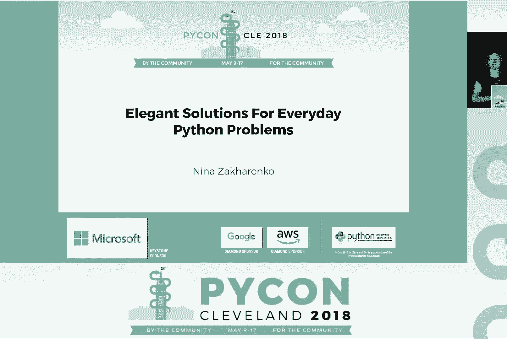

 [applause]， Hi， everyone。 I'm Nina。 I've been writing code professionally for well over a day。 I've worked for some pretty cool companies like Meetup， HBO， Reddit。 But these days I work at Microsoft as a cloud developer advocate。 And up on the screen there is our mascot， Bit， the cute little raccoon。

 So if you think he's cute too， come find me after the talk for a sticker or a pin。 And I'm here to talk to you today about elegant solutions for your everyday Python problems。

 The slides for this talk are hosted at bit。ly/elegant-python-2018。 So if you want to follow along。 go ahead and check out the slides。 The slides contain lots of links to useful information like additional documentation。 And this is an intermediate level talk where I'm going to be giving a whirlwind tour of。 some of my favorite Python language features。 So if you don't absorb everything right at this very minute。

 don't be afraid。 Feel free to revisit the material if you need it。 It might be useful to you if you're coming to Python from another language。 Or if you wanted to learn about some cool Python features like magic methods， iterators， decorators。 and context managers。 I'm also going to highlight some useful packages that can take that default Python behavior。

 up to the next level。 And please be aware that this talk targets Python 3。

 Now what is elegant code？ It really kind of depends on the problems that we're trying to solve。 I started out my career working as an enterprise Java developer。 And I worked with some of the popular libraries and language features at the time。 But all of it always felt bolted on。 It never felt elegant。

 I think I still have nightmares about abstract， singleton， proxy， factory beans。 Knowing laughs from the Java developers in the room。 So when I discovered Python。 it really felt like a brush of fresh air。 Breath of fresh air。
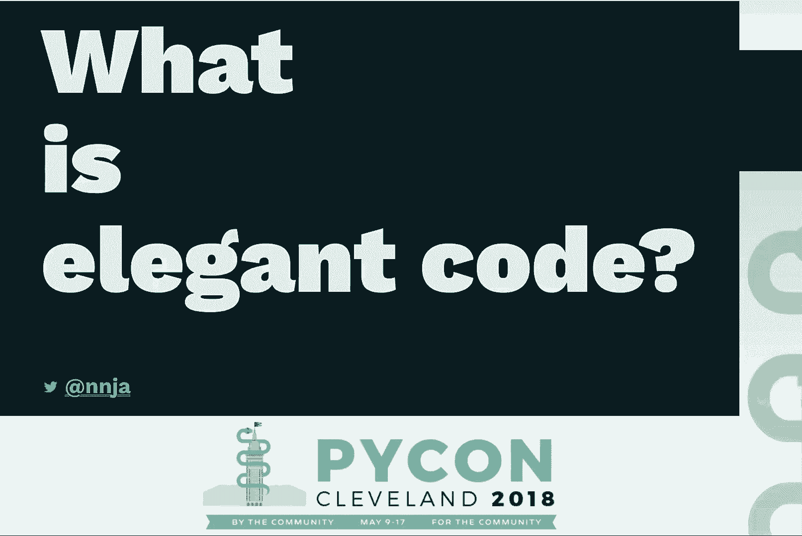

 It has some innovative features that don't feel bolted on to the language。 Well how do we go ahead and pick those right tools for the job？

 We've all kind of read the Zen of Python。 If you haven't。 go ahead and open up an interpreter and type in import this。 And the Zen of Python is a little poem that kind of indicates the best way of writing， Python code。 And it kind of starts off with beautiful is better than ugly， simple is better than complex。

 Explicit is better than implicit and complex is better than complicated。 Those are great ideas。 How can we accomplish that in our own code？ Well I'm here today to share with you some practical code that you can take and use to。 make your code simpler more elegant and more explicit today。 But you have to remember that beauty is in the eye of the beholder。

 So what's beautiful and elegant for me may not be elegant for you。

 Let's dive into magic methods。 A little bit of terminology to discuss here before we dive in。 Magic methods usually start and end with a double underscore。 And you might hear me and others refer to that as "dunder。"。 So if you are wondering what that has meant throughout the conference， that's your little。

 bit of terminology。 And magic methods， by implementing them。 you can really kind of make your objects behave， like different built-ins。 Things like numbers。 like lists， like dictionaries and lots more。 You're used to implementing magic methods like "dunder stir。" "dunder repper，" but there's， a whole world of other ones that you can implement。

 Here I have a money class。 It's kind of a straightforward currency class。 And I'm going to use it as an example to show you how instances of this money class can。 be acted on like numbers。 This money class knows about a conversion rate for a particular currency。 It's based on the dollar。 So here $1 represents 88 cents of a euro。

 And we have a constructor that accepts a symbol and an amount。 This class also implements dunder stir so it knows how to represent the currency when。 we try to print it out。 Lastly， it knows how to convert from one currency to another using this convert method。 excuse， me。 Kind of basic stuff。 If we want to represent the cost of two different meals and different currencies。

 here we have， the cost of our soda in dollars。 When we print it out， it looks all nice。 It has our symbol。 We represent the cost of a pizza in euro。 And because we implemented that dunder stir method， we can see that nice print out。 Now let's implement one more magic method。 We're going to implement dunder add。

 And add stands for addition。 So if we wanted to， we could also support subtraction， multiplication。 and a slew of other mathematical， operations。 Now let's see why this is so powerful。 This allows us to use the class in a really intuitive way。 It's currency。 You expect to be able to add it together or perform other operations on it。

 So now I can print out the cost of my soda that's in dollars added to the cost of my pizza。 that's in euros。 It's pretty cool stuff。 If the second object is in a different currency。 it just does that conversion under the hood。 We don't have to worry about it。 In the previous example， we saw that add maps to the plus symbol。

 Other magic methods can map to other things。 For example。 the dunder get item magic method maps to brackets， square brackets in this， case。 you can use those to access items by index in a list or an dictionary by key。 Some magic methods also map to built-in functions。 So in this example here， I have a class。

 It's a square shape。 And when I call the built-in method， Len， on this class。 I want to know how many sides， does my shape have。 So in this case， my shape has four sides。 We'll see how this comes into play a little bit later in the talk。 Let's chat about custom iterators。 The terminology can be really confusing at first。

 but if you remember this small handful， of guidelines for making classes iterable。 it'll be a breeze。 In order to make a class iterable。 a class needs to implement the magic method dunder， iter。 Dunder iter has to return an iterate tour。 And in order to be an iterate tour， a class needs to implement dunder next。

 And there's a specification for our implementation of dunder next。 It must raise the exception stop iteration when there are no more items to return。

 Here's a scenario。 Let's say that we have a server instance running services on different ports。 Some of these services are active and some of them are inactive。 And we want to be able to loop over our server instance。 But when we do that。 we only want to make sure that we loop over the active services。

 Here's an example class。 We have defined a few services。 We have FTP running on port 21。 SSH on port 22， HTTP on port 80。 Some of these services are active。 In my example here。 FTP is an inactive service。 So to make this server iterable， in our constructor。 we're going to initialize to the current position。 And as we're looping。

 we're going to call this dunder next method under the hood。 And we just kind of keep going through our list of services。 If it's active， we return it。 If not。 we skip it。 If we maintain our state so we know what position we're at in our list of services。 When we're all done and there's no more services， we raise that stop iteration exception。

 Notice that this is an iterator because it implements dunder iter。 And we can return self in this case because this class is also implemented a dunder next。 Remember that dunder iter is actually called when we first start iterating before we ever。 call next for the first time。 So if we're looping over this iterable server in a for loop or in a comprehension。

 that initialization， happens under the hood。 If we need to。 we can also get the iterator by hand using the iter built in。 Now we can do something like this。 We can just loop over the protocol and the port in our iterable server and print it out。 That loop server， all our active services。 Pretty cool。 But if you。

 if your iterator doesn't need to maintain a lot of state， like in our example。
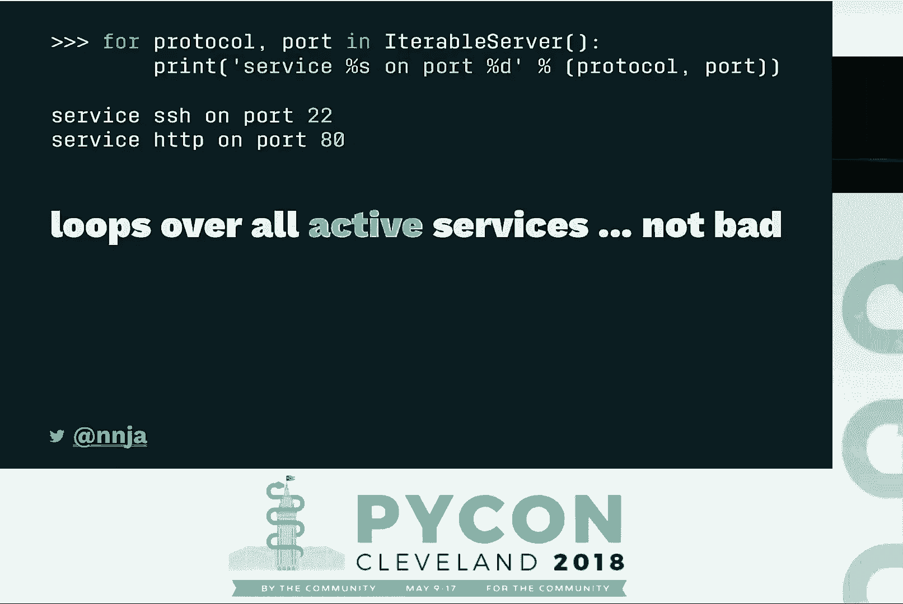

 below， which I would say is probably most of the time， use a generator instead。

 Here we have a new implementation of our dunder iter method。 And notice that we're not explicitly maintaining a position。 That's because our generator。 which is also an iterator， doesn't know where it was in， the past。 It only knows how to continue onward into the future。 So we're just looping over our services。

 We're checking to see if that service is active or not。 And then we do something special。 We're going to yield the name， the protocol of that service and the port。 What exactly is yield？

 Well， a yield is like a return sort of。 We'll cover it in more detail later。 But what you need to know for now is that after we yield， we still maintain some implicit， state。 And when we come back after a yield， we just end up continuing where we left off。 That means we don't have to maintain a lot of state like our current position because。

 it's done for us implicitly。
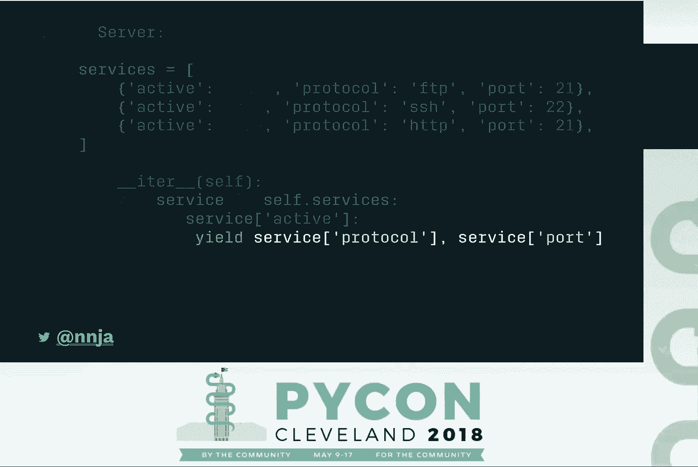

 Quickly， let's go over why this works。 Technically。 when you use a single parentheses to create a generator comprehension， the proper。 name for that is generator expression。 But I like generator comprehension much better。 It makes a lot more sense to me。 So I'm creating a very， very， very simple generator。

 I'm just getting a number in a range of one。 And if I check out the variable that I've created。 my gen， I'll see that it's a generator。
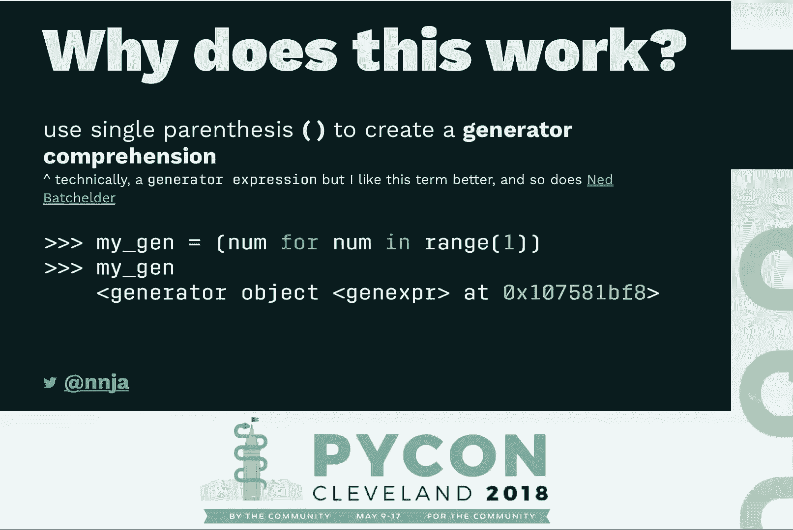

 expression。 Now remember that an iterator must implement dundernext。 If I call the next built-in。 which maps dundernext under the hood on my generator， I get my one， value， which was just zero。 And if I try to call next on it again， I get that stop iteration exception。 And remember that our iterator has to raise that stop iteration when there are no more， elements。

 That's really cool。 We can implement iterators with much less code。 and we don't need to waste our time or resources， on maintaining state。 So really。 really kind of fast and easy way to implement iteration when you need it。

 Let's check a little bit about method magic。

 We can alias methods pretty easily。 We just assign them to a variable。 In this case。 I'm assigning the method dunderadd to a new variable called concat。 And now I can use it just like I'd be able to use dunderadd because methods are just， objects。 So I was previously using the plus sign under the hood。 Now I've kind of renamed my method。

 and I can also call concat。 And when I ask Python， are these two values equal to each other。 I get back a true。 And I'll chat a little bit about why that's important in a few slides。 But next。 I'm going to show you a little bit more magic。 Get adder。 So in this example。 I've defined a very simple dog class。 It has a method called speak。

 And when I call speak on my dog instance， it goes bark bark。 There's a built-in method I can use called get adder that takes an object， a name， and。 note that that name must be a string and a default value if I want to provide one。 And the default value is optional。 So if I call get adder on my dog instance。

 I have a -- and pass in the value of string -- I'm， sorry， speak as a string。 I'll see that I have a bound method。 And now I can just go ahead -- if I save that method to a variable。 I could just call it， like any method。 So using get adder， we got that speak attribute。 If speak wasn't on that instance， because I didn't provide a default value， I would。

 have gotten an attribute error instead。 To avoid exceptions， you can try to provide a default value。 Here's an example of how we might be able to use something like this。 Here I've written the tiniest ever command line tool that takes dynamic commands。 So I have a class operation and I've defined a few methods on it。

 I have a method called say hi that prints out hello and the pass in argument of a name。 I have a method say bye that prints out goodbye with the pass in argument。 And I've also defined a default method that will print out that this operation is not， supported。 Now if you look down to the main method， what am I doing？

 I'm creating a new instance of my operations class。 And let's assume I have some error handling in there。 That would probably be a nice touch。 The next thing I do is I grab the user input and I split it up into a command and an argument。 Lastly， I call get adder with my three arguments。 The first one is the instance of the class operations。

 The second one is the command that I've extrapolated from user input。 The third one is a default。 And lastly， I call that method with an argument。 In this case， I'm going to provide a name。 Let's check out the output of running my little demo script。 If I do say hi and Nina。 I get the output that I expected， hello Nina。 If I just try to type in some junk。

 I'm going to get back an error message that says this。 operation is not supported and I can do it on the fly。 Pretty cool。 Next I want to touch on funktools。partial。 This takes three arguments， function。 In this case。 I'm going to abbreviate it to funk， some arguments and some keyword arguments。

 And what this does is returns a new partial object which behaves like the funk but called。 with those arguments and those keyword arguments。 If any additional arguments are passed in。 they're just appended to args。 If any additional keyword arguments are passed in。 they extend and override quarks。 Let's see how this works。

 If I pass in a binary number as a string to the built in int function and I specify the， base。 in this case two， to signify that it's a binary number， we'll get that value back， as a decimal。 Let's say I want to be able to call this function on any binary number without having。 to always specify the base。 I could do this with a partial。 I import my funktools。partial。

 I'm sorry， from funktools import partial。 And then I make a new partial called base two。 The function that I'm passing in is an int and the keyword argument that I'm passing in。 is base two。 If I then examine this object， I'll see that it's a funktools。partial object。 Now what can I do with it？ I can go ahead and call base two on any binary number and that argument。

 the base equal to， is now implicit and I get back the value as a decimal。

 So we've talked about lots of magic methods and method magic。 Let's see this stuff in action and see how it applies to us。 There's a library that I really like that's unfortunately very poorly named。 It was looking for a new maintainer that got adopted by Mozilla。 So thank you， Mozilla。

 It's called a GitHub and it really kind of has nothing to do with GitHub。 It is a REST API client with a transparent syntax and it facilitates rapid prototyping。 on any REST API， not just the GitHub one。 It's implemented in about 400 lines of code。 You can add support for any REST API in about 30 lines of code and this project at GitHub。

 it knows everything it needs to know about the protocol， REST， HTTP， etc。

 But it assumes nothing about the upstream API。 Here we defined an endpoint URL and some other connection properties。 This is quite a bit of code but let's focus on the important bits that the class name is， GitHub。 We expect an API token， this is going to be our GitHub API token and that we provided。 a API URL of api。github。com。 After we define that endpoint and other connection properties。

 we can just start using the API。 I've made a new instance of that class that I showed earlier。 I've provided a token， my GitHub API token which I'm sorry I'm not sharing with all of。 you today but you'll have to imagine it。 And I get back a status and some data。 What I call that instance， gh。user。repos。get。 What it's actually mapping to is the get method of /user/repos on api。

github。com。 That was it。 That was all the setup I had to do。 But if we try to provide a path that doesn't exist， we just get a 404。 So gh。path。doesn't exist。get 404。 Because remember it's up to you to spell things correctly。 There's no validation of any sort if the URL doesn't exist or anything else goes wrong。

 The error that's thrown by the API is just going to get returned。 Okay， magic。 How does this work？

 Well each call to the API class is going to ferry to an incomplete request。 We can use it in two different formats。 One is the square bracket format because we are implementing get adder here。 And we've also aliased get item to get adder。 So that allows us to use the dot syntax。 First。 we check to see if it's a URL or not。 If it is， we just kind of keep appending to the path。

 If it's not， what we do is check and see if that value is an HTML HTTP method or not。 If it's in our list of predefined HTTP methods。 If it is， go down to the client class。 You'll see that once we get to one of those keywords in this example， it's get。 We're going to go and actually call the API with the URL that we've now built up。

 And it does that using a partial method。 So we return a partial with the HTTP method and the URL that we've built up。 I think this library is pretty cool。 It's worth taking a look at the source code to see how it's written。 I use it all the time when I'm prototyping。 Next， let's talk about context managers。 When should you use one？ If you want to perform an operation， an action before， after an operation。

 Common scenarios here are closing a resource when you're done with it， like a file or network。 connection， performing some cleanup before or after a function call。 An example is feature flags。 It's the ability to toggle a feature of your application on and off easily。 For example。 if you want to do some A/B testing and show a blue checkout button to some of。

 your users in a red checkout button or others in seeing which of those options allow you。 to convert more users or something like a rolling release。 If you want to test your code for 5% of your users and see if it affects your resources。 or bogs down your site or something like showing a beta version to users who are opted into。

 a beta testing program。 Here I have a really brief feature flags class。 I only have one feature。 So beta， do I want to show a beta version of my homepage or not？ We have two methods。 Is on will return true or false if that feature is on and a toggle method that allows me to。 set a value for that flag on or off。 How do I temporarily turn these flags on and off when I'm testing them？

 What I want is something like this context manager that only has that feature flag on。 in the context that I'm provided and when it exits that context to turn the feature flag。 back to whatever it was set to before。

 We can do this with the magic methods， dunder enter and dunder exit。 In our constructor we save the old value whatever that feature flag was so we can set。 it back later。 In dunder enter we're going to toggle that flag to on and in dunder exit we're going to。
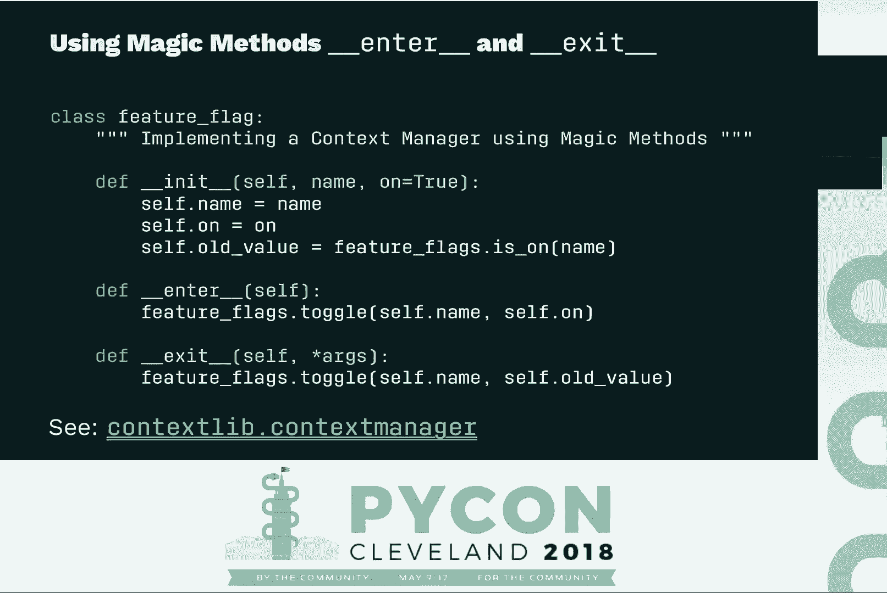

 do our cleanup and set it back to the old value。 The better way to do this is using the context manager decorator。 You import that from context lib and then you just throw that decorator on any function。 It allows you to kind of define that factory function for with statements without needing。 to create a separate class with dunder enter and dunder exit methods。

 What we're doing in the middle， first we are implementing the behavior of dunder enter。 So turning that feature on。 Then we yield， which I'll go back to in a second。 After we come back from that yield we're going to toggle that feature back to the value that。 it was， that cleanup。 Let's get back to yield a little bit。 What's happening here？

 Yield is giving up control for the time being。 You do what you need to do before the method is run。 Then you yield control to the method that you're being used in。 Once you。 that method completes yields comes back， the yield is over and we reenter our。 context managers so we can run that cleanup code that we wanted to run on exit。

 With either implementation we can use the context manager， leave our tests， allow our。 tests to leave state the way that they found it。 If we try to just turn these feature flags on and off it can cause issues with our tests。 further down the line。 In order to explain a better way of doing this I want to touch on decorators。 The simple explanation for them is that there's syntactic sugar that allows modification of。

 an underlying function。 Decorators wrap a function in another function and then they do something。 they either， you， know， before the call， after the call。 with the provided arguments or they modify the。
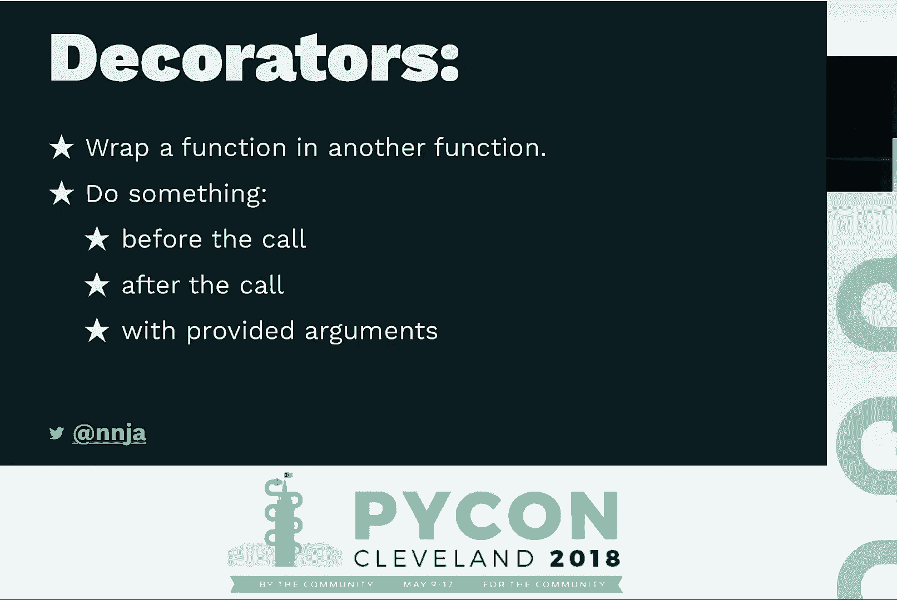

 return value of， or the arguments in some way。 I've defined a user class here that has a flag is authenticated and a constructor that。 takes a name and sets a value。 And we have a little web application with these users and we want to show pages for them。

 but we want to throw an exception if a user who's not authenticated is trying to access。 data that's only for logged in users。 We have a profile page method here and we check to see if that user is not authenticated。

 throw an exception。 But we can use a decorator to remove some code duplication。 Here I've written a method called enforce authentication and this method does something， funny。 It contains another method inside of it called wrapper。 And the enforce authentication accepts a argument that's a function while our wrapper function。

 accepts an argument that's a user。 That inner function returns that。 the passed in function called with the arguments that。 were passed into the inner function and then outside of that context we return a wrapper。 But this can be a little bit confusing at first but take a look at the important logic。

 in the middle。 If the user is not authenticated then we raise an exception。 Same thing as from our previous code。
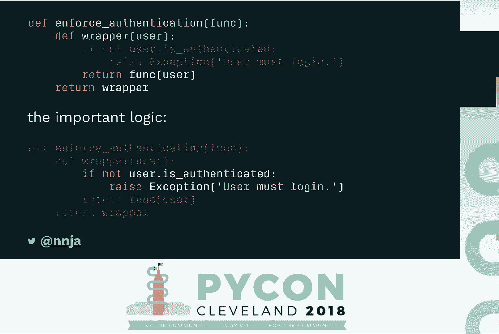

 We can use this in a few different ways。 We can use it without a decorator。 We could just call enforce authentication with a function which is display profile page。 And then we pass in an instance of a user， our argument。 Or we can use that syntactic sugar and use a decorator instead using the @ symbol。

 So we add @enforceauthentication on any page that we want to enforce authentication on。 And now that's just going to raise an exception if an unauthenticated user tries to call that。 You don't have to litter your code with a bunch of copy and pasted stuff。
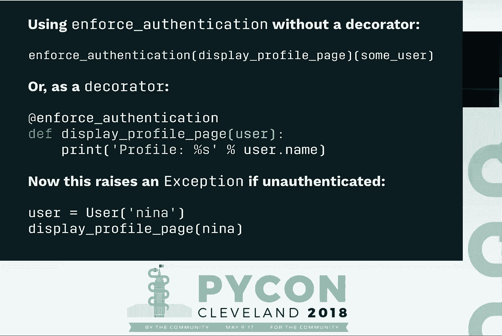

 One quick thing about decorators， you can have a problem with lost context。 For example。 now our decorated function doesn't have the correct name and it doesn't have。 that docstring that we had defined for it。 If you run into this problem。 look up how to use contextlib。wraps。 It's really easy。 In use cases for decorators， logging， timing。

 validation， rate limiting， mocking and patching， there's a cool feature called a context decorator。 That's a context manager and a decorator combined。 It's been in the standard library since Python 3。2 and using them you can easily write classes， that can be used both as a decorator and as a context manager with that with statement。 And context decorator is used by context manager already。

 So you get that functionality automatically for free。 For our context manager from earlier。 that's just kind of the same code。 We are saving the value of our feature flag before we enter the context manager。 then。

 we yield and then we set it back to what it was。 While using that decorator。 we can use it either as a context manager or we can use。 it as a decorator by adding it to our get profile page function in this case and passing。

 in those arguments。 A library that I like that uses this feature really well is called freeze gun。 It lets you， your Python test travel through time and you can use it as a context manager。 in that first example with the with。 So for just one part of your test。 you want the date and time to be this specific date。 Once you exit the context manager。

 your date goes back to what it was or you can use it。 as a decorator and just freeze time in a whole function using that decorator。 Read the source code sometime。 It's really mind bending。
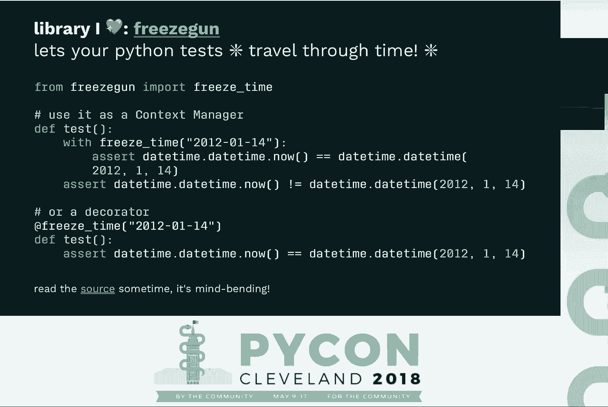

 Lastly， I very， very briefly want to touch on name tuples。 I'm not going to go into the implementation， but I do want to show you two features of name。 tuples that I find to be useful。 What name tuples are are a lightweight representation of data。 You can create the tuple subclasses with named fields。

 So kind of much faster than a fully heavyweight object。
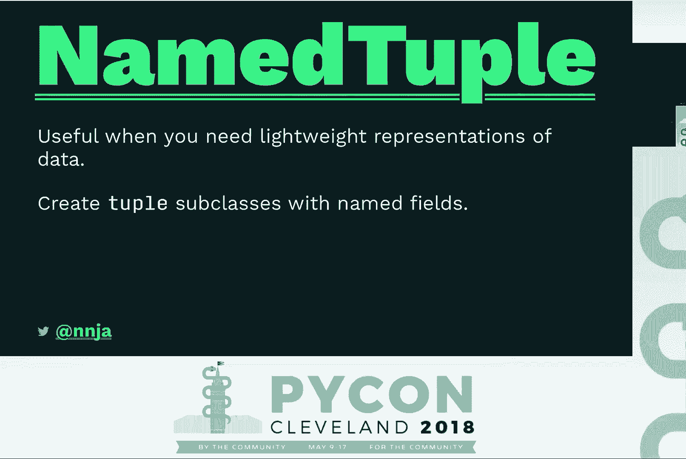

 This is a quick example from active state。 We have a name tuple called cache info and it just kind of contains some random information。 Number of cache hits， misses， a maximum size， et cetera。 We can give these name tuples default values。 In this case。 I have a routing table and I have a few values that I'm saving a prefix， a queue name， a wait time。

 We can set defaults with two different ways。 The first one is by specifying dunder defaults on dunder new。 So in the first case， I'm specifying a default wait time of 20 seconds always for all instances。 of this name tuple， but it can be overwritten if I need to。 In the second instance。 I'm customizing a prototype with underscore replace。

 So by calling underscore replace and passing in a default of a user prefix and a default。 of a user queue queue name， that's another way of specifying some defaults for my name， tuples。
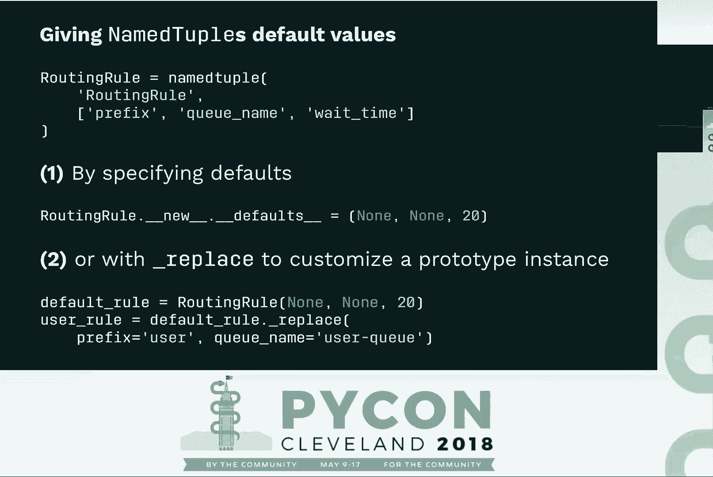

 Lastly， name tuples can also be subclassed and extended。 If you see here where I define my class person， I am extending a name tuple and now I can provide。 other kind of heavier wait methods if I want to in this example， dunderster。 So you got lots and lots of new tools。 We learned about magic methods。

 making your objects behave like built-ins， numbers， list， dictionaries， et cetera。 We learned about some method magic， things like aliasing， get adder， context managers。 for managing your resources， decorators， doing something before or after a call， modifying。 a return value， validating arguments。 We learned about context decorators。

 which are context managers and decorators in one。 Iterators， generators， looping over your objects。 We learned about the yield keyword and what that does。 And lastly， we covered on name tuples。 which are these lightweight classes。 A quote that I kind of really appreciate is that perfection is achieved not when there。 is nothing more to take away or nothing more to add， but when there is nothing left to， take away。

 So less is more， elegant code can be poetic。 It can be easy to copy and paste from stack overflow or try to randomly stick with paradigms。 of the programming language you came for。 But resist that urge。 If you kind of deep dive into Python， it will really open your mind into some new insights。

 Because you want to be an elegant Pythonista。 We're a nice hat。 You want to use the tools that you learned about today to get started。 And remember that with great power comes great responsibility。 So use them very wisely。 If you're using a decorator on every single function in a class， we think your approach。

 Consider refactoring。 Simplicity is better。 It's up to you to choose the right tool for the job。 Thank you。 [APPLAUSE]。