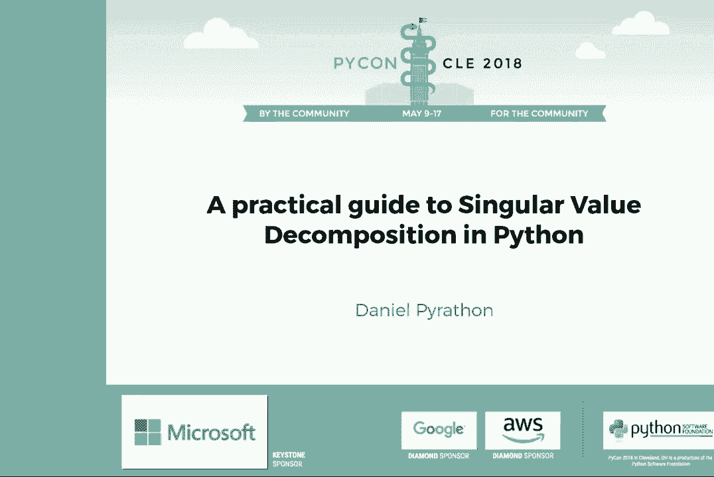
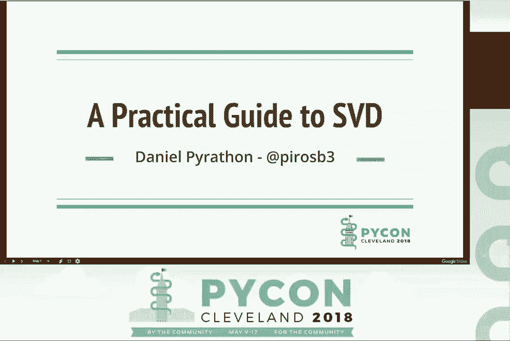
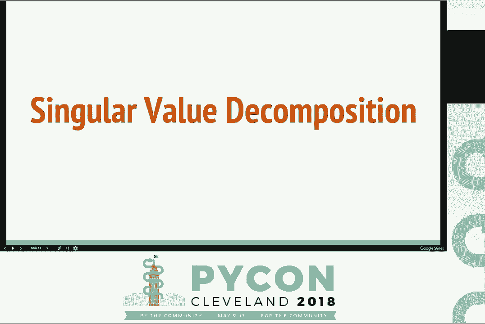
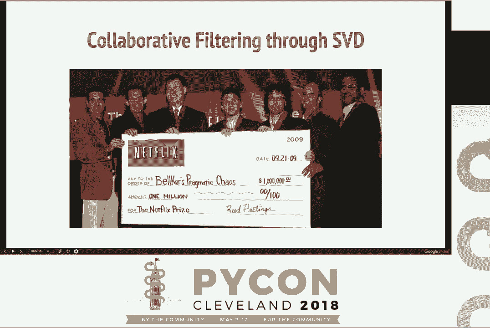
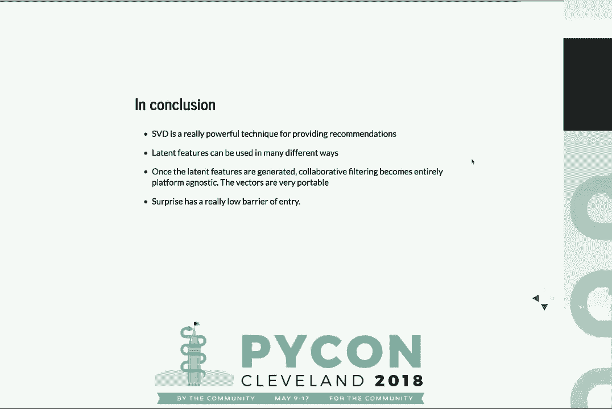

# P3：Daniel Pyrathon - A practical guide to Singular Value Decomposition in Python - - 哒哒哒儿尔 - BV1Ms411H7Hn

 >> Hey， everyone。 Welcome to the talk on a practical guide to singular value decomposition。

 in Python。 Please welcome Daniel， who is an organizer for Pi Bay， a regional Python conference。

 in Bay Area。 All right。 [ Applause ]， Hello。 Thank you for coming。

 So today I want to cover two main things。 First of all。

 I want to cover what is SVD most important in the context of recommendations。 And then。

 the second thing is， obviously， how can we do SVD using Python？ But before we start， let。

 me ask you two questions。 Have you ever wondered why you binge watch Netflix？ Or maybe？ How。

 did Spotify found out that secret love for Taylor Swift？ In fact， there is something。

 about these services such as Spotify， such as Netflix， that make them so， so intimate。

 and so， so personal。 Why is that？ The answer is recommendations。 Let me tell you why I'm， here。

 So I work for an online dating company called Coffee Meets Bagel。 Who knows Coffee， Meets Bagel。

 Hey， right。 Brilliant。 Okay。 Hope you haven't had bad experiences。 It's a， great dating app。 So。

 and I recently moved from a traditional software engineering role。

 to a machine learning engineering role。 And most importantly， I did so with very， very。

 little scientific background。 And I know what you're thinking。 That's a terrible idea。 But， today。

 what I want to tell you is what I want to show is how Python really helped me learn。

 and get up to speed with some of the learning algorithms that we run at Coffee Meets Bagel。

 Most importantly， some of these algorithms are a lot more easier and logical to understand。

 when you're looking at Python source code， when they're implemented in Python。 And today。

 I want to show you an example of one of these。 So before we start， I just want to make sure。

 we're on the same page。 What is a recommendation engine？ Many of you that probably have not。

 heard of recommendation engines have probably heard of search engines。 And search engines。

 are just think of these as like black boxes where you insert some parameters and you get。

 some search results。 Recommendation engines are similar to search engines， but they're， personal。

 It's just like having one search engine for every user in your application。

 What are the benefits of search engines？ Well， because they're personalized for every user。

 in your application， they give more personal results。 They give those intimate results。

 that we were speaking about previously。 But most importantly， they learn over time。 As。

 your user explores the application， as your user interacts with the items and resources。

 that you have in your application， our recommendation engine will learn。

 And it will give better results。 Again， there are many benefits。 I just want to point out two。

 The first one is engagement。 So there's a huge increase in engagement if you use a recommendation engine compared。

 to a traditional search engine。 And then the second one is also diversity of recommendations。

 So if your user is treated personally in your application， there also is a lot more sort。

 of engagement and diversity in the results that that user gets。 And if that wasn't enough。

 let's look at some stats。 35% of Amazon's revenue is actually generated by some level。

 of recommendation engines。 And Netflix has over 75% of movies that are actually based。

 on the recommendations。 This is really huge。 And so today， what I want to do is I want to。

 cover only a specific subset of what a recommendation engine is。 Effectively。

 it's a really big talk， and it's huge。 And what I want to talk about is a common strategy to perform recommendations。

 which is called collaborative filtering。 In order to understand collaborative filtering。

 we need to first focus on the free main ingredients that compose collaborative filtering。 Users。

 ratings， and products。 The users are effectively the actors in your system。 They rate products。

 and you can think of the users as the readers of your blog， the customers of your online。

 grocery store。 Effectively， most of us assume some -- we assume to be a user in some application。

 Users rate products， which is the far right of this slide。 And the products are again very。

 domain specific。 They could be， in case of maybe Spotify， they could be songs or in Netflix。

 maybe they could be movies。 Now， ratings are the glue that connect the users and the products。

 Effectively， just think of the rating as a number to somehow quantify how well， how good。

 an interaction was between a user and a product。 And this number can be as granular as saying。

 four out of five， or it can be as simple as saying thumbs up or thumbs down。 It's up。

 to you as a developer。 Now， for the simplicity of these slides， I'm only going to be focusing。

 on movies as products。 So from now on， we're only going to be speaking about movies。 But， remember。

 products can be whatever you want。 And so， let's try and answer this question。

 What is collaborative filtering？ So， effectively， collaborative filtering is a way to provide。

 recommendations by leveraging the existing ratings of the users that are similar to you。

 And probably the best way to understand it is with this matrix here on the right。 This。

 is a user to， this is a user to movie， ray tricks。 Every row here is a unique user。 And。

 every column here is a unique movie。 And the cell between a user and a movie identifies。

 the rating that that user gave to that movie。 And so， as you can see， there are two main， ratings。

 Thumbs up means purchase the movie and thumbs down maybe means like， you know。

 give the movie back or something。 Or dislike the movie。 This is our mini Netflix， right？

 We only have five users and four movies。 So it's a very limited catalog。 And so， let's。

 say our user five here logs into our mini Netflix。 And the mini Netflix asks our collaborative。

 filtering engine， can you provide a recommendation for the blue movie？ Well， how do we do that？

 The first step in collaborative filtering is finding users similar to our user five here。

 that have also rated that blue movie。 Let's take it。 Let's look at an example。 So， user。

 two and user five both rated positively the green movie and rated negatively the red movie。

 the orange movie。 User free and user five both rated positively the red movie and also rated。

 positively the green movie。 Most importantly， both user two and user free have also rated。

 the blue movie， which is what we're trying to predict。 So let me ask， any brave soul want。

 to answer this question。 What will user five think about the blue movie？ Boo。 All right。 Fantastic。

 Yes， that's correct。 So as you can see， we leveraged existing user's information。

 to generate this recommendation， right？ We collaboratively found the answer。 And so， again。

 I want to go one step down the funnel。 There are many different ways to provide a collaborative。

 filtering。 Today， I'm going to focus on one specific。 Another value decomposition。

 It's one of the most well-known algorithms in industry today， for providing collaborative filtering。

 It's highly adopted in industry。 It's actually， used by many companies。

 People like companies like Spotify have also written about their， implementation and it's very。

 very scalable， actually。 And just to show you how widely this， algorithm is used。

 this is a picture from the Netflix prize。 So the Netflix prize is this。

 competition that was created by Netflix in 2009。 It's an open competition that basically。

 called all engineers and researchers around the world to compete to somehow try and increase。

 Netflix's recommendation engine。 Well， the winner of this competition， which are these。

 people over here， actually one using variance of the SVD algorithm to increase Netflix's。

 accuracy by 10%。 That's huge。 And just to show you the prize， these people got $1 million。

 using SVD。 So listen to this talk。 Listen to this talk。

 Hopefully by now I've tried to convince you that SVD is a cool thing。 But in order to。

 understand how SVD actually works， the most important things， I want to explain to you。

 how SVD actually predicts these new recommendations。 Effectively， SVD is an algorithm that creates。

 these things called latent features for every user and every movie in our ratings database。

 But in order to understand what latent features are， let's first understand what features are。

 just to make sure。 So features in the context of machine learning are the metadata that we。

 as scientists or engineers attribute or associate to our users and our products。 So for example。

 in the context of Netflix， what would be the attributes that we would associate to our， user？

 Maybe their age， the region they're in or their gender。 And what about the movies？ Well。

 the release date maybe， the director somehow matters， the duration of the movie。

 These are all really informative features for us as humans。 In fact， we assume that the。

 rating that maybe this user gives to this beautiful green movie is somehow impacted by。

 these features that we define。 Probably the best way to understand this is if you got。

 like past ratings of maybe IMDB or something like that and you actually， you could actually。

 use these features to generate some statistics。 Like maybe males in their 20s are more， are。

 rates higher， Western or some movies than males in their 40s。 Something like this， statistically。

 And so what we do is we generate these features so that then we can feed them in some kind。

 of learning algorithm that somehow identifies the importance or the weight of every one。

 of these features。 But again， there's one fault here， which is these features are generated。

 by us as humans。 And as humans， we can only define features that are somehow directly observable。

 things that we assume are important。 But most of the times， there's a set of features that。

 are not is not directly observable， but is a lot more impactful in predicting a rating。 In fact。

 there's a class of algorithms like SVD that learn， create out of nothing these， new features。

 which we call latent features， just like age， region and gender that are somehow。

 not directly observable。 We can't point out saying the first latent feature identifies。

 I don't know， the users， users that have blonde eyes or something like this。 We cannot do that。

 But all we know is that these features can be used and are highly informative in the context。

 of recommendations in predicting a rating between a user and a movie。 And so SVD as an algorithm。

 runs on these data sets and generates these features。 And what do these features look， like？

 Sorry about the picture， but they're very ambiguous。 There's no way to actually， describe them。

 And this is my creativity in trying to describe the features。 They're not。

 really something that you can actually point out。 These are very abstract。 But again， we。

 can use these features in our data sets。 So now let's try to actually understand how。

 can we use these latent features？ How are these features actually generated？ Let's start from。

 there。 So again， let's take our Netflix， a mini Netflix example before。 This is a mini。

 mini Netflix and even smaller， right？ We used to have other two users while they turned。

 So now we have only three users and four movies。 Most important， as you can see here， I'm not。

 using thumbs up and thumbs down anymore。 I'm actually using a number。 Remember， the。

 higher the rating， the more relevant。 So for example， here， user two rated very highly。

 the red movie here， but rated very poorly the blue movie。 Because four is obviously bigger。

 than one。 Now， let's just put this matrix over here one second。 So it turns out that there。

 is this algorithm which is called matrix factorization， this technique。 What matrix factorization。

 does is it gets one big matrix and it creates two smaller matrices out of this big matrix。

 In a way in which we could take those two matrices that we create and in a second moment， we。

 could recompose the original matrix。 It's a bit hard to understand， but let's try to visualize， it。

 Okay。 SVD is an implementation， an algorithm that uses matrix factorization。 So decomposes。

 these two matrices in a way in which we only retain the most informative features， the most。

 informative factors from these two matrices， the ones that have most important， biggest， importance。

 And the number of features that we actually extract is something that us as。

 developers or scientists define。 We tell SVD how many features we want from this dataset。

 So let's say we wanted to run SVD on this matrix here and we only wanted to output two， features。

 What would this look like？ As you can see here， we have every user has these。

 two latent features here and every movie has two latent features。 And if you somehow believe， me。

 you could get these two matrices and re-multiply them together and you would get an approximation。

 the nearest approximation to that center matrix。 Minus the question marks， which basically。

 means that you can actually generate new predictions。 Now， what about these features？ Why are they。

 I only use two latent features here simply for illustration purpose。 But， in your real example。

 you'll probably want to use more than those。 The more latent features， you generate。

 the more information you're actually extracting from the original matrix。 The more。

 latent features you extract， the more computationally expensive your SVD is going to take。 So that。

 is a number that you are going to describe。 So now， we have these latent features。 What。

 can we do with them？ Well， today I want to show two use cases of how we can use these。

 latent features。 The first one is to predict new scores。 Effectively， once we generate these。

 latent features， we can predict the rating between any combination of user and movie。

 So let's take an example here。 Let's say we had our user one and we wanted to predict。

 what user one would think about the blue movie。 So we just perform a dot product between the。

 latent features of user one and the latent features of the blue movie。 So we multiply。

 latent feature one of user one with latent feature one of blue movie。

 And then we sum latent feature， two of user one with latent feature two of blue movie。

 Result here is 3。52。 So effectively， user one would pretty much enjoy the blue movie based on this example。

 And let's look， at another way in which we can actually use these vectors。

 And this is the way I actually， like most。 Which is effectively。

 once we generate these latent features， we can compare users。

 with other users and movies with other movies。 We can actually find similarity between two。

 users or two movies by identifying the similarity of their vectors。 And there are many different。

 ways to measure similarity。 Today I'm going to be using cosine similarity， which effectively。

 measures the angle， the cosine of the angle between these two vectors。 And so in this example。

 you could probably say that if user user free here is more closer in terms of tastes。

 to user one is more similar to user one than user free to user two。 What that effectively。

 means is that user free is more likely to agree with the with the tastes， the ratings of user。

 one than user two。 And so hopefully this will be fun， but what I want to show you now is。

 a small demo。 Effectively， what we're going to do is we are going to， we are going to。

 be training an SVD using a library called surprise SVD。 It's a really great library。 It's， very。

 very simple to use。 And what we are going to be doing is we're going to be downloading。

 and exploring this data set， which is called movie lens。 And once we've explored this data， set。

 we are going to train an SVD using very， very few steps。 You're going to go back home。

 today and you can do this on your own data set。 And then finally， those two ways that。

 I was showing you before， generating recommendations by reconstructing the result by performing。

 the dot product between a user and a movie and similarity between movies， we're actually。

 going to be able to do that using this example。 So let's start by speaking about movie lens。

 So movie lens is a great open source data set。 It's pretty famous。 It's using a lot of competitions。

 And it has a lot of different ratings and a lot of unique movies and users。 I built a。

 small function here called load movie lens that simply converts the CSV file to a data， frame。

 a panist data frame。 And as you can see here， every row is a pass rating。 Right？ And so。

 for example， if you take the first row， this user 742 rated Jeremy McGuire with， a rating of four。

 And again， the ratings go in scale from one to five inclusive。 As you， can see here。

 there are three columns to this to this data frame。 The first column is a user， ID。

 The second column is the movie title。 And these are strings。 They can be whatever， you want。

 Your users and your items and your items in your product can be whatever data， structure you want。

 The important thing is that the rating is a number。 Right？ Remember， it needs to be quantifiable。

 So how can we train an SVD using four simple steps？ The first。

 step is we obviously import surprise SVD。 And we define something called a reader。 And。

 a reader is effectively a component inside of -- it's a class inside of surprise that。

 defines the lower and upper bounds of your ratings。 Remember， you can choose whatever。

 lower and upper bound you want。 The important thing is that you define it up front and you。

 tell surprise。 So in this case， MovieLance has a great open source documentation which。

 tells us that the ratings go from one to five。 So this is what I'm going to define。

 The first step is we initialize a dataset instance。 And just think of the dataset as， a loader。

 Effectively what it does is it prepares the data for performing SVD。 Data。

 set accepts two parameters。 The first one is the MovieLance dataset -- the MovieLance。

 data frame that we defined previously。 And remember， this needs to have -- this needs。

 to be a pandas data frame which has three columns in this specific order。 User ID， product。

 ID and rating。 It's very important。 And the second parameter is that reader。 Now， as a， first step。

 what we want to do is we want to retain some amount of the dataset for testing， purposes later。

 Today， I'm actually not going to show you how to perform the testing。 But。

 if you download my notebook， you'll actually find some hidden slides to perform that。 Finally。

 the moment we've all been waiting for is we initialize a new SVD instance and we fit our， dataset。

 And here， as you can see， the SVD accepts one argument in its constructor which。

 is number of factors。 This is the number of latent features we want to use。 Remember。

 this is -- here I chose 100 as an arbitrary number。 It just worked well with my examples。

 But you can choose whatever number you want， whatever number you feel confident。 With the。

 dataset that I've been using， with the movie lens dataset， if you just take the good subset。

 for example， in this example you will be using， it will take very， very little to train。 It's。

 not a computationally -- it's not a very expensive in this example。 So， once we've trained -- once。

 we've trained that SVD instance， remember what happens， the SVD creates those two matrices。

 the user matrix and the movie matrix。 And every one of these matrices has all these latent。

 features。 So， where are these matrices now？ Well， it turns out that there's this attribute。

 called QI on top of the model that gets created once the SVD is run。 And as you can see， this。

 model has 596 rows and 100 columns。 So， why is that？ Well， there are 596 unique movies。

 in our ratings。 And every movie will now have these 100 latent features。 So， now you may。

 be asking -- you may be want to ask， well -- sorry， something weird has happened。 Oh， okay。 So。

 we have all these latent features， but how do we map every vector back to its movie？ Well。

 it turns out that there's this hidden attribute which is called raw two inner ID。

 items which is a dictionary。 And this dictionary effectively maps every item， every movie in。

 the way we define it， in this case is a string， to the row index that corresponds to the row。

 index of the latent features。 So， let's take an example。 Let's say you wanted to identify。

 toy story。 The first thing that we do is we index -- we find the row index of toy story。

 by using the name。 And then once we have that row index， we can actually find all the latent。

 features by indexing the QI matrix at that particular row。 You're going to get the entire， row back。

 And that's going to be 100 latent features in this example。 So， now we've learned。

 how to train an SVD。 And we've learned how to identify where these latent features actually。

 are hidden。 So， it's time to show you two great examples。 The first one is predicting。

 a new rating between any combination of user and movie。 This is very， very simple。 As a， refresher。

 this is what our movie lens data frame looks like。 Our user IDs are defined， as strings here。

 user 4， 3， 7。 And the movie title here also defined as strings。 So， surprise。

 SVD makes it really simple。 There is a predict API。 And this predict API accepts two parameters。

 the user and the movie。 And the output here is going to be a prediction object， which will。

 give you this -- inside the prediction object， you'll have this EST attribute， which will。

 effectively tell you the predicted rating。 In this case， EST is 4， which means pretty， high。 Right？

 So， I mean， everyone loves toy story， but this user in particular。 Now， the。

 moment we've all been waiting for。 Recommendations by comparing items。 This， in my opinion， is。

 the most fun part。 So， remember， as a refresher， two movies， two products are similar when the。

 cosine distance is as near to zero as possible。 So， what we're going to do here is we're going。

 to fetch vectors for free movies。 The first one is the original Star Wars。 The second one。

 is Return of the Jedi。 And the third one is Aladdin。 First， I'm going to measure the distance。

 between the Star Wars vector and the Return of the Jedi vector。 As you can see， the distance， is 0。

26。 Oh， sorry， 0。29。 And let's say I wanted to perform the same distance between。

 Star Wars and Aladdin。 Well， our distance here is 0。85。 So， effectively， what that means。

 is that Star Wars， the original Star Wars， is a lot more similar to Return of the Jedi。

 than Star Wars to Aladdin。 And we didn't， I remember， these were generated without any， information。

 any metadata of the original features。 There was no concept of a director。

 There was no concept of a genre。 Nothing。 Just through the ratings。 So， now， what if。

 we wanted to find similar movies by performing ranking？ Right？ In fact， what we could do is。

 we could build one small function which would accept a movie title and it would generate。

 the similarity between that movie title and all the other movies in our system and then。

 rank those movies by similarity。 What would this look like？ Let's say I wanted to generate。

 similarities for Star Wars。 First result， obviously Star Wars because it's itself。 Empire Strikes。

 Back， Return of the Jedi， Raiders of the Lost Ark。 These are shockingly， these are shockingly。

 accurate。 And remember， there was no information at all about potentially the same director。

 or the same saga or any of that。 Let's look at Pulp Fiction。 Okay。 Edward， Trainspotting。

 from Dustholdon。 And so， what effectively this also turns out in a concept of rating。

 is maybe you have users that enjoyed Pulp Fiction and if they enjoyed Pulp Fiction， well， why。

 don't you see one of these movies？ Because they are shockingly similar and people rate。

 them in the same way。 So， this is also another way of providing recommendations to your users。 So。

 in conclusion， SPD is a really powerful technique to provide those recommendations。

 Once you generate these latent features， you can use them in so many ways。 You can even。

 use them as features for your classification algorithms after。 And most importantly， if。

 you want to get into SVD but you do not have a scientific background， really try some。

 of these libraries because Python makes the barrier of entry so low for you and you can。

 really learn as an engineer how these things actually work。 That's all。 Thank you very。

 much。 [ Applause ]， >> Hey， if you guys have questions， there's a mic up front。

 We can probably take three。 >> Hi。 I was wondering how resilient SVD is against the curse of dimensionality？

 >> Yes， that's great。 So， yeah， I did try -- I wanted to cover Pearson in this example。

 but I found cosine similarity just a very， very simple and more visual way to actually。

 show this difference。 But， yeah， you could use -- and you could also use Pearson。 >> So。

 I was wondering， if you're launching a new product and you basically have a very。

 poorly populated sparse matrix， at what point do you get where the training of the SVD becomes。

 actually feasible， right？ If in your example of the three by four， you only have two ratings。

 then it's not going to be that helpful。 >> Yeah， that's a great question。 So。

 SVD is luckily a very parallelizable algorithm。 And， in fact。

 there are different implementations of this concept of matrix factorization。 One。

 of them is called ALS， alternately squares， which has really great parallel implementations。

 One of them is actually present in PySpark， and it's also one of them that we actually。

 use in production at Coffee Me's Bagel。 And although there -- we have found that SVD is。

 more accurate under some aspects， ALS is a very parallelizable algorithm that will also。

 work at scale。 Did I answer your question？ >> So， are you basically saying that if in the three by four you had only two of those。

 squares populated， ALS will be a better algorithm than SVD？ >> Oh， no， no。 So。

 I just said that as your data -- so， sorry， is your question like the。

 more latent features -- the more latent features you generate， the more computation？

 >> I'm saying if -- like， what happens if you want to train your SVD in that three by。

 four and you only have two things that are popularly？ >> Oh， yeah， of course。 Good question。 So。

 it's still going to work， but the results， are going to be really bad。 So。

 what you want to do is you want to measure the reconstruction， of that matrix as your error， right？

 So， you can use， like， mean squared error or some other。

 metric to actually find the error between the reconstruction of the original matrix with。

 your -- so， the more ratings you have， the more accurate it's going to be。 >> Actually。

 we are running out of time now。 Let's just take the questions outside。 Is that， okay？

 Thank you for also coming， and thank you， Daniel。

 [ Applause ]， (applause)。