# P5：Alvaro Leiva Geisse - Systemd why you should care as a Python developer - PyCon - 哒哒哒儿尔 - BV1Ms411H7Hn

 \>\> Afternoon everybody。 Welcome to our last set of sessions here on this third day of PyCon。 Today we're going to， this afternoon we're going to start off with a talk on system D。 why you should care as a Python developer。 Let's give a big hand here for Avada。

 [ Applause ]， \>\> And， sorry， one thing we will not have time to take questions as part of the session。 but if you do have questions you can catch Avaro afterwards outside。 Thanks。 \>\> Hello。 Okay。 let's start。 My friend over here already said I'm Avaro。 I'm a production engineer at Facebook and Instagram and I'm here to talk to you about。

 system D and why should you care as a Python developer。 Before we start I have a couple of things to say。 The first thing is that this is my first PyCon talk and of course the day before my talk。 I lost the complete use of my voice。 So now you hear me like this is just because I'm struggling。 Yesterday I was completely mute to the kind of like feeling that one episode of friends。

 where she could not talk。 So yeah。 So that's the first thing。 So that's why we're not going to have questions here because nobody wants to hear more of， my voice。 The second thing is that this presentation is going to be two parts。 The first one is going to be a slide where I just say like what is system D， a few cool。

 things that you can do and then I'm going to go into a practice mode where I'm going。 to show you code where you can do the part like why should you care as a Python developer。 That's kind of the point of the talk right？ Where PyCon？ Okay。 So with that out of the way let's start。 So system D is many things to many people and in general we want to treat system D as a。

 service manager。 So the first thing that we need to ask ourselves， what is a service manager？

 As the name you play， a service manager is something that manages your service。 That means that it's not your service by itself。 It's not a path。 It's not a thing。 It's not a thing that allows you to operate your service。 Start， stop， reload， restart。 It's also the thing that is supposed to manage the life cycle of your service。

 So if you want your young application to start at boot but only after your postgres server。 is already ready to run， that's the job of your service manager。 So in the good old days。 that means the time before system D， there was no real service。
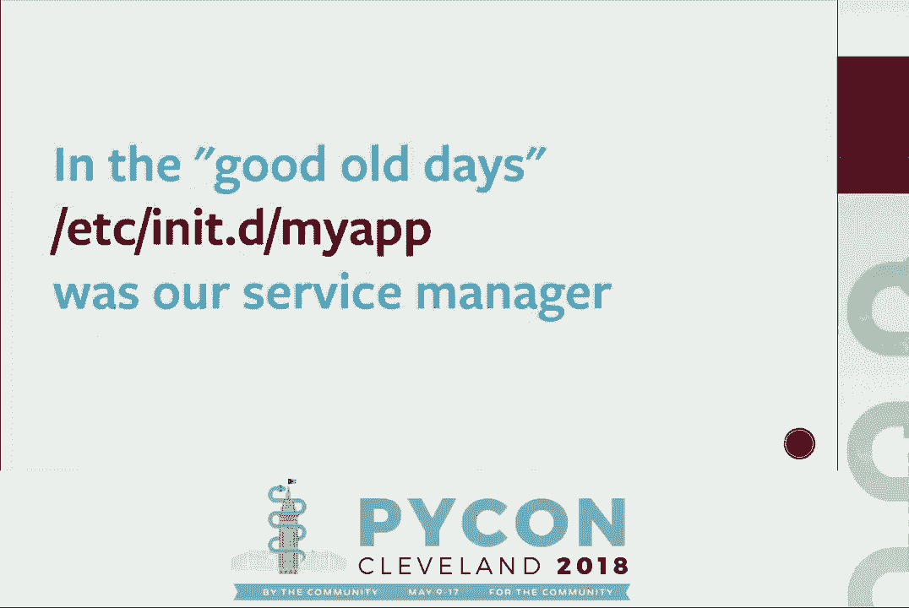

 manager per se。 So you have to be your own service manager。 And the way that you do this is you wrote shell script that I hope that looks good but。 where basically in this shell script you define the operation that you needed to do。 For instance here you have start， stop， restart and for some reason， force reload is the same。

 thing after start。 And you wrote this in shell。 This was a look or this was a good thing in general because if you are writing shell。 script that means that you can write whatever you want。 If you want to start your service in a certain way， nobody is telling you how to do it， you。 have to do it by yourself。 The problem with freedom in this sense is that for instance in that weird section over。

 there that you see， the only line that's actually starting the service is the line 110 and everything。 else is just boilerplate code。 You have argument parsing。 you have print output and all the things that you needed to， do to make a fully functional program。 And you do this for all of your units on your server。

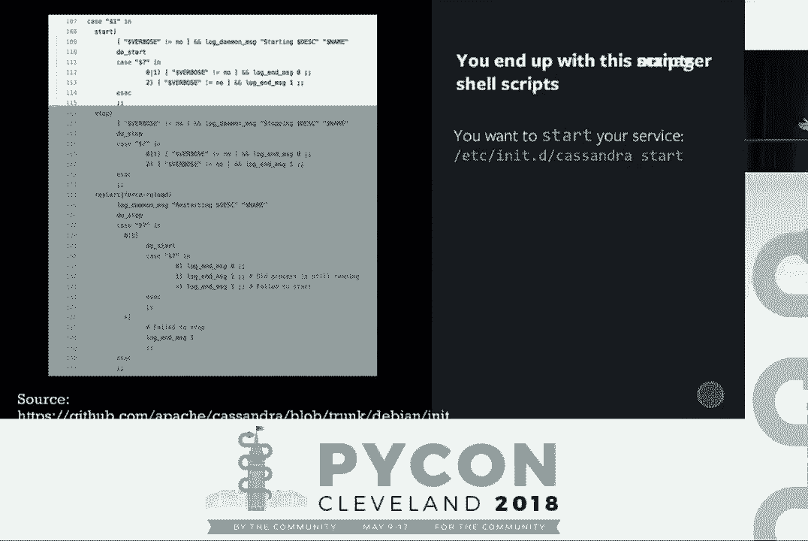

 So this was good but yeah。 So then came system D。 It was obvious for a long time for the units community and other architecture communities。 that even though system 5 was good enough for what we have， we needed a change to be able。 to grow servers faster and have better startup times。 So as always happens。 at least two things arise。 One was after the other was system D and probably I'm forgetting the one service manager that。

 people really like。 But yeah， so these two were like the big one。 And as usually this happened。 they went into a little war and system D at the end won basically。 And by one。 I mean that is part of all major distribution。 I'm not saying that it's better。 I'm just saying that it's there。 So that's kind of the first spirit that I want to show you and that's the spirit of。

 this talk。 It's not extremely good。 It's more like system D is a part of your server。 It's part of there， how can we use it to do our things better。 So what makes it so different。 so low and capable for many people。 Basically where you used to have a shell script。 now you have unit files。

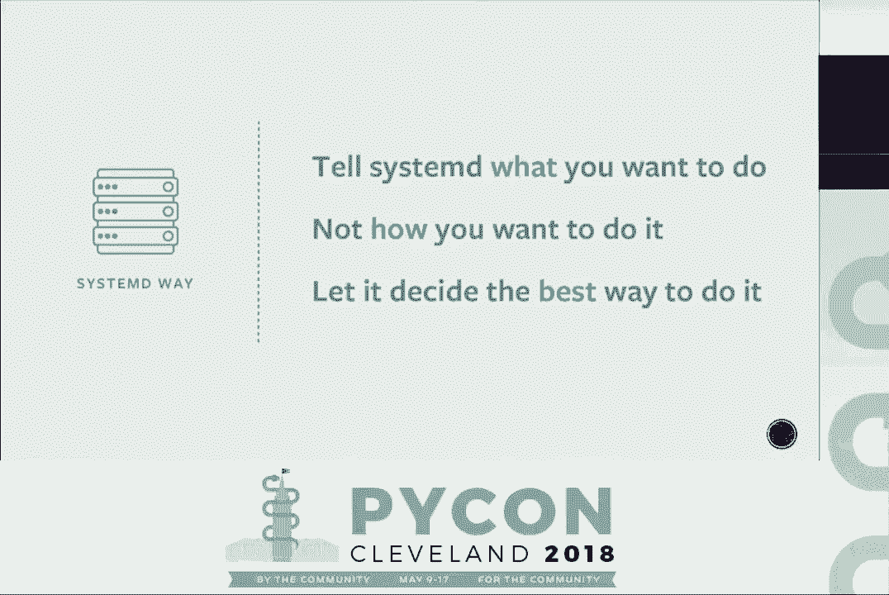

 So you now don't have executable things， you just now have the clarity of things。 Basically you write this unit file and if you're running a service， it's called a service， file。 And where you specify how your service should look like and then you let system D configure。 your service as it should。 So this is not the execute level， you cannot just dot and run that file。

 So you need something to execute it。 And I hope that really looks good。 So if you want to start your service， you ask it to start it for you。 You don't do it yourself and this is a completely change of part of you。 You say system CTL。 start my service。 If you want to stop it， you do system CTL， stop my service。 If you remember。

 I didn't specify how to stop my service。 But since this is a unique service。 system D kind of know how the thing should be done。 So I didn't need to wrote that algorithm。 But if you really ask me the reason why I think system D is the fact that in its system or。 service manager or most services， or most service is because if you ask for a status。

 for information for your service， it gives it to you。 And this is something that you think。 like it's obvious， but it's before system D was， not possible。 Things like， is my service running？

 It makes sense that system D can tell you that information because it can discharge yourself。 So he created the first fork， exec， he knows the piece of your main application。 So he can keep track of it。 He can tell you when your service starts。 And now you know that these two things are actually real。 In system five， when you ask service。

 the name of the service status， it says running。 But it didn't tell you like when or all those information。 It also gives you a little piece of data that before system D was actually not possible to。 get entirely。 That is all the processes that are running within your service。 And I explain this right away when I explain the concept of C group。

 So this would not be a system D talk if I did not talk about two things。 The first one is socket activation and the second one is C group。 So let's at least tackle one。 A C group。 Sorry。 A C group is basically a linear scan of feature that allows you to impose restriction on a。 certain list of process。 So in common language， it's like I have a process and I want to say you can only use。

 40% of CPU， 10 megabytes of RAM。 You can only access this type of memory or CPU IO。 Sorry。 or IO like this IO。 That's what C groups allows you to do。 And you see groups for this purpose but also for a slightly different purpose。 So C 10 D before starting your service， it will create a C group just for that service。

 So system slides， my app service， that's the name of the C group。 And the convention of C 10 D specific， it doesn't have to do anything with C groups。 It's just a name。 So then start your service。 Then if your main process starts to child processes。 these processes are also going to， be part of the process tree。

 So if you go into the main process and then look at the process tree， you're going to。 see these two child processes。 But you can also instead of doing that。 go through the C group and then list all the， processes in the C group and you're still going to see them。 But here's where it's cool because if one of the child processes decide to double fork。

 itself and then demonize and escape the parent， it will no longer be part of the process tree。 So in a regular point of view， you will lose sight of it。 But since it cannot escape the C group。 system D can still tell that demon spawned by main， process is part of the service。 So for the first time in all of Linux history， we were able to actually kill a service in。

 his entirety。 Because now we don't have to keep track of individual process。 We just say C group。 goodbye。 And then everything goes。 So I hope you like my explanation of C groups。 Let's move on to now what cool things can we do with system D。

 So the first thing that I want to show you is template。 And so a template， and again。 I hope this looks， a template is basically a unit file。 The same。 but instead of having the name myapp。service is myapp@。service。 And then in your file。 you put this upper sent， sorry， this percentage Y。

 So then when you want to start your service， you start your service as myapp@ and then award。 It doesn't matter which one it is。 In this case， I put the configuration name。 So what system D will do is that it will replace that percentage Y with the word that。 you put there。 So this is cool because if you have， for instance， this is UIC。

 which I'm pretty sure most of us， are familiar with， if you have UIC point， sorry。 the configuration point to different version， of your app， you can actually do roll up with this。 So you can start myapp@version1conf and then start myapp@version2conf， have two of them running。 with your A/B testing。 And when you decided that one is good， you take out one and leave the other。

 Or you can roll back by just stopping the other one。 So this is actually a cool feature that you should get overlooked as a toy thing， but it's。 really powerful。
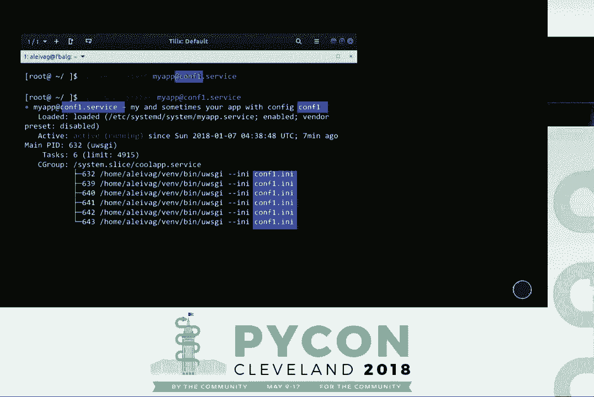

 As I said， this would not be a system D talk if I didn't talk about socket activation and。
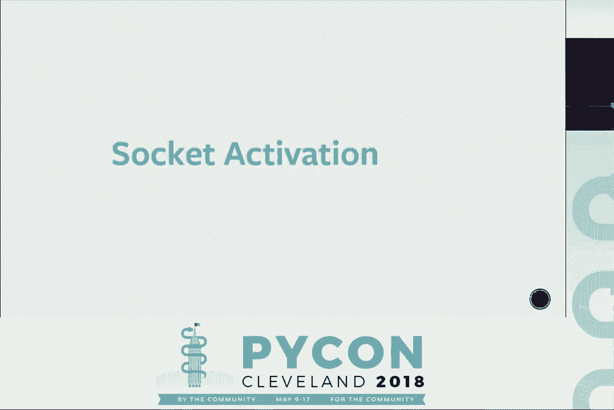

 secret。 That's about socket activation。 I'm going to say something that is obvious to everybody。 And it's like before when you don't do socket activation and you want to do network， you。 start your application， then eventually your application will open a port， we start listening。 to a port for AT。 And then this port will become an open file for your application。

 And this little piece of data is really important。 Then you will get a request and then you will see back a response。 This thing has an implicit contract， then since the port is an open file of your application。 if your application goes down， the port is closed or it's not listened or whatever you。

 want to name it。 So if somebody sent your request， you can send an answer。 So socket activation works， change the logic of application port request。 In socket activation。 system D will start and he will start listening to your port。 So instead of you starting to listen on port AT， system D will start listening to you。

 An open in a port is basically lightning fast。 Then you will get a request。 So you have port request。 And only when you request system D will activate your service。 So socket activation， you get it。 And then system D will just gladly pass the file descriptor to your app。 So this file descriptor is something that has already been been and has already been。

 listened to it。 So your application， all it needs to do is read and accept the connection。 And then you can send a response back。 This gives you a lot of flexibility and options。 The first one that it allows you to， but even in production， but in your dev server or in。 your laptop， if you're developing and some of you're developing， use MySQL as a back-end。

 You don't have to have MySQL always run。 You just have it running the first time that you hit a test that will go to your MySQL。 That's kind of the point。 So save resources and only activate the stuff that you want。 The other thing is that since this program that leads into the port and the program that。 actually accept the connection are different， you can start your program as root。

 And I assume that everybody renamed his root user as Widdle。 So， bad jokes。 If you like bad jokes。 this is going to be the percentage for you。 So， okay， back on track。 System D will start your port and system D runs as root。 It can be into any port in the system。 But then your application can run as a normal user。

 And the cool thing about this is that without this， your application has to start as root。 run into the port and then either drop privilege or start a process with a different user。 Right now， the application from the beginning doesn't have all the privileges that it wants。 So that's another thing that is cool。 And finally， if you run only model Linux。

 you can use SO port reuse and then you can have， for instance running the first version of your application。 like I say， and then you can， ask system D to start the second version of your application but also listening to the。 port。 So， this is an option of the kernel like SO port reuse。 I won't go into it but go and dig it because it's really cool。 So。

 then you will have your two applications running and again， you do A/V testing and when。 you're ready to say that version two is up for production， you just made it the final。
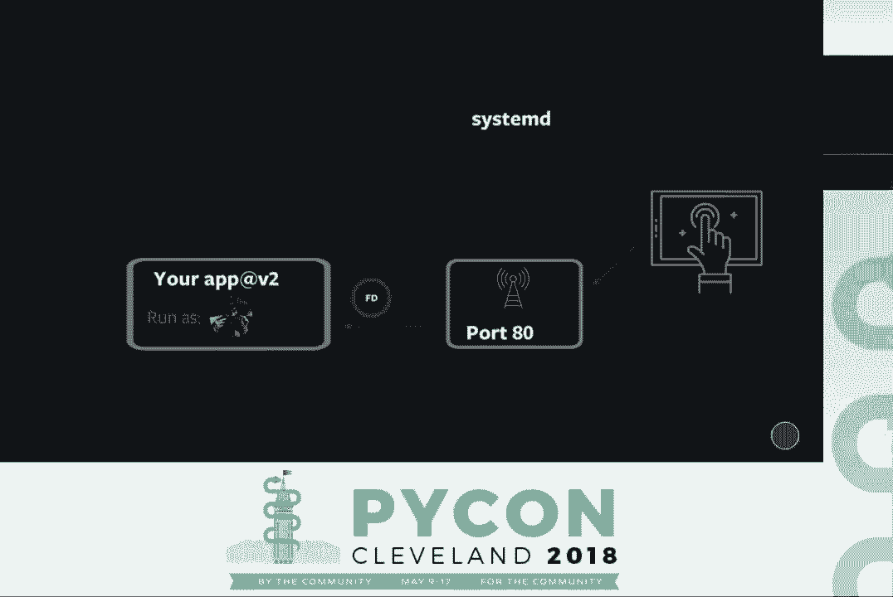

 one。 Cool。 So， how do we make this possible？ It's simple。 The service files remain almost in touch。 The important thing is that now you create a socket file where you specify what do you。 want to listen and you start the socket file as you will start any service。
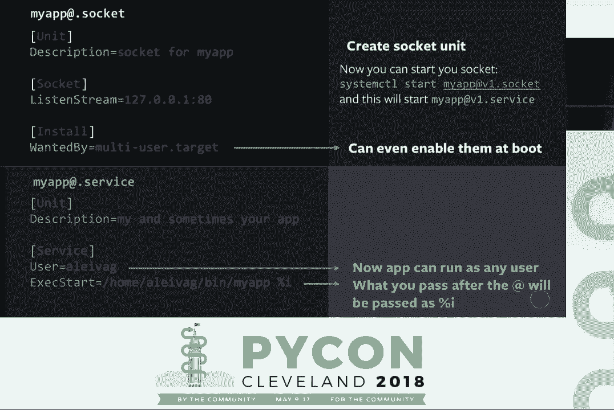

 Now， in your code， since you would normally do open a socket， be into a board and execute， a listen。 Then all the things are already done for you or system D。 What you need to do is instead。 of doing that， you just socket from FD instead of socket。 socket， you open a file descriptor。 and that file descriptor is the one that was handed to you by system D。

 You see that there is a library there that's called PISTM D and that's my library that I。
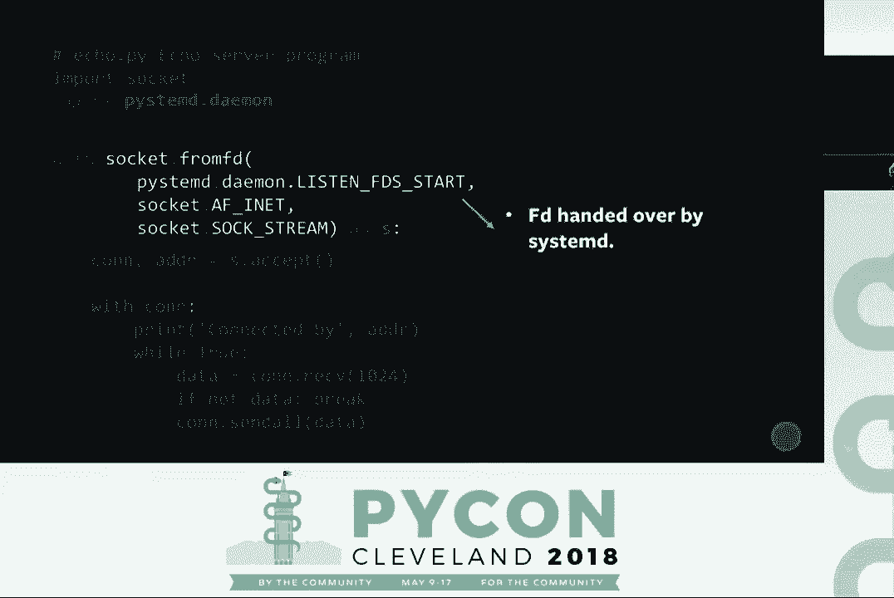

 created。 So， say way into my library。 And Python， sorry， in Facebook。 we use a lot of Python and we use a lot of system D。 So basically。 we create a library to be able to interact with system D in the same way that。 does an involved executing to process。call all the time。 So。

 we basically do a divas interface to system D。
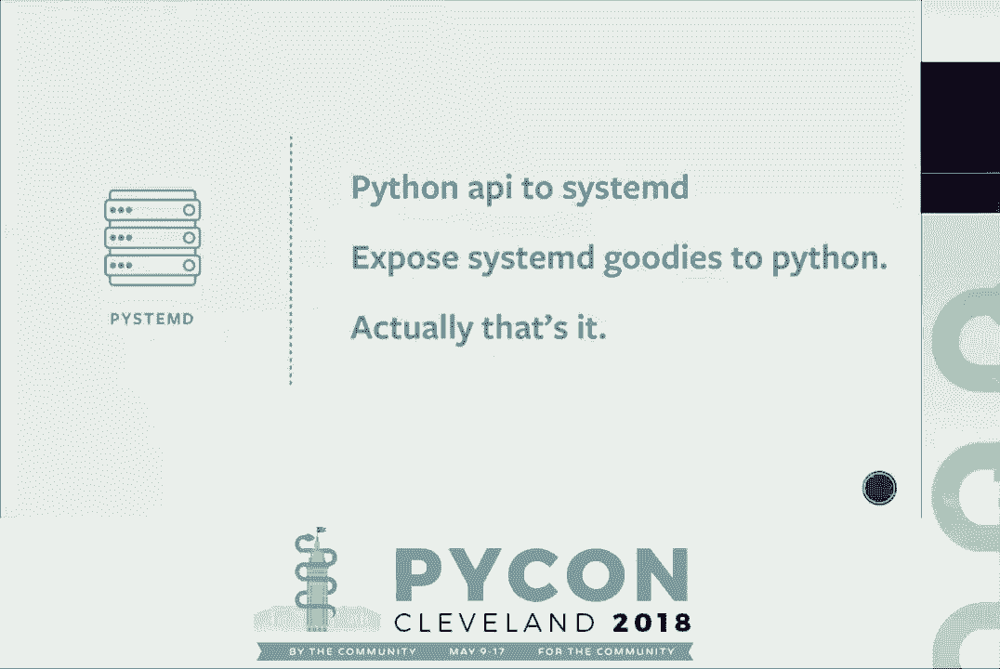

 Now does it work？ I'm sure that everybody can read that great thing。 You PIP install PISTM D。 You hope that's better。 You import it as you would normally import it。 And then if you have a unit on your service， you just load it like that and then you can。 start and stop and do all the operations that you want。 Nothing fancier。

 If you want to get information from your running service， you can also get it。 So first thing you can get the main app， the main PID。 And since this is not executing a shell and then parsing the text out and giving you something。 that main PID is an integer because we talk over divas， divas knows about types， so you。

 get it at school。 And if you want to get the list of process， you can get it。
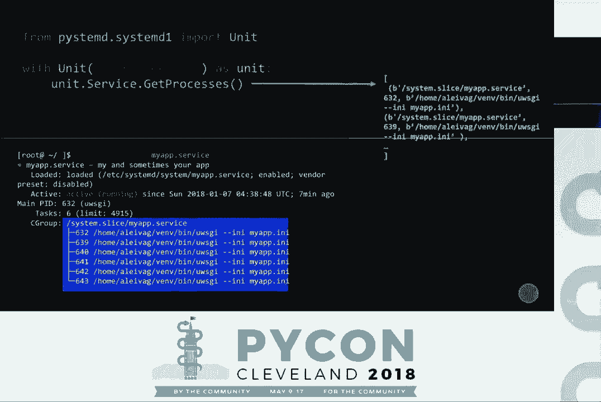

 And that concludes the first part of the presentation。 I'm going to move to a demo。 So we're going to have your system D with PISTM D。
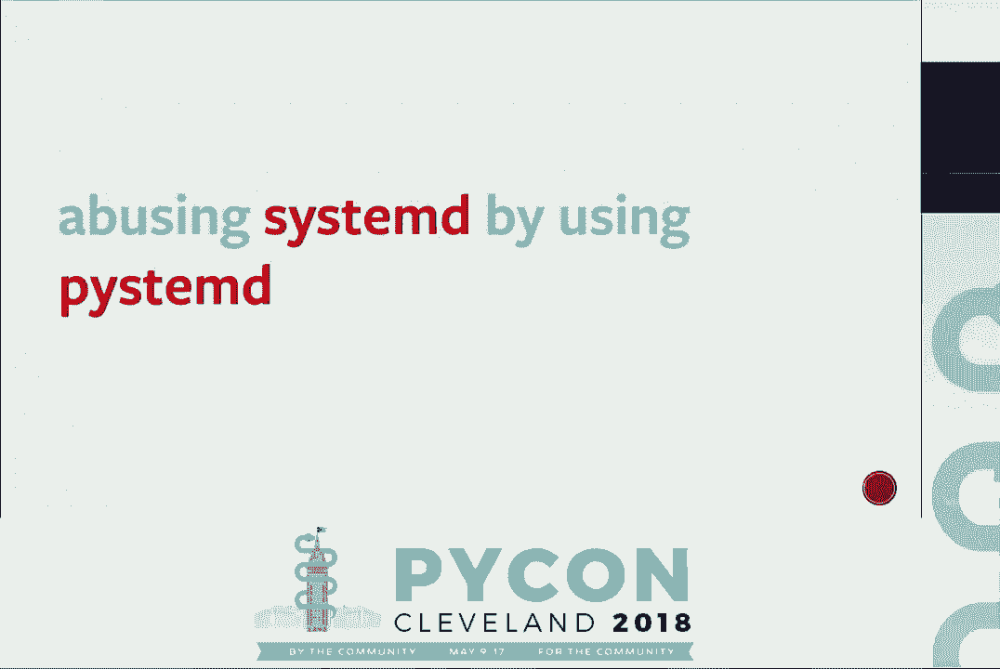

 And I want to show you a few things that cannot make a -- I hope。 In general application。 if you want to execute a shell command， the thing that you will do， is process。call， right？

 So first is if I want to execute sleep， I will execute it。 And then you will see， like right there。 there is a child of the parent process that I created。 This has three consequences。 The first consequences is that it's run as the same user of my application。 That means that it has all the same privileges that my application has。

 The second thing is that it runs as the same C group， so it has the same view of the system。 And the third thing is that it has the -- if the parent goes away， the children also goes。
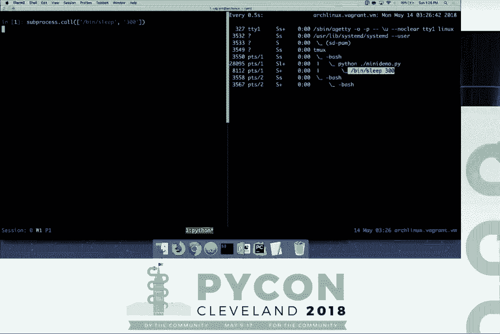

 away。 So running a process sounds a lot like starting a service。

 So instead of doing that， C10D provides a nice feature that is called a transient unit。 So instead of restarting a service that means creating a unit file and reload it， I can。 actually execute PISTM D。run。 Everything that you saw there is that it returns right away and it returns what it's supposed。 to be a unit file。 Let me start that。 The second thing that you see is that it's created as its own process。

 It's not part of the process three。 It's away。 So this is cool because all this restriction that we just took goes away。 I'm going to go as far as saying that almost all the calls that you make to do in your service。 can be replaced with PISTM D。run on Linux。 It will not work on other things different than Linux。 But yeah。 So that's cool。 Okay。 So let's see what happened。

 So the thing that happened is that I system D actually created a unit for me and it started。 as a different service。 That means that if I go here and just cut that file。 you will see that it gives me a unit， file that I didn't create and as it should be。 it's in run system D transient unit。 So with this， I can execute stuff with this and it will run。

 see the unit file that was， created and then I can see how can do the same thing with my normal service。 So let me go there。 Okay。 What other things can we do？

 So this is one thing that I think it's cool and is like I can actually start a batch process。 So if you see， I'm still on my mini demo right there that you see。 But for some reason。 I created a batch process。 I added a PTY and then I linked together the StvN and StvOut。 Really magic and I only did it with this command over here that you can see。

 You see this should give you a little bit。 So StvN StvOut。 PTY true and I give it a name and I give it a name and here I can show。
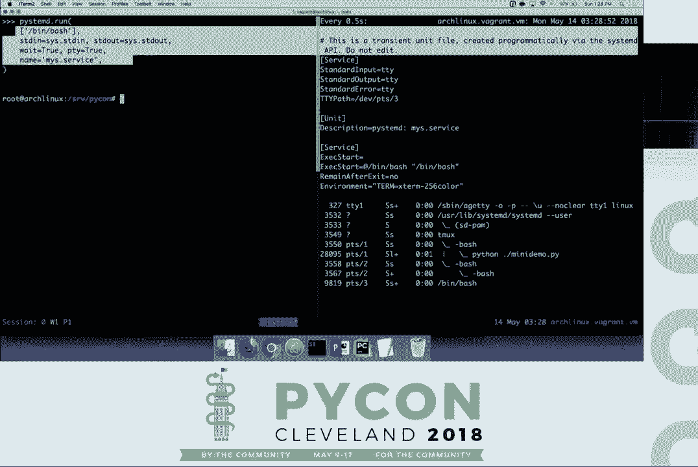

 you the， you see the service unit that would be created for that。
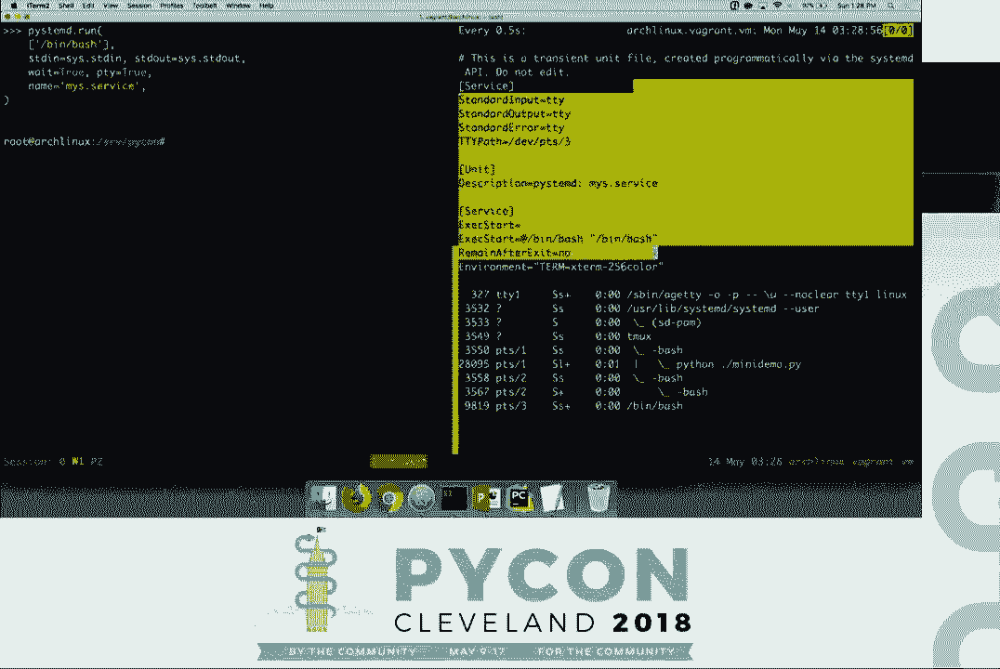

 So this is a normal shell and I can do stuff like， and actually verify that this is what。 I'm running。
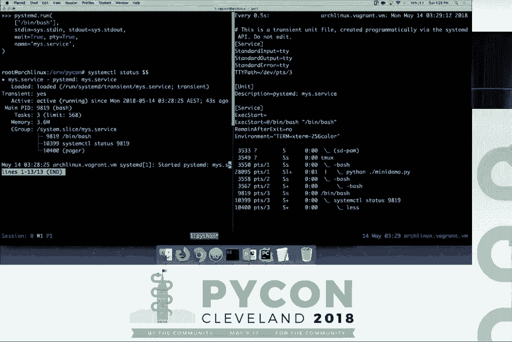

 So I can do all this kind of stuff。 And here is the first thing that I think it。 why this indeed run is better than suppressive， the call for some things is that I can do with this。 If I want to run this as a different user， right， all I need to do is just add user at。 end and then the name of the user。 And then as you see my shell。

 it's running as the background user and this is how you， accomplish that。 If you。 instead of doing from PTY。code， you start from a service file， this is how you， will do it。 So this is actually cool because now in your program you can execute pieces of code and， privilege。 So let's see what other cool things can with them。

 And I will start going relatively fast until I run out of time and showing different settings。 The settings you can use it in any combination that you like and most of them have more。 different versions of configuration。 But the ones that I'm showing you are meant to give you a curiosity and go and read the。 man page， see all the blog posts， send me messages on messenger or Instagram。

 If you care about my cat， I don't have cats。 I have sons。 Okay。 Okay。 So the first one is Protecom。 Protecom is actually a quite good idea and it's the link is the following。 You start your young application。 Why would your young application have access to the SSH keys or the AWS credential to your。 users？ So what Protecom does is that it literally will take away for your service。 Just service。

 It will not have anything underneath home and route。 So that means that now if somebody had your service， it get limited exposure to your application。 And that， if you ask me， I think it's really cool。 Now， Django。 and I say Django because I'm Instagram and we work a lot with Django。

 Django has one thing where it just read templates， read data from back end and then expose it。 to the wire。 So it actually doesn't need to write information into disk。 So the second option is Protecom is System Street。 And what that does is that it tries to make your whole system read only。 So that way your service。

 only your service， can not write anywhere， not even in temporal， directory。 Of course。 you can modify this and there are different options。 But yeah。 So this is one cool thing that you can do。

 Okay。 So the next one that you can do， it's a little longer and I just put all of them together。 is that even though Protecom and Protec systems are cool， they are really like catch all， back。 Like sometimes I want to have a few pieces， not all of them。 So you can have like a part of that。 One part is you can have read only directories。 So I can specify which directories I want to be read only。

 So I can say， "grow directory。"， You can read it because I need you to access my AWS credentials。 But don't write into it because don't。 In accessible directories is the same thing that you saw。 It just goes away。 And write directories， I don't have to explain it。 It's just obvious。 Okay。 Private TMP， it works awesome because it's for your service， it gives a private version。

 of what would be the TMP directory。 So we don't share the same TMP as the rest of the system does。 So you can put stuff there or other service， can put stuff on their TMP and they won't， collide。 You can do the same thing with any directory when you specify with temporal file system。

 So if you see， it will mount barcode to my S， as a temporal file system as a TMP FS。 The cool thing about these two features is that once your service is down， all the temporal。 files that you created are also going away。 So this is one of the prerelated that you have when you let system manager service。 The two last ones that I have here， it's one thing that most people don't know that， they can do。

 You can beam path for your application。 So what I can do is。 I can make believe my application that barlib， my S， leave over， there is actually SRV icon。 So these two directories are actually， but only for my service， not everybody else。 And then you can read only path。 It's of course you can mount it， but mount it as read only。

 But here's the cool thing。 What I mounted here is not a folder。 It's a file。 So you can also mount files。 And you can also do this with mount operation。 The problem is that that idea is kind of weird to people。 It's also weird。 But yeah。 so you can do that。

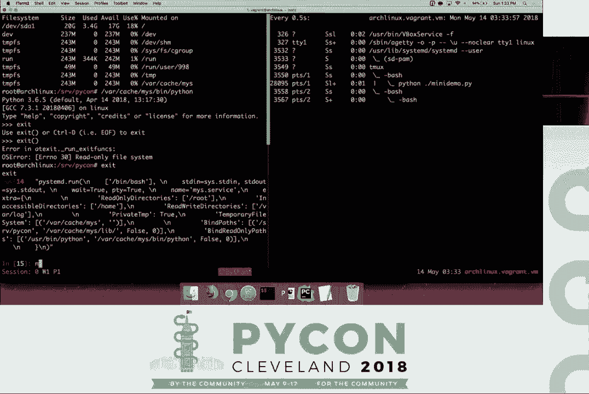

 Let's move next。 Oh， this one is cool。 And I'm glad I still have time to show you this。 So how about you？ We talk about disk。 We talk about permissions。 How about network access？

 So what this does is that I'm running batch and I have there， you can sell to your service。 and just to your service。 Hey， I don't want you to access anything on the internet or anything access you except。 IP 88832。 So now what I have here is an application that can only， we can do more than ping， but。 it can only ping 888 and if I try to point for four， it will tell me operation not permitted。

 because I cannot even create it。 So you can have a firewall just for your service。 This is system D。 System D only gives you access to it through Python。 It says， I don't do anything special already。 So that's cool。 There are other options more restrictive to that， but that one was cool。 And then the cool one， again， this is system D。 These are C groups。

 Let's see how system D use C group。 Here I have a unit that basically I said use 20% of CPU。 only use 10 megabytes of RAM， and you're only allowed to spawn five processes。 So let me show you what that means。 So right here。 if you see I have the memory limit and then the task limit。

 The task limit means that I can only have up to five running process at a certain time。 Or let's say like this， I can only fork five times at a time if that makes sense。 Okay。 The only one that I want to show you here to explain is the CPU。

 You have to be limited that the other ones work。 So I will do a simple Python program that I have been doing since I learned to code。 That is just basically using all the CPU that I can。 So if you see right there is that I'm trying to use all the CPU that I can。 And if you see that nice number that doesn't go too much above 20， rounding stuff like that。

 Accounting is not really the best thing that you can do。 So it goes like that。 And that's how you restrict。 And oh， I will do something。 I will try to overflow and turn。 And if you see there it says kill it。 So the Ummatini was also smart enough to know that this is the thing to kill because this。 is the one that is actually violating your things。 And I'm going to go to a nice stop here。

 There are more things to know to show。 I just want to show the last thing but I want to explain it。 Oh， of course， of course， of course something has to be to go over and yeah， we're done。 Thank you。 That was it。 Honestly， I'm here for questions。 I'm just not on stage。 So。 ping me if you have anything。 Thank you guys for coming。 [APPLAUSE]。

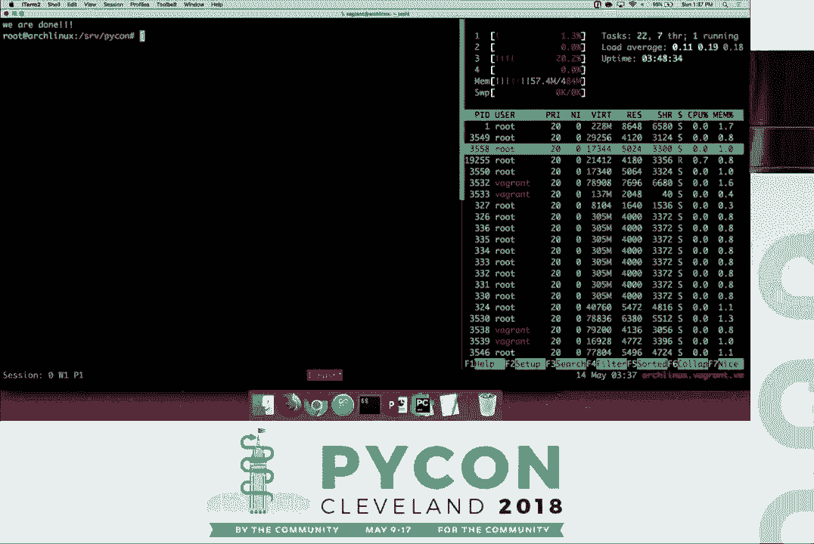