# P11：Kushal Das - Building reproducible Python applications for secured environments - leosan - BV1qt411g7JH

 Hello， Pythonistas。 This is the welcome to the last session of the day。 Here is， Kushal Das。 He's going to talk today about building reproducible Python application for。

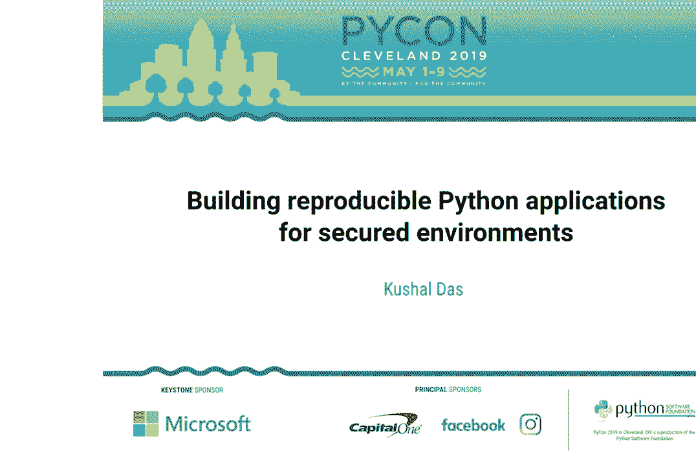

 secure environments。 So it's the stages you ask Kushal。
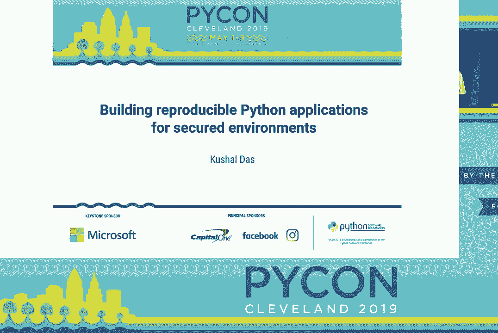

 Thank you。 Hello。 Can you hear me？ Well， okay。 Before I start talking， I want to give a shout out。 to my friends at Chicago， Python user group。 Hi， all my friends there。 And let's start。

 Before anything else， a little bit about myself。 I'm a public interest technologist with a。 small nonprofit called Freedom of the Press Foundation， where we try to protect， defend。

 and empower public interest journalism。 So we mostly work with different kind of media， orgs。 We do digital security training。 We write software。 We help them to make their， security better。

 I'm also heavily involved with various other nonprofits and opens/free， software projects。 One of them is something we all know here， Python Software Foundation。

 I'm a director at Python Software Foundation， also a core developer of the C Python， the。 programming language itself。 And I'm also a core member of another nonprofit/project known， as Tor。

 where we try to make sure that our human rights can get defended and we can maintain， our privacy。 So I'm going to start the actual materials of the talk now。 So I'm going to。

 guess that many of us are here Python developers。 But you're going to learn about one thing。
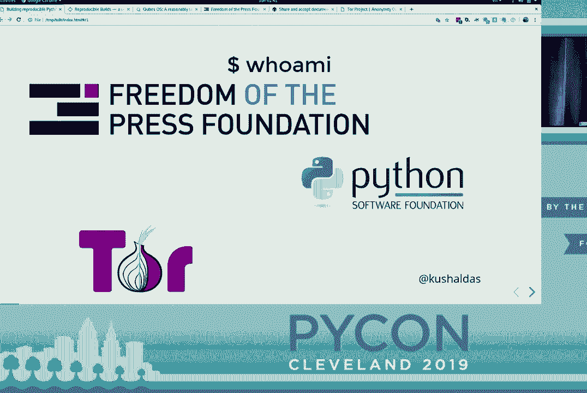

 that this whole talk， we're not going to talk about anything new tools or new systems。 We're。 going to make sure that we're going to reuse whatever is already available to us from the。

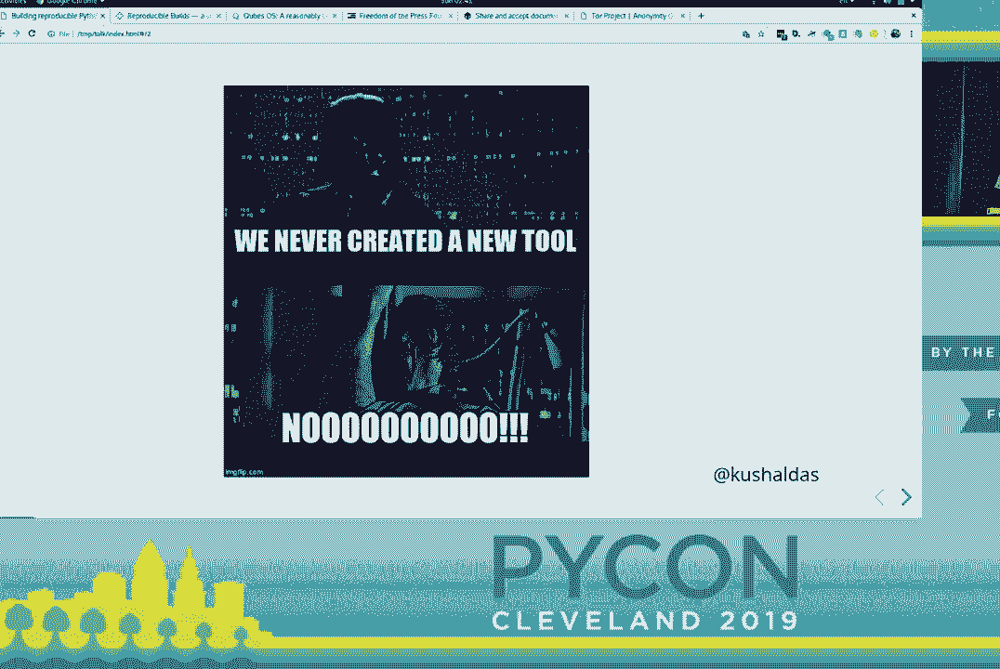

 community。 So a very simple Python application。 I'm going to just use it as an example。 And。 as developers， we always think it works on my laptop and job done。 But as we know that。

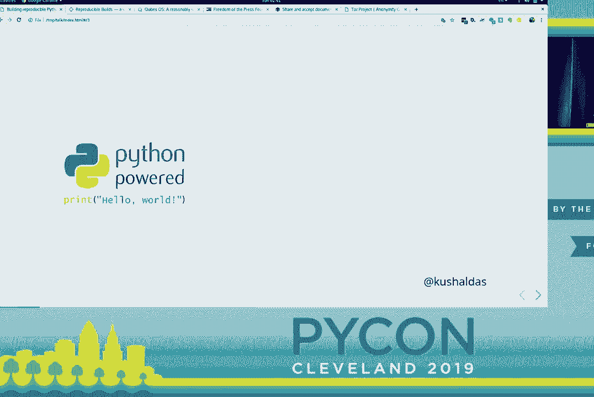

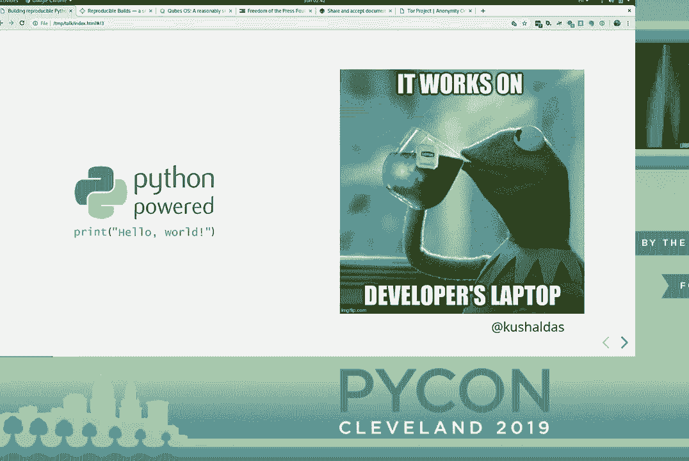

 organizations and companies do not work in the same way。 So for the same Python application。 we may run it on one server。 We may execute/run it on different servers or this magical thing。

 also known as cloud。 There are different ways this applications get into this server/computers/cloud。 One of the easiest step is to use the source code management system itself。 I'm going to。

 mention Git because that's one of the most highest used in these days， commonly。 Then。 if you're on a Debian/wontoworld， you may want to use 。dev， Debian packages。 If you're。

 coming from a Fedora/centoise/redhead world， you may want to use rpm to deploy your final。 application。 At this moment， many of you must be thinking that there is another way of deploying。

 in the modern world。 Sadly， this is not the right talk for the -- I'm going to talk mostly。 related to things on the Python world。 A little bit about the actual project。 So I'm a maintainer。

 for a project known as secure drop， which is an open source whistle-blower platform。 It。 means anyone can securely and privately leak information to different media orgs so that。

 they don't get caught by， let's say， their respective governments or any three or four。 letter government agencies。 Secure drop is deployed over 75 media orgs， including New， York Times。

 Washington Post， Guardian， Intercept， and various other orgs。 So this is what the。 sources see when they go and try to leak information over to our browser。 The journalists in those。

 organizations， they have to get into a locked room inside their org and boot a tail's operating。
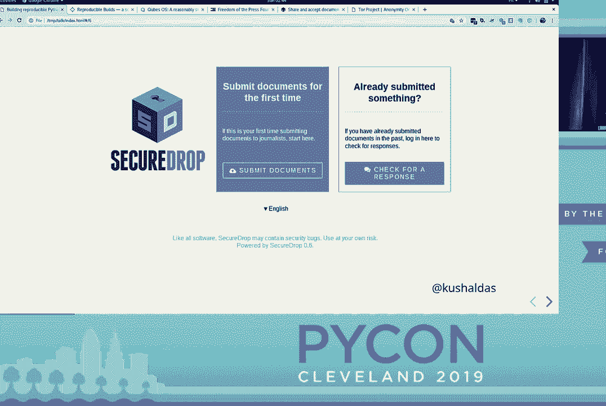

 system based laptop where they will see something like this。 You can think like this as an inbox。 correct， where you can see different random names， where you can click and download any。

 of the material or messages。 But the part of the story is these all documents are encrypted。 with a key which is not available on the same laptop， which is there in a second computer。

 which is air gapped。 Means now the journalist has to somehow take those documents using。 either a USB key or write once， CD-ROM/DBDRIVE and then bring it to the next computer and。

 like decrypt those files and then view the documents。 And this whole process is kind。 of taking time。 It takes almost like 40 to 45 minutes for every journalist to go through。

 the documents they want to view。 So it brings up a question between security and usability。
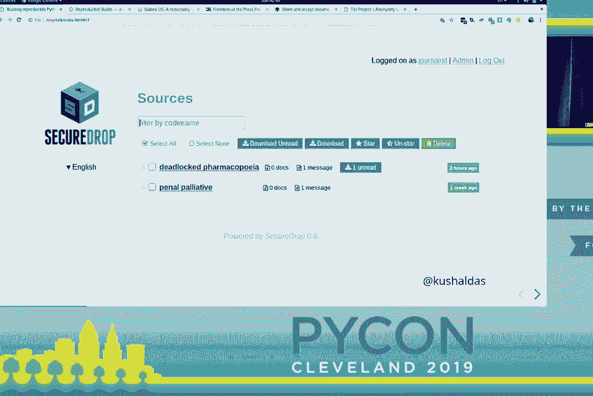

 because in like our case， the nature of the kind of post or project secure drop works。 nation state actors are always a pretty good as a advisory for this project。 So we have。

 to choose between two and in this particular case we should always try to get some help。
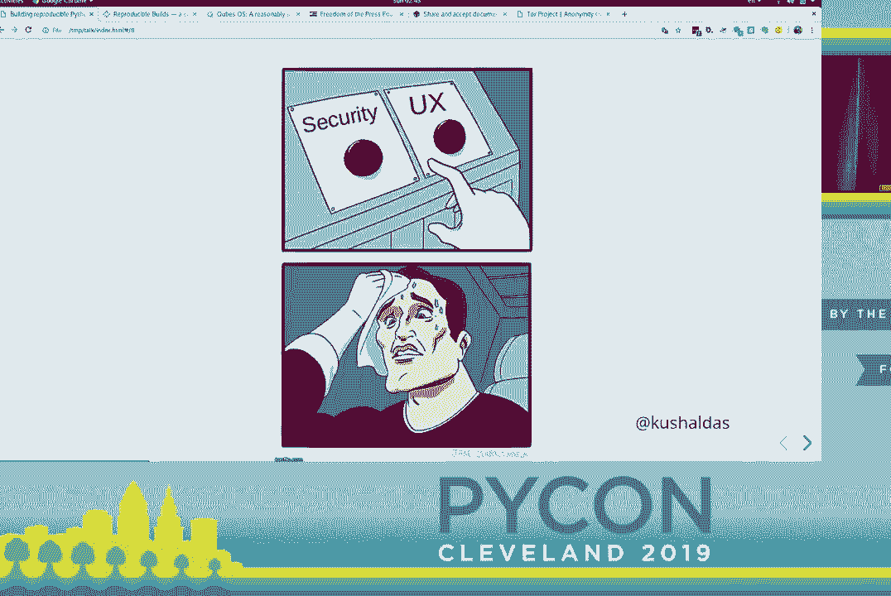

 from professionals。 Luckily for secure drop project we got someone named Nina who really。 helped us to build the next steps and we have something like this which is in the alpha level。

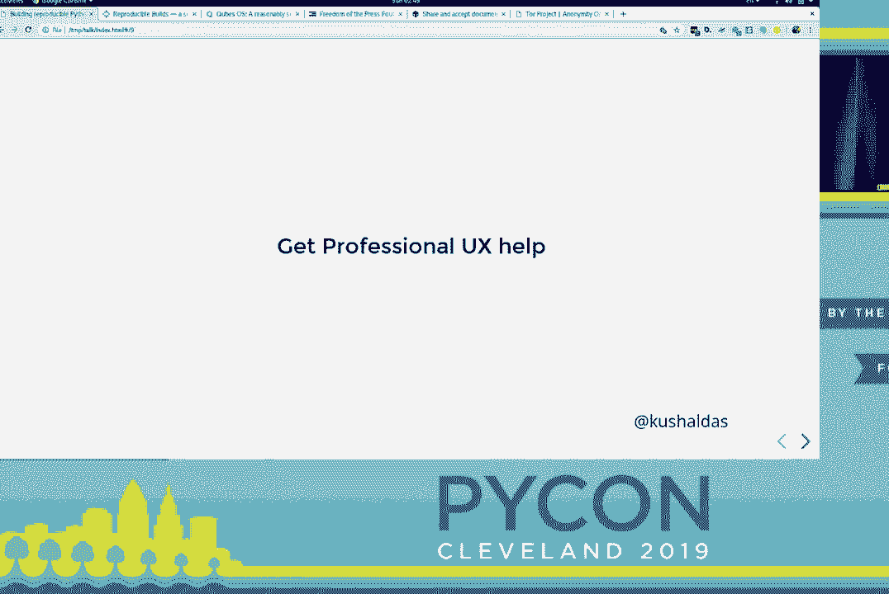

 which is a desktop application for the journalist and from the look and view you can understand。 it's just another normal application but that's get deployed on a special operating system。

 known as cubes。 Cubes-OS。org is the website。 Cubes is a reasonably secure operating system。 which uses federal slash zen to build up a such a system where each and every application。

 may run in different VMs and within the same laptop or desktop you can actually have air。 gap VMs where you can store your private keys and details。 So this really brings in。

 the both worlds little bit nearby the security and usability and that's the future we are。 looking at and we particularly deploy this application in using Debian packages。 So for。

 the rest of the talk when I will say Debian packages or Debian that means a Debian VM。 inside of cubes-OS in a computer。 Now the question is what all things can go wrong security。

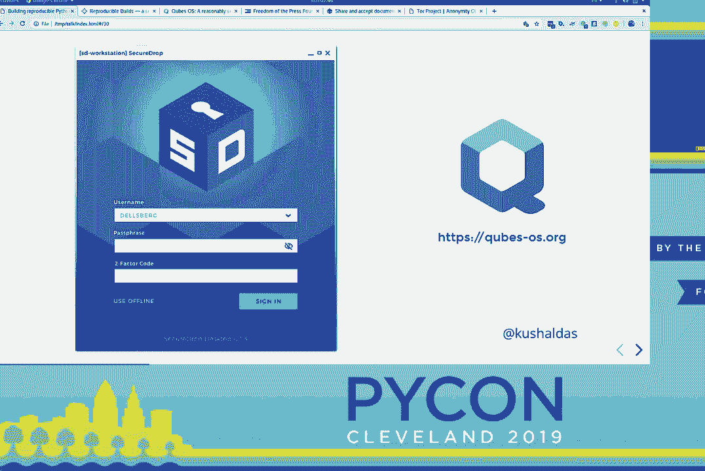

 wise。 I'm sure all of you have different ideas and different stories。 I'm going to take a。 few of those which recently came in my mind to share with all of you。 A few months ago。

 Asus figured out that their signing keys were taken over by some attackers and they managed。 to sign some malware and post across to multiple millions of people's computer I guess。 There。

 is another example in another programming language world where is a really important used library。 got malware and in our Python world if we see in last year in 2018 there are some tries to put。

 in malware using some type of squating where people wrote a project which is almost similar。 name of a known project and they tried to put in some malware which in turn tried to steal。

 Bitcoin wallet addresses and details。 Those are the few like three examples I put in here。 but this is not the end of our attack sites。 A few years ago this particular gentleman。

 Mr。 Edwards Snowden also talked about a document IHUNC that means that particular document is。 about few let's say three later government agency folks who loves to visit different。

 conferences and at the same time try to find C-sad means to various infrastructure and get。 their credentials so that in turn they can own those infrastructure and figure out and。

 decide whom to kill next part of the mission。 I don't know to make you paranoid but it might。 also happen that some people such people may be sitting just beside you or behind you。

 The threads so all the points I mentioned one after we can summarize them into four simple， points。 The source can contain malware let's say that someone got access to the developer's laptop。

 and change some code which developer never noticed of our dependencies or the source is totally。 changed。 Bineries can be replaced with malware if the adversary is powerful they can do man。

 in the middle attacks while you are downloading the source of binary。 The storage of the web。 server or in case let's say the whole infrastructure can be compromised correct and we all know。

 some stories about these things so we're going to see how we can mitigate these issues。 The。 simplest relation to that starts with one point review your dependencies it's important。

 and I'm going to go into that more。 So as I said we are a Python project we use PPNB a。 lot so PPNB can help us or PPNB whichever way you want to pronounce PPNB helps us to create。

 a requirements。txt which will look something like this where we mentioned the project or。 slash dependency name and the version but we do not want to use this instead we want to。

 use something like this sorry for the size thing because you know not fit in one line。 So it's basically the project name the version number and a SAR 256 sum of a binary wheel。

 wheels are the binary package built from the source star balls in our case we want to make。 sure that we can use only the wheels which are built by us that's the end goal part of， it。

 Now to do so as I mentioned in the beginning we never created a new tool instead we have。 a make file you can understand long time Linux users and also a few best slash Python scripts。

 which help us to create all of these one of the step there is called build-wheels this。 is the step you can see that it has four different commands different scripts it's actually。

 running the last script just creates a URL of all the tar balls and the source sorry binary。 wheels we created the first script verify hyphen SAR 256 sum hyphen signature that verifies。

 that the it exactly matches with our signatures or not。 And the build and sync wheels now we。 are going to go in depth to see what we do there。 So we also have a separate file known。

 as p file dot lock it has the source has says and all recursive dependencies so what we。 do is that we create a temporary requirements dot txt with only source file source star ball。

 has says and then in our script we execute this p 3 command which only downloads the source。 star balls you can see that we are telling it do not download any binary wheels get me。

 all the source star balls and then we re verify that and because we are passing hyphen。 require hyphen has says it re verifies that all the has is match then another p 3 command。

 helps us to build this into wheels this is a standard commands from people and we rebuild。 all of those star balls into wheels now at this moment because we have freshly built wheels。

 on the system we can now create this requirements dot txt file which has the start of 56 sums。 of the wheels which we build and the maintainer of the python project that is us we can create。

 a source star ball of our own set up dot pie as this this will have a requirements dot。 txt with our own will signature at this moment many of you may have the question we never。

 check the dependency source code correct we just happily assumed whatever came from pip。 is valid so to actually rectify this step we have a rule and to follow on the rule we。

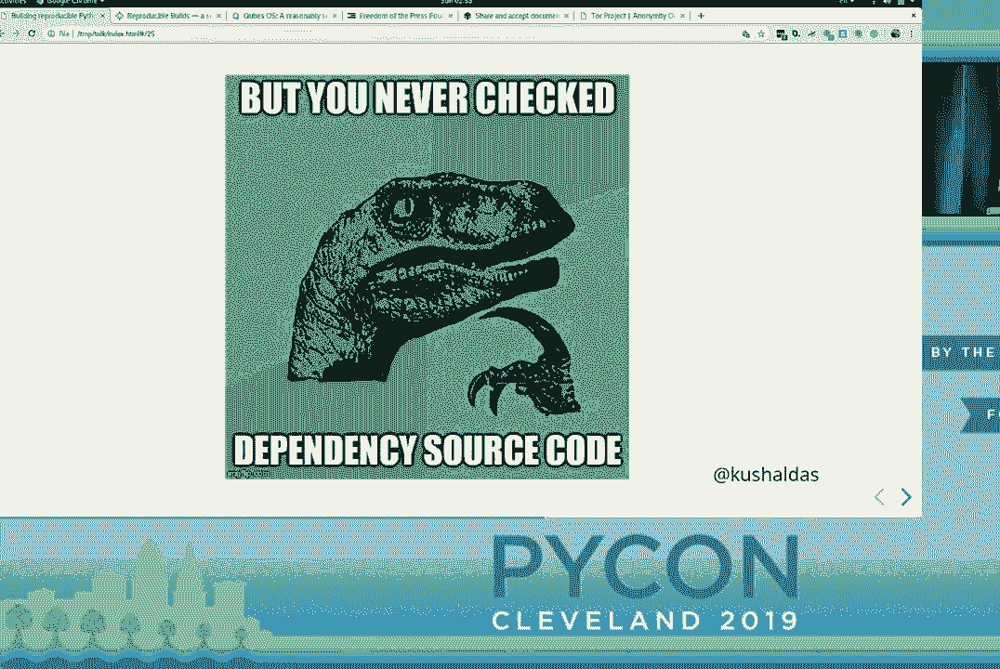

 use a tool called defo scope which helps us to create a diff between two different are。
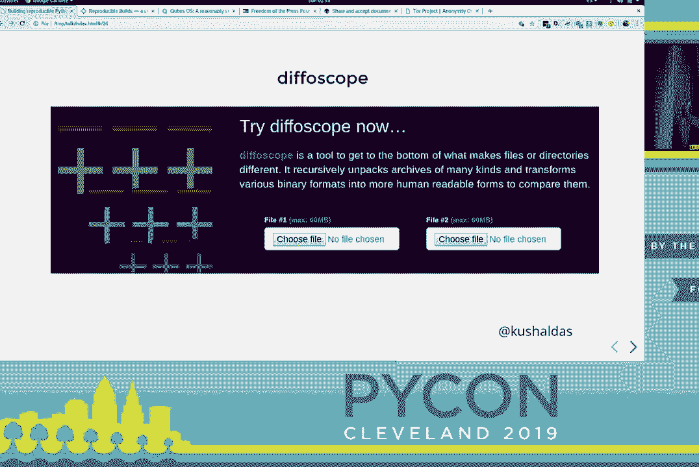

 balls and then at least two human beings two developers manually go through the diff of。 the whole change to verify that this this particular source code turbo doesn't have any。

 malware or any code which is connecting to random sockets on internet or tries to download。 code or let's say doesn't have base 64 encoded lot of data which is not supposed to have so。

 we verify all these steps and then only allow any changes in the updates or the dependencies。 for each and every dependency and we actually store those dependencies in a file called。

 satup 56 sums dot txt you can imagine from the name or that it's just names of all tarpals。 and wheels at the same time the satup 56 sums and then we sign it with our keys which are。

 not on the system all are always either on air gap computers or on hardware tokens and。 we keep the same file sign file there so that anyone can verify and our tools verify the。

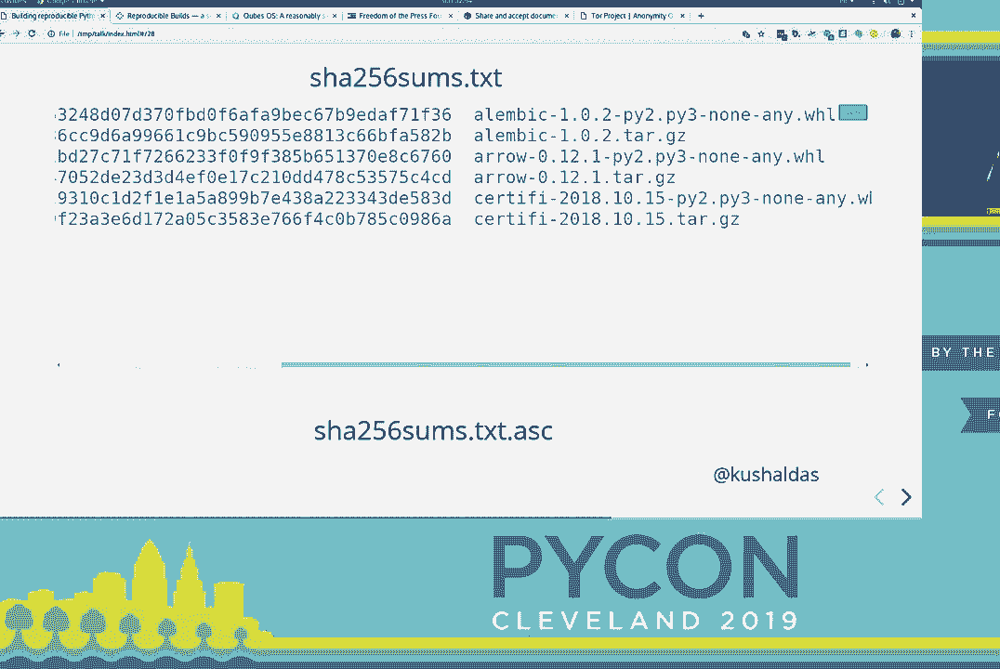

 same couple of times in at this moment we have our source star balls we have the wheels。 now we have to make sure that we can consume those wheels they are different amazing technologies。

 but luckily for us in python world we can just use a simple old technology also known。 as html files we can create some index dot html files which can enable us to create。

 a private repository or says our own repository which will provide p files sorry the tarp。 source star balls and binary wheels and people work if you want to know more later at home。

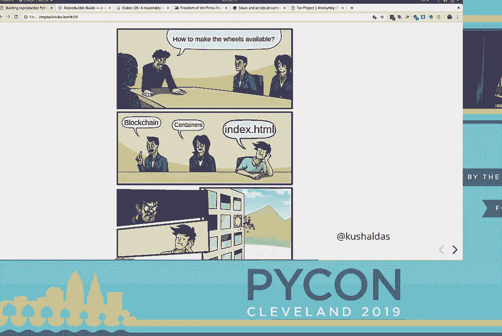

 you can search about this pep pep 503 this has all things in details here are two examples。 this is the index top index page you can see it has just links to different projects and。

 if you go to into any of the projects it will have URLs to the each tarpal and the wheel。 file static files which we can verify commit to github and deploy anywhere we want static。

 files correct up to this we managed to get source code we managed to build them into。
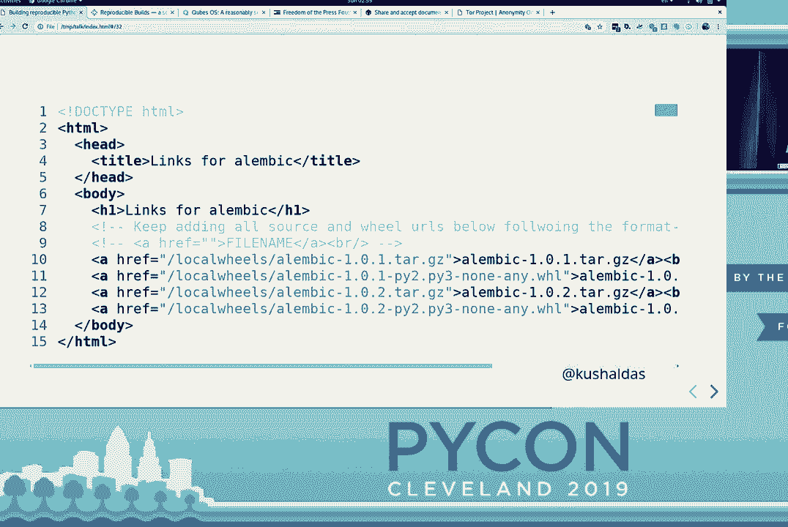

 wheels now let's talk about deploying the actual application how do you want to do this you。 can raise your hand about like you know how many of us already saw this before in life。

 or did this and we can always say that this is dangerous because a python dependency will。 change things into your system python libraries and this may go very bad or sad at the same。

 time so for a remedy we know about virtual environment correct we use it to develop our。 applications what about just packaging the whole virtual environment instead and then。

 we figured out in the last picon that we are not the only people who are thinking about。 this and don't stop actually pointed us to a project named dh-virtual n which is coming。

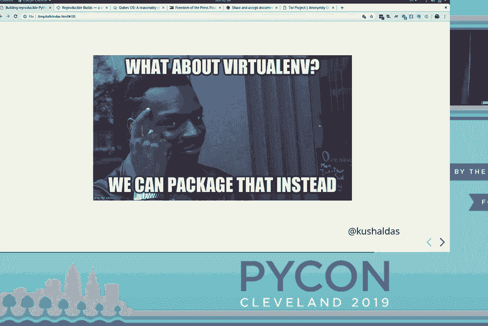

 from spotify an open source project which modifies and adds some extra layers on top。 of debut and packaging so that you can install build and package a whole virtual n for your。

 python application in that way you can actually now control all the python dependencies of。 your application and you can install it easily in a virtual n and you can still package it。

 automatically here is an example of the rules files there is too much of text but if I just。 try to click this line you can see that we are saying we are using python 3。5 setup。tools。

 and the index this is the index we use at secure drop so you can actually open it up in your。 computer later on and find it out and you will also find that this particular make file。

 has four separate commands at the end a couple of fine lines so using those things we try。 to achieve the next level that is reproducible builds this is actually enabled from Debian。

 stretch onwards or Debian versions where it will help us or anyone else to be able to produce。 the exact same artifact from the exact same source code so it doesn't matter if I am building。

 the Debian package today in my laptop or in our production system or if tomorrow you want。 to try to build the same package again we will get the exact same final output all of。

 these things together help us to create a secure usable reproducible builds the things it has。 are authenticity you can actually check who made those builds there is a sign with our。

 keys you can have auditability correct you can have reproducibility to have exact same。 build and outcome that whatever software you are installing for your secured environment。

 are exactly what it's supposed to be not anything fancy now these steps together can help us。 to mitigate those threats we started from the first threat source contains malware so for。

 this is the step where we do the human review to make sure that the source star ball is。 what it should be and then we sign store and sign the G。

 Sartu 56 sums with GPG keys now that also helps us because we also store the Sartu 56。 sums of the binary wheels that means binary cannot be replaced and throughout our build。

 process there are many places where we double check or triple check or the same keys and。 the values of the Sartu 56 sums man in the middle attack it's get taken care by two different。

 things again HTTPS which is the standard thing everyone should now use plus the Sartu。 56 sums so that the final thing which comes down to a computer and Debian packages also。

 they make sure that is the exact same thing because none of the signing keys are there。 on a network connected box anywhere so we also make sure that just in case our infrastructure。

 slash web applications slash web server gets compromised that no one will get access to。 those keys that they can replace the actual any of those sign files like this is a way。

 correct one can try to push a new malware or new source into our system and on top of。 it using the reproducible builds guidelines we managed to create the reproducible builds。

 which at the end give us certain amount of secured idea where we can really say that these。 reproducible builds helps us to verify what we are finally running and I can tell you。

 one thing honestly that it sounds a lot of steps but even before this talk today at PyCon。 for the last few days I was showing the slides and the ideas to various other people in this。

 conference who actually are much more better experts than me on this and all of us actually。 agreed that this table looks much more center to make sure that we can reduce those threats。

 Here are few links freedom dot press is the website of our organization secure dot org。 is the primary website for secure drop project those URLs where you can find those scripts。

 and all the other scripts slash make file and it also contains the update policy on us and。 because this is available only for Debian I wrote a similar thing for rpm packages just。

 in case anyone of you want to deploy the similar thing for rpm based operating system say fedora。 sento as rel you can use the same thing。 Thank you I'll be open up for questions now。

 Any questions anyone？ Yep， here I'll repeat。 I can repeat you tell me。 Yes we know about nix but the idea is that because we are so much depend already into。

 the whole idea of using Debian slash Ubuntu based systems and the kind of small team we。 have we cannot make a lot of changes at the same time。

 So the idea was like let's try to do what we can do or achieve within staying the same。 like operating system level where we are and something which just works out of the box。

 That's why we chose to add all of these inside the Debian package we install。 Any other questions anything？ Yes。 Hi， so first to drop I'm curious as to what went into the decision to set it up the way。

 that you did as opposed to considering things like blockchain or trust execution environments。 Okay。 number one point I'm not a blockchain expert at all。 Number one。

 Number two our idea was like again as I said like we want to use the tools and technologies。 already available to us which is being consumed all across the python environments and we。

 as I said like we found this is the most common thing which we can use and there are few。 times where people came and told like I know me personally that oh you can use blockchain。

 to solve all your security problems and my general answer to them is why don't you come。 back with a PR。 So I don't know anything about blockchain other than it's a database some sort of like。

 yeah sorry that's my answer。 Yep next question please。 You have you're hosting your own pipi server for that so you're building your virtual environment。

 and you're packaging that up so the end user is receiving a Debian package but they're。 not actually from installing that interacting direct with that pipi server is that correct。

 So the virtual and already has all things installed。 Your pipi server is just internal at this point right or are you exposing that as well。

 such that people can for transparency purposes。 Yes so this is the URL of the server which we are using now Dave hyphen bean dot ops dot。 secure drop dot org and any one of you can actually open that URL slash simple I mean。

 that URL so it's public but it's only used while building the Debian package instead of。 end users so end users just use the Debian package which is already ready for consumption。

 but everything is public because the idea is you should not have to trust us or what you。 get from internet you are supposed to be able to verify and audit what you are using。 Yeah yep。

 And then just one more quick question it was you're doing PGP encryption on the text file。 containing all of your checksums was there kind of a process where you experimented with。

 like signing the like tar balls or signing different portions of it such that the putting。 all the checksums into a text file and signing that was the most efficient or simple。

 Yes because it stores I mean we store that file inside our git repository and like we。 trust the standard HTTPS like thing we are doing and instead of trying to reintroduce。

 or redevelop anything new and because we trust also our GPG as a tool for the whole project。 we just go with GPG。 Awesome。 Thank you。 Thank you。 Hey。 Next。 Hey。 So great talk thank you。

 So I just want to give a suggestion that there's a tool called FPM that you can use to specify。 the type of package that you want and when you run it in any folder it packages up the。

 whole thing into an RPM or a DAB or whatever you want。 So we at work we basically do the same thing that you do but instead of using different。

 tools for different types we just use FPM that you sell。 Thanks for the suggestion。 Thanks for the ability。 That's open source tool so you can check it out。

 Yeah I mean I am coming from a federal packaging background like I spend my life with the federal。 project so and I also package things for DAB and N12 in a different capacity。

 My personal finding as a packager I found like having separate package builds for the。 every system is works pretty well。 Next question this side。

 So when you're making your builds for Debian do you have a separate process to make the。 builds for Ubuntu because I use a DH virtual and to create builds for Ubuntu and they never。

 work on Debian or I can create them on Debian and then they don't work on Ubuntu。 Have you run into that or is that you know are you trying to support both？

 So the idea is that you make sure that your build environment matches with what you are。 running and so if you are running say building for Debian 9 stretch and latest Ubuntu。

 Whatever version number you have to build two separate packages because they will not。 be compatible with each other and if they contain ASO files that is like binaries it。

 will not work basically so that's the way to work。 Thanks。 Hi thank you for the talk。 I'm noticed that you consume from PIPI on the source packages intentionally which means。

 that in your Debian build depends who will be required to provide all of the build dependencies。 of all the PIP packages that you have all of the C extension packages that you have。

 Was that has it been a problem in any way was it a concern？

 Did you have to have a build depends of the C extension packages that you consume from。 PIPI to be in your build depends。 So the question is like did you get into any kind of trouble while building any kind of。

 C extensions till now no because the biggest C based thing like I had we have two one is。 cryptography and I think PIML also has now C extension and like no so I think we required。

 only one of the dependencies which we added as a build requires for the package and make。 sure that it exists。 Thank you。 For DFSCOAP have you found anything interesting while reviewing all those changes and a second。

 question in reviewing all those changes in your dependencies you run into review fatigue。 and how do you deal with that？ Correct。 That is about DFSCOAP have you noticed anything special？ No。

 it's just that long set of text one has to go through which creates the problem and。 we're talking to more and more projects less people we found that many other companies。

 also do the same internally。 So one of the things I'm planning to work on maybe just after sprints or during sprint。 is we'll try to create a way where different projects slash people whom we can trust can。

 publish this information。 Right now at Secure Drop we are publishing it in our GitHub。 So github。com/freedomofthepress in the Debian packaging the actual repo。

 I am signing the whole change with my GPG keys and putting it up in the wiki which is not。 working right now here network but yeah it's going to create a lot of pressure but the more。

 people I talk to everyone says manually reviewing the source code is the only way to make sure。
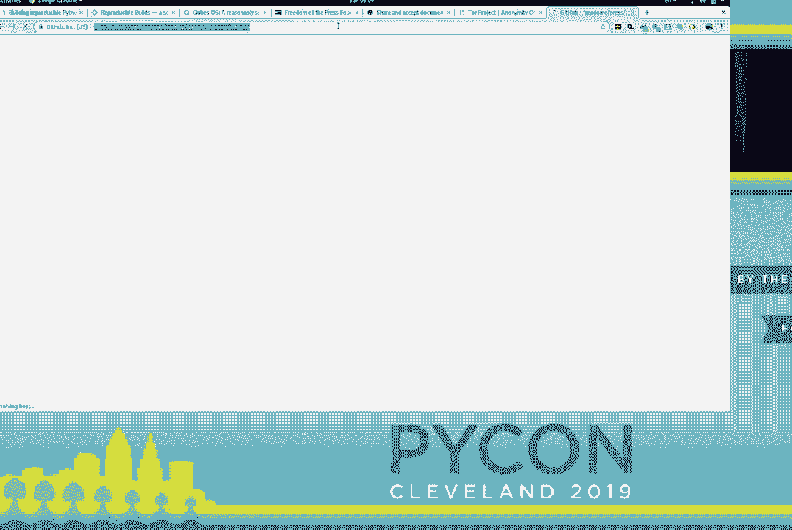

 that the source is clean。 So we have to find out a way as a community so that we can actually start trusting it more。 Thank you。 Thank you。 Okay， I guess no more questions。

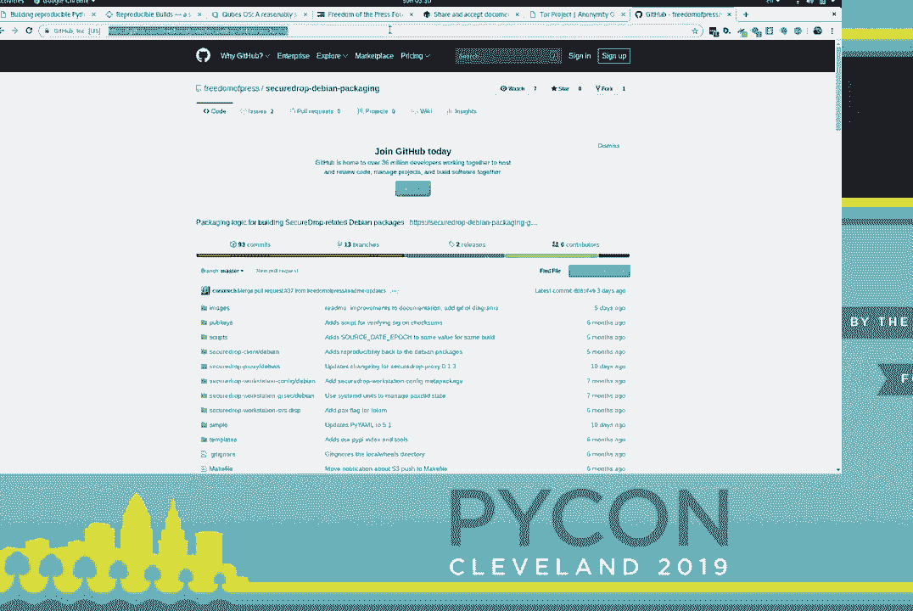

 Thank you。 [Applause]， (applause)， (applause)。