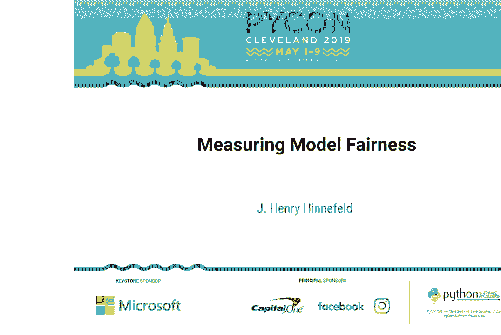
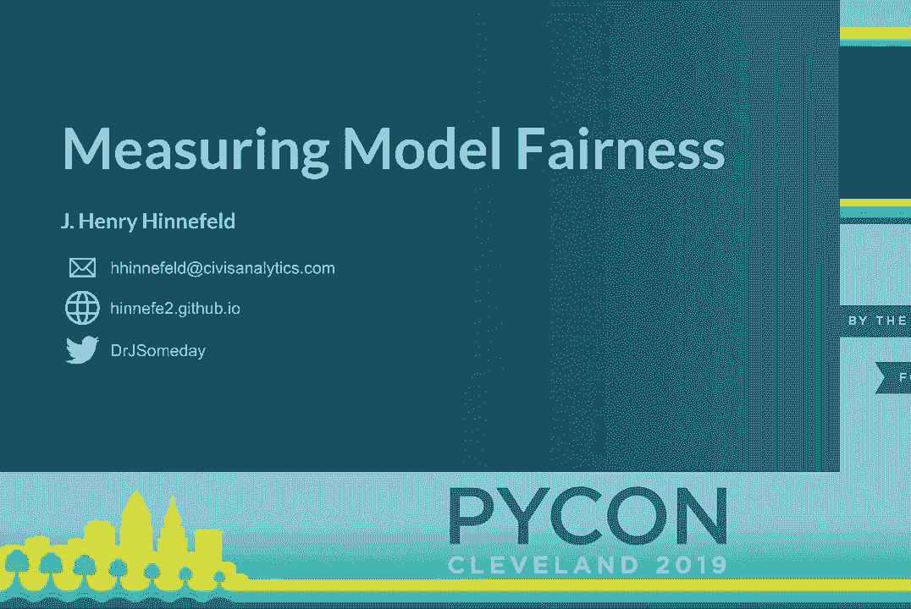
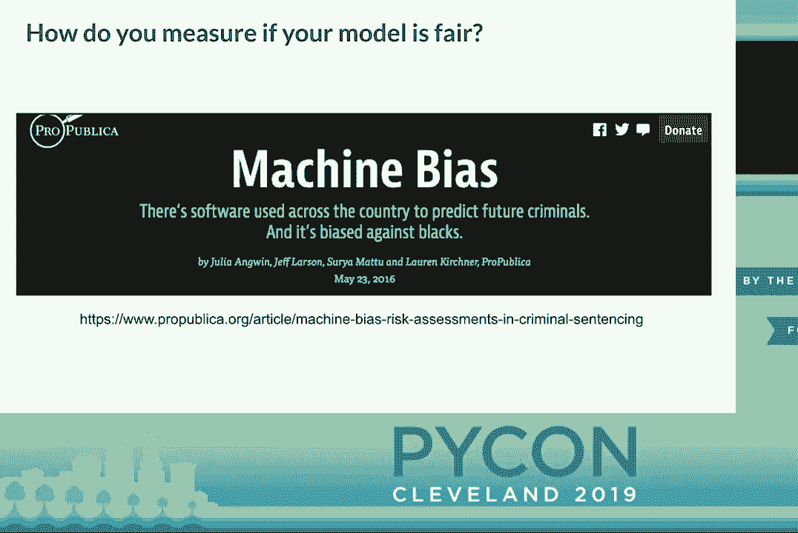
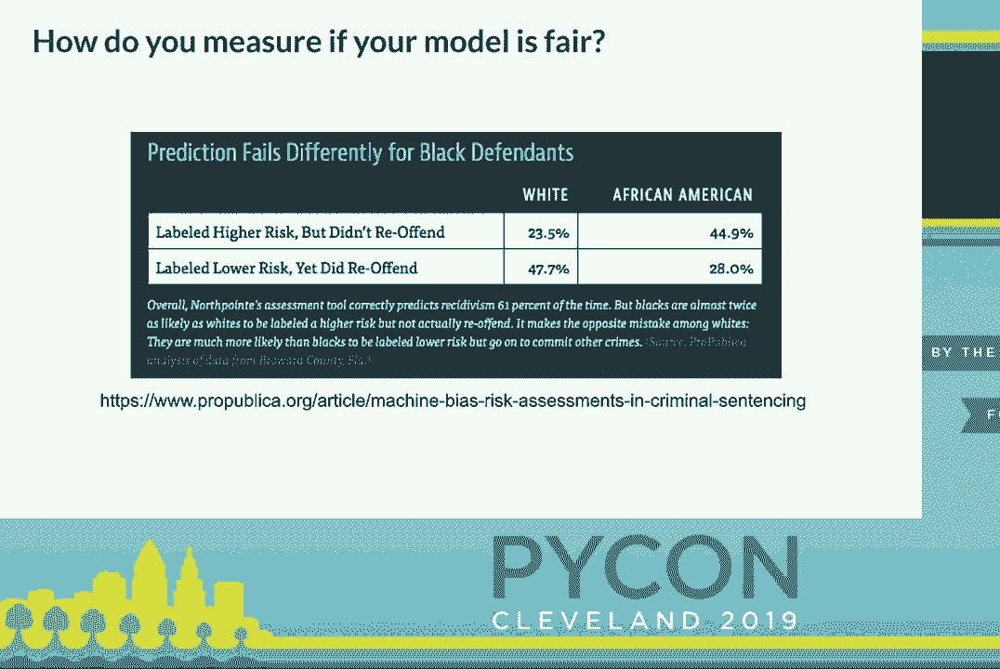
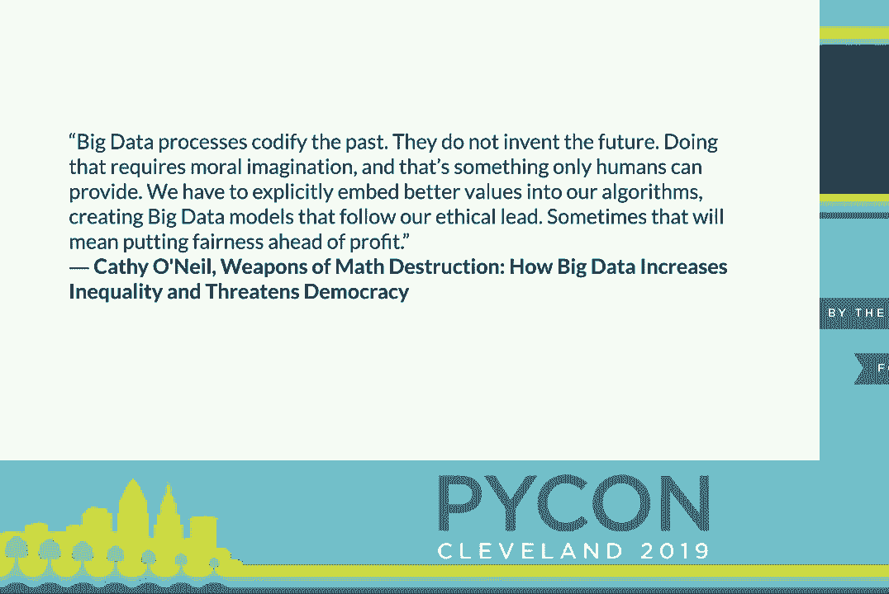

# P13：J. Henry Hinnefeld - Measuring Model Fairness - PyCon 2019 - leosan - BV1qt411g7JH

 Hello again everyone。 This talk is measuring model fairness with Henry。

 Hennifield。 Please give him a warm welcome。 [Applause]， Well thank you。 Hi everyone。 My name is Henry Hennifield。 I'm a data scientist at。 Civis Analytics and today I'm going to talk to you about measuring model。

 fairness。 Before we jump right into it I'll start with an outline of where we're， headed。 I'm going to start by motivating the problem a little bit and the problem。 I'm talking about here is specifically measuring model fairness， not model， fairness writ large。 There was a really great talk earlier today about that so。

 I encourage you to go find a video for that later if you're interested。 But today。 I'm specifically talking about the problem of measuring the fairness of a， model's predictions。 This is actually a pretty tricky problem so next I'll talk。 through some of the subtleties that make this hard and then talk through a case。

 study using some real-world data that shows how these subtleties show up in， practice。 Finally I'll talk about some Python tools， some open-source tools you。 can use to address these problems in your own work and end with some， concluding remarks。 So at this point I think it's pretty commonly accepted that。

 machine learning models can have a big impact on people's lives。 Things like。 credit scoring models can determine whether or not you can buy a home。 Advertising models can affect what kind of job offers you're exposed to， what kind。 of credit products you see。 And models can even affect how long you spend in jail。

 Now as machine learning models have made their way into these really socially。 impactful domains a consensus has emerged that it's really important that we。 make sure the predictions of these models are fair。 Unfortunately that's kind of。 where the consensus ends because there are many different ways to define， fairness。

 many different ways to measure the fairness of model predictions。 And this。 last example is actually a really illustrative case for that so a quick。 show of hands how many of you all have heard of the compass recidivism model， controversy。 That's pretty good response。 For those of you who are not familiar。

 there is a model called compass which is used to predict recidivism so to predict。 the likelihood that a person convicted of a crime will go on to。 reoffend when they're released so go on to be convicted of future crimes。 This。 model is used pretty widely across the country in making parole decisions and。

 so a little while ago this organization called ProPublica which is an。 independent investigative journalism outfit found out about this and went out。 and collected some data first about the scores that this model was generating and。 second about the actual outcomes so about whether people actually did go on to， recidivate。

 And what they found when they analyzed this data was that the models。

 error rates were different for people of different races so the chart I have here。 is comparing the false positive rates and the false negative rates for white and。 black defendants so the false positive rate is the the fraction of people that。 the model labeled as high risk but who actually did not go on to reoffend。

 Similarly the false negative rate are the people that the models said had a low。 risk of reoffending but did go on to reoffend and if you look at these error。 rates for the compass models well the false positive rate that people falsely。 labeled as high risk that error rate is about 24% for white defendants and about。

 45% for black defendants and on the other hand the false negative rate the。 people that the model falsely said were at a low risk of reoffending that error。 rate is about 48% for white defendants and about 28% for black defendants so。 ProPublica went out collected this data did this analysis and on the basis of this。

 analysis wrote a report saying this model used in parole decisions is biased。 against black defendants seems pretty cut and dried so far right well the。 second half of the story is that the company which makes this model which。

 makes this product the company North Point put out a rebuttal where they。 showed that the overall accuracy so the overall error rate or source I'm sorry。 the overall just accuracy of this model is very similar for white defendants and。 black defendants so the overall accuracy is about 63% for both groups so this。

 leaves us with a question is this model fair who's right which is the appropriate。 way to measure the fairness of this model of this model's predictions intuitively。 you might think well let's just satisfy both conditions let's make sure that the。 error rates are balanced and let's make sure that the overall accuracy is also。

 balanced unfortunately that's not possible as this controversy was coming out。 some academics took a look at the problem and proved mathematically that。 except in very contrived cases cases where for example your model is a hundred。 percent correct it just gives you the right answer every single time except。

 in contrived cases like that it's mathematically impossible to satisfy both。 of these definitions of fairness at the same time so we're left with this。 question of how do you decide what is an appropriate way to define fairness for。 your machine learning modeling problem how do you how do you define this and how。

 do you measure it this is a really tricky problem with a lot of subtleties so。 next I'm going to talk through three of these subtleties and how they impact this。 problem the first subtlety is that different groups can have different。 ground truth positive rates so to illustrate this with an example say you。

 are trying to make a model that predicted diagnoses of breast cancer well。 men and women are diagnosed with breast cancer at very different rates for women。 it's approximately one in eight so something like twelve percent over the。 course of a lifetime and for men it's something like one in a thousand so。

 point one percent so there is a very different incidence rate a very different。 true positive rate in the ground truth between men and women for this type of。 problem well this is this makes measuring fairness tricky because certain。 fairness metrics make assumptions about the balance of ground truth between。

 groups one of these metrics which is very popular one is called disparate impact。 and the what in words what disparate impact is measuring is the ratio of the。 probability of a positive classification between two different groups so that's。 this equation down here the probability that you get a yes or a positive。

 classification for different groups and because this is a ratio you want it to be。 very close to one according to this definition of fairness but if we think。 back to our breast cancer modeling problem you can see how this definition。 of failure just falls on its face because the ground truth positive rate is very。

 different between our two groups and so that conflicts with an assumption that。 this fairness metric has baked in so subtlety number one there can be。 legitimate differences in the ground truth positive rate between different。 groups that you're looking at subtlety number two is that you don't know what。

 ground truth is you only know what your data says and your data is a bias。 representation of ground truth there's a quote from the statistician George Box。 that I like a lot which is that all models are wrong some models are useful and I。 think you can kind of paraphrase that into the data context by saying all。

 data sets are biased some data sets are useful so you always are after remember。 that your data isn't an exact representation of the real world of ground。 truth data can be non-representative in a couple different ways and one of those。 ways is that it can contain label bias so label bias is when a protected attribute。

 affects the way individuals are assigned labels people from different groups get。 assigned labels differently in your data set as an example of this consider this。 quote from an analysis of school discipline in this paper the authors found。 that students from African American and Latino families were more likely than。

 their white peers to receive expulsion or suspension for the similar for similar。 problem behavior so if you are using this data set and trying to predict。 student problem behavior but your label was has been suspended then you're working。 with a data set that has label bias because different groups are being assigned。

 labels differently this is a problem for measuring fairness because some。 fairness metrics are based on your agreement with the labels and if your。 labels are biased then making sure that your predictions agree with those labels。 is just perpetuating the bias that was in your data set in the first place a。

 popular example of one of these metrics is called equal opportunity and equal。 opportunity is comparing the true positive rate between different groups so。 this is given that in the data set you are labeled as a one what is the。 probability that the model classifies you as a one and looking at the difference。

 in that rate between the two different groups that you care about but again here。 you're optimizing for agreement with these labels and if the process that。 generated the labels themselves is biased then all you're doing is。 perpetuating the bias that generated your data in the first place another way your。

 data can be non-representative is that it can contain sample bias sample bias is。 when different groups are sampled into your data set in different ways so as an。 example of this consider this quote from an analysis of the NYPD stop-and-frisk。 policy and in this analysis they found that people of African and Hispanic。

 descent were stopped more frequently than white people even controlling for。 various other factors so if you were trying to build a model on top of this。 data set you would be working with something that had sample bias because。 whether or not a person shows up in your data set in the first place is different。

 for different groups the sampling process is different for different groups。 I think you see where this is going this is a problem for measuring fairness。 because some metrics look at classification ratios between groups so here I'll go。 back to disparate impact this was the first metric we talked about the one。

 that's comparing the ratio of the positive classification between groups well if。 you're sampling the groups differently than the things that you're comparing in。 this ratio is not an apples-to-apples comparison if you're sampling for。 example only high-risk individuals in one group but then an entire population。

 uniformly in another group when you do that ratio you're not getting an accurate。 assessment of how your model is treating those different groups because the。 populations aren't sampled the same way it's not an apples-to-apples comparison so。 to recap so far subtlety number one there can be legitimate differences in the。

 ground truth positive rate between classes sample number two your data is a。 biased representation of ground truth subtlety number three is that the。 consequences of your model matter I can see an argument where if your model is。 punitive so the consequences of your model is negative it's handing out。

 something like more jail time then you might care more about false positives you。 might care more about the cases where your model is assigning someone a。 punishment that they don't deserve on the flip side if your model is assistive if。 your model is handing out a benefit to people who need it I can see an argument。

 where you care more about false negatives about where your model says a person。 doesn't need this benefit but they really do and they aren't getting it as a。 consequence I'm not arguing that this is the only way to think about assisted。 assistive and punitive models I'm just saying you have to think about these。

 questions this takes me to what is actually the main point of this talk if。 you don't remember anything else from this this is what I want you to come away。 with you can't math your way out of having to think about fairness you still。 need a human person to think about the ethical implications of your model of the。

 tool that you're building when machine learning and this kind of modeling。 approach first started being applied to these different types of domains at the。 beginning there was kind of a common impulse to think well models are just。 math so they must be fair you know it's just it's just numbers it's just。

 algorithms it's math of course it's fair at this point I think that attitude is。 pretty thoroughly debunked but there's a temptation to take the same kind of。 reasoning and apply it just one step farther down the modeling chain it's not。 models are math so they must be fair it's I'm gonna add this extra constraint to。

 my math and it will automatically be fair and that's still not automatically。 true you need a human person thinking about what does fairness mean in my。 context what does it mean what are the consequences you need that person doing。 that thinking before you can say this constraint makes my model fair so these。

 are some of the ways it can be tricky so far this has all been kind of a。 theoretical so next I'm gonna walk through a case study that uses some real。 world data from once from one of civics's consulting engagements to show how these。 kind of effects can show up in practice so the way this this case study is set up。

 is we start with some real-world data from one of our consulting engagements the。 the features we have here are mostly demographic things and like socio。 economic status indicators and the outcome in the original raw data set is。 the probability that a person will sign up for the services of a state agency so。

 each row in the data set is a person and the outcome is the likelihood they sign。 up for this agency and we're going to investigate racial bias so look at。 fairness for white people versus black people in this data set and the way we're。 going to proceed is we're going to generate hypothetical worlds that match。

 these different subtleties I've been talking about so we'll generate a。 hypothetical world where ground truth is balanced and another hypothetical world。 where ground truth isn't balanced to make the ground truth balanced we take only。 the white people in the original data set and then randomly reassign race。

 labels so in that hypothetical world ground truth is totally balanced we also。 take the original data set where white people were much more likely to sign up。 for the services of this agency as a hypothetical world where ground truth is。 not balanced so remember this is subtlety number one ground truth isn't always。

 balanced subtlety number two was that your data can be a biased representation。 of ground truth so within each of these hypothetical worlds that we've generated。 we're going to generate some new data sets where we inject known types of。 these different biases so for example we generate a data set where we inject。

 sampling bias by preferentially sampling white people and black people。 differently from that hypothetical world so we sample white people with a high。 score with a high likelihood sample white people with a low score with a low。 likelihood and then sample black people uniformly so by this by this process。

 we're generating a data set that we know has sample bias and similarly we can do。 a related kind of thing where we take those original probabilities and turn。 them into binary labels but we do that differently for the different groups so。 this way we introduce label bias so we use a threshold of point three for white。

 people and a threshold of point seven for white people so at this point we have。 two hypothetical worlds one where ground truth is balanced one where it's not and。 we have a number of different data sets where we know there's different types of。 bias in the data set then what we do is we train models on those different data。

 sets in those hypothetical worlds and then apply the two fairness metrics I've。 been talking about so far disparate impact which is that ratio one and equal。 opportunity which is that difference one we apply those two metrics two models。 trained on these different data sets and see what the fairness metrics tell us so。

 first when ground truth is balanced this is the hypothetical world where ground。 truth is totally balanced things look pretty good so to explain this figure I。 have on can you say my arrow yeah on the left over here is disparate impact so。 this is the ratio one so that means a value close to one indicates no measured。

 unfairness over here on the right is equal opportunity this is the difference one。 so valued close to zero means no measured unfairness and then the different bars。 are different data sets that we generated so on the far left is one where we。 haven't done either of these bias injecting processes then the next one is。

 where we injected sample bias where we injected label bias and where we injected。 both types of bias and so what you can see here is that both of these metrics。 measure no unfairness in the case where we haven't added bias to the data set and。 as we start adding these different types of bias into the data set the metrics。

 report more measured unfairness so so far so good the metrics are doing what we。 want the situation is a lot less rosy in the hypothetical world where ground。 truth is imbalanced so here we're saying this is a hypothetical world where。 there's a legitimate difference between different groups think back to the breast。

 cancer example and now these are the the same plots the same interpretation so a。 value of one over here on the left plot means no measured unfairness a value of。 zero over here on the right plot means no measured unfairness now both of these。 metrics are detecting significant unfairness even in the case where our data is。

 totally represented of the real world we haven't injected any of these biases our。 data is just the real world but these metrics are telling us that our model is。 very very unfair and also you'll notice the label bias this is when different。 labels are assigned different labels differently is very hard to detect and。

 that's because in this case where ground truth is imbalanced it's really hard to。 tease apart where differences and labels are between biased data generating。 process and just the ground truth so the point I want you to take away from this。 case study is that it's really hard to interpret these fairness measures in a。

 vacuum if you are doing this kind of analysis if you are trying to measure。 the fairness of your models predictions you don't get all four of these bars or。 all eight of these bars you don't get to see like well this is what it would look。 like in this case this is what it would look like in this case you just get one。

 of these numbers and you have to interpret that number by thinking about。 the world you're trying to model and the process that generated your data you have。 to think about is ground truth balanced in this problem I'm trying to model you。 have to think about where did my data come from is it possible that the labels。

 are being generated in a biased way is it possible that the sampling is different。 between these two groups you have to think about all of these questions when you。 go to interpret the numbers of these that these fairness metrics generate for you。 so that's kind of how this works in practice next I'm gonna give you a couple。

 tools from the Python ecosystem that you can use to do these kind of。 measurements to apply to you know measure the fairness of your predictions。 the first of this is called equitas this is a tool out of the University of。 Chicago it's a Python library and also a web front-end and the way it works is you。

 provide some data within that data you select what the protected group is so if。 you're interested in looking at race or gender or age or disability status something。 like that then you select which fairness metric is appropriate for your context。 which metric makes sense for the problem that you're working on and then the tool。

 will go off and tell you according to the data that you provided and the model。 scores you provided and the fairness metrics that you set are relevant how do。 those metrics evaluate on your data set pros of this tool is that it's easy to use。 the con is that it comes with a non-standard license so it's from University。

 of Chicago it has an academic license which isn't one of the standard MIT GPO。 whatever another tool comes from IBM and this is called the AI Fairness 360。 open-source toolkit the pro here is it's very comprehensive it has implementations。 of many many different fairness metrics along with lots of documentation。

 tutorials Jupiter notebooks that will walk you through the use of them the con is。 that it's probably more comprehensive than you need there is a ton of stuff in。 here also implementations of some research papers and it also comes with。 lots of dependencies so if you're trying to bundle this into a production。

 environment it might be a heavier import than you want and finally another class。 of tools are things that you can use to interpret models I'll mention these in。 passing because they're a whole nother topic and I don't have time to go into。 them here but if you're interested in understanding why a model is making a。

 particular prediction I suggest you look into these tools lime and chap so。 finally some concluding thoughts there's no one-size-fits-all solution to this。 problem other than think hard about your inputs and your outputs think hard about。 the world you're trying to model about the problem you're trying to model think。

 hard about the process that's generating the data that you're using and then think。 hard about the consequences of your model downstream where are these scores。 going what kind of decisions are being made based on the output of this tool。 that you're building these metrics can help and others but you have to use them。

 carefully second use a diverse team to create these models and do this thinking。 throughout the course of this talk I've tried to emphasize how important it is。 to have a human person doing this kind of thinking but if all the people doing。 that thinking come from the same background the same social context the。

 same lived experiences then you're gonna have blind spots so when you're doing。 this kind of ethical inspection of your models do that with a diverse team so you。 have different perspectives on on the question and finally just know your data。 and think about your consequences I'll leave you with this quote from。

 Cathy O'Neill's book weapons of mass destruction about how it's the job of all。 of us who build these kind of models and build these kind of tools to do this。 ethical introspection you know your your data is not the truth and even if it。 were the truth is it the kind of truth that you want to see in the world that's。

 a deeply human question and you really need people thinking about it thank you。 we have about five minutes left I'm happy to take questions if people want to。 step up and I'll also be up in the front if we get cut off for time。 I have a question so basic like you seem like a very civic-minded person and I。

 was just wondering how do you deal with push by so first of all have you ever。 experienced like pushback in your workplace when you kind of say that like。 all right you know we need to think about this fairness and then you get kind。 of the reaction yeah well you know you know math is fair it's objective this。

 isn't really the place for politics and secondly so first of all have you。 encountered that and secondly how do you respond to that to your first point I'm。 fortunate to work at a place where I think these kind of ideas have a lot of。 currency so I don't get a lot of institutional pushback on just like。

 raising the issue in the first place as to how I would address it I think there。 there are a couple different tax you can take one you can try and take an。 education type tack where if someone does come in with the perspective the。 models are just math of course they're fair then you can try to kind of。

 present some of this kind of reasoning to say well that's actually not quite。 accurate and try to educate whatever stakeholder is pushing back if it's a。 case where people understand the problem but don't want to like make the profit。 sacrifice that's just a much harder kind of interpersonal corporate dynamics kind。

 of problem and the best I can tell you is that you just have to advocate for it。 thank you that was a really fucking awesome talk thank you thank you on the。 right side given the issues with ground truth， ground truth rates being different depending on what sort of what sort of。 labels you're looking at is it possible to normalize them while possibly while。

 possibly controlling for any sort of sampling bias there definitely approaches。 you can take in that direction so there's actually a pretty substantial body of。 like academic literature around how you can do this kind of rebalancing data。 sets or rewading data sets to try to remove some of these issues I think。

 there's promising work in that direction but with the caveat that you。 really have to do this thinking ahead of time you can't throw your data set into。 a algorithm that like translates it in such a way that now everything is。 independent of gender or something without thinking ahead of time about the。

 problem you're trying to model and whether that kind of approach makes sense。 so short answer yes there are mathematical approaches in that direction。 but you have to use them carefully thank you that answer your question okay。 how does compass compared to just human judgment I mean I presume compass is。

 replacing human judgment in these matters I think compass is one element that。 judges use in making their decisions I don't know offhand of comparison I can。 give you of like the decisions judges make with and without the compass input。 that's a good question but I don't have a good answer for you so you mentioned a。

 couple of times that you need a human to consider this equation and consider。 possible biases and how to manipulate or how to how to work with your data in。 the in light of that I'm curious if you like there isn't a formula for that I'm。 curious if there are resources you know of that provide something in the。

 direction of a formula or at least a starting place where people for people。 for issues that people should consider when approaching these problems so I'm。 not familiar with this tool myself but the earlier fairness talk today mentioned。 this Dion checklist which was presented as like a checklist for ethical。

 questions when you're building a model I'm a little hesitant to recommend it。 having not read it myself but that sounds like something in the direction。 of what you're asking about is that fair yeah okay I think we're about at the。

 end of time but I'm happy to stand up front and keep taking questions so thank。 you for your attention， (applause)， (applause)。
