# P15：Amanda Sopkin - The Refactoring Balance Beam - When to Make Changes and When to - leosan - BV1qt411g7JH

 Hello everyone。 Next up we have Amanda Sapkin presenting the refactoring balance beam， when。 to make changes and when to leave it alone。 [Applause]。

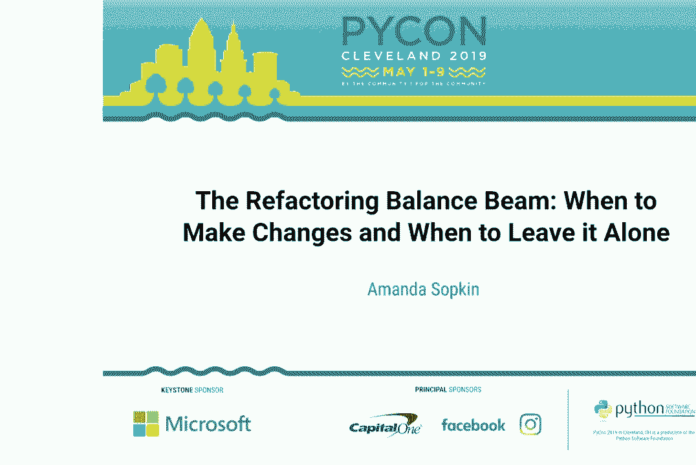

 All right。 Thank you very much。 Welcome to， as you said， the refactoring balance beam。

 The inspiration for this title is that when you're refactoring， you're sort of striking。 a balance between what it's worth making changes to and what， you know， you should just kind。

 of leave well enough alone。 And I'm going to start out with a joke。 So you， I'll kind。 of tell you what's going on in case it's hard to read the print。 Basically， this developer。

 has just cloned his master branch。 Both of the branches look like monsters。 And the master。 branch is asking about the new branch。 And the developer says that it's just a refactoring， branch。

 I'm removing all the bad coding。 And then shortly later on， the master branch。 is concerned because the refactoring branch has been reduced to a pile of bones and there's。

 really not much left at all。 And he's saying， you'll never do that to the master branch， will you？

 And the developer is saying it seems not much is left after all。 So maybe you've。 had this experience while you're refactoring， maybe not。 I found in my career that there。

 are a lot of decisions that get made around refactoring that are kind of difficult to balance。 like deciding when to do it， how to prevent affecting changes， how to prevent affecting。

 a feature code， and even just socially navigating making substantial changes to something that。 someone else on your team potentially wrote。 So I'm hopeful that this talk will give you。

 some guidance on how to make those decisions。 And if you're someone who likes to follow along。 with slides as the talk is going， I did tweet them out five minutes ago or you can go to。

 this short URL， bit。ly/picon19。 And they'll also put the slides up after all of this is， seven done。 So I'm going to start out by talking about some of the motivations for refactoring。

 We'll spend the meat of this talk kind of looking at different code smells and good ways。 to address them。 And then we'll talk about different approaches to refactoring and ways。

 to answer that question of whether or not you should be doing refactoring。 So I want to。 start out by putting the zen of Python up here。 You've probably seen this several times。

 this weekend alone， but I think there are a few pieces that are worth calling out to get。 us into the right head state for a refactoring talk。 So in particular， beautiful is better。

 than ugly， explicit is better than implicit， simple is better than complex， readability， counts。 there should be one and preferably only one obvious way to do it。 And if the implementation。

 is hard to explain， it's a bad idea。 So I think these are good guiding philosophical。 ideas as we go through a refactoring journey。 The definition of refactoring from Wikipedia。

 is sufficient in my opinion。 Code refactoring is the process of restructuring existing computer。 code without changing its external behavior。 So I've highlighted without changing， if you're。

 refactoring something， you're not adding or at least the point is not to add additional， features。 The point is to hopefully make it more understandable。 So why do we refactor？

 The purpose is to increase understanding and hopefully reach a more enlightened state。 both for you the person writing it and then also for future people who will look at this。

 code and add to it。 So keep that purpose in mind if the refactoring is making it more。 complicated than we've sort of failed somewhere along the way。 A couple other terms that I'll。

 be using that I want to define。 A design pattern is just a repeatable solution to a software。 engineering problem。 In early in my career， I used to think that design patterns were。

 something like those sewing patterns that they sell at Walmart where you've got these complicated。 diagrams and all these weird names and it's hard to keep track of them。 But I think a better。

 analogy is more like a box of tools。 So it really doesn't matter if you know the names。 for design patterns。 There's no final exam here。 There are just a set of tools that you。

 probably already use pretty frequently and if you can get used to that， then it'll be。
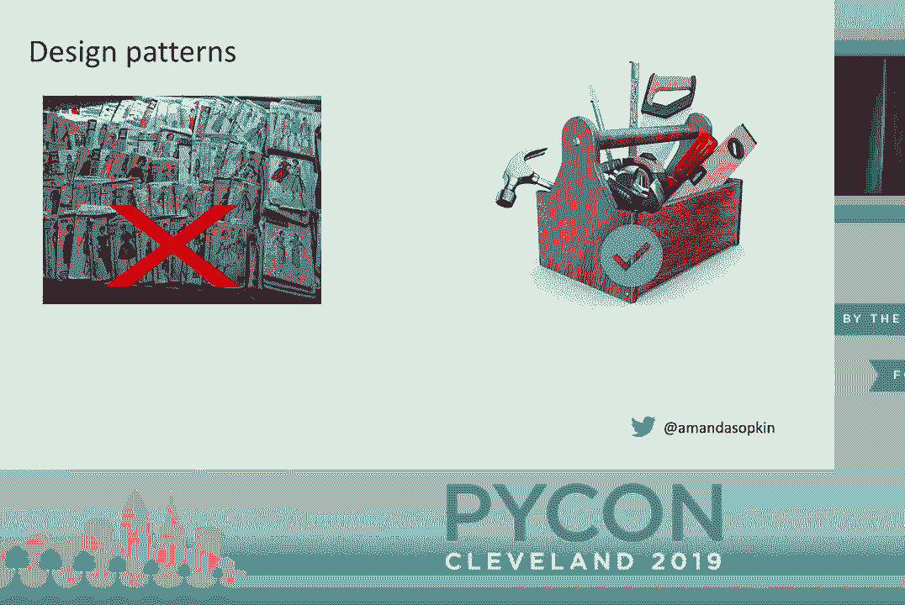

 helpful for you as a developer。 Code smell is defined as a characteristic in the source。 code of a program that possibly indicates a deeper problem。 So if it's something that。

 if you see this happening， it's a good clue that maybe you should look a little bit closer。 and see if there's something that you should change。 Before we get started refactoring， I。

 want to issue a warning that you should have a rollback strategy。 Particularly if you're。 working with live code， it's very possible that you'll make changes even if you're just。

 renaming something that will have unforeseen consequences on your production code。 So make。 sure you have some way to roll those changes back and preferably also like a test suite。

 that you can use to make sure that you haven't broken anything。 So some of the basic tools that we have at our disposal， renaming， that's a really good。

 way to make things more readable， moving or splitting things in general and redefining。 inheritance boundaries are some of the big tools that we'll be using to refactor。 And。

 I'm going to go over some code smells and they basically fit into three different buckets。 First of all， when something is too long or too complex， second of all， if it's not useful， enough。

 not really doing enough for us。 And third of all， if you've got some bad object。 oriented programming going on。 And none of this means that anyone really did anything， wrong。

 It might just be that the decision made sense at the time and now in retrospect。 it doesn't really make sense anymore。 So the basic ways that we'll address these problems。

 if it's too long， we'll split it out。 If it's not useful enough， then we'll compress。 it or put it somewhere else。 And if there's bad object oriented programming going on。

 we'll restructure it somehow。 So quick note on code smells。 Just because。 there's a code smell does not mean that you need to change anything or even that anything。

 is necessarily wrong。 There are patterns that often indicate that something could have。 been done better。 But there are times when it's totally okay to have a code smell。 So。

 I just want to point that out。 So the first common bucket for code smells that we're going。 to look at is when something is a little too long。 And I also want to say that these are。

 going to start out kind of simple， but they'll build on each other。 So don't worry， it'll。 get more interesting。 So the first one that we see pretty frequently is when you have。

 duplicated code。 So you're doing the same thing in several different places。 This is。 a good clue that you should pull that out into a method or potentially a class。 And if。

 you're pulling something into a class， at this point， I feel like I should ask you and。 you should ask yourself， do you really need another class？ Because that's a frequent cause。

 of other code smells。 So when you're kind of deciding whether or not you need a new。 class for this or whether you can just use a method， there are a couple of things you。

 can do to make that decision easier。 So you should create a class if you have something。
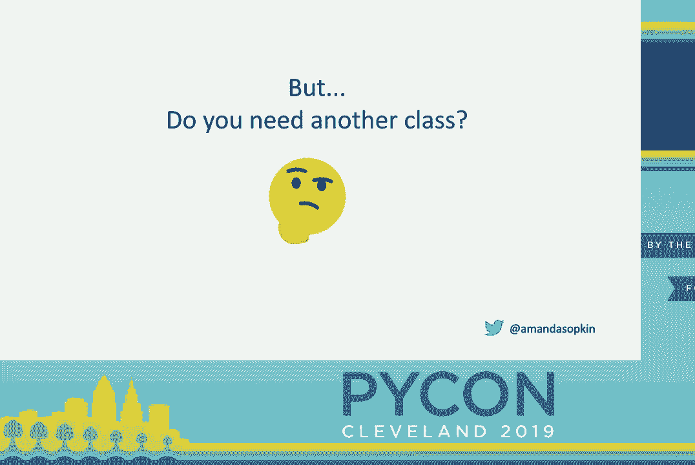

 that looks like this where you have a similar， you have some similar arguments that are being。 used in multiple functions in a mix of mutable and immutable。 So in this example， I'm initializing。

 a grid structure and then I'm passing that grid。 Sometimes I'm making changes to it。 For check for winter， I'm not making a change。 So this is a pretty good indication that it。

 would be useful for me to use a class。 In this case， it's probably better to use a function。
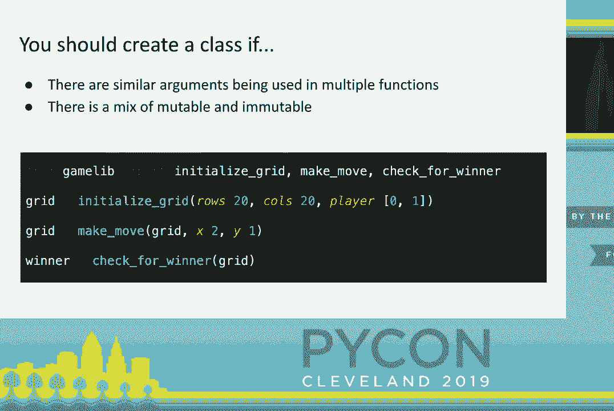

 You've got only two methods here， one of which is doing initialization and then a second one。 And you've only got static methods。 So really this will work just as well as a method。 We've。

 got a calculator class where we're initializing two operands and one operator。 And really we。
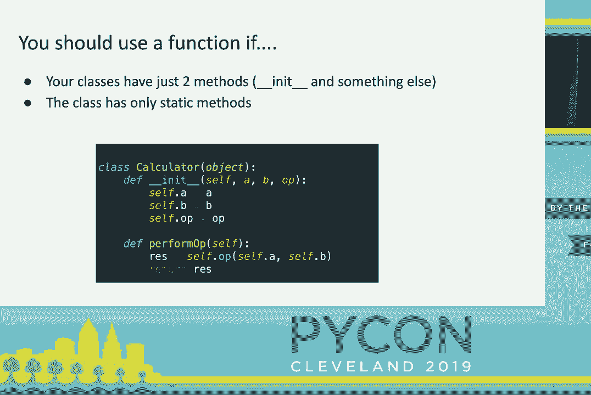

 can just do this as a function where we pass those in directly， perform the operation and。 then return it。 Next code smell I want to talk about is long methods。 And in this case， when。

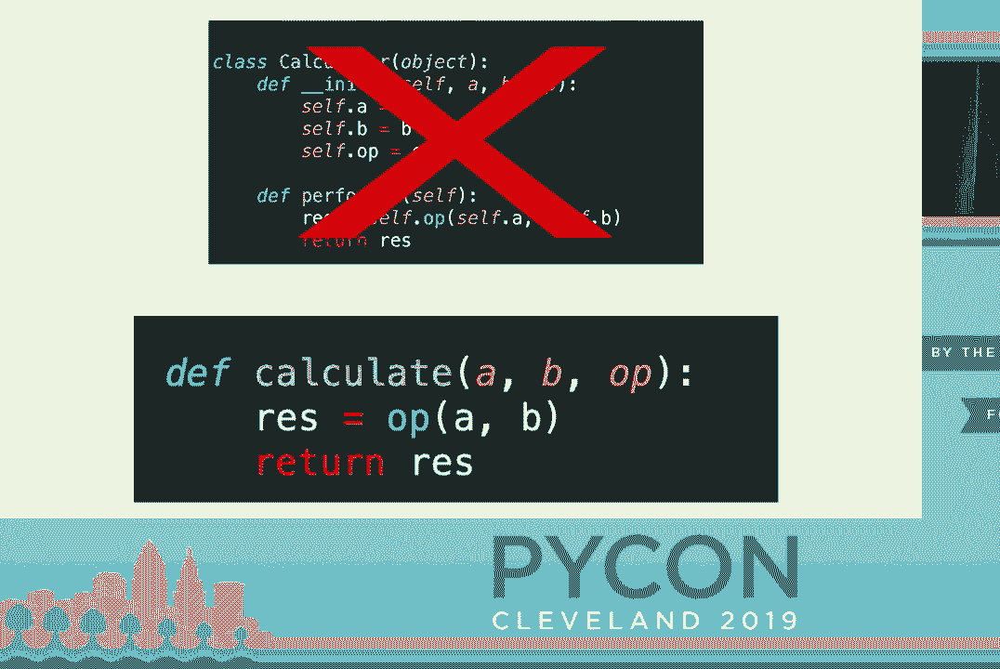

 I say the word long， there's no perfect cut off point when you know that whatever you've。 written has too many lines。 It's really more about the complexity of whatever it is。 So。

 I think a good guiding principle is that if you can't come up with a single cohesive。 purpose for your method or even a good name that really encompasses what it's doing， you。

 might need to split out some functionality。 But in general， you shouldn't just copy and。 paste pieces just because it looks a little too long to you。 So we've talked about extract。

 class and extract method。 A couple other things you can do to doctor your code。 You can replace。
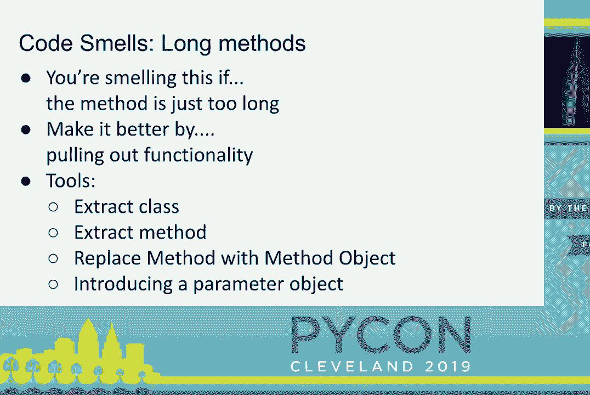

 method with method object。 So here I've got a procedure where I'm passing in a bunch of。 different variables and doing a lot of computations。 It's several lines long， so maybe I want to。

 pull aspects of that out。 In this case， it might be a good idea to introduce a method or a class。
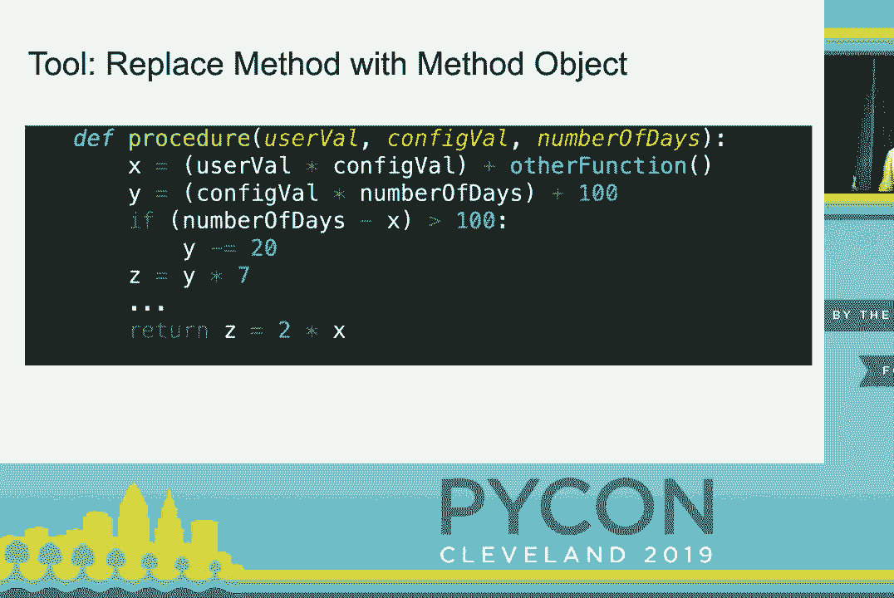

 where I can store that data and then pretty easily break it up into smaller pieces。 Another。

 thing we can do is introduce a parameter object。 So if you have frequent groups of parameters。 that you're using together， like in this example， we've got start time and end time， then it。

 might be a good idea to pull to create an object。 In this case， it's called time range to encompass。 those parameters。 The next code smell I want to talk about is called data clumps。 This happens。

 if you've got frequent clumps of data appearing throughout your code。 In this case， it might。 make it better to pull that clump into an object。 And I want to point out that there's。

 a reciprocal code smell for this one that we'll talk about later。 So for a lot of these， you。 can take an action and if you take it too far， then you might end up introducing a new code， smell。

 So keep in mind that it's a balance。 The next big bucket of code smells we'll talk。 about is when something is not quite useful enough。 So the most common one is a lazy class。

 or a speculative generality。 This usually happens if when I set out to create my project。 I thought I was going to have a bunch of parent classes and subclasses and maybe I went a little。

 overboard in creating those。 And then later on， when I look at it， I see that a lot of those。 classes aren't doing anything for me。 So as an example， let's say I have an employee parent。

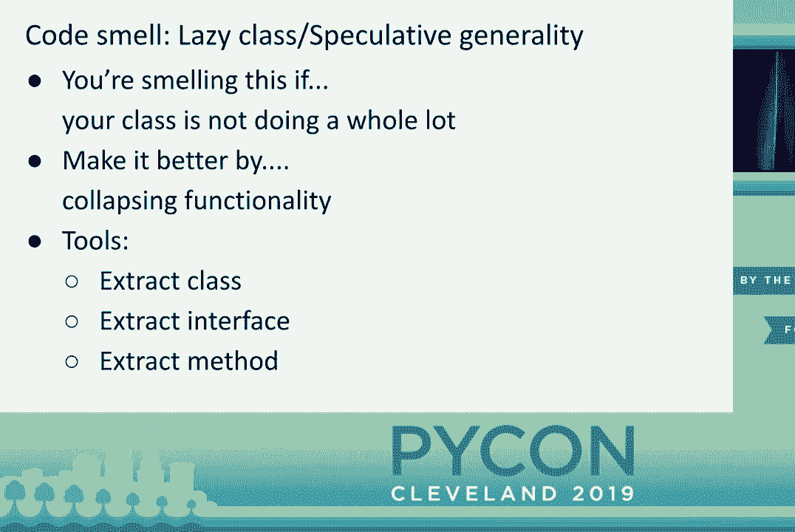

 class where that has a name and a salary associated with it。 And then I've got an engineer， which。 is a subclass of employee and an engineer has a team。 And maybe when I created these， I。

 thought I was going to have lots of different kinds of employees that were going to need。 their own information。 Maybe only engineers would have teams and executives wouldn't have。

 teams or something like that。 But now that I'm looking at it， it seems like employee isn't。 really doing anything for me。 So there's no shame in that。 I'll just lift that value into。

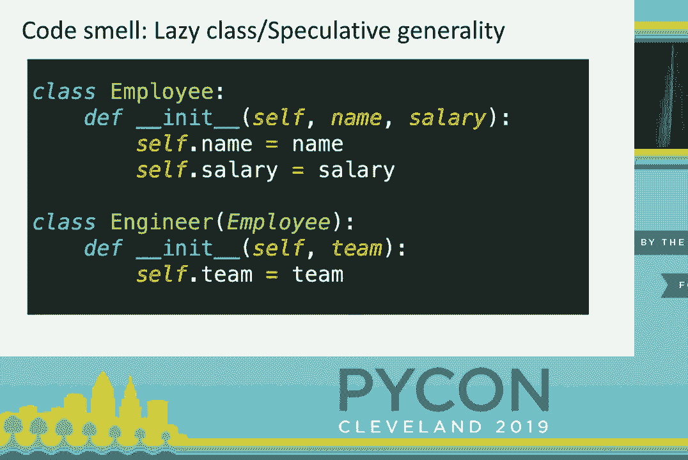

 the employee class and now employee can have a concept of a team。 The next code smell is。
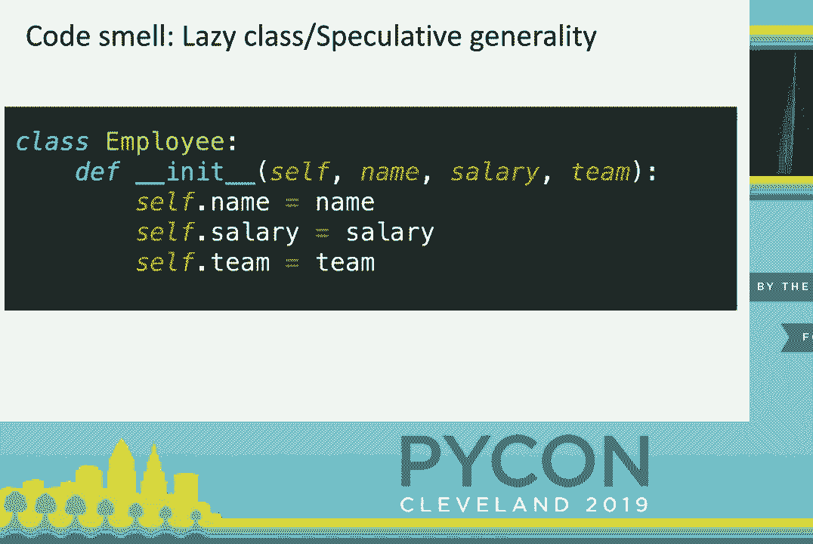

 the reciprocal of the data clumps code smell that we talked about earlier。 So this happens。 if you end up with a lot of classes that are doing nothing but storing data。 So if this。

 happens and it's happening in a lot of places， the best thing you can do is probably try。 and find methods that are often associated with those clumps of data so that your class。

 can be a little bit more useful for you。 And again， just because this is happening doesn't。 mean it's a bad thing。 It might be appropriate to have at least a few data holders。 But if。

 it's happening pretty frequently， then you might want to look into it a little bit more。 So now we're going to get to the third most complicated and most interesting bucket of。

 code smells which was related to issues with object oriented programming。 So the first。 one I'll talk about is divergent change。 This happens if one class is being changed a lot。

 for different reasons。 Often this is kind of unavoidable to some extent， but if possible。 each object should only be changed as a result of one kind of changes。 A kind of similar code。

 smell and my favorite name for a code smell is shotgun surgery。 This happens when every。 time you make a change you find that you have to make changes in a bunch of different places。

 and suddenly your code kind of looks like a trauma victim。 So this can be made better。 by trying to encapsulate those changes in a particular place。 So to go through an example。

 let's say that I've got a bank and those banks have offices and then I've also got some type。 of financial regulating authority。 And my bank is doing really well， so I'm having to introduce。

 new kinds of currency when I go into a new area。 And I find that every time I have to。 do that I have to make changes in all three of these places。 So this is a good clue that。

 maybe I want to pull those into one currency handler so that every time I'm adding a new， currency。 which potentially is something I'm doing a lot， I only have to make that change， in one place。

 A similar code smells called parallel inheritance hierarchies。 This happens。 when every single time you make a subclass of one hierarchy you're finding that you have。

 to make it in another place as well。 So as an example， let's say that I manage small。 businesses and I've got a dentist in a primary care office and I have to create a payment。

 manager class for both of those。 And then I find that I have to split out insurance functionality。 so I find myself having to create that subclass again in both of those places。 So if I'm having。

 to do that a lot it's a good clue that maybe I want to centralize those and maybe have one。 single finance handler that can handle both of those for each of these different subclasses。

 Next code smell I want to talk about is called feature envy。 This happens if you've got an。 object that's kind of reaching in very frequently to another class。 And it's very similar to。

 inappropriate intimacy which happens when classes know more about each other than they probably。 should。 So as an example， let's say I've got an entree class and I'm reaching into this。

 junk food class pretty frequently to do things like get the calorie content for my entree。 find out how much sugar is in it。 And a good clue here that something is messed up is the。

 names because an entree isn't necessarily junk food。 So it probably makes more sense to pull。 those functions out into a nutrition info provider so that both my entree and my junk food can。

 access it。 The next code smell is somewhat visual。 This happens when you've got a lot。 of different switch statements。 And generally the way that we address this is by taking those。

 switch statements out into a method， finding a class where we can store that method and。 then attempting to extract what we're switching upon into state。 So for example。

 if you're switching， on employee type， you could create employee type as a class and then use that to figure。 out which employee you're looking at。 Next code smells called message chains。 This happens。

 if you have one client that has to keep asking an object about another object and then maybe。 this object about another object and so on and so forth。 So there are a couple ways to。

 address that but the one I want to talk about is called hide delegate。 So let's imagine that。 I have a client and it needs to figure out it's reaching into an object to figure out。

 a person and then to figure out the department that that person belongs to， it has to go to。 the department and maybe it's looking at both person and department， sometimes it looks。

 at department to get the manager and that can be kind of confusing。 So ideally the client。 should only have to have knowledge of one of those so we can hide this delegate by having。

 the client interact only with person which will interact on its own with department。 And。 the reciprocal code smell here is called middle man which happens when you've got a bunch。

 of classes that are only acting as delegates。 So if that happens you probably need to go。 through and delete some along the way。 This code smell has probably the most complicated， name。

 This happens， it's called refused bequest and basically it just means that a child class。 doesn't need everything that it's inheriting。 So as a general guideline if a child should。

 need everything that its parent is giving it and if it does not the best thing you can。 probably do is push down some of that functionality into a sibling class。 And this is getting into。

 an important concept here which is the difference between inheritance and composition。 And there's。 enough material here to go into another talk。 In fact there was a talk about the same subject。

 yesterday so I'm not going to go into it too much but basically you want to ask yourself。 do I need to inherit all of the things this parent can do and if not is it better to just。

 contain the specific functionality I need。 So the basic smells or the basic categories。 of smells that we've looked at are when something is too long we split it out。 If it's not useful。

 enough we need to compress it or move the functionality and if we've got bad object。 oriented programming we're restructuring。 So now I want to talk about specific code smells。

 for Python。 So the first one and I guess this isn't necessarily specific to Python is extremely。 nested code where you've got a lot of if statements。 In Python often there are things you can do。

 to rip that out entirely。 So like for example if you're looking at a list and doing a lot。 of boundary checking often you can just use an iterator and avoid doing all of that。 But。

 I am going to go through a longer demo for one of these in a couple of minutes so we'll。 come back to this。 Unnecessary boilerplate code。 This happens if you've got a class that's。

 basically just storing a bunch of data and maybe overriding a couple of things。 So if。 this happens you're probably reinventing the wheel a little bit。 So as an example let's。

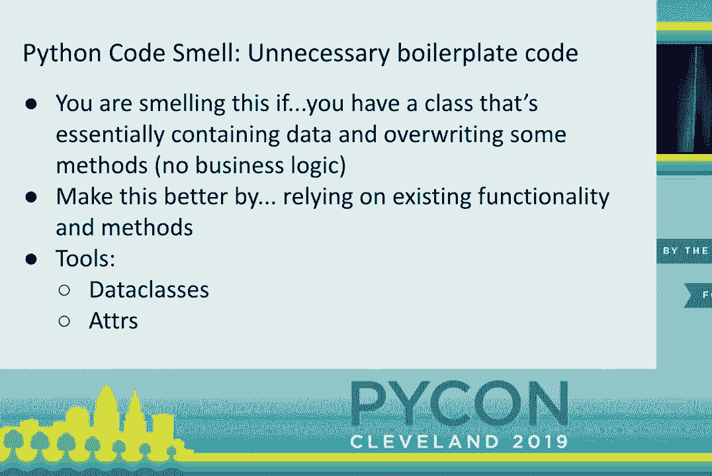

 say that I've got this math method or this math object and I'm storing a bunch of variables。 and then I'm redefining the wrapper method and the string method。 So if I'm doing this。

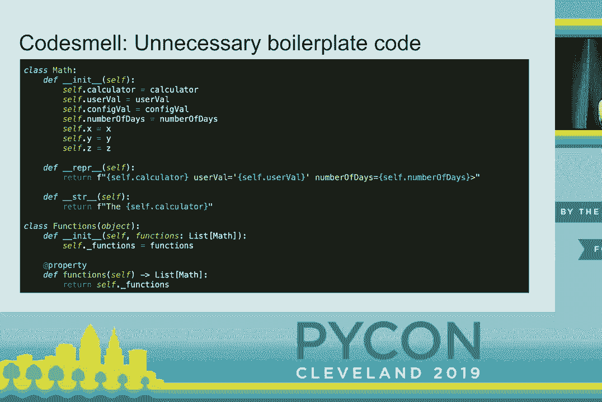

 the odds are that I could use something else。 In particular I could do this with a data。 class where I pass in all the variables I need and their types and then it'll redefine。

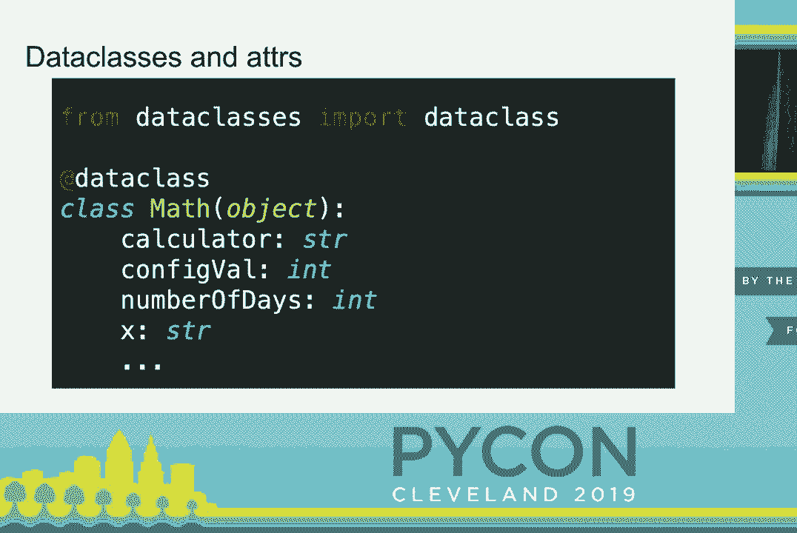

 and represent string for me。 Or I could use an adder。 Kind of a similar concept here。
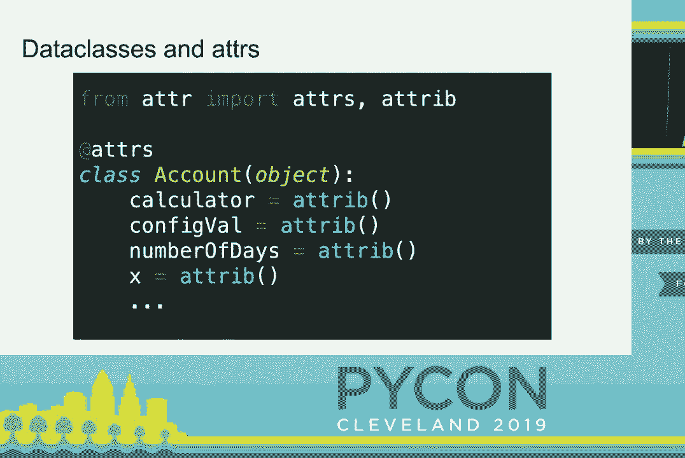

 The next Python code sma when I talk about is when your exception handling is too tightly。 coupled to your business logic。 So in general we like those to be kind of separate because。

 it's just easier to read and nicer to deal with。 So if this happens then hopefully you。 can push down your exception handling maybe like in a try and accept block。 And the last。

 Python specific code smell talk about is if you're repeating set up and tear down actions。 frequently。 So if this is happening you might want to introduce a context manager which you。

 would usually call using the with method。 Great so now I said I would do a demo of a。 longer example with nested if statements。 So that's what I'm going to do and I will。

 point out what's important so if you can't read this or see it hopefully that'll be okay。 So let's say that I'm building a restaurant menu and I want to be able to decide what。

 the menu looks like at a given night and I'm going to base that off of what ingredients。 were freshly available at the market in a given day。 And let's also say so these are。

 the basic things I can make at my restaurant。 It's very basic。 I can make pizza with bread。 and sauce。 I can make grilled cheese with cheese and bread， cheese and fish and then， steak。

 So very simple options here。 And let's say I want to vary my menu based on season。 So now I have to look at the ingredients I have available and the season that I'm in。

 to decide a menu。 And let's also say that I'm very frugal。 I want to increase my profit， margin。 So I only want to offer the customer the cheapest thing that I'm capable of making。

 So let's say I just kind of like puke this logic into code。 I might end up with something。 that looks like this。 You don't have to read it。 Basically I'm just going through and looking。

 at the season and then figuring out if I can make the first cheapest option for that season。 And if I can I return that。 And then I go to the next option and so on and so forth。 And。

 you have to read it a couple of times to really parse what's going on。 So obviously。 this is a good candidate for refactoring。 But before we do that I want to show what will。

 happen if we have to add functionality。 So let's say that now I need to track whether。 or not my customer ordered an alcoholic drink with their order。 And let's say there's a。

 law that mandates that if I'm ordering an alcoholic drink I have to eat an entree that。 has protein in it。 So now I need to keep track of whether or not they ordered a drink the。

 season I'm in and the ingredients that I have available。 So if I just add this parameter。 to all of the statements where I need it that's how that looks。 I have to make that change。

 in a lot of different places and now my logic is getting even worse and harder to look at。 Which is bound to happen when you have code that needs to be refactored。 So first thing。

 I'm going to do here is switch to using a list of menu items。 So rather than returning。 the first available cheapest option we will put the cheapest option in first and then。

 return a list that's sorted by the cheapest available entree to the most expensive。 So here。 I'm just adding a list and then appending to it before I return。 The next thing I'm。

 going to do is pull out this kind of a key logic into methods。 For two reasons first。 of all because it'll make it the if statements more descriptive and second of all because。

 as a rule these statements are going to get more complicated not less。 So just a couple。 of things to point out here I have a menu class where I am mapping each entree to the。

 ingredients that compose it and then I'm going through and I'm just figuring out if I can。 make each one of those entrees and if I can then that's a possible dish for that night。

 And if my person has ordered a drink then I know that I can only use entrees from the。 proteins list。 So now I have a series of methods where I can get the menu according to a。

 season based on what entrees are available in that season。 And now my logic is a lot cleaner。 to look at。 I just check what season I'm looking at and then get the menu for that particular。

 season。 The next thing I'm going to do is pull these functions into methods for a few。 different reasons。 First of all so I can kind of pre-compute the menu for that night rather。

 than doing it in each of statement。 I'm going to override the bool method so that I can easily。 check which menu to use。 And then mainly really the third reason is it will make my unit test。

 easy because now I can just create this object and kind of spot check a couple of things rather。 than having to like look at the menu and check that certain things were called internally。

 So now I'm adding a concept of season to my menu and I have subclasses that store the。 options for that particular night and a bool method which will tell me if I'm looking at。

 the right season。 So now my code looks like this。 I check to see if it's appropriate to。 use the summer menu and if it is I grab that menu。 This code is still not perfect。 I could。

 be returning directly for starters rather than grabbing the menu since I will only be in one。 season at a time。 But this is where we're going to leave it for now。 So I want to point out。

 a few things。 First of all don't add your functionality while you're refactoring。 You want to do that， before you refactor or after you've refactored everything。

 If you try to do them both simultaneously， it will probably be a bad time。 You want to make changes incrementally and then if you。

 can hopefully verify that your tests continue to pass as you're going。 Remember that making。 progress is better than ending up with perfect code。 So when you're refactoring it's pretty。

 easy to go down this rabbit hole where you're like okay I need to change this so this class。 should really be like this and now I need a new class here and kind of end up changing， everything。

 And it's better to just make progress incrementally rather than getting yourself into。 a mess or rewriting all of the code。 So how are we going to do the refactoring？ A few different。

 strategies。 Test driven development if you have good tests then run them repeatedly to。 make sure things still pass between changes and if not create the tests that you wanted。

 and then refactor until they pass。 Litter pickup if you want to do it incrementally along the， way。 So small things that you can do at a wrapper for debugging， delete or migrate unused。

 functionality and then one that we do on my team if you have a comment that indicates。 that something was not clear enough to stand by itself。 So if you can refactor to make it。

 stand alone and then remove the comment that's an easy thing to do。 A comprehension if you。 want to start by understanding the code and then take that understanding and put it into。

 the codes the next person has an easier time。 Preparatory if you want to refactor so that。 you can do something else later。 Planned which happens if you have to actually schedule out。

 the refactoring which probably means that you waited a little too long。 In red green。 refactoring which is very similar to test driven development where you create the tests。

 that you want and then they will fail and then you kind of refactor until they pass。 So now I want to throw a wrench in this。 What if we need to maintain backwards compatibility。

 and I'll do this quickly。 Let's say we're going to use an expand contract pattern so we have。 the old code we'll add the new code alongside it and then we'll contract to just the new， code。

 So in Python we can split classes by passing an optional parameters and then issue。 warnings and the old code path。 So as an example if I have a cheeto class with a name and a。

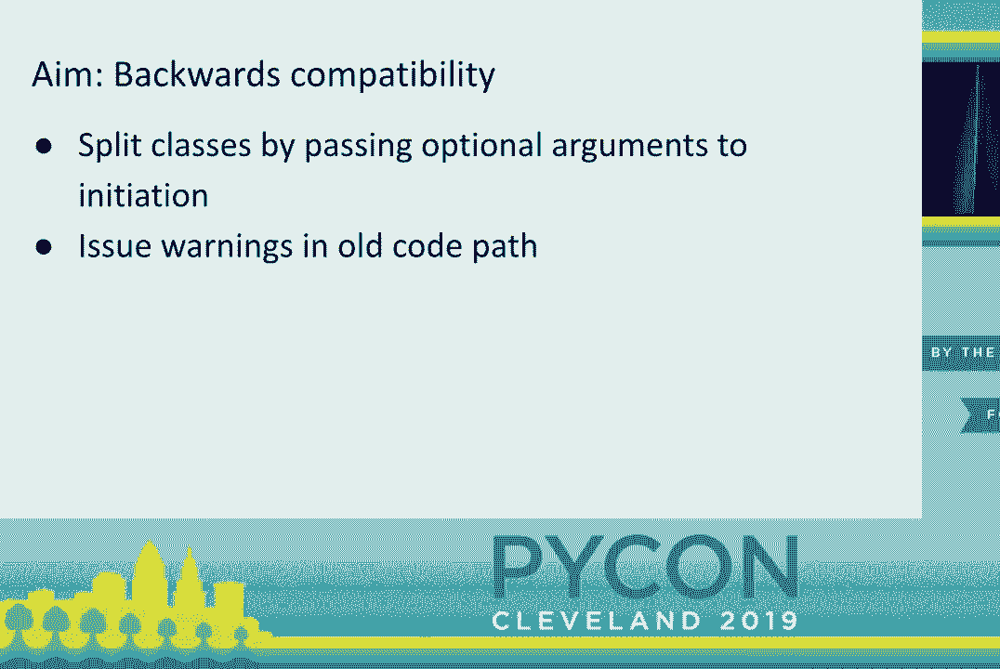

 mountain of cost and then I start to add parameters to it like spiciness and kind of cheese then。
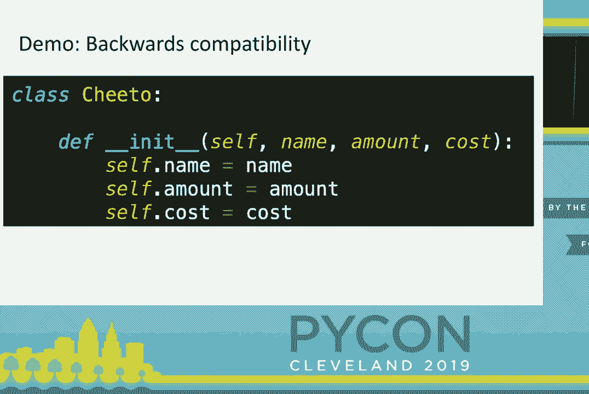

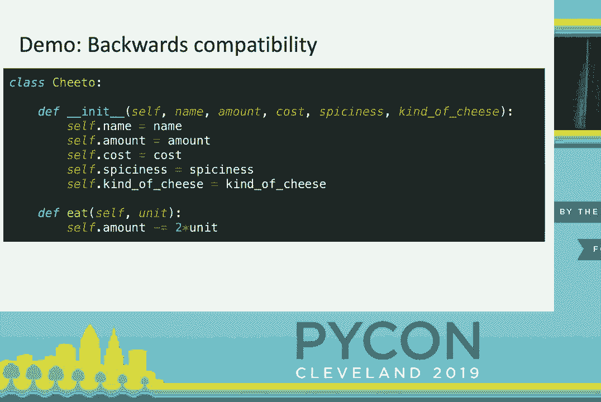

 I decide to lift some of that into a parent class called snack。 So now I have two different。 code paths if I'm passing in my snack parent class then I'll use that and if not I'll accept。

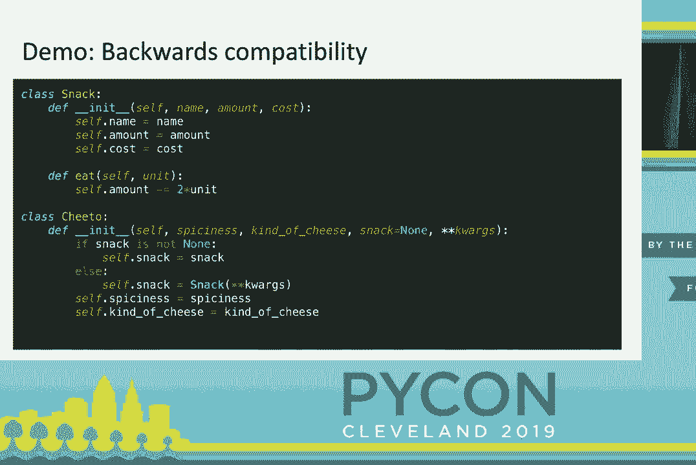

 parameters to build it myself and then I also want to issue a warning in the second case。
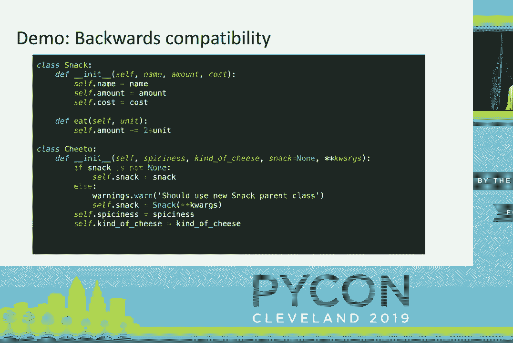

 to tell the person that they should be using the refactored version。 Great。 So now back。 to that same question to refactor or not when to not refactor。 If you can add better documentation。

 instead so if that's possible to just document an endpoint you might want to do that。 If you're。 just showing off by showing that you can do like a 360 deluxe prototype refactor then。

 that's probably not a great idea and it won't make your coworkers like you more。 And if you。 need to rewrite it from scratch then you might not even bother refactoring。 So in general good。

 reasons to refactor if you've regretted not doing this before if no one on the team has。 any idea what this does anymore then it's a good idea then you can be that person who。

 kind of works in understanding and then puts that into the code。 And then if refactoring。 this code now will definitely make it easier to change later on those are all good reasons。

 to refactor。 And remember that our mantra here when it comes to refactoring is progress。 not perfection。 So we're trying to make progress with the code that we're writing and in fact。

 it's better to start with a smaller change so that everyone can kind of get used to how。 this works rather than rewriting everything all together and now you might end up with。

 the same issue where there's only one person who understands how all of this works。 So I。 want to say that I had a lot of the code smells most of the code smells in this talk。

 are from the book refactoring which is written by Martin Fowler。 So if you're interested in。 learning more about code smells or design patterns then that's an excellent place to， start。

 And if you take anything away from this talk first of all if you get the sense。 that there's a code smell here so if your spidey senses are sort of starting to tingle。

 and you feel like there's something wrong then pay attention to that feeling or that。 instinct and it'll probably get sharper as you go on in your career。 That means that。

 there's something that's worth looking into and it's not a hard and fast rule if there's。 a code smell that doesn't mean that something necessarily has to change but it is worth。

 paying attention to。 Remember that the true meaning of refactoring is to arrive at a better。 understanding ultimately and something that is easier to maintain。 So if you've done a。

 lot of refactoring and it ends up more complicated that means that something went amiss along。 the way。 And try and think about your strategy for refactoring before jumping in。 So at a。

 minimum this means having a rollback strategy and hopefully some kind of test suite that。 you can use to make sure you didn't break anything but it also means being deliberate。

 about how you do the refactoring。 So taking the time to say okay if I refactor this piece。 then I need to have backwards compatibility here so I'm going to do that and then I'll。

 work on this piece and kind of break it up in a thoughtful way so that you don't just。 dive in and kind of get yourself into a quandary where you're not able to change anything anymore。

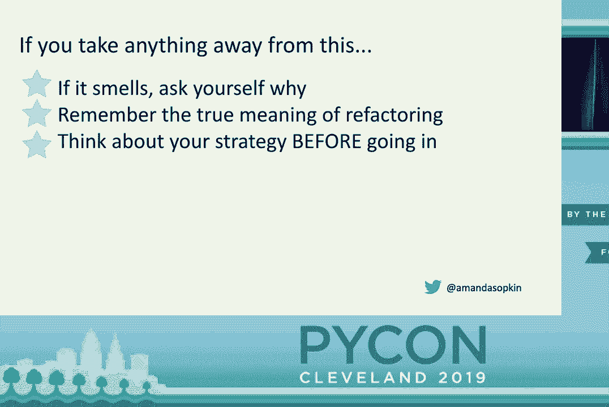

 Great， so thank you for coming。 I tweeted out these slides and I'm not going to be doing。 open Q&A so if you do want to talk， happy to discuss this or more code smells feel free。

 to tweet at me or come talk to me in person and thank you。 Have a good rest of your PyCon。 [Applause]， (applause)， (applause)。