# P17：Jonas Neubert - What is a PLC and how do I talk Python to it - PyCon 2019 - leosan - BV1qt411g7JH

 >> Hello， everybody。 So just a quick announcement before we start。

 this room has occupancy only for as many as。

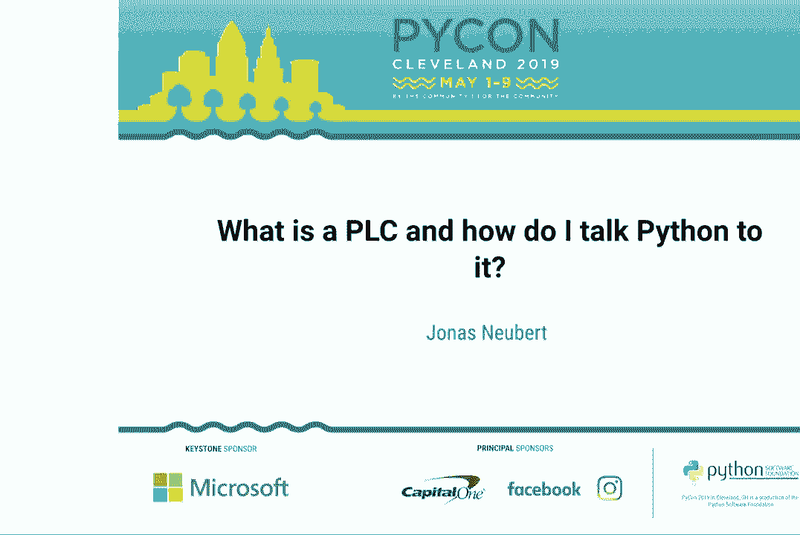

 the chairs are in here。 I know that not all the chairs are filled。

 but please make sure you get the chairs so， that when the new people come in。

 if they have an understanding room， they would need。

 to leave just due to the fire code just to give you guys a heads up。

 So the next talk is what does the PLC and how do I talk to it with Python？ And speakers。

 John's new board， please welcome。 >> Thank you。 I'm going to start with a quick story about myself and why I'm giving this talk。

 Back at the turn of the century， I was in high school and I managed to talk myself into。

 an internship at the nearby semiconductor factory。 And this was the coolest thing I had ever seen。

 And since then， I've been fascinated by the role that software plays in building these。

 amazingly complex machines that we call factories。

 But I also sometimes feel a little bit like I've stumbled upon this weird niche。

 Most software developers never even encounter factory automation as a place where you can。

 apply your skills。 And conferences like this， the topic has a little bit of a low profile。

 same podcast， blogs， and all the other places where software engineers exchange knowledge。

 So I thought to myself， I'm going to give a software conference talk about a factory。

 topic every calendar year。 And you all are here to see 2019 being checked off the list。

 The topic I decided to bring today is PLCs， in that sense， for programmable logic controllers。

 And if you do a quick survey of people who've worked with PLCs before， they usually think。

 of factories as the place where they live。 So if you had to walk through there。

 you would look for the metal enclosure， the electronics， cabinet。

 And if there's a couple of buttons， a couple of readouts and stuff on it， you open it up。

 You might find a PLC in there。 They're usually hanging out near the robots。

 also in standalone equipment like the window， tinting machine。

 if you don't have access to factories， out and about， maybe you're near。

 Wind energy to have PLCs in the controller cabinet at the bottom， the gearbox at the top。

 the control， the angle at which the rotor blades are set to the wind， construction machines。

 theme parks， car washes， public transit vehicles have PLCs。 Trains often have a network of them。

 They're in each carriage doing stuff like traction control in AC and in the cockpit at the driver's。

 dashboard。 Buildings like this。 Each track system， the lighting。

 the elevators are controlled by PLCs。 You go to the roof to get to the control room or to the basement。

 Sometimes it's at the elevator itself。 There are places where there's。

 where you think there's a PLC， but there isn't one。

 Like traffic control cabinets at your regular intersection。

 There's so many of these things and they're pretty simple。 You don't need programmable logic。

 so you just buy off the shelf electronics。 But as soon as you have traffic management for the whole city wiring all these intersections。

 up or you have a tram crossing intersection， it becomes custom logic again。

 And more than likely you'll find the PLC in these boxes。

 So there's that thing where people say when you're in a big city， you're never more than。

 10 feet away from a rat。 I'm going to add to that urban myth and say you're also never more than 50 feet away。

 from PLC。 Using that as motivation， this is the outline of the talk。

 Super simple because it's actually in the talk title。 First we talk about what is the PLC。 Second。

 we talk about what do we do with Python to interface to them。

 Then at the very end we deal with the dreaded raspberry pi question。 I talk fast。

 Some of my slides are really full because I want you to be able to use them as reference。

 material after the talk is over。 So if you want to follow along。

 the link to the slides is right there。 If that's too much to type， my Twitter， you can look up。

 I just tweeted out the link to， the slides as well。 And with that， let's dive right in。

 I'm going to take you along the journey of what happens when you decide to use a PLC in。

 your project。 Step one， you go to your purchasing department， you get a quote and all that stuff。

 In the end you order one， you get a package， you open it up， you get one of those things。

 Depending on how much money you spend， how difficult your application is， you get a compact。

 form factor which has a limited set of features that you can't extend or you go all the way。

 to the expensive， expandable ones where you just keep adding modules to continue expanding。

 the PLC to meet your features。 Spend a day or maybe a week on setting it up。

 It looks like it's grown a ponytail or two。 Those are the wires coming out of it。

 These are stock photos on the slide。 When I do it。

 it looks like one's on the stage here because I actually brought a little。

 PLC that's already blinking away， waiting to be used in our demo。

 Those wires are actually a hint about what PLCs do because I haven't， for anyone who hasn't。

 used the PLC before， I haven't actually mentioned what they do yet。 Those wires are a hint。

 They're connected to field devices that are out in the factory or in the wind turbine。

 or whatever it is you're controlling。 That tells you that the natural habitat for PLCs is always right at this boundary where。

 the world of software， with bits and bytes， meets the physical world with atoms and electrons。

 It actually makes sense to give a quick intro to field devices and an I/O input output。

 so a term that gets used a lot。 Of course， field devices is just a fancy word for sensors and actuators。

 Sensors， of course， are the devices that look at observable phenomena in the physical world。

 Turn it into an electrical signal which then becomes a variable in your code and actuators。

 are the other way around。 They take a variable in your code。

 Turn it into an electrical signal which then becomes an effect in the physical world。

 Slide is super complicated but it's really just to illustrate that there are many different。

 kinds of electrical signals out there because physics is hard， standardization is hard。

 So for your sensors you might have anywhere up to ten different signal types and that's。

 where those modules I mentioned earlier come in。 You can't just plug any signal into any port of your PLC。

 You purchase the set of modules that matches the signals that you need。

 Really the only important distinction for us to understand here to follow the rest of。

 this talk is that some signals are digital which means the physical phenomenon is on or， off。

 The electrical signal is high or low and the variable becomes a Boolean variable and there。

 are analog signals which are things that are continuous variables you need to measure the。

 electrical signals much more accurately and then it becomes a number in your code。

 On the slide here I purchased the PLC and I added 1， 2， 3， 4， 5， 6 modules to deal with。

 different types of signals both digital input， abbreviated DI and analog inputs and stuff。

 like that and digital outputs abbreviated DQ。 Wait what？

 That seems to be a common thing in automation engineering。

 I think it's because the O for output would be too similar to the zero so they say DQ and。

 you'll see that a couple of times in my variable names later。 Cool。 We purchased it， we wired it up。

 What does it do？

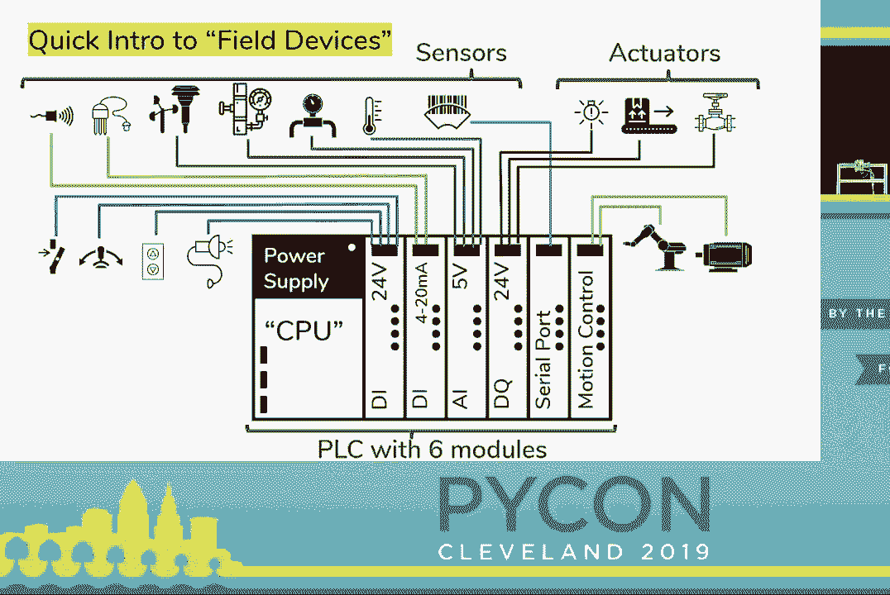

 Same thing as any compute device in the world that goes through the IPO cycle and the first。

 step input we read the process variables from the field that basically means we look at the。

 electrical signals and the PLC turns those into variables， stores them in memory in a。

 place called the process image in。 Then in step two we run some kind of logic。

 do some computation and hopefully turn our， input variables into output variables because that's what programmers usually do in their。

 functions and those get written to the process image out。 PLC takes over again。

 turns those variables in the process image out to electrical signals。

 to our actuators which might be a motor or a fan or whatever it is that we're controlling。

 Obviously the interesting bit to us is step two because that's where we can have an effect。

 on what's going on in the PLC。 We can program it and that's also where the name comes from because that's where the programmable。

 logic lives。 So just a quick recap。

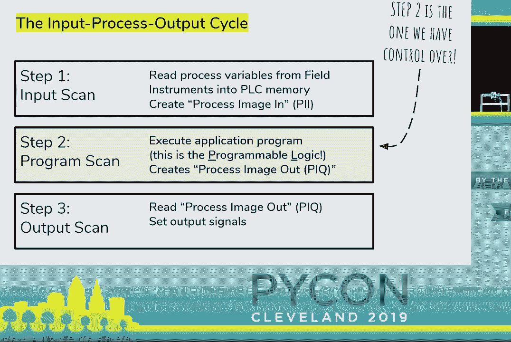

 We determined that PLCs are the things that interface between the world of software and。

 the physical world。 They're wired up to field devices that show up as digital and analog inputs and the like。

 and we can program them to affect their behavior。 So let's do a quick demo with this guy that I've got here and I'm going to fire up my。

 favorite text editor and start programming the PLC。

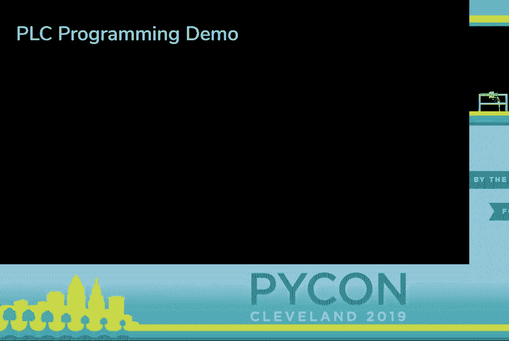

 Just kidding， you don't program PLCs with text and also you don't use your favorite， program。

 you use the one program that the vendor of your PLC gave you to program it。

 Actually I selected the PLC that I brought today based on the fact that the software。

 is sort of like clean enough that I can put it on a presentation screen and it's not like。

 full of a million images。 And I'm going to do this trick where I zoom in every now and then to make it even easier。

 for you to see。 So this is the programming environment we have。

 On the very left we see this big line。 Imagine that's like under pressure or there's electricity coming in and the electricity is。

 trying to travel down those horizontal lines to get to the right and we get to put like。

 electrical circuit elements there and I'm going to put normally open contact that looks。

 at the variable di1。 What that basically means， it's like an if statement。 If di1 becomes true。

 current is traveling here where my cursor is dancing around and， if it stays false， well。

 current can't get there。 So we're going to make use of that and whenever current gets there we're going to switch dq1。

 to true。 So we really just have sort of the hello world of PLCs。 If di is true， make dq true。

 otherwise both of them are false。 I'm going to go online with my PLC。

 which I should have done before the talk。 Now I can program it and I connected the two with a network cable here just my laptop's。

 connected to the PLC for programming。 So the program is over there now。

 Now we're going to test actually at home， I usually do this with an LED and stuff， an。

 LED small thing but since you can't see that， I grabbed one of those for you。

 So those are the digital output and I got the corresponding digital input as well and。

 we press the button and this is what's happening。 Digital input is true。

 digital output becomes true and actually I switched us into monitoring。

 mode so if you watch the screen， you can actually see what those variables are doing which is。

 really kind of cool。 But then you install it and the kids come and you go like that。

 So we want to fix that a little bit and instead of the output we put a timer here and we say。

 we want to count up to two seconds which in this weird programming language is 200 and。

 we're going to give it a variable name for the current value and we're going to give。

 it a variable name for when it's done。 So timer one done will be true when timer is finished counting and we add a second rule。

 to our set of rules and say if timer one is done then we actually want to switch that。

 output dq1 on， program that over to the PLC again and I'm going to do that assuming in， trick。

 So if I press the button you see the timer starts running but the output doesn't come， on yet。

 Only if I keep it running for two seconds does the light come on。

 If I let go the timer resets I press it again the timer starts counting again。

 But we already know two little primitives of this language that we're working in。

 I have one more sort of like party trick here。 I'm going to insert another row before。

 Second timer which also counts to two seconds and I'm going to call this timer two value。

 and timer two done and now I'm going to put a couple of crazy rules in front of those。

 I'm going to say a normally closed contact so I want timer two to start counting when。

 timer one is not done so that little thing with a strike through here that's basically。

 an if not statement。 Oops thank you windows。 And then I change this to say timer one is counting when timer two is done and then I。

 want my output on when timer two is done。 Look at this for a second。

 I'm going to click program and you have three more seconds to try to figure out what this。

 is actually doing when it runs。 And we build ourselves a little flashing light。 How cool is that？

 Quick pro tip for anyone who's coming to the US from outside the country when you see a traffic。

 signal like this is actually the equivalent of a stop sign you have to stop before you， keep moving。

 I lived here for three years I had no idea。 And it's a bit distracting so I'm going to stop the PLC if I actually over it is network。

 table tell the PLC to stop。 I should clarify this all the code is running in the PLC my laptop is only connected to the。

 programming it's a programming interface and it has this cool monitoring interface where。

 the PLC reports what's going on inside of it。 My laptop is not running any of the code。

 What did we just see？ The language we program in and here's a little ASCII out representation of the same concept。

 is called ladder logic because when you add a lot of rules it looks like a ladder and the。

 terminology is kind of cool。 You have a hot rail I told you the analogy is that it's under has voltage applied to it。

 when you touch it it kind of saps you it feels hot。

 There's a neutral rail where the current is trying to get to and we call those conditionals。

 that we place there the contact and the outputs the coils。

 The general rule of thumb in textbook 101 is read from left to right top to bottom and you'll。

 understand what's going on but why are we doing this stuff？

 That is how you program control systems before PLC's existed。 Those are relays。

 If you go to the top of an old building you might find an elevator control room that still。

 has this kind of stuff in it and the way people programmed elevators production lines everything。

 is arranged these relays and wired them up in such a way that the logic results in it。

 And if you've ever used a relay you know that the place where you hook up your voltage。

 inputs is called the contact like in that programming language which is used and you。

 energize the coil which means the relay is activated and passes current through it acting。

 basically like a switch。 So this is where this is coming from it's taking inspiration from old relay control logic。

 You can have two views on this you can have the hacker news view where you think that。

 everything is a start of opportunity and needs to be disrupted and you say many other industries。

 are stuck in the technological dark ages the industrial automation community still programs。

 in ladder logic。 Or oh by the way this is the only reference to ladder logic in 13 years of hacker news。

 Or you can have a slightly more like a different attitude to things and realize that this programming。

 language has been around for 50 years so it's got to have something going for it and maybe。

 that something is that it is truly the common denominator across all brands of PLC which。

 you can purchase and it's part of the curriculum for most automation engineers and electricians。

 in the world they learn this as part of their degrees and that's important because as soon。

 as this thing is programmed by whoever the automation integrator is it gets shipped to。

 the factory and ownership transfers to the factory maintenance department which is staffed。

 with technicians and electricians and they are now in charge of keeping this thing running。

 and fixing it when it breaks sometimes for decades。

 And if you think about that it basically means that ladder logic is a programming language。

 that's purely designed for debugging and not at all for the person writing it which is。

 kind of cool like none of the languages I work in every day have that trait。 Cool。

 So we've looked at what the PLCs are about halfway point here everyone's like where's。

 Python。 So second demo and I need to do a little bit of set up so you've got to bear with me first。

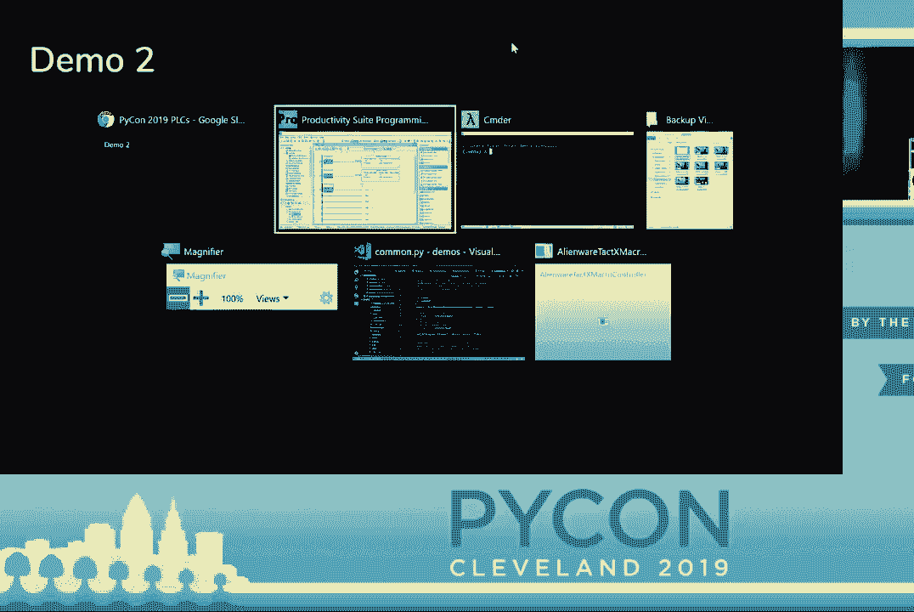

 of all I'm going to close this project that we've worked on little hello world and I opened。

 up a slightly bigger one which I prepared for this talk and I'm going to program that。

 over to the PLC。 Actually what you see here in the background is a bit of a design pattern in ladder logic。

 you often use the main program to call a couple of sub tasks like subroutines the interesting。

 one really is the pedestrian crossing one here so I switched the PLC to run and I switch。

 on my monitoring and we'll just quickly run through this program as we actually run it。

 So I'm going to press the button and you can watch the variables change on the screen。

 again so we press there's a couple of timers down here that go in sequence they all fire。

 and are wired up so that one starts counting when the next one is done and at the bottom。

 we have a bunch of logic that basically says which light needs to come on。

 I totally forgot I brought one of those as well。 Now what's different about this program compared to the one we had before that if you zoom。

 in on what this timer is doing earlier we had a constant value here I put 200 for two。

 seconds and now I put a variable there。 It's actually a bit of a luxury that we have variable names in PLC some of them used to。

 use memory addresses this one hopefully has this tag database which lists all the variables。

 we have to map them to memory address so we have our DI's， DQ's， bunch of like timer。

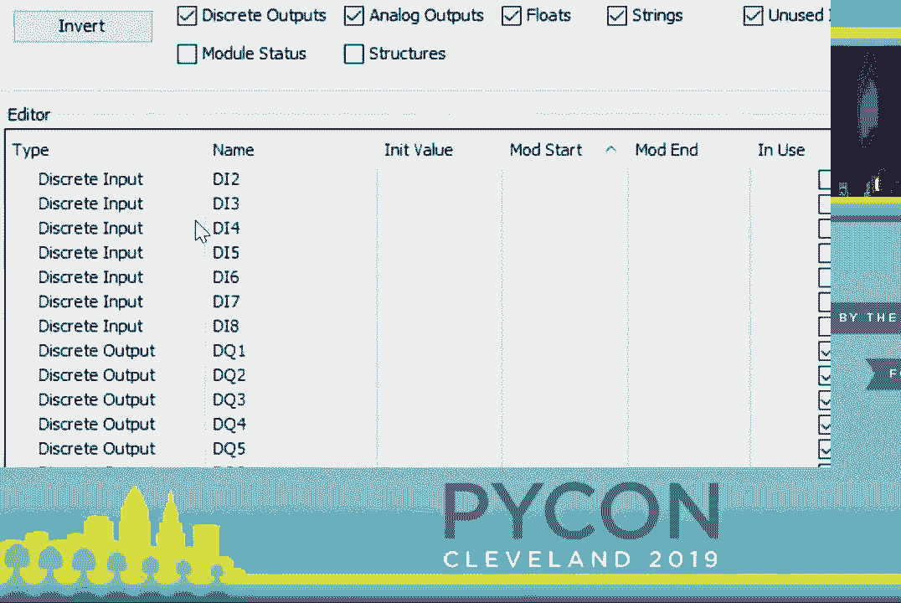

 done variables and all the way at the bottom are my timer durations and you can see that。

 something's different about them they have this mod start and mod end which are addresses。

 in a protocol called modbus。 So what's going on here is that obviously people wanted to wire these controllers together。

 so they developed a number of protocols where PLC's can write into each other's memory and。

 the way this particular protocol works is that you give a numeric address for certain。

 variables and then they become accessible over the network。

 This was meant for other PLC's but we have computers now so we can pretend to be a PLC。

 on your computer by doing pip install pi modbus and I came prepared so I have it already。

 so we're going to write a little bit of script to talk to the PLC。

 I'm running a bit behind so I'm going to use that arrow up trick to autocomplete a number。

 of times here so we get a modbus client we connect to our PLC which is an IP address。

 and then using this client we can do things like read those registers and I just know。

 that I have to start at address 0 and go for 12 and voila we have our numbers that are。

 the durations for our timers。 That's cool we can also write them and I'm going to use that feature to fix the traffic。

 light because why would pedestrians have to wait for two seconds until it even switches。

 to yellow let's make that 100 milliseconds。 By the way that's zero that's kicking around over here that's a bit of a quirk of the protocol。

 I don't have time to explain that we just have to accept that we keep reading and writing。

 a zero after the numbers we care about。 So now I set the first variable to 10 instead of 200 you can read that right back what that。

 means you press the button and instantaneously goes to yellow that's cool we fix the traffic。

 light pedestrians are happy but word gets out that we are now the traffic engineer of our。

 city so the treasurer comes in and says you know we installed that red light camera but。

 we never catch anyone can we make yellow shorter。 You're like I don't know but you're the treasurer you pay my salary so I guess let's make it。

 a second。 Here we go out to test yellow for one second red immediately drivers get caught but the。

 safety officer comes in and says we keep having all these pedestrian accidents can we maybe。

 make the time when the red is on for the traffic and the don't walk is still on for the pedestrians。

 a little bit longer so that there's a buffer。 So you're like I know that's at register address four I'm going to make that four seconds。

 for you got to try it out one second of yellow one two three four pedestrians and everyone's。

 happy city makes a lot of money from the red light camera no insurance claims coming in。

 from the pedestrian accidents you have money to hire a chief data officer for your city。

 they come in and they're like hey so there's always these discussions about traffic light。

 timing can't we use like machine learning and you're like oh man so you're like all right。

 let's import machine learning let's run some machine learning oh these are some good traffic。

 light times how about we write them to the traffic light so we started address zero we。

 run machine learning we program into the traffic light we press the button oh that must be。

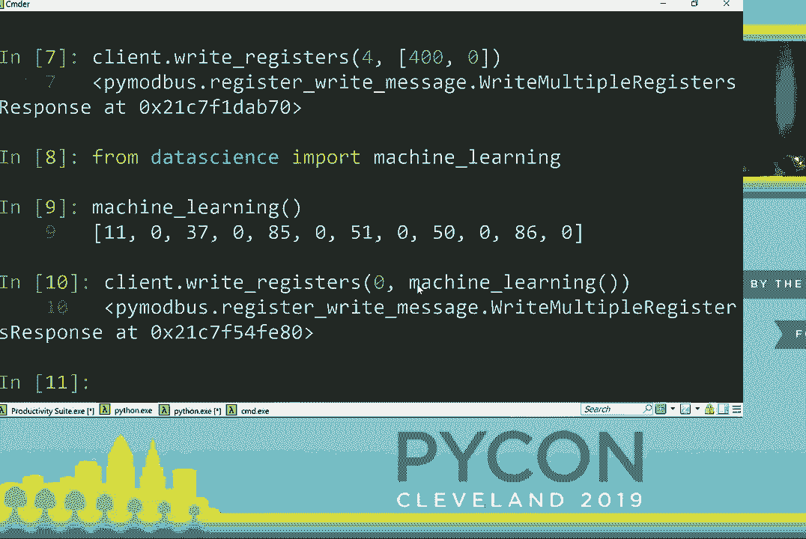

 a case of bias in machine learning it's biased towards runners because our data set was collected。

 when the data marathon came through town all right the example is getting a bit silly。

 but I'm using it to make a point obviously there's a lot of discussion in industry right。

 now what's the what the right way to connect the low level control programs running on a。

 PLC how to connect them to the sort of modern innovations in software engineering that often。

 run in the cloud and the buzz words here are often I IOT industry which stands for industrial。

 Internet of Things and or if you're in Europe they say industry 4。0 but actually mean the。

 same thing and one way I like to think about is that there are really two control loops。

 running one is the control loop that controls that runs in the PLC and controls the field。

 devices and that runs in the sort of millisecond iteration cycle that interfaces with the physical。

 world and does all the things that are timing critical or safety critical and it really。

 implements like the loss of nature and the loss of the road like don't show a green to。

 both crossing traffic because you will have accidents and you will get sued the other control。

 loop is the one that is influencing the parameters of the inner control loop and can do things。

 like adjust to the time of day to the traffic situation elsewhere in the city to maybe insights。

 gain from data science and that control loop is running much less frequently either minute。

 sometimes only every couple of months and that's the one that has the ability to do non real。

 time things things that take an unpredictable amount of time talk to databases reach out。

 to web APIs and sometimes it fails and it doesn't matter because the inner control loop。

 keeps running and everyone is safe。 That also means that for the control loop the small。

 the inner control loop running on the PLC you often have a regulated release cycle where。

 someone needs to sign off and certifications need to be obtained whereas on the one that。

 you implement in maybe your Python code in the higher level language you can continue。

 running your regular software release cycle with maybe biweekly sprints or whatever it。

 is you're doing。 Now come a couple of busy slides you're not meant to read all of them。

 but we looked at modbus and it's an okay protocol you need to know like weird numbers。

 there's zero floating around but not。 There are many other protocols out there in fact。

 there's a list of industrial communication protocols in Wikipedia which has about I think。

 50 entries and I what I did here is I listed all the ones for which we have Python packages。

 on PIPI。 The first slide out of vendor specific ones so if you purchase a PLC from one of。

 those vendors you are in luck because someone has put in the effort to implement this in。

 Python and you can just interface with it。 If however you do not purchase a PLC that is。

 supported by one of those you have to go to this slide which lists all the open standards。

 that have been developed mostly for machine-to-machine communication that we can tap into。 The list。

 is significantly longer I only include the ones for which Python packages exist and it。

 sort of gets the difficulty increases from top to bottom。 So at the very top I have modbus。

 which is like the grandpa of the protocols。 40th birthday is here。 We've covered this。

 and there are variants for serial port and network port。 Then come the TCPIP based standards。

 which are affectionately known as the office communications networking standards by the。

 industrial automation community because you don't really have any real time guarantees。

 you don't know how long it takes for the message to arrive。 That protocol has been built for。

 resilience against error not for time-critical delivery of messages。 There are a couple of。

 industrial standards that do support this。 Three of them are listed here。 A couple others。

 you might have to put in some extra work to build your own library and it's actually not， that hard。

 You get the standards document， import socket， import C-types and you just。

 start hacking away implementing the right order of bytes to talk to the machines。 It gets a。

 little bit harder in the third box because those are the things where you still use the。

 ethernet cable but no TCPIP。 No more IP addresses for identifying other participants in networking。

 You can still do that。 First of all， I should say， there's only one protocol supported by。

 Python package。 There are about 30 others that do not exist on PyPI。 Some of them you。

 can't because you cannot achieve the time considerations but the others you could do。

 with sockets and C-types。 I actually learned about this by reading some of those packages。

 mentioned in the small frontier raw socket and Dnet to understand how you do networking。

 in an environment where IP addresses aren't a thing which was news to me。 If you find yourself。

 all the way at the bottom， sorry for you because those are really standards that require custom。

 hardware and sometimes custom types of cables and your best shot if you have to tap into。

 that is to purchase a conversion hardware or a gateway hardware that turns that traffic。

 into network traffic for you。 Two examples。 PyADS is an implementation of。

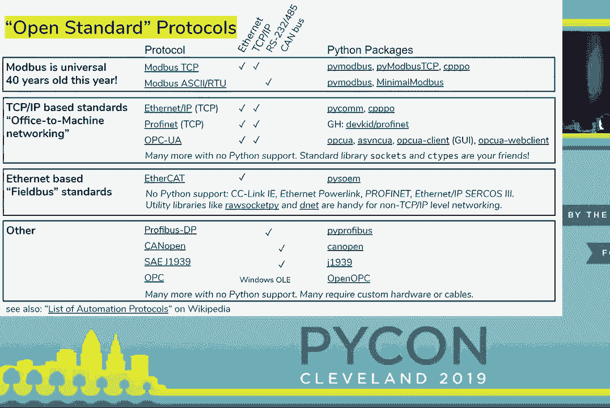

 back-offs ADS protocol。 Don't read all of it。 It looks very similar to Modbus with one。

 difference that you can reference variables by name and you can subscribe to changes。

 Another one I really have to mention is OPC UA for which the amazing free OPC UA project， exists。

 OPC UA is really the only one of those standards that you and I would recognize as。

 having a beautiful API。 One of the cool features about it is that it is discoverable。 You point。

 at the device， you connect to it and you can discover a tree of objects that represent。

 the variables and methods exposed by the device。 I'm also mentioning this because the free。

 OPC UA project has a number of Python packages in it that implement the standard， a client。

 and server。 Another one with client and server and pure async IO and one called OPC UA client。

 which is this GUI based thing that I have on the screen here。 It's very actively maintained。

 and really welcomes participation。 If you're into this kind of stuff， you should check it， out。

 I reviewed 40-ish packages。 I'm also running out of time in this talk so I'm going。

 to blast through this。 A couple of things that really surprised me。 There's a lot of activity。

 recently。 Many packages have been started。 In the last year， many of them are actively maintained。

 Many Python 3 only， very few Python 2 only， which really tells me that this is a space。

 that's gaining traction compared to when I first did automation with Python about five， years ago。

 Most of the activity is based in Europe which influences which brands are supported。

 and which protocols because there are some regional preferences between Europe and America。

 mostly on what's supported so you might see a preference towards things that are popular。

 in Europe and just surprising to me a lot of overlap with the home automation community。

 which I guess I was totally not aware of before preparing for this talk。 Cool。 Talked about， Python。

 So whenever you talk about industrial automation， someone comes out of the woodworks。

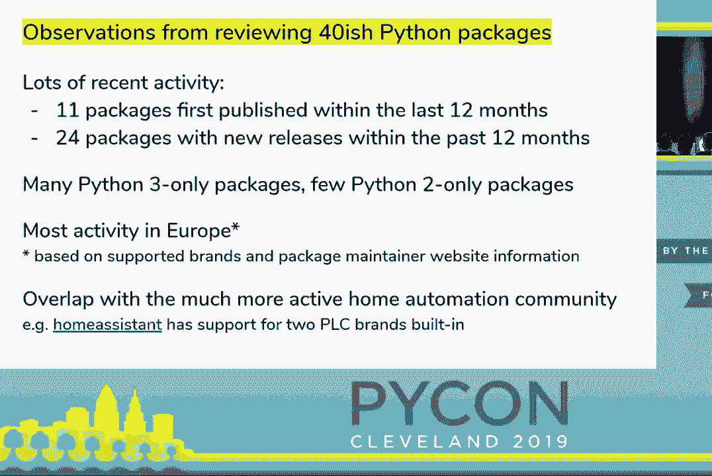

 and asks， "I have a Raspberry Pi at home。 It cost me 30 bucks。 It can do all of the things。

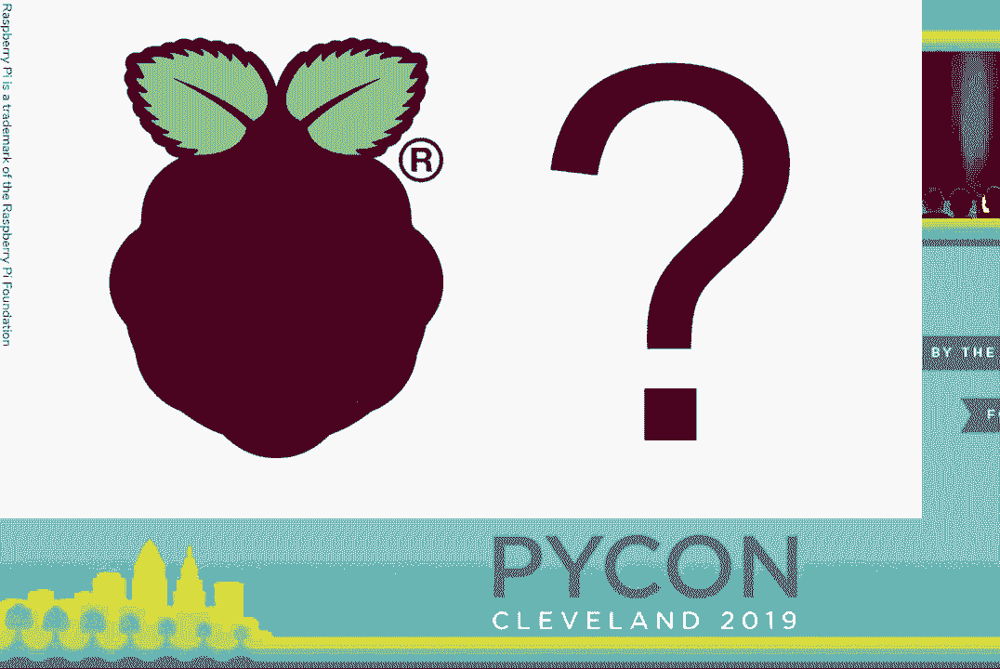

 you just said。" And the canonical answer to that is， no， it can't。 Your Raspberry Pi will。

 probably die in places that PLCs work because it's too cold， too hot， too humid， too salty。

 It doesn't work next to welding machines because of electromagnetic interference。 It。

 doesn't have ESD protection so you blow up the chemicals factory， plug in the sensor。

 the wrong way around， you fry your Raspberry Pi。 It doesn't even mount to those din rails。

 and work with the power supplies always used in most factories。 And the manufacturer doesn't。

 really give you supply chain guarantees。 If you actually buy a PLC， you often have a。

 guarantee that spare parts are available for several decades。 So currently you see dates。

 in the late 2020s and 2030s on manufacturer websites。 That's on the hardware side。 On。

 the software side， I touched on this whole real-time story a couple of times。 PLCs are。

 designed such that when you execute the code， no garbage collector or any of that nonsense。

 comes in。 You have guarantees about how long every instruction takes and it's actually。

 used in the advertisements and data sheets of TLCs for what these cycle times are。 All。

 the other things are really reliant on the fact that there is this real-time guarantee。

 and now comes the plot twist。 Maybe your Raspberry Pi is a PLC。 So next to two slides。

 list a few projects that actually give you trades of PLCs in Raspberry Pi。 I should say， first。

 if you don't care about any of the things on the previous slide， I mean use your。

 Raspberry Pi as is。 If you do care about them though， you might be interested in these things。

 A very popular one to turn your Raspberry Pi into a PLC at least software-wise is CODES。

 for Raspberry Pi。 Now， the code is a package that exists for many types of PLCs and hardware。

 and the way it works is that they developed a real-time kernel that lives next to your。

 main operating system， in this case， Raspbian， that reserves some of the CPU capacity for。

 real-time computations。 So they can have these real-time guarantees。 And then you use their。

 free editor to write code that is compatible with that real-time environment。 All the other。

 projects on here do the same。 Open TLC is a very cool open source project， actually written。

 in Python that has an editor and one of those real-time environments。 So that's worth checking。

 out and PiLC is slightly more limited in scope because it tries to emulate a proprietary。

 Siemens programming language but also has a runtime for Raspberry Pi。 If you need the。

 hardware stuff， you've got some products too。 Two options really broadly speaking。 You can。

 either take the vanilla Raspberry Pi and add an add-on module to it that brings all the。

 cool stuff you need like a rugged power supply， isolated IO， very supportive， very scan bus。

 and stuff like that。 And that's what Pi extend and Anduino， which I found out about， really late。

 which there's no details to do。 So they add an add-on to your existing Raspberry， Pi。

 The other option that I found one manufacturer doing， that's the revolution Pi product， they。

 actually do not take the standard Raspberry Pi that you can order on the internet and instead。

 they only take the compute chip from it and replace everything else that's on the Raspberry。

 Pi board with components that meet the requirements of a PLC。

 So they end up with a new single-board， computer that doesn't look like a Raspberry Pi but can fit into one of those cool enclosures。

 that look exactly like a PLC。 If I had time， someone could come up and ask the Arduino question。

 I would give a very similar answer to that but slightly fewer products on that list。 I'm。

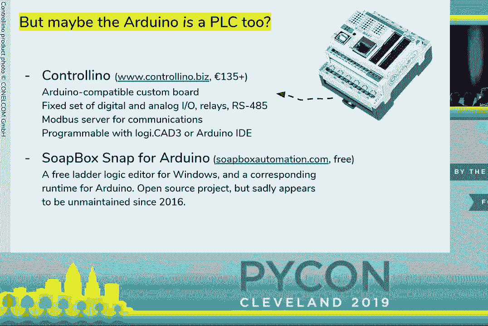

 out of time though and everyone says， "Hey， John， let's have lunch。 What should I do next。

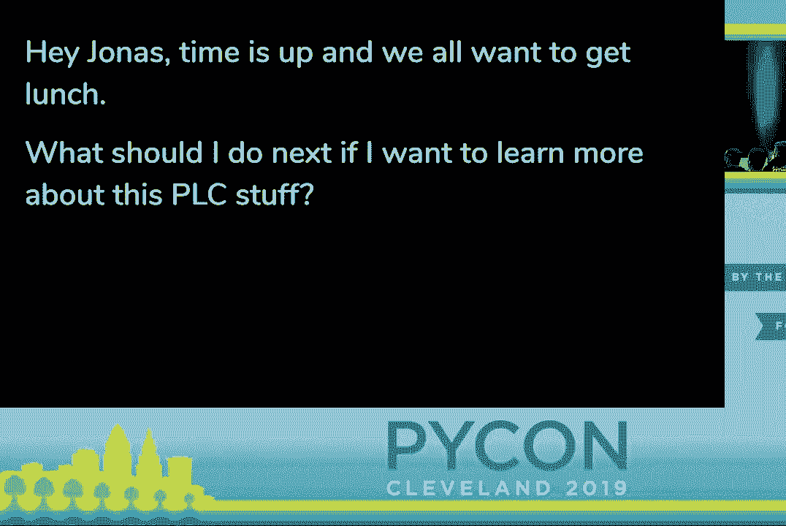

 if I want to learn more about this PLC stuff？" So I prepared this last slide for you which。

 on the left lists things that you might want to try out next and next to it on the right。

 has a couple of products and projects listed that might move you in this direction。 Also。

 there are a couple of appendix slides that you can look up online with longer lists of things。

 It goes from everything like free online simulators for ladder logic to using equipment that's。

 actually used in real factories which you often can buy on eBay。 One word of warning on those。

 if you want to work with tools from the market leaders which in the US is Alan Bradley and。

 Europe and most of the rest of the world is Siemens and sometimes Mitsubishi， they can。

 use software as a revenue source so they try to big license fees for the programming environment。

 If you go for smaller vendors you often get the programming environment for free sometimes。

 with a simulator。 Alright， that's my last slide。 I don't have time for questions but I did schedule。

 an open space this afternoon where everyone's welcome to stop by， ask questions， play with。

 the traffic light and the PLC。 Obviously if you're watching this on YouTube you can't come so。

 my contact details are also on the slide and one last thing， my work has given me a lot。

 of slack recently for preparing all this stuff time often things。 I lead a team of automation。

 engineers using Python to automate a biotech factory。 No ladder logic involved and we are。

 currently five people， we're getting ready to hire our six and we still have a slot open。

 for a summer intern if you're kind of running late so if that's interesting you should also。

 come talk to me。 That's all from me， thank you。

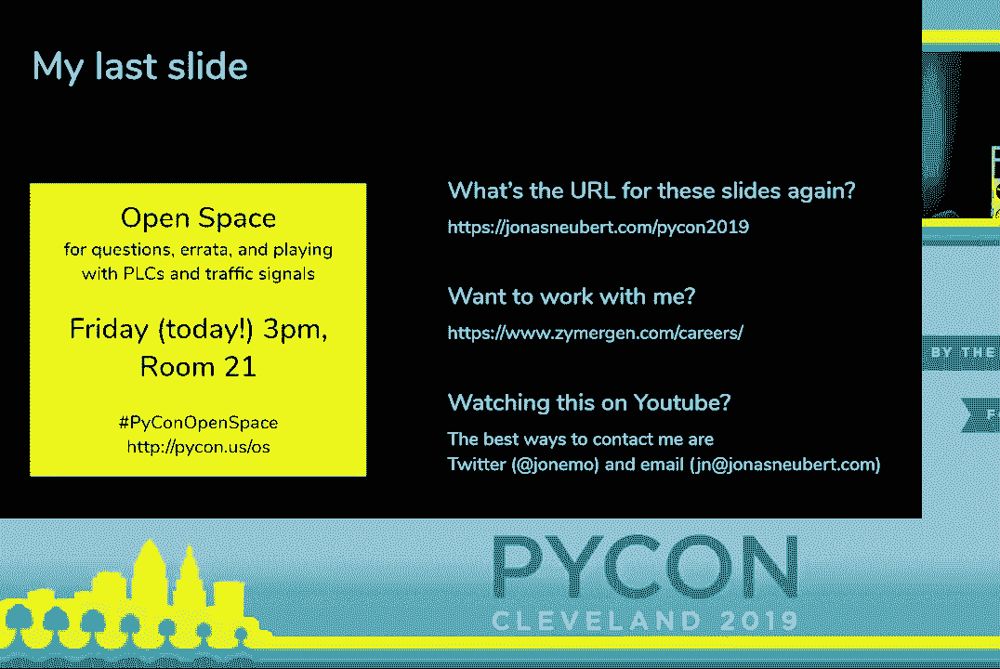

 [APPLAUSE]， [BLANK_AUDIO]。