# P27：Geir Arne Hjelle - Plugins - Adding Flexibility to Your Apps - PyCon 2019 - leosan - BV1qt411g7JH

 Hello everyone， it's time to get started。 Our first talk is going to be given by Yair Arne-Yal on plugins adding flexibility to。

 your apps。 Let's give them a big warm welcome。

 Thank you so much and a big thanks to the organizers for letting me speak here。

 My name is Gedon Iela， I work together with the real Python team to write articles。

 So this talk is partly based on at least some ideas in those articles。

 And what I'm going to talk about is essentially a very simple way to add flexibility and。

 modularize your code。 So something I call plugins。

 So the agenda for the talk is essentially I'll try to motivate a little bit why we should。

 care about simple code。 Although I hope that's also slightly obvious。

 And then the main part of the talk will be actually giving an example of how to build， a small app。

 We try to essentially see how we can make a small command line app that can plot your。

 data and how we can kind of modularize this to support different data formats， different。

 kinds of plots and those kind of things。 And then towards the end I'm just going to say a few words about a small package that。

 kind of supports this kind of infrastructure。 Okay， so quick motivation。

 If you have modularized your code typically what you end up with is something that's less， complex。

 You may have more functions and things like this but each function is doing one single， thing。

 You have the single responsibility principle kind of built in there and it's easy to reason。

 about what your code is doing。 That also makes everything much easier to maintain。

 easier to test those kind of things， and easier to extend later， easier to add extra functionality。

 So what I'm kind of calling plugins here means， so essentially built on the system you'll。

 see later that your app can be controlled easily by configuration settings for instance。

 or options to your code。 You can easily extend and customize your app even you can let your users do this。

 And by having things modularized nicely things are better structured and often typically means。

 that you can also develop faster especially if you're on the team you can have people。

 talk doing different kind of things without really butting heads against each other。

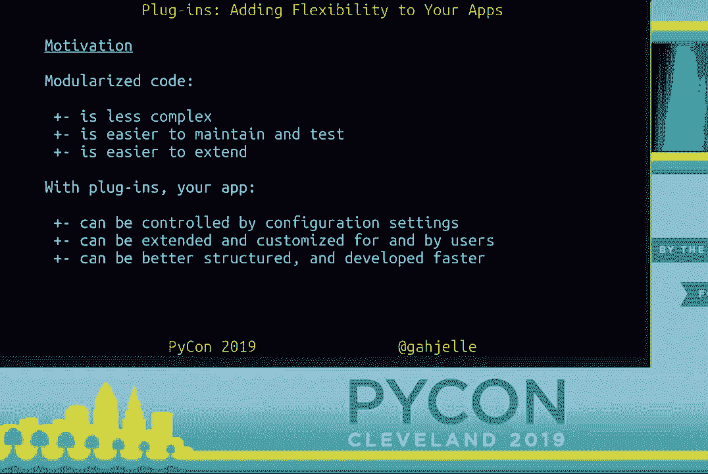

 Okay， so let's actually do this。 So what I want to do now is just show you how to build this simple plotter app and what。

 I want this to be is a small command line application that should be able to read data。

 from a CSV file and plot data in a simple line graph。

 So nothing really revolutionary but just to kind of have the example going。

 So what I'm going to do here and let's see we can even make this slightly bigger。

 It's just code up this little plotter function that I have and what I want this to do is。

 it's going to be a command line app so I'm just going to use this sweet little library。

 called click。 And what this does is that I can add this small decorator on top and say that this is。

 a command like this and then I can go to my command line and say that I want to run this。

 and of course not much happened but if I do help here you can see that I already got。

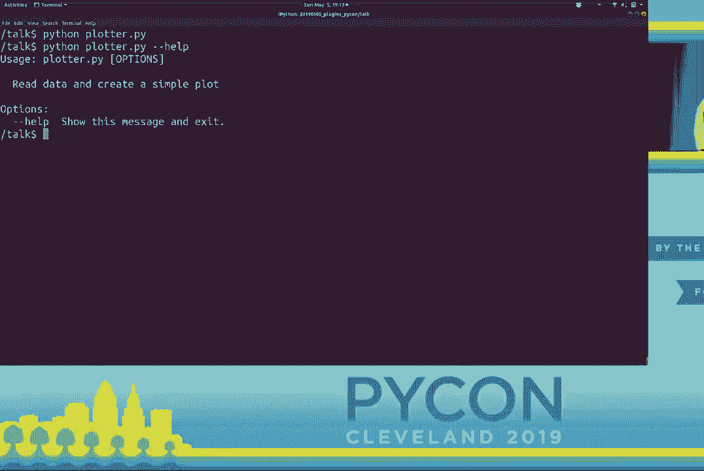

 some help message popped in here。 So this is done just by calling this a click command。

 And before I actually continue here because I'm going to use these decorators a little。

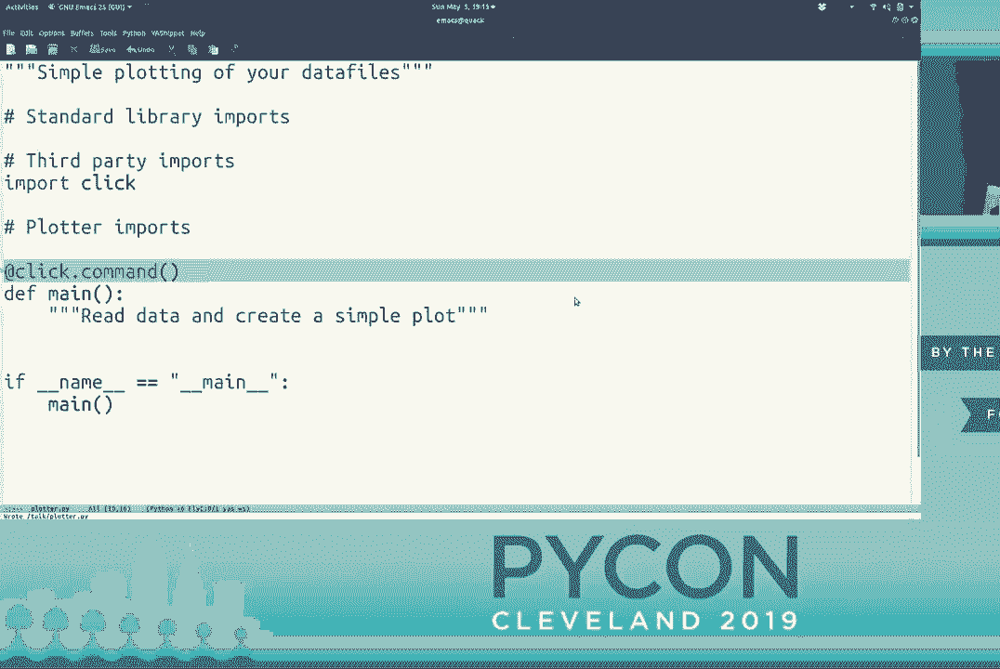

 bit so let me just stop here and take a half a minute crash course in what a decorator， is。

 So the thing you saw with the add symbol on top there is called the decorator and what。

 this is really just a function that you can use to wrap another function。

 And what it does is essentially have your original function and then you call your decorator。

 function on it。 So a decorator is really just a function that takes a function as an argument and returns。

 a function。 And what you kind of the thing you get out is the decorated function。

 So why do you want to do this？ Well you can add common functionality across many functions and methods。

 So the example here is that we're taking a regular function， the main function I had。

 and making it into a command that you can run on the command line。

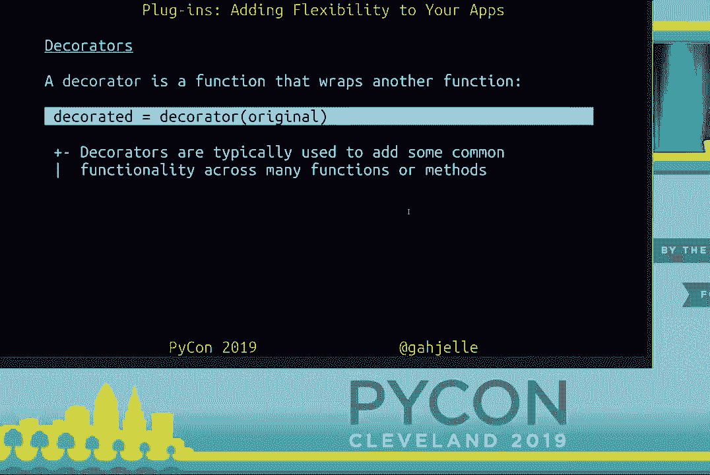

 And as I said what Python is doing is the decorated equals decorator of the original。

 function but the typical way that you write it is using this pie syntax or add symbol。

 syntax like we see here。 Okay if you want to learn a lot more about the Python decorators we have an article that。

 I wrote on real Python so you can go really into the dots there。

 Okay so back to our demo。 Okay I have this command and I want to read in a data file so that means that I need to。

 take this in as an argument。 So I'll have here the argument of a file path and this magically pops into my main method。

 then by handle by click。 And then I prefer my file paths to be pathlib paths so pathlib is a somewhat new library。

 in the standard library it was introduced in Python 3。4 and it makes it so much nicer。

 to work with file paths。 So I'll just convert the string that I'm really getting in here to a pathlib。

 So we have the file path like this and then I want to do what I want to do while I want。

 to read my data。 So let's just read data from the file path and when I have the data I want to create a plot。

 So this is essentially the script I want but of course now we need to add in those two。

 methods read data and create plot and those are fairly simple。

 So I first time I read data it takes in a file path and let's see what do we want this。

 one to do I want this to read in this case actually CSV data and return a Pandas data， frame。

 And with the magic of Pandas this is fairly simple I just need to do return Pandas read。

 CSV of the file path。 And now I've gotten another dependency here so let's import Pandas like this。

 Okay so now I have my data and they're stored now in the data frame。

 So the next thing I want to do if we go back to down here is that we need to create the。

 plot or something like this so let's add that。 So I'm getting the data and I want to plot them and again through magic of Pandas this。

 is fairly simple we just do data plot。 And finally I want to just make sure that I show the plot so then I'm using Matplotlib。

 so we need to import that as well。 So let's see Matplotlib like this。

 Okay so now we created a small app let's be good citizens and document this one as well。

 so plot the Pandas data frame。 And when we have all of this setup we should be able to run this so this is I guess the。

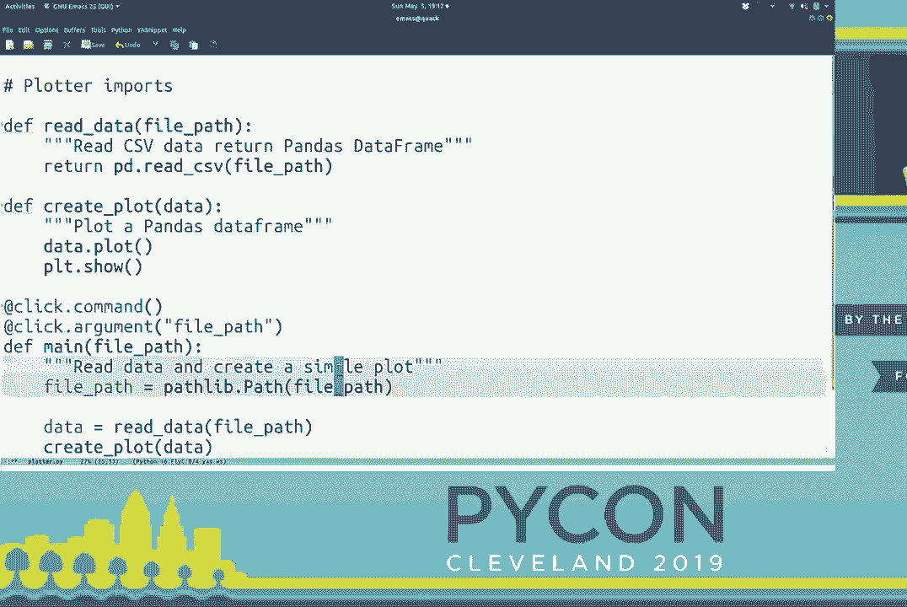

 exciting part of the talk。 So first of all now we can see the click has actually told me that okay I need the file。

 path so that's cool。 And then I should have some data hidden away here so have a CSV file with the iris data。

 this is a fairly well known data set about some iris flowers。

 And when we run this we get our plot up。

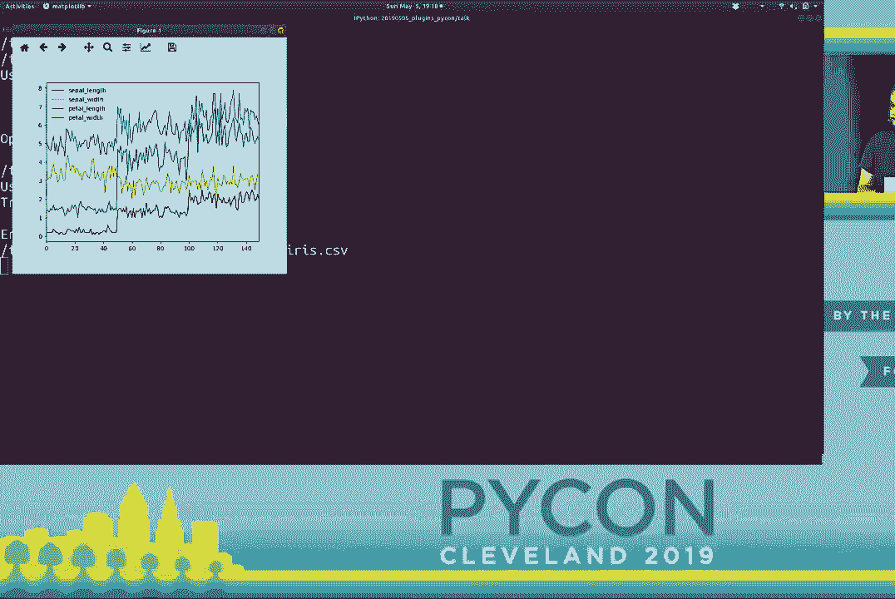

 So so far we built a fairly simple app okay no plugins nothing magic really happening here。

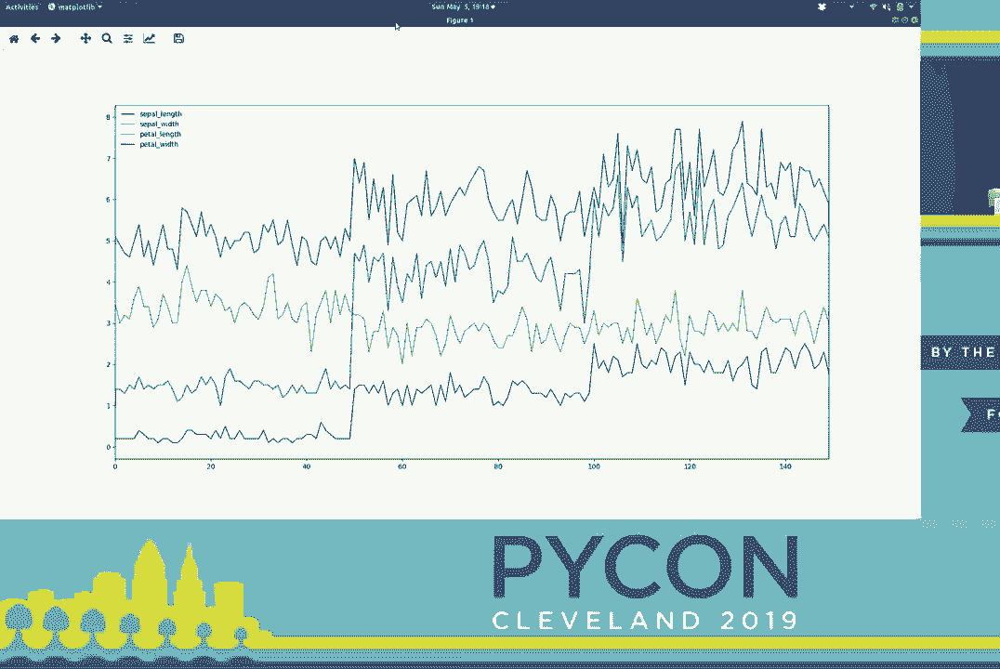

 but just okay we have something up and running。

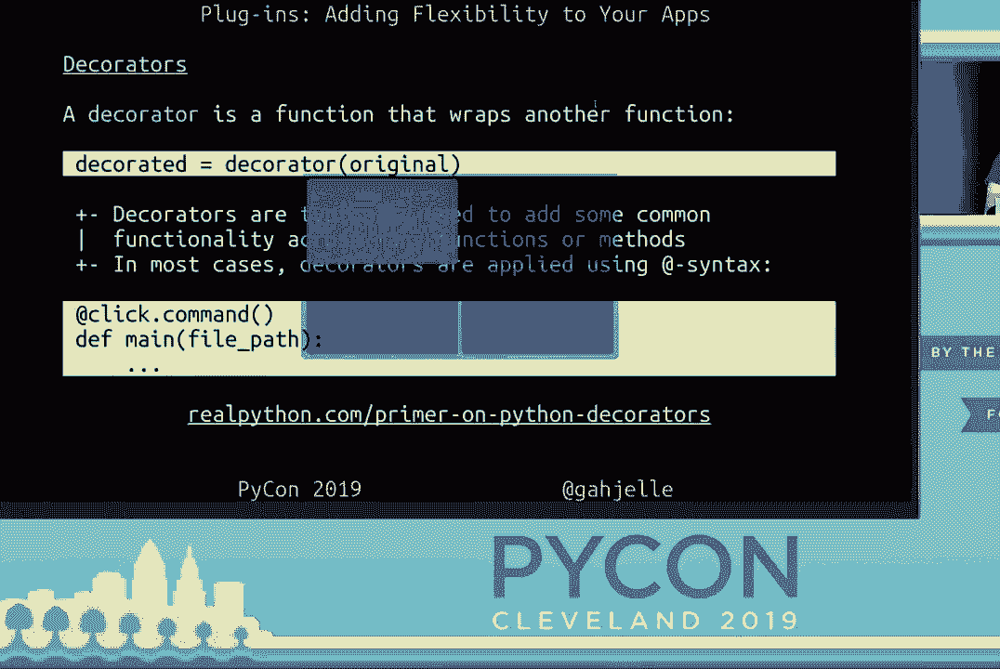

 So let's now expand this let's say that okay people have I have a JSON data I have data。

 in some weird format over there and of course if we try this so let's say that I have the。

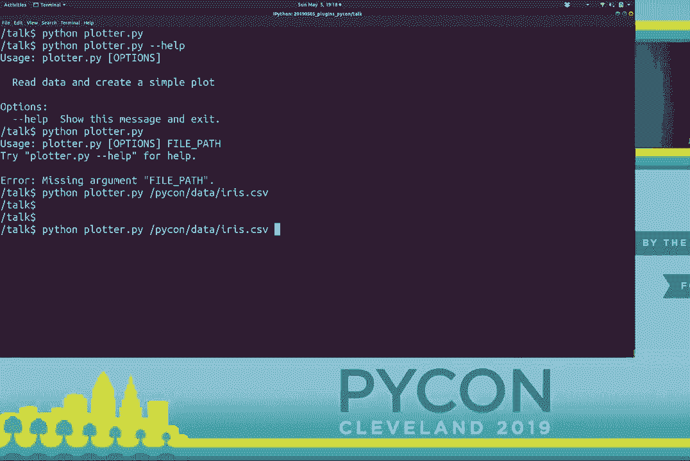

 iris data also as a JSON file and if I plot this of course it won't work because I'm expecting。

 to get the CSV file。 So I want now to be able to expand the plot rep so I can support more file formats I want。

 to be able to support more kinds of plots not just the line plot I had there and possibly。

 add in some control on which kind of data I want to plot and all those kind of things。

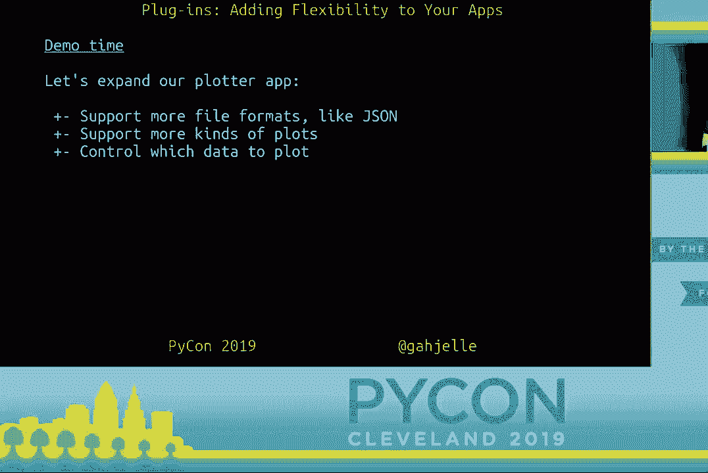

 So probably won't be able to do all of these things but a few things at least fairly quickly。

 So let's see let's see if we can instead of just reading CSV data here see that we want。

 to read at least CSV and JSON all kinds of data would be fun。

 And one way to do this then is that okay I need to figure out which format do I have， here。

 So this is one of the neat things with this with the pathlib is that I can just ask for。

 file suffix and that would be dot CSV or dot JSON so I'll strip off the dot and then I。

 can just do if format is CSV then we're doing the same kind of thing right while if our format。

 is JSON then we should do something else and in this case we can just create the JSON dictionary。

 or a dictionary from adjacent I guess and using the JSON library and then I just again。

 the pathlib I can just read this in as a texturing like this and then pandas can create a data。

 frame from this。 So if we do this and then JSON dict that should work now we need to import JSON like。

 this and I guess again we could be nice citizens and race and error if this goes wrong。

 Something like format not supported。 Okay so now hopefully my CSV will still work so I can still read the CSV file and let's。

 see if I can now read the JSON file as well。 Yes so now we got both of these and I have just for fun we also have a bigger JSON file。

 with more data that's not really that important for now but okay。

 This is fine I can keep doing this right。 In the typical application handling a format this might be more work than just the one line。

 read a CSV read a JSON and so this will be terrible to maintain after a while。

 If I have ten different formats maybe each of them takes five ten lines you do something。

 with this doesn't really work。 So what we want to do is actually modularize this out so that the read data is not responsible。

 for handling ten different formats but that we have one function that kind of handles each， format。

 So if we do that let's say that we then create ourselves a readers module that can read data。

 from different formats and if I now see I'll just go here and then I copy the code that。

 we have here and throw this into this one and say that okay this should now be a function。

 that's responsible for reading a file read CSV file and return data frame。

 And then I have a second function that reads a file path so this should read JSON file。

 and return data frame。 And this is almost like this let's see one small little thing here is that actually I。

 get my JSON function and the JSON library kind of nameclash there so I'll just call the。

 JSON library JSON lib do this and then we need pandas like this okay so now I moved the。

 functionality out so I have nice small little modular functions that have one single thing。

 that I want to do。 How do I actually now call this from a main code because now I don't need these things。

 Instead I want to import my readers the module I just created and somehow I now need to call。

 the correct function here。 So one way to do this could be that I get a function that tests the name of the format。

 from my readers module and then I'll just let's see I'll call that function。

 So let's see so if we do this now what I'm doing here is that I'm getting for instance。

 a CSV function from the readers module and I'm calling that with the file path so if we。

 let's see if that still works so this now what this has just done is now actually called。

 the readers JSON function through this get a get a third thing。

 So this is definitely better now we kind of move the responsibility away so now the only。

 thing that's a little bit nasty here is that this looks a little bit critical for your。

 readers so if you kind of comment your code and say okay what happened here so what would。

 be lovely to do here is that we would instead in kind of main application be able to write。

 something like readers read CSV from file path。 So if I could change this kind of slightly scary get a third thing and so on to something。

 like this that would be even even nicer。 So let's see one way to do this of what I'm actually doing now is I'm kind of moving a。

 little bit of the say the scary code that I have in my main application out to the out。

 to my data file or my readers file here and then I need to have a function here called。

 read which takes in the name of format or I'll actually start calling this now a plugin。

 and then it will take whatever arguments and keyword arguments that it's given and just。

 pass this on to the function that it wants to call。

 So here again I could do the same thing where I do some kind of get after to do this but。

 instead what I want to do here is that I'll create myself just a dictionary that's a list。

 of all the reader functions that are available。 And then I could look up in this dictionary for a function and then call my arguments。

 and keyword arguments。 And if we'll go back to actually do a slight。

 slight amount of error handling we can do， something like this if it's there and if it's not we should raise a typo saying something。

 like let's see， plugin， now it's not available。 And let's see finally this should actually return。

 So now I have something that can call these functions down here which is kind of what。

 I wanted to do over here。 What's missing now is actually populating the dictionary。

 So if you see here now the reader's dictionary is empty and I never do anything to actually。

 put the functions in there。 So now I need to just populate it and that's where we come back to our decorators that。

 I mentioned earlier。 So I said a decorator is just a function that takes a function as an argument and returns。

 a function。 So what I want to do now is just create a decorator that just registers the plugins。

 So I want to populate my， uh， a read dictionary and I'll do that by picking out the name of。

 each function and having that point to the function itself。

 And then as a decorator it should return a function so I just return the same function。

 without doing anything to it。 And what this allows me to do now is just say that I want to register the CSV and the。

 JSON functions here as plugins。 So when this code now is imported what happens here is that the register method function is。

 called here and puts the CSV into the reader's dictionary with the link to the， to the function。

 itself and similarly for JSON。 So let's see。 So now we have code here that says， okay。

 pick out the format and then call the right。

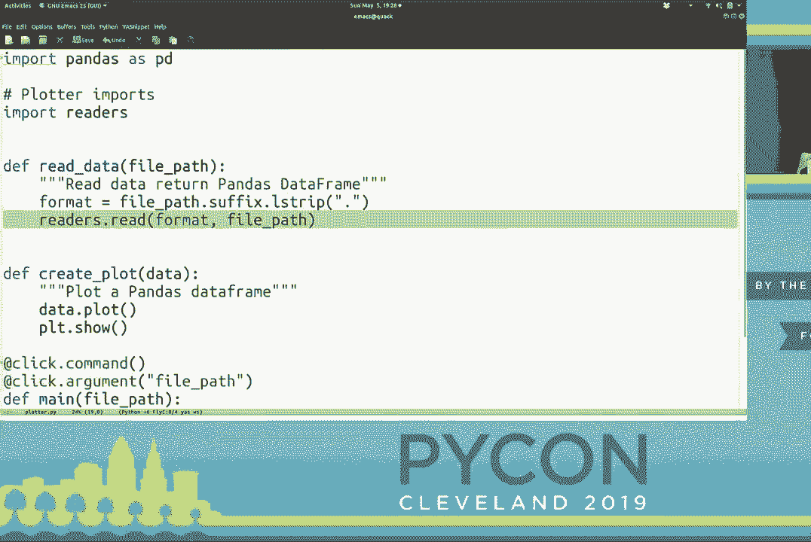

 reader and let's see if this works。 Else， race。

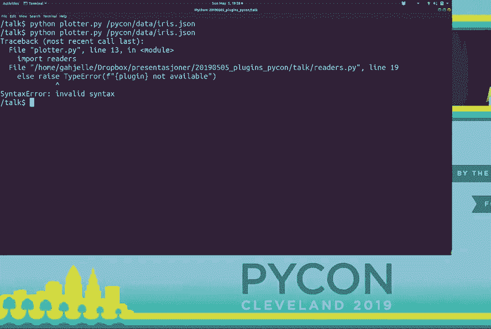

 Yeah， there's a colon missing there。

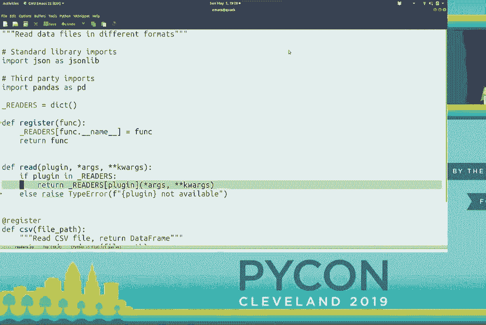

 There we go。

 And there's even more stuff happening。 Uh， it's not returned。 Let's see。 Where did we not return？

 Ah， yeah。 Sorry。

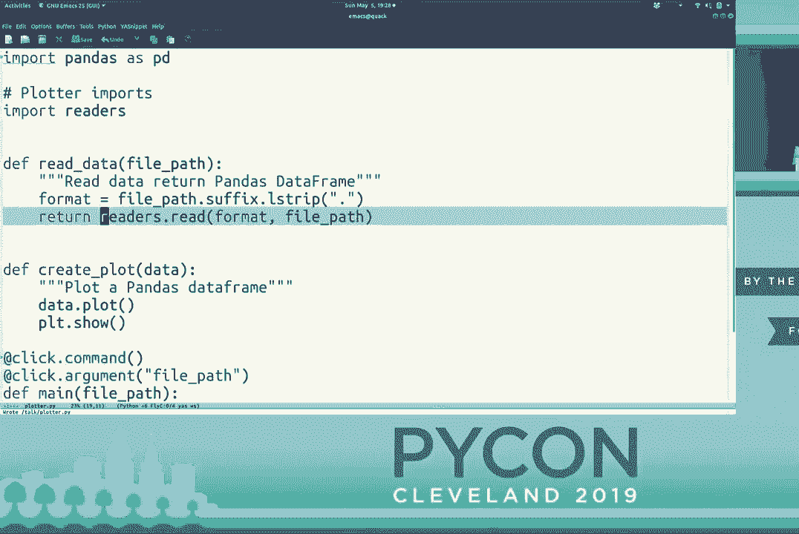

 In the main。 Ah， you're correct。 There we go。 Thank you so much。 Uh， there we go。

 Now we have it。 Um， so let's see what we actually have done here now。 Um。

 so now I kind of moved the fun， the complexity that I started to grow as I wanted to support。

 more formats out of my kind of main file。 I have my main structure going。 It's moved over to the。

 uh， to my module here where I have each little function doing just， one single thing。 So now， uh。

 we have a lot of， uh， mod， mod， mod， mod， mod， mod， mod， mod， mod， mod， mod， mod， the code。

 So it's much easier to handle。 I couldn't now， let's see。

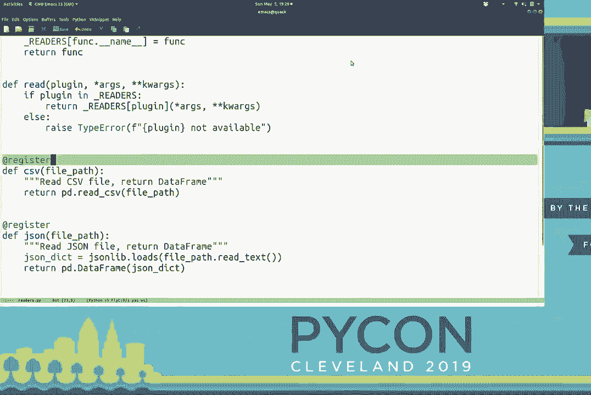

 If we go back to what we were talking about， I want to also support more kinds of plots。

 I could then add a plotter， uh， functionality that kind of works the same way。

 And what I would end up doing is typically that， okay， these things on top here， I could。

 just copy these guys over into say a plotter's module。 Uh， let's see here。

 So if I have a plotter's module like this， then I could copy this thing into here and。

 probably want to change the names to something that's， uh， plotters。 There we go。 Um， and， uh。

 and then I could do the same for the plot。 So I have line plots。 I would have scatter plots。

 all kinds of plots here。 Um， now this， this， this is a small code smell， right？ So I'm starting。

 I have a fair bit of setup that I don't want to copy around and things。

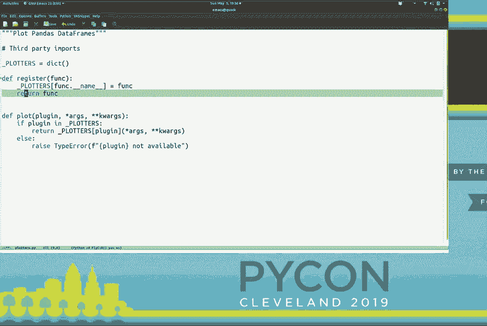

 like this。 So what， uh， we have instead is a small little package。

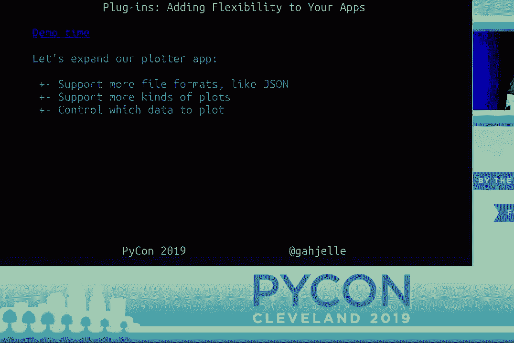

 It's called Piplugs。 That is available on PiPI， which is a simple decorator based plugin architecture for Python。

 And it essentially works， uh， with things that like what you've seen here， you can create， simple。

 uh， plugin packages。 Uh， instead of stuffing everything into the same file like I did here。

 what I typically， do is actually move it up a level so that， uh， I have a plugin， plugin package。

 so full， directory with readers。

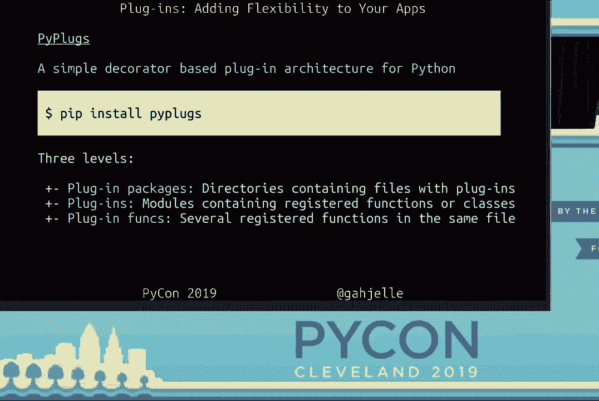

 So with this kind of setup， let me actually show it to you。 Um， Piplugs， there we go。 So here is a。

 uh， implementation of the same thing but using the Piplugs package。 So in this case。

 what I've done is that I've actually taken each of the readers and split。

 them out into their own files。 Uh， so then I create a plugin package that I call readers and plugin package called plutters。

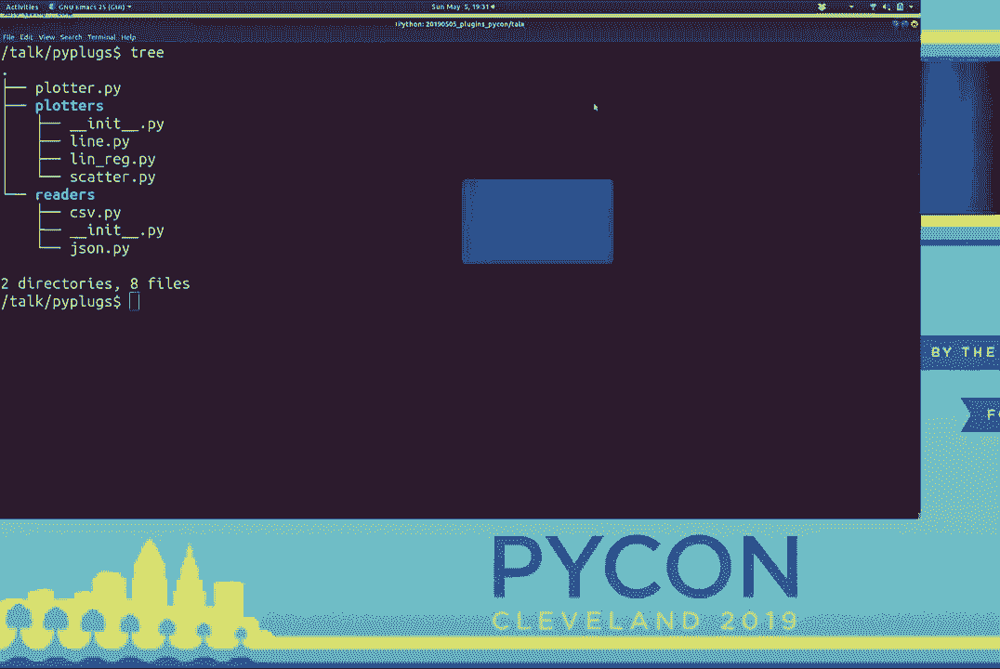

 And then， uh， the plugins is typically the whole module， uh， but with a called function， in between。

 It's possible to also add in several functions if， if you want， but typically the way it's。

 looked at is with packages and then plugins really。

 Um， and the code， and so let me show you that。 So if we first look at the plutter。py。

 so this is the， uh， simple plugin application， and it's exactly the same as what we have done。

 So you can see here our import readers。 This is now packaged， not just a module。

 And then I call readers read with the reader I want and then， uh， and then it runs off。

 How does the CSV thing look？ So as you can see， this is now， uh， very small。 Um。

 the only thing you need to do is import pipe logs and use the register decorator。

 And this does essentially the same thing as the register thing we wrote。

 It adds a little bit more bookkeeping so we can also pick out docstrings and things like。

 this have those easily available。 And then in the readers， dunderennet file。

 so this is the one that， uh， defines the package， and then when I have the read function inside of there。

 uh， that's just a， a call function。 So call a plugin。

 So you can see there's a call factory that just creates call functions。 So for readers。

 it's nice to call it read。 Makes it more， um， humanized， I guess。

 The names factory would just list available names that you have。 There's other。

 there's a doc factory and things like this。

 Okay。 Um， so with plugins like this， I've been using it now for several years in different projects。

 And it works really nicely。 It's， um， we used it for readers for different file formats。

 So one thing you kind of need to be careful with there is that you have a well defined。

 interface into your readers， right？ So in this case we had readers should， uh。

 take in a file path and return a data frame， for instance， if you want。

 if you don't have the same interface for all of them， it will， be a hassle to keep track up。

 But if you have sort of like equal things that you want to call like this， this makes。

 a lot of sense。 We used it for different models for flexible calculations。 I can then。

 in my config file， say that I want to use this or that's a machine learning library。

 to call my models or things like this， filters， writers for storing data in different formats。

 notifiers for sending notifications to different places。

 And also for components just for building my GUI。 So I can kind of say， okay， for this use case。

 I want to have these kind of buttons， this drop。

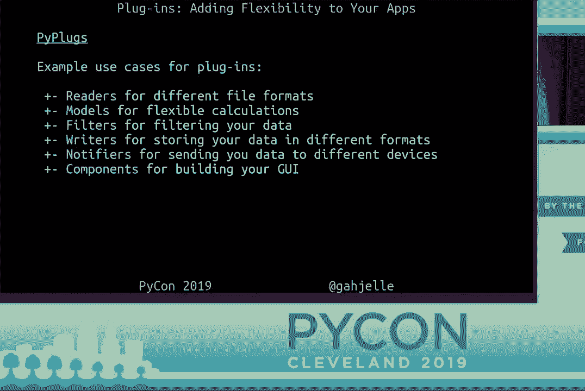

 down and things like this。 Okay。 Uh， so let's finish up。 Thank you so much for hanging out with me。

 And if you want to know more， you find me at， yeah， yeah， yeah， yeah， yeah， yeah， yeah。

 at most places。 The code here I'll put up on GitHub， uh， pipe logs is， as I said， on PIPI。 And um。

 I write for real Python， so you can find more articles there， including some that。

 at least mentioned these kind of plugins。 So thank you very much。 [applause]。

 If anyone has any questions， please come up to the mic and please remember to put your。

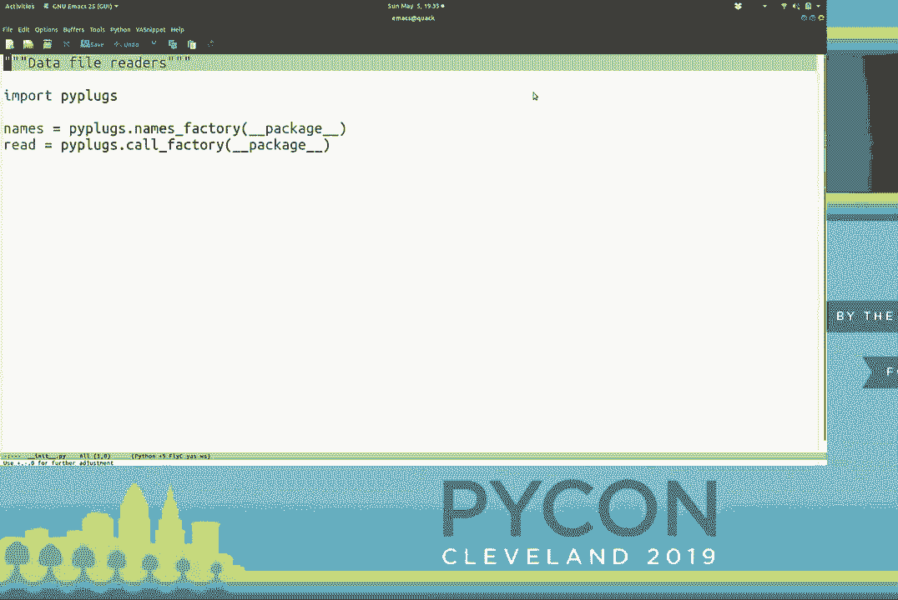

 question in the form of a question。 So maybe I missed something， but， uh。

 so in the PyPlugs readers module， or it was a， readers under a knit， uh， module， I think。

 I didn't see you importing any of the sub modules there。 Um， does it， so it just imports it or。

 because it， you seem to be kind of flipping the import。

 Does it just dynamically import when it needs to or how does that importing process work？ Exactly。

 Yeah， so you can see it just imports PyPlugs and then the crucial thing is actually that。

 it's a sense of a reference to this directory essentially with the package， uh， reference， there。

 um， to the PyPlugs， uh， thing。 So， so when things are actually called， it will go。

 it knows that because， well， I have， the package and I'm looking for a file。

 a module inside of this package and then it will dynamically， import that package。 And then what。

 for instance， this names factory， which is just listing everything， it will just， go in the。

 in the folder and actually import all the files that cease there so that will。

 be a fairly slow process， possibly if you have lots of sub imports， but the call just。

 goes directly to the module file。 And that's also one of the， an extra bonus， I guess， with， uh。

 with moving everything up， to the module level instead of the function level is that you can go directly to。

 to the， function you need。 Thank you。 Yeah。 Um， thank you for a talk。 If you were to allow， um。

 external plugins， um， in your application， external as in， I can。

 write a plugin for different types of files and， uh， plug it into your application， how。

 would you do that with PyPlugs？ Uh， so essentially what you need to expose is the。

 is the register thing。 So， uh， what， what I've done， I think， um， is that you。

 you would typically just say that， have a directory for custom plugins and then have them just import the PyPlugs register。

 there and then it will， you， you can set it up so that it picks up that package as well。

 essentially。 And there is， um， a very nice example of application called glue for visualization。

 This part of the Anaconda distribution， uh， that does exactly this thing。 It。

 it doesn't use PyPlugs but it uses essentially the same kind of system in the background where。

 you can add your own， uh， data readers。 So， yeah。 Hi。 Um， what do you， how do you feel about， uh。

 CDOC tools， uh， entry points？ We have had these for years and， um， they work pretty well for， uh。

 setting up a plugin， system。 Right。 Uh， no， there， there are many different plugin systems and， uh。

 I haven't， uh， I haven't， used setup tools entry points outside of setting up entry points essentially。

 So， so I don't know if， uh， if that could kind of do some of these things。

 I think this is a different level。 Yeah。 The thing is， uh， with setup tools entry points。

 you don't actually have to explicitly import， your， uh， plugins that they can be all the discovered。

 Right。 Uh， yeah。 I don't know enough about that too。 Say much。

 You mentioned the pie plugs works great when you have a consistent method signature for。

 all the different plugins。 Yep。 Many real world examples， uh， that may not be the case。

 Like the CSV reader may take in the delimiter， how strings are escaped， uh， where JSON those。

 parameters make no sense is， is pie plugs not really extended that case or how would you。

 go about that？ So let's see if we have this here。 So if we， yeah。

 let's have a look at the readers that pie。 So what really happens in the， in the read case is that。

 uh， it， it just passes through， whatever arguments it has。 So， so if you on the outside knows that。

 okay， for CSV， I have this and that argument， you， can just pass it through and it， it。

 it should work。 So it's just that you need to keep track of it on your side。

 You can't just switch between the formats as easily。 Yeah。 So like in a CLI。

 you might have like plug-in arcs is another parameter。 Right。 So that's a good thing。 Exactly。

 It's like it can kind of pass them on。 Okay。 Thank you so much。 Okay。 [APPLAUSE]， [applause]。

