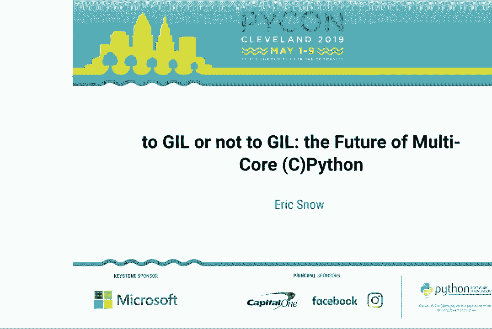
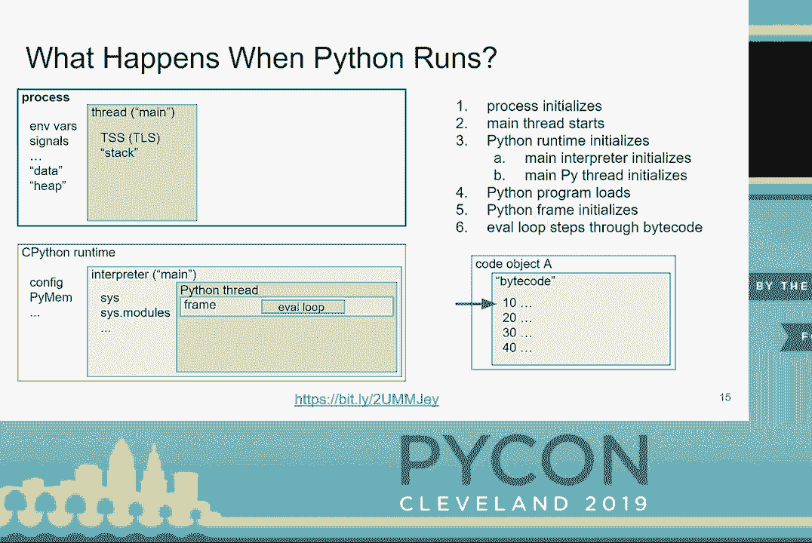
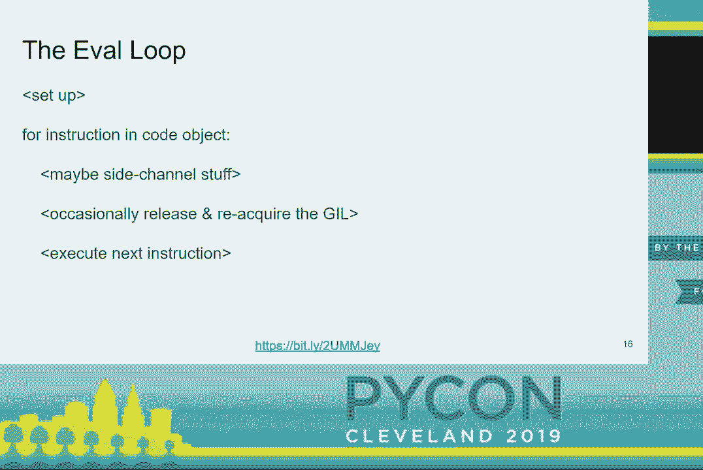
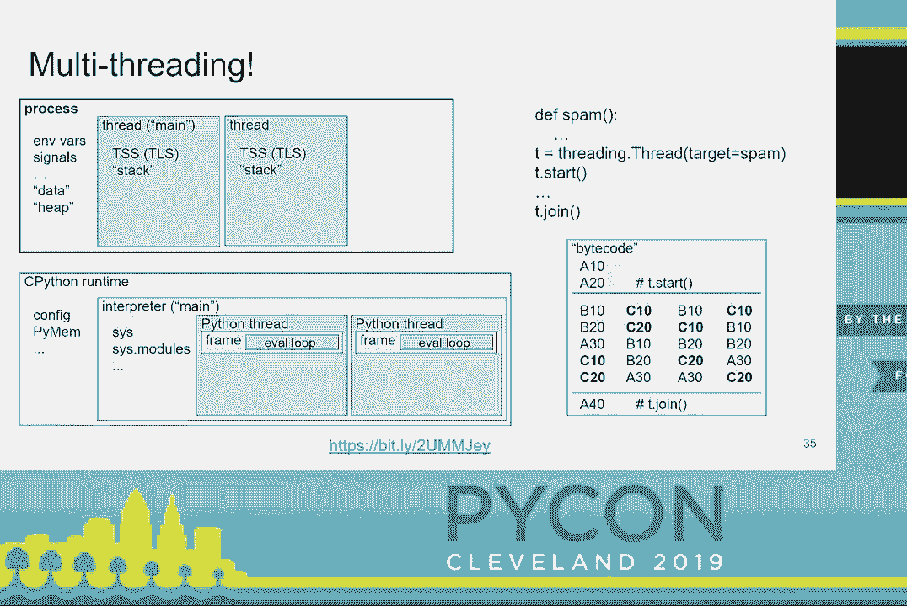
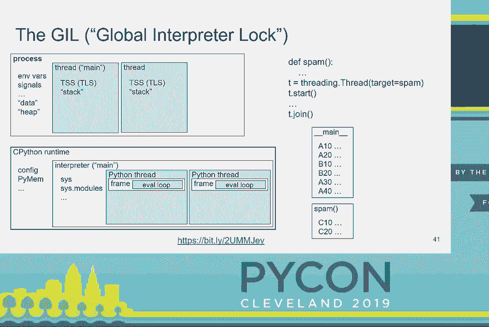
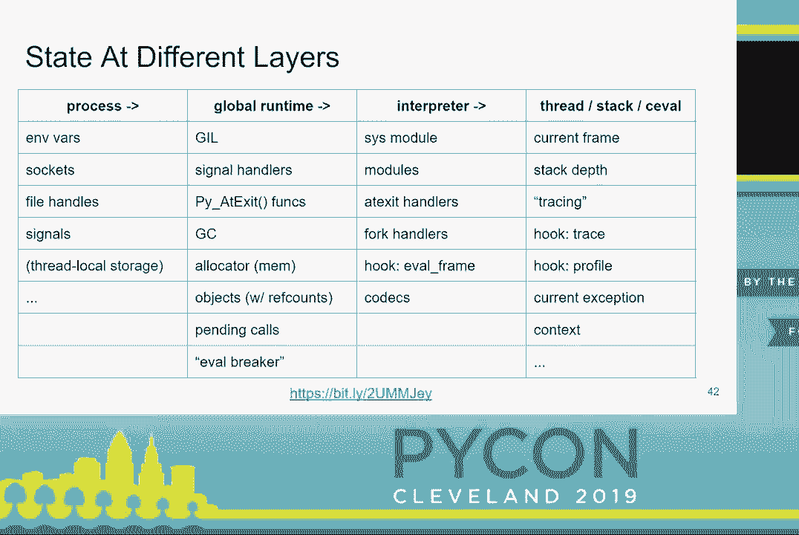
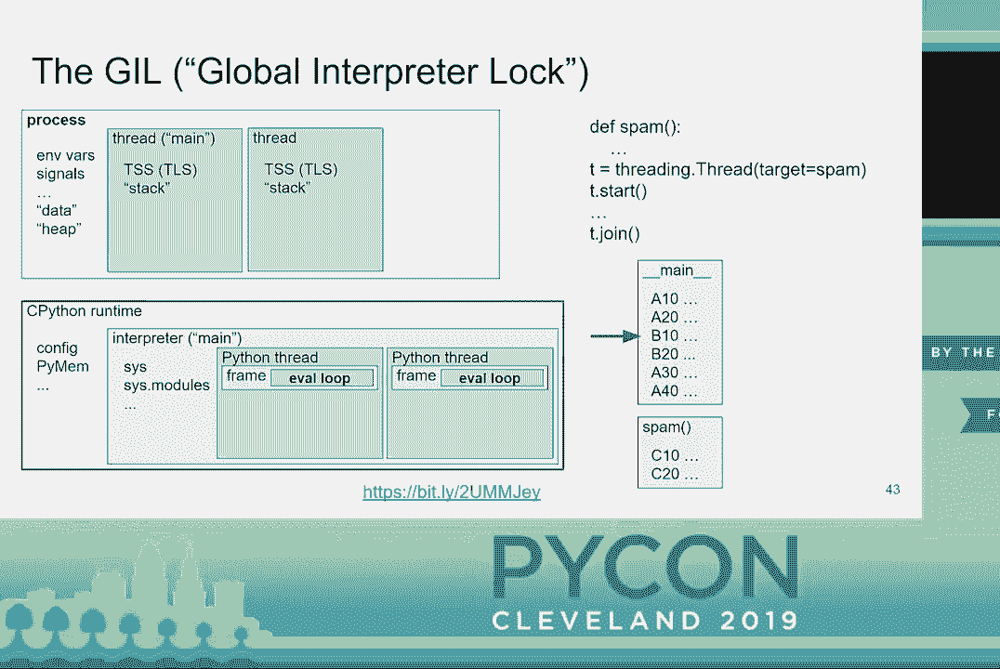
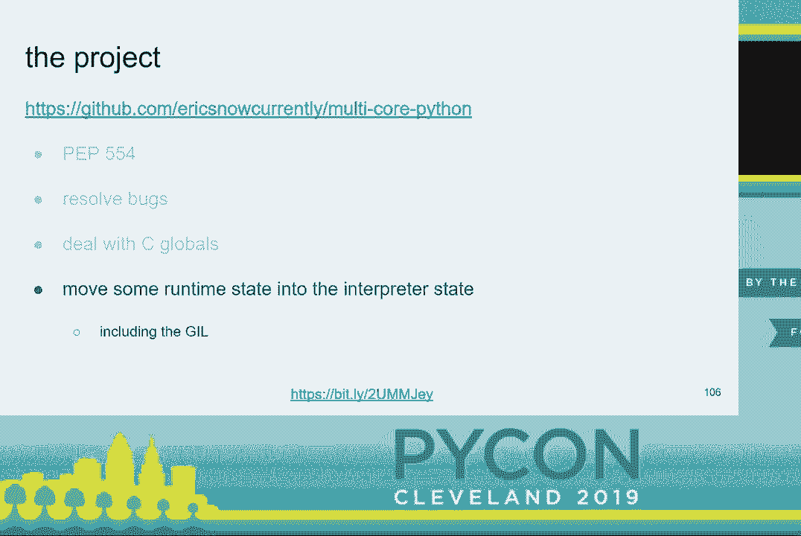

# P31：Eric Snow - to GIL or not to GIL - the Future of Multi-Core (C)Python - PyCon 20 - leosan - BV1qt411g7JH

 Hello everybody。 Welcome to our next talk。 Our speaker today is Eric Snow。 He is a CPython。 core contributor， a core developer， and he is going to be talking to us today about to。

 Gill or not to Gill， the future of multi-core CPython。 Thanks， Eric。

 [applause]， All right。 Thank you everybody。 Today we'll be talking about CPython's Gill and how we。 can move past it。 I'm going to try not to talk too fast， or this might be a short talk。

 So follow that URL to get to the slide deck， all announcing the updates to the slides or。 other resources on Twitter。 You may or may not recognize some of the things that I've。

 done as a Python core developer。 So why is the Gill topic in which I have any interest？

 In late 2014， I had an experience that motivated me to work on fixing Python's multi-core story。 So it's been a while。 Along those lines， we'll work on an understanding of the situation。

 and how it can be changed。 But let me be clear。 Before we start， I'm not going to be perfect。 in this description， and I don't have time to go into every detail。 There are a lot of， details。

 If we have time to take questions， I'm guessing that we will。 Okay。 So brace yourselves。 There's a fire host coming。 We're going to zip through a lot of， these upcoming slides。

 But by the end， we should have a pretty good understanding。 These。 are effectively the layers of C Python。 So there's just one runtime in the process， and then。

 there are one or more interpreters in the runtime。 There are one or more Python threads。 per interpreter， and there's one call stack per Python thread。 And then there's one eval。

 loop per frame in the call stack。 So let's see how this applies in practice。 The next bunch of slides are a less than exact representation， but it's going to be good enough。

 for us。 When a process starts， there are certain resources it has which are global to， the process。 Likewise， each OS thread has certain exclusive resources。 The runtime is。

 effectively everything Python related in the process。 An interpreter is all runtime state。 that Python threads share in common。 We usually use this term a bit more generally， but for。

 this talk， we're going to use a lot more specific meaning。 The Python thread is associated with。 the OS thread， and it keeps the thread-specific runtime state。 So when loaded， scripts， modules。

 functions， classes， and a number of other things， compile to code objects。 So when your Python。 program runs， it gets loaded， and so we end up with that code object， a key part of which。

 is the sequence of bytecode instructions to be executed by the Python interpreter。 For， simplicity。 let's say that our imaginary Python program compiles to only handful of instructions， when loaded。

 A real program would have a lot more instructions。 So the frame here holds。 the execution state of a running code object。 And the eval loop in the frame， or for the， frame。

 executes one instruction each time through。 So as we step through the program， we're going。 to do that now。 Watch how we visit each instruction in a deterministic order。 So that's kind of。

 the nature of a single thread。 And here's a rough sketch of what happens in the eval， loop。 At a high level， it's pretty simple， but there's certainly a lot of detail in there。

 And including here， you can kind of sneak peek at the driver for this talk， the Gill。 At this。

 point in our code， let's say that there's a function call。 Again， there would be a lot。 more instructions involved in the real sequence of bytecode。 So for the call， we push another。

 frame onto the call stack in the thread。 And then we walk through the code of the call function。 So here we're at the last instruction， and then we're back to the original code object。

 And we pop that frame off the stack。 And then we end our original code object here。 And now。 we're done。 And everything gets cleaned up at this point， and the process ends。 So as I hinted。

 earlier， we could have deterministically flattened all that execution just into a single linear。 list， kind of like we see there。 But what happens if there is more than one thread？ So again。

 we have a simplified fake program similar to the first。 And we pretend that the program。 matches the two lists of instructions shown here。 Once the second thread is running， we'll。

 see it both in the process and in the Python runtime state。 Each Python thread will be associated。 with its own OS thread。 And then in our code， the new thread will split off at that A20。

 labeled instruction。 And we'll wait for the thread again at A40。 So let's walk through。 this execution now。 And as we do， try to imagine how we might possibly flatten this code as。

 it executes。 At this point， the new thread is created。 And then now the eval loop in each。 Python thread is running different code。 And on a multi-core processor， they'll probably。

 be running in parallel， not just concurrently。 So we can see we have both eval loops， I put。 arrows there， but that's kind of what we're running through the eval loops。 So we get。

 to walk through both instruction sequences at the same time。 And here the second one， the。 second thread is about to finish。 So here the second thread is finished and cleaned up， but。

 the original thread keeps going。 And then the new thread had already finished。 So when。 we get to this point， we're drawing， there's nothing to do。 So now we're done。 So if we。

 look back at how the execution unfolded， and we had the two things going on at the same， time。 you know， you can't really flatten the code like we did before deterministically。 Why？

 Because threading is non-deterministic concurrency。 And so there are a bunch of。 different possible permutations of the instructions。 And here I'm just showing for the permutations。

 And there's a closely related problem that is pretty important to what we're talking。

 about today， which is race conditions。 Because of that non-deterministic code in one thread。 may modify code in another thread unexpectedly or modify the data relied on by that code。

 And this is known as a race condition。 Notice how it's possible for thread A to make the。 assumptions of thread be invalid here。 If you get into that if block， you would expect， that spam。

A would still be 42 or not be 42。 But that gets broken。 So mostly we solve this。 by using something called a lock or a mutex around the critical sections of the code。 The。

 locks allow you to synchronize between two threads， thus giving you deterministic order。 for the locked code。 Only one thread can hold the lock at a time， which is from the time。

 it is acquired until it is released。 If another thread tries to acquire the lock， while it， is held。 then that thread locks into the lock gets released。 So we're not going to have both。

 threads running at the same time through those sections。 So if we assume that thread A acquires。 the lock first， we end up with the execution order that I have there on the right。 So you。

 notice how the logic of thread A， it doesn't interfere with that of thread B anymore。 And。 if thread B had gotten the lock first， then that section would have run first， but the。

 same protection would have taken place。 Okay。 So that's a lot of detail。 Take a breather。 You。

 have to find it。 Okay。 That's enough。 So the gill is the lock that protects C Python's。 runtime resources from races。 And if the gill wasn't there， then C Python wouldn't be thread。

 safe for the most part。 You'd have some pretty serious problems。 So here's a look at a lot。

 of the state the gill is protecting from races。 The eval loop we see here is the main driver。

 for how the gill guards those resources。 Only one eval loop runs at a time。 So when we're。 multi-threading， this is the state we're in。 We have one arrow instead of two like we did。

 before。 The Python threads take turns executing a few byte code instructions in their values。 which is kind of in this position in our simplified look at the eval loop。

 The gill is also released， in blocking situations in a few other places。 Now that we know what the gill is， let's talk， about why we care。

 There are probably some maybe more than this， but really this is the。 best I could come up with for the cost of the gill。 But when I thought about the benefits。

 these are the number of the ones that I could think of。 And if you think about it， there's。 a lot to be gained by the gill that people don't consider when they talk about the gill。

 But aside from the technical considerations， there's also an unfair perception that the。 gill hurts everybody。 I don't want to downplay the pain that it causes on people who really。

 need to do some CPU intensive Python code。 But otherwise， it's the gill really a problem。 So why isn't it as big a problem as so many people suggest？ One of the big reasons is。

 that the gill gets released in a lot of key situations。 So unless you're doing some serious。 computation in pure Python code， the gill really isn't going to hurt you all that much。 But。

 as long as there's a gill， folks will complain。 It's just the way it is。 So people have a。 few ways of dealing with the gill。 So in C extension modules， you can take advantage。

 of various features that allow you to release the gill around C code that doesn't really。 touch Python's -- the different resources in the Python state。 Over time， there have been。

 a number of attempts to remove the gill。 And each ran into its own problem a lot related。 to performance of single threaded code。 I will point out that the work that Larry's。

 Hastings has done with the Gilectomy while it's on hiatus right now， there are certainly。 opportunities that some of the blockers can get taken care of。 Then it's entirely feasible。

 that that might actually remove the gill， which would be really neat。 I know that he would。 say that he's already removed the gill and that's correct。 But it's about getting the。

 performance up to stuff。 And what's interesting， one of the best things about Python is that。 people get talking in person。 And so there's some neat developments going on that I really。

 hope are fruit in that regard。 So we may be seeing more from the Gilectomy or not。 We'll。 see how things play out。 But it's neat stuff。 I recommend reading up on Gilectomy and Larry's。

 past talks about it。 And onward。 So C Python isn't the only Python implementation。 And。 sometimes we forget about that。 Some of the others don't have a gill。 They already support。

 multi-core Python code。 And yes， they aren't up to maybe the Python version that you want。 But you can always help out。 Sometimes it's worth diving in and see what you can do to。

 help these tools。 And then you can take advantage of them。 So worth looking at。 If you're really。 interested， there are opportunities there。 Okay。 We made it。 So let's talk about what。

 we're doing about the Gile。 Changes to the CPI are one major way to deal with the Gile。 The CPAs are a great thing。 But it's got a handful of problems， some of which we've worked。

 at resolving and some we're still working on。 And they have a cost to us。 To a large extent。 the CPI is one of the main blockers to removing the gill。 The hard part is that we can't just。

 change the CPI in any way we want。 Backward compatibility has always been very important。 for core development of Python。 And notably the same problem also impacts efforts to improve。

 CPython's performance。 So why do we have these problems？ Well， it's not like anybody messed， up。 It's just it's hard to look 20 years in the future。 But let's look at possible solutions。

 So just be clear， nothing's going to change on its own。 And Python's all volunteer。 So。 there's a limit to how much gets done based on how much people have time just to use for。

 free to do this stuff。 But that's the nature of open source， you know？ And we own that。 Two things that help are things that we're already working to improve right now。 And specifically。

 one of the things we're doing is trying to layer the CPI so things don't leak out of the。 different layers quite as easily。 It's part of that。 The leaking is part of the problem。

 Here are some of the ways we might resolve the CPI problems， particularly for the sake， of the gill。 And there are plenty of other solutions， possible solutions。 These are just， a few of them。

 So quite a few people are involved in the effort to fix problems with the CPI。 Here are some of the projects with which I'm most familiar or I'm involved even。 So these。

 are -- and you can follow these links。 You can look at my slides later and take a look。 at some of these things。 Really interesting projects going on。 A lot of discussion on here。

 on the CAPI SIG and also on the Python dev mailing list。 So what else is there？ So if any of。 you have ever talked to me about this stuff， then you should have expected this。 What are。

 sub-interpreters you might ask？ Well， so remember we said that we're using the interpreter in。 kind of the more specific way。 And a sub-interpreter is in the extra interpreter beyond the main。

 one in the process。 We started with one interpreter like in our diagrams and then we add more。 Each of those extra ones is a sub-interpreter。 So if we look at that earlier diagram， here。

 we have three interpreters。 The main one and two sub-interpreters。 They're all doing different。 stuff。 You have multiple threads per interpreter。 They're all more or less the same。 And they。

 each have their own state。 All interpreters are mostly effectively isolated from one another。 We're working on fixing some of the corner cases。 But for the most part， they're isolated。

 And that's really the objective。 It's also worth noting that not all C extension modules。 will be able to run in sub-interpreters quite yet for a number of reasons。 But we're working。

 on that too。 Finally， sub-interpreters aren't a new feature。 They've been around for a long， time。 And the new thing that's going on is we're working to possibly expose them in， the standard library。

 So my PEP， which is PEP 554， is focused on exposing the existing。 sub-interpreter C API in a useful but minimal way。 The proposal is still under consideration。

 for Python 3。9。 And there's no guarantee to be accepted， but I'm hopeful。 And first off。 with this PEP， what we're doing is we're adding a new module to the standard library。

 that exposes that essential functionality from the CPI。 Here's a simple example of executing code in a sub-interpreter。 First， we create a new， interpreter。

 which is what that call does。 But nothing gets executed yet。 And then we， execute some code。 So for now， we only execute text strings。 We'll， at some point， look at。

 the possibility of executing other stuff to， like code objects， functions， whatever。 But。 we're starting with minimal and moving out from there。 Also note that when the code runs。

 in a sub-interpreter， it runs in the sub-interpreters under main module。 Sub-interpreters will be。 most useful when combined with threads。 So here's another example。 This one， same thing。

 just running in a thread。 So here's another example where we're using the same sub-interpreter。 multiple times。 And what's neat is state is preserved between runs in the under main， module。

 So we'll look at that。 It can be super useful。 In the first run， we set up some， state。 And then in the second run， we use it。 So what's nice is if you got a whole bunch。

 of workers set up in sub-interpreters， you can initialize those in the interpreter ahead。 of time and then handle requests coming in with your sub-interpreter already pre-populated。

 and set up ready to go。 Okay。 So the CAPI only covers creating sub-interpreters and running。 code in them and that sort of thing。 So at first， the PEP exposed this functionality and nothing。

 else。 And I found pretty quickly that that wasn't quite enough。 So isolated interpreters。 aren't really useful。 They are useful but not nearly as useful as when you can pass data。

 between them safely。 So the PEP adds a minimal mechanism that I've called channels based。 on law prior art out there。 And currently only simple mutable built-in types and singletons。

 are supported in channels。 Also， for now， we passed serialized raw data between the interpreters。 rather than the actual objects。 And finally， channels are currently unbuffered。 And there。

 are a few other details。 But basically， again， we're starting minimally and we're going to。 kind of expand out from there。 So we do have plans for addressing these limitations in。

 future iterations。 Here's an example that generates some data in a thread under a sub-interpreter。 and processes that data in the main interpreter。 So first， we create the interpreter in the。

 channel and we get back the two ends of the channel distinctly typed objects。 And then。 when we start a thread that will execute some simple code in our sub-interpreter。 And here。

 notice how when we call run， we specify the channel end to inject into the sub-interpreters。 under main module。 And then we use that channel end in the executed code。 And there in that。

 case we're sending data out。 And then finally， we pop the data off the channel in the main。 interpreter so we can process it there。 An important feature of channels is that sending。

 and receiving are both blocking operations。 And this is the main way that interpreters。 can be synchronized。 Async await for me doesn't really fit in my brain。 It just doesn't work。

 for me。 I suspect I'm not the only one。 So I'm happy to say that sub-interpreters facilitate。 alternate concurrency model that I find fits my brain quite well。 And this model is pretty。

 well described。 A lot of research， a guy named Tony Hor， CSP， it's called， communicating。 sequential processes。 So a key here is that unlike traditional threading with its unbounded。

 data sharing， with sub-interpreters you get opt-in sharing。 And next， even though it isn't， perfect。 we're getting better。 I love this analogy here。 It really matters in a lot of， situations。

 So let's get to the part where this intersects with the gill。 Sub-interpreters。 are a way that we can get rid of the gill。 But how？ We're going to stop sharing the gill。

 So currently， sub-interpreters still share the gill between them。 And that， you get all。

 the downsides of the gill。 If you remember this chart with all the state that we have， to deal with。 currently the gill is part of Python's global runtime state。 If we move。

 it to per-interpreter state， then we can get multi-core parallelism。 So I'm a bit hand， wavy here。 I'll admit。 But making this happen shouldn't be a terribly invasive change。 In， fact。

 that's an important requirement for what I've been working on。 I don't want to， make big changes。 So all this sounds too good to be true。 No one's done it yet。 But why？ Because， well。

 possibly they didn't know about sub-interpreters or sub-interpreters were。 important enough to those people。 But regardless， I'm doing the work right now。 I came along。

 I'm trying to make this happen。 Regarding the blockers， there are some blockers that。 are straightforward and pretty discreet。 We're working on those。 We've got to figure out。

 what to do。 If we don't have a gill anymore to protect global state， then we have to minimize。 global runtime state and guard the remainder with more granular locks。 But that's not really。

 going to impact the execution of Python code。 Now， my project's advanced kind of slowly。 I just haven't had a lot of time。 But I've relatively recently joined Microsoft and they've。

 been kind enough to give me time to work on this each week。 So I'm hopeful that we'll。 make a lot more progress coming up。 So there's another blocker that's really a serious pain， point。

 We've got to deal with this。 All sorts of things， especially in C-Extension modules。 We can handle the C-Python part， but C-Extension modules is kind of a problem。 We're working。

 on a solution though or a variety of solutions。 It's going to be important though。 So the bottom。 line is I'm working on this。 It's an active thing and I'm really hopeful that it's going， to happen。

 I'm always looking for people to help。 So if you want to help， let me know。 So what's nice is that a lot of my underlying needs for this project coincide with those。

 of other core developers and also other projects out there， even in a lot of enterprise use cases。 So I'm getting the love help indirectly that way。 My project entails these three efforts。

 And the most important one of those is moving the gill down to the interpreter level。 Here's。

 all the state we're going to probably be moving。 And then really all this stuff is a good idea。 regardless of how my project ends up。 Like 90% of the work that I'm doing is worth doing。

 regardless。 So I've got that。 I will never feel like I've wasted my time on this regardless。 of how it turns out。 I'm still hopeful though。 So this is my plan。 Pretty straightforward， right？

 That's it。 So I think we have like zero seconds for questions。 So if you have any， questions。 just I'll stay in the hall for a few minutes afterward or you can find me。

 during the conference or get in touch with me。 Thank you。 \>\> We've got about three minutes for questions。 So if you have questions， you can go up to the。

 audience microphones there。 Please keep your questions short and directed at the speaker。 If you have longer questions， you can grab them the hallway。 \>\> Yeah。

 So what is the difference from and benefit of sub-interpreters versus multi-processing？

 We didn't really talk about that。 \>\> Multi-processing， there are a variety of。 aspects to it that put more load on the system， various system level resources that in a single。

 process you're sharing those between your threads。 But in a multi-process situation you。 have to allocate that set of resources per process at a large scale that can be a real， problem。

 And at a small scale， not so much， but it really makes it a lot easier to deal with。 You don't have to deal with inter-process communication and a variety of other aspects。

 of multi-processing。 You get a lot of the benefits of threading but a lot of the isolation from。 multi-processing。 \>\> The other Python interpreters you mentioned， Python， all of those。

 The ones that don't have a gill， can you explain some basics about why they， don't？

 \>\> Jython and I are both built on other runtimes。 Those runtimes don't have a gill。 That's。 most of it。 \>\> They may have some gill-like equivalent inside them that protects their state。

 \>\> Maybe。 \>\> But the JVM and for Iron Python， like the CLR， don't really。 \>\> Great。 Thanks。 \>\> So the g in gill stands for global。 With this proposal it won't really be， global anymore。

 \>\> It won't be process global。 It will be interpreter global though。 Yeah， we。 thought maybe calling it "lil" or something。 \>\> Okay。 Thank you。 \>\> Cool。 Thanks for the PEP and。

 all the work you're doing on gill is Python。 Will there be any support in CPython for atomic。 variables or persistent data structures in something like Java， util concurrent in CPython in the。

 library in the future？ \>\> I don't think there are really any serious plans for， well， I don't know。 I'm not aware of anything like that。 \>\> Okay。 \>\> Everybody has all sorts of ideas。

 We're always talking about stuff。 \>\> Cool。 \>\> Thank you。 \>\> All right。 \>\> Absolutely。 Please give another round of applause to Eric。 Thank you。

 (applause)。