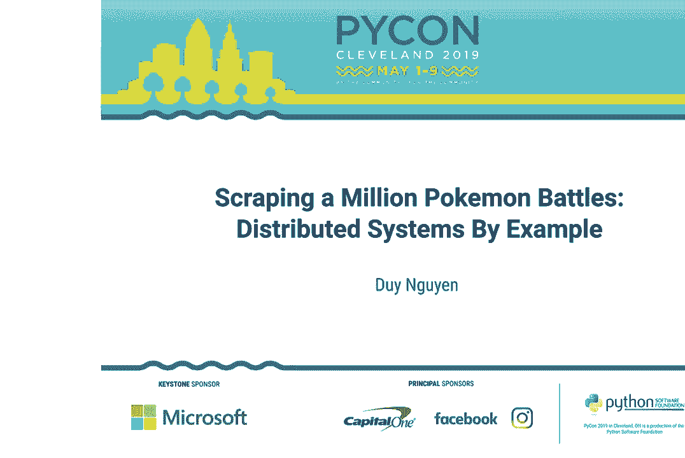
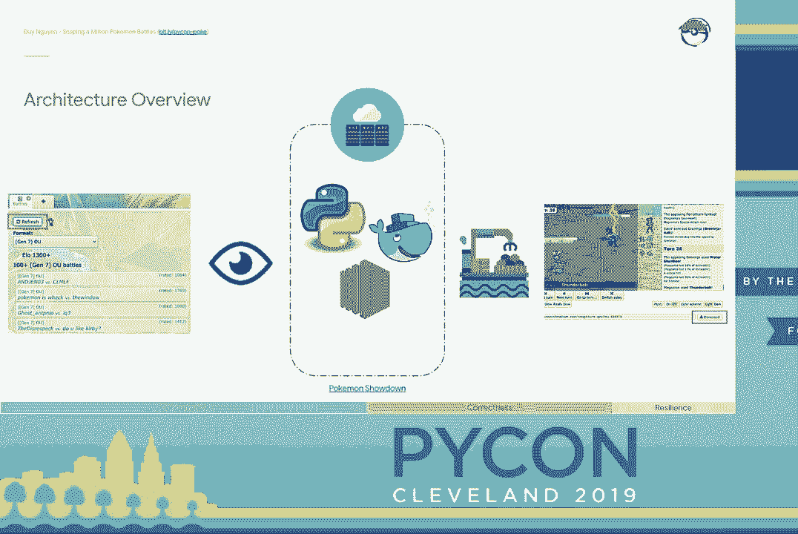
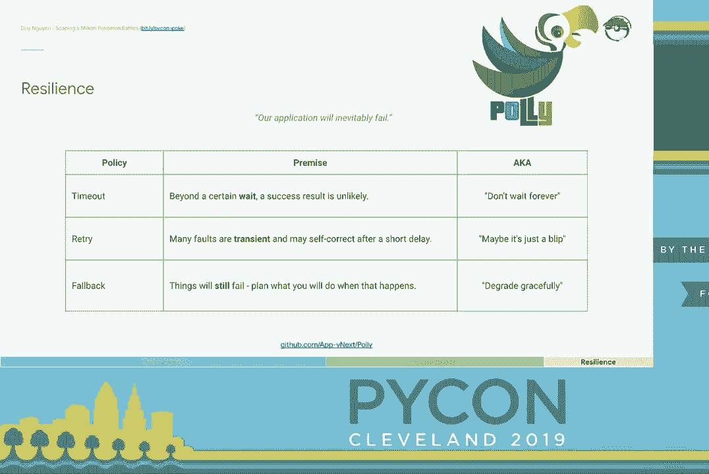
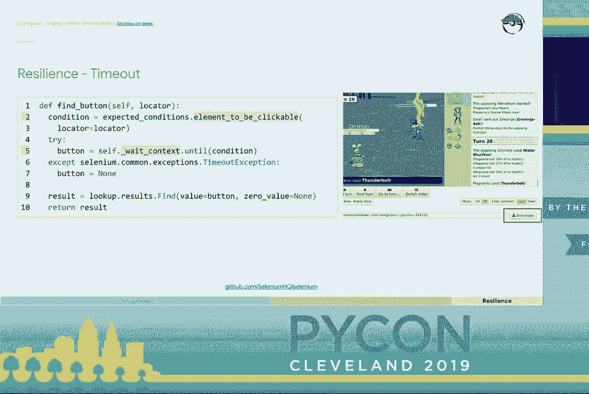
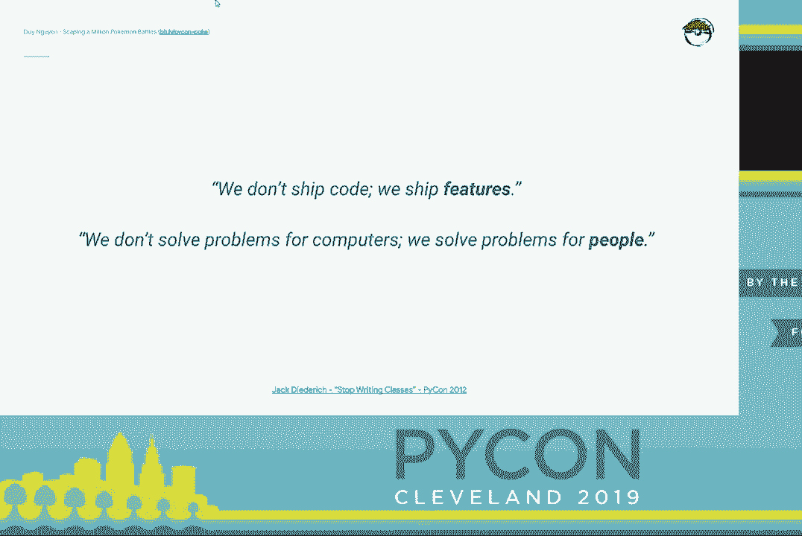

# P7：Duy Nguyen - Scraping a Million Pokemon Battles - Distributed Systems By Example - leosan - BV1qt411g7JH

 [APPLAUSE]， OK， great。 Good afternoon， everyone。

 This is great。 Looks like a full room Instagram celebrity status。 OK。 A little bit by myself。

 my name is Dewey。 And I am not cool enough to have a Twitter handle。

 But that's my LinkedIn custom URL， PUGS rule。 So if you want to connect with me。

 go ahead and do that。 And if you're looking for a Bitly link， it's Bitly， PyCon， Pookie。

 So pronounce my name。 It's like that with all the Es afterwards， Dewey。 And so currently。

 I live in Boulder， Colorado， and I work as a software engineer at Google。 We-- he's awful products。

 And I work on an organization known as Core Systems。

 So it's like this horizontal infrastructure layer。

 I particularly care about gender equality and mentorship， in tech。

 These are just areas that are very near and dear to my heart。 Before that， though。

 I used to lead the data team， at an edtech startup in Boston， Elevation Education。

 And then I left to travel the world。 I lived out of a suitcase for a year and a half。

 and I bumped off friends。 And then I wandered from hustle to hustle。

 But programming was still a passion of mine。 So something I continued to do。

 And I even continued a program in a rainforest， like here。

 So I lived in that musty van for three weeks。 Surprise， it had access to Wi-Fi。

 How's that for accommodation？ And one of the projects I worked on while traveling。

 was this idea I had about Pokemon。 So that's what we're going to be discussing today。

 Let's get into it。

 So I really do love Pokemon。 I am not referring to Pokemon Go。

 So I am referring to the classic handheld games。 And there's a site online where you can go。

 and you can play other people online。 But one thing that I didn't love about it。

 is that the community is not that welcoming to newer players。 So more experienced players。

 they actually， go through great lengths to hide their strategies。 It doesn't make sense。

 There's precedence for this。 So if you know a monster moveset and their EV spread。

 it becomes very formulaic about how you deal with it。

 So if you told me you had physically offensive， setup， sweeper， mega-charsart X， there's。

 a very finite set of checks and counters for that Pokemon。 But still， this was not OK with me。

 I thought that we should be better， supporting to our newer players。

 and we should be able to democratize that information。 And then one day。

 I noticed that all of the battles do not， require authentication to look at them。

 And so here I am in the middle of a rainforest， and then I signed myself up for that free tier AWS account。

 which， is ridiculous。 And then I started scraping all of their battles。

 So that's what we're going to do today。 We're going to talk about this passion project of mine。

 and use it to draw specific examples， so that we can better understand working。

 with distributed systems， working， with microservice architectures in the cloud。

 I will mention that when it comes to--， I refer to this as the Shippert Systems 102。

 So at the bottom there， you can see that link for LVH's， distributed systems 101 for PyCon 2015。

 Disclaimer， it is an exceedingly technical talk。 However， I do want to continue that discussion。

 And today， I want to talk about how， can we maybe ground some of the concepts for working。

 with distributed systems and make them more practical。 I want you to leave today and think， oh。

 I'm working on this new design。 They're like， hold on。 I've seen this pattern before。

 I've seen this problem before。 How can I reproduce this？

 So that's how I break down with distributed systems。 Oftentimes。

 teams will pursue distributed systems， because they care about scalability。

 Maybe they want to scale compute。 They want to scale storage。

 They want to even scale human resources。 These all make sense。

 A common way you do that is with concurrency。 However， there are non-trivial consequences。 So two。

 that I'm going to call it right away。 One， holistically， the system just。

 becomes more difficult to reason about。 And two， you have to come to grips。

 with the fact that your system will now fail。 So how can we compensate for these two things？

 So today， that's the framework that we're， going to be working with。

 We're going to be talking about distributed systems。

 I'm going to show you how we can achieve the concurrency。

 while also providing techniques for compensating for this。

 How do we assert the correctness of our system？ In other words。

 how do we test our distributed system？ And at the same time， how do we build in resilience。

 against failures？ OK， so oftentimes， when we're talking about these technical， presentations。

 it's helpful to start， with an architecture overview。 On the right side here。

 this is what a Pokemon battle looks， like。 So as you might imagine， there are two players。

 They have their respective teams， and they're battling each other。 This is， yeah， Shift Gear。

 Magina， and Spex Ash Greninja。 So it's actually all open source。

 So that's also how this made it a lot easier， to reverse engineer。

 So if you go take a look at their GitHub page， it turns out that the web UI， it's。

 communicating with the server using this text protocol， that resembles a domain-specific language。

 If you spend enough time looking at that text protocol， and you're able to replay all the logs。

 you can exactly replicate the state of the battle。 OK， so now I started thinking， well。

 what if I just create a little bot， and a bot just sat on the page。

 and then when the battle was done， it just scrapes all the battle logs from the DOM。 It's like， oh。

 that seems pretty reasonable to me。 But that only gets us one battle。 How do we get all the battles？

 On the left side， if you go to the main chat room， there's this list of battles。

 It's something like the most recent 10 or 20 battles or so。

 The reason they have this feature is maybe you're visiting， the site。

 and you want to spectate on a battle， you can go check out those。

 It only shows the most recent 10 or 20 or so。 But that's not really a problem when it comes to programming。

 I figured if we have a process that's， on a tight enough loop， then we could definitely。

 collect all of those URLs without any gaps in them。 And then that way we would have all the battles。

 on the entire site。 So now we have a way to download the logs for a single battle。

 and replicate the exact state。 And we have a way to get every single battle on the website。

 And a link， if you want to play， is at the bottom。 So I implemented this using Python。

 and they were on Docker containers in EC2。

 But a bit higher level。 So this is the flow of the system。 So starting from the upper left， we。

 have this component that watches the list of rooms， gets all of the battles。

 And then as it scrapes those URLs， it pushes it onto an SQS queue。

 Then there is this some form of download bots， that will slowly pop work off this queue。

 and then sits on the battle， waits for the battle to finish， and then scrapes the battle logs。

 The battle logs are persisted in S3。 I also had a lambda function that。

 would be triggered on S3 puts。 And then every time there's a new blob there。

 it's going to index it in a last cache。 Yes， when you're unemployed， you have so much time。

 So much time。 OK， so for today， we're going to really focus in， on that left column。

 So the component that watches for all the battles on the site。

 it putting all the work onto the queue， and then a form of bots downloading those battles。 Oops。 OK。

 so take a look here。 This is the code snippet that we're going to be working with。

 I hope it's not inspiring code to anybody。 Pretty straightforward。 We have a roomless watcher。

 It scrapes for all the battles， and it gets a list of URLs。 We iterate through the URLs。

 and then we serially download them。 This was great for an MVP， but then I quickly already。

 ran into problems。 Already， in my head， I wasn't able to keep track。

 of everything that was going on。 Sometimes I'm working on the bot that's just downloading。

 the battle， and then I forget， maybe， do I need to do some special authentication， for SQS here。

 or do I need some special retry logic， when I'm working with the roomless watcher？

 I always had to keep the whole breadth of the application， in my mind at the same time。

 People here who are working with microservice architectures， you can， I think。

 already picking up on the language here。 When the application grows too big to fit into your head。

 this is often a good time that we should decompose our application。

 There's more that we can push this， because the download bot。

 it just wasn't achieving the throughput， that I wanted。 So these were all these indicators。

 that I thought， OK， maybe this is time。 This maybe I should start to make this into a distributed。

 system to get the scale that I want。 On the left side there， this is how I view it。 So I saw， OK。

 the roomless watcher， the download bot， they achieved some type of business logic。

 Whereas the URLs in the middle， this is just state。 This is just data。 So we have components that。

 when we talk about them， they get highlighted as some type of component。 We have a roomless watcher。

 We have a queue that holds state。 We have a download bot。 And in addition。

 there's a separation between business logic， and state。 This was not quite persuasive enough for me。

 though。 And so I started to take a look at how my different components differ。

 in terms of rate of work， specifically magnitude。 That's a mouthful。 Let's unpack it。 OK。

 so the roomless watcher。 So I'm using Selenium as the web automation framework。

 So once you've initialized the page， let's say that takes on the magnitude of three seconds。

 or something like that， it's fine。 We have the page open。

 But you see that refresh button in the upper left in the red rectangle？

 It turns out that the list of the most recent 10 or 20 battles。

 you can refresh it with just a simple async call。 So now that means that the magnitude， once you've。

 initialized the page， is actually on the magnitude of only 300 milliseconds。 So that's pretty fast。

 That's like， acceptably fast。 But the download bot， it's very different。 It's much more erratic。

 Let's say that， I don't know， you and I were battling。

 And then it might be that once it soon begins to the battle， I have to DC。

 I have to disconnect because whatever my girlfriend says， we have to go eat dinner or something。

 So the battle could just take two seconds。 But maybe in some other situations。

 the battle could take 45 minutes because both players brought stall。 And by stall。

 what that means is you bring fat mons， mons， like Chan C or Venusaur or Clefable。

 These Pokemon that have really high HP stats， and just take forever to wear down。 So yeah。

 a battle could take 45 minutes。 But now that we've seen that there's a difference in responsibility。

 there's a different in the type of components， business logic or state。

 And there's also a very significant different in how the rates of work， are operating。

 We're talking magnitudes of difference。 So this was the evidence that I needed。

 So I understood the characteristics of my system。 So you start by analyzing the characteristics of your system。

 And now this is when we can decompose the application。

 You've probably seen the diagram a million times。 But you take this monolith。

 which is like a blob of colors， and then you break it into subcomponents。

 And that's basically what I did here。 I partitioned the application along these responsibilities。

 And another phrase you might hear is， to draw seams through the application。

 So we've analyzed the characteristics of the system。

 We've seen where would be appropriate to partition， along responsibilities。 And now what can we do？

 Well， now we can layer on top of this a model of concurrency。 OK。 On the left side。

 what you can do is we， can have producers on the left side。 And maybe there's a main thread。

 and it spins off， one to end child threads for the rimless watcher。

 On the right side there are some consumers。 And the same thing， maybe one to end child threads。

 for these download bots。 Between them， they communicate on some thread safe queue。

 We have this in the standard library。 It's q。q。 So this is the model of computation that I'm using here。

 Producers on the left side， consumers on the right side。

 communicating over a thread safe message queue。 At the bottom there， I draw a link to Raymond。

 Headinger's fantastic talk from PyCon Russia 2016。 If you haven't seen it， I strongly。

 recommend that you do specifically， if you're getting started working with concurrency。

 or you just need a refresher。 I would strongly argue this is the must-have first go-to talk。

 Absolutely。 So he starts by positing that--， and I paraphrase it at the top there--。

 unless you're implementing an operating system， you should strongly favor using higher level primitives。

 such as thread safe message queues。 And in this case， it would be q。q for Python。

 He also includes something called Raymond rules。 And these are rules of thumbs。

 These are best practices for working with concurrency。 And some of them， it's not like， hey。

 maybe you should， follow this if you feel like it。 It's really， if you don't follow these rules。

 your algorithm is simply not correct。 So I strongly recommend thinking about concurrency。

 by Raymond Heideger。 This gave us throughput， right？ So on the right side there， if I wanted to。

 I could more or less achieve linear scalability。 If I double or quadruple the number of download bots。

 I will double or quadruple the throughput of that right side。 If， again。

 for those of you who have experienced working， microservice architectures， you notice a problem。

 And that's the state in the middle。 So if we're working in the cloud。

 you need to assume a node is going to drop。 It's not like maybe it's going to drop。

 but it will definitely drop eventually， maybe， through maintenance， or maybe just through。

 I don't know， a free storm and somebody trips over the power wire。 If I had something like 100。

000 URLs in that queue， what happens to those？ Do they just all disappear？

 And I just lose all those URLs。 So that's not good enough。 However。

 because we've partitioned the application， because we've decomposed into smaller sub-compliance。

 we can swap it out really quickly。 So instead of just having Q。Q-- so instead of just having Q。Q。

 you can swap it out for an SQS queue。 And this was a really easy solution。 All of a sudden。

 by swapping out that component， I achieved this rich feature set of cloud services。

 the message durability， the scalability， the instrumentation。 You just get that out of the box。

 But that's only possible because beforehand， we've analyzed the characteristics of our system。

 we've decomposed it properly， and we're focusing on not， like these implementation details。

 but how do we compose the problem？ How do we orchestrate the work？

 I'm going to push this analogy a little further。 Take a look at Go。 So in Go。

 concurrency is a first class citizen。 So what that means is that concurrency。

 was a conscious decision to include， into the language specification。

 It's not implemented as a library， think async。io， which is implemented as a library。

 But concurrency is part of the runtime。 That gives us three constructs--， Go routines， channels。

 and selects。 I'm just going to talk about Go routines and channels today。

 And so this is how the analogy plays out。 So if I want to do the same solution and go。

 on the left side， maybe I'll launch one to end Go routines， to watch that list of new battles。

 On the right side， maybe I'll launch one to end Go routines， to download the battles。

 And in the middle， they still need to communicate。

 How do I get the work from the producers to the consumers？ So in Go。

 we have a construct called channels。 And channels， what you do is from one side。

 you can send in work or messages。 And from the other side， you can receive that work。

 I want to point out that across all three of these examples， whether it be Python or AWS or Go。

 three technologies that were written by three different teams， and written across multiple decades。

 they all arrive at the same solution。 So the reason for that is because we're not focusing。

 on small implementation details， but we're focusing on how we are composing our components。

 How are we orchestrating the work？ And that's what I urge you to focus on as well。 Same solution。

 three different technologies。 So that's great。 And now I have the scalability in my system。

 and I'm able to download like， you know， hundreds of thousands of Pokemon battles。

 and it's a really good time， but I have no idea if it actually works。

 So it introduces several problems。 Loss of determinism， let's say I had five URLs in the queue。

 well， on one run of the test， maybe I get through all five， and the work is processed sequentially。

 That's great。 On the next run of the test， I might only get halfway through。

 and maybe the order is scrambled。 In exchange for the concurrency。

 you give up the predictability of the system。 We also have longer startup times。

 starting up an in-memory queue that is trivial， starting up an SQS resource。

 that could take on the magnitude of minutes。 That's something to think about。 And in addition。

 everything， my processes are now in different memory spaces， maybe they're on different nodes。

 and all of a sudden we've introduced flakiness。 I could have a network partition。

 I have to deal with loss of availability， for dependent services。

 When we have these types of problems， we still can handle them。

 but they all revolve around this problem， of how do I deal with these external dependencies？

 Let's get aligned on terminology really quickly。 So I wanna talk about mocks and fakes。

 So with mocks， mocks are these objects， that we can just extend， shan， on demand。

 you interact with them， and then afterwards you can introspect them。

 to understand the history of the interactions。 We can understand who called you。

 how many times were you called， with what arguments were you called？ Fakes are a bit different。

 So with fakes， they should be able to serve， as drop-in replacements for the real resource。

 This means that they fulfill two criteria。 One， they have to implement the same interface， and two。

 they have to guarantee the same， invariances as the real resource。 For example。

 if for whatever reason， I was trying to implement a fake queue， well。

 there has to be a way for me to put， and pull work from that queue。 In addition。

 if the original queue were FIFO， I can't suddenly have a fake queue。

 that does not maintain stored order。 That would break one of the invariances。

 So how did these come into play？ I'm gonna talk about， so testing external dependencies。

 I will say so， yeah， so currently I work at Google， and the complexity and scale of Google。

 it is mind-boggling， and it's surprising， that testing external dependencies。

 is a challenge we deal with on a day-to-day basis。 It is that technical， it is that overwhelming。

 I'm gonna break this down into three different segments。 I'm gonna talk about how I tested。

 external dependencies in my Pokemon project， how Google subscribes for testing external dependencies。

 and how I think we as a Python community should do it。 All three， actually。

 are our different answers。 So for me， so I went with fakes。 Keep in mind。

 I had no steady income and no job， and I was living in a rainforest。

 and hitchhiking to get everywhere， so if I went past that AWS free tier， that would not be okay。

 I have no money。 So that's why when I did my testing， I really wanted to prefer something。

 that was a bit more realistic。 Fakes give you that。 Fakes are a little bit more realistic。

 but they cost developer time。 That's okay， I have tons of time。

 I have nothing to do on a day-to-day basis。 So that's why I preferred fakes， I needed the realism。

 and I was willing to trade the developer time。 What do we do at Google？ At Google。

 we have this document， it's actually linked to the bottom， don't bother clicking on it。

 it doesn't go anywhere， you don't have access to it。 But at Google。

 we prefer using the real resources。 The reason for that is at Google。

 saving developer time is paramount。 Just full stop saving developer time。

 that's what we need to be doing。 And what are we willing to trade in exchange？

 Let's say that you have some tests that runs， and then you need to start up a Spanner instance。

 that's fine， just start up a real Spanner instance。 If you need 1，000 of them， that's fine。

 just start up 1，000 Spanner instances。 And I put the word they're computationally expensive。

 What I mean by that is， if you wanna use the real resources， I can't sit here and wait for 1。

000 Spanner instances to start up。 We just can't do that， seriously。 So what do we have to do？

 We have to bring them all up at the same time。 If you have a server farm as large as Google。

 that is possible。 Now that does take way longer， but ultimately because Google is trying to save developer time。

 we're willing to make those trade-offs。 We're willing to use the real resources。

 How about us as a community？ So over at the Instagram team， Mike Greager， the CEO and co-founder。

 he mentions how， and this was a talk at Airbnb， maybe from， I don't know， 2015 or something。

 but one of the engineering philosophies over at Instagram， is do the simple thing first。

 There's no question that will definitely fail one day， right？ But that's fine。 And to that point。

 just do the next simplest thing。 In practice， what that means is I really believe that we as a Python community。

 when we're working with distributed systems， and we have all these external dependencies。

 I believe that our default should be to start with Mox。 Now， Mox are fast， they're lightweight。

 they're easy to reason about。 And most importantly， if you're a newer developer。

 let's say you have an undergrad right out of college， it's okay。

 they could spend a day reading through the source docs， or maybe a couple days。

 but they will be able to get started， rather quickly。 And that has real tangible benefits。

 There are drawbacks， it's the furthest from production， right？ And in addition。

 you get some issues with interface drift。 Anything you throw at a mock is gonna work。

 So there are some problems with that， but I would still argue that the benefits of mocking in this scenario。

 are well worth it。 So again， to summarize， I decided to go with fakes， because I needed the realism。

 Google prefers to use the real resources， because they have oodles of money。

 And then we as a Python community， I strongly believe， that we should just focus on Mox。

 It's the simplest solution。 Good enough is good enough。 So what do we have here？

 So now we have this Pokemon application。 It's out， we have all these bots everywhere。

 and they're downloading tons of battles。 And we also know it's correct。

 So I know that I'm not just burning through EC2 instances。 However， it fails all the time now。

 The system is just getting big enough， that it fails purely through coincidence。

 So we need some way to figure out that， how can we build in resilience against this failure？

 There is a 。NET C# framework called Poly。 Don't let me lose you。 I'm not going to talk about C#。

 (laughs)， The reason that I found it is just that， the way that if you go to their GitHub page。

 I link it at the bottom， the way that they help you digest the problem is fantastic。

 If you're thinking about like， oh， I've got the system and it just keeps failing。

 And there are so many policies out there。 I'm sure you've heard of districts over at Netflix。

 They have the circuit breaker pattern。 And you're thinking like。

 I don't even know when I use a circuit breaker， or when I use fallbacks or when I use retries。

 The way that Poly describes the problem space， is really helpful to think about。

 So here's an example of what they'll do。 They'll have this like little witty saying。

 on the right side like， "Don't wait forever。"， Or maybe it's just a blip。

 So now I'm going to show you how I use， timeout retries and fallbacks in my Pokemon project。

 to make sure it's resilient。

 So starting off， this is the easiest part， right？ On the download bot， when you get to a battle。

 it doesn't mean that the battle's immediately completed。

 I mentioned earlier that it could be going on， for 45 minutes。

 So using the Selenium Web Automation Framework， this is what it looks like。 You can see on line two。

 it says element to be clickable。 So that's the condition that I'm waiting for。

 I'm waiting for that download button， on the bottom right to be done。

 because that tells me that the battle logs in the DOM， are ready to be scraped。 That's the element。

 That's the checkpoint that I'm waiting for。 So this one's pretty simple， right？

 I just have this at the smallest unit。 I have my download bot and I say， hey， go to that page。

 check it out for three seconds or so。 And if you don't see anything， let's just wait a while。

 It's probably not ready yet。 So time out， that's pretty simple。 At the same time。

 it's not good enough。

 So all these different external dependencies， and most importantly， the Chrome Web Driver。

 So the Chrome Web Driver is implemented using， something called the gang of four command pattern。

 It's a very cool looking pattern， but what it makes is debugability is basically impossible。

 It becomes a total black box system。 It's very possible that while my download bot。

 is trying to operate with this page， it just gets into a bad state。

 And I just have no idea what's wrong。 In addition， so Pokemon Showdown， it's a chat application。

 So let's think about the characteristics of that system。 It means that a lot of the connections。

 are very long lasting， right？ We're gonna try to persist connections from minutes， if not hours。

 Unfortunately， there are only two developers， or something like that for the website。

 so reliability is not the greatest。 I could have a bot sitting on a battle， and they just get DC。

 They just get booted by the server。 For no reason other than the server。

 can't maintain all these connections at the same time。 So if you take a look at lines 10， 11。

 and 12。 So online 10 connection loss， that's what that means。 So the server， for whatever reason。

 just booted me。 But that's okay。 That's an acceptable error condition。 If that occurs。

 just try again on another attempt。 We're not gonna kill the runtime because of that。

 A Web Driver error。 So this is something because maybe， when working with a Chrome Web Driver。

 like into a bad state， this is expected though。 So it's fine， we're gonna continue to try again。

 And the last one's the most obvious one。 If the bot goes to the page and the bot finds。

 that the battle's not yet completed， again， that's fine， we're gonna continue。 This code here。

 it's inspired by， our holders， Guava Retrying。 Guava， for people who don't know。

 is it's Google's common libraries for Java。 And then our holder， he wrote it。 He wrote A。

 an extension to it。 And then inspired on his design for retrying， it's how I wrote this code here。

 So what we had at the smallest level， we have a download bot that has this retry logic。

 And now when it goes to the page， it might not work， but that's fine， we'll try again。

 And this is what really brings in， the resilience at a higher level。

 Now we account for the Web Driver， we account for the server。

 we account for the Selenium Web Automation framework， not working well。 But lastly。

 there's also a fallback。 You can see there online nine。 So let's say that I exhaust all my retries。

 Let's say I expect that the battle will take 45 minutes。

 and for whatever reason it's just gone on for an hour and a half。 Okay。

 we're not gonna wait much longer。 At a certain point， we're gonna kill the retries。

 we're gonna assume that it just fails， and I need to return something。 So in this case。

 I just returned an empty list， a zero-valued object on line nine。

 But even cooler than that is on line 13。 So I learned this from PyCon 2017。

 There's a talk on error-handling paradigms。 And there's just like this little nugget。

 that she mentions about a project， from Microsoft called Midori。 And over in Midori。

 they use this technique， called abandonment。 I've never had a term for it。

 but so when we're working in the cloud， we assume that resources will fail。

 We assume there will be network partition， we assume there will be loss of availability。

 and we assume that nodes will just get into a bad state。 So what do we do in those cases？ Well。

 it's fine。 They should be very trivial occurrences。 We just kill the node and instantiate a new one。

 The same thing here。 So sometimes my download bot would just get into a bad state。

 and I had no idea how to handle this。 I couldn't debug it because the Chrome driver is too confusing。

 or maybe the number of network calls with the server， and maybe there's some bad state there。

 And so what I did is I would force garbage collect， that download bot and then reconstruct。

 the entire object graph。 I'm not going to go into the implementation details here。

 but it's a technique that I think is just so， so cool。

 And that was definitely what set this project over， in terms of just making it rock solid。

 that abandonment strategy on line 13。 So we've seen how at first I started this tiny project。

 and was all running in a single process， and then I needed to scale。

 I couldn't keep it all in my head， and I wasn't getting the throughput that I wanted。

 So I sought to achieve concurrency， and I did that using the message passing。

 But even though I had the concurrency， I had no idea if things were working correctly。

 So we really had to step up our game on how we test。 And we use those strategies。

 like in my particular case， I use fakes。 So now that we have the concurrency。

 we know that the application works pretty well， and then with these resilient strategies。

 we also have some kind of backup strategies， for when things will fail， which they inevitably will。

 So unfortunately， I don't have time for questions。 However。

 I hope that it's like reasonably apparent， that I'm an okay approachable person。

 So if you see me in the hallway， I'm more than happy to talk about Hawaii， or gender equality。

 or if you're interested， about what it's like working at Google， or interviewing for Google。

 it's the worst， interviewing for Google is the worst。 (laughs)。

 Feel free to just come grab me and talk to me。 And also， if that's uncomfortable。

 you're happy to just talk to me on LinkedIn as well。 And I did wanna leave with this mention though。

 So Jack Dietrich from 2012， he said this on the top line there， so we don't ship code。

 we ship features。 And I wanna build on that。 So I would also say that we don't solve problems。

 for computers。 We're solving problems for people。 I think it can be very easy to forget about that sometimes。

 and just wanna work on the newest， sexiest technology。 But we have to。

 I would urge the Python community， as great as we are， to really focus in on the user。

 And I think that's how we can deliver a great value。 So thanks for your time， gang。

 I'll see you around。 (audience applauds)， (audience applauds)， (applause)。

