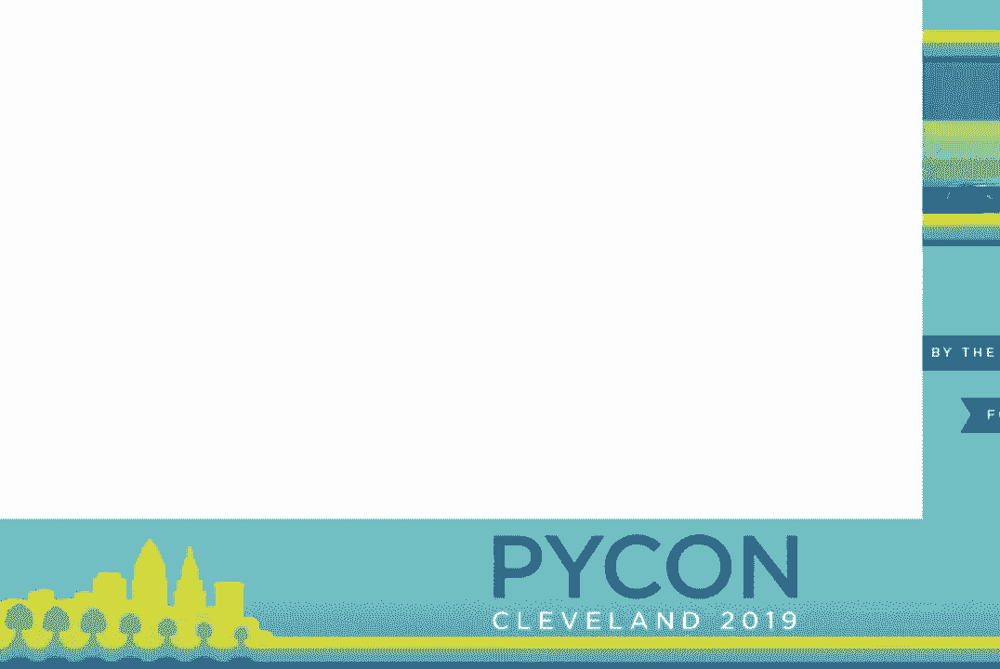
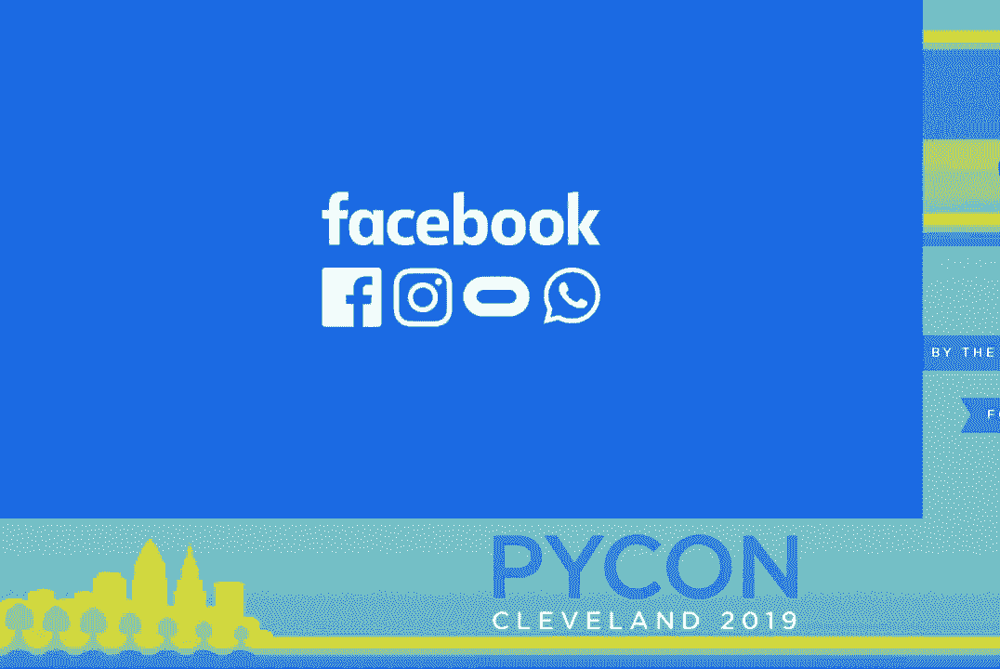
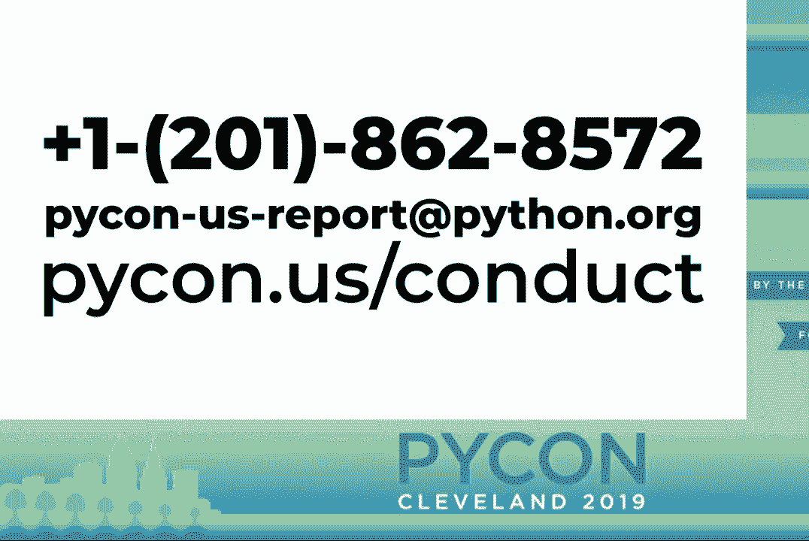
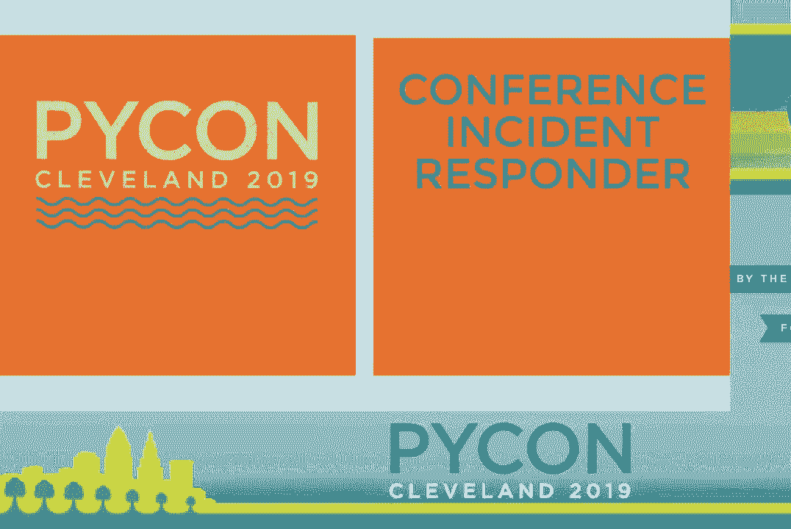
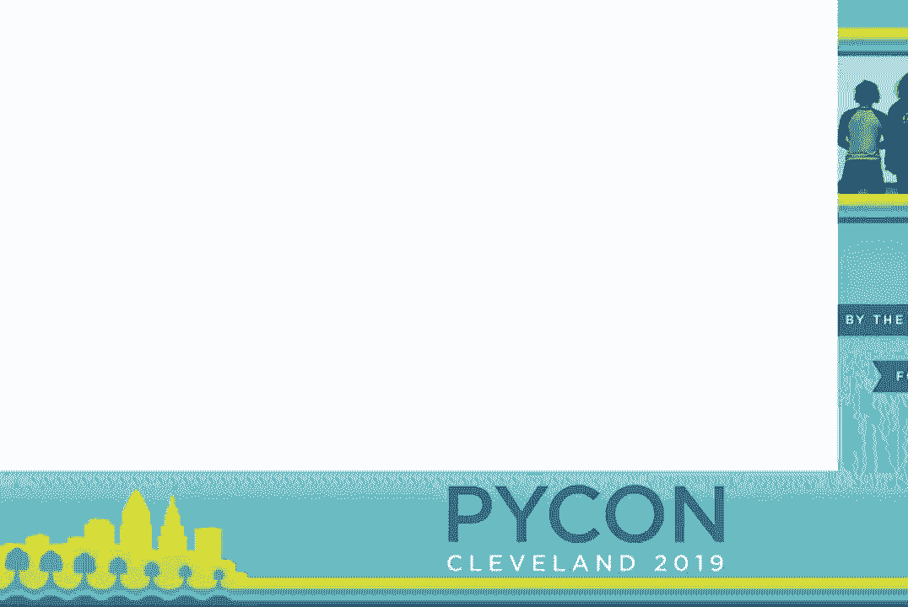
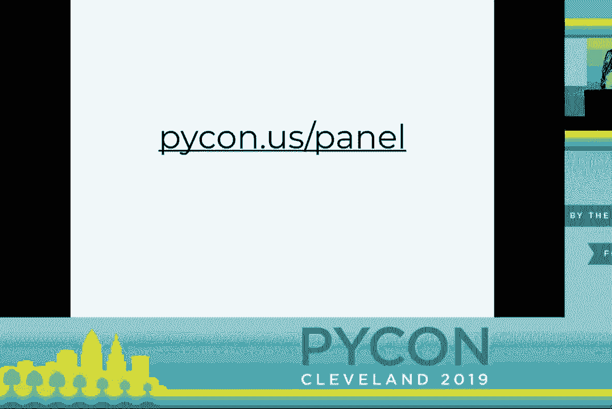
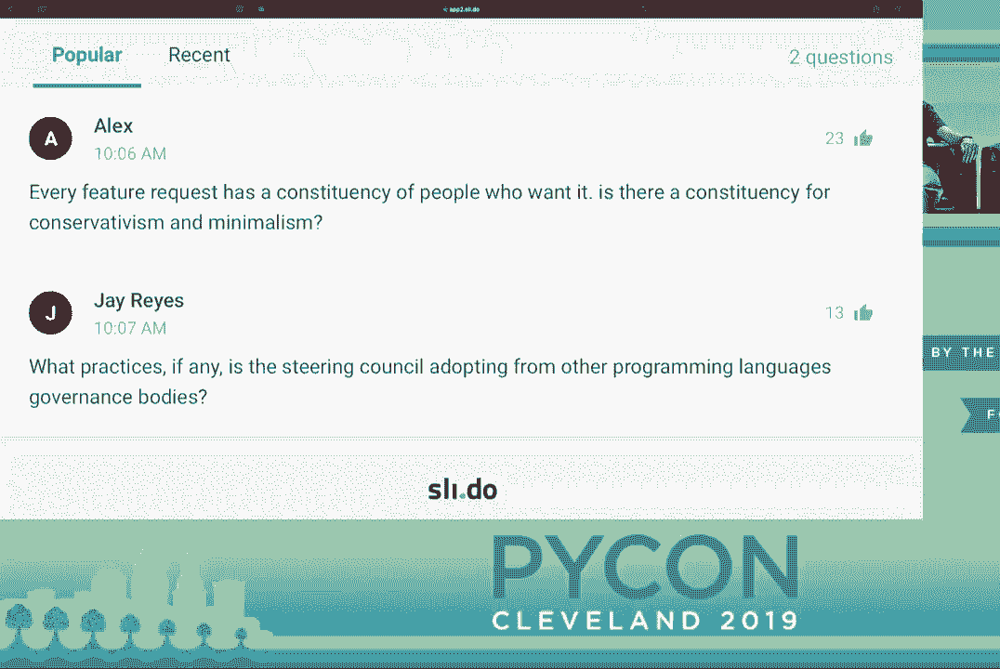

# PyCon 2019 演讲全集 - P23：Python Steering Council - Keynote - PyCon 2019 - leosan - BV1qt411g7JH

 >> Good morning， everybody。

 My name is nryk fake。

 Production engineer up in facebook Seattle。 Those who are unaware。

 facebook is a platinum sponsor of the， Python， the psf。

 We are always very grateful to be here at the， Python。 This is actually my second， Python。

 First one was in 2010， so i'm hoping to do at least， Another one in the next decade。

 For those of you unaware， facebook actually does use python， Quite a bit， not just a php shop。

 To the less obvious， our entire configuration management system。 We also use it quite a bit。

 A little product they're， Called instagram。 Personally， i was in a big instagram。

 User until i got a puppy。 Everybody wanted to do is i。G。 handle and i had to get one。

 I use quite a few open source technologies such as celery and。

 Django to help deliver those cute puppy photos to your， Inbox every day。

 We're also proud to be a sponsor of， Several open source projects like pie torch。

 which is a drop in， Place with numpy and actually lets you use a lot of those。

 Juicy gpu's to get more performance out of your software。 We also provide pyre。

 which is a performance type checking， System which really speeds up your testing。 Finally。

 this is actually my favorite i just found out about， This one。 It's called monkey type。

 It allows you to profile your code and it will actually provide。

 Stubs or directly annotate your code to automatically add， Type hints， which honestly blew my mind。

 Now i'm extremely proud to be at facebook。 We are very grateful to be here。

 I'm very thankful for all of your contributions to the python。

 Community and of course to the rest of the world。 Without you further ado。

 i want to give a brief thanks to the， Python organizers to psf。 Thank you for all of you guys。

 For making this the best python to come。 I'm looking forward to seeing everybody next year at。

 Pittsburgh。 Thank you。 [ Applause ]。

 Thank you。 Oh， excuse me。 Sorry。 As out running this morning， so a round of applause for everyone。

 Who took part in the 5k。 [ Applause ]， I was a little worried people would get lost in the fog， but。

 We made it。 Quick reminder， this is our contact information and more。

 Information that you can find for our code of conduct。

 If you need to report， you can use that contact information or。

 Find someone wearing one of these shirts。 Once again， there it is。 Reminder。

 mothers rooms are in room 17 and 18。 Those are continued open today。

 You can find instructions for access at the front of that door。

 Quiet room is room 24 if you need to get away。 A reminder that the expo hall has been completely。

 Reconfigured into the posters and job fair。 That's going to begin immediately after this session and run。

 Till 1 p。m。 Lunch will also be served in there around lunch time。 I don't remember exactly when。

 [ Pause ]， Talks。 Talks continue today。 There are three talk sessions this afternoon after the poster。

 And jobs fair。 The open spaces are still open until 11 p。m。 tonight。 You can still go to pikon。

us/os to find out what's on the， Board right now and head over to the board to add if there's。

 Any slots that remain。 The final plenary session， which will have the psf。

 Community update and awards， final keynote and closing remarks。

 Will be at -- I don't have my speaker notes。 Anybody know what time the final thing starts？ 3-10。

 That will be in this room。 [ Pause ]， Sprint。 Whoa。 It's all working。 Sprint's continue after today。

 Monday， Tuesday and， Wednesday。 If you're interested in sprinting and you'll be in town。

 Make sure to allocate some time to stick around after the closing， Session。 That will be around 4。

30 on。 The little sprint rows will occur。 This is when everyone -- what's that？ Oh， thanks。

 I was like， "Cushal， am I lying？"， So cushal will be leading sprint rows， which is where if you。

 Are planning to sprint on a project， you can come on up here。

 And announce to everyone who's interested what you're working on， And how to get in contact。

 There we go。 So， a quick reminder， the psf is running a fundraiser concurrently， With picon。

 You can find more information on that fundraiser and how to， Contribute at picon。us/psf。

 Speaking of the -- oh， here we go。 And so right now I'm really excited to welcome to the stage。

 The inaugural picon steering council。 So this is the group that is responsible for governance of the。

 Python language and see python interpreter。 The panel is moderated by eva。

 the executive director of the， PSF。 And we're going to do introductions of the panel members shortly。

 So go ahead and welcome to the stage。 [ Applause ]， >> Where's carol？ >> I don't know。

 >> You're here with that script。

 >> I know。 >> Thank you。 >> Good morning， picon。 Thanks so much for joining us。

 >> Welcome to our panel with picon steering council。 My name is eva。

 the executive director of the python software， Foundation which is the nonprofit behind python。

 I'll be the moderator for this session。 Python's governance recently shifted from the BDFL model --。

 Sorry， I got to find my clicker -- to a steering council。

 If you're interested in reading about this change and how it， Was achieved。

 you can check out these links above。 We are here to learn more about the steering council members。

 what， The steering council does and learn about their mandates。

 At the end of the panel we'll open the floor to audience， Questions。

 So please start thinking about what you'd like to ask now。

 So on stage with me we have the five steering council members。 We have berry war saw， kennon。

 karell willing， Guido van rassen and nick coglin。 Before we get into what the steering council does。

 let's get to， Know you all a bit。 You can tell us things like why you became a core developer or。

 You can tell us what you'd like to do。 So we have a great opportunity to be able to build a new project。

 Let's start with you。 >> Okay。 Well， thanks。 So I work at lincoln and i'm on the python foundation team。

 Many of my teammates are here。 Which is awesome。 We do a lot of python。

 We support python at lincoln。 I think i've told my story many times。

 This is Guido van rassen's python world tour。 It happened in 1994 in gethersburg， maryland。

 That's when i met Guido。 Fell in love with python and guido， of course。 And i think， you know。

 just like not going away is part of the， Trick， right， sticking around long enough。

 There were 20 people at the first python workshop。

 Which is pretty amazing to look out at this crowd。

 I think all of us knew python was really special when we first。

 Were introduced to it and we certainly knew guido was very， Special。

 But to see where both the language and the community has gone in， 25 years。

 none of us could have expected it。 I think it's kind of miraculous actually because it's not only。

 Changed the tech landscape but it's changed all of our lives。 I know certainly for myself。

 i wouldn't have the life i have， Without python。 So i'm amazingly grateful for that。

 >> That's a great story。 Many of us are in the same boat。 How about you？

 >> I'm a div manager for the python extension at micsoft。 I get to do that most of the time。

 But any spare time i get work glutes to make you spend on python， It's all about the。

 Success you spend on python itself。 In terms of how i got started。

 it's a long story but the gist of it， Is i got the recipe in the python cookbook。

 It was not perfect。 It drove me nuts for about a year。 I figured out how to make it perfect。

 I used to mind mind。 And then ask martelli the editor。

 I asked how do i get this into python because i think other， People might find it useful。

 I said e-mail this called python dev。 I did in june of 2002。 I did it。 I did it。 I did it。

 I got accepted。 I was doing a gap year between my undergrad and my graduate， Program start。

 I figured， this is fun。 I'll keep doing this。 Lo and behold i kept doing enough that eventually i asked -- i。

 Do a p-off or something。 And then i just said i need someone to merge it and great， I said， well。

 we'll get someone to give you a commit。 I used to merge yourself。

 I think i was bothering everyone to hold too much。 And just been involved ever since。

 Basically -- i'm somewhat known for a phrase where i said it。

 Came for the language but i stayed for the community。

 And part of that is the people up on this stage and the。

 People i've gotten to work with and know of the years from the， Dev team。

 I basically learned how to program， honestly， from these， People and have just become great friends。

 And that's why i keep coming back year after year。 >> Yeah， the community is a great aspect。 Carol。

 how about you？ I'm Carol Willing。 Thank you all for being here。 I -- back in 2016。

 i did a keynote in the Philippines and i， Talked about how python was the people's programming language。

 And when i started back in 2012 using python as a person， i。

 Thought this is really fun to program in。 And then i also got involved with jupiter notebooks and thought。

 This is great stuff。 We can spread learning about python， learning about different， Disciplines。

 science， data science， embedded computing， web， Stuff。 And i saw the power of it then。

 And i wanted to be a part of it。 And so i started more on the community side with the python。

 Software foundation and working with open hatch， which was a。

 Nonprofit that helped people make their first contribution to open， Source。

 And through that i started learning the core python workflow。 And what i really wanted was to。

 from a technical standpoint， Learn how to be a core developer。

 But even more so to develop processes and an environment where。

 The core team reflects how we use python in the real world and who。

 We serve because i think python is used to really touch so many。

 People's lives and it will be for the next 20 or so years。

 So it's up to all of us to make it better year by year。 Absolutely。 Thank you。 Guido。

 That was so wonderful to hear。 I don't even know what the question is because the sound here。

 Is terrible on stage。 Tell us something fun about yourself。 About myself。 Well i was a programmer。

 I was on an environment where there wasn't a language that i， Liked。

 So i made one out of pieces that i had learned previously。

 And because i can't write code and not have other people use it， I made it open source。

 And the rest was really the community。 [ Applause ]。

 So fast forward to last year when i was like at the top of， Responsibilities。

 controversial peps left and right。 And i had a case of burnout where i thought i've done this。

 Almost 30 years being the bdfl of this language。 It's time for someone else or some other structure。

 And so i announced that one day。 Literally the night before i had approved a very controversial。

 PEP。 You may be familiar with the walrus operator。

 The next morning i woke up and i thought i don't want to be， Bdfl anymore。

 I spent 20 minutes drafting a nice e-mail to the core developers。

 Asking them to go take care of themselves。 I mean it was really like what are you going to do？

 Do you set up some government？ Do it however you think is the right way to do。

 And it was such a relief。 But i don't know you know how this goes。

 When your kid goes off to college some of you may have， Experience with that。

 I will soon have that experience。 You're no longer directly involved in their lives maybe but you。

 Never stop worrying。 And that's how i feel about python at the moment。

 I nominated myself for the steering committee and here i am。 Nick tell us something about yourself。

 For me i came to python as a hardware and cc plus plus guy。

 Because i needed to test some signal processing code。 And python had the unit test module。

 It had the wave module and it had this thing called swig to let， Me wrap c plus plus drivers。

 And so i did that for hardware control for com systems and now i。

 Do it for electric vehicle fast charges with tritium and it's。

 Just this language that lets me reach out and touch the real。

 That i was involved without having to worry about all the messy， Details。

 And then i got involved in core dev。 This was this community of people on the internet that talked。

 About this language and how do we make computers。 How we bridge from that to the way people actually think and。

 Just make that more accessible and make it talk to the computer。

 The way you think and have it do what you meant is kind of amazing， And a lot of fun。

 >> We are all very grateful to have your experiences and， Backgrounds part of our community。

 We don't know that you've experienced being both bead。

 Fl of python as well as the steering council member。

 Tell us how do you think governance has changed and will， Continue to change。

 >> I'm sorry i did not hear the full question。 >> Now that you've experienced bead being bead Fl and also part。

 Of the steering council committee how do you think that the。

 Governance has changed and will continue to change of python？ >> Okay。 Yeah。

 So while i was bead Fl sort of the way it fell to me and i think。

 The way it fell to most other people as well was whenever there。

 Was some controversial decision it would eventually be， Bubble up to me。

 Which meant that i was always scanning python dev and。

 Python ideas for things that might become controversial and。

 Trying to nip it in the butt if i could。 And every pep basically eventually became my responsibility。

 After the people with the greater domain knowledge and。

 Expertise had sorted it out to the point where they had a yes no， Question or an ab choice。

 And that's pretty stressful。 And so i'm very glad that sort of that responsibility is now， Divided。

 distributed over five experts who have more of the。

 Trust of the community because they've actually been voted in。

 Rather than just become the leader or leaders by happen， Stance。

 So the voting has sort of voting for the steering council i think。

 Creates a real different relationship between the steering。

 Council and the core dev community than whatever existed， Between the core devs and myself as bdfl。

 Going forward i think that we're also structuring the decision， Making process somewhat differently。

 The steering council is not actually the group of people who， Decide about most peps anymore。

 What's written in our constitution pep 13 and what we sort of。

 Use as guidelines is that for most decisions we actually pick an。

 Expert from among the core devs and sometimes external contributors。

 That we know well and we settled them with a question and a。

 Decision and so far we've only got a few months experience with。

 That process so far i think that is going great and so going。

 Forward the steering council is going to delegate whatever it can。

 With the understanding that the delegate who decides eventually。

 Gets to report to the steering council if the delegates suddenly。

 Turns around 180 degrees and does wild things that the steering。

 Council think that's too much or maybe that's too little we can。

 Recall them but i expect that we have very rare currents because we。

 Pick our people based on many years of experience with their。

 Behavior and their expertise and so a real connection and trust i。

 Think that's what i have to say about the governance。

 Yeah maybe in three years we'll get on stage again and do this， Over see how it's changed since now。

 Python and data science continues to grow in popularity。

 Carol you're also a project jupiter steering council。

 Member as the one with the strongest tie to scientific。

 Python community can you tell us why it's important for the。

 Scientific community to have representation on the， Steering council？

 Sure i think it's important in general for the steering。

 Council to be willing to listen to new ideas from all of the。

 Communities from all areas of the community the needs that we。

 Have in web and embedded education science data science are。

 Going to be slightly different depending on you know certain。

 Things most things will be very similar but there will be。

 Specifics that impact maybe the science world or the education。

 World more than others and i think by having a variety of。

 Experiences and backgrounds on the steering council whether it's。

 Specifically science or just what you've done technically is。

 Important because i think the diversity is what gives us better。

 Decisions better understanding of what's happening out in the。

 Community and really trying to address where we need to make。

 Improvements and where we want to go forward and you know actually。

 Blay is new trails so i think the science community and the data。

 Science community brings a lot of technical expertise and in many。

 Cases also research opportunities as well so maybe。

 Potentially some funding down the road so i think it's a good， Thing。 >> Absolutely。

 >> Brett you've managed a lot of， Core of infrastructure work so i'll ask you about pep 5-8-1。

 Pep 5-8-1 authored by marietta outlines the steps needed to。

 Hey marietta needed to migrate pythons issue tracker from， Roundup to github。

 Looking at the schedule even pep 5-8-1， Was discussed at the language summit on thursday。

 Can you tell us all a little bit about what was discussed and what， The next steps are？

 >> Sure so pep 5-8-1 as before what a week， Ago two weeks ago outlined the rationale of the idea of。

 Moving our issue tracker from bug step python and org over to。

 GitHub under our repo there and as of a week ago i believe。

 Bury took an initial stab at actually splitting up between。

 Keeping 5-8-1 as the rationale and pep 5-8-8 i believe as the。

 Actual steps that would be taken to actually do the migration。

 Basically the status of all that is when we first formed the。

 Council we went through all the open peps pep 5-8-1 by marietta in。

 The front row was there and so we discussed it we all agreed。

 That we are amenable to it no official decision has been made。

 Though and we realized that that need to be split up at the。

 Language summit marietta presented on it we took some。

 Feedback from the room about what people thought and such what we。

 Thought might need to happen we started to have initial。

 Discussion with even the psf about potentially trying to have a。

 Pm sort of role to help handle the migration because we realized。

 That if we go forward with this the migration of those issues is。

 Gonna be critical and we don't want any problems because lord。

 Knows i've had my own handful of those over the years moving。

 Into our infrastructure around so basically at this point it。

 Sits at we all think it's a good idea no official decision has。

 Been made and we are talking to you about how to make sure we。

 Can get that staff to handle the properly if and when we decide to。

 Go forward with it absolutely we'll keep that process going。

 Nick you're also a member of the psf grants work group i'm sorry。

 Packaging work group last year the work group rolled out the。

 Warehouse code base thanks to the mazilla grant that the psf。

 Received which made several improvements in march of this。

 Year the work group launched work for the next set of。

 Improvements which will be around security and accessibility。

 What do you now as a steering council member think should be。

 The next steps or you know features or improvements that the。

 Packaging work group should take so one of the points i like to。

 Make is the two roles i suspect are surprisingly separate for a。

 Lot of people that there's the python packaging authority which。

 Uses the packaging working group to essentially coordinate with。

 The psf and then python core development and the steering。

 Council in a similar role again working with the psf for。

 And resource management that kind of thing so i think on the。

 Steering council side we have some work to do clarifying those。

 Relationships and making them clear to the wider community not just。

 The folks involved but on the actual python packaging index。

 Side the with the authentication stuff that's currently in。

 Progress with the open tech fund after that there's a lot that。

 Could be done around improving the publisher experience we've put。

 A lot in recent years in terms of improving the pipi consumer。

 Experience but on the publisher side release the， Getting a lot more complicated so people are wanting to upload。

 Source distributions plus multiple wheels for different platforms。

 And different python versions and at the moment the packing。

 Index is kind of this instant published thing like you push it。

 Up it's done it's like you committed that's it no changes。

 It's out there and we'd really like to be able to offer a staging。

 Area where people can put up all the artifacts for release make。

 Everything in order make sure everything's there and then once。

 They're happy with the release push button and have it go。

 Publish so yes so there's some ideas around how to do that but。

 Yeah i think that's one of the next big areas of improvement coming， Down the pipeline。

 >> Continuing improvements is going to， Be something we need to concentrate on and i know that's。

 Packaging somebody is happening first day of sprints as well so i'm。

 Sure other ideas will come out of that。 >> As one of the authors of pep one and the entire pep process。

 Is it is can you tell us how the pep process has changed with the， New governance model？

 >> Sure so you know peps the idea of， Peps kind of came out of guido in my time at cnr。i。

 Because cnr。i ran the itf so we were sort of familiar with。

 Rfc's and internet standards and i thought that would be a good。

 Format although i wanted something much more lightweight that。

 Would just be enough process for us to get our work done without。

 Being too much process i don't know how successful that has。

 Been but and the purpose of the pep was so that guido didn't have。

 To go through thousands of e-mails and try to figure out what。

 The actual proposal was so that he could just read one document。

 And get an idea of both pros and cons for a particular proposal。

 And then make a decision and then we would record that entire。

 Process the decision making process within the peps。

 As guido alluded to all those decisions kind of funneled through。

 Him and i think that became untenable for many reasons。

 Partly i think because there's aspects of this amazing。

 Ecosystem that you just you know other people are better maybe。

 Better equipped to decide or guido just doesn't really isn't。

 Really involved in that so then we came up with the idea of。

 The delegates the be it be it be it fell delegates who we could。

 Guido could say that's an expert we're going to let that。

 Person make the decision on this particular feature。

 We talked about this a little bit earlier in the steering council。

 Beat of fell delegate was so sort of a last resort it was for the。

 Things that guido wanted not to be involved in and i think with。

 The new governance model it's really sort of the first resort。

 You know we're we don't want to make those decisions if there are。

 People in the community who are better equipped to do that。

 That's what we want to do we want to we want to allow other。

 People to become engaged with shaping where python is going。

 To go in the next 25 years and i think that's really important。

 Because you know none of us are getting younger certainly。

 I'll speak for myself and the python community is so much。

 Bigger now right so this gives the next generation of python。

 Leaders an opportunity to step up become involved make important。

 Decisions that will shape the language and eventually move into。

 Those leadership roles and i think that that's the way we keep the。

 Community healthy and keep the language healthy and vibrant for。

 The next 25 years so i'm actually really excited about it i'm。

 Really glad that we've sort of moved to much more。

 Delegation and there'll be a there are a few peps where we're。

 Kind of keeping for ourselves because we might think that。

 They're sort of more appropriate for the elected steering。

 Council to to decide but you know we work with the delegates。

 And we work with the the pep authors to to come up with the right。

 Solution there sounds like a great change so now asking the entire。

 Group do you all consider implementations of python part of。

 The scope of the steering council purview or do you just focus on。

 The language itself i'll take that one we totally see。

 implementation of python as something that we care about and。

 That we should care about and where we we are discussion we're。

 Discussing our thoughts about how should we move the language and。

 The implementation or implementations forward and just ask the audience。

 How many people still use python to in the room whoa。

 Not as many hands as i thought i know it's actually less than。

 I thought so python to will not be maintained past 2019 the。

 Sunset is around the corner only about eight months away so。

 What's the game plan for python to his retirement of party， Yeah。

 I know that we spoke about the possibility of hiring a p。m。

 And that person is going to probably be tasks with communication。

 And directing people to the right place but can give us a little bit more。

 Information on things like that yeah i mean i'm i think the。

 Plans are moving forward they're not going to change thank goodness and。

 As you alluded to we are starting to talk about potentially， Having a p。m。

 come forward to help us sunset and just figure out。

 All the little minute details because obviously for instance。

 Search for something in the standard library right now search， Engines often go to docs。prathon。

org/2 which obviously， Slash 2。7 which is not the version you're all going to care about。

 Starting in 2020 various other things on the website and the。

 Documentation where it says two and three because starting in 2020。

 There's just python because we won't really have to care about the。

 Number the major number as much anymore so just little details。

 Like that i think still need to get worked out but otherwise this。

 Train is very much moving forward and it's going to hit that。

 Date whether basically period so yeah one one resource i'd point。

 People towards is a talk christmas your bow gave at a pike on。

 Australia a couple of years ago called python 3 for people who。

 Haven't been paying attention and it's just really good talk。

 Going through some of the options we do expect there will be。

 Commercial vendors offering support beyond 2020 for the people。

 Who have business critical systems that haven't been migrated。

 And they're just going look we really really need a bit more。

 Time there will be options there but yeah the 2010 deadline is。

 Went up doing this for free anymore so i got a couple comments。

 I tend to be the pragmatist and if i look back two to three。

 Years we were in a very different space regarding python 2 and。

 Python 3 support we've come a long way in terms of the major。

 Packages that support python 3 bret had a wonderful graphic。

 Ticker and i think we've got all the top what was it 300 and something。

 But i think from the science standpoint we've been using three。

 For a long time and i recognize that there's a lot of legacy code。

 Out there that's using python 2 and if i look back a couple years。

 Like instagram did a great keynote about how they were moving。

 Things from two to three i think one of the things that i。

 Want like a pm to help us in this transition is to really take。

 Those best practices that we're learning from large companies。

 Who have found the business case to transition to make it easier。

 And we recognize there's going to be bumps along the way but i think。

 As a community and over time we'll get there and i think we'll get。

 There more by pulling together than to try and polarize apart。

 Finding the bright spots in a situation like this are always a， Good example to go by。

 So we're kind of running out of time so i， Want to pick one more question for the group and then after that。

 We're going to start taking questions from the audience。

 What does the steering council have planned for growing and。

 Sustaining diversity within core development？ I'm sorry i didn't hear the growing diversity。

 Growing diversity。 Well i think we just need to first， Celebrate the progress that we have made。

 2017 it wasn't that long ago。 Marietta was the first core dev and that as a woman and we have a。

 Long way to go still with diversity but i think what we're。

 Trying to focus in on is leveraging the interest that people。

 Have to be inclusive to create processes and tooling that。

 Lows more people to be able to contribute and to have the。

 Learning curve towards contribution to become less and。

 Also to really strengthen the third party library ecosystem as。

 Well because a lot of folks get their start in third party， Packages which is fantastic。

 So for those of you who are at the， Sprint， i hope you have a great time。

 If you've never been to a sprint， you're a little tentative。

 Please come and thank you to the folks that attended and， Organized the mentored sprints yesterday。

 That's an excellent step in the right direction。 Absolutely。 So。

 So i mentioned this when paul ever at ny had our little。

 Interview but i look out here and i see this crowd。 Every one of you can become a core dev。

 Every single person。 You don't have to be a c programmer。

 All you have to do is care about python and want to learn how。

 To become a core dev and i know many of us on stage and there。

 Are many people in the community who are mentoring people。

 And so think about diversity in all the axes of diversity。 Like what your experience is。

 You don't have to be a professional， Programmer。 You can be young， old， doesn't matter。

 So widen your horizons。 Think about yourself as a core， Dev。

 And if that's something you really want to aspire to。

 Engage with mentors and learn the process of contributing to python。 Because we need everybody。

 I mean there's so much work to do， And so many interesting things to do that i think everybody can。

 Really contribute to python。 There's no reason why you can't。 Thanks for adding that Barry。

 So next up i'm going to post this， Link where everyone can go and add their questions for the。

 Steering council。 So it's picon。us/panel。 And earnest somewhere in the back。

 Is going to pop some questions up as soon as they come in。

 It's like i need the jepy music playing right now。

 Do do do do do do do do do do do do do do do do do do。 [laughter]， Don't mind it。

 i am getting sick in his life。

 [laughter]， I'm getting sick。 [laughter]， We're done here。 What is your favorite pet Barry？

 That's easy。 That's 4。1。 [laughter]， Brett。 3100。 Carol。 Probably 581。 All right。 Guido。 484。 343。

 All right。 The next question is what are the first steps to， Take to become a core dev with python？

 Look at the dev guide。 Yeah。 Python。org probably is a good place to start to get an idea of。

 Our process， how things work。 Just kind of see the lay of the land and see if it's something。

 That interests you。 Yeah， can you give us that URL again？ Dev guide。 D-E-V-G-U-I-T-E。 Python。org。

 Thanks。 The next one is what do you see as the biggest gap in the， Language right now？

 I actually don't know that there are big gaps in the language。

 But i think that the see python interpreter needs。

 I guess the way i sort of talk about it with people is that， The language is pretty awesome。

 That's what we love about it。 And python is kind of unique in the sense that it's great for。

 One-off scripts and it grows as you start to get more。

 Ambitious and as your team grows and then you can run， Instagram on python。 That's a big code base。

 And python and especially with the typing and type annotations， It can grow to large teams。

 small teams and so on。 But the interpreter in a sense is 28 years old。

 And the state of the art of virtual machines has come a long， Way in that time。

 And i think that what i'm particularly interested in is how， Can we make python faster？

 How can we take it into more environments where it's not in， Right now？

 Those are the things that i think we need to spend some focus on。 The language is pretty good。

 There's not a lot missing that i -- not a lot of things that i'm， Missing from it。 That's my take。

 >> I'm similar， Barry。 The language itself， i don't think it's missing a lot。

 The thing i'm most jealous of from another ecosystem is。

 JavaScript source maps because the way our trace specs， Are currently work。

 there's a vast difference between what you get， With the pure python module versus as soon as you do any kind of。

 Transformational compilation on that module， you break your own， Trace back。

 And there's a lot of stuff around source maps in the。

 JavaScript world where they can do lots of transformations in， Their pipelines。

 But the debuggers and trace back generators can still figure out。

 What was that originally before it got transformed and tell you。

 That in the original source code where you need to go look to find， The source of a fault。

 And in theory we could adapt that to python。 There's nothing intrinsically JavaScript specific about it。

 But it just requires folks to sit down and do the design work。

 >> I think we have time for one more question before we wrap this up。 Anonymous posted。

 we hear a lot about burnout of core developers。 What does the council have any plans to improve this？

 Is there anything that the community can do also？ >> I think we're starting。 So yeah。

 so in terms of specific plans， I think in general it's to。

 Just make being a core dev easier in terms of time and effort， Required。

 Hence some excitement up here， obviously， for pet 581。

 And just various ways we can make it easier for core devs to get， The work done。

 In terms of what the community can do， honestly， just be nice to， Core devs。

 You can watch my keynote from last year about this。 But basically we are all on social media。

 So when people go online and start griping about a decision we made， We do see that。 We do read it。

 We do feel it because we do care a lot。 And so constructive feedback is always welcome but just flat out。

 Negative feedback really doesn't help anyone。 And it just adds to the negativity and just the burnout rate。

 So honestly， just be nice online and that would help immensely。 [ Applause ]， >> And carol。

 you have something to add。 >> Yeah， I had a few more things。

 Going back to where I said Python is the people's programming， Language。 We are all people。

 We have feelings。 We make mistakes。 We do good things。 We try and celebrate people's efforts。

 Sometimes we get it wrong。 Tell us kindly。 And I think one of the things that really pleasantly surprised。

 Me， and I'm very proud of， is from giddo stepping down as， B。D。F。L。

 to where we are now with a steering council， The core team and the greater community did a fantastic job。

 Of pulling together， working to the common goal of we value the， Language， we want it to persist。

 So we're going to be decent through this process of trying to come up。

 With different options for the language to ultimately selecting， A steering council。

 And I think a lot of what Brett says is what you write， Remember。

 there's a person on the other side。 What you say， there's a person on the other side。

 If you get it wrong， apologize。 I'm sorry， goes a long way in at least making environments， Kinder。

 safer to work in， and ultimately a lot more fun， And productive。 So thank you to the core team。

 Thank you to everybody that contributes to python and uses， Python。 And thank you all。 Yeah。

 [ Applause ]， Nick， you want to add something？ >> I'll add one last one for this one。

 We are actively working with the python software foundation to look。

 For ways the foundation can better support。 One concrete way to help is a better resource to do more things。

 To help core development。 So the psf fundraiser is currently running and that is a。

 Concrete way to help as well。 >> Python。us/psf。 That's really good。 Find that fundraiser。

 That's a great note to end this on。 Thank you all so much for joining us this morning。

 Enjoy the rest of the pikon。 >> Thank you。 [ Applause ]， >> All right。 Why don't you stand up。

 Another round of applause for Eva and the steering council。 [ Applause ]， All right。

 So last reminders。 [ Applause ]， Job fair and poster session。 We'll go into one p。m。

 We'll have another three sessions of talks and then come on back， Here at 3。10 p。m。

 for our closing plenary。 Thanks。 Have a wonderful day。 [ Laughter ]， You。

