# PyCon 2019 演讲全集 - P8：Emin Martinian - Statistical Profiling (and other fun with the sys module) - PyC - leosan - BV1qt411g7JH

 Hi everyone， welcome。 Next speaker will be talking to us about Statistic Hub profiling and other form of the C's module。

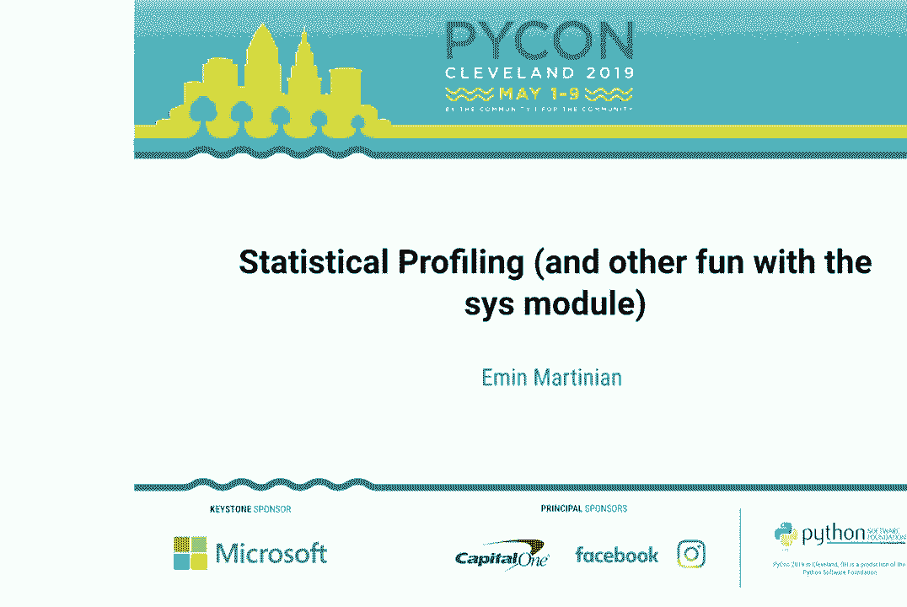

 Please welcome Emi and Martina。

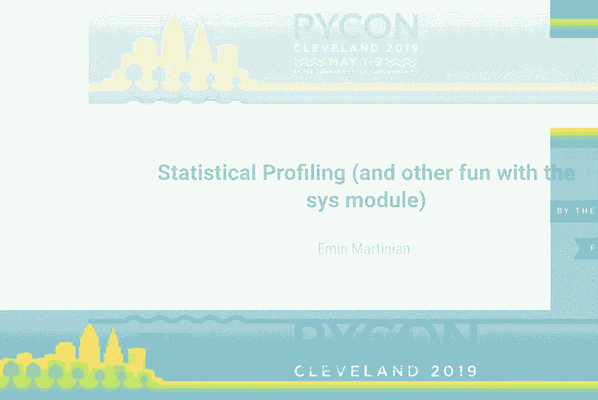

 [applause]， Thank you very much and thanks for coming to my talk。

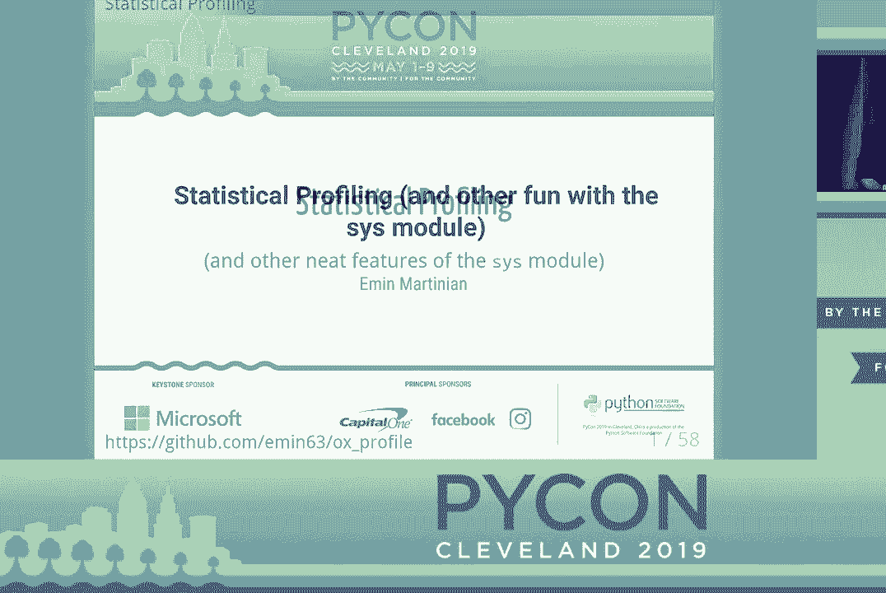

 So today I'm going to tell you about why you might want to do statistical profiling。

 I'll tell you about some of the various Python tools that are available and I'll give you。

 some details about the OX profile， statistical profiling package which I've written。

 The slides and the source for all of this is on GitHub at the address below so you don't。

 have to take notes or anything。 Okay so we're going to learn how to use profilers and hopefully you also learn how to write your。

 own。 One of the things I really love about Python is it gives you access to the internals of。

 the system in such a way that you can do things like debuggers， profilers， code coverage that。

 would be very difficult at least for me in a language like C。 So let's start with what is profile。

 According to the Python。org website a profile is a set of statistics that describes how often。

 and for how long various parts of the program are executed。

 So profiling is basically useful to find out which parts of your program are slow。

 That way you can spend your efforts in optimizing things and writing really nice tight code in。

 the parts of the program that really map。 So for deterministic profiling there's a number of profilers you can use。

 C profile is one of the built in profilers。 It's very easy to use。

 You do import C profile and then you do C profile dot run and you give it a string for the。

 function you want it to run。 So then run your code and it'll give you back what's called a profile which tells you。

 how many function calls there were， how often each function was called， the total time， the。

 per call， cumulative and it'll rank them in order of the function it took the most time。

 So when you can look at that deterministic profile and see which parts of your program。

 were slow or took longer than you thought and work on optimizing those。

 So again that's deterministic profiling。 So how does deterministic profiling work？

 Well the sys module provides you a couple of really neat hooks。 One of these is set profile。

 So if you call sys。set profile you can give it your profiling function and then the interpreter。

 will execute your profiling function on each function call。

 And if you want even lower granularity you can call settrace which is like set profile。

 where you give it a tracing function and then the interpreter will call your tracing function。

 on every single line of your program。 And you can use that to figure out what code coverage is or what parts are slow or whatever。

 else you want to do。 Okay so once we call these things we get a hook to inspect the stack frame。

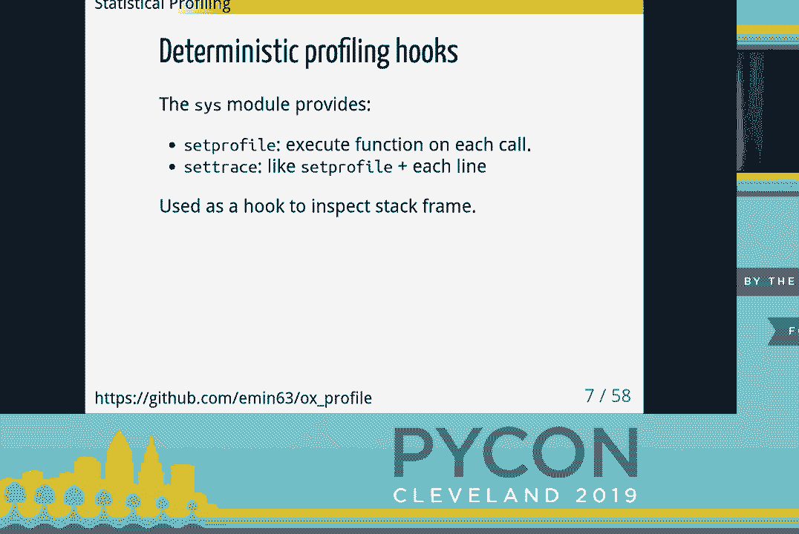

 So you might say well what is the stack frame？ So the way the Python interpreter works is you have some function foo let's say which calls。

 a function bar which calls a function baz which calls a function boo and so on。

 And the interpreter needs to keep track of the state of each function the local variables。

 and what's going on。 So it creates an object called the stack frame which we show here。

 The stack frame has a number of interesting things。

 One of them is fback which points to the caller stack frame so you know where your function。

 got called from。 There's also fglobles which tells you which globals you can see。

 There's a lot of other useful things in there。 The one we're going to focus on here is fcode。

 fcode is a code object which is shown in that elliptical feature there。

 The code object has a lot of information about exactly what code is running in that frame。

 It's got the co file name which tells you the file name where it was created。

 Co first line number which is the number of the first line of the source。

 A bunch of other interesting things and co name。 And co name is the one that's most interesting for us because it gives us the name of the。

 function that is executing that stack frame。 So for a profiler you look in the stack frame。

 you look at the code object and you look at， the name and now you know what function is executing and you can keep track of that。

 Okay， so let me give you a diagram of how the profiler works or how deterministic profiler， works。

 So you have your program。 It's in its main thread。

 Let's say there's some loop that's going to execute function one and function two and function。

 three。 So what happens is the interpreter enters function one and that immediately calls that profiling。

 function you've given to sys。set profile。 And then your function will record the name of the function that's executing by looking。

 at the stack frame。 What time execution starts and then it'll pass control back to the main interpreter which。

 will execute your function one。 Then when function one is done the system will call your profiling function again。

 You record the function name the end time and then you pass control back to the interpreter。

 And then the interpreter moves on to moves on to function two and similar things happen。

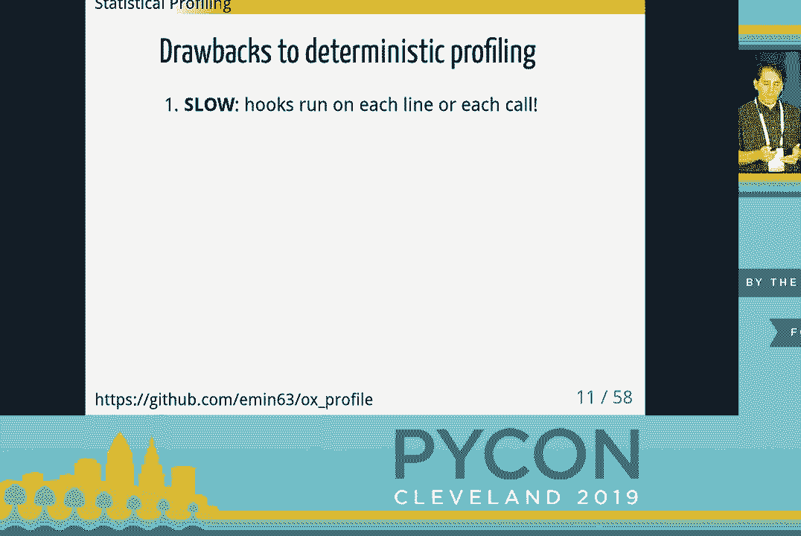

 and moves on to function three and again your profiling function gets called to record the， name。

 the start time or whatever other things you want to record。

 So the key idea here is that for each function call your profiling function gets called or。

 if you're using set trace for each line your trace function gets called。

 So that's great。 It gives you really detailed information about what's going on but the downside is it's slow。

 These hooks have to run for each line or each call。

 So deterministic profiling is great but one of the drawbacks is it's slow。 Okay。

 so what's another drawback？ Another drawback is scene number one。 It's slow and it's really slow。

 And so this is important because it makes it difficult to use profiling in production。

 Deterministic profiling in production。 So deterministic profiling is very useful when you're in the development stage。

 You want to run some tests， you want to run some use cases， you want to see where the bottlenecks。

 are， you optimize it， you write great code， fantastic。

 And then you deploy that in your production web server or your consumer application， what。

 have you and the users do all kinds of crazy things which you didn't expect and they complain。

 that your awesome program is slow。 And they often do that because regular users may not be programmers so they're going to。

 use it differently than me。 And so that's a problem with the deterministic profiling。

 It's harder to get the production experience。 Another。

 you could say draw back or just kind of a difference in focus is that deterministic。

 profiling usually is not thread aware。 So this little blurb is from the documentation for a set trace。

 It says it must be registered using set trace for each thread being debugged and there's。

 similar documentation for set profile。 So there's out of the box deterministic profiling doesn't handle threads really well。

 And it's not so much a drawback， it's just kind of the way threading works which is imagine。

 you're in some function foo and your profiling function gets called and says okay we're in。

 function foo starting at 2pm。 And then there's a thread switch and the interpreter starts running function bar and function bar。

 takes a long time and then the interpreter switches back and now it's 205 and function。

 foo finishes and your deterministic profile says function two just took five minutes to， run。

 So function foo maybe is really fast。 So that makes profiling thread code a little bit complicated。

 You can do with deterministic profiling but it is a little bit complicated。

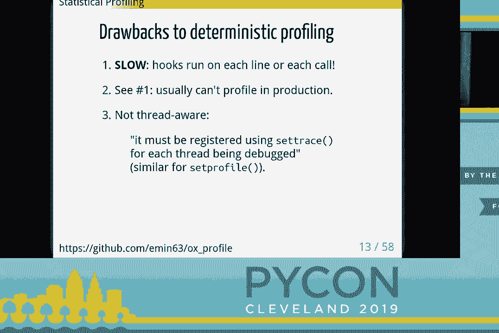

 Okay， so what we're going to talk about for the rest of the talk is statistical profiling。

 Now the way a statistical profiler works is you have your main thread， you still have。

 your function one， function two， function three just like before but the statistical profiler。

 is going to record a sample of which function is running and it's only going to run occasionally。

 to keep the overhead low。 So it doesn't slow down your production code you can actually run it in production。

 So here's a diagram of what it looks like。 So again you have your main thread running and then you have a sampler thread which is。

 either another thread in your Python program or maybe a completely separate program。

 What the sampler thread does most of the time is time dot sleep so it does nothing。

 Every once in a while it wakes up from the time dot sleep and it peaks in to see what。

 the main thread is doing， which function is it running and then it records the name of。

 that function and then it goes back to sleep again。

 So it's basically kind of waking up periodically and seeing what you're doing and going back。

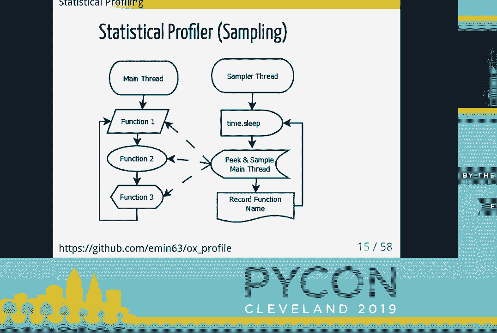

 to sleep。 Okay so how do we implement this sampler？

 There's a couple different ways and there's packages for each approach。

 So one thing you could do is use the POSIX timer。 So the POSIX timer is a low level timer you can set it to wake up and interrupt your process。

 and when you get that interrupt you can check the call stack， see what the call stack is， doing。

 what functions are executing and keep track of things like that。

 A couple of programs that use this are stat prof and plop so there's a great programs。

 They're not available on windows because this is a POSIX call。

 Another way you can implement a statistical profiler is something called P-Trace。

 That P-Trace is a really neat system call on POSIX。

 It lets you look at what some other thread is doing and control it or inspect it or whatever。

 you want and P-Trace can actually be called completely outside of your own program。

 So if you're familiar with something like GDB， GDB works along these lines which is you have。

 your program that's running perfectly fine， it doesn't know anything's different and then。

 some other program like GDB or Profiler will use P-Trace to reach into your running program。

 and pause it or see what's going on in the stack or otherwise inspect it。

 So that's how PyFlame works which is a very popular and nice statistical profiler。

 It's again it's not available on windows because this is a POSIX call。

 Okay so I've mentioned two approaches both of which are POSIX and so you might say do。

 we really care about non-posics？ I mean a lot of us use Linux， a lot of service run on Linux。

 why do we care？ So one answer is it's nice to have a portable implementation that is all other things being。

 equal it's nice to have something that's pure Python that's easier to move around to different。

 systems in case for example you want to use windows。

 Another reason is using only Python features makes it a little bit easier to understand for。

 those of us who are Python experts but maybe a little rusty in OS internals like set time。

 or a P-Trace。 And in particular if the whole goal of using a statistical profiler is so you have a low。

 overhead profiler that you can run in production it's nice to have an implementation which。

 is easy to understand it's pure Python so you can look at what's going on and then we can。

 get confidence that this statistical profiler using in production is not going to mess。

 up your code or if heaven forbid it does mess up your code you can at least figure out。

 why and go yell at the maintainer。 The third reason is there actually is software believe it or not that does run on windows。

 One good example is games and there's lots of other consumer software。

 To take games as an example if you want to find out why a game is going slow your Python。

 implemented game or game server for example and you put a deterministic profile on it it's。

 going to slow down the game it's going to slow down the frame rate it's not only going。

 to make the game unplayable but it's going to make the user behavior a lot different so。

 it's going to be essentially impossible to figure out what parts of something like a。

 game or slow if you use a deterministic profile and slow it down and so for that you'd like。

 to have something that works on windows。

 Okay so now let's get into how we're going to do this so there's really neat function。

 in the sys module called underscore current frames and the way you know it's really neat。

 is because it starts in an underscore in the sys module so something special is going on， here。

 So sys。current frame basically lists each thread's current frame and so then you can。

 peek into the frame and figure out what's going on。

 So this is how p profile works and also ox profile which is the profile I wrote and because。

 these are pure Python they work on windows which is nice。

 So let's look at how this works so again you have the main thread it's in say function。

 one you call sys。current frames which tells you the active frame isn't function one you。

 get that stack frame you look in the stack frame for the code object you look at the。

 code name and you get the function name and then you keep track of it somehow。

 And then if your program goes on another time you wake up and you sample and you call， sys。

current frames and it tells you programs in function two and so you record the name， and you move on。

 Later on you wake up maybe in function three repeat the same process。

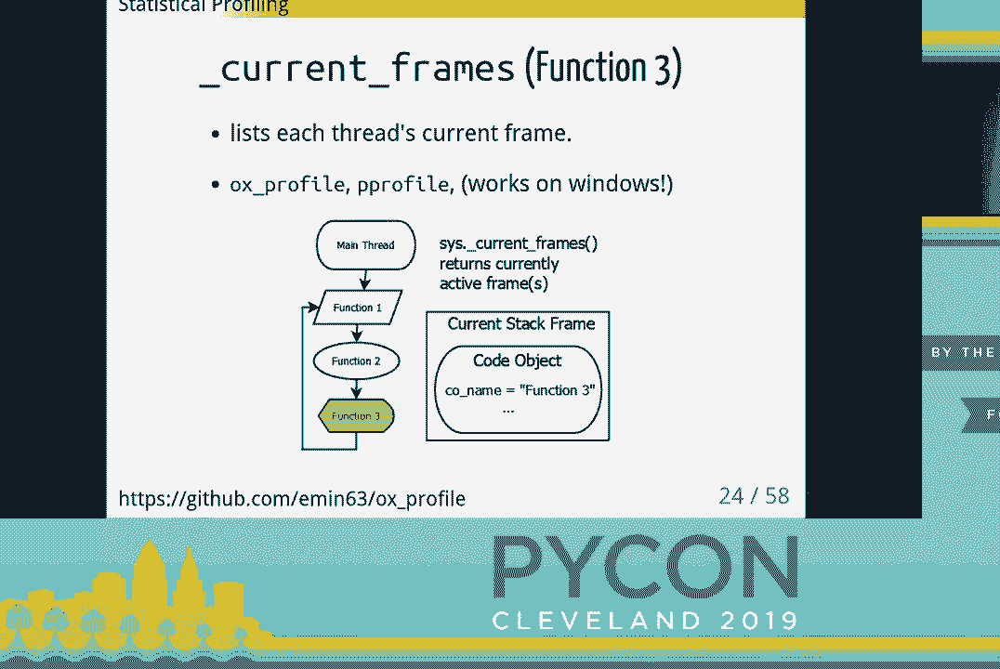

 Okay so I've told you some kind of high level thoughts about why you want to just assist。

 statistical profiling how you want to do it。 I'm going to give you a concrete example here with ox profile and then I'm going to go。

 into kind of how it works and the logistics of the sys module。

 So if you wanted to use ox profile you would do pip install ox profile you would import。

 something from the module you would call a launch function to launch the profiler and， that's it。

 And then you just go on run your code as normal run start your web server run your game call。

 you know your URL functions and so on。 And then at some point later when you want to see the profile you call profiler。

show and， it'll show you the profile and you'll see what's going on in your program and then if you。

 want to cancel it you call profiler。cancel。 So relatively easy to use。 Great so how does it work？

 So this is an oversimplified illustration of the sampler loop。

 So we have wild one so we're going to loop forever and this is going to be in a separate。

 thread so it's not going to block your main program。 We're going to do time。

sleep for some interval and then we're going to call sys。currentframes。

 which gives you back a dictionary and we're going to iterate over the IDs which are the。

 keys that's the thread IDs and the stack frames in there。 If reach stack frame we'll look at frame。

fcode。co name to get the name of the function that's。

 executing and then in some dictionary we'll just increment a count。 So that's it。

 So it's a statistical profiler and three in four lines of code which again you know Python。

 is a really neat language and these sys module functions are pretty impressive that you can。

 do something that at first might seem complicated in four lines of code。

 Couple things to mention here。 So the way you control the overhead is through this interval so you can call profiler。

set， interval and it'll change the sampling interval。

 So for example if you use something like a five second sampling interval it'll give。

 you an extra overhead。 You won't even notice it。 And so what we have here is a tradeoff between various goals which is accuracy。

 collection， time and overhead。 So in a deterministic profiler the profiler is always running and looking at each function。

 call and keeping track of what you're doing and that's why it slows you down because it's。

 doing something pretty much all the time。 Because if you set interval to something really long like let's say 100 seconds almost all。

 the time the statistical profiler isn't doing anything。

 As you bring that down from say 100 seconds to five seconds you'll get more accurate sampling。

 of your program。 As you bring it down to one second you'll get even more accurate sampling。

 As you bring it down to say 100 milliseconds you'll get super accurate sampling。

 And so what happens with the longer sampling times is you just have to run the program for。

 longer so that your sampler wakes up and sees all the different parts of your program and。

 gives you an accurate estimate。 So you can tune that knob between accuracy and overhead。

 And in theory if you took the sampling interval all the way down to zero you would go to become。

 like a line profile which is constantly checking what your program is doing。

 Another comment to mention is you in some applications you may want to add some random。

 jitter in case you're worried about the statistical profiler waking up and somehow giving synchronizing。

 program and never seeing certain aspects of your program。

 In general the Python threading tools tend to have enough randomness that you probably。

 don't need this but I mentioned it just in case you have some specialized application。

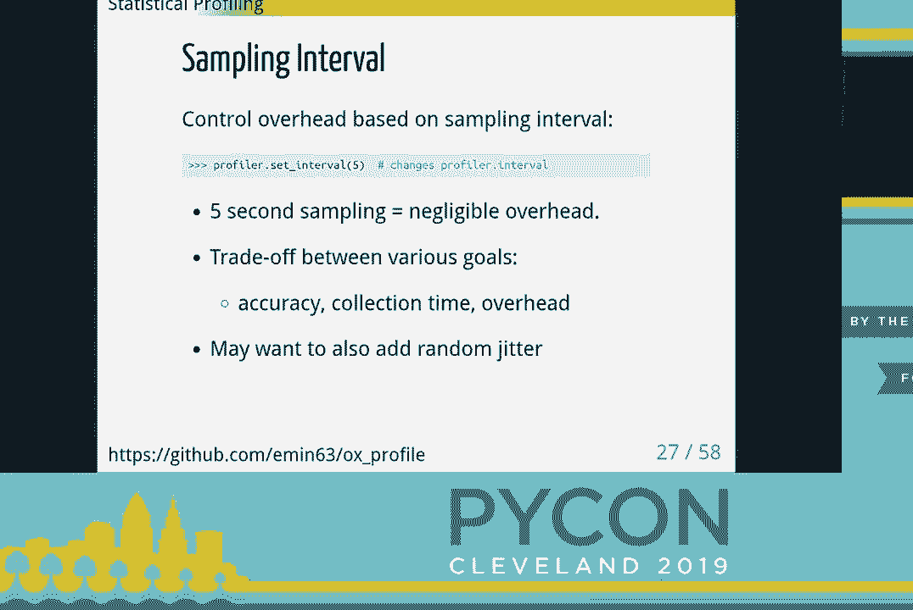

 Okay so what does the output look like？ So we call profiler。show and we get this list。

 It shows the function name and the module and the number of hits and the percentage of。

 the overall hits。 So you notice that this statistical profile is a little bit different from the deterministic。

 profiles that you see。 That as we don't have the time each function takes instead we have a number of hits。

 How often we saw that。 There's how often when we woke up was a program running a given function and through that you。

 can get an estimate not of how long each function takes but how much time of your program。

 it's taking up。 So for example in this case send is taking is where we wake up most often and see which。

 function is running it's taking 2。8% of the program hits。

 So if you want to optimize something in this case you might want to optimize send or you。

 might look at other functions and see like oh you know such and connect let's say is 1。5%。

 of program hits maybe you expect that to be much lower and so you can look at this statistical。

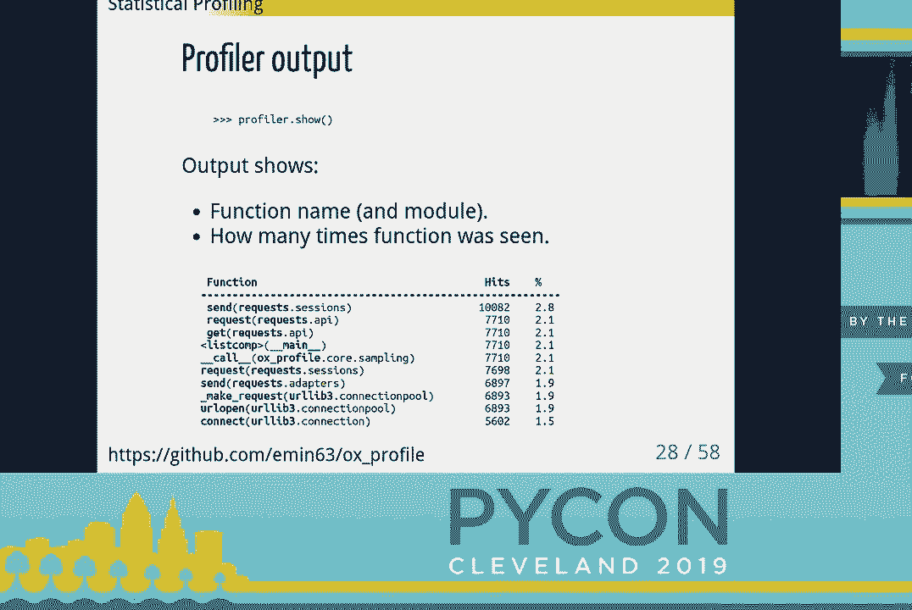

 profile to figure out where to focus on。 Okay so now let's talk about the basic theory of sys。

current frames。 So we start a thread that's doing mostly time。sleep。

 Periodically we wake up and we call sys。current frames to get the stack frames that are executing。

 and record the info from the current stack frame and that's it。

 Really simple four line program we showed you earlier。

 So in theory you can write a simple statistical profile with just these。

 Now in theory there's no difference between theory and practice and that's just going， to work fine。

 But in practice there's a little bit of a difference。

 Okay so let's go back to just the two line core about where you're showing you。

 So we're going to call sys。current frames iterate over it and record。

 Now I've started to make a few changes here which is instead of having self。midb just be。

 a dictionary maybe some other more complicated structure and you want to call a record method。

 just for you know generality and nice software engineering。

 Instead of just directly grabbing the code name from the frame maybe you want to call。

 some function called measure tool maybe you want to record some other things from the， frame。

 That's not a big deal。 But the question you want to ask is okay what could go wrong even with something as simple。

 as these two lines。 So you might want to think about it for 30 seconds。

 Okay so one thing that can happen is a thread context switch that is your sampler thread。

 gets control it calls sys。current frames to look at what's going on it starts iterating。

 over the current frames that are active and then all of a sudden the interpreter decides。

 okay I want to switch to different thread context。

 So it goes to a different thread maybe your main thread or some other sub thread and comes。

 back five seconds later and you continue iterating over the frames that you've got returned but。

 now those frames maybe have gone away because the interpreter has moved on in the other threads。

 and so you try and read a stale frame and depending on your python version you get a。

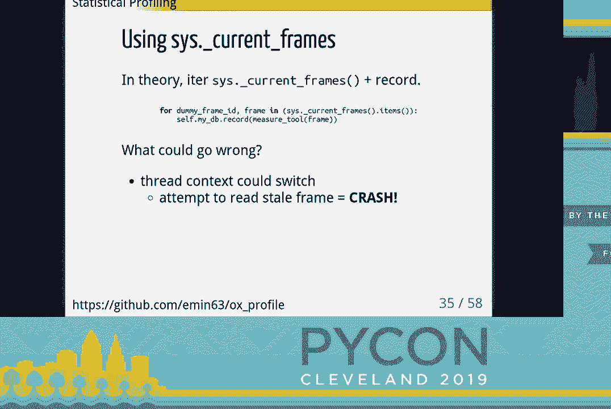

 crash。 Okay so one thing we can do is we can add we can use this other function called sys。get。

 switch interval and sys。set switch interval。 So sys。

set switch interval will tell the interpreter look please don't switch away from。

 my thread for ten thousand seconds or whatever amount of time you give it。

 So here what we do is we get the current switch interval we set it to ten thousand saying。

 please don't switch away then we do our really quick iteration over the frames and then we。

 say set switch interval back to whatever it was before。

 So this will help reduce the problem of looking at a stale frame。

 There's other ways you can do it but this is a nice way to illustrate switch interval。

 Okay great so now we're safer more robust to context switches now we'll go on。

 Well any time you're doing some kind of resource allocation you always want to keep track of。

 exceptions because if you had an exception here you it would prevent switch interval from。

 being reset and then your threading might start to work strangely。

 So you know this isn't really so much specific to statistical profiling but in general when。

 you're doing multi threaded code you want to be paranoid。

 So here what you want is a try finally so that no matter what happens even if there's。

 an exception you set the switch interval back to whatever it was originally。 Okay good。

 So we're doing the we're trying to protect from a context switch we're using try and finally。

 okay what else could go on。 We are just getting started in all the things that can go wrong in multi threaded program。

 So I should say I don't want to just discard you from doing multi threaded programming or。

 statistical profiling。 These things are reasonably robust but you just need to be careful of all the things that。

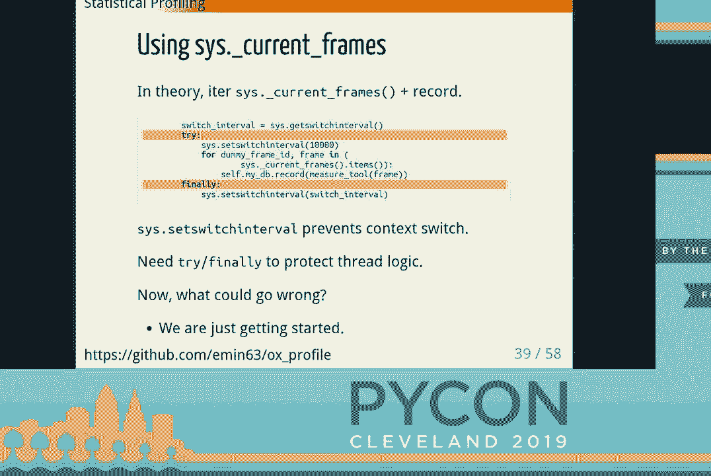

 could go wrong when there's multiple threads。 Okay so let's look at recording a sample。

 So we have this simple function record which gets a measurement and it's going to look。

 in a dictionary to see do have we have we seen the name of that function before and then。

 we're going to increment and if not we start with the count of zero and then we increment。

 the count by one。 Okay great so we're looking at a dictionary increment on the count by one it's a two line。

 function surely nothing can go wrong here right。 So what can go wrong。

 Well one thing that can go wrong is imagine that you're calling this record or the interpreters。

 calling this record method when it's sampling a frame at the same time that the sampling。

 thread is sampling a frame somebody calls profiler。show to see the profile right now or。

 some other way they decide to access the self。mydb dictionary。

 Then you've got one thread modifying the dictionary while another thread thread is reading the。

 dictionary iterating over it。 And Python gets really upset if you have two threads one of which is modifying a dictionary。

 another one which is iterating over it。 So depending on your Python version you'll get a crash。

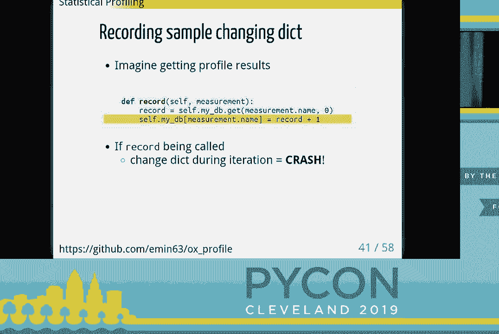

 So what you want to do is you want to use a thread lock in this case I'm using threading。

 dot lock with a context manager and then you make sure all the code that accesses mydb。

 uses the same thread lock so that nobody accesses the dictionary at the same time。

 Okay so we've got switch the context interval we've got use try and finally we've got use。

 thread locks seems like we're being pretty paranoid here for multi-threading so what else。

 could go on。 No guesses？ I don't know what else could go on。

 There's always unknown unknowns so one other thing I would suggest anytime you're doing multi-thread。

 programming is use fault handler。 So fault handler is this nifty little module that if you call fault handler dot enable。

 when you start your program if you have some really bizarre crash it'll still pronounce。

 some basic debugging information。 Now you're all probably used to having something go wrong and you see that nice stack trace。

 of the exception and then you're like oh okay it was functioned through the cause that let。

 me go debug that。 If you're doing multi-threaded code sometimes what you'll have happen is you'll corrupt the。

 memory like if you read a stale stack frame or try and modify a dictionary while iterate。

 over it or do some other funky stuff and if you corrupt memory you might corrupt the entire。

 stack and so when you get an exception instead of printing out that nice stack trace you'll。

 get a core dump or some other really ugly crash which won't tell you what's going on。

 and then you'll start pulling your hair out saying like well where did it crash why did。

 it crash whereas if you use fault handler dot enable when you get any type of crash it won't。

 allocate any new memory it'll immediately print some really basic stuff so that even。

 if your memory is corrupted you'll still get something。

 Okay so let me mention some additional issues so in this sampler thread that we're using。

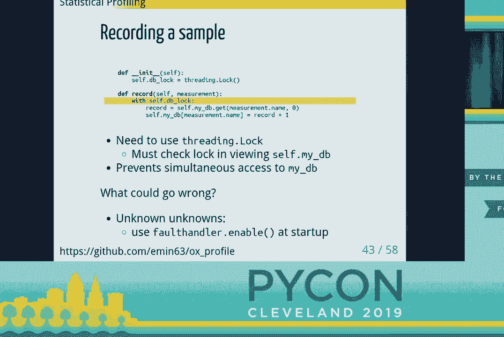

 and in general for threading you want to set this to be a demon thread。

 If you don't set it to be a demon thread then when your main program exits your sampler。

 thread would still be alive and it would prevent your program from exiting whereas if you set。

 it to self that demon equals true for your sampler thread then when your main thread exits。

 your demon thread will also exit。 Another thing to keep in mind is that so I mentioned before that in theory if you have。

 the sampling interval going all the way down to zero then your statistical profiler is going。

 to turn into a deterministic profiler so that's true in theory but time dot sleep currently。

 has some minimum granularity of like one to ten milliseconds。

 It's not really a big deal unless you're doing super high frequency trading or something。

 where you can execute code really fast but just worth keeping in mind。

 So I want to mention flask here so if you're using flask and you want to use aux profile。

 you can use this in a very simple way to plug it in you import a blueprint you do app dot。

 register blueprint for aux profile and you configure some admin users and with just those。

 three lines you can start using this profiler in flask。

 It will provide you four end points one is unpause which will turn on the profiler so。

 the statistical profiler even though it's low overhead it doesn't turn on by default。

 you have to turn it on。 You can use pause to pause the profiler so it's not affecting production you can call status。

 to show the current profile and the status of the results and you can use set interval。

 to change the sampling frequency。 So again one of the main motivations for using statistical profilers is you have some website。

 or you have a lot of websites or application services or something that's deployed in production。

 and you want to see what's slow or what's the bottleneck or what's the program doing。

 in real operation with real users。 So to do that it's nice to be able to have a statistical profiler inside there either。

 is an endpoint or in some other manner。 Okay let's look at some additional uses。

 So what else can you do with sys。current frames？ So again I want to say again like how awesome this function is。

 So if there's any core maintainers in the room right now please don't take away this。

 function because it's just really neat。 So I'm going to give you some other thoughts of ideas you could do to have fun。

 So what else can you do with sys。current frames？ So first of all you can use some major damage that's really hard to track down。

 So be careful because it lets you look into every thread that's running and mess with， them。

 Okay more seriously one thing you could do is you could take a data snapshot that is you。

 could use sys。current frames to look at the active frames and you could periodically snapshot。

 not just code name but something like frame。f locals that is you could take a snapshot of。

 what are all the local variables that are active in some given function。

 And particularly if you're dealing with a lot of third party libraries and just want。

 to know what's going on that's kind of a nifty way without having to rewrite those third。

 party libraries to write a simple tool that can peak at what's happening in your program。

 You could even modify f locals。 You could go into f locals and you could add one to every integer you find or multiply it。

 by two or do some other crazy stuff。 Now why would you do this besides wanting to cause major damage which I'm obviously。

 not advocating。 Well if you're running your tests you might have invariance or assertion checks or other。

 kind of things in your tests。 Those tests are great for your test cases but if you can go and randomly modify f locals。

 it's testing your code in a different way which could be kind of interesting。

 Another thing you could do is you could do something like a statistical debugger where。

 you periodically snapshot some debug information like a full stack trace and all the locals。

 and either dump those to a log or save those so in case there's a crash maybe you have。

 a random snapshot of like 10 or 20 functions that were called recently。

 You could use statistical code coverage just like coverage。py but turn it on periodically。

 and record which lines are being executed and then turn off so you don't incur much overhead。

 but you can track which lines of code are being actually covered in your real use cases。

 So let me summarize。 So profiling is designed to find bottlenecks and improve your code。

 You can use deterministic profiles for that but they can be slow so you can use a statistical。

 profiler to sample your code periodically and let you use your statistical profiler in production。

 to see what real users are doing without providing too much overhead。

 You can use OX profile which is open source on GitHub or you can write your own and really。

 not that many lines provided you're careful of a few things。 The key functions here are set profile。

 set trace and sys。current frames which lets you， peek into what the interpreter is doing or have the interpreter call your function periodically。

 It's simple in theory but any time you're using threads be careful， use try finally， use locks。

 maybe use a switch interval and use fault handler。

 So that concludes the main talk and ready for Q and A。 [applause]。

 We've got a few minutes for questions now。 If you have a question just use one of the microphones here。

 Hello， here we go。 My question is with regard to statistical profiling in the example you gave where the。

 number of hits kind of tells you what to go look at for potential improvement。

 How do you differentiate the fact that that number of hits may be due to just the fact。

 that that particular program let's say a web crawler would obviously have a huge percentage。

 of hits on like request。get or whatever versus that number of hits suggesting that those particular。

 function calls are slow or need improvement。 >> Let me rephrase what I think you're asking。

 I think what you're saying is what if you have something like request。get which is not。

 really slow in CPU terms but it's slow in the sense of time that you just have to wait。

 for things to go back and forth in the network。 So it's not CPU bad but it's still slow and the statistical profile would be telling you。

 like it's slow most of the time in your program you're waiting in this particular function。

 One thing you can do is if you know that's the case you can just ignore that line and。

 go down and look at the other things。 There's not a ton of stuff you can do because the fact that the Python interpreter is sitting。

 there waiting in there is going to be hard to figure out in a profiler because it really。

 is a slow function。 Does that answer your question or does that get at what you're saying？

 >> Sort of， yeah。 It was more how do you request that get was just an obvious example but really what I'm。

 getting at is how based on what you're seeing from a statistical profiler what clues do you。

 have that can help you differentiate that a function called actually needs improvement。

 versus that it's just used a lot in the program。 >> So that's a good question。

 So it's not so much a statistical versus deterministic profile question。

 It's just a question of how do you know if something is slow or it's just called a lot。

 So that's a profiler can't help you so much with that that's more something you have to。

 figure out and so the way to think about a profile is not necessarily what's the so you。

 can look at what's the top hit or what's the slowest function and the more you can speed。

 that up the better your program will be or you can look for what functions seem to be taking。

 a lot more time than I expect and you can use that to drive what you look at。 >> Thank you。

 >> Maybe on this side。 >> Yeah。 >> Have you any experience with running a statistical profile or inside a Docker pod？

 >> Inside of what？ >> Docker。 >> Docker。 >> Kubernetes。

 >> So it should work just fine and so statistical profiler should work just fine in Docker or。

 Kubernetes because it's running inside the Python interpreter and it's just telling you。

 when the interpreter is running what function is it in most often。

 Does that answer your question or did you mean something different that I misunderstood？

 >> I was wondering if the fact that you're really faking that you're on a process， you're。

 on one processor but you're really sharing a processor does that change your statistics？

 >> It won't change your statistics。 If for some reason your particular Docker process gets shoved to the slide while other。

 things run then that could be an issue of course。 But that's not really a problem you can solve with the profiles。

 Back to this side？ >> I'm just going on the same note。 First of all， great talk。

 This is really educational。 Also in terms of messing with things such as context watching。

 is that how far down is， that propagated down？ Is that just propagated down to the Python interpreter？

 Would it， if it's running on a virtual machine or with the hypervisors and stuff involved。

 like it's not safe to go against that， right？ >> Good question。

 The set switch interval is only going to protect you from a context switch happening。

 in the Python interpreter。 It won't protect you from the operating system deciding which process gets to run。

 That's true。 The thing that we're worried about in that example is that if the Python interpreter switches。

 away and then switches back to you， you've now got stale stack frames potentially。

 You're looking at stale memory and so that'll cause potentially a crash。

 There's other ways you can try and check if those stack frames are live or stale。

 But that's one simple example。 Back to the side。 >> Hi。 Thank you for the talk。 Two questions。

 First， have you had a chance to measure the performance implications， say with a 100 millisecond。

 sampling and second question， have you considered recording， let's say， if a function A equals。

 function B and you ended up seeing that the function B was cold， that also implies that。

 function A was cold。 So the counter for the function A should also be incremented。

 And that might address one of the first questions there was。 >> Excellent question。

 I'm glad you asked that。 So let me answer this。 So let me take that in order。

 So if you set the sampling interval down to 100 milliseconds， the sampler is going to run。

 more often。 It's hard to say anything concrete because if you're running on a 15-year-old laptop。

 running it every 100 milliseconds is going to mean a lot more than if you're running it。

 on a top-end Xeon server or something。 Now， the actual time for the sampler to run is relatively small。

 But that's what matters。 How long does it take the sampler to run relative to the sampling interval？

 And that's how much overhead you're going to have。 Okay。 So the second question was。

 what if function A calls function B calls function C？

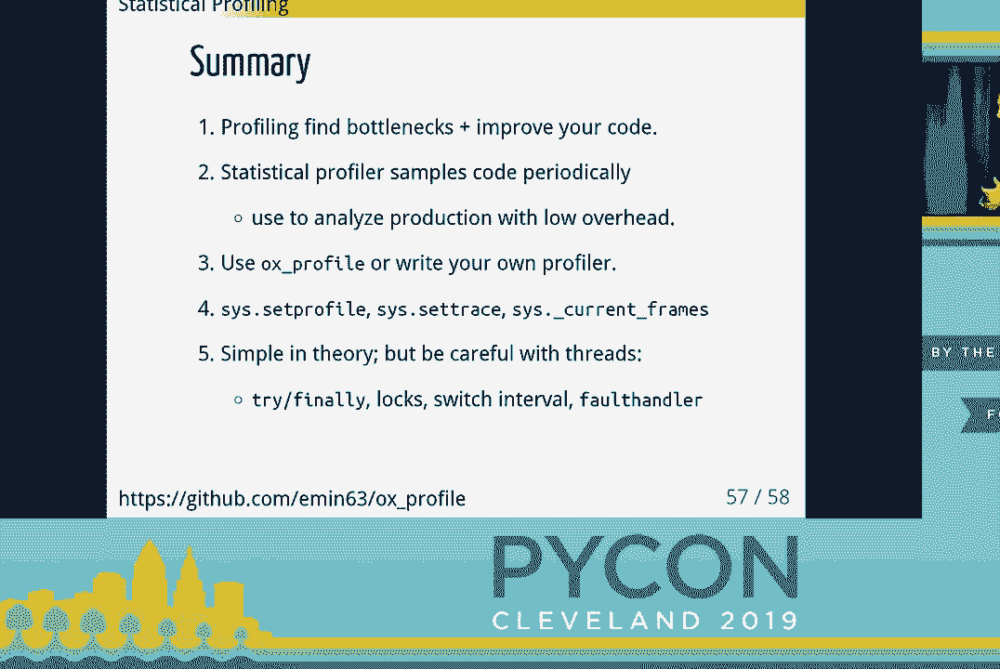

 So let me go back to a diagram we had earlier right here。

 So we have a foo called bar called BaaS called boot。 So because we have F back。

 what you can do is you can say， okay， I'm in frame number， four， which is boot。

 but that was called by BaaS， which is called by bar， which is called， by foo。

 So one thing you can do in your statistical profilers is say， don't just count the function， I'm in。

 also add a hit to each of the callers。 So I didn't show that just to keep things simple。

 but in OX profile， you can't not just， the function you're in but all the callers。

 So you'll capture that if there's some top level function calling everybody。 Thank you。

 Do we have time for more or are we done？ One more。 Okay。 That's all the questions I think。 Sorry。

 I'll be outside in the hall if there's more questions。 Thanks， Emi。 [APPLAUSE]。

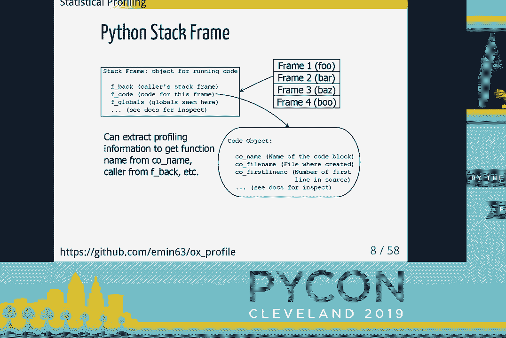

 (applause)。