# PyCon 2019 演讲全集 - P9：Manojit Nandi - Measures and Mismeasures of algorithmic fairness - PyCon 2019 - leosan - BV1qt411g7JH

 Hi everyone welcome on that speaker would be Manajit Nandi talking to us。

 about measures and mismeasures of algorithmic fairness。

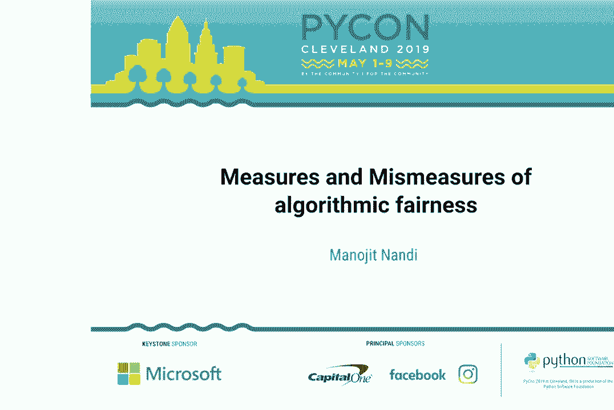

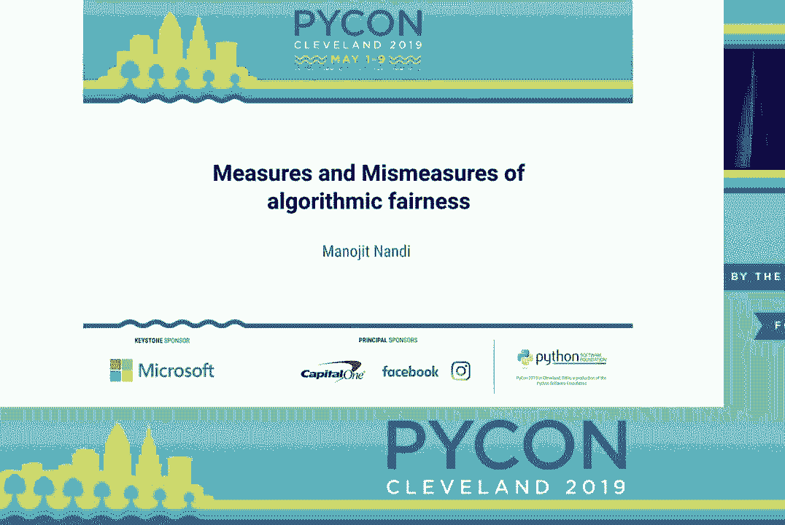

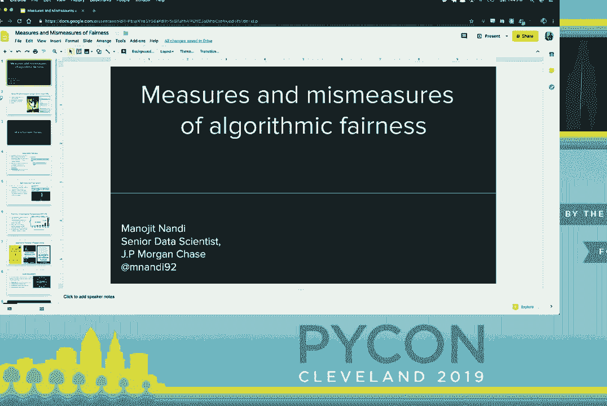

 How do I do things？ There we go that's how things happen。 Okay ah sorry for the bit。

 like hello everyone thank you all for coming to my talk this afternoon on。

 measures and mismeasures of algorithmic fairness。 I'm Manajit Nandi and。

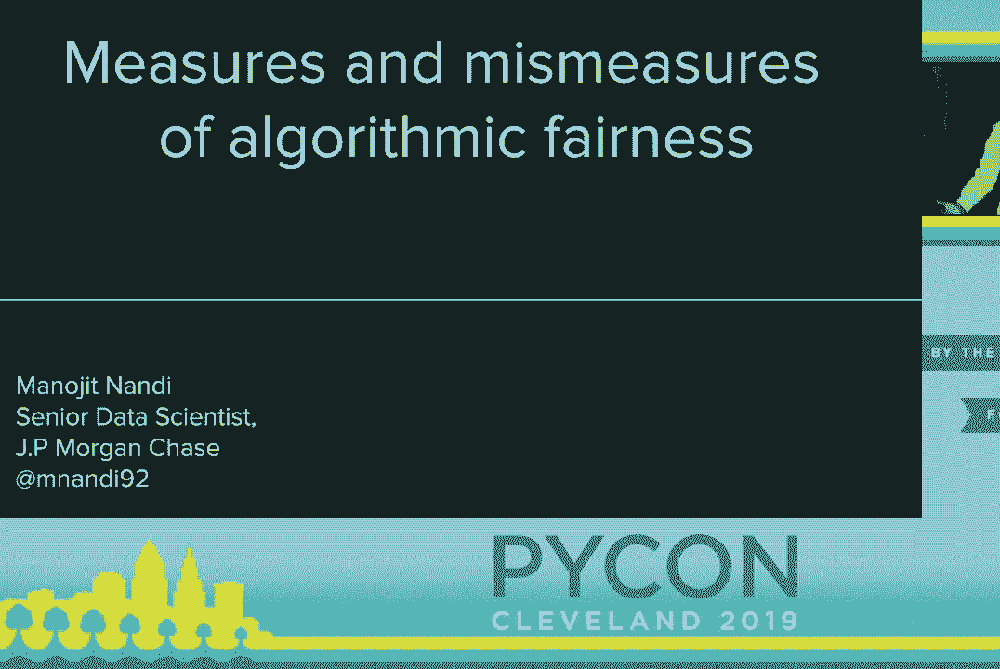

 I'm a data scientist so a quick about me according to the Google Cloud Computer， Vision API。

 So I ran a photo myself through the Google Vision API and it produced。

 some labels for me so let's go through some of them and see how right they are。 Am I a dancer？

 Yes I'm an aerial dancer in a circus acrobat I just work as a。

 data scientist for 40 hours a week because I got a pay rent somehow。 Am I， entertaining？

 I hope so you're stuck with me for the next 40 minutes。 Am I fun？

 Ah most of the time and lastly am I a girl huh so that one is not true I am a。

 male presenting cis man so why did Google Vision think I am a girl and the。

 thing is it's not just Google Vision if I were to run this through Microsoft's。

 Vision API it produces similar results it says like oh this is a picture of a。

 lady and so the thing is like what are these really looking for when they say。

 this is a girl are they saying how similar am I to what they've understood to be a。

 girl is it because of oh this is a dancer and all the dancers in my training。

 set were girls so therefore this is a girl as well or is there some physical。

 feature about me that makes it think that oh this is probably a girl and this。

 seems like a fun innocuous example but these types of systems of automatic。

 gender recognition are used everywhere for example to basically show you better。

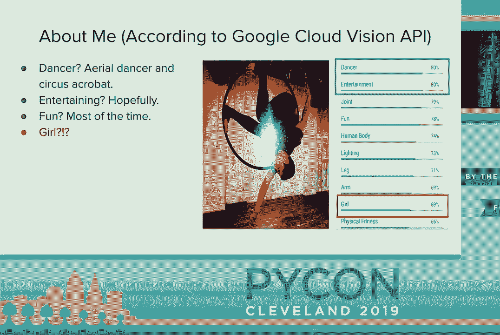

 ads when you're in a taxi cab for some reason because after all is not the true。

 purpose of data size to show you better ads and think about this this is it sounds。

 really dumb it's actually quite dangerous because if you basically have。

 some prototypical understanding of like what this is what a man looks like or。

 this is what a woman should look like you could actually misgender people whom。

 that is actually a huge issue to and so there's a researcher at University of， Washington osu！

 Keys and in who's done a survey of how queerness and gender are。

 thought out in human computer systems and their overall findings is that the way。

 we think about gender in human computer systems is inherently trans exclusionary。

 so now as we try to be like data driven leaders and we use these types of。

 systems we are sort of using systems that are inherently trans exclusionary we。

 inherently make decisions that ignore the existence and lived experience of the。

 trans community and I hope this example sort of motivates why we should care about。

 fairness and ethics when we do data science machine learning so what is。

 algorithmic fairness so algorithmic fairness is a field of research that's。

 aimed at trying to mitigate the effects of unwarranted bias on discrimination on。

 people on machine learning and so this is a kind of weird thing because like bias。

 is a very overlord term in data science and machine learning it's probably a。

 second most overlord term after kernel which has a bunch of different definitions。

 in machine learning and right now sort of like the focus on this type of。

 research has been like coming up with mathematical definitions of fairness we。

 have this mathematical definition of fairness we're gonna find some solution。

 to it and hope that maps back well to the original problem but over the last。

 year or so we've seen some pushback against this we've seen that okay in this。

 paper for example called fairness abstraction and social technical。

 systems that there's sort of an over a formalism trap that we care too much。

 about mathematical formalisms that even if you solve the mathematical。

 formalism it doesn't really translate well to a real world solution and the。

 key thing to keep them out this is like Ferris is inherently a social and ethical。

 concept it cannot be perfectly captured or represented through mathematical。

 definitions or statistical metrics and we'll talk about the research and I guess。

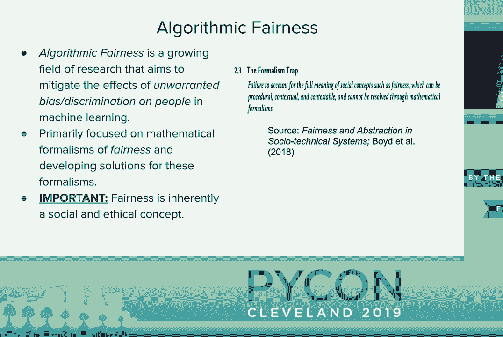

 I want to take a slight like a side about like this is an idea of like okay well。

 we're using algorithms and math and math can't be racist that's silly and it's。

 actually came up in January when this like alt-right journalist basically。

 criticized the New York Congresswoman Alex Ocasio Cortez when she said that okay。

 algorithms have been shown to discriminate against blacks and Hispanics。

 in different cases and so the thing is like when we say that an algorithm is。

 racist or sexist we're not saying that like math is inherently racist or。

 sexist we're not saying that like the prime numbers are inherently racist or。

 logistic regression isn't like inherently sexist we're talking about the ways we。

 use math the ways we use algorithms can reinforce societal inequalities you。

 know prime numbers are not racist but the way we can use prime numbers to break。

 cryptographic systems has real world implications the way we use logistic。

 regression to decide who gets a credit loan or bank loan or not has real world。

 implications and that's what we need to think about when we design these。

 algorithms they're not sort of just existing in the void by themselves there's。

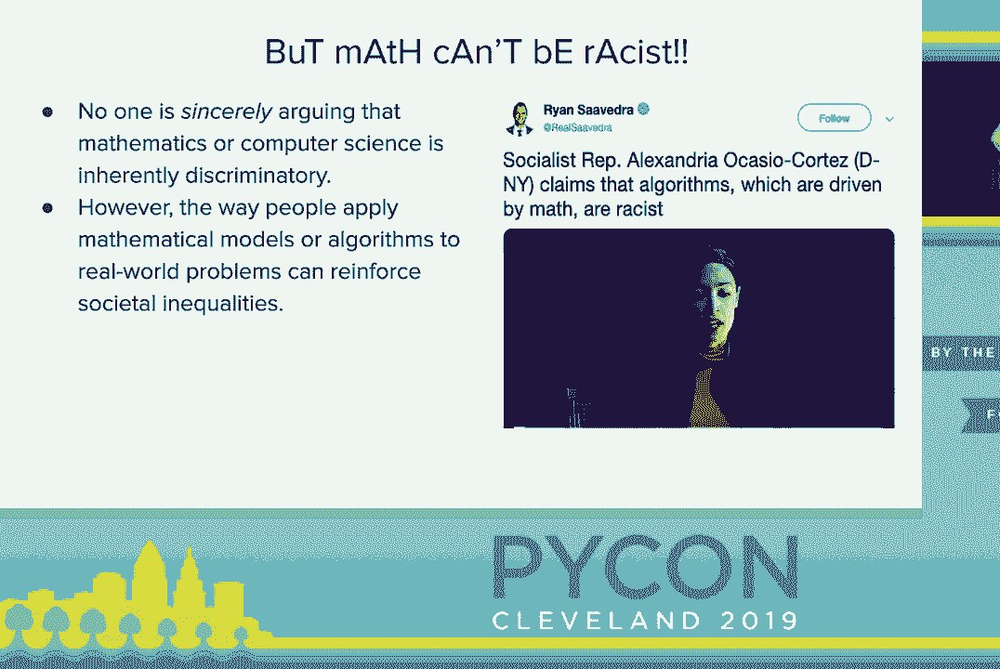

 embedded in human systems and on the research side of this algorithmic fairness。

 so now let's be revealed to called fairness accountability transparency。

 fat star ML and this is like this interdisciplinary research area about。

 how we get machine learning and technical systems to care about ideas like fairness。

 and justice and equality has really exploded over the last few years you。

 seeing a dedicated conference to it ACM fast-star which was held in Lanta we。

 have seen lots of open-source libraries about this and even at this conference。

 we actually have another talk about model fairness later today and I do for。

 anyone who's also interested in attending that I have looked at that other talk I。

 do believe there's enough differentiation between our two talks that you would。

 get something about worthwhile by attending both talks for anyone who has a slight。

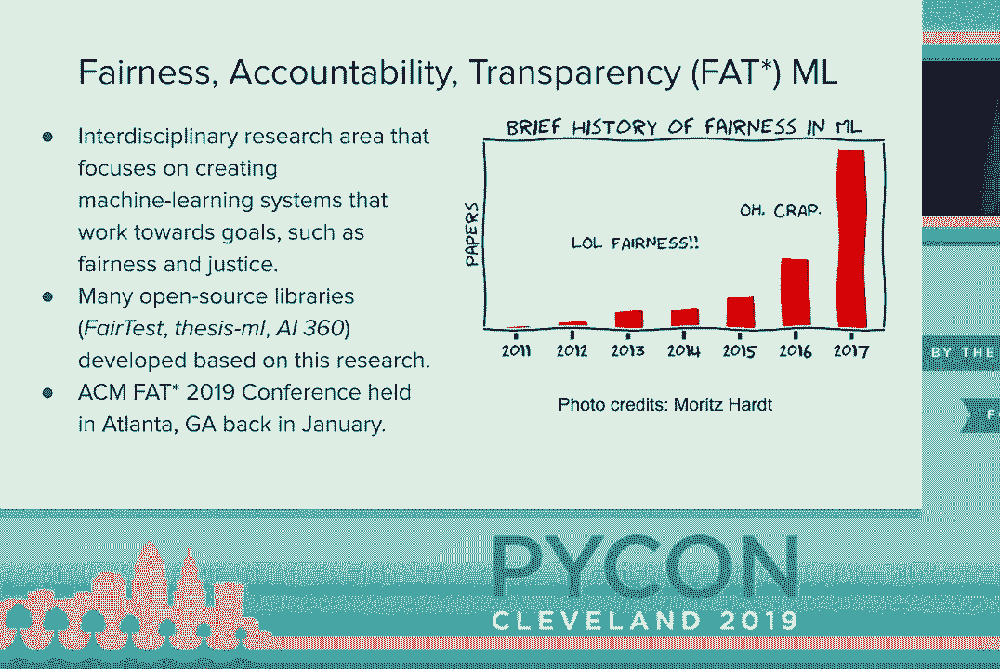

 concern and it's not just researchers who are talking about this we talk about。

 this in popular media too oh so weapons and math destruction by Kathy O'Neill。

 automating quality by Virginia U-Banks and algorithms of repression by Safya。

 Nobel and so you know the big three and I think they take this interesting。

 approach of like okay here's how the algorithms work on the people like we as。

 the data scientists we as the machine learning researchers or sort of。

 separated from the downstream effects of how our work impacts the general。

 humanity and a general society and thing is like as data scientists and like。

 computer scientists we're sort of trained like math and statistics we're not。

 trained to think about ethics we're not think a trained to think about a public。

 policy but we do need to understand that like our work has downstream。

 implications I think deep down like we may not be comfortable like taking the。

 role of an ethicist or taking the role of a public policy but I think deep down。

 none of us want to cause the apocalypse none of us wanted to harm to others like。

 no one wants to be the people written about in these books and I think the way。

 that they attacked this problem of like talking about the dangers of these。

 outcomes like how these hurt people is an interesting perspective from just。

 research which is okay here's the cool things we could do whereas this these。

 popular media talk about like how could this hurt people and talk about how could。

 this hurt people we have to think about like okay maybe you don't really care。

 about the moral side of like I don't want to hurt people but I can maybe encourage。

 you to think about these types of problems by legal regulations of you。

 maybe don't care about hurting people but you do care about keeping your job。

 because if you break some of these things well you're violating legal laws。

 and then you can lose your job because your company will be fined millions of。

 dollars and so in the US for example we have disparate impact laws which prevent。

 again which basically regulate how you can give out loans how you can hire for。

 people such that you don't harm them and also in the EU we now have GDPR which is。

 an overarching holistic set of laws and rules of like how we should think about。

 the way we use algorithms to process people's data and we have to think about。

 okay can you explain why you're all with the media to this it can you explain。

 why your neural network didn't give someone alone and can they opt out of。

 that as well and so let's talk about the different types of。

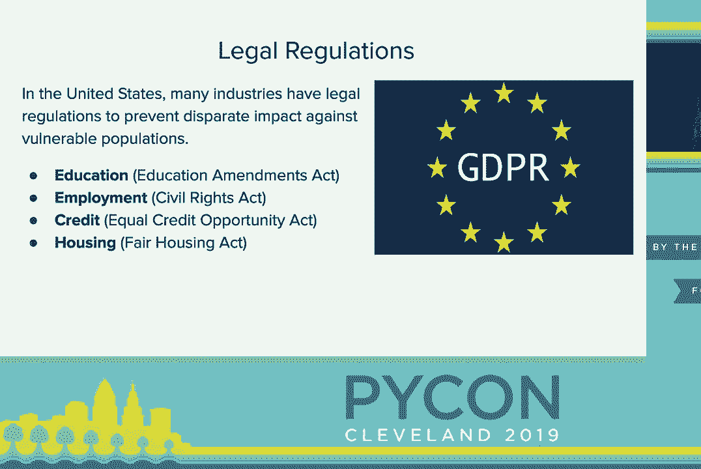

 algorithmic biases and so this is based off some work by researchers at Microsoft。

 and research and Cornell and this was presented at the conference that is now。

 near or up any you are IPS someone told me it's pronounced like Europe and I'm。

 not actually sure if that was a joke or not but really these research is sort。

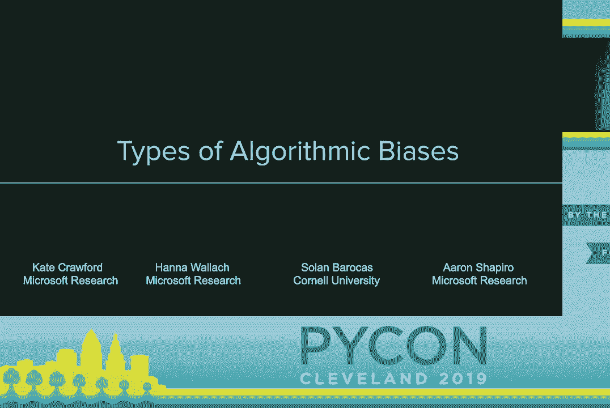

 of identified three big categories of way we think about like all with devices。

 of like where we are now where we're heading and where we need to be so first。

 let's talk about where we are now so a lot of problems in all with vices focus on。

 this problem of allocation who gets a loan or not who gets a job and these are。

 really just like binary classification problems of like do men get software。

 engineering jobs more than women do whites get credit loans more than non。

 whites kind of thing this is a binary yes or no and this is really what most of。

 the research has been on now because it's sort of easy to formalize as a。

 mathematics problem and easy to solve and so this was in the new big story last。

 year was that Amazon had to scrape their AI recruiting tool because they found。

 out that it was just women against women it was basically looking at things of。

 like oh hey if you have a name like Jared or you were on the lacrosse team at。

 back in college you're probably more likely to be hired as a software engineer。

 which really makes no sense and so that's a scrapeness because they realize oh hey。

 we were harming or choosing our model was selecting against women but if we use。

 this next we'll talk about where we're sort of heading and so next is this idea。

 of bias representation and so this is focused on looking at like how harmful。

 stereotypes or harmful labels are propagated through machine learning。

 systems and these are often related to like language problems or computer。

 vision problems which are like the neural network problems of it just picks out。

 a solution and do some blackbock neural network magic but we don't really care。

 about why the inner mechanics of what it's doing and these are sort of hard to。

 quantify the errors compared to those previous bias and allocation problem。

 which is why there's less research on this now but like we started to think。

 about it more and so this is famous example that when Google photos was。

 deployed like 2015 that it actually labeled a group of black kids at a。

 graduation party as gorillas and so for those of you who are not familiar it was。

 like history of US I don't know if it all applies to other Western countries but。

 gorillas or apes has been historically used as a derogatory slur against。

 African Americans in this nation so this label like what is wrong but you it also。

 invokes harmful stereotypes against African Americans and thing is like it's。

 harder to quantify as an error because yeah this is a wrong label but at the same。

 time Google photos is never going to label a group of white kids as gorillas。

 this is specifically a label it gives to these kids here and it promotes this。

 harmful stereotype and other examples that sort of hard to quantify are snap。

 chat filters for example so when you apply snapchat filter flower crown it sort of。

 brightens the skin of the individual why because a snapchat filters of sort of。

 learn okay brighter skin is associated with prettiness therefore when I apply。

 the affiliate filter brighten their skin and so everything about that's like a。

 really hard to quantify what's wrong it's doing the optimization process it's。

 supposed to do but there's just something about that solution just sits on easy。

 with you and another example is Google translate so when you translate sentences。

 from like Malay which is a language that doesn't have gendered pronouns so you。

 can have like they are a doctor they are a soldier they are a professor they are。

 a prostitute they are a nurse but you translate to English it's sort of。

 automatically genders them he is a doctor he's a soldier he's a professor。

 she is a proton prostitute she is a maid she's a nurse and at the same time like。

 Google translate is doing this mathematical observation it's like hard to。

 say why this is wrong this is a valid translation of those sentences but it's。

 just something about it that just sits uneasy with you but and to give credit。

 to where's due Google has actually made a sort of hot fix where when you translate。

 from a non-gendered language to a gendered language it will actually show。

 both gendered ways so translating from they are a doctor translates to she is a。

 doctor he is a doctor now so this is like a quick fix for this it's still not。

 available on the iOS and Android version of Google translate and you still see。

 like some of these biases when you do Google autocomplete so if you type in。

 the search of he is a blah you'll probably get doctor or soldier more than。

 if you do she is a blah in Google autocomplete， finally where do we need to be and so this last version is called the。

 weaponization of machine learning and so the key idea of this is like as data。

 scientists we're taught to train models we produce some metrics we don't really。

 think about how are more can harm people or how could be misused and so this is。

 big story back in 2017 a group of Stanford researchers tried to create a。

 cost-fiction algorithm that tries to predict people's sexuality or sexual。

 preferences based on images of their faces and so effectively said they created。

 a gay-dahr of trying to predict if someone is heterosexual or homosexual。

 and the thing about this is their countries in this world where homosexuality is。

 criminalized by the state if you are out as a homosexual you will be executed by。

 the state and there are plenty more words like it's not criminalized but you。

 used to really dangerous to be out as a homosexual so if someone takes this a。

 model they could use it as a weapon against homosexuals in those countries。

 and think about this is there's no mathematical measure no unit test you can。

 write that can tell you this is a bad idea you shouldn't do this this is really。

 gonna require you to have cultural anthropologists and historians in the。

 room to tell you like hey this can harm people and that's why I'm really great。

 that there is sort of the starting discussion of like having data scientists。

 and machine learning technologists really think about ethics training like。

 we need to do degree programs that like UC Berkeley or Carnegie Mellon they're。

 starting to include an ethics component well I don't think that we're really fully。

 solid this I do think it's the start of developing a different tech culture。

 that really cares about the downstream effects of our work on people who are。

 not like us so let's talk about the different types of fairness measures so。

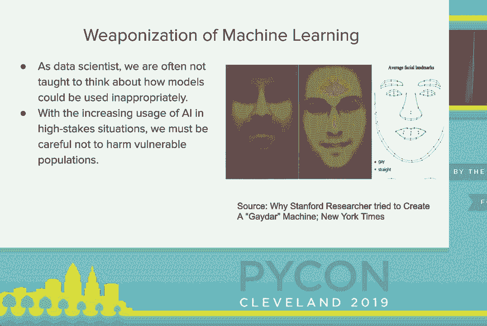

 these are like the mathematical definitions and I will really talk about。

 like what they are and some their big weaknesses of them and so this is based。

 off of work by two Stanford researchers Sam Corbett Davies and Sherrod Gull and。

 they're based on this behavior measures and mismeasures of fairness which this。

 talk is the title this talk is based on and so we'll talk about difference。

 definitions of algorithmic fairness so there was a talk a year ago by this。

 principal professor Arvind Narayan we really showed that okay there were 21。

 definitions of algorithmic fairness at the time of the time when he gave that。

 talk now there's more than 30 definitions of like algorithmic fairness now and。

 think about this like as computer scientists and like statisticians we think。

 okay there's three definitions there's got to be like some that are better than。

 all that it's got to be like this one true definition of fairness we can use。

 and that's not really true why because fairness is a social and cultural。

 concept like what was considered fair 50 years ago is not going to be considered。

 what we consider fair now and what we consider fair 50 years from now is。

 different from what we consider fair today but these sort of different 30 so。

 definitions of algorithmic fres can be broken down to three big groups anti。

 classification cost of question parity and finally calibration and I'll just give a。

 quick warning this is where the talk story gets a bit more technical and。

 mathematical so first up there's these anti classification measures and so what。

 these are is that okay you have these protective features such as like race。

 gender religion in place of origin and you have unprotected features for your。

 model and whether these anti-placement works ideally is that okay when you make。

 an overly decision it should effectively ignore those demographic features。

 ignore race it's ignore gender should ignore religion when it makes this。

 decision or behave in a way it does so it's sort of this idea of individual。

 fairness you judge a person by the content of their character rather than the。

 color of skin kind of thing that two people should be treated equally if they。

 have the same unprotected features but the thing about this is that like you。

 can't just like throw out race and gender from your model or from your data。

 sense like okay I'm done because we're now starting to realize that there are。

 proxy features that we can worry about like features that are not directly。

 rate encode race or gender but are highly correlated with them and so for。

 example there's a story back in like 2012 when the office supply company。

 Staples data promotion that if you live within 20 miles of a competing。

 competing store we will give you a special coupon discount so that you'll。

 come to our store instead the thing is the people who live in those like。

 neighborhoods at 20 miles from the competitors there's a sort of like。

 wealthier suburban neighborhoods and the people who live in wealthy suburban。

 neighborhoods have certain racial demographics for example so what do you。

 it's when your model discriminates or makes a decision based on location it's。

 inadvertently acting as if it was making decisions based on race and so。

 Staples was hit huge fine with that for disparate impact and as a result these。

 types of features are very useful for designing fairness aware models so what。

 is a fairness aware model so it's sort of like a traditional machine learning。

 supervised model except now we have this added component we need to think about。

 those protected features so when you have these standard machine learning you。

 have your features X and your labels Y and you basically want to map the。

 features X to the labels Y well now with fairness aware algorithms you have X you。

 have Y and you have your protected attributes so race gender religion。

 place of origin as a reputed class Z and what you want to do is like you want to。

 like learn features that learn your label so you want to learn who to give a。

 loan to we don't want to accidentally learn race or gender and so one really。

 cool algorithm that does this is fairness aware GAN so I think this is a。

 really clever idea so how this works with GANs is that you sort of have linked。

 these two sub models one is sort of your standard machine learning classifier it's。

 trying to like take the features and learn the labels the other one is trying。

 to take the labels and learn and protect the class and so what you can think about。

 is a sort of like this dual like I'm trying to learn a good classifier you're。

 trying to break me by saying oh that cost fire accidentally learns race or。

 gender and so this is what how that really works and like you have to look。

 at this law function so like the one in the red box is sort of saying I'm I'm a。

 good classifier not am I learning features that predict who gets a loan or not the。

 one in the blue box is saying okay you learn who to give a credit loan to are。

 you accidentally learning race or gender is your basically who gets a loan or。

 not basically just figuring out is this person white or non-white and sort of。

 this trade-off if you really squint your eyes at this if you study machine。

 learning and regularization so like originally regression or last regression。

 you squint your eyes at this and stare at it deeply it kind of looks like a。

 regularization of I want to be a good costifier but I don't want to be overly。

 complex in this case complex it's sort of like I don't want to accidentally be。

 discriminatory and this is sometimes referred to as this accuracy fairness。

 trade-off and I'll be really honest I don't like that this is referred to as a。

 trade-off because if you really think about like why are we doing all this。

 stuff in the first place because our training set is biased because our。

 testing set is biased and that means our testing labels are biased like our。

 answer key is wrong we don't want models that perfectly learn the the testing。

 set labels because then it's also learning those biases as well so we。

 expect the accuracy to go down and I also really don't like calling this a trade-off。

 because it sort of ties into this like very harmful idea that somehow。

 promoting diversity is requires you to partake in sub-optimality and so you see。

 this is like tech hiring where okay if a software company says like oh hey we have。

 ours 50% of our software engineers a woman that's a good thing but then there's。

 always like some loser on Twitter it's like hey I got a brilliant idea instead。

 of hiring people based on their gender what if we hire the most talented person。

 for their job and this is sort of like ties into harmful idea like in order to。

 and get diversity you have to pick less optimal candidates or less skilled。

 candidates and that's not true at all like diversity is very good for tech。

 having people with different lived experiences and different ways of。

 thinking in the room is important because they can call you out when you're being。

 stupid and that's very important data science and so what are the dangers of。

 using these anti-classification measures like okay that sounds like a good idea。

 like we should judge people based on their important characteristics and not。

 accidentally learn those protective features well by removing those。

 protective features we're sort of under ignoring the underlying process that。

 acts on different demographic groups like these metrics sort of look on making。

 the outcome equal but really ferris is making the process equal and so one way。

 this is a danger is sort of prison recidivism so who gets when you're a。

 prisoner and you're defending like you get released on bail or not and so how。

 prison of our citizens works is like this is all the compass it gives you。

 score between one and ten which is sort of like how risky is it to let you out。

 like what's likelihood you will come in on a crime if we release you and the。

 thing is that male defendants are more likely for the same score male。

 defense are more likely to reoffend than female dependence so if you ignore。

 gender in this case and sort of average of two lines you sort of get to the。

 average line that's higher than the female defendant rate and so if you cut。

 your threshold up off like a little below 60 percent whereas for me if you just。

 looked at gender exclusively you would say okay we don't release a female。

 defendant when they have a score of eight or above whereas if you take the average。

 and you now have that threshold we don't release anyone if it's like seven or。

 above and thus you're now detaining more women who then you were generally done。

 if you had looked at gender separately as a feature in this so next is。

 classification parity so classification parity is sort of extension of like。

 traditional machine learning when machine learning you evaluate your。

 model according to a metric like accuracy or precision or recall or AUC。

 whereas now you take those metrics and sort of do it across different。

 demographic groups for example this is famous example gender studies by an。

 MIT student Joy Bullolani and what she shows is that like these commercial face。

 detection algorithms Microsoft IBM and then face plus plus they're really good。

 detecting white male faces they're really pretty good at detecting white。

 female faces detecting black male faces but the intersection of race and gender。

 they're really bad detecting of black women faces and so this is still okay。

 across these different demographic groups the accuracy is significantly lower for。

 black women and joy also has like a very cool video on YouTube that's like a。

 spoken word poem about talking about okay how commercial computer vision。

 systems are constantly misgender of famous black women such as Michelle Obama or。

 Oprah and these types of metrics or these type of cost-pation parity metrics or。

 was common used to enforce those legal regulations so it's like the equal。

 opportunity equal employment opportunity act or things of that nature or sort of。

 using these types of classification metrics behind the scenes so what's the。

 most common one so most common one of these types of metrics is demographic。

 parity so demographic parity is like how often do we get positive outcomes by。

 different demographic groups or different protected groups and this is。

 what's really used to the audit models for disparate impact so like who gets a。

 loan or not you look at different demographic groups and say that okay the。

 the positive rate like okay the percentage of loans of given to white men。

 versus the percentage of loans given to non-white non-mails should be at most。

 20% difference that's what that 80% rule means they have to be within 80% of。

 each other and the thing about this is like that sounds nice okay if we're a。

 bank you have to sort of balance out the number of loans you give to different。

 populations but the thing is about you can satisfy that immediate thing but you。

 could not really think about like the long-term consequences of your actions。

 and so this is a paper by researchers of UC Berkeley the late impact of fair。

 machine learning where they show that okay if you do this demographic balance。

 for demographic parity so you give the same percentage of loans to people in the。

 orange population and people in the blue population you're giving a lot more。

 loans to people in the blue population who would then default on that loan and。

 a result their credit score goes down and the overall credit score distribution。

 for the blue population goes down as well so if you just think about satisfying。

 that immediate constraint of like we just have to make the outcomes equal positive。

 outcomes equal then you can harm them in the long run and so another way to also。

 think about this is that like when it comes to tax hiring of like okay we just。

 need to hire make sure the percentage of women we hire is equal to the number。

 percentage of men we hire for technical positions well if those women leave in。

 like five six months because of a toxic workplace environment do you really。

 deserve your gold star for me that hiring quota I don't think so next is。

 parity of false positive right so this is really like as the name suggests we're。

 looking instead of like the positive outcomes we're looking at the false。

 positives so really false positives like the model says yes but the。

 actualities no and this is sometimes called equal opportunity and think about。

 like if you think about like false positive right is it's false positive。

 over false positive plus true negative so if you want to drop that false positive。

 right now ideally you're focusing on dropping the number of false positives。

 but if you think about it I could just drop the false positive right down by。

 increasing the number of true negatives in the system and so I say you're a。

 police chief and someone comes to you and says oh hey you are overly detaining。

 too many black men that the number of black men who you've arrested and not。

 denying bail to or denying parole to who'd otherwise not go on to a refund is too。

 high so what can you do about this how can you drop that false positive right。

 down well ideally you're sort of dropping the false positive you're sort of。

 granting more bail to black men who would otherwise not go on to。

 refund but you can also just increase the number of true negatives what's the true。

 negative so true negative is a person who is arrested they are released and they。

 don't go on to create a crime so who are those those are people who've been。

 at misdemeanors so I can increase the number of true negatives in the system。

 you arrest more people for misdemeanors and let them go boom that false positive。

 right goes down you're taught on you've achieved equality aren't isn't that great。

 you just have to arrest more black men for misdemeanors that oh that's terrible。

 and if you don't think about you just optimize that metric and not think about。

 like the social side of factors that generate these numbers you end up。

 harming that vulnerable population we want to help。

 and finally last one is calibration so calibration is like really hard thing。

 to explain in layman's terms like it comes to statistical calibration and。

 really the way you think about this is like for any event like who wins a state。

 of a political election there's some true outcome like we know someone who wins。

 someone doesn't lose and we're trying to figure like how well are we actually。

 predicting that outcome with our model and so when this is using let's say。

 recidivism for example where people are given scores come to scores from one。

 to ten or child protective services where you give a child is given a score of。

 one to twenty representing how much dangerous child is in so like one being。

 the child not really in danger in this household or twenty being like that。

 child is in serious danger get them out the household now and so how this works。

 is okay CPS goes in they evaluate the household and they give this child a。

 score between one to twenty and if that score is high enough then of。

 those some threshold t or which is say 15 for example they take the child out。

 of the household because the child is in danger if they stay there and think about。

 statistical calibration is that like really if two people get the same score。

 that should be all that matters if you have a white child who gets a score 15。

 and a black child who gets a score 15 they should be considered to be in the。

 same danger level they should both have like a 70% chance of being harmed or。

 75% chance of being harmed if they stay in that household like you shouldn't。

 matter on like racial demographics for example it should just matter like okay。

 we value the score and that that score is like the final thing like we take that。

 score and make decision solely based on that score and if its models well。

 calibrated if like okay 15 is to cut off for both and we sort of get the same。

 percentage of children being removed from households from white households。

 versus black households and I guess the key idea is that like okay the score。

 is to mean the same thing for same people and so I guess like before from my。

 previous slides when talking about these metrics it's usually like a little。

 bullet point at the bottom that says danger here's why this is bad but I don't。

 have this here and why because I have a whole dedicated slide dedicated to WUSTI。

 problem with calibration and so anytime you give a talk on algorithmic fairness。

 you have to bring up this compass example so here's the obligatory compass。

 example I think this is an important case study because so what is the issue。

 with compass so this is that prison and recidivism algorithm so in 2016 the。

 publication ProPublica says that oh hey when you use compass to in order to。

 decide who gets bail or not you're accidentally defending you're retaining。

 black defense at a higher rate you're detaining black defendants who if they。

 were released they would go on to not reoffend again and so ProPublica。

 Northpoint which is the group that makes this compass algorithm their argument。

 was that no our risk scores are well calibrated if you get a score of eight。

 or above we detain you so a score models are well calibrated but the issue is。

 that the underlying distribution of the scores are not so if we give scores of。

 eight or above a lot to black men and we really give it to white males for。

 example then okay then chance to defend detaining a white male because scores of。

 eight or above a rare for them is low but the chance of detaining a black male。

 who the score of eight or above is high because that they're more likely to have。

 those higher scores then well your model is not kind of racist and the thing about。

 this is I think it also shows an important another aspect of using these。

 metrics is that you can do really well according to one of these metrics。

 statistical calibration but do horribly compared to another metrics such as。

 false positive rates and so just trying to like aimlessly optimize for these。

 metrics will result in solutions that really don't actually generate well to。

 the real world so what can we do and so I'm gonna propose sort of a low。

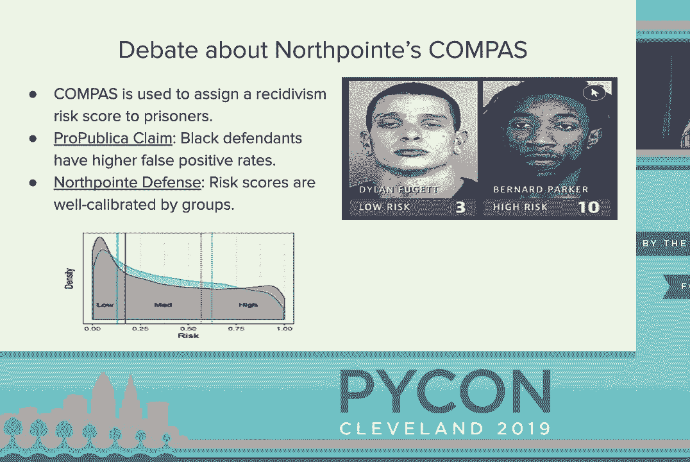

 quantitative low-tech solution which is really let's write better documentation。

 and that must be silly but I think part of the issues we had now with AI ethics is。

 that Silicon Valley is sort of insular Silicon Valley believes it's filled with。

 like tech geniuses who have like believed they have achieved the 13th。

 level of cognition by drinking their salt juice and like going in their cryobaths。

 and they don't need plebeian mortals to tell them how to do their job they will。

 take care of them by themselves they don't need government regulations they。

 don't need outsiders to do their job and that's not true at all like I think。

 better documentation allows for better communication of like how these data。

 sets are spelled how these models work and so even if you're not trained as like a。

 cultural anthropologist or an ethicist if you can better communicate the outcomes。

 of your work better come at you like how this is trained how this is tested to。

 those people they can do the evaluation of like okay well this harm people in。

 the long run Lewis accidentally harm these groups of people you're not。

 thinking about and so this is really cool idea of data seats for data sets and。

 this is one by Timnet Gebru TIM for the sonographer and she basically。

 proposes like well other industries like an automobile industry or clinical。

 testing they sort of have standardizations of how they evaluate their。

 models and we should adopt something similar for data science data sets and so。

 if you think of the two like automobile testing for example like okay historically。

 those automobile tests were tested on like pro dummy crash has dummies were。

 pro typically adult male features and as a result in the real world because when。

 actual car automobile collisions happen women and children were extremely harmed。

 were more likely be severely injured in those and so now we have legal。

 regulations saying like okay we need to make sure you also test on a pro。

 typically adult female dummies and children child dummies and this。

 documentation I think will answer like a lot of collections like how is the data。

 collected like is this data collected in a way that doesn't exclude individuals。

 and I think this is very important because I do think a lot of the ways we think。

 about machine learning is sort of focused on the model and not so much on the。

 training set we don't think about like what makes a good training set a good。

 training set and you may think okay what makes a good training set like no。

 missing data no outliers and that really answers the question of like can I do。

 statistical analysis on this or not it doesn't answer like did I exclude groups。

 of individuals that I should care about did I exclude trans communities I exclude。

 non-heterosexual individuals from my data set but just by the way I collected the。

 data I do think this shifts the conversation from like the model to like。

 how do we actually collect good data that we really not thought about before。

 because we just sort of assume okay the data set it lives in the ether I got。

 from Kaggle or I got from some other website but we don't really think about。

 like is that data set actually suitable for my problem or is it just。

 conveniently available and next something similar for models and so this is done。

 out of Google research by Meg Mitchell's group the Google AI fairness group and。

 so what they propose is sort of like something similar so standardized。

 documentation for machine learning models you document okay how was this。

 model when you produce a model and train it before you deploy let's talk。

 about how is it meant to be used like what are the intended use cases of this。

 how was it evaluated and not just like okay is looking at accuracy calibration。

 or like precision but also how is it evaluated gets different demographic。

 groups how is it evaluated gets the intersection of those demographic groups。

 we just let's bring in intersectional analysis into how we do data science。

 and machine learning and I think also the key thing is like what are those。

 ethical concerns so if you do design a sexuality classifier what's the ethical。

 concerns with that like how could this be used to harm people or be weaponized。

 against people in countries where homosexuality is illegal and the key thing。

 about this is like more transparent model reporting will allow us to better。

 communicate like how people should use our models because right now we sort of。

 just like okay I want to do computer vision let's grab like YOLO net or。

 Alex net and just like apply to all our problems even though like those models。

 are not really designed for your specific problem and finally there's also。

 this tool Deion which is an ethical checklist for data science projects so。

 this is Deion is produced by an organization called Driven Data they do。

 like consulting with like nonprofit government organizations and they also。

 run data science for good competition so think like Kaggle competition but with。

 it with the definite emphasis on helping like some social good aspect of。

 like helping teachers helping education helping drug treatment for example and。

 what this tool does it creates a markdown file in your repo with a checklist。

 that checks for different things like how the data collected was it collected in a。

 fair way did it actually cover all the groups of people in the cover did you。

 exclude a group of people and also where people in form of how their data set was。

 collected like in four percent is important in the social sciences like you。

 can't get research approval unless you have informed consent for your。

 participants but on the other hand in data science we're just able to run A/B。

 tests on our users without telling them what we're doing so and you can run some。

 pretty horrible A/B tests on people that like why the hell did you do this without。

 having to inform them and also think about data storage and I think this is。

 important because we now sort of have this idea of like right to be forgotten so。

 that if someone doesn't want their data set to be a data to be used in an。

 algorithm they should be able to say I don't want my data to be used here。

 delete it from your records and you should be able to do that easily you。

 should be able to comply with that that's part of GDPR and also when you deploy。

 the model how do you think about taking down if it does come out of the okay。

 there's a new story that says like oh you're models harming these groups of。

 people how do you take your model out of production I think it's important to。

 think about those beforehand and I do want to know that like these things like the。

 model cars the data sheets and this checklist they're not foolproof like it's。

 not a foolproof way to prevent you from harming groups of people that you don't。

 want to harm but I do think it's like a sort of good first step it sort of helps。

 us be a little less stupid when we do data science and finally I want to give。

 it like a special shout out to the AI now Institute so this is a NYU research。

 Institute as looks out like sort of like the cultural and societal impact of AI。

 and so they hold this annual symposium on ethics organizing accountability and。

 they also recently produced this paper talking about the diversity crisis in AI。

 so a lot of the things of all the part issues with AI now sort of like we。

 don't really have diversity we don't have different voices or different。

 opinions in the room and this makes a lot of ad hoc solutions to like。

 algorithmic bareness like kind of mood okay if you talk about okay instead of。

 just having an awkward an automated algorithm it just have a human in loop。

 to check decision well if most of your humans in the loops are like straight。

 white men they don't really understand the lived experience of non-straight white。

 with men and they won't be able to check for decisions that your algorithm makes。

 that they don't realize that this is an issue for other people who are different。

 from them and so I think it's important because it also talks about like some。

 of the more technical long-term technical consequences of not having。

 diversity in AI and machine learning and data science and so that's really an。

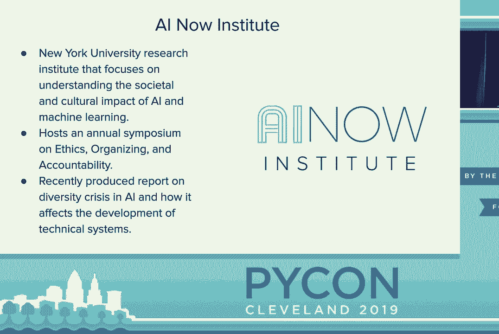

 talk here are all the papers I referenced throughout the talk if you want to。

 check them out afterwards and yeah I hope this talk was engaging I hope you all。

 learn something and if you have the time I hope you check out the other talk on。

 measuring model fairness， you， (applause)， [APPLAUSE]。

