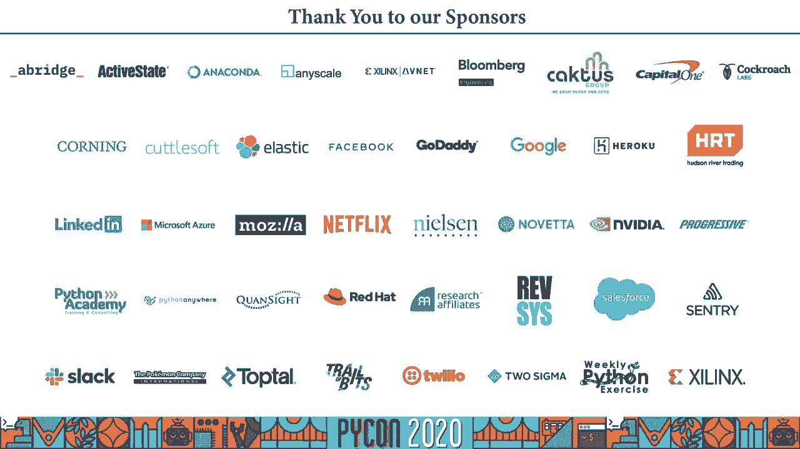

# P25：Talk Carol J. Smith - Implementing Ethics Developing Trustworthy AI - 程序员百科书 - BV1rW4y1v7YG

我是卡罗尔史密斯 欢迎来到我的虚拟蟒蛇会议 关于实施道德发展 值得信赖的人工智能，让我们进入它，所以你的目标是建立一个安全可信的人工智能系统，今天我将讨论一些工具，它们可以帮助你达到这个目标。并在你的工作中取得成功，这是早期有目的的工作，所以这不仅仅是算法的问题，我也会说到，相互作用，你想注入你系统的工作，你想带入这个系统的价值观，以及如何达到那个成功的点，第一步是有一个多样化的团队。

我所说的多样性是指种族方面的多样性，性别文化，当然，但在教育方面也是如此，学校，你的团队参加过的项目，他们的思维过程，他们的残疾，统计数据，以及更多使它们彼此不同的方面。这些多样性方面可以使一个团队变得更强大，这不是为了降低标准，我们正在讨论扩大它，其实，为这种多样性腾出空间，这些不同的个体，当然需要才华横溢，同时也是多学科的，所以，这与上下文有关，因此，在一些团队中。

你可能需要更多的数据科学家和程序员，另一个方面是让好奇心专家，UX设计师，互动专家，他们可能是数字人类学家，这些人会真正专注于了解情况，使用系统的人的能力以及系统将如何被使用。它们会帮助你回答你可能有的问题，人们如何、什么以及为什么要用这个系统做各种各样的事情，伦理学家，更多的角色，但同时保持这些团队的规模，这不是一个容易解决的问题，但重要的是要弄清楚这一点 为你的，呃。

你所打造的产品的质量，有，正如我提到的，在不同的团队中有很高的价值，有很多原因，《哈佛商业评论》（Harvard Business Review）提到的一点是，他们更注重事实，他们更仔细地处理事实。它们变得更有创意 因为它们的桥梁作用，汇集了这么多不同的思维方式，因为他们都是个体，他们可能会更加意识到自己潜在的偏见，当他们处理这些事实的时候 要更加小心，所以这个多元化的团队走到一起。

因为他们都是如此的不同，将以一个非常相似的团队可能不会的方式思考事情，他们也会更容易注意到一个有着相似教育或相似经历的团队，可能不会注意到这么伟大的头脑想的不同，这是一个重要的价值观，我们希望继续前进。因为我们正在开发人工智能系统，所以如果没有这个 你就不会有很好的记忆力，所以你可能会注意到，呃，你可能去过的工作场所，会有个人被雇佣，他和其他人很不一样，但他们不会留下来。

这是因为他们没有看到那里的领导，这将支持他们，谁长得像他们，或者至少谁是不同的，就像他们一样，个体差异需要被承认和接受，所以让我们全身心投入工作，现在大家都在家办公，至少我希望你是，嗯。这实际上有助于展示我们生活中的多样性，人们带着他们的，嗯，宠物和婴儿，以及他们生活中的其他人进入我们的屏幕，这有助于创造一个更受欢迎的社区环境，我们希望人们感到有价值和联系，它们属于。

这一切都将有助于建立一个更好的系统，下一步是采用技术伦理，你可以看到很多不同版本的伦理学，其中一些是由诸如 acm计算机协会之类的组织创建的，有的来自企业组织，微软谷歌，有些来自蒙特利尔宣言等组织。这些帮助你协调不同的文化，所以当你把一个非常多样化的团队聚集在一起时，你需要一些东西让他们都绑在一起，弥合他们思维方式的变化或差异，这有助于你做到这一点，它还可以帮助你加快变化的步伐。

所以行业压力可能会推动你行动越来越快，但是技术伦理可以帮助你联系到真正重要的东西，帮助你知道你的团队正在努力做什么，把你的眼睛盯在目标上。它还明确地允许您的团队中的所有个人考虑和质疑您的系统的影响的广度，所以这真的帮助他们感觉到他们在质疑中扮演了一个角色，正在发生什么，为什么我们要做决定，这是你想要重视的东西。

你想在你的团队中鼓励的是足够舒服，尽早提出担忧，所以你可以，处理这些问题，减轻和防止这些问题，所以当这个团队在共享的技术伦理上结合在一起时，实际上我推荐的是蒙特利尔宣言。这篇文章有一长串广泛的想法、想法和主题，涵盖了这些想法、想法和主题，所以它应该涵盖几乎所有的技术，你在组织中遇到的情况，这很好 因为你可以从这一套开始，当你决定如何使用它时，什么是有效的，什么是无效的。

你可以开始定制，你的技术伦理，工作与你的组织合作得最好，围绕这些技术伦理的团结 只是建立这个团队的一部分，所以你有各种各样的，你有一个多元化的多学科团队，你有一套共享的技术伦理，每个人都可以聚集在一起。利用这一点来帮助指导他们制造这些伟大的人工智能系统，所以要真正完成这项工作，你需要一个框架来把所有的东西联系在一起，这就是我今天要介绍的，值得信赖的人工智能，这有助于你到达。

你要制造值得信赖的道德 人工智能，所以使用这套技术伦理 并将其与这个框架联系在一起，我们会找到可靠的道德人工智能，这涉及到大量的对话，以帮助人们相互理解，以及该系统的目的是什么，制定这些主题的框架。这样你就可以谈论你的价值，谁可能会被制度伤害，我们的人工智能不会跨越什么界限，我们如何转移权力，如何跟踪我们的进展，这些确实是需要尽早思考的重要问题，还有很多，很多，更多，通过一个框架来进行这些对话。

如果你鼓励他们，这些对话就会发生，对你们中的许多人来说，这可能是一项非常新和不舒服的工作，不幸的是，这项工作几乎每个人都不舒服，伦理设计不肤浅，劳拉·哈尔伯格在讲话中谈到了这一点。这项工作可能会很不舒服，但工作很重要，能够保护我们应该帮助的人是很重要的，所以我们必须这么做，你可以用清单来提示这些对话，所以这是一个检查表，我研究过，那里有一个二维码，你可以扫描到下载。

你要做的就是把清单和你的技术伦理，所以你有一套道德规范，你需要弥合你可能在其中找到的陈述之间的差距，比如不会造成伤害 以及你要用你的系统做什么，这将帮助您减少系统中的风险和不必要的偏见，做减灾规划。也是为了支持检查，这样你就知道你在检查什么，为什么你需要做什么，使你的系统尽可能合乎道德，因此，您将在检查表中找到的提示将有助于揭示隐藏的任务，这些是我提议的清单中的一些例子，例如。

我们努力推测出所有的风险和收益，所以如果你没有做过这些不同的项目，这意味着可能有一些隐藏的任务需要您识别并放入您的积压工作中，并实际将责任交给，你的团队中有人来解决这个问题 可能意味着你需要做很多任务。也许你只需要再做一件事，以确保一切都如你所希望的那样，所以这将帮助你确定你是否做了正确的工作，这四个人对人类负责，认识到投机风险和收益，尊重、安全、诚实、可用，我会逐一检查。

我将使用一个场景来帮助你把它联系在一起，这是正确的员工情况，右员工是人工智能排班系统，用户是快餐店的店长，因此，正确的员工的目标是改善人员配置的决策和改善日程安排，也是为了减少轮班调度和轮班选择的偏差。在餐馆里发生的事情是，经理的朋友得到了更好的轮班和更多的轮班，而其他人没有，所以有一个，那里有很多偏见和不公平，因此，这个系统的建立是为了减少这些方面的不公平，对人类如此负责，这是框架的第一个方面。

它说要确保人类有最终的控制权，我们能够监控和控制整个系统和整个生命周期的风险，它的一生，人类有责任对一个人的生命做出最终决定，他们的生活质量，他们的健康和名誉，这实际上是为了确保人类可以拔掉机器的插头。格雷迪·布奇在他的ted演讲中这样说，这是我今天要讲的大部分工作的核心，我们想确保人类永远处于控制之中，在整个系统的生命周期中，人类都在循环中，这绝不是一个你设定了它就忘记了它的情况。

而是人类持续不断地监控和管理这些系统，系统可能作出的重大决定需要加以解释，它们需要能够被覆盖，对人类来说是可逆的，对正确的工作人员来说也是如此，当我们想到这种情况时，经理应该能够根据需要重新安排人员。所以人工智能系统可能会做员工的初始调度，但是经理需要能够进来 并根据需要做出改变，这就是这个框架如何影响特定系统的一个例子，人工智能系统和人类之间的责任需要明确界定，所以有了合适的工作人员。

有人工智能系统，正确的工作人员，他们是经理，所以我们需要决定谁来挑选员工，我们如何定义轮班，谁做这项工作，如何整合新信息，例如，如果一些合适的员工因 COVID而生病，不幸的是，我们如何管理这个系统。我们该怎么处理这种情况，是人工智能系统 还是真正处理这个问题的经理，辞职怎么样，如有必要，我们怎样换班？我们如何处理那个人的缺席，是系统还是经理在做这项工作，另一个例子是，如果正确的员工注意到有问题。

我们会希望他们能够关闭自己吗，如果系统里有问题，如果它真的关闭了，有什么影响，我们如何向员工传达这一点，如有必要，这对他们的日程安排有什么影响，当它重新打开时会发生什么，这对他们的日程安排有什么影响。因此，尽早思考这些影响将有助于我们建立一个稳健和可信的系统，因为需要使用它的人类，第二个方面是认识投机风险和收益，所以这是关于识别所有有害和恶意使用的范围，以及系统的良好和有益的使用，思考盲点。

不必要和意外的后果，会有很多意想不到的事情发生，但我们对该系统的潜在结果的猜测就越多，我们对付他们的准备就越充分，激活团队内部的好奇心，我们可以推测所有类型的滥用和滥用，但我们真的只需要考虑最坏的情况。你可以通过一个叫做黑镜的活动来做到这一点，如果你熟悉电视节目，你可以想象黑镜事件对你的系统会是什么样子，这让你能够识别潜在的严重滥用或误用 以及这些潜在的后果，这是一个模板的图像是由。

在匹兹堡的一个研讨会，已经成功地进行了多次，我强烈推荐你们组织开展这种活动，权利工作人员的潜在可用性，如果我们回顾它的目标，这是为了更快的人员决策和日程安排，减少轮班选择的偏见。所以考虑合适的员工 以及它如何可能被滥用，假设，该系统开始优先考虑日程安排更容易的人，所以在调度系统中冲突较少的人，如果经理们继续批准那些可能会加剧偏见的时间表，这在过去已经是一个问题。

所以不是减少轮班选择的偏倚，系统可能会无意中再次开始强化同样的问题，因此，我们需要对这种情况进行猜测，并尽早识别它，然后考虑我们将如何创建沟通和缓解计划，处理这种情况，所以要做好万全的准备。把这看作是一个潜在的问题，然后我们如何处理 谁可以报告，我们应该把系统关掉给谁？如果我们把它关掉，我们需要通知谁，那么关闭系统或改变系统的后果是什么，或者嗯，取消日程安排，仔细考虑一下。

这将有助于你做好准备，如果出现这种情况，或防止这种情况，理想的尊重和安全，是这个框架的第三个方面，这是关于重视人性，道德操守，公平，公平，无障碍，它需要评估在这些类型的环境中 重要的东西。增强系统的鲁棒性，有效可靠，提供可理解的安全保障，所有这些都是人类信任这些系统所必需的方面，所以为了正义，工作人员，尊重和安全，可能是关于谁有能见度，由于更改时间表的原因。

人们可能会和经理们分享一些非常私人的原因，但他们不想在系统中被其他经理看到，如果这些信息被输入到系统中，它是如何使用的，这些信息会发生什么，雇员的个人身份信息是如何得到保护的？

我们在做什么来让圆周率远离其他人的手，并在系统中得到安全和保护，诚实和可用是框架的第四个方面，这是关于重视透明度，以产生信任为目标，我们需要明确地说明作为人工智能系统的身份，如果这有可能让人困惑。比如在聊天系统里，我们需要确保我们提醒人类，在这种情况下，他们正在与人工智能系统交谈，公平也是其中的重要一环，最初消除数据中不必要的偏差 是一种理想的情况，但这并不总是可能的，因此。

我们至少需要表现出对已知和可取的偏见的认识，所以经常会有一个系统偏向一个特定的方向，因为这是该组织的目标，以确保人们意识到一种特定类型的信息，而不是因为任何原因而意识到另一种类型的信息。但我们需要承认这个问题，并就此进行过度沟通，让人们真正了解这个系统及其对合适员工的限制，该系统的建立是为了在理想的情况下减少现有数据中已知的偏差，但如果偏见是一个潜在的问题。

我们也需要让报告偏见变得容易，或者在理想的情况下预防它，所以如果我们能建立一个系统来减少这种偏见，那就太好了，如果我们不能，我们需要减轻这个问题，我们需要有意识地围绕这四个方面来保护人们的安全。围绕这四个方面，我们可以让道德人工智能系统开花结果，对人类如此负责，认识到投机风险和收益，尊重和安全，诚实有用，我们并不完美，所以我们建造的人工智能也不会是完美的，在我们所做的工作中。

我们需要采用技术伦理才能将彼此团结在一起，让我们团结在一起，我们可以分享的东西，我们需要通过使用清单和其他类型的提示来鼓励深入的对话，我们需要激发好奇心，因此。他们的团队对该系统的使用和滥用方式进行了猜测和想象，另一个想法是奖励发现伦理漏洞的团队成员，这来自艾安娜霍华德博士，她最近与莱克斯弗里德曼在人工智能播客上发表了讲话，这是一个很好的方式来支持你的团队。

引诱他们去做，正确的工作有助于建立一个伟大的、可信任的人工智能系统，所以我鼓励你邀请，为人类价值观传福音，使道德透明和公平的人工智能系统，如果你想继续谈，您可以在软件工程研究所网站了解更多信息。在卡内基梅隆大学，还有二维码供你参考，向我伸出援手，我很乐意考虑和你继续谈话。

