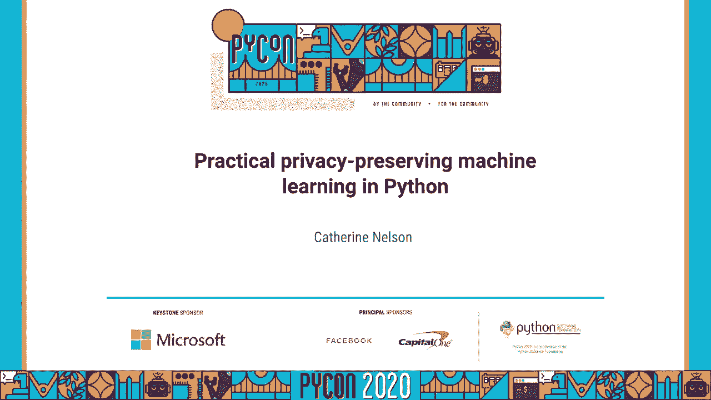
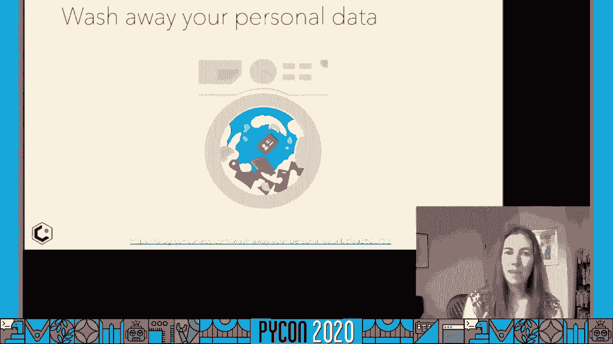
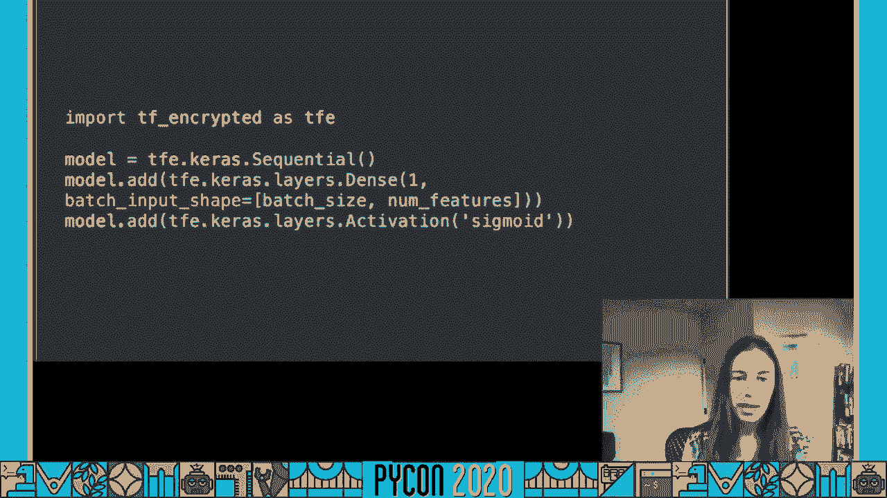
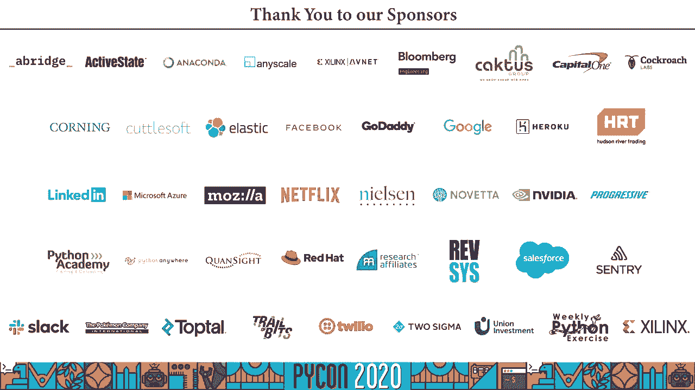

# P26：Talk Catherine Nelson - Practical privacy-preserving machine learning in Python - 程序员百科书 - BV1rW4y1v7YG

 [silence]。

 So， hi and welcome to my PyCon talk， Practical Privacy Preserving Machine Learning in PyCon。 I want to say thanks to all the PyCon organizers for all their。

 hard work and clear communication this year。 And also thanks for the opportunity to still give this talk。 even though we don't get together in Pittsburgh。 [silence]， So。

 I'd like to introduce myself because it's going to be a。 while before you actually get to meet in person。 In my day job。

 I'm a senior data scientist at Concur Labs， part of SAP Concur。 I work in a small team that drives innovation at SAP Concur， which is SAP's business。

 travel and expense tool。 And we evaluate new technologies and recommend them to the rest of the company。 In the past， we've built Concur， travel and expense。

 and all sorts of alternative interfaces from Slack and Outlook。 to Alexa and even expenses from a car。 And now we have a big focus on machine learning。

 and how we can recommend machine learning tools and technologies to the rest of Concur。 I'm also a co-organizer for Seattle PILADES。 I'd like to give a big shout out to Ms。 Meetop。

 for getting me started in Python in the first place。 And I'm also co-authoring an arrayly book called Building Machine Learning Pipelines。

 and I'm a Google developer expert in machine learning。 But today I want to talk about one thing that I'm really interested in。

 that is privacy preserving machine learning。 I first got interested in data privacy in early 2018。 when everyone was thinking and talking a lot about the GDPR， the general data protection regulation。

 as these laws were being introduced。 But privacy issues definitely haven't gone away。 We're still talking about a lot， particularly in the current situation。

 as you can see by all these headlines from the past few weeks。 And machine learning is deeply involved in issues around privacy。

 As you can see from this tweet from back in 2016 from Andrew。 the standard view is that more data is better， especially when it comes to deep neural networks。

 But let's not be so abstract about data， let's be specific。 What data should we be worrying about when we talk about data privacy？ Well。

 we can divide this into two categories。 There's private data。 which is personally identifiable information， such as your name， address， your email。

 And then there's quasi identifying data that partially identifies someone。 if you bring enough of it together。 So things like location， credit card transactions。

 And there's also a lot of private data in user inputs。 If there's free text forms。 you'll end up with all sorts of things like， names， email addresses， phone numbers。

 And then there's sensitive data that has some kind of consequences if it leaks out。 So this could be things like health related personal data or company proprietary data。

 So when we're dealing with private or sensitive data。 the simplest way to keep it private is to just not even collect it in the first place。

 We have a project that helps us with this。 It's called the Data Washing Machine。 It removes personal data from natural language， such as names， addresses。

 all that kind of thing。 We deal with a lot of receipt data and concur。 and that contains a lot of personal data that we don't actually need to deliver the service we provide。

 So we use machine learning models to identify the different parts of PII that we might find。 in the receipt， such as names， addresses， phone numbers and so on。 And then we can remove this data。

 So that works well for us in our situation， but often there are use cases where without collecting the data。 we can't build the model at all。 And also if we don't collect sensitive data such as people's genders or their ages。

 we don't know if our model is fair to all of our users。 So we do need to collect that sensitive data。 And it seems like privacy and machine learning are opposed。

 because data privacy is knowing less about you， but machine learning wants to know more about you。 But actually， privacy and machine learning can have the same goals。 In many cases。

 the idea is that we want to learn about a population not about a single individual。 Both of these technologies want to generalize， not personalize。

 And my motivation with this talk is to show how it's still possible to build accurate machine learning models。 and also give your users privacy。 And there's privacy preserving machine learning technologies to help us with this。

 But most of these appear in research papers。 How do I do this practically in Python？ To do this。 the most important question to ask is， who do you trust with your personal data？

 And to put this into perspective， I'll talk about a very simplified machine learning system。 with all the players who we might trust or not trust。 And in our simple machine learning system。

 the data is collected from the user， put into some central storage system。 And then it's transferred from that storage system to a machine learning model。

 and it's used to train that model。 And then the model makes some predictions。 and these are returned to the user and shown to them。

 And I'll discuss three different ways of providing privacy in our machine learning system。 First one of these is differential privacy。 If you want to ensure that there's no personal data in your model predictions。

 then this is the one to use。 Machine learning models and in particular deep learning models。 can expose rare examples from their training data in their predictions。

 And this gives users a loss of privacy。 And the definition of differential privacy is a formalization of the idea。 that a query should not reveal whether a person is in a data set。

 So the probability that a query or a transformation gives a certain result。 is nearly the same on both these data sets。 One of them has the central person and the other one doesn't。

 The idea is that if your personal data doesn't affect the result of something。 then you're happy to include it in a data set， because there's some kind of deniability。

 Or to put it another way， this gives you the ability to say that for any possible output of the program。 well， that was just as likely without my data as with it。

 And the way differential privacy is achieved is by some kind of randomization。 that masks an individual's data values。 There's many different ways to achieve differential privacy。

 but I'll briefly talk through one of the simplest， which is the concept of randomized response。 So this is commonly used in survey questions。 So if you've got a question that has some kind of sensitive answers。

 such as did you stay out late last night， then you can flip a coin。 And if the coin comes up heads。 then the person taking the survey answers truthfully， if it comes up tails。

 then they flip again and select randomly from yes or no。 And because we know the probabilities in flipping the coin， if we ask a lot of people this question。

 we can back calculate the proportion of people who answered yes or no to this question。 And this gives people some deniability。 They could say， oh， it was just the。

 I just gave the random answer。 And that way they don't lose privacy。 But what's this have to do with machine learning？ This is just an overall statistic。 Well。

 one of the ways that we can have differential privacy in machine learning。 is provided in the TensorFlow Privacy Library， which lets us train differentially private models。

 And it offers us a strong mathematical guarantee that it prevents the user's data being memorized。 but it still gets us the most accurate model that we can。

 And this technology is particularly useful because it fits in really easy to our existing workflows。 So if we start with a classic simple TensorFlow Keras model， we've got three layers here。

 two fully connected dense layers and a sigmoid output layer。 And we want to add privacy。 add differential privacy to the simple Keras model。

 What we have to do is provide a new optimizer and a new loss。 So in TensorFlow Privacy。 there's this gradient descent Gaussian optimizer。 And this takes stochastic gradient descent。

 but adds Gaussian noise to it。 And there's a couple of really important new parameters that go in here that aren't in a normal optimizer。 There's this L2 non-clip and this noise multiplier。

 So what this means is it clips the gradients so that they don't get too large。 and it varies the amount of noise that goes into the model。 So what's going on here？ Well。

 instead of the normal batch of data that we send to the model， we split them into many batches。 smaller batches of data。 And for each one of these， we clip the gradients。

 we cut off the largest values， because we don't want the model to be affected by outliers。 because that would break the differential privacy promise of the transformation not being affected。

 too much by one individual。 We then average the gradients after their clips and add noise so that。 again， the gradients from the individual person are masked。 And then we pass these to the model。

 And then once we've done that， we can pass our new optimizer。 and our new loss to the model and then compile it and fit it as normal。

 This is just a standard Keras training setup， but we passed in that new optimizer and loss。 The next question we have to ask in differential privacy is how do we measure the amount of privacy。

 that we've produced here？ So we have this concept called epsilon。 epsilon is one of the parameters in differential privacy that measures how excluding or including。

 an individual point is going to change the probability of any particular transformation occurring。 So e to the power of epsilon is the maximum difference between the outcome of two transformations。

 or two model predictions in this case。 And if epsilon is small， we've added more noise。 we've clicked the gradients more， then the transformation is more private。

 And there's a smaller probability of the model changing if one person's data is included or excluded。 And we can calculate this using some of the built-in methods in TensorFlow privacy。 In particular。

 we use this compute_db_sdd_privacy。 Sdd is stochastic gradient descent。 the optimizer that we used in the model。 And we pass in the batch size that we used and the noise multiplier。

 we tell it the number， of epochs that we trained for。 and we give it a value of delta which is one over the approximate， size of the data set。

 And from this we can get a calculation of epsilon and know how private our model is。 Differential privacy is particularly useful when you don't want to expose predictions from the model。

 But to do this， you still need to collect the data in the first place。 You still need users to give you access to their raw data。

 And it's particularly useful because it provides mathematical definitions and guarantees of privacy。 The second piece of privacy preserving technology I'd like to talk about today is encrypted machine learning。

 There's two ways we can use this in our machine learning system。 And the first one is when we encrypt the data before it gets moved to the central storage system。

 and before the model is trained。 And then the predictions are decrypted and then passed back to the user。 And we can do this in Python with TF encrypted which handles all the encryption part for us。

 It keeps the basic Keras interface。 And it allows us to share previously unused data。 so data that is normally too sensitive for us to touch。

 Because it can be encrypted before it even leaves its original location。 To do this。 we just define a function that provides batches of training data。 And then add the data at tfe。

localcomputation。 Tfe in this case is TF encrypted。 And this handles the encryption process for us。 We can then pass that data to our Keras model。 Import Tfe encrypted as tfe。 And continue as normal。

 We build our model， define it using the Keras sequential API， add our encrypted layers to it。 And then we can go ahead and train and make predictions on that encrypted data。

 The second way of using encryption in our machine learning system is to encrypt a model that's already been trained。 so that it serves encrypted predictions。 And in this case。

 we collect the raw data from the user and transfer that to a central storage。 train the model on raw data， encrypt the model， and then the predictions are encrypted。

 And we can also do this in TF encrypted。 We can use the tfe。keras。models。clone model argument and this will give us encrypted predictions。

 There's a few more steps to it in this。 So what's going on here is that first of all。 we load and preprocess the data locally on the client。 Then the data is encrypted on the client。

 The encrypted data is sent to the service。 And they will make a prediction on the encrypted data。 send the encrypted prediction back to the client， and decrypt the prediction on the client and show the result to the user。

 But this gives you a very nice way of taking a model that you've already trained and turning it into something that's more private。 So when should we use encrypted machine learning？ There's two options encrypting the training data or just the model。

 We can encrypt the data if the model owner is not trusted。 And we can encrypt the model if the training data is public but inference is private。

 This gives us the possibility of training models on data that's too sensitive to share。 So there's lots of medical applications here。 The third technology I want to talk about today is federated learning。

 And this is suitable for when data is spread across lots of different devices like mobile phones。 So this technology is used by Google in their Gboard keyboard to preserve privacy。

 In federated learning， the raw data never leaves a user's device。 And instead。 the model weights are sent to each device。 The weights are updated。

 And then they return to some secure aggregation service。 And then they're combined together into the model。

 And the model can make predictions that are returned to the user。 And this gives users privacy because the model owner can never see their raw data。 In Python。

 federated learning is provided by the Pysys project。 And this is for PyTorch and TensorFlow。 And by TensorFlow federated。 I'm not going to give a code example here because it gets really complex with all the different bits of infrastructure that you need。

 But I'll walk through all the steps that make a very simple federated learning set up。 So the first thing is to create the virtual workers that can live on each device。

 Then we make a set of pointers that point to the training data that's already living on each worker。 This might be what you typed into your keyboard or something like that。

 Then we send the model weights from the model owner to each worker。 The model is trained on each worker device。 And then the workers send the weights back to the model owner after they've been updated。

 And they also send the loss back to the model owner。 And then the model owner combines the model into the new model。

 which has been improved by the addition of the new data。 What's missing from this very simple walkthrough is that we haven't actually provided any increase in privacy yet。

 We can often infer the original data from the model weights。 So we need to add some secure way of averaging the model weights before they can reach the model owner。

 And this is what you do in a full-blown system。 And also scale。 you need something that's going to increase in size with many， many devices。

 Federated learning is particularly useful when we want to build personalized models。 like in the keyboard example I mentioned already。 It's good when the data is already decentralized。

 so it's being collected on users' devices or on a browser， and obviously sensitive or personal data。 And we also need the labels to have already been added because we can't look at the data after it's been collected。

 So privacy preserving machine learning really comes down to who do you trust。 who gets to see the raw data。 And if you trust the model owner。

 then they can use the raw data but offer private predictions。 and we can do this with differential privacy or encryption。

 And then if you don't trust the model owner with your data。 you can encrypt the data or keep it on each user's device。 And just a few caveats here。

 Right now there's always a cost to adding privacy to make your machine learning model。 whether that's lower accuracy， longer training times， or a more complex infrastructure。

 Don't assume that just because you're using one of these technologies。 you're still providing complete privacy for your users。

 And this isn't going to save you from all ethical issues。 If the product that you're building isn't ethically sound in the first place。

 this isn't going to help。 If you'd like to learn more about the technologies I mentioned today。 you can read about them in the book that I'm currently co-authoring with Hannah's Hacker。

 Building Machine Learning Pipeline， which is out through O'Reilly。 I'd also encourage you to support the open source project I've mentioned， TF encrypted。

 PIPF and TensorFlow privacy。 And if you've got questions， you can find me on Twitter。 Thank you very much for listening。 [BLANK_AUDIO]。

