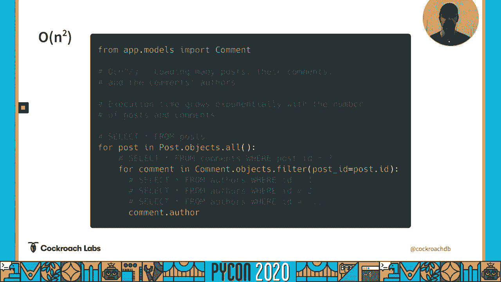
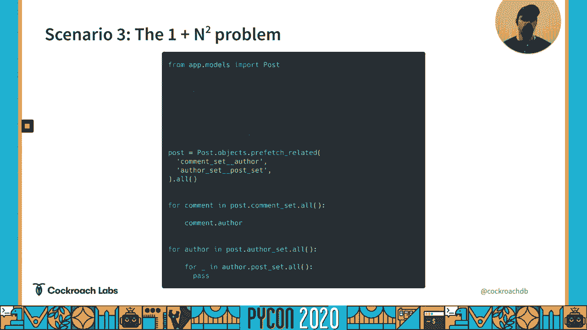

# P27：Talk Chris Seto - Big O No Django ORM runtime complexity and how to avoid it usi - 程序员百科书 - BV1rW4y1v7YG

喂，各位，我是克里斯西多，我是蟑螂实验室的软件可靠性工程师，我在他们的数据库上工作，作为一个服务平台，今天我们将讨论 jingo或运行时复杂性。

所以这次演讲的灵感是几年前的事了，在这一点上，实际上我以前工作过的一家公司 在剩下的端点上有一些性能问题，在挖掘的时候，我们意识到对这个端点的每个请求，结果产生了几百个续集查询。因为我们做了一些不幸的选择，我们发现传统的缓解策略不够有效，所以很自然地我们就会进入原始续集。

从技术上讲，我们有一个解决方案，我们能够减少由，一些指向一个，我们还可以从这个中抽出几秒钟，并指向运行时，正因为如此，然而，我们最终得到了一个查询，很像幻灯片上的那个，我们很快发现像这样的查询。很容易发现错别字，因为SQL将为您验证这些错别字，然而，如果你不小心过滤了错误的字段 或者加入了错误的列，在你投入生产之前，事情看起来很好，您意识到您不小心错过了一个权限检查或类似的东西，嗯。所以我们认为这在很大程度上是不可接受的，最重要的是，我们必须在代码库中创建一个小角落，这与它的其余部分不相容，因为我们必须处理原始 sql查询的结果，所以出于所有这些原因，或者我们想出任何解决方案。易于维护，便于人眼通行，不是机器人，最重要的是，我们想要我们所有的解决方案。

与达詹戈现有的生态系统兼容，回到这次谈话的同名者，我们要快速概述一下什么是大 o符号。

大奥，是描述函数的某个特征和某个数之间关系的一种方法，当 n接近无穷时，现在，一般来说，我们要跟踪的特征是一个函数的运行时，n是一个被操作的数据集，然而，这个特性也可以是随着数据集的增长。函数的内存使用情况，甚至是一个函数最终提出的网络请求的数量，查看我们的图，我们会看到0的1或0的任何常值，因为这表明这和我们追踪的价值没有关系，我们追踪的这个特征，不管有多大和增长。我们的特征会保持不变，n{\displaystyle n}的O{\displaystyle O}表示这个值与值之间存在线性关系，并且是特征值，所以如果我们迭代 n个值的列表。这个函数的运行时间会线性增加，这个列表的长度是 o的平方，另一只手表示看起来更有爆发力，呃，这在价值上与我们的特点之间的关系，您将经常在具有双嵌套循环的函数中看到这一点，只要我们知道 n值的上界是什么。

这是，有这样的特征是很正常的，我们会说这是这个特性的最大值，我们对此没意见，然而，如果 n的上界是未知的，这就是这种类型的角色可能很可怕的地方，因为你真的不确定你最终会长多高，最后我们有了。表示当 n开始接近无穷大时，我们的特征是接近上界 这张图并不完美，我自己画的，但这就是我们要做的，在接受输入的函数中 你会经常看到这一点，一次又一次地一分为二，直到他们发现一个给定的结果，具体地说。二进制搜索具有这种类型的运行时复杂度，用于本文的目的，我们要追踪的特征是，执行的后续查询的数量，我们的价值相当于一个数据库的大小，或者其中的行数和关系数，重要的是，我们不跟踪这些查询的执行时间。仅仅是查询的数量本身。

为什么我们关心跟踪我们所做的续集查询的数量，而不是这些查询的总执行时间，这是因为当我们进行非常非常快的查询时，即主键查找，我们会发现构建 SQL所需的开销，把它送去数据库 把结果拿回来，经常盖过阴影。数据库执行该查询所需的时间，我们会在这里的例子中看到，如果我们只是按顺序加载用户列表，呃，这根本不需要太多时间，然而，如果我们通过查询来加载相同数量的用户，大约慢了一百倍。我们将看到编译这个 SQL所需的时间，进入数据库 然后返回 占用了大部分时间，所以我们可以做任何事情来减少我们进行的快速查询的数量，会在我们的执行过程中节省大量的时间，假设我们正在建立一个博客平台。每当用户想要得到一个特定的帖子，他们会给我们职位，身份证，我们会查一下 然后送回去给他们，不管我们系统中存储了多少主机，此操作将始终只执行一个查询，这是一个操作 o的例子。

系统中的每个帖子都会有一些评论，每篇评论都会由一位作者，当我们向用户显示这些评论列表时，我们还想展示制作它们的作者，当我们回顾我们的评论列表时，我们将触及作者属性，这将导致我们从数据库中加载作者。这是一个n{\displaystyle n}操作的例子，通俗地说，这就是所谓的 n加一问题，我们稍后会潜入其中，n的平方运算常常是偶然发生的，在前面的一个例子中，我们正在迭代一个评论列表，现在显示作者。如果我们决定后退一步，并首先迭代一个帖子列表，所有这些帖子，为这些帖子加载评论，把它们和作者一起展示，随着职位数量的增加，这将是一个不平方的操作，这些帖子的评论数量也在增加，查询次数。

我们最终以指数增长，最后，我们现在有了自己的登录操作，我不认为有任何实际应用会导致日志，产生的查询数量，所以我们不再继续讨论这个问题了。

让我们讨论 n加1问题。

回到我们的例子，早些时候的调查，当我们在这里重复我们的评论时，我们会看到这一点，每次我们接触一个作家，必须马上装车，这是经典的 n加一个例子，通过在我们的authors表中执行一个join。可以很容易地解决这个问题，对我们来说很方便，Django的 select相关函数将为我们执行此操作，并自动填充我们的 author属性，所以我们最后不会有任何额外的查询。我们只得到一个关于整个函数的查询，有很多相关散文的情况有点复杂，如果我们要拍续集，加入这里，我们要么会收到很多重复的帖子，或者每篇帖子只有一条评论，取决于我们做了什么类型的连接，为了解决这个问题。我们真的要，查看 django的预取相关功能，现在为我们在查询中提取的所有帖子 预取相关的 will，然后在记忆中执行，加入并为我们填充缓存，所以每当我们触摸注释集属性时，我们实际上不会再做另一个查询。

我们只要碰一下这个缓存，结果我们，在现实世界中只需要做两个查询 而不是 n个查询，你经常会发现自己跨越了许多关系，为了把一些数据拼凑在一起，我们可以发回给我们的最终用户，现在。我们还可以联系到预取相关的，为了阻止我们的代码进行大量的查询，然而，对于每一个额外的关系，我们最终跨越，与预取相关的将不得不进行一个额外的查询来加载该关系，如果你碰巧跨越了大量的关系，也就是说。在许多领域中，通过表实际上很重要，你可能会发现自己在寻找替代解决方案。

方便，我们将讨论一个替代解决方案，它给我们提供了相同的功能，作为预取相关。

但只要一个查询，让我们来谈谈我最喜欢的、在道德上灵活的续集功能，聚合和横向连接 在我们讨论后续聚合之前。

我们实际上要看看 json构建数组函数，现在，这个函数允许我们做的是取一组列并把它卷起来，并返回它，就像它现在是一个单独的列，这个函数不是特别有用，但它形成了一个非常重要的原始元素 对于我们将要建立的。SQL聚合是跨给定行集合运行的函数，如果你曾经使用过计数查询，您通常使用了续集聚合，这些类型的函数，用于计算关于表的某种类型的统计信息，即平均金额，最低，或给定列的最大值，呃。支持 json数据类型的数据库 有这样一个简洁的小聚合，称为 json ag，它允许我们做的不是计算一个列的统计数据，它实际上允许我们建立一个 json表示，或者只是 json对象在给定行的集合上。当我们把它和我们的 json构建数组函数结合起来的时候，我们得到的是一组行的能力，把它捆在一根柱子的地方，现在，如果我们有办法说，为给定查询的每一行运行聚合，这将允许我们将整个关系嵌入到单个行中。

侧关节给了我们一个有效执行的方法，对于后续查询中的每个循环，现在，不幸的是，在这个手臂上很难说服产生任何东西，除了左边或里面的连接，所以为了这次谈话的目的，我们实际上要利用。所谓的关联子查询和关联子查询，呃，在与横向连接相同的执行传递路径上运行，我们每个循环都有完全相同的风格，但是它位于查询的选择部分，而不是在关节部分，这让我们更容易控制生成的风格。

当我们把这些碎片组合在一起，除了得到一个非常丑陋的查询，我们还能够为查询中的每一行，查找与其相关的行，把它们捆成一列，现在还给静儿的角，在这个例子中，我们已经接受了系统中的所有帖子。我们找到了这些帖子的所有评论，并将它们压扁成一个值列表，这将是非常有帮助的，如果我们有办法把这些值，把它们变成成熟的罐子模型，把它们塞进预取缓存里，在这种情况下。我们将得到与预取相关的功能完全相同的功能。

只是我们不必每次都进行额外的查询，不幸的是，关系被跨越了，加载 djingo预取缓存 并将这些 json blob变成模型，已经超出了范围，的，这次谈话，我们想留下来。主要集中在如何减少我们所做的续集查询的总数上，然 而，如果你对如何做到这一点感兴趣，这个库提供了与预取相关的替换方法。

你可能会问自己，我应该用这个技巧吗？不幸的是 这取决于，它能在某些情况下有所帮助吗，当然，我已经看到在某些休息端点上缩短了几秒，另一方面，是灵丹妙药吗，否，在很多情况下，它可能会表现得更糟。同样重要的是你要记住，你使用的是什么数据库 我们生成的查询，以下是分析风格查询，并非所有的 sql数据库都经过优化 以服务于分析样式查询。

我们还会看到，我们将要调查的基准，在我们进入这些快速免责声明之前，这些都是非常简单的基准，有大量的变量可能会影响这些查询的性能，不管怎样，举几个例子，与数据库的连接，数据库里有可用的资源。您所测试的模式，甚至模式中的数据量，所以考虑到这一点，重要的是要对这些半信半疑，并确保你对自己的环境进行测试，决定什么对你的情况最好，所以对于大多数这些基准来说，我们就会看到我们能有效地并驾齐驱。与预取相关的，或者通常在几毫秒内，以这样或那样的方式，它的性能，在我们开始加载多个顶层行之前，我们看到预取相关的，开始超越这一策略，当我们对 kroachdb运行这些基准时，我们会看到同样的结果。大多数时候，我们将在几毫秒内，预取相关的正负，但是当我们查看运行测试时，加载多个顶层行，我们会看到我们完全被吹出水面，通过预取相关，和，这是，因为蟑螂没有优化运行，分析性询问，它是为运行事务而优化的。

不幸的是，我们没有一个很好的方式来提问和回答问题或处理评论，但请随时来找我，在推特上，在下划线 鸵鸟，或者在 credo的 github上，如果你想知道我是怎么得到这些基准的。或任何与这次谈话有关的东西，我要把很多信息都塞进一个垃圾电脑里。

回购，哦不。

