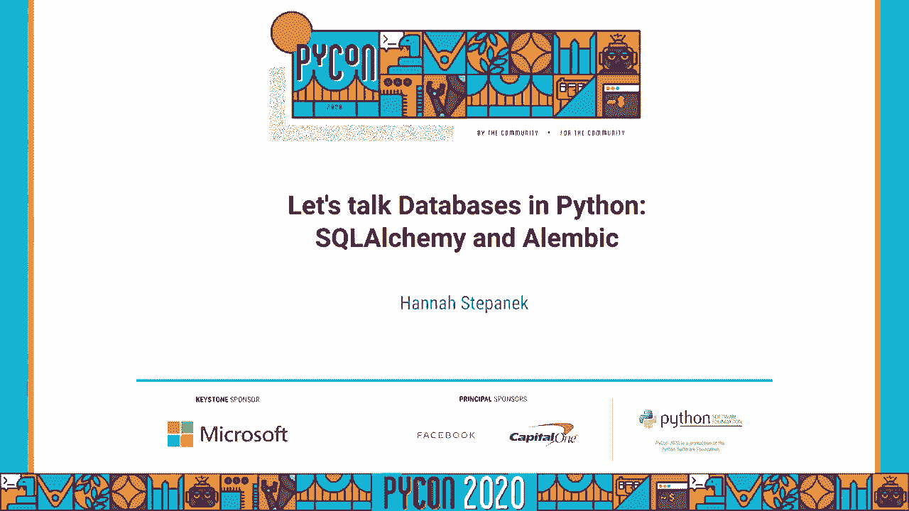
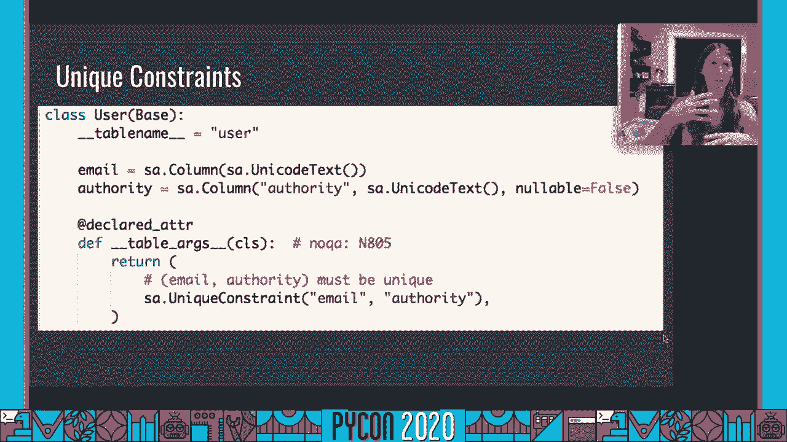
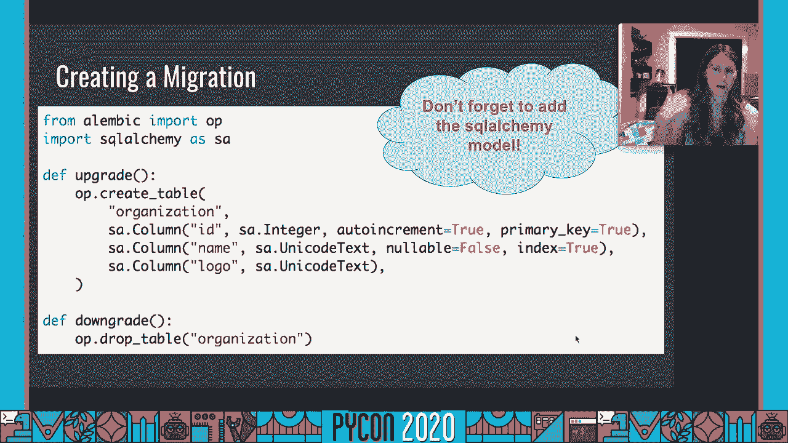

# P40：Talk Hannah Stepanek - Let's talk Databases in Python SQLAlchemy and Alembic - 程序员百科书 - BV1rW4y1v7YG

我的演讲让我们谈谈蟒蛇数据库，但在我们开始之前 先谈谈我，我为什么要做这个演讲，我在英特尔开始了我的职业生涯，在一个用于数据分析的烧瓶应用程序上，在那里我和我的朋友谈过了，接下来我研究假设，建造金字塔。

对网页注释的反应应用程序，我和波斯特格雷谈过了，目前我在新遗迹公司做安全团队的应用程序开发员，在那里我们还有一个瓶子应用程序可以和 postgressql对话，还有一点额外的花絮。

还有一些让我非常兴奋的东西，我很快就要出版这本书了，是基于那次谈话，如果你喜欢去年的谈话，呃一定要看看那个，它是由一家出版社出版的，应该会在六月的某个时候出版，所以直接跳入奥姆。

所以 orm代表对象关系映射器，所以我们的想法是我们的物体在右边，这些映射到我们关系数据库中的表，在左边，因此奥姆负责建立两者之间的映射，所以在 python中我们可以得到的信息，我们有续集炼金术。

Django orm，pee pony m 续集对象 tortoise or m，他们有很多人，但今天我要跟你说的是如何使用续集，炼金术，蟒蛇社区认为这是一个非常好的地方。

它具有良好的广义抽象和查询语言，嗯，那是一个数据库 不可知 论者，但它也允许您在需要时执行特定于数据库的操作，让我们看一个例子，所以我们有一堆我将提到的东西，在接下来的展示中 作为模特，哪些是炼金术课。

表示数据库中的表，让我们来看看用户模型是什么样子的，这是我们的用户模型类，它继承了这个基类，我将在下一张幻灯片中谈到，它有它，所以这里我们提供了表名用户，然后我们有几个专栏，所以我们有了一个身份。

我们收到一封邮件，用户名和密码，最后一次登录日期，所以在这里你可以看到我们可以做一些事情，设置主键，自动递增主键，这意味着续集炼金术将为我们解决这个问题，它将从零开始标识。

然后随着时间的推移 自动地增加它，我们还有一个唯一的电子邮件地址，它被索引了，它不是无效的，所以你不需要给它下一个定义，然后我们当然有一个用户名和一个，密码，这些都是相当标准的，嗯。

我们还有这个最后的登录日期和一些有趣的东西，如果你往下看，在定义中，你看服务器默认值等于现在的恐惧，它所做的是，它会一直到数据库，如果没有设置这个时间戳，它会设置数据库上的时间戳。

当我们把用户写入数据库的时候，所以这真的很好，这也是一种最佳实践，在时间戳的设置上保持一致，一般来说，您希望在数据库方面做到这一点，让我们来看一下公共基类，用户模型所继承的，这也是相当标准的东西。

它直接从续集炼金术文档中提取，这里我们只是为这里的列提供一些标准的命名约定，所以我们的索引栏是唯一的，etc，然后我们导入这个声明基类，或者抱歉的声明性基础函数，这将使我们的基类，所以我们把元数据。

然后 SQL炼金术生成空间类，我们建造的所有模型都会用到，您还可以在这些模型中进行验证，所以在这里，例如，我们正在验证用户名在一定长度内，视情况而定，你得小心点。

记住数据库级别或 SQL炼金术模型级别的验证，有点像在进入数据库之前的锁沟验证，所以嗯，这可能是也可能不是最好的例子，这就是为什么我选择了它，因为这是，有点像是在说，比如灰色地带和你做的设计决定。

它可能需要为您的应用程序和您的模型，所以这里可能不是进行验证的最佳地点 这是我的观点，比如检查某些字符的用户名，这可能是你想在它到达数据库之前抓住的东西，可能在前端，就像它是用户想要的东西。

他们的用户名，他们会立即得到反馈，它会说嘿，像这些字符是不允许在您的用户名，您不一定想一路写入数据，或者在这个错误出现之前 几乎要写入数据库，但不管怎样，它可以为你做验证，这真的很好。

就像一个安全的花园，就像最后一搏，就像嘿，哦不，别写那种东西，所以无论如何，嗯，我们还可以定义表之间的关系，例如，这里我们有一个用户模型和组模型之间的关系，所以在这里这个团体有一个创作者身份。

它指向和中的一行，用户表中一行的 id，所以我们如何在 SQL炼金术中定义它，我们有一个创建者身份栏，它被设置为用户 ID的外键，然后我们也有这种创造者与用户的关系，这将允许我们做一些事情。

比如从数据库中查询一个组，然后说一组运动员点，得到任何一栏，用户对象的名称或字段，所以我们不仅有用户身份，我们实际上可以完全访问用户对象，如果我们想，我们也可以做唯一的约束，例如。

我们可能不只是想要一个独特的电子邮件或一个独特的权威，但就像一个独特的电子邮件权威组合，在这种情况下，权威才是真正的领域，所以我们说对于每一个像权威或领域，用户电子邮件必须是唯一的，对不起。

用户的电子邮件和域的组合必须是唯一的。

我们还可以定义一个多列索引，这意味着我们想从数据库中拉出一个用户，唯一的用户，所以我们的查询可能是这样的，我们说用户名等于用户 权威等于权威，我们也可以仅仅根据用户名本身进行查询，这个底部查询。

这只是基于权威的查询，因为权限还不够窄，不能只给我们一个唯一的用户。

这一点非常重要，在这一点上的顺序是非常重要的，注意你的用户名和权限，之后，因为我们的意思是 我们可以唯一地查询用户名，唯一查询用户名和权限组合，但我们并不是唯一质疑，所以我们正在创建一个独特的索引。

我们也可以做部分索引，所以在这个应用程序中 我们做了一个叫做影子禁止的东西，我们有一个用户，在这个例子中，用户只是说他们在使用注释来销售他们的产品广告，这是不允许的，所以我们如何影子禁止他们。

就像那是什么，基本上这就是他们所看到的，在他们看来一切都很好，但这是世界其他地方看到的，他们什么也看不见，他们的注释是影子禁令，所以我们可以，所以我们如何呈现注释并过滤掉它们，过滤掉所有的阴影和注释。

我们要查询所有的注释，然后我们在事实发生后 过滤它们，所以我们做一个单独的查询，得到所有的影子和用户，然后在我们把它们发送到前端之前 删除或删除它们的所有注释，所以在那种情况下 为了抓住。

所有影子禁止用户，查询效率高，我们有这个 nifsa场，如果是真的，就意味着它是一个影子和用户，我们只是部分索引，如果尼普萨是真的，我们索引了所有真正的用户，所以他们很快就能找到，嗯。

我们还可以定义一个函数表达式索引，所以这是我们有一个注释线程，所以你可以做注释 并对注释做出回复，它就回答了那注解的回答，对 所以我们在数据库中如何定义它 是我们有这个引用列表，这是一个。

父注释等等 这个根注释，例如，引用是空的，嗯，关于这个根注释的回复，引用列表指向根右边，关于对答复的答复，指向根注释的参考点，然后对根注释的回复，为了找到注释 基本上我们要做的就是。

我们获取要在页面上显示的所有根注释，然后我们运行一个单独的查询，抓取所有根注释的回复，所以我们想，所以我们可以这样做，其中引用的零等于根注释，我们希望快速查找，好了，我们要索引查找。

注意到我们做的是0的引用，对，所以我们需要索引根注释或者类似于零注释的索引，所以我们要做的就是，我们使用函数表达式索引，并在本例中索引其中一个的引用，这是一个，因为我们在波斯格雷和波斯格雷。

使用一个基于数组的索引，所以它是1而不是零，好吧，因此，我们讨论了一些索引和改进查询的方法，让他们更有效率，使用 SQL炼金术，让我们深入到实际 连接到数据库和抓取一些数据。

所以我们如何做到这一点很简单，从 sql alchemy导入 create engine函数，然后你创建一个引擎 你基本上只需要把网址传递给数据库，它为你创造了一个引擎，然后你把引擎绑定到一个会话上。

所以在这里我们有这个会议制造者，这又是为了让我们使用一个会话类，这就是为什么它在那里大写的原因，所以我们如何使用这个类，我们将它的一个实例，然后假设我们制造了一个用户对象，我们添加用户对象。

我们提交用户对象 a，它被写入数据库，然后别忘了结束你的联系，这很重要，所以为了让大家喜欢，为连接的开启和关闭提供便利，记住所有这些步骤，我们还可以创建一个上下文管理器来为我们做这件事，所以这就是。

看起来我们实例化了会话，然后我们放弃会议，这就是我们，这是与声明的第一部分，所以现在我们已经输入了带声明，所以我们把会话交给了带语句的内部，它会添加用户，提交用户，它将返回到会话管理器中。

如果提出了例外，不管出于什么原因，我们要把自己弄干净，所以我们要回放会议并消除空气，否则嗯，我们要结束会议了，因为一切都很顺利，所以是的，在这种情况下，就像我在做文件一样，我使用上下文管理器。

我们不用担心开关门，帮我们处理一下，这很好，这就引出了我的下一个观点，什么时候应该如何限定会话范围，对，这东西的范围是什么，所以在网络应用中，届会应当遵循请求的生命周期。

这意味着什么 当请求进入您的应用程序时，那是你开始一个会议的时候，当你的反应，是从，网络应用就是当你关闭会话的时候，这就是你的会议的范围，您可能认为会话每次都在建立数据库连接，事实并非如此。

我们稍后会讨论为什么，但这就是建立数据库连接的样子，很慢，嗯，它首先发送一个原罪并进入数据库，从数据库里传回一段录像，再向数据库发送确认信息，所以这就像在网络上来回三次，很慢，非常耗时。

我们真的不想打开和关闭数据库连接，每次我们都想请求，所以我们很幸运，续集炼金术足够聪明，它神奇地为我们解决了这个问题，所以它使用了一种叫做连接池的东西，连接池是什么，它是一个连接池，令人震惊的是。

他们曾经是，他们已经建立了，他们不关闭，他们只是回到游泳池，所以当我们创建一个会话，我们实际上不是在创建一个数据库连接，我们只是从游泳池里抓一个，已经确定了，我们用它，然后我们，把它放回游泳池给别人用。

当我们造引擎的时候，我们可以，我们有一些游泳池设置的选项，所以在这里你可以看到你有游泳池的大小，最大溢出超时，使用或不使用电梯，这些是我认为就像我写在这里的默认选项，但你可以控制他们，所以这说明。

我们想要一个由五个连接点组成的连接池，最大溢流为两个连接点，所以这意味着，如果五个连接都在使用，然后，当请求会话时，它将创建另外两个连接，但这不会让那些人活着，它将在不再需要它们后关闭它们。

然后我们在这些连接上也有30秒的超时时间，所以如果我们在30秒内没有收到任何数据，或者像，如果有段时间没人用了，然后它就会自己关闭，我们还可以选择使用 lifo，意思是"后进先出"。

也就是说默认是错误的，但我们可以说这是真的，如果我们这么做的话，这是最近使用的连接，并放回游泳池，是一样的，它马上就从游泳池里出来了，下一次有人要求，请求召开会议，所以要做的是。

它基本上会让旧的联系消失，所以这就像是一种扩大你的流量上下的方法，摆脱你不再需要的关系，所以就连接池而言，这看起来像什么，是没有使用的 连接慢慢死亡，这也是一个普遍的问题，如果一段时间不使用。

它们就会开始死亡，这对我们来说是非常不幸的，因为如果你不这么做，如果你不是经常收到交通，你的关系就会消失，然后你的，下一次请求进入并查询数据库时，你就得重新建立这种联系，你不想那样做。

就像你想让你的关系活着，您希望应用程序始终具有响应性，所以为了做到这一点，我们实际上可以指定一些 tcp，在我们的连接中保持活动设置，所以我们的连接会追踪数据库，在这种情况下，每60秒保持自己的生命。

所以现在哒哒，我们的关系永远快乐永远快乐，所以我们也可以在我们的续集炼金术中，所以就像在我们进入上下文之前一样，会议管理人，我们为用户查询，所以在这种情况下，我们只是把用户从数据库中提取出来。

在查询中指定一个限定符，一个或一个都没有，那就是说，我们希望得到一个用户回来或没有用户，这里有很多我们可以使用的限定函数，所有的计数都是先存在的，过滤器连接限制等等等等，我的文档里还有很多。

到那里的链接，你也可以，如果您希望打印出用于查询数据库的 select语句，通过这个家伙，所以用户语句编译，把你的引擎传下去，它会吐出什么，准确的 select语句被发送到数据库，这对调试很有用。

另一件我在这张幻灯片上没有的东西，也用于调试，是，你可能会发现自己处于一种情况下，你有某种监控到位，你的监控告诉你，请求中的某个查询很慢，它不一定能告诉你，在你的代码中查询来自。

但是它给了你它使用的 select语句，所以你在开发中可能会做一些事情来弄清楚，这句话的来源是 如果你把续集，炼金术，你能选择，然后它将打印出所有使用并运行的选择语句，所以从那里你就可以，缩小范围。

找出特定的慢速选择语句来自哪里，并修复它，嗯，所以在这里，嗯通常情况下你确实希望以这种方式工作，最好从空数据库开始，你看得很清楚，我们需要生成你的表，尽管你不必，只是为了确保你们的模特。

你的数据库里有什么，但无论如何，所以如果我们想这么做，我们进口我们的模型，然后我们使用基类并说基元数据来创建所有，这将创造我们所有的模型 作为我们内部的桌子，我们的数据库。

所以我们讨论了很多关于如何使用续集炼金术，现在让我们讨论如何迁移数据，那么什么是数据迁移，当我们制作或删除一个新表，添加删除表中的列，修改表中的现有数据，为什么我们要使用迁移工具。

而不是直接在我们的数据库上运行一个 sql语句，这有几个原因，允许我们防止人为错误，所以一旦我们写好剧本，我们把它写在剧本里，我们知道这是正确的，我们可以在本地测试 以确保它有效，在我们运行它之前。

我们可以让我们的开发人员同事审查它，嗯，当我们把它投入生产时，我们有一些，保证它能像预期的那样工作，或者至少我们已经尽可能多地测试了它，我们更有信心它会起作用，嗯，如果不管用，嗯，把它移回来。

它给了我们一个恢复这种变化的途径，所以当您编写迁移脚本时，这个想法是，它是向后和向前兼容的，这意味着我们可以迁移到一个新的修订，我们还可以迁移回以前的版本，所以从这个意义上说，它被认为是更安全的。

因为如果不成功，我们可以把它倒回去，所以呃，我们可以使用哪些数据库迁移库，我们有冷冻剂，Django移徙，数据库迁移，迁移续集，炼金术，迁移续集，迁徙跑者，我肯定还有更多，呃。

但今天我要和你谈谈奥林匹克，很受欢迎，很多人，大多数 python开发人员，我知道，除非他们用 chango，使用极限，那么如何配置它，很简单，您可以选择是否提供迁移脚本所在的脚本位置，你也呃。

指定你的嗯，这里有一个数据库连接 url，基本上就是这样，你完了，我们来看一个例子，所以一般的数据库迁移，就像开发一个特性，他们可能需要多次才能到达那里。

或者在本例中进行多次迁移 以实现或达到最终的更改或所需的状态，例如这里，我们在数据库中添加了一个新的组织表和组织的概念，这将需要几个步骤，首先，我们需要将组织表添加到数据库中。

然后我们需要定义现有组表和新组织表之间的关系，最后，我们将默认或定义所有现有的组，他们所属的组织，所以让我们开始吧，创建迁移脚本很简单，然后我们有这个突进，这基本上和你提供的是一样的。

如果你在做一个承诺，呃，这只是一个简单的小描述 你所做的改变，这样就可以把我们的修订号散列出来，基本上我们的迁徙，然后在一个 python文件中简单地描述它在做什么，我们来看一下蟒蛇的档案。

它看起来像什么，所以在这里它只是为你提供了一个很好的小模板，所以我们有升级功能，我们有一个降级函数，这些都是空的，让我们填写，然后我们也有这个修订信息在顶部，所以我们要修改，它是这次迁移的最新版本。

然后我们把它写下来修改，所以这将指向以前的修订，在这种情况下，因为之前没有任何修改，所以我们升级后这个会是什么样子，假设我们继续骑着我们的迁徙，最终你知道头会指向以后的一些修改，因此。

让我们填写将组织表添加到数据库中的函数，所以这看起来像什么，我们进口橡胶，我们称之为"创建表"，我们提供以下信息，它会有一个身份，名字和标志栏，当然还有降级，我们想做什么，我们只是想删除那个表。

有一件事不要忘记，别忘了加上你的续集，这个炼金术模型，对，我们迁移了数据库，但我们也想把这个模型添加到我们的代码中，这样我们就可以实际使用它。

所以呃，运行脚本，你只是说奥林匹克升级负责人，它指向我们最新的版本，但是天啊，什么都坏了啊，没关系，因为我们可以很简单地降低它的等级，今天我们安全了，呃，我们避免了生产中的大问题。

所以让我们在这里进行下一次迁移，我们要修改现有的组表，在这种情况下，该团体将指向或属于一个组织，对吗，所以我们定义了组和组织表之间的关系，从代码的角度来看，我们将向组表中添加一个列，称为组织id。

这将是组织身份的外键，我们想做什么，或者我们把它降级，我们只是想把那个专栏放在，当然，不要忘记将这种关系添加到你的团队模型中，好吧，最后我们要修改生产数据，呃可怕，但这将是伟大的，嗯。

我们会把所有现有的制作团队，并将它们迁移到默认的组织中，因此，如果组还不属于默认值，或者它不属于某个组织，我们要抓住它，我们将把组织设置为默认的组织，注意我们的降级函数是空的，在这种情况下，这有点棘手。

嗯，这是一种迁徙，这将是非常困难的 撤销以后，因为会有更多的团体加入，可能会有一个默认的组织，也许并非如此，如果我们真的想降低这个等级，我们要做的是当这个脚本运行时，我们必须记录和跟踪我们修改的所有组。

并设置为默认组织，再把这些加到降级函数中，这将决定我们的降级，然后我们真的会，能够撤销此更改，但在这种情况下，选择不这样做并不是真的必要，我们想要撤销这个改变的方式，如果我们要撤销。

它基本上是消灭所有属于一个组织的团体，但这里需要指出的是，我们用的是模特，我们用的是组织模式，我们还采用了群体模型，所以你可能会想做这样的事情，我们只需要在代码中导入现有的模型，但这是个大错 误。

你不会想那么做的，这是因为这些模型可能会随着时间的推移而改变，对，这些不一定是静态的，这个迁移假设 这些模型看起来，假设它们有特定的圆柱，再过两年，这些列可能就不存在于这些模型中了。

我们总是希望我们的迁移或迁移脚本在未来几年都能工作，如果我们愿意，我们应该可以在两年后恢复这个迁移，所以为了做到这一点，取而代之的是定义，在此迁移中定义我们的模型。

这将确保我们可以在两三年内运行这个迁移脚本，好吧，最后，我只想谈几个问题，在现实世界中 你可能会遇到同样的炼金术，其中之一就是惰性加载，那么什么是惰性加载，所以惰性加载看起来是这样的。

所以我们把一组人从数据库里找出来，然后这个小组有一个名单上的成员，所以这个成员列表是一堆用户对象，所以我们可能会和小组成员做一些类似的事情，从每个成员的名字中，所以你可能会认为。

我会在第一个查询中找到所有的成员，所以您可能认为这只是对数据库的一个查询，但事实上，这实际上是什么样子，是续集炼金术 懒洋洋地装东西，所以它不会查询额外的东西，直到它意识到你需要它，因此不幸的是，呃。

跑步的症状，组的初始查询，当你真正需要会员的时候，然后为那些成员采石，所以这实际上会导致查询的数量激增，所以不用对数据库进行单一查询，现在我们有一个加上对数据库的成员查询的数量。

你可以想象 如果我们有一百个成员，这将是非常，非常非常糟糕，所以我们回到这个问题上来，我们在续集 alm中使用了这个连接加载函数，你只需要说把这些成员放在前面，用这个初始查询加入他们，所以在这种情况下。

炼金术就会消失，好的，我看到了，你真的想让我在最初的查询中查询所有这些成员，它继续使用用户对象填充成员列表，所以你在野外可能会遇到的另一个问题，虽然这是非常罕见的，偶尔也会发生。

SQL炼金术会意外地生成一个查询，你不想做的事，在某些情况下，这可能是一个非常不性能的查询，所以在这里，基本上，我们只是想计算用户创建的所有注释，不幸的是，在这种情况下。

这个cory最终看起来像一个嵌套的select语句，这不是很好的表演，所以我们想做的是，我们得告诉 sql炼金术，做点与众不同的事，所以我们引进了放克，然后我们告诉它，计算所有的注释 id。

然后我们可以看到我们的选择语句和我们期望的一样，这是一个很好的性能选择声明，所以在回顾中我们提到的，建筑模型，索引类型，连接到数据库 连接池，保住生命，构建查询，数据库迁移。

还有一些关于 sql炼金术的疑难杂症，我希望这次谈话对你有帮助。

如果你有任何疑问，把它们留在评论里。

