# P44：Talk James Bennett - A 🐍's guide to Unicode - 程序员百科书 - BV1rW4y1v7YG

 Hi， I'm James and I'm here today to talk to you about Unicode。

 Now I know that word can provoke some reactions in people， so the very first thing I want。

 to do is remind you of a wise message from a beloved modern philosopher。

 Because Unicode is complex and I'm sure you've heard scary stories about it， but it's not。

 something that you have to be afraid of and by the end of this talk I hope you won't be。

 afraid of it。 Because you're going to understand where Unicode came from。

 what it is and how it really works， how it gets implemented in computer systems and especially programming languages like。

 Python and how you can work with it and recognize where the complexity in it is found so that。

 you can manage that complexity and write more effective and more confident code so that you。

 don't have to be afraid of Unicode anymore。

 But of course we have to start somewhere， which means starting at the beginning。

 And the history of Unicode really is the history of written text， which is kind of complicated。

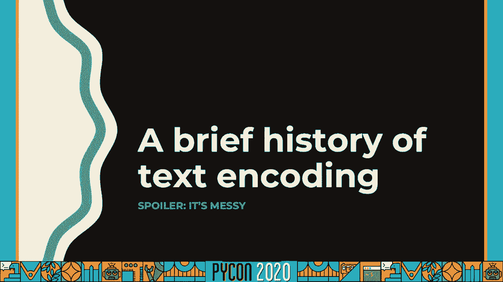

 Because we're still not sure entirely what that history looks like。

 We know writing seems to have been invented independently multiple times throughout history。

 and over the thousands of years since then people have come up with almost an unbelievable。

 number of different ways of writing down their thoughts and words。

 Writing you can think of as a basis for a writing system has probably been used at some， point。

 There are writing systems that are based on individual sounds or syllables or whole words， or ideas。

 There are writing systems that are based on abstract representations of an idea。

 There are writing systems that are based on the position of your mouth as you pronounce， a sound。

 Really anything you can imagine， probably someone has come up with。

 And the history of text encompasses all of those things， which can be pretty complicated。

 Now fortunately for this talk we really only need to talk about the last couple of centuries。

 When we've tried to come up with systems for representing and transmitting text electronically。

 There are older systems for long distance transmission。

 There are semaphore systems and flag codes and signal fires and many other systems that。

 were really effective。 But today we're mostly concerned with electronic or electromagnetic broadcast over a wire or。

 radio waves。 And we've probably all seen some examples of early attempts at this。

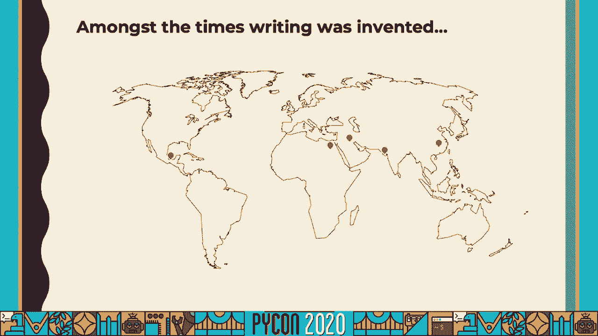

 This is one a lot of people know is Morse code， which was developed for a telegraph system。

 It's a variable width encoding uses binary alphabet of two characters， a dot and a dash。

 And there was a whole family of different telegraph codes with different principles and based on。

 different ideas。 One of the more popular later on was ITA。

 which is a baudot code named after Emil Baudot， who。

 also gives us the baud as a unit of transmission rate。

 And baudot codes are kind of interesting because they introduced this concept of control characters。

 If you look at this， it's a five bit binary code。 Normally these messages would be recorded by being punched as holes in a paper tape。

 which， sounds like it should only be able to handle 32 characters。 That's two to the fifth power。

 But here the capacity is over 60 characters because it uses a control character to switch。

 between two different alphabets of characters。 These sorts of clever innovations let people do a lot of cool things with the telegraph system。

 as it evolved and eventually developed into modern computer text encoding systems， many。

 of which were heavily influenced by these telegraph codes。

 This of course is the 100 pound gorilla in the room， ASCII， which owes a lot to ITA2。

 and the baudot family of telegraph codes。 But ASCII really took over the world even though it shouldn't have。

 The problem with ASCII of course is it's the American standard code， which is a problem。

 in a world that contains a lot more countries than America and a lot more languages than， English。

 which meant that of course， even though ASCII was built into a lot of systems。

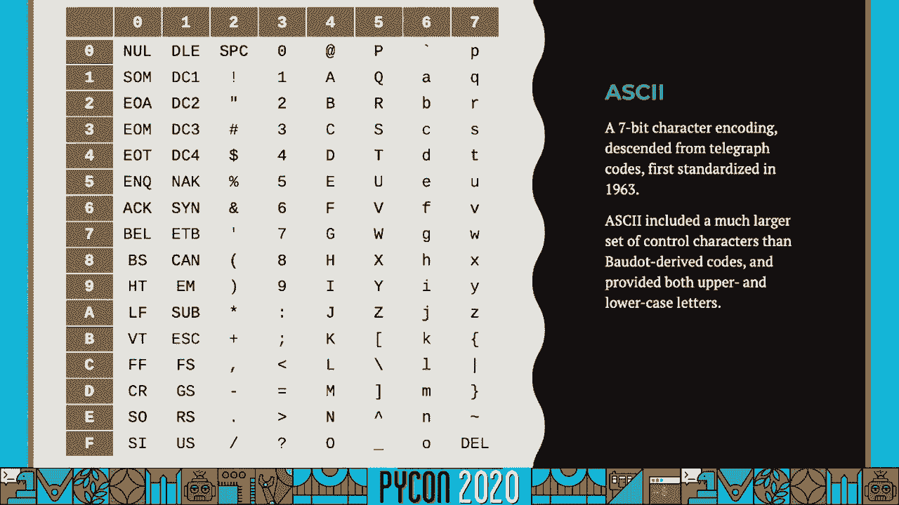

 and still is today and a lot of things will assume ASCII。

 Lots of different people developed text encodings to represent their languages， their dialects。

 their regions， their countries。 There are a huge number of them out there。

 This is just a subset that I took from a list that I found online。

 And of course that brought its own set of problems because how do you work together with。

 so many different possible encodings？ How do you avoid the kinds of bugs and translation and encoding problems that can come up when。

 you have this many different options and you may not even know which of them are being， used？

 Wouldn't it be great if we just had one universal agreed-on solution？

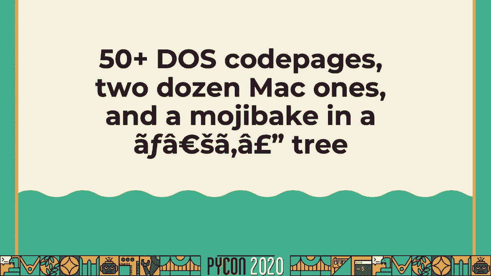

 Well， that's what Unicode is supposed to be。 And it's worth pausing for a moment to make sure we understand really what Unicode is。

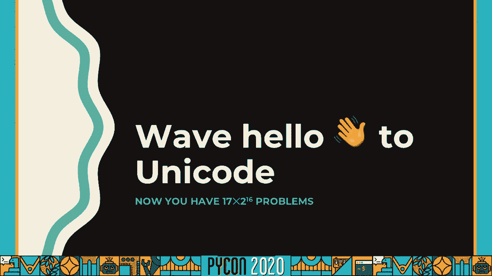

 A lot of single page guides will really make a point of saying Unicode is not a character。

 set and Unicode is not an encoding。 It's much more productive to think of Unicode as a set of databases and specifications and。

 rules and properties for describing different human writing systems that we know about。 And yes。

 some of those include ways to encode it into binary text。 Yes。

 some of those include sets of characters， but Unicode itself is so much more than any。

 of those individual components。 And of course that means it's also complex。 And it really has to be。

 If you think about that long list of different encodings， Unicode has to try to do the job。

 of all of them and handle all of the things that they handled。

 If any given individual encoding only needed to handle perhaps one languages or one dialects。

 or one region's particular language and rules for writing， but Unicode has to be able to。

 handle them all。 There's a lot of complexity that's just inherent to that task。

 And of course that means it's very different from those older single purpose encodings， but。

 different doesn't have to be the same thing as scary。

 And I hope that's something you'll take away from this talk。

 Now we need to dive a little bit deeper into the terminology just to be able to talk usefully。

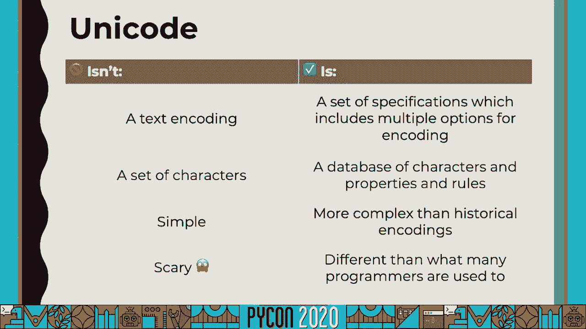

 about Unicode。 So let's stop and do a quick glossary check。

 Because often we fall into very informal terminology。 Like we start talking about characters。

 And Unicode does have a concept of character， but it's much more of an abstract entity than。

 in those older encodings and character sets。 The basic atoms of Unicode。

 the things that make it up are called code points。

 And you might try to think of a code point as a character， but we're going to see examples。

 of why that's risky。 And Unicode itself is organized into planes of code points。

 two to the 16th or 65，536， code points per plane。 Originally there was just one plane。

 Now there are 17 of them。 And code points are much like Unicode's concept of a character。

 still sort of an abstract， entity。 When we start encoding Unicode into a binary format。

 we need to translate it into code units， which are the atoms of a binary encoding。

 And then if we do want to go up a higher level， if we want something that's analogous to what。

 we would call a character， Unicode has the term "graphyme。"。

 Sometimes you'll also see it described as a grapheme cluster。

 And there are a couple different variations。 There's legacy grapheme clusters and extended grapheme clusters。

 You don't really need to know all the differences between those to be able to work effectively。

 with Unicode in Python。 But a grapheme is， in Unicode's terms。

 the smallest or the minimally distinctive unit of， writing in a particular system。

 A grapheme is the smallest thing such that if you change it， you change the meaning of， the text。

 and there's not a one-to-one correspondence between these and code points， as we're about， to see。

 So let's look at some examples of code points。 Here's one that's probably familiar to a lot of people。

 It's just a Latin capital letter A， as you can see from the name。 Its code point is 0041。

 Code points are always a number。 By tradition， they're expressed in hexadecimal。

 And we can see that it has a block and a category and some other information。 And in fact。

 this is just a subset of the information Unicode has on this code point。

 Blocks are a way of organizing code points below the level of a plane。

 Blocks are contiguous sets of code points that are all related。 So for example。

 the basic Latin block contains the code points for the Latin alphabet， or。

 at least the most common parts of it。 It has a lot of overlap with ASCII。 In fact。

 the first 128 code points in Unicode match the 128 values in ASCII。 We can see its category。

 It's an uppercase letter。 We can see it has information about bi-directionality。

 English and most other Western European languages， are written left to right。

 There's also this combining class property， which we'll get to in just a second。 Of course。

 there's a lot more that you could look up if you went trolling through all of。

 the information in the Unicode database。 So let's look at something a little bit more complicated。

 This is code 。0308， which by itself doesn't really do anything。 It wants to go with something else。

 And when it does， it shows up as an accent mark， diuresis， or sometimes you might call。

 it an umlaut or just dot。 But here we can see， for example。

 that combining class value suddenly shows up has a value of， 230。

 which says when we're rendering this and we see this in a sequence of code points。

 it shows up above whatever came before it。 And there are different values for combining class to show positioning and how different。

 things combine together to form a single visible glyph on your screen or when printed。

 But notice that this means if we want that u with an umlaut above it， we're using multiple。

 code points to produce what is one character from the human reader's perspective。

 So we've already broken that concept of one code point is one character because here we。

 have a character that uses two code points。 And it actually goes the actual complexity shows up in both directions。

 For example， here this character from the Arabic sections of Unicode is one code point。

 but 18 characters。 And there are actually several of these in Unicode。

 These are used in Arabic religious type setting where there are certain phrases that tend。

 to occur quite often and there are ligatures for representing them just as a single unit。

 when type setting and when printing and displaying。 But again。

 we see you can't assume one code point is one character and in fact this is。

 one code point that isn't necessarily even one word。

 So Unicode yes can be complex and yes you need to know that there's a difference between。

 code points and characters and graphims。 But when you sit down and think about it。

 any system that tries to handle all of the complexity。

 of human writing sooner or later is going to run into something like this and is going。

 to present this level of complexity to you in some way。

 And of course it keeps going because this means that often in Unicode there are multiple。

 ways to write the same thing。 Going back to that you with the umlop above it。

 there are at least two ways you can write， this in Unicode。

 Here's the one we saw earlier that uses the combining accent character。

 There's also a pre composed form that does it in one code point。

 And this is there for historical reasons。 A lot of earlier encodings that were single purpose had pre composed characters for different。

 combinations of letters and accent marks。 And so for compatibility Unicode has to have them as well so that you can do a lossless conversion。

 to and from Unicode back to your original encoding。 If you ever want to。

 But this means that in Unicode we can end up with multiple ways to write the same thing。

 And these two sequences of code points where the one pre composed point and the decomposed。

 sequence of two code points are considered equivalent。

 And in fact Unicode calls them canonically equivalent because it should always be safe。

 to swap one of these for the other。 You won't change the meaning of your text by doing so。

 But it also has a concept of compatibility equivalence which is where it may not always。

 be safe to swap between two different ways of writing the same thing。

 So here for example we have a code point that represents a composed fraction one half and。

 a decomposed sequence that writes it out as a one and a two with a splash between them。

 There are times when it's correct to swap between these there are also times when it's， not。

 And this gives rise to the concept of normalization。

 Which is a way that we can take different sequences that may represent the same thing。

 and find out if they do by making them equal after the normalization。

 And because Unicode has both composed and decomposed forms and has two different types。

 of equivalents。 There are four different ways to normalize Unicode depending on what the result should。

 look like and what rules you want to apply。 So you can either get a composed or a decomposed form after the normalization。

 You can use either canonical or compatibility equivalence rules as you're doing this。

 Now we'll get to this a little bit later on but if you're just feeling overwhelmed and。

 want a general recommendation if you ever need to do Unicode normalization yourself。

 it's probably best to pick form NFKC。 That's the one that will make the most trade-offs in favor of what you probably want but we'll。

 see examples of how different normalization forms can be good or bad a little bit later， on。

 Speaking of multiple ways of writing the same thing though a lot of languages have multiple。

 different forms for different characters， uppercase and lowercase and in fact Unicode has three。

 different cases lowercase， uppercase and title case and multiple different case mappings。

 and ways of transforming characters according to case as well as the concept of completely。

 uncased characters。 And in fact most code points in Unicode were most characters abstract entities that Unicode。

 handles are uncased because the case mappings won't change them because they're coming from。

 languages or systems of symbols that just don't have a concept of case。

 Now you might be wondering well how then do I do things like case insensitive comparisons。

 especially because Unicode if you dig into it has at least three different concepts of。

 case and ways to find out what case a character is or whether it even is case and the answer。

 is case folding which Python supports and we'll see examples of it in a little bit but I do。

 want to call out that Python's documentation says something not great。

 Python says case folding is like a more aggressive form of lowercase and while it's true that。

 for a lot of Western European languages the result of case folding will look lowercase this。

 is not a guarantee there are languages where the result of case folding will look uppercase。

 So don't think of case folding as being uppercasing or lower casing it is its own thing but the。

 important thing to know about case folding is that after you've case folded two strings。

 if they differed only in case they will be the same after the fold。

 And of course case can also extend beyond what Unicode really handles。

 Unicode handles most of these cases for example the Greek Sigma which takes different forms。

 depending on where it occurs in a word the Turkic languages have both dotted and dotless。

 forms of the letter I and it's incredibly important to preserve the dot or absence of。

 the dot when you're doing a case transformation because those effect meaning German has this。

 character officially it's called the sharp s historically it didn't have an uppercase form。

 and so it uppercases to SS but this also means that case mappings in Unicode aren't transitive。

 because uppercasing this and then lower casing again won't get you back what you started。

 with and there's far more complexity in the language of that have case that Unicode just。

 doesn't handle and tells you you may need to have low-calaware rules there are situations。

 like for example Dutch where words that begin with ij have to title case that as a single。

 unit rather than as two characters and Unicode simply tells you you need to get low-calaware。

 rules for the specific language you're going to work with it handles some of these but。

 nowhere near all the complexity that exists in all the languages now finally we need to。

 understand since we're going to work with computers how we actually get this into a。

 computer which means how do we get it into a binary form how do we encode it and decode。

 it going between code points which are numeric values but kind of abstract to actual bits。

 and bytes and to do that we need a Unicode transformation format and there are a lot of。

 those I've listed some here the two you'll see most often are probably UTF-8 and UTF-16。

 but it's worth being aware that most of these are variable width they use different numbers。

 of bytes to encode different code points UTF-8 for example for a code point from the。

 ASCII range only needs one byte but for other code points may need up to four UTF-16 for。

 anything in the lowest numbered plane plane zero or the basic multilingual plane BMP as。

 you'll sometimes see it written uses two bytes for anything from higher numbered planes uses。

 four bytes because originally Unicode had just the one plane and it had two to the sixteenth。

 code points in it so there was an assumption that 16 bits ought to be enough for anybody。

 right well eventually Unicode added more planes and UTF-16 was developed with a scheme that。

 lets it still handle 16 bit units but sometimes use two of them per code point the exact mechanics。

 if you want to go look it up are called surrogate pairs and basically there is a segment of。

 plane zero of Unicode that set aside that will never be assigned and UTF-16 transforms。

 a code point bigger than 16 bits into two code points from that range and then you can。

 transform them back again to get back the original value and this is how UTF-16 handles those。

 code points that are larger than 16 bits but that also means that it too now is a variable。

 with encoding and of course we need to consider what kind of abstractions we're going to expose。

 to a programmer because there are different ways we can handle strings in programming languages。

 they might be sequences of bytes they might be sequences of the encodings code units or。

 they might be sequences of code points or sequences of graph themes and their trade-offs。

 involved in all of these one of the important things to be aware of though is depending。

 on the abstraction your language chose you may or may not be able to cause changes in。

 meaning or even completely invalidate a sequence of code points by cutting into it so for example。

 in a language like see where typically strings are exposed as a sequence of bytes if you。

 arbitrarily cut in the middle of that you might cut in the middle of a multi byte code unit。

 or you might cut in the middle of a code point that requires multiple bytes or you might。

 be cutting at a code point boundary but cutting in the middle of a graph theme that's made。

 up of multiple code points all of these operations can be unsafe and depending on which abstraction。

 your language exposes to you you may be at risk of different versions of these problems。

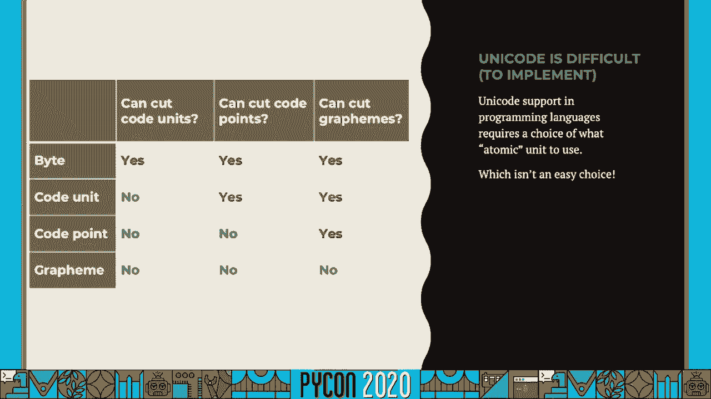

 now you might be wondering well what does Python do and you might also be wondering。

 well we're twenty minutes into this and you haven't really talked about Python I thought。

 this was a Python talk well okay let's talk about Python originally there was Python 2。

 and Python 2's story for Unicode was not that great in Python 2 the string type was a sequence。

 of bytes there was a separate type called the Unicode that was a Unicode string it offered。

 access to lots of features of Unicode it could represent any code point in Unicode or at least。

 sometimes could we'll get to that in a minute and you had to know to convert back and forth。

 between them and you had to know what encodings things came from and we're going to and Python。

 assumed ASCII by default for its byte strings and even if you told it otherwise still a。

 lot of third-party modules and other code didn't behave all that well when you presented。

 them with non-asky byte sequences or even sometimes with just Unicode instances and this。

 was generally a mess so now we have Python 3 and there was much rejoicing because in Python。

 3 there's only one string type and it is a Unicode string type there is still a separate。

 type for sequences of bytes and you can go back and forth between them you can take a。

 byte sequence and if you know the encoding you can decode it into a string or you can。

 take a string and encode it into bytes in a particular encoding but a lot of the issues。

 that used to exist in Python 2 especially with the sort of interchangeability that it had。

 for both Unicode and byte strings have been cleaned up except for one thing that persisted。

 for a few releases into the Python 3 series and it's this this is everybody's favorite。

 emoji the pile of poo and if you fire up a Python interpreter from Python 3。0。1。2 there's。

 a good chance you will see this result and you might be wondering what's going on here。

 well earlier versions of Python when you compiled the interpreter you made a choice as to how。

 it would store Unicode internally and effectively the choice was between UTF-16 and UTF-32 so。

 either 16-bit or 32-bit storage for Unicode these were called narrow and wide builds of。

 Python most people used a narrow build and that's where you would see this result because。

 that code point is too large to fit in a single 16-bit unit so an encoding like UTF-16 needs。

 to use a surrogate pair for it and split it across two replacement code points and Python。

 would expose this to you directly if you iterated over this you would see two code points from。

 the surrogate range in the basic multilingual plane instead of the original code point you。

 put in now fortunately that's been fixed Python 3。3 changed this implemented a spec from pep。

 393 which did away with the narrow and wide builds of Python if you want to know the details。

 and how that affected in memory storage and how it affects the capi of Python you can go。

 look up the pep one other nice takeaway is that it means Python strings use a lot less。

 memory now on average than they used to but the big thing for our purposes is it means。

 that a Python string now really is a sequence of code points where previously it was a sequence。

 of code units and this is actually a test I like to use with different languages when。

 I try them out is take a string like the pile of poo and ask the language how long is this。

 if you get an answer of one that means the language is probably working with either code。

 points or graph themes as its string abstraction if you get an answer of more than one then maybe。

 it's working with code units like Python used to with its 2-byte 16-bit encoding on narrow。

 builds or maybe even at something more complex like just exposing sequences of UTF-8 bytes。

 which will give you an even larger answer on some of the emoji but it's a good way to。

 quickly find out what is a language doing and what abstraction is it exposing when it。

 says it has Unicode support because that's an important thing to know now as far as Python。

 we now have strings which are sequences of code points which means that we can find out。

 information about them if we grab something out of a string so a string of length one it's。

 a single code point if we iterate a string we're iterating over code points if we if we。

 take a slice of a string or index into a string we're getting code points and we can actually。

 find out what's the numeric value of a code point and we can transform it into hexadecimal。

 as a tradition for representing Unicode code points there's also a module in the standard。

 library that's really useful called Unicode data and this gives us a lot of access to the。

 Unicode databases and the information that Unicode provides about its code points and。

 characters so we can ask questions like what's the name of this code point or what category。

 is it assigned to what's its bidirectional or combining rendering behavior all of which。

 can be useful information to find out we also have access from that module to Unicode normalization。

 and we can use any Unicode normalization form we want and so here for example we can take。

 that pre-composed u with umlaut character and decompose it into the two code points sequence。

 or we can take that pre-composed one half fraction and decompose it using compatibility。

 equivalence into that sequence of one slash two we also have access in Python to case folding。

 which is useful gives us access to case insensitive comparison and anytime you need to do a case。

 insensitive string comparison in Python this is what you should be reaching for a lot of。

 us probably developed habits from earlier days when we weren't working with Unicode of。

 upper casing or lower casing and a lot of us probably still do that when working with databases。

 because we may not have a case fold abstraction in our sequel libraries or in our database。

 but in Python we have that available and that's how we should be doing case insensitive comparisons。

 of strings so everything is wonderful right obviously well yes in a way Python three and。

 especially since three point three does a good job of implementing Unicode and exposing。

 it in a useful way and making it relatively easy for us to work with but there are still。

 traps and problems that we can fall into one of which I'm not normally a fan of absolute。

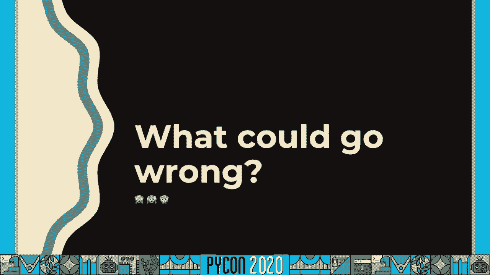

 statements but this is one that I will get pretty absolute on I will call this the golden。

 rule of working with text in any sort of programming language not just Python is to be aware of。

 your programs boundaries and do encoding and decoding there and only there and when I say。

 boundaries I mean things like if your program reads and writes files then that's a boundary。

 when it opens up and reads the contents of a file or writes the contents back onto the。

 file system if your program talks over a network that's a boundary when it sends information。

 out over that connection or receives information coming in those are the points where you should。

 do your encoding and decoding those are the points where you should be working with bytes。

 objects but once you have them encoded or decoded you should be working entirely with。

 strings internally you should not be passing around bytes objects or dealing with encoded。

 sequences of bytes at almost any cost because most older approaches and most older Python。

 code that had trouble making the jump two to three had trouble because of this because。

 of mixing of byte strings and Unicode strings or even just not using Unicode strings at all。

 in some cases and not thinking about encoding and decoding and where they needed to happen。

 so this is your golden rule if you take nothing else away look for the boundaries of your。

 program identify what they are do your encoding and decoding there and only there everywhere。

 else be working with strings be working with real Unicode now there is still some difficulty。

 every once in a while especially when it comes to working with files and especially on certain。

 types of Unix operating systems and these problems fall into a few different categories there。

 are some systems where there is no reliable way to ask the system what encoding it uses。

 for its file system so you know that something like a file name is a sequence of bytes but。

 you might not have any way of figuring out how to decode that into a sequence of Unicode。

 code points there are also file systems where technically there is not a requirement that。

 they be able to decode where a path can simply be any arbitrary sequence of bytes you want。

 and never validly decode in any known encoding and Python has made progress over the course。

 of the Python 3 release series with getting better at this there are some tips and tricks。

 and tools and now Python mostly does its best to let you treat the file system as UTF-8。

 with some tricks to handle potentially invalid or just completely undecodable paths actually。

 what Python does now is similar to what UTF-16 does where when it encounters a byte that。

 can't possibly decode as a sequence of code points it preserves it as is by transforming。

 it into a code point from the surrogate pair range and that lets it transform back into。

 the original byte again when it's time to write things on the file system or do other。

 encoding sometimes you can work around this by telling Python what encoding your file system。

 is using sometimes you just have to hope that it works because there are some systems that。

 are configured hopelessly but it is a thing that has gotten better it is a thing that now。

 mostly reliably works even on those badly configured systems which is a big leap forward。

 from where it was in the early days of Python 3 of course there are other problems you can。

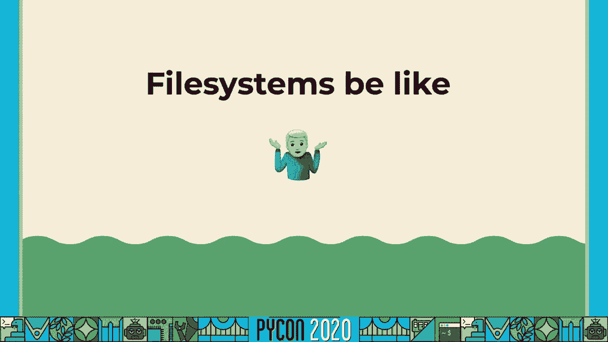

 run into we've we've definitely seen examples of normalizing different forms that can sometimes。

 be a destructive operation depending on what language you're working with some languages。

 really rely on the combining and composing features of Unicode this example is Korean。

 but it's not the only language that does this that initial string is two code points。

 it's two composed characters effectively each one represents one syllable of the text and。

 each syllable is made up of three individual characters or three individual letters that。

 represent the consonants and vowels that go into that syllable and performing a decomposing。

 normalization can result in that sequence of as you see below six different code points。

 representing the constituent parts of those composed characters those single syllable representations。

 and depending on what system you feed them into they may render correctly or they may。

 not the terminal application I used to generate these examples handled this well and rendered。

 both of these strings the same way this slide does not so this is something to be aware of。

 and in general combining and composed forms pop up more often than people expect a lot。

 of emoji for example are made of combining sequences the country flags there is a set。

 of code points that are called the regional indicator symbols and they provide an alphabet。

 that lets you spell out two-letter country codes and then those render as the flags of。

 those countries so this is basically the sequence us spelled out in regional indicator。

 symbol code points if you wanted something like the flag of Canada you would spell CA。

 if you wanted the flag of France you would spell FR and that's how the flag emoji work。

 splitting these down the middle could just destroy the meaning because you wouldn't know。

 how to render it anymore the same thing is true of a lot of emoji for people for example。

 this is a family of four people but it's seven different code points under the hood and a。

 lot of the emoji for people are multi-code point sequences either composing groups of。

 people or composing on modifiers to indicate gender or skin tone or other attributes and。

 again splitting in the middle of them can be destructive it can change the meaning or。

 completely destroy the meaning of a sequence so we need to turn back to that concept we。

 saw earlier of the graph theme the minimally distinctive unit of meaning and unfortunately。

 Python doesn't directly give you a way to work with graph themes in strings but you can。

 still do it using third party libraries so for example this is a third party regular。

 expression library called regex you can pip install it and it offers a lot more support。

 for Unicode then Python's standard library regex module does including things like filtering。

 and matching on Unicode properties and most importantly for this case it provides a meta。

 character for matching Unicode graph theme clusters and this is actually defined in one。

 of the Unicode specifications it's supposed to be this capital X character but it means。

 that we can do things now like count the number of graph themes in a string or split on graph。

 themes or iterate over graph themes rather than risking splitting up a graph theme that's。

 made up of multiple code points but even in the Python standard library there is still。

 a lot of awareness of Unicode if we go back to for example the regex module in the Python。

 standard library most of us have probably written code like this where we're saying oh。

 okay I need to match something that you know looks like a year so it's a sequence of four。

 digits and it's going to be something like 2020 well it turns out Unicode has a much。

 broader concept of digit than what speakers of English and Western European languages。

 do so that second string for example pulls digit characters from four different blocks。

 and four different languages that are represented in Unicode but it still matches because according。

 to Unicode properties they are all digits and this is an important thing to be aware of。

 when you're working with Python in Python 3 where everything is Unicode and things are。

 mostly Unicode aware that you need to be explicit as the Zen of Python says explicit。

 is better than implicit but you need to make sure you understand what some of these things。

 mean like this digit medic character or the other regex medic characters and if what you。

 really wanted was only to match digits 0 through 9 from the Latin character set you can say。

 that but you do have to be explicit about it。 There can also be difficulty with things。

 like performing string comparisons and working with different strings that potentially write。

 the same thing different ways and here it can be difficult to give any single answer because。

 the answer is usually context sensitive it depends on what you're doing。 So for example。

 here this is a fairly simple algorithm but it comes from one of the Unicode technical。

 reports on security and this is for comparing things that might be used as identifiers things。

 like maybe variable names in a programming language or usernames in an account system。

 and this gives you a way to compare them in a case insensitive way and figure out which。

 ones should be considered equivalent and which ones should not。 There are other ways to normalize。

 and prepare strings for comparison and for use and it really does depend on your use case。

 Python supports quite a few of them for example if you are working with domain names which can。

 be internationalized now there are modules in the standard library that support this the。

 encoding codeings。idna module the puny code codec let you work with these and transform。

 internationalized domain names into an ASCII compatible form that's safe to transmit through。

 a lot of systems that maybe aren't aware of internationalized domain names。 There are。

 also even trickier things that you can get by digging into third-party modules。 For example。

 this is something that comes and goes where people will try to fool you by writing out。

 a domain name or maybe an email address or a username or some other identifier using a。

 mix of scripts where some of the characters look like each other but aren't actually the。

 same and Unicode actually includes a database for this called the visually confusing characters。

 file and there's a third-party module that you can go download that has this wonderful。

 function and it called is dangerous。 I love that name that tells you when a string contains。

 code points from multiple scripts and some of them appear in that visually confusing。

 characters file some of them are confusable characters so you can notice when somebody's。

 trying to do something dangerous and that module also includes a lot of other information that。

 you can access so you can ask it to show you a list of what are the confusable characters。

 what was it that set this off what were the script properties that were being used in。

 this string that were being mixed together and there's really a whole wide world of things。

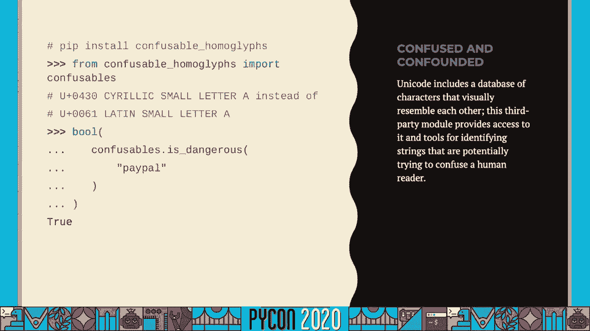

 out there but hopefully at this point you've got a handle on the core ideas of what goes。

 into Unicode what it is why it's complex and where that complexity comes from so you can。

 start thinking about that complexity in a productive way start anticipating where you。

 may need to do extra work where you may need to worry about something and how you can write。

 better more effective code and feel more confident about how you're using Unicode and of course。

 if you have any questions unfortunately this is an online presentation because PyCon had。

 to be canceled this year but I'm happy to have people reach out and ask me questions。

 I also keep a blog where I regularly rant about all sorts of things including Unicode。

 which has its own category there and finally I want to take a minute to just thank the。

 PyCon organizers and the PSF because they were really put in an impossible situation this。

 year and as sad as it is that the in-person version of PyCon 2020 had to be canceled it。

 really is incredible the way that they reacted and responded and were able to put together。

 this online track of talks as quickly as they did and as successfully as they did so if you're。

 watching this please be thankful for the PSF for the PyCon organizers and for all the。

 work they put in to putting this online and pulling off a remote PyCon 2020 on such short。

 notice and under the worst possible conditions。 In the meantime stay safe hopefully I will see you at a PyCon in person sometime in the。

 future。 Thank you。

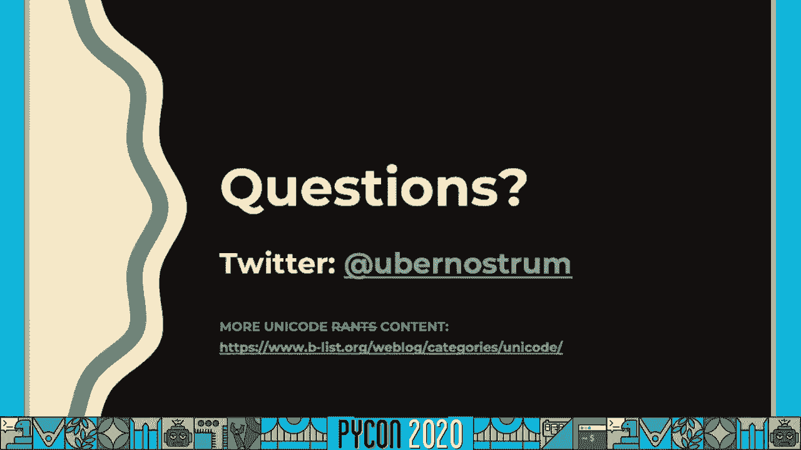

 so much for watching。 for watching。 the PSF for watching。 the PSF for watching。 [BLANK_AUDIO]。

