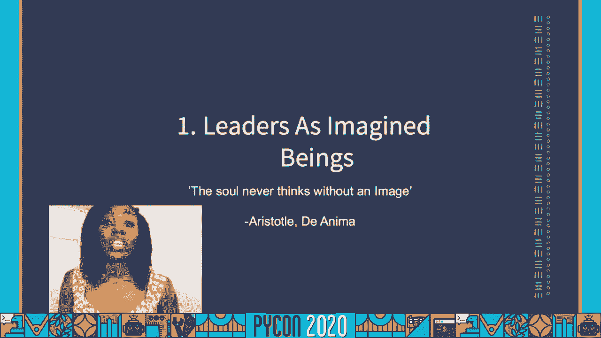
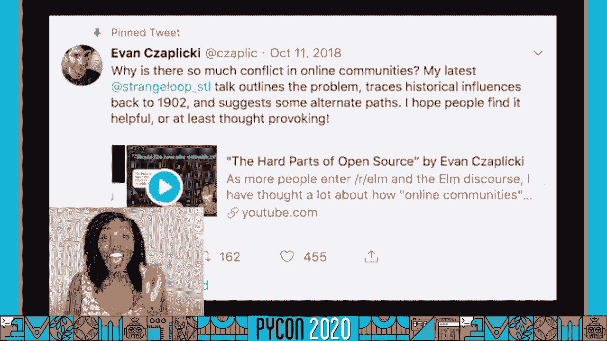
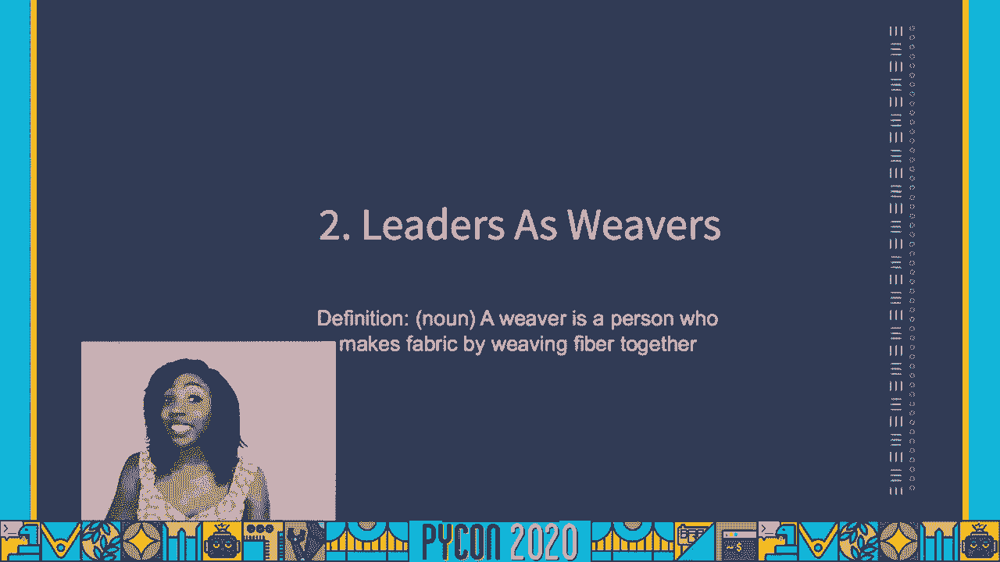
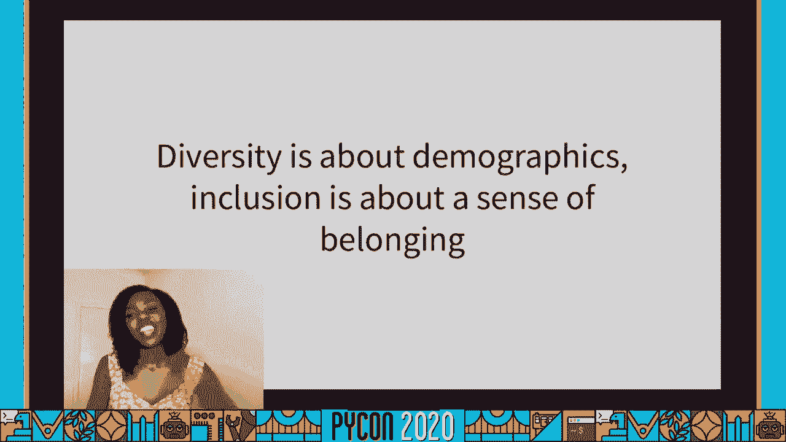
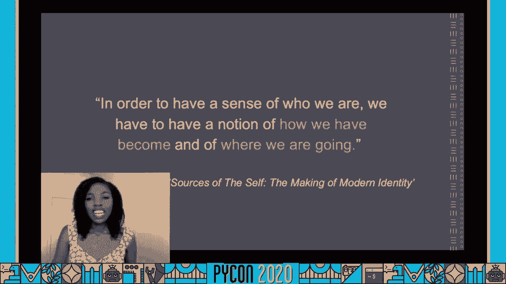
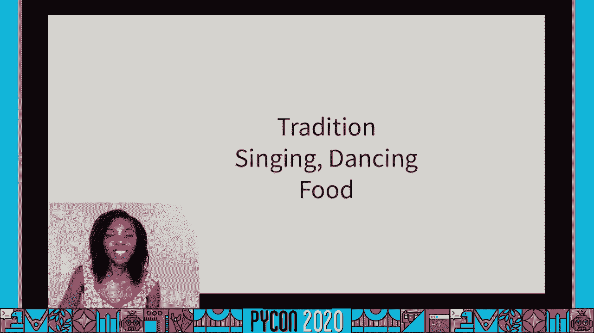
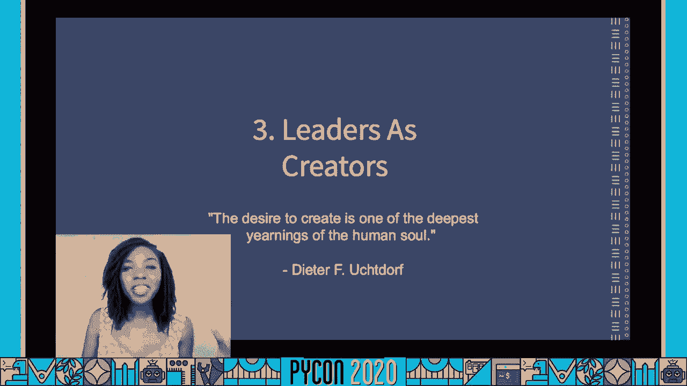

# P56：Talk Marlene Mhangami - Leadership and Identity in the Pan-African Python moveme - 程序员百科书 - BV1rW4y1v7YG

 Hi everyone， my name is Maureen and today I'm going to be speaking to you about leadership。

 and identity in the Pan-African-Python movement。 So a bit more about myself。

 I am based in Harai Zimbabwe， which is actually where I am， right now。

 And Zimbabwe is a country in the southern part of Africa。 It's just about South Africa。

 And it's sort of a very turbulent country， but I've lived here for almost my entire life。

 and I've really enjoyed living here。 Something else about myself is that I am a Daresa at the Pan-Southway Foundation。

 And this is going to be my third year on the board of Daresa， and I've really enjoyed being。

 part of the PSF and I think we do really important work。

 And if you're watching this and you want to know more information about the PSF， I would。

 encourage you to visit Python。org to find out more。

 And then a final thing about myself is that I'm the current chair of Python Africa。

 And Python Africa is the annual gathering of the Pan-African-Python community on the。

 continent of Africa。 And we actually had our first conference last year in 2019 and we had it in Akragana。

 which， is so beautiful。 This is really exciting。 I was able to chair this conference and be part of the team that sort of led this initiative。

 And for me， I found that this was super， super enjoyable， but at the same time， quite challenging。

 And I also found that it was an opportunity for real personal growth for myself。

 And several things happened throughout the conference and throughout the planning of。

 the conference that made me stop and start to think about the concept of leadership。

 And specifically， where we get our assumptions about what a leader should look like。 So， you know。

 throughout this planning process of planning Python Africa， I would be sending， emails quite often。

 quite a lot。 And if you are someone who's to plan a meetup or a conference。

 you'll probably be able to， relate to that。 But a lot of my work was communicating with people。

 And it was really funny because when the conference actually happened and I was there in person。

 several times I would go up to people and I would introduce myself and I'd say， "Hi。

 it's so nice to meet you in person。 I'm Marlene。 I'm the person you've been speaking to over email。

"， And a couple of times I would go up to people and say this and I would be met with this sort。

 of wide-eyed shock or surprise where people would just be like， "Wow， you're Marlene。

 You're the conference chair。"， Or other times， a couple of times I would go up to someone and I'd be like。

 "Hi， I'm， Marlene in the conference chair， the person you've been speaking to。"。

 And I'd just be met by sort of blatant skepticism of， "You're Marlene。 You're the conference chair。

 Are you sure？ Are you sure， girl？"， And I remember this one specific moment as well where I went up to someone and I introduced。

 myself， "Hi， it's so nice to meet you。 I'm Marlene。 I'm the conference chair。"。

 And this person just looked at me and they were just like， "Wow， you're Marlene。

 I just thought you would be bigger， you know？ Not older， not wiser， just bigger。"， And that's fair。

 I guess。 But this hasn't just happened to me at PyCon Africa， but there have been other times in。

 my life where I've been put in positions of leadership and when people find out that。

 I am a person in leadership， I think oftentimes I actually get a similar reaction of sort。

 of surprise to find out that I'm in any sort of form of leadership。 And these things happening。

 you know， have led me to start to ask the question， what。

 comes to our minds when we picture a leader？

 Which actually leads me to my first point today， which is examining leaders as imagined， beings。

 So Aristotle has a really great quote where he says， "The soul never thinks without an， image。"。

 And I definitely have to agree with that。 In fact， in 2014。

 the New York Times published an article where they were profiling a study。

 done by a group of researchers and in this study， the researchers would ask people to。

 come into a room and then ask them to draw whatever came into their minds when they thought。

 of the word leader。 And what came out of this study was really interesting， actually。

 nine out of ten times， when people were asked to draw a leader， they would draw a man。

 And the image that you can see right now on this screen is actually a picture that I。

 pulled directly from that study。 And as you can tell。

 I look very similar to the person on this screen。 Actually I'm just kidding。

 I look absolutely nothing like the person on the screen were probably complete opposites。

 And one of the researchers that was quoted in this article， her name is Elizabeth McLean。

 and she's from the University of Arizona， she was quoted as saying， "People have these。

 prototypes in their heads about what a leader looks like。 When we see an individual， we ask。

 do they fit that？"， So where are we actually getting these prototypes from。

 and is anyone influencing the images， that we have in our minds when we think about leaders？

 And so for this， I'm going to actually take us back into history to try and answer some。

 of these questions。 So some of you may have heard about Plato。 Plato is a Greek philosopher。

 And Plato is very well known for his concept of the philosopher king。

 And he's also very well known for his writing， the Republic。 And in the Republic。

 he actually puts across the notion that leaders should be the smartest。

 and most virtuous members of their communities。 And also in earlier writings。

 Plato is often found to use the metaphor of leaders being， shepherds to their flocks。

 Now Plato isn't the only person to have used this metaphor。

 We actually see it being used in other ancient texts like the Bible where Plato may have。

 even drawn this imagery from in the first place。 However， in a later writing， statesmen。

 Plato actually changes his mind about this idea。 And he lets us know that actually， no。

 we shouldn't use the idea or the picture of， shepherds to help us imagine what our leaders should be like because shepherds are humans。

 and sheep are sheep。 And so what this metaphor does。

 it actually makes us think that we are so different from。

 our leaders that we're actually entirely different， our leaders are actually from an entirely。

 different species to us。 So I've placed it and entirely reject the idea or this concept of hierarchy。

 What we see is that he starts us on this journey to start to break down this romanticized idea。

 of our leaders being these perfect people who do no wrong。 So let's go ahead。

 let's fast forward to today， we're living in 2020 barely making it but， living in 2020 nonetheless。

 And today we're living in what many people would call the information age。 And right now。

 information is more accessible than it's ever been before。

 And I would argue that as a direct result of that， the gap between leaders and their。

 followers is smaller than it's ever been before as well。 In 2018， Evan Schopke。

 who is the creator of a very cool， functional programming language， called Elm。

 gave a talk at a conference called Strange Loop。 And the title of this talk was the hardest part of open source。

 And in his talk， he was examining why we have so much conflict in our online communities。

 And one of the major reasons he gave was that a lot of our online communities were actually。

 founded on the ideology that we can create this virtual space that's free from tyrannies。

 and free from some of these negative dictatorships where people in leadership sometimes don't。

 know as much as we do。 But they're creating these rules and structures that are oftentimes limiting and in some ways。

 can be very harmful and hurtful to our communities。 And so many of our online communities。

 even today， tend to have a very negative view of， hierarchy。

 And we also often see a general distrust of people who try to take positions of leadership。

 and people who try to set up structures or hierarchies。

 And so there's a very negative view on people who are trying to control other people online。

 And that's something that I would definitely have to say， I agree with。 So far。

 we've gone ahead and we've looked at two very extreme sort of perspectives on， leadership。

 On the one hand， we have this idealized， romanticized view of leaders where we see them as these。

 perfect people who can do no wrong。 And that's not a good view of leadership because we're really then just setting ourselves。

 up for disappointment because in reality， leaders are just normal people， like you and， me。

 And then on the other hand， we have this very negative perspective of leaders where we see。

 them as tyrants and people who just want to create structures and control other people。

 And I also don't think that this is a great view because I do think leaders can be really， helpful。

 especially when we try and start to set up communities。 In different spaces as well。

 So what is actually a correct or good metaphor to use when we're thinking about leaders？

 And I think that this is really important to think about because if we don't have a correct。

 view of leaders， you can actually have a leader standing right in front of you and completely。

 pass over that person because they don't fit the prototype that's in your mind right， now。

 So for me， I think I found a pretty good metaphor that I personally would use to describe leaders。

 At this point， I would usually ask people to guess what that metaphor is。

 But you can go ahead actually right now and guess what picture I'm going to use。

 But for this to answer this question， I'm actually going to go back again to Plato。

 And Plato actually tells us that the picture or the metaphor that we should use to describe。

 leaders is to see leaders as weavers。

 So you know， I feel like that was such an obvious answer。 It's super intuitive。 I'm joking。

 I feel like it's a very nuanced answer。 But what I mean by weavers is I mean people who create fabric or create a garment out。

 of wool。 And Plato gives a really great description of why we should see our leaders as weavers。

 And so for this， we're going to go ahead and dive into the exciting world of weaving。

 So for weavers， when they're creating a garment， usually what they will do is they。

 will take two different types of wool of different consistencies。

 And the picture you can see on the screen right now， the type of wool that is running。

 horizontally across the screen is called the "wift。"。

 And that piece of wool is very soft and it's sort of very malleable and kind of nice to， the touch。

 And the wool that is running vertically is called the "wift。"。

 And that piece is more abrasive and kind of difficult to move。

 Plato lets us know that good leaders are like weavers because what weavers are able to。

 do is they're able to bring together two pieces of wool that are seemingly opposite。

 and bring them together to create one unified garment。 And leaders are able to do a similar thing。

 What leaders do is they bring together people from different perspectives and encourage。

 them to collaborate around one unified cause。 So what I would say is that good leaders are unifiers。

 So at first glance， this can seem like something that's pretty straight forward。

 This can seem like something that's really easy to do。

 But I would actually argue that it's a lot more complex than it seems。 And particularly today。

 we're living in a world that's really globalized。 And in the Python community。

 Python is being used on every single continent in the world。 So from Africa to China to Alaska。

 Shout out to the Alaska Python user group。 Python is the Python community is growing at a really rapid pace。

 And this is really exciting for us。 But at the same time。

 I also think that this is something that is very challenging because。

 the larger our community grows， the more diverse the perspectives become in our communities。

 And also the harder it is to unify people around a common cause。

 So before I get into what it actually looks like for us to be unifiers and to lead in our。

 communities， I just want to make a quick comment on things that unity is not。

 So the first thing is that unity is not homogeneity。

 So many people think that in order to be unified， we all have to have the same perspective， the。

 same ideas， the same experiences。 And I don't think this is true at all。

 I think we can come from different beliefs， different backgrounds， different experiences。

 and still be unified in some way。 So just a point here to note is that unity doesn't mean we all look the same and we all。

 have the same perspectives or the same beliefs。 The second thing is that unity is not just diversity。

 So you can have a really diverse group of people together and maybe actually doing some things。

 together， but that doesn't mean that they're unified just because you have a really diverse。

 looking group doesn't mean you have a unified group of people。 So a couple months ago。

 I found this quote online and I thought it was really moving and。

 here it is and it says diversity is about demographics。 Inclusion is about a sense of belonging。

 And I think when we are starting to have these conversations about what it looks like to be。

 a unified community， something that we have to talk about is inclusion。

 Because in order for people to feel like they are part of a unified community， they have。

 to have a sense that they belong in that community。

 And so inclusion is a really big part of this conversation。

 And how do we make sure that people feel like they belong in our communities？

 And I would argue that a big part of that is understanding people's identities。

 So let's go ahead and talk a bit more about the subject of identity。 So there's a philosopher。

 a modern day philosopher。 His name is Charles Taylor that is one of my favorite philosophers。

 And he has a book called Sources of the Self， The Making of Modern Identity。

 And one of my favorite quotes from his book is the one on the screen right now。 And he says。

 "In order to have a sense of who we are， we have to have a notion of how。

 we have become and of where we are going。"， So those two things are really important。

 really crucial。 How we've become and where we're going。

 I'm going to go ahead and share a bit about my how and how I've become in order to help。

 us sort of examine this issue of identity and how it plays out in our communities。

 So I mentioned before that I'm based in her eyes in Bobwe and that's where I've grown。

 up for most of my life。 But my mother， though she lives here now。

 actually didn't grow up in her area。 She grew up in a different part of the country called Shishane。

 And my mother， when she was growing up， her family was very big。 So she had many， many。

 many family members。 And the reason for this is because her father， when my grandfather was a chief。

 And my mother didn't really know her father very well and I didn't know my grandfather。

 really well because he actually died before I was born。 But for my mother。

 her father was a polygamist。 So he had four wives and my grandmother was actually his fourth and final wife。

 And I always find that it's really interesting whenever I talk to my mother and my grandmother。

 about their experiences because it feels like they were living in a world that's so different。

 from the world that I'm living in right now。 And the picture of me that's on the screen right now is actually from a couple of months。

 ago in the holidays when I went to my mother's hometown and we had a reunion from my mom's。

 side where all the family members got together。 And during that time。

 it had been after a period where I had gotten to travel quite a。

 bit and interact with people from different communities。

 And it was really interesting because when I was now there and at this family reunion。

 I noticed a number of different things that my family does that are really strange and。

 that I was just like actually in the places that I've been， people aren't doing these things。

 And so I'm going to share a couple of those things with you。 The first thing is tradition。

 so we're a pretty fixable family I would say。 But whenever we meet。

 there is a lot of tradition that's followed。 So for example。

 there's a certain way that people have to greet each other。

 There's a way that men greet and there's a way that women greet。 And for the men。

 there has to be a hand thing like this， for the women， it's different and。

 you have to like curtsy and it's like a funny， it's like a whole thing。

 But this is really key to our identity。 So I'm actually also part of a specific group of Zimbabwean people called Shana people。

 And so a lot of the traditions that we do， that my tribe is the Shana tribe。

 And so a lot of the things that the traditions that we follow right now have been inherited。

 from our tribal community or from our tribal history as a Shana person。

 And another thing that I don't know， I think it might just be specific to my family， but。

 I also have seen it with a lot of Shana people where they're singing and dancing。

 And so whenever we meet something I can guarantee you is that there's going to be singing and。

 there's going to be dancing。 So when we were going back for this family reunion。

 if it had been a long trip， it's quite， far from where I live in her。

 And so when we arrived at the place that we were staying， my grandmother was one of the。

 first people to get into the house and she just dropped all her things and she started。

 singing and dancing。 And to be honest， I was very tired and I didn't want to sing and I didn't want to dance。

 But I have to sing and dance because everyone just， it's just what we do and it's just。

 I just don't think there's an option， I guess， to say no。 But it was always fun。

 And then a third and final thing about us is food。

 So we have some traditional foods that we eat as Shana people， as Zimbabwean people as， well。

 And one of the foods that we have is called sada。 And it's kind of like a。

 it's like a starch substance。 It's almost like mashed。 But it's， no， I don't even know。

 It's like maize and you're boilous。 And you know， I have said for a while now that I just don't think it tastes really great。

 I'm sorry to the Zimbabweans watching to the Shana people watching， but it tastes okay。

 It tastes fine， but I personally don't love it。 But I'm eating sada almost two to three times a week because it is part of our tradition。

 And my mom gets really upset when I complain about it and say that I don't like it。

 And it's just part of who we are as Shana people and other part of our tradition。

 And so for me， this， these parts of my personal identity， when we were planning Pekon Africa。

 and when the conference actually happened。 I actually really love to see the way that my personal identity as a Zimbabwean kind of。

 played out in and is also very similar to a lot of the traditional sort of identities。

 of other people across the continent of Africa。 And this played out in many different ways at Pekon Africa itself。

 So something that we had， for example， it was， as I said before， it was in Akragana。

 And so we had Ghanaian traditional food as part of our lunch at the conference。

 So there's some really， I would say that West African food is fantastic， but it's quite， spicy。

 Jolo Frice is a favorite amongst Ghanaians and also amongst Nigerians。

 And we had quite a lot of Jolo Frice。 It's very spicy。

 But I enjoyed it and I loved that we had traditional Ghanaian food at our lunch times。

 Another thing was that we had an opening ceremony where they were singing and dancing。

 throughout the conference。 And I didn't know that the local Ghanaian team had， for the conference。

 had invited some， Ghanaian dances to open up the conference for us。

 And but it was a really amazing surprise。 And it was really fun to have these Ghanaian dances there at the conference。

 Another thing as well is that to close the conference， someone gave a lightning talk。

 right at the end of the conference and they were just like， okay， it's the end of the， conference。

 I just think everyone should just come down and dance。

 And this should be almost everyone in that whole stood up and we started dancing。

 And it was such a fun time and it was something that I felt was so unique to Pike on Africa。

 And I'm not sure how well that would play out at a US conference。

 Maybe I should try it the next time I come。 But it was definitely something that I felt made it feel like I was home and made it feel。

 like I belonged。 So like I said， our history is really important。

 How we become our history and our traditions， our things that make us uniquely ourselves。

 A really a key part of our identity and really pay a major part in terms of making us feel。

 like we belong。 However， at the same time， though our histories are important。

 does this mean that for our， global community， does this mean that I'm not going to be able to feel like I belong in。

 your community unless you have people dancing unless you have Ghanaian traditional food。

 I'm not going to be able to feel like I belong in your community。 No。

 This obviously doesn't mean that。 And I would say that we should include our histories in our communities as much as possible。

 but that's not the only part of our identities that we should take into consideration。

 So let's look back at here we have on the screen again that definition from sources of， self。 Yes。

 our histories are a part of our identity， but at the same time， our futures are also。

 a key part of our identity。 So where we're going is a really key part of that。

 And I would actually argue for my third and final point that leaders are creators and。

 leaders are the people who are creating the future。 So what does it look like？

 What is our future actually going to look like？ And how do we create that future as leaders in our communities？

 Well， for me， whenever I think about the word future， immediately an explosion of color。

 is what comes to my mind。 I just think of really bright colors。

 And at the same time in line with that， RGB values also come into my mind。

 And when we look at RGB values， what we know is that these RGB values are primarily made。

 of three different colors。 So red， green and blue。 And in isolation。

 these three colors are beautiful and they are magnificent just by， themselves。

 But what we see is that the minute you start to mix and unify that red， green and blue。

 you get a vast range of new colors and beautiful colors that we would not have seen otherwise。

 if these colors had just stayed in isolation。 And today I'd like to propose to you that the more diverse our communities are when we。

 unify those communities， the potential for creativity and innovation and discovery goes。

 up significantly when we come together as people from different perspectives and different。

 backgrounds and experiences。 And I think this is really important when we think about creating a future that is bright。

 and colorful and meets up to all about expectations。 And so finally， before I closed。

 I just want to make a quick note on what I think the future， leaders look like。

 What do our leaders of the future look like？ How do we identify those people？

 And I think there are three key parts or three key traits that leaders of our future have。

 So the first thing is I think they are curious。 These are people who are going out of their way to find out about what other people believe。

 to find out about other people's traditions and cultures。 And they are curious。

 They are going even to places that don't make them feel comfortable or places that are really， new。

 just to find out about other people。 And I think the second thing is that our future leaders are humble。

 So not always having to make sure that your opinion is the loudest and your opinion is。

 the one that's being taken all the time。 I think good leaders are sometimes able to be in situations with people that they disagree。

 with and still be humble enough to collaborate with those people。

 And then the third and final thing is I think good leaders are open。

 So not just listening and learning from other people， but being vulnerable and being able。

 to share your own experiences with people from different backgrounds。

 And I think that way we're able to build empathy and build stronger and more unified communities。

 So that's it for my talk。 Thank you so much。 Please feel free to follow me on Twitter or message me if you have any questions。

 So thanks again for watching。 [ Silence ]。

