# P60：Talk Neeraj Pandey - The joy of creating art with code - 程序员百科书 - BV1rW4y1v7YG

 Hi， I'm Niedhaj and this is the Joy of Creating Art with Code。

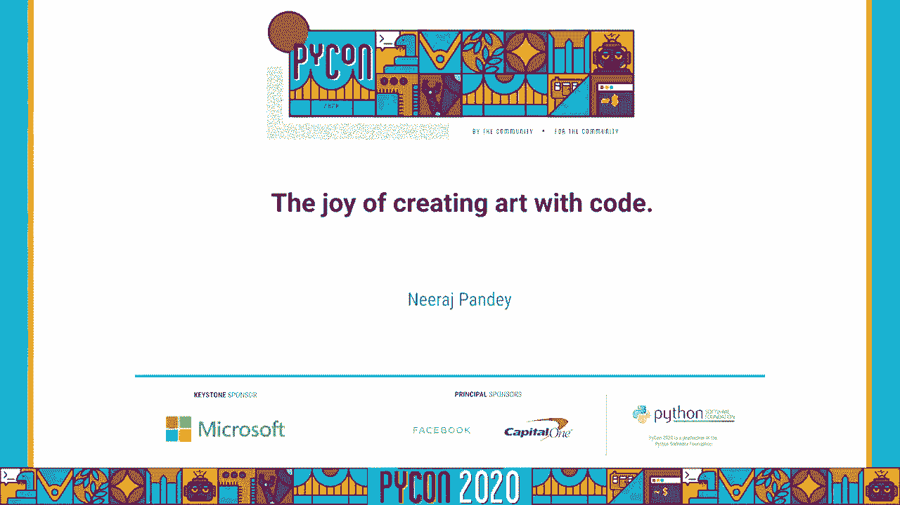

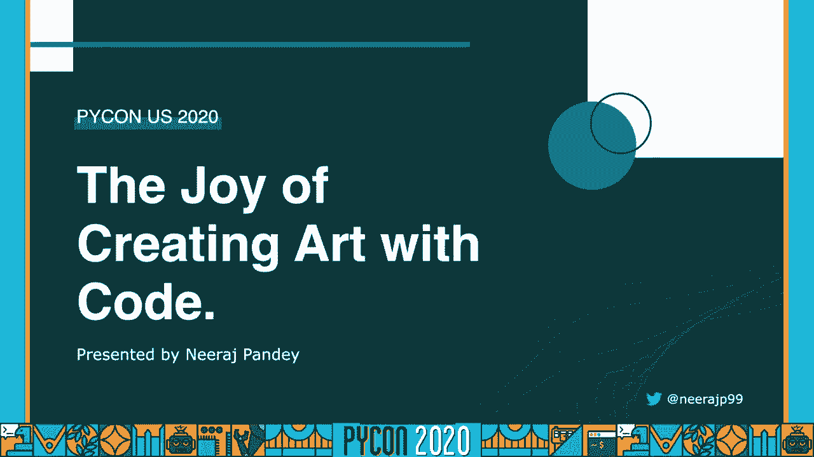

 A little bit about myself， I'm currently a sophomore student at Ashoka University。

 with a pursuing Commutative Science。

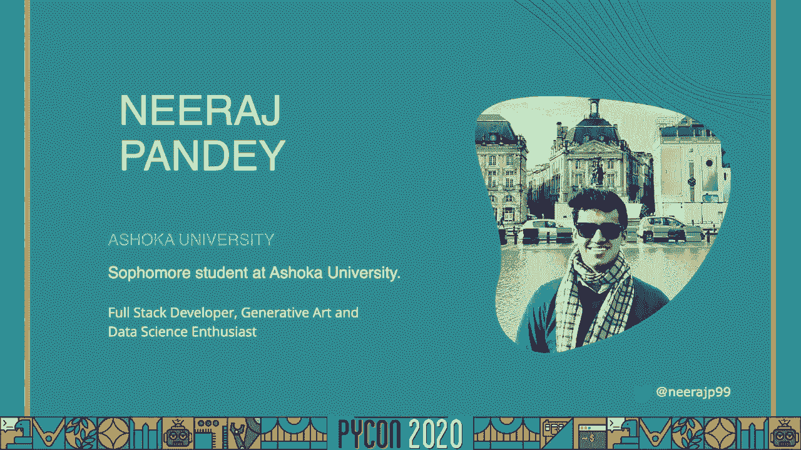

 Moving forward， these are the points for discussion， the generative art， its principle in elements。

 the history behind generative art， the geometry algorithms and randomness that frames a generative。

 art。 We'll be seeing a lot of examples using processing and pie chiral and we'll be ending the talk。

 using genetic algorithm and GANS。

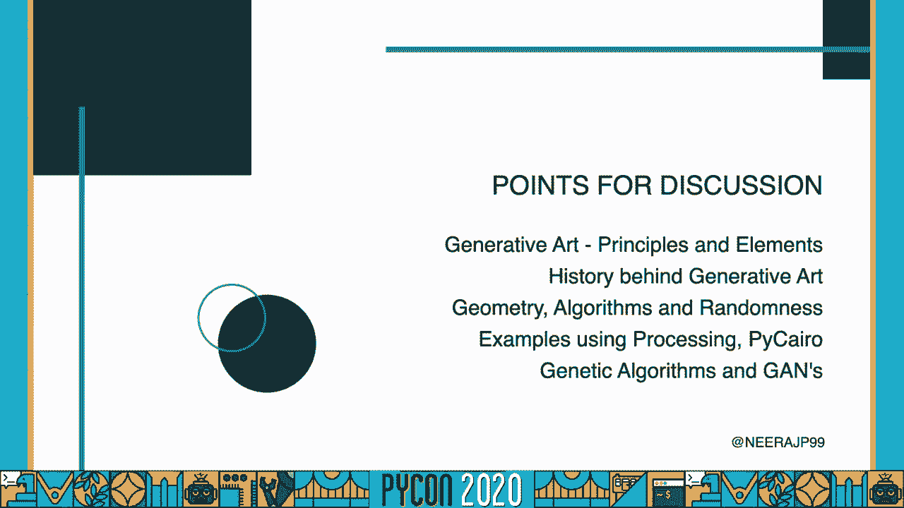

 So what exactly is generative art？ An art created through the use of an autonomous system is simply generative art。

 Predictive art uses iterative commands to draw vector based shapes to the screen。

 Most of the art created draws inspiration from the modern art， especially pop art that。

 makes heavy use of geometric patterns。 An autonomous system is always required。

 otherwise it's more of a digital art and the， randomness is one type of autonomous system。

 So the design created is unique each time。 Here the role of an artist is to design the process that includes some sort of autonomy。

 like the artist controls the randomness and the order in the art。

 So we can see that the elements of the art are provided by the system and the principles。

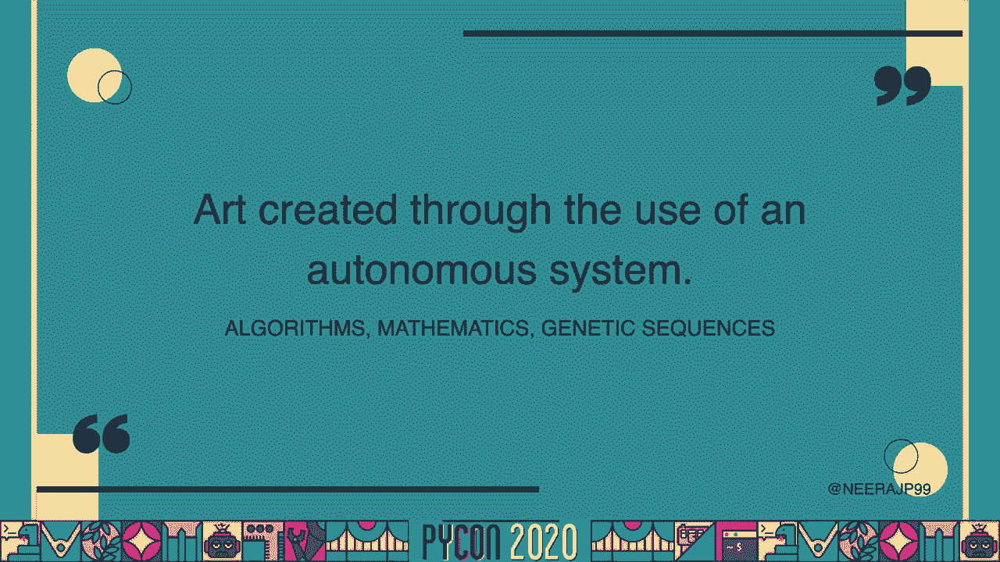

 on which the art will be created is provided by the artist。 While creating an art piece。

 one must understand and apply the building blocks of art and these， are the elements and principles。

 When we talk about elements of an art， these are the things that are used to create an art。

 piece and these can be used either individually or in combination for any art making endeavor。

 In an art piece， visual elements would be color， form， line， shape， space， the randomness and。

 the texture。 Color is basically the hue， the value which is the lightness or the darkness。

 the intensity， of the color used。 Form is the element of art that renders a 3D art form into 2D and as some volume and could。

 be geometric or organic。 The textures can be perceived as surface quality of a work of art and it defines the way an。

 art object feels。 The principle is the rhythm， the contrast， movement， proportion and harmony。

 So the rhythm is the movement of an artwork。 Contrast means the difference between the elements like color。

 value， texture， size。 Movement is all about how our eyes move through the art piece and proportion means that some。

 objects can be smaller and some objects can be bigger in an art piece。

 Then all of these together creates an art piece。 So in the previous slide we saw an art piece。

 you substrate by Jelle Tardville and if we， use all the principles that we discussed in the previous slide and put together we can。

 also create something like this art piece that you can see here。

 The idea behind this is pretty simple。 We will start with some random points on the canvas then we start drawing lines to some。

 random directions but as soon as we， as soon as these lines collide with each other it starts。

 creating new lines at an angle of 90 degree。 So the exciting thing about this is the emergence of art comes to be really different each time。

 The program is fun and this piece that you can see is created using Python and processing。

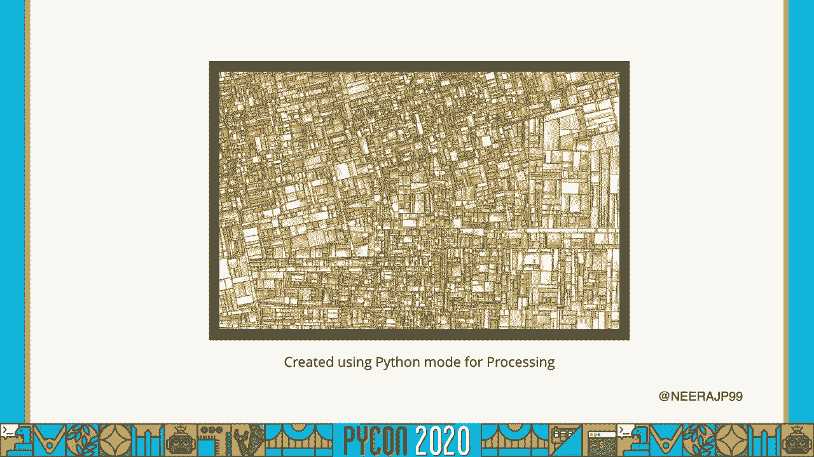

 So let's talk about the history of generative art。

 In analog art which is the art manipulated by hand， complexity and scale requires exponentially。

 more effort in time， computer excels at repeating processes near endlessly without exhaustion。

 As you will see the ease at which computers can generate complex images contributes greatly。

 to the aesthetic of generative art。 One major challenge faced by the early generative artists was the limitation of output devices。

 So the primary source at those time was a plotter， a mechanical device holding a pen whose movement。

 or controlled by the instructions that were programmed in the computer。

 Plotter drawings were typically black and white on paper and as such most of the early works。

 produced was black and white even after the printers became to be used。

 One of the first artists to produce plotter drawings in color was Frid and Neke and whose。

 art piece can be seen here which is known as Homage a plot Paul Cly in 1965。

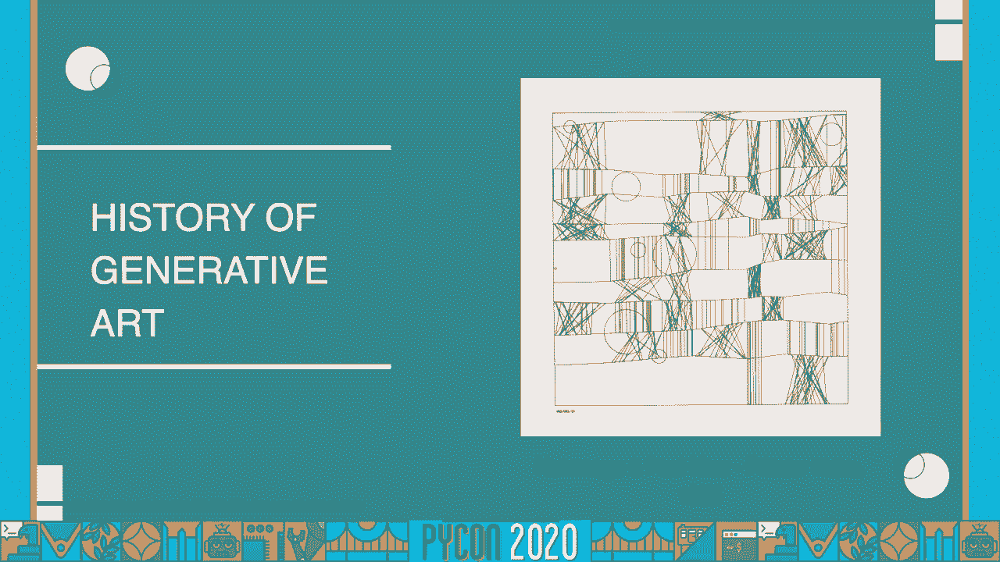

 So this piece of art named Homage is typically based on our painting by Paul Cly entitled。

 High Roads and By Roads。 Frid and Neke took Cly exploration to proportion and relationship between horizontal and vertical。

 lines and ellipses as the backbone of the piece。 He has a lot of randomness on the size。

 scale and the portion of lines and ellipses on a， pen plotter and if he makes a similar decision and puts the commands into the system where。

 they get something similar outputs that you can see on the screen。

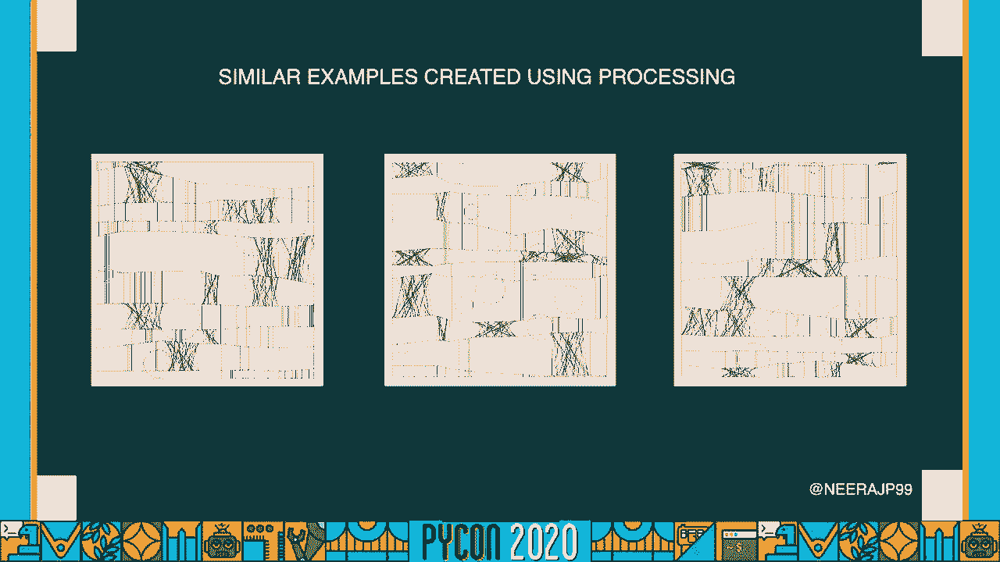

 These are the replicas of Homage created in processing in Python。

 One of the earliest and best known pieces of generative art is Shkotter by George Knees， in 1968。

 Shkotter starts with a standard row of 12 square and gradually increases the magnitude。

 of randomness in both rotation and location of the sequence as we move down to those。

 Magnesium art is one of the best option to create such art pieces because imagine for。

 the second that you draw the image above yourself using a pen and a piece of paper。

 it might take you an hour。 On the other hand providing some simple commands to the computer we can create thousands of。

 such pieces in a couple of minutes and with a unique touch each time。

 These two art pieces are created by Velma Olna who is a French media artist。

 She is one of the women pioneers in the field of generative art。

 The majority of people in those early decades of computing had little to no contact with。

 computers or frame of reference outside of science fiction。

 Against this backdrop a large number of female generative artists emerged in making key contributions。

 to the craft and the community。 This art piece is called Florida and it's created by John Meida in 1990s。

 John Meida is another famous personality in the field of generative art。

 He was the president of the Rhode Island School of Design and Professor at MIT Media Labs。

 He has created a lot of awesome art works and has worked with people like Ben Frey and， Casey Rees。

 And Frey and Rees took Meida's design by number and eventually built their own free platform。

 that could be shared outside of universities and used by anyone with an interest of learning。

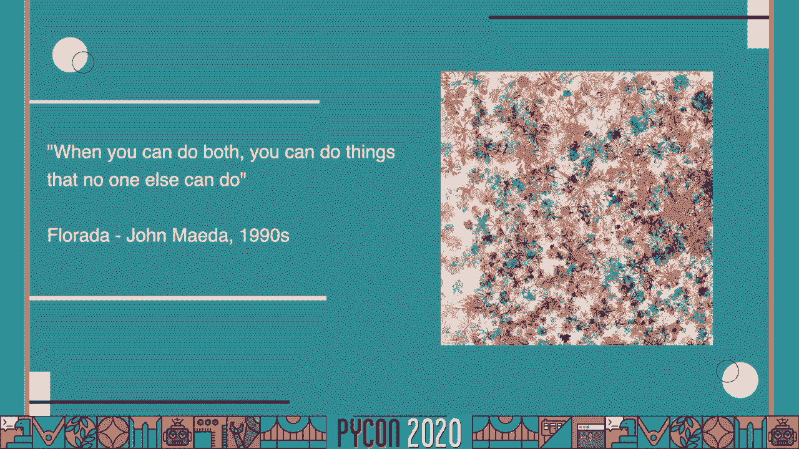

 to sketch with code。 And this turned out to be the birth of processing language。

 Ben Frey and Casey Rees are the founder and have been working on processing over the last。

 19 years and has been the preferred platform for the best known generative artist。

 Processing is basically a programming language and environment built for the media arts communities。

 It is created to teach fundamentals of computer programming within the media arts context and。

 to serve as a software sketchbook。 It's been used by majority of students， artists， designers。

 programmers， architects and a lot， of professionals for production。

 Currently processing is available in Java mode， JavaScript， Python， Raspberry Pi and Android， mode。

 And in this tutorial we'll be seeing a lot of examples using processing and PyCider。

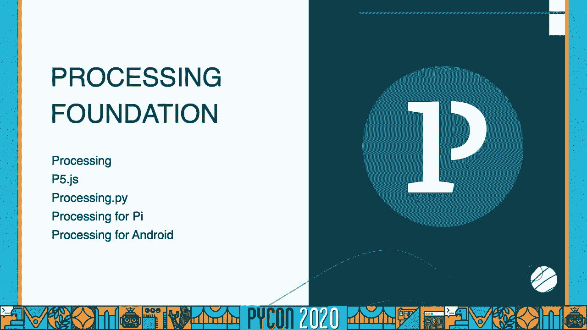

 So let's start by checking out examples that are using mathematics and algorithms。

 We'll see how we can create art pieces using simple mathematical functions like lies， trigonometry。

 we can use randomness， then we'll be using a lot of colors， filter methods and shadows。

 So for any art piece in generative art randomness is a major factor and we need some method。

 that provides us with a floating point number， floating random point number。

 So the random method differs in different programming languages but the main objective。

 is to provide us a random floating point number between zero and one。

 And if we plot various random numbers generated over a period of time and plotted a graph。

 we'll see something similar like this with each random number has no relationship with。

 the previously random regenerated number。 So if you want to generate random numbers in processing。

 we can simply call the function， random and which will be returning the value。

 the floating value between the floating random， value between zero and one which excludes one。

 And we can also provide a minimum and maximum。 So by providing a minimum maximum as a parameter will be getting a value between the minimum。

 and the maximum which excludes a maximum value and simply providing a single value in the。

 random function will be returning a value， random value between zero and one。

 And if you're not using processing， we can simply use a random for module and Python。

 Before we move forward and start exploring art pieces that uses vector operations， shapes。

 and other examples， we need to understand how exactly a canvas looks like when we are。

 working on a generative art piece。 So the canvas it's like a 2D Cartesian plane but each point can be considered as a vector。

 If you're talking about a vector in a 2D Cartesian plane which is the distance between two points。

 as you see on the right hand side we have a Cartesian plane and the point is denoted。

 by x comma y where x comma y stores instructions basically on how to get there from the origin。

 to that point。 We can further use linear algebra operations to perform actions like scaling linear transformations。

 rotations。 Similarly， we can create a line from a point to the other on our canvas。

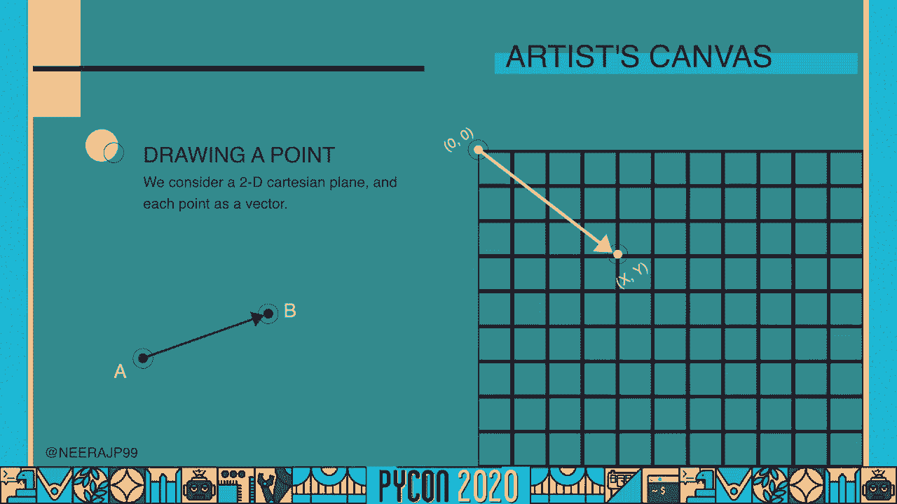

 And if you want to create a point and line in processing it's pretty simple and straightforward。

 We just use the function in build function point providing two parameters x and y which。

 are the x and y coordinates from the origin。 And if you're using a 3D canvas we can provide x， y。

 z coordinates。 And if you want to find a distance between two points we'll be simply using this and providing。

 four parameters x one comma y one which is the coordinates of the first point and x two。

 comma y two which is the coordinates for the second point。

 Similarly we can create a line between those two points by using line and providing the。

 two points coordinates x one comma y one and x two comma y two。

 This will create a line but to show the line on those canvas we need to have a stroke and， a color。

 So we'll be using the stroke function which takes a color parameter and the color can。

 be a hex value or a RGB value and we can also manipulate the width of the thickness of the。

 stroke or the line by using stroke weight and providing a parameter。

 Similarly we can use pie kyrel to draw lines by using context which is basically canvas。

 So context that set_line_width and providing the width of a line which is a thickness and。

 then in pie kyrel it works in this way like we just first tell the canvas to move to this。

 point and from that point we can create a line to the other point。

 So we can simply use move_to to the first point coordinates and from there we can use。

 line and the second point and create a line between them and even in the last we can just。

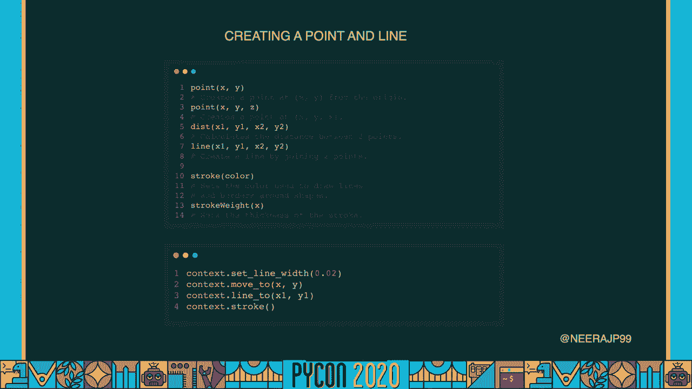

 use context at stroke to create a line in between those two points。

 So these art pieces have been using by simple lines and dots of different thickness and intensity。

 On the left hand side I have placed vertical lines of different lengths and different opacity。

 along with dots at random positions to give it a nice nice background。

 On the right hand side in a single vertical column there are number of small lines which。

 uses a large set of color palettes and have randomly used the colors to fill the stroke。

 Instead of using simple straight lines we can also use vector operations。

 On the left hand side it consists of dots on the horizontal line and the dots move to。

 and fro as if the wind is blowing。 We continue this from top to bottom for the number of times。

 Then instead of adding the points as the variable position we can create a p vector which is。

 an inbuilt function and processing which is a collection of values that describe the relative。

 position in space so we can change its position at any moment of time。

 So we can have other vectors like velocity and acceleration vector as we know velocity。

 depends on acceleration and position depends on velocity。

 A change in these vectors would eventually bring a change in the position vector。

 So by doing these vector operations by changing the value of changing the small value in acceleration。

 and velocity we can create a virtual wind effect and the points move in the direction， of the wind。

 On the right hand side instead of using the above mentioned operations on the which we。

 are using on the left hand side image we can simply use the curve vertex which is an inbuilt。

 function processing that creates a curve between two lines and we can use two points。

 and create a curve。 So curve vertex is an implementation of a catmulls spline algorithm which is a type of。

 interpolating spline that is a curve that basically goes through its point in processing。

 its specifies the vertex coordinates for curves。 So this function can only be used in between big in shape with no more parameters in the。

 end shape。 So these function the big in shape in the end shape basically allows creating complex form。

 on a Cartesian plane。 The second we have busier curves which is a versatile mathematical curve in our vector。

 graphics。 This is similar to what we use in our vector graphics tool like illustrator which are defined。

 by a series of anchor and control points。 If we use the curve vertex and busier curves at a single point or two points over the period。

 of time we can get a similar scribble like effect on the canvas that we can see in the。

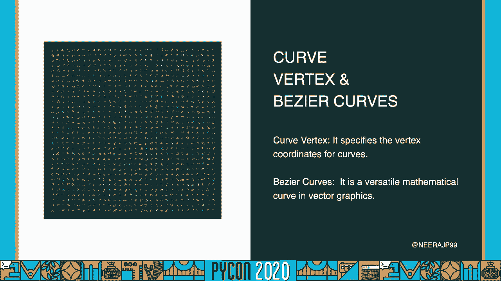

 art piece。 So let's see how we can create some basic shapes and we'll see how we can use this basic shapes。

 to create generative art。 So if you want to create an ellipse we can simply use the ellipse function by providing。

 four parameters A， B， C and D with A and B are the point coordinates on the canvas and C。

 and D are the width and the height and if you want to create a rectangle we can provide。

 eight values on which four are the composite value which are like A and B are the coordinates。

 of the points A， B and C and D are the width and the height and if you want to add radii。

 to the radius for the corners we can either if you want the same radii on all four corners。

 we can simply provide a value say radius radii and if you want different values at different。

 of different radius and each corner we can either provide the value of TL TR BR and BL。

 which is the top left top right bottom right and bottom left and if we want to create a。

 square we can simply use X and Y like we can provide three parameters X， Y are the coordinates。

 of X， Y from where we will start the square and C is the length of the side of a square。

 similarly we can use PyChiral to create shapes that we can see on the bottom。

 Linear interpolation is a very important function when we are working with creative coding or。

 generative art it calculates a distance between two numbers at a specific increment and the。

 amount is the amount to interpolate between the two points say if we want to interpolate。

 between 0 and 1 0 is equal to the first point 0。1 is very near to the first point 0。5 is。

 the half in between it moves on so the LUB function is a inbuilt function processing which。

 is convenient for creating motion along a straight path and for drawing dotted lines and if you。

 don't want to use processing and you don't want to use a inbuilt function you can also。

 create your own function as LUB which will take three parameters start stopping the amount。

 and will return something like start multiplied by 1 minus amount plus n into amount so we。

 can use those simple shapes that we discussed in the previous slides here in these art pieces。

 I'm using simple rectangles with various random width and using a large color palette and。

 randomly using those colors and filling those tangles and eventually we get something like。

 this and as these pieces are using randomly random width so each time you run the program。

 you'll get completely different art pieces you can also get inspiration from the another。

 artist paintings like this on the left hand side as an art piece by b8 Mondrian it's named。

 composition 2 in red blue and yellow and it's just using random shapes like the triangles。

 and squares and lines and on the right hand side I'm use a similar procedure of using。

 shapes like rectangles and squares and created a similar art piece which uses randomly aligned。

 lines rectangles and using a large color palette and filling the rectangles and squares and。

 also using a noisy background using the pulley noise function which we'll see in the next。

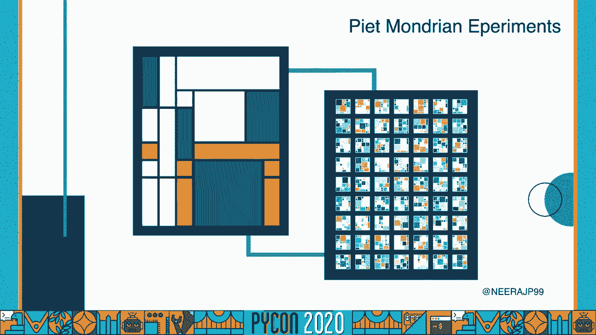

 slide so can Paulin develop the noise function while working on the original drawn movie in。

 the 1980s he used to create procedural text of a computer generated effects unlike a random。

 number generator that generates a random number between two numbers and there's no relationship。

 between the last number produced and show no discernible pattern on the other hand Paulin。

 noise the number generated has a relationship between the last number generated and a small。

 organic in appearance because the numbers which are generated using pulley noise are naturally。

 ordered sequences of pseudo random numbers and if you generate a lot of pulley noise numbers。

 in plot a graph you will see that the graph is more smooth and organic in processing using。

 generating pulley noise are pretty simple you can simply call the noise function which returns。

 the pulley noise value at specified coordinates it can compute 1d 2d and 3d noise depending。

 on the number of coordinates given the resulting value will always be between 0 and 1 and xyz。

 are the number in those coordinates in nice space another function another important function。

 while working with pulley noise is the nice seed so it sets the seed value for the nice。

 function because by default noise function produces different results from each time the。

 program is searched so it sets it to a constant single value and the third important function。

 in processing is the noise detail which takes two parameters the first being the number of。

 octaves to be used by the noise and the second follow factor for each octave basically it。

 adjusts the level of details produced by the pulley noise function like the intensity the。

 fineness or maybe if you want to add a granular effect using those pulley noise we can create。

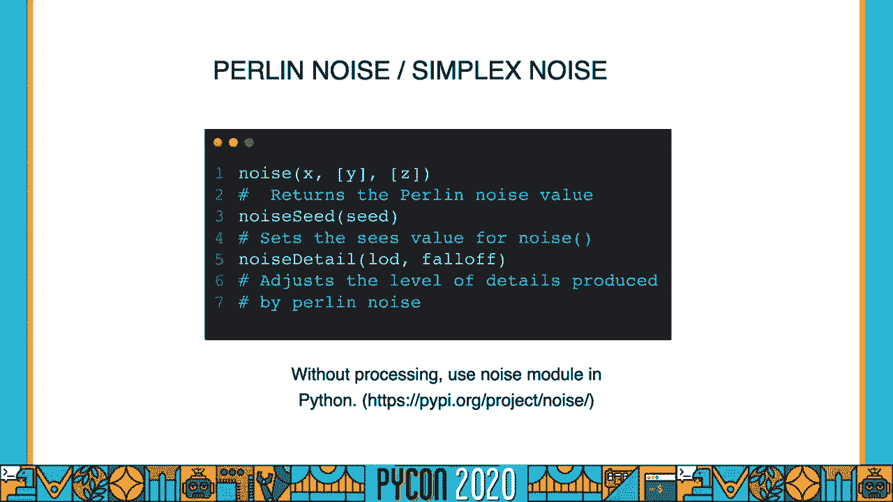

 2d field of vectors with each pointing in a similar but different direction as it is。

 neighboring vectors and have the velocities affected by the vectors that we discussed。

 previously depending on how we draw the particles using animation we can generate some 3d cool。

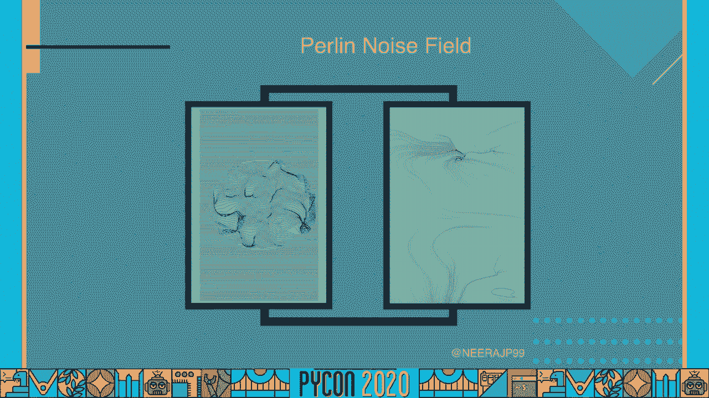

 stuff that we can see here instead of just using pulley noise we can also use pulley。

 instead of just cleaning pulley noise wave we can also create some noisy background or。

 the granular effect using pulley noise as we can see here so in this RPS I have created。

 a noise field and on the front we have a grid with a background and a noise a noisy background。

 basically which is using the pulley noise generated random noise and which is eventually giving。

 a granular effect。 Let's see how geometry factors and chaos and how we can use the geometrical patterns the。

 factors in simple chaos theory to generate aesthetic art pieces on the right hand side。

 it's a geometric pattern which looks pretty complex at first but if you look closely it's。

 just using circles of random radius and with no fail and just stroke over a period of time。

 and up to a length of diameter。 So the very basic and famous example of geometric pattern could be the C L pencil gasket where。

 we are recursively dividing the triangle and creating smaller triangles inside it so which。

 this is basically an equilateral triangle subdivided recursively into smaller equilateral。

 triangle with one because they call it each time。 This example is pretty simple which is not using any kind of fill and just we are just。

 filling the stroke with a black color and we can like do small transformation in the。

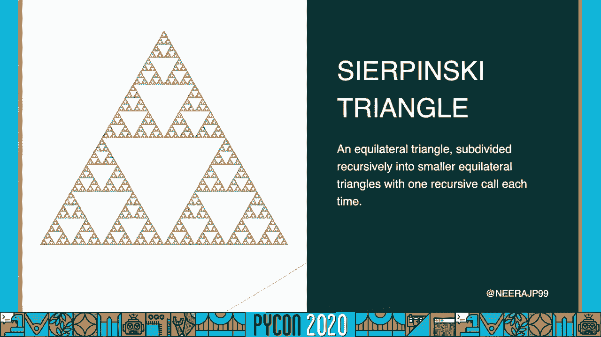

 initial state and we can modify it into something like this where we are not just filling the。

 stroke we are filling the triangle and we are also using random values and the rotating。

 it the location we are rotating the triangles we are changing its location and instead of。

 just using triangle we are using the curl vertex to add some sketchy effect on the outer。

 surface。 This is a example of a fractal which looks like a flower so it's using four different。

 types of fractal and put together at a 360 degree and together it's giving something。

 like this effect which looks like a fractal basically a flower。

 When we talk about fractal mandibot set is one of the most famous one in mandibot fractal。

 or the mandibot set the more you zoom the more similar patterns you see and then that。

 makes fractal so fascinating。 So it is represented on a complex plane where there is a coordinate system and as complex。

 number you can see the equation here like z equals to x plus yi where i is the complex。

 number the xy axis represents the real and the z axis represents the imaginary part so。

 we pick a point in the coordinate plane and pass it to the equation and iterate it to some。

 n number of times and eventually we get the mandibot set we can use different parameters。

 like if we touch infinity we can change the color of the set otherwise it should be black。

 and most of the fractals are similar in nature we can also create a julia set which in some。

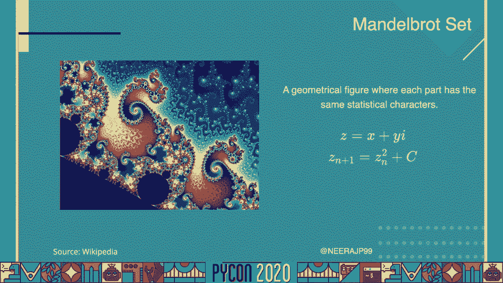

 manner is pretty similar to the mandibot set in using the almost similar mathematical。

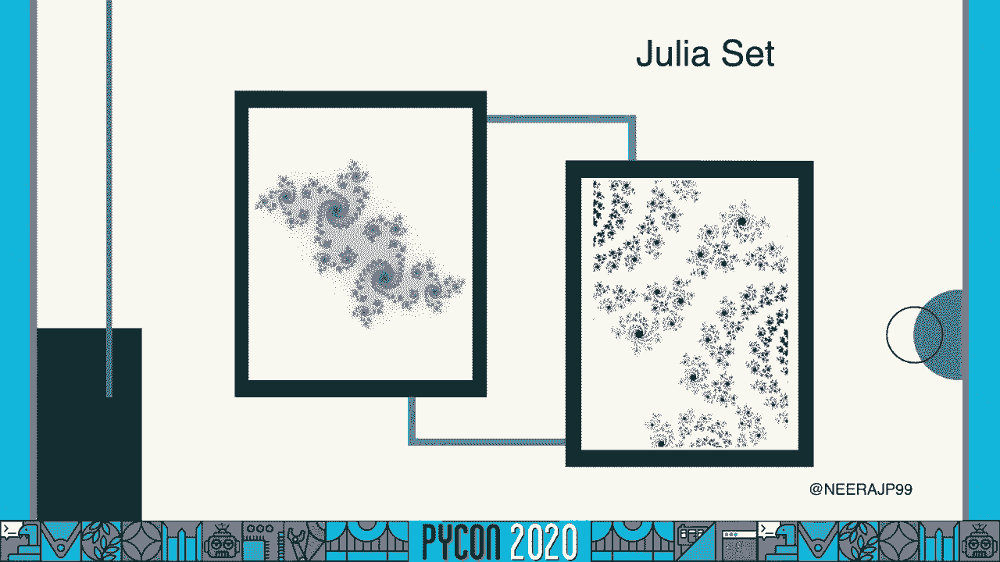

 equation。 If we go deeper into the mandibot set we will see the mandibot set is extending outwards。

 and is creating this bifurcation diagram this logistic map or the bifurcation diagram is。

 basically a part of the mandibot set and this diagram only exists on the real line because。

 we put only real numbers into our equation this method was the first method to generate。

 random numbers or computers and give rise to a very famous topic called chaotic behavior。

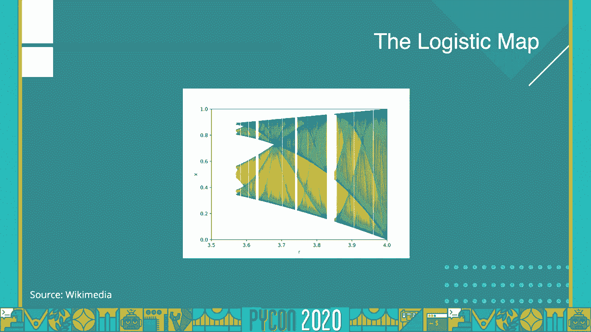

 and to understand this chaotic behavior is pretty simple the chaos theory means like a。

 simple change a very small change in the initial state will result in very large reference in。

 the final outcome see on the right hand side we are creating a fractal on the bottom left。

 we initially created this fractal with some simple parameters and changing the initial。

 parameters has given the outputs which are totally different in shapes and sizes when you。

 are talking about chaos theory attractors are the perfect example these attractors are。

 basically mathematical function that tend to evolve over time and are represented by。

 coordinates in space each coordinate dependent upon the previous coordinate the change between。

 the two coordinates are based upon mathematical equations per dimension on the left hand sides。

 we have a long and attractive in the right hand side we have a d-young attractor again。

 a small change in the initial state will bring a large change in the final outcome so if we。

 change the abcd parameters in the initial state of the d-young attractor the outward will。

 be really different from what we see here let's see how we can simulate paint and how we can。

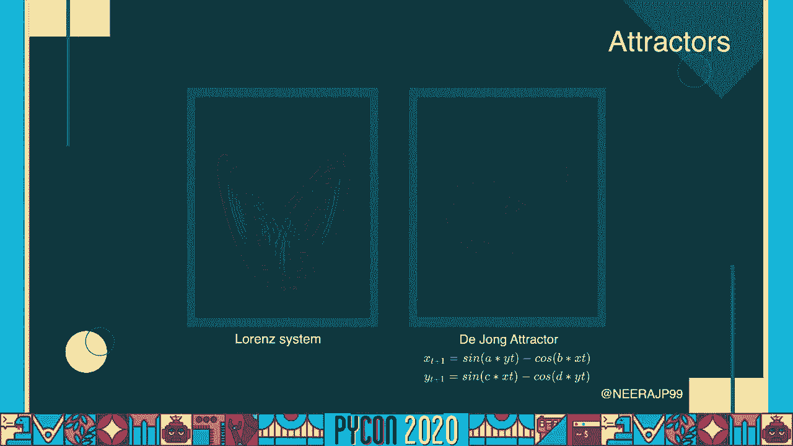

 add some oil paint or the water paint effect on our canvas so to add such effects I've。

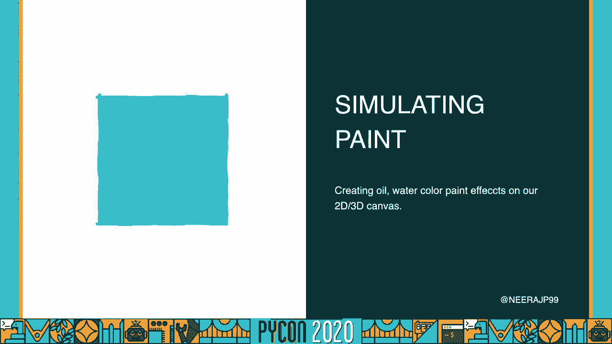

 created three different paintings and to do this I got the inspiration from an artist。

 named Tyler Hock he has a blog post where he has explained in detail how we can use a。

 deformation technique to add such effects I've given the link on the below and to give。

 you an overview of basically created shapes first like a polygon then started extingated。

 edges outwards to do this irclusively by passing it to a deformation function and eventually。

 we get a very fine detail on the outer part which can be seen on the third image you can。

 also add blur effects work with the pixels add overlay effects maybe use pixel sorting。

 that I'm using on the first image and you will get something similar let's talk how pixel。

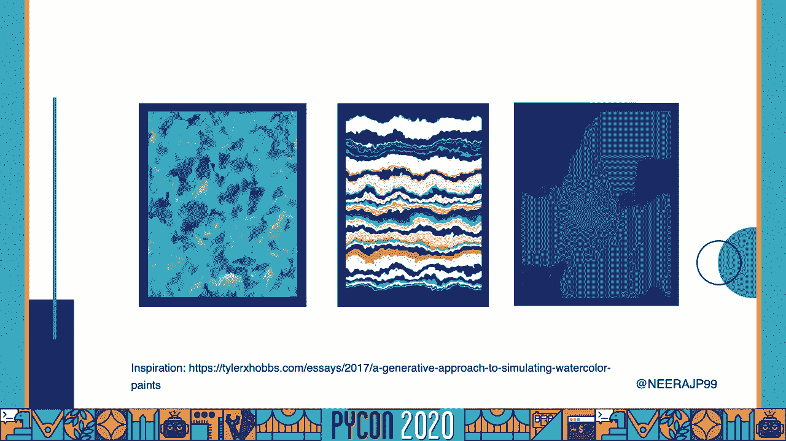

 sorting works so pixel sorting is a famous process of isolating a horizontal or the vertical。

 pixel in any image and sorting the position based on any number of criteria so we take。

 an image we take its pixel we load the pixels within the original pixel position with the。

 excessive function that we create then we pick the next pixel position change the number。

 of signs and you will see a change in the direction then we compare it and swap the pixels according。

 to the brightness so eventually by sorting the pixels we get something similar to these。

 and these are created using in the artworks are created in the past and these are another。

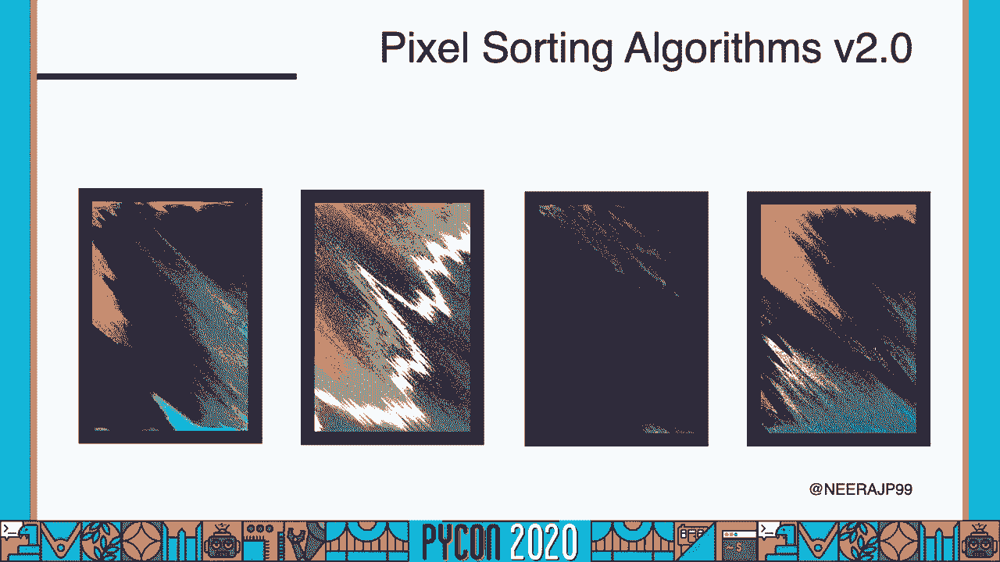

 set of examples just using pixel sorting so now we can talk about genetic algorithms。

 which is a part of evolutionary algorithms so all the specs of a life are driven by computation。

 and algorithms how we learn play work etc given the situation we can see the generative。

 art best reflects our time to reflect this artists have been using a technique cause genetic。

 algorithm to replicate images this is basically an optimization technique that mimics the。

 Darwinian law of natural selection and the survival of the fittest so depending on what。

 type of problem we are working with we can we have to tailor the algorithm accordingly。

 here it's a given example we are initially uh sitting a population with randomly。

 random ellipsis with random colors and over generation and generation it's learning to。

 replicate the original image those are steps includes are they making the initial population。

 then finding the fitness function or by assigning a fitness value for selection doing a crossover。

 between the parents and mutating the genes even unless we just iteratively do this process unless。

 we get the optimized solution here we are finding the optimized pixel value so to know genetic。

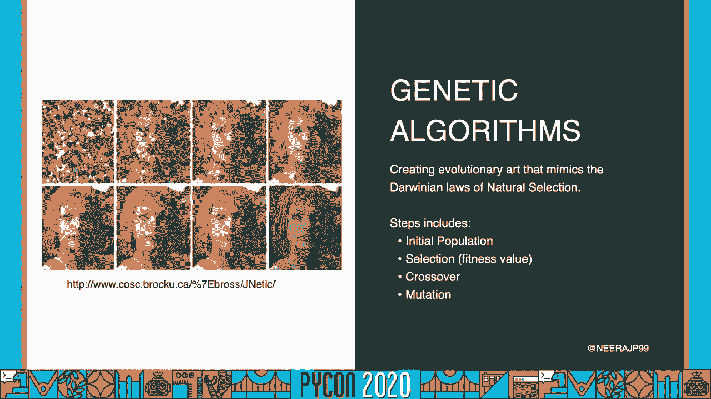

 algorithms in depth we basically start with the initial population so that we can have an initial。

 generation and then we can generate a further generations after that we have a termination condition。

 with checks if the individual is the best optimal solution or not if it is not the best optimal。

 solution for then we proceed it to the mating process as there's a large initial population。

 we can't select all the individuals so we assign them with a fitness value such that the individuals。

 below a specific level would be rejected here we are working with the images so we have to calculate。

 the fitness we have different each pixel color is its pixel value is basically we can use。

 tournament selection method for this once we have outfit parents we do a crossover and once we have。

 a new generation we can also check for some mutation by altering the genes of the newly created off。

 springs this way we get the best optimal solution over some Xn number of generations and in our case。

 the initial set of shapes say polygon can replicate the original image here is an example that I've。

 created using pi game processing and python which is replicating the image on the left hand side。

 and it's using genetic algorithms and the program was done for 500 generations and if you have done。

 the program for more than that you will get a more concise and proper image which looks exactly like。

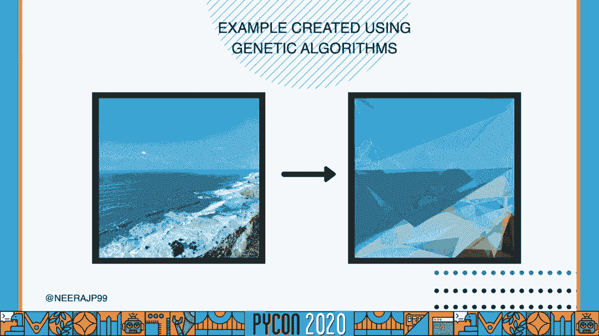

 the left one so these days artists are also using GANS which is generative adversarial networks。

 to create new forms of art to mix different arts and create new one artists like Anna Riddle。

 Helena Serene， Robbie Bellert whose art piece can be seen on the slide which is called AI fashion。

 and they're using GANS to create new art forms these days it uses two neural networks which are。

 designed to think like a human being the first being generator generator that generate pictures。

 of abstract paintings it looks at a large number of datasets of training data and tries to produce。

 something that resembles a data but taking into account that the discriminator cannot tell it。

 if it was produced by another network and second is the discriminator and discriminator is something。

 that cannot tell the difference between the real and the fake abstract paintings。

 of very simple and very concise example can be we take two pieces of art say one is a painting of。

 horse and the second is the painting of zebra and we try to swap the faces and of each。

 of the animal in the painting and create a new piece with a swab faces。

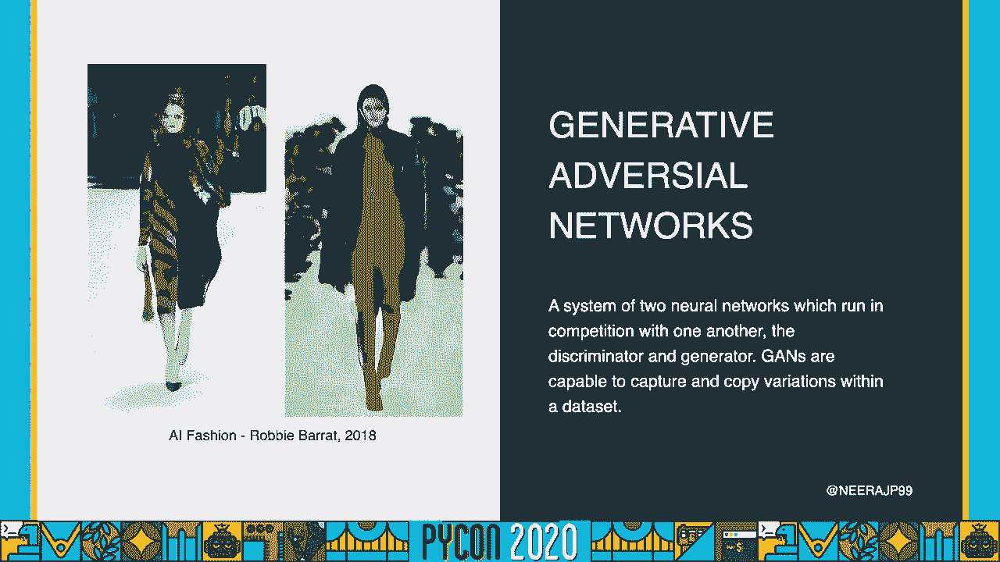

 and yeah this is it thank you so much for watching the talk yeah。

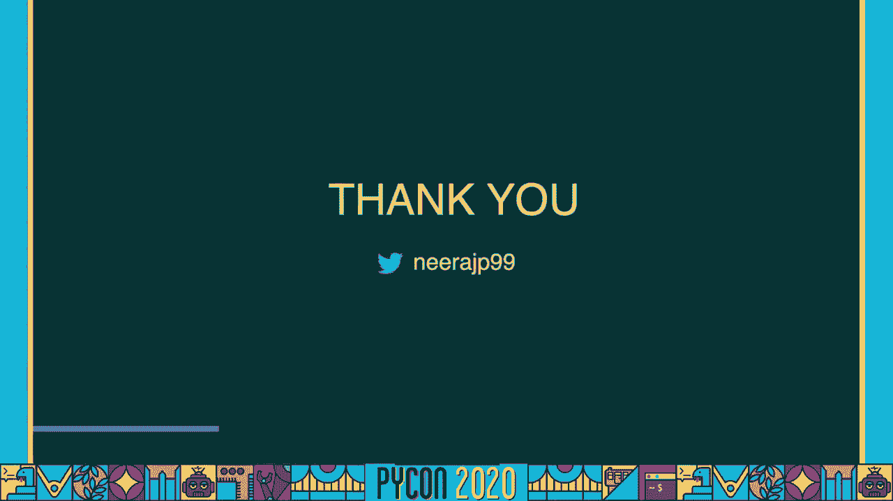

 you， [ Silence ]。

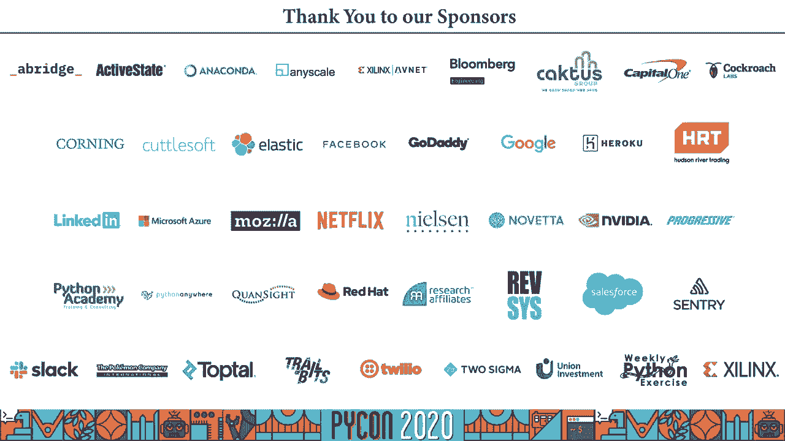