# P80：Tutorial Katie McLaughlin - Deploying Django on Serverless Infrastructure - 程序员百科书 - BV1rW4y1v7YG

大家好，欢迎在无服务器基础设施上部署django，蟒蛇二十二十教程，我是凯蒂，今天我是你们的导师，今天的教程将介绍，使用无服务器基础设施部署 django应用程序。

今天的教程将使用 google cloud 并部署一个示例，Django应用程序，你可以跟着去，使用glasson dot。com上列出的教程，斜杠蟒蛇二十连字符教程，然后。

我们将运行手动部署项目所需的步骤，服务机密和安全需求来部署我们的 django应用程序，已经手动完成了我们的部署，然后，我们将使用基于源的部署来自动化该部署，然后，我们将创建一个全新的项目。

并将我们的准备和部署步骤自动化，使用地形，您可以在glasson dot。com上跟随本教程。

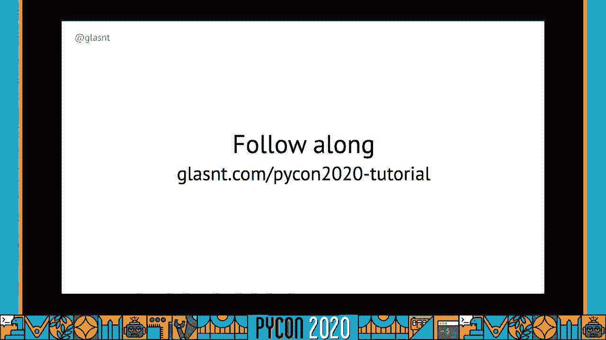

斜杠蟒蛇二十连字符教程，在我们开始之前，我们将在本地尝试应用程序，只是看看这是怎么回事，我准备了一份申请，你可以从 github下载 zip文件，所以我们要下载这个 django演示应用程序的一个版本。

Unicodex，那是，今天将是我们的演示应用，我们拿到了拉链文件，这样我们就可以把它取出来 放进我们的文件夹里，这看起来就像一个基本的 django应用程序，但我得到的是。

我还有一个码头工人的作曲文件，这将帮助我们连接我们的数据库，它将是 Postgres和我们的网络容器，我们在这里定义数据库 url密匙 用户名和密码，我们在本地使用一个 django运行服务器。

所以我现在能做的就是，我可以让码头工人帮我们整理一下数据库，这将允许我们的数据库在哪里运行，然后我们可以应用基本的 django迁移命令，这将为我们填充我们的数据库，所以我们有了基本的行政评估。

但我们也有一些 Unicodex需要的东西，然后我们可以将一些样本数据加载到数据库中，这将会加载一些我们有的固定装置，然后我们可以启动我们的网络服务器，接下来是我们的演示。

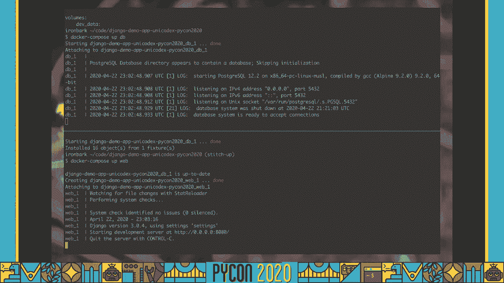

我们有独角兽，我们有一张非常快乐的波浪脸，现在这个没有任何数据，但我们要做的是，我们的 django应用程序的存在是显示不同版本的表情符号，因为它们出现在我们系统的不同部分。

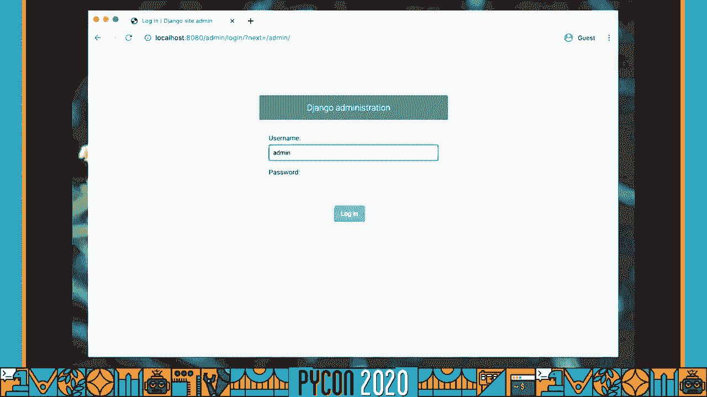

所以我们要做的就是找到我们的密码，从之前的副本弹出 回到我们的窗口 并登录到我们的管理。

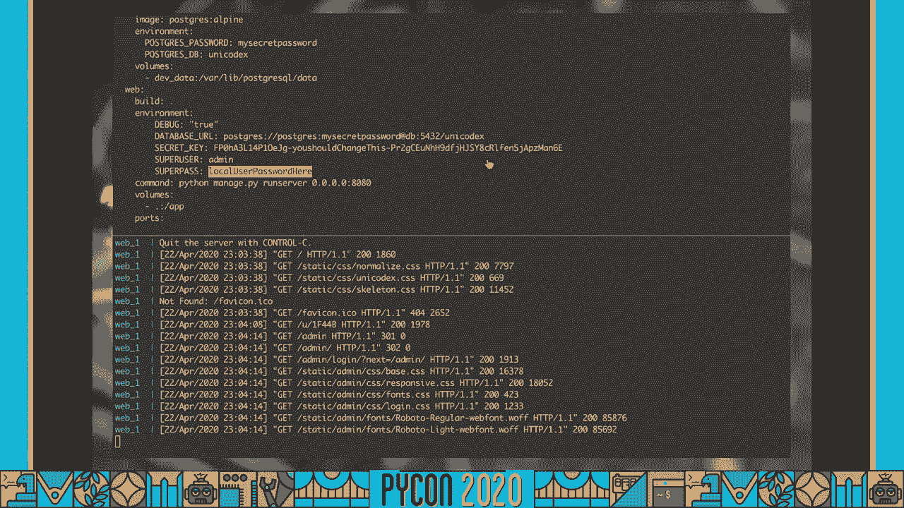

我们会有我们的 unicodex应用程序，一大堆模特，代码点，实际的 unicode解码点，对于多个不同的供应商和这些供应商的版本，我们会有设计图像，所以我们有我们的代码点，它在高高挥舞。

我们也有一个管理行动，在那里我们可以为我们的供应商生成设计，这个要做什么，它会出现在表情符号上，org，它会把这一页的副本拉下来，挥动的手，它会复制所有这些图像，它将充斥我们版本的表情符号。

所以生成图像，这是要去做一个基本的管理行动，它会把那一页的副本，找出我们想要的供应商版本有什么图像，它现在被导入了所有这些供应商版本，如果我们回到我们的网站，我们现在有了挥舞的手的样子，谷歌安卓四点三。

谷歌安卓四点四，还有亚达，亚达，我们得到的是，我们有任务在身，我们有媒体图像，我们有行政行动，我们的管理有用武之地，我们有一个足够复杂的django应用程序，我们现在可以开始。

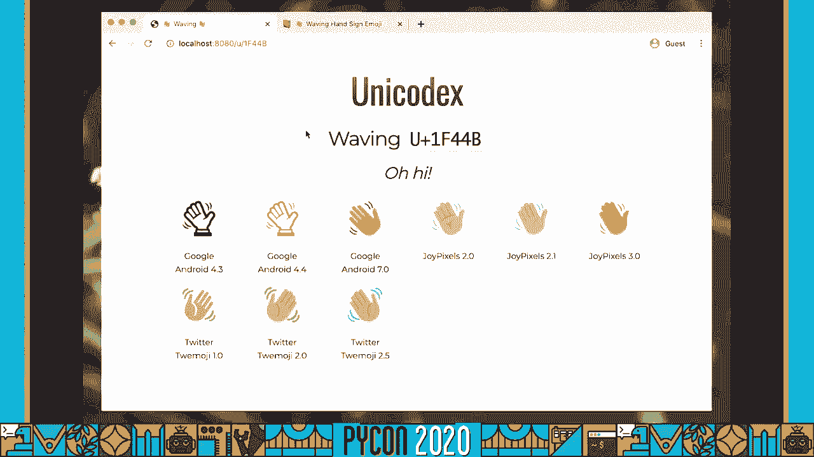

如何在生产中部署它，因为我们得到的是，我们需要一个条款，我们的服务器在某个地方，我们需要一个条款，在某个地方，我们必须对所有这些媒体资产做些什么，然后我们还得对这些秘密做些什么。

因为我有一个纯文本的密码 可能不是最好的主意，在这里说本地用户密码，本教程的其余部分，如何手动部署此应用程序，然后在本节中如何自动化部署。

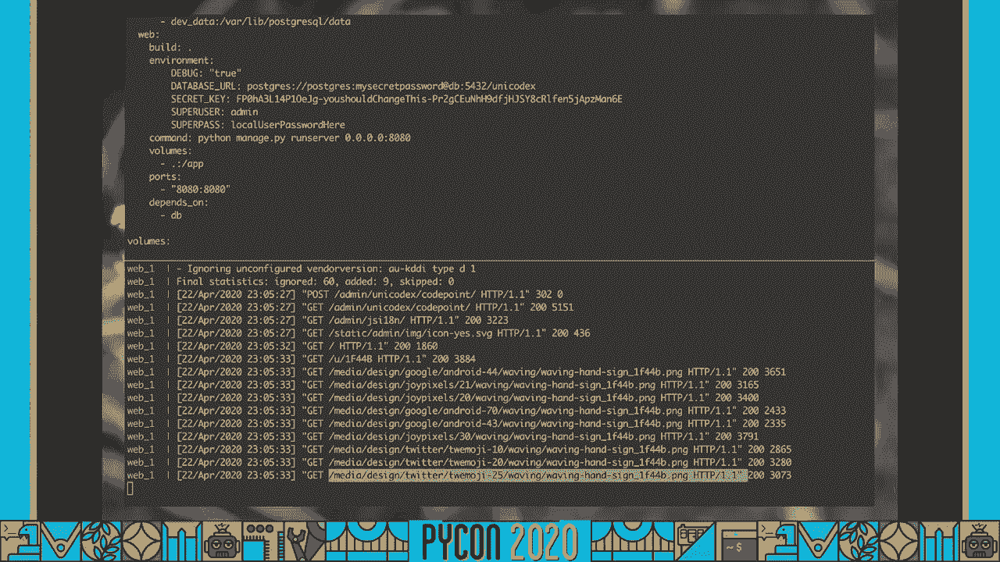

我们将手动将我们的应用程序部署到谷歌云平台上，我已经建立了一个项目，我叫它glapyon二十二十，这将是我的项目编号，你的项目会有所不同，我们要做的是。

我们将部署一个 cloud sql Postgres实例，我们要创建一个存储媒体桶，我们要做一些安全方面的事情，然后我们将部署我们的应用程序，而不是走在用户界面，这可能会随着时间的推移而改变。

复制粘贴东西有点困难，我们要去，相反，使用谷歌云外壳，这将给我们一个互动终端，在那里我们可以运行 g云命令。

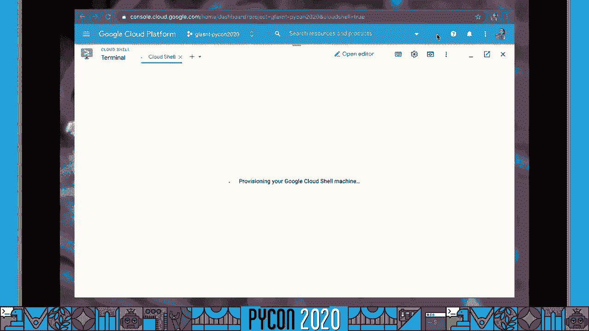

将军命令，所有其他命令，我们需要在特定的环境中运行，它已经为我们准备好了所有的工具，我参与了一个特别的项目，我需要确保我有一个项目的副本，我可以在我的项目中使用的身份证，这将使我们很容易复制和粘贴。

我已经为您设置的所有 shell命令，我们还需要把我们的地区，我要利用我们，你可以选择欧洲，北一区，亚洲，这将是一个地区，它支持我们今天所拥有的所有不同方面，莱顿还不是每个地区都有的，截至录制时。

所以确保你选择了一个适合你的，我们今天还会用到很多不同的应用程序接口，我能做的是。

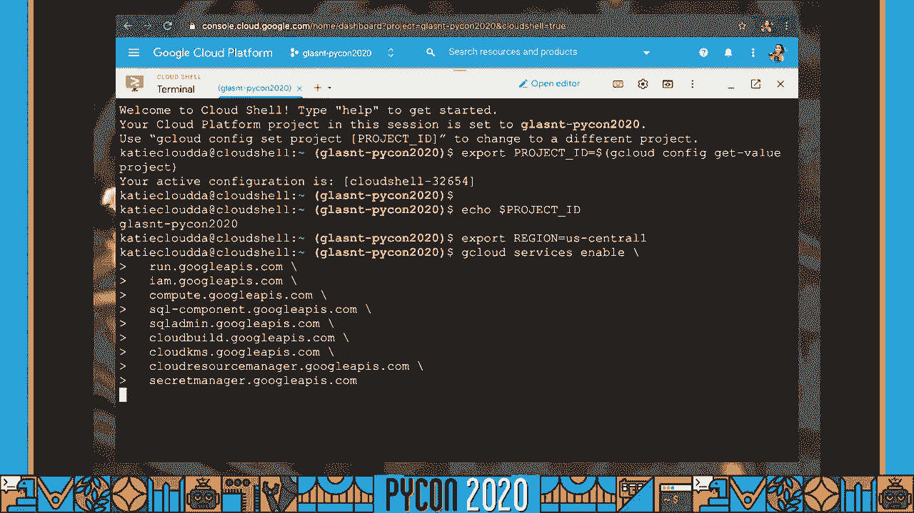

我现在可以花时间启用这些服务，你最终可能会得到一个错误，未启用计费，您需要为本教程的工作启用计费功能，因为我们现在要部署的东西需要花钱，谷歌云上的新用户确实获得了许多免费的试用学分，所以。

你今天应该可以部署我们的所有方面，而不必真正充电，如果你得到这个先决条件 错误，你可以做的是 你可以导航到一些花钱说的话，Cloud SQL，这将迫使谷歌云平台为你设置账单。

然后您可以选择您想要的账单账户，一旦启用计费，我最终会出现在一个屏幕上，在那里我可以创建实例。

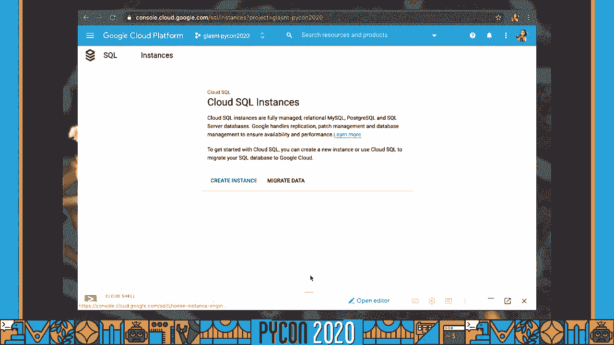

但是我们要用我们的外壳，这个命令需要几分钟才能完成，一旦我们启用了所有的人工智能，我们可以开始创建一些我们的支持服务，开始，我们需要创建一个服务帐户，这个服务帐户将是一个特定的身份，它将运行我们的服务。

这将允许我们限制服务帐户可以运行的活动，而不是像我们自己一样奔跑，我们在谷歌云平台上有很多权利，我可以创建数据库，我们可能不希望我们的自动化软件运行数据库，反正还没有。

这项特殊服务的身份将是我们项目中的 Unicodex论文，身份证，我是网上服务的，即使用语言表达也很复杂，所以，我们将把它保存为一个环境变量，后来，我们的服务帐户将扮演的角色。

是让我们在云运行中扮演管理员的角色，这个角色将允许我们作为一个云 SQL客户端运行，这将使我们的服务帐户能够以云运行的方式运行，同时连接到我们的数据库，我们还想启用我们的云构建服务帐户 这些相同的权限。

我们的云构建服务帐户将已经存在，它将被谷歌云构建 g服务帐户上的项目编号所识别，为了便于识别，我们将把它存储为另一个环境变量，该服务帐户也将获得云运行管理，它还将获得云 SQL客户端。

这将允许云构建运行我们的数据库迁移，同时重新部署我们的服务，终于，我们需要确保我们的云构建服务帐户能够运行，作为我们的云运行服务账户，现在我们已经建立了所有这些服务帐户。

我们可以开始创建我们的其他支持服务，我们需要为我们的数据库创建一个 Postgres数据库，我们需要一个非常安全的根密码，我要做的是使用开发视图随机，随机生成一个长度，64个密码将其存储为环境变量。

从不输出到屏幕上，我个人永远不会知道这个密码是什么，可能是个好主意，所以如果我不知道，没有人知道。

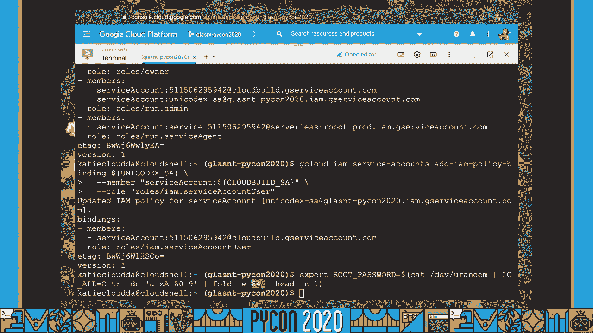

然后我将创建一个 g cloud sql实例，我准备叫它 psql，这将是一个非常小的例子，因为我不需要更大的为我今天的特殊应用，它将运行 Postgres 11，它将在我的地区。

用我之前准备好的项目 ID和密码，这将提供一个 clad sql实例，这需要一些时间，但这个非常好的小动画将继续运行，直到我们完成，既然我们的 sql实例已经存在，我们可以在这个实例中创建一个数据库。

和，我要确保我指定这个数据库，在我们的数据库中创建，现在数据库已经创建，我可以创建一个用户再次访问那个数据库，我就会随机利用你，这一次，一个更小的密码不需要那么大，但我会把它作为一个环境变量来存储。

我永远不会把这个输出到那个存储环境变量的屏幕上，我将创建一个 SQL用户，我把它叫做 Unicodex用户，使用我针对 psql实例创建的密码，现在我有了所有的数据库实例和密码，以及用户和密码。

然后我可以创建一个数据库 url字符串，这是我们的数据库连接字符串，这将指定我们要连接到 Postgres，作为我们的用户名和我们在云上的密码，SQL实例，这将是唯一的标识 与我们的项目 id。

我们的地区和我们的名字，然后它会连接到他们的数据库，这真的是秘密，我们不希望任何人看到秘密，所以稍后我们会把它作为一个秘密，我们已经建立了数据库，我们现在需要考虑将我们的媒体存储在哪里。

我们将使用姜戈仓库和姜戈仓库，支持谷歌云存储，所以我们需要创建一个谷歌云存储桶，我们将把它作为我们的项目，id连字符媒体 gu til是一个命令，很像 g云，但这是专门针对存储桶的，所以我们要做一个桶。

在我们地区制造水桶，我们要用我们的桶名，我们现在有一个桶，我们还需要允许我们的服务账户，我们创建了更早的访问，以便能够写到那个桶，我们将运行一个 iam更改命令，我们的服务账户，存储对象的角色，行政。

在我们的媒体桶里，如果没有这个，我们的行政行动将会失败，因为我们的服务帐户没有权利。

因为我们创造的所有秘密，我们现在将使用谷歌秘密管理器存储这些，我们需要为我们的数据库建立一个秘密，URL，我们将用环境变量的值填充它，我特意选择了把我们的名字保密 在所有的帽子里。

这将允许我引用环境变量，就像我在任何地方一样，无需做任何事情 比如使用大写或小写或更改名称，可能看起来有点傻，但这将有助于我们以后的部署，我们创造的另一个秘密是我们的桶名，我没必要把这当成秘密。

但它将允许我们的申请是12个因素，这意味着我可以在任何我想要的环境中部署它，只要我替换所有的环境变量，没有关于这项服务在哪里或什么的信息，或者它被部署的地方存储在应用程序本身中，都是由环境变量定义的。

秘钥将是一个独特的字符串，加密和工作机制，它至少要有50个长度，我将随机创造，秘密可以有多个版本，这让我可以，这意味着如果我需要重置或更改我的数据库 url，因为我更改了数据库密码或私钥。

因为我想把我的秘密，我仍然可以提到秘密，但我可以在代码中引用最新版本，然后我可以随时更新这个秘密，所有这些秘密现在都存在，但没有人能真正访问它们，我需要明确地让我们的两个服务帐户访问，才能读懂这些秘密。

我会做什么，对这些秘密中的每个秘密授予秘密访问器角色，所以 unicodex服务帐户需要访问我们的数据库 url，所以它可以连接到我们的数据库，我们的云构建服务账户也是，我们的。

它将同时获得服务帐户和云构建服务帐户的访问或权利，我们的秘密钥匙，这将允许云构建和云运行访问，到，快跑，我们的 django应用程序，就像我们之前看到的，当我们用码头工人作曲时。

我们定义了一个超级用户和超级通行证，这些值用于自动为我们创建超级用户的数据迁移，云跑的局限性之一，你不能进入正在运行的服务，运行 django管理命令，你不能创造超级用户。

所以我们要使用数据迁移来自动创建它，对我们来说是一种迁移，我们需要为我们的用户名和密码存储秘密，为了这些秘密，它们只能通过云构建来访问，这意味着云运行，我们的服务。

无法看到我们的 django管理用户名和密码，这真是个好主意，我们的应用程序不应该知道要自己登录的信息，所以我要创建一个超级用户叫做管理员，我要创造一个秘密，我要把这个秘密再次储存起来。

管理本身并不太秘密，但是确保所有这些值都存储为环境变量 意味着，我可以继续我的十二分法，我还要创建一个超级用户密码，这又是一个新的随机链接，三十，并存储为密码，这两个秘密都只能通过云构建来访问。

一旦完成，我们现在已经建立了所有的机制，能够进行我们的第一次部署，我们已经建立了数据库，我们创造了我们的存储桶，我们创造了秘密，我们还设置了服务帐户和这些服务帐户的权限，我们现在已经准备好了一切。

可以创建我们的云运行服务，当我们在本地工作并使用 docker compose来部署我们的应用程序时，我们下载了我们的申请代码，因为我们在"云壳"工作，我们目前没有这个代码的副本。

我们可以运行与之前相同的命令，我们可以从 Github下载 zip文件夹，我们可以把它取出来，然后我们就可以进入那个目录，这将是我们之前得到的完全相同的代码，我们可以开始创建我们的云运行服务。

但在我们创建我们的服务之前，我们需要建立我们的网络容器，因为我们已经用实际的数据库替换了数据库容器，我们现在只需要构建我们的网络容器来做到这一点，我们将使用云构建。

这个服务允许我们为这个特定的命令构建东西，我们将运行的只是我们形象的构建，它将使用我们的码头工人文件 创建我们的网络图像，现在我们创造了我们的形象，它将被存储为 gcr，IO删减我们的项目 ID。

我们的名字，我们现在可以使用该映像来部署我们的云运行服务。

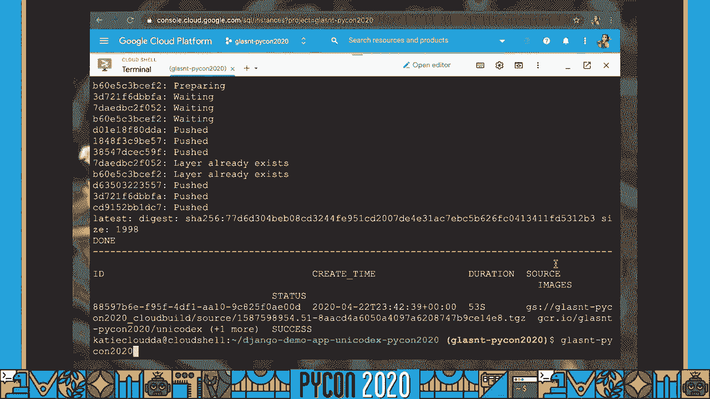

我们的云运行服务将是，它将被称为 Unicodex，它将托管在托管平台上，这是完全被管理的谷歌云，它将在我们的区域内，我们将允许未经认证的访问，这将是，互联网上的任何人都可以进入我们的网站。

看到我们的东西，我们要指定的图像是我们之前准备的图像，我们的 sql实例将是我们之前准备的，我们的服务账户将是我们之前准备的，我们现在有一个部署的服务，可以在这个网址上访问，然而。

这个 url不能工作有两个原因，我们实际上还没有做任何数据库迁移，二，我们将允许的主机指定为一个值，我们将指定为当前的主机，这将确保我们的 django应用程序只运行，我们知道它会在哪里运行。

我们不知道这个网址是什么，直到我们第一次部署我们的服务，所以我们要做的是，我们将为我们刚刚创建的服务存储一个网址的副本，作为一个名为 service url的环境变量，然后。

我们将使用update和vaset参数重新部署服务器，将当前主机设置为服务 url，我们刚回来，这将重新部署我们的服务设置，环境变量，让我们能够用姜戈语加载网站，我们的服务已经重新部署，但它还不会运行。

因为我们还没有运行数据库迁移来做到这一点，我们将再次运行云构建，但不是指定一个标记，我们将指定这个配置，这个配置文件将构建，迁移，部署我们的应用程序，这就是为什么我们之前设置了所有的配置。

这将允许云构建，连接到我们数据库的能力，运行数据库迁移，收集静电，充斥着我们的媒体桶，它还会重新部署我们的应用程序，一旦这些都完成了，现在我们的云构建过程已经完成，我们现在有能力为我们服务。

我们的服务在云端运行，我们之前看到的是我们的独角兽，因为这是一个新的部署，我们目前没有任何图像，我们可以遵循我们以前所做的相同的过程，通过使用 django admin登录并运行我们的 admin命令。

我们知道我们的管理用户名将是管理，但是我们的密码是什么，好吧，那是个秘密，所以我要做的是，我要执行一项命令，这就给了我价值，我们超级密码的最新值，我不会告诉你密码是什么，我的密码在我的拷贝缓冲器里。

所以我可以把它贴在，现在我有了我的手鼓管理员，我就能进入代码点，就像我之前做的那样，我可以选择我的代码点 并为它生成图像，然后我就可以加载我的网站，我现在有了和之前完全一样的功能。

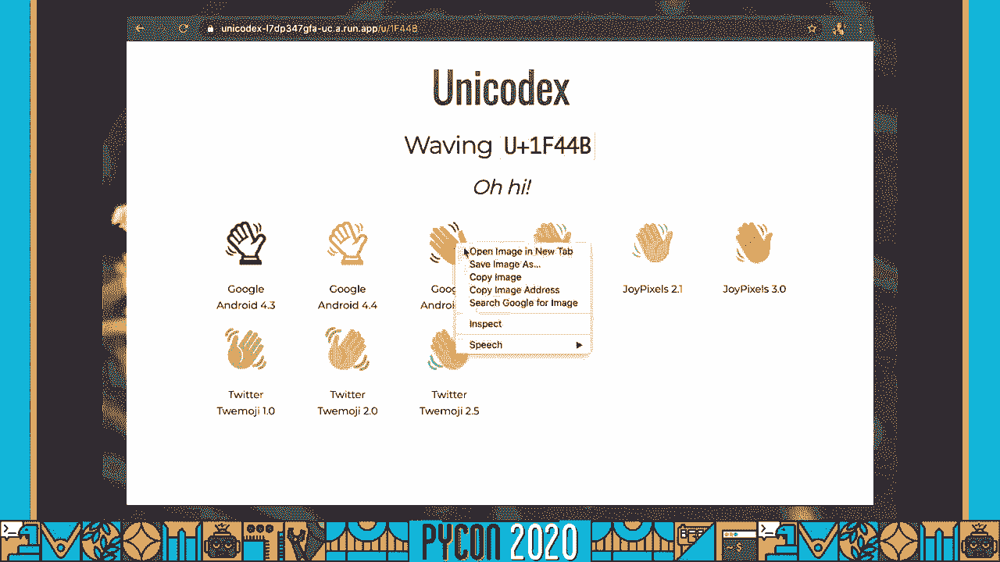

所有这些，图片将通过谷歌 api url存储和访问，为了我特别的媒体桶，与我们之前使用的网址完全相同，这一切都是天衣无缝地为我做的，使用大江戈仓库。

我也可以花时间在这里创建一个新的代码点，加一个代码点，我就叫它蛇，这将是蟒蛇20，代码点会来自蛇，你一直走到底部，它将会是这个代码点，我们要把它留到我们新进的唱片里，为它生成图像。

现在如果我重新加载我的网站，我现在有一条蛇和所有不同的蛇，我们已经成功地手动将我们的应用程序部署到云运行中。

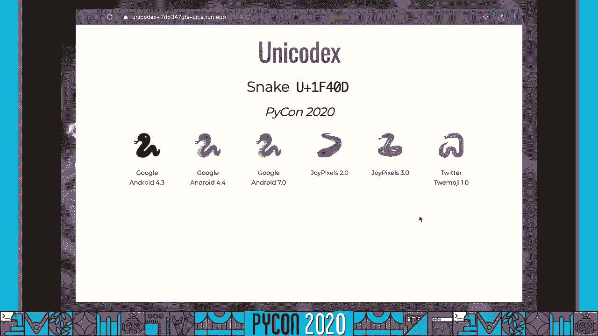

让我们花一点时间更仔细地看看迁移脚本，我们用这个文件，我们的构建迁移部署，这是一个标准的云构建清单，我们通常在云构建中扩展，你发现的旅客名单，有一个运行码头工人构建的构建步骤，然后将图像推送到存储库。

然后部署应用程序，我们在这里增加了一个迁移步骤，Engine Exec Wrapper是一个已经存在的云构建器，它允许我们指定一个 cloud sql实例，它会自动为我们在云中设置一个云 SQL代理。

我们的 django迁移脚本，我们将有许多步骤需要访问数据库，在我们的云迁移 云 django迁移脚本中，我们要运行蟒蛇，管理，迁移，Python，托管圆点圆周率，负载数据，样本数据。

和collect static命令，它们要求访问数据库，我们的djano设置文件有一组设置，我们明确地从这些设置中提取，秘密，帮助者，我们在奔跑，我们的设置文件。

然后用 django和 environ把它们装载到我们的环境中，这允许我们只要我们可以访问秘密经理和访问我们的数据库，它允许我们运行姜戈，无论我们想去哪里 我们运行的两个环境。

Django在云构建和云运行中，所以我们才要花那么多时间，埃利奥特将建立明确的服务账户，具有确切的权限，以便能够作为SQL客户机实体运行，并运行作为云运行管理，所有。

这个配置和设置允许我们能够部署一个 django应用程序，使用所需的最小权限集才能做到这一点，我们成功地，手动提供并手动将我们的应用程序部署到谷歌云中，当我们想进一步开发我们的应用程序时。

我们可以做几个步骤，我们完全可以在云壳里工作，使用本地 zip文件，去换衣服，一些模板，所有这些东西，或者我们可以在源代码管理库中工作，我们可以使用云构建触发器自动化部署。

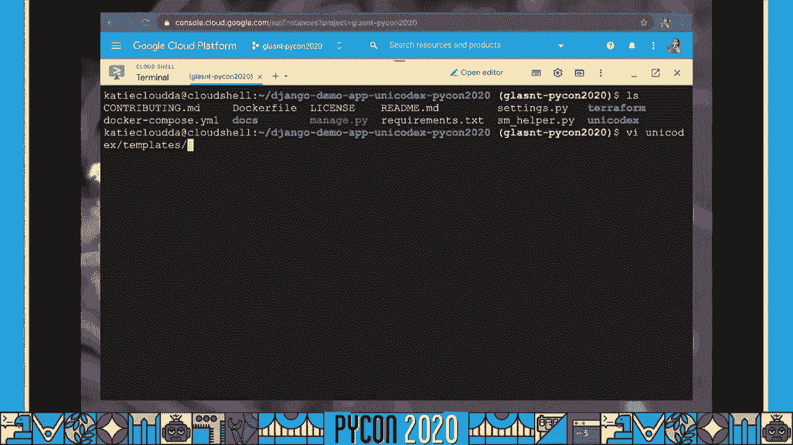

什么，我们能做的就是，我们可以进入云计算，我们可以连接我们的仓库，我们可以制造一个随时可以发射的触发器，说我们推师父，这个步骤要求我们有一个源代码控制存储库，我们一直使用的演示复制是谷歌云平台。

Django演示应用程序，Unicodex，到目前为止 我们一直在用这个下载的文件，为了蟒蛇，两千二，从这里发布这个演示应用程序，以便能够继续本教程，你得把这个仓库。

你可以登录到 github 然后点击 fork，这是我创造的叉子 我要做的是，我要制造一个触发器，在那里我将有一个云构建配置火 任何时候，我在我的存储库上推动大师来做到这一点，我需要连接我的仓库。

单击 Github并连接到我的源代码库，在这下面我将选择 django演示应用程序，Unicodex，确认，点击连接，我将跳过这个特定部分的自动创建，是的，我肯定我想跳过我的目的。

我不想部署我的应用程序，每当我推推杆杆时，我想要一个只开火的部署，在我和师父合并之后，这允许我像往常一样让拉请求工作，但我的部署只能重新部署，每当我合并一个拉取请求，我可以在这里添加一个触发器。

然后输入所有这些字段。

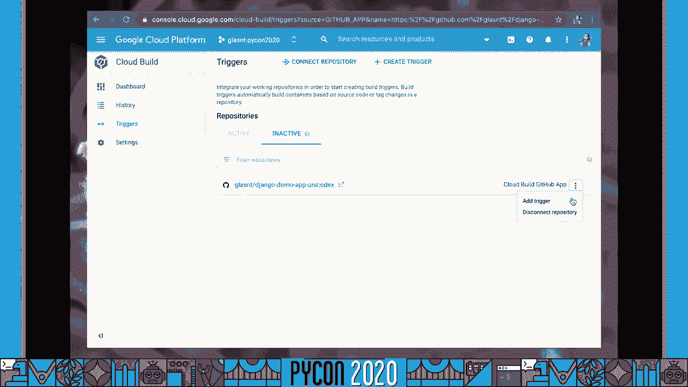

但相反，我要回到我的壳里，我将使用"云"命令，在我的 github repo上创建一个触发器，这将是我的回购，在我的用户下，你必须在这里改名，你不讨人喜欢，任何时候我都推给主人。

我将运行与之前完全相同的云构建，有相同的变量，一旦触发，创造了，我可以完成向我的主分支提交代码的过程，我的应用程序会自动部署。

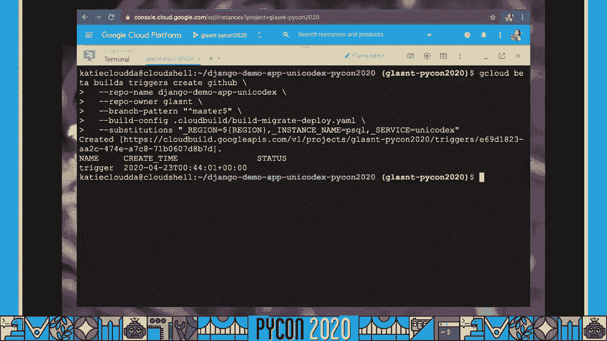

现在我有我的叉子设置和我的扳机设置，我可以创建我的存储库的克隆，进入那个源头控制，然后我可以做一些改变，我想要做的更改需要在我们部署的应用程序中显而易见。

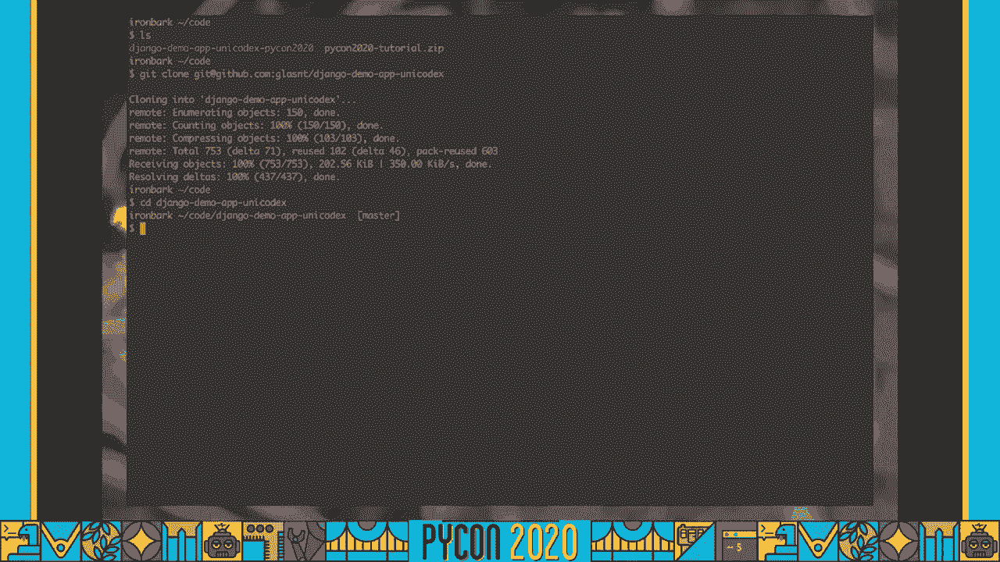

我们有一个紫色的标题，上面有一大堆图标，我能做的是，我可以对我的模板做一个明显的改变。

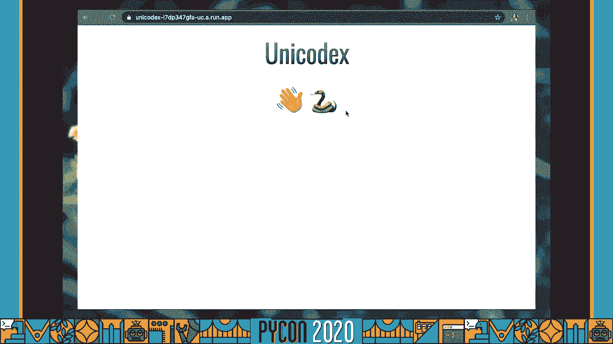

所以我们可以看到这个已经被重新部署在我的源代码控制中，我可以进入 Unicodex模板，我可以改变，然后我也可以进去改变我的静态，把我的颜色渐变换成别的颜色，而不是这个颜色，我要用白色来测试这个。

我可以使用 dockker composition在本地重新部署它，但我会用我的触发装置，相反，我要采取这种差异，我要把它作为一个模板的改变，然后我会把它推给主人。

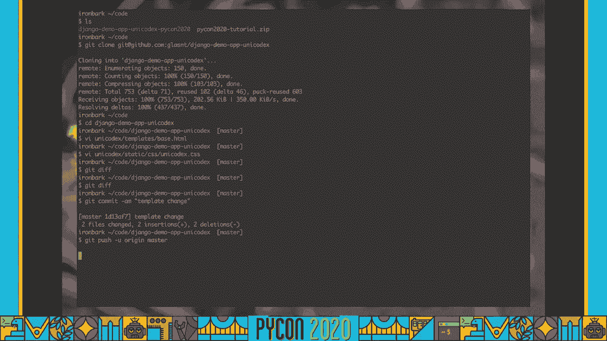

现在我已经把它推给了大师，吉瑟布的扳机会自动发射。

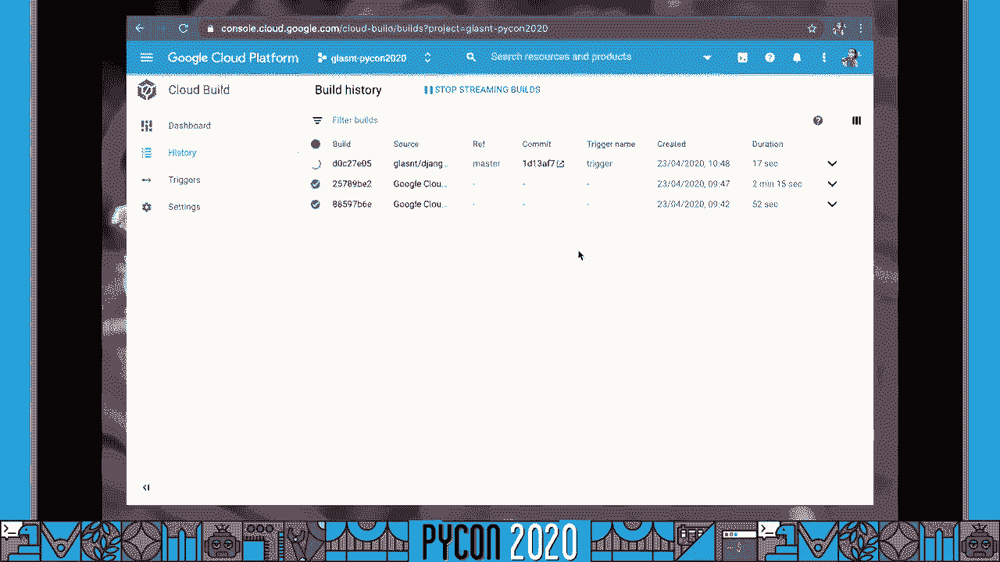

这是匹配的提交，我在这里的承诺。

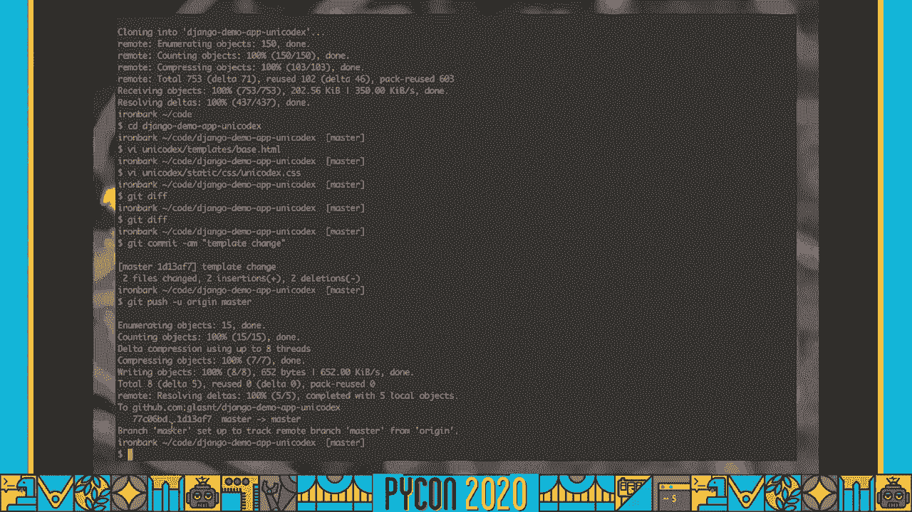

在那边，它会自动展开，我们最后一次部署花了大约两分钟，收集静电，在这里较短的部署是当我们只是建立我们的形象，现在我的建筑已经完成，我可以去看看，我的构建成功完成，它已经成功地部署到我的网址上。

在刷新此页时，我可以看到我的头衔已经变成了玻璃的独角兽，颜色也变了，这使得我可以仅仅通过推送提交来重新部署我的应用程序，本教程到目前为止，我们已经手动提供了我们的支持服务，手动部署我们的云运行服务器。

自动部署我们的云运行服务器，但现在我们要把时间花在自动化供应上，Terraform是作为代码选项的众多基础设施之一，在我们的源代码库中，我们有一堆地形文件，在这里我们将自动提供我们的背面表面。

然后自动提供我们的服务，我们有一个模块专门为我们的支持服务，尤其是我们的数据库，专门针对我们的服务器，还有一些是为了我们的秘密，我们可以看看这些文件在做什么，但我们可以看到。

只要看看这段代码 我们就会做一些事情 比如创建一个随机的密码，创建数据库实例，在该实例中创建数据库，创建一个用户，我们要做的是配置本地环境，安装 Terraform，并在本部分教程中应用这些地形配置。

我们将使用一个新的项目，你能做的就是，您可以将手动部署的旧项目与新项目进行比较，看看它们是如何相同的，它们是如何不同的，继续本教程，你得安装泰瑞佛，去地球。

IO单击下载链接 并为您的操作系统安装 terraform，对于本教程的这一部分，您还可以选择在本地使用g云，安装 g云，去云点谷歌点，斜杠sdk，并遵循您的操作系统的安装说明，创建一个新项目。

我们可以进入新的项目屏幕 我们可以创建一个新的项目，我要把这个叫做，20世纪20年代的地球。

我也会把它连接到我们的账单账户上，一旦我们的计划完成，我可以在本地设置我的项目 成为这个新项目，我也可以确保我再次设置我的项目标识，从这里开始，我们需要做一些我们之前做的步骤，在我们建立地形之前。

我们需要为 terraform创建一个新的服务帐户，我们要把它叫做地球，我们还将约束，允许我们以所有者的角色运行我们的服务帐户，这将允许地形，我们有相同的权利，当我们跑的时候，G云，我们还要确保。

Terraform知道如何访问这个服务帐户，为了做到这一点，我们要为服务器帐户创建一个本地密钥，然后我们会保存钥匙的副本，从这里本地存储在我们的申请凭据中，地球会知道该派谁去，因为我在一个新项目中。

我需要重现我之前的形象，地球人做不到的一件事，为我们创建新的容器图像，这超出了作为代码的基础结构的工作范围，我要让云计算应用程序接口，我要建立我的形象，这需要一些时间来完成，现在我的形象存在。

我可以部署在地球上，我需要进入地球的目录，然后我需要初始化 terraform，Terraform的初始化 将初始化我的模块，从上游下载提供者插件，谷歌秘密测试模块。

和谷歌模块的其余部分 我们的应用程序，一旦 Terraform被初始化，我们现在可以使用我们的地形舱单，我们将运行一个类似于我们之前在所有云构建运行中所做的命令，我们将选择指定服务的区域。

我们特意在这里选了一个新的 unicode dex，所以我们可以看到网址会有所不同，当我们部署，我们还需要指定实例名称，我们称它为新的 psql，只是为了确保我们看到它是不同的，我们的项目是。

Terraform现在将接受替换变量，找出需要做些什么来改变我们的项目，因为我们的项目里什么都没有，但一切都将是新的创造，一旦我们确定一切准备就绪，我们进去让她离开，地形。

现在要想出最快的方法来部署我们所有不同的方面，我们专门将其配置为具有依赖关系 cha，例如，没有数据库就不能创建数据库用户，并且实例已经创建，这需要几分钟才能完成，它需要完成我们之前手动完成的所有步骤。

我尽力确保，我们的供应的复杂性不会导致这样的问题，有时地形会失败，您得到的错误可能与此不匹配，但地球的伟大之处在于，我们可以再用一次，希望悬而未决的分歧会有所不同。

之前我们必须创建的40多个资源 现在我们只有7个，太棒了，我们再重复一次，这又需要几分钟才能完成，现在地球已经成功地完成了，我们现在可以看到我们下一步要做什么，我们的服务已经部署完毕。

但是 Terraform不能运行云构建任务，它不能创建我们的图像，也不能运行我们的迁移，谢天谢地，我输出了你要运行的命令，要完成此迁移，然后我们就可以登录到我们的管理员，当它完成的时候。

以下是获取用户名和密码的方法，所以我要复制粘贴 然后运行我的数据库迁移，这还需要一些时间来完成，现在我们的数据库迁移已经完成。

我们的服务现在可以使用了，我们可以去部署网址，我们可以看到我们在新的 Unicodex，在一个与以前不同的散列中，但我们仍然有我们当地的变化。

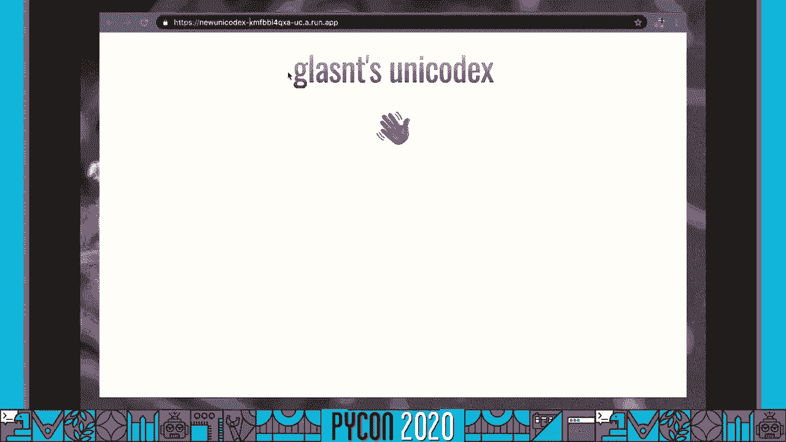

这是因为我们部署在主分支中。

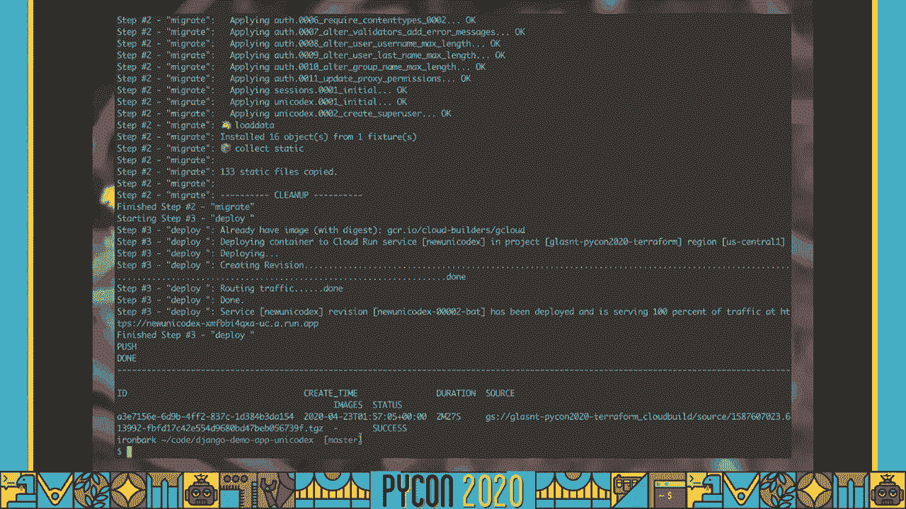

我们已经完成的代码更改，但我们可以看出这是不同的，因为我们没有任何媒体资产，这是一个新的部署，使用了最少的手动交互的Terraform，通过使用基础设施作为代码，在谷歌云上提供和部署我们的应用程序。

本教程到此结束，但你得自己清理一下，此刻，我们的教程没有任何预期的费用，但是因为我们有一个 SQL实例，我们会有持续的成本，如果我们继续这样下去，我们能做的是，我们可以删除我们的项目。

如果我们完全确定我们完成了，在页面顶部，单击项目选择屏幕并单击"管理项目"按钮，那么对于你想要的项目，单击操作并删除，这将关闭我们的项目，它，停止所有的收费和交通，我就会失去这个项目的权限。

三十天后一切都会被删除，确认要删除项目，确保您进入您的项目，表格中的 ID，我的项目现在已经被关闭了，三十天后就会被删除，确保对 Terraform实例和原始实例都这样做，谢谢你今天加入我的教程。

如果你有任何反馈，或者想问我任何问题，我可以在 twitter和 github上使用，就像在格拉斯哥一样。

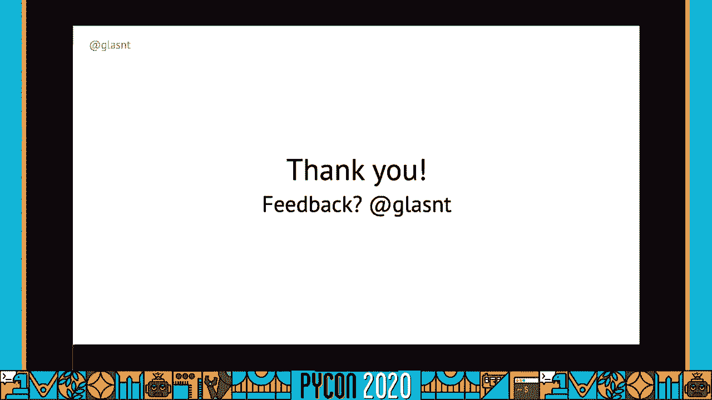

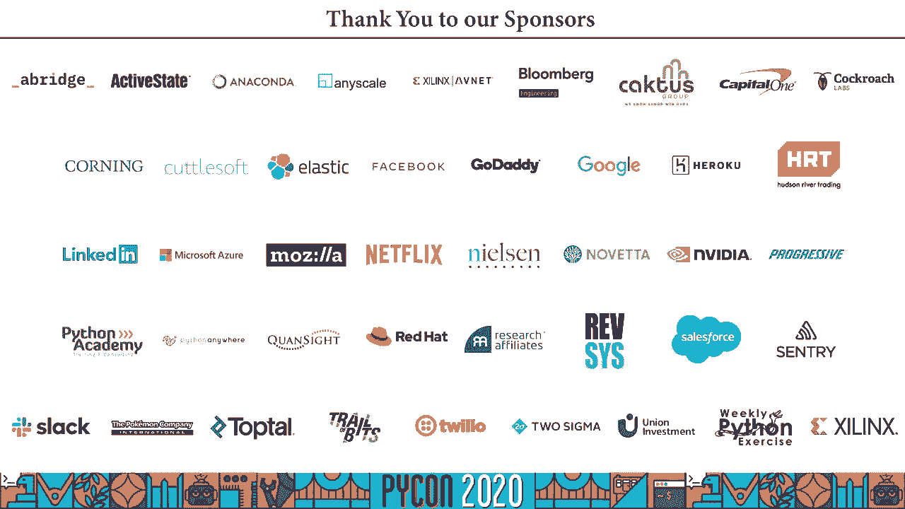