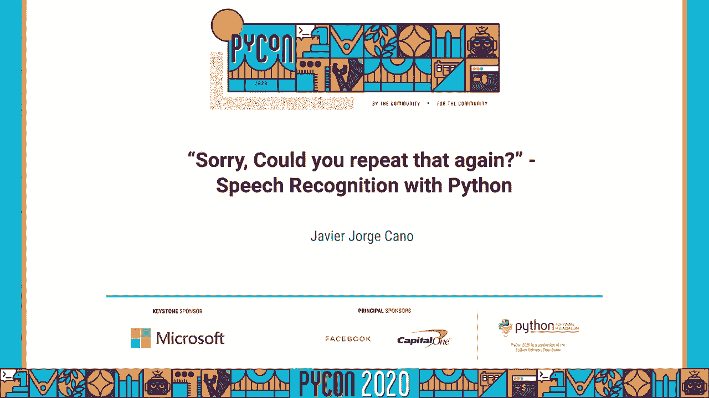
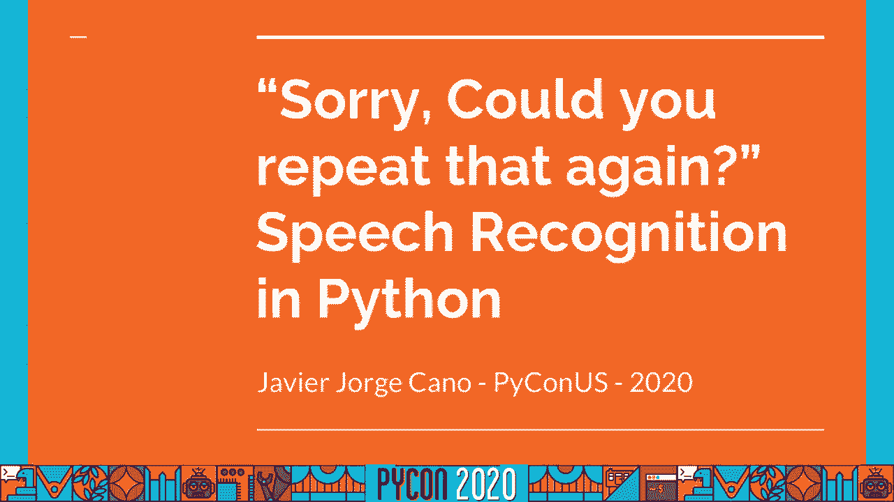
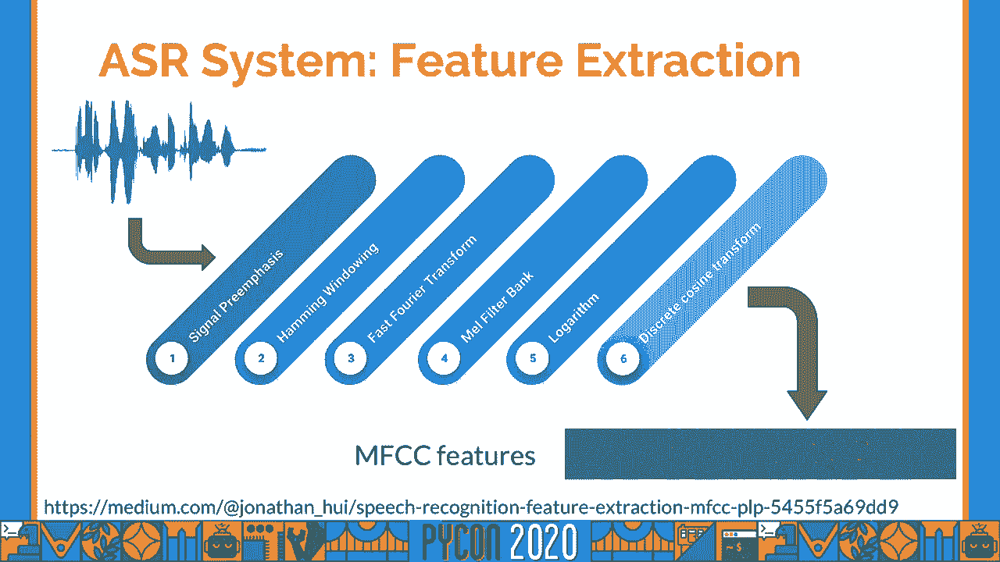
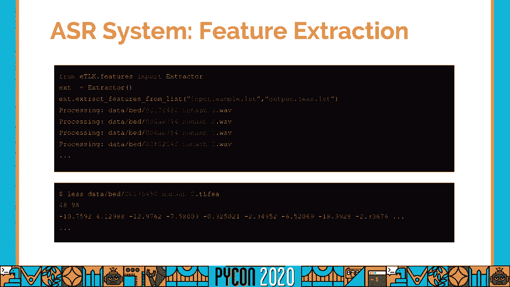
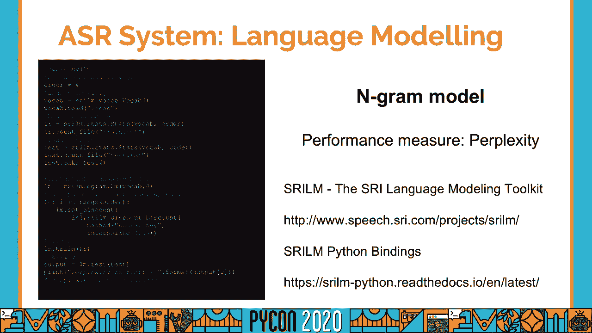
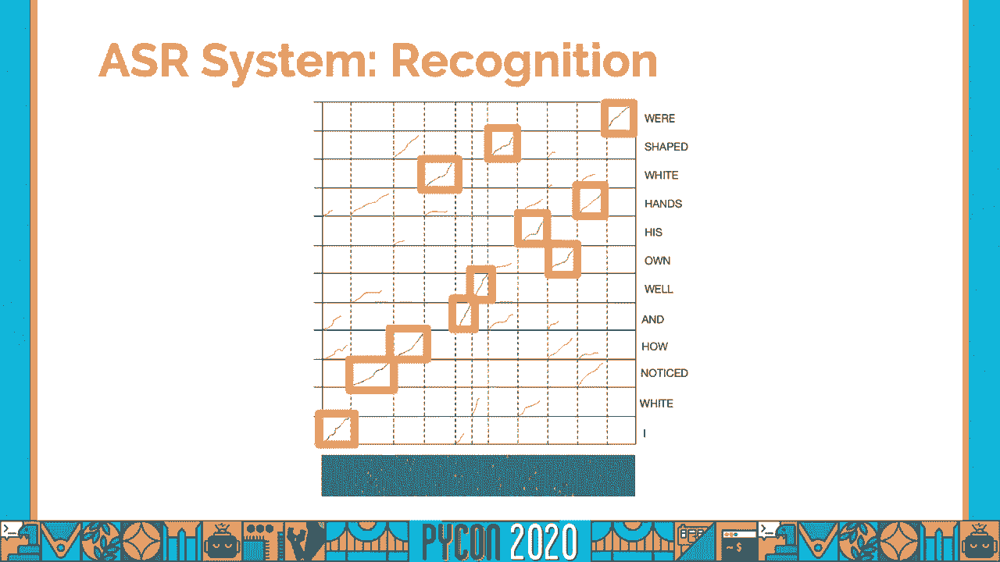

# PyCon US 2020 - P45：Talk Javier Jorge Cano - “Sorry, Could you repeat that again” - Speech Recogniti - 程序员百科书 - BV1rW4y1v7YG

大家好，首先，希望你一切都好，我叫哈维尔，我想感谢 python和 python软件基金会给我这个机会，我在 python的第一次演讲是关于这个新的在线格式，希望大家喜欢我的演讲，让我们从演讲开始。

你好，2。欢迎大家来听我的演讲，对不起，你能再重复一遍吗？蟒蛇语音识别。

我是广野，我是瓦伦蒂亚大学的博士生，我的主要研究方向是自动语音识别（asr），我们研究自动转录，翻译和语音合成，主要针对教育内容，这里有一些关于我们开发的项目的视频，这说明了什么？我想先提出一些问题。

在这次演讲中我要回答这些问题，语音识别为何相关，创建识别系统需要哪些资源，这些系统的组成部分是什么，哪些是在蟒蛇身上开发它们的工具，我们如何评价阿扎尔系统的性能，这个领域的高级课题是什么？一些初步意见。

我将避开 asr背后的数学和统计，因为我想把重点放在这些系统的主要思想、基本概念和组件上，这就是为什么我会要求你在这次演讲中的一些飞跃的原因，但如果有什么事情不够清楚，请不要犹豫，随时与我联系。

让我开始为自动语音识别提供一个基本的定义，或语音识别中的 asr，我们想把语音信号转换成文本，有人会说，但这个问题还没有解决，我们有城市，我们有阿利克萨，我们有谷歌助手和其他一些助手。

我们可以直接用我们的声音与他们互动，它们工作得很好，但仍有一些挑战，我们可以谈谈语言上的挑战，例如，我们这里有排名前100的语言，根据母语人数，最受欢迎的是中文，西班牙语和英语。

这些助理为这种语言和其他一些语言提供支持，但是还有许多其他语言没有这样的服务，那个，10分钟的说话门槛提供了一个想法，有多少人没有他们自己语言的工具，多样性，文化和遗产。

提供高水平的激光工具 可能会对所有这些方面产生直接影响，方言方面还有很多工作要做，我们为这些语言提供的口音和资源，另一方面，在我们的案例中，我们有技术上的挑战，在我们组，我们专注于教育内容。

在这种情况下，我们面对复杂的词汇，硬件条件不同，多人发言，多种语言，所以还存在一些悬而未决的问题，我还想说，演讲是一个更大的图景的一部分，例如，考虑其他语言任务，我们可以谈谈语音翻译。

或自动的 Subor配音 在这个语境中扮演着重要的角色，因此，提供更好的asr系统可以提高这些任务的性能，所以现在还有很长的路要走，我们必须谈论这个领域的兴趣和未来。

让我告诉你在这次演讲中我要遵循的步骤，创建一个 asr系统，从我们在建模部分使用的资源开始，准备和训练 我们将在识别过程中使用的模型，我将展示一些例子，trrecesses uv toolkit。

以及蟒蛇的延伸部分，一个语言处理研究小组，它涵盖了从特征提取到识别和评价的各个层面，它使用了最先进的模型，例如 LSTM和变压器模型，例如用 kali或 pi kali。

因为我将要遵循的步骤是相当标准的，现在让我们谈谈我们可以在哪里获得它们的资源，以及我们如何准备它们在建模部分使用它们，我们需要的资源是音频文件，语音信号，转录，文本和词典。

这个词典将为我们正在考虑的单词提供语音转录，现在我想展示一些你可以在互联网上找到的开放资源，从语音命令开始，来自谷歌的数据集，这是一个很好的数据集，可以开始使用asr，这个问题比识别整个句子更容易。

如果你想要更高级的，例如，利比亚演讲和演讲，如果你想探索更多的语言，你可以查看来自 moila的普通语音项目，它提供了多达40种不同的语言，现在我们已经讨论了 在哪里可以找到一些资源。

让我告诉你准备它们在建模部分使用的步骤，你想下载它们，当然，然后进行一些质量控制，检查音频质量和文本格式，因此，您应该对原始数据执行一些转换或转换，让我向您展示一些工具。

您可以使用这些工具来执行这个数据准备步骤，例如，转换音频，您可以在 pi socks上使用 socks来执行文本规范化，你可以直接用蟒蛇，如果你想做更复杂的事情，您可以使用 NLTK。

您还可以使用 LTK，如果你想获得额外的语言资源，例如，词典，如果原始数据集中没有提供，如果你想知道更多关于你可以使用的其他工具，你可以查看这份参考资料，既然我们有足够的资源 我们需要语音信号，转录。

文本和词典，把注意力集中在语音信号的音频文件上，通常这些数据是以原始格式提供的，这就是波的形式，数据信息不丰富，我们将在建模部分使用的模型 在理解这些数据时遇到了一些问题，因此，我们需要执行一些转换。

以获得更有意义的表示，我给你举一个例子，这里我们有六个话语或孤立的单词，我们不知道每个人念的是哪个词，我们不能说它们是相似的还是不同的，所以我们需要做些什么 从这些样本中提取更多的信息。

我们可以执行一个特征提取过程来改变表示，例如，我们可以从时域转换到频域，然后我们在这里得到另一种表示 我们可以观察到一些模式 可以帮助我们更好地理解数据，这就是为什么我们要执行特征提取过程。

将原始数据转换为另一种表示，我们可以在建模部分使用，在这种情况下，此步骤的输出是MFCC特性，它是从我们这里引用的原始l中提取的一组向量，要了解更多关于特征提取过程中执行的这些不同步骤的信息。

这些向量通常被称为声学向量或框架。

这是提取器物体，然后我们应该提供示例列表和输出文件列表，这些特性将存储在下面，我们有一个加热器的例子表明，那么这些向量的维数是4，八，我们从这份文件中提取的向量的数量是98，我们也有一些这个特性的值。

我们已经讨论过资源，哪里可以找到他们，我们如何将它们转化为，我们现在进入模特环节，我想再从声学模型开始，在直接开始完整的句子之前，我们想把语音信号转化为文本，我想把注意力集中在孤立的单词上。

在这个例子中，同一个词你有两次进步，这个词的意思是，我们提取了下面的特征，以及下面的边界，在这些样品中，我们可以在这里观察到一些关于共同模式的全球结构，但我们也可以观察到音素之间有一些时间上的变化。

如果我们考虑到这两种情况下的交响乐，所以我们需要一个模型来考虑时间的变化，我给你举个例子，我们可以把人类的语音生产系统想象成一个有状态的有限状态机，过渡和排放，状态是我们可以在声道中组织的不同设置。

转换表示当我们保持在相同的设置中时，或者如果我们从一个设置到另一个设置，辐射可以被表示为声学矢量 作为我们在未来结构中提取的框架，我给你举个例子，例如，我们将从第一个设置开始。

然后产生第一个与第一个音素相关的声学矢量帧，我们可以移动到第二个设置 然后继续产生声音，与第二个音素有关，这是我的声学矢量或框架，最后我们进行最后的设置，然后我们制作这个作品的最后一部分。

有一个模型模仿或提供了这种行为，这个模型被称为隐马尔科夫模型，在隐马尔科夫模型中，我们有国家，过渡和排放，例如，我们有一个音素的模型，三种状态 因为我们想模拟音素的开头，音素的中间和音素的结尾。

我们就能保持原来的状态，或者我们可以从一个州搬到另一个州，执行这些转换，我们也有排放，这表明处于一个状态，我们可以产生我们在前一步中提取的这些声学矢量中的一个的一些发射，这是一个音素的模型，如我所说。

但我们可以把它们串联起来 形成单词，就像这个例子，关于排放这个词，我们可以用概率分布来模拟，例如高斯分布，或者甚至是高斯混合，但现在最流行的方法是基于神经网络的方法。

然后我们讨论混合系统是深度神经网络和隐藏的马尔可夫模型的组合，我现在要展示一个例子 说明如何进行声学模型的训练，好的，秘密马可夫模型的训练，您可以使用训练器对象，该对象提供了可以创建初始模型的方法。

使用音素列表和样本列表的原型，我们也在这里表明我们想添加一种特殊的状态，呃，四维高斯分布，这是33个隐藏的马尔科夫模型，我们这里有，这个音素的隐马尔科夫模型的一个摘录，它有三个庄园。

从一个状态到另一个状态的对数概率，最后是高斯分布的参数，初始模型的发射概率，我们可以为训练进行训练，我们需要字典，抄本和样本清单，我们提取的特征列表，我们还可以指出详细程度和我们想要执行的迭代次数。

以及我们用来代表寂静的符号，训练开始了，然后它在这个模型上迭代改进，在这种情况下，我们考虑的是对数可能性，这提供了一个模型和数据之间拟合的想法，我们希望这是尽可能高的，最后。

我们得到了我们可以在下面步骤的下一部分中使用的模型，如果你想了解更多，你可以查看这些关于在这个训练过程中使用的算法的视频，即算法和前向后算法。

这是建模步骤的第一部分，让我们进入第二个组件，这就是语言模型，我们看到一个模型，隐藏的马尔科夫模型，它可以帮助我们识别音素和单词，但我们需要一些东西把这些词联系起来，承认完整的判决。

在这里我们可以使用语言模型，我想给你看一个例子，为了说明，语言模型背后的理念，好的，我们这里有，判决，黑狗和阿拉伯人，我们有三个选择，我们通常说看涨期权是 spar，我们说过，因为我们在这里之前的背景。

我们关于语言的模型告诉我们 这里最有可能的词是 bar，这就是语言模型的作用，它为下面的世界提供了一些分数或概率，考虑到先前的背景，此外，这个语言模型可以提供另一个我们将在识别过程中使用的结构。

我想给你看一个例子，这里我们有三个句子，我们可以把它们浓缩成如下的图形格式，例如，在这种情况下 之前的两个词，因为我们从零开始，我们一无所有 一无所有，然后我们有弧线，单词从一个上下文变成另一个上下文。

例如，有了这个d，我们就什么都没有了，然后我们有个人和黑人，人把我们带到国家，人和黑到州，黑色，这就是我们在这些州考虑的背景，现在另一个迭代。

我们有散步 带我们到人的工作状态 房子和狗代表在黑屋和黑狗状态，原始样本中单词之间的关系，这是另一个例子，更复杂，但我认为你会明白 你可以把你的文本数据集转换成一个图表，结构或代表性。

最受欢迎的模特之一，执行此语言模型的一部分是英格拉姆模型，这里有一个例子来训练和评估一个英格拉姆模型，在这种情况下，性能指标是困惑，在这种情况下，越低越好，说明模型的确定性。

当它为下面的世界提供分数或概率时，以及在本参考资料中提供的 python绑定。

再来一次，在这种情况下 最先进的是神经网络，它们可以在以矢量格式对先前的上下文进行编码后使用，然后将这些矢量提供给网络，它可以为下面的世界提供分数或概率，就像在铭文模型中，以前的尺寸。

我们已经看到了建模部分的两个主要组成部分，让我们进入建模步骤的最后一部分，该识别模型中的识别模型，我们所拥有的是声学模型，它提供了关于音素和单词的信息，我们有工作和中心层面的语言模型。

我们想把这两个模型结合起来，以获得一个图，最后一个我们要用来进行识别的图，我将用我们在之前的幻灯片中看到的玩具例子来说明这一点，我们这里有，我之前展示过的语言模型 以及它们是如何联系在一起的。

用这个图形成句子，我们可以用词典把单词分解成音素，我们可以把这些音素分解成我们在声学建模部分考虑的隐马尔科夫模型的状态，我们可以识别出在这张图上，我马上就会解释，但这是一个玩具的例子。

如果我们考虑一个现实世界的问题，我们最终得到了一个巨大的图，它有几个节点和几个ar，这类模型被称为加权有限状态换能器，如果你想更多地了解他们，你可以查看这个参考资料，现在让我们进入识别步骤。

我们有我在上一张幻灯片中提到的图表，我们可以考虑这张图中可能的路径，这些路径被标记在这里，有一条路径会根据一些分数提供最好的分数，我将在一分钟内描述，所以在这张图中我们有一条最好的路径，考虑到这门课。

通过这个路径我们可以得到最终的判决，考虑到我们的状态，音素转换，把这句话写进文字里，我们就能得到最后的判决，在这种情况下，黑人的谈话，在确认的过程中，呃，在这个图中搜索，为了找到最好的路径。

我提到了一些分数，但是这些分数是如何计算出来的呢，我们有过渡，可以提供这个分数的一部分，例如，从一个州到同一个州，或者从一个州到另一个州，或者如果我们从一个词的最后状态到第一个状态 再到另一个世界。

这就是语言模型提供分数的地方，或者我们也可以考虑当我们进行发射时得到的分数，这个发射分数将特定时刻的状态和特征联系起来，好的，所以当我们从一个状态移动到另一个状态时，我们执行的是时间同步搜索，我们消费。

或者我们检查一个特征向量，在这个特定的时刻来建模 我们在声学建模部分看到了 我们可以使用，例如，高斯模型或神经网络，现在我们对这门课了解得更多了。

我将展示一个识别过程如何发展的例子 在这里我们有一个手机，我们可以从第一状态开始，在这个状态下，我们可以考虑从这个状态转换到第二个状态，或者保持在同一个状态，好的这些是不同分数的路径，当我们结束这一步。

我们可以考虑执行发射概率 或获得与此刻观察到的状态和特征相关的发射分数，然后它提供了另一个分数，然后我们可以重复这个过程 并考虑第二步，我们还有其他的路要走，然后在这些新的状态下。

我们也应该考虑排放分数，现在让我向你展示这在世界水平上是如何工作的，我们这里有单词 house的音素和隐藏的马尔可夫模型中的状态，我们再一次从第一状态开始，然后我们考虑不同的路径。

我们还考虑了发射分数等等 所以我们有一组路径，可以覆盖整个图，好的，但我们想要最好的路，但我们不能探索整个图表，因为这不可行，我们用的是一个巨大的图 有上千个节点，所以我们需要进行修剪 以减少搜索空间。

这是用光束搜索算法来实现的，它缩小了搜索空间，为了考虑最有希望的，当我们到达我们所考虑的世界的最终状态时，我们应该探索单词的第一个状态，它可以跟随当前单词，根据语言模型，这可以用下面的图表来描述。

在这些广场上，每个单词的状态，接下来我们应该按照搜索步骤，在国家和文字中的认知，我们认为有些道路是修剪过的，和其他一些被保留的，最后我们得到了什么是被承认的句子。

这是最好的假设，我们可以很容易地在 tlk中执行这个识别过程，我们应该提供声学模型，我们得到的隐藏的马尔科夫模型，在声学建模部分接受过培训，我们应该提供从数据集中获得的词典。我们还应该提供语言模型。

我们这里有，我们使用的识别器，这是我们实施的最基本的一个，这个识别器会结合这些模型来创建我之前提到的图形，我们还应该提供，样本清单和一些药物参数，它将控制光束搜索过程，这就是这一步的结果，我们这里有。

关于这一过程的一些信息，关于波束搜索算法的一些统计信息，我们得到了公认的判决，我注意到了，他说他自己的手没事，这是识别步骤的输出。

这也提供了所谓的对齐，表明，什么是对齐，在声学矢量之间，在我们提取的特征之间，音素，还有这句话，这个很有用，例如，如果要对 l进行自动分段，让我们进入最后一部分，处理评价步骤，这里。

我们可以考虑两个性能度量的准确性，我们可以考虑订货率，这是计算句子之间的编辑距离的结果，承认了这一点，假设和参照，为了执行这个编辑距离，我们正在考虑加入，替换和删除，我马上给你们举一个例子，关于速度。

我们可以考虑实时因素，这是执行识别的时间除以音频长度，这意味着两者都有一个rtf，你可以在一小时内转录一小时的音频，这是这个订单率计算的示例，我们这里有些错误，例如，我们在第一部分。

系统提供了次大陆和大陆，最初提到的是次大陆，所以这算是两个错误，一是一次替代一次删除，我们也有，例如，系统提供了亲密，最初是在田纳西，这算作一次替换和一次插入，我们应该执行，以获得原始引用。

最后我们这里的订货率是11。5左右，这意味着这个系统，每一百个词就有十一个错误，它已经识别出来了，要看任务，但总的来说，15或20左右的值被认为足够好，可以将系统部署到生产中。

现在我们已经覆盖了从获取资源到执行最终评估的所有 sr管道，让我谈谈这个领域的一些前沿课题，例如，我们可以进行一个主题或演讲者的改编，以使我们的系统适应特定的情况，这提供了比使用一般系统更好的结果。

我们还可以进行多步识别，为什么我们要只考虑最好的假设，为什么不考虑十个最好的或一百个最好的，再根据这个新的假设，我们可以执行一个迭代过程，以细化系统的输出，我在这次谈话中非常简短地提到了这一点。

但是神经网络在声学和语言模型方面是最先进的，最近也有另一种方法提供了良好的结果，它们是整合的模型 从序列模型到序列模型，这种方法试图将声学模型和语言模型结合在一个独特的模型中。

然后在这个组合模型中进行训练，如果你想了解更多关于这个领域的最新发展，以及在过去五年中提出的系统和技术，你可以查看这个有趣的视频，我们已经讨论了语音识别的动机和挑战。

我们可以在哪里以及如何为 asr系统获得资源，asr系统的组成部分，声学模型和语言模型，以及它们是如何组合在一起创建这个识别图的，我们在 python中看到了一些开发 asr系统的工具。

我们已经讨论了可以用来评估 ASR系统的性能指标，这个词，费率和实时因素，最后我们要简短地谈谈到达的方向，例如，基于神经网络的方法与集成模型，谢谢，这些是我的联系方式和我的研究小组的联系方式。

所以如果你想更多地了解我们的工具，我们的系统，或是我们的研究，请随时与我们联系。

