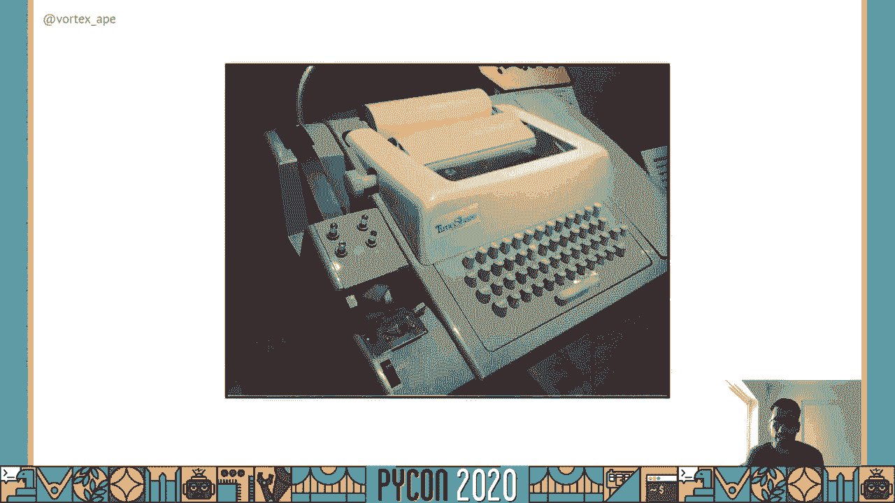
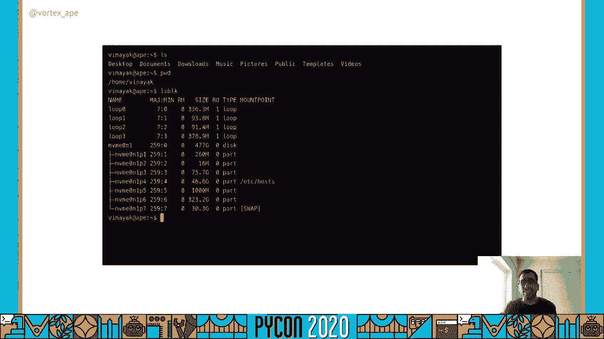
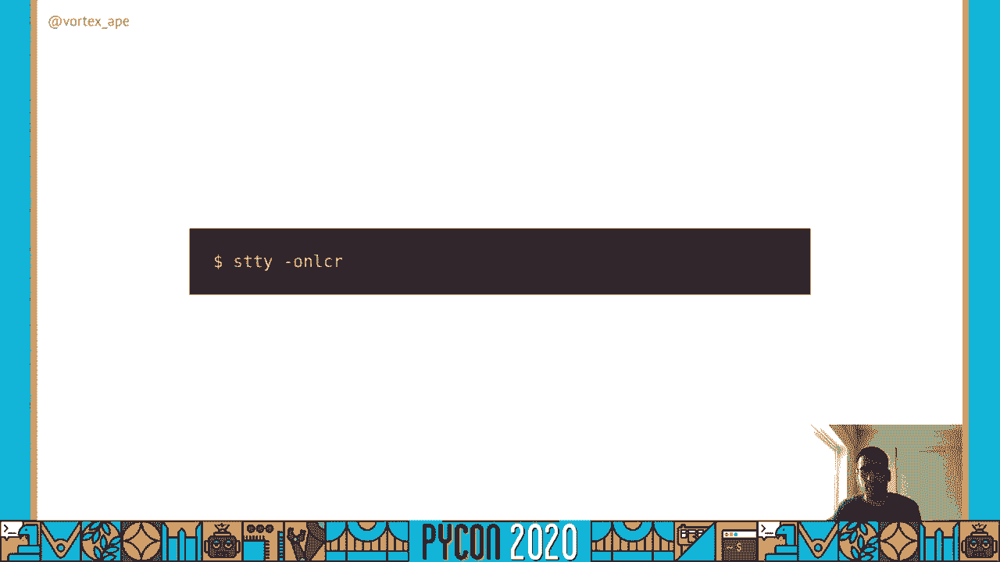
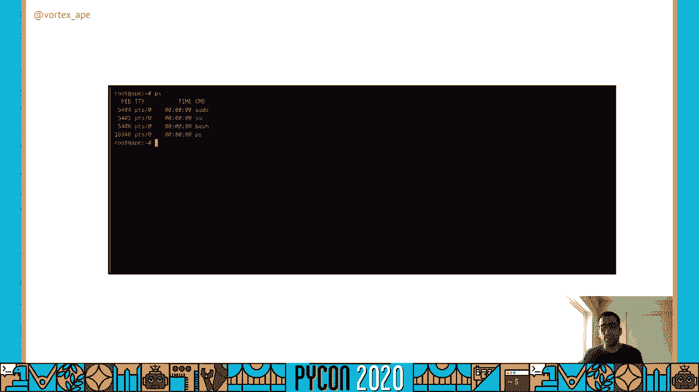
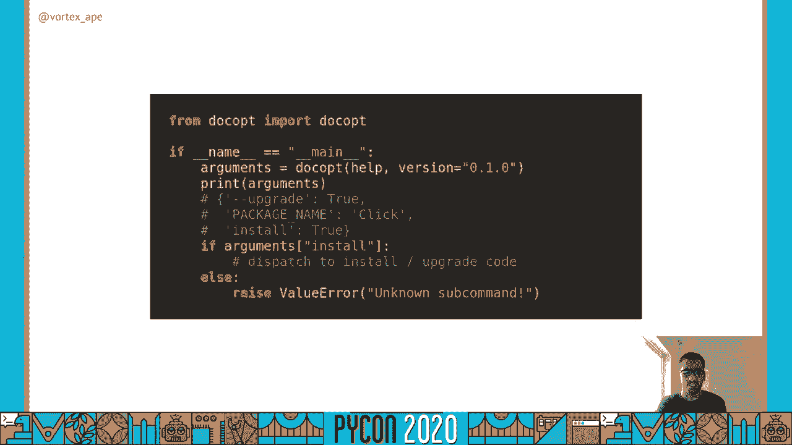
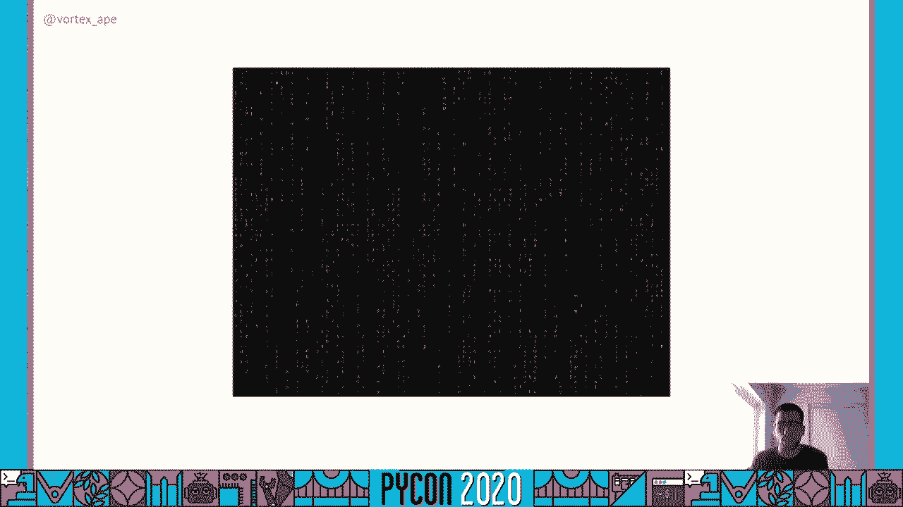
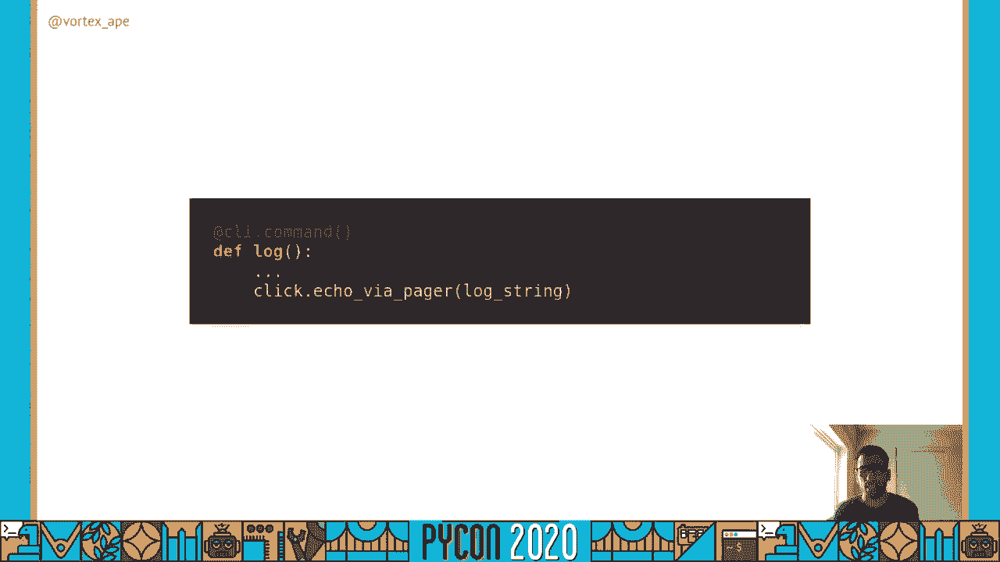
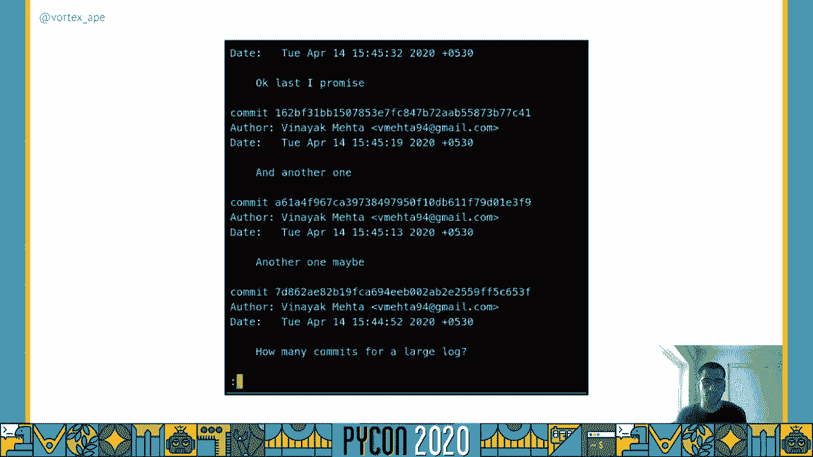

# PyCon US 2020 - P73：Talk Vinayak Mehta - The Hitchhiker's Guide to CLIs in Python - 程序员百科书 - BV1rW4y1v7YG

喂，各位，我是班尼，这是劫机，是在蟒蛇中看到的向导，一开始是命令行，好吧，不完全是命令行，我们今天知道它们是打字机，我们用莫尔斯电码交流，所以有一天，有人想出一个主意。

把打字机和现有的一套交流偏见联系起来，告诉打字机诞生于电传打字机，我们需要一个操作员来做莫尔斯电码，并提高消息键入速度和发送时间，使信息能够在几乎没有人工干预的情况下 在全国范围内闪现。

在这个1932年的视频中，叙述者描述了她的电视剪辑 只需要几秒钟就能把信息从伦敦传递到爱丁堡，这与早期的 ETF形成了鲜明的对比，一周一周是一个男教练花在四百英里旅行上的时间，与此同时。

计算机变得足够强大，可以同时处理多项任务，并与用户实时交互，与早期的批处理模型相比，所以另一个发现有人有了另一个想法 把电传打字机和模型连接起来，这将使他们与这些计算机远程交互，其中。

电传打字机是油炸的和灵活的，以及电传打字机模型，像这样的三种电传打字机被改编成早期计算机的用户界面，这就是命令行界面的起源，用户在对输入感到满意后，在纸上打印提示符后键入命令，把指令发送到计算机。

最后计算机的输出又会被印在纸上。

这项工作继续被用作通往计算机的隧道，直到20世纪70年代末视频显示器变得广泛可用，视频缩略图迅速走红，I，O，许多不同类型计算机上的设备，一旦制造商转向一套共同的标准。

它将要求一个串口将终端连接到一个模型，在今天有两行四八十列的文本，我们生活在一个物理电传打字机和视频终端已经过时的时代，我们代替终端模拟器。

是一个真实事物的软件 模拟，但是现代终端模拟器是否借鉴了这些旧金属野兽的遗产，让我们找出一个清晰可见的东西 是名字，如果你从电传打字机上提取一个 t和 t，它变成了。

它是基于 unix操作系统的虚拟终端的前缀和名称，在虚拟终端上运行的应用程序的基本类型是 shell，shell提示来自用户的命令，并在按下输入后将其发送给执行，类似于电传打字机的工作流程。

所以基于直觉，手柄看起来有点像这个键盘 把输入传递到终端，把它传递给进程，这个过程做一些工作，并将输出返回给终端，把它印在显示器上，在终端和过程之间设置了一个幻觉，术语 ios，它有点像一个接口接口。

用于对套接字通信参数的一些默认设置，在行规程中，还有一个实用工具，可以用来打开或关闭设置，并通过连字符显示来sd，所有设置及其当前值，例如，串行通信的速度以及行和列的数量，让我们。

看看其中一些设置是做什么的，我展示了相同的例子，布兰登·罗茨在他的2017北湾蟒蛇主题演讲中分享了，我们首先看的是所谓的眼睛 佳能，它指的是用于对命令进行一些基本编辑的规范文本数据。

在它们被送到程序中之前，例如，前后移动光标或使用退格删除字符，大多数交互式应用程序，如文本编辑器，关闭设置，自己处理所有的行编辑，默认情况下，规范文本数据处于打开状态，我们可以用 CDL把它关掉。

像这样，让我们看看它能做什么，但首先我们要打开猫，因为正典文本速率是打开的，输入是缓冲器，直到我们呈现，我们现在还可以使用退格来删除字符，把图标关掉，使用我的连字符图标 并再次使用，如你所见。

文本没有被缓冲，现在我们一输入一个字符，猫就会收到它，并立即打印出来，而不是一次一行，我们可以通过从前面的命令中删除连字符来打开图标，另一个设置是 oll cr，nl代表新线，cf代表回车。

此设置查找新行和文本，并向每个行和文本添加回车，回车，确保游标回到新行之后的第一列，类似于远程思想，当纸质车厢带着新的行返回到第一列时，没有新行字符的字符用于在现代终端上制作进度条，程序更新进度。

将光标移回第一列，然后用新的进程取代先前的进程，默认情况下，这里也是打开的，可以使用像这样的stl关闭。

我们看到的是，输出现在看起来很有结构，让我们在这里关闭，再看看ps输出，我们输入 ps，我们可以看到幻觉消失了，这是真正的东西，光标不会返回到第一列，即使这些线条被印在新的线条上。

很多应用程序都假设终端会自动将光标移回新地球。

到第一栏，当他们打印一条新的线，还有回声，默认情况下是打开的 电子工程师会指示终端打印 我们放回显示器上的每个字符，如果我们把它关掉会怎么样，我们再看一次猫，我们可以看到我们打的是什么 你好世界。

但当我们用连字符回波把它关掉时，发生这种事，我们没有看到猫被打字，我们甚至没有看到输入字符串，直到一只猫在后面跑，为我们的节目打印出来的，关掉回声，当他们向用户询问密码时，如果你在尝试 tomao设置。

您可以使用 reset命令 将所有这些设置返回到它们的默认值，您还可以查看python标准库中的term module，从python代码中打开或关闭这些设置。

改变终端状态的另一种方法是通过带内和带外信号，在带状信号中，意味着你在输入中加入一些特殊字符，终端将这些特殊字符解释为命令，而不打印它们，相反，它导致了预期的效果，实现入站信令的一种方法是使用控制字符。

例如，control h将执行退格操作，control c将中断正在运行的进程，另一种方法是使用转义序列，它可以控制光标位置和文本颜色，例如，在这里打印第一个序列将清除屏幕。

在字符串使字符串粗体之前打印第二个序列，终端还预先配置了输入和输出流，其中输入流映射到键盘上，以及要显示的输出流，这种默认情况下自动将输入和输出映射到键盘上的能力 是 unix操作系统的一个突破。

在 unix程序显式连接到适当的 io设备之前，这是一件乏味的事情，因为缺乏跨系统的标准，这里是输入流，程序在这里读取输入数据，std out和std是输出流，程序在这里写入输出数据和错误信息，除非。

当然，使用一些大于 in的运算符重定向数据，双倍，大于我们的重定向操作符，把程序的输出重定向到，两者唯一的区别是第一个会覆盖文件，而第二个会附加到文件中，梯度的另一个重定向，管子。

使一个程序的输出成为另一个程序的输入，现在我们已经了解了终端是如何进化的 以及它是如何工作的，让我们看看在终端内部运行的程序，命令行，接口，这些话，接口，申请，程序，工具可以互换使用。

但他们指的是同一件事，至少大多数时候，See是通过shell脚本使重复的任务自动化变得容易，使用cli的一般用法模式是很有趣的，像这样，shell将提示符显示为准备接受输入的标志，用户输入要运行的命令。

以及一些选项和论点，这完成了进入命令中的文本的命令行，然后执行命令，输出打印在终端上，但是这些需要程序所需信息的参数和选项参数是什么，也就是说，没有它们程序就不能工作，它们通常是位置性的。

这意味着参数在命令行中的位置有助于程序识别参数类型，例如，这是复制命令，它可以在没有源和目标参数的情况下运行，在论点中的第一个位置永远是论点的来源，排在第二位的永远是分配，选项或标志用于修改命令的操作。

顾名思义，它们是可选的，它们可能有一些默认值，一般惯例是在字符或单词前面使用连字符来标识选项，例如，在复制命令中，连字符可以更改其操作，方法是要求它递归地查找源文件中的文件，然后将它们复制到目标文件。

对cis true的批评之一是，它没有向用户提供关于其所有可用操作的提示，与图形用户界面形成对比，它通常通过菜单通知用户 这些操作，图标，或其他视觉线索，克服这个局限。

许多 CLI程序围绕它们所支持的参数和选项 显示一些简短的文档，可以通过使用 help选项调用 ci来查看此文档，其中一些还有手册页，是手册页的简称，默认情况下，man命令使用一个终端寻呼机程序。

例如或多或少地显示一个 cli的大手册，这使得用户很容易滚动和搜索它，你一定在想 这里有很多活动部件，每个程序员可以以不同的方式编写这个 cli，例如，他们可以使用连字符x而不是连字符h来显示帮助文本。

有没有什么标准来确保每次销售，我遵循一些基本的惯例，是的，统一的应用程序接口，例如命令行接口，遵循岗位标准，是要符合 posix的要求，还有基于 dg的目录规范。

它规定了我应该如何存储他们的功能所需的不同类型的文件，这样大家就不会把文件到处存，这些文件可以是配置文件，数据文件或程序缓存，它应该进入用户文件系统上的这些目录，现在。

让我们看看如何使用 python实现命令行接口，有几种选择可以做到这一点，在标准库和圆周率上，我们举一个小例子，这里，我，把它叫做小pip，看看我们如何使用所有这些不同的选项来实现它。

小 pp只有一个子命令 install，我们可以用它从圆周率上，它还有一个升级选项，让我们先看看标准库，它有一个信息系统模块，它带有 rgv变量系统，在它们列表中调用的是内部传递给 cli的命令行选项。

这个点使用 get out模块解析并创建命令行选项列表，geoff模块是一个命令和选项的解析器，其api被设计成类似于unix get out函数，它遵循邮政标准，让我们看看一些代码，所以当独联体国家。

我们使用，对我们说，因为第一个元素是海洋本身的名字，我们检查索引1的元素是什么，如果是连字符，边缘或连字符帮助，我们打印帮助，并对版本做同样的事情，最后，我们检查被调用的子命令。

并将控制权分派给相关代码，直到蟒蛇三点二，标准库还有解析模块，从那时候起，或者只能传递选项而不能传递位置参数，一些史蒂芬胡子，艺术部分的作者在第389页谈到，它是10年前的2月21日由圭多批准的。

我写这篇文章是因为两者都得到了选择 不支持 只支持选项而不支持参数，我们的私人物品，因此，它能够自动生成更好的健康信息，我们还允许自定义用于标识选项的字符，例如使用加号，而不是减号，甚至是向前斜线。

阿里斯，还增加了对子命令的支持，这是一个常见的模式，例如，PIP安装，PIP冻结和 PIP搜索，让我们看看小的纸代码是如何使用的，呃，因此，我们导入我们的部分，初始化一个解析器对象。

并传递一个类似的描述，我们还为它添加了一个版本选项，然后初始化子分析器对象，并为install命令添加子分析器，操作等于store，以确保将升级选项视为布尔标志，当交易被提起时。

我们称这个解析器为圆点部件臂函数，最后，我们检查所调用的子命令，并将控制权分派给相关代码，然后我想是我们得到了一个自动生成的帮助，第一个是医生，它是由弗拉基米尔凯利写的，它的工作方式很酷。

doc cop采用文档第一的方法来编写 ser，它只需要一个 posix组合帮助作为输入，从中推断出子命令的选项和参数，所以这一次我们首先创建了一个头部字符串，它显示了我们系列的描述和用法。

当序列被调用时，我们称 doopppassing in the head string and a version，挺好的，在所有示例中，我们再次检查被调用的子命令，并将控制权分派给相关代码。

现在我们看到除了解析结果，我们必须编写一些样板文件来调度控制相关的安装和升级代码，如果我们要验证这些零件，命令行选项，我们需要再增加一些样板，这个锅炉板对于大型应用来说是非常大的。

我们可能还需要添加一些共同的特性，例如，进度条和颜色。

它是由阿林荣誉写的，以支持烧瓶项目，Click被设计成嵌套和可组合的，这意味着它支持任意嵌套命令，例如，Python设置点由 s b轮，在那里，贝斯轮的命令被称为，有点像子命令链。

单击也自动调度 是控制到相关代码，根据潜艇的指令，它支持回调，可以用来验证过去的命令行选项和合并后的post，让我们看看使用单击我们导入的小代码是什么样子的，单击。

使用 doc字符串添加一个名为 cli的函数，因为 click遵循一种基于 decorator的方法来编写 liwe，向函数添加 单击组装饰器，这使得 ci函数成为一个可以添加子命令的命令组。

我们还为它添加了一个版本选项，然后我们用 doc字符串再次定义了一个名为 install的函数，然后，我们使用cli命令decorator将此函数转换为子命令。

cli和 ci dot命令是我们前面定义的命令组，添加一个名为"升级"的选项，与头绳一起使用检查选项 decorator，旗子等于真，使升级一个布尔标志，当交易被提起时，单击将自动调度控制到相关代码。

在本例中是安装函数，我们将获得命令行参数和选项作为安装函数的关键字参数，我们可以用它来安装或升级，Click also auto generated the help for us based on the function doings and the option head strings（我们之前添加的选项头字符串）。

单击承诺，当使用单击编写的多个应用程序被串在一起时，它们将无缝地工作，这意味着多人可以在一个大的零件上工作，然后最后把它们缝合在一起，就像我们在建立一个cli，在那里我们不需要定义。

从一开始就解析或关注我们的帮助，从一开始的抽搐对于快速迭代是很好的，现在，让我们看看一些常见的用例，看看如何实现它们，使用单击，我们将在这里使用另一个小的例子，叫做小得到小的门，顾名思义。

是一个小门克隆 有六个获取子命令，克隆配置，日志状态，承诺并再次推动我们，首先用单击点组修饰器定义一个 ci函数，让我们看看用例，向用户显示进度条的常用用例，例如，当用户调用clone sub命令时。

我们应该让他们知道关于克隆了多少文件的进展情况，单击作为一个进度条实用工具，可以帮助我们做到这一点，我们使用源和目标参数定义 clone子命令，我看看，让我们，假设我们有一个要克隆的文件列表。

我们将一个列表传递给单击点进度条上下文管理器，它返回一个迭代器，当我们迭代它并下载每个文件时，单击将向用户显示一个进度条，它将类似于，所以当我们用音调，一个子命令，我们可以看到一个进度条。

因为文件被一个接一个地下载，另一个用例是对文件使用特定的配置，例如，我们应该在我们的应用程序文件夹中保存用户名和电子邮件之类的东西，当用户使用config子命令设置它们时。

单击提供了一个可以帮助我们完成此操作的函数，我们用 key和 value参数定义了一个 config子命令，然后我们得到一个小门的应用文件夹路径，使用"上去"功能，我们创建一个创建路径，如果它不存在于。

最后，将用户特定的配置设置存储在名为config的文件中，我们要确保按照 dg规范，因为吉瑟布的故障是跨平台的，它将运行最合适的蟒蛇窗口，macOS或 linux，看起来是这样的 我把用户名设置为 i。

如果我在应用程序文件夹中的配置文件上做了一个小的门，我可以看到它被设置好了，我们可以在将来重新使用它，我们还应该页面大的cni输出，这样用户就可以滚动它，而不是一次打印出来。

对于命令日志打印的大型提交日志，我们可以这样做，通过调用终端寻呼程序 单击支持分页输出，因此，我们定义了一个日志子命令，在这个命令中，我们可以使用单击echo via pager函数来显示日志字符串。

当我调用log子命令时，它看起来是这样的。

我可以在这里滚动大型提交日志。

它使用的是少终端寻呼机程序，在使用status sub命令打印时，我们还应该为添加或修改的文件添加颜色，单击"为文本添加颜色的支持"，为了做到这一点，我们定义一个状态子命令，假设我们有一个文件列表。

我们可以使用点击点样式函数来添加前景颜色，并使事情变得粗体，最后，我们使用单击回声输出它，这里的好处是，它会自动逃逸这些转义序列，就像当输出被重定向到一个文件，因为当我们这样做的时候。

通常是很长一段时间，我们不想在简单的转义序列中 通过找出日志中的错误来查看，这就是它看起来的样子，当我们调用状态子命令时，我们可以看到添加了 dot txt的新文件，它是绿色的。

有时我们可能还需要用户的多行输入，例如，要求用户提交消息，当他们预订提交子命令时，单击有关为这个用例启动编辑器，它会自动打开用户定义的编辑器，或者回到一个合理的默认值。

我们定义了一个带有消息选项的提交子命令，如果用户不使用消息选项，呃，调用提交子和，我们启动一个编辑器来获取提交消息，它看起来是这样的，在这种情况下，它打开了，它是我默认的编辑器，我传递消息。

它被提交到日志中，你也可以要求用户在线输入，使用函数中的单击点，这对于push sub命令非常有用，该命令要求用户提供凭据，以便将文件推送到远程报表，我们定义了一个带有两个参数的 push sub命令。

我们想在本地分支推广的远程三人组，我们想推动，然后我们使用单击提示功能向用户询问用户名和密码，返回值将存储在，这里的用户名和密码变量还注意到，对于密码提示，我们说过，隐藏输入等于真。

这不会打印用户在终端上键入的密码，内部，单击用途，从站着的地方过去做这件事，并通过，使用术语 mios模块关闭回波，这就是它看起来的样子，我输入我的用户名，我的意思是我，然后我输入密码，也看不见。

最后文件被推送到远程回收，当我们做完了，我们得到更多的帮助，自动生成的单击，也让我们来测试我们写的 CNN，我们可以使用类的cli来调用cli中的每个子命令，并根据它们的预期输出检查结果。

这些只是 Click必须提供的功能的一个子集，你应该完全查看这个链接的剪辑文档，看看更多你可以做的可怕的事情，我们只需在小门模块之外创建一组pi，并向其添加控制台脚本入口点。

控制台脚本允许注册 python函数的在线程序，你可以查一下，查看片场的其他东西，在本文末尾的 github链接中的 pi，我们也可以把它推到管道上，这样其他人就可以安装和使用它来做到这一点。

然后用麻绳把它们上传到圆周率上，既然我们知道如何用蟒蛇写字，我们在一个非常有限的设计空间里运作，与图形用户界面相比，图形用户界面为用户提供了更多的视觉线索和指导。

有一些原则可以帮助我们为我们编写的系列创建一个不错的 ux，首先是保持简单，遵循unix的哲学，即做一件事，并把它做得很好，编写程序，以便他们可以一起工作。

使用重定向操作符和处理文本流遵循unix的哲学，确保当用户与 cx交互时没有意外，第二是通过让特征可以被发现，通过对他们的坦率，类似于这样的暗示，即图形界面提供了一些可以让我们做的事情。

这样做是存储用户的命令行历史记录，并让他们在其中搜索，也许根据我们的 cli所支持的安全性和特性 给他们一些关于自动完成的建议，我只是拉曼吉姆谈论这个细节，在2017年的一个尖峰谈话中。

你可以在资源中找到，可以帮助你实现我们刚才谈到的一些历史和自动完成功能，让你的生活变得花哨，它被 IPython和所有的 dci工具使用，我们终于到了旅程的终点，我希望你对 cli生态系统有很多了解。

你现在可以进一步探索，我希望你们也了解终端机和 cis是如何编写 cas的，用蟒蛇，幻灯片本身在第一个链接上可用，如果你有任何问题，你可以在推特上联系我，在顶点，下划线 ape。

或者使用我网站上的联系方式，感谢收看。

