# P13：TALK _ Randall Hunt, Mike Ruberry _ From NumPy to PyTorch, A Story of API Compat - VikingDen7 - BV19Q4y197HM

 [Music]。

 Hi， PyCon 2021。 I'm Mike Rubery， a technical lead on Facebook's PyTorch team。

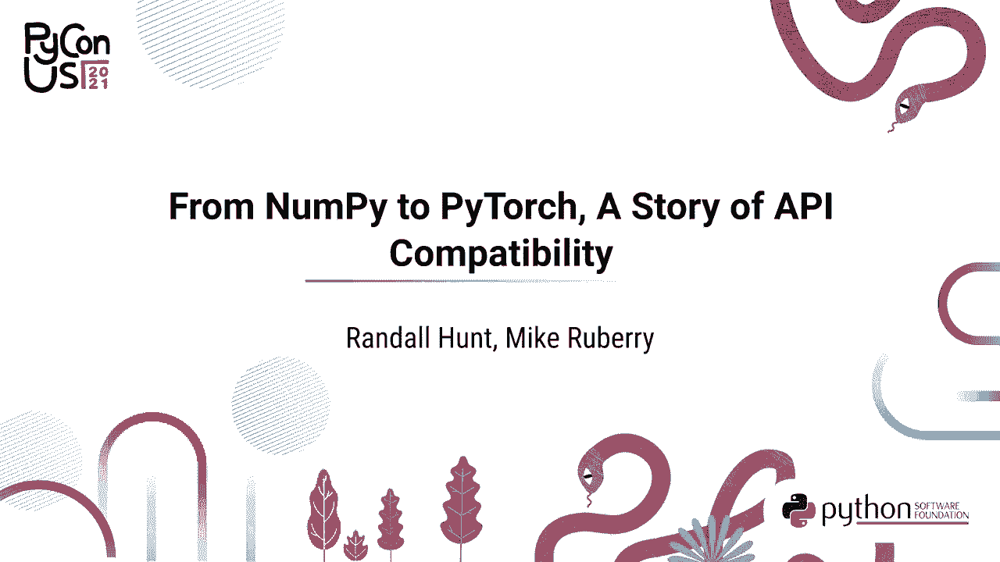

 And this talk from NumPy to PyTorch is all about how PyTorch has translated。

 and continues to translate operators from NumPy。 Here's the talk outline。 It's got five parts。

 In the first part， we'll have a couple minutes on NumPy and operating on tensors。

 Then we'll talk about PyTorch， hardware accelerators， autograd， and computational graphs。

 Using that context， we'll look at how NumPy operators have been and continue to be added to PyTorch。

 Then we'll talk about a few places where PyTorch is different than NumPy and why we think that's okay。

 And we'll finish with lessons learned from adding these operators and plan future work。

 So let's dive in with NumPy and use that to very briefly introduce operations on multi-dimensional arrays。

 which NumPy simply calls arrays， but since PyTorch refers them as tensors。

 I'll refer them as tensors in this talk。

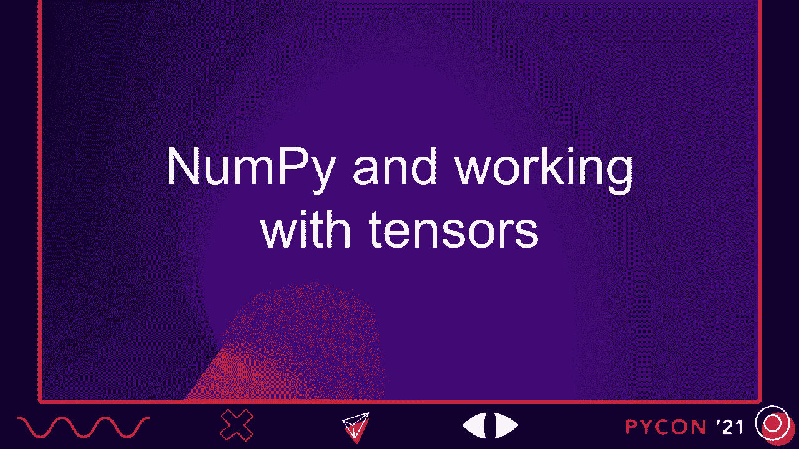

 A simple sample NumPy program shown here can help us get started。

 This program starts by creating a matrix， a two-dimensional tensor。

 And tensors are interesting because they can represent a tremendous amount of data。

 including images and text， and they can be efficiently manipulated by modern hardware。

 They're critical for modern scientific computing and the basis for modern deep learning。

 In the middle snippet， another matrix is created and the matrices are added element-wise together。

 And in the final snippet， the two matrices are matrix multiplied。 Of course。

 NumPy can do much more than what we just saw。 Here， for example。

 are some more complicated domain-specific snippets。 In the first snippet。

 a fast Fourier transfer is performed， and in the second snippet。

 the Scholesky decomposition of a complex matrix is computed。 Obviously。

 this talk won't be going over all of NumPy's thousand plus functions。

 but it supports a tremendous amount of functionality。 Behind the scenes， NumPy operators are。

 conceptually。

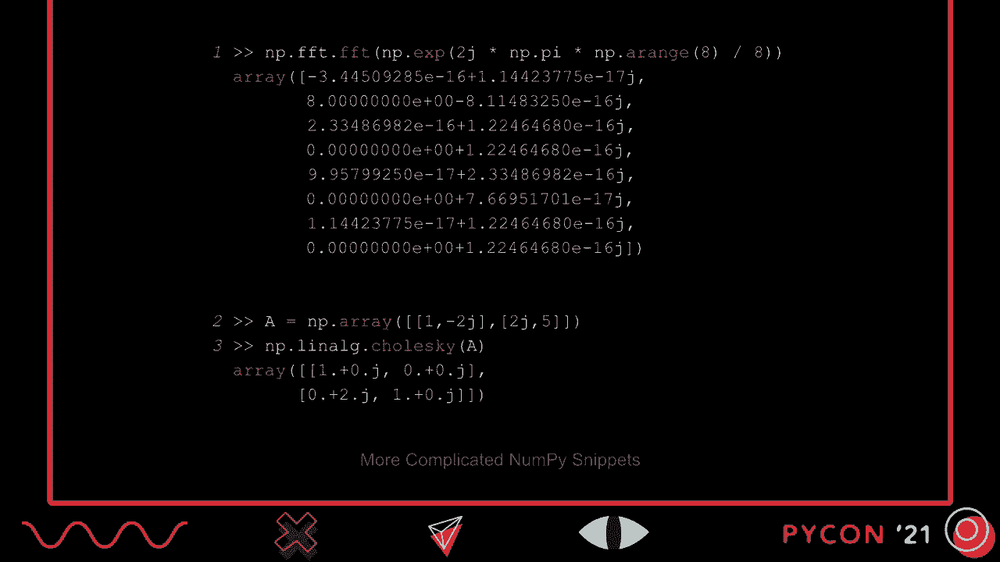

 implemented either as composites， which are composed of other NumPy operations， or primitives。

 which have their own kernels。 A kernel is just a special name for a function that operates directly on a tensor's values。

 The distinction between composites and primitives is important from an implementation perspective。

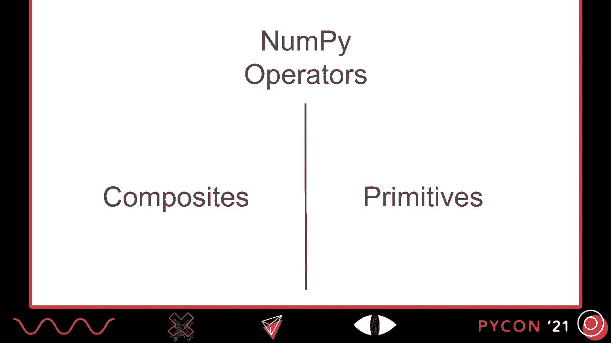

 A composite NumPy operation， like the sink operation shown at left。

 is typically implemented in NumPy using Python。 The mathematical definition of the sink operation appears at top。

 and the Python implementation in NumPy at bottom。 Primitive operations， however。

 are implemented in C++。 Here's part of the implementation of NumPy's copy-sign operator as an example。

 When operations are implemented in C++， there's generated glue or binding code。

 that connects the Python function copy-sign to its C++ implementation。 Unfortunately。

 there's some overhead associated with this binding， and we'll briefly revisit that topic later。

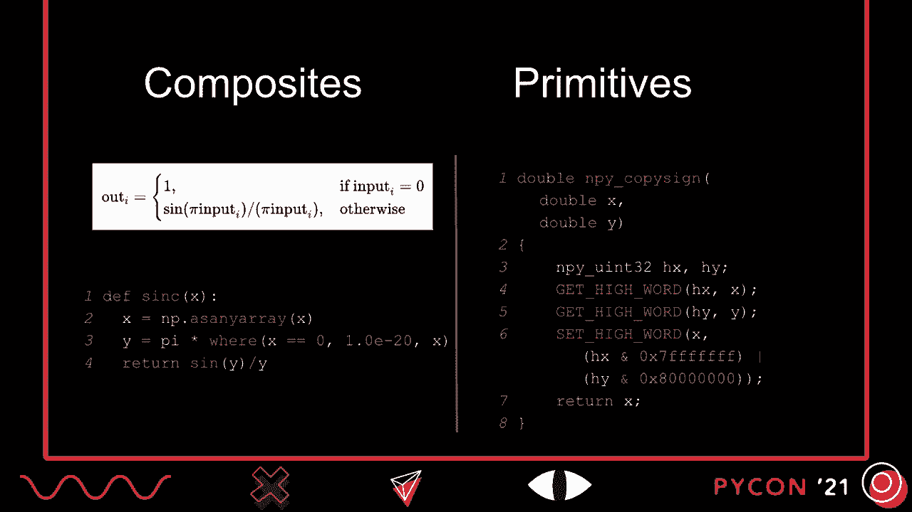

 Now that we've had an extremely brief tour of NumPy as a Python package。

 with tensor operations that's written in both Python and C++。

 let's switch over to PyTorch and expand our discussion to include hardware accelerators， autograd。

 and computational graphs。

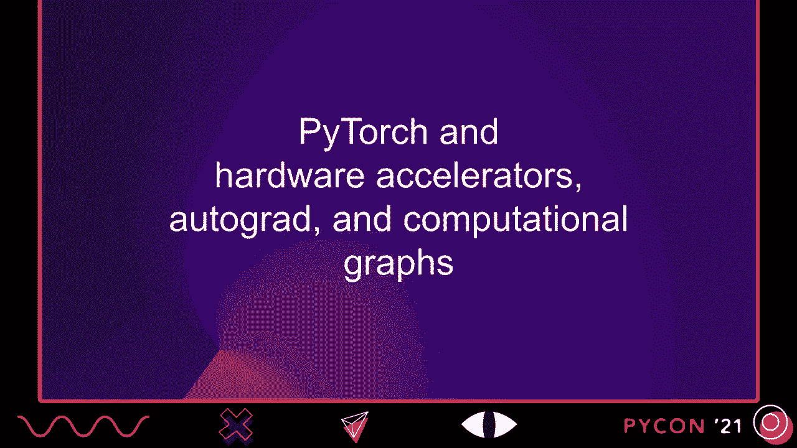

 Like NumPy， PyTorch is also a popular Python package for operating on tensors。

 and its user interface is extremely similar to NumPy's。

 Let's see that by translating our simple NumPy program to PyTorch。 In the first snippet。

 we just need to swap the word array for tensor。 In the second snippet， nothing changes。

 except we're now using the torch namespace， and the same is true in the third snippet。

 So here's our simple PyTorch program， a drop-in replacement for the original NumPy program。

 That suggests that in PyTorch and NumPy are basically equivalent for simple programs。

 but what about more complicated examples？ Well， here's our complicated NumPy snippets。

 and here's the same snippets in PyTorch。 We can actually see that printing prints a few less digits in PyTorch by default。

 but that's actually customizable。 Otherwise， we have the same operations。

 PyTorch doesn't just implement many of NumPy's operators either。

 PyTorch and NumPy tensors can actually be converted between the two frameworks， as shown here。

 where a PyTorch tensor is passed to NumPy， added with a NumPy tensor。

 and then the result is translated back to PyTorch。

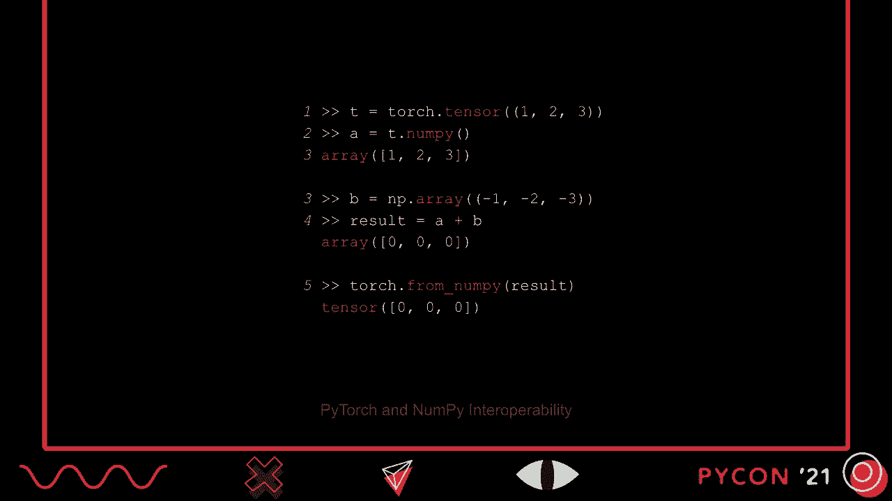

 Our discussion so far might suggest that PyTorch implements every NumPy operator。

 but that's not the case。 NumPy is more than a thousand operators， but many of them are rarely used。

 have only niche application， are deprecated， or are in need of deprecation。 In fact。

 NumPy's maintainers are probably the first people to tell you， that NumPy has too many operations。

 So PyTorch doesn't implement them all， and I don't know of any framework other than NumPy。

 which does。 But PyTorch does have hundreds of NumPy operators。

 and we've focused on implementing those our community cares about。

 I'll elaborate more on the community aspect of this later。

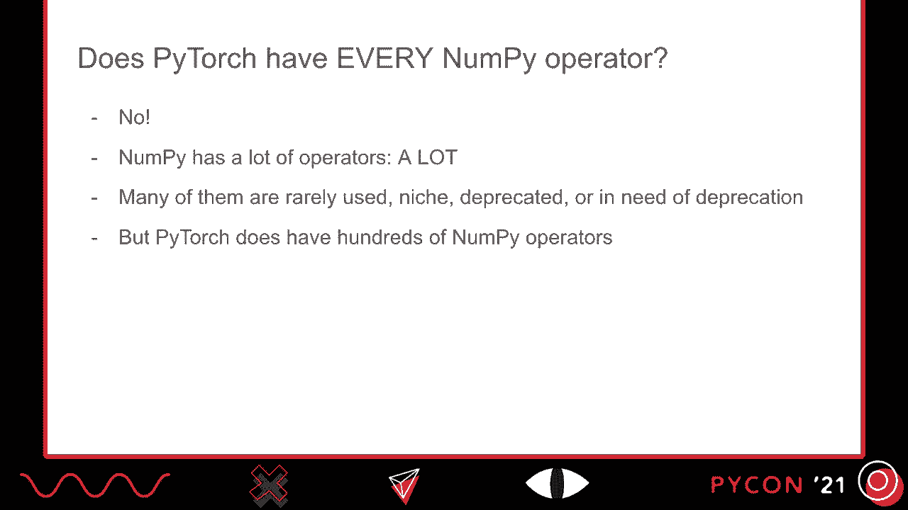

 Now let's start to talk about how PyTorch is different from NumPy。

 because it's being identical to NumPy would be pointless。

 We already have NumPy to be identical to NumPy。 So PyTorch has several features。

 like hardware accelerator support， that NumPy doesn't have。

 Here's our simple snippets with the tensors and computations performed on a CUDA device。

 Close observers may have noticed one small hitch with this program。 In line five。

 the tensors are now converted to the float D-type for the matrix multiplication。

 We haven't talked much about tensor data types so far。

 but operations on different devices sometimes support different data types。 In this case。

 the CUDA matrix multiplication uses a math library。

 and that math library doesn't accept integer tensors as inputs。 Importantly though。

 even though data type support might vary slightly between device types。

 the semantics of PyTorch programs remain the same， either run on a CPU device， a CUDA device， a TPU。

 or another hardware accelerator。 In addition to support for hardware accelerators。

 PyTorch also has built-in autograd support。 This short snippet shows the computation of a gradient for a tensor。

 after it's been point-wise multiplied with another。 Although not the subject of this talk。

 autograd is especially useful when training neural networks。

 PyTorch also supports the construction and optimization of computational graphs。

 If we go back to the sync function， we can pretend for a moment that PyTorch didn't have its own implementation。

 and we were writing one in Python。 We could tell PyTorch's TorScrip compiler to read the Python implementation of the function。

 and create a computational graph for it。 The computational graph on this slide actually hints at how operators and PyTorch are implemented。

 but the important takeaway for us now is that these graphs allow for cross-operator optimizations。

 and they can reduce the overhead of moving between Python and C++。

 by invoking the series of operations from Python one time。 In addition to TorScripch， as shown here。

 PyTorch also supports creating and optimizing computational graphs with its TorchedoutFX package。

 and the XLA deep learning compiler， which is also used by the TensorFlow and Jax frameworks。

 Support for hardware accelerators， autograd and computational graphs make PyTorch great for deep learning。

 and PyTorch is its own state-of-the-art neural network library。 In this very brief snippet。

 we just see the construction and use of a single linear layer。

 which is a common component of many neural networks。

 So while PyTorch doesn't have every NumPy operator。

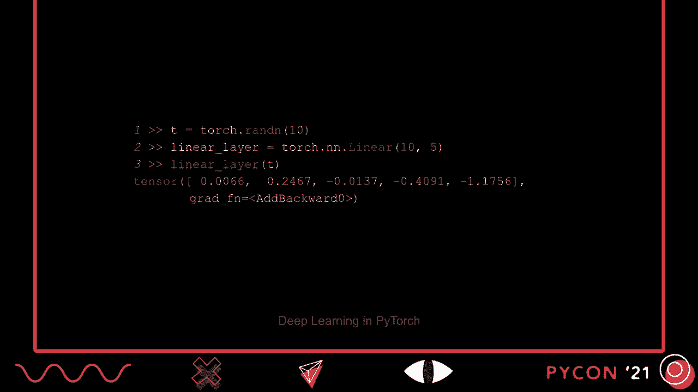

 those it does implement we can think of as NumPy plus additional features like accelerator support and autograd。

 And to be clear， PyTorch also has additional operators that NumPy doesn't。

 particularly operators from SciPy。 So that's a bit of what PyTorch looks like to users。

 but behind the scenes， PyTorch operators are almost always implemented in C++ or a mix of C++ and device-specific code。

 This would include CPU intrinsics and CUDA， for example。

 It also supports executing operators as computational graphs。

 and differential operators get autograd formulas。 Let's look at PyTorch's implementation of sync to make this more concrete。

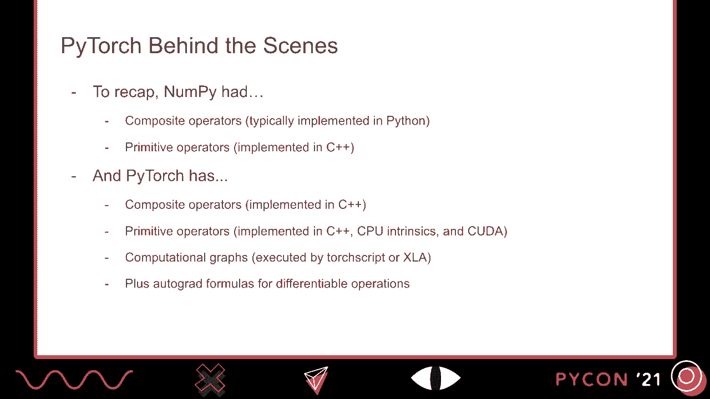

 As a reminder， here's the definition of the sync operation and its implementation in NumPy。

 Now here's the implementation of that operator in PyTorch for the CPU。

 There's a lot of supporting architecture that we don't have time to review here。

 but line 6 through 10 are the heart of the kernel which computes this operation。

 Since the CUDA kernel looks very similar to the CPU kernel。

 let's skip ahead to the autograd formula for sync， which is actually written in Pythonic YAML。

 More complicated autograd formulas can be directly implemented in C++。

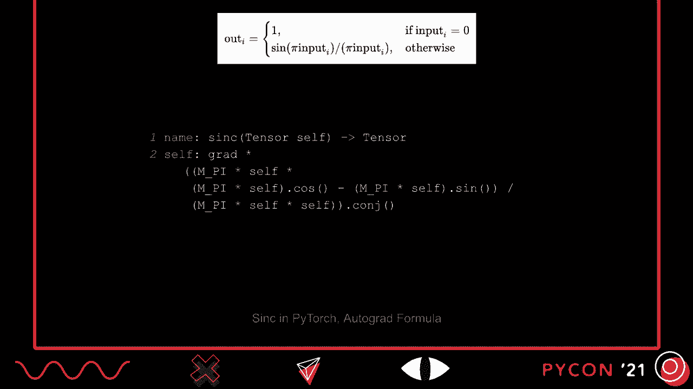

 With that background on NumPy and PyTorch， let's look at what's involved in adding a NumPy operator to PyTorch。

 and why we think it's important to add NumPy operators。 To port a NumPy operator to PyTorch。

 we typically need three things。

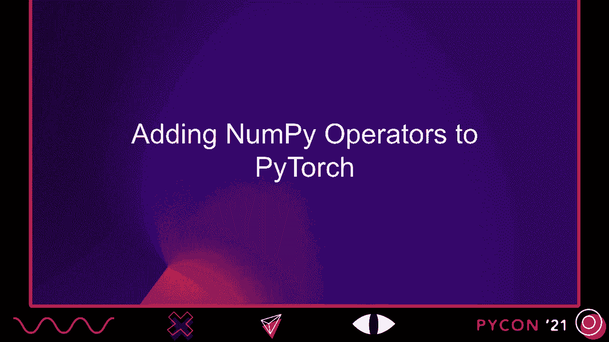

 We need to write a C++ implementation， and if the operation is a primitive op， a CPU。

 and a CUDA kernel。 We need to write an autograd formula if the op is differentiable。

 and we need to write comprehensive tests that validate the operator works correctly。

 Since that's no small amount of work， it's reasonable to ask why we bother at all。

 Why does PyTorch think implementing NumPy operators is important？

 One way we know it's important to implement NumPy operators is that our community often asks us to。

 On this slide， I've included some requests for NumPy and SyPy functionality。

 Even better than asking for NumPy operators， however。

 the PyTorch community has helped implement dozens of them。

 Here's a portion of one of our GitHub tracking issues。

 Most of the GitHub names here are community members。

 One surprise when we engaged the community was not just how eager they were for more NumPy functionality。

 but also how frustrated they were with the few cases where PyTorch's behavior was divergent from NumPy's。

 Here's a comment from one community member on the same issue we just saw。

 They were so irked by PyTorch diverging from NumPy in a few places that they were thinking of switching to a different framework。

 I'll come back to this point again later。 Our communities made it really clear that faithful implementations of NumPy operators are important。

 Given that， how can we best facilitate porting operators from NumPy to PyTorch？

 We already briefly saw that there was some supporting architecture for writing a kernel in PyTorch。

 and we saw that autograd formulas can simply be expressed as Pythonic yaml。

 But that still leaves us with test to write。 PyTorch has a huge test matrix。

 If every test had to be written by hand， then it would be harder to write our tests than our operators。

 To simplify testing， we've developed our own test generation framework that works with both PyTest and UnitTest。

 Since I don't have the time today to elaborate on each of these three systems。

 I'll just describe more of our test framework since it's implemented in Python。

 A little more detail on PyTorch's test matrix。 When testing PyTorch operators。

 we need to account for different tensors and a variety of PyTorch systems。

 Doing so is challenging for two reasons。 One， handwriting all of these test variants would be hundreds of lines of code。

 and two， developers would need to be familiar with these different systems and device types。

 Requiring developers write all that code and that they'd be familiar with so many systems is not a real option。

 So that means we can either give up on test coverage or we can start generating tests automatically。

 and PyTorch shows the latter approach。

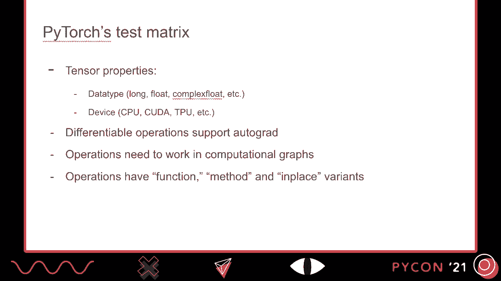

 The heart of PyTorch's new test framework are op-infos。

 These are Python classes that describe an operator， its test directives。

 and include a sample inputs function that can return valid inputs to the operation。

 Here's the op-info from Mole or Multiply in NumPy。 In fact。

 we can see that NumPy name is alias to the original PyTorch operation。

 This op-info describes which data types the operation supports on lines 3。

 and then points to its sample inputs function on line 4。

 Here the sample inputs for Mole are the same as for other binary element-wise operations， that is。

 functions that operate on two tensors in an element-wise fashion。

 In addition to the base op-info class， we also have subclasses with additional metadata。

 Here's an op-info for the sign operator， which is actually a unary u-funk， that is。

 a function that accepts a single tensor and operates on it element-wise。

 Instead of being the op-info base class， it's actually the unary u-funk info subclass。

 Note the reference NumPy function on line 2。 That reference pointer and the structure of unary element-wise operations actually lets us automatically generate every test we need for Torx。

sign， and we can validate that it works just like it's NumPy reference to。

 Op-infos alone don't generate tests of course， because they're just simple Python classes。

 So for that we use the ops decorator， which takes a sequence of operations to review when instantiating a test template。

 Here's one test template that supports unary u-funks like sign。 It accepts a device， data type。

 and the op-being tested， and then it validates that the result of the operation is the same。

 whether its inputs are contiguous or not。 The actual test isn't so important here。

 What is important is to understand that this test is designed to run on every unary u-funk。

 not just sign。 Before the tests are actually run by PyTest or Unitest。

 these test templates need to be instantiated。 The instantiated tests for this template and the sign operation are shown here。

 The test names include the name of the operation， the device type。

 and the data type that are passed to the test。

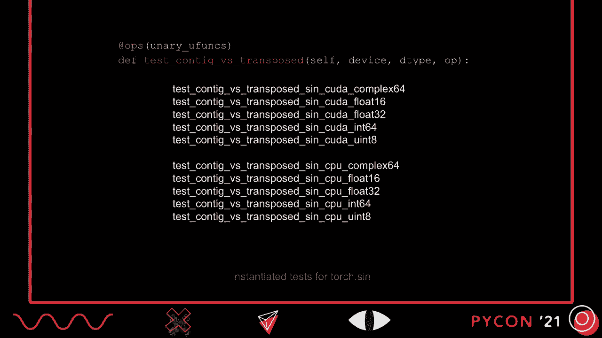

 Some of PyTorch's automated op-info tests validate the operator's autograd formula。

 support for Torx Script and Torx。fx， and the consistency of its function， method。

 and in place variance。 The one thing the basic op-info class can't do is test that the operator actually computes what it should。

 Although， as I mentioned， in special cases， like the unary u-funks。

 we've written tests that exploit the operator's structure and a reference function to validate it。

 In most cases， we don't understand the operator enough to know what it should do。

 Some features of our test generator are。 It works with both PyTest and Unitest。

 It dynamically identifies available device types when running the test suite。

 So if you have a machine that doesn't have a CUDA device， for example。

 CUDA variance of test templates won't be instantiated。

 It allows for device type setup and tear down。 So we can do different things when setting up a CUDA device。

 like checking for memory leaks， then we do with the CPU。 It's extensible by other packages。

 The PyTorch XLA package， for example， adds XLA devices to the test framework programmatically。

 The op-info repository acts as a single source of truth for all our operator's functionality。

 And it's easy to write new tests that run on every PyTorch operator。

 or on a more structured subset of those operators。 Systematic testing of new features。

 like PyTorch's support for complex tensors， has been made tremendously easier with our op-info pattern。

 New data types can just be added to the list of data types and operator supports。

 and they'll automatically be tested。

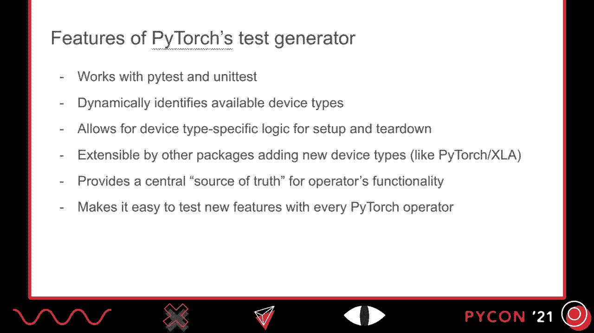

 So far we've talked about how PyTorch is like NumPy， but with extra stuff。

 But now let's look at a few cases where PyTorch has chosen to be different than NumPy。

 These discrepancies are rare， and most of them are small。

 but there are a few places where PyTorch is loudly divergent。

 So here's a simple difference to get us started。 This is a change that we wanted to make for consistency with the rest of PyTorch's UX。

 and it's with the return type of the reciprocal function。

 Reciprocal is an element-wise operation that competes the reciprocal of each value in a tensor。

 In NumPy， as seen at left， the reciprocal of integers is computed using integer division。

 or truncation division， so the result is zero for every number other than one。

 We thought that behavior was inconsistent with division in Python， PyTorch。

 and actually NumPy itself， because in those systems one divided by two is typically a half。

 So we changed the behavior in PyTorch for consistency， and you can see that at right。

 Another example of a small difference between NumPy and PyTorch is the iG function。

 which competes the eigenvalues and eigenvectors of a matrix。 At left。

 we can see that NumPy has returned to real-valued tensors。 Well， at right。

 PyTorch returned to complex tensors for the same input。

 It turns out that the eigenvalues and eigenvectors of a real-valued matrix can be either real-valued or complex。

 and NumPy returns them as complex， only when necessary。 PyTorch， on the other hand。

 always returns complex tensors。 This change was actually motivated by PyTorch's support for computational graphs。

 who want to infer the shape and data type of an operation's outputs from the shapes and data types of an operation's inputs。

 The NumPy version of this operation wouldn't allow this。

 because two matrices with the same shape and data type can end up producing either floating point tensors or complex tensors。

 Now let's look at a larger discrepancy。 In NumPy， complex tensors have maximums and can be sorted。

 But in PyTorch， we throw a runtime error when a user attempts either of these operations。

 This is because complex numbers don't belong to any totally ordered field。

 so there's no mathematically intuitive way to say one is greater than another。

 We didn't think sorting like NumPy does， based on the real value and then the complex value would be intuitive for users who didn't come from NumPy。

 But we also knew that we couldn't implement another comparator without being too different from NumPy that people would notice。

 So in this case， we decided to simply throw a runtime error and inform the user that these operations aren't supported。

 It's important that in all three of these cases， the change from NumPy was principled。

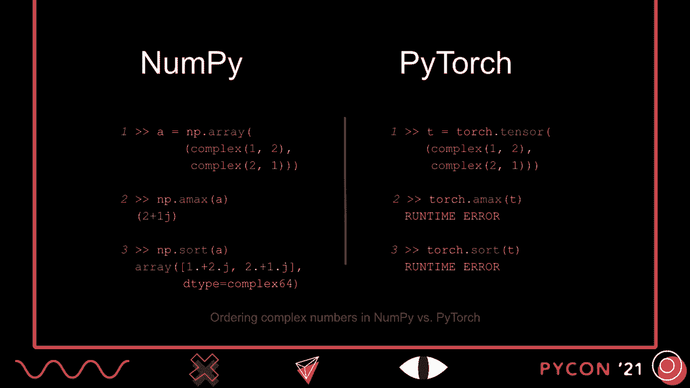

 It was motivated by a desire to be more consistent。

 While we saw it earlier that users want faithful implementations of NumPy operators。

 it turns out that these principal discrepancies are okay。 In fact。

 PyTorch has systemic discrepancies with NumPy that pass with little or no comment from our community。

 Our type promotion behavior， for example， is different because PyTorch prefers the floating point data type。

 while NumPy prefers the default of the more precise double data type。 Also in PyTorch。

 functions and method always compute the same operation， but in NumPy they can be slightly different。

 And as the sharp-eyed may have spotted in an earlier snippet， NumPy sometimes returns scalars。

 while PyTorch consistently returns tensors。

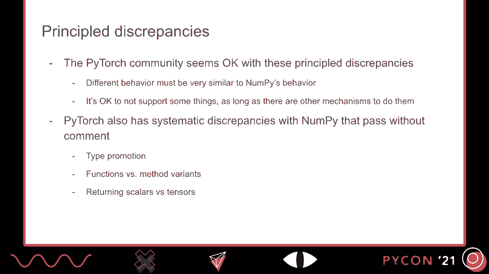

 Let's take a minute to recap， then talk about what we've learned from porting NumPy operators to PyTorch and discuss future work。

 So here's the whole talk so far， in case you just walked into the room。

 NumPy and Python are popular Python packages。 They operate with tensors。

 PyTorch implements many of NumPy's operators， but not all。

 and it extends them with support for hardware accelerators and systems like AutoGrad。

 The PyTorch community wants faithful implementations of NumPy operators。

 but it's also okay with principal differences as long as they keep PyTorch consistent with itself。

 To make implementing NumPy operators tractable， PyTorch has developed a variety of supporting architectures。

 Given that recap， what should we learn from this talk？ First。

 do the work to engage your community and listen to what they tell you。

 When PyTorch started refocusing on NumPy operators over a year ago。

 it wasn't clear whether the community just wanted the functionality from NumPy or fidelity to NumPy。

 And they've now made it clear that they want faithful implementations of NumPy operators。

 but they want those implementations to be consistent with PyTorch's UX。 Second。

 focus on developer efficiency。 Supporting architecture like PyTorch's test framework has saved years of developer time。

 Third， be clear about your own principles， especially when implementing a user experience from another project。

 Blindly implementing NumPy operators would have led to a really inconsistent PyTorch experience。

 In the future， we plan to focus more on deprecating Word Word divergent with NumPy instead of adding new NumPy operators。

 We're also interested in adding more operators from SciPy。

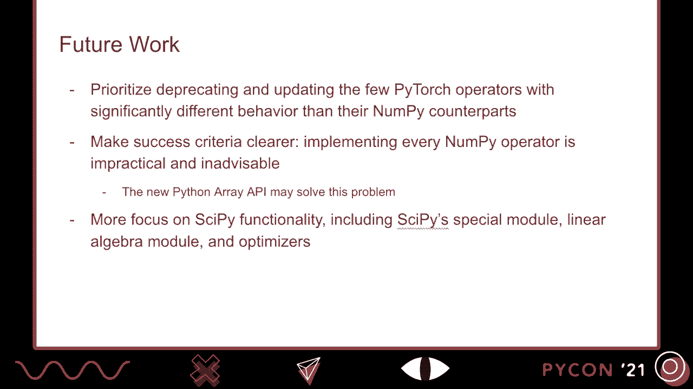

 Thank you for coming and listening to this talk， and I hope you enjoy the rest of PyCon 2021。

 [BLANK_AUDIO]， [BLANK_AUDIO]， [BLANK_AUDIO]， [BLANK_AUDIO]， [BLANK_AUDIO]， [BLANK_AUDIO]。

 [BLANK_AUDIO]。

