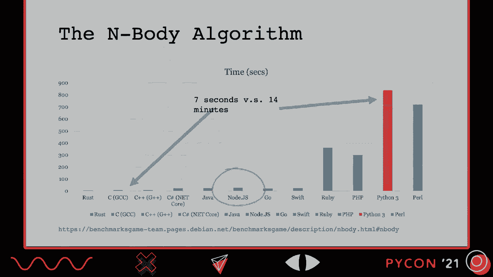
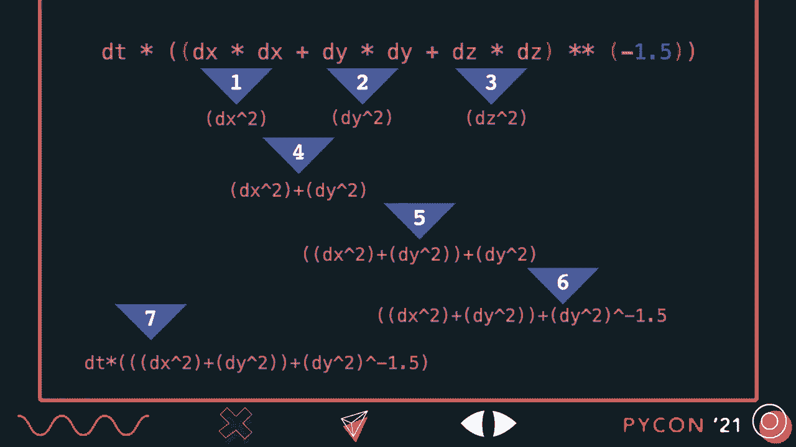
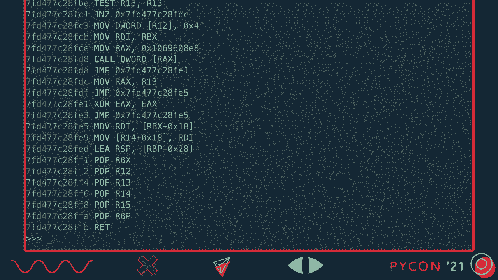
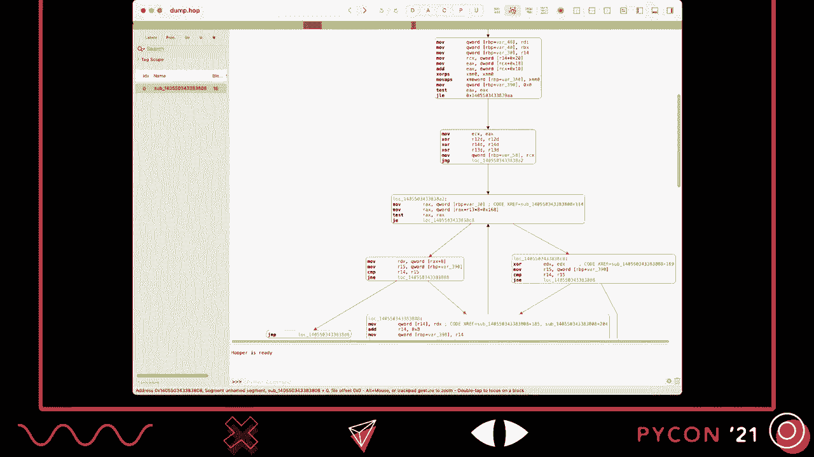
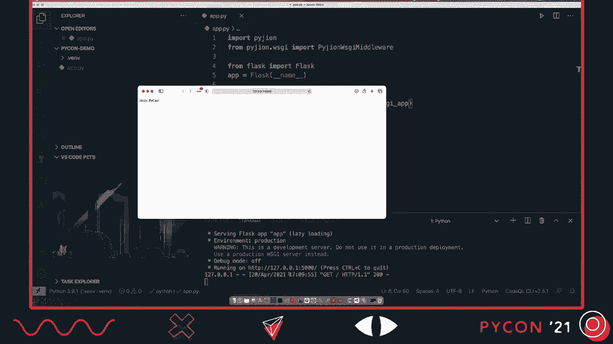
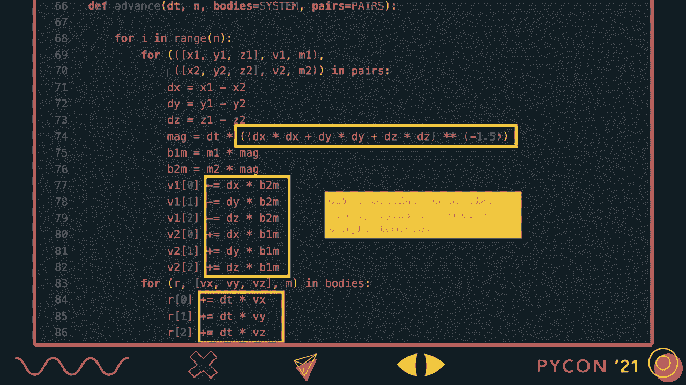
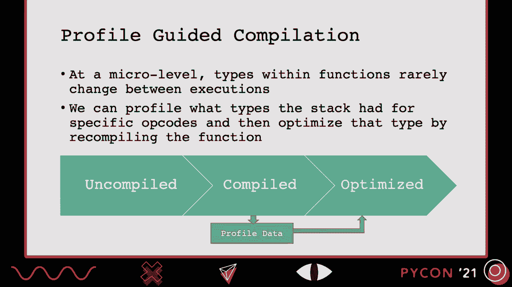
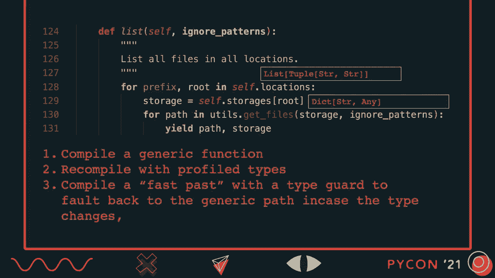
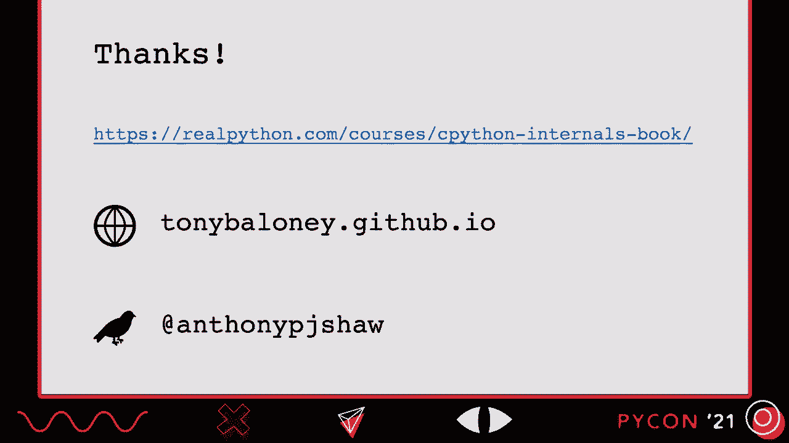

# P2：TALK _ Anthony Shaw _ Restarting Pyjion, a general purpose JIT for Python- is it - VikingDen7 - BV19Q4y197HM

 [Music]。

 Hi everyone。 I hope you're really enjoying Pike on US 2021 so far。 I'm really excited to be here。

 to present something to you today called Pigeon which is a project that I've been working on for。

 the last nine months and yeah I want to say a big hello to all the international Pythonistas out。

 there and so pleased that everyone can make it this year virtually and really look forward to seeing。

 you in the future face-to-face。 In this talk we're going to cover five main topics in a short space。

 of time。 Some of these topics especially the JIT compiler are very niche technology areas。

 I'm not assuming that everyone watching this talk is a compiler expert but I'll really try my best。

 to break down some of the topics。 We don't have that much time。 If you find yourself wanting to。

 learn more by the end of the talk there are plenty of links to follow up with or you can reach out to。

 me directly。 So first off let's recap from my Pike on US 2020 talk why is Python slow？ I strongly。

 recommend you watch that talk because it gives some context for why I'm looking at a JIT to solve。

 some of Python's performance challenges。 In that talk I talked about a particular benchmark。

 called the N-Body Algorithm。 The N-Body Algorithm is a mathematical formula that can calculate the。

 orbits of the Jovian planets which are Jupiter， Saturn， Uranus and Neptune。 I picked N-Body because。

 the Python implementation suffers from an extreme case of some of the causes of its general slowness。

 If you compare C and C-Python 3。9 which is written in C the execution times are not even in the same。

 galaxy that learn the same planet。 Even Ruby， PHP and Perl but Python to shame on this algorithm。

 when it comes to speed but it's not those languages I'd like to compare Python against。

 its JavaScript。 JavaScript is equally dynamic it has a GC and it kind of even has a gill as well。

 So how is no JS which runs JavaScript so much faster than Python？

 This is the guts of the Python N-Body implementation。

 To summarize what's happening here it's looping， over a list of tuples unpacking them and then performing a number of calculations and floating。

 point numbers。 I've highlighted the core integral of the algorithm here all of the highlighted。

 variables are floats。 Something that's important is that Python won't do anything clever with the。

 operators。 The compiler knows the order of operations and emits the bytecodes in the correct sequence。

 It uses a mnemonic that maybe you land at high school like Bodmap or Pemdas。

 The Achilles heel of this calculation is at the result of each multiplication。

 addition subtraction is a new floating point object which then gets D reference to the next operation。

 Let's expand line 74 on I'll show you what I mean。 In this equation Python will run four。

 multiplication operations， two addition operations and one power operation。 The resulting floating。

 point numbers have to be allocated in memory。 The native C float has to be converted to a。

 pie float object and then in the very next operation it gets converted back into a C float。

 The reference count becomes zero and so the memory is freed。 You might think that memory is fast。

 but the floating point numbers in steps one to six in this diagram are all temporary objects。

 so they get allocated and then deallocated almost instantaneously。 So if you think of the time it。

 takes to do that multiply that by the half a million iterations this loop executes and then。

 again for each planet and then again for each step。 It's actually over a billion operations。

 of this particular line so when you add all that up it adds up to a lot of execution time。

 If you were to convert this function to a siphon module and annotate all of those variables as。

 doubles it would bypass the temporary object allocations and siphon would compile that down to。

 execute about eight times faster。 It does this because a floating point number still fits within。

 64 bits so the CPU can keep that on the register and it doesn't have to allocate and deallocate memory。

 from the heap to do the calculation。 If you were to run anybody using another JIT， PiPy。

 it has its own mechanism for removing the allocation and deallocation of these temporary objects。

 The PiPy approach is super efficient on the CPU but it does consume more memory。 This is a。

 common issue with JITs to have high memory usage at the expense of reduced execution times。

 So let's recap the conclusion of why is Python slow。 There's a temporary object problem。

 There's the evaluation loop of CPython and the big overhead that that has。

 so tight loops and cycles are really slow。 Most attempts at improving the performance of Python。

 come with major drawbacks to either compatibility or platform support。 And so having a truly。

 compatible optimizer for Python is actually pretty tricky。 The garbage collector is a stop。

 everything collector unlike Node。js which does a multi-threaded mark process。 And lastly。

 the theory is that a specialized JIT could help in some scenarios。

 There are plenty of projects which add a JIT compilation to your Python code depending on the。

 domain。 For data science and in particular for NumPy there's the number project。 Number is a。

 decorator that you wrap on certain functions with annotations on which underlying types are used。

 It will then JIT compile parts of the function to benefit NumPy calls。 If you're already using。

 NumPy this is great but if you're just writing general Python code it likely won't make any。

 difference at all it might even make the code slower。

 Next there's the piston project which is a fork， of CPython that includes a JIT for some operations using the LLVM JIT engine。

 Number claims performance， gains are 10 to 20% compared to CPython 3。9。

 However the drawbacks is that it's a close source。

 project and that it's a runtime that you have to deploy install and support as well。 And lastly。

 the PyPy project a Python interpreter written in Python which has a mature JIT that will deliver。

 massive performance gains in many scenarios。 The drawbacks with PyPy is that in some cases it's。

 significantly slower than CPython and also it lacks a lot of compatibility with C extensions。

 I think there's still a gap here for a general purpose JIT that focuses on compatibility。

 and delivers performance gains to plug some of the pitfalls in CPython's eval loop。

 This is where Pigeon comes in。 Pigeon is a JIT compiler for CPython bytecode。

 You can pip install it from PyPy and it's compatible with CPython 3。9。 Pigeon is compiled for Linux。

 MacOS and Windows。 It supports 64-bit Intel CPU architectures and I'll work on ARM support if。

 somebody can buy me an M1。 Something I want to make super clear。 Pigeon is not another Python。

 interpreter。 It works inside CPython 3。9。 Pigeon is not a new project either。 It was originally。

 presented at PyCon 2016 by Brett Cannon and Dilla Veland。 It was written against the Python 3。

6 byte， code。 It also only worked on Windows and it required a custom build of Python because it required。

 PEP 523 which wasn't yet merged and then was later introduced in Python 3。7。 It was also written。

 for a JIT compiler based on 。NET Core 1。0 beta which is long since past。 So I have all intents。

 and purposes rewritten the original project over the last nine months。

 The design of it is very similar， but there's some fundamental changes which I want to talk about。

 I know the original project was， seeking optimizations through the use of unboxing integers and floats but I've largely abandoned。

 that idea。 I don't think the effort is worth reward and there are better options of functions。

 which use lots of floats and integers。 Pigeon focuses on compatibility。 If it runs in CPython。

 it should run in Pigeon。 The JIT startup overhead should be minimal。 Especially if subinterpreters。

 are widely adopted beyond Python 3。10。 This can't be like waiting for a big VM to boot like the Java。

 VM。 Beyond enabling the JIT， Pigeon should not require any changes to the code。

 It shouldn't require， type annotations or rubber functions。

 I'm assuming that people want to use a general purpose JIT for， code that they don't control。

 they don't want to change， they really just want to enable the JIT。

 in already working code and have it optimize where possible。 Lastly， I want this to be able to be。

 deployed anywhere。 If you're using a cloud environment where you don't control the Python。

 that's installed， you should be able to pip install and import Pigeon。

 This opens up opportunities for， all sorts of past platforms where you can add this to optimize your existing code。

 To understand how Pigeon works， let's look briefly at the components that make up C Python's。

 compiler an execution process。 So first you have your Python code。 This is parsed in Python 3。9。

 using the shiny new Pige parser。 The parser will read your code and understand how and where you've。

 used the Python syntax。 It will also throw up things like syntax errors when you make mistakes。

 that couldn't even be parsed。 The parsed code is emitted as an abstract syntax tree or AST。

 ASTs are very useful representations for the Python compiler。 The Python compiler。

 compiles down each function into small sequential atomic commands called bytecodes。 These bytecodes。

 are cached on disk in your dunder pi cache folder and each time Python executes your code。

 it will loop through the bytecodes and call the corresponding APIs within CPython to bring your。

 code to life。 It also does the work of interconnecting with C extensions。

 handling memory allocation， threading， garbage collector and quite a lot else。

 So Pigeon inserts itself between the compiler， and the evaluation stages。

 It will recompile the Python bytecode into native machine code。 And it does this at runtime。

 which is what makes it a jit compiler。 Pigeon will kick in when a。

 function is run a certain number of times。 It compiles the Python bytecode into an intermediary。

 language called ecmesil。 Ecmesil is used by the 。net compiler。 This is the 。net 5 compiler。

 not to be confused with the older 。net。 The use of the 。

net 5 jit is really an implementation detail， and in no way helps you doing anything 。

net related or working with any 。appis。 It was selected because。

 the sill is a good cross platform level。 And 。net 5's review jit compiler is a mature well supported。

 jit compiler that supports Intel CPU X64 and ARM。 So the compiled code is assembly。 Well。

 actually it's machine code， but it's a compiled binary kept in memory。 So Pigeon compiles。

 each of your Python functions into executable symbols and caches them in RAM。

 All of this is really theoretical and a lot easier to explain with a demo。

 Pigeon is pip installable。 So you start off with the Python 3。9 virtual environment。

 Pip install Pigeon。 Start up a Python 3。9 REPL and we can see the compiler in action。

 Let's define a crude Python function that divides numbers in half。 So we'll take an input of X。

 and we'll return X divided by 2。 So once you declare this function on the REPL。

 CPython will have compiled it and stored the code object in the dunder code attribute of。

 the function object。 You can disassemble the function into CPython bytecode using the。

 DIS method in the DIS module。 If you use Pigeon， you first need to import the Pigeon package。

 and then enable the jit compiler。 If you execute the half function。

 the jit will kick in and compile， those Python bytecodes into machine code。

 Pigeon uses a hidden field in the code object called。

 Co-extra to store a dictionary of attributes of its jit compiled state。 This includes the binary。

 instructions for the compiled function。 You can see the status of this by using the info function in。

 the Pigeon module。 This result tells us that it has compiled a function， it's executed once。

 and that the PGC status is one which I'll come to later。 I've also included a disassembler。

 into Pigeon。 So you can see both the echima-sil instructions as well as the assembly。 You can。

 sell the sil instructions by using the Pigeon。dis module and then called in the dis function and。

 passing it the function object。 The method calls an IL a referencing Python C API。 So Pigeon will。

 use your operating systems ABI to call the Python 3。9 C API where required。 In the case of this。

 half function it will call the pi number underscore divide which is part of the C API because it has。

 no idea what X is so it's just going to say right I assume it's a number and I'll just do the division。

 operator。 You can go a level deeper and disassemble the compiled machine code into x86 using the dis。

 underscore native function。 If you want to use an external disassembler you can dump the compiled。

 binary code using Pigeon。dump native to disk and then load it directly using a tool like Hopper for。

 example。 So a function that divides numbers in half is pretty unimpressive so let's try something a。

 bit more interesting。 This is a dead simple flask application and I've bundled a whiskey middleware。

 with Pigeon that all it really does is when it initializes it enables the jits。 So you can use。

 it with frameworks like flask and Django and if you've deployed it with a web worker， a whiskey。

 worker like G unicorn for example it'll enable the jit compiler on your whiskey workers so that。

 your web application， your routes， your functions and everything will all be jit compiled。 So once。

 you've added this whiskey middleware just use flask as normal。 So if we start up that script。

 right and we can see that's running and listening on the port and flask is working as normal。

 So this， required absolutely no change just the existing code other than obviously to import the whiskey。

 module but that can be done once at the application level。 You don't need to decorate any functions。

 you don't need to change any functions， your existing application should just work。

 So in this demo I。

 skimmed over a couple of things。 Pigeon works by attaching a special jit object to code objects。

 This is actually permitted per pep 523。 This isn't a hacky thing that we've come up with。

 This special object contains the compile binary for your function as well as some other handy data。

 CPython is still the thing that parses the code。 You don't need to worry about whether the syntax。

 will be compatible。 Pigeon never reads the code， it works at a bytecode level。 Pigeon compiles。

 the bytecode from Python 3。9 into machine code。 When you enable pigeon it tells CPython that pigeon。

 will now evaluate frames。 So after pigeon has been enabled pigeon will now evaluate all frames。

 regardless of whether or not they have been jit compiled。 If it detects that the function hasn't。

 yet been compiled it will compile it in line。 So this sounds pretty awesome， you saw that assembly。

 code in the screen so this must be ridiculously fast right？ I sadly know at least not yet。 The。

 jitted code you saw is still calling the CPython C API and the C eval loop is also compiled code。

 So the C compiler does probably a much better job actually of writing assembly than I would。

 So in terms of performance it doesn't make a difference just to call the same API and have it。

 jit compiled。 Jit compile is a faster only when they can make optimizations。 So far pigeon has 15。

 optimizations that I've written and I think when it's really pushing the boundaries that number is。

 going to be more like 100。 All of these optimizations are patterns that can be observed with a code。

 object when it's compiling。 So pigeon uses them to emit faster code which is still compatible with。

 the equivalent CPython code。 So as an example let's roll back to nbody。

 I'll show you two optimizations。

 that make a dent on the execution time when you use pigeon。 The first is really simple。

 Pigeon will notice that when you access an item in a list or tuple using a constant index like。

 here the number zero one instead of using the pylong object for the index it uses the much。

 faster C API method for getting an item out of a list or tuple using a C integer。 The second。

 optimization is one I talked about at the beginning when pigeon notices that a statement uses two。

 sequential mathematical operations on a float or long it will keep the carryover value in its。

 native type instead of constructing a new pi object。

 This takes effect for in-place operations as well， like these in-place additions and subtractions。

 The result of the right hand side of the statement。

 is kept as a native C float and the additional pi object is never allocated。 So these aren't。

 massive improvements but they're patterns which I've observed in a lot of other Python code as well。

 so they don't just apply to nbody they can be used for a number of different scenarios and actually。

 work really nicely in a general purpose JIT。 So one of the biggest challenges any Python optimization。

 is going to have is trying to establish what type things are。 So I'm working on a feature at。

 the moment called profile guided compilation or PGC。 The concept is that Python is really dynamic。

 is very hard to determine the types of variables however the types at particular。

 opcode positions don't tend to change much between executions of a function。

 If you execute a function， thousand times and every single time you send it a string and it works with strings let's optimize。

 it for strings。 PGC doesn't interpret the AST like other typing tools it's a profiler so when you run。

 the JITID function the first time it can pass some probes into the machine code。 These capture any。

 types that PIGIN is particularly interested in。 When you run the function again it will use the profile。

 and then start to make some assumptions about what it can and can't optimize。 The PGC state is。

 either uncompiled which means the JIT compiler has never seen it before。

 The second stage is to compile， it as a generic function with probes which then basically emits the profile data and then when the。

 function is executed again it will see that it has the profile data and it will recompile the function。

 and then include any optimizations that it can make。 You can see which stage is out using the。

 PIGIN。info function that I demoed earlier。 So let's take another example this is a simple function。

 in the Django source code for listing static files for a particular storage location。

 The first time it runs PGC says hey self。locations is a list， self。storages is a dictionary。

 and then when it recompiles the function with the PGC profile data it says okay let's optimize that。

 In case the type do change it compiles a type guard to inspect the value at runtime。

 and if it isn't what it was expecting based on the profile data it will default back to the generic。

 path。 So coming back to the end body algorithm I'm actually currently getting about a third of。

 the execution time in PIGIN compared to CPython 3。9。 Other benchmarks are showing promise are the。

 Fancuk and the float benchmarks which have around 20% speed improvement at the moment。

 My philosophy is that anything below 20% isn't worth the effort so I'm looking really much higher。

 than that and looking to see if we can get multiples of performance off this。 Same conclusion I'd。

 love some help on this。 JIT compiler is really fun to work on and there are at this stage thousands。

 of tests so you can see all sorts of different scenarios and how this can be worked and used。

 I think the idea has a lot of potential as a drop-in module to optimize CPython。

 and optimize code which would really benefit from a JIT and then have a transparent effect on code。

 which doesn't。 And lastly the more I look into this I'm finding problems that the PIPI project has。

 already solved so check out PIPI and see whether your code works with PIPI I think。

 they've done a brilliant job already。 There's a lot of brilliant science and research that's。

 gone into PIPI and their JIT and it can make a drastic difference to the performance of your code。

 already。 So the documentation for this project is up at pigeon。readedox。io and the sources on my。

 github repository at github。com/tonyballoni/pigeon。 If you want to understand more about CPython's。

 compiler， the eval loop， memory management， I cover all of this in my CPython internals book。

 and you can follow my blog on my website for the latest on what I'm working on or follow me on Twitter。

 Thank you and enjoy the rest of PyCon。 [Music]。

 [Music]， [Music]， [Music]， [Music]， [Music]， [Music]， [Music]， [Music]， [Music]， [Music]， [Music]。

 [Music]， [Music]， [Music]， [Music]， (buzzing)， Alright， let's go。

