# P14：Lightning Talks - Day 2 PM - VikingDen7 - BV1f8411Y7cP

 >> Welcome to the end of day two。

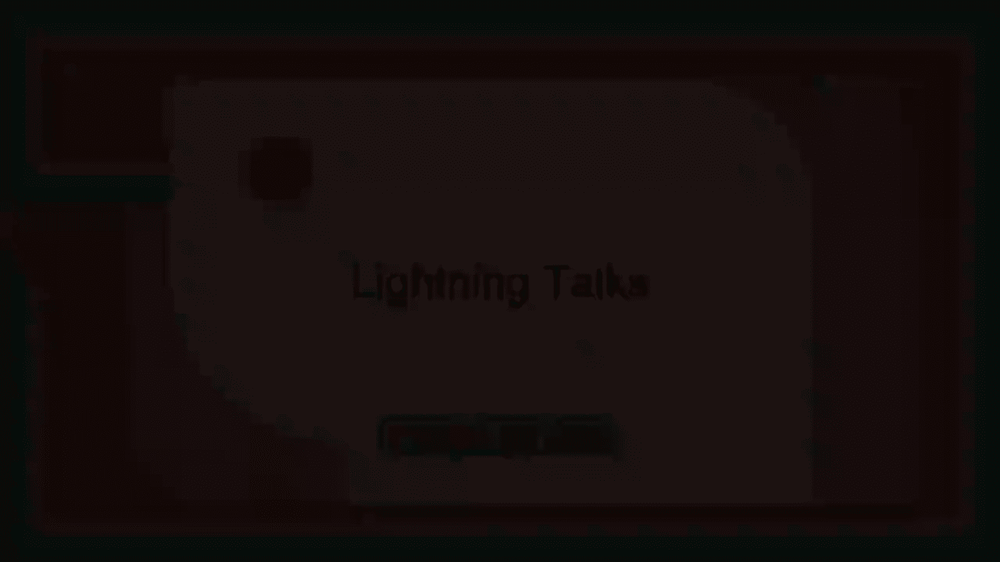

 >> Yes， welcome。 >> Let's kick it off with some lightning talks， shall we？ >> We shall， we shall。

 As a reminder， each of our speakers will get five minutes。 When we get down to around 20 seconds。

 we'll start with our small claps。 One， then two， and then we'll go into a full clap to let our lovely speakers know they are at time。

 Let's go ahead and start with our first speaker， Christian。 >> Hello。 Can you hear me？ Yeah， cool。

 Okay， so I will do some light coding， so everything will explode， but let's see。 Hola， Bonjour。

 hola， hello， shiao。 We know languages are beautiful， but sometimes they can be a barrier。

 My name is Christian， and I wanted to talk to you about Python and Spanish。

 so you can follow me there on social media， whatever， but this is not relevant now。

 So how many non-native English speakers do we have here in the audience？ A few。 Okay， for enough。

 So for us， usually learning to code requires learning English， which is not bad。

 but of course it's an extra step。 So I was thinking， okay。

 how can I put this in perspective for people to understand， the things we need to do。

 So since I like to play a little bit， I was thinking of doing something maybe silly。

 So let's start with a simple Python interpreter， nothing wrong there， but everything makes sense。

 So the first thing that I learned in Python were a list。

 So you can create a list with many elements， oh， sorry， with many elements there。

 And this was really cool because I came from Bash and Pearl， so okay， at least that's cool。

 But then you can， of course， create it in a more simpler way。 And how can you populate a list？ Well。

 you can use the famous meantras loop。 So you can go and say， like meant -- oh。

 let's try with a -- with a contador。 And meantras， contador is less than 10。

 You can go and do an -- and then increase the contador。 And then you have -- oh， by the way。

 if you are -- if you are -- if you don't know about， this at-cont。

 -- you can do a list with a lot of things。 You can do a lot of things。

 And then you can make sure that these things are the same with the typical， of the of course。

 And then you can do the typical part -- you can go there and get the item by。

 -- and then the typical -- and then the typical -- and then the typical。

 -- sometimes it's the item that doesn't exist， then you will get an exception。

 So how do we handle exceptions in Python with the typical intentar eseption？

 So if you go intentar and you go， for example， something crazy， like， I don't， know， 99。

 you can capture the eseption and then typically implement something。 Oh， no， right？ Okay。

 So of course this thing was just playing around with the C Python code。 I mean。

 I just patch everything with the grammar， nothing too serious， but yeah。

 maybe I should get another hobby。 So let's go to the solution。 I know this is not the solution。

 I don't expect Python to be in Spanish， of course， at any moment。 But we could help differently。

 So maybe you can start your projects。 Having in mind that at some point someone will really -- really keen into maybe。

 all the readme and all the things that you have。 And we can see this， for example。

 in this effort in Python， Argentina， that they started， to translate the tutorial from Python。

 then it transformed into the whole group， translating the official documentation of Python。

 And we finally have it there since a couple of months， maybe a year。 And other things， like。

 for example， PyConcharras， that is usually an instance that， helps us， of course。

 to be around people that speak the same language and， you know。

 learning your own language will make you feel home。

 So at least from the Spanish community panel view， we started to do something like that。

 And this is Python and Spanish。 You can check the information。

 You will not find the Python interpreter in Spanish there as well。 Because that's not the goal。

 But if you don't speak English as a first language， maybe you can start your own， community。

 Just to encourage and enable， as Peter was saying in the keynote， to enable more people。

 to have more developers。 And what else is that learning your own language？ That's it。

 Thank you very much。 [ Applause ]。

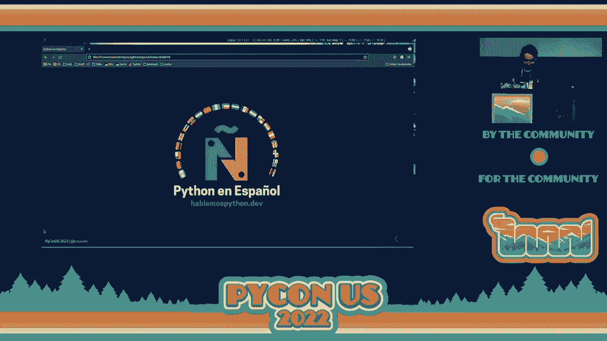

 What a great talk。 I'm so glad we're not changing very much between Python 3 and Python 4。

 All right。 Next up we have Mario with my first PyCon。 Reflections。

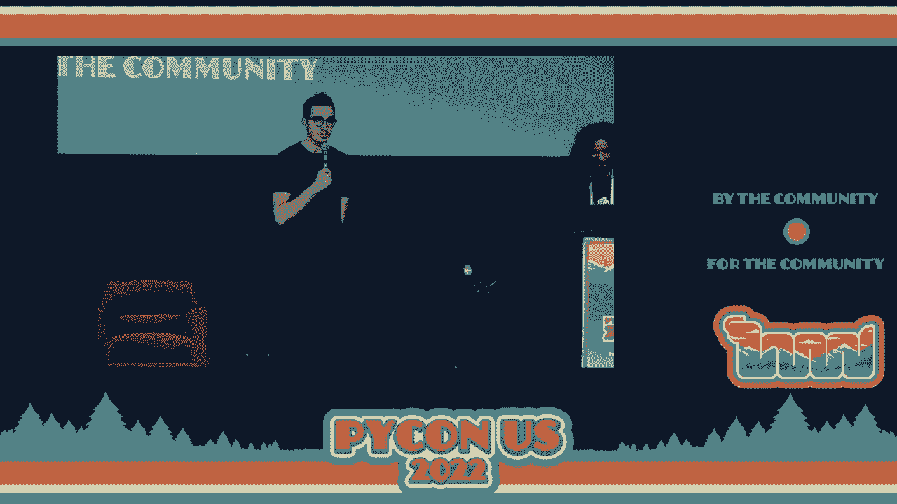

 Give it away for Mario。 [ Applause ]， Hi， everyone。 This is my first PyCon。 Reflections。

 [ Applause ]， Again， I'm Mario。 You can find me on Twitter， Python by night。

 So my journey to PyCon began with a call to adventure。

 It was actually this tweet by the PyCon Twitter handle with a call for， proposals。

 And I thought to myself， why not？ It can't be that hard， right？

 And I was surprised in early February when they were -- I guess it wasn't that hard。

 And I got my tutorial proposal accepted。 So that just meant that I had to have a bit of help to get to PyCon。

 So I'm super natural aid。 And that was in the form of the travel grant。 Thanks， PSF。

 Thank you very much。 [ Applause ]， So to cross that threshold and make the journey。

 my family and I had to make the journey from， Redden。

 California up to the Salt Pals Convention Center。 It was a little over nine hour drive。

 I thought to do it in two days since my three-year-old daughter probably couldn't handle that drive。

 We stopped at a place called the Valley of Fire in Nevada， where I saw some cool cave paintings。

 petrographs， I guess they're called over 4，000 years old。 This is me and my best caveman cosplay。

 You may see my daughter there in the middle of that one， this Martian landscape。 My wife。

 they're walking through -- trekking through Mars， apparently。 And eventually we arrived。

 The next day I was ready to go。 This is me at the entrance of the convention center。 Yes。

 I chose the silly pose， of course。 My wife will not like that。

 And then I was ready to enter the belly of the whale to tackle my tutorial titled "Goodbye Hello World。

"， Hello， functional fast API web app。 Check it out on the video if you weren't there。 Of course。

 the first thing to do is to make sure it was real。 I was there in the middle of that schedule。

 so I began to get ready。 This is me looking through my -- preparing for battle。

 looking through my slides。 And then I went ahead and delivered this tutorial， 1。30 pm on Wednesday。

 It was awesome。 My preparation paid off again， invite you to check it out when all this is said and done。

 Along my journey， I've met some allies， some enemies -- no， not enemies。 This is PyCon。 Just allies。

 Some wonderful people I've met。 Here we see Lauren， Chris， Deborah at the PSF booth。

 I helped set up， volunteered for that。 I met Marietta。 That was really awesome。

 I met a couple cool guys， and here's me awkwardly posing with them， Anthony and Jay。

 I don't know who this guy is， but he just wanted to take a picture。 I'm just kidding， Peter。 Sorry。

 Then I had a big ordeal。 I started volunteering。 I did session running and chairing。

 That was really cool。 I didn't realize session running meant a lot of running。

 That's my steps yesterday。 11。98 kilometers。 Then the Supreme ordeal came while I was playing a wonderful game of exploding kittens。

 What could that Supreme ordeal be？ That was that my lightning talk got accepted。 I was like， oh boy。

 not what I do。 I had to prepare furiously putting slides together， but here I am。

 Enjoying every bit of PyCon as much as I can。 This journey， it's been great。 It's been awesome。

 I loved it。 It's not all for nothing。 There's a wonderful bounty to be had。

 It's just a slight bit of stuff that I've gotten。 It's pretty great。

 I'm sure some of you have even greater bounty。 I was really happy because you can barely see on there。

 I got the last metal straws that they were hanging out at one of those booths。 Really cool thing。

 That's been my journey so far。 I know that pretty soon it's going to be time for the road back。

 time to head home。 I'm not sure how I'm going to do that。 I'll just follow the signs。

 I hope to see all of you again in one year at the next PyCon。 Thank you。 I think， Mara。

 you have had a very eventful first by God。 Next up。

 we have Georgie who's going to talk to us about how open source is the walk in the park。

 I want to give a shout out to Georgie because Georgie did all of the beautiful graphics that you see for PyCon。

 in the new PSF annual report， which just came out。 She did all those as well。 They are terrific。

 Let's give her a round of applause。 [applause]， I like how the captions spell my name。 Hi， everyone。

 I have no slides， so it can just concentrate on me。 How many of you like to take a walk in the park？

 How many of you like to walk in a paid park？ No， expensive， right？ Well， a free park？ Yeah， why not？

 So open source is like a community park。 It's free。 Anyone can just walk in there， enjoy the nature。

 enjoy the birds。 You use all the facilities there and do whatever you want。 Not everything。

 I don't know。 There's a limit。 There's a limit。 So there's always something magical happening when you spend your time outside and you get to share your time with people and to interact with people。

 But it requires maintenance。 You need to clear the fallen leaves。 You need to clear the garages。

 And sometimes you have people who started doing some graffiti here and there。

 And you need to trim the plants and the trees。 So why do I say that open source is like a park？

 Because it's free。 You are free to go。 You can do anything you want。 But you still need maintenance。

 Contributors are like people like you and me。 We can always walk in the park。

 But if we are the person who actually create and throw the rubbish， someone else needs to clear it。

 And if you want to be a contributor to be a nice， really great contributor to make the park nicer。

 you help to pick the pages。 You can help to remove the graffiti。 You can help to create more space。

 Sometimes you have really cool companies coming in and say， "Hey， I would like to make a donation。

 I would like to help。"， And how about I create a bridge and make this place nicer。

 A playground for the kids。 Or some benches。 And yeah， of course， when you have all this coming in。

 the community park will look more beautiful。 It will look more sustainable。

 The next time when you come back， you can use it again。

 It will look more beautiful as compared to a community park that has not been maintained。

 So if I'm not going to spend the entire five minutes， so if another lightning talk wasn't come up。

 feel free。 Anyway， so if you want to contribute， you want to have a beautiful park。

 start improving this open source community。 And do something。

 whether you're a company or whether you're a contributor。 That's it。 Thank you。 [applause]， Thanks。

 Georgie。 Hey， Lorena。 You sticking around？ Unfortunately， I have to leave。

 I'm an auctioneer for the Pilates' auction tonight。 So I'm actually going to be heading out。

 Quick plug。 The Pilates' auction is today。 So maybe I'll see some of you there。 I'll be there。

 But only after the lightning talk's finished。 Exactly。 All right。 So next up， we have Bents。

 Who's going to give us a talk on lint your playlist and fashion？

 Let's give it up for Bents。 [applause]， All right。 Hi， everyone。

 I'm actually here for the gymnastics thing， so I'm not sure。 Now I'm just kidding。

 So I need to just give you like one minute of real quick context。

 and then we can get to the fun part。 I work on this project called SamGrap。

 and you need to know just like three things。 First of all， it's like this tool。

 You get to write like a code search pattern， sort of like reg X。

 It looks through your code and finds occurrences of whatever you were searching for。

 So here we type logging。info。dot。dot and it's just going to find all occurrences of this call。

 even if the developers are trying to be sneaky， and they all get highlighted。 Second。

 you can write not only one pattern， you can write multiple。

 and you can combine them with logic operators。 So for instance here。

 we are looking at logging calls。 You can read the left side of the screen， line by line。

 So whenever inside the logging call there is a get-amp and the nvar has secret in the name。 Well。

 you shouldn't be printing that probably because it's secret， and so SamGrap will flag it for you。

 Third thing， it's not only Python， it works on many languages， and what we need to have fun is JSON。

 And this is the first time anyone ever said that。 Okay， so now the actual talk。

 I know that my code is messed up， but I've recently been wondering。

 maybe the world is more messed up。 So we're just going to make this assumption for the rest of this talk。

 And so then， how is it that we have linters for my code， but not the world？ It just feels unfair。

 right？ So I created Super SamGrap。 This is basically a wrapper on SamGrap that just like abuses it。

 but also links the world。 So that's good。 And now what I mean is whenever there's something in the world。

 you can like sort of translate it， represent it in JSON。 Here's what I mean。

 There's this thing out there in the world。 It's one of our GitHub projects。

 Something is wrong with it。 I challenge you to find what it is。 But now as humans。

 we cannot really do that。 So I'm going to translate it to JSON because computers can look through it pretty easily。

 They will see something is funky。 And specifically。

 the rule I wrote for this specific case is if we get a JSON object from the GitHub API that says we have a repository where the star count of the repository is over 100。

 so it's kind of a popular project， then it's kind of a problem if it doesn't have a code of conduct。

 So if we run SamGrap， it's going to output exactly this。 Hey。

 you have this project in your organization。 Quite popular。 No code of conduct。 Fix it。 Okay。

 So now this sort of eased you into the concept。 Here come the actual fun stuff。 Spotify playlist。

 What is wrong with this playlist？ I'll give you a couple seconds。 You're not going to know。

 by the way， spoiler alert。 Some people say that it has Taylor Swift in it and to those people I say broaden your horizons。

 The actual issue is， you know what？ I shouldn't spoil it。 I can do a live demo。

 So this is a rule I wrote for Spotify。 And it's going to prompt me to input a playlist study。

 The issue with the playlist was that the tempo changes too much between two songs。

 So shake it off going right into smells like thin spirit is too much of a change。

 The lyrics is this linter rule。 So we look at consecutive tracks。

 We extract the tempo and we just like， you know， do some math。 Okay。 And the last one。

 One of the samgyup maintainers visited me in Greece earlier。 Something like a year ago。

 This is a picture of us in front of the Greek Parliament。

 And there is something wrong with this picture。 Yet another challenge。

 What is wrong with this picture？ Okay。 I'm just going to run samgyup on it。 You know what？

 Maybe I'm going to help you out a little。 This is the JSON representation after running it through Google Cloud Vision API and some。

 post-processing。 Okay。 Let's see what samgyup has to say。 We found a Greek fashion police violation。

 You're not supposed to go out in pants in the Mediterranean。

 The way this works is Google recognized the Greek Parliament。

 Told us what the latitude of the Greek Parliament is。

 And then we can just look whether there's like a person somewhere in the picture。

 And there's pants inside the person。 I guess that's how computers think。 But yeah。

 that's basically it。 That was awesome。

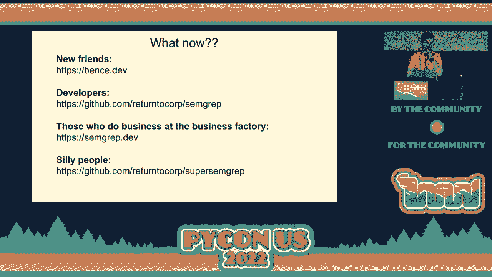

 That was so cool。

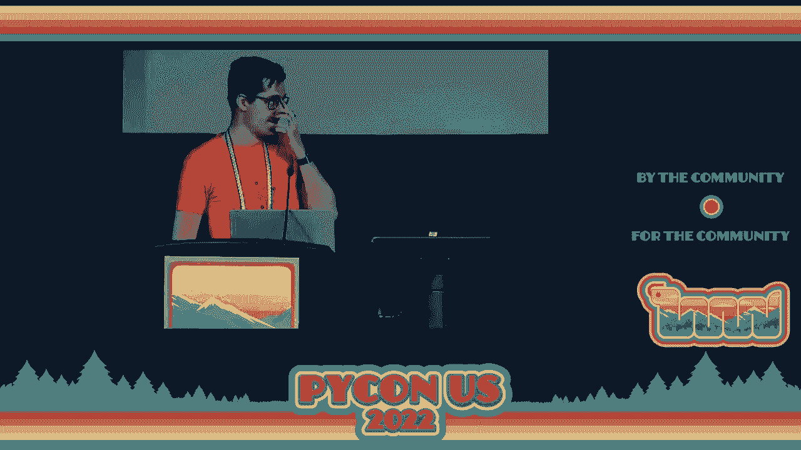

 Thanks for that。 Next we have Mark who's going to tell us about how you can help speed up Python with benchmarks。

 Give it up for Mark。 Okay。 I'll see how we can get this over before Larry has set up。

 Just to upset him。 I'm Mark Shannon。 I work with a faster C Python team。

 And I'm here to ask you a favor。 So I'm often asked how much faster C Python is going to be？ It's 3。

11， going to be 3。10。 And I'm an honest person。 So I always say it depends。

 I realize that's a somewhat unsatisfying answer， but it's the true one。

 And the reason we don't really know is because we don't know what your workload is。

 We don't know what you're using Python for。 We have a bunch of benchmarks。

 They're kind of the standard Python benchmarks， but they're sort of a bit of an historical， oddity。

 And there's also quite a wide range of results。 It doesn't really allow us to tell you very much about how much faster your program is。

 going to be。 So we have Delta Blue， which is twice as fast。 And Telco， which is no faster。

 Does your application resemble something that does lots of numerical processing？

 Or does it do some constraint solving？ So basically， what we need is you to help。

 I know about how to make a Python virtual machine faster， but I don't know a great deal。

 about web apps or machine learning or whatever other thing you do with Python。

 There's a million and one things that people use Python for。

 We would like to make your program faster in 3。12， but we can't do that unless we know。

 what your program does or have some representative sort of version of it。

 And that's where you can help。 I think this is the last slide。 Yeah， this is a very short talk。

 So there's a benchmark website called PyPerformance that you can read on redox here。 As on GitHub。

 that's a framework for doing benchmarking。 It also holds a standard benchmark suite。

 But you can run your benchmarks on it。 So even if you don't have a ready-made benchmark。

 you can at least try and encapsulate your， software。

 Even if it's proprietary or there's confidential information in it， you can maybe run it locally。

 and at least let us know what sort of result you have。 Yeah， there's a website here。

 It's PyPerformance， Readadox and the GitHub thing。

 And if you need help doing that or you have suggestions or sort of benchmarks， you think。

 we should add。 I mean， even if you can't add a benchmark。

 but you think there's a domain in which we're， obviously missing stuff， then let us know。

 And then you can， if you've got to GitHub faster， see Python/ideas。

 There's a whole bunch of ideas on how to make it faster。

 But there's also any ideas that are welcome on benchmarking or anything like that。 So yeah。

 we need your help。 We can't come up with benchmarks for domains that we just don't understand or aren't experts。

 in， but you can。 So that's it。

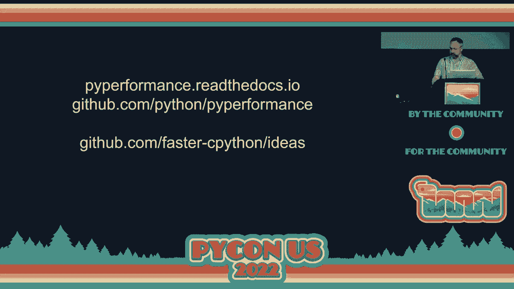

 [applause]， Thanks， Mark。 What y'all didn't just see was happening while Mark was speaking was Larry。

 He really researched his laptop to get the monitor to work。

 And it worked just right before Mark finished his talks。 It was perfect。 Absolutely perfect。

 So next Larry is going to talk to us about correlating your data with Correlate。

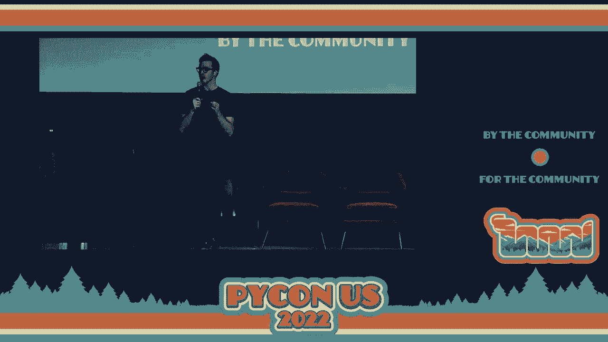

 Let's give him a round of applause。 [applause]， Thanks。 I watched the IT crowd too。

 So I have a problem。 I like old-time radio， like the radio dramas from the '40s。

 like detective shows and West， Easterns， but I hate bad file names。

 If you go onto the internet and download a big zip file containing， like let's say， Boston， Blackie。

 these file names are crap。 However， you can get very nice clean metadata about the old show if you go onto Wikipedia。

 or in this case， an episode log thing。 So I'd like to rename all of those MP3s and give them nice。

 proper readable names。 But I have a lot of work to do。 There are 199 episodes of Boston Blackie。

 There's 446 of gun smoke。 There's 809 of yours truly， Johnny Dollar。

 And what if they came out with a new zip file and they update things？

 Now I have to do all that by hand。 So I have more problems。 I'm really lazy。

 I don't want to do this by hand。 Also it turns out I'm bad at CS because apparently nobody has solved this problem in a general。

 way before。 I know。 I looked on Google。 I guess I'm bad at that too。

 I will point out this is not the Gail Shapley stable marriage problem。

 It's a slightly different problem。 But the basic idea is I have two sets of data。

 Conceptually they represent the same things。 And I want to match them up together。 How do I do that？

 So I wrote it。 It's called correlate。 And I'm going to walk you through。

 I knocked together this sample code this afternoon to write this lightning talk。

 I basically took the list of the MP3s and I took the list of all the episodes that I。

 scraped off of the web page somewhere。 So I import correlate。 I create my correlator object。

 I split out the two data sets。 We're going to put on all of your data。 Here's the MP3s。

 Here's the episodes。 This parses the MP3 file names and pulls out the date and the title。

 This parses the list of episodes and pulls out the title and the date and the star。

 The important lines are these。 We're setting -- we're saying here's a key。

 something interesting about this metadata， about this value。 And that matches to this one。

 So this MP3 file， here's the date or here is -- the best way to do it is take the word。

 of the title and lower case them and send them in separately。

 So I do that for both the MP3s and the episode。 It's a good chai idea to make sure that the data that's going in is actually what you。

 intended so there's a print thing。 You can say print out my data sets and this looks correct。

 I'm getting proper dates。 I'm getting proper keys both for data set A and data set B。

 And so I run it。 You just run correlate。 This is the feature I'll tell you about in a second and you just print out the results。

 And a fifth of a second later it has correlated the 200 elements from this and the 200 elements。

 in that and match them together and the results look great。 It's doing a perfect job。

 What's really interesting is you've scanned through the results a little bit。 This one。

 there are no words in common between the two titles but the dates were the same。 So it said， oh。

 those are a match。 This one didn't have a date at all。

 Like both sides of the date was invalid but there were a couple of words that matched。

 out of the title。 Don Davis and those were unique enough that correlate said， oh。

 that's a good match。 So correlate features， you can wait the individual mappings of keys to values。

 You can have redundant keys and you might think that was not helpful but it's actually。

 very helpful if the word the matches three times to these two values， those are probably。

 a good match。 I support ranking or you probably think of ordering， I call it ranking。

 So like if two values at the top of the data sets seem like a good match， that might be。

 a better than one at the top and one at the bottom。

 And I support fuzzy keys which slows everything down but sometimes you just need fuzzy keys。

 So you can install it right now on PIP。 You can also look at the source on GitHub， it's open source。

 I'm done。 Thank you。

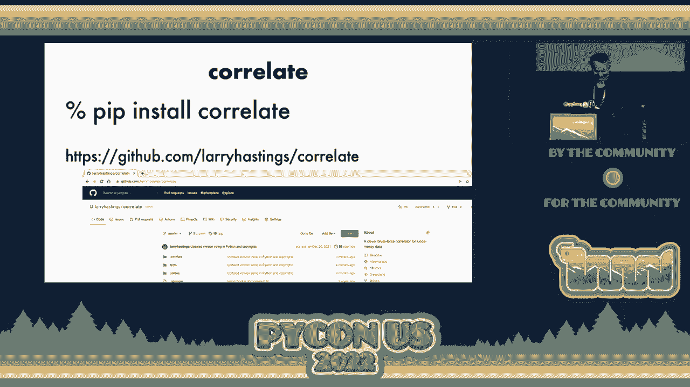

 [applause]， >> Thank you， Larry。 I think I understand correlate now， it is magic。 Cool。

 Thanks for the talk and next we have Rich。

 Give us a talk on the importance of effective， concise communication。 Give it up for Rich。

 [applause]， >> Hello everyone。 I'm Rich Taggart and I'm a software developer。

 If I had to describe myself in one word， I would probably say that I'm a skier。

 I spend as much time as I can in the snow and in the mountains。

 A word that I would not use to describe myself is brevity。 If you were to ask any of my friends。

 they would probably tell you that I'm long-winded。

 and I have a tendency to ramble about whatever it is that comes to my mind without any filter。

 especially in situations where I might be nervous for some reason。 So as it turns out。

 that ended up spilling over into my writing and my technical writing。

 So I thought I would share with you some things that I've learned as I've tried to improve， that。

 Identify and convey the most important idea when you communicate with another person。

 This will allow you to achieve the greatest effect for your intent and effort。 In today's world。

 we wish to spend our energy on more activities than we have time for。

 Various distractions pull our attention in many facets of our life。

 Allow your recipient to interpret your message with as little energy as possible。

 I've included here some tips to consider when composing a message。 First， write down the topics。

 ideas and thoughts you wish to send。 Then identify the common theme between these thoughts。 Last。

 convey that main idea with one or two brief supporting examples。

 And this does not need to be a long extensive process。

 Most of the time it takes a few seconds to jot down ideas or maybe a couple minutes depending。

 on the message。 If you're not sure where to get started。

 I've found the Hemingway Editor to be a great tool， to help learn how to do this。 That's my talk。

 Thanks everyone。 Thanks Rich。

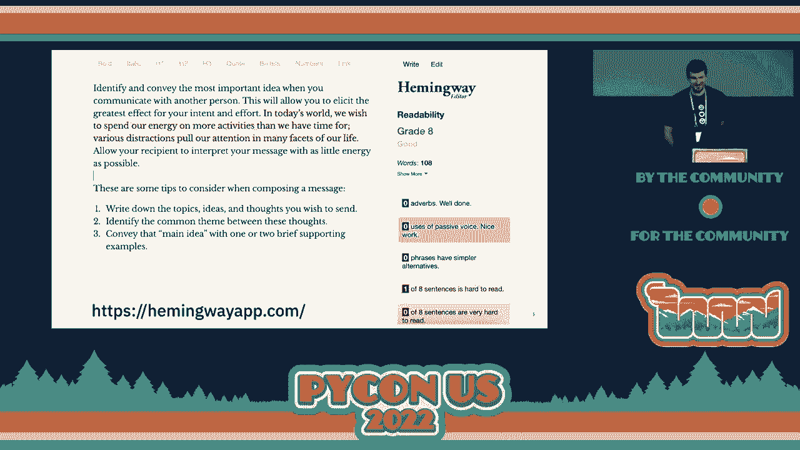

 And next we have Sebastian， who's going to talk to us about testing migrations。

 Give it up for Sebastian。

 Yeah， hello everyone。 I'm going to talk about something that really bugs me。

 That I get to see a lot of in the real world。 It's causing real problems。

 So it's not going to be funny。 It's going to be a little bit more serious。 So we're here at PyCon。

 So I assume you are way better programmers than I am。 So you're all right bug free code， right？

 Or maybe not。 So I see a lot of smaller applications out there， mostly web applications that don't。

 test code that is directly touching production databases。

 And I'm here to convince you that you should do that otherwise。

 So say that you have a small application and a small application treats its database as。

 a managed dependency。 What that means is that your database is the only application that will ever talk to。

 the database。 It has a complete control of your database。

 If other applications will try to communicate through your database， they have to do an。

 API or not at all。 And every interaction your application has with the database is hidden from the outside。

 world。 So you could say that your database lies within the boundaries of your own application。

 Often in such a situation your application defines the table structures or the schemas。

 it needs in the database。 And a migration tool like Alembic or Django's migration system takes care of actually bringing。

 about the structure of your database。 But sometimes our migrations go a little bit further。

 You might want to change the contents of your database。

 You might want to add names together to get a full name column。 You might want to change currencies。

 And when you do that in Django you write something called a data migration。

 And in a data migration you write a little bit of Python code or a little bit of SQL code。

 that performs the logic。 You can do very much the same with Alembic。

 Well this is actual code you write。 And this is actual code that you should test because it could have dramatic effects in。

 your production data。 And I really mean that。 You don't want to lose customer data。

 You don't want to lose your scientific data that you suppressiously and so expensively， gained。

 So you should really test your data。 And one thing that I hear a lot is that people say。

 well I have rollback capabilities。 If something goes wrong I'll just rollback my database。

 rollback to migration。 And I'm fine again。 But that's not really the case。

 Because what the problem is， is that basically things working fine and things exploding are。

 just two separate parts of your buck scale。 And both situations are relatively benign。

 You might be surprised when I say that things exploding is relatively okay。

 But then at least you know that things are not working。 You can roll back。

 But as much more of an issue is that when you're in the middle of that landscape， when you're。

 in the middle of that scale， that's where things get really tricky。

 You've executed something but you might and migration works but you might have actually。

 messed up your data。 For example， for example， say that you accidentally truncate all the addresses of your customers。

 or only the long addresses。 Your migration will work but you will no longer be able to ship anything to your customers。

 If these distortions are massive， you detect them right away。 You fix them， you go on。

 But if they're small and they're often small， you might only notice them after months。

 And then you've been working with flawed data all along and you cannot really， really。

 fix it anymore。 So the solution is to treat the code you write for those migrations as real code and you。

 should test it。 Now how can you do that？ Well you can write integration tests because this is a managed dependency。

 And that's in the classicist way of thinking that's promoted in this book。 For instance。

 and you should just test your migrations with a test database that's very。

 much like your own production database。 And you should do that。 Now how does that work？

 Well it's actually very simple。 You have a before state。

 before your migration and in your test you should make sure that。

 you migrate your test database to that state。 You just dump test data into your database。

 then you run your migration and then you assert， that the result is what you want it to be。

 For Django there's a very handy package。 It's called Django test migrations。

 I didn't write it but I use it a lot。 You should definitely use that。 There are some remarks。

 use realistic data， faker data often isn't good enough。 It doesn't contain yet cases。

 If there are at cases that you are ignoring， please， please do make sure that you insert， barriers。

 raise exceptions when they do occur in your production data。 And finally those tests can be really。

 really costly。 They can cost a lot of time。 So don't put them in your regular unit test suite。

 And before we go， we all love Python but please support your local conferences。

 I'm a volunteer for Europe， Python。 Please go there but also go to your local conferences。

 Thanks a lot。 This was it。

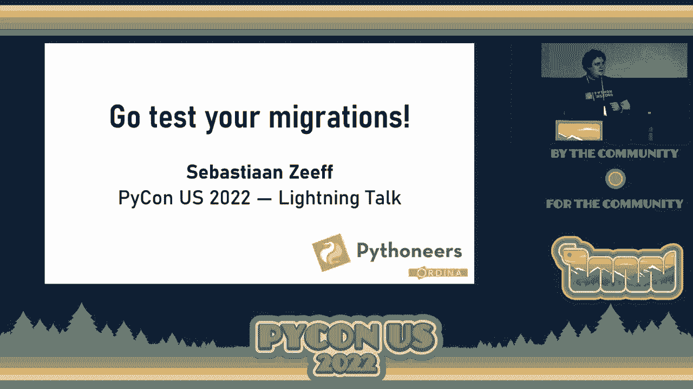

 [applause]， Thank you Sebastian。 And next we have William who's going to tell you all how to secure your PIPE account。

 Awesome。 Give it up for William。 [applause]， Hi everybody。 Yeah。

 so this talk really only has two slides。 So basically this talks about how to secure a PIPE account。

 My name is William。 This is the one slide。 First as a show of hands。

 how many of you have a package on PIPE account？ Okay， so like about half the room。

 So immediately this talk immediately applies to you。 For a good other portion of you。

 you will probably end up publishing a package on PIPE。

 at some point or you might be a manager of a team where people on your team are publishing。

 packages。 So hopefully you'll have something to take away from this too。

 So basically one of the demo is three main techniques you can use currently on PIPE to。

 lock down and secure your account。 We'll talk about enabling two factor， web often TOT or both。

 Add in scoped API tokens for your projects and also recovery codes。 So without further ado。

 So I have a local copy of Warehouse here which is a software that powers PIPE。

 You'll notice that I am not actually sorry， E-derbin but I am logged in as them and I will。

 begin making some security changes。 So if I go to settings。

 you will see that I have the ability to add two factor for my， account， two factor requirement。

 More to add two factor， I have to add recovery codes first。

 So I'm going to go ahead and generate some recovery codes and do this。

 It's going to be for my password which because this is a local setup is password which I then。

 mistyped。 Hello。 Third time to turn。 Okay。 So it's going to ask you to save your recovery codes。

 I'm going to go ahead and not save them because it's a demo but I'm going to copy one of them。

 just in case。 It's going to ask me to enter one to make sure that I actually did save them which I。

 didn't do。 So I am going to verify。 It's now verified。 Right？

 And now it's going to let me do a real two factor。 So I have two options。

 I'm going to do both of them for you。 I'm going to add two factor with authentication application also known as to TP and then I'll。

 also do one with the security device。 Okay。 Well， then token。

 So for two factor with a authentication application， it's going to give me a little QR code and。

 now you're going to have to trust me that I'm going to use one of my phone。

 You're not going to be able to verify this but I'm going to go ahead and scan it。

 It's going to give me a little， you know， six digit code。

 I'm going to go ahead and put that in so confirm that I haven't just deleted it again。

 So in this case again， this does not matter that you can see it because this is going。

 to get deleted as soon as I stop。 But I have now added to TP and what this means is that the next time you log on to。

 PIPI it will prompt you for code basically to ensure that you are in fact possessing the。

 device that has the token。 But you know， we can go one step further。

 We can actually add a security device too。 So go ahead and do that。 Similarly。

 I'm going to go ahead and name it。 So you know， you might have multiple mobile devices。

 So in this case， I'm going to call mine the laptop key， right？ Click setup。

 It's going to prompt me for permission。 I'm going to do a security device。

 I'm going to go ahead and touch it and it's going to be set up。 So now if you see the bottom here。

 I have two factor authentication methods。 I have my TOTP application and I have my laptop key。

 security key。 I can move any of them any of it to any time。 And yeah， pretty much it。

 You can also see the security events。 So on your account， if you log in。

 you'll see if someone has set one for you on your behalf， perhaps what you know in。 Actually。

 just to demo this really quick， I'm going to go ahead and log out and log back， in。

 So I'm going to get with the device， touch my thing， and I'm logged in。

 So the one last thing I wanted to demo was API tokens。

 And so we've had API tokens for a couple of years now。

 But one of the cool things you can do that not as many people know about is that you can。

 scope them to individual projects。 So I'm going to go ahead and add an API token。

 This is the standard API token view。 And name it， you know， crap。

 And I'm going to scope it to Clintus。ind。 So when I do this， again。

 this token is not actually secret。 But in the real deployment。

 this would be a token that you would add to get a bit of。

 actions or to your local workflow to publish。 So you can use this instead of a password。

 It's much more secure。 It's a copy and a password everywhere。

 You can remove the token if that was a mistake。 And you will note that doing all of this also corresponds to events on a page。

 So again， you can order this。

 And that is all I have。 So thank you。 [APPLAUSE]， >> I'm a philosopher， Liam。 And also。

 what William didn't say was he was the person that implemented a lot of this， for PIPI。

 So let's give him another round of applause for that as well。 [APPLAUSE]， >> All right。

 Next up， we have Alexa with generating recipes of varying quality with GTP too。

 Give it away for Alexa。 [APPLAUSE]， >> Hi， I'm Alexa。

 And today I want to talk to you about generating recipes with deep learning and Python。

 My main goal for this talk is just to show you that it's pretty easy。

 It doesn't have to be intimidating to get started with deep learning。 Excuse me。

 So this really only has five steps。 I'll walk you through the whole thing。

 The first step is to get your model。 Here， I'm going to use GPT2。

 There's a great package called GPT2 Simple by MaxWolf on GitHub。 I'll use that。

 It makes fine tuning really easy。 But you can use pretty much any language generation model that you like。

 Here's my code。 It's pretty easy to load up GPT2。 I did this all in Google collab。

 If you want more details about exactly how I loaded up this model， you can just search。

 GPT2 Simple and all the documentation is online。 Our second step is to prepare your data。

 So you can use any data set you like。 I just took a data set right off of Kaggle。

 I took the CSV file， changed it to a text file and added some little tokens to make sure。

 my model knew where the start and the end of the recipe was as well as where the different。

 sections of the recipe were。 So our third step is to fine tune。

 Now these language models that I'm using are pre-trained on a huge amount of data。

 All we're doing by fine tuning is getting it to focus in on recipes specifically。

 So this GPT2 Simple package makes it really， really easy。 You can do it in one line。

 Fine tune and then the name of your training file。

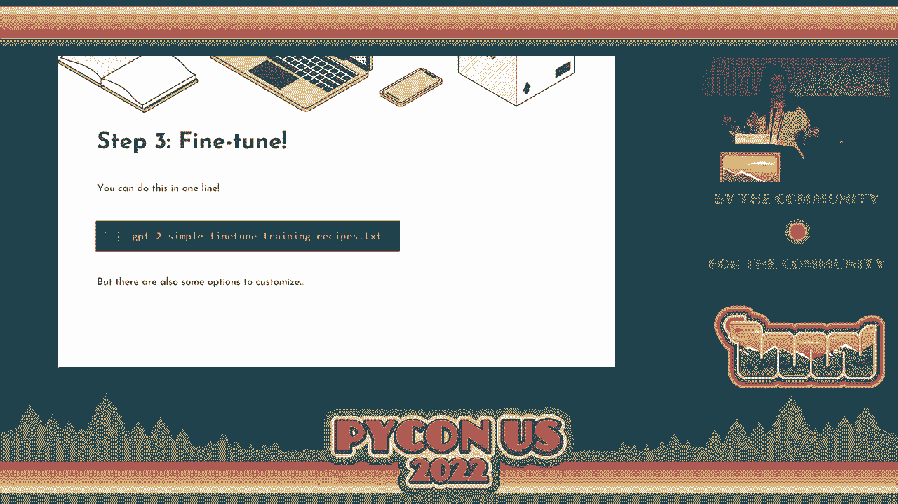

 But you also have some options to customize。 So you can change the number of steps that you train for。

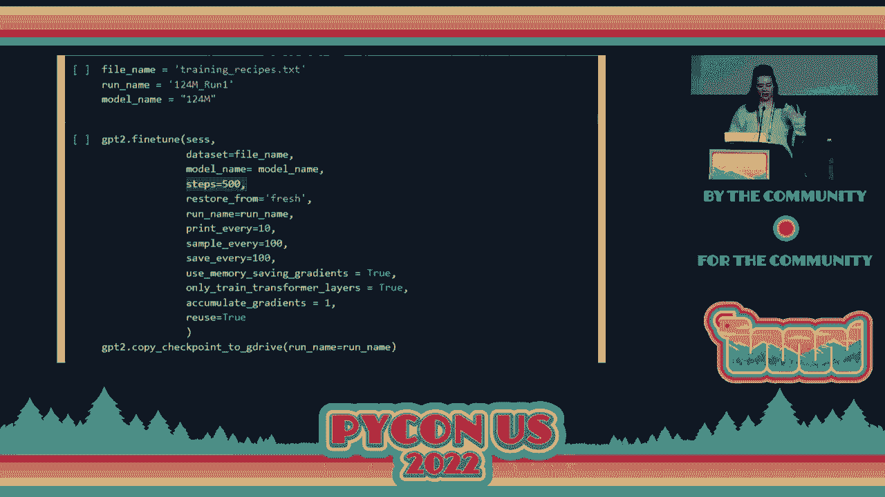

 You can change how often you print sample and save data。

 And you can also use some memory saving options if you're running it in CoLab like I was。

 Our fourth step is to choose good prompts。 Don't overlook this step because it really makes a difference on how your model performs。

 and how your output looks。 So you can choose lots of options。

 You can prompt it with search terms or tags。 You can give your model an ingredient list and ask it to generate a recipe from that。

 What I did was give it a recipe title。 You can also use something called few shot learning。

 which essentially just means you， give within your prompt a few examples of your desired output。

 So for my case that would look like giving a few complete examples of recipes that I。

 would like it to generate。 And then a title at the end of my prompt that tells it actually which recipe I would like。

 it to generate。 And that just gives it a better idea of what kind of structure and format I'm looking for。

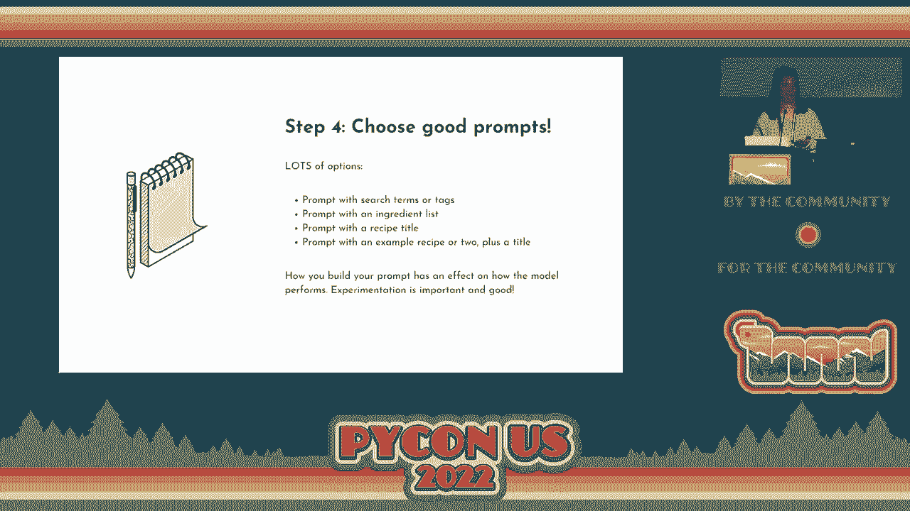

 So our first step and last step is to actually generate our recipes。

 So you can choose to generate it just in your terminal or to a file。

 You can see here I have it going to piconrecipes。txt。

 You can change your temperature which is essentially how expected or unexpected you want your generated。

 text to be。 Here's where you load in your prompt。 I asked it to truncate when it reaches this little end recipe tag that will just tell us。

 when it gets to the end of the recipe or it thinks it's gotten to the end of a recipe， we'll see。

 And you can also change the length and the number of samples that you generate。

 So this talk would not be fun if I didn't get to show you a bad example of a recipe that。

 I generated。 So I wanted to show you this one for almost trigger free vanilla fudge cake which is really。

 something。 You can see it's got several issues。 It's got the general structure down but it's you know there's some things to be improved。

 there。 The favorite part of this is when you look at the directions and it asks you to use an。

 air conditioner as an appliance。 Clearly there's some improvement to be made here。

 If you want some better luck at home when you're doing this yourself you can do things。

 like include more training data。 Train for more steps。

 Use fuchshot learning which we talked about earlier it's just including examples of your。

 desired output within your prompt。 And also experiment with settings。

 Because it's a lightning talk I can't really go deeper into the different settings that。

 you can use and change。 But definitely experiment with your models and see how it goes。

 If you want more info about the package that I used for this here's a QR code it's there。

 on GitHub but that's all。

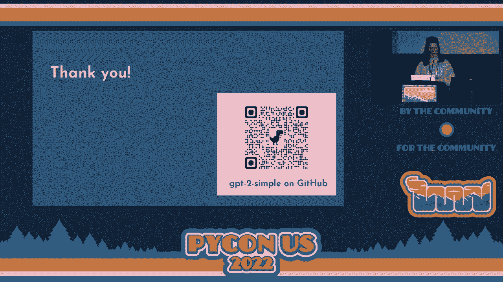

 Thank you。 That was great that cake looked delicious。

 My absolute favorite class of humor is like machines trying to be humans very badly。

 That's absolutely hilarious。 Next we have a talk on the dreaded Django upgrade by Srinivas。

 Let's see if Srinivas around applause。

 Hello everyone。 I'm Srinivas Buntadou。 I'm a software engineer at Cox Automotive。

 And yeah this is my first bike on and having a great experience I hope you guys do。

 One thing I wanted to share is it's one story sitting there and listening to the talks and。

 enjoying them and it's a totally different experience standing here and trying to talk。

 It's so fast my heartbeat right now。 Right。 Without further ado I'll go into the talk。

 So what I'm going to share with you today is about our story of upgrading Django from like。

 we were running it on one dot eleven dot expression and then upgrading it to the latest version。

 I'm going to share it with you soon。 And it's not reinventing the wheel。

 It's more like sharing our story so that some small fine tuning and steps that we did to just。

 get through the process faster。 Right。 Sorry。 Yeah。 All right。 So why upgrade？

 Django just like any other package or library， right。

 What happens is over the time you won't receive the security hot patches and then the support。

 for the latest version or the latest transit of dependencies or libraries and same with。

 the features too。 Like the older versions they stop developing the features just like any other library。

 And what we observed over time is our when we developed our code this was like 2015， 2016。

 and we never upgraded the Django version that we were running since then。

 So towards the end of 2020 and 2021 that's when we started noticing a lot of problems because。

 of this。 All right。 So just as I said earlier， right。

 we were running on Django one dot eleven dot eighteen。

 and then if you look at the slide there that shows the end of cycle for the Django versions。

 it's not even visible in that。 So it sort of ended even before 2019。

 So now you know why we had to do that。 We it sort of we were forced to do that。

 But we are glad we jumped。 We did the upgrade because right now you know you get the the trooper the runtime or the processing。

 time in the application not even going to the database level but the application itself。

 is fast and this applies so just to give an example our system is more like monolith and。

 tied up with the microservices but this sort of works with the approach that we took works。

 with any repository or smaller code repository thousands of lines of code or million lines。

 of code etc。 All right。 Okay。 First thing is I think the problem that most of us face is about dependencies be direct dependencies。

 or transitive that we see in the packages。 That is our inbuilt packages or open source packages that we pull into our system。

 And one one thing that we sort of did it as a precursor before even moving into the upgrade。

 is making sure we have the dependency either pinned or unpin depending on what we need。

 The pin dependencies obviously everyone prefers that because you know that even with the upgrade。

 and when you do the pip compile it's going to just install the same package so your code。

 would run without any errors but there is a problem there in the sense that you can't。

 you won't get the latest packages so Django we know we are getting the latest package but。

 not the other libraries。 So at some point you got to either unpin them or define a specific version that works for。

 you。 And then now coming to unpin。 Now there is a so for us as I said it's a monolith tied to different microservices so。

 we made sure that the setup。py that the installation files for all the microservices you would never。

 touch or you would never pin any dependencies because when you are pulling it into the monolith。

 you would want to pull the latest versions for it to run without any errors so that the。

 transitive dependencies are upgraded。 Right。 Moving on。

 And another small thing that sort of helped is a move a quicker is annotating the pip compile。

 by that I mean if you look at the hashes on the side you would do the exact dependencies。

 so packages in your output requirements dot lock what that helped us in doing is when you。

 are manually installing or deleting a package you would know what transitive dependencies。

 to remove even before the pip compile step。 So that sort of helped us move quicker and then just going to the Django itself has great documentation。

 so like just reading the release notes are you know how to do the upgrade or the deprecated。

 methods the most important thing would give you more information on what to address quickly。

 And then we have a lot of open source code models I would call them which is like automatic。

 you know it's easy to fix the deprecations in your code these are not written by as these。

 are open source libraries that we have。 Oops。 Oh。 Out of time。 Go ahead。 Go ahead。 Yeah。

 This is the last slide so I just wanted to say these are the open source libraries that。

 help you fix the deprecations in the code automatically。 Round of applause。

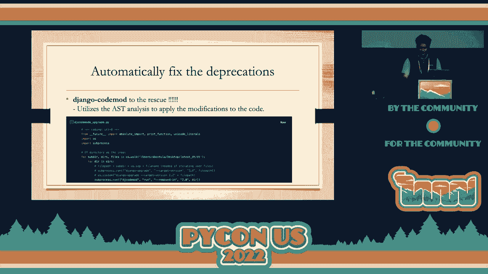

 Thank you。 Thank you。 I had one job。 All right。 And I think for our last talk we're going to have Adrian who's going to talk to us about。

 when to rewrite in Rust let's give Adrian a round of applause。

 Hello。 Hi folks。 My name is Adrian。 So I rewrote a module in the standard library called graphlib。

 It's available in 3。9 in Rust。 And this talk I'm going to talk about what I learned from that was my first time moving。

 some of the Rust。 Maybe when you should rewrite something in Rust。

 So the first thing I want to talk about is when is it good to rewrite something in Rust。

 or like when you should think about that。 I think especially if it's your first time doing it you should pick something that's。

 CPU bound that's a well contained in PI and ideally has existing tests。

 So something like graphlib which is an existing well understood piece of Python is a good candidate。

 for that。 If it's your first time trying to write something in Rust maybe trying to figure out how to。

 test it， how to learn Rust all that。 And one go and figure out the API for your thing is probably a bit too much。

 So the next couple of slides are going to be interesting things that I learned from my。

 first time writing something in Rust。 So the first one is the idea of fallibility。

 In Python you can raise an exception anywhere in Rust you can't do that。

 In particular for something like graph related in this case it made sense to represent as。

 like a hash map sort of thing and there's many ways to represent a graph but in this。

 case that's what made sense。 And the issue encounter is that Python's hash function is fallible。

 You can raise an exception like there's things that are not hashable but Rust doesn't allow， that。

 And what happens if you try to do that is you just get like a panic and like everything's。

 pretty ugly。 So it's all this problem is I just created like a little struct。

 This is Python but really this was written in Rust so we can all understand it。

 And what I do is I hash the thing before I put it in here and so now my hash function。

 is just returning a known value。 And that means that when I call Python's hash function I'm still at a point where I have。

 control and I can return a Python error as opposed to Rust's hash function calling it。

 where there's no error handling。 The next is boundary crossing。

 One of the more expensive things especially for the current state of Rust Python bindings。

 is you know doing a lot of calling from one place to the other。

 So when you're designing really even at the API level you want to minimize how much you're。

 going to have to call Python from Rust and Rust from Python because if you're doing that。

 all the time it's going to be slower than if you just didn't Python。

 And the issue I encountered was when you have a hash map and you know you find that something。

 has the same hash so maybe it's the same thing， maybe it's the thing you're looking。

 for then you still need to do an equality comparison to make sure it actually is the。

 same thing and that meant that every time I looked something up in a hash map I had to。

 call back into Python and that was really slow。 So I did a lot of optimization。

 I've done this already but what I did is I just did a reference comparison in Rust before。

 calling it to Python。 And so for most cases when you're saying with this API you're saying this task is done。

 that task exists in the hash map and it's the exact same object and so this means that。

 I almost never have to call it back into Python。 The last more interesting one is mutability。

 Rust has this whole borrow system。 One of the fundamental rules is you can't have more than one mutable reference in Python。

 Everything is kind of a mutable reference but you can't grab value in a dictionary and。

 then mutate that and then use that to look up something else and you run it to issues。

 And the existing API for Graph Lab is something like this。

 There's a class that contains information on each node and it has some mutable parts like。

 whether the thing is ready or not and some parts that really aren't mutable like the。

 parents of that task。 And so what I had to do is I had to destructure and do two different things so I had to have。

 like a mutable part and an immutable part and that allowed me to freely access the mutable。

 part and then access the mutable part， return the reference and then move on。

 So you can see there's some issues with this。 The Python version in my opinion is a lot nicer。

 Everything is contained in one place。 Here you can end up with like different keys and mappings and gets weird but that's the way。

 you have to do。 And so my takeaways for this are probably write in Python first。

 Don't understand the API， understand where the hot loops are， understand where you can。

 gain performance before you move to Rust。 And once you are writing in Rust。

 think about biomedry crossing， try and minimize your calling， back and forth。

 try and move work to Rust， work in Rust and come back to Python。 And think about fallibility。

 That's something we don't really think about in Python。 Anything can raise an exception and Rust。

 you don't really have that luxury。 You have to be more explicit and sometimes you can't even raise an exception。

 And then make things immutable as much as possible because that's going to make it a。

 lot easier to work with a bar checker。 And so last question is probably was this fast？ Yes。

 it was very fast and it worked great。

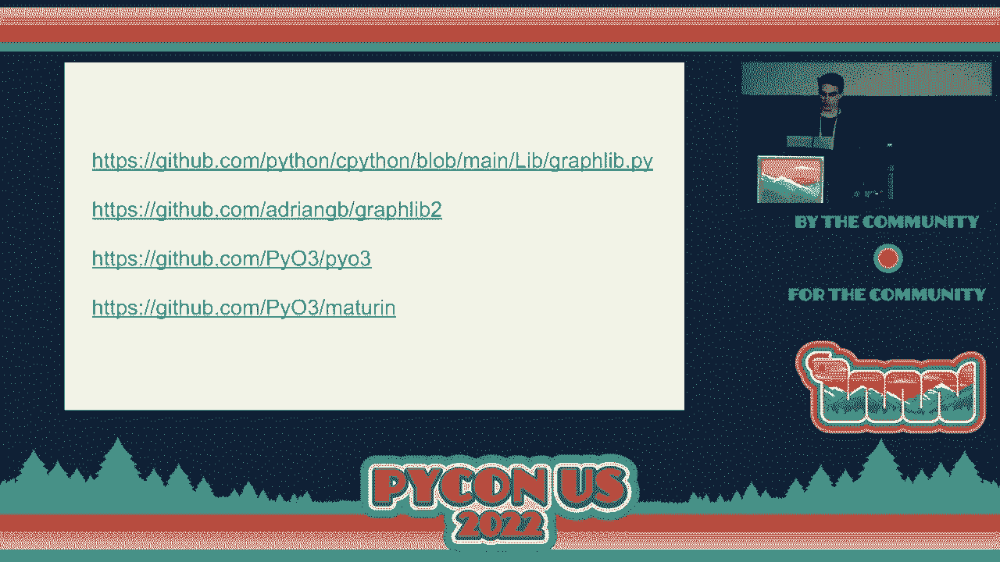

 And that wraps it up for today's Lightning Talks。 If you want to watch more Lightning Talks。

 we'll be back at it again tomorrow morning， before the keynotes at 8 AM。 Come back here。

 come and see us。 We'd love to have you。

 Take care and have a good night。