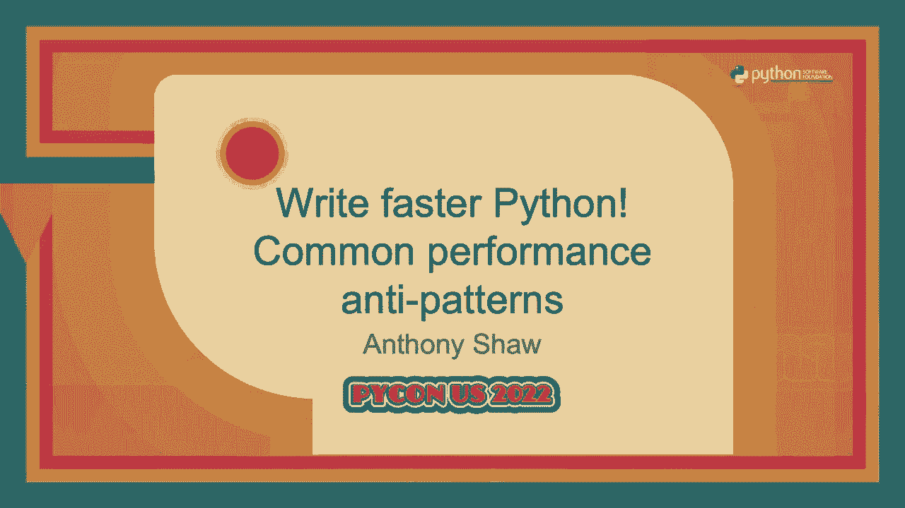
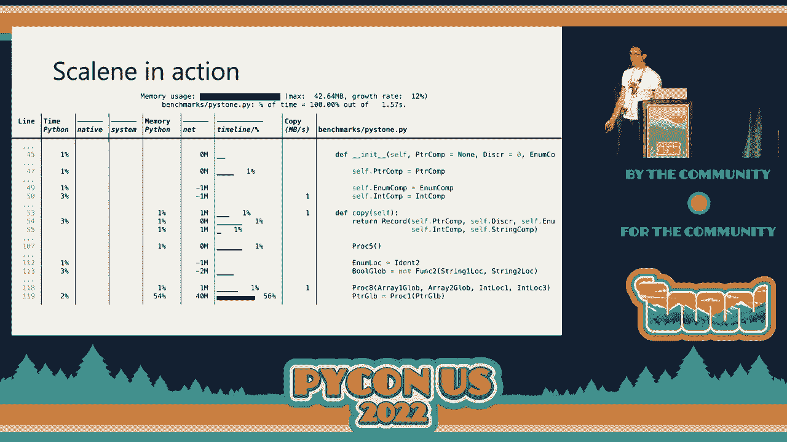
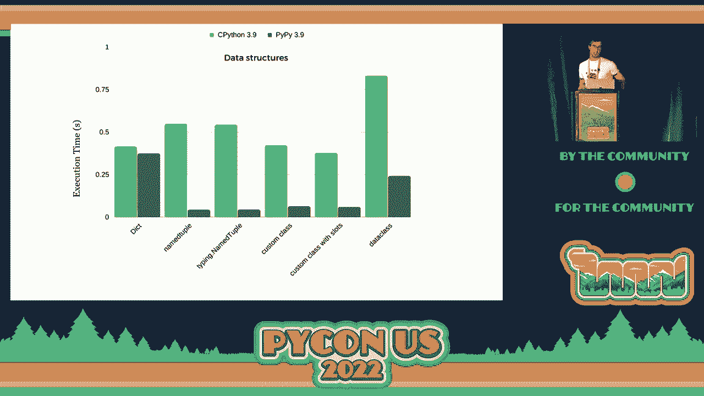
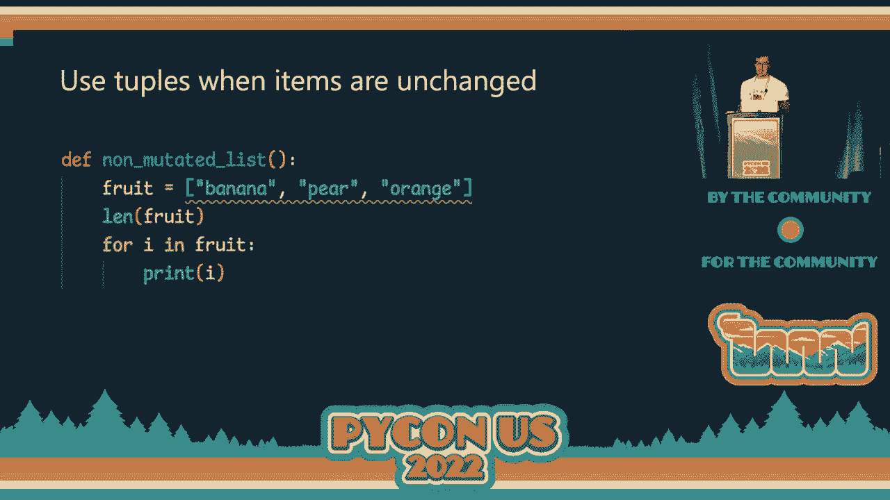
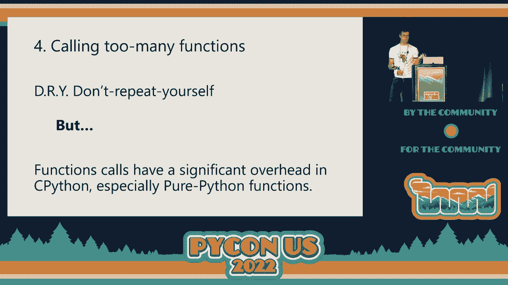
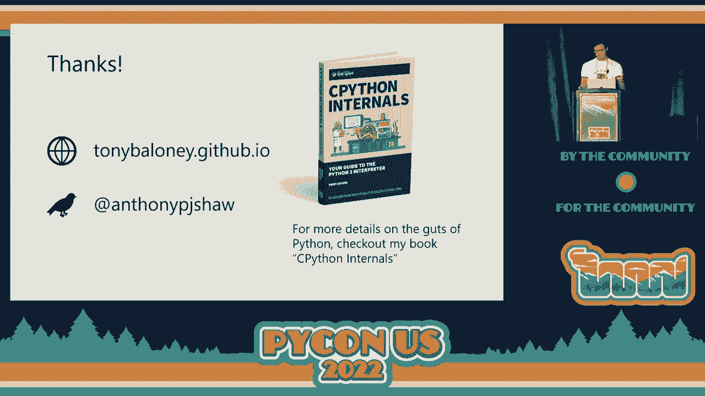

# P20：Talk - Anthony Shaw_ Write faster Python! Common performance anti patterns - VikingDen7 - BV1f8411Y7cP

 Okay， we are ready for the last talk of the day。

 Please welcome Antony Shaw with his dog， Wright Foster Python with common performance anti-patterns。 Big applause please。 Hi everybody， my name is Anthony Shaw。 welcome to the trampoline and tumbling championships， regions 1 and 2。 I hope everyone has got rid of their stretches and everything and it's all going well for， you。

 So I'm probably not going to talk about that today， I will talk about writing faster Python。 There are parts of this talk which might cause some reactions from people in terms of Python。 code which is shown。 Please save your questions for the end as there are no questions。 So if you haven't seen this talk， I really recommend you watch it。 This is a talk by James Murphy。

 he gave at Python last year。 He wrote a Nez emulator in pure Python and in the talk he basically presents his code。 he shows the game not working， it gets to three frames a second playing， not that game。 because that game is licensed， but playing a game similar to that。 And basically he argued that in order to get it from three frames a second to something。

 acceptable and playable you would need to siphonize the code base。 So I was really curious about this after watching the talk and I've been working on a compiler。 project called Pigeon for the last couple of years and I was curious to see if I gave。 it to Pigeon would Pigeon make it run any faster and it didn't make much difference。

 And then I was curious as to why Python was running this so slowly and when he siphonized。 things why did it make such a drastic difference。 And basically what I did was go through and refactor the number of things in the application。 whilst keeping it Pythonic but making some very small changes and it's sped up by four times。 which is a big difference but still not enough。 And I thought okay that was a reasonably successful project。

 an interesting experiment， but maybe I can learn from what I've just done and see if I can apply those same principles。 or something else which doesn't need a 30 times performance improvement it just needed two， or four。 So when you think about trying to improve the performance of your applications I like to。 think of it in terms of two axes so on the left hand side we've got the amount of impact。

 that it has and across the bottom you've got a code changes that you would need to make。 So I guess the most drastic one you could do would be to rewrite， siphonize your code。 or write a P or C extension module。 So in terms of changes throwing siphon out it wouldn't make an immediate difference you'd。 have to type it as well so doing type siphon would give you both a dramatic improvement。

 in performance but also require you to make a number of changes。 And then on the other side of the graph we've got the hardware engineers view of things。 which is let's just throw more CPUs at this and more RAM at this。 So that doesn't require any code changes and can make a dramatic difference。

 We've then got other approaches which are mixed。 Introducing caching tiers is always something that I'd recommend especially in web applications。 and I say tiers like from the front end from the view and then you have a caching beneath。 that a caching about the database and maybe even a caching level on the function。 Optimizing your database calls and any I/O operations， definitely a classic one and also。

 maybe implementing things in PyPy if it's required。 We've then got minor version Python upgrades so moving from 3。8 to 3。9 or 3。9 to 3。10 each。 of those normally comes with a 5 to 10 percent performance increase。 3。11 is looking like a 25 percent performance gain on 3。10 which is awesome。

 And then what I want to talk to you about is this last one which is optimize existing。 code and we're going to talk about micro optimization to Python code。 I guess flexible as to where that box goes because you can make small changes which is。 what we're going to talk about or you can go nuts and you can just refactor your entire， code base。

 But before you jump in there's some things you definitely want to do if you're going。 to think about micro optimizing。 Definitely create a benchmark before you start。 So what is the baseline？ What is the performance of the application like today？

 Don't go in there and start making changes unless you know whether it's making things。 better or worse。 When you do run a benchmark， a baseline think about the inputs that you're testing it on。 Don't just give it dummy data。 Try and make it as realistic as possible with what your production app looks like。 When you do make changes try and keep them small and atomic so don't do a big refactor。

 all at once because then if you see things slow down in one area and speed up in another。 it's hard to figure out what caused that。 And then when you are reproducing improvements in speed you need to do that thousands of times。 So just running a one off benchmark is not normally enough because CPUs have a lot of。 noise on them so things can run slower for absolutely no reason or something outside。

 of your control。 If you don't believe me look on the Python speed site and sometimes you see like there。 was a 2% performance improvement in this commit and the commit was a change to a mark down， file。 So there's noise and you can ignore something like that。 So don't assume that the impact that you're measuring will be the same against minor Python。

 versions。 So the stuff I'm showing you today is against Python 3。10 and we've been having fun this。 week testing it against 3。11 alpha 7 as well。 So all of the stuff I'm showing you today is relevant to 3。11 as well。 And I say also if you see a performance gain of under 10% generally don't bother。 So a lot of that is noise so you can give a take a couple of percent but a less than。

 10% performance improvement is really not particularly helpful。 And most of the stuff I'll show you is 30， 60， 80% gains。 So when I said to benchmark your code first to do that you need to use a profiler。 There are two types of trace profiles and sampling profilers。

 The first one is a tracing profiler so the way that works is there is a tracing function。 which is a custom function that you can write or you can use one of the built-in profiling。 modules or there's some on pipi as well。 That will run the trace it will then execute the function and then it will run the trace。 The pros of this is that it's pretty accurate in terms of measuring how long it took to run。

 the function。 The biggest con is that this is quite a big overhead so it's pausing while it runs the。 profile before it runs your code。 Sampling profile is a bit different so your code runs and then something in another process。 will periodically sample the Python excutable to basically see what is running and what's。 happening at that time。 Some advantages to that are you can be a lot more specific in terms of granularity and。

 I'll show you some profilers in a second。 The biggest difference is that the overhead is less。 So if we look I put together a list of my favourite profilers and I've highlighted my。 recommended flavours at the top which is Austin and Scaling。 These are both samplers。 They have a very small overhead so when you're profiling an application it should behave pretty。

 much as it would normally without a profiler whereas if you run C profile sometimes your。 code runs two times slower than it would do normally because it's a tracing profiler。 The built in one is C profile which is brilliant if you're testing alpha versions like if you're。 testing 311 for example because it's built into the standard library it always works。 Pi instrument。

 Pi and yappy are pure Python ones， instrument and Pi by are great。 The difference I guess between why I've recommended these two at the top is because they can。 do it on a line level and if you're doing micro optimisations often you're going to。 get a performance report that says most of the time it's spent in this function and。

 you're like okay great but what do I do with that function？

 I can't just throw it away I could split it up but with something like Scaling what you。 can actually get is this awesome output。 Austin does this as well。 It's basically a side by side copy of your code and it will highlight specific lines that。 took up a lot of memory， a lot of CPU time and it also splits the time between native。

 Python time and C extension time so you can get a lot of detail。 I like using this because in the case of the NES emulator it's basically able to drill down。 to a set of 10 lines in the entire code base that were causing a lot of the CPU time。 Once you've done this and you've identified some lines or some loops then we're going。

 to talk about what you can do about that。 I've been working on this repository that has the theories that I've got in this talk。 If you don't believe me about any of these and you want to download them and run them。 yourself you can do so it's a GitHub Tony Belloni anti-patterns and basically what I'll。 do is have two functions A and B they're functionally equivalent so they do exactly the same thing。

 but they've been implemented in slightly different ways。 The B function is the one which I think is more efficient and then on the table you see。 the mean and in brackets the percentage difference。 By applying this。 basically by undoing this anti-pattern you get 65% performance improvement。

 on tiny functions and I'll go through some of the most important ones。 I've also been working on taking these learnings and trying to build them into a linter。 This is very much a work in progress。 It will raise a ton of force positives on your code so don't put it in the way of CI/CD。 Give it a go and see what it comes up with。 I also need more people to have a go at this with their own code bases and tell me what。

 kind of force positives it's bringing up but I'll show you some examples of what it's。 doing in a minute。 It is a pilot in extension but you can also run it as a standalone linter by just giving。 it the directory。 Okay so the first concept we're going to cover is a big one。 If anyone's ever done compiler design or anything like that you might be familiar with。

 this term but most people are not。 Loop invariance means that there is an expression or some instructions within a loop which are。 invariant。 Which means that the result of that expression does not change with each iteration of the。 loop。 So the example I've got here is a function before。 We've got a tuple x。 We've got a variable i which is set to 6。 And in the expression lnx multiplied by i is always the same because x never changes。

 and i never changes。 So what Perfluent is doing is basically identifying that expression and saying this expression。 is invariant。 What some compilers would do such as LLVM， GCC。 the Go compiler is they'd identify that statement。 automatically when you compile a code and they'd actually move the expression outside， of a loop。

 This is called loop invariant code motion or some people got a hoisting。 The Python compiler doesn't do this so you need to do it manually if it's worth it。 And I'll touch on that in a second。 So in the after function this is what you would do to refactor that which is to create。 a new variable called xi of something slightly better named and then to use that inside the， loop。

 That probably looks like a really trivial thing and it's 55% faster。 So we're essentially doing the same thing but we're not running the lnx multiplied by。 i expression for every iteration of the loop。 It all but it breaks two rules。 First of all is more code。 Secondly it's less readable。

 So it was kind of more obvious before what lnx multiplied by i was when you're reading。 that statement and let's say this range， this loop is massive and you're like 50 lines down。 So it might not be that obvious。 However， if you run your profiler and you discover there's a particularly hot loop in。 your code then you can apply these kind of methods and you can see this kind of impact。

 Perfluent will actually identify more than just tiny expressions like this。 It'll actually pull out entire branches and say this branch is actually invariant as in。 it's exactly the same each time。 We've been running some benchmarks on the types of expressions that it makes sense to。 hoist out of your loop and then include things like dictionary lookups， method calls， function。

 calls， how a bunch of different things like that which you would think is being cheap things。 that you can do in Python。 If you're running a hot loop like this it can make a pretty dramatic difference。 So that's number one。 Number two and I'm going to introduce my new favourite font which is Comic Sans Mono。 So this one we've got our functions A and B。 Hopefully this one's familiar to people。

 If you're fairly new to Python and you're still getting into the intermediate space then I'll。 introduce this one to you。 List comprehensions are faster than for loops in this kind of pattern。 So where you're taking a list of something and then you're creating another list and filtering。 the items by some sort of expression it is faster to do that in a list comprehension。

 It is also less code。 It's also more readable。 If you're familiar with list comprehension you might not be familiar with the siblings。 such as dictionary comprehensions and set comprehensions。 Perfluence of the linter that I've been working on will now automatically detect code where。 you should have used dictionary or a list comprehension。 And this is a quick win。

 So this is 23% performance gain for less code。

 So that's number two。 So let's set this up a bit。 The third one I see quite a lot is that people are using the wrong types for things。 So there are lots of data structure types in Python that are built in and depending on。 what you want to use them for you should pick the appropriate type。 If you use a type that was not designed for the purpose that you're trying to use it for。

 it will very likely be inefficient。 So for example if you have a collection of values which is constant and then you loop。 over them and you subscript that and use a list that is actually more efficient to use， the tuple。 Tuple look up the quicker。 Tuple creation is quicker than lists。 So I put this simple tree together and I'm sure we could expand on this but really the。

 question why is mutability so do I need to change the information inside this collection。 Does it have unique items and then you could choose between a set a list， a byte array。 and then if it's immutable then what are the contents so they byte string any and then。 if it's any we need unique items or not。 There's also memory view under bytes but that's a really neat one。

 So yeah this is my simple structure but that was the simple types。 You've then got things like classes， data classes， dictionaries or named tuples。 I'm aware of this when I started these benchmarks but there's a massive difference in performance。 between all of these。 So when you're considering which of these to use。

 first of all think about how you're， going to use it。 So how much mapping are you doing between the source data and your representation in Python。 So if you're reading from JSON or you're reading from JSON data from an API you're then。 converting that into a list of classes with attributes so you're doing a mapping function。

 and then you're un-mapping all of that back out into JSON for your API endpoint。 That's super inefficient。 So if you look at a lot of the ODMs and ORMs in terms of their efficiency gain they try。 and reduce mapping。 So how much mapping is there between your source and target data？

 What operations are you mainly doing with these types？ So are you looping over them？

 Are you mapping them？ Are you sorting them？ Are you searching them？

 And it's very likely there's an appropriate type for each of those。 So even if you do love data classes sometimes it's better or more efficient to use something， else。 Even if you love dictionaries sometimes it's better or more efficient to use something， else。 It really depends on what you're trying to represent。 And then lastly is the API important。

 So it's what you present back to the consumer of your function or your code important。 So dictionary is brilliant but if your functions will just return a dictionary and you don't。 document what keys it has it's not particularly helpful to your users whereas classes obviously。

 can be a lot more strongly typed。 So let's jump into an example。 So we've got three implementations of the same thing。 We've got a data class。 we've got a name tuple or tuple。 I still could have a decide which pronunciation it's supposed to be。 And then also the lesser known one is you can create a class which inherits from typing。name。

 tuple which basically does the same thing as the middle one。 So those three implementations all do the same thing。 Any， okay let's try and split the room。 Would you think data classes are faster or slower than name tuples？

 Put up your hand if you think data classes are faster。 Okay there's a couple。 Yep。 And name tuples are faster taking your awake。 Okay good。 This is a class that we can write which basically does the same thing。 I just explicitly defined everything。 So this basically is the hardware doing data classes which is just to write them by hand。

 Would you think that the concrete class is faster than the name tuple？ Put up your hand。 Okay that's interesting。 The concrete class is 51% faster than the data class。 Probably no surprise。 A lot of the reason for that is actually the overhead of the magic methods in data classes。 It's 28% faster than the name tuple。 So that might come as a surprise to 99% of you didn't put your hand up。

 It breaks two rules though。 It's more code and it's probably less readable as well。

 So this is an interesting one。 So I want to push this a bit further and say okay hopefully this is readable but I'll read。 them out。 Python 3。9 tested isn't 3。10 doesn't make much difference。 Three nine is in green。 Pi Pi 3。9 is in grayish black。 Inaries are slower than custom classes with slots。 That's weird thing I discovered number one。 Secondly name tuple is around the same as typing。

name tuple which was not that surprising。 Custom classes and then custom classes with slots。 There's something wrong there。 That's wrong。 Sorry。 Custom classes should be further down and that's provided on 3。10。 Custom classes are much faster than 3。10。 This is a 3。9 graph。 Okay。 My apologies。 So in 3。

10 custom classes will be further down so they will be the fastest implementation。 Data classes are significantly slower。 I mentioned the magic methods as one of the reasons。 However if you've got only a couple of instances of the data class then don't bother rewriting。 it as a concrete class because 51% faster of next to nothing is still next to nothing。

 But if you're creating hundreds of instances then it's probably worth considering your。

 structured types。 Okay。 So that's the next pattern。 So this one I see quite a bit which is people not really understanding how it's supposed。 to work in Python。 So here we're defining a tuple of items and then in the loop we're saying okay let's turn。 it into a list so we can loop over it。 But the tuple iterator is built into tuples so that's completely unnecessary and also it。

 would eagerly iterate it and then create another iterator and iterate it second time。 So it basically does twice as much work to do the same thing。 Perfluent has underlined it because it's saying what you're doing is wrong。 The next tiny one is that if you have a unmutated collection so you've created a collection of。

 something and you're not changing it don't use the list to use a tuple unless you're leaking。 that variable out to other functions。 20% faster to create and index and it's a fairly small change。 So that's a tiny one。

 So we're going to get onto the big one now which is calling too many functions。 So if you're familiar with the acronym DRY don't repeat yourself。 This is the concept that in your code you should not write the same code over and over。 again and you probably learn this when you learn to program。

 In some languages that makes 100% sense。 In Python there's caveats to that。 So calling a function especially a pure Python function has an overhead in Python and I'll。 talk about that in a second。 If you're calling a C function like a built-in or something that's a C library there is。 still an overhead and it's still significant but it's less。

 Okay so let's give an example。 A and B and this is the smallest example I could think of。 We've made a function called add which in reality you'd probably never do but I wanted。 to just extract the difference as well as possible。 So A and B we're going to loop 100。000 times between over N and then add X which is the， constant of one to N。

 So B is 56% faster than A。 So the difference between the two is that we're not calling a function。 So that basically isolates what's the overhead of calling this function。 If you call the function twice it's 65%。 If you go further then basically it goes up to a point where it hits the line。 So basically the overhead is a function of the number of times the function is called。

 or the cost of the function。 The reason I bring this up is because I see this quite a lot in code where people create。 a small utility function and they call that in a hot loop。 So if you have a hot loop and you've identified what they are when you've been profiling your。 code start to think about how you can possibly inline some of those instructions。

 It's horrible and it creates more code and it's very un-piphonic but if you need to be。 brutal in some hot areas of your code then this is a sledgehammer that you can use。 I've been experimenting with a utility library which I'd love for people to have a go with。 and to give me some feedback on。 The concept is basically that you could put a decorator on a function and whenever you。

 call that function the module would basically inline the instructions into the cally so wherever。 it was called。 This works by doing a， basically it manipulates the source code so you have to actually give。 the source file to the script and it will give you the equivalent after the inlining。 I don't think there's any plans to have inlining in CPython or in the language。

 I know that the team are actively working on reducing function call overhead。 This week we've been doing a lot of testing on 311 versus 3。10 so my point about this。 is still relevant in 3。11。 Hopefully in 312 that will become less the case。 So that was point number four。 The bonus one I want to bring up which I only got discovered this morning is the match statement。

 So I watched the talk on the match statement this week which is brilliant and we were running。 some benchmarks on 311 to compare the match statement with the equivalent of Python code。 And for sequences it's 80% faster。 For mappings it wasn't but then I nerd sniped Brent Butcher and he was up till 3am working。 on the code base and he has fixed that and once it's merged it will be 80% faster and。

 if that can get merged into 311 before the beta date then there's the new rule which。 is use match statement because they're significantly faster for both sequences and mappings。

 So let's wrap this up。 So we're looking for these four anti-patterns that are raised in the talk。 These are not the only ones but it's really the biggest ones I've seen， the ones that are。 the biggest impact。 Loop invariance as a concept it's really important if you can understand that as a developer。 Doing a subscript on a dictionary is doing a dictionary key lookup is a statement that。

 is invariant in a lot of cases if the dictionary hasn't changed。 So look for these in your code。 Utilize comprehensions when and where you can。 Very importantly make sure you're selecting the right data type and also consider the。 overheads of data types but also the APIs of the data types that you're using and avoid。 tiny functions in caveat in hot code。 Tiny functions are great in their create clean code。

 utility functions， however if you're， using in a loop which is getting slammed millions of times then you want to micro optimize that。 then I'd recommend looking at maybe inlining some of those。 The methods that I showed you is hoisting where you basically just assign that expression。 to a variable or local variable and then just refer to that variable in the loop。

 So before you do any of this make sure you set up some sampling， you've sampled your code。 correctly and you understand how your application performed and you know which of the areas of。 your code， which of the areas of your program which are causing most of the execution time。 So don't just apply this principle blindly to all of your code base。

 Perfluent will give you input across everything。 It will tell you that you should optimize your test functions and it will tell you all sorts。 of stuff but you need to apply common sense to that as a developer and combine that with， profiling。 So say okay let's focus on this part of our code because we think we can make this 50%， faster。 this just dysfunction but if that uses up 80% of our execution time then potentially。

 you've just quadrupled your execution performance。 So focus on the areas that matter。 Track regressions if you can so if you can introduce a tool to measure performance between。 commit that also makes a difference。 There's a PyTest extension for doing benchmarking which is great and also talk to your team。 about some of these ideas and some of these principles so if you can catch it in code。

 review you can avoid performance regressions in the future。 And then lastly to wrap it up。 there's my website。 It's my Twitter handle， I wrote a book on the CPython compiler called CPython internals。 and so make sure you check that out。 I've also got loads of socks which is probably the most important thing so if you want a。 pair of socks we've got some really nice socks。 They're not these ones though。

 these are from Pike on APAC and they're awesome。 So I have loads of socks at the front。 Thank you for my coming to my talk。 If you have any comments or any feedback or anything and you want to try out Perfluent。 please catch me outside after the talk and I'd be happy to chat。 Thanks everybody。 [Applause]。
