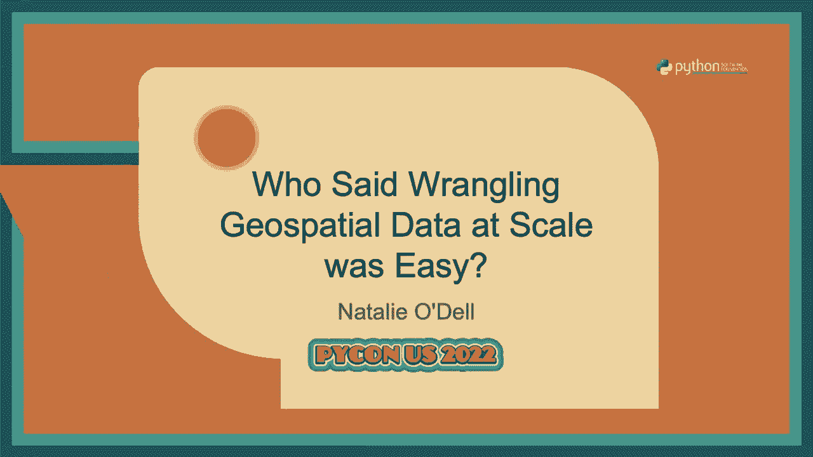
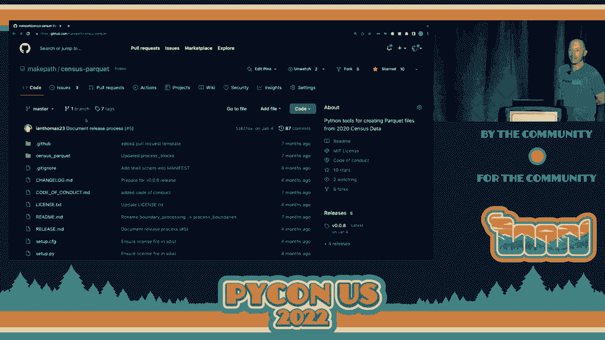
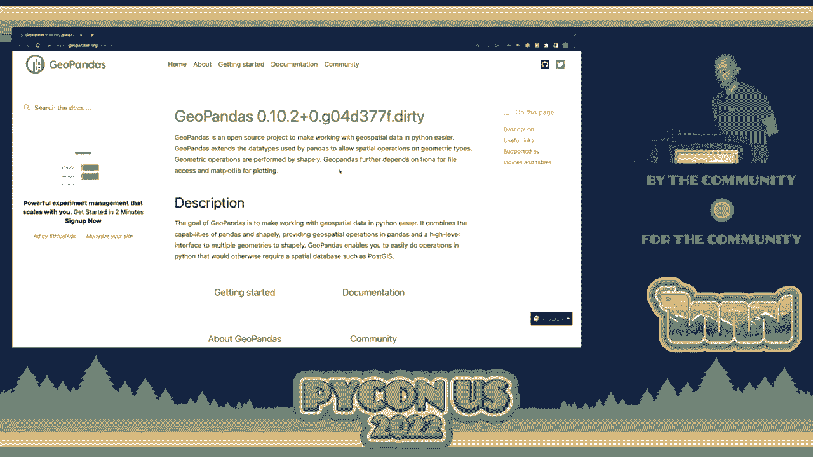
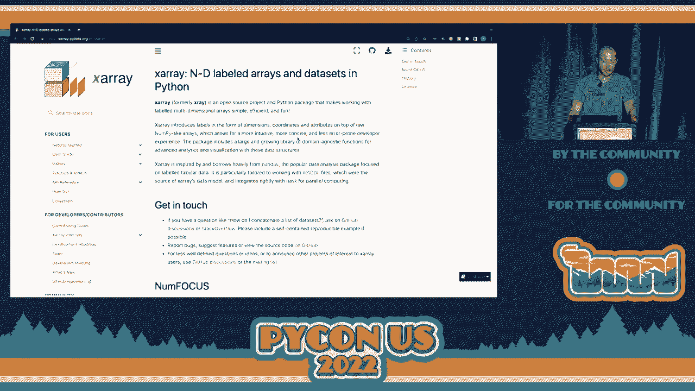
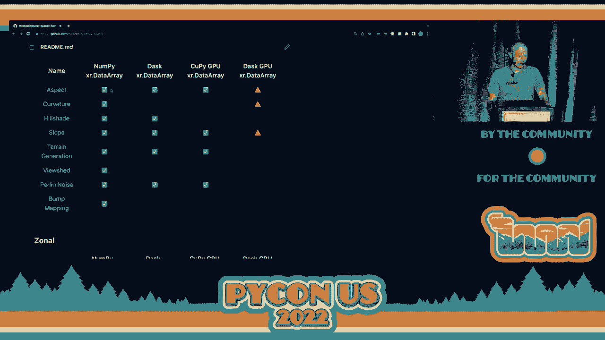
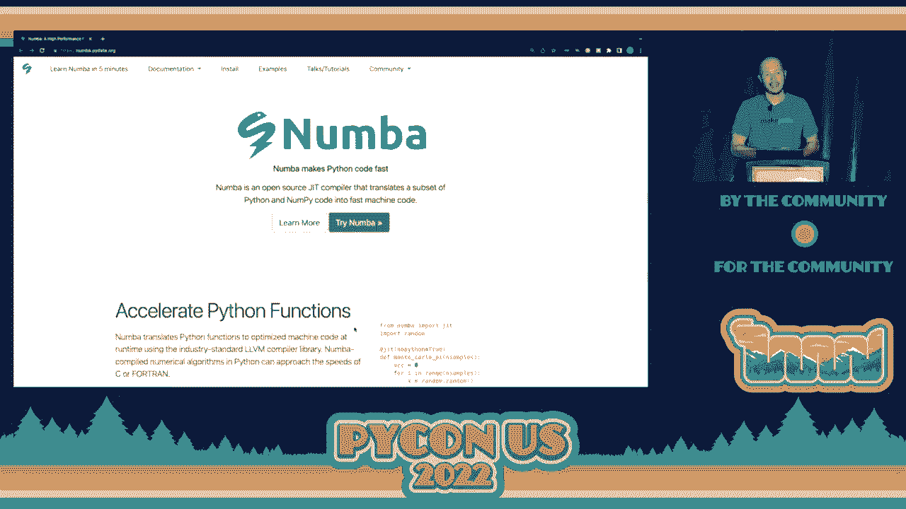
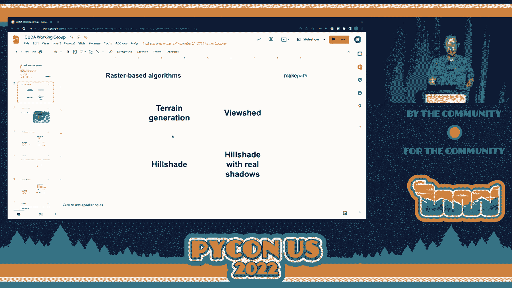
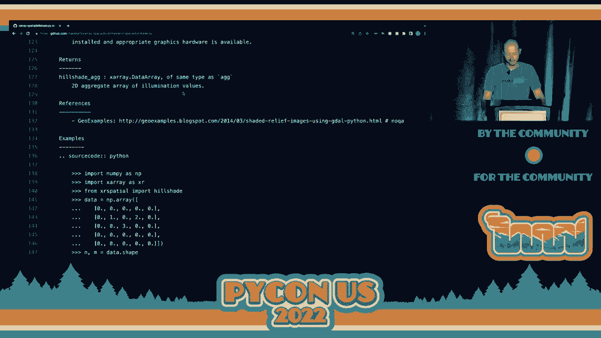

# P27：Talk - Brendan Collins_ Who Said Wrangling Geospatial Data at Scale was Easy_ - VikingDen7 - BV1f8411Y7cP

 \>\> Hello， everyone。 Let's welcome Brandon Collins to deliver a talk on who said ranking。

 your special data at scale was easy。 Huge thanks to the PyCon 2022 organizers for。 making this event happen。 Super excited to be here。 This is my first PyCon。 Also， you， know。 my first PyCon presentation， obviously。 Also， huge thanks to Chris Skynor from the。 Nature Conservancy who loaned me his PyCon for Dummy's book in 2008 and was super patient。

 with me as I struggled through writing some of my first PyCon functions。 I learned about。 geospatial data and the power of bringing spatial thinking to organizations while working at。 a company called Blue Raster which was using geospatial data for helping conservation groups。 better achieve their goals。 I've built a career on geospatial data off of the work of a lot。

 of other people。 Huge thanks to Peter Wang and Travis Olafant， Matt Rocklin who is here。 and also Brian Vandivan， folks that have mentored me and helped me and also shown me。 that there are business models that don't involve locking important tools behind proprietary。 licenses and keys。 So big thanks to those folks。 I wanted to start off by showing an example。

 of a vertical scaling solution for geospatial data。 What we're looking at is Crater Lake。 National Park and as I click around the map， I'm generating a view shed or a line of site。 analysis on this terrain while I'm rotating the position of the sun to do ray tracing in。 a hillshade。 This is made possible through using a CUDA enabled GPU that was all written。

 from a library called XRA Spatial which we maintain at MakePath。 It's an example of taking。 a small amount of data and making what is a somewhat computationally intensive task fast。 using a GPU。 In this talk， I'm going to be presenting really a grab bag of different tools。 that you should be aware of if you're approaching geospatial analytics in Python。 My name is。

 Brennan Collins。 I've been involved in open source geo for about 10 years。 I am the maintainer。 of XRA Spatial which is a Raster based spatial analytics library。 I'm also a huge fan of。 data shader which is a general purpose rasterization pipeline。 We're going to be talking a little。 bit about data shader。 I'm also the author of the King Jason Bible down there at the bottom。

 left for anyone that's interested in doing NLP on the Bible。 Also a new package from。 MakePath called MapShader which is trying to make GIS web services easy from Python。 I'm the co-founder of MakePath which is an Austin based spatial analytics firm。 We are。 focused on bringing the broader tools from the data science ecosystem to geospatial professionals。

 and the clients that we work with。 A lot of times tools from general data science are。 not named in ways that GIS analysts and geospatial data scientists recognize and we're trying。 to bridge that gap while also providing services to clients。 If you'd like to learn more about MakePath， please visit our blog and you can see a blog。

 post on this GPU enhanced geospatial analysis with the greater Lake National Park that I。 just showed。 You can see a little bit more of what went into creating that。 So who said that processing geospatial data at scale was easy？ Well maybe you was Sophia， Yang。 I don't know if you know her。 She's a senior data scientist at Anaconda。 She just。

 started a YouTube channel and has some really great content on there that she shows a lot。 of her secrets for data science。 So maybe it was Sophia Yang。 Also Natalie Odell here who's a GIS analyst at MakePath。 Natalie do you think that processing。 geospatial data at scale is easy？ Sometimes。 Sometimes。 Cool。 So Natalie is the author of。

 a really interesting library called Census Park A。 And what Census Park A is doing is。 it's taking the Census 2020 geographic files， shape files， and converting them into a format。 that's better for processing at a large scale， which is Park A。 So this is not exactly the。 Park A files themselves， but the tools to create those Park A files。 So you can go to。

 Census Park A and download this and you can modify these scripts for other uses。 But we。 took this and we processed the Census 2020 data so that it would be easy to consume from。 big data systems like Dask and Spark and other solutions。

 Now one of the things that makes processing geospatial data difficult is that there's a。 lot of different formats。 So as we go over to OGC， the Open Geospatial Consortium， we can。 see a list of the OGC standards which they currently support and there's a bunch of them。 They apply to many different types of data and it can be a little overwhelming if you're。

 getting involved in this to choose which data formats should I be targeting。 So this talk。 I hope that you leave this talk with a good idea of the formats and tools that you should。 be using for different types of geospatial data。 These data formats are really divided。 up into two general categories。 One of those are for vector data and another is for raster， data。

 In looking at data carpentry。org， which is a great site to learn more about data science。 you can see a little bit of an introduction to vector data。 So vector is a very overloaded。 term in data science but in GIS and geospatial it refers to points， lines and polygons。 So。 vector data represents discrete phenomena。 So if we think of a building， then that building。

 could be represented as a point。 It could be represented as a line as the outline of。 the building footprint or it could be represented as a polygon。 Those are all vector formats。 So。 vector are for discrete phenomena。 Some of the tools to handle vector data points， lines。 and polygons that we should think about start with a library called pandas which many of。

 you are familiar with that gives us the ability to manipulate tabular data in Python and organize。 numpy arrays with labels。 Now another library came out called geo pandas and geo pandas will。 add a geometry column to your pandas data frames so that you can process vector data。 with a similar API to pandas。 So geo pandas is great and just like pandas， it's an in。

 memory data structure that you're working with。 So another library on the vector side。

 that I just wanted to talk about was dask geo pandas。 So the dask data frame， which is。 a really great abstraction for scaling pandas data frames to multiple threads or multiple。 cores or multiple machines also has this extension dask geo pandas to give you that geometry column。 on your dask data frame so that you can use the dask abstractions with geo pandas。 This。

 is a fairly new library。 It's I would say like has some rough edges but they're getting。 smoothed out and it's a really great dependency if you're going to process vector data sets。 that do not fit on a single machine。 So as we processed census parquet and Natalie was。 writing those scripts， we used dask geo pandas to load up each one of the individual census。

 files into a single large data frame that we could then save out as partitioned as a。 partition parquet file。 So I'm going to mention parquet a lot and I think the first take away。 from this in processing geo spatial data at scale is that parquet is a really good， friend。 OGC is now putting out a geo parquet specification for having that geometry in。

 your parquet file and there's a couple of reasons why you're going to want to use parquet。 as a format。 So the first reason that you're going to want to use parquet as a format is。 because it's binary instead of a text based format。 It supports a wide number of compression。 formats and it also stores data by column and that's really nice and it's partitionable。

 So those four things together make parquet a really good option for storing your data。 and we know that performance breaks down into two different things。 It breaks down into。 memory and IO or compute and IO。 So parquet is going to handle the IO component of scaling。 and as long as we have a geometry column in our parquet file then we'll be able to scale。

 vector operations on top of the data。 So the first lesson in scaling would be choose a。 data format that lends itself to fast IO。 So it should be binary。 It should support various。 types of compression。 It should be most likely column or store so you don't have to load。 all of your data into memory if you're only interested in one column and it should also。

 be partitionable so that you can have individual processes or workers load in one partition as。 opposed to having to load the entire data。 Now the other area of spatial data is raster。

 data。 Raster data is regular grids。 We know rasters from formats like JPEGs and PNGs。 They're。 images。 So raster formats in the geospatial world are used to represent mostly continuous。 phenomena。 So we think of rainfall， soil types is a common one。 Elevation。 Those tend to be。 represented as rasters。 And a fun little cliche comment from the geospatial world we say raster。

 is faster and vector is correct。 So a lot of times in performance the performance gains。 can be found by making sure that you're using the correct formats for your data。 If you。 take a large elevation data set and you convert it into a vector from a raster you can do that。 but you're going to end up with very complicated vectors。 So many vertices for each one of your。

 areas and as you process that it's going to be fairly slow。 Now raster data has its own。 issues and we're going to talk about a couple of libraries that are going to help you。 The。 foundational library which we all know and love is NumPy which gives us the ability to。 allocate a typed array that is much faster to work with than say a Python， a heterogeneous。

 Python list where we're doing all the type checking for every element。 So NumPy forms。 the foundation for the geospatial libraries for raster processing that come after。 But。 there are some things about NumPy that can be difficult。 So one of them is not having， labels。 So when you're using a NumPy array you'll find that you do a lot of integer indexing。

 with the NumPy array slicing syntax。 And it would be really nice if you could build a。 say a cube let's think about a 3D array where you have x and y as your geospatial coordinates。 and maybe z as your different layers。 Those could be maybe the bands of a Landsat image。 or they could be different you know different data sets from places that have been co-registered。

 X array will give you the ability to label those dimensions and refer to those dimensions。 with strings instead of integers。 That makes your code a lot more readable and in three。 months when you come back to a function you'll be able to understand what it's doing。 There's。 a lot of work has gone into x array and we owe it make path a huge credit to the pan。

 geo community for pushing forward the x array format and other formats like XAR that we。 also rely on for raster data。 Make path decided that there could be more universal functions。

 on top of x array objects。 So we created a library called x array spatial which includes。 spatial extensions for x array objects。 This library does not introduce any new data structures。 All it is is a set of really the universal functions。 So if we think of NumPy really。 is two things the nd array plus universal functions like some and standard deviation that operate。

 on top of the NumPy array。 X array spatial is basically like spatial ufunks which take。 x array data arrays as input and tend to return x array data arrays as output。 There's a couple。 of functions which return pandas data frames and we can see a couple of those。 But we have。 a nice list of the features that are in x array spatial if you scroll down a little bit。

 and we can see some of the categories of universal functions that we support。 So classifying or。 binning rasters where you want to bin using like an equal interval method on top of a， raster。 Focal analytics where we're looking at neighborhoods around pixels similar to。 you know convolution filters but we have a general apply so that you can create your。

 own filters to pass over an image。 Hot spot analysis to identify statistically significant。 hot spots in an image。 Statistics so multi spectral functions these are all about combinations。 of different bands and imagery。 So if you get a Landsat scene or a sentinel scene you'll。 have RGB bands but then also near infrared and a slew of other bands you can combine。

 those together to pull out interesting information。 The classic one in multi spectral would be。 NDVI。 So there's a bunch of other ones。 Now as I look through these features you'll notice。 that there's different columns here。 So these different columns correspond to which array。 backends are supported by the function。 So the NumPy x array data array so x array is。

 wrapping a NumPy array to provide labels right but it can wrap other types of arrays。 So。 it can also wrap Dask arrays。 So if you're loading up a chunked array using Dask you can。 still use those x array labels but the underlying data is a Dask array instead of just a NumPy。 array。 There are also Koopa arrays so Koopa provides a NumPy like API on top of CUDA， GPUs。

 So that's really handy。 You can put a Koopa array inside of an x array data array。 and then run it through x array spatial functions and that's nice。 And then there's also the。 Dask GPU column。 So that would correspond to a cluster of GPUs that you're running an， analysis on。 We have some simple pathfinding on top of rasters。 Also proximity analysis。

 So we're looking at the distance from target pixels in a couple of different ways。 There's。 allocation direction and just distance which is the proximity function and those currently。 only work on NumPy and Dask arrays。 We're still implementing the Koopa versions。 Some raster。 devector tools and classic surface tools like doing slope and curvature view shed is one。

 of them here that I showed earlier。 So we have vector and we have raster。 So data shader。 is a great tool which came out of Anaconda really led by Jim Bednar and Jim Christ。 And。 what this is is a general purpose rasterization pipeline。 So by that I mean moving from vector。 data to raster data。 So what if you're dealing with elevation data and you're also dealing。

 with parcel data。 Parcels， say the boundaries of a given property in a community are best。 representative vectors while elevation is best represented as a raster。 Data shader。 will allow you to convert between the two in an intelligent way and it also allows you。 to specify aggregation functions for dealing with things like over plotting。 And so data。

 shader is a really amazing tool。 We use it all the time at MakePath and we can see an。 example here of population in the United States of the lower 48 and this is one point。 per pixel in the country。 So this is a vector data set of points and data shader is taking。 it and aggregating it to the two different pixels and then applying a function to reduce。

 those values into a color here。 There's a log color ramp applied so we're able to resolve。 the Midwest cities and not get drowned out by New York Houston and Chicago and Los Angeles。 But data shader is one of those tools you want in your toolbox so that you can convert。 from vector to raster easily and co-register data sets。 And by co-register I mean having。

 their pixels aligned。 So if I load up say my elevation data and then I want to bring in。 parcel data and summarize the elevation by the parcels， right？ I'm going to have to convert。 those parcels into a raster but I'm going to need their pixels to align and that's where。 data shader can help you by helping you resample the elevation data， rasterize the vector data。

 bring them together and allow you to do your analysis without worrying about those creativity。 killing steps。 Now in scaling there's some other dependencies that need to be highlighted， here。 Numba is certainly one of them。 In X-ray spatial we have heavy use of number for vertical。 scaling and by vertical scaling I mean making our algorithms faster。 I want to stay in Python。

 I don't want to drop down to a C extension when I need to loop through a bunch of pixels。 And so the Numba functions inside of X-ray spatial I hope to get to showing you one of。 them make it possible to have performant code without adding a C extension。 And on the horizontal。

 scaling， Dask is the solution for being able to scale out to multiple threads and multiple， CPUs。 It understands Numba functions to send around to workers and so these tools integrate， very nicely。 I mentioned Kupai。 Kupai is for interfacing with CUDA GPUs with a Numbai-like， syntax。 And here's a recent merge that we had on X-ray spatial where Twee， one of the， engineers。

 says current hotspots Kupai case implementation runs on pure Kupai， enabling。 Numba helps greatly improve performance in testing this array size。 We got a 6000X performance。 increase。 So that was an example where there's probably a lot of low hanging fruit to do。 on the hotspots tool。 And using Numba and its JIT decorator for CUDA we were able to target。

 GPUs for hotspots and get a really nice improvement。 I also wanted to highlight the planetary computer， from Microsoft。 The planetary computer combines curated datasets with scalable compute on。 Jupiter lab and open source tools like Dask and Numba。 And looking at a quick example here。

 we can see pulling in elevation data from the planetary computer and doing a nominal。 analysis on it。 So what I'm doing is I'm importing data shader。 I'm importing a planetary computer。 library and X-ray， choosing some areas of interest， and then using what is a stack catalog to。 access data。 Stack is a great open source specification。

 it's a spatiotemporal asset catalogs for being， able to have a JSON file which you can read which describes a multi-part raster dataset。 So if you have a large， say you have Landsat and there's many scenes， you don't want to。 loop through every scene and check its bounds to see whether it's in your study area or not。 You want to consult an index。 And that's what stack is。 It's an index that you can put in。

 S3 along with some other formats and read that stack catalog and find the data that you're。 interested in。 So we've queried this stack catalog， the NASA DEM for our area of interest。 We're retrieving that elevation。 Then we're able to grab that data and use data shader。 to an X-ray spatial。 So here we're computing a hillshade with X-ray spatial and then color。

 mapping with a pseudo-elevation color map。 And so this was querying a very large dataset。 but it used stack to figure out what area of the data to pull。 And then used X-ray to。 open that dataset and resample it。 Used X-ray spatial to compute a hillshade to place a。 light source at a given location in Azmuth。 And then used data shader at the end to actually。

 add color mapping to the array。 So what this is is this is， you know， if you're interacting。 with this， this is an X-ray data array。 So stack， I mentioned a little bit about stack。 so check stack out。 There's a lot of great tools around stack。 Stack is not Python specific。 it's simply a specification but there's pie stack and other libraries that implement it。

 And X-ray spatial has a whole user guide where you can look at the different tools and actions。 So this is a proximity notebook where we're looking through calculating proximity on points。 So we have our starting points and we're able to run the X-ray spatial proximity tool。 to generate a grid where every pixel is the value in distance to the nearest point。 And。

 you can choose different distance metrics。 You can also do this where you are， say， doing。 the distance from a line feature。 And here's the result of a line feature。 You can threshold。 that distance。 You can also do proximity allocation and direction where I want the value not。 to be the distance to the nearest item。 I want it to be the ID of the nearest item。 And that's。

 what allocation is。 And so that is an allocation grid。 And then also direction where you want， the。 say， the cardinal direction to the nearest point。 So those are some tools available in。 X-ray spatial。 We do have a continued CUDA working group where we're working on algorithms。 I mentioned the hotspots tool。 And I wanted to quickly show I just have a little time。

 left。 What it's like inside the code of X-ray spatial looking at these number functions。 So here is the code for slope。 But I'm just going to quickly change this to hillshade because。 we saw more of the hillshade demos here。 So we have first a NumPy implementation of hillshade。 just using NumPy U funks。 Great。 We can take that NumPy version of our hillshade and we。

 can scale it to using Dask。 Look how easy Dask is。 So there is an edge case here where。 we have to handle overlapping partitions。 Because our data is spread out， we can use， map overlaps。 So we can pull in the edge pixels from one partition and the edge from。 another so we can compute our hillshade and not have edge effects for every partition of。

 our raster。 We can then sprinkle on the CUDA JIT decorator。 And we've enabled this code， for GPUs。 So in this file here， it's about 200 lines with some documentation。 It's handling， the NumPy case。 the Dask case， the GPU case and the Dask GPU case。 All in 200 lines of。 code without any C extensions and it's very performant。 So check out X-ray spatial and。

 minimum steel functions from it and look at examples of implementing NumPy and Dask together。 In general， I'm just so grateful to be here。 It's an amazing opportunity to interface with。 the Python community。 I urge folks to reach out to me and to other people at MakePath。 I always enjoy going and evangelizing these tools and helping organizations to use them。

 And I think we're not doing any Q&A but thank you guys so much for the opportunity and hope。 to see you around the conference。 [Applause]。
