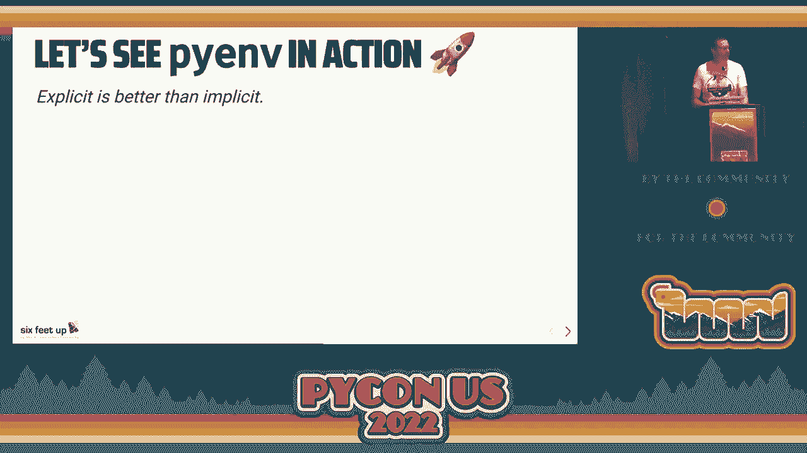
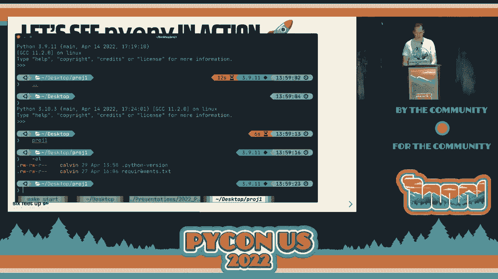
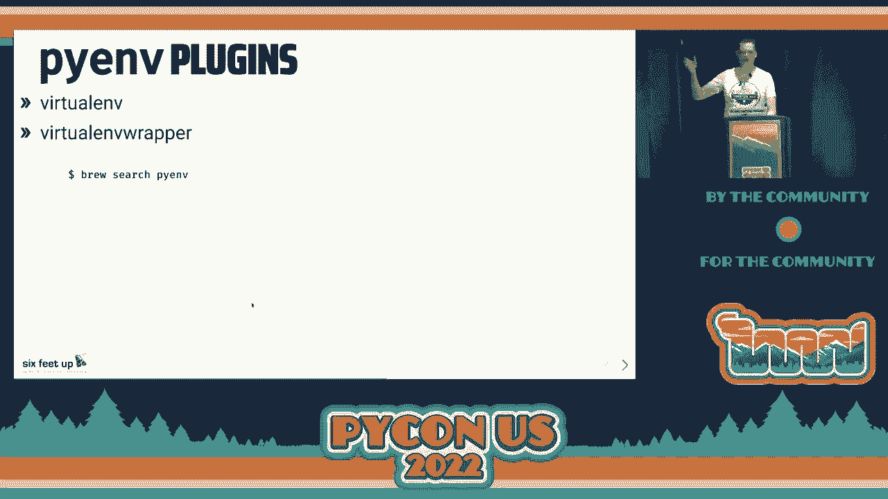
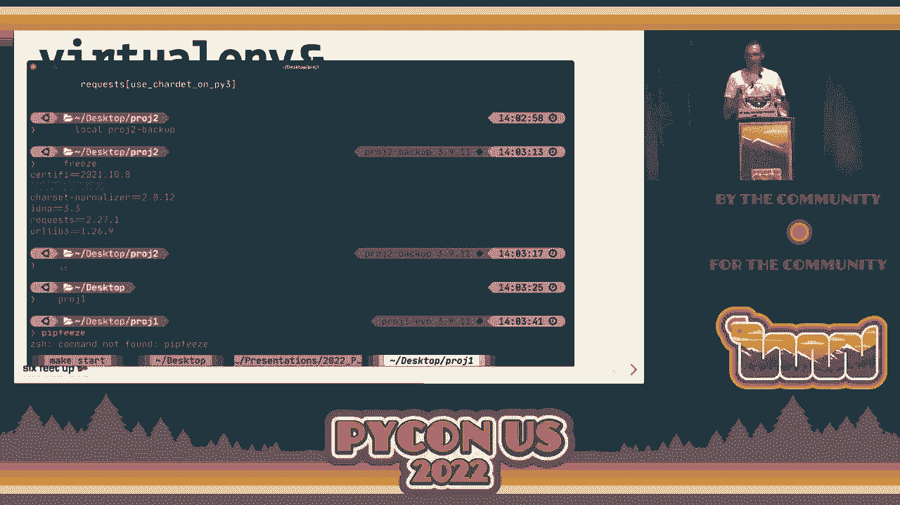
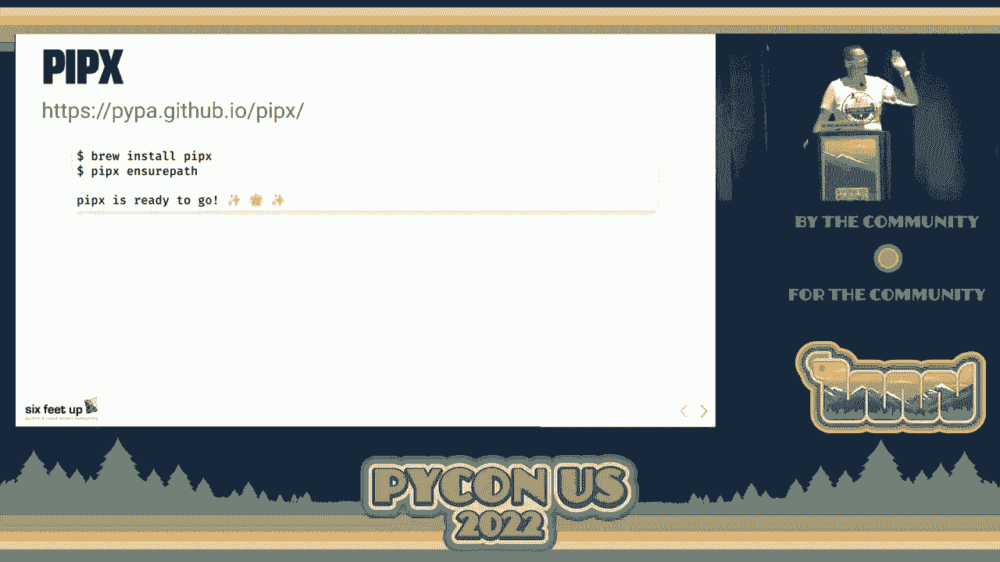
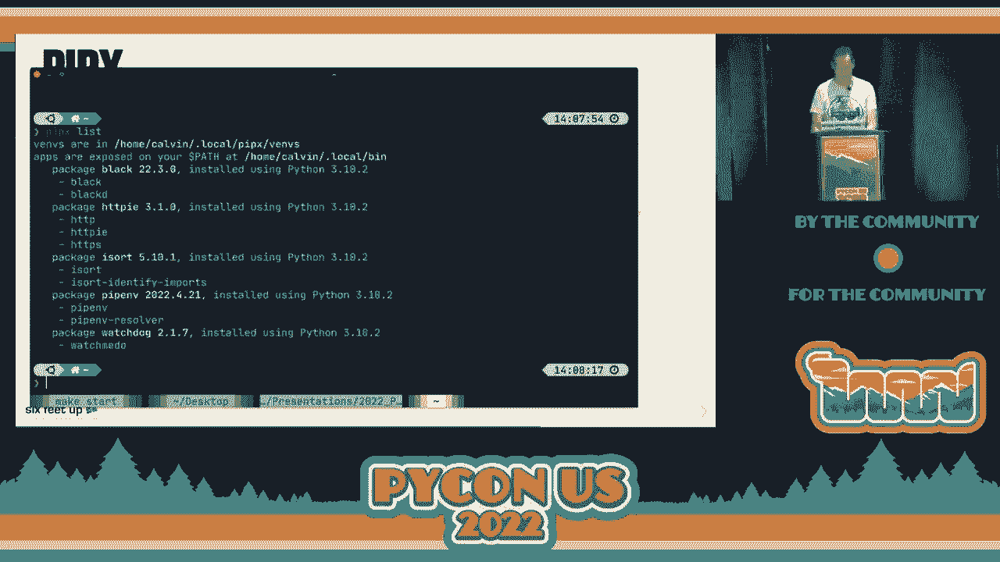
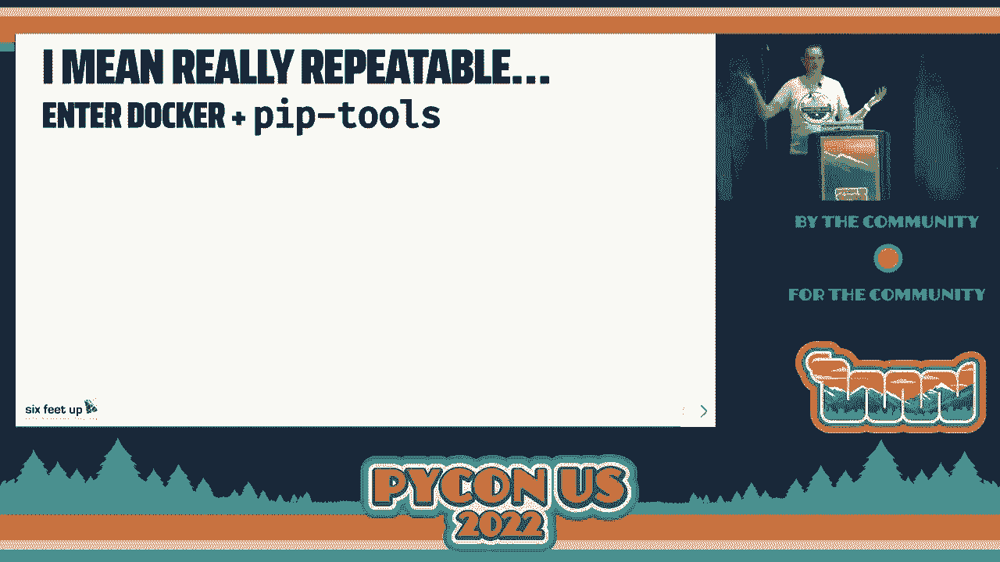

# P29：Talk - Calvin Hendryx-Parker_ Bootstrapping Your Local Python Environment - VikingDen7 - BV1f8411Y7cP

 There are a lot of you in here because this is not as simple as it may seem as many of。

 you have probably found out through your first attempts at setting up your computer or the。 many follow on failed attempts decades later as a seasoned Python developer still trying。

 to do this type of thing。 So a little bit of intention setting。 I think that's important for kicking off the talk the， right way。

 For those of you who may not be familiar， there is an Easter egg in Python that gives you the。 Zen of Python if you import and run this module。 So I recommend to anyone who I've ever taught Python to or had the pleasure of teaching them。

 how to get started with Python is to print this out， put it in a frame， put it in your。 bathroom and read it every day when you brush your teeth a couple times a day。

 It's good for the soul， it's good for more than just programming and coding but it helps just。 everyone on the same page about how we're going to think about this kind of a problem。

 of getting your computer ready to be your superpower tool that is going to be the thing。 that you use day in and day out as the role of a developer or system engineer or whatever。

 the role may be where you're going to be using Python whether you're a data scientist or。 whether you're going to be a software developer or engineer。

 This is an important one and we're going to highlight a couple of these throughout the。 talk and I'll get to those in a moment but the ultimate goal here is to end up not here。

 Some of you are familiar with XKCD。 This was April 2018， Randall Monroe posted this comic。 admitting he had did some bad things， to his computer at this point。 So if you've seen this。

 the Python Environmental Protection Agency wants to seal it in a cement。 chamber and so that was the alt text on this specific one but it was funny， it's like there's。

 a lot of truth in this cartoon and I can tell you from being someone who's been you， I have。 used Python since the year 2000。 Very first version of Python I ever installed was version 152 and all this is true and I've。

 been through all of this stuff because I've been on a Mac or on Linux or on Windows and。 I've ended up with five different installs and I'm not sure where this Python is coming， from。

 I'm not sure where PIP is putting something。 I swear I installed something in one spot。 I go over to use it in the project and it's， like module not found。

 I think we all can relate and actually if you all are， if there's a quick question， don't。 hesitate to raise your hand， I'll make sure I repeat it back but I want to avoid this situation。

 for you all because Python does live in many places。 It is provided by your operating system so if you're on a Mac or if you're typically on， Linux。

 those are going to have Python pre-installed and I know it sounds great but be warned， it。 may not be the one for you。 You may have installed Python from an App Store so for example if you go to the Microsoft。

 App Store there is a shiny Python that you can search and install in there。 Great way to get started is a new developer but may not be the right one for you either。

 You can download an installer from Python。org so there are some binary package installers。 there are source code downloads as a beginner that is also daunting and confusing because。

 you're not sure which one is going to work for you necessarily or you can be using a。 package manager。 There's lots of great choices there as well。 If you're on Debian Ubuntu。

 there's apt。 If you're on the other Linux's you're going to have YAM or whatever the latest installers。 there may be Homebrew which is actually a personal favorite of mine and I highly recommend。

 it and I'll be showing off some Homebrew stuff in this talk。 If you're on Windows there's an equivalent to Homebrew called Chocolaty and all these。

 will give you a way to install Python onto your machine。 You can also have Python installed via a Python distribution so if you aren't familiar there。

 are custom package distributions like the Anaconda Python or the ActiveState Python that。 are kind of prepackaged and supposed to give you a great experience out of the box but if。

 you're still are confused about these kinds of things it may not give you that great experience。 you're totally expecting。 Why should you care about all of this at all？

 It just sounds mind-numbingly boring almost to me to think we'd have to still be dealing。 with this in the year 2022 but we do because we want to make sure that everyone can stay， Zen。

 I mentioned we were going to highlight a couple of these in Python statements which specifically。 the beautiful is better than ugly， the explicit is better than implicit and simple is better。

 than complex。 I think one of the ways if you've ever heard of the term the ceiling of complexity one。 of the ways to break through the only way you can break through the ceiling of complexity。

 is to simplify so that last one is very important is to keep things simple until they can't。 be any more simple and then we'll talk about that beautiful is better than ugly。

 If it feels wrong it might be wrong kind of that smell test as a developer when you're。 going through and writing some code and you're like this doesn't feel right it's getting。

 the job done but I'm not sure about it。 Same thing goes for how you're installing and using Python in your local system。 I'm hoping to say we can talk about improving that process making it more consistent making。

 it more simple making it more explicit implicit pythons are troublesome because you don't know。 where they came from you don't know where the PIP is going you don't know where the。

 packages are being installed into so let's start off with some ground rules first some。 quick rules that'll keep you as safe as possible on your own computer so again focusing on。

 getting this right and having that foundational base is in my mind just a important factor。 of the fact that this is how I make my livelihood。

 I want to have this the most awesome killer set up on my machine that you know just makes。 me as productive as I possibly can but we're going to start off with this first rule which。

 is no pseudo you should not have to type pseudo to do anything with Python whether you're installing。 Python or installing a package in Python or installing some kind of Alan for Python there。

 is no reason to ever use pseudo I don't care no whining if you're using pseudo to do something。 on your machine or administrative privileges to do something on your machine you're probably。

 doing something incorrect or again it should feel wrong to you that that smell test should。 tell you that something is is a rye if you're using pseudo I mean the reason for this is。

 you're most likely going to be installing a Python package into a place that I shouldn't。 be like in for example the system Python do not use the system Python that Python that。

 came on your computer if you're on Linux or on Mac that's not for you that's not your。 Python that Python is for use by the system itself the installed OS is going to be running。

 its own scripts and own programs and on kind of clean up tasks those are going to be using。 the system Python and if you upgrade out for underneath the system Python some package。

 that one of the scripts is relying on you could actually be making a whole computer unstable。 and you're heading for a reinstall of the system or else a really terrible cleanup and。

 don't use it for anything that system Python is not for you again I repeat that not for。 you because that is only for the OS so now I know you're saying okay this Python on my。

 computer but you're telling me I can't use it what do I do smart guy I'm going to hopefully。 encourage you to start down the right path I'm gonna give you a couple quick tools and。

 techniques that I find to be very very useful the first one is going to be pi and not to。 be confused with pip and or pip or a million other tools that seem to be very really similarly。

 named a pie and is a really really specific nice tool that has been open source that allows。 you to change your global Python that you would use so if you are sitting in a terminal。

 and you type the word Python what you expect to have happen would actually be launching。 your Python that's yours you've installed through pi and not the system Python so right now if。

 you didn't have pi and installed and you didn't any type the word Python you're gonna be using。 the system Python again problematic you can have per project Python versions that was a。

 consultant I deal with a lot of Python's day in day out we've got projects that are running。 from Python 2 7 straight through to I don't think anything 3 11 you have definitely 3 10。

 the most recent stable version of Python and everything in between we've got projects on。 3 7 or 3 8 3 9 and I need to have an easy way to be able to install each of those and。

 keep them clean so that I can now have virtual sandboxed environments that I'm not stomping。 on my own self as I go and install dependencies for various projects and then the other kind。

 of quick tools here this works for Linux and for Mac if you're on Windows there is a。 pie and win but I probably wouldn't recommend using it and I'm going to recommend something。

 for Windows folks would be to investigate and seriously consider using WSL 2 the window subsystem。 for Linux is very mature now much faster than the original version of it and it's going。

 to give you experience that is going to line up with a lot of like how to's online where。 people are using Linux you'll just feel like one of the gang because basically the WSL 2。

 gives you a full Ubuntu or full Debbie or whatever you installed as your base Linux for。 WSL on Windows gives you that full full environment out of the box ready to go and you'll be able。

 to do everything you would see here today just like I'm doing on my I'm on Ubuntu here。 you can do it on Mac you'll be able to do it on Windows just the same so let's see this。

 actually in in action here okay so I've got my terminal and I have Pie Am installed but。

 the way to install Pie Am is going to be in my case I use homebrew for everything if I'm。 on Linux there's Linux homebrew if I'm Mac the Mac homebrew it installs the same it has。

 cross-platform support between the two OS's and if you're on Windows and using WSL that。 will work as well because you're just using Linux so once you've done you know a brew。

 install Pie Am that will get you all the way there already got installed so I don't need。 it once I've got Pie Am installed I can now see if there are versions of Python that are。

 on this system so it's going to include out of the box the system Python and consideration。 for a Python you would want to use right now is showing me my global Python is set to the， 3。10。

3 which is installed into a specific folder on this system which was in my home directory。 but then you see I've got three eight version available I got three nine version available。

 and I'll talk about those other versions up there that are named and don't have necessarily。 version numbers in them they are going to be virtual environments but if I wanted to。

 just type the word Python I will get a three dot 10 dot three Python environment and that's。 just the one that's installed from Pie Am so I didn't use pseudo I just do for example。

 if I want to install another version for example three dot nine dot four oops three。 dot nine dot four because we've got old projects that might be using that that goes and downloads。

 from Python dot org and grabs all the stuff if you're using homebrew it's going to use all。 the like Z lib and read line so that you've got all the dependency satisfied to make sure。

 you're good to go to install Python we'll come back to that window here momentarily like。 by my mouse here we go okay so we can now also do for example if I go on to my desktop and。

 I've got two folders here project one project two if I go into project one and I want to。 use a specific version of Python here as opposed to another version of Python like the default。

 Python so right now I type Python I get three dot 10 dot three which is that default global。 if I type pie and local and say I want to use three dot nine dot eleven excuse me you'll。

 notice my prompt actually automatically updated over there on the right side to show that I'm。 using three dot nine dot eleven and now when I type the word Python I get three nine eleven。

 by default so I'm in full control of my environments here I know where it's coming from it's explicit。 I have said I want to use this version of Python when I'm in this version this folder oops if I。

 go up a directory you'll see that the three nine eleven went away anyway I type Python back in。 three dot ten dot three excuse me which is also super awesome so again seeding into that directory。

 pie am is doing the magic here to automatically give me now three dot nine dot three how is it。 doing it it's there's no serious magic it is explicit it is put a Python version dot file in that folder。

 and so pie am is looking for that as I invoke the Python command there's basically a wrapper around。 all the Python commands to say I'm going to use the version is specified in that Python version。

 which also makes it easy to now specify across a project like what version of Python you're using。 although I don't think I would do that with this Python version they're better like pie project。

 dot tom will files to specify specific Python requirements for your specific project that we'll。 talk about later okay so that's a quick quick intro to pie am and kind of the explicit over。

 implicit I can say exactly what versions of Python I want and when I want them pie am one of the。 reasons I recommend it is it has some nice plugins if you are using limbs right now which you should。

 be to make sandboxes pie am supports these out of the box and it's really snap in easy to use。 if you're using virtual and wrapper it supports that as well I've since I've started using pie。

 am I've stopped using virtual and wrapper because the benefit of virtual and wrapper was it kind of。 hides that virtual environment sandbox away from you and I don't really need it here so。

 the way you can get these plugins if you just do brew search pie am， there you go shoot too much。 there'll be the pie am recipe but you also have the pie am dash virtual and let's go ahead and。

 I'm gonna make a pie am for you real quick the virtual environment。 so I'm in project one I've set up this three nine dot eleven but that's not actually what I want to。

 use technically that is going to be what I consider my like base install of the versions of Python I。 don't want to mess those up if I do hit freeze right here it should be empty I should have no。

 packages installed right now I've got this pristine clean environment and I will keep it that way。 and instead I will do pie am virtual and we'll make another one using three dot nine dot eleven。

 and I'll just call it prog one dash in being just hope small it doesn't matter name I can even use it。 for whatever we want but now it still says I'm using three dot nine dot eleven I need to tell。

 this project that I want to use my specific virtual environment right here so I'll do that pie am。 the local command again and I will specify prog one with the misspelled ev in and now the prompt on。

 the right hand side is updated to show that I'm actually using a sandbox if I pip install into this。 sandbox for example like requests very popular package and now if I do pip freeze。

 you'll see I've got four packages installed if I cd up out of the directory and do pip freeze。 again clean pristine environment I'm not polluting my like system python with any packages accidentally。

 I'm being very explicit and about what version of python and what sandbox have this version of python。 so for these you aren't familiar like that that virtual is really critical to keeping your world。

 sandboxed off from the other projects and I'll show that here right now let's let's I've got another。 project here project two if we go into project two I've got a requirements file in there so if we。

 look at that requirements file it's going to install requests using a extra called you know use。 sharday on pie three and so I'll do the pie am actually I already made a virtual environment for。

 this one so just to speed up things called project two backup and if I do pip freeze it should be。 empty oh no I did install the array so this is going to have the pie three sharday version of。

 requests already installed into it if I go back into project one well I already already done that so。 we'll just want to dip these real quick well I'll just go into project one we'll do pip freeze。

 to compare it to the one that's up there right above it。 like the joys of live demoing right so you'll see there's a difference here that that charade。

 version four is missing from the bottom one where it was included in the top one up here oops。 oh I scrolled too far there it is this this line right here is missing in the bottom one because。

 I've installed them in two different ways I installed the same package in two different ways because I。 may have two projects that need to use those kind of subtle differences between having maybe a。

 different version of requests installed in one versus another because maybe you've not run your。 full regression tests against your code with an upgraded version of requests so you may be。

 working between two projects where you need to maintain two different versions of the same package。 even across those two spots and so pip pip and plus sorry pi m plus the virtual environment plugin。

 makes this like just super seamless because you can now cd between the directories you're not。 activating and deactivating and forgetting because sometimes the biggest problem I always had with。

 virtual environments was I would forget to deactivate I'd cd into another directory for another project。 I would pip install something and it end up over in the other virtual environment and I like and then。

 nothing works so to solve that problem has a nice environment injection that basically cd's in and。

 out unless you do that real quick so that is that part of this now if you have simpler needs where。 maybe you aren't just wanting to go down the whole piant path since python 3。3 python has included。

 bundled in a kind of a simplified version of virtual and called VM and so if you were to invoke python。 with a minus m VM which basically says I want to run the module VM this packaged inside a python。

 you can do the same thing with pip so if you invite python minus m pip it'll run the packaged version。 of pip that is in the python interpreter you're dealing with directly as opposed to maybe some。

 random pip that's in your path so kind of a surefire way to make sure you're getting a virtual environment。 for the version of python you're currently running is to run a minus m VM like that and it'll use。

 the included virtual in which is kind of a stripped down linear version of the standard virtual environment。 package to give you a VM called VM in this case now some some side notes here sometimes you've got。

 tools you want to get installed like you want to black and you want to ice or you want to use docker。 compose or hdbx or all these kind of cool python command line tools where do you manage those。

 various tools like that so i recommend to folks to use pipx if you've not checked out pipx it is。 super awesome super easy to use and it will greatly simplify your life being able to install these。

 kinds of tools so let's look real quick here i'm going to go to my home directory i already have。 pipx installed but for example if i want to use who's here swimming with hdbpy it's an awesome tool。

 for like messing around with apis and calling you know making get requests and folks requests and。 kind of a replacement for curl but it does some cooler stuff like it'll give you colorized output。

 normally it has a command called hdb and when you ran it you would invoke hdbpy from the command line。 you typically pip the instructions may tell you to pip install hdbpy but i'll implore you to。

 install pipx first and do pipx install hdbpy and this is going to create in the back ground for you。 another little virtual environment sandboxed away you don't see you don't deal with and then it's going。

 to inject these three in this case for hdbpy it's going to inject these three commands into your。 path automatically so now you saw before i typed in hdb now if i type hdb it's green and i can you know。

 go ahead and grab uh like a URL maybe here we go and there you go uh is there's obviously。 redirect to hdbs because i was all good websites should be hdbs that one doesn't uh now and you see。

 it's all colorized and pretty and hdbpy is an awesome tool but i install it into my system python i。 didn't use sudo to install it i didn't even install it using like a user flag which i'll talk about。

 here in a second i've installed into its own little um environment that is now managed just by h by。 pipx so tools like you see here i've got black i sort pipmve uh watchdog which has a watch me do thing。

 cool command line tools like that totally deserve to be installed via pipx and not put into a virtual。 environment or into some other kind of non-standard place there's a good consistent way to do this。

 so that was pipx the kind of pipx let's see some damage i just showed you that。

 all right and i mentioned just briefly if you didn't catch it what about this user scheme。 there is in python the ability to pip install packages with a dash dash user pack user flag there。

 and this is allows you to install without using sudo so you're following like my number one rule。 don't install using sudo but you're installing into a python environment or location in your home。

 directory that basically gives you one version of whatever you just installed so if you're using。 requests 23 and you need requests 22 for another project using this pip install dash dash user。

 you know requests equal 22 you know 0。22 uh will end up overwriting the already installed version。 because basically it's just one little sandbox thing i find this just again confusing for folks who。

 have never seen it it may be an allure or a way to like not use sudo to install a package but you。 may end up with for example if i installed hdpy into with the user scheme and then i proceeded to。

 install another tool that had conflicting version of a dependency using the user scheme i would break。 my hdpy and no longer have the working script so again not a good place to be installing packages。

 leverage tools like pipx for installing your command link tools because it keeps them all separate。 they don't have their own dependencies no conflicts there and when using your projects make sure。

 using the virtual environments from piam but what about i know there's so many options out there right。 this is the mind-blowing part about python what makes it so hard you know what about anaconda python。

 and conda kind of data science folks would be more familiar with the conda package manager。 oh it's like there's just again too many options actor state python pipx used kind of a tool that。

 was in favor and then kind of felt a lot of favor because of performance issues it was。 interesting in beginning asdf is a very similar tool to piamf in that it can install multiple。

 versions of a language any language actually you can use it with rust or with ruby or python but it。 doesn't have the same plugin environment that the piamf one does have for doing for doing python。

 specific work for example having that virtual limit plugin or the ccash plugin for speeding up builds。 poetry is a great tool if you're building libraries but as a new person to python or if you're just。

 you know trying to get work done and you're not developing specifically on a library i wouldn't。 recommend necessarily starting off there because there's going to be an extra overhead of all the。

 kind of poetry um dance and protocol and commands and apis that you would need to use。 pdm another you know python package manager kind of maybe less popular then say something like piamf。

 and then pipx project。tommel is also another place where you can specify dependencies for your。 project and some tools like poetry for example would use that for understanding what your。

 dependencies are i think there's a lot of promise for using pipx project。tommel files that's i think， there's a pep right now that only has been approved but look for more to come there around build tools。

 and python and using that pipx project。tommel file instead of a requirements。txt file so all that said， is i just want repeatability and simplicity i want this thing to be simple and easy kind of。

 zen of python i want to be a zen python master and i want to follow that simple is better than complex。 uh line of the zen of python one of the tools i'll highly recommend to folks is going to be。

 pip tools package if you've not installed pip tools it has a pip tools compile command built into it。 that'll allow me to manage my dependencies for my project so if i'm working on a jango project。

 and i got a specific version of jango specific version of this and that pip tools allows me to。 specify my main dependencies that i'm using in the project as opposed to every dependency i'm using。

 in the project um who here has you know had a requirements file where it's just gotten like 200。 300 lines long and it's got every version's pinned but you know there's always moving dependencies。

 underneath the covers like as one tool upgrades one dependency you want to make sure you grab all。 of its you know recommended dependencies you also want to make sure you're able to easily grab。

 security fixes performance fixes bug fixes that are coming in you know very minor versions of。 these dependencies and so managing dependencies can be really tricky especially if you're trying to。

 pin them all so maybe i wouldn't know what i mean when i say pinning dependencies if i look at。

 i've got an example， yeah there we go here's a requirements file that has got all the dependencies for this python script。 specified and it's using a double equals to say whenever you pip install always grab exactly that。

 version and exactly that version and exactly this version because you know any other ones may not work。 this will work most of the time and we want something that works all the time so we get that。

 repeatability and scalability or uh simplicity of being able to install and know that our you know。 six months from now when i come back to this project it will run again uh is a common you know problem。

 we've all had you know you go update the dependencies something has broken maybe a minor dependency happened。 or worse yet though you probably heard in the news a lot of the supply chain uh security issues。

 that come along with using these some of these packages you want to make sure you're getting the。 exact same package you got six months ago so pip tools solves this problem i won't have a full。

 time to necessarily demo all of it but it basically solves this problem by taking the cryptographic。 hashes of the various packages and wheels that are on pipi and comparing those against the last time。

 you installed it and pip tools allows me to manage instead of saying uh you see requests right here。 uh 2。25。1 requests has sub dependencies which we saw in the previous demo of sharday and certify。

 and uh idna i don't want to necessarily specify those i want to rely on requests to manage you know。 what do you know is about its dependencies and so i will rely on i will only specify that requests。

 is gonna say this is my version of requests i want and requests will specify the other versions but if。 i want to repeat it uh the pip tools will actually output all the hashes for me into another file where。

 i can get exactly the same thing over again i think with that i am kind of heading toward the end here。

 one last thing if you really want really really repeatable it's going to be docker and pip tools。 using docker containers to really solidify and like shore up exactly what version of python。

 you'll be using is a great way to make sure you get exactly the same build over and again and。 you can come back to it a year later and rerun that container without having to worry about。

 installing things on your system to get things running again if you all have questions i will be。 at the jet brains booth in the expo hall right after this so feel free to come down and pick my。

 brain about studying for your system and building your awesome like killer workstation thank you all。

 for being here。