# P36：Talk - Dustin Ingram_ Securing the Open Source Software Supply Chain - VikingDen7 - BV1f8411Y7cP

 Open source security team。
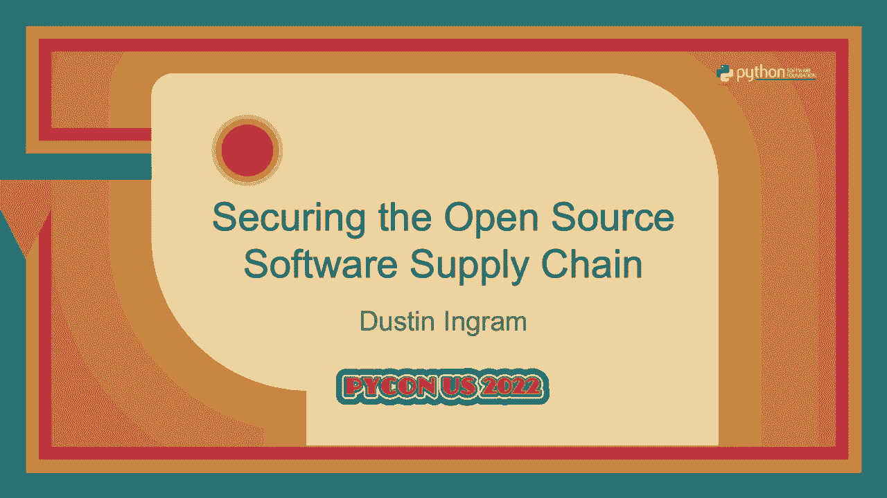

 Today he's going to talk about how we can secure our open source supply chain。 Thank you。 That's going to take it away。 Thanks。 Hi everybody。 It's so nice to be in person and have you all here。 So like Bernard said， I'm Dustin。 I have a couple hats。 I'm a software engineer on Google's open source security team。

 This is a new team at Google。 Our mission is to make open source software at Google and the rest of the world uses more secure。 I'm also a director of the Python software foundation where I help ensure the long term success of one very big open source python project that you have probably heard of。

 python itself。 And I'm also a maintainer of the python package index where I help ensure the long term success of hundreds of thousands of tiny little python projects that you might have never heard of。 I'm going to be a bit unconventional and start with a Q&A。

 But I'm also going to be the one asking the questions and then I'm also going to answer them。 So bear with me。 And the reason is because I think there's some really important questions that we should all be asking around open source security right now or the questions that you might already have。

 I'm going to try and preempt them。 First is， is it safe to use open source software？

 This might be a question that you came here with today。 Maybe you've heard a lot about security challenges and open source things happening in the news。 You might have doubts or fears about the viability of using open source。 So I'm here to tell you that is it safe to use open source software？ Yes。

 the reality is that every day all kinds of open source software is deployed and somehow it all works。 And as someone whose career exists because people use open source software， I want to tell you yes。 Like yes， it is secure。 But you might say， wait， Dustin。 didn't you just say that your job was to make open source more secure？

 Doesn't that also imply that open source software isn't quite as safe as it could be？

 And so kind of also yes。 So I really want to say yes with like a giant asterisk。 And so basically it depends on how you use it。 And also it depends on what your threat model is。 You want to read that whole paragraph， catch me afterwards。 So maybe a better question to be asking is this， how can we use open source software safely？

 If we're already using open source， how can we use it more safely？ And if you're not。 what should you be aware of？ So I want to start with what the software supply chain is。 Software supply chain is everything that it takes to produce your software。 Every other piece of software， every piece of infrastructure。

 just everything that is a dependency for you to create and use software。 So what is the secure software supply chain？ This is all those things and they're also definitely not compromised。 You may ask why is software supply chain security such a big deal？

 And the reason is basically because virtually everyone uses open source software。 Anyone who says they don't probably don't have a great idea of what software they're using。 And in the past we made a lot of assumptions about how open source software is created。 how it's distributed， how it's consumed， etc。 And some of these assumptions were that things wouldn't go wrong and these assumptions were wrong。

 But these problems have always existed so possibly a better question is。 why is software supply chain security such a big deal right now？

 And part of this is because there's an incredible amount of scrutiny being paid to recent compromises。
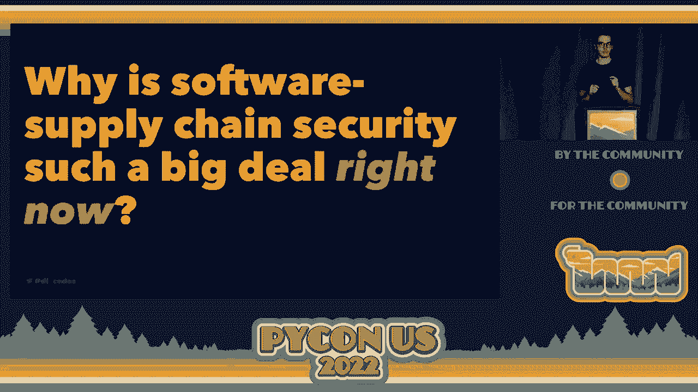

 We have all sorts of things happening。 Malicious libraries are published on package indexes。 There are new types of supply chain attacks affecting large corporations。 We have an unintentional remote code execution in an extremely widely used Java logging library。 That vulnerability was so fun that we did it twice。 We had an entirely new class of malware。

 protestware。

 And we have SolarWinds which I think just about everyone and their mother has heard about by now。 But this was described as a worst nightmare cyber attack。 And mostly it was described as a worst nightmare cyber attack because it was extremely sophisticated and it directly attacked the US government。 But the main reason why so much scrutiny is being paid to the open source software supply chain right now。

 the main reason is because of this。

 Executive order 14028 which is on improving the nation's cyber security。 Which means actually the reason that supply chain security is a big deal is because the president said so。 Does anyone get that reference？ I don't know。 So for anyone not based in the US or for anyone based in the US who isn't up on how their government works。 an executive order is kind of like an email from your boss telling you what to do。

 So this has the effect of setting policy for the entire executive branch of the federal government in the US。 And it's also kind of like it's kind of like placing an order at a restaurant in the sense that you kind of say。 what you want to happen and then people go off and they try to figure out what that means and how to make it happen。 and maybe that takes a while to come back to you。 So this executive order was published about a year ago and we're still at the everyone is kind of trying to figure out how to make it happen stage。

 This executive order has a number of directives but it specifically calls out the software supply chain。 And if you think for a minute that this is just limited to the government。 remember that the government uses a lot of software。 They use a lot of the same software that you and I use。 So in terms of this order。

 they sort of have a viral effect of improving software security for everyone。 This is a good type of virus。 So one last question you might have。 how are we going to make this happen？

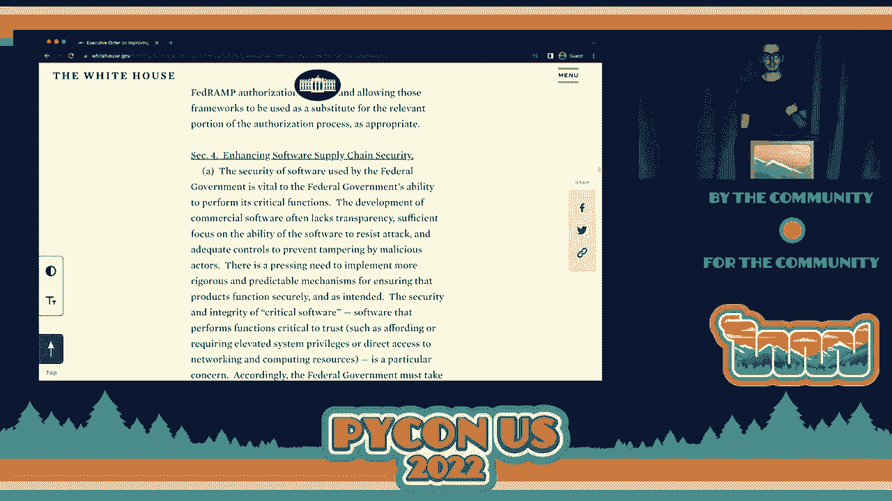

 And that's what I'd like to tell you about in this talk。 I don't have all the answers。 I don't have a crystal ball。 But there's some really interesting stuff happening and I want you to be aware of it all and also how it might affect you。 So let's go on to part two。 Before I launch into a bunch of new tools and new technologies that you might have never heard of because they were like maybe created last year。 I want to take a minute to sort out like a base level of understanding， define some terms。

 draw some parallels to stuff that you are already familiar with。 And we're going to do the AVCs of secure software supply chains。 So A is for artifact。 And artifact is in this context a single unique blob of data。 It's probably a file。 You might also call this a package， a project， a release， a distribution， a wheel， a beatus。

 an estus。 They're all artifacts， right？ We don't really use the word artifact too much in the context of Python and packaging。 but basically you can consider every single individual file on PIPI as an artifact。 A is also for attestation。 Generally， this means that there is evidence or proof of something。 And in the context of supply chains， this is a cryptographically secure and verifiable proof that something is a little bit different。

 That something happened。 Really anything that you want。 But the attestation itself is metadata。 which can be anything。 And then that's cryptographically secure， which means it's been signed。 And it's verifiable， meaning that I can go and see where the attestation was generated。 and ensure that the output is what I'm expecting。 Don't worry。

 I'm not going to do this many for all the letters。 A is also for。 there's a lot of A's though。 A is also for advisory。 And advisory is the public disclosure of a known vulnerability for an artifact or a series of artifacts。 So you might call these CVEs。 They are created by maintainers or security researchers to share knowledge with public about a known issue。 And advisories only exist for vulnerabilities that we know about。 That's important。 B is for build。

 Build is the process of turning a source tree， like a Git repo， into an artifact。 So sometimes this is also called compilation， maybe。 Some ecosystems they build on release and they distribute built artifacts。 That's kind of what we do with Python。 Some ecosystems only distribute source and they let the build happen when you go to install it。

 We kind of also do that with Python。 And a build environment is the place where the build happens。 So hopefully it's not like your laptop。 Hopefully it's something else， maybe a little more secure。 But that's what a build is。 See us for certificates。 Certificates underpin a lot of modern security on the web。

 And it's a way to drive trust from some root called certificate authority。 So in the past getting a certificate was a long， lengthy， potentially expensive process。 And now with new technology like let's encrypt， it's very easy to get a certificate。 And we'll see how certificates can be used in the supply chain later。 D is for digest。

 When I say digest， I'm almost always referring to a hash digest。 which is essentially a unique value that will reproducibly represent some blob of data。 And it's not reversible。 Think of like if you've heard of MD5， SHA-256， these are hash digests。 E is for ephemeral， meaning short lived， transitory， disappearing quickly。 And when I say ephemeral。

 I'm almost always going to be talking about the ephemerality in the context of cryptographic keys and signing。 So normally when you do cryptographic keys and signing。 your private key is something that you generate once and you try your best to never lose。 But in ephemeral key is generated on the fly when you need it。

 It's used once or for not very long period of time。 And then you throw it away。 I'll explain why I want you to throw away your private keys later。 F is for fuzzing。 Fuzzing is using special tools to generally wildly varying inputs and unexpected inputs to your program。 It's not super widely used in Python， but it's generally starting to be considered a best practice in terms of software security。

 G is for Google。 Oh， hey， that's where I work。 I didn't have a great one for G believe it or not。 So I wanted to take a minute to just try and kind of explain why Google even cares about supply chain security。 Because you might have heard that Google has a mono repo。 And what this means is in practice。 while software engineers at Google can use third party packages， we don't install them from PyPI。

 And essentially a single version of the source is checked into the mono repo and then everyone uses the same version。 And generally what that means is that a lot of the open source tools and technology I'm sharing with you aren't directly applicable to Google itself。

 But that's also a gross oversimplification and reality。 There are teams at Google that do install software from PyPI。 And we also have lots of customers who are definitely installing software from PyPI。 And we want to protect them。 And we probably have to protect them because the federal government is almost definitely one of our customers。

 So we have a lot of experience in bringing untrusted third party code in and ensuring that it's secure。 So we're interested in applying these things externally so that everyone can benefit from it and that our customers and et cetera can benefit from it as well。

 H is for hardware key。 This is different than a public private key。 It's a physical device that you put into your computer and it gives you the ability to do two factor authentication。 It is arguably the best way to do two factor authentication。 They are not cheap but I recommend getting one if you currently use two factor authentication。

 If you're not using two factor you should be using that as well。 H is for identity。 Generally when we're talking about identities we're referring to the identities of individuals。 e-mail addresses， github handles that kind of thing。 But we're kind of entering a point where pretty much anything can have a unique and verifiable identity such as a workflow on github actions。

 These identities along with some new technologies I'll talk about shortly can be used as signing identities which is really interesting。 J is for Joe Biden。 Shout out to Joe Biden for the executive order。 The executive order is going to be great。 It's going to inject a lot of time。 money and energy into an area of technology that desperately needs it。

 A lot of people have been working on this for a long time and suddenly everyone else is seeing the light。 K is for key。 We're talking about public keys before but by the power of math a key lets you sign something with your private key。 Distribute that thing， the signature and your public key and consumers can verify that it was indeed you。 the key holder that signed it。 L is for lock file。

 A lock file is a complete itemization of exactly what artifacts should be installed for an application。 This includes version pins and artifact hashes as well。 Hash digests。 Support for lock files varies from ecosystem to the next。 This is like go。mod， package。json。 pip file。lock。 Python has historically been not super great about supporting lock files but it is definitely getting better。

 M is for money。 Real talk。 We don't always like to talk about it but software costs money to make even and especially free and open source software。 A lot of the new tools and technologies that I'm describing were not created for free out of goodwill but in exchange for money。

 Elevating the security practices of the entire software supply chain is not a small feat and is not going to happen overnight and is not going to happen for free。 There are a lot of organizations that are making huge commitments of money to ensure that this happens。

 N is for non-forgable。 Unforgable is mostly used in the context of an attestation and it means that the content of the attestation。 the thing that you're actually attesting to， can't be modified。 So if I'm attesting that I ran a build in some build environment from let's say a get-shah and a non-forgable attestation。 it's going to tell me that it can't be modified by someone by some malicious actor。

 It's only going to refer to that build。 O is for OpenID Connect。 If you haven't heard of this。 I suspect that you're going to start hearing a lot more about it both in this talk and afterwards。 So this is an identity layer on top of OAuth 2 and this allows services to provide， verify。 exchange identities， the identities that we talked about before。

 So already a lot of CI services are providing OIDC identities for the runs of their workflows and this is really powerful for reasons that I will get to later。 P is for provenance。 P provenance is the paper trail。 This can take a lot of forms but think of it as a series of verifiable attestations that tell you everything you need to know about an artifact。 Where it came from， where it was built， who built it， who signed it， everything about it。

 Basically the history of an artifact。 P is also for policy。 A policy is a way that you describe the security features that you want or expect to be present。 Either in your library， your application， your repo and organization on GitHub。 And ideally this policy can then be evaluated to tell you whether you're within the policy that you define or not。

 P is for quick。 Let's move on to R。 R is for remediation。 And it's usually used in the context of vulnerabilities but can also be used to refer to policies as well。 Remediation means to fix something that's wrong and so for vulnerability， if you remediate it。 you've removed the vulnerability。 You've upgraded to a fixed version。

 And also ideally remediation is easy or possibly automatic。 S is for signature。 A signature is what you get when you sign something like an artifact with a cryptographic key。 It represents a verifiable proof that the key holder was in possession of the key that generated the signature。 Think of it as a rubber stamp of approval。 T is for transparency log。

 A transparency log is a public immutable record of signed metadata at the stations。 That's it。 I signed something。 I published the details to the transparency log and it is there forever for anyone to look at and verify。 V is for vulnerability。 A bug in software with security related consequences。 V vulnerabilities are either known or unknown。 And if you find a good way of turning the ladder into the former。

 I want to talk to you afterwards。 And Z is for zero。 This is the number of questions I'll take about what happened to WX and Y。 All right。 I hope you enjoyed that。 So part three， how can we use open source safely？

 Now I explained some of these kind of details and concepts to you。 Let's put them all together into something that we can do。 I did a talk on this last year。 And a lot has changed in the last year。 So last year what I said what we can do， circa 2021。 is let's use HTTPS everywhere。 We're kind of already doing that。 Walk files， compiled dependencies。

 vulnerability notifications， tough namespaces。 Cool。 I'm not going to explain any of that。 That was a year ago。 We've made a lot of progress。 You can go back and watch my talk if you're interested in those things。 I'm going to talk about what else we can do to fix this。 My talk must show I kind of wave my hand。

 Here's some hypothetical stuff we can do to do better。 And we kind of started to implement that。 And those things have started to happen。 So I'm going to outline those that sort of exist that you can use now and introduce you to them。 So the first thing that's new is community advisory databases。 Actually some of these existed before。 But the Python one did not。

 And this is a centralized ecosystem specific public repository for security advisory。 And the goal is to make it easier to both report and discover security advisories。 Remember。 an advisory is a notification about vulnerability。 So these exist from most major ecosystems。 This is what the Python one looks like。 It's a PIPA advisory database。

 And what it does is it has a list of vulnerabilities listed in the open source vulnerability format。
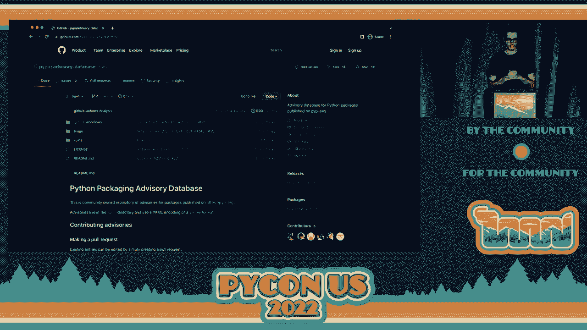

 OSV also has an API and it acts as a vendor neutral aggregator。 And it pulls in advisories from all these different repositories and redistributes them。 So OSV actually pulls from this repository when new advisors are published。 And then actually in turn publishes those back to PIPI。

 So then PIPI knows which dependencies or which projects have vulnerabilities。
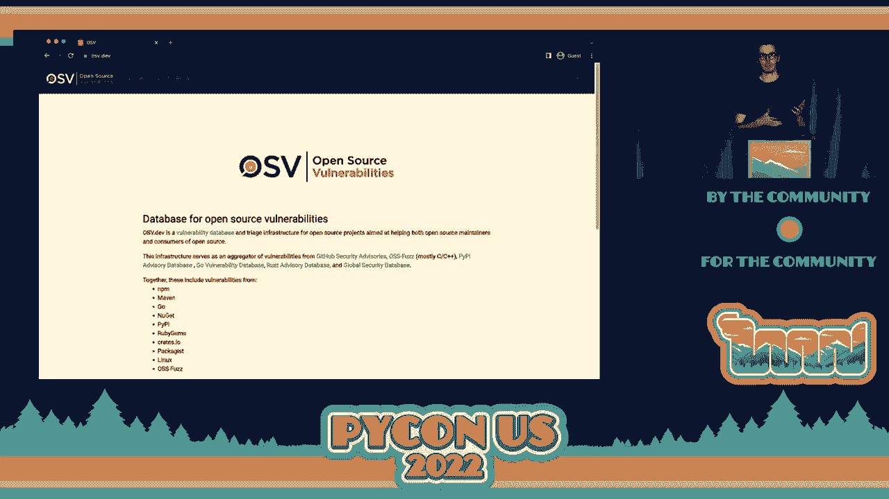

 Here's an example of a recent advisory for Django。 It's not a great example actually。 But it's kind of just a giant EML file。 But you're not supposed to read these by hand。 Definitely not。 So the other thing we have to go along with this is vulnerability auditing software。 And so these also aren't specifically new。 Similar software has existed before。

 But we now have for the first time a community supported open source vulnerability auditing software for the Python ecosystem。 And that I'm really excited to introduce because I helped build it。 And this uses the advisory database that I previously mentioned in the API that OSV provides to PIPI。 So this tool is called PIP Audit。 I helped and created and released this。 It's a third party tool。

 It's not part of PIP itself yet。 You run this locally。 maybe as part of your release or your process， your integration tests。 You can run it in a container。 You can run it against your requirements file。 And it will tell you if there are any known vulnerabilities present in your environment or requirements file。

 This allows you to be confident that you're not going to deploy something with a vulnerability。 And use it kind of like this。 You can add a little environment， just run PIP Audit。 You can pass a requirements file。 This behaves just like PIP install。 Same flags and the same syntax and everything。 When you run it。

 it'll tell you I found the vulnerability。 It's in this package。 Here's the version you should upgrade to。 Here's the vulnerability ID。 You can also automatically remediate that。 You can read that。 So this， if you run PIP Audit。 it will just go and upgrade those and fix it for you as well。

 It will rewrite your requirements file and fix it as well。 So this is really cool。 I'd love for people to start using this more and just sort of avoid these vulnerabilities。 Go ahead and run it on your laptop right now and see if you have anything installed as a vulnerability。 Okay， another thing that's kind of new and fun and interesting is artifact signing。

 And you might say wait， signing is definitely not new。 Because historically this has meant GPG。 And that technology has been around forever。

 And if you're not familiar with GPG， historically this post by Donald kind of sums up how the Python packaging community has approached signing。 And if you actually read this post， you realize that the issue is not with signing as a technology itself。

 That's the boring， easy part。 The hard part is about trust and identity。 So right now you can sign anything that you want on PIPI。 You can upload that signature alongside your release， but distributing your public key is up to you。 And having people trust that public key is also up to you。 And so in practice nobody does this。 Why？

 First， GPG is confusing and unfriendly。 Who has manually signed something with GPG before？

 Who enjoyed that experience？ Case and point。 It's not like automated git commits and things like that。 It's not a fun。 It's not a friendly experience。 Second， GPG requires humans to not be humans。 It requires users to maintain their private keys， essentially indefinitely。 I was talking to Paul before， I don't know if he's in here。

 and he said something which I really like， which is GPG would be really great if you could go around permanently stapling everyone's private keys to their foreheads。 You can't do that。 People will lose their keys。 Third reason why GPG relies on a web of trust。

 So GPG is great at signing。 It doesn't solve the problem of trust and identity。 Even if an artifact。 let's say on PIPI， is signed， how do you know that you can trust that signature？

 It assumes that you or someone you know has met the signer。 verified their public key and their identity。 And this law actually a reasonable thing to do with the size of modern open open source software。
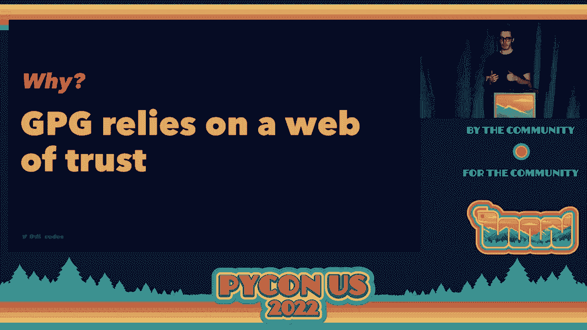

 So we have a new technology called 6-store。 It's a new project by the Linux Foundation that's being built across multiple vendors including Google。
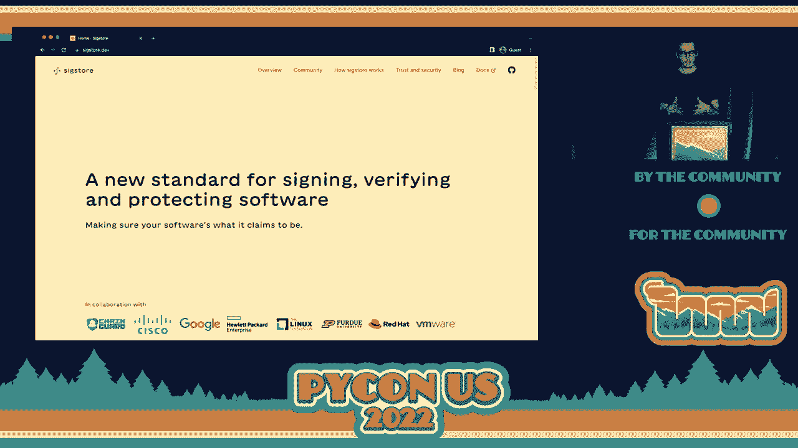

 and is a new way to think about signatures， identities and trust。 First。 when you go to sign something with 6-store， you throw away your keys。 The first thing you do is generate an ephemeral， public and private key。 and that means that the signing keys are used once and then they're gone forever。

 You never see them， you never touch them or interact with them。 You are supposed to lose them。 The second thing you do is you provide an identity。 This could be an OIDC identity created by an identity provider。 Right now， 6-store supports Google。 GitHub， Microsoft。 Remember， this is built on top of OAuth as well as some fine grained OIDC identities。

 provided by environments like GitHub Actions。 The next thing you do is bind that key and identity to a signing certificate。 You provide your public key that you is ephemeral to a certificate authority and it gives you back a certificate。 And this authority binds these keys to the identity and the artifact and sort of like lets encrypt it。 but on a micro scale。 You're getting a certificate essentially for every time you want to sign something。

 Then you sign it quickly because signing certificates are only valid for a short period of time to prevent abuse。 Then you publish in the transparency log。 Every signature is stored in a log that can be searched and can't be tampered with。 And this is used later when you go and verify a signature。 So the end result is you have the artifact that you started with。 You get a new signature。

 You get a certificate that binds the identity you provided。 which might be your email address or your GitHub repository to that signature。 And then you put that entry in a public log which records all of it。 And if this sounds like a lot of manual steps you are not wrong。

 This is why Six-door provides clients。 Originally。 Six-door was primarily focused on the container ecosystem but has now grown。 And we just produced a new Python native client for Six-door called， it's called Six-door on PIPI。 which we can install directly there。 It's a native Python client for signing and verifying signatures with Six-door。

 Now focused on containers， focused on signing any binary blob。 But this could be a Python package。 It could be anything you want really。 This includes detecting ambient credentials which means if you try to sign in an environment。 that provides a no IDC identity it will use that automatically。 Right now it just supports actions。 This is not feature complete yet but there is a beta release now on PIPI。

 And we are working towards a 1。0 release。 Some other things we can do。 Better。 more secure build infrastructure。 There's lots of different environments ecosystems where software can be built。 Some properties increase security， others don't。

 There's a new standard for describing the level of security for where artifacts are built。 And that's called Salsa。 I don't know if you can see that super well。
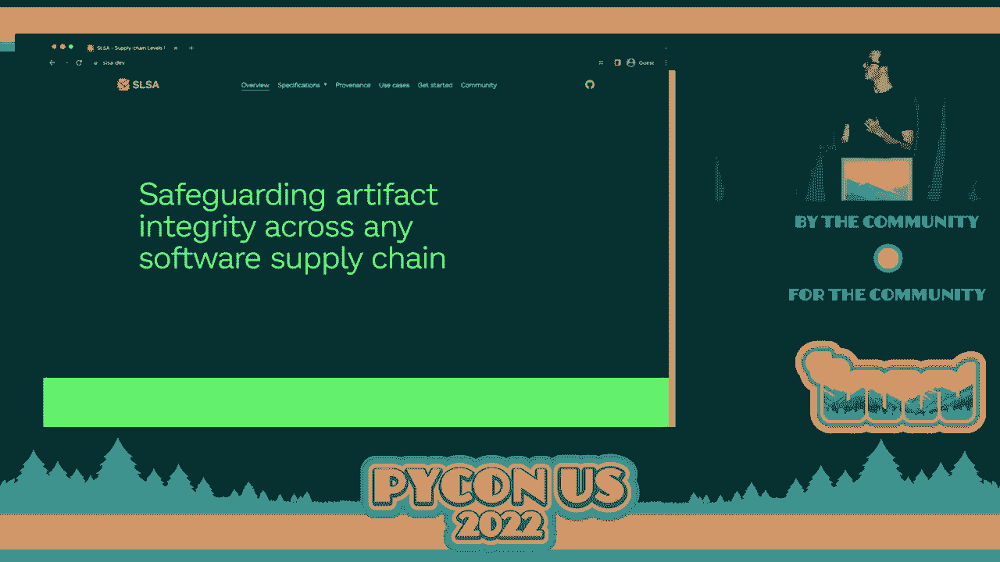

 Salsa is SLSA。 Supplatch in levels for software artifacts pronounced Salsa。 It's a security framework。 So it's not a framework in the sense of a tool that you can use but a way to think about。 how secure is this supply chain that I'm using to produce an artifact。 So given build process it might produce an artifact that's also level one。

 Most are kind of Salsa level one。 Or it might ratchet up higher as you add requirements for things that need to be。 introduced into the build environment to make it more secure。 Another thing that is new is attestation。 Atticitutions are what are going to prove that an artifact was created at a certain Salsa。 level or at a certain level of security。

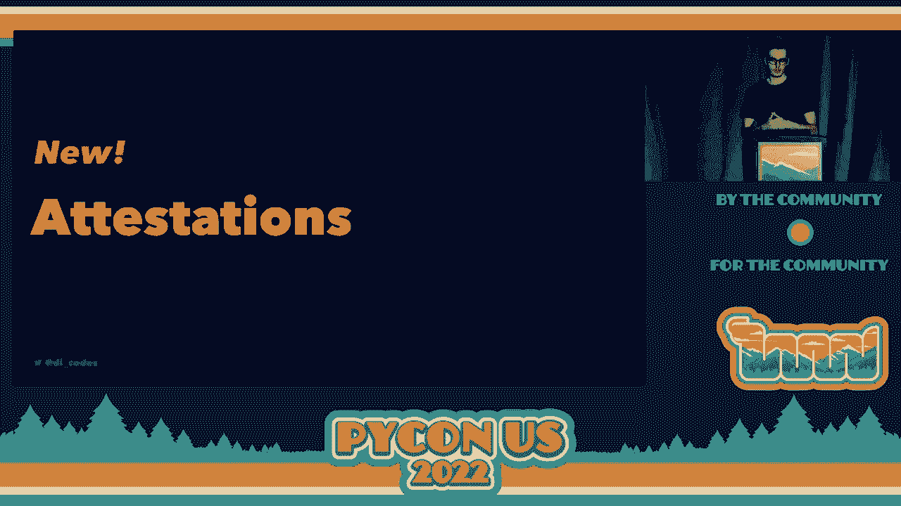

 One exciting technology in this space that you might not have heard of is in Toto。 In Toto is a way to， well here it is。
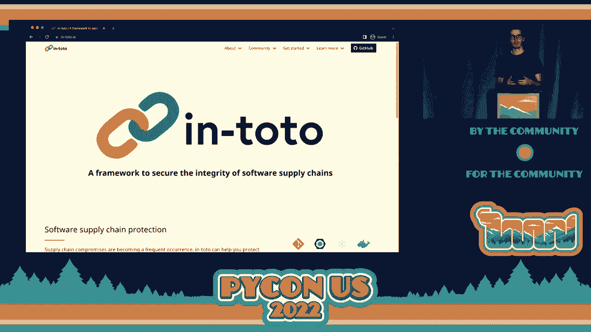

 It's a universal standard for all ecosystems to describe the integrity of an artifact and。 proof of what was done at each step to build it。 Make it transparent， make it public。 show people exactly how something was built so they can verify it。 New is also ways to enforce security policies for source control。

 So we have some tools in GitHub right now built in that allow us to do this。 This is above and beyond what you can do with your regular source repository。 So AllStar is a GitHub application。 It enforces best practices allows you to set up a policy for your repository or your。 entire organization and do things like branch protection， detect if you have checked in。

 binary artifacts， whether you have outside collaborators enabled fuzzing and that kind of thing。 So I was talking about six-door Python。 Here's one that just generated the other day because we had people that were admins on the repository。 who weren't actually in the organization because we had just transferred it there。 So this is cool because it will alert you when there's security violations that violate your policy。

 And the last thing I want to highlight， super exciting stuff， is new security features for。 PIPI and these are kind of announcements because we haven't really publicly said that this stuff is happening。 So I hope you're excited。 So if you're a project maintainer on PIPI。 you will soon be able to check a box that says， all of my collaborators must have two-factor authentication enabled or they will not be able to do anything to this project。

 The reason we're -- don't clap。 There's a long list。 Clap at the end。 The reason we're doing this is because we're also implementing a two-factor mandate for critical projects。 Don't clap。 Clap at the end。 Top 1% of projects by downloads plus some other critical projects like dependencies of PIPI itself will be included in this mandate。 which means that all collaborators and those projects will be required to use two-factor authentication。

 That's going to be a lot of people。 Most of those people don't have hardware keys。 I said hardware keys are expensive before。 What are we going to do about that？

 We are doing a hardware key giveaway。 We're going to give away 4。000 Google Titan security keys to PIPI maintainers of critical projects。 This doesn't happen yet because we're waiting for them to come back in stock。 It's too large of an order， but it's going to happen very soon and you will hear about it。

 And it's going to be very exciting。 Another thing that's coming soon。 credentialless publication via OIDC。 So one really nice thing that OIDC enables when you have it in your build environment is that OIDC allows you to exchange identities。 If you have an authorized identity of a build environment and you've told PIPI。 I trust that identity to publish to PIPI。 PIPI can exchange the identity for PIPI's。

 An identity on PIPI， I'm waiting my hands here because we're not totally sure what that means yet。 But that will allow you to publish a package to PIPI and say without passwords。 without API tokens or anything at all， just by trusting the repository that has the workflow and that identity。 Also coming soon， I feel like I say this every year。

 but PEP458 is actually going -- it's happening and that's for repository signed metadata via TUF。 And PEP480 is going to get a big update to talk about developer signed artifacts。 which is end-to-end signing， which you might guess what we're going to talk about there。 All right。 to wrap up， what else can we do to fix these things？

 One improvement is vendor neutral collaboration。 The reason that's six-door and salsa and all these things are going to be successful is because we have lots of people and lots of organizations working together at these companies via the OpenSSF。 This is a new nonprofit part of the Linux Foundation that brings together all these large organizations。

 including Google， to work together on essentially making the software supply chain more secure。 This organization is also bringing and collecting more funding for security projects。 The cost of these projects is being supported by big vendors。 but there's likely need for support in your system as well。

 So financially sponsoring your local Python software foundation makes things like this possible。 allows us to contribute to these security features。 Or your organization can become a member of the OpenSSF。 And other thing is more users and more contributors。 Use these tools， come。

 contribute their open source， try this stuff out， tell us how it works for you。 share your experience， possibly become a contributor。 It's all open source。 So here's my predictions for the next year。 If you're an open source software repository or package installer or maintainer。 and there's a couple of us in this room， brace for interest and funding。

 And I hope you can ride that wave and make the most of it and really invest in your project。 If you're an open source maintainer， brace for people asking you to adopt new security practices and ask you to pick up new features and do new things and turn on to factor authentication。

 We're trying to lift the entire ecosystem here， so you're going to get a lot of feedback from everyone asking you to help do that。 And if you're an open source consumer， educate yourself。 You're likely going to hear a lot about this stuff more and more as there's this increasing crescendo of voices and。 you know， make yourself aware。 Real quick， I'm going to do two shoutouts。 First。

 to William Woodruff and Alex Cameron at Trail of Bits。 They've been instrumental in helping build both 6-door Python and PIP audit and shout out to them。 I also want to give a huge shout to the PyCon staff。 Everything they've dealt with with the pandemic to bring this conference back and in person。

 they absolutely deserve your thanks。 So if you see them。 let them know that you appreciate them and the work that they're doing。 Thanks。 I'll see you all next year。 [applause]。
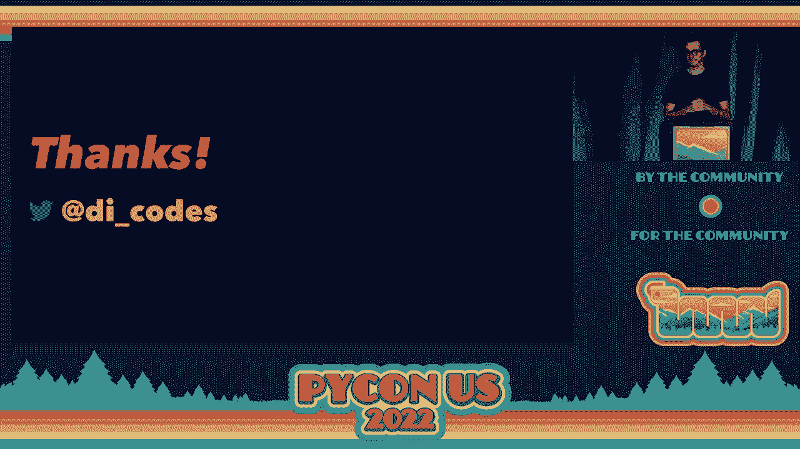