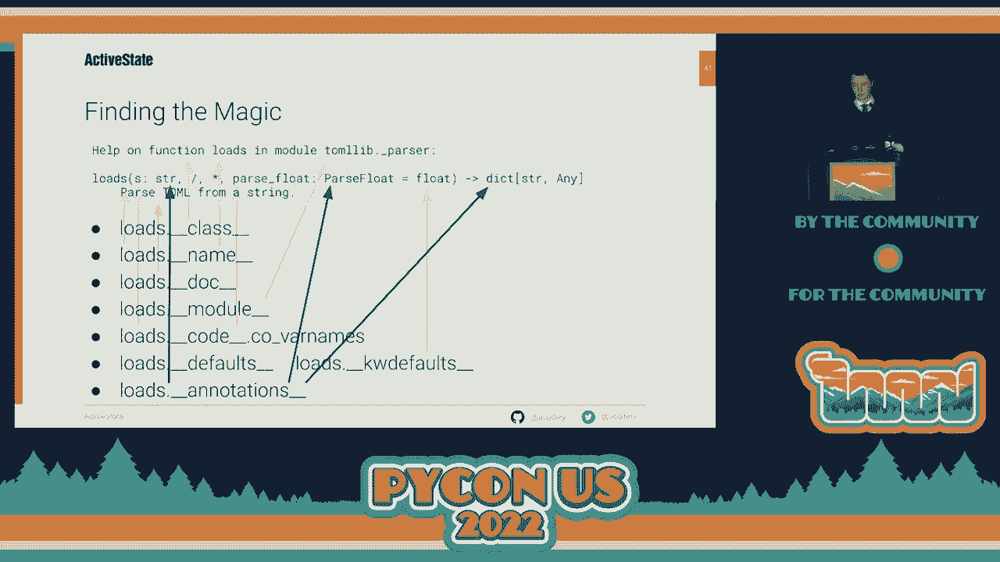
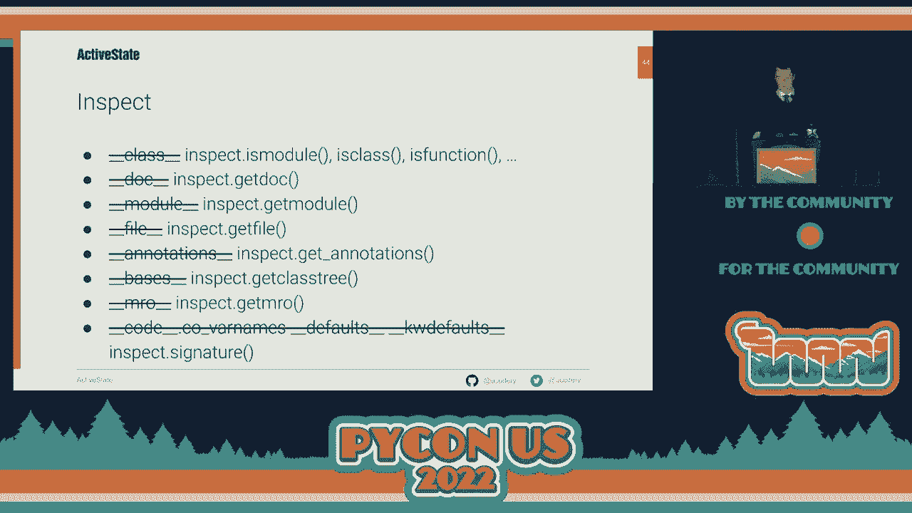

# P38：Talk - Jeremiah Paige_ Intro to Introspection - VikingDen7 - BV1f8411Y7cP

 >> Hello， everyone。 Let us give a warm welcome to Mr。 Jeremiah， who is going to speak on。

 introduction to introspection。 [ Applause ]， >> Good afternoon。 Thank you， everyone。

 for coming out to this final talk of a very long， PyCon day。 I am Jeremiah Page。

 and today we're going to get a little intro to introspection。 So quickly。

 if you don't know introspection， it's basically the ability for code to look， at itself。

 So we're going to take a little journey today to see how we can maybe figure。

 out what the interpreter sees when it's running our code ourselves and have access to that。

 same information。 PyCon is not new to introspection。 It's always had strong capabilities for this。

 Currently， it's about 70 built-in functions， and today we're going to use 15 of them just to look。

 at code and decide to pull out information from it。 Some of this information is hidden。

 Some of it's magic， but none of it is meant to be， secret。

 Python is not trying to keep it away from you。 It's just trying to keep it out。

 of your way as you code。

 So where do we start if we want to know something more about one of our objects？ Well， we could。

 start， especially from the interactive shell， with a simple call to help。 We can just say， help。

 It will help us， help us a function， so we can call it for more help。 We can even。

 call for help about help， and we'll learn more about help than we'd ever want to know。

 If we wanted to learn about something maybe a little more interesting， we could maybe。

 just hit that tab key on our interactive shell and find this weird name， pickle。 What's up。

 with pickle？ If we ask for help， help will tell us a lot。 Pages and pages。 It will fill。

 our terminal and scroll off more than I can fit on several slides。 Everything we could。

 ever want to know of how to use the pickle module as we're running Python。 But if we break， it down。

 it's pretty straightforward。 It starts by telling us about the object。 We actually， pass to help。

 What is pickle？ It's a module。 Its name is pickle， which seems pretty obvious。

 but it gets this right even if you use an alias。 And it has a doc string， which should。

 help us in implementing making use of this module。 Once we get past the opening， help。

 is going to detail all the classes defined in the module。 It's going to give a quick。

 hierarchy of how they relate to each other in inheritance and to other objects in Python。

 And then for each one of these classes， help is going to list them with their full definition。

 Every method that's attached to them whether directly or through inheritance， it's going。

 to tell us which ones are static， which ones are class methods， which ones are instance， methods。

 It knows all of this。 And once it's done going through all the classes， help is。

 then going to show us all the top level functions in the module。 Again， it's going to show us。

 the name of the functions and the signature so we know how to call them。 And it's going。

 to give us the doc string。 Once it gets through the functions， there's a few more bits of。

 there's a few other names at the top of the picomodule that aren't either classes or functions。

 So for each of these， it's going to show us their names and their values。 These are in。

 picomod series of constants that uses for the serialization。 And at the very end is。

 the file which tells you where did this code actually come out of。 So that's all very helpful。

 information。 When we quit help， it returns us to the interactive shell and we're back where。

 we were with our code。 So we'll try and capture that information and use it to make some intelligent。

 decisions in our program。 Except help doesn't return anything。 It doesn't leave anything。

 on the screen。 When you're done with help， there's nothing left that your program can。

 find and make any sort of decisions about。 All that very valuable information went into。

 our eyeballs but unless we're going to copy it or memorize it， it's no use to the program。

 So we're going to need to go and find this information somewhere else。 We're going to。

 go exploring the object model in Python a little bit and find some of the Python or some of。

 the magic that's in there。 Before we go and find the magic， a little definition of what， magic is。

 magic in Python is a common way to refer to special methods which are also called。

 Dunders which is any name and language that both starts and ends with a double underscore。

 If any name both starts with a double underscore， it's reserved by the interpreter even if it's。

 not being used right now。 It's where the interpreter puts all the data and needs to run your program。

 and keep it out of your way as you're doing your normal job。 But because it's the only。

 place the interpreter has to put its own information。

 it's a great place to look for more information， about running code。

 So if we're not going to use the built-in help， is there something， else we could use？ Well。

 there's another built-in function that we've probably all used to。

 debug a program which is just print the thing。 Print can take any random object and throw。

 you a representation of it。 And this works because string actually calls a built-in stir。

 function on all its arguments which in turn calls our first magic method， DunderStir。 So。

 for any objects you want to print， that object is actually asked to execute its DunderStir。

 method to give back a string and that's what's displayed to the screen。 So we can print a， module。

 pickle and it'll tell us its type， its name and its file location just like help， is able to do。

 But since we're on the interactive shell， we could just print the name and type， the name instead。

 Same data comes out。 This is not because the REPL or the interactive shell， prints this object。

 It actually uses a different built-in function called repper。 Repper looks， the same on the surface。

 It takes a random object and returns a string to display for， it。

 But it has a different mirroring magic method under repper。 In many cases it defaults。

 to the same string but it can be different than what print， than what stir puts out。 And so。

 if you're typing a program on the interactive shell and you're typing names and then you。

 go and make a program that just prints the same names， you can get very different output。

 on your terminal。 And since both repper and stir can be written by magic methods， this。

 information that we want， this type and name， aren't completely dependable。 So we're going。

 to go even deeper into the object model and go to the source of where did help know where。

 these things were and where did string know where they were when it used them。 So if we。

 go back to the help output， all this information that helped tell us about Pickle exists in。

 the object。 We just have to go find it。 So we're going to look at some dunder attributes。

 and recreate this entire text output。 So the type， it knew， it helped me that this was a。

 module without us telling it。 It stored in the object's dunder class。 The name， the canonical。

 name was defined with， is in dunder name。 It's doc string， it stored in dunder doc and。

 the file it was created by lives in dunder file。 This is part of the object model。 After。

 help was done with the actual object we passed it， it then showed us all the classes。 So。

 for any class we want help on， we can find the same information inside the class object。

 Its type is in dunder class。 Its name is in dunder name。 Its doc string is in dunder， doc。

 Now classes don't have files because they belong to modules。 So there's no dunder。

 file but there's a dunder module。 If we were to go look up that module， it would have a。

 dunder file and so on。 And then the unique thing to classes is that they have inheritance。

 which modules don't。 So we can find the direct parentage of this class through dunder bases。

 And the method resolution order is also in the MRO。 It's not shown by help because it。

 thinks for classes simple， it's not very interesting。 After it was done with all the， classes。

 it then shows all the functions。 There's some repetition here。 The type is in， dunder class。

 The name is in dunder name。 The doc string is in dunder doc。 And again， functions。

 belong to modules。 At this point there's only one thing that's unique to a function。

 which is its signature。 How do we actually know how to call this thing at runtime？ At。

 this point you might think there's a dunder signature and we're done。 We've finished recreating。

 help。 But in this case it's much more complex。 Python needs to dispatch calls to your function。

 many， many times during execution， maybe millions of times。 It wants to be very efficient about。

 this。 And the way we write this code is not very parsable on the machine。 So we're going。

 to have to dig a little extra deep to recreate this。 A function， if it's not， a function call。

 if it's not empty has parameters。 And those parameters have names。 So that is found in。

 the dunder code attribute， which is the object representing your code compiled for the interpreter。

 And inside there is a lot of stuff， but there's one very attribute called covar names。 This。

 stores all the names of the attributes for your function call。 It's actually pretty complex。

 It tells you which ones are positional only， which ones can be passed by position or keyword。

 argument， which ones can only be passed by keyword argument。 But essentially it's all。

 there if we go and look for it。 After you know how many variables the function accepts， we。

 want to know which if any of them have defaults and what those default values are。 So that。

 will go back to the loads object and look in standard defaults。 Except for this function。

 we're going to look in a dunder keywords defaults。 There's two locations and you're going to。

 have to look in both。 And finally， some of you might have noticed we're no longer looking。

 at help for the picomodule。 We're looking at help for tomolib。 Because this function has， something。

 nothing in the picomod library does， which are annotations。 This function has a。

 return annotation and type annotations。 We can pull those out of the objects dunder annotations。

 So with this we're able to get back all the information help had， but in a way we can actually。

 store in variables。 But that was kind of a lot of rummaging through the object model and having。

 to go pretty deep。 And maybe it looks kind of ugly。 Maybe you're hoping there is a better。

 way。 Well， because this is Python， there's not only a better way， but it exists in the。

 standard library。 The inspect module is a module designed to inspect running code。 Rather than。

 trying to access any of these magic attributes on objects you're holding， you can just pass。

 the object to a corresponding inspect function。 And they're much safer。 They work on more types。

 You don't have to do any kind of special casing and they cover many more cases。 Each one of。

 these functions that can take an object is really a question we're asking of something。

 we're holding onto。 We want to ask an object， what is your doc string？

 Maybe find more documentation， about it。 Or what file were you to find in？

 What you ask it through inspect will be able， to tell us for any kind of object， not just modules。

 But some questions are a little nonsense。 We can't ask the number one what its signature is。

 It doesn't have a signature and it's never， going to have a signature。

 So some of these questions are a little unsafe and they'll raise。

 exceptions even using the inspect module。 So we know how to ask the questions but maybe。

 rather than just wrapping all these questions in some very broad try accepts， we could be。

 a little more specific of when we ask them。 We could know that， do that if we knew what。

 the heck the object was before we started asking questions。 So only functions are going。

 to have signatures but integers aren't。 Maybe we want to know where a module came from but。

 maybe we don't care for some string。 So there's some built in functions to help with this。

 There's the type， very basic。 You pass an object and it tells you the type。 But unlike。

 all the other questions we've been asking of our object so far， type is a question you。

 will always get an answer to in Python。 Not something you can save many objects in a dynamic language。

 but there's because Python is an object oriented language and everything's an object。 Everything。

 has a type。 So if you ask what the type of picolas it says it's the class module because。

 everything is an object under the covers of Python。 Even modules are just classes。 A little。

 dressed up。 There's only one other question that's always safe to ask of anything in Python。

 and expect an answer and that's what is your ID。 Not nearly as interesting as what is your。

 type but you will always get a unique answer per object。 Everything else is kind of up。

 for grabs if it actually exists on the object。 Another great built in function is callable。

 So things that are callable have a signature and we probably want to call them before investigating。

 them further。 If they're not callable then they're probably a value that we should start。

 poking at right now。 But what things are callable？ Type could tell us this if we really wanted。

 to go through trouble of it but there's more than one thing that's callable。 Not just functions。

 but classes and instances of classes under certain circumstances and generators are callable。

 but not everything。 So this is just a quick answer to know whether you should go looking。

 for a signature or not。 And there's also the instance and sub class built-ins to know if。

 something you're holding has a class and it's inheritance tree。 These are over rideable。

 by magic methods in much the same way that print and repper were。 Now you might wonder。

 why Python allows classes to override their definition of inheritance at runtime why Python。

 just doesn't reach into the definition of the class。 There's a very useful implementation。

 of this in the standard library。 The abstract base classes module or the ABC is a collection。

 of classes that represent interfaces expected across different parts of Python。 So there's。

 the iterable protocol for things that can be looped over the sequence protocol for things。

 that can be walked and indexed by number。 There's a mapping protocol which are things。

 that can give you values based on keys rather than attributes。

 And Python has concrete implementations， of each of these types。

 There's lists and ranges and dicks but you can make your own。

 and they work perfectly well in just about any Python code without having to inherit from。

 a list or a deck。 You just have to have the right shape of a class。 So if you ask is。

 instance list you'll know whether it's sub classes list or not but you won't necessarily。

 know if it's indexable。 But if you ask the abstract base class sequence is this thing。

 like sequence it will say yeah that thing quacks like a list even if it doesn't inherit。

 from list or the ABC sequence。 So it'll give you the right answer you know that this thing。

 can be used for looping or for key access。 So with that we know when to ask our questions。

 and we know how to ask our questions we've pretty much recreated all that help could。

 do for us except for one thing which is that when we ask help about the pickle module help。

 told us about pickle was docstring was what file it came out of but also went through。

 and told us every class that was defined under pickle and for every class it told us every。

 method that was defined on that class even though we had no idea what any of those names， were。

 So how did help even know what the heck it was calling for help。 In our original example。

 we just typed out help and we hit tab because we were in the actor shell and we got this。

 weird name pickle so we tried but in a run program you can't just hit tab to get some。

 new variable names。 So there's going to be some more built-in functions to help with this。

 First up VARS is going to return a mapping of names two values for the object you pass。

 in so you pass it an object it tells you the names that are attributes and what their values。

 are currently。 If you pass no arguments you get the same for the local scope。 VARS actually。

 provides access to the magic attribute dict which is a private dictionary that actually。

 is what supports attribute access on objects in Python。 So VARS is very literal you ask。

 it what are the variables for this object and it tells you but it doesn't try to tell。

 you anything that would resolve for a dot name look up。 So Python won't just stop at looking。

 in the dict of an object when you're trying to attribute access。 If it doesn't find it。

 there it might go looking elsewhere。 If it's not in locals maybe it'll try the outer scope。

 and it's not there maybe it'll try globals。 If it's not in this class maybe it'll try。

 the parents and that could work。 VARS won't do that it's very literal and it just tells。

 you the objects that the names that would definitely resolve for a certain object。 Some。

 helpers for VARS there's also locals and globals which provide the same thing dictionary。

 mapping for the local scope or the global scope。 But if these aren't enough there's， der。

 Der tries to be very helpful。 Instead of returning a mapping it's returning just a。

 list of names but it does it's very best to walk the inheritance tree of a class to look。

 in the class of an instance for you and find all the names that would resolve if you actually。

 try to go and find them。 And it's supported by a magic method under der。 So it doesn't。

 get everything it's really hard to get everything in a dynamic language but it tries really hard。

 and it gets there most of the time。 And our favorite new standard library module inspect。

 also has a solution to this problem。 If you pass an object to get members it will kind。

 of do the best of both worlds it will turn you names and their current values both for。

 the current object and for other names that would resolve for instance through inheritance。

 But it's not a built-in and also it doesn't work with no arguments so it doesn't work。

 on locals or global scope。 Two more built-in functions has added get adder。 These are no。

 use if you don't know what you're asking about because you have to pass the name you're checking。

 But they're the most precise because they go through all the same steps that a dot attribute。

 access goes through。 If you ask the question is this exist on this object you will get the。

 real definitive answer。 So I hope that you realize that Python is not really trying to。

 keep anything secret from you。 The only reason these magic methods are hidden is to stay out。

 of your way and so that you don't accidentally use them in your day-to-day programming。 There's。

 no real risk in looking at them。 If you're really afraid just when you're in the interactive。

 interpreter not a mission critical application just look at it。 There's no harm you can even。

 change it you're not going to bring down your computer you're not going to kill Python。

 And I hope you go out of here and are not afraid to ask questions of your objects。 Thanks。

 for your coming。 Thanks a lot for the great presentation。 Any questions？ Yes。 See one？

 The question was why would you want override is subclass and is instance。 And I was trying。

 to answer that with the ABC module。 So in the ABC module there is several classes but one。

 of them is for instance sequence。 And sequence when is asked if it is a super class or super。

 instance of an object doesn't look in the inheritance tree it looks for certain methods。

 that would be used by protocols in Python on the specific object。 So for sequence it doesn't。

 look if list is in the inheritance tree it goes and checks if under index which is the。

 special magic method as called when you square brackets is implemented for that class because。

 that's all that's required for indexing and a few others。 So it looks for inheritance。

 through ways other than the bases which we saw at the very beginning。 Any other questions？

 Thank you all for coming out and enjoy your night。

