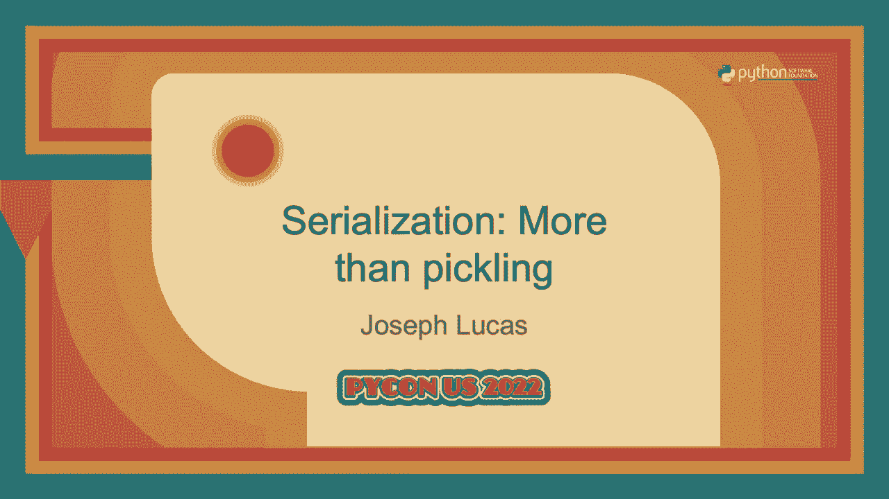
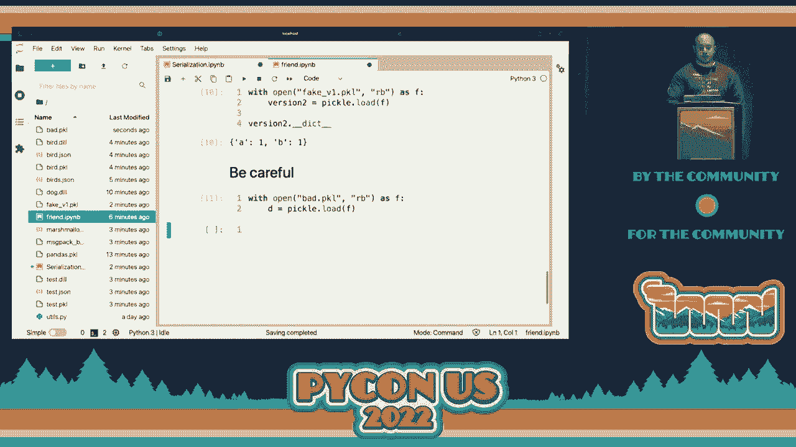

# P46：Talk - Joseph Lucas_ Serialization  More than pickling - VikingDen7 - BV1f8411Y7cP

 Welcome to this afternoon's sessions here。

 Right now we have Joe Lucas making his PyCon debut here talking about serialization more。 than pickling。 Let's give him a nice hand。 Thanks everybody。 The alternative title could have been serialization and un-opinionated introduction。 We'll talk about pickle and some other formats and compare some of the pros and cons。

 I won't be using slides。 I'll be doing this out of Jupyter Notebooks。 So for anyone who is not familiar with the format， we kind of have these editable sections。 where we're going to run some code and see the outputs。 The Notebooks are available at this repository and during the presentation I'll be using the。

 eBird API as an example。 And I think during everyone's PyCon journey there comes a time when it would be useful。 to have a publicly available API that you could test some stuff with。 They'll give you an API key。 They have a bunch of different APIs you can hit。 So I think that's a cool service they provide。 So I'd encourage everyone to check that out。 And I'd also like to plug operation code which is a nonprofit that gets veterans and their。

 families started in careers in software development。 So if you're someone who could benefit from some mentorship or interested in mentoring。 folks like that， check it out。 So starting with some definitions， serialization。 It's converting data into something that can be stored， transmitted， or reconstructed， later。

 It's not the act of transmitting or storing those。 It's just converting that data into that format。 often like a byte stream。 So what order do we put all these bytes in so that we can reconstruct it on the other。 side？ And also it's worth saying that deserialization is sometimes hard， right？

 We have to establish these standards and you'll often see deserialization bugs causing security。 vulnerabilities。 So the two main categories of serialization are plaintext so you could open the file and。 read it or binary where that's not going to be possible。 We'll mainly be talking about binary serialization here but we may talk about plaintext a little。

 bit。 And so why might you need to serialize your data or when are you going to do this？

 One example might be if you've spent hours training a machine learning model， how do。 you save that and use it later？ How do you ship it into production？

 How do you share it with a colleague？ Right， because you don't want them to have to go through that retraining process。 Or assume you've built some object in memory with costly queries。 Are there expensive monetarily or through time？ Or time-dependent queries on changing data？ So sure。 you could save that data as a CSV or in some sort of database。

 But if you've built an object around that data and done some post-processing already。 you may want to save that intermediate representation so that you could share with colleagues， for。 example。 Or I think the most widely used reason for serialization is transmitting data between。 two parties。 When data goes over a network it needs to be in a byte stream。

 how do we put these bytes， in order so that they can be read correctly on the other side？

 So we'll take a quick look at the API。 We're just going to make a request for recent observations in Utah and look at the first。 result。 And this is just so we kind of understand the scenario later。 So the API gives us a bunch of things back。 We'll be looking mainly at the common name。 So here the first bird returned to us was a Woodhouse's scrub j。

 I have no idea what that looks like。 But here's the Latin long where it was seen。 So this is the shape of data we'll be processing in this scenario。 So the scenario here is we've built this bird counter class and we might instantiate some， objects。 And we want to serialize the class so that our peers don't have to make the same API call。

 or do the same calculations。 And so the class has this variety attribute which is just a list of every variety that。 the eBird API returned。 And then we'll build some tuples of the lat long locations。 So here we'll instantiate that class to an object B and call the getBirds method and then。 kind of inspect some of those attributes。 So in this example there were 266 birds that you can see here。

 And we'll use these attributes as our way to kind of prove or check that the deserialization。 is happening correctly through these various methods that we'll review over the course of。 the presentation。 In this case the entire process of constructing the object and calling the method only took。 in the order of milliseconds。 But imagine you're making database queries to many databases。

 fusing that data together。 That could take hours。 And so that might be a case where you need to serialize so that you don't have to do。 that work again。 So in the Python standard library we have pickle。 And pickle has a lot of great functionality。 It's very user friendly。 To write an object to a pickle we just need to open a file that we can write binary data。

 to and dump our pickle。 Jupyter has this file explorer functionality here。 So we see now we've created this bird。pickle object。 Now we'll load that pickle back in to make sure that it is what we thought it was。 So it turns out we can take that binary blob， load it back in。 And it is the same thing。

 There are still 266 birds。 The first one is still a woodhouses scrub j。 Now one of the use cases I mentioned was collaborating with a colleague。 So let's share that pickle with a friend。 So in this new notebook it's a whole separate kernel。 None of the variables or anything else are shared with the other notebook。

 So our friend is going to run the exact same code we just ran to load the pickle。 And they can't do it。 They get this weird attribute error。 And getting this error was actually the thing that motivated me to write this talk。 So I was building a capture the flag competition and I wanted competitors to be able to submit。

 trained machine learning models that I would then test。 But I didn't want to care about what libraries they were using or what structure it was。 So I wanted them to be able to use scikit learn or pytorch or TensorFlow。 And I wanted there to be a really low barrier to them submitting these things。

 I didn't want them to have to submit a whole bunch of extra metadata for me to understand。 We'll come back to that。 But the bottom line with this error for anyone else who encounters it is that pickle doesn't。 work kind of like a zip file。 It doesn't pack everything that you'll ever need into this blob。 Instead it's this really fascinating and there are great articles about this that I won't， get into。

 It's kind of stack based virtual machine and it has these reference systems。 So over here on our friend notebook our friend actually needs to know what a bird counter。 object is。 What does that class look like？ And so if they define that class over here now they can load that pickle successfully and。 see that there are 266 birds， one of which was a woodhouses scrubjay。

 It's important to note that our friend didn't actually run any of that code。 They just referenced the object or the class definition。 So they didn't have our API key to run that query。 This object was reconstructed from the binary pickle。 We never called the constructor or any of the other methods。 So some pros to pickle。 It's in the standard library。 I think everyone should have a slight bias towards importing new libraries if they can。 We didn't have to define a schema which we'll talk about before but like a system for defining。 the data and its types。 And pickle is really well documented so it has some sharp edges and has been used kind。

 of nefariously in other examples。 And so the documentation is phenomenal。 They provide some guidance on using it safely。 They compare it with JSON。 They talk about the structure of the format。 There's actually different protocols for a pickle that you may want to use at various。 times。 And then they define what can be pickle or unpickle and we'll talk about that a bit too。

 So some cons are this security consideration I keep alluding to and I'll demonstrate that， later。 And it's only interoperable with Python。 So if you're working in an enterprise and you think I need to persist or serialize this。 object and it may need to be read by some Java code later on， pickle might not be the。 best format for you to do that。 And as we saw in the other notebook。

 load still requires access to the class definition。 Something I recently learned is that pandas has a pickle method for arbitrary data， not。 just data frames。 So if you have pandas laying around， you can pickle stuff with pandas there。 There's some other cool things built on top of pickle。

 So shelve is this kind of database construct where you can have a key that's a string and。 then a value is anything that can be pickled。 And so now you can kind of reference your pickled blobs in an organized key value structure。 So in this example， if we wanted to create one of these new bird counters every day。 we could create some sort of key and then index and find these blobs。

 Joblib is also kind of a cool library。 It uses pickle under the hood but has some optimization for large and umpire arrays。 And so that's the recommended solution for scikit-learn models。 And this idea of like， hey。 maybe there are optimizations we can do and we know something。 about the data structure is really important。 So we'll see later on when we talk about schema。

 But the more you know about what you are serializing， the more you can optimize for speed or space。 Some other interesting projects here are ice pickle。

 So it's a safe way to serialize and deserialize linear scikit-learn models and I think it's。

 worth looking at here。 And this builds on this concept of knowing what you are serializing and deserializing。 So you know they use this H5 format but every scikit-learn linear model is just going to。 have coefficients， intercepts and potentially classes。 And so we can use that structure and dump it into a serialized format and know exactly。

 how we want to pull it out。 And the whole point of ice pickle is that it avoids some of the other functionality in。 pickle that makes it potentially unsafe。 Trail of bits also did a ton of research into specifically security research in to pickle。 and they offer this tool fickling that allows you to do some security analysis of pickle。 Now we'll move into some alternatives。 So dill is a drop-in replacement for pickle so you use dump and load the same way。

 It has an expanded functionality so you can even save an entire interpreter session not。 just one object and the primary usage is to send python objects across the network as。 a byte stream。 And so dill is what I ended up using for that capture the flag example。 Any competitor could just package their classifier and dill and I'd be able to use it on their。

 receiving end。 In this case we made a slight modification to the bird counter。 We're calling it a dog counter and the only reason for this is to show that our friend。 has no knowledge of a dog counter。 They don't know how to reconstruct that object。 And so you know we'll initialize one here at d and see how many dogs there are。

 It turns out a dog is the same thing as a bird so there's still only 266 and then we'll。 dump that out to a dill。 And our friend now with no knowledge of what a dog counter looks like can read this in and。 see that there are 266 dogs。 So we can see that this drop-in functionality gives you a lot more but it potentially comes。 at some trade-offs and we'll address that later。 Another alternative is message pack。

 So this is binary serialization so everything will be compressed down to binary format and。 you know they advertise it small and efficient and they actually provide kind of wrappers。 to dump and load so that you can use those same methods that you're used to。 There's kind of an important distinction here though when we look at how we would actually。

 implement this in message pack and all we serialize to where the class attributes， not。 the entire object。 And so when it comes time to de-serialize we need to unpack those attributes and re-initialize。 a new object。 And that is effective in this case but may not be something you want to do in every case。 And this has to do with the types of data that message pack knows how to convert into。

 a binary serialization format。 So up until this point we haven't really had to worry about schema。 We've just been able to take our objects and dump them into a method and then pull them。 out on the other side。 Everything after this point we're going to need to think more about defining what those。

 objects are。 So the first one I'm going to talk about here is marshmallow which has some nice integrations。

 for flasting Django。 And here in marshmallow we're using kind of this dictionary construct to define our schema。 And if you remember from the class definition， variety is a list of strings and locations。 is a list of tuples of floats。 So we define that here。 And we're still referencing that same kind of first object B。 And then we dump that actually。

 to a JSON。 And then our friend here can do some interesting things。 Here our friend defined their schema as a class but those definitions do need to functionally。 match。 And then marshmallow provides a whole bunch of functionality because it knows the schema。 can help you out。 And so here's like a postload decorator and it does what we did with message pack。

 It unpacks the attributes and uses it to reinitialize a new object。 By knowing the schema marshmallow can also do a lot of other data validation things that。 you're not going to get with dill or pickle because they're schema agnostic。 So now that we've defined a schema here our friend can open this JSON and see again that。

 they're 266 birds。 And after this talk I'm going to have to look up what a woodhouse the scrub jay looks like。 I'll say each time I've done this， like rehearse this talk it's been a different bird， right？

 So yesterday it was an American bald eagle， I thought that was really cool。 The day before was a crow that would have been boring。 So you know notice how for both message pack and marshmallow we still need to have the。 bird counter class defined because we're going to reinitialize an object through it。

 Which we didn't need to do in dill。 And this makes me think a lot about the kind of Star Trek transporter debate about like。 do the transporters kill you？ Are you the same person on both sides of the transport？

 And this is kind of the same idea here。 And then also note that for marshmallow the thing sent over the wire was JSON。 So if you have things that are not really turned into JSON you'll have to write some。 serialization or deserialization functions yourself。 So some other things that fall into this category of know the schema in advance are。

 Avro and protobuff and they're like very robust solutions that I'm not going to go into。 Here they deserve talks of their own and I think there was a great protobuff talk earlier。 But they are in the same class of know something about your schema。 Compile it down to a binary format send it over the wire so that we can be super efficient。

 and then provide some other functionality。 It's also worth talking about JSON because we've been using this eBird API and it's communicating。 JSON back and forth。 And I think there are a lot of great things about JSON。 So it's human readable。 It's very interoperable。 You're going to find JSON read libraries and everything you use。 Some cons though are that it attaches the schema every time。

 So when we open up a JSON object here it's going to have the schema in it。 Like it's going to have the words， variety and location。 Because we used a very wide JSON here where variety is this huge list we probably won't。 notice that in terms of size。 But imagine you had a very deep schema and it was really just holding binary values。

 JSON becomes very inefficient at that point。 So we can talk about time and space a little bit。 This is going to be very unscientific。 We're going to just serialize the same object that we've been dealing with and kind of measure。 it across all these different libraries。 And I'll say you'll get very different behaviors based on the shape of your data。 And so understanding your data format and what you're trying to serialize is kind of。

 important to doing this rigorously in a way that's useful for your application。 So in JSON here。 I think we normally see on the order of milliseconds for this object。 12 kilobytes。 Pickle is going to be faster。 There we go。 So half a millisecond and a little bit more compact。 Here's the cost I alluded to with Dil earlier。 Dil did a lot for us， but it's slow。

 It's slower than JSON。 It's basically as big as JSON here in this example。 And I can see that becoming worse in other examples。 Message pack is nice and fast and pretty small as a binary format。 And then Marshmallow， I think。 is reasonably quick but a little big because it's packing， some of that schema data into the packet。

 So far we've also talked about pretty standard types， inks and strings and lists。 But these don't necessarily hold or are not serializable in every format。 So here like a NumPy array cannot be serialized into JSON。 And that's something you have to handle yourself。 Or really go to NumPy and NumPy is going to help you with that。

 We can try and serialize a function。 And so JSON can't serialize a function。 But if it's a name function， most of the time Pickle can。 There's some exceptions to that。 But Pickle cannot serialize a Lambda because every Lambda is named Lambda。 And so it has a lot of trouble with that。 And it's worth calling out。 Earth's gathering discoveries。

 I talked about the Pickle documentation and it calls it really explicitly。 And so if you are kind of shopping around for a serializer， I really recommend reading。 that documentation page。 Next I think we need to talk about why products like Avro and Protobuff are really useful。 And at least for me their main kind of value proposition has been schema versioning and， evolution。

 So we can think about a schema as a point in time snapshot of what we expect something。 to look like。 So here's a fake object。 It has these two attributes。 We can create one and we can dump it to a Pickle。 But let's say a new dev joins the project a year later。 And when they go look through the code， this is what a fake object has evolved to at this， point。

 It has this C attribute。 When they go to load this old Pickle， it doesn't have the C attribute。 And so this evolution and the inability of kind of more naive serialization solutions。 to handle it can cause a lot of edge cases。 And your code may behave unexpected ways or not at all。 And this may not matter for kind of like hobby learning projects。

 But it becomes important when you think about like client server architectures。 So if you have a lot of clients serializing and sending you data， you might not be able。 to rely on them all updating when you update your schema at the same time。 And so being able to version or evolve your schema and have your app handle that kind of。

 at the serialization layer can be really nice。 Because then you're not going to have to write all that kind of weird business logic for。 handling these different cases。 I don't think we can have a talk about Pickles without highlighting the security thing。

 I don't want to kind of just blow past that here。 So Pickle uses this dunder reduce when DC realizing the Pickle。 And here it needs to return this tuple。 But in this case instead of returning， hey。 here's how we actually construct a bird counter， we're going to return a call to a system command。 right？ Which is obviously not something we want。 And so when we dump this Pickle and our friend goes to run it。

 okay， they ran the Pickle。

 But it turns out that system command ran。

 So we did echo this is bad。 So we just provided code execution， which obviously is dangerous。

 So in conclusion， your serialization format is a design decision that impacts many things。 any interoperability and security。 And you need to choose the right tool for the right job。 So I think you'll see some kind of absolute articles on the internet kind of saying like。 never use Pickle。 I wouldn't go that far。 I think Pickle is like a really nice tool。

 And you just need to understand when to use it， what its limitations are。 I wouldn't recommend that everyone goes out and starts implementing protobuf， right？

 That is a heavyweight solution that may not be necessary for your needs。 So kind of think about your data structure， think about how your data structure may or。 may not evolve and then pick a format accordingly。 Thank you for your time。 [APPLAUSE]。