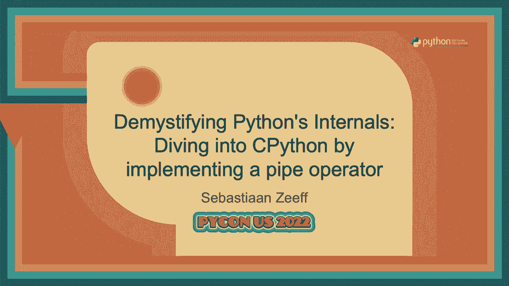
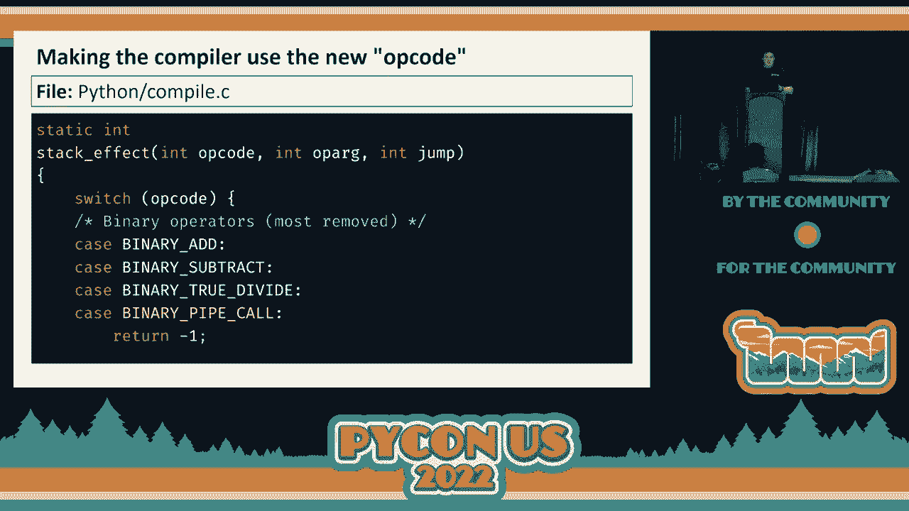
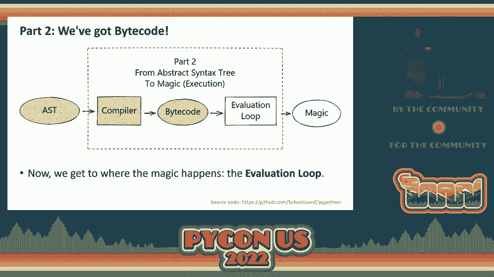
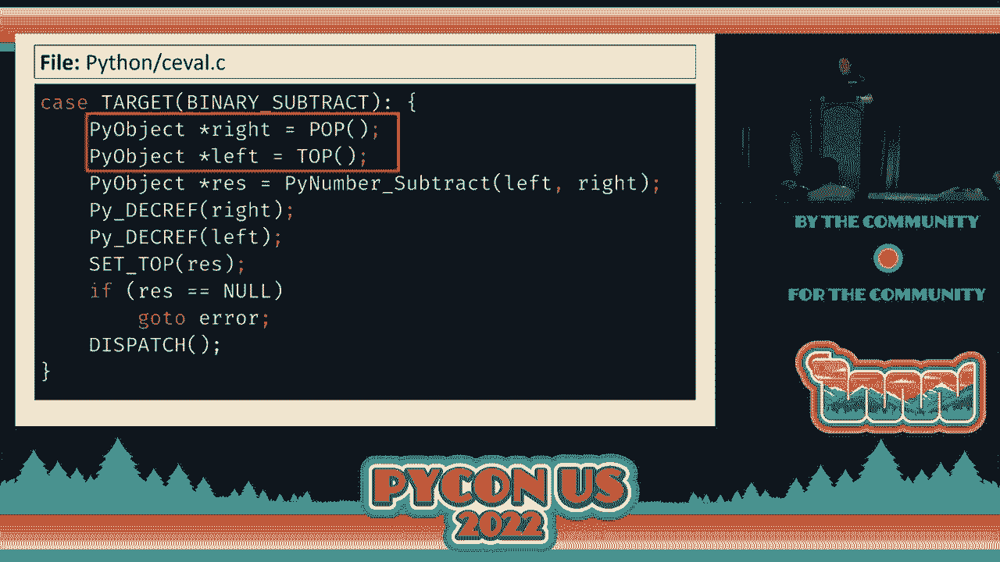
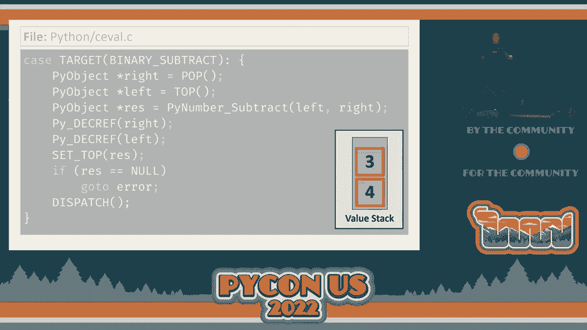
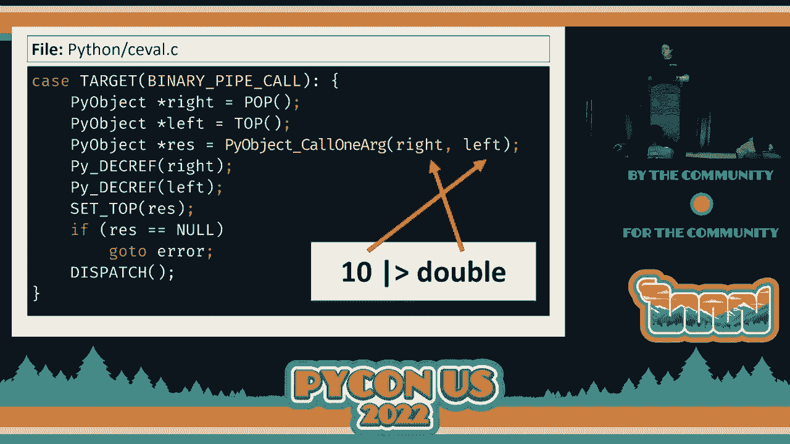
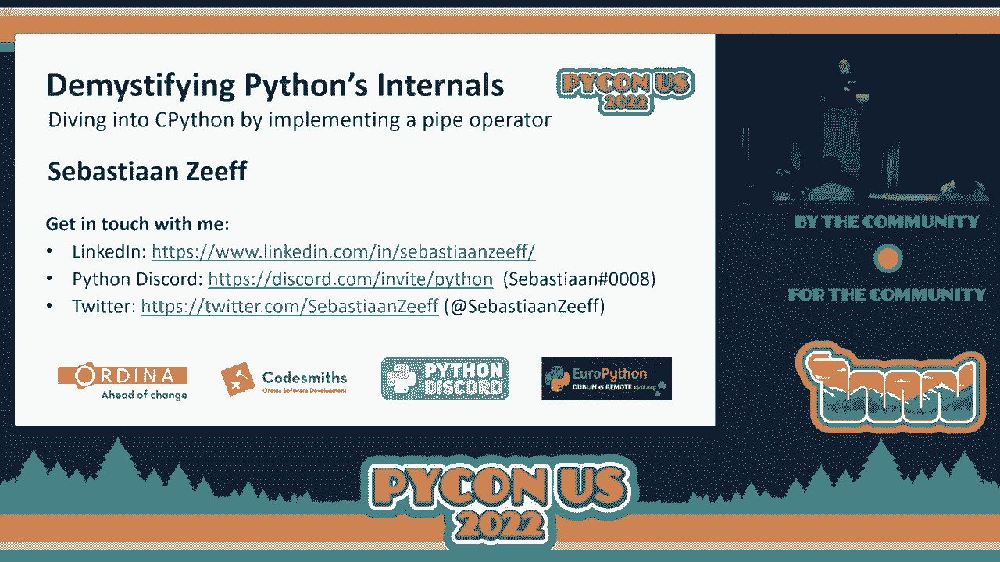

# P76：Talk - Sebastiaan Zeeff_ Demystifying Python’s Internals_ Diving into CPython by - VikingDen7 - BV1f8411Y7cP

 It's my pleasure to introduce Sebastian Safe， who will be talking about demonstrating Python's。

 internals， diving into C Python by implementing a pipe operator。 Yes， well， thank you very much。

 So you must be hearing this a lot。 This is my first in-person Python and my first in-person Python talk。

 I gave a talk last year， but it was online。 I'm really happy to be here and to just be able to see you all。

 I'm also really happy for all of the people who are joining us from home online。

 It's really like a birthday present。 And in fact， today is my birthday。

 So this actually is a birthday present for me。 So thank you all for joining my little birthday party today。

 So before we dive into Python， I'm first briefly going to introduce myself so you， know who I am。

 And then we're going to dive right into the talk。 So my name is Sebastian。

 You can see my Twitter handle over there。 If you have any angry corrections or you want to ask me questions。

 just tweet something， at me。 And another thing that I would really appreciate it is photos。

 I don't have a lot of photos of me speaking， especially in the past two years。

 Everything has been online， staring into a webcam。 So if you do make a photo。

 it doesn't matter if it's from close by or far away， please， tweet it at me。

 So I have the photo as well。 Thank you very much。 So I flew in from the Netherlands last Saturday。

 We had a nice road trip here to Salt Lake City。 And in the Netherlands。

 I worked for the Ordina Python years。 And what we do is we use Python and we go out to our customers and we help them with。

 their problems。 We implement solutions。 We do enterprise development。

 We do a lot of artificial intelligence and machine learning。

 I'm more in the web development and the enterprise side of things。 But that's part of what we do。

 And I'm also part of the codesmith group of the Ordina software development， which means。

 I get to be here。 I get to do stuff with innovation and education。

 It's all really nice and I really like that。 In my spare time， I'm a volunteer for Europe， Python。

 which is another great conference。 It's happening in Dublin this year。

 which might be a little bit far away for a lot of， you， but there are hybrid options。

 So do consider coming or joining online。 It's going to be awesome。

 And I'm also one of the founders or owners of Python Discord， which is a large online。

 Python community。 So right。 Let's dive into the talk itself。 What we're going to do today。

 we're going to take a journey all the way from source code， to execution。

 So what we're going to see， we're going to see a lot of topics like tokens， grammar。

 the pack parser。 We're going to talk about abstract syntax trees。

 We're going to talk a little bit about the compiler that Python has byte code and upcodes。

 or the instructions。 And finally， we will see the evaluation loop。

 And this is where really the magic happens。 And I'm not just going to give you a lecture explaining all of those topics。

 but what we're， going to do。 So I'm going to implement a new operator in Python， a pipe operator。

 And it will very naturally take us all the way from source code to execution。

 There are also some time constraints。 So please excuse me。

 This talk will feature blatant emissions and gross oversimplifications。

 So if you'd like to know more after this very broad introductions， there are a few great， resources。

 There's the Python dev guide that you can find online。

 It's an excellent resource and it has everything you need to get you started with developing and。

 contributing to see Python。 There's also a guide written by Victor Stinner。 Excellent。 On Google。

 I forgot to mention it here。 And then obviously there's the C Python internals book written by Anthony Schull and the real。

 Python crew。 Definitely check out that book as well。 So for today。

 we're going to take the entire journey from source code all the way to execution。

 But there's a lot of details in here， a lot of code。 There are a lot of slides。

 So if you want to read along or read it after my talk， you can find everything on my GitHub， page。

 It's over there， Sebastian Z/Python。 I thought it was a nice name for the repository。

 And basically you will find everything that I tell you today。

 You will also find it in there so you can play around with this new implementation of， Python。 Cool。

 So what is this new operator that we're going to implement？ It's a new binary operator。

 And this means that it takes two operands， one on the left-hand side and one on the right-hand。

 side。 And then it does something with those two values。 And our pipe operator。

 it works with very simple functions。 So you have this double function here。

 It just takes a single argument and it returns something。 Internally。

 the function can be quite complex， but it has to take a single argument and it。

 has to return something， while not returning something， it's very difficult in Python。

 So this is the kind of functions that we'll work with。

 What we'll be able to do is to call the function in a new way。

 So what we can do is we can first specify the argument， one in this case， use the operator。

 and then name the function。 And then the argument will be passed to the function and the result of this operation。

 will be whatever value the function returns。 So it's equivalent to calling double with one as the argument。

 Obviously this isn't very interesting， but the thing that this enables us to do is we。

 can now build a pipeline。 So we can start with a single value and then build a pipeline of functions to process that。

 value。 So if you have a data set or a list or a single value， you need to do a number of operations。

 on them。 You can do that in a very functional way。

 You can pass the value from function to function and eventually you'll get a return value out。

 of it。 So that's what we're going to do today。 And obviously this is not a part of Python itself and it probably will never be a part。

 of Python。 I know this operator has been proposed a few times。

 There are very good reasons not to add it to the language。 There are other ways to call functions。

 We might not need the complexity。 But that's not my department。 If you really want such an operator。

 go discuss it with a core developer or with the steering， council。 But just to be sure。

 this is not in Python。 We're going to implement it here。

 And also the implementation is purely educational。 I'm going to take a few shortcuts maybe。

 I'm going to implement it in a non-efficient way so that I can show you all the parts that。

 we need to change。 And I'm not going to use existing opcodes and things like that just to be able to show。

 you everything。 So it's purely educational。 But if you want。

 you can download the source code and try to improve it。 Cool。 So what we're going to do。

 we're going to first start with our source code and produce。

 something called an abstract syntax tree。 An abstract syntax tree is a different representation of your source code。

 It's a nice tree structure which is much easier for the compiler to work with。

 So that is the first step。 We want to take the source code with the new operator and we want the parser to be able。

 to turn it into such an abstract syntax tree node。 So let's first zoom in on the source code。

 So here we have a piece of source code。 And for us humans， we are very good at chunking stuff。

 So we immediately see a 10。 We maybe see the name double。

 We see kind of a weird operator in the middle that's not part of Python just yet。 But for Python。

 it just starts with a stream of characters。 So for Python， at first， these are just 12 characters。

 Maybe there's a new line at the end。 I've left it out。 These are just 12 characters， two spaces。

 and it doesn't quite know what to do with it， yet。

 The first step for Python is to turn those characters into a stream of tokens。

 And the tokenizer of Python will do that for you。 It will recognize a number token over here。

 This is the smallest part that we can divide in our source code if we try to separate these。

 characters we lose meaning。 There's a name token over here， the name double。

 And obviously if we leave out some of the characters， the name changes。

 But then there's this weird thing here in the middle。

 So the tokenizer doesn't quite recognize this token just yet。

 And actually there are two existing tokens in there。

 But we really want the tokenizer to be able to recognize this as a single token in your。

 source code。 Well， is that difficult to do？ Well， actually not。 This is just a configuration file。

 So if you look in the Python repository， there's a folder called grammar。 And in there。

 there's a file called tokens。 And this is just a text file。

 And it maps the name of the token to the character sequence that makes up the token。

 So you find a lot of tokens in there。 These are just a few。

 And the only thing that we need to do is we need to add a token of our own。

 So I'm calling it the V-Bar Grader because they're not really semantics at this point。

 They just follow the naming convention in here。 And this V-Bar Grader is mapped to the character sequence that we want the token to have。

 Well， at this point， the tokenizer won't actually use it。

 Because the tokenizer won't continuously read in this file。 It's actually generated using this file。

 So for the tokenizer to actually use this， we have to regenerate it。

 And this is going to be something that we'll see a lot in this talk。

 We'll have to run a few commands。 On Linux and Mac， that's make regen token。 On Windows。

 there's a build。bat file in the PC build folder。 And you can run the --regen command。

 which will actually regenerate a whole bunch of， other stuff as well。 And once you've done this。

 now you have a tokenizer that knows the token， that's aware。

 of the token and can finally parse it and put it in a stream of tokens。 So after this simple change。

 we've already went from source code to a stream of tokens。

 And this stream of tokens is the input for the parser。

 And this makes the pack parser in Python a little bit weird。

 Most pack parsers actually work with raw characters。 But in Python。

 it works with the tokens that we know。 And this stream of tokens will be put into the parser。

 And the parser will output the abstract syntax tree。 And if you've looked at the parser in the past。

 the old parser that was in Python， it， actually used an intermediate step called the concrete syntax tree。

 With the pack parser that was added to Python in 3。9， the parser can immediately translate。

 this stream of tokens that it parses into the abstract syntax tree。 So that's what we need to do。

 So we now need to add support in the parser for our new token。

 And that's obviously very important because there currently is no syntax that uses the， token。

 So if you try to use it， the parser won't recognize it。 And then finally。

 we also need to add support for this new operator in the abstract syntax， tree。

 It needs to have a node on its own。 So that's what we're going to do next。 And to do that。

 we're going to add a new grammar rule to Python for our new operator。 And as I just said。

 Python now uses a pack parser。 So we're going to use the parsing expression grammar syntax to define our token。

 Now， I'm not going to explain all of this syntax to you。

 There's an excellent chapter in the dev guide online。

 But I am going to zoom in on just a little bit of the parts that we need for our new， operator。

 So first of all， here's a very simplified piece of pack grammar。

 And you can assume that there are some other statements above there that define statements。

 but these are the only two expressions in my simplified mini language。

 And I've left out some noise that we don't need right now。

 So and let me just color code it for you because that's important。

 In this language defined by this small piece of grammar， there are just two expressions。

 There's a sum expression which has two alternatives that it might match。

 You can tell that they are alternatives by the vertical bar at the front。

 So the first alternative is an atom plus another atom。

 And the second alternative for the sum rule is an atom on its own。 Well， what is an atom？ Well。

 the atom is actually another rule in our very minified grammar， which is just a number， token。

 We're not going to go into how Python recognizes number tokens， but we can just assume that。

 it does。 And as you can see， the sum rule includes the atom rule at the bottom。

 And that's how our grammar kind of flows down。 That's how we get all the alternatives that we might try to parse at a specific point that。

 we're trying to parse。 So if you have these rules。

 it's fairly trivial to see that if we have a very simple one， this。

 will match the second branch in the sum， which is just an atom on its own， so we can parse。

 this as a single number。 It's also very easy to see that if we have one plus one with the literal plus in the middle。

 that we can parse this one as well。 This is the first rule of the sum rule。

 But now what about this one？ So this is an interesting one。 So once the parser gets going。

 it will consume our characters。 So it's perfectly able to match this first part。

 and we're not going to worry about the， actual order of matching here。

 So that we'll have consumed these characters for our need sum rule， and then it's left。

 with plus three。 There's no rule that matches plus three， so it's not able to parse this expression。

 So what should we do？ We can obviously add another rule for atom plus atom plus atom。

 but what about four pluses， or three or six or eight pluses in an expression？

 So we have to add a rule for each number of pluses that we have。 Luckily， we don't have to。

 We can slightly tweak the first rule of sum。 We can replace the first atom by sum itself。

 and this will make the rule recursive。 So as you can see now， it's able to match a sum。

 but it's also able to match a sum nested， in another sum。 And obviously。

 this is a recursive relationship。 So you can now match an arbitrary number of pluses in a row。

 If you think about it， this is precisely what we want to do with our pipe operator。

 We want to be able to build pipelines。 So we're going to use this recursive rule in our new grammar rule。

 So let's add it。 So this is a section in Python's grammar。 You can find it in grammar/python。gram。

 Just took out a small portion， and I'm going to insert a new grammar rule between these， two。

 It's actually not the best place to do it for presidents and all other stuff， but this is。

 a very easy way for me to add a new rule， and I'll show you why in a minute。 And again。

 if you'd like to improve on this， do download the source code and just try to。

 make it better yourself。 So what am I going to do？ I'm going to add a new grammar rule called pipe。

 It's an expression type。 You kind of can ignore that for now。 Here， in the middle。

 we have our recursive rule。 So pipe includes pipe itself， and it includes the sum。

 which is the rule just below it。 Now， we're nearly done。 There's just one problem left。

 and that is that our grammar rule isn't referenced by， any other grammar rule。

 So if you look at the shift rule just above， it only references the sum， so it will step。

 over our rule。 It's not actually used。 So we have to change those references。

 And that's what I'm going to do next。 I'm just going to make the shift expression refer to our new rule and then make that rule。

 refer to sum。 And this is why I inserted it here。 Here I only have to change a few references。

 I don't have to change a lot of references。 So now。

 this means that we can now parse this bit of syntax。 That's very cool。 But what about the last step？

 We haven't actually told the parser how it can convert what it has just parsed into an。

 AST node that you see on the right-hand side here。

 So a bin of node is the representation of our operation。 It has a left-hand side。

 the ten in this case。 It has the operation in the middle。

 and it has the name double on the right-hand side。

 There's probably going to be a load below that as well， but I just kept it simple。

 So we have to tell the parser how it can get from parsing the syntax to making such an， AST node。

 And with the new pack parser， there's a very convenient way to do that。

 And it's called grammar actions。 And grammar actions are basically just small pieces of embedded code within a grammar rule。

 So as you can see here， there are two curly braces。 And within there。

 there's just a tiny bit of C code。 This is calling a function。

 and it will pass in some information and the function will construct， the AST node for us。

 So as mentioned， we'll need the left-hand side and the right-hand side。

 That's why the grammar rules slightly more complex。 There's the A is sum and B is term in there。

 And that's assigning names to the left-hand side and the right-hand side so we can pass。

 it into this pi bin of function。 There's also an add in the middle。

 We know that this is an add operator because this is the plus rule， so we just hard-coded， in here。

 There are also some extra bits。 We're not going to talk about them today。 Things like line number。

 column offset， things like that。 We're just going to assume that they're taking care of for us。

 So this is how we can tell the parser how to create a AST node。

 So we just copy this approach for our pipe rule。 The only thing that we really need to change is that instead of specifying that this is。

 an add operator， we're going to specify that this is a call pipe operator， which is how。

 I named this operation。 Just one tiny problem。 There's now a call pipe node in my AST。

 but it doesn't exist yet。 So we have to create that one as well。 Well， it sounds kind of difficult。

 but actually this is just another configuration file。 If you open the parser/python。asdl。

 which stands for abstract syntax definition language。

 this is a file that defines all of the AST nodes that are in Python and Python。

 And you can actually generate all of the necessary types from this file。

 So you don't really need to write all the classes or types yourself。

 You can have them generated for you。 As you can see here。

 I picked a bit that includes operator and operator has a lot of alternatives。 One here is add。

 And what the generator will do， it will make a C enum for us that has a number of members。

 or fields and add is one of those fields。 So the only thing that we need to do is we need to add our operator at the end。

 And then we need to regenerate all the AST nodes with this file。

 And then we will magically get another member of field in the C enum with a new integer。

 assigned to it。 And then we can use the call pipe。 So after we've done this。

 we have the grammar rule。 We can now regenerate the parser itself。 And now we can actually use it。

 So we can use AST。parse， pass in our expression， and it will actually be able to build an AST。

 that includes a bin of operation and a call pipe operator， as you can see here。

 This is all very handy， but this doesn't do anything yet。

 Now we have a nice tree-like representation of our code， but there's no execution yet。

 And that's what we're going to see in part two。 So what we're going to do in part two。

 we're going to take the AST， pass it into the compiler。

 and then the compiler will pass something to the evaluation loop and then we'll get magic。

 And I call this magic because it's always been magic to me。

 I type in some magic formula or spell into my computer and then something happens。

 It's really like magic to me。 Cool。 So let's zoom in on that second part。

 So we have the AST as the input。 We will put it into the compiler and the compiler will generate something for us called bytecode。

 And this is like an intermediate language and it's just a long list of instructions。

 A long list of bytes or integers， which is more easy for us to reason about。

 And these are really the instructions that the evaluation loop will then perform。

 And for those of you who like the discussion about is Python a compiled language or not。

 just think about this and then ignore the discussion because it always gets very toxic。

 So first of all， we're going to add some support to the compiler。

 And each instruction that we are able to perform has its own upcode or operation code。

 What I'm going to do is I'm going to add a new upcode for our new operator。

 Some of you may wonder there's already about the fact that there is already an upcode for。

 calling functions。 I'm going to ignore that one because I want to show you how to implement a new one。

 So this is purely educational in a way。 So right， this is the first and probably the only Python file that we'll see today。

 in my， talk at least， and it's in lib/upcode。py。 And this defines all the operation codes that we have。

 And it basically specifies a name and then the byte or the integer that we have for the。

 operation code。 Now ours doesn't have taken argument or upcode。

 It works with values that are already on the value stack。 More about that later。

 So we need to add it 40 half argument constant or the value defined in there。

 So just going to add it here with the new integer of 90 and then increment all the values。

 below that just to make it work again。 That's the issue of working with sequential numbers。

 So once we've defined our operation code here， we can regenerate all the upcodes and now we。

 have a new upcode。 Which is cool but the compiler still doesn't know when to use it。

 So that's what we'll do next。 We're now going to teach the compiler when to write this upcode into the bytecode。

 So in the compiler， in a file called Python/compile。c。

 there are a lot of functions that get cold whenever。

 the compiler encounters a specific type of AST node。 And in our case。

 we're dealing with an expression。 So we're going to modify the compiler visit expression one function。

 And this is a function that gets cold internally whenever we get to an expression node in the， AST。

 And this function is basically just a large switch case statement and it has a case for。

 bin up kind， the binary operations。 And that's the one that will take care of writing our upcodes for our new binary operation。

 And what's important to note here is that there are two visits first。

 So it's first going to visit the left-hand side of our binary operation。

 And that means that it will first write all the instructions to evaluate the left-hand。

 side of our operator to get that value。 Then it will do the same for the right-hand side。

 So it will write all the instructions it needs to evaluate the right-hand side of the operator。

 And that's logical because we need both values before we can actually perform the operation。

 before we can write out the new upcode that we have。 Well。

 taking care of the new upcode is the add up a macro that we see here to just write， a single upcode。

 Now， how does it know which one？ Well， it calls a helper function， calls bin up。

 And bin up is just another switch case statement。 And it has cases for all the operators defined in the ASD。

 Here we have the add。 And it will just simply return the upcode associated with that operator。

 So all we have to do is modify and add another case of our own， case call pipe， return our。

 new operator to binary pipe call。 And now the compiler knows that whenever it sees such a call pipe ASD node。

 it has to， write a binary pipe call instruction。 There's one final thing that we have to do here which takes care of the stack effect。

 I'm going to show you the value stack in a minute， but we have to specify that our operation。

 pops one value out of the value stack。 So after performing our operation。

 there's one value less on the value stack， which is， the same as a lot of other binary operations。

 So that's why I've added it here。

 And this is just something to make the compiler work as well。 So after we've done this。

 the compiler can now turn the ASD into that intermediate byte， code language。

 And now we get to the magical part， the evaluation loop。

 And the evaluation loop really is the main loop of Python。 And it's an enormous loop。

 And inside of it is an enormous switch case statement。

 And it has a case for most of the-- or all of the upcodes that it needs to be able to， perform。

 And then it has the code that will actually handle that instruction。

 That will actually perform that operation。 And just to show you one。

 I've picked the case for the binary subtract operation code。

 And this is just a case within that huge loop that we have。

 And this will perform for us the something minus another thing。 So when you subtract two things。

 you actually need to know the things。 I just cannot do thing minus thing without knowing what the thing is。

 So first， within this case， we need to get the value for the right-hand side and the value。

 for the left-hand side。 And that is what happens here。 But where are those values coming from？

 As I told you earlier， whenever we have a binary operation， Python will first write the。

 instructions to evaluate the left-hand side of that operator。

 It will evaluate it and it will finally get a value。

 And it will put it on the stack so it can keep track of it。 So this for will be evaluated。

 It will be on the stack。 Then it will evaluate the three on the right-hand side。

 It will put it on the stack as well。 And just to be sure。

 there can be a lot of other values on the stack as well below that。

 And once we've evaluated the left-hand side and the right-hand side， we now have three on， top。

 the right-hand side and the four below that， the left-hand side。

 So this is our value stack when we're evaluating the two operands， the left-hand side and the。

 right-hand side。 So when we get to here， we can， for the right-hand side。

 we can simply pop the value off of the， value stack and then write points to that right-hand side value。

 For the left-hand side， we're going to do something similar。

 But we're going to peek at the top of the value stack， which is what the top macro does。

 and now left points to the four on the value stack。 So now we have right pointing to three。

 left pointing to four。 Then we can call a function within the C API， pi number subtract。

 pass in the two values， and then we get a result back and we will make rest point to the result of that pi number。

 subtract。 Now we're done with the left-hand side and the right-hand side。

 so we decrease the reference， count， but we still only have the result within this function。

 So what do we need to do？ We have to put it back on the value stack。

 But instead of putting it as an additional value on the value stack， we're going to use， set top。

 which replaces the four that we already have。 So this one will move over and it will replace the four that we have。

 This also explains the minus one with the stack effect that we saw earlier because we。

 started with a three and a four and we end up with one value less on the stack。

 Then there's some error handling and then finally we have dispatch with which tells the。

 evaluation loop to continue to the next instruction。 So this is binary subtract。

 That's copy and paste。 This one and changes for our new operator。 We have to change the target。

 binary pipe call。 Obviously， we don't want to subtract numbers。

 but there's a very convenient new function， within the C API starting from Python 3。

9 by object call one arc。 And we can pass in the function and the value and remember the function was on the right。

 hand side and the value on the left hand side of the operator。 Then we get the result。

 we set it back on the value stack and now our operator works。

 And we can actually show that， but because the only thing that we now need to do to get。

 all the way to the magic， we can now， oh wait， I forgot about this slide。

 And now we've completed the entire journey from source code to magic。

 The only thing left to do is compiling our new version of Python。 There are a few comments for that。

 I'm using two cores to compile it。 But the important message is I can now define a function。

 use the new operator and actually， get values out of it。 So recap and remarks。

 A lot of Python internals do check out the resources so you can have a deep dive into， them。

 The source code in the slides are available and if you get weird errors while working on， CPython。

 try running may clean or clean all on windows just to get rid of all the intermediate。

 and compiled files that might give you issues and look into the magic number that versions。

 the byte code because we've changed the byte code so all the old precompiled pi C files。

 need to be recompiled。 And that's it。 Before we go， you're a Python。

 Check it out and double in this year， go there， either in person or online。 Check it out。

 Really cool conference。 And that was it。 Thank you very much。 [APPLAUSE]， (applause)。

