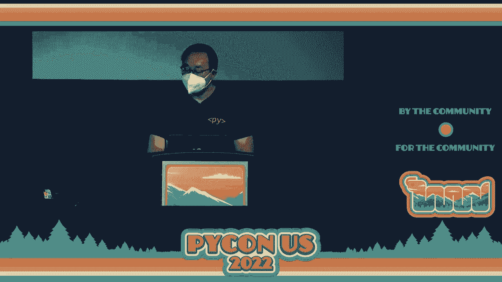
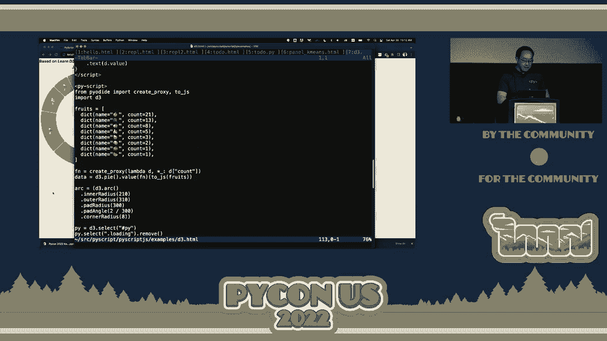
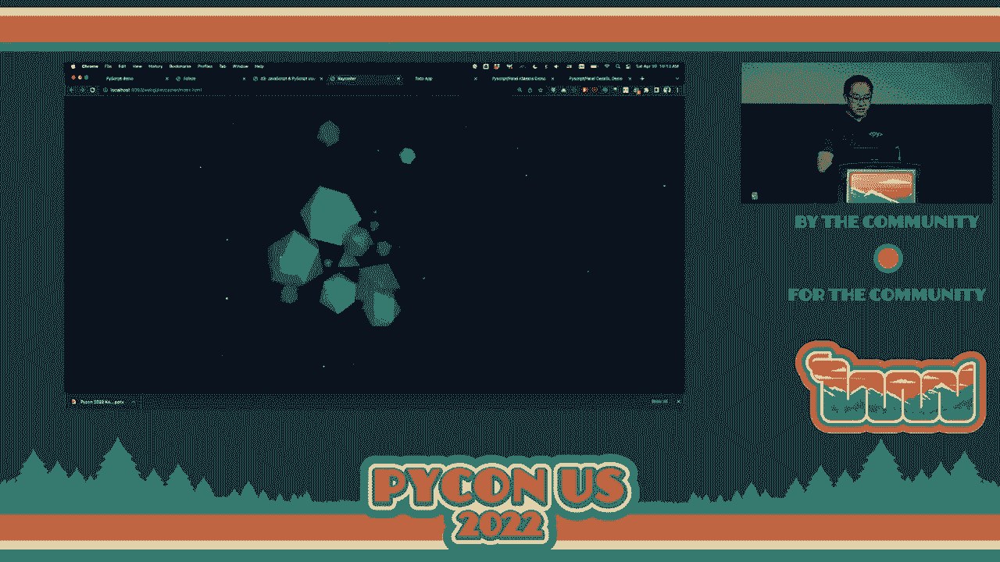
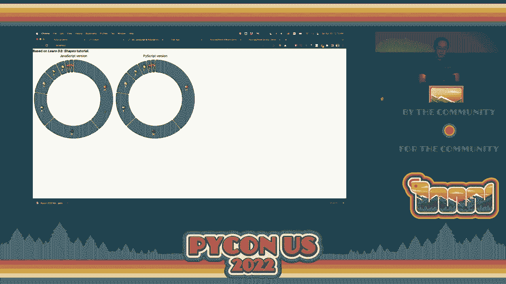
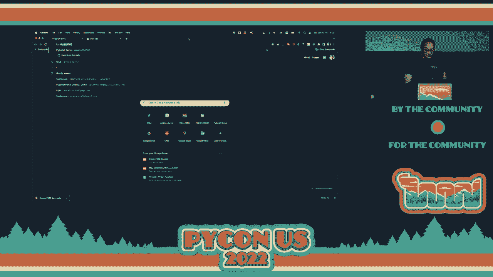
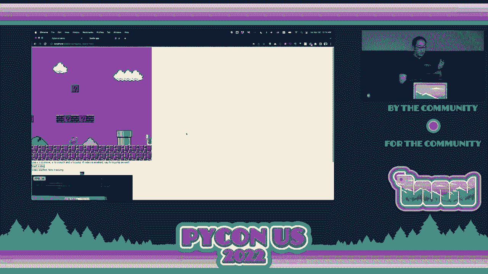
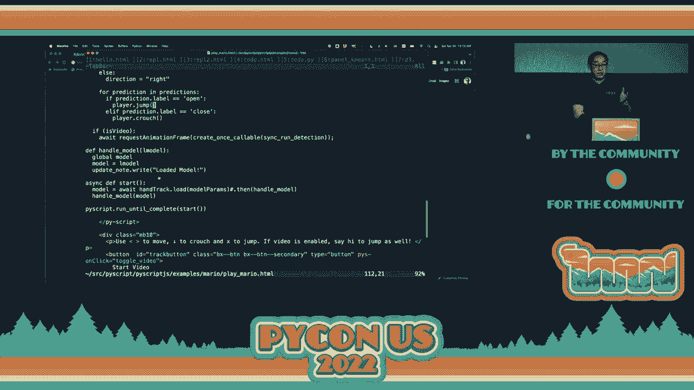
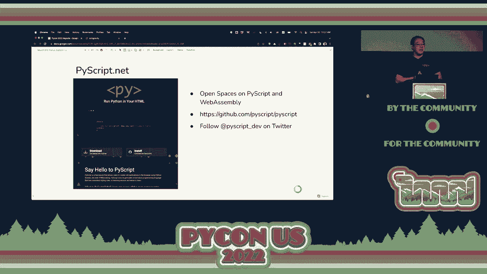
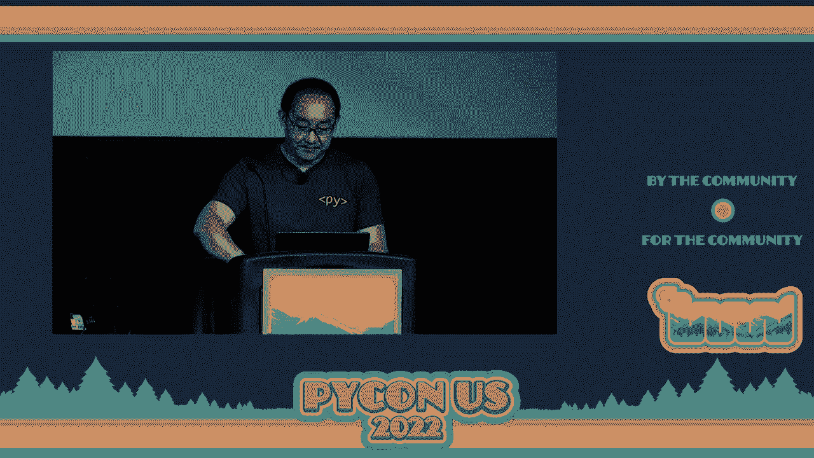

# P8：Keynote - Peter Wang - VikingDen7 - BV1f8411Y7cP

 All right， and now we're just going to take a minute to switch out the speakers， but I。

 am very pleased to introduce Peter Wang， the CEO and co-founder of Anaconda。 [Applause]。

 All right。 All right。 How's everyone doing？ I give a big。

 big thank you to the conference organizers， to Emily， the chair， to everyone。

 all the volunteers who have worked so hard to bring us all together here。

 It is really wonderful to be in person with everyone again。 I know everyone keeps saying that。

 I just want to reiterate how awesome it is to see everyone here。

 I actually can't see anyone because the lights are very bright。

 but I'm assuming everyone's out there。 But today I'm going to go through a bunch of different things。

 I'm going to talk really fast。 I apologize。 But there's a lot of ground to cover。

 and it's super exciting。 Some new stuff I'm working on， I want to tell you about。

 But the title of my talk is programming for everyone， or the next 100 million Pythonistas。

 You'll see why I call it that。 But to get started for those who don't know who I am or not familiar with Anaconda。

 I am， the CEO and co-founder of Anaconda。 And about 10 years ago， Travis Olafont。

 the creator of NumPy and SciPy and my co-founder， we had this insight that Python's scientific tools。

 the ones that Sarah was just talking， about that the scientists have been nerding out on for over a decade at that point。

 That those tools were really， really ready for prime time in business data analysis and。

 business data processing。 At the time it was big data and Hadoop and all these things。

 but we were a couple of weirdos， at Strata conferences saying， "use Python。"， And since that time。

 we've created a lot of things that now I hope are recognizable to， many of you， open source tools。

 as well as really important things like the non-focus， the pie data conferences。

 a lot of different things like that。 So that's where we started。 And the reason why， I guess。

 one of the things that is really important to appreciate why。

 we did this is because there's a lot of things about Python that make it different and special。

 There's a lot that we love about Python and hopefully this is not controversial to any of you。

 But I think there's a lot of other languages out there。 If we just focus on software development。

 there's many different choices。 Why are we， why was Travis and I。

 why were we so opinionated about taking Python to data， science and to data analysis？

 And the reason is because of these things， right？ It is something that is approachable by lots of people。

 more than just people with CS degrees。 And this last part， too， this last bullet point。

 the fact that the communities are welcoming， and generally pretty pleasant， that's a really。

 really big deal。 A really big deal if you want to keep growing user base。

 There's one other thing that people don't talk about too much， which is the Python interpreter。

 has essentially under the hood capability to be extended with native extensions。

 and call them binary extensions。 So I call it like a Honda Civic with mounting bolts for warp drive。

 And so it's very unassuming。 It's a very common sort of thing。

 Kids learn how to do basic scripting with Python。 And then you go into the Trump， you pop it open。

 and you bolt on warpness cells。 And now you're running faster than C or C++ in some cases， right？

 You're getting direct access to GPU。 So this is one of those other things that is a little bit underappreciated。

 It's something that's obvious to me， because I've been doing this stuff for 20 years。

 but it's something that I think really bears repeating。 It's not just like every other language。

 It's not just like Node。 It's not just an alternative to Ruby。

 The actual architecture of the CPython virtual machine itself has enabled， well。

 the kind of research， you just saw， right？ And research besides on cancer research on everything。

 right？ Like the reason why Python got picked up by Wall Street 10 years ago， 15 years ago。

 was precisely， because of this warp drive capability。 And that's what's led this incredible growth。

 If you look at these charts from Stack Overflow， from TOB， you know， this year actually just。

 hot off the press， TOB ranked Python as number one again， continues to grow。

 We can continue to add users and popularity to the language。 But all that being said。

 there's some things that are not so great， right？ And so here among friends。

 I'm sure we can talk candidly about what sucks about Python。

 And I'll be the first to go out there and say that， you know， packaging and installing all the bits。

 right？ On the one hand， we have a diverse ecosystem of a huge number of libraries， over 100，000。

 on PIPI， I believe。 But at the same time， getting all these to work together is difficult。

 And although there are many solutions， they all are about 80%， right？

 Which means everyone's having a bad time， about 20% of the time。 Which is not great。 Secondly。

 this is a really odd thing for the world's most popular language， which we are。

 The challenge is we can't actually build things that have interfaces with。

 Like you can't go and build an iOS app with Python very easily。 Rolling， you know。

 native application on Windows， which is what runs on most corporate desktops。

 Trying to roll an application even with a web front end。

 You have to write JavaScript and CSS and HTML。 So the fact that it's the world's most popular programming language。

 but we can't easily create things with user interfaces， is kind of weird， but kind of interesting。

 right？ And the consequence of one and two， of course， makes it hard to share our work。

 And I know some of you are thinking your mind， "Ha， but that's why I use Docker。"， Right？

 And the speculator， when you're using Docker， you are literally compressing。

 zipping up a hard drive and shipping it to someone。

 And that cannot be our way of getting this into kids' hands。

 getting millions of people to be using this stuff。 Right？ There's got to be something easier。

 But again， despite all these challenges， Python continues to grow。

 Python continues to be the most popular language taught in schools at every level。

 And to some extent， I think Python is the victim of its own success。

 Precisely because it's so good at gluing together so many things。

 it's stuck to all those things it glues to because it's glue。 Right？

 And so much of what we do in computing is tied to ideas， architectures。

 things that were built really in the 70s and maybe the 80s。

 And that is everything from the C programming language and the Unix process model and the compiler tool chains around all that。

 to concepts， you know， like common internet working， TCP/IP and all these other kinds of things。

 There's a lot of infrastructure that Python is able to kind of get into the nooks and crannies up。

 but then it itself gets dragged into。 And so the thing is the language proper。

 So if you read a Python tutorial， you can teach that to a child in an afternoon。

 You can teach that to anyone in a weekend。 But if you really want to go beyond that。

 if you want to go from there to， let's say， shipping a native exe on Windows or an iOS app on an iPad。

 that's a lot more work than an afternoon。 Right？ And so the question I would pose is。

 can we unshackle Python from all of this？ Right？ When you look at the stack overflow rankings of language popularity。

 JavaScript right up there at the number one， and then there's HTML and CSS and number two。

 Python is right there sitting comfortably on the podium at third place。

 And can we ever get over that？ Because the browser clearly has won the operating system wars。 Right？

 It's， you know， is it the year， is it 2022， the year of Linux on the desktop？ I don't know。

 But I'll tell you， 2022， there's a lot of web browsers on the desktops。 Right？

 And the problem with the web browser， the reason why JavaScript is stuck there as king in number one is because it's the native language of the web browser。

 Right？ And so if we want to grow beyond that， right， we have to go where the people are。

 We have to use Dinglehoppers or rather WebAssembly to do this because WebAssembly fundamentally changes the game。

 WebAssembly， for those who are not familiar， it is a virtual CPU instruction set that recently became a standard。

 It has a 32-bit memory space but it supports 64-bit arithmetic and there's a compiler tool called MScripten that operates as sort of a pseudo operating system layer。

 It compiles a lot of CSC plus plus code to target WebAssembly。

 And it's also WebAssembly because it's a standard。 It's well supported by most modern browsers。

 including mobile browsers。 So for those of you keeping track at home， Python。

 C Python is also a C program。 A lot of the Python numerical stack is also written in C and C++。

 So the work that was done over the last couple years by projects like Pyodi and Jupiter Lite。

 they've been compiling a large part of the Python data and scientific stack to target WebAssembly。

 And so if you go to Pyodi。org， you'll get a nice little REPL。

 three little friendly angle brackets that you can import non-Pimpedas into。

 If you go to Jupiter Lite， you can actually get a full Jupiter-lab environment。

 no server process at all。 It just completely runs in your browser。 And most recently。

 Christian Himes has been talking a lot about WebAssembly and doing some great work on this stuff。

 WebAssembly is going to be soon getting official CPython support as a tier two supported platform。

 So again， it's a virtual CPU kind of instruction set and it would be an alternative at an architecture level to things like the ARM instruction set or the x86 instruction set。

 It's just another kind of thing that the Python code base， the interpreter can target。

 So we've been looking at this for a little while at Anaconda and we came up with an idea for how to really maybe leverage some of this work and increase the experience of the Python code。

 And so I'm very， very excited to announce a project called PyScript。 So what is PyScript？

 I'll show you what PyScript is。 And I'm going to， yes， I realize I am live coding。

 My first PyCon keynote here， maybe my last。 Everyone is like。

 what the hell is this going on over here？ Are y'all ready for this？ Whoa。 For our language。

 I was in -- because we're good citizens， we're going to close out that HTML tag right there。

 So that is HTML file and it is stored here。 Where's my mouse？ There it is。

 If I double click that bad boy， there it is。 Can you see that？ [ Applause ]， It's HTML。

 Let's go have a little fun with it。 Let's have a little fun with it。

 Let's put a -- let's put a blink tag in here。 [ Laughter ]， I say reload。 No blink tag。

 I'm old school。 I came up with a time when there were blink tags。

 And now I have to explain to kids there's no more blink tag。

 So we're going to have to do something a little different。

 We're going to do -- we're going to create a div out here。 I'm going to call it output。 All right。

 In our PyScript， we're going to make our own blink tag。 [ Inaudible ]。

 You all see where this is going？ [ Inaudible ]， [ Inaudible ]， Hey， I love you。

 You've got to love me back。 All right。 Oh， this is not going to work because code --， [ Inaudible ]。

 All right。 What do you guys think？ What's going to happen？ [ Applause ]， What the W3C takes away。

 PyScript gives you back。 All right。 There we go。 Nothing's going to stop us now。 All right。

 So that's PyScript。 So what's really going on here？ When you look at something like this。

 it's very simple。 It's about ten lines of code。 And we are just embedding HTML in the browser。

 It's a framework for creating rich Python apps in the browser。 We interleave Python with HTML。

 We have full access。 Full access to the DOM。 And we can call and be called by JavaScript libraries。

 So all of your app logic， all your code is in one language in the browser。

 There's actually no web server needed。 That was -- you saw that was just HTML file that double clicked。

 I can put it on USB stick and give it to somebody and they can double click it。 Now， granted。

 you're like， okay， you have a script source equals。 Yeah。

 There's a little bit something you've got to do if you want to have the script locally。

 But the point is， all of the stuff is there in the HTML。 Okay？ So this is how it actually works。

 It is not a variant of the Python language。 Only very clear。

 This is the same CPython that all of you all run on your laptops and your servers。

 It's just been compiled to target the virtual CPU sitting inside the browser tab。

 And because of the PyoDied work from the PyDied team， that project。

 we're able to leverage all of the NumPy and SciPy in the， core data and scientific stack in Python。

 The PyScript infrastructure itself， it's kind of an opinionated framework with these tags and a way to do some。

 FFI stuff， a way to talk to the various bits and pieces。 And the idea here is that Python， you know。

 we have wrapped C++。 We've swallowed them。 We've swallowed C++ for Tran。

 We can also go and wrap and call JavaScript。 Why not？

 So this is actually truly serverless computing。 You can run client-side only。

 So let's look at a couple of additional demos。 So here's the basic REPL。 All right。 One plus three。

 Print。 Hello。 Well， you guys already saw this， but there's that， right？

 But you can also do because it's just a DOM。 Well， and yet a little auto-completing there going on。

 [Applause]， This is the most number of people I've simultaneously re-rolled。 So there we go。 Right？

 Yeah， a little bit of that going on。 Anyway， so that's your REPL。 But this isn't Jupiter。

 I'm going to be very， very clear。 What is this？ Let's look at what this code for this looks like。

 Because this is a coding conference， so we're going to look at some code。 Okay。

 there's some stuff here。 But at the end of the day， you have just a little REPL。

 And we have this little pi REPL thing。 And we have this auto-generate equals true。

 So pi REPL is one of the primitives that pi script provides。

 Auto-generate means that every time you execute， it will create a new line for you。

 But you can also change where that output goes。 So here， this is REPL 2。

 There's a lot to kind of parse in here。 But the key thing here is we are able to redirect standard output and standard error to different divs。

 So if I go here and load up REPL 2， I can do this。 And this is not just to be very clear。

 This is not Jupiter。 Many of you are familiar with Jupiter as the way of authoring and doing REPLs in the browser。

 This is just Python in the browser， pi script， and then putting your output over here。

 So it's really nice。 And I won't re-roll you again。

 but I assure you you can get re-rolled with this as well in the other div。

 No one needs to see that again twice in one day。 Let's see here。

 The other thing I want to show is this little to-do app。 And so when you do web programming。

 the blog post， the to-do app， these are the kind of canonical examples。 So eggs。

 we're going to add some things here。 Add the task。 Hold on， I know what's going on here。

 This is to-do。html。 Let's do this guy。 All right。 So we give this a little second to load up the Python infrastructure。

 And then if we do eggs， bacon， ham， and you can do this sort of thing。 I don't think you can see it。

 but it's actually crossing out the item that clicks on it。 And the code for this。

 I will show you the code for this looks。 Oh， really？ Oh， I'm in the wrong thing。 Hold on。 To-do。

html。 There it is。 Okay。 So the to-do list app， most of the lot。 This is it right here。 This is HTML。

 It's about 50 lines。 There's a lot of formatting and stuff。

 but ultimately what happens is we have a button here， this new task button， and we click it。

 we call the add task function， which is actually defined in all of our actual Python logic we put in a little helper file here。

 This is to keep it a little bit cleaner。 Okay。 My vim is。 There it is。 Okay。 So your add task。

 what we're doing here is we're really playing with the DOM。 We're able to pull things out。

 We're able to set the check mark on things。 We're able to do all these kinds of things here。

 This is a really。 The point here is that there's no。

 There's not a whole lot of translating back and forth to server state， to client state。

 and all these other things。 You're literally just writing Python。

 You're able to import that Python code right into your page here。

 and you just kind of play with all of it。 So it all sort of works。 And that's nice。 Okay。

 These are some toy examples。 That's kind of cool。 Let me just walk through these a little bit。

 So you can load the JavaScript and the CSS and all these things from a local server or a server you run。

 or you can run it off of pyscript。net。 You can output to divs。

 You can do all sorts of fun things like this。 The REPL can output to various different places。

 so you can build a nice little， you know， flexible set of REPL things。 And you can do， actually。

 because this is loading all of Python in there， we're able to do more sophisticated examples。

 We're able to go and load， for instance， scikit-learn and the panel dashboard library with bouquet。

 and things like that。 And so I'm able to sit here and actually do interactive scikit-learn in the browser with zero install。

 So just to be very clear， this panel k means that HTML， which is this guy。 Okay。 Again。

 there's a lot of stuff in the head which we will clean up。 This is all very alpha。

 So we're very clear。 But we'll make a lot of this stuff much simpler。

 But the core of the logic here is we have pi nth， where we did -- oh， sorry。

 This is plotted with Altarius and not bouquet。 But we are -- we're declaring what we need in the environment to run。

 Those things get loaded up。 And then the actual code here for this dashboard is all this Python。

 We're using Vega to declare the plots。 And so you have interactive selection here and update。

 All this stuff just runs client-side。 And if I take this HTML file， again。

 similar to with the little REPL or any of those other examples， if I take this HTML file。

 I zip it up and give it to someone else， they can just run it。 There's no install needed。

 So this is a really， really powerful example of how the distribution， the sharing。

 all those things that I said， you know， what's Python not so great at。 This。

 because it uses the browser as the primary interface and as the portable CPU。

 it just skips over a lot of those kinds of challenges。 But you can do one step further。

 You can go and say， you know， there's a lot of really great stuff in JavaScript。

 What if we could leverage all those libraries in JavaScript？

 deckGL is a fantastic example of one of these powerful JavaScript visualization systems。

 And this example， again， uses the panel dashboard library and that's a little visualization of the New York taxi cab data。

 We can animate it and see how， let's make this speed a little faster。

 So you sort of see in these hex bins the number of taxi cab pickup and drop-offs they are on the island Manhattan。

 But what's， and you can modify this。 So you can change the radius of， you know， how many。

 how big the radius is as you're contemplating these， or creating these bins。

 You can also change kind of visually and configure the thing。 This is all pretty cool。

 You can slide this along。 It's actually kind of neat。 All this is running in the browser。

 No install。 I could put this on a USB stick。 Give it to anyone here。

 You load up on your machine and it would definitely work。 Maybe。 But pretty much。 [laughter]， Look。

 I've been doing this a while。 I know not to make sort of these absolutes。 But， you know。

 the other thing you could do though， because this is actually running in the browser。

 and because you have a full Python environment here， you can actually compile。

 you can just play with all of this。 Right？ And notice how this changed this up there。

 Let's go back to 50。 Right？ Oh， also you can， when you click on a thing。

 I don't know if you guys can see that， but it shows you where the taxi routes actually went to。

 Isn't that neat？ It's actually really beautiful。 It is。

 But you can also access the data frame of data itself。 So the data frame， DF。

 this is in the form and it has a little tricky here， but it's 50，000 rows。 But I can actually say。

 look， I just want to look at， let's say， the data frames where the trip distance was less than five miles。

 Can you see that？ And it's interactive。 So this is it。 You can do more complex expressions。

 I want to find the big tippers。 What's going on here？ There you go。 Where did the big tippers go？

 Right？ So this is a really interesting capability where you have access to all of NumPy， SciPy。

 SciPy， Scikit。 And you can see that it's a little bit different。

 And you can see that it's a little bit different。 And you can see that it's a little bit different。

 And you can see that it's a little bit different。 And you can see that it's a little bit different。

 And you can see that it's a little bit different。 And you can see that it's a little bit different。

 And you can see that it's a little bit different。 And you can see that it's a little bit different。

 And you can see that it's a little bit different。 And you can see that it's a little bit different。

 And you can see that it's a little bit different。 And you can see that it's a little bit different。

 And you can see that it's a little bit different。 And you can see that it's a little bit different。

 And you can see that it's a little bit different。 And you can see that it's a little bit different。

 And you can see that it's a little bit different。 And you can see that it's a little bit different。

 And you can see that it's a little bit different。 And you can see that it's a little bit different。

 And you can see that it's a little bit different。 And you can see that it's a little bit different。

 And you can see that it's a little bit different。 And you can see that it's a little bit different。

 And you can see that it's a little bit different。 And you can see that it's a little bit different。

 And you can see that it's a little bit different。 And you can see that it's a little bit different。

 And you can see that it's a little bit different。 And you can see that it's a little bit different。

 And you can see that it's a little bit different。 And you can see that it's a little bit different。

 And you can see that it's a little bit different。 And you can see that it's a little bit different。

 And you can see that it's a little bit different。 And you can see that it's a little bit different。

 And you can see that it's a little bit different。 And you can see that it's a little bit different。

 And you can see that it's a little bit different。 And you can see that it's a little bit different。

 And you can see that it's a little bit different。 And you can see that it's a little bit different。

 And you can see that it's a little bit different。 And you can see that it's a little bit different。

 And you can see that it's a little bit different。 And you can see that it's a little bit different。

 And you can see that it's a little bit different。 And you can see that it's a little bit different。

 And you can see that it's a little bit different。 And you can see that it's a little bit different。

 And you can see that it's a little bit different。 And you can see that it's a little bit different。

 And you can see that it's a little bit different。 And you can see that it's a little bit different。

 And you can see that it's a little bit different。 And you can see that it's a little bit different。

 And you can see that it's a little bit different。 And you can see that it's a little bit different。

 And you can see that it's a little bit different。 And you can see that it's a little bit different。

 And you can see that it's a little bit different。 And you can see that it's a little bit different。

 And you can see that it's a little bit different。 And you can see that it's a little bit different。

 And you can see that it's a little bit different。 And you can see that it's a little bit different。

 And you can see that it's a little bit different。 And you can see that it's a little bit different。

 And you can see that it's a little bit different。 And you can see that it's a little bit different。

 And you can see that it's a little bit different。 And you can see that it's a little bit different。

 And you can see that it's a little bit different。 And you can see that it's a little bit different。

 And you can see that it's a little bit different。 And you can see that it's a little bit different。

 And you can see that it's a little bit different。 And you can see that it's a little bit different。

 And you can see that it's a little bit different。 And you can see that it's a little bit different。

 And you can see that it's a little bit different。 And you can see that it's a little bit different。

 And you can see that it's a little bit different。 And you can see that it's a little bit different。

 And you can see that it's a little bit different。

 And you can see that it's a little bit different。 And you can see that it's a little bit different。

 And you can see that it's a little bit different。 And you can see that it's a little bit different。

 And you can see that it's a little bit different。

 And you can see that it's a little bit different。 And you can see that it's a little bit different。

 And you can see that it's a little bit different。 And you can see that it's a little bit different。

 And you can see that it's a little bit different。 And you can see that it's a little bit different。

 And you can see that it's a little bit different。

 And you can see that it's a little bit different。 And you can see that it's a little bit different。

 And you can see that it's a little bit different。 And you can see that it's a little bit different。

 And you can see that it's a little bit different。 And you can see that it's a little bit different。

 And you can see that it's a little bit different。 And you can see that it's a little bit different。

 And you can see that it's a little bit different。 And you can see that it's a little bit different。

 And you can see that it's a little bit different。 And you can see that it's a little bit different。

 And you can see that it's a little bit different。 And you can see that it's a little bit different。

 And you can see that it's a little bit different。 And you can see that it's a little bit different。

 And you can see that it's a little bit different。 And you can see that it's a little bit different。

 And you can see that it's a little bit different。 And you can see that it's a little bit different。

 And you can see that it's a little bit different。 And you can see that it's a little bit different。

 And you can see that it's a little bit different。 And you can see that it's a little bit different。

 And you can see that it's a little bit different。 And you can see that it's a little bit different。

 And you can see that it's a little bit different。 And you can see that it's a little bit different。

 And you can see that it's a little bit different。 And you can see that it's a little bit different。

 And you can see that it's a little bit different。

 And you can see that it's a little bit different。 And you can see that it's a little bit different。

 And you can see that it's a little bit different。 And you can see that it's a little bit different。

 And you can see that it's a little bit different。 And you can see that it's a little bit different。

 And you can see that it's a little bit different。 And you can see that it's a little bit different。

 And you can see that it's a little bit different。 And you can see that it's a little bit different。

 And you can see that it's a little bit different。 And you can see that it's a little bit different。

 And you can see that it's a little bit different。 And you can see that it's a little bit different。

 And you can see that it's a little bit different。 And you can see that it's a little bit different。

 And you can see that it's a little bit different。 And you can see that it's a little bit different。

 And you can see that it's a little bit different。 And you can see that it's a little bit different。

 And you can see that it's a little bit different。 And you can see that it's a little bit different。

 And you can see that it's a little bit different。 And you can see that it's a little bit different。

 And you can see that it's a little bit different。 And you can see that it's a little bit different。

 And you can see that it's a little bit different。 And you can see that it's a little bit different。

 And you can see that it's a little bit different。 And you can see that it's a little bit different。

 And you can see that it's a little bit different。 And you can see that it's a little bit different。

 And you can see that it's a little bit different。 And you can see that it's a little bit different。

 And you can see that it's a little bit different。 And you can see that it's a little bit different。

 And you can see that it's a little bit different。 And you can see that it's a little bit different。

 And you can see that it's a little bit different。 And you can see that it's a little bit different。

 And you can see that it's a little bit different。

 And you can see that it's a little bit different。 And you can see that it's a little bit different。

 And you can see that it's a little bit different。 And you can see that it's a little bit different。

 And you can see that it's a little bit different。 And you can see that it's a little bit different。

 And you can see that it's a little bit different。 And you can see that it's a little bit different。

 And you can see that it's a little bit different。 And you can see that it's a little bit different。

 And you can see that it's a little bit different。 And you can see that it's a little bit different。

 And you can see that it's a little bit different。 And you can see that it's a little bit different。

 And you can see that it's a little bit different。 And you can see that it's a little bit different。

 And you can see that it's a little bit different。 And you can see that it's a little bit different。

 And you can see that it's a little bit different。 And you can see that it's a little bit different。

 And you can see that it's a little bit different。 And you can see that it's a little bit different。

 And you can see that it's a little bit different。 And you can see that it's a little bit different。

 And you can see that it's a little bit different。 And you can see that it's a little bit different。

 And you can see that it's a little bit different。 And you can see that it's a little bit different。

 And you can see that it's a little bit different。 And you can see that it's a little bit different。

 And you can see that it's a little bit different。 And you can see that it's a little bit different。

 And you can see that it's a little bit different。 And you can see that it's a little bit different。

 And you can see that it's a little bit different。 And you can see that it's a little bit different。

 And you can see that it's a little bit different。 And you can see that it's a little bit different。

 And you can see that it's a little bit different。 And you can see that it's a little bit different。

 And you can see that it's a little bit different。 And you can see that it's a little bit different。

 And you can see that it's a little bit different。 And you can see that it's a little bit different。

 And so it's a really， it's a hodgepodge of different things。 It's very complex， actually。

 much more complex than I think it needs to be。 And the thing we don't talk about is the fact that because we split the session state in。

 half， a tremendous amount of stuff goes back to the server that like in the 1980s and， 1990s。

 you wouldn't ever send back to a server。 You would just。

 it would be part of the object model state kind of living in the app itself。

 And you can see that it's going to be part of the way it's going to be。

 And you can see it's going to be part of the way it's going to be。

 And you can see that it's going to be part of the way it's going to be。

 And you can see that it's going to be part of the way it's going to be。

 And you can see that it's going to be part of the way it's going to be。

 And you can see that it's going to be part of the way it's going to be。

 And you can see that it's going to be part of the way it's going to be。

 And you can see that it's going to be part of the way it's going to be。

 And you can see that it's going to be part of the way it's going to be part of the way it's going to be。

 And you can see that it's going to be part of the way it's going to be part of the way it's going to be。

 And you can see that it's going to be part of the way it's going to be part of the way it's going to be。

 And you can see that it's going to be part of the way it's going to be。

 And you can see that it's going to be part of the way it's going to be。

 And you can see that it's going to be part of the way it's going to be。

 And you can see that it's going to be part of the way it's going to be。

 And you can see that it's going to be part of the way it's going to be。

 And you can see that it's going to be part of the way it's going to be。

 And you can see that it's going to be part of the way it's going to be。

 And you can see that it's going to be part of the way it's going to be。

 And you can see that it's going to be part of the way it's going to be。

 And you can see that it's going to be part of the way it's going to be。

 What are some better ways to do efficient memory transfers back and forth。

 between Python and JavaScript？ All these different kinds of things。

 better tooling for debugging and JIT and things like that。 And there's a lot of hard problems too。

 Obviously packaging is a hard problem。 We'd have to sit down and really think about how we're going to do this in a way that lets people deliver secure web apps。

 But at the same time， lets the community quickly iterate and move forward on things。

 We want to avoid any additional kinds of things that we've seen in the JavaScript ecosystem when there's lots of packages moving very quickly。

 So there's lots of learn here and to think about。 There's async and multi-threading things。

 There's a lot of potential here for beautiful， really cool stuff with multi-processing sub-interpreters and server-side stuff。

 But at the same time， it's like pretty subtle work。 So we've got to make sure all this stuff works。

 And then we can actually build multiple interpreter backends。

 Because many of the interpreters from Python， they can target。

 They can be targeted for web assembly， alternative interpreters。

 And with all of the extension modules being targeted to web assembly now。

 all the other alternative interpreters to CPython can actually be on a level playing ground from an extension perspective。

 which has not been the case for a very long time。 So the reason why everyone keeps using CPython。

 not because the CPython devs aren't cool。 They're awesome。

 But the point is that there's a giant ecosystem of native libraries and extensions that only speak to CPython。

 So this is -- but now how do we do this without burning all the devs out？

 Because this is also a lot of really hard work。 So as a community。

 you have to get together and really think about this and do this thoughtfully。

 But I think everyone recognizes there's a massive prize to be won here。 It's absolutely massive。

 Arrow can get our legs。 We can just go on land and go where the people are。

 And solve the most fundamental and important problem， which is doing programming for the 99%。

 And what I mean by that is this。 I think this is something that most people maybe don't think about。

 One of the things that I've known for a long time， but I think it's bearish repeating。

 is that Python has a unique position as the programming language。

 Because it was designed -- has this design ethos from the founder of it， this creator。

 and all the core devs around it， there's this ethos about Python being approachable as a teaching language。

 as a language to learn。 Really， really prioritizing education in the community。

 Things in the Zen of Python， like readability counts and explicit is better than implicit。

 These are lots of these little things all come together to make it。

 So that Python is a language that can be learned not just by the programmers who learn a new language every year。

 but by all of their other people in the world who don't consider themselves programmers。

 but they can do a little bit of something on their computer。

 And so this is led Python -- this is one of the dynamics that's allowed Python to dominate the way it has。

 over the last 10， 15 years。 So how do we extend this and how can PyScript help？

 One question I'd like to ask everyone， and just give you a moment to think about how many software devs are there out there in the world。

 Right？ 100，000？ Probably more than that。 100 million？ Definitely not。 Right？ How many are there？

 And when I did some research into this， the numbers all seem to converge。

 somewhere around 25 million， maybe a little bit more than that， maybe a little bit less than that。

 But if you put that in perspective on how many people there are on the planet， it's 0。3%。 So。

 can we turn the houselights on here real quick？ Is that -- I'm going to do the PyScript turn on houselights。

 No？ Okay。 There's a few -- I asked a few people beforehand as my volunteers to stand up。

 Can my volunteer stand up？ What are my volunteers？ All right。 Oh， houselights！ It worked！

 PyScript works。 Great。 So， six people。 If this room was the population of Earth。

 those six people are your software developers。 Now。

 can three of you -- this is a distributed computing problem -- can three of you sit down？ All right。

 There should be just three people standing。 Okay。 That's your Python programmers。

 Can one of you sit down and one -- and another person crouch？ Okay。

 That's your number of people who know enough stats and what not to do some data science in ML。

 And then， if we -- if we let the crouching person finally sit down and rest their legs。

 the one person standing， that is your AI/ML engineer。

 All the rest of you have to use the systems that she builds， that she twiddles the knobs for。

 Point 3% -- and actually less than that -- point 1% of the population has anything approaching the skills and capability to do machine learning ML/AI。

 And you can turn the houselights off now and thank you， you can sit down as well。

 The point of this is that this is not a good state of affairs。 This is the state of affairs today。

 And it will continue to be the state of affairs unless we do something dramatically different。

 One of the things that I found very inspiring when I lived in Boston was the Boston Public Library had this huge engraving on the sides。

 It's the commonwealth requires the education of the people as a safeguard of order and liberty。

 So all of us here -- well， many of us， most of us here are coders。 And we like to code。

 we like to create things。 Python is a wonderful language to help us do all those things。

 But we really have to ask ourselves， why do we code？ What is it for？ And I think it's really。

 really， really important that we keep our eye on the prize。

 which is that democratization and literacy --， computer literacy -- computational literacy。

 as well as data literacy -- are foundational to ensure an open and free future for mankind -- for humankind。

 sorry， for humankind。 So when we created SciPy and Pi Data and we did all these things to try to spearhead the open data science movement。

 that was to ensure that machine learning and business computation in a cybernetic world had at least some open source and accessible foundations。

 With PiScript， I'm really hoping that we can broaden that mission to the broader web and to computing in general -- right。

 computing for the people and for their communities。

 So I would like to see kids first introduction of programming to be PiScript。 Install nothing。

 You have a tablet， you have a little laptop， whatever it might be。

 You can go to the library computer and you're rocking a little in， right？

 We don't have to reinvent anything because existing educational materials on HTML and CSS and Python -- all these just pretty much will work。

 We can focus on productivity and quality of life issues for casual programmers。

 not the experienced software developers because you all will happily take on a ton of pain。

 obviously。 If you bashed your head into a wall enough。

 eventually the wall turns into a pile of yaml， which is a software thing to bash your head into。

 The idea here is that I would love for us to make the web a friendly hackable place where anyone can make interesting things and share it with other people。

 The remix aspect of this culture has really been lost， I think。

 in the last 20 years or so as the stacks have gotten more and more complicated。

 The idea here is to put joy back into all of it， really to promote creativity for everyone to have fun。

 really want everyone to bring some crazy and quirky stuff into it。 And by that。

 what I mean is something like this。 The old XKCD thing that everyone saw， right？

 This comic where Randall Munro was first getting introduced to Python。

 he just loved how it made him feel。 Of course， later he had an XKCD where he made fun of the packaging mess that we had。

 so that was not so good。 But， you know， everyone can never see that。 Let's do that。

 Let's do more of that。 Thank you all very much。 I want to thank the people who made this possible。

 This project has been kind of crazy， but it's been a lot of fun。 Fabio， where are you， Fabio？

 Stand up。 I don't know where he is。 He's right there。 Fabio is a man。

 So tremendous amount of the work。 All of credit， who knows to him。

 The Anaconda team making some of these demos and my late night slacks and everything。

 Thank you all very much for being so responsive and making all this happen。 The PiaDide maintainers。

 So Roman and Hood have been amazing to work with and so friendly。

 They have a talk on PiaDide and WebAssembly。 If you want to nerd out on the internals。

 they have a talk later this afternoon。 Please go to that talk。

 And then Michael Dropboom and Christian Himes has been very supportive and very helpful with their feedback on all of this。

 The project is， again， I just want to reiterate， super， super， super alpha， right？ In fact。

 when you put alpha in the URL for the JavaScript， you are signing the EULA to say you acknowledge this is alpha。

 But still， play with it。 Kind of like mess with it。 Figure stuff out。 PiScript。net。

 Come check out our open space that we'll have later today or come by the Anaconda booth。

 Follow us at PiScript Dev on Twitter。 If you are the lurker。

 the squatter that has the PiScript Twitter tag， like talk to me， I'll pay you money for it。

 And then also， please contribute and give us your thoughts on GitHub。 So thank you all very。

 very much。

 [applause]。

