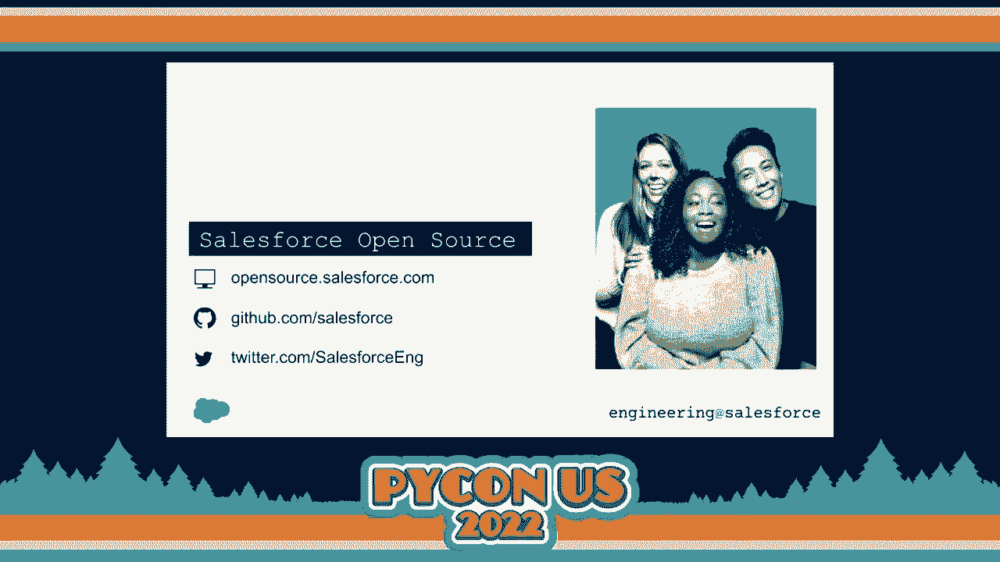
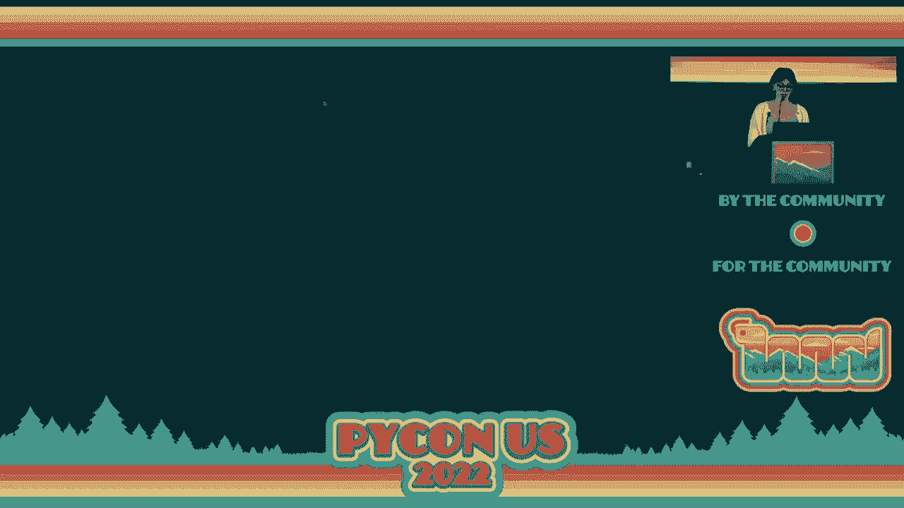
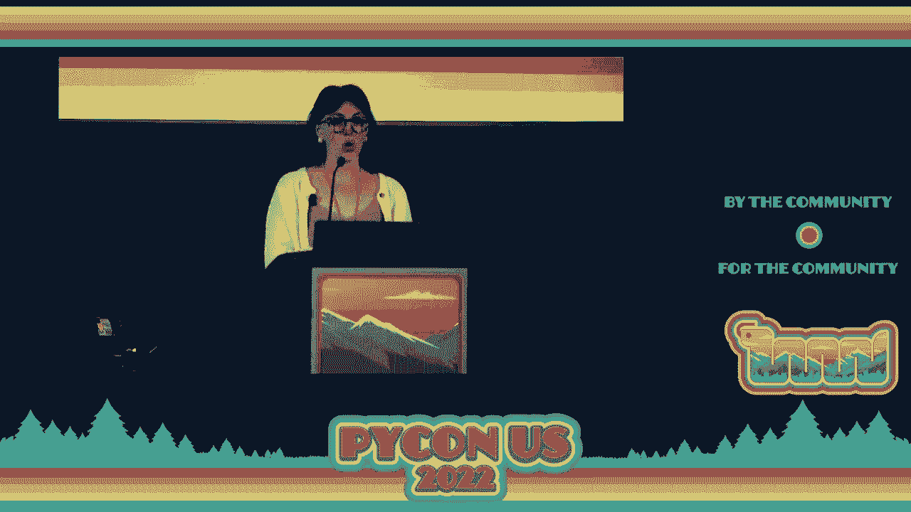
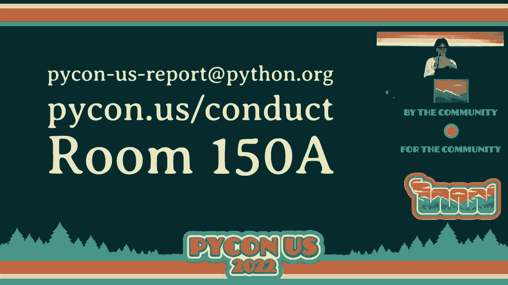

# P89：Welcome - Emily Morehouse - VikingDen7 - BV1f8411Y7cP

 All right， everyone。 Welcome to PyCon 2022。

 So it has been three years since we are all last in person together。 I spend a lot of time sort of trying to imagine what it would feel like being back here in。 person and I can tell you that anything that I imagined has paled in comparison to what。 it's like to be back。 And so a lot of it has happened since 2019。 I think we all know this。

 We've gone through things that we never could have foreseen and in a weird way life sort。 of continued on throughout the pandemic。

 We've all had losses and struggles and I was first invited to chair PyCon back in 2018。 And so typically when you chair PyCon you co-chair for a year and then chair for two years。 And I remember having a conversation back in 2018 with E who was the conference chair at。 the time and I was like， I just don't know where I'll be in that many years。

 And I just could not have possibly imagined the things that this would have thrown at。 us throughout the pandemic。 And so one of the most valuable things about our community is how accepting we are。 And you see this in occurrences like this。 We were able to shift online and find other ways to still try to connect as a community。 How willing we were to come in with an open mind and creative solutions。

 But none of that could really compare to what it would be like back in person。 And so in the last three years things sort of passed in this weird time vortex。 So much has changed yet here we are again。 Like nothing's changed。 And so I'll see friends that I've known for years or people that I've exclusively met over。

 Zoom calls。 And it's like we just saw each other yesterday。 And that is what I think makes our community so unique。 And so with that， I'm Emily Morehouse。 I'm honored to have served for the last three years as your steward of PyCon。 And I'm grateful from the bottom of my heart that I'm here with you in person today。

 So on behalf of the PyCon 2022 staff， I want to start by saying thanks。

 Thanks to all of the volunteers who make every facet of this conference possible。 To the PyCon Software Foundation， it's board and staff for taking on the management and。 fiscal responsibility of this conference。 To all of the sponsors who supported us through our time online and have come back to sponsor。 us in person。 To all of the presenters who come here to share their work。

 And to all of our attendees， both all of you in person and those who are watching this， live stream。 we would be nothing without you。 And so welcome to Salt Lake City。 I really hope that you all can take the time to sort of see the sights and experience what。 this awesome city has to offer。 There's definitely something for everyone。 Food。

 a bunch of outdoor things to do， hiking， museums， tons of beautiful churches。 And just a really great way， great transit system。 And I hope that you get to experience a little bit of something about the city outside of。 these conference walls。 So let's talk about what PyCon is。 This is your very first PyCon。

 Congratulations and I am sorry。 Because PyCon has grown to be such a giant event that we just can't give you an overview。 of every single event in this welcome。 So if this is your first PyCon。 I hope that you were able to attend the newcomer orientation， yesterday with Kojo Trey and Melanie。 But for those of you who didn't， we have these little green pins that some folks are。

 wearing on their badges that say ask me。 And so if you have any questions about the conference or how to get the most out of your。 experience here， find one of those people and I'm sure that they will be absolutely thrilled。 to tell you about all things PyCon。 So from a high level， PyCon is separated into three sections。 The first doesn't really matter because it's over but that was our first two tutorial days。

 So starting today， we have our three main conference days which will be followed by two。 days of sprints。 So zooming a little bit further， today and tomorrow。 your day will start with a keynote， or keynotes followed by talks for the bulk of the day and then we'll close out with lightning。 talks。 On Sunday， we've got a little bit of a different schedule。

 We're going to have a couple of panels and a keynote in the morning and then you're going。 to go right into the job fair and then we'll have a smaller bulk of afternoon talks followed。 by our closing keynote and PSF state of address。 So our keynotes， right after this。 we're going to have Wukash Langa。 Tomorrow， we will have Sarah Isawam and Peter Wang。

 Sunday will have the Python Steering Council and Sunday we will have Naomi Steder to close， us out。 But make sure you get here early on Sunday。 We will still start at 9am and we're going to have a special diversity inclusion workgroup。 panel at 9am。 Next to the talk today， before keynotes tomorrow morning and again tomorrow after talks and。 then Sunday morning before our keynote， you'll find our lightning talks。

 And so these are fascinating little events。 Definitely take a chance to come in and peek in if you can or if you're interested in giving。 a lightning talk， we will have a sign up for this。 It is something where you can talk about anything and everything as long as it adheres。 to our code of conduct。 It doesn't have to be Python related but certainly can be and it's just a great place。

 to share all those super weird little ideas or things that you learned last week that you。 would love to share with others。 So let's take a moment to sort of familiarize ourselves with the space that we are in because。 we have quite a large space and we are a little bit spread out with a couple of things。 So right now you are here in the grand ballroom which will host our plenary sessions over。

 the next three days。 To your right， my left， through these doors or out those doors and around the corner。 we， have our expo hall。 This is located in exhibit CD and E。 It should be super obvious we are sharing the space with another event。 So definitely take a look。 make sure that you are seeing Python related signs wherever， you are going。

 But all of our garage doors should be open to be very obvious where the expo hall is。 And this is really going to be the main hub of the conference and it contains tons of。 things so let's list at least most of them。 So all meals through Sunday will be served in the expo hall。 Please note that coffee and snacks that have happened during the breaks will be located。

 directly outside of the top rooms。 So don't think that you have to run back from a talk to the expo hall to grab a coffee。 in between。 They will be very closely located to you。 If you have indicated that you have any allergies or dietary restrictions on your registration。 make sure that you take a look for signs to direct you in that area。

 And if you ever have any concerns about ingredients or the food， please make sure that you find。 conference staff and ask them。 And also please take note and be aware of traffic patterns while you are in the expo。 hall。 We've tried to sort of facilitate a one way flow throughout a lot of the spaces。 Some areas will have arrows on the floor。 Please be aware of the ways that you're interacting with your fellow attendees as we are still。

 trying to maintain a decent amount of health and safety as much as possible。 You will also find all of the sponsor booths in the startup row in the expo hall。 Definitely check out our sponsors。 They are doing really cool things。 They put a lot of effort and money to put together really awesome booths and bring swag。

 for everyone。 And honestly these are just the people who have continued to invest in PyCon and in the。 PSF who have allowed us to continue to flourish over the last couple of years。 Alright and then the posters and job fair。 If you are looking for a job or interested in the posters。 this is when the expo hall will， actually transition over。

 So expo hall will be sponsors and booths Friday and Saturday and then it's going to transition。 overnight so when you come in Sunday morning it's going to be a whole new experience and。 we'll have all of our posters as well as the job fair。 Alright so talks are in three different areas of the conference space。

 So charlots will be on this floor in a room number that I can't read but there's another。 slide that has that room number on it。 Otherwise all of our talks will be on the second level or on the third level。 Again check out this PyCon sign。 They're going to be directing you which elevators and escalators to use and how to get to those。 spaces。 So this year we actually have five talk tracks on our first two days and four on the last。

 day with 92 sessions this year which is incredible because that's almost what we've had during。 our pre-pandemic in-person events。 But unless you have a time-turner you will only have 18 opportunities to see talks。 But don't worry most of the talks will be recorded and available online as soon as possible。 So definitely take this into account for how you are scheduling your time。

 Don't burn yourself out going to talks。 Make sure that you are taking time to one take care of yourself and to talk to other attendees。 at the conference。 We also have open spaces available so these are an incredible opportunity to meet with。 other attendees， share and learn and maybe find those people who have those funny little。 interests or topics that you also really really love。

 So you can organize your own or just attend someone else's。 So check out this URL， PyCon。us/os and there will be a recent-ish photo of the open spaces。 board but we sure to check out that board in person if you want to sign up for something。 it will be outside of the stack room in 150A。 And so PyCon has consumed the bulk of this conference center and so one of the best。

 unofficial events that PyCon and many other conferences have become known for is the hallway， track。 So again join a table， meet somebody new， open a laptop and work on a problem together， track。 down that person that you have been wanting to meet in person or that you haven't seen。 in years but you just want to say hi to。 And always keep in mind that when you are standing in a group of people always leave room for。

 one extra person to join。 This is a quote from air culture and it is a really excellent way to sort of model inclusiveness。 in our community。 So if you're standing in a group of people and somebody wanders up and says hey can I。 chat with y'all make sure that you introduce yourself， say hi and maybe ask them you know。 is this your first PyCon？ What are you excited about and just start up a conversation？

 Alright so more fun logistical things。 Okay so there are two gender neutral bathrooms throughout the conference center。 One is near the first aid room on this floor so it's just around the corner from the gendered。 bathrooms and then there is another one upstairs near room 255 near one of the top， rooms。 There are also mother's rooms while they are very poorly named。

 They are located at nearly every bathroom but please note that some are inside the women's。 restrooms， some are outside but they are indeed available to any lactating person。 They're equipped with a nice comfy chair， fridge and sink and if this applies to you。 come find me I'm a new mom and I would love to meet my fellow PyCon parents。

 Alright and then if you finally need to take a break focus on some quiet work or just breathe。 we do have a quiet room located in 151B so that's again just going to be a little bit。 down that hallway on your right hand side down one of the smaller hallways on the right。 There's a sign out front so if you need to take a break just breathe please make sure。

 that you are taking into account the rules of this room。 Please don't listen to music。 play videos on your laptop， take phone calls， etc。 This is really supposed to be a quiet space for people to take a step back and recharge。 on their own。 Feel free to use headphones but please be mindful of the other people who might be using。

 that space with you。 Alright so one of our favorite events is the Pylades Auction。 That will be taking place tomorrow night at 6。30pm at the Marriott that is right across， the street。 Don't go to the one that's 15 minutes away， you don't have to go that far。 Please make sure you're going to the correct Marriott but it is directly across the street。

 from the conference center。 It's a ton of fun， you get to bid on a bunch of items， have some food。 hang out with people， it is often a really good time with lots of numbers being spewed at you and people throwing。 money at a really excellent cause。 This event is currently sold out so if you have a ticket and you aren't planning on attending。 please consider giving it to somebody else to make sure that we can use up all of those， tickets。

 It helps reduce our food waste and ensures that we can keep this event very lively。 Okay we're getting there。 Alright so there's tons going on at PyCon this year as you can tell。 Our mobile applications for guidebook is the absolute best place for you to find our up-to-date。 information for the conference， you map to the venue， create your own schedule， have access。

 to all of this information offline in your pocket。 So definitely download the guidebook app。 you can get it really easily at PyCon。us/guidebook。 or there's additional information on installing and getting access on the PyCon website。 Alright so I've mentioned a few times the PyCon software foundation that takes on the。

 financial responsibility of running this conference。 We would not be here without the work of our PSF board and staff so if you are able to or。 your company is able to please consider donating， you can navigate to this URL and get access。 to the PSF sponsors of page。 We also have our swag pickup。

 I noticed that some people are already out there grabbing， their swag。 This year we do just have stickers and anyone who ordered a t-shirt ahead of time， those。 are available to pick up currently。 We will have a limited number of t-shirts available for sale tomorrow afternoon around。 1pm but if you want to purchase a shirt and you haven't already， you will have a t-shirt。

 and you will have to wait until tomorrow to do so。 We also have a small locations change。 The charlots track is no longer in 253 A and B， it is now in 151 DEF and G。 This has been。 updated everywhere that you will find your information。 The PyCon site。 guidebook and signage have all been updated but we wanted to call this。

 out to make sure that you are going to the proper location。 Also if you are taking photos of the event， please be aware that any attendees with yellow。 dots on their badges have opted out of photos。 So please take care not to post any photos for anyone who might have these dots on your。 badges。 Additionally， if you want to opt out of photos and you haven't gotten these yet， they are。

 available at the registration desk。 And finally， if there's anything that you need。 you can tweet at the conference or at， staff@pycon on Twitter。 We are monitoring that account pretty closely and then if you want to post about the conference。 please use the hashtag #pyconus2022。 And now one of the most important things for us to discuss today is health and safety。

 Oh， and apparently my notes for health and safety are gone so that's not the best thing。

 to happen。 Give me one second because I do want to make sure that I have this as close as possible。 Okay， so we'll go back to slides a minute。 We wanted to say that we are incredibly grateful to how positive the response has been to all。 of the health and safety policies that we put in place and how strict our measures have。 been to ensure that PyCon US can occur in the safest way possible。

 And so I need to remind everyone that masks are only to be removed while actively eating。 or drinking or if you are a speaker who is up at the podium speaking， please make sure。

 that you are putting your mask on right afterwards before you talk to any participants who might。 have questions for you。 But this is really for us to make sure that we are participating in the safest way possible。 in protecting all of the individuals here。 There's just no way to know what somebody else has going on。 right？ There are a lot of folks who have small children who are immunocompromised or who have other。

 risks and one of the ways that they are able to be here attending and that they were able。 to balance that risk was this agreement that we all made to continue wearing masks。 So this is your verbal warning。 Monitoring starts now。 If you are spotted without a mask on。 a staff member will remind you to put it on and they。

 will have a small hole punch and they will put a small hole in your badge so that you。 know that you have been given your first strike。 Second strike is going to be a discussion with the staff。 If we catch you without a mask on for a second time， we're going to bring you into the staff。 office and have a conversation and make sure that it is very clear what the next strike。

 is and that is because your third strike means that you are going home for the rest of the。 conference。 We will gladly switch you over to an online ticket so that you can still participate and。 watch talks and whatnot。 However， we will not allow you back into the conference or for any of the outside ticket。 events for the conference。 All right。 And with that， very fun announcement。

 I also want to call out accessibility。 We will be providing live captioning for all of our talks this year。 Very similar to what you see to my -- oh， I actually can't see them。 I think they're on -- I hope that we have captioning on this。 Maybe we don't。 Oh， thanks。 Hey。 look at that。 So we do have captioning。 So additionally。

 each space will have reserved seating for wheelchair access。 It will be noted on the floors。 It's generally going to be towards the center of the room。 And as well。 the conference is ADA compliant。 However， if you have any concerns or need any additional support。 please let a staff， member know。 We also want to say a huge thanks to our captioning sponsors， meta。

 red hat， coiled， tide lift， source craft， cuddle soft and launched darkly。 These are all folks who have supported the funds to have captioning， not only for all。 of our plenaries， but also all five of our track rooms， which is incredible。 And so our last and also very important item is PyCon's code of conduct。

 So we are deeply committed to providing safe environment and a positive experience for。 everyone here。 In order to ensure this， everyone here， all staff， attendees， speakers， sponsors。 volunteers， anyone who is here that is related to this PyCon event are required to adhere to our。 code of conduct。 Absolutely。 No one is an exception。 No one is above the law。 So no harassment。

 whether verbal or physical or discrimination will be tolerated。 Every person here will be provided with a harassment free experience， regardless of gender， gender。 identity， expression， age， sexual orientation， disability， neurotype， physical appearance。 body size， race or religion or lack thereof。 We take this incredibly seriously and want to make sure that everyone here can have a safe。

 as an experience as possible。 So you can read more in the code of conduct as well as the link procedures for how we approach。 handling incidents and what our responses are going to look like， as well as what enforcement。 looks like。 So you can find all of these documents at the URL on our screen or at the PyCon website。 on about/code of conduct。 So if you believe somebody has violated the code of conduct。

 you are encouraged to report， it regardless of the severity。 At any point you can make a report by emailing， PyCon-US-report@pyCon。org or during the conference。 you can come by the staff room and that's in 150A and we will make sure that we find the。

 right person for you to talk to。