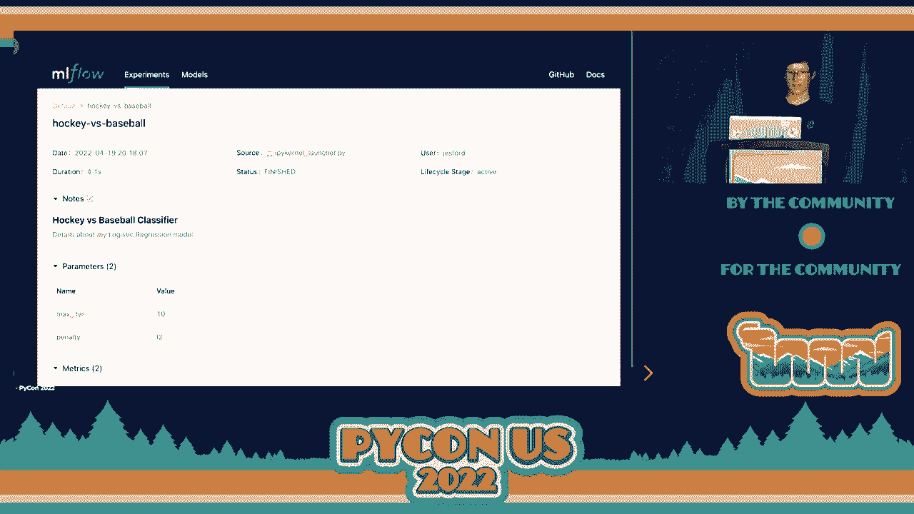
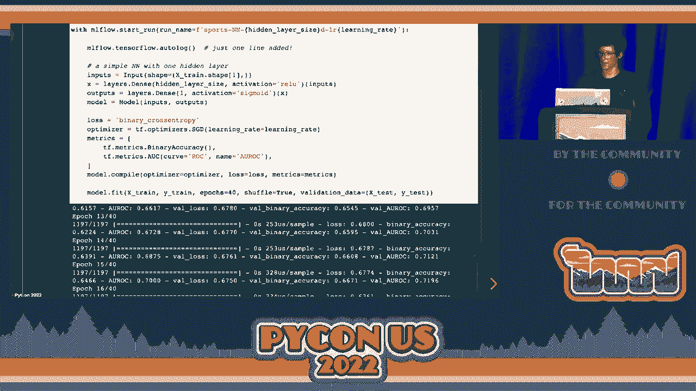
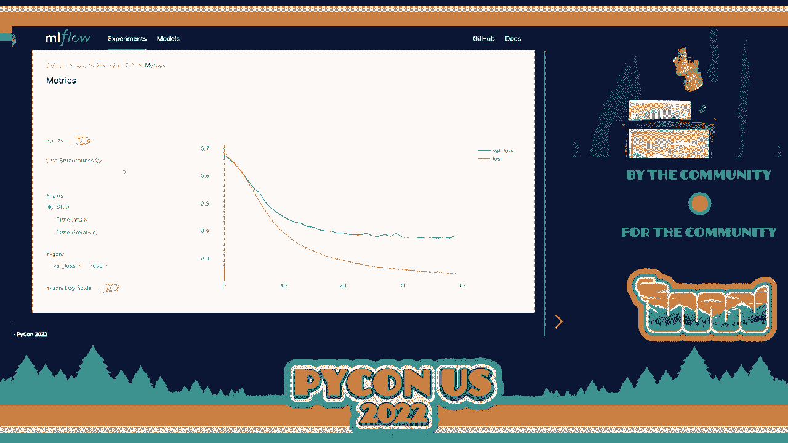
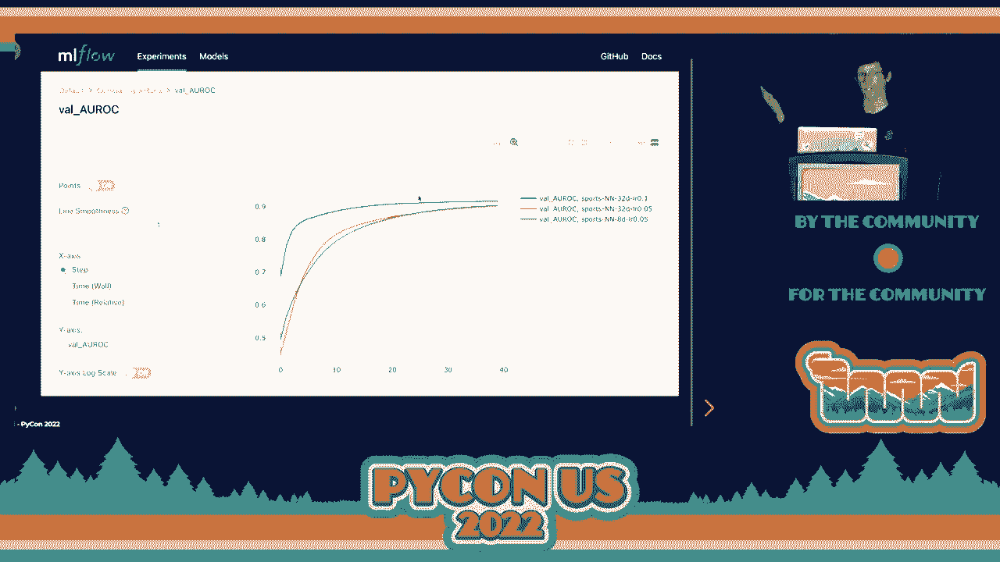

# PyCon US 2022 - P43：Talk - Jes Ford_ The Model Review_ improving transparency, reproducibility, & kn - VikingDen7 - BV1f8411Y7cP

 Hello everyone， welcome back。 We have last talk of the day by just fold on the model review。

 improving transparency， reproducibility and knowledge sharing using ML flow。 Over to you， Jay。

 All right。 Thanks everyone for being here。 I know it's not like the first time somebody， is subbed。

 but I'm so excited to be here in person。 So thanks for coming out to the last， session of the day。

 I'll be talking about the model review with ML flow。 To introduce， myself， I'm Jess。

 I am a snowboarder first and foremost。 That's the reason I'm currently。

 living here in Salt Lake City。 It's the reason I did my PhD up in Vancouver， Canada， and。

 pretty much every other major life decision that I've made。 I'm currently working as a。

 machine learning engineer at Cash App， which is a part of block， which you might know by。

 the former name square。 My team works on natural language understanding applications in the。

 customer support space。 And today， I'm going to tell you why my team decided to adopt a。

 process for a model review。 I'll explain what that means and introduce the primary tool that。

 we're using for review， which is ML flow。 The bulk of this talk will be an intro to ML flow。

 tracking。 And then I'll wrap up by explaining how ML flow is allowing us to solve some of。

 these problems that I'm going to get into。 All right。 So when I joined Cash App about。

 a year and a half ago， our team had recently doubled in size， and we were increasingly deploying。

 more and more models。 But we didn't have any great record keeping on exactly what was。

 in production， how those models had been trained， or just kind of generally what tricks or modeling。

 approaches were working well in our space。 So what if a model needed to be retrained？

 A new team member joined and wanted to build off work that somebody else had done。 And。

 what was the precision supposed to be on that model before we deployed it？ So the answer。

 to questions like this would be like， let me see if I can find that notebook。 And you， know。

 people are pretty good about keeping track of their notebooks that they had used。

 and maybe checking them into GitHub。 But as you can imagine， this is like not a robust。

 or certainly foolproof way to be keeping track of this kind of stuff。 So we decided that we。

 needed -- we needed to set some goals for like what a new process might look like for， us。

 Number one， we wanted more transparency， some kind of record keeping of exactly what。

 we were deploying。 We wanted some reproducibility of past experiments that had been done， ease。

 of building off of them by other people on the team or even the same person later on。

 And we wanted a format for knowledge sharing so we could actually learn from each other。

 and get new people on the team up to speed much quicker。 And on top of all of this， we。

 didn't want to add a bunch of manual work to all the other things we needed to do。 So。

 we wanted to -- whatever we were going to adopt， we wanted to be able to automate as。

 much of this stuff as we could。 So there's like a comparison here。 I'm talking about a。

 model review。 There's obviously a thing called a code review。 We review code to get more。

 eyes on codes， pot bugs， other issues before we deploy。 Pull requests create like a nice。

 record of commits to your software and ideally also some documentation about decisions that。

 you made or trade offs that you considered in your design。 And they give us this nice。

 opportunity for learning from each other。 When you're reviewing someone else's code or getting。

 a review from someone else on your team， this is like a great opportunity to learn from， each other。

 So there's some parallels here。 And there's some similarities between a code。

 and a model review in that there's some code。 You've written some training script or maybe。

 a Jupyter notebook where you've defined some code that trains your model。 But that's kind。

 of where the similarities end because for a machine learning model， there's a whole bunch。

 of other contexts that's important beyond just like the Python code that you wrote that trains。

 the thing。 So namely， what was the model performance？ You know how well did it do on， your test set。

 That's not obviously hard coded in your trading script。 What data did。

 you use and what did you do to it？ You might be able to get some of that from your trading。

 script but there might be some additional context there。 And then there's like this whole process。

 thing， right？ All the things you tried that didn't really work before you got to this。

 final model that you like think is really great and you want to deploy。 So you know。

 for all these reasons， we can't really review a model just by looking at the code。 So it。

 goes beyond just a code review。 And so this led us to to MLflow， which is an open source。

 platform for managing the end-to-end machine learning life cycle is what it says in their， test。

 And MLflow has a few separate components under it。 So there is the tracking which is。

 useful for keeping records of your machine learning experiments。 There's the projects。

 piece which is a special way to format your code that makes it easy to reproduce runs。

 And there's a models piece that's a special MLflow way to save your model that makes it。

 easy to deploy in different deployment situations。 There's also a fourth piece that's kind of。

 newer that's the model registry that lets you manage the model life cycle。 So MLflow。

 was really nice because it's pretty language and library agnostic。 It's not like tied to。

 TensorFlow or any other specific machine learning library。 And it's got API for different languages。

 I'll be using Python here， but it's pretty flexible for different use cases。 And in this， talk。

 I'm going to be focusing specifically on the MLflow tracking piece of MLflow。 So。

 tracking lets you easily log pretty much anything that you'd like to keep track of。 So。

 in the context of machine learning， this is probably your parameters， the metrics that。

 you care about。 You can track arbitrary things like plots or text files or Jupyter notebooks。

 which are all random files like that would be considered artifacts in MLflow。 You might。

 want to track the versions of code that you're running and the training data that you used。

 So you can pip install MLflow to get started。 And I'm going to work through a few examples。

 starting super small。 So here I'm going to import MLflow and I'm going to log a parameter。

 and a metric。 So parameters and metrics are both key value pairs where the value is numeric。

 and the key is any arbitrary string。 So you can name your parameters and metrics anything， you like。

 And the first time I log something， what's called an MLflow run will be started， automatically。

 And I'll show you examples in a moment of what that looks like。 But you。

 can think of a run as a group of things that are logged together that makes sense as a， group。

 And then I'm going to end my run to end that group of things。 A slightly more。

 step up from that would be I'm going to， in this example， I'm going to start my run explicitly。

 So in the rest of the examples I'll be using this context manager framework。 So MLflow， start run。

 I can actually give my run a nice useful name that I can refer to later。 And。

 then just like in the previous example， I'm going to log a parameter and a metric。 And。

 then I'm also going to log an artifact。 So this will be， I'm just going to create and。

 write to just a silly little like one line file here。 And then I can log it using log。

 artifact and giving it the path to my file。 Okay， so I'm logging some things。 Where do。

 these go and how is that useful？ If you have MLflow installed， you can just run MLflow UI。

 in your terminal。 And this is going to spin up a little server for you。 So we can go to。

 that URL that's shown there in the output。 And you would see something that looks like， this。

 So this is the default MLflow experiments page。 And what this gives you is a table of。

 all of the MLflow runs that you have run。 So at this point， we've got two rows in this。

 table for the first thing we ran that we didn't explicitly name。 And then this last run where。

 we named it log artifacts。 And you can see here there's the metrics and the parameters。

 are kind of shown here at this high level view。 And we can click into one of these。 So I'm。

 going to click into this log artifacts example and go to the run page。 So here we've got our。

 log artifacts run and there's some metadata up top。 So we've got the date that this was， ran。

 how long it took， a few other details。 And then scrolling down we have a section。

 for all of the parameters and all of the metrics that I logged in this case。 Down under artifacts。

 we've got our text file。 And so I can actually click on that and see it rendered for me nicely。

 in the browser which can be kind of helpful。 You'll also see here that MLflow is telling。

 me the actual path location of this artifact。 So when I ran this， I was working in this MLflow。

 tutorial directory on my laptop and my home directory。 And an ML runs folder was created。

 there which is where all of this stuff is being logged by default。 So by default， if we don't。

 do any fancy setup， we're just writing things to our local machine。 And so this works well。

 if you are working by yourself， you want to just get up and running quickly。 But if you're。

 wanting to share links to your runs with your teammates or maybe to have everyone write to。

 the same experiment so you can compare different models like in a leaderboard kind of thing。

 you'd want to set up probably a remote tracking server。 And then everyone can be logging to。

 that location and there's different kinds of back end setups that you can make there。

 So these are just a couple of like many different configurations that are shown on the MLflow。

 docs page。 So okay， so that's where we're writing to a place。 How can we access that？

 I showed you already the MLflow tracking UI and that's what I'm going to use throughout。

 examples in this talk because it makes nice visuals and it's super handy。 But you can also。

 access all this data programmatically。 So there's an API that lets you pull back results。

 from your runs。 Alright， so nothing so far has been machine learning specific。 You could。

 use MLflow tracking to log whatever you like。 But I work on machine learning so we're going。

 to do a machine learning example。 So in the rest of these examples， I'll be using this。

 data set called the 20 news group data set。 It's one that you can get through SK learn。

 It's a whole bunch of text documents discussing different topics and I'm just going to use。

 two of those topics and we're going to be building binary classifiers to distinguish between。

 text that is about baseball versus hockey。 In the interest of time， I'm not going to。

 go through the steps of loading that data up and transforming it。 But I'll share links， to these。

 this notebook if you're interested in how that's done。 Alright， so this example。

 looks a little longer。 But most of it is just standard， side kit learn stuff。 So let me。

 walk through what's important here。 So like in the previous example， I'm starting my run。

 with the context manager and I'm going to name this hockey versus baseball because that's。

 what we're going to train a model to distinguish between。 This top section， I am instantiating。

 and fitting a simple logistic regression classifier that I'm going to get predictions。

 for my train and my test set。 And I'm going to make a plot。 So I'm going to plot the precision。

 recall and I'm just going to save that as a PNG file。 So all of that was just normal。

 SK learn stuff。 Now we're going to track things。 So here are all the MLflow commands that I， ran。

 So I'm going to log the parameters that I passed to the model。 I'm going to log metrics。

 for the training and validation accuracy。 And then I'm going to log that， that plot that。

 I made as well as this notebook itself that I'm running the code from。 So those can both。

 be done with log artifact。 And then of course I probably want to track that trained model。

 So that's the final line here。 So let's jump over to the MLflow UI and see what that looks， like。

 So here's our run page for hockey versus baseball。 I've got my parameters。 I've got， metrics。

 And then scrolling down， I have the Jupiter notebook that I ran this from。 I've， got my plot。

 which if I click on it gets rendered for me in the browser， which is handy。 And。

 then I have the model。 So there's a folder here。 If I click into that folder， this is。

 the standard structure that you would see for MLflow models。 So I've got the model itself。

 which for scikit-learn is this model。pickle file。 I've got a conda。yaml and a requirements。text。

 And those can be used to recreate the actual environment that I train this model in。 And。

 then there's this ML model file。 That's a special MLflow thing that specifies the types of flavors。

 that this model is available in。 So this model is available in the scikit-learn flavor。 But。

 all models in MLflow are also available as a Python flavor。 And I'm not going to get。

 too much into MLflow models in this talk， but I did kind of want to highlight this because。

 the MLflow UI gives you this really handy little snippet here automatically that shows。

 you how you could load up your model just from knowing the run ID and run inference using。

 a built-in Python function in MLflow。 So it gives you little snippets here of how you。

 could run inference on a Spark or a Pandas data frame。 So that's pretty cool， I think。 All right。

 Scrolling back up to the top of that run， I did want to give a quick shout out。

 to this notes section。 The notes section lets you write arbitrary markdown and then have。

 that nicely rendered in the UI。 So this is a great place to record any extra context。

 Notes to yourself， things that weren't recorded automatically but are helpful。 Okay。 So moving。

 on to auto logging。 So in this last example with this machine learning model， we trained。

 a model and then we manually MLflow tracked each of the things we wanted。 So we tracked。

 the parameters， we tracked the some metrics that we defined， we tracked the plot， but we。

 had to add lines for all of that。 MLflow has this kind of newer thing called auto logging。

 which is super powerful。 And basically it allows you to use a single line of code to。

 automatically track a whole bunch of useful stuff relevant to the model that you're training。

 So supported for all the types of libraries that I've used for modeling and a whole， bunch more。

 So check out the doc。 If you don't see your favorite one here。 But let's see what， that looks like。

 So for another scikit learn example and going super minimal here， I'm。

 going to import and train a random forest classifier。 So here I'm just adding a single。

 line of code。 MLflow， SKlearn， auto log and then I fit the model and that's it。 So starting。

 super basic， let's see what's available to us from that one line in the UI。 So I didn't。

 name this run。 I get some kind of default run name up top。 But take a look at all of。

 the things that get recorded for me automatically。 So first of all， this was a random forest model。

 I pretty much went with the defaults。 I set like the number of trees。 But all of the things。

 I could have set are being recorded for me。 So if I went back and trained another model。

 I would still have the comparison here for all of the settings that existed。 I also get。

 a bunch of metrics for free。 So out of the box， I didn't specify any but I get accuracy， F1。

 precision recall， some others。 And then of course， I get my model。 That's important。

 And I get some plots for free。 So I get a confusion matrix， precision recall curve and。

 the ROC curve。 So that all comes for free with that one line。 Let's look at a second example。

 So this time， we'll do a TensorFlow Keras example。 So it's going to look a little bit。

 longer here。 But the main takeaway is that we've really just got the context manager。

 here to start our run。 And then we just have this one line of auto logging。 I'm going to。

 name my run sports neural net。 And then I'll parameterize the name with a couple of parameters。

 that I'm going to use in my model。 So this is just -- all the rest of this is a boilerplate。

 TensorFlow。 So I'm just defining a really simple dense neural network with one hidden。

 layer of arbitrary size。 And then I set a few things that I need like a loss and an optimizer。

 matrix。 I'm going to track accuracy and the area under the ROC curve。 And then I just。

 compile and fit my model for -- I'll train it for 40， 40 epochs。 And so TensorFlow does， its thing。

 It spits out all its training logs。 And when it's done， we can jump back over to。

 the MLflow tracking UI and see what we get。 So here is my sports neural net， 32 dimension。

 and a rate point one model。 And again， similar to SK learn but different parameters here。

 all of the things I could have set on this TensorFlow model are getting recorded for， me。

 And I get my area under the ROC curve and my accuracy as well as the loss on the。

 training and the validation data。 Down under artifacts now， for a TensorFlow model， I'm。

 going to get this model summary。text。 So if you worked with TensorFlow， you've probably。

 seen the model summary you can print is like a nice text description of your model。 We。

 get TensorBoard logs for free。 That's pretty cool。 And then we get the model。 And so this。

 looks a little bit more complicated because the TensorFlow saved model format involves。

 more stuff than the Sike it learned example I showed previously。 But the basic structure。

 here is the same。 We've got the actual model。 We have an ML model file specifying MLflow， flavors。

 And then we have these files that are related to the environment that we're running， in。 All right。

 And you might have noticed that the metrics on these run pages look like， links。 And they are。

 So if I click on one of these links， I would be taken to a metrics， page。

 So here I can select whatever metrics I like for the Y access and plot them as a。

 function of training step or of time。 And I get these nice training curves。 So this is。

 like a TensorBoard style view that just kind of comes for free in the MLflow UI。 And I。

 think is super handy for the work that I do。 Okay。 So everything so far， we've been looking。

 at one MLflow run at a time， which is cool。 But things become really powerful and we want。

 to compare different models。 So let's see how we can do that。 That last example I showed。

 with the sports neural net。 I trained a few different variations of that。 So here in my， table。

 I've got six different MLflow runs with different hidden dimension sizes and。

 different learning rates。 And this gives me like a leaderboard style view where I can， sort。

 So if I care about accuracy， I could do a descending sort on this column。 And I。

 see like my top model on top。 And maybe I want to compare， you know， what was the difference。

 between these top few models。 I can check these boxes and hit the compare button。 And。

 this takes me to a view where I have a column for each of those three runs I'm comparing。

 And I can scroll through the parameters and the metrics。 And the flow really nicely just。

 highlights for me when things are different。 So I actually don't have to read super carefully。

 to see what the difference was。 And if I click into one of these metrics links here， I'll。

 be taken to a view that looks similar to what I just showed。 But now instead of comparing。

 multiple metrics for one model， I'm comparing one metric across several different models。

 So here I can see that my， the blue line， the model with the higher learning rate converged。

 a bit faster than the other models。 All right。 So that is the kind of end of the little intro。

 to ML flow。 Now I'm going to talk about how we're actually using ML flow in a model review， process。

 So step one for us was to create and maintain some common training infrastructure。

 So some code that our whole team can use when we're training models that's flexible enough。

 for different use cases and works for most of our problems。 Once we have that， we can embed。

 ML flow tracking throughout that。 And this is important because we don't want to have。

 to remember to add some ML flow tracking commands。 We don't want to be thinking all。

 the time about what's important to track。 We want this to be taken care of automatically。

 And so that's what we do。 This just lives in our code。 And anytime we train a model。

 we just get all of this stuff recorded。 So we track our training parameters， including。

 a pointer to the data set that we're using。 We track our metrics that our team cares about。

 Our environment。 For us， that's our Docker image， the version of code that we're using。

 and the actual training script or the notebook that we're running from。 And of course， we。

 save our trained model as well as a few artifacts that we need for deployment on our infrastructure。

 And then there are some kind of custom plots and analyses that we like to do in our team。

 that help us understand maybe some caveats or things to think about with our model or just。

 for debugging purposes as we're iterating。 We use that note section I mentioned for context。

 So it's great that we're tracking all these parameters and other things automatically。

 but there's always other stuff。 There's always other things that you want to make a note of。

 And so in particular， we write it up a little bit about what the business problem is that。

 we're solving， maybe some notes about things that we tried that didn't work。 And basically。

 anything that you can think of that would be useful to you if you were to return to this。

 model in like a month or a year when you don't remember everything or for someone else on。

 your team。 So we follow those steps when we have a model that we like。 And then before。

 we deploy it， we require a model review。 So for us， this looks like sharing a link to the。

 MLflow run with everyone else on the team。 We select a couple of reviewers from the team。

 whose job it is to kind of read through that pretty carefully， look at the code that's associated。

 with it， and then attend a 30 minute meeting to discuss， ask questions， maybe make suggestions。

 things like that。 So circling back to the goals that we had for model review， transparency。

 We're achieving this by having shareable links to basically all of the details of a model。

 that we trained。 Reproducibility is greatly improved because now we're recording everything。

 that we need to actually recreate a training run or to build off a model that some of their。

 team member trained。 Knowledge sharing。 This happens both through this review process， but。

 also just generally it's super nice to be able to send a link to an MLflow run to your。

 colleague just to kind of discuss things that you're working on。 And MLflow is really。

 helpful for this because it consolidates all these details about the model in one place。

 So in summary， MLflow is a really lightweight and powerful way to track machine learning。

 experiments。 If you're just getting started， auto logging， just like a one liner in your。

 code can get you a really， really long way。 I only talked about MLflow tracking， but you。

 should also check out MLflow projects， models and model registry， which are pretty cool。

 My team is using MLflow tracking to automatically keep records of everything that we train and。

 review models before we deploy them。 And this review process that I've described， this is。

 a total work in process。 This is evolving。 If any of you have different or similar processes。

 in place to achieve these kinds of goals， I would really love to talk to you。 So please。

 find me afterwards。 I want to hear how other people are managing this kind of thing。 Yeah。

 this presentation is a Jupyter Notebook。 It's on GitHub at that link。 If you think that， sounds fun。

 you want to use MLflow and train models and stuff like that。 My team in particular。

 is hiring for machine learning engineers。 Cash App in general is hiring all across the， place。

 growing pretty rapidly。 It's super fun place to work。 I'd recommend you apply。

 And then I guess questions will be outside。 But yeah， please come talk to me。 And thanks。

 for your time。 (applause)， [APPLAUSE]。

