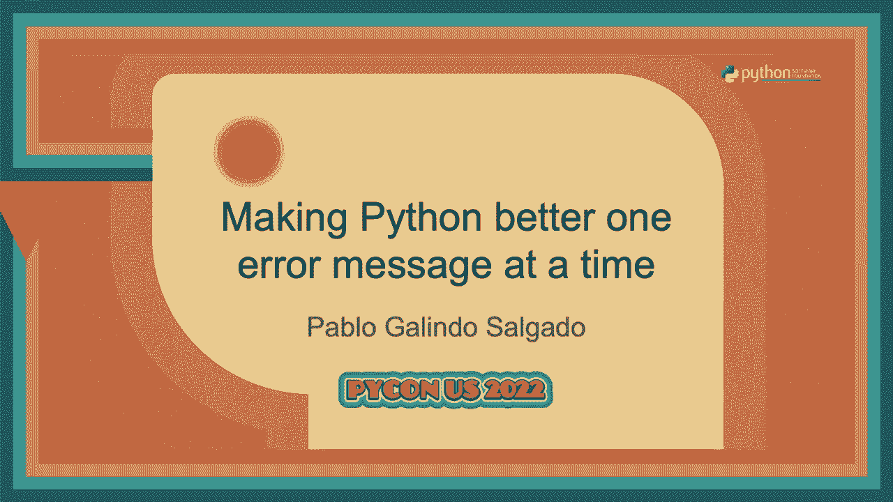
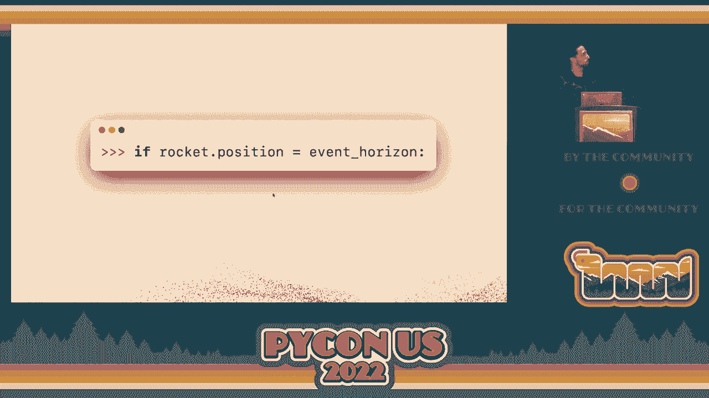
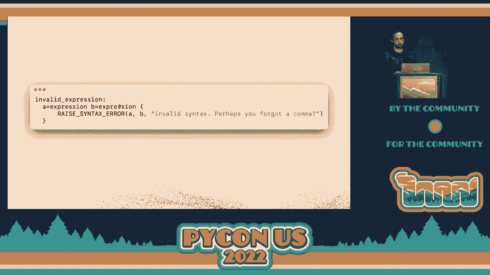
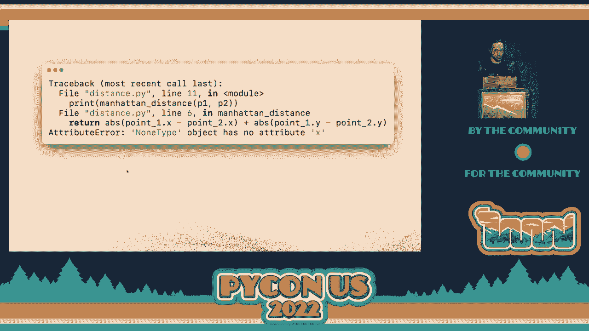
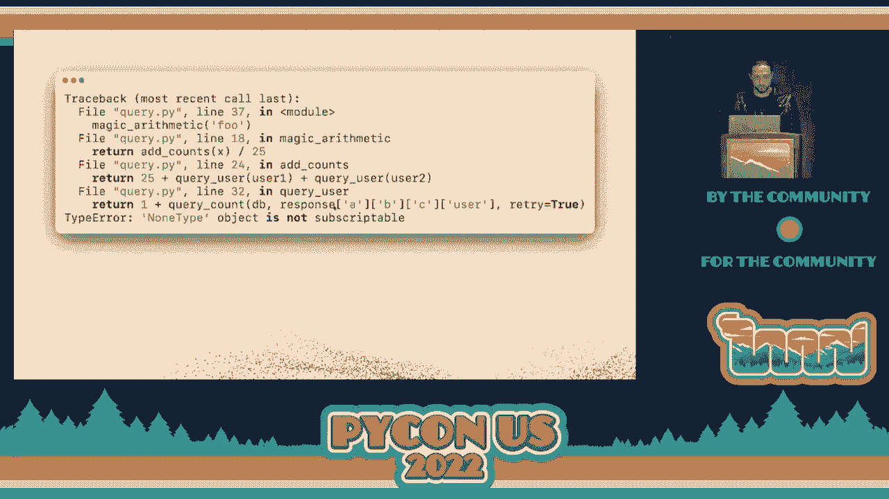
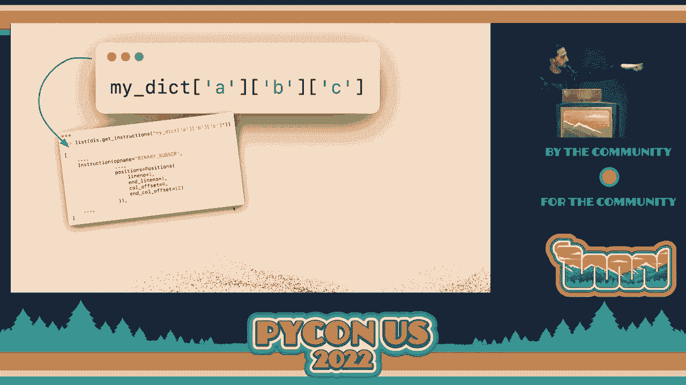

# PyCon US 2022 - P65：Talk - Pablo Galindo Salgado_ Making Python better one error message at a time - VikingDen7 - BV1f8411Y7cP

 Welcome everyone to our second session talk here in the session。

 And today， right now， we really have the privilege of having Pablo here who works at Bloomberg。

 but he also is a very active C Python core developer。

 And he has to tell us about improvements to error messages in Python。

 So please join me in welcoming him。 Hello， hello。 Well， I'm being told that I speak very fast。

 so buckle up because this is going to be a， right。 Awesome。 So who I am。 Well。

 thank you for the interaction， so I will keep this brief。 So I see Python core developer。

 I'm serving on this year Python machine council member。

 I'm also the 310 and 31 release manager and also I work at Bloomberg。 But this is kind of boring。

 so let's talk about error messages， right？ Cool。 So let me， you know。

 all good talks start with a story， so let me tell you a story。 So before joining。

 I started doing computer science and engineering， I used to be a physicist。

 So I was doing my PhD and although I'm an theoretical physicist， something that you need。

 to do from time to time is that you need to do simulations。

 So at that time doing those simulations is when I start using Python。

 It was this day when some friend of mine that was also using Python also doing their PhD in。

 physics came to us， we were three in the room with one syntax error that they couldn't， figure out。

 And we spent 15 minutes trying to figure out what was the problem。 Think about that， right？

 Three physicists doing their PhD。 We had the tools to solve the most deep mysteries of the universe。

 but we couldn't solve a syntax， error。 Quite bad。 So， you know， syntax errors are important， right？

 Because like they impact developer time and other things。

 So let me give you a tour of how the syntax error were before Python threatened with like。

 a fancy image there。 Okay， so some of them， for example。

 this is the syntax error that I couldn't solve back， in the day。 What about that？

 What is wrong with that？ Interesting。 So let me give you some context。 Not the full program。

 but the program looked like this， right？ It was a bunch of things there。

 And does someone see the error？ So the error is equivalent to this， right？ You have a dictionary。

 you don't close the dictionary， and then you have a function definition。

 So the parser continues after the dictionary， the tool happened， but it's not end。

 And then it tries to -- finds the function and says， well， this function doesn't fit into。

 the dictionary。 And then it says， yeah， that is invalid syntax。 But if you just see the theme。

 it's kind of not good， right？ Like， it's quite bad。 So this is just one example。 But there is more。

 Like， for instance， what about this？ What is wrong with that？ Who knows what's wrong with that？

 The error is this one。 It's kind of not right。 You want to write a tuple there and then a generator comprehension。

 But it turns out that you need to parenthesize that tuple because otherwise the parser doesn't。

 understand what you're writing。 Not the best。

 What about this one？ You have a list。 You don't close the list。 And then you have a bunch of things。

 like， for instance， you are assigning here something， like that。 And the parser says， yeah。

 that equal -- I don't like that equal。 It's invalid syntax。 Or like， what about this？

 You have a nice dictionary。 So you map， like， core developers to their GitHub user names。

 And you forget that comma over there。

 And then the parser says， Google's Langa is an invalid syntax。 If you ask me， it's quite rude。 But。

 you know， not good。 What about this？ You try to do an exception handler。

 But with multiple exceptions， you forget the parenthesis around which you have to play， there。

 And it tells you that that is invalid syntax， which is quite confusing。

 Especially if you're not used to this syntax with multiple exceptions or if you are starting。

 to learn Python。 What about this？ You are writing a dictionary and then you -- I don't know。

 You freak out and don't put the value here or something like that。

 And then you close it and it tells you that， yeah， that bracket， no， good。 So invalid syntax。

 And this is the worst one of all。 Like， raise your hand if you have found this thing a single time。

 Yeah， yeah， I thought about that。 So this is like -- especially， like， you know， like， EOF。 Like。

 you know， how many times you have explained to someone what EOF means。 Yeah。

 So the idea here is that， you know， in the previous version， we look at these things and。

 then we say， look， the reason this word here is not because we are， like， lazy or something。

 like that。 It's because writing these things and integrating these things on the machinery of a big language。

 like Python， it turns out that it's quite hard。 But it turns out that now after Python 3。9。

 we have a new parser。 So I will talk about that in a second。

 And this parser has allowed us to start thinking about， like， how can we solve these things？ Like。

 can we improve the experience of people writing Python that make error messages， like。

 they make syntax errors and they don't know what they are -- what they mean when they get。

 their own messages。 And this is quite important because many people think that this is crucial for people learning。

 the language。 But it turns out that I have a plenty of experience using this and I have been extremely happy。

 that I have fixed many of these error messages since I did。 So， you know。

 it's also important for people that are experienced。 So let's cover， like。

 how we fix these errors using the new back parsers。 Many of you may not know about these things。

 so let me introduce about the back parser。 So the back parser is something that we did with the Sandre Sanjido on PEP 617。

 And basically， we did replace the parsing in C Python， which originally was introduced。

 in 1990 -- one of the first comments of Python from Gido， this is the old parser。

 And the new back parser was made 30 years after。 So， you know， like。

 the old parser was a very resilient piece of technology， but， you know。

 we thought that we needed a new parser because there was a bunch of things that we couldn't。

 do with the old one， apart from maintainers-related topics and other things。

 So things that we can now do with the new parser are things like parenthesized context， managers。

 which for technical reasons that I know going to go into detail， we couldn't。

 do this much better because now you can put this kind of like， you know， open parenthesis。

 and the surface over there。 And also， like， for instance， match statements。

 We like match statements。 Yeah， I thought， yeah， they are cool。 You can match all the things。

 So this is only possible with the new parser， which is great。 But there is a problem。

 Many people see these things and they are quite angry because they think that the new。

 back parsers is slightly level， right？ Because now we have a lot of darkness and horrible conclusions because now the back parser。

 actually allows us to do super funky syntax and whatnot。

 But one you can convince you that the new back parsers is actually quite helpful because， you know。

 yes， allow us to do things that you may not know， may like or not may like。

 but those were possible anyway and we have a process to improve Python syntax and that's。

 not the back parsers fault， right？ Like， you know， if you have a knife。

 the knife can serve multiple purposes。 I will lead you to your imagination what you can do with a knife。

 But the idea here is that the back parser now finally allows us to do these newer messages。

 which is quite cool。 So let me convince you in case you have not seen them before。

 Let me show you some of the newer messages that we have in three times。 We have quite a lot of them。

 so I'm not going to cover a lot of them， but some of them。 So for instance。

 newer messages in Python three times。 So in mind that you have this conditional， right？

 And then you forget the colon over there， which is a common mistake for。

 especially for people learning the language。 So now we tell you the aspect of colon。 That's cool。

 right？ More things。 So for instance， now similar things that we have before。

 you're writing a dictionary， and you forget to write the value over there。

 And now when you do this thing， the parser says， I actually spread an expression after。

 the dictionary key and the colon， which is also quite cool。 This is quite common， apparently。 Many。

 many people were super happy when we saw this one。

 You are comparing something and then you forgot here that did you put a double equal。

 If you're writing C， this seems to be quite bad because you know you're assigning to whatever。

 you put on the left in Python is a syntax error。 And now we make you a suggestion that you say， oh。

 maybe you actually mean like two equals， or instead of the single equals。 More things， for instance。

 if you forget a comma in a dictionary， here is quite obvious。

 But like in mind that you have those big configuration dictionaries instead of the。

 type of py files or elsewhere。 And you forget a comma， which is quite common。

 So instead of getting Google cache language in valid syntax， you get this disorder that， tells you。

 oh， maybe you are forgetting a comma there。 This has saved me at least 10 times already。

 So for example， this one as well， if you are writing conditional or many other blocks and。

 then you don't indent correctly， now we tell you like， oh， we actually expected an index， block。

 And then we add that the indent block was after the if statement on line whatever。

 So you have the context， especially if you have the block after the if is quite big and。

 when you miss the indentation is quite far from where do you write the if。

 Now we tell you exactly what construct was wrong when you unindented the thing。 And of course。

 everyone's favorite。 When you don't close a dictionary and you have the function。 Now we tell you。

 hey， that bracket was not closed， which is very cool。

 This is probably one of the ones that people like the most because this is quite common。

 And the error is one of these， you know， unexpected in a file or your function definition is wrong。

 Cool。 So there's a bunch of them， which is nice， but turns out that adding error messages is。

 quite hard。 Let me show you some of the interesting stories that happen while we were developing error messages。

 So let's say， for instance， that you want to develop the following error message， like。

 the missing comma， right？ So for instance， you say like， I want this， right？

 Someone is writing a list and it's missing a comma between two elements。

 So there is no a comma there。 You want to write this thing。 So you are forgetting a comma。

 How do we do that？ Because you go to the grammar and then you need to teach the part of how the problem looks。

 like。 So here we don't forget if you don't understand the syntax。

 This is the back syntax。 But here we were saying that if you see an expression followed by another expression。

 then。

 you probably are missing a comma， right？ Like thinks about a variable， four。

 you are a variable or one plus one followed by three， or X or something like that。 In those cases。

 you know， that's in valid syntax， but that probably means that someone， is missing a comma， right？

 And then you're happy and then you say， okay， in that case， I need to raise this invalid， syntax。

 perhaps you're missing a comma and everything is good， right？ No， no， no， no， no， no， because like。

 what about this？ Now someone forgets the in keyword and it tells you that perhaps you're missing a comma。

 which is wrong。 What about this？ Someone writes about it in the stream prefix and now it tells you that you are missing。

 a comma， which is wrong。 What about this？ You don't close the the tuple here and then you put a B after that and it's looking at the。

 variable on the next line and the two on the previous line and it tells you that you're。

 missing a comma。 What about this？ This is quite bad， right？ Like， look at this。

 It turns out that I don't know what is wrong with this， but like apparently I'm missing a， comma。

 It's not good， right？ What about this？ You're writing a bunch of numbers。 I mean。

 that's how it's crazy， but like it's telling you， this is quite weird。

 It's telling you that you're missing a comma， but not at the beginning。 It's the last one， okay？

 So what about this？ It's a soft keyword and now when you do much foo。

 it's actually two names following together。 That's in my syntax and then it goes and tells you that you're missing a comma。

 So we broke my statement。 Sorry， Brian。 Not good， right？ Turns out that this is actually real。

 Here you can see all the peers that I fix when I introduce the machine comma thing。 Apparently。

 you know， knowing a lot of our parsers doesn't make you not fail about machine， commas。

 that's a quite hard thing to do。 What about this？ This is quite funny。

 So it turns out that our parser is a peck parser。 Turns out that by nature they run in exponential time。

 This means that when they are parsing your input， they take a time proportion exponential。

 to the number of characters that you input into the parser。 To avoid that。

 we have something called a packer parser which is basically introducing， memorization。

 It's a cache in a fancy way。 I'm not going to go into details。

 But the interesting thing is that once you put the cache into the thing， the parser runs。

 in linear time and it's very fast and everybody's happy。 But if you forget to put the cache。

 bad things can happen。 For example， this thing in Python 3。10 takes two seconds to parse。

 It's a syntax error。 So if you put a bunch of open brackets and then you put a column which is bad。

 but it， takes two seconds。 The parser takes two seconds to realize that this is invalid。

 If you add a bunch of brackets， it takes over an hour。 So this is fixed。 So don't worry about that。

 We fixed here。 You know， someone was very happy that we fixed that one。

 Probably they need to spare one hour after to know that the commit syntax error。

 But the reason is because you need to be very careful when you add error messages。

 The reason is because we have validated the real grammar of the language many， many， many， times。

 We know it's fast。 We know it works。 We are quite sure about what's going on。 That is great。

 But it turns out that adding error messages is a whole new word。 The reason is because the grammar。

 the parsers like to know about what is correct about your， language。 That's what they are made for。

 But now you are starting to use a parser into a word which is infinitely big。

 It's the word of things that are not Python。 And that is much， much more tricky。

 especially if you start using some of these invalid rules。

 from invalid rules and combining them with the real language。

 The problem is that validating that those things are correct and they don't raise weird。

 syntax errors in weird constructs like the comma that you saw before or for instance。

 these fancy brackets。 It's quite hard。 And it requires what we found is that it requires much more effort and much more validation。

 Since then we have made a lot of improvements to the parser and to the techniques we used。

 to validate these things。 But as you can see sometimes they just leap over and people may find out us in Twitter。

 So please don't make fun of us in Twitter。 You can use this as a timer。

 So you know if you measure your lunch and it takes an hour so you can put this thing。

 running and then come back when you finish。 Which is cool。 Okay。

 So these are the syntax errors which is great。 We solve a bunch of them and you can see all of the ones that we added in Python 3。

10， on the what's new document of Python 3。10。 But you can also see the ones that we have added in 3。

11 and we will add more in the future。 But we have even more things。

 For instance we have runtime suggestions。 So what are these things？ These are not syntax errors。

 These are errors that happen at runtime。 For example this one。 If now in Python 3。

10 if you do so in collections is the module collection so if you mistype。

 correctly some attributes of the module now we have we offer suggestions。

 So for instance if you say name tople which is not good。

 So now we told you like okay maybe you mean name tople。 And this works with everything。

 This works with modules， with custom classes， with things in the standard library， third， part。

 the module， everything。 And this is great。 We not only offer this thing on attribute access。

 we also offer this thing on name access。 So for instance here I'm assigning one variable to a Schwarzschild black hole。

 I pronounce it that correctly I hope so。

 And then you mistype this thing because it's very easy to mistype and then you get a correct。

 suggestion。 Believe me that is the correct version which is very cool。

 You know it's a small improvement but it turns out that it saves a lot of time especially。

 when you mistype a variable in a big big function because it immediately will tell you what's。

 going on。 And I have this is one of my favorites because since we added this one it has helped myself。

 even when we were developing this one so it's quite cool。

 But the question is like okay so how this are done because it's a very interesting like。

 the check of the array of errors right。 So let me explain to you how we did this one。

 It's very interesting。 The first thing is that now we have extended some exceptions in particular attribute error。

 exceptions with two things。 Now these exceptions in three times know the name of the attribute that you were trying。

 to access and the object in which you were trying to access。

 So if this was the collection module the object will be the collection module and the name。

 will be named top ball body written。 And this example will be X and something and then which is written there。

 I don't know why I don't bring my own slides。 But then this is an attribute that bubbles up and then we run a word distance function。

 This is a very simplified version that fits into slide。

 The one that we use is I don't know 200 lines of C code not really great for presentations。

 But the idea is that this is a very simple algorithm。

 It uses like some version of layman's thing distance to know which are the closest strings。

 to the one that we provide and then it will tell you okay so maybe you know these are。

 the ones that we think is the best much。 It looks at the deal of the object to distinguish which ones are the great。

 So basically the algorithm is that once you have this word instance function you do something。

 like okay so I'm going to use the function to know in the exception all the possible attributes。

 that are in the object and then I'm going to one by one check the word distance to that。

 one I'm going to pick the smaller one and that's probably the suggestion。

 We have a ton of extra checks here and there to make sure that we don't do weird things。

 with those but this is basically the algorithm。 But wait there is something。

 Think about this right attribute errors are raised all over the place。

 If we start doing this algorithm to check where the pro exceptions that are closer。

 and the names this is very very expensive so we don't do this thing on attribute errors。

 because it will make by so much lower right。 So what we do here and basically what I'm saying is that this thing needs to be fast。

 because if you catch the attribute error nobody will see those suggestions and we need to。

 make sure that this kind of code is still fast right。

 So what we do here this is you know this is SQL though freak out but I will explain。

 So what we do here in this SQL is basically that instead of doing this thing when you raise。

 the exception we do this thing on this fancy function that is called print exception so。

 we only do this thing with exception has bubble up to the top level and the interpreter is。

 going to crash already because nobody has cut to the exception。

 So when we are printing the trace back and you know all those messages because the interpreter。

 is going to finish then at that the step the last thing that we do is this print exception。

 suggestions which runs the function that I just saw to you and then it goes and it offers。

 you the suggestions that we just do so。 So basically that function over there which is very cool and so that way we keep Python。

 fast we only do this thing on when the interpreter is going to finalize and a code that runs normally。

 and catches exception keeps being fast。 This is just an example to show you that error message is quite hard because now you can。

 try to be nice to people but you need to make sure that like normal usage of the language。

 is still is fast and people don't pay the cost of good error messages in normal code。

 that doesn't raise error messages。 So more things that we have I'm very excited about this one so this is better trace back。

 on Python 3。11。 So let me show you what this is about。

 So this is PEP 657 that I did with a Maras Cara and Batu Chantascaya。

 It has this horrible name including fine grain errors location in trace back but I assured。

 you that the thing is actually much more great than the name that we place there and it looks。

 like this basically。 So if you before have like a bunch of errors this is a trace back for some code and here。

 it's telling you that in this long expression so absolute value of this error is non-type。

 object has no actual X。 It means that something in this long line is none but which one it is you don't know。

 You probably need to touch the bag and know what's going on there which is not cool but。

 now in Python 3。11 we saw you exactly which one of this is none which was this one which。

 is much more better we believe and we also saw you like in the this fancy underlying credits。

 in all the trace back。 This is also very useful when you do dictionary access so before for instance you are actually。

 in a big JSON some response and a bunch of things here and the error is non-type object。

 is not subscriptable which means that in this response some of these levels is none but you。

 don't know which one it is but now in 3。11 we told you which one is the one that is none。

 which is great much better and you know you can see also like in the trace back which part。

 of the function calls were running because for instance in this particular line here。

 you could could be this one over here we use one or this one here we use a two now you。

 know which one it is so now you don't need to touch the bag which we think is fantastic。

 So if you are doing like some heavy math super complicated this division thing is quite hardcore。

 but now it tells you division by zero which of those divisions are zero now in 3。11 we'll。

 tell you which one that one so that's great so how we do this thing so we do this thing。

 basically by injecting into every bytecode instruction extra information like for instance。

 you do this assemble that dictionary access you will see that is made of Python instructions。

 which is we call bytecode and what we do is that for to every of those instructions we。

 attach extra information you can actually check this extra information using this module。

 and it will tell you that for every for instance this binary subscript one of these。

 acts dictionary access now it has the line number when that happens the n line number the。

 colon option the n colon option and we use this information to know and to show you where。

 that happens the actual code to print this thing is quite hardcore it doesn't look great。

 but it's just that you know it's quite complicated but it's very nice because we take into account。

 many things like for instance if you have a binary operator we point you to the exact。

 binary like the plus or the minus or whatever and we underline different in both sides so。

 this is just to show you that we put all of the effort to make sure that those errors。

 look nice they are not intrusive and we can highlight as much information as is possible。

 so basically how we do this thing so imagine that you have this code so once we know that。

 it's another with this code we analyze the bytecode instructions from the bytecode。

 instructions of that code with the line numbers and the colon options that we have already。

 there then we basically reparts that expression because we know that it has to be valid because。

 it's by Python code we get the abstract syntax tree of that expression and then we combine。

 these two to offer a customized error messages in this case for instance we use the abstraction。

 in this tree to know that this is a binary operator and then we use the error positions。

 to know that we need to point here and then we use that information to also add this little。

 character here apart from the underscores which you know it's not easy but it looks very great。

 nice so this is all right but now you may be thinking you know how can I help this because。

 you know I like error messages I would like to help developing error messages and making。

 Python great and we will love you to help us so I'm going to teach you how you can help。

 us do error messages well the first thing as you can do is to open issues now Python。

 the issue tracker runs on github which is quite nice finally we managed to do that more。

 in the keynote tomorrow with the same counsel but now you can open an issue they have tracker。

 for C Python telling us suggestions that you think we should look at we will tell you sometimes。

 that that suggestion is actually very difficult or it will mess with other things so you know。

 have an open mind don't get frustrated we told you that it's very difficult or impossible。

 to add your error messages but many times this has been happening already people have。

 come to our issue tracker and have suggested oh what about this particular error and we。

 have implemented that so if you have ideas especially if you are starting to learn Python。

 for instance and you have been frustrated with some of these error messages it will be super。

 useful if you come to us and tell us okay this has been super hard you know I struggled。

 20 minutes I'm doing a PhD and I wasn't able to do this so that's a good candidate right。

 also you just an educator or you are teaching Python and then you see out of your students。

 struggling with error messages we would love to know which ones are the ones that you know。

 people struggle with the most if you're a bit more hardcore I want you to call them yourself。

 the best place to start is to go to this guy that I wrote in the Python dev guide so you。

 do Google Python dev guide parser he is this big document called guide to see Python parser。

 is very technical but I think it's quite nice some other developers can validate this assertion。

 but the idea is that here you can understand how the parser works in very with detail and。

 at the end of this this guide there is a section about how to add your messages and how to。

 validate your error messages so you can read that and then you can try to add some error。

 messages do you add a bunch of test cases and you can submit a PR to see Python which。

 will be very cool not only that but a lot of people have already been doing that this。

 is a bunch of error messages that have been proposed by members of the community not by。

 myself and they have improved and some of them except this one which is an issue which。

 is still open but all of them will see in 3/11 which is super great so you can be one of。

 these people maybe with cooler avatars but you can propose new error messages and I。

 would love to review your PR it's just that you know you need to get into account that。

 can we distinguish an open mind because as you saw error messages are quite hard and sometimes。

 people are very excited and they bring their little error message that looks super great。

 on some particular cases but it turns out that you know we need to turn it down because。

 it's quite complex so you know how about open mind when you propose these error messages。

 and that's basically that's basically it I hope that you have learned a bit about this。

 thing I think the moral of the story is that if you are doing your PhD and then you lose。

 your bottle against some syntax errors then you can study during years about parsing。

 grammar you can make a new version of the parser of one of the most popular language。

 in the world you can join the core of the team and then you can improve the situation。

 or you can alternative with until someone else does this and then you can use it thank。

 you very much and I hope you have enjoyed it。 [APPLAUSE]。

