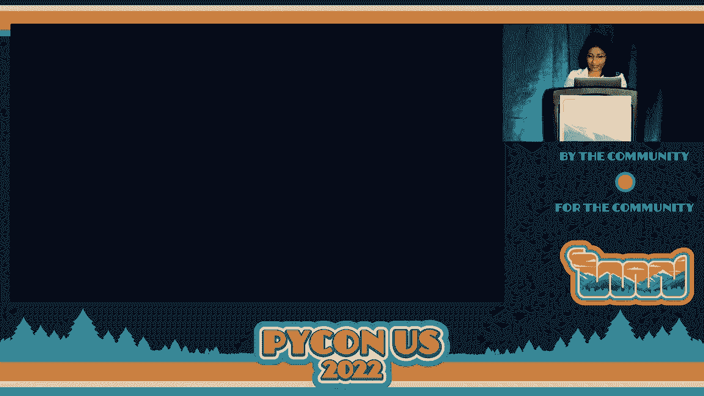
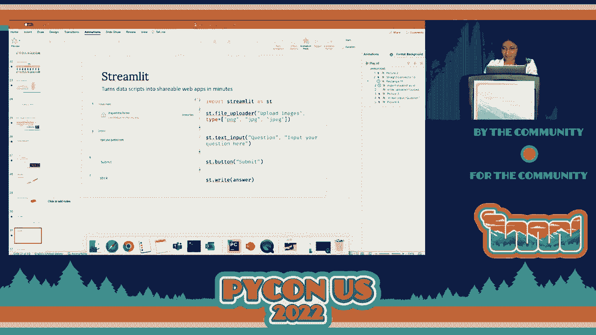
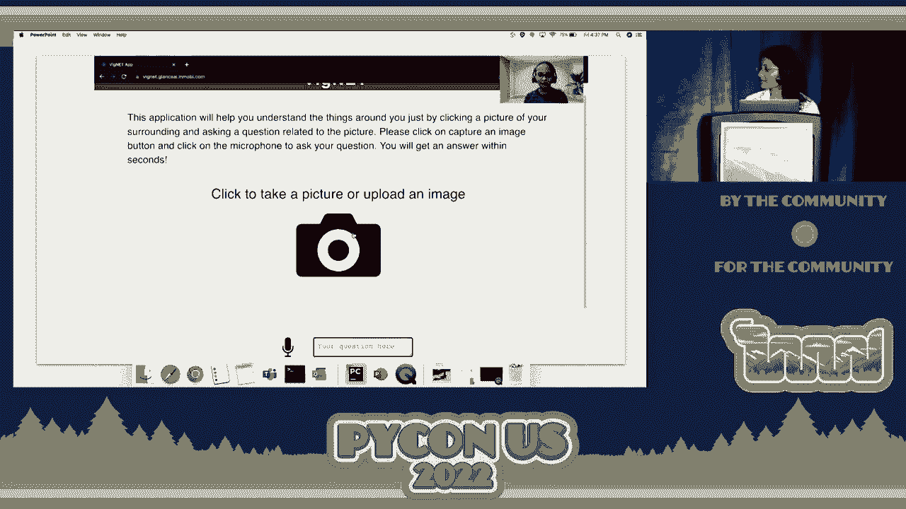
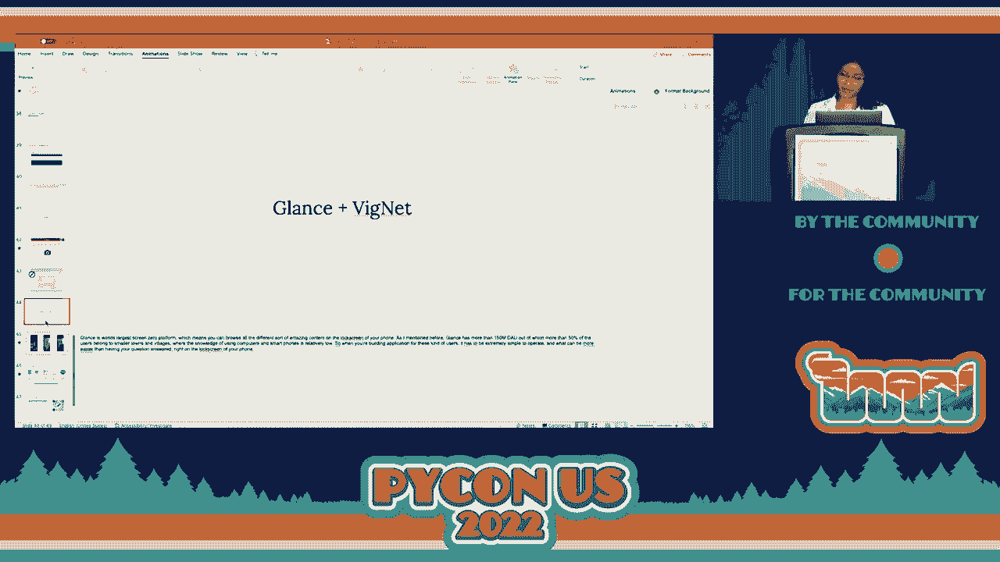
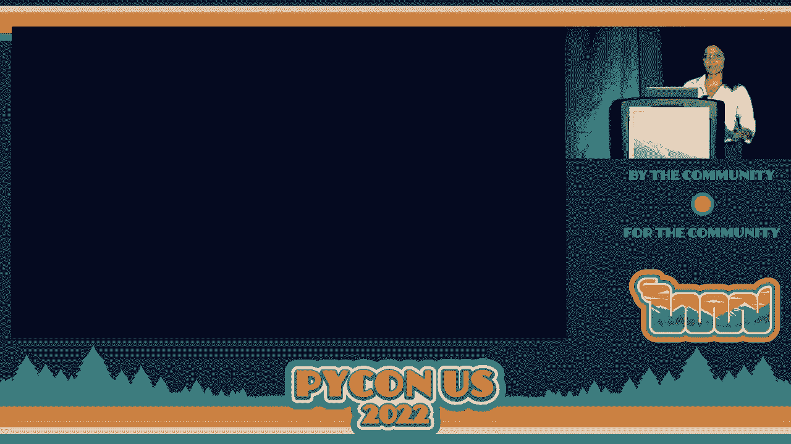

# PyCon US 2022 - P66：Talk - Padmaja Bhagwat_Manisha R_ VigNET_ An intelligent camera app that assists - VikingDen7 - BV1f8411Y7cP

 Good evening everyone。 We have a next talk that is on Visionet， an intelligent camera。

 app that assists you in understanding your surroundings by Padma Jha Bhagavat and Manish， Shah。

 Over to you Padma Jha。 Thank you so much。 Helen Keller once said that there is no better way to thank God for your sight than by giving。

 help in hand to someone in the dark。 A very pleasant evening to everyone。 I am Padma。

 Jha Bhagavat and I am super excited to present Project Minute to you all。

 Before we get into the talk here is a small introduction about us。 I am Padma Jha Bhagavat。

 and this is my dear friend Manish Shah。 We both work as data scientist at Glance India。

 I work on monetizing the content for Glance。 Manisha here works on personalizing the Glance。

 user experience which by the way has 150 million daily active users。

 So originally this talk was supposed to be given by both Manisha and I but unfortunately。

 she couldn't join us here today。 So you see I now have double the responsibility to make。

 this talk as interesting and fun as possible and it tells me it's not an easy job to fit。

 into her shoes。 But I will try my best。 So let's get into the main part of the talk。

 First things first what are we going to learn today？ We are going to see how to build an。

 end to end deep learning based application particularly we will be looking into a visual。

 question answering based application and this is how the outline of today's talk is going。

 to look like。 First we will look into the data and model that enabled this application。

 then we will look into how to quickly prototype such deep learning based application and the。

 final part would cover how can we productionize these application by building services on top。

 of your model particularly we will be looking into front and service and an API service。

 With that said let's dive into the talk。 Some of you might be aware that more than 253 million。

 of words population suffers from visual impairment which is roughly 1 in 30。 For them simple every。

 day task like locating a matching pair of saw or telling what dollar bill it is can become。

 extremely difficult。 Hence we decided to build a visual question answering based application。

 which can truly transform your visual word into an audible experience。 Now you might be。

 wondering what visual question answering is。 Simply put it's an intelligent camera app。

 which takes image and a question related to that image and gives an answer out。 For instance。

 let's say you are on to your everyday evening walk where you come across this really cute。

 puppy you take its picture and ask a question like what is the puppy eating。 Now both these。

 inputs then go into our VQA model which gives out an answer saying it's eating stick or。

 rather playing with stick。 So that's the goal of today's application that we are going to。

 build the model which can take both image and a question and give out an answer in the form。

 of audio。 So with that goal in mind let's see how our data set looks like。 We used VQA。

 data set in order to train our model。 This is openly available on visualqa。org。 So what。

 this data set contains is it has 120，000 plus images and 600，000 plus questions。 Each image。

 has at least three questions associated with it and every question has 10 ground to answer。

 Of course there can just be one correct answer depending on the context in which the question。

 is asked。 You can see on the right that the data set contains variety of images including。

 the image of a woman whose moustache is made up of bananas。 So it does have very interesting。

 question like what is the moustache made up of or what is the color of her eyes。 You see。

 these are not extremely straightforward question。 We want our model to understand and be able。

 to answer in such unusual and ambiguous scenarios as well。 And one more thing to note over here。

 is that a data set contains both image as well as question in the form of text。 Hence。

 we are trying to look for a model which can understand both these modalities which can。

 understand both vision and language。 And yes that's the mighty vision and his famous。

 dialogue for all the Marvel fans out there。 On that note I think we are good to look into。

 the model which can understand both vision and language。 I present to you the vision language。

 transformer also known as VIT。 Well I understand that this entire architecture might look quite。

 intimidating to look at in the beginning but do not worry I will be breaking it down into。

 smaller components and we will go over it in detail。 So what you need to know over here。

 is that our model is taking both text which is our question as well as image as an input。

 Now first let's see how the model is processing the input text。 So the concept is similar to。

 that of BERT and some of you might already know that BERT stands for bidirectional encoder。

 representation from transformers。 Well even if you do not know that's okay because we'll。

 see how BERT operates。 Let's take the very same question that we saw earlier what is。

 the puppy eating。 So what BERT does is it breaks this input sentence into smaller pieces。

 which we call as tokens。 So even when you are teaching a child you break down complex。

 sentence into smaller ones in order for it to learn right。 Similarly you break down the。

 complex sentence into smaller tokens。 So once you do that the next step you will be masking。

 a few words in the input sentence and then you will be adding some special tokens to it。

 Here you can see that we have added CLS which stands for classification and SEP which stands。

 for separator indicating that it's the end of this sentence。 So now that we have broken。

 down our input sentence into smaller tokens we'll then have to convert it into vectors。

 Why do we have to do that？ It's because ultimately we are teaching a machine and they do not。

 understand anything other than numbers。 So once we have vectors out of your tokens you。

 need to add something called as positional encoding。 This positional encoding gives the。

 information about the exact position where the token lies in your input sentence。 It's。

 an extremely crucial information which your bird requires。 So now that we have input which。

 captures both content as well as positional information we then feed it to the transformer。

 encoder and this is then trained to identify what the mast world is。 In our case the mast。

 world is puppy。 Let's see how it is done exactly。 So this is how the transformer encoder。

 architecture looks like。 It is taking the input text and the positional encoding and this。

 is passed through series of self-attention layers which tries to extract as much information。

 as possible from your input data。 So with that it is then sent to the feed forward layer。

 which learns to classify what the mast world is。 So you see the model is trying to derive。

 context from the neighboring words。 So we know that this kind of bird based model is extremely。

 fast and computationally efficient in terms of language models。 So why can't we use the。

 very same concept for images？ So yeah， control C， control V。 One thing that we are great at， doing。

 So yeah let's use the very same concept of transformer for our images and that's how。

 we get vision transformers。 So what it does is it takes your input image， breaks it down。

 into smaller pieces which we call it as patches。 These patches then get converted into vectors。

 and we add positional encoding to it similar to that of earlier。 We send it to the transformer。

 encoder which is then trained to identify what the input image is。 You can see that the。

 transformer encoder looks exactly same as that of before except that instead of taking。

 the text embedding it is now taking the patch embedding which is the vectorized form of your。

 patches combined with the positional encoding。 So this idea was introduced in the paper called。

 an images worth 16 x 16 words by Google。 I highly recommend you to go over that paper。

 because this concept of vision transformer is now revolutionizing the field of computer， vision。

 So we saw how best we can process our input text。 We also saw how best we can process。

 our input image。 Now let's bring it all together and that's how we get VILT basically。 So we。

 took the input question broke it down into smaller pieces or tokens。 We get the word。

 embedding out of it。 We take the supporting image， break it down into smaller patches。

 get the patch embedding out of it。 Now both this word embedding and patch embedding is。

 sent to the vision the transformer encoder which is then trained to identify what the， mast word is。

 Here you can see that the model is making use of both text as well as image。

 It is trying to context using both this information and is trying to identify what the mast word。

 is。 Hence our transformer encoder is kind of acting like a modality interaction layer。

 Modality it is combining both the modalities vision and the language。 So now our entire。

 goal is not to predict the mast word。 What we want to do is we want a model which can。

 answer the question given an image。 So you take this pre-trained VILT model and you fine。

 tune it further using the V2 data set that we saw earlier。 So when you fine tune a model。

 which means you use the same set of weights and you fine tune it further using the new， data set。

 So when you fine tune it further you get a model which can answer the question， given an image。

 And that is how we build the core part of our application。 If it still。

 sounds complicated then I do have a good news for you。 Python provides all these amazing。

 libraries out of the box for you。 So if you are on to the latest version of PyTorch all。

 you need to do is from transformers you need to import VILT processor and VILT for question。

 answering。 The best part is VILT for question answering is already fine tuned on to your。

 VQA V2 data set so you don't have to do anything extra。 You just have to plug it into your。

 code and it is good to be used。 Let's see how it's done。 So first you need to initialize。

 your processor and then you need to initialize your model。 You send in your raw input image。

 and question to the processor which converts it into vectors also known as encoding。 This。

 encoding we then send it through our model which gives out the probability of answer。 Easy isn't it？

 That's all there is。 I mean with just these five lines of code your core。

 part of the application is ready which can be plugged into your application。 So one thing。

 that you need to ensure that is you are on the latest version of the torch and transformers。

 in order to be able to import these libraries。 So now the crux of our application is ready。

 So the next part is how do we quickly prototype it but before that the advantage of using。

 such a transformer based model is that it's computationally fast and efficient and it。

 has high expressive power。 You will soon get to know it when I'll be showing the demo but。

 yeah the core part of the application is built using the transformer based model。 So the。

 next part is how can we quickly prototype it？ How can we quickly build a web application。

 out of your model？ So you might be wondering why is prototyping so necessary？ Why do we。

 have to build a web application？ Trust me it's the most interesting part of building。

 the entire application。 So the reason for building a web application is that we as a。

 data scientist are shielded from a lot of real world requirements and in order to be。

 able to better communicate with your stakeholders having a web application helps a lot instead。

 of showing the code files。 So you might again question me saying that building a web application。

 is not an easy task and if you're someone like me for whom dealing with HTML and CSS。

 code is like a nightmare then Python has a solution for that as well。 It provides an。

 extremely elegant library code of streamlet which I absolutely love it which helps converting。

 your data script into shareable web application in minutes。 I mean literally in minutes。 Let's。

 see how it's done。 So let's take a step back and first see what is it that we need out。

 of our web application。 How do you want your UI to look like？ So for visual question answering。

 based application we need application which takes input images so that all you need to。

 do is input streamlet as ST and all you need to do is type ST dot streamlet and mention。

 the kind of file you are you want your application to accept。 After that you need a prompt which。

 can take your question in right。 So that can just be done using ST dot text input and there， you go。

 You also need a button you know which can submit both your input image and question。

 and for that it's just ST dot button and finally a prompt to display the answer that。

 your model has given and that can be done using ST dot right。 So seriously with just。

 these five lines of code you have an entire web application up and up。 I'll also show。

 you how easy it is to run such kind of streamlet based application。 So let me go into the。

 code。 Let me stop this。 So all you need to do is type ST and provide the file path of。

 the file where your code is running。 In our case it's running on to streamletservice。py。

 and you hit enter。 You get an amazing application up and running onto your local system and this。

 is how your prototype looks like。 Now if Manishu was here she would have been like Padmajia。

 what if you are showing us the static page does it actually work。 Well let's see if it， does。

 So let's take the very same image that we saw earlier and let's type in a question。

 saying what is the puppy playing with and hit submit。 Well it does take some time to。

 give an answer but hates Manfuproototyping right。 So yeah it did give an answer saying， it's tick。

 I was so excited when I first built it so I showed it to Manisha who by the way。

 is not at all an easy person to please。 So she was happy to look at it but she did point。

 out a bunch of valid concerns。 She is like Padmajia what if I want to take this from。

 total typing stage to my actual customers。 I cannot show this because firstly it's not。

 taking an audio input and audio output。 I mean I'm ultimately designing this for visually。

 impaired right and the output the font of the output is not big enough and it does take。

 a while to load the entire web application and give an answer。 You cannot afford to have。

 that kind of delay。 So with all these limitations what she does is she goes and she builds an。

 entire front end service by herself using React。 Now this React is a JavaScript library built。

 and maintained by Facebook。 This React gives extremely rich user interfaces。 I must tell。

 you it's extremely appealing to look at。 I'll show you how it looks very soon。 So and also。

 you can build the components which can be reused across your web application。 You need。

 not write the same code again and again and also there is no delay at all。 It's extremely。

 fast when it comes to rendering pages。 I'll soon show you how the final UI looks like。

 but before that I have a question for you。 Can you guess who this is？ I'll give you some， time。

 Well are you interested to know what are model things of this image？ I mean at， least I am。

 But you know what？ We'll have to wait till the end of this talk in order to。

 see what are model things of this image。 So what we covered so far is that we saw how。

 to build the core part of our application which is our model using VILT。 We also saw。

 how to build the front end service using React。 Now these two components are separate in itself。

 How do we combine these two？ So the bridge between these two would be our API service。

 API service helps exposing the amazing work that you have done on model to the external， world。

 And it also helps in integrating your work with other application。 In our case we。

 want to integrate with the front end service and having an API service is always good because。

 deploying it to the production is extremely easy with that。 Again we built it using fast， API。

 Let's actually see how it works。 It's very simple。 You need to import fast API and。

 kind of files that you will be dealing with。 After that you need to initialize the fast， API。

 And this is the function。 This is the predict function which we want to expose to。

 the external world。 We want the logic of this function to be exposed to our UI。 So that。

 can be easily done by just by adding this decorator like this。 All you need to do is。

 add the rate app。post and provide the relative URL where you want the logic to be exposed， to。

 And that's how it's done。 Now if you want to test out your API， if you want to make。

 sure whether the logic is working as expected， then fast API provides this amazing swagger。

 documentation out of the box for you。 You don't have to do anything extra。 All you need。

 to do is go to the URL where your application is running。 So in order to test it out it usually。

 runs on localhost 9000 when you are trying it on to your local machine。 All you need。

 to do is type in friend slash docs and it gives this amazing swagger UI for you。 So here what。

 we are interested to know is we are interested to test our predict API。 So you can see that。

 it is able to infer the kind of input that your API requires。 It is questioned and an， image file。

 It is able to infer the data type as well。 So all you need to do is hit on try。

 it out and submit it。 So you will be getting an answer in the form of string。 And if your。

 model runs into any error you can also get a proper error message displayed as a JSON， format。

 So you can see that it is extremely easy to test out an entire application or。

 your API specifically using such kind of UI。 And I did not write any extra lines of code。

 in order to bring up this UI。 So that is how you can build an API which connects both your。

 model logic to your friend and service。 So what we covered so far is we saw how to build a。

 crux of our application using VILT。 We also saw how to build a friend and service using。

 React and we saw that API service acts like a bridge between those two。 So that is how。

 you build an end to end deep learning based application。 Now let's see this entire application。

 in action through a demo and I will let Manisha to demo it for you。

 Now let's see this is the React based application that we have built。 I will give a demo and how。

 to use this。 So this is where we take a picture or upload an image。 If you are using your mobile。

 image you can capture an image， ask a question related to that image and you will get an。

 answer out of this。 Let me upload an image。 Let me start off with a very simple question。

 So this is where we ask the question。 We need to click on this microphone button in order。

 to ask a question and we need to click on it back so that it stops listening to us。 How。

 was the weather looking like？ And I click on get answer。 We get an answer both in audio。

 and text format。 Cloudy。 It says Cloudy which is the correct answer。

 Now let us try out a bit more complicated， image and a set of questions。

 Again let me start off with a very simple question here。 What is this？ Straight。

 It says speed but I am not sure if it is accurate。 I identify all。

 the things that are there in this image。 So let me ask one more question。 What do I see。

 in front of me？ Sign。 Interesting。 It says sign but I am not sure if it is actually able。

 to identify the type of the signal that we are seeing。 So let me ask one more question。

 What is the sign indicating？ The destination crossing。 Amazing right。

 It is actually able to identify the type of the， signal as well in this image。 Okay。

 Let me try out one last image。 By the way this application。

 has two visibility features and the accessibility score is 92 according to the Google lighthouse。

 too。 Now coming back to this let me ask a question。 Can I walk now？ Well。 No。

 It says no but I am not sure if it is because of the signal or something else。

 So let me ask one more question。 I told you she is not easy to please。 What is the color。

 of the signal？ Red。 It says red。 Okay。 Let me ask one more question。 What is the sign indicating？

 Stop。 Awesome。 It is actually able to identify the type of the signal as well。 That is it。

 from the demo。 I will hand it over to Patmature。 She has more in store for you folks。

 So yeah looks like our model does get a lot of answers correctly。 But let's see if it is。

 able to recognize the image that we saw earlier。 So yeah。 Here is the application。 We upload。

 the image。 Yeah。 Like some of you might have already guessed。 It is Kim Kardashian from。

 last year's Med Gala。 I mean come on。 I am a Gen Z standing in front of you giving the。

 serious talk。 I had to bring in this image。 So let me ask a question。 What is this？ Uh oh。 Statue。

 I wanted things that it just touch you。 So it turns out that our model。

 indeed cannot keep up with the Kardashians。 You know。 But you know it works when it has， to。

 So that is how our entire visual question answering application works。 So how we plan。

 taking it forward is by integrating it with the amazing application called as glance。 So。

 glance is the words largest screen zero platform。 What I mean by that is you can browse all。

 the amazing content right on the lock screen of your phone。 So like I mentioned before。

 glance has more than 150 million daily active users out of which more than 50% of them belong。

 to smaller cities and towns。 In order to be able to address such kind of audience where the。

 computer or smart devices is relatively low， you need to make your application extremely。

 easy to use and what can be more easier than having your question answered right on the。

 lock screen of your phone。 So this is how we plan on doing it。 On the lock screen you do have。

 the access to the camera。 You just need to swipe right。 Take the image of the object and。

 you need to hit on ask glance which will then get redirected to the urban application。

 So this is how we plan on maximizing our reach， maximizing our user reach with the hope of。

 providing an extra pair of eyes to everyone in need。 So yeah， even if you did not understand。

 what I just spoke for the last 20 minutes here at the TLDR version， we used a VQA V2 data set。

 We used a model using VIT。 We built a prototype using Streamlet and front end using React。

 Our entire API service was built using fast API。 You can go ahead and clone this repo in。

 order to try it out。 Plus on this repo you can also see how to deploy it on cloud platform。

 We have shown how to use it， how to deploy it on GCP。 So yeah， try this out yourself because。

 don't go by the recorded demo。 You need to try it out。 Just a few things is that it works。

 the best in Google Chrome and Microsoft Edge。 Safari and Firefox has a bit of audio issue。

 which we will be fixing it soon。 So that's it for today， folks。 Thank you so much。

 And this is the team that helped us build it rather of Shiva's and Pablo's because without。

 whom this entire application wouldn't have been possible。 So a big thanks to them and a。

 huge thanks to you all for being such an amazing audience today。 Thank you so much。

 I hope you enjoyed。

 [Applause]， (applause)。