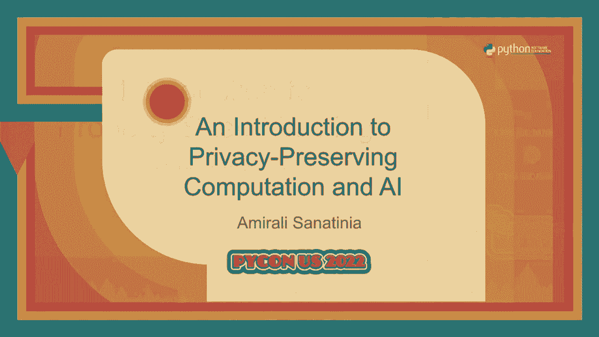
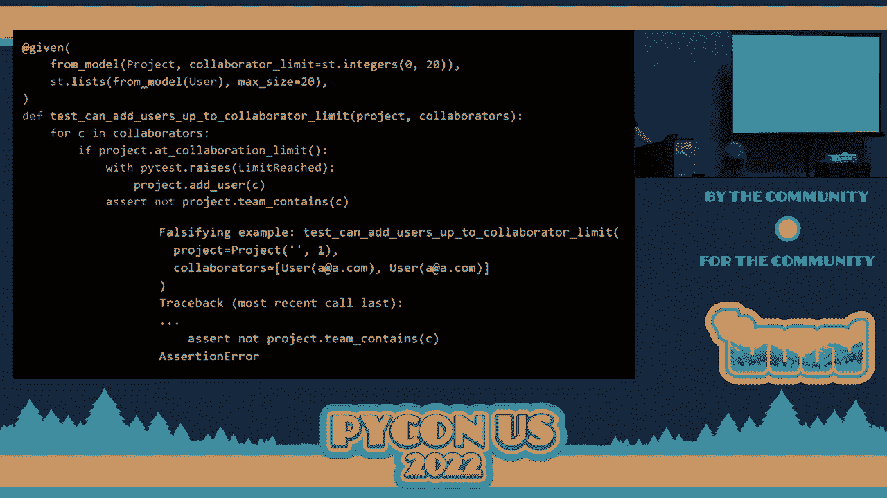
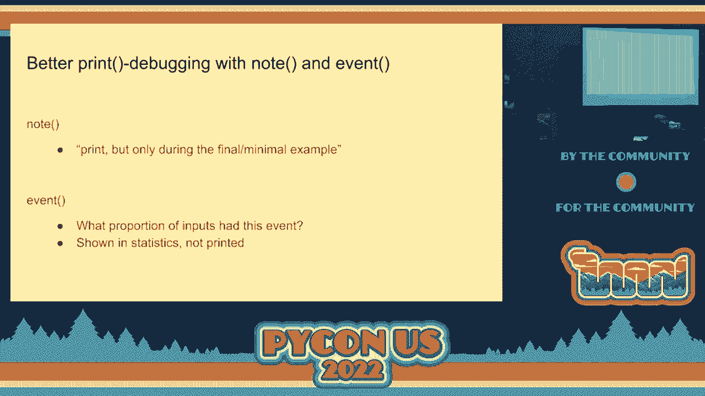

# PyCon US 2022 - P88：Tutorial - Zac Hatfield-Dodds_ Introduction to Property Based Testing - VikingDen7 - BV1f8411Y7cP

 So let's jump into it。 Thank you all for coming。 I know this tutorial hasn't been up for terribly。

 long。 In fact， I was asked to deliver it last week when someone else had visa trouble getting。

 into the country for the conference。 So without further ado， my name is Zach Hatfield-Dods。

 I'm the maintainer of Python's leading library for property-based testing and also on the。

 PyTest core team， which you may have heard of。 And I'm going to walk you through how I think。

 about property-based testing and how I think you can apply it in your code bases。 And so。

 the tutorial or workshop is basically in four parts。 Before the break， I'm going to walk。

 through what is property-based testing anyway and show you some examples。 Then part two。

 still before the break， we're going to look at how you describe test data using hypothesis。

 and I'll get into what that means in part one。 Then at 10。30 between two and three， we're。

 going to take our coffee break。 We'll come back at 11 and start talking about what I。

 call test tactics， like design patterns for property-based tests and then round the workshop。

 by talking about the practicalities in part four， the kind of stuff that you need to know。

 to actually apply it in your open source projects or at work。 How does configuration work？ What's。

 the update schedule like？ How does it interoperate with other libraries， that kind of thing？

 Sound good？ Awesome。 I love an engaged class。 So property-based testing， one-on-one。 I will。

 have a slides link up in half an hour or so。 So， I kind of want to start with， well， what。

 is testing anyway？ Would I tell you it's property-based testing？ What do I mean by testing？ Testing。

 for me is the art and science of running your code and then checking that it did the right。

 thing or sometimes just checking that it didn't do the wrong thing。 In Python， that means usually。

 that we run the code and if it didn't raise an exception， then it's good。 And if it gave。

 us the result we expected， that's even better。 There's a whole lot of tools and techniques。

 which are really useful for writing correct code or having high productivity on a software。

 engineering team which are not testing。 I think all these things are great， putting assertions。

 in your code， using a type checker if that's appropriate to the situation， linters， peer。

 code review， drinking coffee or perhaps even getting off sleep if you're a real wild guy。

 But they're not testing， so I'm not discussing them further today。 And then there are a thousand。

 taxonomies of different kinds of tests。 One that I find useful is just the list here。 So。

 we've got unit tests which typically tests something pretty small。 There's integration。

 tests that are exactly the same as unit tests but with a bigger unit。 We've got snapshot tests。

 where you run your software and save the output so that you can check that future runs with。

 an updated version produce the same output。 This is useful because you can't really check。

 correctness using a snapshot test。 There's parameterized tests。 We have a list of possible。

 inputs and maybe they're corresponding outputs and you run those through。 So you just throw。

 random software and see if it crashes。 And then what we're talking about today， property。

 based tests and as an extension that I'm barely going to talk about at all， stateful model。

 based tests。 I'm going to be doing a few examples。 So my friend David who started the project。

 says every time someone uses a reversing a list twice gives you the same list to demonstrate。

 property based testing I take a drink。 This isn't a drinking game， I just hate bad examples。

 Let's make our founding and most common example a non generalizable property of a function。

 that's almost impossible to get wrong。 What could possibly go wrong with that？ So in。

 difference to my friend David we're going to be talking about sorting。 Now these are。

 kind of classic unit tests。 We say that if we sort the list one， one， two， three， we expect。

 to get the list one， two， three。 Let's just pretend here that Python doesn't have a sorted。

 function yet。 So we're kind of having to implement that for ourselves。 And we can also test that。

 if we sort a list of floating point， there's 3。0， 2。0， 1。0， we should get 1。0， 2。0， 3。0。

 and we can also sort strings， not just numbers。 We can sort lists of anything that can be， compared。

 And so if we sort base a we should get a， b， c。 All make sense？ A parameterized。

 test might look a little like this。 We just supply a list of the arguments and the corresponding。

 expected result。 And so at this point， like honestly we haven't gained much at all by， going here。

 And in fact we've lost our function names on the test， which describe what we're， actually doing。

 But a parameterized test does make it cheesy to drop in another few cases， later。

 If we discover that there was an edge case we weren't handling or we want to test。

 empty lists or list of more elements， it's much easier just to drop them into a list here。

 than to write a whole new test function。 And it's easier to be confident that the body。

 of the test function is always the same because you've only got one test body。 But sometimes。

 like to be honest， the problem is we're only testing short lists here because it's a pain。

 in the neck to write out really long examples。 So if we didn't have to write out the result。

 by hand as well， that would be helpful for testing more complicated code。 And so in this。

 case we're saying well if we already had a trusted sort function that we knew someone。

 been implemented correctly， or maybe this is the version from before we did a bunch of。

 performance optimizations or a single threaded version or just the old version。 This situation。

 comes up more often than you'd expect where you actually have to do the function。 And in。

 this case you can just come up with your inputs and then check that you get the same result。

 from each of those functions。 And then if you don't even have a trusted implementation。

 there are still things you can check。 So this test says if we sort any of these input lists。

 and then take the pairs out of the output， so the zeroth and first elements， the first， and second。

 the second and third， then the preceding element should be less than or equal。

 to the subsequent element。 This is just say the output from the sorted function must be， in order。

 And so we can check this kind of thing without even knowing how to sort something。

 I always stuff up edge cases if I'm doing quick check or quick sort or something。 But this。

 is not a complete test。 Does anyone have an idea as to why？ So it's just pairwise。 But。

 we can be pretty confident that if the first element is less than the second and the second。

 is less than the third then we're still in order。 The problem here is that if sorted was。

 defined as return empty list this test would pass。 Or even if it was defined as return a。

 list containing one two。 That's an ordered list。 So we'd want to add some extra assertions。

 that say well we've got the same length of output and the same set of elements。 And to。

 be honest I think this is a good test for sorting。 But if you sort of had your enterprise software。

 developer colleague from hell whose goal was just to get the test passed in nothing else。

 because they like really strict test driven development。 This test would still not be， enough。

 Can anyone guess why？ So if you gave it the list one to one and sorted returned。

 one to two this test would still pass。 Because you've got the same number of elements of。

 the same set of elements but you've messed around with the duplicate elements。 So the。

 mathematical definition of sorting is that sorting is the permutation of your input sequence。

 such that it is in pairwise order。 And so this test is a complete test for sorting。 Any function。

 which passes this test is a correct sorting function。 The only problem is that checking。

 every permutation is just super slow。 So we don't actually want to do that。 It's like cubic time。

 in the length of the list。 We might instead check that the collections。counter that is the。

 number of each distinct element we have is the same in the input as the output。 And so this is。

 a fast efficient test which will catch any possible wrong sorting algorithm。 And we've just。

 discovered property based testing。 So this is a test and it's got two properties that we're checking。

 The first is that the output is in order and the second is that we have the same elements that we。

 start up with。 And any function which satisfies these two properties is a sorting function。

 That said， I think this is a fine test as well。 Your test doesn't have to catch every possible。

 secretly evil input that is out to get you。 If it catches plausible mistakes， that is honestly。

 all we need most of the time。 The other thing I'll say is that this is also a property。 This is。

 the property that the two functions give equivalent outputs on the same input。 And that's a really。

 useful one。 We'll come back to that later。 So to extend this with hypothesis， we take exactly。

 the same test body here。 But we're just kind of hand-waved。 Pightest parametrires something。

 And it's your problem to come up with that。 The problem that hypothesis solves is precisely。

 coming up with those inputs。 And so what we can do is we can give it the given decorator。 So。

 given an argument which is one of either lists of integers or floats or lists of strings。

 And the hypothesis framework will then generate many random examples for you。 And in fact， it。

 will generate a random example that makes that test fail。 Because we assumed that numbers could。

 be compared and not a number is a special floating point value which comparison doesn't really work。

 on the way you expect。 But this test will pass again。 So to summarize this little introductory bet。

 the advantage of property-based testing is that it。

 helps us generate input data that we wouldn't have thought of otherwise。 And that's particularly。

 useful because the edge cases you didn't think of are precisely the ones that you're likely to。

 have bugs with。 And if I think of an edge case， when I go to write a test， I usually just go check。

 that my code handles it too。 So we can check that the result is not wrong even when we don't know。

 the correct answer or can't think of what the correct answer should be。 Or indeed， don't know。

 how to get the correct answer。 Yep？ It is very similar to fuzz testing。

 The difference is essentially， that fuzz testing tends to deal with sort of random bytes。

 So anything that can be represented in a， network packet or a file。

 Whereas property-based testing is much more structured。 So we want。

 specifically lists of the things we've asked for rather than like any possible value。 But you。

 could use hypothesis as a fuzz tester as well。 And the last thing that I find using a hypothesis。

 which kind of surprised me when I started， is that often the bugs it finds are actually bugs in my。

 understanding of what the code is meant to do， rather than bugs in the code per se。 You know。

 that some library has a slightly different contract or semantics than I expected or that I didn't。

 actually understand the problem statement well enough to write a good test for it。

 Because it's a lot， easier to kind of go well this input gives me oh it's that output。

 Let me just paste that into the， test。 That's actually a lot easier on your understanding of the code than having to think。

 what should always be true about my function。 And then the last thing I want to claim， though I。

 haven't demonstrated it yet， is that you often don't even need assertions in your test。 If you。

 start calling your code with like really weird but technically valid input values， you will get a。

 lot of internal errors。 And so if you can't think of any properties， you actually don't need any。

 properties。 It does not raise an exception on valid input is a perfectly fine property to test。

 And at least in my code it's embarrassingly effective。

 So let's get set up on the notebook side of things。 We're not going to go through the exercises。

 right now but I want to get us set up here。 So github。com/rsockles/testing-tutorial。

 And by your preference you can either install things locally as described and read me in here。

 or you can just click on the links that will open a notebook for you in my binder with zero installation。

 [pause]。

 All right， so， having unlocked my video， there we are。 You may be familiar with the Hypothesis logo。

 It's a dragonfly because dragonfly is hot and eat bugs。

 So with setup mostly in place， let's talk about part two before our break。

 And this is how you can use Hypothesis to describe your data。

 So I showed off this a little with the， given decorator and the。 isn't the floats。

 But we're going to go through a little more。 Hypothesis。

 uses what we call strategies to describe your data。 Similar libraries and other languages call。

 these generators but of course naming things is hard and Python already has generators which。

 are a completely different sort of thing。 So we had to call them something else。

 And there are a couple of different kinds of strategies that you're going to see a lot of。

 The first is just strategies for what we call scalar values。 Things like， none， bullions。

 numbers of various kinds， strings， date times， times zones， whatever you want。

 Then we've got strategies for collections whether that's lists or dictionaries or topples and so on。

 We can modify strategies with map or filter and look， we're going to get through all of this on。

 subsequent slides。 So I won't weed this one out for you。 I'm also going to show you some。

 recipes that I hope are useful。 And then we'll end up with some exercises which take us through。

 to the break at 10。30 which just focus on generating useful data rather than actually using them in。

 order to test code。 So for those scalar values， the bottom line is like if you can describe what it。

 is that you want， you can generate it using hypothesis。 So we have built-in strategies for。

 none and for bullions， for numbers。 Numbers all have a mid value and a max value argument which。

 are optional。 So you can say not just give me any integer but give me any positive integer or give。

 me a number between one and 10。 For strings， like all collections that have a minimum and a maximum。

 size that you can set。 So you say I don't want the empty string or I want strings but only up to。

 six characters because that's all my database supports。 You can also for some of these specify。

 for example， which characters are valid。 So you only want ASCII characters or you'll all add。

 Unicode characters or even match by regular expression。 Dates， times and time zones， I think。

 speak for themselves and time zones will give you plenty of trouble when you're testing them。

 And there's a bunch of other stuff which you'll find in a documentation when you eventually need it。

 So here's a very simple test。 I mentioned before that does not raise an exception is a perfectly。

 fine property to test。 And so in this test we're saying given any binary that is a bytes object。

 a binary string， if we call the is binary string function from the binary or not package。

 it doesn't， crash。 This seems kind of like a reasonable test to me but it's shockingly effective。

 And sure enough when we first wrote this a few years ago， it crashed with a Unicode decoder。

 This has subsequently been fixed。 There's no point testing open source code if you don't tell them。

 about the bugs and most people fix them very promptly。 But internally binary or not used a。

 library or char deck which detects character encodings。 And in particular it will give you a。

 dictionary with a couple of possibilities and then a confidence that it assigns to each possibility。

 And it turns out that for some encodings it just checks a few bytes at the start of the string to。

 see whether the magic bytes indicating that it's in a particular encoding。 And then reports 100%。

 confidence without any implication that you actually can decode that encoding。

 But the binary or not， developers I think made the quite reasonable mistake in thinking that if they were told with。

 100% confidence that a string in a particular encoding you could just call decode and didn't need。

 to handle any error。 And so what we found here was that there wasn't so much that anybody had made。

 a coding error as had misunderstood the semantics of the function。 So is this a bug？ I guess it's a。

 bug and something crashes but it's not like we had a clear typo somewhere。 Let's look at the other。

 one。 Mercurial is a version control system much like Git which had two and from UTF-8 binary encoding。

 And so an obvious property we could test there is that given any binary string if we encoded two。

 UTF-8 and then back from UTF-8 we should get the same string back。 And if we have。

 from a two UTF-8 thing that should handle any binary string so this test should work。

 it crashed too。 I'm not sure if the moral of this story should be hypothesis is great or。

 Unicode is really hard but some combination of those two I think is there。 It of course has also。

 been fixed。 And then another great one。 In the Python standard library we have date times and the。

 date you tell package can parse date times。 And so this is saying that if we have a date time and we。

 format it as an ISO 8601 formatted string so that's four digit year dash two digit month dash two。

 digit day a T and then the time then we should be able to parse that string and if we reformat the。

 date time we get we should get the same string again。 And it's just easy to start by generating a。

 date time and formatting it than it is to start by constructing a string which exactly represents。

 a valid date time format。 It turned out that this failed。 Paul Genssel is a friend of mine and it。

 turns out that this parser function failed if and only if you had a one digit year and the second。

 equal to the year value。 Okay so it would swap the year with the month。

 I don't think this would ever have been caught without hypothesis。

 I will admit I'm also not sure who this would have hurt if it had never been caught。

 But I think it is illustrative of the kind of thing that you can find with relatively simple tests。

 So the point of this is not so much to tell you this bug is really important as very simple tests。

 can find bugs that you never would have found by testing manually。 So having got the simplest。

 possible data out of the way let's talk about collections。 Yep。 [inaudible]。

 So for each of these we'll get to this under the practicality section but there's just a setting for。

 how many you want。 By default it's about 100 random examples because that's a good trade off。

 between like speed for unit tests but also reasonably rigorous。 So the list strategy as we saw way。

 back in our sorting example the list strategy just takes a strategy for the elements of the list。

 That one's mandatory and then optionally you can give it size bounds and also specify whether。

 you want to be unique and you can also give it a function by which it should be unique。 So for。

 example allow any string and none of them should be the same as each other when they lower case。

 You can also turn this into dictionaries， sets， iterables and so on and for those common cases。

 we actually ship strategies for those directly。 The tuple strategy is a little different。

 It's for a fixed length tuple where you provide a separate strategy for each index of the tuple。

 So if you want a tuple for example of an integer and integer and a string you would use the。

 tuple strategy and you would call it tuples integers integers text。 And there you are。

 If you want a， variable length tuple you actually start with a list strategy and then turn it into a tuple later。

 which we'll see on the next slide。 And then fixed dictionaries is just like tuples except also with。

 dictionary keys。 So you can say I want a dictionary which always has the key A which should be an integer。

 and may or may not have the key B which is a string for example。

 So here's another pretty simple test。 We're saying given lists of floating point numbers。

 with at least one element in them because you can't take the minimum of an empty list。

 you just get a crash。 Then the minimum of the list should be less than or equal to the mean that。

 is the average of the list which is then in turn less than or equal to the maximum of the list。

 Will this test pass？ You're getting suspicious when I ask this question I like that。 [ Inaudible ]。

 Yeah that's the extension。 If you think it's going to fail you've got to tell me why it's going to fail。

 This is where I tell you that hypothesis is a great educational tool because it'll teach you。

 about how Python works。 Pretty much。 Specifically it fails quickly when we get an overflow error。

 because internally mean might be implemented by adding up your list of floats and then dividing。

 my length。 And in this case the result of dividing was too large to be represented as a floating point number。

 So when I spoke about turning lists into tuples what I meant was using the map strategy。

 So the map strategy you pass it any callable it could be a lambda it could be a function it。

 could even be a class like the tuple class and it gives you a strategy which consists of getting。

 a value from the earlier strategy calling that callable on it and then giving you the result。

 So if you have lists of integers dot map tuple this will generate a variable length list of numbers。

 and then call tuple on it to give you a variable length tuple。

 Pretty simple or in the example here if you have integers and then you map。

 str on it you will get maybe a minus sign and then a bunch of digits but as a string。

 Filter is kind of the corresponding strategy。 Filter is for where you have like some rare。

 things that can be generated that you don't actually want。 So you just supply a function and if it。

 returns a falsey value hypothesis will just like get another value for you behind the scenes。

 So this is really useful for example if you want any number but not zero because you would have a。

 zero division error for example。 That said if more than like 20 percent of your examples are。

 being rejected this does start to have performance implications because you are in fact generating。

 the earlier thing and then just throwing it away behind the scenes。 So if you reject more than。

 like 80 or 90 percent hypothesis will actually start error out toward you like hey hey that filter。

 is a little strict。 See if you can find a way to use map for example to construct something which。

 is usually valid。 So if you want a tuple of two integers in ascending order you've got kind of。

 two ways to do it。 The way with filter is just to supply something like a lambda which just checks。

 that it's what you want。 That the first element is less than or equal to the second element。

 The way with map would be to sort it and then turn it back into a tuple because sort of returns a list。

 Does this make sense to people？ All right we're getting into the special strategies here。

 Just is for where you have a value but you， want a strategy。

 Just as a special strategy which only ever returns the particular argument that you， gave it。

 So for example if you ask for date times and you always want them to be in the UTC time zone。

 which is nice for machine related things you can say time zones is just UTC。 It kind of reads。

 like English。 Sampled from on the other hand it's where you want one of some particular range of。

 possibilities so you're okay with having an inner join or an outer join but it has to be one of those。

 Sampled from also works really well with the numbs。 If you have like a flag and。

 where you can have read， write， execute or read， write or read， execute or read， write， execute。

 Sampled from or behind the scenes just create all those combinations for you。

 Another thing that we saw a while ago not sorted example was one of which is where you have two。

 or more possible strategies and you would like a value of any one of them。 So behind the scenes if。

 you have one of say integers or strings， hypothesis will choose what strategy to draw from and then。

 get an example from that for you。 Nothing is a little stranger it's kind of the empty set of。

 strategies。 So if you have nothing the lists of nothing that will only ever generate the empty list。

 If you have one of integers or nothing it will just always generate integers because there's。

 nothing else to generate。 Thinking of strategies as sets of values kind of where you define your。

 set as a construction is pretty useful except that you can't subtract them or take the intersection。

 of complement and that's because if somebody has map called map on their strategy for example。

 map is allowed to have whatever side effects you like。 So we have a Django plugin which will。

 ensure that the user model it generates is in the database for you and it's not quite clear what it。

 would mean to subtract that strategy from a like we generating user strategy and take it out of the。

 database when it wasn't there to start with。 Who here has ever written a custom class？

 Yeah you might want to generate some with hypothesis and so builds is the way to do that。

 You give it， your class instance or for that minute anything else you can call and then strategies for the。

 positional and keyword arguments。 That works pretty much how you would expect it。 Draws those。

 positional keyword arguments from strategies to values and then calls your thinking returns。

 whatever the return value is。 We'll cover builds in more detail later because it's got some nice。

 type in front stuff as well。 If you have recursive data that also basically just works。

 So on the bottom of the slide here I've defined my favorite JSON strategy which says JSON is。

 defined recursively。 The base case is you can have none true or false a number or a string。

 Or you can have a list of JSON values or you can have a dictionary where the keys are strings。

 and the values are JSON。 That's just the definition of JSON and that's how you write it with hypothesis。

 You have a recursive strategy which is non-bullions or floats or strings and the extension is lists of。

 that or dictionaries of text to that。 So that can generate any possible valid JSON。 In fact。

 because we haven't specified anything about NAND we might even go a little beyond the JSON spec。

 If you have type annotations on things it's kind of nice if you don't have to retype out all the。

 things that you've already typed annotated。 So a hypothesis will actually read those type。

 annotations for you and work out how to generate things from them。 So there's a from type strategy。

 where you can just hand it a type and it will give you a strategy for instances of that type。

 And it's also integrated with builds。 So if your class has four arguments that it requires and。

 you type annotated them you can just say build me an instance of this and it will go off and。

 work out how to construct everything that your class needs in order to be built。 It's pretty cheap。

 It's all memorized。 I certainly wouldn't think about the performance cost of it。

 Oh no this is really designed as a time saver。 So it's designed to make your code a little more。

 elegant but also it should be possible to extend it incrementally by hand。 So for example you can。

 let builds infer three out of your four arguments and say oh age is an integer but really it better。

 be between say zero and 120。 And if you have a custom class where you have this kind of constraint。

 you can also tell hypothesis about that so that everywhere else in your code base it will just。

 be inferred with your particular strategy that you designed。 There are a couple of other things。

 that work by inference。 I mentioned the regular expression support。 If you want strings matching。

 some regular expression you can just tell hypothesis here's the regex pattern give me strings that match。

 if you're using NumPy we've got from data type and some shape inference so you can pretty much。

 just say here is my function signature throw a raise at it for me and if you're using Django。

 there's from field and from model。 I actually like this as a general design pattern but a little bit。

 of advice here while it is a useful design pattern which can save time and make testing a little easier。

 to extend it into great。 The two important things are first you want to err on the side of guessing。

 something very general。 You don't want to guess for example that an integer is always a positive。

 integer or a float is always a finite float and excluding it because if you do that you've just。

 ruled out your tests ever discovering something using those edge cases。 So I tend to think that。

 anything which we guess for someone else should be very general and if they want something more。

 specific or restricted they should be responsible for writing that out explicitly。

 And the second is it's kind of an awful user experience if you get most of the way through。

 and then you realize that you just want to tweak this one argument like three layers down。

 and to do so you suddenly have to throw out all of the ice inference and write it all out by hand。

 In hypothesis we try to avoid that you should always be able to only specify the things you want to。

 specify and let hypothesis get guess everything else for you。

 This example is a somewhat more complicated test so we have some kind of Django model for a project。

 maybe we're re-implemented juror for some reason and we have a user model and it's going to say。

 like well give it any project with a collaborator limit somewhere between zero and 20 people。

 and any list of up to 20 users if we just add each of those users in turn well if we're at。

 the collaboration limit then we expect to get a limit reached exception and that the user we just。

 tried to add will not actually be on the project after that。 It'd be a little embarrassing if our。

 validation raised an error after adding the user to the project over the limit and if we're not at。

 the limit we should just be able to add add the user and then check that they're on the project。

 This one will fail because we forgot to specify that users must be unique。

 and so here we've got collaborators a at a。com and a at a。com。

 and so while we've raised an error that we were at our collaborator limit the user we tried to add。

 is already on the project。 This probably isn't a bug but it does make me think maybe we want a。

 different flow if you're trying to add a user who's already on the project。

 So I'm like is this a bug？ I don't know but I'm glad I found it。

 Racing through who feels that they're still with me at this point？ Most people okay。

 If you have data that has internal dependencies like the example where we saw with。

 tuples in order or things like you want a list and then an index into the list or a string and then。

 a slice out of the string。 There are a couple of ways to do that。

 Composite is the one that I recommend。 Composite is as shown here it gives you this magic。

 first argument draw which you can use inside the function to draw a value from the strategy。

 So you have a location strategy and you pick a factory from the available locations。

 and then you pick a power level that's limited by something about the factory。

 I kind of like what I call the inner composite pattern because it lets you do all your expensive。

 validation once instead of every time you draw a value。 But in this case we should probably also。

 consider can we just literally have a function that returns a strategy？ Python is kind of nice。

 like this you can just have functions which return things。 And this is generally a nice testing。

 pattern you can have a utils file somewhere where you define a whole bunch of helpers specific to。

 your code base or project and then just call them in your tests。 Kind of like pytest fixtures but。

 more explicit。 Data and miniscope over it's kind of like composite but you can draw values inside。

 your test。 Very very flexible and powerful。 The downside is it's very very flexible and powerful。

 If you can use composite prefer to do that instead。 Last bit of this one before we jump into the。

 exercises is just where to look for these strategies。

 So the first argument is the hypothesis dot strategies。

 some module from hypothesis import strategies。 And this is all the core things which don't have。

 dependencies outside the standard library。 Or in a few cases like the time zone strategy that。

 was added to the standard library in Python 3。9。 So if you're on earlier versions hypothesis will。

 require the zone info backboard and we'll install that automatically for you。 There's also some。

 extra strategies in hypothesis dot extra dot Django for example where we don't want to force。

 everybody to install lumpy and pandas and Django just to use hypothesis but if you already have。

 them installed you can just import the relevant support。 And then there's also a pile of third。

 party extensions which I won't get into but there's a few dozen of them these days。

 So let's jump into the exercises。 For this section we're going to go through to 10。30。

 which is 45 minutes or so of exercises。 Just the describing data notebook。 So the exercises in the。

 repo we have four parts。 The first part I'm not actually planning to go through today but they're。

 there if you want to run through them later。 This was partly because for online tutorials。

 I wasn't able to look over people's shoulder and help them so it was used for that extra material。

 So we're looking at notebook two on the describing data one you should just be able to click the。

 my button link and have it open there。 And the idea here is really to teach you a way of thinking。

 about strategies and how to compose them。 That's what I think of them as a duct tape mindset right。

 like if you can't fix it with duct tape the answer is just more duct tape。 If you can't。

 generate the data with a strategy the answer is more strategies。 So without further ado let's jump。

 into the exercises。

 [ Pause ]。

 All right welcome back everybody。 I at least am feeling relaxed and refreshed。

 I stood up for a while hopefully the rest of you are ready for part three as well。

 This is the bit where I do a live demo。 What's the first rule of live demos？

 Yeah well we'll see if we're following the laws of live demos here。

 So far what I've shown you is hypothesis as a tool to help you write better tests。

 But when I came to PyCon a few years ago I bumped into a lot of people in the hallways。

 and some of them would say oh hypothesis like I use hypothesis that seems kind of cool。

 And I would get really excited and be like that's great。 What do you use it for？

 They'd say oh well I wasn't quite sure how to use it on my code so don't use it。 And as everybody。

 knows every good programmer knows every social problem has a technical solution。 That's a lie。

 But the technical solution in this case is to have hypothesis actually， write test code for you。

 So if you've installed hypothesis locally， which I don't seem to have done。 First law of live demos。

 I think I didn't activate the virtual environment。

 If you install hypothesis add activate your virtual environment。

 Did I just not press enter enough times？ Okay let's ditch the scripted part and I'm going to do it completely live and try to remember what。

 I was going to demonstrate。 Talk among yourselves for a minute。

 Excellent we got here and hopefully subsequent runs will be faster。

 So the hypothesis write command will write tests for you。 For example we might ask。

 hypothesis to write it a test for the sorted built-in。

 I'm just suspecting that my development version of hypothesis is broken so let's go。

 I swear my laptop isn't this slow。 Most of the time。

 I shouldn't have tempted the demo gods that's my problem。

 Okay let's just pretend that we have a live demo of the hypothesis go strider。

 If you have a terminal or a notebook open you can hypothesis write various things。

 And you will get test functions out。 I'll come back to the demo once we've broken for exercises。

 fix it and then show you after that。 So common test tactics。 If we had seen the ghost rider。

 we would have seen that hypothesis can produce some of these tests for you。

 I think of these as common properties that you might want to test。 That is properties which are。

 common to many different types or pieces of code that you might be working with。

 And then somewhat more situational but still useful。 So the common ones are what I call the。

 fuzzing or just the doesn't raise an exception property。 In almost all cases we know that our。

 code shouldn't raise an exception or maybe it should raise an exception sometimes but only。

 of a particular type。 That your request might have a not found error but it shouldn't have other。

 kinds of errors。 There are also round trip properties。

 For example if you save your data to the database。

 and then you load it back in you expect to always have the same data。

 Or if you serialize it and then， deserialize it。 You have equivalent functions which we saw in our first sorting example and then。

 there are metamorphic properties which I'll talk to some of you later because they're particularly。

 powerful but also quite domain specific。 Then there's situational ones like just checking that the。

 output is reasonable。 That's what we ended up doing with the sorting example。 There's various。

 mathematical properties and then there's stateful tests。 So I'll say again just calling your code。

 works embarrassingly well because hypothesis will think of the edge cases that you didn't think of。

 and therefore the test will find things that your ordinary tests haven't found yet。 Round trips。

 Every codebase has them。 If your codebase never loads or saves data or never reads or。

 writes anything you can replace your code with pass and you will have less bugs。 And it will run。

 very much faster。 This is what Haskell people call a pure function。 Some round trips that your。

 codebase is specifically likely to have save and load， encode， decode， send。

 receive for anyone working， with networks， converting between data formats or sometimes logical inverses。

 For example if you， factorize something， multiplying the factors together should give you the original number。

 So the reason I emphasize these is that especially the ones around loading and saving data are。

 absolutely critical。 Being able to load and save data is the foundation of any application。 If you。

 can't load or save data without messing it up you have fundamental problems。 But those data formats。

 also tend to be quite complicated。 They represent every edge case that your codebase can represent。

 and therefore they are more likely to have weird edge case bugs than much of your code。

 And the last thing is that especially input and output， learning and saving stuff。

 tends to cross many abstraction layers。 Often you will have a network involved。

 you will have a file， system， you will have operating system issues。

 you will have questions about what file name is， valid or different operating。

 And testing these using something like hypothesis can turn up those， really weird rare bugs。

 And the last reason they are important is if you save data and you miss。

 save data this is very hard to recover from。 So you want to find the bugs early。 So property test。

 your round trips。 Equivalent functions。 Some people might say but really Zach， how many times am I。

 going to implement the exact same function in my codebase？ And you might think that you are not。

 repeating yourself so you only have one copy。 But you can have simple things like varying the number。

 of threads you run a function in。 Or the old version from before you refacted it。

 You should do the same thing as the new version after you refacted it。 Or sometimes you might have。

 that if you call functions in different orders you expect to get the same result。 So that is a kind。

 of equivalence that you can create for yourself。 And in some cases you might have functions which are。

 equivalent only on a subset of inputs。 For example you wrote a more general version of the function。

 but on the inputs that the old version also handled it should do the same thing。

 And you can test that。 Another general property is just to validate the output。

 Are your numbers in the expected range？ Are your probabilities between zero and one？

 Is your string non-empty or does it have a null， character in the middle？

 I prefer to write these as assertions in my code so they can get checked， at runtime as well。

 That is more of a debate specific thing though。 Some people really don't。

 like their code crashing in production and they would rather have a mistake in the data than a。

 downtime incident。 That is basically a decision for you。

 And then there are the mathematical properties。 This is actually what property-based testing is named for。

 There are sort of algebraic properties， for mathematics such as item potants where if you call a function on the result of a function。

 call you get no further changes。 Commutivity so a plus b equals b plus a。 So security and so on。

 Honestly these are pretty rare in Python code but if you have them you might as well test them。

 And what we call model-based or stateful testing。 Very much time on and I don't have any exercises on this but I wanted to make you aware that it。

 exists。 With stateful testing you define a state machine。 So what actions are available at each。

 time step and hypothesis will then randomly explore sequences of actions for you。 So this is。

 really useful where you're testing something like a library API where you can set it up so。

 that hypothesis can kind of act like the user and make a whole bunch of calls and sequence using。

 the results from those calls as inputs to subsequent calls。

 As you might imagine this is very powerful。 It's also a little tricky to teach so that's a separate workshop that I'm not teaching today。

 Last kind of common set of patterns is what we call metamorphic relations。

 The name comes out of academia so I'm sorry about that。

 But the idea of a metamorphic relation is that， property-based testing lets you write tests where you don't necessarily know what the correct result。

 from this input should be。 So you can still check the properties。 Metamorphic testing is what you。

 can do when you don't even know how to judge whether the result was correct。 So what you do is you。

 generate an input and you get the result and then you change the input in some way that you know。

 and get the corresponding result and you compare something about those results。 So for example。

 for some financial calculation you might not know exactly what the result should be from some input。

 but you do know that if you double all of your inputs you should double all of your outputs。

 And so you can generate your input， get the result， double your inputs， get the result and。

 check that it was doubled。 This is especially useful for scientific code and engineering code。

 where often we're running some kind of simulation or analysis precisely because we don't know what。

 the answer should be。 But we often do know something about the invariances or kind of higher level。

 constraints like conservation of energy for example。 So some common ones here， it's very popular in。

 compiler testing。 This is the diagram。 You generate a random program。

 compile it and call it with an， input and then you randomize every part of that program that wasn't executed and you recompile。

 it and you probably trigger very different compiler optimizations。 And if they're all correct。

 compiler optimizations then you get the same result when you run that new program on the original。

 input。 This is I think responsible for about 900 bugs in common compilers。

 The last one is just if there are things that you can do which should have no effect。

 checking that if you do them they have no effect is a metamorphic test。 You say if I call my。

 function and then do a no op， no changes。 But honestly， the high level message， if you have。

 assertions and you check that your code doesn't raise unexpected exceptions on any valid input。

 and you test your round trips， you are basically done。 So certainly when you go back to your work。

 or other projects and you think about do I want to use hypothesis。

 don't worry about the fancy stuff， until after you've done all of this and then decide whether you want to do more。

 At that point you will probably also have a good sense of is property-based testing valuable for。

 your particular project。 But of course， today we're going to do some more exercises。

 So the exercises for part three are just the next notebook。 There's a couple of example functions。

 to write test for。 But if you have a simple function in your own code base that you'd like to work on。

 or an open source thing， this is very much a kind of picker function。

 try to identify the properties， and then write a simple property-based test。 Let's go。

 I will circulate in a minute to assist， but right now I'm just going to unplug and see if I can get my demo working。

 Okay， so I'll just interrupt the exercises briefly because I got my live demo working。

 at least for the first step。 So the idea here is we have this hypothesis command and it turned。

 out my laptop was really slow because it was low on battery。 So it's plugged in now and should be。

 working。 And so if you ask hypothesis to write a test for the sorted function， okay。

 but I'm just sorry。 Then we hypothesis write sorted and we discover that。

 hypothesis will actually write a test which includes the key and reverse arguments to sorted。

 And all of my tests just completely ignored reverse。 So they assume we were sorting in forward。

 order， but we might also want to test that if we pass reverse equals true that the pairwise。

 ordering is in fact the other way around。 And so I finally go try to kind of useful for that。

 By default it writes pi test style tests if you have pi test installed。 If you don't or if you ask。

 for them it will write unit test style tests which just tests class。 Yep。 Here。 Ah。

 that is the name of a function or a module。 Just anything that could be imported。 Yeah。

 so this is just like there is a built-in function called sorted。 If you wrote this for， well。

 I mean we'll see in a moment， if we wrote a test that asked。litrolaval is equivalent to the。

 eval built-in。 So literal of l is just like a val but only for python literals we get a test。

 And so we can from asked import of val or import asked and then access the eval attribute on it。

 And then eval is just a python built-in。 So we go stragglers knows how to access those。

 And we have a fairly simple test。 We get a result from literal of l， we get a result from。

 revale and then we assert that they're equal。 This test also shows off some of the limitations of。

 the ghost strider because if you look closely you'll notice that the arguments here and the。

 arguments here share nothing in common because the argument names to literal of l is node or string。

 and source for a val。 So in this case you can start with the code to make a few edits in order。

 to actually have a useful test。 If this one passes it will only ever do so by coincidence and it's a。

 very unlikely coincidence。 If you want the sort of mathematical properties， for example。

 addition is associative and communicative and has an identity element which is zero。

 Honestly this one is just showing off。 There's probably no real reason to use it in practice。

 A more realistic test is that we just want to test something about， say， gzip compression。

 And hypothesis will look in the gzip module， find the compressed function。

 and it will also find that there is a gzip。decompress function。 We're like， well， I bet if I。

 compress something and then I decompress it I should get the thing back。 And so in this test。

 what we need to do is specify that data is a binary string。 In this case the function doesn't。

 have type annotations or hypothesis would have guessed for us。

 And data is also such a nondescriptive， name that I'm not really comfortable guessing what data should be。

 So in this case we'll just， leave a comment that says to do， this is your problem now。

 This is hopefully still like a useful， starting point。 Yeah。

 a scalar's going to like some template code。 Yep。 Hypothesis， right。 MyModule。mySubModule。

my function。 So it doesn't look from the root directory。 It looks at things that can import。

 So you can often import things in the current module in the current directory， sorry。 So。

 if you have myScript。py you can do myScript。whatever function。 But you can also do， numpy。mattmull。

 And it doesn't matter what directory you're in。 If you can import numpy and。

 access the matmull attribute we'll write a test for that for you。

 I have a list of regular expressions and format patterns。

 Those are in the Hypothesis Ghost Rider Submodule。 Poor request， welcome to Expand the List。

 You could， but honestly like it's not great for classes。 At the moment the Ghost Rider is。

 pretty good for functions and like okay-ish for classes because it will just like call your method。

 You're like is that useful maybe？ But the real advantage of this I find is you can just point。

 it in a module and you get a whole bunch of tests and I'll usually delete like 80% of them。

 But the last 20% get me past the blank page problem when I open an editor and I'm like now what？

 Well， I just pipe the Ghost Rider output into a file and then I know what I'm doing。 I go。

 through and I delete all the tests that I don't think are useful and I look at the to-do comments。

 and I'm like okay what strategy should this have？ And then I see what errors that raises and go。

 Is this the test is wrong， the code is wrong。 It kind of lets you evolve rather than having to start from scratch。

 And like sometimes it just works and gives you a great test first off which is nice but I'm not。

 going to pretend it happens every time。 Yep。 Yeah and part of this is sometimes the Ghost Rider。

 will write something like oh I didn't realize I could do it that way。 So it's designed to get。

 you started to teach you what the basics look like。 So worked example JSON it turns out is a little。

 more complicated than GZIP。 JSON in Python accepts all of these arguments。 We've got a。

 allow-nans check circular encoder class default value inshore ASCII indentation the object。

 That's nothing so we'll need to specify the object。 Object or object pairs， hook pass。

 constant pass， float pass， in separator skip keys， sort keys。 But then the body of the。

 test is pretty much the same as we had for the other one。 We dump our value， dump our JSON object。

 to some value which will be a string and then we JSON。loads that value and we'll get whatever the。

 thing was back and then we insert the record。 I cut this down a little just to ignore all of。

 the arguments that I don't think we care about for the sake of this。 So we've just gone a little。

 shorter and we've dropped in my little recursive JSON strategy that I showed you early in the。

 tutorial。 So we've got our base case which is the scalar values and our extended list editioners。

 So let's actually just run this test and see what Pytest thinks of it。 Who thinks this will pass？

 Anyone else？ Three people think it'll pass？ No？ So let's see what we have here。

 Hypothesis tells us that we found two distinct failures and it's also kind enough to tell us。

 what both of them were。 So in this case the first one is that if a loud NAN is true and the object is。

 NAN then of course not a number is not equal to itself。 So we'll add a filter to ensure that the。

 object we generate is equal to itself for the next version。 And the other error that we get if。

 we scroll down is that out of range float values are not JSON compliant and our failing value there。

 let me find it， is infinity。 And according to a strict reading of the JSON specification you're。

 only allowed to have finite numbers。 And Python for reasons I believe involving back that compatibility。

 calls the relevant argument a loud NAN but a loud NAN equals false also bans infinity。

 So let's fix the test。 We'll say that a loud NAN is just always true instead of being any Boolean。

 and we'll also add this assume。 Assume is a hypothesis function which acts exactly like a filter but。

 it's inside your test function。 So if you get to something where you're like well in order to make。

 this assertion this thing also has to be true you can just assume that it's true and if it isn't。

 hypothesis we'll throw that test case away and give you a new one。 But in a way that doesn't mean。

 it's a test failure it means that it was an invalid test case。 Exactly the same caveats as filter。

 it's just filter。 So who thinks of this test will pass？ Man you are all cynics now。

 This is how it feels to work with hypothesis， you're doubting everything。 It still fails。

 So our object now is a list containing one value which is the floating point value NAN。

 I discovered this live on stage doing this demo at a Python conference a few years ago。

 It turns lists have this performance optimization where in order to avoid really expensive deep。

 comparisons。 The first thing they will do is if two lists are the same list by identity so they're。

 both just into the same thing and they're just equal。 They are the same list so they're equal。

 And then if you compare called list on it so it's not the same list this is the bit blue in my mind。

 They then do the same trick to each of the respective elements。 So they go if the first element of。

 list A is the first element of list B then we'll just consider them equal without doing a deep。

 comparison。 And this works for everything in Python except not a number。 So there we go。

 Who thinks that this test is going to pass？ So we've still just said we always allow NAN。

 which is to say we allow infinity now because we're just saying allow N equals false so we'll never。

 generate not a number in the first place。 Who thinks this test is going to pass？

 Who thinks it's going to fail？ One hand， two hands， three hands。 You're all more engaged earlier。

 The passes。 So there we are。 And for fun I also mentioned NumPy support。

 NumPy has a matmull function for those who like multiplying matrices together and hypothesis。

 is perfectly happy to do fancy numerical stuff for you。

 I will explain the details of this to anyone who actually asked me for it。

 For now thank you very much for watching my live demo and thank you to the demo gods for。

 actually having it work。 Let's go back to exercises for another 15 minutes or so。

 All right。 So it's about five past 12 which means we've got about 20 minutes left of this tutorial。

 So before we wrap up I wanted to talk to you about the last part。

 Bring it into practice where I've kind of shown you and hopefully you've gone through some exercises。

 that make you more comfortable with writing strategies to generate data and also writing。

 simple tests that use those strategies。 But if you're planning to apply this at work or in an。

 open source project there's some other things you probably want to know as well。 For example。

 how do you build a property based test suite？ Not just one test but how does this fit into a broader。

 strategy。 I'm going to talk about hypothesis settings and profiles for those and some other。

 stuff which you'll see on those slides。 So the first thing I want to emphasize is that I definitely。

 do not suggest that all of your tests should be property based tests。 In some code bases I've had。

 literally one property based test。 I think black takes this approach。 There's just one test which。

 says given any valid Python source file we should be able to format it。 Yep and it turns out that。

 this has found quite a few bugs in black。 For most projects depending on what it's what kind of。

 code you're writing somewhere between maybe 10% and 90% of your tests can be property based or at。

 least that's what I am up with。 For other projects I have worked on things where I look at it and go。

 hypothesis is not a good fit here。 And then you probably also want to write custom strategies for。

 your project。 Maybe you have a particular class where you use objects of this type all over your。

 code base。 In that case I often end up with a sort of test strategies file that I can import。

 from for everywhere else which means I only have to update my strategy definitions in one place。

 if I change something about my code base。 And this is a much nicer workflow than sort of the。

 standard you have to write out all the examples by hand because it makes the work additive rather。

 than multiplicative with a number of semantic tests that you want and a number of data edge cases that。

 you have。 So a couple of patterns for that one is just have functions which return properties。

 Maybe they use composite maybe they're just ordinary functions which return strategies。

 The even simple assign your strategy to a global variable and import it from somewhere else。

 That's totally allowed。 Sometimes the simple code is the best。 And then I've mentioned I think。

 before there's the register type strategy function。

 So if you have the custom type and your strategy， for it needs to take some constraints into account you can register that with hypothesis so that。

 whenever else we generate that type we'll do so respecting the constraints using that exact strategy。

 that you provided。 I will confess I use a debugger sometimes and print debugging always。

 The problem with print debugging with hypothesis is that you end up with like a thousand or at。

 least a hundred times more prints than you expected。 So the hypothesis。

note function is just print but， it only prints on the final example。

 I was like better print debugging but still print debugging。 And there's also an event function。

 If you want to sort of have aggregate statistics across。

 all of your test runs you can get statistics which show you what proportion of the test cases we。

 tried exhibited whatever string you passed。 And so if you pass the hypothesis statistics like to。

 pi test each test will output something like this。

 So say while we were generating data it typically。

 took between zero and 38 milliseconds to generate data which was about 55% of total runtime we had。

 this many passing and failing examples。 And in this case but the events that I had was just the length。

 of the very simple list input。 Obviously this could be whatever string you like。 There we are。

 And then during the shrink phase we were looking for a minimal failing example。

 The test tended to be very quick。 We found one failure two examples。 And yeah we found a middle。

 example right off。 So settings。 Settings are set from code。

 We don't look at any environment variables， but you guys can all write Python code。

 If you want them set by environment variables you can write。

 the code that checks the environment variable and then sets the set。 You can also set them as a。

 decorator in your test function which is sort of the quick and dirty approach but works well when。

 you're interactively doing stuff。 And the pi test command line does kind of plug through into the。

 settings。 The main settings you want to look at are there's a docs page with this。 I thought this。

 read the docs but the two that you'll probably want for performance。 There's a deadline setting。

 which says what is the longest that this test should take。 By default that's about 200 milliseconds。

 That tends to be plenty for most unit test kind of things but can be a little slow for tests that。

 use Django and umpire pandas。 In that case like don't stress just turn up the deadline。 The idea。

 here is it catches things which are surprisingly slow so that you're aware that this particular。

 test is much slower than you expected。 If you expect it to be slow you can just turn up the。

 deadline or even disable it entirely。 And the other performance setting is max examples which is just。

 how many test cases will hypothesis try your function on before it says yep looks like it's passing。

 By default that's 100。 100 will obviously take 100 times longer than running on one example。

 and be 100 times faster but 100 times less rigorous than running on 10，000 examples。

 The reason it's 100 by default is that this seems to be a pretty good default for like unit。

 test kind of workloads。 But if you've got a lot of hypothesis tests it might make sense to have。

 like a nightly CI run where you turn that up a fair bit and just accept that it will take longer。

 in order to maybe find some more bugs。 Make sense？ Some people like deterministic tests。

 That's reasonable hypothesis supports it。 That's basically all I wanted to say there。

 My colleague Nelson L。H。 has written a nice blog post on this distinguishing between the kinds。

 of tests where people run them just to find regressions。 They don't want to find bugs in general。

 They just want to know if this pull request broke anything。

 And then the opposite style where you're writing tests because you want to see if there are any bugs。

 in your code。 And so you might actually want to run hypothesis with different settings for these。

 two use cases so that you run it deterministically in CI and then for much longer and with a randomized。

 mode overnight so that you don't block someone's pull request on finding an existing bug but you。

 still do find the existing bugs another time。 Random number generators。 Everybody hates testing。

 phone which is flaky because of random number generators。 Hypothesis therefore will seed all。

 the random number generators knows about it at the start of every test and restore the state at the。

 end so we don't induce weird correlations for you。 You can call hypothesis register random。

 to tell us about another random number like random dot random class that you have somewhere。

 If there's a library that you use which doesn't currently do this for you。

 tell me and I'll probably， just open a pull request for them。

 I mentioned everybody hates flaky tests。 Everybody also hates。

 tests where you run the test and it fails and then you run the test again after making a small。

 change and it passes。 There you go。 Did I fix the bug or did the test just not fly to the error again？

 Hypothesis gets around this in a couple of ways。 The first is that we actually save every failing。

 example in a local little database in the dot hypothesis directory if you notice that。

 So if you just rerun the test we will always start by replaying all of the failing examples that we。

 found before to see whether or not they're still failing。 This means both that your debug cycle。

 should be faster。 If it takes a few minutes to find the example the first time it should still。

 replay within seconds on every subsequent run and it also means you can be confident that if it。

 doesn't come back it's because you've actually fixed the bug。

 You can also add the @example decorator。 Do people do that in some of the exercises？

 It's in the exercises further down。 This is just as。

 well as having given supply strategies you can add an @example decorator with an exact value that。

 you always want to test。 So in this case when you run give the test hypothesis and we'll try it on。

 localhost then it will try it on example。com and then it will start randomly generating examples for you。

 If it fails in CI and you don't have the database handy。

 hypothesis has a print blob setting which will default to true in CI and false locally。

 Where we just print out this nasty base64 encoding thing in a decorator and use that as， database。

 So we'll replay based on that decorator。 This is kind of ugly but it does mean that if it。

 fails in CI you can still replay it locally and we think that's worth quite a lot of。

 aggressive that's what it takes。 If you're working on a team where multiple people are running tests。

 using a hypothesis you can just share the directory based database。

 It kind of works in version control， though we don't recommend it or you can put it on a file share somewhere whatever else。

 But given that this is just like a blob of bytes with you know bytes keys to a set of bytes values。

 we would recommend using something like Redis like a proper network data store。

 And so this example says we have sort of two settings profiles。 We've got our CI profile。

 where we're going to use the shared network database。 Read them right to it including deleting。

 the stale examples from it。 And then we also have a dev profile for local development。

 where we can read and write to our local directory based database but we can also read but not write。

 to the shared database。 And this means the workflow for reproducing a failure from CI consists of。

 run the test locally。 And it will automatically pick up that failure for you and replay it。

 I tend to think that's pretty cool if you've got the infrastructure set up。

 A few people asked me so when a hypothesis is generating random examples how does it choose。

 the examples？ The answer is mostly just a big pile of heuristics which tend to find a lot of bugs。

 but where that's not enough we also have this target function where you can sort of do an optimized。

 or a hill climbing search towards things。 So this is really useful for numeric things where。

 your test is basically that if you calculate something you're within some error tolerance。

 And so you can target that amount of error at a hypothesis will try variations on the things with。

 the largest amount of error that it's found so far。 You can also just try things that。

 don't themselves mean that your test is going to fail but seem like they might be correlated。

 with failure。 Like the number of tasks in a queue or the compression ratio or maximum run time or。

 something like that。 It's not that running for a long time means it's going to fail but it means。

 that you're more likely to fail in some sense。 Coverage guided fuzzing for people who like fuzzers。

 just works。 You can plug a coverage guided fuzzer into the back of hypothesis and use that to run。

 your property based tests using code coverage feedback。 A theorist's Google's take on this。

 I think it's okay。 There are others。 My personal favorite is the one I built。

 So hyperfuzz runs on test suites so instead of one function at a time it will dynamically allocate。

 the compute to each test function according to the rate at which it's discovering new coverage。

 It's nice。 You can find me later and talk to me about it if you're interested。

 Once you install hypothesis you might someday wish to update it when we fix bugs even hypothesis。

 has a few bugs though it is well tested using hypothesis as you would hope。 But we also add a。

 lot of new features of course on the regular。 We also do continuous deployment so every pull。

 request that gets merged to hypothesis is immediately released as a new version。

 You are welcome to drink from the fire hose or you can pin your dependencies and update on whatever。

 schedule works for your team。 So thanks very much for coming to the tutorial。

 I'm going to be around， for some Q&A then thanks very much。

 Otherwise I think we've got about 10 minutes left so we'll do Q&A exercise if you wish and then。

 break the lunch。 [inaudible]， So it is fiddly enough to get this to work correctly that I haven't bothered because you。

 typically have multiple tests。 If you say one each of your tests independently so pi test and。

 whatever processes and you'll just spread your tests across multiple processes and parallel that way。

 You could in principle do it but it's enough trouble that we just haven't bothered。 Great question。

 So how do you apply it as your starting new project？ I would go back to that。

 side where I said like assert father's round trips。 So I would make sure that I had good property。

 based tests on my input and my output wherever I was loading or saving data。

 For new projects I would， probably try to think about like what is the class or the data type that represents the thing I load。

 or save and make sure that whenever I change it I also update the strategy for generating instances。

 of that and that would give me a lot of confidence that I can at least load and save data properly。

 I try to make sure that when I have things that all my functions expect that I would just。

 assert that those were true or check that results were good sort of in the bodies of those functions。

 and then just have hypothesis throw random inputs in a lot of things。 I think that's。

 generically good advice for how to get started and then the more detailed stuff depends very。

 much more on your particular project。 But as I said before if you have assertions in your code。

 and you check your round trips with hypothesis you're in a good place and at that point if it's。

 not obvious to you where to put another property based test maybe you don't need one。

 Oh this is a good one。 So I'm the second leader of the hypothesis project。

 The founder David Mkever was， in Switzerland and had quit his job and was moving back to England and realized that if he waited。

 three weeks he would avoid getting taxed by two countries on all of that year's income。

 So the first draft of hypothesis was written for tax reasons。

 You wanted a project to learn Python and this seemed like an interesting project。

 I then found and got involved when a few years after that I was working as a research assistant。

 and I had this nasty scientific data processing problem where I was also pretty bad at Python at。

 the time。 So the script I'd written took 14 hours to run on the real data set。 So I coded it up。

 I'd run it on all the smaller stuff and it worked and I applied it to the big one and 14 hours later。

 it would crash。 And when you're debug edit run see the crash cycle takes 14 hours it leaves you a。

 lot of time for looking for better ways to test things。 I eventually worked out the library we were。

 using just would not deal with a space in a header。 So once I've written the hypothesis test which。

 knew how to generate arrays and random comments it found it's like if you have a thing with one。

 element and the comment is A space A your test fails。 Got it and at that point I was kind of hooked。

 It really depends on the code that you're testing and the strategy you use。 I can't really say more。

 than that。 Beyond the odds are often better than you would think because it turns out most failures。

 can be reproduced with quite a small test case and that's why we think the shrinking or the example。

 minimization is really useful because it's so much easier to understand what's going on when all。

 the extraneous detail is just not there。 But that same bug would trigger on a comment of any length。

 that had any space in it。 And so the original example it found was probably like thousands of。

 lines or at least hundreds of lines。 And if I think I might have turned up to like 100，000 examples。

 because I was just desperate and had 14 hours to kill。 And so at that point it's quite likely that。

 it eventually stumbles across something which reproduces it and then hypothesis is very good at cutting。

 that down to something which is also understandable by humans。

 Yeah so how do you migrate an existing test suite？ I think there are basically two approaches。

 The first is I would always just write a new property based test for saving and loading data。

 Or converting between two formats。 You're going to have something which is a round trip and round。

 trips tend to be beautifully elegant properties to test and also find a whole pile of bugs。

 The second thing is you can look for tests in your code base which are kind of like trying to be。

 property based where you might have a pie test parameterized with a whole bunch of cases。 You。

 might think， "Gee， I could probably work out what strategy would generate these and then maybe keep。

 the interesting ones as the at-example decorators。" So we still keep checking those two。

 At-example is great for regression tests。 You can write the specific regression case that you。

 want to check for in the at-example decorator so it happens every time and then also check the。

 more generally given case。 So the parameterized ones often kind of want to be property based in。

 some sense or just like another unit test which seems to be making like a general claim with。

 reference to one example。 Often you can think like， "How would I generalize this？"， [inaudible]。

 Yep， yep， you can supply some arguments with parameterized， others with hypothesis。

 others with fixtures， others with explicit calls， like hypothesis。 I do recommend using keyword。

 arguments to given if you're going to mix them like this because if you do positionally it can。

 get pretty confusing which argument is coming from where。 [inaudible]。

 I don't think we have documentation related specifically to SQL alchemy or to fast API but。

 PyDantic does have some level of hypothesis support natively and so there's a documentation page。

 on their website about how to use it with hypothesis。 That's where I would start。 [inaudible]， Okay。

 so Chantana and I both work at Machine Learning Labs。 Testing Machine Learning Code is。

 notoriously difficult。 I like property based testing partly because it means I don't need to know。

 what the model should do。 In one case， I could just know that if I randomize the weights。

 it should perform worse。 In others， I can test not the whole model but that some gnarly numeric。

 thing that I wrote gives me the same results as a simpler PyTorch implementation or a NumPy。

 implementation。 Often we end up doing terrible things in the name of HyperGPU performance。

 and it's reassuring to be able to run the mathematical code in NumPy and the awful gnarly kernel and。

 check that they get the same results on all kinds of random inputs。 That's where I would start。

 You can think of these as the equivalence property and then a metamorphic relation。

 that if we mess up the model weights， performance should not improve。 [inaudible]， You could。

 I haven't。 I don't think that's specific to machine learning anymore but yeah。

 if you have something like a web API， there's a tool called schema thesis that a friend of mine。

 wrote which will look at an open API or a swagger schema or a graphQL schema and automatically come。

 up with thousands of test cases for your API。 So if you're testing a web API。

 I would reach for that， rather than writing tests by hand。 If that's it then。

 thank you all so much for coming。 I hope you enjoyed the tutorial and enjoy lunch。

