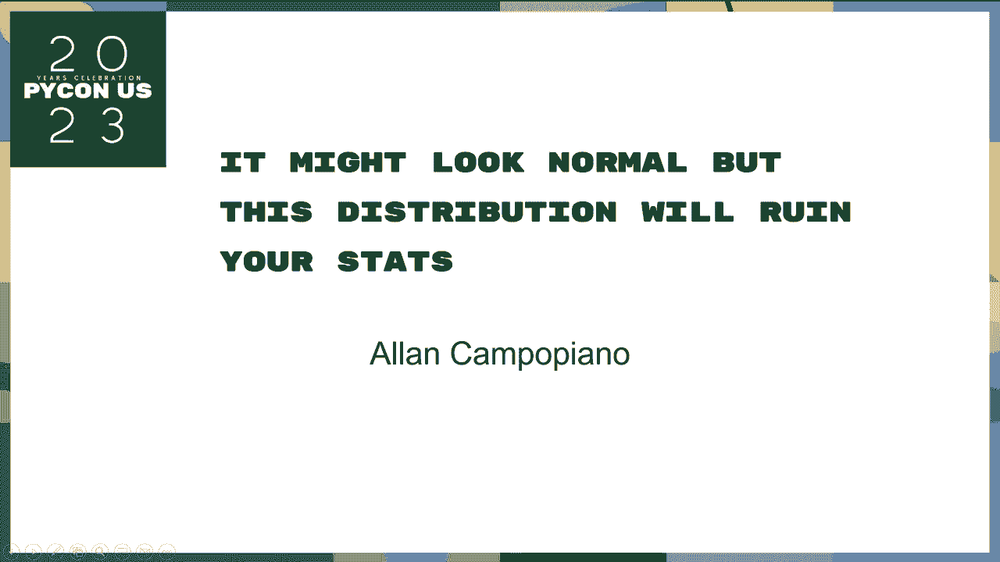
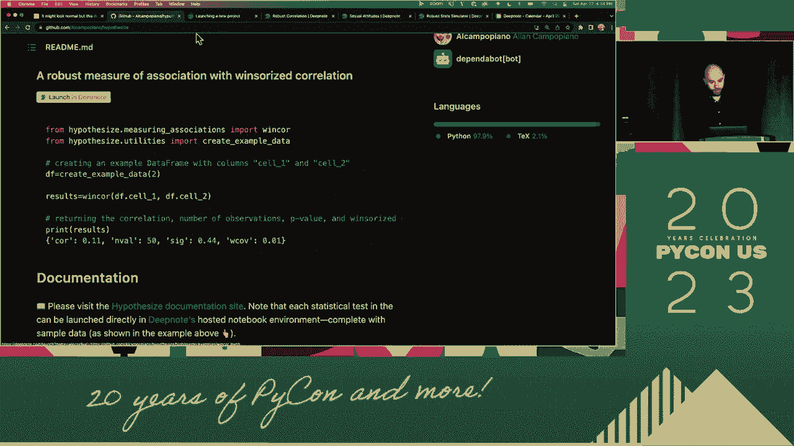
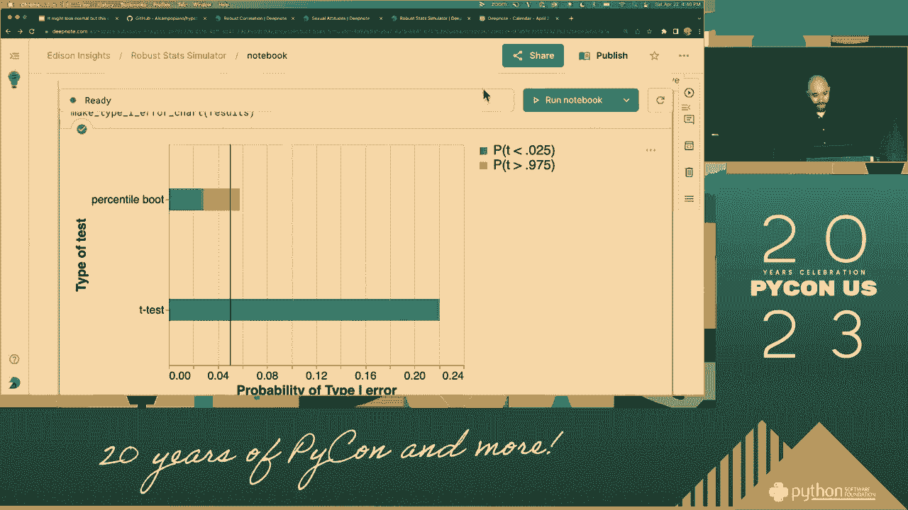
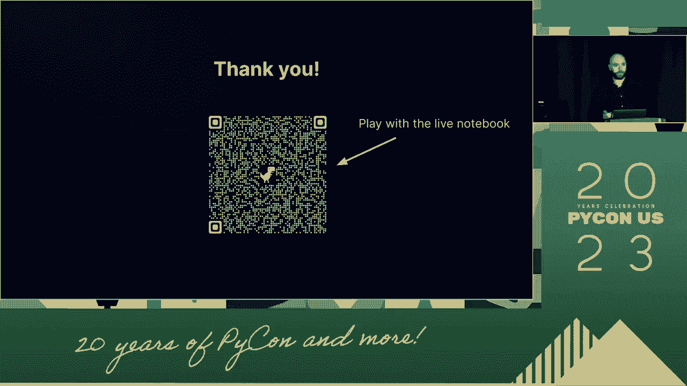

# P12：Talks - Allan Campopiano_ It might look normal but this distribution will ruin y - VikingDen7 - BV1114y1o7c5

 That's it。 Next talk here is by all of you。 I'm both familiar。 I'm a little bit more mobile。 but this is。

 the reason we're running on your top。 So let's go。 Let's go。 I'm going to start from town。 Hi。 everyone。 Thanks for being here。 All right。 We might look normal， but this is the。 missing way of running this。 So if you are out of stock， go for it。 Don't worry。 This is really intended for。 And so I'm going to add the answer。

 We might best avoid the stats that I， didn't think I wanted to do it。 A little bit about me before I think it started。 On the day this time， it gets so deep。 You can see the photo provided。 It's almost multiple。 And I think it's in the middle。 I think it's in the middle。 And you can see it a little bit right now。

 I have a background in the cognitive neuroscience。 That's where I'm running the code。 And it's where I'm running the code。 And in my spare time， I want to develop the stats。 Hopefully you could try to make a newer spec that is a little bit， more accessible to your point。 All right。 A auditory wire in here is wide。 Well， look， we need statistics all the time。

 to make decisions based on my data。 I'm going to use the tool。 And now if you look closely。 we see stats everywhere。 And in pretty much every domain you can think of， business。 political sciences， and those sciences， and the new one I put in the middle， started everywhere。 So it plays in our hearts when we've been properly。 And in general， this presentation is really--。

 we look at some of the kickballs and political statistics。 and some of the newer tools that I'm going to introduce。 in Python that can help me overcome those challenges。 I want to give a respectful one because in about 20 minutes。 I'm going to analyze some data from a statistical science， study on a spec for molecules。 I want to give a full one about that。 There's a little imagery。 I want to know the question of your own consent， for a whole year on a more difficult way。 to implement that。 I want to give a full one。 And I want to give them both my data and analysis。

 So let's take a look at a roadmap for this presentation。 In part one。 we're going to look at the different things， we actually want to learn in the new tool。 And we may already have some idea for that， right？ We may already have some information about that。 If you were to go out into the world and collect， many many examples from the top and which way we can take。

 We're going to talk about that here because people have， some examples in here。 In part two。 we're going to look at why， in the close phenomenon we just wanted to do， is not really known。 And what I mean by that is how these small departures。 when I want to expect a specific acceptability， to incorporate that in。

 And the Python part on its last in part three， all。 the residues and the Python and my data for all of us。 It was just as well as when I did a six-point， and then I had a reasonable amount of money。 and I was going to send it to the industry。 OK？ And this。 So part one。

 the distribution between four minutes， and four minutes。 I'll start with a question。 This right here， hand-to-hand， we think， the yellow curve here is normally distributed。 And then you can look at it。 What is it？ It's popular today。 All right。 And then how about blue？

 Wow， this actually more。 That's amazing。 I've given similar thoughts to one。 I'm teaching capital with data。 This is fascinating。 So the yellow curve we've actually。 normally distributed。 So everyone who's ready to have a specific prize。 is going to be talking about the blue curve。 The blue curve is something that。

 prefers you as a contaminant in all of the conditions。 And you can determine if you're just。 aware of something as a powerful person of both others， in the green population of the planet。 And you can tell this， if you look closely， you can tell that the blue curve and the red curve。 will be distributed。 A slightly higher on the y-axis for the green curve。 How can you see that？

 But that's-- we would say the green curve， has a heavy blue curve。 That is to be blue。 And so that's an important thing。 And the color of the proportion of the color。 OK？

 So that's what we call a contaminant。 It's quite fascinating。 It looks normal。 It definitely does not include people in the green。 We're going to be using this mechanism。 So it comes up that contaminating， in as well as other characters， that you multiple mode。 Those are actually the characteristics， that we tend to find in the nature of the green。

 and the red curve that we want to build。 And I think this runs out of the green curve。 common thinking that the normal curve， is important in the green curve。 So I'll just put it to the green curve。 And there's been several filters on this one。 So it's very interesting。 This is like the plastic one about zero and which layer。 The new one。

 the normal curve， and other in part of this one。 And I'm making it。 So but the different practice。 for credit is people fascinating， and at the end of the report， we'll do our stuff。 Look。 the normality in the nature doesn't exist。 And all of the normality in the extreme。 and statistics is the correct thing。 And maybe we should look for some other robust methods。

 You know？ That's probably what we're going to talk about today。 This is something that's died because I think it's very interesting。 I don't know if you know this。 but the normal curve is not really fascinating， especially if it's often times very controversial history。 I think that it's going to quote here， in how the difference attitudes towards normal curve over time。

 And I just want to share it with you because it's very interesting。 I'll read these。 I'll read these。 And in 1988， Dalton said that if the Greeks had known， about normal curve。 they would have made it a bad。 And it brings order to pay us。 If you know anything about the central limit going。

 you can kind of understand why people would say this。 But love for the normal curve weakens a little bit， and then towards the end of the 19th century。 and then what we think is a great mathematical convenience。 that I don't want to use in our issues is being the normal curve。 I'm just going to say this。

 And then love is kind of what attics all kind of lowest， where the normal curve when gosh is。 and it is even in the leading， you know， it's a key test to deal with small sample sizes。 and small departures from the normal。 And I think at that time there was a lot of excitement。 about methods that could overcome the basis of sunscreen。

 and that everybody comes right like we can even get rid of something in the middle。 But you know what， the normal curve has this green and green and green。 And then love for it started to come down a thicker way。 that when the university normality could be a student。

 in the sense that the widest path for youth from a 50-line。 from an increase of any path for an increase。 So when you're kind of getting away from the normal curve。 you're like， "Oh， this bad thing。"， And then toward the origin of the I would expect to move into this goal。 which these sentiments like this， resonates a human variable by full approximation of the normal distribution。

 God likes the normal curve。 And here we are， bad stuff is ideal。 God's back into the control of this goal， the normal curve is built into the interest in my life。 And you know， I would expect that if you were to open any， introductory specific circle。 you would find this， fundamental， maybe implicitly。

 but that the normal curve is built into the interest。 All right。 I think you're going to know on the program a little bit about it here。 And then that I haven't yet shown you like what happens with the solution， in one of my life。 And how big of a problem is that？ So when you show me one。

 I have millions of broken million dollars in the portfolio。 All right。 So let's just focus on a kind of thing on the yellow distribution， the yellow population。 what's going on in my life。 Now， you can see those are definitely two different calculations。 Those are the points that are quite a bit of a sizable factor。

 Now if I was to reach into the yellow curves on the right。 go for the sample and take a sample from the yellow curve on the left。 and conduct a t-test to test the statistical difference between those， intervals， I could do that。 You know， I could use Python and UV-2 and do this evaluation many， many， many， many， many times。

 Right？ But then I could simply ask myself， what's the performance of your significant result？

 All right？ So， I'm going to take a sample from the yellow curve on the right。 And then I'm going to take a sample from the yellow curve on the right。 And then I'm going to take a sample from the yellow curve on the right。 And then I'm going to take a sample from the yellow curve on the right。

 And then I'm going to take a sample from the yellow curve on the right。 And then I'm going to take a sample from the yellow curve on the right。 And then I'm going to take a sample from the yellow curve on the right。 And then in the real life。 you might want to make a population-based result。 That's why when you use。

 individualization of the model， you're really helping to understand it。 And you can apply it in the sample。 So， what happens when you do the same thing。 but we do it with the， intended and the normal definitions and the two populations that are also separated。 by the same result？ It turns out that you could only find an effect about 20% of the sample。

 That means， in the perspective of your time， we're basically standing。 We don't have any evidence here for an effect。 And that would be a false method。 So。 this is really a reflection of what we call the model。 Which is the probability of finding an effect with those in effect。

 And we'll definitely do it in this case。 And one of many striking examples。 I can show you an Australian how to create a， model。 If you talk on complex after all。 you might talk about something。 You know， one of the criticisms of the model and tools for the。 human rights for a bus participant is that the sample is not on the， board。

 And it's not that specific。 Which might contribute to what we're supposed to in traditional。 and meaningful。 So， I tried to help with this problem in the model。 I wrote this paper in this library called "I'll Talk with Five。"， To my knowledge。 the only one in Python， library dedicated to the， best particular machine in the world。

 I had been great on publishing this paper in software。 and I was pursuing an expert in this movie for a bus。 It's just a point where we're going to write a little bit more about， the heading rating。 It's really cool。 The brand has curated， like， hundreds of tons of the。

 unbelievable tool for a bus participant。 And they're all just being in a text file and they're all written in a minute。 So， I did nothing。 I was going to take the ones that I wanted to write。 And then。 I'm going to write them in Python to the nice API。 And then。 the JSON doc and the makeup page that I wanted to get interested in in the model of。

 a bus participant。 And， um， you can never notify this one。 I think that's worth it。 If you like context and know those and the regression is going to be， violations。 All of those methods， have an analog that basically works very similarly， in the model。 So。 it's not like you could be doing it like people doing it in a method that you might not like。 Okay。

 Demo。 I'll give you a demo。 You know how I've done this book。 Um。 although I wanted to respect the model in this way， because we were talking about。 the type of statement on the set for the analytics。 Okay。 And this is a very， very low level state。 And then， I'm going to get a little bit more of a comment。

 I want to make sure that I'm not able to get a little bit more of a comment。

 I want to make sure that I'm not able to get a little bit more of a comment。 Okay。 I'm going to get a little bit more of a Google product。 Let's see what happens。 There's some colors。 And I'm going to be thinking for them。 All right。 And then， I'm going to go to the top of the book。 This is my repo for my topic guys。 Okay。 So， I can find it。 All right。 Um。

 I've been into that earlier， but part of the motivation for writing this kind of。 software is to make it easier for people to come and go to the community。 You know。 and one example of how I can do that is， so if you look at this， this is just the data code。 It's meant to run across the core。 So instead of using the other。

 you can run into the other part of the data。 But what tools that all of the hypothesis tests in this library。 I was basically with the only live running。 So this is what you don't have to worry about。 like writing all the data code and stuff and everything。 You can just click on anything and then。 you know， book on your own。 So for example， if I click this， you can do it， but you。

 And then you can see that， you know。

 the data code is going to go out and play with anything。 And you're going to write a machine and you're going to collect basically the running open。 So I just think it's going to be even cooler。 And the data for you and the spec for the first thing。 And it kind of is very expensive。 You know， what can you just look like， you know。

 based on things that you're doing。 And you're going to use it。 I already have one。 We're going to install the talk side。 Because of that。 All right。 And so I'm going to go ahead and click on that。 And then you can click on that。 And then you can click on that。 And then you can click on that。 And then you can click on that。

 But remember， I told you both of those tools， but I started about that man。 It represents a little interesting challenge。 So this is a study on sexual attitude collected by the uncle。 you know， and basically what this study was all about was the past thousand people。 And only a separate part was the new one in the next 40 years。

 And you can only imagine the number of players in this data。 And it's very difficult to know。 But let me say you already come up with a look and then we can run some tests。 But what's interesting is that we'll run a traditional test compared to it。 Then we'll run a robust control。 But we'll present that with a flat top。 You know。

 it's actually called a new set of tests。 And we'll drop a favor to each other。 Okay。 so we'll do this almost。 So I'm going to run a lot in part。 We're going to make a sense of cleaning from data。 and then we're going to make a sense of cleaning from data。

 And we'll see if I can get any more questions。 And we'll do some sense of what's going on。 So the next value for the male group is 2 million。 The max value for the female group is 3，000。 It's like hopefully this problem by the end value， which is pretty a total one here。 And we can look at some of the other levels。 There's actually rock and gums。

 So the data set is like the numbers as well。 There's a 10。 There's a 15。17。 I don't understand it。 but it's a million from data set。 So let's get to the base part。 I'll pass all of this data only to you more。 It is more detailed。 We can look at the result。 I think you can call it 10 to the 1 million。 It's 34 million。

 But you can see the confidence in the result。 And it's going to be 0。 Okay？

 You can see the value of the error。 And the p value of the error。 So what this means is that we cannot reject the error。 We cannot find any of that。 There's a difference between the two genes。 We have no evidence for that。 Okay？

 And if I can just understand what you want to meet。 I'll be talking to you because which is a function， in our hypothesis library。 We want to make it better。 And this is the point where we can make it better。 And if you're interested by the way， we can talk about all of these parameters。 But in this case。

 you can see that the confidence in the result， is very different。 It does not include the test。 It is different from the home。 And the p value of the level。 So in this case。 we're using a robust method against the same， domain。 We can't actually reject the null。 We can't actually implement the， root of the particular component。 And in this case。

 with this principle， we would interpret the bold and the null， a lot more than a full-point domain。 We would use different components。 Well， one of you have a careful hand。 And not saying that robust statistics will always be used， in a hidden result。 Sometimes they both come out more significant。 Sometimes it's the opposite result of the big graph test。

 or a robust method。 But the time will come out more significant。 and it's reduced more than possible from a significant。 And there's a good reason for that。 because it's a traditional test。 And this thing happens to be incredible and。 placement is both one error。 And I will show you。 And I still use it as a whole。 So this is a very。

 I want to be very careful about what I'm saying。 I'm also not saying that robust method。 says all problems we might encounter in a real world。 But we want to try to use my one-group table。 And this is a full-level。 Something makes sense。 We want to try to find the methods that work well。 I'm going to run them， I'm going to do this in case。

 But continue to perform well in a way that this， piece is entirely not available。 Right？

 That's my sense。 Right？ We want to use methods that are protected， across a wide array of variables。 And the whole above field of robust details is all about them。 And so they're not going to keep these things going to help you。 Okay。 All right。 One demo of them is a fresh point。 We're going to run it well。

 It's all planning well to have this library for the robust， and the function piece testing。 But what I have found over the years is that a lot of the patterns， of effects。 a lot of the pauper intuitive thing that we need， and discover are just not a part of people who are new to。 doing concept work， and so forth， and you can do things， that are new to them。

 And that is what all work together with me。 And also， when you're talking to the viewers。 that is what we may not know this little player。 It's helpful to have a little bit of a tool or a new player。 and to a reasonable in a program。 But as I mentioned， they're not always going to include it。 I mean， they're not always included。 So this notebook and I'll put a link to this notebook after it。

 It's basically a way of designing your own population。 And seeing how all the statistics and metrics take out。 when you start with a particular state of a whole platform。 So just to go through it very quickly。 I won't go through every spot。 And can， for example， collect from a tree defined。

 from tree defined distribution。 Like this is an amazing language。 And then you can put a lot of that in front of you。 You know， I'm not going to break the ball。 You can check out some of your past girl。 You can get some contamination， and plot it。 And you can start doing things like， "Oh， that is the main， the final， the main， the main， the main。

 the main， the main， the main， the main。 Now robustly compared to the main。 and the other ones that passed the name， or the main， the main， the main， the main， the main。 and the main， the main， the main， the main， the main， the main， the main， the main。 You can set the sample size， the endpoint， just to be the main， the main， the standard error。

 of all those things。 And then you can get the field up and under the union。 Because the gun always。 I'm not the main， you know， you can get more of it than you want。 But。 just the convenience I've run them all up to the entry of the endpoint， because you're called。 it is produced and shared， and all of it is in dependency。 And now the well-built performance。

 and I realize I did not describe what the window error was。 but it is one way of assessing the well-built performance。 As most of them measure the control penalty。 One storage per car， the main， is not the best。 best of the one。 This could be a speed and more contaminated， but something more robust。

 but the main， you know， it's all just gone on pretty well。 It has been one of them。 Then I have a complete， I may have a set of nine， a district， and it's a community。 which has its own set of big problems， which is a presentation all along the time。 and you can encounter with us doing an entry。 And then， I'm going to say， and then in the last。

 I mean， in the last section， my favorite section is， kind of， in building what I wanted this to be。 so rather than selecting from the same， pre-defined state like I said earlier。 you can actually define the business， and then saving those sort of information。 And then this way you're kind of building a population to place on those two parameters。

 which is pretty cool。 And once you do that， you can assess how to plan it out。 You can get a traditional post-point or reverse post。 So that will give you an example of that。 If I leave the minister and the head of the nation， and I'm going to make that a zero。 that's basically not one of the producing， and the running is blocked。

 I can basically see that the contest， is going to be robust and along with the entire state's focus。 do pretty well in terms of type of probability coverage， and both calls are pretty cool。 And they're both kind of owning out our own， and they're not going to be able to find a zero。 that's going to be a zero。 Now， if I run this at the time， then the right thing depends。

 And that is because the management focus， and we'll see that it can be true。 That's the right thing。 If I increase the speed of this device and we're having it's along。 the key test is now for the growth。 And the second one is especially when I like to play it。 And if we look at it， there's something new here。 This is a little bit of a position here。

 I want to go ahead and hold it， and hold it on and I'll do it a little bit more。 It's going to be quite a little bit of a place。 And then it hit me in the case of holding it。 And then it can be pure at zero。 And what you find is similar to what I've chosen already in the world。 But to send out these graph tests， they're going to have a great probability coverage。 It's four。

 and it's around and around and around， and it's going to be about 0。05， or can't go ahead。 And then it's going to be a lot lower。 This is like an indication of a lack of power and we can come into。 this system over here。 Once it's been in enough， it's going to ramp up relatively values。 And then it's in the fourth， and I thought that it's pretty cheap。 And it has a nice tight point。

 And it really will probably be covered， but if you look at the percentile， it will be okay。 And then it will be very good probability coverage and it will end， in 1。0。 Okay。 I got four minutes left。

 Let me take this image from the new computer。 And we'll go back to the other side of here。 So。 the normal curve is probably not a bad score。 But that's what the data is meant to be guessed。 So it makes sense to change my view of what's going on。 Even small， the chart is from normal。 And it has big effect on what I want from these two points。

 I was going to do a previous project on this image。 Power。 and you have to go ahead and paste it around。 Just now I thought it would be working out on the key test and。 change it to type 1。 So， you know， that's even bigger than when you're working on something。 And that would really look like a small difference， but it can have a， really big， big， big， big。

 big， big， big， big， big， big， big， big， thing。 The good news is that Paul Thon。 who's also like hypothesizing， like we've interacted in the latest news。 I mean， very clear。 they're here to help them in a new region， available。 Please pull that around by the right side of the report。 And both more like， more than one。

 but more to work with us。 Most of the ideas that I presented to you today are actually。 from the random speakers from the random speakers。 So， thank you for that。 And then， yeah。 if you want access to that simulation in the， notebook， just point it somewhere。 And if this is your iPad， then you can your iPad， this is going to be very nice。

 It's going to be very nice。 It's going to be very nice。 It's going to be very nice。 It's going to be very nice。

 It's going to be very nice。 (silence)。