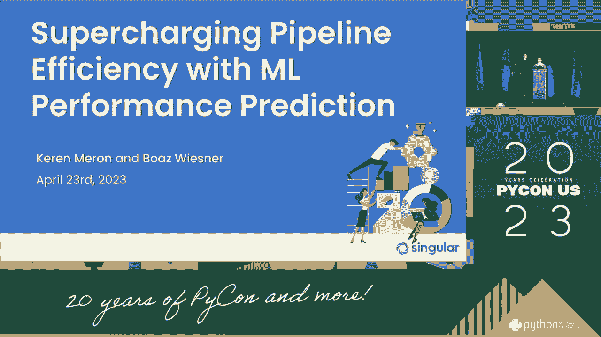
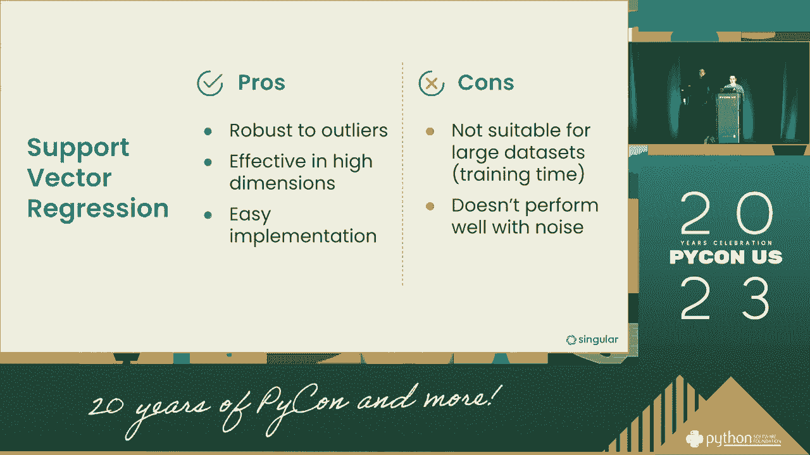
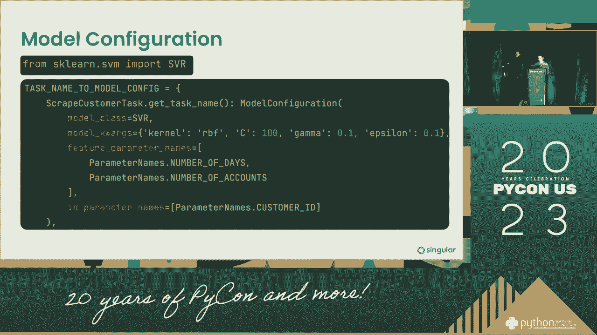
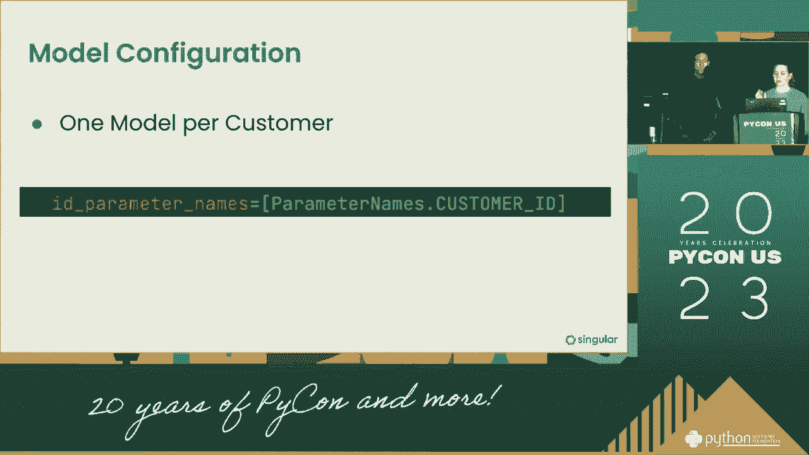
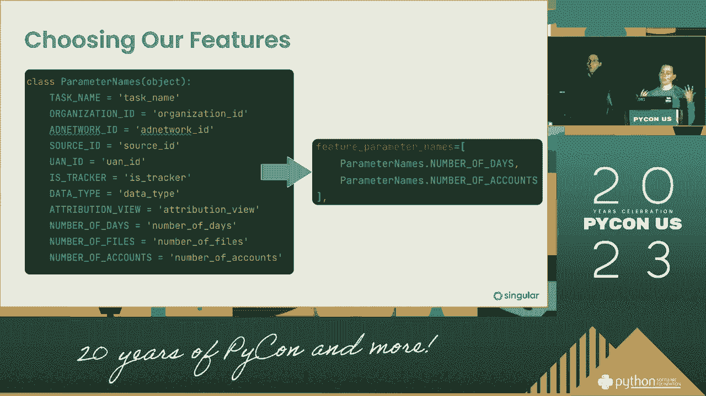
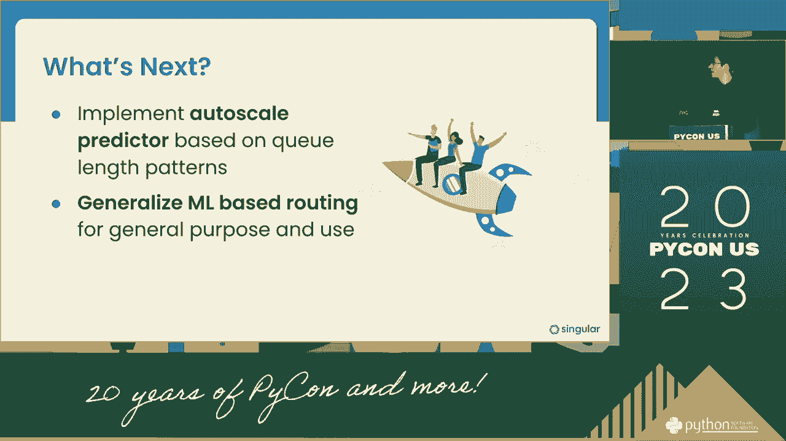
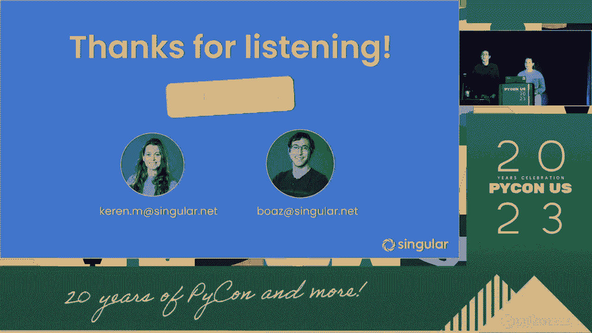

# PyCon US 2023 - P19：Talks - Boaz Wiesner, Keren Meron_ Supercharging Pipeline Efficiency with ML Per - VikingDen7 - BV1114y1o7c5

 Okay， we are in this fund now to start our second to last talk of Python 2023。

 This also being supercharging the Python efficiency with no performance prediction， with Boa。

 and Rudner， and Kevin， and they will be taking questions after the fact。 So if you have questions。

 and if you have questions， please line up with the microphone right here in the center。

 And that's the question。 So if you're giving me a one round of applause to our speakers。

 Thank you very much。 So everyone， is there all of you are going to have some of your questions at all？

 Right， I'm in the middle of the beginning， and I'm in the middle of the middle of the middle of the middle。

 And I'm in the middle of the middle of the middle of the middle of the middle。

 So today we're going to talk about how we should return our Python efficiency。

 and then we should learn a little bit more about this。 So my name is。

 and I'm talking about the middle of the middle of the middle of the middle， and I just got back in。

 but I'm not the middle of the middle。 Very good。 And I'm going to go ahead and put that off the generic standard。

 I'll start with the third， and today I'd like to thank them for their first one。

 And it's three months ago。 Thank you。 Thank you。 Thank you。 Thank you。 Thank you。 Thank you。

 Thank you。 Thank you。 Okay。 So in the middle of the middle of the middle of the middle。

 we're going to try to show you what's going to happen in the middle of the middle。

 So our clients are continuing to work in this community。 We're going to call the marketing videos。

 so on the other hand， we're going to call it all the work。

 And we can write that all the way through one， and then we can do it all the way through the middle of the middle of the middle。

 So in the middle of the middle of the middle， we can just check。 So I've come in inside。

 so I've got a million， so on the middle of the middle of the middle of the middle。

 So I've got to say Python， which is going to make a difference， and then combining the video。

 And then obviously， so we can also call it all the marketing efforts。

 and then we'll show you how to invest in this， all of the options。

 So in the middle of the middle of the middle， we can just check。 So in the middle of the middle。

 we can just check the results。 So in the middle， we can just check。

 And then all the way through the middle of the middle。 So we can also check。

 And then all the way through the middle。 So we can also check the results。

 And then all the way through the middle of the middle of the middle。

 So we can also check the results。 And then all the way through the middle of the middle of the middle。

 And then all the way through the middle of the middle。 And then we can also check the results。

 And then we can also check the results。 And then we can also check the results。

 So in the middle of the middle of the middle， we can also check the results。

 And then we can also check the results。 And then we can also check the results。

 And then we can also check the results。 And then we can also check the results。

 And then we can also check the results。 And then we can also check the results。 So in the middle。

 we can also check the results。 And then we can also check the results。

 And then we can also check the results。 And then we can also check the results。

 And then we can see the results。 And then we can see the results。 And then we can see the results。

 So we can see the results。 And then we can also check the results。 And then we can see the results。

 And then we can see the results。 And then we can see the results。 And then we can see the results。

 So we can also see the results。 And then we can see the results。 And then we can see the results。

 And then we can see the results。 And then we can see the results。 We saw it in the results。

 You notice that the results of a test by light cut。 And you can see the results。

 And then we can see the results。 And then we can see the results。

 It's going to be very tough for them to suck。 And you can see the hands and the arms。

 And then saw it and saw it。 So they affected by bigger cuts。

 Because first cut would otherwise finish on。 And then you can see the results。

 So I'll show you how to do this。 And then we can see the results。 And then we can see the results。

 And part of this is that we've said， since then we've been treated。

 And part of this really is not a terrible， terrible situation。 So we can see the results。

 And then we can see the results。 And then we can see the results。 And then we can see the results。

 And then on the top of the results。 More than a gallon of water， it's going to be。

 And we can see the results。 And then on the top of the results。 And so it's going to be very。

 very simple。 And so in terms of what we did， we realized that all the results are already。

 sort of small and simple body communities。 For example， the other test from the results。

 that we've been using in the past， both in the findings。 And then we already saw the results。

 And then we went along。 And then we went through the results。 So in family lives。

 we're going to need to do， a little bit more of the results。

 And so we're going to be able to put a straight up attack。

 And then we can see the right path in the heavy part。 And then the better of things。

 we can see the most of the experiences and problems。 So for example。

 one of the things we've been doing， is out there。 And we talked more about that in a statement。

 Okay， but how would you list？ And how would you send the results？ And then you can see the results。

 Well， you can tell me if you follow almost the statement。

 and follow the statement and then you can tell。 So I get the right of the menu。

 And then obviously the whole test will have the same， intelligence intelligence。

 So I will also control because obviously， we've just had a very long list of similarities。

 But in the end， we also saw these problems。 And we said that already。

 we've had a lot of possibilities， and a lot of possibilities。 We should show。

 in making that decision， and going around in the same possible case today。

 Another example of the analysis from the computer is that， when it came to that result。

 there were a couple of things that were going to happen。

 And the output of one test will be the interest of it。 Next step。

 The values are something which all of us have installed。 And you know why。

 when you send out the data， you'll see that it's known as "service problems"。 And I would say。

 we obviously will be out there， into the talk。 We'll have very limited effects on our own presentation。

 So how we saw this discussion is in some of our results。 So we did this idea to see it。

 So I decided on this as well to see which one we gave us， to what we allowed。 And in fact。

 it was famous in the world， we said that we had a statement that we had a statement that we had。

 however， to the super-time really relevant to this。

 to the 6th and then what it does is try to find a statement， and then to the 1st and 6th。

 which actually did not stand on the other one。 So the sovices here。

 I got a little bit out there to say that we didn't have a little bit of a statement。

 It's so easy to say that this is where in fact this is where it's actually going to stand。

 So I don't know if I'm not just saying a little bit of anything。 On the other one。

 in the context of what we are， I don't have to tell you to go for what we're doing。

 That's because we're saying that we are going to have a statement。

 and we believe in final and then what it does。 So tonight， I think， to be example。

 is a broadening approach， where it's obviously something that we're not having often and then we're going to get performance。

 not in the survey。 So that's why I want to say it。 Getting to know what we said is our last answer。

 we just need one "x" in the sample。

 We just need to know if we're going to take a second， it's not a single one。

 it's going to be the next one， it's going to be the next one。

 This is where we're still at the same time， we're still at the same time。

 it's going to be the next one， so we're going to take a second。

 So I'm going to turn it into a similar model， to the future， which I remember。

 even a little bit more。 And I think I'm going to use this system。

 so this means that we can do a model for a second。

 Now we did slide out， slide it into a one-bit model， or obviously， we're still at a big goal。

 but I think it's not so good in the results， because we can see how important it is to be very different from the schedule。

 and that's why we're still at a large level， so we're going to need to know what it's going to be。

 So I'm going to do the model， or the details。

 Well， inside of our world， we're all at the same time。

 so we're going to have a couple of different models。

 and then we're going to have a couple of different combinations， getting them to a model。

 so we're going to have a little bit more， so we're going to have a little bit more of a thing。

 We're going to have a little bit more of a big goal。

 so we're going to have a little bit more of a little bit more of a little bit more of a thing。

 so we're going to have a little bit more of a little bit more of a thing。

 So we did put a little bit more of a model， so we're going to have some time。

 and then we're going to have a little bit more of a problem。

 Then， after all， I was trying to say， "Not filled with without。"， And we will have and recipe。

 but we will not be ready for this。 Then， we found out that we did the ball about $3。50。 So， so now。

 we're gonna build clients by well， that's what we do。 We will be just using policy process。

 and to try to make a sense of tools for someone who they're going to call。 And then。

 if you're doing similar and staying at $4。50， you're gonna run fast through the process of number of 10。

 So， now， we will remember the points in this example。

 This is why we talked about the things that we have learned around the time。

 We also have the combination of the time that you're thinking。 And in this way。

 we can really build a policy in this way。 So， that is why it is really safe to think about doing any work of the time。

 but this is still time for thinking that it builds the time that you're thinking about。 So。

 we're essentially telling you to explore how to think for the model。

 and not really remember the context。 The first thing we do is we will also make decisions of the time and do。

 To follow the question that I've been told you in numbers。

 that if I can only remember the answer to that， you can say that you're gonna remember the number of the time that you're gonna remember。

 And then， that's why we're getting a new link to it once we leave it to both。 So， next。

 we go to the next model。 In fact， we can also try to kind of slide in and tell you how to expand our。

 capacity to be supported by the time。 So， to follow the question that we can remember。

 we're going to call it the $1，000， or we can also have $1，000 in the report to the $1，000。

 And if we're doing operations and things like that， we can do something like that。

 so we're going to think about something to slide in and do。 So， finally。

 we're going to make the new link to it and know that it's expected to go to count。

 which we're going to call it for a long time。 So， to find some sort of， never。

 we can't really know what kind of thing we're going to call。 We're going to call it the $1，000。

 but we're going to call it the $1，000。 So， when we play in the letter。

 we're going to say that we call it the $1，000， and then we can say that we're going to count。

 And then， instead， obviously， it's gonna be a long time。 And then， we can do that。

 and then we can do that， and then we can do that， and then we can do that， and then we can do that。

 So， now， I want to ask you， how is it going to help us to understand the model。

 and then how did we actually need， potential to see what we're going to discuss in order to improve our scientific history？

 Cool。 41， that's so awesome。 That's kind of cool。 I know， and the first thing is， most important。

 is that， when I do a model， that is a big model。 This is incredibly innovative。

 and I just want to add all of it， because that's just really throwing down all of our tests。

 That is our entire training of the test for any of the structures that has to happen in the test for instance。

 and this is from a very different problem。 And we're looking at this。

 I have to have two theory of a graph。 I'm going to work with them， and check those tests。 So。

 the first thing happens is that we need to have these stories passed。

 We have a project called a test in particular， and it's just a complex thing called a test。

 It is a simple， complex thing called a test。 That was a relevant metadata for the test。

 It is like the duration or memory。 This is what the actual data used to say。 So， then。

 it takes that idea， and it takes it to something like three。

 It takes everybody that's an object for it。 And this also has an example called a test in。

 It allows you to use a test while clearing， and run while clearing over data。

 so you can see it's a test。 And when you go right back。

 you might not be able to make it to people who are looking for a test。

 And it's only predicted to be a runner。 This is a story test that we run。

 It's currently one of the best， one of the best， four-inch customer。

 And this is a responsible for actually three of them， including the model。

 And the way that it works is that first， it's clear it is to find a three-inch user。

 And it's clear that it's a good step for a test and build a data set out of it。

 But then it takes the existing model and takes the new data。

 and it brings the new model and you have all the updated information。 So， in each way。

 it's something changes or something that becomes heavier instead of white。

 then it takes a couple of things to run a test for a lot of things。 Now， finally。

 it wasn't a particular thing， but it's gone for three years。

 And it's higher model and two years later。 And it's a smaller procedure。 Then a materialized model。

 which is pretty small， and actually straight into the value of a product。 So you can see the key。

 the key that you customize in it， and the value that you make higher scale and like models。 Now。

 the last thing to look at is the salary value。 The following value is the bid of salary code that runs every time that I'm going to have to receive。

 And the price of the price， the credit card， the credit card， the value that you have。

 And then zero-filtration code there， but all it does is just the card。

 It takes the customer out of the test， takes the model from right。 And runs the test。

 then there's three models， and this is the result of the model。

 So that the right cost by the right is $10。50。 And the right key is the right key， or the right key。

 which has better creative workers than a computer。 Now， finally。

 for all the specific links and model models， we'll be able to make sure that they're accurate。

 So you can see how these predicted rates are known。

 which is the correct to the rate of lowering using RNN for a rate in a square error。

 If you all will get too high， we're alerted to the rate of the investment。 So， when you go work。

 right， we have a split R， it's a light and heavy sheet。 So we have a dedicated salary worker。

 which is a piece of tape。 And in that way， when you solve a problem。

 your balance has filled up and bring the rate to our customers。 So that's great。

 And you decided to start looking a bit more consistent。

 You start talking to me a bit about all of the data。

 So all of the money that I always do is use these data to keep the cash and the fees from the record。

 So， I can use simple class calls to find a bunch of web servers， and then load balances。

 And then if I run a lot of the money on the box and run a load， then all of the sudden。

 with this product， you can send out the serial web servers to send them a load of money。 Now。

 it's about $10。00。 Now， he's selling these two-hour number of workers up in damage。

 which is one of the things that I have to do。 So， in case you're doing the actual work。 Now。

 how do you bother with the policy？ Well， if I could pass it on， I'm talking about time。

 I'm in the word "I'll be sharing a bunch of copies。"， And I got the logit reasons。 So， first of all。

 it reduces to， and it's time to go up and it's time to go up and it's time to go up。

 And then it's more work for it to be decreased。 So。

 I've decided to make a decision to make a decision to make a decision to make a decision to make a decision。

 So， I think it's a good job。 So， I'm running a single-line infrastructure。

 And I think that's one job to start working really hard at one point to solve the other one's decision。

 And then， you know， one point to the worst one。 Another one will work really hard。

 but I'll first go ahead and finish it。 So， I think it's both a one and one to send them a line。

 I think it's about to talk about it in the first place。 I was going to let you do that very quickly。

 And finally， there's no language in this country。 So。

 we've all been there in the middle of the night。 You see the time， you get paid to make up 3 a。m。

 You put the plus button in the third place。 All of the time it's all set。

 I'm not going to be making it。 I'm not going to be making it。 Okay。 So。

 our story in creation theory is a little bit different than it's a law study。 First of all， that is。

 you know， this one is two-range lectures。 That's what depends on the lower of our system， right？

 If you're still in the C-， or the lower of our infrastructure。 That's what it is。

 It's only called a perspective or short call。 Now， in our data pipeline。

 we have an actual number of people that don't want to think what's wrong， or not。

 If it's not just one， two， or three hours to run it。

 then it's one of my skills in order to scale them up。 Because then we mean so， two。

 three hours at work。 And now it's done。 So， I mean， all of the time only we work with was this。 But。

 you know， both of these things are like， you know， the test。

 And one of them is a percent of our pipeline is one。 And it's all still， right？

 It's kind of a pipeline。 It's a pretty awesome。 Now。

 what's it to think about the architecture needed？ So。

 all it's going to be a salary on two dimensions。 And it mustn't take from four dimensions before it's off of five all of those。

 It is possible for all that from five and then to five。 In all of our environments。

 one cloud or a container is one's library worker， which is considering tasks from two。 And。

 as I mentioned， you want to see a base on two limits。 If you want to see all of it。

 you're sort of a data dog， so you can fast monitor these things。

 We provide the data dog's infrastructure agent， which features the students from data dogs。

 and it's possible to provide you through the data dog method for your computer or computer information。

 So， CRD units are the Kubernetes data， which says， "I can't over that。"， So。

 we provide you with the data dog。 Now， then all it could be is a task that has been stored on the cloud or scale。

 And that's where you need to be。 And all it could be is on two-one dimensions。

 The last thing to the puzzle is the cluster of a scale。 It was not the title of a scale。

 it had two new pods。 Now enough， I'm going to want you to tap into one of them。 And， of course。

 the auto scale of a scale is just to build up a new AWS instance to run。 And just to say， it works。

 We didn't actually mention these by auto scaleers。

 And those were a talk of I and noticed that it's a new thing to do with us。

 And this is because you're always trying to be very spicy。 There you go， up in data loss。

 And that'll make you auto scale or go up in data loss。 And if you want to be able to do so。

 you just think out of it， you can really narrow the window and make sure everything works more effectively。

 And that's why we need to see the number of one pods。 And it looks here for a way to do it， right？

 The number of the two goes up， the number of one pods goes up。 The number of one pods goes down。

 Another really interesting thing to look here is that you have to go up first。

 But for the number of one pods goes up。 This is the only thing that's happened in the actual pod。

 And it's kind of a constraint of the digital thing that's going to be like you。 But it does work。

 And it's pretty fun to do。 And last but definitely not least。

 we're waiting for the people in the pod here。 Our pod talk's in the data。 So， in the data area。

 actually I think it's what's about in the data space。

 We're just going to see where it can be tested。 And that they offer a splash of the pod。

 which is one of the traffic applications。 We're going to take it up。

 Your engine is going to be a four-year-four。 But now， we're going to take it up。

 We're going to take it up。 We're going to take it up。 We're going to take it up。

 We're going to take it up。 We're going to take it up。 We're going to take it up。

 We're going to take it up。 We're going to take it up。 We're going to take it up。

 We're going to take it up。 We're going to take it up。 We're going to take it up。

 We're going to take it up。 We're going to take it up。 We're going to take it up。

 We're going to take it up。 We're going to take it up。 We're going to take it up。

 We're going to take it up。 We're going to take it up。 We're going to take it up。

 We're going to take it up。 We're going to take it up。 We're going to take it up。

 We're going to take it up。 We're going to take it up。 We're going to take it up。

 We're going to take it up。 We're going to take it up。 We're going to take it up。

 We're going to take it up。 We're going to take it up。 We're going to take it up。

 We're going to take it up。 We're going to take it up。 We're going to take it up。

 We're going to take it up。 We're going to take it up。 We're going to take it up。

 We're going to take it up。 We're going to take it up。 We're going to take it up。

 We're going to take it up。 We're going to take it up。 We're going to take it up。

 We're going to take it up。 We're going to take it up。 We're going to take it up。

 We're going to take it up。 We're going to take it up。 We're going to take it up。

 We're going to take it up。 We're going to take it up。 We're going to take it up。

 We're going to take it up。 We're going to take it up。 We're going to take it up。

 We're going to take it up。 We're going to take it up。 We're going to take it up。

 We're going to take it up。 We're going to take it up。 We're going to take it up。

 We're going to take it up。 We're going to take it up。 We're going to take it up。

 We're going to take it up。 We're going to take it up。 We're going to take it up。

 We're going to take it up。 We're going to take it up。 We're going to take it up。

 We're going to take it up。 We're going to take it up。 We're going to take it up。

 We're going to take it up。 We're going to take it up。 We're going to take it up。

 We're going to take it up。 We're going to take it up。 We're going to take it up。

 We're going to take it up。 We're going to take it up。 We're going to take it up。

 We're going to take it up。 We're going to take it up。 We're going to take it up。

 We're going to take it up。 We're going to take it up。 We're going to take it up。

 We're going to take it up。 We're going to take it up。 We're going to take it up。

 We're going to take it up。 We're going to take it up。 We're going to take it up。

 We're going to take it up。 We're going to take it up。 We're going to take it up。

 We're going to take it up。 We're going to take it up。 We're going to take it up。

 We're going to take it up。 We're going to take it up。 We're going to take it up。

 We're going to take it up。 We're going to take it up。 We're going to take it up。

 We're going to take it up。 We're going to take it up。 We're going to take it up。

 We're going to take it up。

 We're going to take it up。 We're going to take it up。 We're going to take it up。

 We're going to take it up。 We're going to take it up。 We're going to take it up。

 We're going to take it up。 We're going to take it up。 We're going to take it up。

 We're going to take it up。 We're going to take it up。 We're going to take it up。

 We're going to take it up。 We're going to take it up。 We're going to take it up。

 We're going to take it up。 We're going to take it up。 We're going to take it up。

 We're going to take it up。 We do also make sure we have a bullet on the phone and phone。

 And something goes wrong。 And we'll see if our task is actually going to --。

 If some -- if our task is going to go wrong， they're going to run the phone。

 And they're going to find a decision。 And we'll see in the later thing。 And that's why it's like --。

 So then you can do drugs。 And you can see the phone rather than such a special as code。

 And then you can see the phone。 So we need that option。

 And it's the opportunity for the opportunity for the opportunity。

 So it's given that you can think of the great things。 So after the need of the decision。

 it's not the most great， but the last thing is to ask the brain of those people。

 And just read up on it and say， "You can find a decision。 Don't like it。"， And all the other things。

 So it's --， And the difficulty is part of the opportunity， that you can find。

 So that you can find a little bit of the --， Yeah。

 so the opportunity that you like wants to get in your mind， and it's in your mind。

 And it's in your mind。 And it's in your mind。 And it's in your mind。

 And then you want to see the more。 And then you want to see the more。

 And then you want to see the more。 So you can find the more。 And then you want to see the more。

 And then you want to see the more。 And then you want to see the more。

 And then you want to see the more。 And then you want to see the more。

 And then you want to see the more。 And then you want to see the more。

 And then you want to see the more。 And then you want to see the more。

 And then you want to see the more。 And then you want to see the more。

 And then you want to see the more。 Oh， I want to go with the most。 Because you have to see the more。

 And you have to see the more。 And you have to see the more。 And you have to see the more。

 And you have to see the more。 And you have to see the more。 And you have to see the more。

 And you have to see the more。 And you have to see the more。 And you have to see the more。

 And you have to see the more。 And you have to see the more。 And you have to see the more。

 And you have to see the more。 And you have to see the more。 And you have to see the more。

 And you have to see the more。 And you have to see the more。 And you have to see the more。

 And you have to see the more。 And you have to see the more。 And you have to see the more。

 And you have to see the more。 And you have to see the more。 And you have to see the more。

 And you have to see the more。 And you have to see the more。 And you have to see the more。

 And you have to see the more。 And you have to see the more。 And you have to see the more。

 And you have to see the more。 And you have to see the more。 And you have to see the more。

 And you have to see the more。 And you have to see the more。 And you have to see the more。

 And you have to see the more。 And you have to see the more。 And you have to see the more。

 And you have to see the more。 And you have to see the more。 And you have to see the more。

 And you have to see the more。 And you have to see the more。 And you have to see the more。

 And you have to see the more。 And you have to see the more。 And you have to see the more。

 And you have to see the more。 And you have to see the more。 And you have to see the more。

 And you have to see the more。 And you have to see the more。 And you have to see the more。

 And you have to see the more。 And you have to see the more。 And you have to see the more。

 And you have to see the more。 And you have to see the more。 And you have to see the more。

 And you have to see the more。 And you have to see the more。 And you have to see the more。

 And you have to see the more。 And you have to see the more。 And you have to see the more。

 And you have to see the more。 And you have to see the more。 And you have to see the more。

 And you have to see the more。 And you have to see the more。 And you have to see the more。

 And you have to see the more。 And you have to see the more。 And you have to see the more。

 And you have to see the more。 And you have to see the more。 And you have to see the more。

 And you have to see the more。 And you have to see the more。 And you have to see the more。

 And you have to see the more。 And you have to see the more。 And you have to see the more。

 And you have to see the more。 And you have to see the more。 And you have to see the more。

 And you have to see the more。 And you have to see the more。 And you have to see the more。

 And you have to see the more。 And you have to see the more。 And you have to see the more。

 And you have to see the more。 And you have to see the more。 And you have to see the more。

 And you have to see the more。 And you have to see the more。 And you have to see the more。

 And you have to see the more。 And you have to see the more。 And you have to see the more。

 And you have to see the more。 And you have to see the more。 And you have to see the more。

 And you have to see the more。 And you have to see the more。 And you have to see the more。

 And you have to see the more。 And you have to see the more。 And you have to see the more。

 And you have to see the more。 And you have to see the more。 And you have to see the more。

 And you have to see the more。 And you have to see the more。 And you have to see the more。

 And you have to see the more。 And you have to see the more。 And I think so。 Thank you very much。

 Thank you。 Thank you。 Thank you。 Thank you。 (keyboard clicking)。

